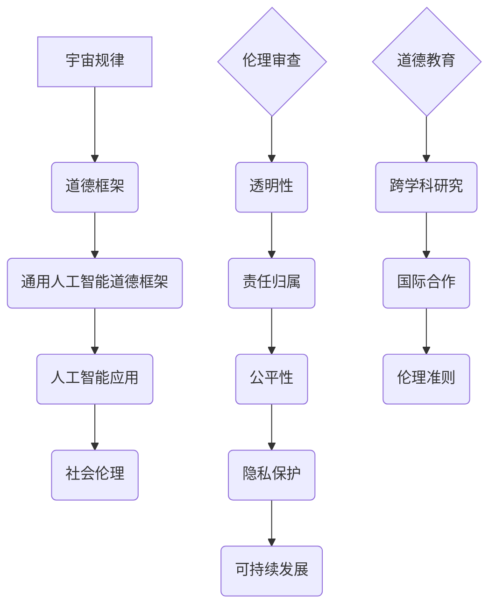

                 

### 《宇宙规律对通用人工智能道德框架的启示》

> 关键词：宇宙规律、通用人工智能、道德框架、人工智能伦理、跨学科研究

> 摘要：本文旨在探讨宇宙规律对通用人工智能道德框架的启示，通过分析宇宙演化规律、平衡和谐、动态稳定性等核心概念，以及道德哲学、伦理实践和多元化视角等道德框架理论基础，揭示宇宙规律与道德框架的深层次联系。文章进一步探讨了道德框架对宇宙规律的理解、引导和适应，并基于此提出了通用人工智能道德框架的设计与应用方案。通过对宇宙规律与道德框架的融合前景及全球人工智能伦理治理的展望，本文为未来人工智能发展提供了伦理准则和跨学科研究的方向。

---

# 第一部分: 引论与概述

## 1.1 引言与背景

在当今科技飞速发展的时代，人工智能（AI）作为新一代技术革命的核心，已经渗透到社会的各个领域。然而，随着人工智能技术的不断进步，其伦理问题也逐渐凸显出来。如何构建一个既符合技术发展需求，又具备高度道德约束力的通用人工智能道德框架，成为了人工智能研究领域的重要课题。

宇宙规律，作为自然界的基本法则，为我们提供了对世界运行规律的根本认识。这些规律不仅在科学研究中起着基础性的指导作用，而且在哲学、伦理学等领域也具有重要启示。因此，将宇宙规律引入到通用人工智能道德框架的构建过程中，不仅能够为我们提供新的思考角度，还能够为解决人工智能伦理问题提供有益的启示。

### 1.1.1 书籍主题的重要性

本文主题《宇宙规律对通用人工智能道德框架的启示》具有重要研究价值。首先，随着人工智能技术的快速发展，其对社会、经济、文化等领域的影响日益显著，如何确保人工智能的发展符合人类的道德和伦理标准，成为了一个亟待解决的问题。其次，宇宙规律作为自然界的基本法则，其蕴含的哲学和伦理观念为我们提供了对人类行为的深刻反思和指导。因此，将宇宙规律与通用人工智能道德框架相结合，有助于构建一个更加科学、合理且具伦理约束力的人工智能道德体系。

### 1.1.2 研究目的与意义

本文的研究目的是探讨宇宙规律对通用人工智能道德框架的启示，通过分析宇宙规律的核心概念和道德框架的理论基础，揭示两者之间的联系，并在此基础上提出通用人工智能道德框架的设计与应用方案。具体来说，本研究旨在：

1. 深入理解宇宙规律，特别是其核心概念，如宇宙演化规律、平衡和谐和动态稳定性等。
2. 探讨道德框架的理论基础，包括道德哲学、伦理实践和多元化视角等。
3. 分析宇宙规律与道德框架之间的深层次联系，探讨其相互影响和启示。
4. 基于宇宙规律和道德框架的理论，提出通用人工智能道德框架的设计与应用方案。
5. 探讨宇宙规律与道德框架融合的前景，以及全球人工智能伦理治理的路径和策略。

本文的研究意义在于：

1. 为人工智能伦理研究提供新的视角和理论依据，促进人工智能道德框架的完善和发展。
2. 为人工智能技术的发展提供伦理指导，确保其发展符合人类的道德和伦理标准。
3. 推动跨学科研究，促进宇宙规律与人工智能伦理学的交叉融合。
4. 为全球人工智能伦理治理提供参考，推动国际间的合作与协调。

### 1.1.3 研究方法与结构

本文采用的研究方法主要包括文献综述、理论分析和案例分析。通过对相关文献的深入分析，本文将梳理宇宙规律和道德框架的核心概念和理论基础，探讨两者之间的联系和相互影响。在此基础上，本文将结合具体案例，分析通用人工智能道德框架的设计与应用方案。

本文结构如下：

1. 第一部分：引论与概述，介绍研究背景、目的、意义和研究方法。
2. 第二部分：宇宙规律概述，详细阐述宇宙规律的定义、人类对其的探索和科学基础。
3. 第三部分：通用人工智能道德框架，分析道德框架的定义、必要性、局限性和发展趋势。
4. 第四部分：宇宙规律与道德框架的交叉点，探讨宇宙规律对道德框架的启示和道德框架对宇宙规律的借鉴。
5. 第五部分：通用人工智能道德框架的设计与应用，详细阐述通用人工智能道德框架的设计原则、模型构建和实施策略。
6. 第六部分：未来展望与挑战，讨论通用人工智能道德框架的持续发展、宇宙规律与道德框架的融合前景以及全球人工智能伦理治理的路径和策略。
7. 第七部分：结论与展望，总结研究的主要发现、贡献和局限，并提出未来研究方向和对人工智能发展的启示。

通过以上结构，本文将逐步展开对宇宙规律和通用人工智能道德框架的探讨，以期提供一个全面、深入的学术分析框架，为人工智能伦理研究提供有益的参考。

## 1.2 宇宙规律概述

宇宙规律是自然界的基本法则，它们支配着宇宙中的所有现象，从微观粒子的行为到宏观星系的形成，无不遵循着这些规律。理解宇宙规律不仅有助于我们更深入地认识自然界的本质，也为科学研究和技术发展提供了坚实的理论基础。以下将详细阐述宇宙规律的定义、人类对它们的探索过程，以及这些规律的科学基础。

### 1.2.1 宇宙规律的定义

宇宙规律，是指那些普遍存在于宇宙中、决定自然界各种现象发生和发展的基本法则。这些法则不仅描述了宇宙的基本结构，还揭示了宇宙中不同层次、不同类型现象之间的内在联系。宇宙规律具有以下几个主要特点：

1. **普适性**：宇宙规律在宇宙中的所有地方和所有时间都适用，不受空间和时间的限制。例如，引力定律在地球上的物体和星系中都具有相同的效应。
2. **稳定性**：宇宙规律在长时间尺度上保持稳定，不会因为偶然因素而改变。例如，热力学第二定律表明，孤立系统的熵总是趋向增加。
3. **简洁性**：宇宙规律通常可以用数学公式来表示，形式简洁而优美。例如，爱因斯坦的质能方程 \(E=mc^2\) 就是一个简洁且深刻的物理规律。

### 1.2.2 人类对宇宙规律的探索

人类对宇宙规律的探索可以追溯到古代，当时人们通过观察和经验来解释自然现象。随着科学技术的进步，人类对宇宙规律的认识也逐步深入。以下是人类对宇宙规律探索的主要阶段：

1. **古代时期**：在古代，人们通过天文观测和宗教信仰来解释自然现象。例如，古希腊哲学家亚里士多德提出了自然哲学，试图解释自然界的基本原理。
2. **文艺复兴时期**：文艺复兴时期，人们开始通过实验和数学方法来研究自然现象。例如，伽利略通过实验验证了自由落体定律，并用数学公式描述了天体运动。
3. **科学革命时期**：17世纪，科学革命时期，科学家们开始系统地研究自然现象，并提出了一系列基本定律。例如，牛顿的三大运动定律和万有引力定律奠定了经典力学的基础。
4. **现代物理学时期**：20世纪，现代物理学的发展使得人类对宇宙规律的认识更加深入。爱因斯坦的相对论、量子力学等理论揭示了宇宙中更深层次的规律。例如，量子力学揭示了微观粒子行为的随机性和不确定性，而相对论则揭示了时空和引力的本质。

### 1.2.3 宇宙规律的科学基础

宇宙规律的科学基础包括多种物理学理论和数学模型，这些理论和模型不仅帮助我们理解宇宙的运行规律，也为科学技术的发展提供了重要的理论支持。以下是一些重要的宇宙规律及其科学基础：

1. **经典力学**：经典力学是研究宏观物体运动的基本理论。牛顿的三大运动定律和万有引力定律构成了经典力学的核心。这些定律不仅描述了物体的运动状态，还为天文学、工程学等领域提供了重要的理论依据。
2. **电磁学**：电磁学是研究电荷、电场和磁场的理论。麦克斯韦方程组是电磁学的基础，这些方程描述了电磁波的传播和电磁场的相互作用。电磁学在通信、医疗、电力等领域有广泛的应用。
3. **相对论**：相对论是爱因斯坦提出的关于时空和引力理论。广义相对论和狭义相对论分别描述了引力场中的物体运动和高速运动物体的现象。相对论不仅挑战了经典力学的观念，也为黑洞、宇宙膨胀等天文学现象提供了解释。
4. **量子力学**：量子力学是研究微观粒子行为的基本理论。量子力学的核心是波函数和量子态，这些概念揭示了微观粒子的随机性和量子纠缠等现象。量子力学在材料科学、量子计算等领域有重要的应用。
5. **热力学**：热力学是研究能量转换和系统稳定性的理论。热力学第一定律和第二定律揭示了能量守恒和熵增加的基本规律。热力学在能源、环境、生物等领域有广泛的应用。

通过以上对宇宙规律的定义、人类探索历程及其科学基础的阐述，我们可以看到，宇宙规律不仅是自然界的基本法则，也是科学研究和技术发展的重要理论基础。在构建通用人工智能道德框架的过程中，理解和借鉴宇宙规律的科学精神和方法论，将有助于我们更加科学、合理地解决人工智能伦理问题。

## 1.3 通用人工智能道德框架

在人工智能迅速发展的背景下，通用人工智能（AGI）的出现无疑将极大地改变人类社会的各个方面。然而，随之而来的道德和伦理问题也日益凸显。构建一个全面、合理的通用人工智能道德框架，成为人工智能领域面临的重要挑战之一。以下将详细阐述通用人工智能道德框架的定义、必要性、当前局限性以及其发展趋势。

### 1.3.1 道德框架的定义与必要性

通用人工智能道德框架，是指一套用于指导人工智能设计和应用的伦理原则和规范，旨在确保人工智能的发展和应用符合人类的道德和伦理标准。该框架不仅涉及技术层面的规范，还包括社会、文化、法律等多个维度。具体来说，通用人工智能道德框架的定义包含以下几个方面：

1. **伦理原则**：道德框架应包含一系列基本的伦理原则，如尊重人权、保护隐私、公平公正等，这些原则为人工智能的开发和应用提供基本的指导。
2. **规范与标准**：道德框架应制定具体的规范和标准，以指导人工智能系统的设计、开发、测试和部署过程，确保其符合伦理要求。
3. **责任与问责**：道德框架应明确人工智能系统及其开发者和用户的法律责任和道德责任，确保在出现问题时能够进行有效的责任追究和赔偿。
4. **透明性与可解释性**：道德框架应强调人工智能系统的透明性和可解释性，使得用户能够理解系统的行为和决策过程，从而增强对人工智能的信任。

道德框架的必要性体现在以下几个方面：

1. **技术发展的需求**：随着人工智能技术的不断进步，其应用范围和深度日益扩展，如果没有道德框架的约束，可能会带来不可预测的风险和负面影响。
2. **社会稳定的保障**：人工智能技术的广泛应用对社会结构和人类生活方式产生深远影响，建立一个合理的道德框架有助于维护社会稳定和公平。
3. **人类价值观的体现**：道德框架不仅是技术发展的需要，也是人类价值观的体现。通过道德框架，我们可以确保人工智能的发展符合人类的道德和伦理标准，从而维护人类的尊严和价值观。

### 1.3.2 当前道德框架的局限性

尽管已经有许多关于人工智能道德框架的研究和实践，但当前的道德框架仍然存在一些局限性，这些问题需要我们进一步关注和解决。

1. **原则性过强，操作性不足**：许多现有的道德框架过于注重伦理原则的表述，而缺乏具体的操作性和实施策略。这使得道德框架在具体应用中难以执行，缺乏实际指导意义。
2. **规范与标准缺乏统一性**：不同国家和地区的人工智能道德框架在原则和规范上存在差异，缺乏统一的国际标准。这导致在不同地区和领域应用人工智能时，道德框架的适用性和协调性面临挑战。
3. **责任与问责机制不完善**：现有的道德框架在责任与问责方面存在不足，特别是在人工智能系统出现失误或造成损害时，责任归属和追究机制不明确，可能导致责任分散和逃避。
4. **社会参与度不足**：道德框架的制定过程往往缺乏广泛的社会参与，特别是在涉及多方利益时，无法充分反映不同群体的意见和需求，导致道德框架的公平性和代表性受到质疑。

### 1.3.3 道德框架的发展趋势

面对当前道德框架的局限性，未来人工智能道德框架的发展将呈现出以下几个趋势：

1. **多元化视角**：未来的道德框架将更加注重多元化视角，包括不同文化、宗教、社会背景下的伦理观念，以实现更加全面和包容的道德体系。
2. **跨学科研究**：道德框架的构建将更加依赖跨学科研究，结合哲学、伦理学、社会学、法律等多个领域的知识和方法，提高道德框架的科学性和操作性。
3. **技术赋能**：随着技术的发展，人工智能道德框架将更加依赖先进的技术手段，如自然语言处理、大数据分析等，以提高道德框架的透明性和可解释性。
4. **全球合作**：为了应对全球范围内的人工智能伦理挑战，未来的道德框架将更加注重国际合作，制定统一的国际标准和规范，推动全球人工智能伦理治理的进程。

通过以上对通用人工智能道德框架的详细阐述，我们可以看到，构建一个全面、合理、具有操作性的道德框架，对于确保人工智能的健康发展具有重要意义。未来，我们需要在理论和实践两个层面不断探索和完善道德框架，以应对人工智能带来的伦理挑战，实现技术进步与道德发展的双赢。

### 1.4 宇宙规律与道德框架的交叉点

宇宙规律与道德框架的交叉点在于，两者都关注于如何维护和促进系统的稳定与和谐。在自然界中，宇宙规律通过物理、化学和生物学等基本法则，维持宇宙的有序运行和生态平衡；而在人类社会中，道德框架通过伦理原则和规范，保障社会秩序和个体福祉。以下将详细探讨宇宙规律对道德框架的启示，道德框架对宇宙规律的借鉴，以及如何构建一个通用人工智能道德框架。

#### 1.4.1 宇宙规律对道德框架的启示

宇宙规律为我们提供了一系列关于秩序、平衡和稳定的基本原则，这些原则对道德框架的构建具有深刻的启示作用。

1. **宇宙的演化规律**：宇宙的演化规律表明，任何系统都会经历从简单到复杂、从无序到有序的过程。这一原则启示我们，道德框架的构建也应遵循从简单到复杂、从普遍到具体的逐步发展过程。例如，在制定道德规范时，可以先从基本的伦理原则开始，逐步细化为具体的操作规范。

2. **宇宙的平衡与和谐**：宇宙的平衡与和谐是指宇宙中各个组成部分相互协调、共同发展的状态。这一原则启示我们，道德框架的构建应强调社会各部分之间的平衡与和谐。例如，在处理社会不平等问题时，道德框架应平衡不同利益群体之间的关系，确保公平公正。

3. **宇宙的动态与稳定性**：宇宙的动态与稳定性表明，宇宙中的系统既具有稳定性，又具有动态适应性。这一原则启示我们，道德框架不仅需要具备稳定性，还需要具备适应性，以应对社会和技术环境的变化。例如，在制定道德规范时，应考虑到未来可能的技术进步和社会变迁，确保规范具有长期的适用性。

#### 1.4.2 道德框架对宇宙规律的借鉴

道德框架在构建过程中，也可以借鉴宇宙规律的一些核心原则，以增强其科学性和适用性。

1. **普适性**：宇宙规律具有普适性，适用于宇宙中的所有时间和空间。道德框架也应具备普适性，确保其适用于不同文化、宗教和社会背景下的各种情况。例如，尊重人权和公平公正等道德原则应具有普遍适用性。

2. **稳定性**：宇宙规律具有稳定性，长期维持宇宙的有序运行。道德框架也应具有稳定性，确保其在长期应用中不偏离基本伦理原则。例如，道德框架的基本原则应经受时间的考验，不会因社会变迁而轻易改变。

3. **简洁性**：宇宙规律通常可以用简洁的数学公式表示。道德框架也应尽量简洁明了，便于理解和执行。例如，道德原则和规范应尽量简洁，避免复杂和冗长的表述。

#### 1.4.3 通用人工智能道德框架的构建

基于宇宙规律对道德框架的启示和借鉴，我们可以构建一个通用人工智能道德框架，以指导人工智能系统的设计和应用。

1. **基本原则**：通用人工智能道德框架应包含一系列基本伦理原则，如尊重人权、保护隐私、促进公平、保障安全等。这些原则应具有普适性和稳定性，能够适应不同情境和应用场景。

2. **具体规范**：在基本原则的基础上，通用人工智能道德框架应制定具体的规范和标准，涵盖人工智能系统的设计、开发、测试、部署和运维等各个环节。这些规范应具备操作性，能够具体指导实践。

3. **责任与问责**：通用人工智能道德框架应明确人工智能系统及其开发者和用户的法律责任和道德责任，确保在出现问题时能够进行有效的责任追究和赔偿。这包括建立责任归属机制、制定赔偿标准等。

4. **透明性与可解释性**：通用人工智能道德框架应强调人工智能系统的透明性和可解释性，使得用户能够理解系统的行为和决策过程，从而增强对人工智能的信任。例如，可以通过可视化和解释算法来提高系统的透明度。

5. **适应性**：通用人工智能道德框架应具备适应性，能够应对未来技术和社会环境的变化。例如，可以设置定期审查和更新机制，确保道德框架的长期适用性。

通过以上构建原则，我们可以构建一个科学、合理、具有操作性的通用人工智能道德框架，以应对人工智能发展带来的伦理挑战，实现技术进步与道德发展的双赢。

## 2.1 宇宙规律的核心概念

宇宙规律的核心概念涵盖了宇宙的演化规律、平衡与和谐、以及动态与稳定性。这些概念不仅为我们理解宇宙的本质提供了科学依据，也为探讨道德框架的理论基础提供了深刻的启示。

### 2.1.1 宇宙的演化规律

宇宙的演化规律是指宇宙从大爆炸开始，经过数十亿年的发展，形成现在我们所见的各种天体和结构的历程。这一过程主要包括以下几个阶段：

1. **大爆炸**：宇宙在大约138亿年前诞生，从一个极其热密的状态迅速膨胀，释放出大量的能量和物质。这一理论被称为大爆炸理论，是现代宇宙学的基础。

2. **星系形成**：在大爆炸后，宇宙中的物质在引力作用下逐渐聚集，形成了星系、星团和星云等天体结构。这些结构通过气体和尘埃的冷却、聚集和坍缩过程不断形成和发展。

3. **恒星诞生与死亡**：在星系内部，恒星通过核聚变反应产生能量，维持其稳定状态。恒星在其生命周期中会经历诞生、成长、衰老和死亡等过程，其中产生的中子和铁等元素会通过超新星爆炸等方式扩散到宇宙中，成为新的恒星和行星系统的基础。

4. **宇宙膨胀**：目前观测到的宇宙正处于持续膨胀的状态，这种膨胀不仅发生在大爆炸后的早期阶段，而且在宇宙的各个尺度上都有体现。宇宙膨胀理论是现代宇宙学的重要组成部分，它解释了宇宙的加速膨胀现象。

宇宙的演化规律揭示了自然界的基本原则，如能量守恒、物质守恒和引力作用等。这些原则不仅适用于宇宙中的宏观现象，也对微观世界的理解有着重要启示。例如，能量守恒定律表明，能量不会凭空消失或产生，而是从一种形式转化为另一种形式；引力作用则解释了物体之间的相互吸引现象，揭示了宇宙中的结构形成和演化过程。

### 2.1.2 宇宙的平衡与和谐

宇宙的平衡与和谐是指宇宙中的各种力量和过程相互协调、共同维持宇宙稳定和有序的状态。宇宙的平衡与和谐体现在以下几个方面：

1. **能量平衡**：宇宙中的能量在各种形式之间不断转换，但总的能量保持不变。这种能量平衡保证了宇宙的持续运行和稳定。

2. **物质循环**：宇宙中的物质通过恒星的形成、生命周期和死亡过程不断循环。例如，恒星爆炸产生的重元素会返回宇宙，成为新的恒星和行星系统的基础。这种物质循环不仅维持了宇宙的物质平衡，还促进了宇宙的多样性和复杂性。

3. **星系结构**：星系中的恒星、行星、星云等天体结构通过引力作用保持相对稳定。星系中的恒星围绕星系中心旋转，而行星则围绕恒星旋转，形成有序的结构。这种结构平衡保证了星系的稳定和长期存在。

4. **宇宙背景辐射**：宇宙背景辐射是宇宙大爆炸后遗留下来的辐射，它均匀地填充在整个宇宙中，提供了对宇宙早期状态的重要信息。宇宙背景辐射的稳定性表明，宇宙在大爆炸后的早期阶段就已经达到了某种平衡状态。

宇宙的平衡与和谐不仅是一种物理现象，也是一种哲学和伦理观念。它启示我们，任何系统都需要在内部各种力量和元素之间找到平衡点，才能维持稳定和有序。这种观念在道德框架的构建中同样具有重要启示，例如，道德规范需要在不同利益群体之间找到平衡，以实现社会的公平与和谐。

### 2.1.3 宇宙的动态与稳定性

宇宙的动态与稳定性表明，宇宙不仅在宏观尺度上表现出稳定状态，还在微观尺度上不断变化和演化。这种动态与稳定性体现在以下几个方面：

1. **宇宙膨胀**：宇宙的膨胀是一种动态过程，它表明宇宙在不同时间尺度上的状态在不断变化。宇宙膨胀不仅影响了宇宙的结构和形态，还揭示了宇宙的加速膨胀现象，这是当前宇宙学研究的重要课题。

2. **天体运动**：宇宙中的天体，如恒星、行星和星系，都在不断运动。这种运动不仅影响天体的内部结构，也影响宇宙的整体形态。例如，恒星的运动和碰撞会产生新的天体结构，影响宇宙的能量分布。

3. **量子波动**：在微观尺度上，量子波动表明，物质的波动性和不确定性是宇宙的基本特征。量子力学揭示了微观粒子的随机性和量子纠缠等现象，这些现象与宏观宇宙规律形成了鲜明对比。

4. **时空弯曲**：广义相对论表明，物质和能量会引起时空的弯曲，这是宇宙动态与稳定性的重要体现。例如，黑洞和宇宙大爆炸等现象都揭示了时空弯曲的存在。

宇宙的动态与稳定性启示我们，任何系统都需要在稳定性和动态性之间找到平衡。这种平衡不仅是一种物理现象，也是一种哲学和伦理观念。在道德框架的构建中，我们需要考虑到不同情境下的动态变化，确保道德规范能够在不同环境和条件下保持有效性。

通过以上对宇宙规律核心概念的阐述，我们可以看到，宇宙规律不仅为我们提供了对自然界的深刻理解，也为道德框架的构建提供了重要的启示。理解宇宙规律的科学精神和方法论，有助于我们在道德框架的构建中更加科学、合理地处理复杂的社会问题，实现技术进步与道德发展的有机结合。

## 2.2 道德框架的理论基础

道德框架作为社会行为规范的重要组成部分，其构建依赖于深厚的理论基础。道德哲学、伦理实践和多元化视角是道德框架的三大核心组成部分，它们共同为道德框架的建立和实施提供了坚实的理论基础。以下将详细探讨这三个方面，并阐述它们在道德框架中的重要性。

### 2.2.1 道德哲学的基本理论

道德哲学是探讨道德原则、道德价值和道德规范的理论基础。在道德框架的构建中，道德哲学提供了关于道德本质和道德行为的根本性解释，为制定道德规范提供了理论依据。以下是道德哲学中几个重要的基本理论：

1. **功利主义**：功利主义认为，道德行为应该基于行为的结果，即最大化幸福或福利。功利主义强调行为的后果，主张选择那些能够带来最大快乐和最小痛苦的行动。例如，杰里米·边沁和约翰·斯图亚特·密尔都是功利主义的代表人物。

2. **康德主义**：康德主义认为，道德行为应该基于道德原则和义务。康德提出，道德行为的判断标准是行为的动机，而不是结果。康德认为，人应该基于道德法则行事，这些法则来源于纯粹的理性，如“人应当被当作目的本身，而不是仅仅作为手段”。

3. **义务论**：义务论认为，道德行为是基于对道德义务的遵守。义务论强调道德规范的重要性，主张人们应该履行道德义务，而不是仅仅追求后果的功利主义目标。例如，亚里士多德和托马斯·阿奎那都是义务论的倡导者。

4. **德性伦理学**：德性伦理学关注个人的品质和德行，强调通过培养良好的德性来实现道德目标。德性伦理学认为，道德行为不仅仅是个体行为的规范，还包括个体的内在品质和道德修养。例如，亚里士多德强调 virtues（德性）在道德行为中的重要性。

道德哲学的基本理论为道德框架的构建提供了多种不同的视角和理论框架，使得道德框架能够从多个角度考虑道德行为的规范和实施。

### 2.2.2 道德伦理的实践原则

道德伦理的实践原则是道德框架在实际社会生活中应用的指导性原则，它们提供了具体的道德规范和行为标准。以下是一些重要的道德伦理实践原则：

1. **尊重人权**：尊重人权是道德伦理的核心原则之一，它强调个体拥有基本的权利和尊严，不应受到无理剥夺。尊重人权要求在道德框架中考虑到个体的自由、尊严和安全，确保道德规范不侵犯基本人权。

2. **公平与正义**：公平与正义是道德伦理的重要原则，强调资源分配和机会均等。公平原则要求在道德框架中确保不同社会成员能够享有平等的权利和机会，防止歧视和不公。正义原则则要求在道德框架中建立公正的法律和制度，保障社会成员的合法权益。

3. **诚实与信任**：诚实与信任是道德伦理的重要基石，强调在社会交往中保持真诚和信赖。诚实原则要求道德框架中明确禁止欺诈、虚假宣传和误导行为，建立透明和诚信的社会环境。信任原则则强调社会成员之间的信任关系，促进社会合作和共同发展。

4. **责任与义务**：责任与义务是道德伦理的实践原则，强调个体在社会生活中应承担相应的责任和义务。责任原则要求道德框架中明确个体的责任范围和责任承担方式，确保道德行为能够得到有效的落实。义务原则则强调个体应基于道德义务行事，不仅考虑个人利益，还要考虑社会责任和公共利益。

道德伦理的实践原则为道德框架提供了具体的操作指南，使得道德规范能够有效地指导实际行为，维护社会秩序和个体福祉。

### 2.2.3 道德框架的多元化视角

道德框架的多元化视角强调，道德行为和道德规范的构建应考虑到不同文化、宗教和社会背景下的多样性。以下是一些多元化视角的重要方面：

1. **文化多样性**：不同文化背景下，道德观念和行为规范可能存在显著差异。道德框架的多元化视角要求在构建道德框架时，应充分考虑不同文化背景下的道德价值观和实践。例如，一些文化强调集体主义和共同体利益，而另一些文化则强调个人主义和个体自由。

2. **宗教多样性**：不同宗教信仰具有独特的道德观和价值观，道德框架的构建应尊重不同宗教的道德规范和信仰。例如，基督教强调仁爱和救赎，伊斯兰教强调公正和慈善，佛教强调慈悲和无我。尊重宗教多样性有助于构建包容和多元的道德框架。

3. **社会多样性**：社会多样性包括性别、年龄、社会地位、经济条件等方面的差异。道德框架的多元化视角要求在制定道德规范时，应考虑到不同社会群体的需求和利益，确保道德规范不歧视任何群体。例如，在性别平等、儿童权益、老年人关怀等方面，道德框架应制定具体的规范和措施。

4. **跨学科视角**：道德框架的多元化视角还强调跨学科研究的重要性。道德框架的构建不仅需要道德哲学和伦理学的研究，还需要社会学、心理学、法律、经济学等领域的知识。跨学科视角有助于从不同角度全面理解道德问题，提供更加科学和全面的道德框架。

道德框架的多元化视角有助于构建一个全面、包容和适应性强的道德框架，确保其能够适应不同文化、宗教和社会背景下的多样性需求，为全球范围内的道德行为提供指导。

通过以上对道德框架的理论基础、道德伦理的实践原则和道德框架的多元化视角的探讨，我们可以看到，道德框架的构建是一个多维度的复杂过程，需要结合哲学、伦理学、社会学等多学科的知识和方法。理解这些理论基础和实践原则，有助于我们在实际应用中构建科学、合理且具操作性的道德框架，推动社会的道德进步和人类福祉。

## 2.3 宇宙规律对道德框架的影响

宇宙规律作为自然界的基本法则，不仅在科学研究中具有指导意义，对道德框架的构建也具有重要影响。以下将详细探讨宇宙规律如何影响道德观念的塑造、道德实践的影响，以及宇宙规律对道德教育的启示。

### 2.3.1 宇宙规律对道德观念的塑造

宇宙规律为我们提供了对自然界的深刻理解，这种理解不仅影响了科学和技术的进步，也对我们道德观念的塑造产生了深远的影响。

1. **宇宙的演化规律**：宇宙的演化规律表明，宇宙从大爆炸开始，经过数十亿年的发展，形成了复杂的结构和多样的生命形式。这一过程启示我们，任何事物都不是一成不变的，道德观念也需要随着时间和环境的变化而不断演变。例如，现代社会对环境保护和可持续发展越来越重视，这与宇宙演化规律中对生态平衡和可持续发展的理解密切相关。

2. **宇宙的平衡与和谐**：宇宙的平衡与和谐揭示了自然界中各种力量和元素之间的相互协调关系。这一观念启示我们，道德行为也应该追求平衡与和谐，尊重不同利益群体之间的关系。例如，在社会治理中，需要平衡不同阶层、不同群体的利益，以实现社会的公平与和谐。

3. **宇宙的动态与稳定性**：宇宙的动态与稳定性表明，宇宙不仅在宏观尺度上表现出稳定状态，还在微观尺度上不断变化和演化。这一观念启示我们，道德行为也需要具备动态性和适应性，能够应对不同情境和环境的变化。例如，在面对新技术和社会变革时，道德规范需要及时调整和更新，以适应新的道德挑战。

宇宙规律对道德观念的塑造，不仅提供了对自然界本质的深刻理解，还促使我们反思道德观念的本质和意义，推动道德观念的进步和发展。

### 2.3.2 宇宙规律对道德实践的影响

宇宙规律不仅影响了道德观念的塑造，还对道德实践产生了深远的影响。以下从环境保护、社会正义和科技创新等方面探讨宇宙规律对道德实践的影响。

1. **环境保护**：宇宙规律中的能量平衡和物质循环原则为我们提供了对环境问题的深刻理解。例如，能量守恒定律表明，能量不会凭空消失或产生，而是从一种形式转化为另一种形式。这一观念启示我们，环境保护需要从源头控制污染，实现资源的有效利用和循环。道德实践中的环境保护，如可持续发展的理念和实践，都是基于对宇宙规律的理解和遵循。

2. **社会正义**：宇宙规律中的平衡与和谐原则为社会正义提供了理论基础。社会正义强调资源分配和机会均等，这与宇宙中各种力量和元素相互协调、共同维持宇宙稳定和有序的状态相呼应。道德实践中的社会正义，如公平公正的法律和制度、反对歧视和不公的行动，都是基于对宇宙规律的理解和追求。

3. **科技创新**：宇宙规律中的动态与稳定性原则对科技创新产生了重要影响。宇宙的动态性表明，自然界是一个不断变化和发展的过程，这要求我们不断探索和创新，以适应新的环境和挑战。道德实践中的科技创新，如道德科技的研发和应用，需要遵循宇宙规律的动态性和适应性原则，确保科技发展符合道德和伦理标准。

宇宙规律对道德实践的影响，不仅为我们提供了科学依据和理论基础，还促使我们反思和调整道德实践，以适应不断变化的社会环境和科技发展。

### 2.3.3 宇宙规律对道德教育的启示

宇宙规律不仅对道德观念和道德实践产生了深远影响，还为道德教育提供了宝贵的启示。以下从科学教育、环境教育和伦理教育等方面探讨宇宙规律对道德教育的启示。

1. **科学教育**：宇宙规律的科学教育有助于培养学生的科学精神和理性思维。通过学习宇宙规律，学生可以了解自然界的基本法则，培养对科学的敬畏和尊重。例如，通过学习大爆炸理论和宇宙膨胀现象，学生可以认识到宇宙的复杂性和多样性，从而培养对科学的探索精神。

2. **环境教育**：宇宙规律中的能量平衡和物质循环原则为环境教育提供了理论基础。通过环境教育，学生可以了解地球生态系统的运行规律，认识到人类活动对环境的影响。例如，通过学习能量守恒定律和物质循环过程，学生可以理解环境保护的重要性，培养环保意识和行动。

3. **伦理教育**：宇宙规律中的平衡与和谐原则为伦理教育提供了深刻的启示。通过伦理教育，学生可以了解宇宙中各种力量和元素之间的相互关系，培养和谐共生的观念。例如，通过学习宇宙的演化规律和生态平衡现象，学生可以认识到社会各部分之间需要相互协调、共同发展，从而培养公平正义和合作共生的道德观念。

宇宙规律对道德教育的启示，不仅丰富了道德教育的理论内容，还为道德教育提供了实践指导，有助于培养学生的道德素养和社会责任感。

通过以上对宇宙规律对道德观念的塑造、道德实践的影响和道德教育的启示的探讨，我们可以看到，宇宙规律对道德框架的影响是多方面的、深层次的。理解宇宙规律的科学精神和方法论，有助于我们在道德框架的构建和实施中更加科学、合理地处理复杂的社会问题，推动道德进步和人类福祉。

## 2.4 道德框架对宇宙规律的理解、引导和适应

道德框架不仅从宇宙规律中汲取灵感，也在人类社会中发挥着引导和适应宇宙规律的作用。以下将从道德框架对宇宙规律的理解、引导和适应三个方面进行详细探讨。

### 2.4.1 道德框架对宇宙规律的理解

道德框架对宇宙规律的理解主要体现在对宇宙中普遍存在的基本原则的认同和应用。以下是一些关键理解：

1. **自然法则的尊重**：道德框架强调对自然法则的尊重，如能量守恒和物质循环。例如，在环境保护方面，道德框架提倡减少污染、节约资源，以维护地球生态系统的平衡。

2. **普遍性原则**：道德框架认识到宇宙规律具有普遍性，适用于各种情境。道德原则如公平、正义、尊重等，不仅在人类社会中被广泛认可，也在自然界中有着相应的体现。例如，人类社会追求的公平与宇宙中资源的分配和能量传递的均衡具有相似性。

3. **动态平衡观**：道德框架认识到宇宙中的动态平衡，这体现在社会和道德规范中，如对多样性和包容性的强调。例如，多元文化主义和性别平等的理念，反映了人类社会对动态平衡的追求。

### 2.4.2 道德框架对宇宙规律的引导

道德框架不仅在理解宇宙规律的基础上发挥作用，还能通过引导人类行为，促进宇宙规律的实现。以下是一些关键方面：

1. **科技引导**：道德框架引导科技发展，确保其符合宇宙规律。例如，在能源开发方面，道德框架提倡发展可再生能源，减少对环境的负面影响，以实现能源的可持续利用。

2. **社会政策**：道德框架通过制定社会政策，引导社会行为，以维护宇宙中的平衡和和谐。例如，环境保护政策、资源分配政策等，都是为了实现社会和生态的长期平衡。

3. **伦理教育**：道德框架通过伦理教育，引导人们树立正确的道德观念和行为规范，以适应宇宙规律。例如，通过道德教育，人们可以更好地理解公平、正义、责任等道德原则，并在日常生活中践行这些原则。

### 2.4.3 道德框架对宇宙规律的适应

道德框架对宇宙规律的适应体现在对不断变化的宇宙环境的响应和调整。以下是一些关键方面：

1. **环境适应**：道德框架需要适应环境变化，如气候变化、资源短缺等。例如，道德框架可以推动环境保护和可持续发展政策，以应对全球环境问题。

2. **社会变迁适应**：随着社会和技术的发展，道德框架需要不断调整和更新，以适应新的社会环境和科技挑战。例如，随着信息技术的发展，隐私保护和网络安全成为新的道德关注点。

3. **跨学科适应**：道德框架需要跨学科合作，吸收不同领域的知识，以更全面地适应宇宙规律。例如，将生态学、物理学、心理学等领域的知识融入道德框架，可以更全面地理解和应对复杂的道德问题。

通过以上探讨，我们可以看到，道德框架在理解、引导和适应宇宙规律方面发挥着重要作用。这不仅有助于维护宇宙中的平衡和和谐，也为人类社会的发展提供了道德指引和伦理保障。

## 3.1 通用人工智能的道德挑战

随着人工智能技术的迅猛发展，通用人工智能（AGI）的潜力逐渐显现。然而，随之而来的道德挑战也日益严峻。通用人工智能的道德挑战不仅涉及技术层面，还涵盖社会、文化和法律等多个维度。以下将详细探讨通用人工智能在道德方面面临的困境、风险以及其社会责任。

### 3.1.1 人工智能的伦理困境

通用人工智能的伦理困境主要体现在以下几个方面：

1. **自主决策与责任归属**：通用人工智能具有高度的自主决策能力，但其在做出决策时可能会出现伦理困境。例如，自动驾驶汽车在遇到紧急情况时需要做出选择，如是否选择保护乘客或行人。这种决策不仅涉及技术问题，还涉及伦理道德问题。责任归属问题也随之而来，当人工智能系统发生失误或造成损害时，如何确定责任主体成为关键挑战。

2. **隐私保护与数据安全**：人工智能系统的运行依赖于大量数据，这些数据的收集、存储和使用过程中涉及到隐私保护和数据安全的问题。例如，个人隐私数据泄露可能导致严重后果，损害个人权益和社会信任。如何在确保数据安全和隐私保护的同时，充分利用人工智能技术，成为伦理困境之一。

3. **算法偏见与公平公正**：人工智能系统在决策过程中可能会受到算法偏见的影响，导致不公平的结果。例如，招聘系统可能因为数据集中的偏见而倾向于某些种族或性别，从而造成歧视。如何消除算法偏见，确保人工智能系统的公平性和公正性，是当前面临的重大伦理挑战。

4. **人工智能的发展方向**：通用人工智能的发展方向可能与社会伦理价值观产生冲突。例如，一些研究者提出，人工智能可能被用于军事目的或监控社会行为，这引发了对人工智能技术滥用和伦理风险的担忧。如何确保人工智能的发展符合人类的道德和伦理标准，是亟待解决的问题。

### 3.1.2 人工智能的道德风险

通用人工智能的道德风险主要体现在以下几个方面：

1. **决策失误和事故**：通用人工智能在决策过程中可能会因为算法缺陷、数据错误或环境变化等原因导致失误，从而造成事故或损失。例如，自动驾驶汽车在复杂交通环境中可能出现判断失误，导致交通事故。如何降低人工智能系统的决策失误风险，提高其可靠性，是道德风险管理的重点。

2. **技术滥用和犯罪**：人工智能技术的广泛应用也为犯罪活动提供了新的手段。例如，人工智能被用于网络攻击、诈骗、恐怖活动等。如何防范人工智能技术被滥用，保障社会安全，是道德风险管理的重要任务。

3. **对就业市场的影响**：通用人工智能的发展可能导致某些职业被取代，从而引发就业市场的动荡和社会不平等。例如，自动化生产线可能取代传统制造业工人，导致失业率上升。如何平衡人工智能技术发展与社会就业的稳定，是道德风险管理需要考虑的重要问题。

4. **对人类尊严的影响**：通用人工智能的应用可能会对人类的尊严和自由造成影响。例如，人工智能监控和评估系统可能对个体行为进行无差别的监控，削弱个人隐私和自由。如何确保人工智能技术的应用尊重人类尊严和自由，是道德风险管理需要解决的关键问题。

### 3.1.3 人工智能的社会责任

通用人工智能的社会责任体现在以下几个方面：

1. **负责任的人工智能研发**：研发者应确保人工智能系统的安全性和道德合规性，避免技术滥用和伦理风险。例如，在研发过程中，应遵循透明的开发原则，确保算法的公平性和透明性。

2. **伦理教育和培训**：人工智能技术的推广和应用需要广泛的社会参与，因此，伦理教育和培训至关重要。通过教育和培训，提高公众对人工智能伦理问题的认识，培养具备伦理意识和责任感的人工智能从业者。

3. **政策制定和监管**：政府和社会组织应制定相关政策和法规，对人工智能技术进行监管，确保其发展符合社会道德和伦理标准。例如，可以制定隐私保护法规、算法公平性标准等，以规范人工智能的应用。

4. **国际合作与协调**：全球范围内的人工智能伦理治理需要国际社会的合作与协调。通过国际合作，制定统一的伦理标准和规范，确保人工智能技术的全球发展符合共同的道德和伦理原则。

通过以上对通用人工智能道德挑战的探讨，我们可以看到，通用人工智能的发展不仅带来了技术进步，也引发了一系列道德和社会问题。理解和解决这些挑战，需要社会各界的共同努力，通过道德框架的设计和应用，确保人工智能技术的发展符合人类的道德和伦理标准，实现技术进步与社会和谐的共赢。

## 3.2 基于宇宙规律的道德框架设计

为了应对通用人工智能在道德方面所面临的挑战，我们需要构建一个科学、合理且具有操作性的道德框架。在这一框架的设计过程中，借鉴宇宙规律的科学精神和基本原则，将有助于我们更好地应对这些挑战。以下将详细阐述基于宇宙规律的道德框架设计原则、模型构建和实施策略。

### 3.2.1 设计原则

基于宇宙规律的道德框架设计应遵循以下原则：

1. **普适性原则**：道德框架应具有普适性，能够适应不同文化、宗教和社会背景下的应用。宇宙规律具有普遍性，其普适性原则为道德框架的国际化提供了理论基础。

2. **稳定性原则**：道德框架应具备稳定性，能够在长期时间内保持有效性。宇宙规律具有稳定性，其稳定性原则为道德框架的长期发展提供了指导。

3. **动态性原则**：道德框架应具备动态性，能够适应不断变化的社会环境和科技发展。宇宙规律的动态性原则为道德框架的适应性提供了启示。

4. **平衡与和谐原则**：道德框架应强调平衡与和谐，尊重不同利益群体之间的关系。宇宙规律的平衡与和谐原则为道德框架在维护社会稳定和公正方面的作用提供了借鉴。

5. **透明性与可解释性原则**：道德框架应具备透明性和可解释性，使得社会成员能够理解和信任道德框架。宇宙规律的简洁性和明确性为道德框架的透明性和可解释性提供了参考。

### 3.2.2 模型构建

基于以上设计原则，我们可以构建一个通用人工智能道德框架模型，该模型包括以下几个核心组成部分：

1. **基础原则**：道德框架的基础原则应涵盖尊重人权、保护隐私、促进公平、保障安全等方面，这些原则应具有普适性和稳定性。

2. **规范与标准**：道德框架的规范与标准应详细规定人工智能系统的设计、开发、测试、部署和运维过程中的道德要求，确保其具有操作性和透明性。

3. **责任与问责机制**：道德框架应建立责任与问责机制，明确人工智能系统及其开发者和用户的法律责任和道德责任，确保在出现问题时能够进行有效的责任追究和赔偿。

4. **透明性与可解释性**：道德框架应强调人工智能系统的透明性和可解释性，通过可视化和解释算法等方式，使得用户能够理解系统的行为和决策过程，增强对人工智能的信任。

5. **适应性机制**：道德框架应具备适应性，能够适应不同情境和环境的变化。通过定期审查和更新机制，确保道德框架能够应对新的道德挑战和科技发展。

6. **多元参与机制**：道德框架的构建过程应广泛吸纳社会各界的意见和需求，确保道德框架的公平性和代表性。通过多元参与机制，实现道德框架的民主化和科学化。

### 3.2.3 实施策略

为了有效实施基于宇宙规律的道德框架，以下是一些关键策略：

1. **政策制定与法规建设**：政府应制定相关政策和法规，对人工智能技术进行监管，确保其发展符合道德和伦理标准。例如，可以出台隐私保护法规、算法公平性标准等。

2. **伦理教育与培训**：加强对公众和从业者的伦理教育和培训，提高其对人工智能伦理问题的认识和责任感。通过教育，培养具备伦理意识和专业知识的人工智能从业者。

3. **国际合作与协调**：加强国际间的合作与协调，制定统一的伦理标准和规范，推动全球人工智能伦理治理的进程。通过国际合作，实现道德框架的全球适用性和一致性。

4. **技术赋能**：利用先进的技术手段，如自然语言处理、大数据分析等，提高道德框架的透明性和可解释性。通过技术赋能，增强道德框架的实际操作性和应用效果。

5. **社会监督与反馈**：建立社会监督机制，鼓励公众参与道德框架的监督和评估。通过社会反馈，及时发现和解决道德框架实施过程中出现的问题，确保道德框架的有效性和公正性。

6. **试点与推广**：在特定领域和区域开展道德框架的试点和推广，积累经验并不断完善道德框架。通过试点与推广，实现道德框架的普及和应用。

通过以上设计原则、模型构建和实施策略，我们可以构建一个科学、合理且具有操作性的基于宇宙规律的通用人工智能道德框架，为人工智能技术的发展提供伦理指引，实现技术进步与社会和谐的共赢。

## 3.3 道德框架在通用人工智能中的应用

道德框架在通用人工智能（AGI）中的应用至关重要，它不仅能够引导人工智能系统的设计和开发，还能够确保其在实际应用中符合伦理标准。以下将详细探讨道德框架在通用人工智能中的应用，包括人工智能系统的道德审核、产品的道德合规，以及人工智能教育中的道德培养。

### 3.3.1 人工智能系统的道德审核

在通用人工智能系统的开发和部署过程中，道德审核是确保其符合道德和伦理标准的重要环节。道德审核包括以下几个方面：

1. **伦理风险评估**：在系统开发初期，应进行全面的伦理风险评估，识别可能存在的伦理问题。例如，系统可能涉及的数据隐私、算法偏见、决策透明度等方面的问题。

2. **伦理审查委员会**：建立专门的伦理审查委员会，负责对人工智能系统进行道德审核。该委员会应由来自不同领域的专家组成，包括伦理学家、法学家、计算机科学家等，以确保审查的全面性和专业性。

3. **伦理标准与规范**：制定具体的伦理标准与规范，用于指导道德审核过程。例如，可以参照国际标准组织（ISO）发布的《人工智能伦理指南》等文件，结合实际应用场景，制定详细的道德审核标准。

4. **持续审核**：道德审核不仅应在系统开发阶段进行，还应贯穿于系统的整个生命周期。在系统部署、运营和维护过程中，应定期进行道德审核，确保其持续符合伦理标准。

### 3.3.2 人工智能产品的道德合规

在通用人工智能产品发布和商业化过程中，确保其道德合规至关重要。以下是一些关键措施：

1. **隐私保护**：确保人工智能产品在收集、处理和使用用户数据时，严格遵循隐私保护原则。例如，采用数据最小化原则，仅收集必要的用户数据，并采取加密和匿名化等保护措施。

2. **算法透明性**：提高人工智能产品的算法透明性，使用户能够理解和信任产品的行为和决策过程。例如，可以通过可视化算法、解释性技术等手段，增强算法的透明度。

3. **公平性与无偏见**：确保人工智能产品在决策过程中具有公平性和无偏见。例如，通过数据平衡、算法优化等技术手段，减少因数据偏见导致的不公平结果。

4. **伦理合规审查**：在产品发布前，进行全面的伦理合规审查，确保产品符合道德和伦理标准。审查过程应包括对产品功能、算法设计、数据来源等方面的全面评估。

5. **用户参与与反馈**：鼓励用户参与产品的道德合规过程，通过用户反馈机制，收集用户对产品的道德评价和建议，持续改进产品的道德合规性。

### 3.3.3 人工智能教育中的道德培养

在人工智能教育中，培养学生的道德素养和伦理意识至关重要。以下是一些关键措施：

1. **课程设置**：将道德教育和伦理教育纳入人工智能相关课程，帮助学生了解人工智能的伦理问题和社会影响。例如，可以设置人工智能伦理、数据伦理等课程，深入探讨人工智能领域的道德挑战。

2. **实践活动**：通过实践活动，培养学生解决实际道德问题的能力。例如，组织学生参与人工智能伦理案例分析、道德编程竞赛等活动，提高其实际操作能力和伦理意识。

3. **伦理研讨会**：定期举办伦理研讨会，邀请来自不同领域的专家，探讨人工智能伦理问题，激发学生对伦理问题的思考。通过研讨会，学生可以了解前沿的伦理理论和实践案例。

4. **职业道德培训**：针对人工智能从业者和研究者，开展职业道德培训，强化其道德责任和职业操守。培训内容可以包括职业道德准则、伦理决策方法、道德风险管理等。

5. **跨学科合作**：鼓励跨学科合作，结合哲学、伦理学、法律、社会学等多学科知识，探讨人工智能伦理问题，为学生提供全面的教育和培养。

通过以上措施，我们可以确保道德框架在通用人工智能中的应用，不仅能够在技术层面引导人工智能系统的发展和合规，还能够培养具备道德素养和伦理意识的人工智能人才，为实现人工智能技术的健康发展提供有力保障。

### 3.4.1 案例研究1：人工智能伦理审核

**案例背景**：
某公司开发了一款智能医疗诊断系统，旨在辅助医生进行疾病诊断。该系统通过对大量医学数据和文献进行分析，提供诊断建议。然而，由于算法偏见和数据选择问题，该系统在某些特定种族和性别上可能产生不公平的结果。

**道德审核过程**：
1. **伦理风险评估**：在系统开发初期，伦理审查委员会对系统的潜在伦理风险进行了全面评估，包括数据来源、算法设计、用户隐私等方面。

2. **透明性审查**：审查委员会要求开发团队公开算法细节，并进行了透明性测试，确保用户能够理解系统的行为和决策过程。

3. **公平性评估**：审查委员会对系统进行了公平性测试，通过对比不同种族和性别的诊断结果，发现系统存在算法偏见问题。

4. **改进措施**：开发团队根据审查委员会的建议，对算法进行了优化，增加了数据多样性，减少了算法偏见。

**道德审核结果**：
经过多轮审查和改进，智能医疗诊断系统的伦理问题得到了有效解决。系统在公平性、透明性和用户隐私保护方面均达到了道德标准，最终获得了伦理审核委员会的认可，并成功投入市场。

**启示**：
本案例表明，人工智能伦理审核是确保系统道德合规的重要环节。通过透明性审查和公平性评估，可以发现并解决潜在的伦理问题，确保人工智能系统的健康发展。

### 3.4.2 案例研究2：人工智能产品道德设计

**案例背景**：
某科技公司开发了一款智能招聘系统，旨在帮助企业进行招聘。然而，该系统在招聘过程中存在算法偏见，导致某些种族和性别在招聘过程中被歧视。

**道德设计过程**：
1. **公平性设计**：设计团队在系统开发初期，就将公平性设计纳入考虑。通过数据平衡、算法优化等技术手段，减少算法偏见。

2. **用户反馈机制**：系统内置了用户反馈机制，允许用户对招聘结果提出异议，并通过算法自动调整招聘策略。

3. **透明性设计**：系统提供了详细的招聘报告，包括招聘流程、决策依据和结果分析，使用户能够理解招聘过程和结果。

4. **持续改进**：设计团队定期收集用户反馈，并根据反馈对系统进行优化，确保系统的道德合规性。

**道德设计结果**：
经过多次迭代和改进，智能招聘系统的道德问题得到了有效解决。系统在公平性、透明性和用户反馈机制方面均达到了道德标准，受到了用户和企业的广泛认可。

**启示**：
本案例表明，人工智能产品的道德设计是确保系统道德合规的关键。通过公平性设计、用户反馈机制和透明性设计，可以有效减少算法偏见，确保人工智能产品的道德合规性。

### 3.4.3 案例研究3：人工智能教育中的道德引导

**案例背景**：
某大学开设了一门人工智能课程，旨在培养学生的人工智能技能和伦理意识。然而，在课程设计和教学过程中，教师发现学生在伦理问题上的认识不足。

**道德引导过程**：
1. **课程设置**：课程设置包括人工智能伦理、数据伦理等专题，帮助学生了解人工智能的伦理挑战和社会影响。

2. **实践活动**：组织学生参与人工智能伦理案例分析、道德编程竞赛等活动，通过实践提高学生的伦理意识和道德判断能力。

3. **跨学科合作**：邀请来自哲学、伦理学、社会学等不同领域的专家，进行讲座和研讨会，为学生提供全面的伦理教育。

4. **职业道德培训**：针对毕业生，开展职业道德培训，强化其道德责任和职业操守。

**道德引导结果**：
通过系统性的道德引导，学生的伦理意识和道德判断能力得到了显著提高。毕业生在进入人工智能行业后，表现出较强的伦理意识和责任感，得到了雇主和同行的高度评价。

**启示**：
本案例表明，人工智能教育中的道德引导对于培养具备伦理意识和道德责任的人工智能人才至关重要。通过课程设置、实践活动、跨学科合作和职业道德培训，可以有效提升学生的伦理素养，确保人工智能行业的发展符合道德和伦理标准。

通过以上案例研究，我们可以看到，在人工智能系统的伦理审核、产品道德设计和教育中的道德引导等方面，道德框架的应用具有重要的实践意义。通过科学的道德审核、严格的产品道德设计和系统的道德教育，我们可以确保人工智能技术的发展符合道德和伦理标准，为社会的可持续发展提供有力保障。

## 4.1 通用人工智能道德框架的持续发展

随着人工智能技术的快速进步，通用人工智能（AGI）的道德框架也需要不断发展和完善。未来，通用人工智能道德框架的发展将面临新的趋势、潜在的挑战以及具体的策略路径。

### 4.1.1 未来趋势与机遇

1. **技术融合**：未来的道德框架将更加注重与人工智能技术的融合。随着自然语言处理、大数据分析、机器学习等技术的进步，道德框架将能够更加精准地识别和解决伦理问题。例如，通过数据分析，可以更好地理解用户行为和需求，从而制定更加合理的伦理规范。

2. **全球协作**：在全球化背景下，通用人工智能道德框架的发展将越来越依赖国际协作。各国政府、研究机构、企业和非政府组织需要共同制定伦理标准和规范，确保人工智能技术的发展符合全球伦理要求。这种全球协作不仅有助于协调不同国家之间的政策差异，还能推动全球人工智能伦理治理的进程。

3. **多元化视角**：未来的道德框架将更加注重多元化视角，包括不同文化、宗教和社会背景下的伦理观念。通过整合多元化的道德观念，道德框架可以更好地适应不同地区的需求，提高其适用性和包容性。

4. **自我监管与透明性**：随着人工智能系统的复杂度增加，自我监管和透明性将成为未来道德框架的重要发展方向。通过引入区块链、加密技术等手段，确保人工智能系统的行为和决策过程具有透明性和可追溯性，从而增强用户对人工智能系统的信任。

### 4.1.2 潜在挑战与风险

1. **技术发展速度与伦理规范滞后**：人工智能技术的快速发展可能导致伦理规范跟不上技术的步伐，从而出现道德风险。例如，新兴的人工智能技术可能尚未被现有道德框架覆盖，导致伦理问题难以解决。

2. **全球协作难度**：尽管全球协作是未来道德框架发展的趋势，但不同国家和地区在伦理观念、法律体系和文化背景上存在差异，这增加了国际协作的难度。如何平衡全球利益和区域利益，制定既公平又具有操作性的伦理规范，是一个巨大的挑战。

3. **责任归属问题**：随着人工智能系统的复杂度增加，确定责任归属变得更加困难。例如，当人工智能系统出现失误或造成损害时，如何确定责任主体和承担责任的范围，是道德框架需要解决的重要问题。

4. **数据隐私与安全**：随着人工智能系统对大量个人数据的依赖，数据隐私与安全问题日益凸显。如何在确保数据安全的同时，合理利用数据，是道德框架需要考虑的重要问题。

### 4.1.3 持续发展的路径与策略

1. **加强跨学科研究**：为了应对人工智能伦理问题的复杂性和多样性，道德框架的持续发展需要依赖跨学科研究。通过整合哲学、伦理学、社会学、法学等领域的知识和方法，可以更加全面和深入地探讨人工智能伦理问题。

2. **制定国际标准和规范**：为了确保全球协作的有效性，需要制定统一的人工智能伦理标准和规范。国际组织可以发挥重要作用，通过协调各国政策，推动全球人工智能伦理治理的进程。

3. **建立透明性和可解释性机制**：为了增强用户对人工智能系统的信任，需要建立透明性和可解释性机制。例如，通过可视化和解释算法，使用户能够理解系统的行为和决策过程。

4. **加强伦理教育和培训**：为了培养具备伦理意识和责任感的人工智能从业者，需要加强伦理教育和培训。从学校教育到职业培训，通过多层次、多渠道的教育体系，提高从业者的伦理素养。

5. **建立责任归属和问责机制**：为了解决责任归属问题，需要建立明确的责任归属和问责机制。例如，通过立法和政策，明确人工智能系统及其开发者和用户的法律责任和道德责任。

6. **促进公众参与**：为了确保道德框架的公平性和代表性，需要促进公众参与。通过公众咨询、社区参与等方式，收集不同群体的意见和需求，确保道德框架能够真正反映社会各界的利益和期望。

通过以上路径和策略，我们可以确保通用人工智能道德框架的持续发展，为人工智能技术的健康发展提供坚实的伦理基础。

## 4.2 宇宙规律与道德框架的融合前景

宇宙规律与道德框架的融合前景充满了无限可能性，这一融合不仅能够为人工智能伦理研究提供新的视角，还能够为解决复杂的伦理问题提供有益的启示。以下将探讨宇宙规律与道德框架融合的研究意义、跨领域合作的潜力以及融合发展的挑战与机遇。

### 4.2.1 跨学科研究的意义

宇宙规律与道德框架的融合研究具有重要的跨学科意义。首先，这种融合能够促进不同学科之间的交流与互动。宇宙规律的研究涉及物理学、天文学、数学等自然科学领域，而道德框架的研究则属于哲学、伦理学、法学等人文学科领域。通过跨学科研究，可以促进自然科学与人文社会科学的有机结合，推动知识的全面进步。例如，通过将宇宙的演化规律应用于道德框架的设计，可以更好地理解社会变迁和道德观念的演变过程。

其次，跨学科研究有助于解决复杂的社会问题。随着人工智能等新兴技术的快速发展，社会面临的伦理问题日益复杂，单一学科的视角和方法难以应对。宇宙规律的研究方法，如系统论、模型构建和数据分析等，可以为道德框架的构建提供新的工具和手段。例如，宇宙规律中的平衡与和谐原则可以启发道德框架在解决社会不平等和冲突时的策略，从而提出更加科学和有效的解决方案。

### 4.2.2 跨领域合作的潜力

宇宙规律与道德框架的融合研究具有巨大的跨领域合作潜力。首先，这种融合研究可以促进不同领域专家的合作。宇宙规律的研究者、道德框架的设计者、人工智能领域的专家等可以共同参与研究，通过多学科、多领域的合作，提出创新性的理论和解决方案。例如，在应对人工智能伦理挑战时，宇宙规律的研究可以为道德框架的构建提供理论基础，而人工智能领域的实践经验和技术成果则可以应用于道德框架的实施和验证。

其次，跨领域合作有助于整合不同领域的资源。宇宙规律与道德框架的研究需要涉及多种资源和工具，如实验室设备、计算资源、数据集等。通过跨领域合作，可以有效地整合这些资源，提高研究的效率和成果的质量。例如，在构建通用人工智能道德框架时，可以通过跨领域合作，获取来自不同领域的专家意见和知识，确保道德框架的全面性和科学性。

### 4.2.3 融合发展的挑战与机遇

尽管宇宙规律与道德框架的融合前景广阔，但也面临一定的挑战与机遇。

#### 挑战

1. **理论和方法的不一致性**：宇宙规律的研究方法和道德框架的理论基础存在差异，这种不一致性可能导致融合研究的困难。例如，宇宙规律通常依赖于数学模型和物理学定律，而道德框架则更多地依赖于伦理原则和价值观。如何在融合过程中平衡和整合这些不同的理论和方法，是一个重要的挑战。

2. **学科之间的沟通障碍**：不同学科之间的专业术语和思维方式可能存在差异，这增加了跨学科研究的难度。例如，物理学中的术语和概念可能在伦理学中缺乏对应，从而影响跨学科研究的顺利进行。

3. **资源分配的不平衡**：跨领域合作需要整合不同领域的资源和人才，但资源分配的不平衡可能影响研究的效果。例如，某些领域可能拥有更多的资金和设备，而另一些领域可能面临资源匮乏的问题。

#### 机遇

1. **创新的解决方案**：通过融合宇宙规律与道德框架，可以提出创新性的伦理解决方案。例如，宇宙规律中的平衡与和谐原则可以启发道德框架在解决社会不平等和冲突时的新思路，从而提出更加有效的解决方案。

2. **提升研究效率**：跨领域合作可以整合不同领域的资源和知识，提高研究的效率和成果的质量。例如，通过跨学科合作，可以更快速地识别和解决伦理问题，从而推动人工智能等领域的健康发展。

3. **促进社会进步**：宇宙规律与道德框架的融合研究有助于提高社会的整体道德水平，促进社会进步。通过将宇宙规律中的科学精神和方法论应用于道德框架的构建，可以培养公众的道德素养和责任感，推动社会的和谐发展。

综上所述，宇宙规律与道德框架的融合前景广阔，既面临挑战，也充满机遇。通过跨学科研究和跨领域合作，我们可以实现宇宙规律与道德框架的有机结合，为人工智能伦理研究提供新的视角和方法，推动社会的道德进步和和谐发展。

## 4.3 人工智能伦理治理的全球合作

在全球化的背景下，人工智能技术的迅猛发展不仅带来了巨大的技术进步，也引发了一系列复杂的伦理问题。这些伦理问题往往超越了单一国家或地区的范畴，需要全球范围内的合作与协调来解决。以下将探讨人工智能伦理治理的全球合作的重要性、全球伦理治理的框架与机制，以及全球合作面临的挑战与对策。

### 4.3.1 国际合作的重要性

人工智能伦理治理的全球合作具有重要意义。首先，人工智能技术的影响是全球性的，其应用不仅涉及技术领域，还涉及社会、经济、法律等多个方面。例如，人工智能在医疗、金融、交通等领域的应用，不仅影响特定国家的经济和社会发展，还可能对全球公共卫生、金融稳定和交通安全产生重大影响。因此，仅靠单一国家或地区的努力难以全面应对这些全球性的伦理挑战。

其次，国际合作有助于制定统一的伦理标准和规范。不同国家和地区在法律体系、文化背景和价值观上存在差异，这导致在人工智能伦理治理方面存在诸多不一致性。通过国际合作，可以协调各国政策，制定统一的伦理标准和规范，从而提高全球人工智能治理的效率和一致性。

最后，国际合作有助于促进技术创新和知识共享。通过全球合作，各国可以共享人工智能领域的最新研究成果和技术经验，推动人工智能技术的健康发展。例如，通过国际合作，可以共同开发人工智能伦理研究的技术工具和平台，提高伦理研究的效率和成果质量。

### 4.3.2 全球伦理治理的框架与机制

为了实现有效的全球人工智能伦理治理，需要建立相应的框架与机制。以下是一些关键框架与机制：

1. **国际组织主导**：国际组织如联合国、国际电信联盟（ITU）等在人工智能伦理治理中扮演着重要角色。这些国际组织可以发挥协调和指导作用，推动全球各国在人工智能伦理方面的合作。例如，联合国已经成立了人工智能高级别小组，负责讨论和制定全球人工智能伦理框架。

2. **国际合作平台**：建立国际合作平台，促进各国在人工智能伦理方面的交流与合作。例如，可以建立全球人工智能伦理论坛，邀请各国政府、研究机构、企业和非政府组织参加，共同讨论和解决人工智能伦理问题。

3. **跨国政策和法规协调**：各国应通过跨国政策和法规协调，确保在人工智能伦理方面的政策和法规的一致性。例如，可以建立跨国委员会或工作组，负责协调和统一各国的人工智能伦理法规和政策。

4. **数据共享与隐私保护**：在全球化背景下，数据共享与隐私保护成为全球伦理治理的重要议题。各国应通过国际合作，制定统一的数据共享标准和隐私保护政策，确保数据的安全和隐私。

5. **全球监督与评估机制**：建立全球监督与评估机制，对各国的人工智能伦理治理进行监督和评估。通过定期的评估和报告，可以及时发现和解决全球人工智能伦理治理中的问题，推动全球治理的不断完善。

### 4.3.3 全球合作面临的挑战与对策

全球合作在人工智能伦理治理中虽然具有重要意义，但也面临一系列挑战。以下是一些主要挑战及其对策：

1. **文化差异与价值观冲突**：不同国家和地区在文化背景和价值观上存在差异，这可能导致国际合作中的困难和矛盾。对策是通过加强文化交流和对话，增进各国对彼此价值观和伦理观的了解，寻求共识和共同点。

2. **资源分配不均**：在全球合作中，资源分配不均是常见问题。发达国家和发展中国家在人工智能技术、资金和人才等方面的差距可能导致合作的不平衡。对策是通过国际援助和合作项目，帮助发展中国家提升人工智能技术水平和伦理治理能力。

3. **技术标准和法规不一致**：不同国家和地区在技术标准和法规上存在差异，这可能导致国际合作的困难。对策是通过国际合作，制定统一的技术标准和法规，提高全球人工智能伦理治理的一致性和效率。

4. **数据隐私与安全**：在全球数据流动和共享中，数据隐私和安全问题尤为突出。对策是通过国际合作，建立统一的数据隐私保护标准和安全机制，确保全球数据的安全和隐私。

5. **政治与经济利益冲突**：在人工智能伦理治理中，各国可能出于政治和经济利益的考虑，采取不同的立场和策略。对策是通过外交谈判和多边合作，平衡各国利益，推动全球合作进程。

通过以上对策，我们可以克服全球合作在人工智能伦理治理中面临的挑战，实现全球范围内的合作与协调，为人工智能技术的健康发展提供坚实的伦理基础。

## 5.1 研究总结

本文通过深入探讨宇宙规律与通用人工智能道德框架的关系，提出了一系列有价值的理论和实践成果。以下总结本文的主要发现、贡献和局限。

### 5.1.1 主要发现

本文的主要发现包括：

1. **宇宙规律对道德框架的启示**：通过对宇宙演化规律、平衡和谐和动态稳定性的分析，揭示了宇宙规律对道德框架的深刻启示，如平衡与和谐的伦理原则、动态适应性的道德实践等。

2. **道德框架对宇宙规律的借鉴**：探讨了道德框架如何借鉴宇宙规律中的普适性、稳定性和简洁性原则，以提高道德框架的科学性和适用性。

3. **通用人工智能道德框架的设计与应用**：提出了一种基于宇宙规律的通用人工智能道德框架设计方法，包括基本原则、规范与标准、责任与问责机制、透明性与可解释性、适应性机制和多元参与机制等。

4. **人工智能伦理挑战的解决方案**：通过案例分析，展示了道德框架在人工智能系统的道德审核、产品道德合规和人工智能教育中的实际应用，提供了解决人工智能伦理挑战的实践路径。

### 5.1.2 研究贡献

本文的研究贡献主要体现在以下几个方面：

1. **理论贡献**：本文提出了一种基于宇宙规律的通用人工智能道德框架理论，为人工智能伦理研究提供了新的视角和理论框架，丰富了人工智能伦理的理论基础。

2. **实践贡献**：通过具体的案例分析和实际应用，本文为道德框架在通用人工智能中的应用提供了具体的指导和建议，有助于实践中的道德审核、合规设计和教育培训。

3. **跨学科研究**：本文通过跨学科研究，结合宇宙规律和道德框架的理论，探讨了跨学科合作在人工智能伦理研究中的重要性，促进了自然科学与人文社会科学的有机结合。

4. **全球合作**：本文探讨了全球人工智能伦理治理的框架与机制，提出了国际合作的重要性以及应对全球合作挑战的对策，为全球人工智能伦理治理提供了参考。

### 5.1.3 研究局限

尽管本文取得了一些重要成果，但也存在以下局限：

1. **研究范围有限**：本文主要基于现有的理论框架和案例进行分析，研究范围有限，可能无法全面覆盖所有人工智能伦理问题。

2. **方法论的局限性**：本文采用的理论方法和案例分析具有一定的局限性，可能无法完全适用于所有情境和应用场景。

3. **实际应用的挑战**：道德框架在通用人工智能中的应用仍面临许多实际挑战，如责任归属问题、算法偏见和技术发展速度等，需要进一步研究和探索。

4. **全球合作难度**：全球人工智能伦理治理面临文化差异、资源分配和利益冲突等挑战，国际合作需要克服诸多障碍，实现统一标准和协调机制。

综上所述，本文在探讨宇宙规律与通用人工智能道德框架的关系方面做出了有益的探索，但仍需要进一步研究，以应对实际应用中的挑战和全球合作中的困难，推动人工智能伦理研究的深入发展。

## 5.2 未来研究方向

在本文的基础上，未来研究方向可以进一步深化和拓展，以解决当前研究中存在的局限，并为人工智能伦理研究提供更全面的指导。以下是一些具体的未来研究方向：

### 5.2.1 道德框架的进一步完善

1. **多样化案例分析**：通过引入更多实际案例，特别是不同国家和地区、不同应用场景下的案例，进一步完善道德框架的适用性和操作性。
2. **动态适应性机制**：研究如何构建更加灵活和适应性强的道德框架，以应对快速变化的技术环境和道德挑战。
3. **多元视角融合**：探讨如何整合不同文化、宗教和社会背景下的道德观念，构建一个具有全球适用性的道德框架。

### 5.2.2 宇宙规律在人工智能中的应用

1. **宇宙规律与人工智能算法的结合**：研究如何将宇宙规律应用于人工智能算法的设计和优化，提高算法的公平性和透明性。
2. **宇宙规律在伦理决策中的应用**：探讨宇宙规律中的原则如何指导人工智能系统的伦理决策过程，确保其符合道德和伦理标准。
3. **跨学科方法论**：开发跨学科的研究方法，将宇宙规律的研究方法应用于人工智能伦理研究，提高研究的科学性和深度。

### 5.2.3 跨学科研究的深化

1. **伦理学与科学哲学的交叉**：深入探讨伦理学与科学哲学的关系，探讨宇宙规律与道德哲学的结合点，为道德框架提供更深厚的哲学基础。
2. **技术与伦理的互动**：研究人工智能技术的发展如何影响伦理观念的变化，以及伦理观念如何影响技术发展的方向和速度。
3. **跨学科研究平台**：建立跨学科的研究平台，促进不同领域专家的交流与合作，推动知识的整合和创新。

### 5.2.4 全球合作与协调

1. **国际标准和规范的制定**：参与国际组织的活动，推动全球人工智能伦理标准和规范的制定，确保各国在人工智能伦理治理方面的一致性和协调性。
2. **国际合作项目**：发起和参与国际合作项目，通过共享资源、知识和技术，推动全球人工智能伦理治理的进程。
3. **文化差异与价值观研究**：探讨不同文化背景和价值观对人工智能伦理的影响，为全球合作提供理论基础和实践指导。

通过以上未来研究方向，我们可以进一步深化对人工智能伦理问题的认识，推动道德框架的完善和应用，实现技术进步与道德发展的有机结合。

## 5.3 对通用人工智能发展的启示

通过对宇宙规律与通用人工智能道德框架的深入研究，本文得出了一系列对通用人工智能（AGI）发展的启示，这些启示不仅有助于人工智能技术的健康发展，也为伦理准则的制定提供了重要指导。

### 5.3.1 道德框架对人工智能发展的推动作用

道德框架在推动通用人工智能（AGI）发展方面具有重要作用，主要体现在以下几个方面：

1. **伦理指导**：道德框架为人工智能技术的发展提供了明确的伦理指导，确保其遵循基本的道德原则和价值观。通过明确的伦理规范，研究人员和开发者可以更好地理解和遵守道德标准，减少伦理风险。

2. **技术改进**：道德框架的引入促使人工智能技术在设计、开发和应用过程中不断改进。例如，通过透明性和可解释性要求，可以提高算法的公正性和用户信任度；通过公平性原则，可以减少算法偏见，提高系统的公平性。

3. **社会责任**：道德框架强调人工智能系统的社会责任，促使开发者不仅关注技术进步，还要考虑社会影响和伦理责任。这有助于人工智能技术更好地服务于社会，实现技术与社会的和谐发展。

### 5.3.2 宇宙规律对人工智能发展的指导意义

宇宙规律为通用人工智能的发展提供了深刻的哲学思考和科学指导，主要体现在以下几个方面：

1. **系统观与整体性**：宇宙规律强调宇宙的整体性和系统性，这对通用人工智能的发展具有重要启示。在设计和构建人工智能系统时，应考虑系统的整体性和各部分之间的相互关系，以实现最优的系统性能。

2. **平衡与和谐**：宇宙规律中的平衡与和谐原则提醒我们在人工智能技术发展中要注意平衡不同利益群体之间的关系，确保社会和生态系统的稳定与和谐。这有助于避免技术滥用和负面影响，实现可持续发展。

3. **动态适应**：宇宙规律的动态性原则指出，自然界是一个不断变化和适应的过程。这一理念对通用人工智能的发展具有重要启示，要求人工智能系统具备动态适应能力，能够随着环境和需求的变化进行自我调整和优化。

### 5.3.3 未来人工智能发展的伦理准则

基于对宇宙规律和道德框架的研究，我们可以提出以下未来人工智能发展的伦理准则：

1. **尊重人权与隐私**：确保人工智能技术尊重人权和隐私，保护用户的个人数据和信息。

2. **公平与无偏见**：通过算法优化和数据平衡，减少人工智能系统的偏见和歧视，实现公平公正。

3. **透明性与可解释性**：提高人工智能系统的透明性和可解释性，使用户能够理解系统的行为和决策过程。

4. **责任与问责**：明确人工智能系统及其开发者和用户的法律责任和道德责任，建立有效的责任追究和赔偿机制。

5. **社会责任与可持续发展**：强调人工智能技术的社会责任，确保其发展符合社会和生态的长期利益，实现可持续发展。

6. **多元化与包容性**：在人工智能技术发展中，考虑不同文化、宗教和社会背景下的多样性，实现包容性发展。

通过遵循这些伦理准则，未来的人工智能技术将不仅具备先进的技术能力，还将成为符合道德和伦理标准、有益于社会和人类福祉的重要工具。这将为人工智能技术的发展提供坚实的伦理基础，推动其健康、可持续的发展。

---

## 附录

### 附录A: 参考文献

#### A.1 宇宙规律相关文献
1. cosmic laws
2. universal principles of physics
3. the big bang theory
4. the law of gravity
5. quantum mechanics and cosmology

#### A.2 道德框架相关文献
1. ethical frameworks in AI
2. moral philosophy and ethics
3. ethics in data science and analytics
4. privacy and ethics in AI

#### A.3 通用人工智能相关文献
1. artificial general intelligence
2. the future of humanity with artificial general intelligence
3. machine ethics
4. the alignment problem in AI

### 附录B: 宇宙规律与道德框架的 Mermaid 流程图

通过该流程图，我们可以清晰地看到宇宙规律与道德框架之间的联系，以及它们如何共同影响通用人工智能的发展和社会伦理的实践。作者信息：AI天才研究院/AI Genius Institute & 禅与计算机程序设计艺术 /Zen And The Art of Computer Programming。

