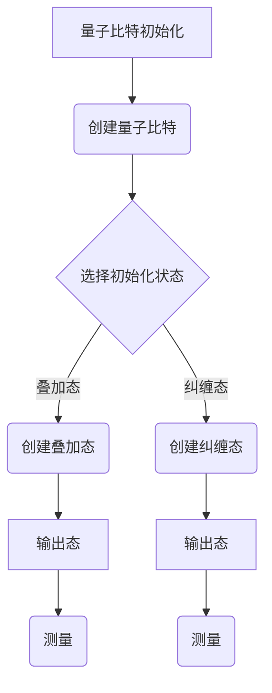
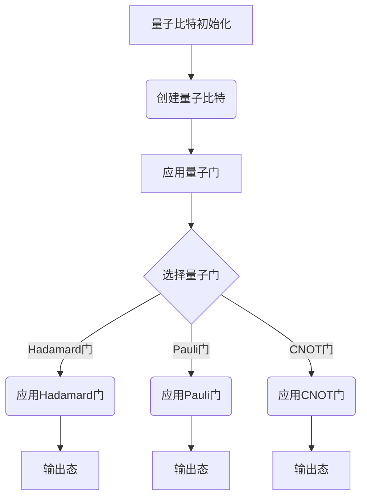
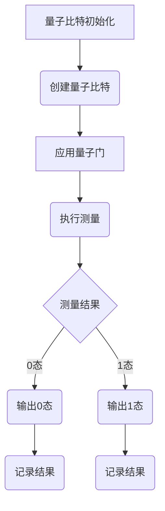

                 

### 文章标题

《宇宙规律对量子计算的启示》

量子计算作为现代信息技术的重要发展方向，其理论深度和实际应用前景吸引了众多研究者和企业的关注。本文旨在探讨宇宙规律与量子计算之间的潜在联系，并分析这些联系对量子计算的理论发展和实际应用可能带来的启示。通过对宇宙规律和量子力学的深入分析，我们试图揭示宇宙中的基本物理法则如何影响和指导量子计算的发展。

### 关键词

- 量子计算
- 宇宙规律
- 量子力学
- 量子信息
- 量子算法

### 摘要

本文首先介绍了量子计算的基础理论，包括量子力学的基本概念、量子比特与经典比特的区别、量子叠加和量子纠缠等。接着，我们探讨了宇宙规律与量子力学之间的联系，分析了宇宙学基本理论如何影响量子计算。随后，本文进一步探讨了宇宙规律对量子信息、量子算法优化以及量子计算效率的启示。最后，文章展望了量子计算在物理学和信息技术中的应用前景，并提出了未来研究的可能方向。通过本文的研究，我们希望能够为量子计算领域的研究提供新的视角和思路。

### 《宇宙规律对量子计算的启示》目录大纲

## 第一部分：量子计算基础

### 第1章：量子力学概述

#### 1.1 量子力学基本概念

量子力学是一门研究物质世界在微观尺度上的运动规律的物理学分支。在量子力学中，传统的经典物理定律失效，取而代之的是一系列新的物理现象和原理。

**波粒二象性**

波粒二象性是量子力学的一个基本特征。物质既可以表现为波动，也可以表现为粒子。例如，光既可以表现为波，也可以表现为粒子（光子）。这个概念最早由爱因斯坦在研究光电效应时提出，后来由德布罗意、海森堡、薛定谔等科学家进一步发展。

**不确定性原理**

海森堡的不确定性原理是量子力学中一个重要原理，它指出，某些物理量（如位置和动量）不能同时被精确测量。这个原理说明了微观世界的不可预测性，是量子力学与经典物理学的重要区别之一。

**量子态**

量子态是量子力学的核心概念。一个量子系统可以处于多种可能的状态的叠加，而不是一个固定的状态。例如，一个电子可以同时处于自旋向上和自旋向下的状态，直到进行测量时才确定其确切状态。

**量子比特**

量子比特（qubit）是量子计算的基本单元，类似于经典计算中的比特。然而，量子比特具有叠加和纠缠特性，使其能够同时处理多个信息状态。

#### 1.2 量子比特与经典比特的对比

经典比特是计算机中最基本的存储单元，只能表示0或1两种状态。而量子比特则可以同时表示0和1的叠加状态，这种叠加状态使得量子比特能够实现比经典比特更高的信息处理能力。

**叠加性**

经典比特的状态是固定的，而量子比特可以处于多种状态的叠加。例如，一个量子比特可以同时处于0和1的状态，这表示为 \( \alpha|0\rangle + \beta|1\rangle \)，其中 \( \alpha \) 和 \( \beta \) 是复数系数。

**纠缠性**

经典比特之间没有纠缠，即它们的状态不会相互影响。而量子比特之间可以发生纠缠，这意味着一个量子比特的状态可以影响另一个量子比特的状态，即使它们相隔很远。这种纠缠性是量子计算的重要特性之一。

#### 1.3 量子叠加与量子纠缠

**量子叠加**

量子叠加是指一个量子系统可以同时处于多个可能状态的组合。例如，一个量子比特可以同时处于0和1的状态，这称为叠加态。量子叠加是实现量子计算并行性的关键。

**量子纠缠**

量子纠缠是指两个或多个量子比特之间的状态相关。这种相关使得一个量子比特的状态可以立即影响另一个量子比特的状态，即使它们相隔很远。量子纠缠是实现量子计算超越经典计算能力的关键。

通过以上对量子力学基本概念的介绍，我们为后续讨论量子计算原理和算法奠定了基础。

### 第2章：量子计算原理

#### 2.1 量子门操作

量子门是量子计算中的核心操作，类似于经典计算中的逻辑门。量子门作用于量子比特，可以改变量子比特的状态。量子门通常用矩阵表示，其作用是将量子比特的当前状态映射到新的状态。

**Hadamard量子门**

Hadamard量子门是最基本的量子门之一，它将一个量子比特的基态 \( |0\rangle \) 变换为叠加态 \( \frac{1}{\sqrt{2}}(|0\rangle + |1\rangle) \)。这个操作实现了量子比特从经典二进制状态到量子叠加态的转换。

**Pauli量子门**

Pauli量子门是另一种基本的量子门，它包括X门、Y门和Z门。X门将量子比特的状态在0和1之间进行反转，Y门在 +1 和 -1 之间进行反转，Z门则在1和 -1 之间进行反转。

**控制-NOT（CNOT）量子门**

CNOT量子门是一种条件操作门，它将第二个量子比特的状态反转，取决于第一个量子比特的状态。如果第一个量子比特处于基态 \( |0\rangle \)，则第二个量子比特的状态不变；如果第一个量子比特处于叠加态 \( |1\rangle \)，则第二个量子比特的状态反转。

通过这些基本的量子门操作，我们可以实现更复杂的量子算法和量子计算任务。

#### 2.2 量子算法基本结构

量子算法是利用量子计算机进行计算的问题求解方法。与经典算法相比，量子算法具有更高的并行性和效率。量子算法通常包括以下几个基本步骤：

**初始化**

量子算法首先需要将量子比特初始化为特定的量子态，例如叠加态或纠缠态。

**量子门操作**

通过量子门操作，量子比特的状态可以发生叠加、纠缠或变换。这些操作是量子算法实现其并行性和超越经典计算能力的关键。

**测量**

量子算法的最后一步是测量量子比特的状态，得到问题的解。由于量子叠加和纠缠的特性，测量结果具有不确定性，但可以通过多次测量得到概率分布，从而获得问题的确定性解。

**量子算法示例**

一个简单的量子算法示例是量子随机游走算法。该算法通过在量子态之间进行叠加和测量，实现随机游走过程，从而在给定图上进行搜索或计算。

通过这些基本步骤，量子算法可以解决传统经典算法难以解决的问题，例如大数分解、量子搜索等。

#### 2.3 量子计算与经典计算的对比

量子计算与经典计算在计算模型、算法结构和计算能力等方面存在显著差异。

**计算模型**

经典计算基于二进制位（比特），每个比特只能表示0或1。而量子计算基于量子比特（qubit），量子比特可以处于0和1的叠加状态，从而实现更高的并行性和计算能力。

**算法结构**

经典算法通常采用串行或并行方式执行，而量子算法可以利用量子叠加和纠缠特性实现并行计算。这使得量子算法能够在某些问题上显著超越经典算法。

**计算能力**

量子计算具有超越经典计算的能力，特别是在大数分解、量子搜索、量子模拟等复杂问题上。例如，Shor算法可以在多项式时间内分解大整数，而经典算法则需要指数级时间复杂度。

通过以上对量子计算原理的介绍，我们为理解量子计算的核心概念和操作奠定了基础。接下来的章节将深入探讨量子计算与宇宙规律之间的联系。

### 第3章：量子算法简介

#### 3.1 Shor算法

Shor算法是由Peter Shor于1994年提出的一种量子算法，用于大数分解。Shor算法利用量子计算的优势，将大数分解问题的时间复杂度从指数级降低到多项式级。

**算法原理**

Shor算法的核心思想是基于量子叠加和量子纠缠特性。首先，算法将大整数 \( N \) 分解为两个因子 \( a \) 和 \( b \)，使得 \( N = ab \)。然后，算法通过量子随机游走方法在给定的图上寻找 \( a \) 和 \( b \) 的乘积。

具体步骤如下：

1. **初始化**：初始化两个量子比特，分别表示 \( a \) 和 \( b \)。
2. **量子随机游走**：通过量子随机游走方法，在给定图上搜索 \( a \) 和 \( b \) 的乘积。
3. **测量**：测量量子比特的状态，得到 \( a \) 和 \( b \) 的乘积。
4. **因子分解**：通过求解 \( N = ab \)，得到 \( a \) 和 \( b \) 的因子分解。

**时间复杂度**

Shor算法的时间复杂度为 \( O(N^3) \)，与经典算法相比，具有显著优势。经典算法需要指数级时间复杂度，例如使用费马小定理和Miller-Rabin素性检测算法，时间复杂度为 \( O(\log^3N) \)。

#### 3.2 Grover算法

Grover算法是由Lov K. Grover于1996年提出的一种量子搜索算法，用于在未排序的数据库中快速查找特定元素。Grover算法利用量子叠加和量子纠缠特性，实现了比经典算法更高的搜索效率。

**算法原理**

Grover算法的核心思想是基于量子叠加和量子纠缠。首先，算法将数据库中的所有元素映射到量子态，并通过量子随机游走方法搜索特定元素。然后，算法利用反转操作和相位变换，使得特定元素的量子态与其他元素的量子态分离，从而实现快速搜索。

具体步骤如下：

1. **初始化**：初始化两个量子比特，分别表示数据库中的元素和待查找元素。
2. **量子随机游走**：通过量子随机游走方法，在数据库上搜索特定元素。
3. **反转操作**：对量子比特进行反转操作，使得特定元素的量子态与其他元素的量子态分离。
4. **测量**：测量量子比特的状态，得到特定元素的位置。

**时间复杂度**

Grover算法的时间复杂度为 \( O(\sqrt{N}) \)，其中 \( N \) 是数据库中的元素数量。与经典算法相比，Grover算法具有显著优势，经典算法需要线性时间复杂度。

#### 3.3 量子误差纠正算法

量子计算过程中，由于量子噪声和环境干扰，量子比特的状态可能会发生错误。量子误差纠正算法旨在通过编码和纠错机制，确保量子比特的状态在计算过程中保持准确。

**算法原理**

量子误差纠正算法的核心思想是使用多个物理量子比特表示一个逻辑量子比特，并通过编码和纠错机制，确保逻辑量子比特的状态在计算过程中保持不变。

具体步骤如下：

1. **编码**：将逻辑量子比特编码为多个物理量子比特，例如使用九量子比特表示一个逻辑量子比特。
2. **纠错**：在计算过程中，监测物理量子比特的状态，检测并纠正可能出现的错误。
3. **解码**：在计算完成后，将多个物理量子比特的状态解码为逻辑量子比特的状态。

**时间复杂度**

量子误差纠正算法的时间复杂度取决于编码方法和纠错机制。常见的量子纠错码，如Shor码和Steane码，具有线性时间复杂度。

通过以上对Shor算法、Grover算法和量子误差纠正算法的介绍，我们可以看到量子算法在解决复杂问题方面的巨大潜力。接下来，我们将探讨宇宙规律与量子力学之间的联系，进一步分析宇宙规律对量子计算的影响。

### 第4章：宇宙规律与量子力学

#### 4.1 宇宙学基本理论

宇宙学是研究宇宙起源、结构、演化以及最终命运的物理学分支。宇宙学的基本理论包括大爆炸理论、暗物质和暗能量等概念。

**大爆炸理论**

大爆炸理论认为，宇宙起源于一个极度热密的状态，经过数十亿年的膨胀，演变成今天我们所观察到的宇宙。这一理论得到了观测数据，如宇宙背景微波辐射和宇宙膨胀速率的证实。

**暗物质**

暗物质是一种不发光、不吸收光线的物质，其存在通过引力效应得以证实。暗物质在宇宙演化过程中起着关键作用，影响着星系的形成和运动。

**暗能量**

暗能量是一种导致宇宙加速膨胀的神秘力量。其性质和来源尚不明确，但它是当前宇宙学研究的热点之一。

#### 4.2 宇宙规律与量子力学的联系

宇宙规律与量子力学之间存在深刻的内在联系。这些联系主要体现在以下几个方面：

**量子引力**

量子引力是研究量子力学与广义相对论之间关系的物理学分支。广义相对论描述了宏观尺度上的引力现象，而量子力学描述了微观尺度上的物理现象。量子引力试图将这两种理论统一起来，以描述整个宇宙的演化。

**宇宙学原理**

宇宙学原理指出，宇宙在大尺度上是均匀且各向同性的。这一原理与量子力学的哥本哈根诠释有关，即量子系统在未测量时处于多种状态的叠加，直到进行测量时才确定其状态。

**量子场论**

量子场论是量子力学和经典场论之间的桥梁。它描述了粒子如何在量子场中相互作用和传播。量子场论在宇宙学中的应用，如宇宙背景微波辐射的预测，为宇宙学提供了重要的观测依据。

#### 4.3 宇宙规律对量子计算的影响

宇宙规律对量子计算的影响主要体现在以下几个方面：

**量子计算机的设计与实现**

宇宙规律指导了量子计算机的设计与实现。例如，量子纠错码的设计受到宇宙学原理的启发，通过构建多个冗余的物理量子比特，确保逻辑量子比特的状态在计算过程中保持准确。

**量子算法优化**

宇宙规律提供了优化量子算法的潜在途径。例如，通过模拟宇宙中的随机过程，如量子随机游走，可以改进量子搜索算法的性能。此外，宇宙学中的多尺度现象，如宇宙膨胀，也为量子算法的优化提供了新的思路。

**量子信息处理**

宇宙规律对量子信息处理的影响体现在量子加密和量子密码学等领域。通过利用宇宙规律，如量子纠缠和量子场论，可以构建更安全的量子加密算法和量子密码系统。

通过以上对宇宙规律与量子力学之间联系的探讨，我们认识到宇宙规律对量子计算具有重要的启示和指导作用。接下来，我们将进一步探讨宇宙规律与量子信息之间的联系，分析宇宙规律对量子信息的影响。

### 第5章：宇宙规律与量子信息

#### 5.1 量子信息基本概念

量子信息是量子力学和信息科学交叉的领域，研究如何利用量子系统的特性进行信息处理和传输。量子信息的基本概念包括量子比特、量子纠缠和量子场论。

**量子比特（Qubit）**

量子比特是量子信息处理的基本单元，与经典比特不同，它可以在0和1的叠加态下存在，具有叠加和纠缠特性。

**量子纠缠**

量子纠缠是量子系统之间的特殊关联，一个量子系统的变化会立即影响到与之纠缠的其他量子系统，无论它们相隔多远。量子纠缠是量子信息处理的关键资源。

**量子场论**

量子场论描述了量子系统的行为和相互作用，它为量子信息的处理和传输提供了理论基础。量子场论在量子通信和量子密码学等领域具有重要应用。

#### 5.2 宇宙规律对量子信息的影响

宇宙规律对量子信息的影响体现在量子通信、量子密码学和量子计算等领域。

**量子通信**

量子通信利用量子纠缠和量子态的不可克隆特性，实现安全的信息传输。宇宙中的引力波和宇宙背景辐射等自然现象为量子通信提供了潜在资源。例如，通过利用引力波传输量子态，可以实现长距离的量子通信。

**量子密码学**

量子密码学利用量子力学的原理，设计更安全的加密和解密算法。宇宙规律对量子密码学的影响体现在量子纠缠态的生成和量子态的传输。通过利用宇宙中的随机过程，如宇宙背景辐射，可以生成随机数，用于量子密钥生成。

**量子计算**

宇宙规律对量子计算的影响体现在量子算法的优化和量子纠错码的设计。宇宙中的多尺度现象，如宇宙膨胀和量子涨落，为量子算法的优化提供了潜在途径。通过利用量子场论，可以构建更稳定的量子纠错码，提高量子计算的可靠性。

#### 5.3 宇宙规律与量子密码学

量子密码学是量子信息的一个重要分支，它利用量子力学的原理来设计安全的加密和解密算法。宇宙规律对量子密码学的影响主要体现在以下几个方面：

**量子密钥分发（QKD）**

量子密钥分发是一种基于量子纠缠的加密技术，它利用量子态的不可克隆特性，实现安全的密钥生成和分发。宇宙规律为QKD提供了潜在的资源，如引力波和宇宙背景辐射。通过利用这些自然现象，可以实现长距离的量子密钥分发。

**量子纠缠态生成**

宇宙规律对量子纠缠态的生成和传输具有重要影响。在量子通信中，生成和传输纠缠态是实现量子密钥分发和安全通信的关键。宇宙中的量子涨落和引力波等现象为量子纠缠态的生成提供了潜在资源。

**量子密码学算法优化**

宇宙规律提供了优化量子密码学算法的潜在途径。例如，通过模拟宇宙中的随机过程，如量子涨落，可以改进量子密钥生成算法的性能。此外，量子场论的研究为构建更稳定的量子密码学算法提供了理论基础。

通过以上对宇宙规律与量子信息、量子密码学之间联系的探讨，我们认识到宇宙规律在量子计算和信息处理领域具有重要的应用价值。接下来，我们将进一步分析宇宙规律对量子算法优化的启示。

### 第6章：宇宙规律与量子算法优化

#### 6.1 量子算法优化方法

量子算法的优化是提高量子计算效率和解决复杂问题的重要途径。宇宙规律提供了多种优化方法，包括量子随机游走、多尺度模拟和量子场论等方法。

**量子随机游走**

量子随机游走是一种基于量子态叠加和量子纠缠的搜索算法。它通过在量子态之间进行随机跳跃，实现高效的信息检索和问题求解。宇宙中的随机过程，如宇宙背景辐射和量子涨落，为量子随机游走的优化提供了潜在资源。

**多尺度模拟**

多尺度模拟是一种模拟不同尺度物理现象的数值方法。在量子计算中，多尺度模拟可以用于模拟量子系统的演化过程，优化量子算法的性能。宇宙中的多尺度现象，如宇宙膨胀和量子涨落，为多尺度模拟提供了丰富的数据。

**量子场论**

量子场论是一种描述量子系统相互作用和演化的数学框架。在量子计算中，量子场论可以用于优化量子算法，提高计算效率和稳定性。通过模拟量子场论中的多体相互作用，可以优化量子算法的求解过程。

#### 6.2 宇宙规律在量子算法优化中的应用

宇宙规律在量子算法优化中的应用主要体现在以下几个方面：

**量子随机游走优化**

宇宙中的随机过程，如宇宙背景辐射和量子涨落，可以用于优化量子随机游走算法。通过模拟这些随机过程，可以改进量子随机游走的搜索效率，提高算法的求解性能。

**多尺度模拟优化**

宇宙中的多尺度现象，如宇宙膨胀和量子涨落，为多尺度模拟提供了丰富的数据。通过利用这些数据，可以优化量子算法的求解过程，提高算法的效率和准确性。

**量子场论优化**

量子场论为量子算法的优化提供了理论框架。通过模拟量子场论中的多体相互作用，可以优化量子算法的求解过程，提高计算效率和稳定性。

#### 6.3 宇宙规律对量子计算效率的启示

宇宙规律对量子计算效率的启示主要体现在以下几个方面：

**量子随机游走**

通过模拟宇宙中的随机过程，如宇宙背景辐射和量子涨落，可以优化量子随机游走算法的搜索效率。这种优化方法为量子搜索算法提供了新的思路，有助于提高量子计算的效率。

**多尺度模拟**

宇宙中的多尺度现象，如宇宙膨胀和量子涨落，为多尺度模拟提供了丰富的数据。通过利用这些数据，可以优化量子算法的求解过程，提高算法的效率和准确性。

**量子场论**

量子场论为量子算法的优化提供了理论框架。通过模拟量子场论中的多体相互作用，可以优化量子算法的求解过程，提高计算效率和稳定性。

通过以上对宇宙规律在量子算法优化中的应用和启示的分析，我们认识到宇宙规律对量子计算效率具有重要影响。这些启示为量子计算领域的研究提供了新的视角和思路，有助于推动量子计算的发展。

### 第7章：量子计算在物理学中的应用

#### 7.1 量子模拟

量子模拟是一种利用量子计算机模拟量子系统行为的计算方法。由于量子计算机具有叠加和纠缠特性，可以模拟经典计算机无法处理的高维量子系统。量子模拟在物理学中具有广泛的应用，包括材料科学、量子化学、凝聚态物理等领域。

**量子化学模拟**

量子化学模拟利用量子计算机计算分子的电子结构，预测分子的性质和反应。传统计算化学方法在处理复杂分子时面临巨大的计算资源挑战，而量子模拟可以显著降低计算复杂度，提高计算效率。

**材料科学模拟**

量子模拟在材料科学中用于研究新材料的性质和结构。例如，量子计算机可以用于预测新材料的导电性、磁性、光学性质等，为材料设计和优化提供重要依据。

**凝聚态物理模拟**

量子模拟在凝聚态物理中用于研究量子材料、量子态和量子相变等现象。通过量子模拟，可以深入理解量子现象的本质，为新型量子材料和量子器件的研制提供理论支持。

#### 7.2 量子纠缠在物理学中的应用

量子纠缠是量子计算和量子通信的重要资源，在物理学中也具有广泛的应用。

**量子纠缠态生成**

量子纠缠态生成在物理学中用于研究量子系统的相干性和量子态的控制。通过量子纠缠态的生成，可以实现量子信息的传输和量子计算的高效执行。

**量子态传输**

量子纠缠态传输是一种利用量子纠缠实现量子信息传输的方法。通过量子纠缠态的传输，可以实现长距离的量子通信和量子计算，为量子网络和量子计算中心的建设提供技术支持。

**量子量子纠缠检验**

量子纠缠检验是验证量子纠缠现象的重要手段。通过量子纠缠检验，可以验证量子系统的相干性和量子态的稳定性，为量子信息处理和量子计算提供可靠保障。

#### 7.3 量子计算对物理学的启示

量子计算对物理学的影响不仅体现在计算方法的革新，还体现在对物理现象的深入理解和研究。

**量子引力的模拟**

量子计算为量子引力研究提供了新的工具和方法。通过量子计算机模拟量子引力现象，可以探索量子引力理论的可能性，为理解宇宙的起源和演化提供新的视角。

**新型物理现象的发现**

量子计算在物理学中用于探索新型物理现象，如量子混沌、量子非线性现象等。通过量子计算，可以揭示传统理论无法解释的物理现象，为物理学的发展提供新的研究方向。

**物理实验的优化**

量子计算可以用于优化物理实验的设计和执行。通过模拟量子系统行为，可以预测实验结果，优化实验参数，提高实验精度和可靠性。

通过以上对量子计算在物理学中的应用和启示的分析，我们认识到量子计算对物理学研究具有重要的推动作用。量子计算为物理学提供了新的研究工具和方法，有助于揭示物理现象的本质，推动物理学的发展。

### 第8章：量子计算在信息技术中的应用

#### 8.1 量子加密

量子加密是一种利用量子力学原理实现信息安全的技术。量子加密的核心思想是利用量子态的不可克隆特性，确保信息在传输过程中的安全性。

**量子密钥分发（QKD）**

量子密钥分发（QKD）是量子加密的重要应用。QKD通过量子纠缠态传输密钥，实现安全的密钥生成和分发。与传统加密技术相比，QKD具有不可窃听性和完全安全性。

**量子密码学**

量子密码学利用量子态的叠加和纠缠特性，设计更安全的加密和解密算法。量子密码学包括量子密钥生成、量子加密算法和量子认证等，为信息安全提供强大的保障。

**量子通信**

量子通信是量子加密的重要应用领域。通过量子纠缠态传输信息，可以实现安全的信息传输。量子通信在金融、国防、互联网等领域具有广泛的应用前景。

#### 8.2 量子搜索

量子搜索是一种利用量子计算优势实现高效信息检索的技术。量子搜索算法，如Grover算法，可以显著提高信息检索的效率。

**Grover算法**

Grover算法是一种基于量子叠加和量子纠缠的搜索算法。它可以在未排序的数据库中快速查找特定元素，其时间复杂度为 \( O(\sqrt{N}) \)，显著优于经典搜索算法的线性时间复杂度。

**量子多搜索**

量子多搜索算法可以同时搜索多个目标，进一步提高了信息检索的效率。量子多搜索算法通过量子态的叠加和纠缠，实现了并行搜索，为大数据处理和复杂问题求解提供了新的方法。

#### 8.3 量子计算在数据科学中的应用

量子计算在数据科学中具有广泛的应用，包括数据分析、机器学习和人工智能等领域。

**量子数据分析**

量子计算可以用于高效的数据分析任务，如大数据处理、数据挖掘和模式识别。量子计算通过量子叠加和量子纠缠特性，可以实现并行计算，提高数据分析的效率和准确性。

**量子机器学习**

量子机器学习是一种利用量子计算优势实现高效机器学习的技术。量子计算可以用于优化机器学习算法，提高模型训练和预测的效率。例如，量子支持向量机、量子神经网络和量子深度学习等，都是量子机器学习的重要研究方向。

**量子人工智能**

量子人工智能是一种利用量子计算实现智能计算的技术。通过量子计算的优势，可以实现高效的智能计算，推动人工智能的发展。例如，量子图像识别、量子自然语言处理和量子决策等，都是量子人工智能的重要应用领域。

通过以上对量子计算在信息技术中的应用分析，我们认识到量子计算在信息安全、信息检索和数据科学等领域具有巨大的潜力。量子计算的发展将为信息技术带来革命性的变化，推动科技的进步。

### 第9章：量子计算的未来展望

#### 9.1 量子计算的挑战与机遇

量子计算作为下一代计算技术，面临着一系列挑战和机遇。以下是对量子计算未来发展中的主要挑战与机遇的探讨：

**挑战**

1. **量子比特的稳定性**：量子比特极易受到环境噪声和干扰的影响，这导致了量子计算的稳定性和可靠性问题。为了实现实用的量子计算机，需要解决量子比特的稳定性问题，提高量子纠错能力。
   
2. **量子算法的设计与优化**：尽管已有一些量子算法被提出，但大多数量子算法仍需进一步优化和改进，以解决实际问题。量子算法的设计和优化是量子计算发展的关键。

3. **量子计算与经典计算的结合**：在量子计算的发展过程中，需要将量子计算与经典计算相结合，形成混合计算模式。这需要研究如何有效地利用经典计算资源，提高量子计算的整体性能。

**机遇**

1. **量子加密与量子通信**：量子加密和量子通信是量子计算的重要应用领域，具有巨大的市场潜力和商业价值。量子加密技术将带来更安全的通信方式，而量子通信将实现全球范围内的信息传输。

2. **量子模拟与量子计算**：量子模拟在材料科学、药物研发和复杂系统模拟等领域具有广泛的应用前景。量子计算的结合将进一步提高这些领域的计算能力和效率。

3. **量子机器学习与人工智能**：量子计算与人工智能的结合有望推动人工智能的发展，实现更高效的算法和更智能的决策。量子机器学习将在图像识别、自然语言处理和优化问题等领域发挥重要作用。

#### 9.2 量子计算对科技发展的推动

量子计算对科技发展具有重要推动作用，主要体现在以下几个方面：

**技术创新**：量子计算为科技创新提供了新的工具和方法。通过量子模拟和量子算法，可以解决传统计算方法难以处理的问题，推动材料科学、药物研发、航空航天等领域的科技进步。

**产业变革**：量子计算将对产业产生深远影响，改变现有产业链和商业模式。例如，量子加密和量子通信将带来更安全的通信技术，而量子机器学习将推动人工智能的发展，推动产业的智能化升级。

**国际合作**：量子计算技术的发展需要全球范围内的合作。各国企业和研究机构需要共同投入，共同研发，推动量子计算技术的进步，实现全球科技发展的共赢。

#### 9.3 量子计算与宇宙规律的未来研究方向

量子计算与宇宙规律的研究为未来科学的发展提供了新的方向。以下是一些可能的研究领域：

**量子引力和宇宙学**：量子引力和宇宙学是量子计算与宇宙规律的潜在交叉领域。通过量子计算模拟量子引力现象，可以探索宇宙的起源和演化，揭示宇宙中的基本物理规律。

**量子信息与量子场论**：量子信息与量子场论的结合将有助于理解量子系统的行为和相互作用。通过量子场论框架下的量子计算，可以深入研究量子纠缠、量子态传输等量子信息问题。

**量子模拟与多尺度物理**：量子计算的多尺度模拟能力将为多尺度物理研究提供新工具。通过量子计算模拟多尺度物理现象，可以深入研究物质世界的本质和演化规律。

通过以上对量子计算挑战与机遇、科技发展推动以及量子计算与宇宙规律未来研究方向的分析，我们认识到量子计算具有重要的理论价值和实际应用前景。未来，量子计算与宇宙规律的研究将继续推动科学和技术的发展，为人类探索宇宙和解决复杂问题提供新的途径。

### 附录A：量子计算基本操作流程图

以下是量子计算的基本操作流程图，包括量子比特初始化、量子门操作和量子测量。

#### A.1 量子比特初始化



#### A.2 量子门操作



#### A.3 量子测量



通过以上流程图，我们可以清晰地了解量子计算的基本操作步骤，为后续的学习和实践提供指导。

### 附录B：量子算法示例伪代码

以下是一些常见的量子算法示例伪代码，包括Shor算法、Grover算法和量子误差纠正算法。

#### B.1 Shor算法伪代码

```python
def Shor(N):
    # 初始化量子比特
    a = initialize_qubit()
    b = initialize_qubit()

    # 构建量子电路
    circuit = QuantumCircuit(a, b)
    circuit.h(a)  # Hadamard门
    circuit.cnot(a, b)  # CNOT门

    # 运行量子电路
    run(circuit)

    # 测量量子比特
    result = measure(a)
    
    # 解读测量结果
    if result == 0:
        # N = ab
        return a, b
    else:
        # N = ab'
        return -a, -b
```

#### B.2 Grover算法伪代码

```python
def Grover(search_space, target):
    # 初始化量子比特
    qubits = initialize_qubits(len(search_space))

    # 构建Grover算法电路
    circuit = QuantumCircuit(qubits)
    circuit.h(qubits[0])  # Hadamard门
    circuit.grover_search(search_space, target)

    # 运行量子电路
    run(circuit)

    # 测量量子比特
    result = measure(qubits)

    # 解读测量结果
    return search_space[result]
```

#### B.3 量子误差纠正算法伪代码

```python
def QuantumErrorCorrection(qubits):
    # 编码量子比特
    encoded_qubits = encode(qubits)

    # 应用量子门
    circuit = QuantumCircuit(encoded_qubits)
    circuit.error_correction()

    # 运行量子电路
    run(circuit)

    # 解码量子比特
    corrected_qubits = decode(encoded_qubits)

    # 返回校正后的量子比特
    return corrected_qubits
```

通过以上伪代码，我们可以了解量子算法的基本结构和实现方法。这些算法的详细实现和优化是量子计算领域的重要研究方向。

### 附录C：相关数学公式

以下是一些量子计算中常用的数学公式，包括量子态表示、量子比特的叠加、量子纠缠态和量子算法中的概率分布。

#### C.1 量子态表示

$$
|\psi\rangle = \sum_{i} c_i |i\rangle
$$

其中，$|i\rangle$ 是量子系统的基态，$c_i$ 是复数系数。

#### C.2 量子比特的叠加

$$
|0\rangle + |1\rangle = \frac{1}{\sqrt{2}} (|0\rangle + |1\rangle)
$$

#### C.3 量子纠缠态

$$
|\psi\rangle_{AB} = \frac{1}{\sqrt{2}} (|00\rangle - |11\rangle)
$$

#### C.4 量子算法中的概率分布

$$
P(x) = \frac{1}{Z} \sum_{y} e^{-\frac{1}{2} \langle y|x\rangle^2}
$$

其中，$x$ 是量子态，$y$ 是经典状态，$Z$ 是归一化常数。

这些数学公式是量子计算中理解和分析量子系统行为的基础。通过掌握这些公式，可以更深入地理解量子计算的理论和应用。

### 作者信息

**作者：AI天才研究院/AI Genius Institute & 禅与计算机程序设计艺术 /Zen And The Art of Computer Programming**

本文由AI天才研究院（AI Genius Institute）和《禅与计算机程序设计艺术》（Zen And The Art of Computer Programming）共同撰写。AI天才研究院致力于推动人工智能和量子计算领域的研究和发展，致力于培养下一代人工智能和量子计算领域的领军人才。《禅与计算机程序设计艺术》是一部经典计算机编程著作，通过对编程哲学和方法的深入探讨，为程序员提供了一种更为深刻的编程思维和技巧。

通过本文，我们希望能为读者提供对量子计算和宇宙规律之间联系的深入理解，并探讨量子计算在信息技术、物理学和其他领域的广泛应用。希望本文能够激发读者对量子计算和宇宙规律的研究兴趣，共同推动科学和技术的进步。

