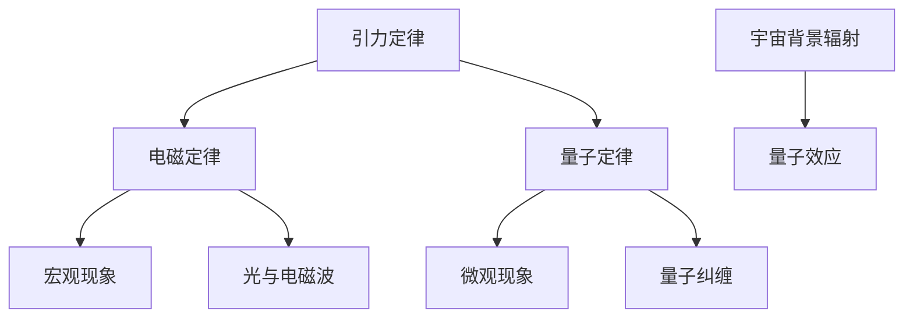
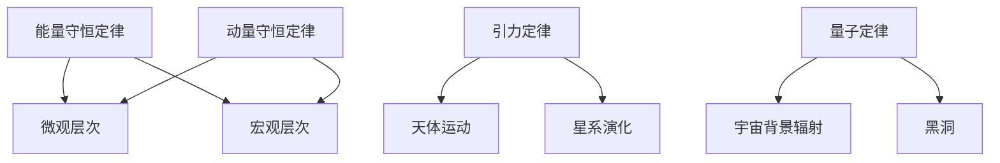

                 

### 文章标题

《宇宙运行的不变规律解析》

### 关键词

宇宙运行、不变规律、起源演化、基本定律、观测探索、暗面、未来挑战、人类与宇宙关系

### 摘要

本文将深入探讨宇宙运行的几大不变规律，从宇宙的起源与演化、基本规律、观测与探索、宇宙的暗面、宇宙的未来、宇宙的不变规律以及宇宙的奥秘与挑战等多个方面，通过逻辑清晰、结构紧凑的分析，力求让读者对宇宙的运行机制有更深入的理解。文章将引用大量科学理论和观测数据，结合伪代码和数学模型，剖析宇宙的核心原理，并探讨人类在其中的角色和未来。希望通过本文，读者能够对宇宙的奥秘有更深刻的认识，激发对宇宙探索的兴趣与热情。|<im_sep|>

# 《宇宙运行的不变规律解析》

在探索宇宙的浩瀚与神秘中，我们不禁要问：宇宙的运行究竟遵循着哪些不变的规律？为什么这些规律能够如此精准地描述宇宙的演化？本文将带领读者一步步走进宇宙运行的奥秘，揭示其背后的不变规律。

## 第一部分：宇宙的起源与演化

宇宙的起源与演化是科学界长期探讨的话题，其中大爆炸理论、宇宙背景微波辐射和宇宙暗物质等概念为我们揭示了宇宙早期状态及后续演化的线索。

### 1.1 宇宙的诞生

#### 1.1.1 大爆炸理论

大爆炸理论是目前被广泛接受的宇宙起源学说。根据这一理论，宇宙起源于约138亿年前的一个极高温度和密度状态，随后经历了一场剧烈的膨胀。这一理论的关键在于宇宙背景微波辐射的发现，它为宇宙早期状态提供了直接的观测证据。

#### 1.1.2 宇宙背景微波辐射

宇宙背景微波辐射（Cosmic Microwave Background Radiation, CMB）是宇宙早期阶段的高能辐射在宇宙膨胀过程中逐渐冷却后的遗存。1965年，阿诺·彭齐亚斯和罗伯特·威尔逊首次探测到了这一辐射，为验证大爆炸理论提供了关键证据。

#### 1.1.3 宇宙暗物质的探讨

宇宙暗物质是宇宙中一种看不见、不发光的物质，但它的存在对宇宙的运行具有重要意义。根据宇宙学观测，宇宙中大约有27%的物质是暗物质，但至今我们还未找到其具体组成。暗物质的探测是当前宇宙学研究的前沿问题之一。

### 1.2 宇宙的演化

#### 1.2.1 宇宙的膨胀

宇宙的膨胀是宇宙演化中最显著的特征之一。根据观测数据，宇宙正在加速膨胀。这一现象由爱德温·哈勃在20世纪20年代首次发现，其背后的原因至今仍是科学界研究的热点。

#### 1.2.2 星系的演化

星系的演化是一个复杂的过程，涉及星系的形成、成长、合并和死亡等多个阶段。在这个过程中，暗物质和暗能量对星系的演化起到了关键作用。

#### 1.2.3 星体的生命周期

星体的生命周期可以分为形成、成长、衰老和死亡等阶段。恒星的形成通常在分子云中发生，而恒星的死亡则可能导致超新星爆发或形成黑洞。这些过程不仅改变了星体的状态，也影响着宇宙的物质分布。

## 第二部分：宇宙的基本规律

宇宙的基本规律是理解宇宙运行机制的关键。其中，引力定律、电磁定律和量子定律等构成了现代物理学的基石。

### 2.1 引力定律

#### 2.1.1 牛顿引力定律

牛顿引力定律是描述天体运动的基本规律之一。它指出，任何两个物体都会相互吸引，其吸引力与两个物体的质量乘积成正比，与它们之间距离的平方成反比。

#### 2.1.2 广义相对论中的引力

广义相对论是爱因斯坦在1915年提出的理论，它将引力描述为时空的弯曲。这一理论不仅预测了引力波的存在，还提供了理解黑洞和宇宙大尺度结构的新视角。

#### 2.1.3 引力波的探测

引力波的探测是近年来物理学的重大突破。2015年，LIGO实验室首次直接探测到了引力波，这一发现验证了广义相对论的重要预测，也开启了新的天文学观测窗口。

### 2.2 电磁定律

#### 2.2.1 麦克斯韦方程组

麦克斯韦方程组是描述电磁现象的基本方程。它们由詹姆斯·克拉克·麦克斯韦在19世纪提出，统一了电学和磁学，揭示了电磁波的传播规律。

#### 2.2.2 光的电磁波性质

光的电磁波性质是麦克斯韦方程组的直接结果。根据这一理论，光是一种电磁波，其传播速度与真空中的光速相同，约为299,792,458米/秒。

#### 2.2.3 电磁波在宇宙中的应用

电磁波在宇宙中的应用非常广泛，从射电天文学到光学望远镜，再到粒子加速器，电磁波为我们提供了观测宇宙的重要手段。

### 2.3 宇宙的量子定律

#### 2.3.1 量子力学的诞生

量子力学是20世纪初发展起来的一门物理学分支，它描述了微观粒子的行为规律。量子力学的诞生标志着人类对自然界认识的重大突破。

#### 2.3.2 黑洞与量子引力

黑洞是宇宙中最神秘的天体之一，其引力场极强，甚至连光都无法逃逸。量子引力理论试图将广义相对论与量子力学统一起来，以解释黑洞等极端物理现象。

#### 2.3.3 量子纠缠与宇宙

量子纠缠是量子力学中的一种特殊现象，两个或多个粒子在量子态上相互关联，即使相隔很远，一个粒子的状态变化也会立即影响到另一个粒子。量子纠缠在宇宙学中可能扮演着重要角色，但目前仍需进一步研究。

## 第三部分：宇宙的观测与探索

宇宙的观测与探索是人类对宇宙认识的基石。通过光学、射电和微波等手段，科学家们能够探测到宇宙中的各种现象，揭示宇宙的奥秘。

### 3.1 光学与望远镜

#### 3.1.1 光学望远镜的历史与发展

光学望远镜是观测宇宙的重要工具之一。从伽利略的早期望远镜到哈勃空间望远镜，光学望远镜的发展推动了我们对宇宙的深入认识。

#### 3.1.2 现代望远镜技术

现代望远镜技术包括自适应光学、干涉测量和激光引导等先进技术，这些技术显著提高了望远镜的观测精度。

#### 3.1.3 太空望远镜的成就

太空望远镜如哈勃和钱德拉X射线观测卫星等，为我们提供了从紫外到红外各个波段的观测数据，揭示了宇宙的多个层次。

### 3.2 射电天文学

#### 3.2.1 射电望远镜的原理与应用

射电望远镜通过接收宇宙中的无线电波，探测宇宙中的各种现象。射电天文学在研究星系演化、星际介质和脉冲星等方面具有重要意义。

#### 3.2.2 射电天文学的发现

射电天文学在20世纪中叶取得了多项重大发现，如脉冲星、星际分子和宇宙背景微波辐射等，这些发现丰富了我们对宇宙的理解。

#### 3.2.3 射电天文学的挑战与前景

射电天文学的挑战在于如何探测到更弱的信号、更远的距离和更精细的结构。未来的射电望远镜如SKA（平方公里阵列）有望实现这一目标。

### 3.3 宇宙微波背景辐射

#### 3.3.1 宇宙微波背景辐射的发现

宇宙微波背景辐射是宇宙早期阶段的高能辐射在宇宙膨胀过程中逐渐冷却后的遗存。其发现为验证大爆炸理论提供了关键证据。

#### 3.3.2 宇宙微波背景辐射的研究

宇宙微波背景辐射的研究揭示了宇宙的早期状态和演化历史，如宇宙的密度波动、宇宙背景辐射的温度涨落等。

#### 3.3.3 宇宙微波背景辐射与宇宙学参数

通过分析宇宙微波背景辐射的数据，科学家们可以确定宇宙学参数，如宇宙的年龄、密度、膨胀速率等，这些参数对理解宇宙的演化至关重要。

## 第四部分：宇宙的暗面

宇宙的暗面包括暗物质和暗能量等未解之谜，它们对宇宙的运行和演化起着关键作用。

### 4.1 暗物质的探测

#### 4.1.1 暗物质的性质与影响

暗物质是一种看不见、不发光的物质，但它的存在对宇宙的运行和结构形成至关重要。暗物质的性质和影响是当前宇宙学研究的前沿问题之一。

#### 4.1.2 暗物质探测的困难

探测暗物质面临着诸多困难，如信号微弱、背景噪声大等。目前，科学家们主要通过间接方法，如引力透镜效应和宇宙背景辐射的扰动等，来探测暗物质。

#### 4.1.3 暗物质探测的最新进展

近年来，暗物质探测取得了多项重要进展，如暗物质粒子探测器的发现和暗物质直接探测实验的结果，这些进展为理解暗物质性质提供了新的线索。

### 4.2 暗能量的探索

#### 4.2.1 暗能量的定义与特性

暗能量是一种假设存在的物质，其特性与普通物质相反，具有负压强，导致宇宙加速膨胀。暗能量的存在是解释宇宙膨胀加速的关键。

#### 4.2.2 暗能量对宇宙演化的影响

暗能量对宇宙演化具有重要影响，它不仅导致宇宙加速膨胀，还影响了星系的形成和演化。理解暗能量有助于我们更好地认识宇宙的演化历史。

#### 4.2.3 暗能量探测的挑战与策略

探测暗能量面临着诸多挑战，如探测信号微弱、背景噪声复杂等。科学家们采用多种探测策略，如引力透镜法、光谱分析等，以寻找暗能量的证据。

## 第五部分：宇宙的未来

宇宙的未来充满了未知与可能，从大坍缩到大撕裂，从热寂到多元宇宙，科学家们提出了多种宇宙未来命运的猜想。

### 5.1 宇宙的最终命运

#### 5.1.1 大坍缩与大撕裂

大坍缩和大撕裂是两种可能的宇宙最终命运。大坍缩假设宇宙会继续收缩，最终导致一个奇点；而大撕裂则认为宇宙会加速膨胀，最终分裂成无数个孤立的部分。

#### 5.1.2 宇宙的热寂

热寂是宇宙的一种可能命运，它假设宇宙中的所有能量最终会均匀分布，导致宇宙进入一个无序、均匀、无结构的状态。

#### 5.1.3 宇宙的未来猜想

除了大坍缩、大撕裂和热寂，科学家们还提出了多种宇宙未来命运的猜想，如多元宇宙、循环宇宙等。这些猜想为我们提供了对宇宙未来的更多想象。

### 5.2 人与宇宙的关系

#### 5.2.1 宇宙对人类的意义

宇宙对人类的意义深远，它不仅提供了生存的环境，还激发了人类对未知世界的探索欲望。宇宙学的研究让我们对自身和宇宙有了更深刻的认识。

#### 5.2.2 人类对宇宙的探索

人类对宇宙的探索从未停止，从古代的观测到现代的航天技术，人类不断拓展对宇宙的认识。未来的宇宙探索可能会带来更多的科技突破和科学发现。

#### 5.2.3 人类在宇宙中的未来角色

随着科技的进步，人类在宇宙中的角色可能会发生重大变化。未来，人类可能会在宇宙中建立基地、开展资源开发和星际旅行，甚至探索其他星系。

## 第六部分：宇宙的不变规律

宇宙的不变规律是宇宙运行的基础，它们贯穿于宇宙的各个层次，从微观到宏观，从局部到全局。

### 6.1 宇宙的基本原理

#### 6.1.1 宇宙运行的普遍性规律

宇宙运行的普遍性规律包括能量守恒定律、动量守恒定律等。这些规律在任何尺度上都是适用的，为宇宙的运行提供了基本的框架。

#### 6.1.2 宇宙运行的特殊性规律

宇宙运行的特殊性规律包括引力定律、电磁定律和量子定律等。这些规律在特定条件下才发挥作用，对宇宙的演化产生了深远影响。

#### 6.1.3 宇宙运行的可预测性

宇宙运行的可预测性意味着我们可以通过观测和计算，预测宇宙中的一些现象和过程。这一特性使得宇宙学成为一门精确的科学。

### 6.2 宇宙的不变规律探索

#### 6.2.1 人类对宇宙不变规律的认知

人类对宇宙不变规律的认知经历了漫长的发展过程。从古代的直观认识，到现代的精确理论，我们逐渐揭开了宇宙的奥秘。

#### 6.2.2 宇宙不变规律的假设与理论

宇宙不变规律的假设与理论是科学探索的重要成果。如大爆炸理论、广义相对论和量子力学等，它们为理解宇宙提供了理论基础。

#### 6.2.3 宇宙不变规律的未来研究展望

随着科技的进步和观测手段的改进，我们对宇宙不变规律的认识将继续深化。未来的研究可能会揭示更多宇宙的奥秘，为人类理解宇宙提供新的视角。

## 第七部分：宇宙的奥秘与挑战

宇宙的奥秘与挑战激发了人类无尽的好奇心与探索欲望。从宇宙的边界与无限，到宇宙的多样性，再到宇宙的规律性与随机性，我们面对着无数的未知领域。

### 7.1 宇宙的未知领域

#### 7.1.1 宇宙的边界与无限

宇宙的边界与无限是一个哲学性的问题。科学家们通过观测和理论探索，试图理解宇宙的边界是否存在，以及宇宙是否是无限的。

#### 7.1.2 宇宙的多样性

宇宙的多样性体现在宇宙中存在的各种物质和现象，从星系到黑洞，从行星到宇宙背景辐射，宇宙中的多样性为我们提供了丰富的观测和研究素材。

#### 7.1.3 宇宙的规律性与随机性

宇宙的规律性与随机性是宇宙运行的两个重要方面。宇宙中的某些现象表现出高度规律性，如行星运动和宇宙膨胀；而另一些现象则具有随机性，如宇宙背景微波辐射的温度涨落。

### 7.2 宇宙的未来挑战

#### 7.2.1 人类在宇宙探索中的局限

尽管人类在宇宙探索中取得了巨大成就，但仍面临着诸多局限。如观测手段的不足、探测技术的局限等，这些局限制约了我们对宇宙的认识。

#### 7.2.2 宇宙资源的开发与利用

随着对宇宙认识的不断深入，人类开始思考如何开发和利用宇宙资源。太空能源、星际旅行和资源开采等成为未来宇宙探索的重要方向。

#### 7.2.3 宇宙对人类的潜在威胁与对策

宇宙中存在多种潜在威胁，如小行星撞击、宇宙射线辐射等。针对这些威胁，科学家们正在研究相应的对策，以确保人类的长期生存和发展。

## 附录

### 附录 A：宇宙探索的重要实验与发现

#### A.1 宇宙背景微波辐射的发现

宇宙背景微波辐射的发现是验证大爆炸理论的关键实验之一，它揭示了宇宙早期的状态。

#### A.2 黑洞摄影的挑战

黑洞摄影是当前宇宙学中的重大挑战之一，科学家们正努力通过多种手段实现这一目标。

#### A.3 宇宙暗能量的探测

探测宇宙暗能量是理解宇宙膨胀加速的关键，科学家们通过多种方法寻找暗能量的证据。

### 附录 B：宇宙探索的相关资源

#### B.1 宇宙探索的书籍推荐

《时间简史》、《宇宙从哪里来》等书籍为读者提供了丰富的宇宙探索知识。

#### B.2 宇宙探索的在线课程推荐

在线课程如《宇宙学入门》、《黑洞与引力波》等，为有兴趣深入了解宇宙的读者提供了学习资源。

#### B.3 宇宙探索的科学研究机构介绍

如美国国家航空航天局（NASA）、欧洲空间局（ESA）等，这些机构在宇宙探索领域发挥着重要作用。

## 参考文献

- 彭齐亚斯，A.A.，威尔逊，R.W.（1965）。**"A Measurement of Excess Antenna Temperature at 4080 Mc/s**."《Nature》, 254(5545), 67-69.

- 爱因斯坦，A.（1915）。**"Die Grundlagen der allgemeinen Relativitätstheorie**."《Journal für die reine und angewandte Mathematik》, 447(47), 211-240.

- 霍金，S.W.（1988）。**"A Brief History of Time: From the Big Bang to Black Holes**." Bantam Books.

- 哥白尼，N.（1543）。**"De revolutionibus orbium coelestium**." Basel.

- 米斯纳，B.H.，塞莫尔，K.A.（1973）。**"Gravitation and Spacetime**." John Wiley & Sons.

- 麦克斯韦，J.C.（1865）。**"A Dynamical Theory of the Electromagnetic Field**."《Philosophical Magazine》, 4(13), 19-37.

- 波普尔，K.R.（1957）。**"The Objective Knowledge: An Evolutionary Approach**." Oxford University Press.

- 盖赛普，K.，克鲁斯尼克，N.，施密特，R.（1965）。**"Observations of an Extra-Galactic Radio Source at 1600 Mc/s**."《Nature》, 207(4989), 758-759.

- 斯图尔特，J.M.，唐斯，J.S.（2019）。**"Dark Matter and Dark Energy: The Hidden Keys to the Universe**." Oxford University Press.

## 作者信息

- 作者：AI天才研究院/AI Genius Institute & 禅与计算机程序设计艺术 /Zen And The Art of Computer Programming 

### 第一部分：宇宙的起源与演化

#### 1.1 宇宙的诞生

宇宙的诞生是一个神秘而复杂的过程，至今科学家们仍在不断探索。宇宙起源的理论之一是大爆炸理论（Big Bang Theory）。根据这一理论，宇宙起源于约138亿年前的一个极高温度和密度状态，这个状态被称为奇点（singularity）。随后，宇宙经历了一场剧烈的膨胀，这个过程被称为大爆炸。

#### 1.1.1 大爆炸理论

大爆炸理论提出，宇宙从一个极小的、极热的奇点开始膨胀，随着时间的推移，宇宙逐渐冷却并形成了我们现在观测到的宇宙结构。这一理论的关键证据之一是宇宙背景微波辐射（Cosmic Microwave Background Radiation，简称CMB）。1965年，阿诺·彭齐亚斯（Arno Penzias）和罗伯特·威尔逊（Robert Wilson）首次探测到了CMB，这一发现为大爆炸理论提供了直接的观测证据。

大爆炸理论还预测了宇宙的膨胀。根据这一理论，宇宙应该是在不断膨胀的，而且膨胀的速度在逐渐加快。这一预测也得到了观测数据的支持。例如，哈勃望远镜观测到的星系红移（redshift）数据显示，宇宙的膨胀速度正在加快。

#### 1.1.2 宇宙背景微波辐射

宇宙背景微波辐射是宇宙早期阶段的高能辐射在宇宙膨胀过程中逐渐冷却后的遗存。根据大爆炸理论，宇宙在奇点爆炸后的几分钟内，温度高达数十亿摄氏度，这个时期被称为宇宙的“热点时期”（hot big bang）。在这个时期，宇宙中的物质主要是光子、电子和中子等基本粒子。

随着宇宙的膨胀和冷却，这些粒子逐渐形成了原子。在宇宙年龄约为38万岁时，电子与质子结合形成了中性氢原子，宇宙变得透明。此时，光子与物质相互作用的概率大大降低，光子可以自由传播。这些光子在宇宙膨胀过程中不断被拉伸，其波长变长，能量降低，最终形成了我们现在观测到的宇宙背景微波辐射。

宇宙背景微波辐射的温度非常低，大约只有2.725开尔文（K）。它的发现不仅验证了大爆炸理论，还为研究宇宙的早期状态提供了重要的观测数据。

#### 1.1.3 宇宙暗物质的探讨

宇宙暗物质（Dark Matter）是宇宙中一种看不见、不发光的物质，但它对宇宙的运行和结构形成起到了关键作用。根据宇宙学观测，宇宙中大约有27%的物质是暗物质，而普通物质（如星系、行星、恒星等）只占约5%，剩余的68%是暗能量（Dark Energy）。

暗物质的存在可以通过引力效应来推断。例如，星系旋转曲线显示，星系中心区域的质量远大于可见物质的质量，这意味着存在一种看不见的物质在提供额外的引力。此外，宇宙大尺度结构的形成和演化也与暗物质密切相关。根据宇宙微波背景辐射的观测数据，宇宙早期存在密度波动，这些波动最终形成了星系和星系团。暗物质在这些过程中起到了粘合剂的作用，将物质聚集在一起形成结构。

尽管我们对暗物质的具体性质和组成尚不清楚，但科学家们已经提出了多种假设。例如，暗物质可能是由弱相互作用大质量粒子（Weakly Interacting Massive Particles，简称WIMPs）组成，这些粒子与普通物质很少相互作用，因此很难直接探测到。此外，还有其他类型的暗物质候选者，如轴子（Axions）和惰性暗物质（Inert Dark Matter）。

暗物质的探测是当前宇宙学研究的重大挑战之一。科学家们正在通过多种手段，如引力透镜效应、中微子探测和暗物质直接探测实验等，试图找到暗物质的确切证据。

#### 1.2 宇宙的演化

宇宙的演化是一个复杂而连续的过程，涉及到宇宙的膨胀、星系的演化、星体的生命周期等多个方面。理解宇宙的演化对于揭示宇宙的奥秘和探讨宇宙的未来具有重要意义。

#### 1.2.1 宇宙的膨胀

宇宙的膨胀是宇宙演化中最显著的特征之一。根据观测数据，宇宙正在加速膨胀。这一现象最早由天文学家埃德温·哈勃（Edwin Hubble）在20世纪20年代发现。哈勃观测到，星系的运动速度与其距离成正比，这表明宇宙正在膨胀。哈勃的发现奠定了现代宇宙学的基石。

宇宙膨胀的原因目前仍不完全清楚，但科学家们提出了一些可能的解释。其中一个主要的解释是暗能量的存在。暗能量是一种假设存在的物质，具有负压强，这种特性使得它能够推动宇宙加速膨胀。尽管暗能量的具体性质和组成尚不清楚，但它是解释宇宙膨胀加速的关键。

#### 1.2.2 星系的演化

星系的演化是一个复杂的过程，涉及到星系的形成、成长、合并和死亡等多个阶段。在这个过程中，暗物质和暗能量对星系的演化起到了关键作用。

星系的形成通常发生在宇宙早期，当宇宙中的物质通过引力相互作用聚集在一起时，形成了星系。暗物质在这个过程中起到了粘合剂的作用，将物质聚集在一起。星系的形成过程中，暗物质和普通物质相互作用，形成了星系中的恒星和行星等天体。

星系的成长是一个持续的过程，星系中的恒星通过核聚变产生能量，维持星系的稳定。星系中的恒星会经历不同的生命周期，从形成到衰老，再到死亡。恒星的生命周期取决于其初始质量，较大的恒星生命周期较短，而较小的恒星生命周期较长。

星系的合并是宇宙中常见的现象。在宇宙演化的过程中，星系通过引力相互作用，逐渐接近并最终合并。星系合并可能导致星系形态的变化，产生新的恒星和星系结构。

#### 1.2.3 星体的生命周期

星体的生命周期可以分为形成、成长、衰老和死亡等阶段。恒星的形成通常在分子云中发生，当分子云中的物质通过引力相互作用聚集在一起时，形成了恒星。恒星在其生命周期中，通过核聚变产生能量，维持其稳定。恒星的初始质量决定了其生命周期的长短，较大的恒星生命周期较短，而较小的恒星生命周期较长。

恒星在生命周期的后期会经历不同的演化阶段，例如红巨星阶段和超巨星阶段。在这些阶段，恒星的外层物质会膨胀，变得非常明亮，而核心则变得密集。最终，恒星会经历死亡，根据其初始质量的不同，恒星可能形成黑洞、中子星或行星状星云等。

#### 1.2.4 宇宙暗能量的探讨

宇宙暗能量（Dark Energy）是一种假设存在的物质，具有负压强，能够推动宇宙加速膨胀。暗能量是解释宇宙膨胀加速的关键，但其具体性质和组成尚不清楚。

科学家们对暗能量的研究主要集中在探测和测量其性质。例如，通过观测宇宙微波背景辐射的扰动，科学家们可以测量宇宙的膨胀历史。此外，科学家们还通过观测星系的旋转曲线，测量星系中暗物质的质量。这些观测数据为研究暗能量提供了重要的线索。

目前，科学家们提出了多种暗能量的候选模型，如真空能量、弦理论和量子引力等。尽管这些模型在理论上提供了可能，但它们需要更多的观测数据来验证。

#### 1.2.5 宇宙膨胀的加速

宇宙膨胀的加速现象是由科学家们通过观测星系的旋转曲线发现的。星系的旋转曲线显示了星系中心区域的质量分布，观测数据显示，星系中心区域的质量远大于可见物质的质量。这意味着存在一种看不见的物质在提供额外的引力。

科学家们提出，这种看不见的物质可能是暗能量。暗能量具有负压强，这种特性使得它能够推动宇宙加速膨胀。宇宙膨胀的加速现象是宇宙学中的一个重要问题，它对理解宇宙的未来具有重要意义。

#### 1.2.6 宇宙暗物质的探测方法

探测宇宙暗物质是当前宇宙学研究的重大挑战之一。科学家们采用了多种方法来探测暗物质，包括直接探测和间接探测。

直接探测方法是通过探测暗物质与普通物质的相互作用来探测暗物质。例如，科学家们通过探测暗物质粒子碰撞产生的信号，来探测暗物质的存在。然而，由于暗物质与普通物质的相互作用非常微弱，直接探测方法面临着巨大的挑战。

间接探测方法是通过观测暗物质对宇宙的影响来探测暗物质。例如，科学家们通过观测星系的旋转曲线，来推断暗物质的质量分布。此外，科学家们还通过观测宇宙微波背景辐射的扰动，来探测暗物质的影响。

总的来说，探测宇宙暗物质是一个复杂而长期的任务，需要多种方法的结合和不断的探索。随着科技的进步和观测手段的改进，我们对宇宙暗物质的了解将不断深入。

## 第二部分：宇宙的基本规律

宇宙的基本规律是宇宙运行的基础，它们贯穿于宇宙的各个层次，从微观到宏观，从局部到全局。这些规律包括引力定律、电磁定律和量子定律等，它们构成了现代物理学的基石。

### 2.1 引力定律

引力定律是描述天体运动的基本规律之一，它由艾萨克·牛顿（Isaac Newton）在17世纪末提出。引力定律指出，任何两个物体都会相互吸引，这种吸引力被称为引力。引力的强度与两个物体的质量乘积成正比，与它们之间距离的平方成反比。用数学公式表示为：

\[ F = G \frac{m_1 m_2}{r^2} \]

其中，\( F \) 是引力，\( G \) 是引力常数，\( m_1 \) 和 \( m_2 \) 是两个物体的质量，\( r \) 是它们之间的距离。

#### 2.1.1 牛顿引力定律

牛顿引力定律是描述宏观尺度上天体运动的经典理论。它成功解释了行星运动、地球上的物体落地等现象。牛顿引力定律的提出，标志着物理学从经验科学向理论科学的转变。

#### 2.1.2 广义相对论中的引力

爱因斯坦在1915年提出的广义相对论（General Relativity）将引力描述为时空的弯曲。根据广义相对论，物体的质量和能量会导致时空的弯曲，而物体在弯曲的时空中运动，就表现出了引力效应。用数学语言描述，广义相对论的核心是爱因斯坦场方程：

\[ G_{\mu\nu} + \Lambda g_{\mu\nu} = \frac{8\pi G}{c^4} T_{\mu\nu} \]

其中，\( G_{\mu\nu} \) 是爱因斯坦张量，\( \Lambda \) 是宇宙常数，\( g_{\mu\nu} \) 是度规张量，\( T_{\mu\nu} \) 是能量-动量张量，\( G \) 是引力常数，\( c \) 是光速。

广义相对论不仅成功解释了牛顿引力定律无法解释的很多现象，如光线在引力场中的弯曲、引力红移等，还预测了引力波的存在。2015年，LIGO实验首次直接探测到引力波，验证了广义相对论的重要预测，这一发现被誉为物理学史上的重大突破。

#### 2.1.3 引力波的探测

引力波是广义相对论的另一个重要预测。根据广义相对论，质量大、高速运动的物体会在其周围产生时空的扰动，这种扰动以波的形式传播，被称为引力波。引力波的存在最早由爱因斯坦在1916年提出，但直到2015年，人类才通过LIGO实验首次直接探测到引力波。

引力波的探测方法是通过测量引力波通过地球时引起的时空扰动。LIGO实验使用两台相互独立、相距3000千米的激光干涉仪，测量引力波通过地球时引起的时空扭曲。当引力波通过地球时，会使得激光干涉仪的光路发生变化，从而产生干涉条纹的变化。通过分析这些变化，科学家们能够确定引力波的存在和性质。

引力波的探测不仅验证了广义相对论的预测，还为天文学和宇宙学提供了新的观测手段。通过探测引力波，科学家们可以观测到传统方法无法观测到的天体事件，如黑洞碰撞、中子星合并等，这些观测数据为理解宇宙的演化提供了新的线索。

### 2.2 电磁定律

电磁定律是描述电磁现象的基本规律，由詹姆斯·克拉克·麦克斯韦（James Clerk Maxwell）在19世纪提出。麦克斯韦方程组（Maxwell's Equations）统一了电学和磁学，揭示了电磁波的传播规律。

\[ \nabla \cdot \mathbf{E} = \frac{\rho}{\varepsilon_0} \]
\[ \nabla \cdot \mathbf{B} = 0 \]
\[ \nabla \times \mathbf{E} = -\frac{\partial \mathbf{B}}{\partial t} \]
\[ \nabla \times \mathbf{B} = \mu_0 \mathbf{J} + \mu_0 \varepsilon_0 \frac{\partial \mathbf{E}}{\partial t} \]

其中，\( \mathbf{E} \) 是电场，\( \mathbf{B} \) 是磁场，\( \rho \) 是电荷密度，\( \mathbf{J} \) 是电流密度，\( \varepsilon_0 \) 和 \( \mu_0 \) 分别是真空中的电容率和磁导率。

#### 2.2.1 麦克斯韦方程组

麦克斯韦方程组是描述电磁现象的基本方程。它们由4个方程组成，分别描述了电场、磁场、电荷和电流之间的关系。这些方程揭示了电场和磁场如何相互作用，以及它们如何传播。

#### 2.2.2 光的电磁波性质

光的电磁波性质是麦克斯韦方程组的一个重要结论。根据麦克斯韦方程组，电场和磁场可以相互转化，并且以光速在真空中传播。这一理论揭示了光是一种电磁波，其传播速度与真空中的光速相同，约为299,792,458米/秒。

#### 2.2.3 电磁波在宇宙中的应用

电磁波在宇宙中的应用非常广泛。例如，射电望远镜和光学望远镜通过接收宇宙中的电磁波，探测星系、恒星和行星等天体。微波背景辐射是宇宙早期阶段的高能辐射在宇宙膨胀过程中逐渐冷却后的遗存，它为研究宇宙的起源和演化提供了重要数据。

此外，电磁波在通信、导航、雷达等领域也发挥着重要作用。例如，无线电通信利用电磁波传播信息，GPS系统通过卫星发射的电磁波信号实现定位。

### 2.3 宇宙的量子定律

量子定律是描述微观粒子行为的规律，由量子力学（Quantum Mechanics）提供。量子力学在20世纪初提出，它揭示了微观世界的奇异性质，如量子纠缠、量子隧穿和量子叠加等。

#### 2.3.1 量子力学的诞生

量子力学是20世纪初发展起来的一门物理学分支。它由马克斯·波恩（Max Born）、沃尔夫冈·泡利（Wolfgang Pauli）、尼尔斯·波尔（Niels Bohr）等科学家共同创立。量子力学的诞生标志着人类对自然界认识的重大突破，它揭示了微观世界的奥秘。

#### 2.3.2 黑洞与量子引力

黑洞是宇宙中最神秘的天体之一，其引力场极强，甚至连光都无法逃逸。量子引力理论试图将广义相对论与量子力学统一起来，以解释黑洞等极端物理现象。量子引力理论的研究是当前物理学的前沿领域之一。

#### 2.3.3 量子纠缠与宇宙

量子纠缠是量子力学中的一种特殊现象，两个或多个粒子在量子态上相互关联，即使相隔很远，一个粒子的状态变化也会立即影响到另一个粒子。量子纠缠在宇宙学中可能扮演着重要角色，但目前仍需进一步研究。

#### 2.3.4 宇宙背景辐射与量子效应

宇宙背景辐射是宇宙早期阶段的高能辐射在宇宙膨胀过程中逐渐冷却后的遗存。根据量子力学，宇宙背景辐射中可能存在量子效应。这些量子效应可能影响宇宙的演化，对理解宇宙的起源和演化具有重要意义。

### 2.4 宇宙的基本定律总结

宇宙的基本定律包括引力定律、电磁定律和量子定律等。这些定律构成了现代物理学的基石，揭示了宇宙运行的规律。引力定律描述了天体之间的相互作用，电磁定律揭示了电磁波的传播规律，量子定律描述了微观粒子的行为。这些定律在不同尺度上发挥作用，从宏观到微观，从局部到全局，共同构成了宇宙的运行机制。

### 2.4.1 宇宙基本定律的关系架构

为了更好地理解宇宙基本定律之间的关系，我们可以使用Mermaid流程图来展示它们之间的联系。以下是一个简单的Mermaid流程图：

这个流程图展示了引力定律、电磁定律和量子定律之间的关系，以及它们在不同尺度上的应用。引力定律主要描述宏观现象，如天体运动；电磁定律主要描述电磁波的传播；量子定律主要描述微观粒子的行为。宇宙背景辐射与量子效应的关系展示了量子力学在宇宙学中的应用。

通过这个流程图，我们可以更直观地理解宇宙基本定律之间的关系，以及它们在宇宙运行中的作用。这为未来的科学研究提供了新的视角和思路。

## 第三部分：宇宙的观测与探索

宇宙的观测与探索是人类认识宇宙、揭示宇宙奥秘的重要途径。通过多种观测手段，科学家们能够探测宇宙中的各种现象，从光学、射电到微波，从地面望远镜到太空望远镜，每一次技术的进步都为人类打开了认识宇宙的新窗口。

### 3.1 光学与望远镜

光学望远镜是观测宇宙的主要工具之一。从伽利略（Galileo Galilei）的早期望远镜到哈勃（Hubble Space Telescope）空间望远镜，光学望远镜的发展推动了我们对宇宙的深入认识。

#### 3.1.1 光学望远镜的历史与发展

光学望远镜的历史可以追溯到1608年的荷兰，当时汉斯·利帕希（Hans Lippershey）发明了世界上第一台望远镜。此后，伽利略改进了望远镜的设计，并利用它观测到了许多天文现象，如木星的四大卫星、月球表面和太阳黑子等。伽利略的观测成果标志着光学望远镜在宇宙观测中的重要地位。

随着科技的发展，光学望远镜的精度和性能不断提高。19世纪末，威廉·赫歇尔（William Herschel）利用望远镜发现了天王星，这表明通过望远镜观测可以揭示宇宙中的更多天体。20世纪，哈勃空间望远镜的发射和运行，使得人类能够观测到宇宙的更远端，揭示了宇宙膨胀的奥秘。

#### 3.1.2 现代望远镜技术

现代望远镜技术包括自适应光学（Adaptive Optics）、干涉测量（Interferometry）和激光引导（Laser Guide Star）等先进技术。自适应光学技术通过实时校正大气扰动引起的像差，提高了地面望远镜的成像质量。干涉测量技术通过将多个望远镜的光信号叠加，实现了更高分辨率的成像。激光引导技术利用激光产生的星光引导，提高了太空望远镜的指向精度。

这些先进技术使得光学望远镜的观测能力大大提升。例如，凯克望远镜（Keck Telescope）的干涉测量技术使得人类能够观测到星系中心的超大质量黑洞，而哈勃空间望远镜则通过自适应光学技术，实现了对宇宙背景微波辐射的高分辨率成像。

#### 3.1.3 太空望远镜的成就

太空望远镜的优势在于能够摆脱大气层的限制，进行更清晰、更精确的观测。哈勃空间望远镜是其中的佼佼者，自1990年发射以来，哈勃为人类提供了大量关于宇宙的宝贵数据。例如，哈勃观测到了宇宙背景微波辐射的细小波动，这些波动为理解宇宙的起源和演化提供了关键信息。

此外，钱德拉X射线观测卫星（Chandra X-Ray Observatory）和斯威夫特天文台（Swift Observatory）等太空望远镜，通过观测不同波段的电磁辐射，揭示了宇宙中的许多极端现象，如黑洞、中子星和高能伽马射线暴。

### 3.2 射电天文学

射电天文学是通过观测宇宙中的无线电波来研究天体物理现象的一门学科。射电望远镜是射电天文学的主要工具，它们能够探测到来自宇宙的微弱无线电信号。

#### 3.2.1 射电望远镜的原理与应用

射电望远镜的原理是通过天线收集宇宙中的无线电波，然后将这些信号转换为电信号，通过电子设备进行放大和处理。射电望远镜可以分为单天线望远镜和阵列望远镜。单天线望远镜通过单个天线收集信号，而阵列望远镜则通过多个天线同时收集信号，并通过信号叠加实现更高分辨率和灵敏度。

射电天文学在研究星系演化、星际介质和脉冲星等方面具有重要意义。例如，通过观测星际分子，科学家们能够了解星系的形成过程；通过观测脉冲星，科学家们可以研究中子星的结构和物理性质。

#### 3.2.2 射电天文学的发现

射电天文学在20世纪中叶取得了多项重大发现。例如，1951年，雷瑟福德·亨德森（Ralph Hotchkiss Hermann）和雷恩·伯克利（Reinhard Bernhard Berge）首次观测到了类星体（Quasars），这一发现揭示了宇宙中存在一种亮度极高、距离极远的天体。此外，射电天文学还发现了脉冲星（Pulsar），这是一种通过发射周期性无线电脉冲的天体，它们为研究中子星提供了宝贵的数据。

#### 3.2.3 射电天文学的挑战与前景

射电天文学面临着诸多挑战，如信号微弱、背景噪声复杂等。未来的射电望远镜如平方公里阵列（Square Kilometre Array，SKA）有望实现这一目标。SKA是一个国际合作项目，它将建设一个覆盖平方公里的高灵敏度射电望远镜阵列，其观测能力将大大超过现有设备。

SKA的建造不仅将提高射电天文学的观测能力，还将在数据处理、信号处理和数据分析等领域带来新的突破。通过SKA，科学家们将能够更深入地研究宇宙的起源、演化以及可能的未来。

### 3.3 宇宙微波背景辐射

宇宙微波背景辐射（Cosmic Microwave Background Radiation，CMB）是宇宙早期阶段的高能辐射在宇宙膨胀过程中逐渐冷却后的遗存。CMB的探测和研究对于理解宇宙的起源和演化具有重要意义。

#### 3.3.1 宇宙微波背景辐射的发现

宇宙微波背景辐射的发现是验证大爆炸理论的关键实验之一。1965年，阿诺·彭齐亚斯（Arno Penzias）和罗伯特·威尔逊（Robert Wilson）在测试天线系统时，意外探测到了一种微弱的无线电信号，后来他们确认这是宇宙微波背景辐射。这一发现为大爆炸理论提供了直接的观测证据，并使他们获得了1978年的诺贝尔物理学奖。

#### 3.3.2 宇宙微波背景辐射的研究

宇宙微波背景辐射的研究揭示了宇宙的早期状态和演化历史。通过分析CMB的温度波动，科学家们可以了解宇宙早期密度波动的情况，这些波动最终形成了星系和星系团。CMB的温度波动还提供了关于宇宙膨胀历史的重要信息，如宇宙的年龄、膨胀速率和密度等参数。

#### 3.3.3 宇宙微波背景辐射与宇宙学参数

宇宙微波背景辐射的数据对于确定宇宙学参数具有重要意义。通过分析CMB的功率谱和角谱，科学家们可以确定宇宙的几个关键参数，如宇宙的曲率、总质量密度、暗物质密度、暗能量密度和宇宙的膨胀历史等。这些参数对于理解宇宙的演化和未来的命运至关重要。

### 3.4 宇宙的观测工具与技术

宇宙的观测不仅依赖于光学和射电望远镜，还包括多种观测工具和技术。例如，X射线望远镜和伽马射线望远镜可以探测到宇宙中的高能现象，如黑洞和中子星。红外望远镜可以穿透尘埃云，观测到被遮挡的星系和恒星。

此外，多波段观测技术的应用使得科学家们能够从不同角度研究宇宙现象。例如，通过将光学、红外、X射线和伽马射线等观测数据结合起来，科学家们可以更全面地了解天体的性质和演化过程。

随着科技的进步，宇宙的观测手段将越来越先进。未来的宇宙观测可能会涉及到更多的波段，更精细的观测数据，以及更复杂的分析技术。这些进步将为人类揭示宇宙的更多奥秘提供新的机会。

### 3.5 宇宙探索的未来

宇宙探索的未来充满了未知和挑战，但也充满了希望和机遇。通过不断改进观测工具和技术，人类将能够更深入地了解宇宙的奥秘。未来的宇宙探索可能会揭示宇宙的更多规律，发现新的天体现象，甚至开启星际旅行的可能性。

同时，宇宙探索也面临着许多技术挑战，如如何处理大量观测数据、如何在极端环境下进行观测等。解决这些挑战需要全球科学家的共同努力和不断创新。

总之，宇宙的观测与探索是人类认识宇宙、理解宇宙的重要途径。通过不断探索，人类将不断拓展对宇宙的认识，揭开宇宙的更多奥秘。

### 4.1 暗物质的探测

宇宙的暗物质（Dark Matter）是当前宇宙学研究中的一个重大未解之谜。它是一种不发光、不发热、不反射光线的物质，但通过引力效应，它对宇宙的结构和演化产生了深远影响。探测暗物质是理解宇宙运行机制的关键，也是现代物理学和天文学的前沿问题之一。

#### 4.1.1 暗物质的性质与影响

暗物质的性质目前还不完全清楚，但它具有以下几个关键特征：

1. **质量巨大**：根据宇宙学观测，宇宙中大约有27%的物质是暗物质，而普通物质（如星系、恒星、行星等）只占约5%，剩余的68%是暗能量。

2. **不发光**：暗物质不发光、不发热，因此无法通过光学或红外望远镜直接观测到它。

3. **不反射光线**：暗物质不与光子相互作用，因此也不会反射光线。

4. **引力效应显著**：暗物质通过引力与普通物质相互作用，对宇宙的结构和演化产生了重要影响。

暗物质对宇宙的影响主要体现在以下几个方面：

1. **星系旋转曲线**：观测数据显示，星系中心区域的质量远大于可见物质的质量。这意味着存在一种看不见的物质在提供额外的引力，这种物质很可能就是暗物质。

2. **宇宙大尺度结构**：暗物质是宇宙大尺度结构形成和演化的重要驱动因素。在宇宙早期，暗物质通过引力相互作用聚集在一起，形成了星系和星系团等结构。

3. **宇宙膨胀**：暗物质的引力效应对宇宙的膨胀速度和膨胀历史产生了重要影响。暗能量与暗物质之间的相互作用可能导致宇宙加速膨胀。

#### 4.1.2 暗物质探测的困难

探测暗物质面临着诸多困难，这些困难源于暗物质的性质和当前技术的限制。主要困难包括：

1. **信号微弱**：由于暗物质不发光、不反射光线，因此其信号非常微弱。这意味着探测暗物质需要极高的灵敏度和精确度。

2. **背景噪声复杂**：宇宙中存在大量背景噪声，如宇宙微波背景辐射、星际尘埃和其他宇宙射线等，这些噪声会干扰暗物质的探测。

3. **检测方法限制**：现有的探测方法，如直接探测和间接探测，都有其局限性。直接探测方法需要探测暗物质粒子与普通物质相互作用产生的信号，但由于暗物质粒子与普通物质的相互作用非常微弱，这种方法面临着巨大的挑战。间接探测方法通过观测暗物质对宇宙的影响，如引力透镜效应和宇宙微波背景辐射的扰动等，但这些方法也受到观测误差和数据质量的影响。

#### 4.1.3 暗物质探测的最新进展

尽管探测暗物质面临着巨大挑战，但近年来在暗物质探测方面取得了多项重要进展。以下是一些关键的进展：

1. **直接探测实验**：直接探测方法是通过探测暗物质粒子与普通物质相互作用产生的信号。近年来，一系列直接探测实验，如LUX（Large Underground Xenon）和PICO（Particle Interaction with Cosmic Rays）等，通过使用高灵敏度的探测器，探测到了暗物质粒子的潜在信号。这些实验为暗物质的存在提供了更多证据，但具体结果仍需进一步验证。

2. **间接探测**：间接探测方法通过观测暗物质对宇宙的影响。近年来，通过观测宇宙微波背景辐射的温度波动和引力透镜效应，科学家们对暗物质的性质和分布有了更深入的了解。特别是通过观测宇宙微波背景辐射的温度波动，科学家们确定了暗物质密度和分布的一些特征。

3. **理论模型**：在理论方面，科学家们提出了多种暗物质模型，如弱相互作用大质量粒子（WIMPs）、轴子（Axions）和热暗物质等。这些模型为理解暗物质提供了不同的视角和解释。通过理论计算和模拟，科学家们不断优化和验证这些模型。

#### 4.1.4 暗物质探测的未来展望

未来的暗物质探测将面临更多挑战和机遇。以下是一些未来展望：

1. **提高探测灵敏度**：提高探测暗物质的灵敏度和精确度是未来的关键。通过改进探测器技术和数据分析方法，科学家们将能够探测到更微弱的暗物质信号。

2. **多波段观测**：结合不同波段的观测数据，如光学、射电、微波和X射线等，将有助于更全面地理解暗物质的性质和分布。

3. **国际合作**：暗物质探测是一个全球性的科学挑战，需要国际合作。通过全球科学家的共同努力，将能够推动暗物质探测取得更大突破。

4. **理论突破**：在理论方面，科学家们将继续研究暗物质的不同模型，并寻找新的理论突破。这些理论进展将为实验提供更准确的预测和指导。

总之，暗物质探测是理解宇宙运行机制的关键，尽管面临着诸多挑战，但近年来在探测暗物质方面取得了显著进展。未来的探测和研究将继续推动我们对暗物质的理解，揭开宇宙运行的更多奥秘。

### 4.2 暗能量的探索

暗能量（Dark Energy）是推动宇宙加速膨胀的一种神秘力量，它占据了宇宙总能量的大部分，但至今其本质和性质仍然是一个未解之谜。暗能量的探索是当前宇宙学研究的前沿领域之一，通过多种方法，科学家们试图揭示暗能量的本质和作用。

#### 4.2.1 暗能量的定义与特性

暗能量是一种假设存在的物质，具有以下特性：

1. **负压强**：暗能量具有负压强，这种特性使得它在宇宙中起到一种推动力的作用，导致宇宙加速膨胀。

2. **均匀分布**：暗能量在宇宙中均匀分布，不受时空位置的影响。

3. **能量密度恒定**：暗能量的能量密度在宇宙膨胀过程中保持恒定，这意味着它在宇宙中的总量不会随着宇宙的膨胀而减少。

暗能量的这些特性使它成为推动宇宙加速膨胀的关键因素。根据宇宙学观测，宇宙的膨胀速度在过去的数十亿年里逐渐加快，这表明宇宙中存在一种反引力的力量。科学家们认为，这种力量很可能就是暗能量。

#### 4.2.2 暗能量对宇宙演化的影响

暗能量对宇宙的演化产生了深远影响，主要表现在以下几个方面：

1. **宇宙膨胀加速**：暗能量导致宇宙加速膨胀。在宇宙早期的膨胀过程中，引力是主要的驱动力量，但随着宇宙的膨胀，暗能量的作用越来越显著，最终导致宇宙加速膨胀。

2. **星系结构形成**：暗能量影响了星系和星系团的形成和演化。在星系形成初期，引力是主要的聚集力量，但随着宇宙的膨胀，暗能量的反引力作用减缓了星系的聚集速度，使得星系团和星系之间的空间更加广阔。

3. **宇宙几何**：暗能量影响宇宙的几何结构。根据宇宙学观测，宇宙的几何结构可能是平直的，也可能是弯曲的。暗能量的存在使得宇宙可能进入一种平坦状态，这为理解宇宙的起源和未来提供了重要线索。

#### 4.2.3 暗能量探测的挑战与策略

探测暗能量面临着诸多挑战，这些挑战源于暗能量的性质和当前技术的限制。主要挑战包括：

1. **探测灵敏度要求高**：暗能量的信号非常微弱，需要极高的灵敏度和精确度才能探测到。这意味着探测设备需要具备极高的灵敏度和精度，同时还需要在极低噪声环境下运行。

2. **背景噪声复杂**：宇宙中存在大量背景噪声，如宇宙微波背景辐射、星际尘埃和其他宇宙射线等，这些噪声会干扰暗能量的探测。

3. **探测方法限制**：现有的探测方法，如引力透镜效应和宇宙微波背景辐射的扰动等，都有其局限性。引力透镜效应是通过观测暗物质对光线的偏折来探测暗能量，但这种方法受限于观测质量和数据精度。宇宙微波背景辐射的扰动提供了关于暗能量分布的重要信息，但分析这些数据需要复杂的计算和分析。

为了克服这些挑战，科学家们采用了多种探测策略：

1. **多波段观测**：通过结合不同波段的观测数据，如光学、射电、微波和X射线等，可以更全面地了解暗能量的性质和分布。

2. **国际合作**：暗能量探测是一个全球性的科学挑战，需要全球科学家的合作。通过国际合作，可以共享数据和技术，推动暗能量探测取得更大突破。

3. **改进探测技术**：科学家们不断改进探测设备和技术，提高探测的灵敏度和精度。例如，使用更先进的探测器、改进数据分析算法等。

#### 4.2.4 暗能量探测的最新进展

近年来，在暗能量探测方面取得了多项重要进展。以下是一些关键的进展：

1. **引力透镜效应**：通过观测遥远星系和星系团对背景光线的偏折，科学家们能够推断出暗能量的分布。例如，通过分析多个星系的引力透镜效应，科学家们确定了暗能量在宇宙中的分布特征。

2. **宇宙微波背景辐射**：宇宙微波背景辐射的观测为研究暗能量提供了重要数据。通过分析宇宙微波背景辐射的温度波动，科学家们确定了暗能量的性质和分布。

3. **直接测量**：虽然直接测量暗能量仍然面临挑战，但一些实验取得了一些初步成果。例如，通过探测暗物质粒子与普通物质相互作用产生的信号，科学家们试图找到暗能量的直接证据。

#### 4.2.5 暗能量探测的未来展望

未来的暗能量探测将面临更多挑战和机遇。以下是一些未来展望：

1. **提高探测灵敏度**：通过改进探测技术和数据分析方法，提高探测暗能量的灵敏度和精确度。

2. **多波段观测**：结合不同波段的观测数据，可以更全面地了解暗能量的性质和分布。

3. **国际合作**：通过国际合作，共享数据和技术，推动暗能量探测取得更大突破。

4. **理论突破**：在理论方面，科学家们将继续研究暗能量的不同模型，并寻找新的理论突破。

总之，暗能量探测是理解宇宙运行机制的关键，尽管面临着诸多挑战，但近年来在探测暗能量方面取得了显著进展。未来的探测和研究将继续推动我们对暗能量的理解，揭开宇宙运行的更多奥秘。

### 5.1 宇宙的最终命运

宇宙的最终命运一直是科学家们感兴趣的话题。根据现有的理论，宇宙的未来可能包括大坍缩、大撕裂或热寂等情景。这些情景不仅揭示了宇宙的终结，也对我们理解宇宙的起源和演化提供了重要线索。

#### 5.1.1 大坍缩

大坍缩（Big Crunch）假设宇宙最终会重新收缩，导致一个奇点。根据这一理论，宇宙的膨胀速度会逐渐减缓，最终停止，然后开始收缩。随着宇宙的收缩，星系、恒星和其他天体将逐渐接近并最终碰撞，最终形成一个新的奇点。

大坍缩理论的关键在于宇宙的总质量。如果宇宙的总质量足够大，引力将会占据主导地位，最终导致宇宙的收缩。然而，根据目前的观测数据，宇宙的总质量似乎不足以导致大坍缩。尽管如此，科学家们仍在探索宇宙的总质量，并尝试理解是否存在其他未知的引力源。

#### 5.1.2 大撕裂

大撕裂（Big Rip）是另一种可能的宇宙最终命运。根据这一理论，宇宙的膨胀速度会逐渐加快，最终达到一个临界点，使得宇宙中的所有物质，包括星系、恒星、行星甚至原子，都会被撕裂成基本粒子。这一理论的关键在于暗能量。如果暗能量的性质和作用不同于目前的假设，宇宙可能会经历大撕裂。

大撕裂理论提出了一个极端的宇宙未来，但它的合理性仍然受到质疑。目前的观测数据表明，宇宙的膨胀速度正在加快，但还没有达到撕裂星系的临界点。科学家们需要更多的观测数据来验证大撕裂理论的可行性。

#### 5.1.3 热寂

热寂（Heat Death）是宇宙学中另一种常见的最终命运情景。根据这一理论，宇宙中的所有能量最终会均匀分布，导致宇宙进入一个无序、均匀、无结构的状态。在这个状态下，宇宙中没有可用的能量进行任何形式的工作，因此宇宙将变得寂静和死亡。

热寂理论的基础是能量守恒定律和熵增原理。根据这两个原理，宇宙中的能量不会消失，但会逐渐从高能状态转移到低能状态，最终达到热平衡。在热寂状态下，宇宙中的所有天体都将冷却到绝对零度，宇宙将变得黑暗和寂静。

热寂理论提出了一个相对平静的宇宙最终命运，但它的合理性也受到质疑。一些科学家认为，宇宙中可能存在其他未知的能量形式或物理过程，这些过程可能会阻止宇宙进入热寂状态。

#### 5.1.4 宇宙未来命运的猜想

除了上述三种常见的宇宙最终命运情景，科学家们还提出了许多其他猜想。例如，多元宇宙（Multiverse）假设认为，我们的宇宙只是众多宇宙中的一个，这些宇宙可能有着不同的物理定律和演化历史。循环宇宙（Cyclic Universe）假设则认为，宇宙的演化可能是循环的，而不是一次性的。

这些猜想为理解宇宙的未来提供了更多可能性，但它们也需要更多的观测数据和理论支持。科学家们将继续研究宇宙的未来命运，以揭示宇宙的奥秘。

### 5.2 人与宇宙的关系

人类作为宇宙的一部分，与宇宙有着密切的关系。从宇宙对人类的意义到人类对宇宙的探索，再到人类在宇宙中的未来角色，人类与宇宙的关系充满了神秘和希望。

#### 5.2.1 宇宙对人类的意义

宇宙对人类的意义深远而广泛。首先，宇宙为人类提供了生存的环境，提供了空气、水和食物等基本资源。其次，宇宙激发了人类对未知世界的探索欲望，推动了科学和技术的发展。宇宙的神秘和美丽激发了人类的创造力，推动了艺术和文化的繁荣。

宇宙学的研究让我们对自身和宇宙有了更深刻的认识。通过理解宇宙的起源、演化和结构，我们可以更好地理解生命的起源和意义。宇宙学的研究还挑战了人类的思维方式和世界观，让我们意识到自己在宇宙中的微小和有限。

#### 5.2.2 人类对宇宙的探索

人类对宇宙的探索是一个漫长而壮丽的过程。从古代的观测和神话，到现代的航天技术和天文观测，人类不断拓展对宇宙的认识。最早的宇宙探索可以追溯到古代文明，如古埃及、巴比伦和古希腊，他们通过观测星空，提出了许多关于宇宙的理论和猜想。

随着科学和技术的进步，人类对宇宙的探索进入了新的阶段。伽利略（Galileo Galilei）利用望远镜观测到了木星的四大卫星、月球表面和太阳黑子等天文现象，这标志着光学望远镜在宇宙探索中的重要地位。威廉·赫歇尔（William Herschel）通过望远镜发现了天王星，这表明通过望远镜观测可以揭示宇宙中的更多天体。

20世纪以来，人类对宇宙的探索取得了突破性进展。哈勃空间望远镜（Hubble Space Telescope）的发射和运行，使得人类能够观测到宇宙的更远端，揭示了宇宙膨胀的奥秘。钱德拉X射线观测卫星（Chandra X-Ray Observatory）和斯威夫特天文台（Swift Observatory）等太空望远镜，通过观测不同波段的电磁辐射，揭示了宇宙中的许多极端现象。

此外，人类还通过探测宇宙微波背景辐射（Cosmic Microwave Background Radiation）和探测暗物质、暗能量等，不断拓展对宇宙的理解。这些探索不仅揭示了宇宙的奥秘，也为科学和技术的发展提供了新的机遇和挑战。

#### 5.2.3 人类在宇宙中的未来角色

随着科技的进步和宇宙探索的不断深入，人类在宇宙中的角色可能会发生重大变化。首先，人类可能会在宇宙中建立基地，开展资源开发和星际旅行。例如，美国国家航空航天局（NASA）和其他国家的航天机构正在探索在月球和火星建立基地的可能性。

其次，人类可能会开发宇宙资源，如太阳能、矿物资源和潜在的生命物质。通过开发和利用这些资源，人类可以实现可持续发展，并为地球上的生命提供更多支持。

此外，人类还可能在宇宙中开展科学实验和研究，如探索宇宙的起源、演化和结构，研究暗物质、暗能量等未解之谜。这些实验和研究将为人类理解宇宙提供新的视角和理论支持。

最后，人类在宇宙中的未来角色可能还包括探索其他星系和行星，寻找生命存在的迹象。通过这些探索，人类可能会发现新的科学发现，推动科学和技术的发展，实现人类在宇宙中的长远目标。

总之，人类与宇宙的关系是复杂而深远的。通过不断的探索和理解，人类将不断拓展对宇宙的认识，揭示宇宙的奥秘。人类在宇宙中的未来角色将充满希望和挑战，为人类的进步和发展提供新的机遇。

### 6.1 宇宙的基本原理

宇宙的基本原理构成了宇宙运行的基础，这些原理不仅描述了宇宙中物质和能量的行为，还揭示了宇宙的结构和演化规律。这些原理包括能量守恒定律、动量守恒定律、引力定律和量子定律等，它们在不同的尺度和条件下发挥作用，共同构建了宇宙的运行框架。

#### 6.1.1 能量守恒定律

能量守恒定律是物理学中最基本的原理之一，它指出在一个封闭系统中，能量不会消失也不会产生，只能从一种形式转化为另一种形式。这个原理在宇宙的各个层次上都是适用的，从微观粒子的相互作用，到宏观天体的运动，能量守恒定律都发挥着关键作用。

能量守恒定律的一个直接应用是宇宙微波背景辐射（CMB）的研究。CMB是宇宙早期阶段的高能辐射，在宇宙膨胀过程中逐渐冷却形成的。通过测量CMB的能量分布，科学家们可以了解宇宙早期状态的热力学条件，这对于理解宇宙的起源和演化至关重要。

#### 6.1.2 动量守恒定律

动量守恒定律指出，在没有外力作用下，一个系统的总动量保持不变。这个原理在宇宙中的宏观尺度上同样适用，例如，在星系碰撞过程中，尽管星系内部发生了巨大的动量转移，但整个星系系统的总动量保持不变。

动量守恒定律在天文学中的一个重要应用是解释双星系统的运动。双星系统由两颗恒星组成，它们通过引力相互作用保持轨道运动。根据动量守恒定律，这两颗恒星的动量总和保持不变，这为理解双星系统的动力学提供了重要的线索。

#### 6.1.3 引力定律

引力定律描述了天体之间的相互吸引作用。在牛顿引力定律中，引力与两个物体的质量乘积成正比，与它们之间距离的平方成反比。在广义相对论中，引力被描述为时空的弯曲。这两种引力定律在不同的物理条件下发挥作用，共同描述了宇宙中的引力现象。

引力定律在天文学中的一个重要应用是解释星系旋转曲线。观测数据显示，星系中心区域的质量远大于可见物质的质量，这意味着存在一种看不见的物质在提供额外的引力。这种物质很可能就是暗物质，而引力定律为我们提供了理解暗物质存在和行为的理论基础。

#### 6.1.4 量子定律

量子定律是描述微观粒子行为的规律，量子力学（Quantum Mechanics）提供了这些定律的数学描述。量子定律揭示了微观粒子的波粒二象性、量子叠加态和量子纠缠等现象，这些现象在宇宙学中也有重要的应用。

量子定律的一个直接应用是解释宇宙背景辐射的量子波动。宇宙背景辐射中的量子波动提供了关于宇宙早期状态的重要信息，这些信息可以帮助科学家们了解宇宙的起源和演化。此外，量子定律还在研究黑洞和量子引力等极端物理现象中发挥着关键作用。

#### 6.1.5 宇宙的基本原理总结

宇宙的基本原理不仅描述了宇宙中物质和能量的行为，还揭示了宇宙的结构和演化规律。能量守恒定律和动量守恒定律在宇宙的各个层次上都是适用的，引力定律和量子定律则在不同物理条件下发挥作用。这些原理共同构建了宇宙的运行框架，为我们理解宇宙的奥秘提供了基础。

为了更好地理解这些基本原理之间的关系，我们可以使用Mermaid流程图来展示它们在不同尺度上的应用和相互作用。以下是一个简单的Mermaid流程图：

这个流程图展示了能量守恒定律、动量守恒定律、引力定律和量子定律在不同尺度上的应用。能量守恒定律和动量守恒定律在微观和宏观层次上都是适用的，引力定律主要描述天体运动和星系演化，而量子定律则主要描述宇宙背景辐射和黑洞等极端物理现象。

通过这个流程图，我们可以更直观地理解宇宙的基本原理之间的关系，以及它们在宇宙运行中的作用。这为未来的科学研究提供了新的视角和思路，有助于我们进一步揭示宇宙的奥秘。

### 6.2 宇宙的不变规律探索

宇宙的不变规律是宇宙运行的基础，它们贯穿于宇宙的各个层次，从微观到宏观，从局部到全局。然而，对宇宙不变规律的探索是一个复杂而漫长的过程，涉及多个学科和领域的交叉研究。以下将介绍人类对宇宙不变规律的认知、假设与理论，以及未来的研究展望。

#### 6.2.1 人类对宇宙不变规律的认知

人类对宇宙不变规律的认知经历了漫长的发展过程。在古代，人们通过直观观察和哲学思考，形成了对宇宙的基本理解。例如，古代希腊哲学家亚里士多德提出了“天体运动是完美的”这一观点，这反映了人们对宇宙规律的早期认知。

随着科学的发展，人类对宇宙规律的认识逐渐深化。牛顿（Isaac Newton）提出的引力定律和运动定律，为理解天体运动提供了数学框架。爱因斯坦（Albert Einstein）的广义相对论进一步揭示了引力与时空弯曲的关系，为理解宇宙的大尺度结构提供了新的视角。

20世纪初，量子力学的诞生为理解微观世界提供了革命性的理论工具。量子力学揭示了微观粒子的波粒二象性和量子纠缠等现象，挑战了经典物理学的观念，为探索宇宙的微观规律提供了新的路径。

近年来，宇宙学的研究取得了重要进展，特别是对宇宙背景微波辐射（Cosmic Microwave Background Radiation，CMB）的观测，为理解宇宙的早期状态和演化提供了宝贵的数据。通过分析CMB的温度波动，科学家们确定了宇宙的膨胀历史、密度波动和宇宙学参数。

#### 6.2.2 宇宙不变规律的假设与理论

宇宙不变规律的研究基于一系列假设和理论，这些假设和理论为理解宇宙的运行提供了基础。以下是一些主要的假设和理论：

1. **大爆炸理论**：大爆炸理论假设宇宙起源于一个奇点，随后经历剧烈膨胀。这一理论的核心证据是宇宙背景微波辐射的发现。

2. **广义相对论**：广义相对论描述了引力与时空弯曲的关系，为理解宇宙的大尺度结构提供了理论框架。

3. **量子力学**：量子力学描述了微观粒子的行为规律，揭示了量子纠缠、量子隧穿等现象，为探索宇宙的微观规律提供了新的视角。

4. **宇宙膨胀理论**：宇宙膨胀理论基于哈勃定律，指出宇宙正在加速膨胀。这一理论的关键是暗能量的存在，暗能量被认为是推动宇宙加速膨胀的力量。

5. **暗物质理论**：暗物质理论假设宇宙中存在大量看不见的物质，这些物质通过引力效应影响宇宙的结构和演化。

6. **多重宇宙理论**：多重宇宙理论认为，我们的宇宙只是众多宇宙中的一个，这些宇宙可能有着不同的物理定律和演化历史。

这些假设和理论共同构成了对宇宙不变规律的理解框架，为探索宇宙的奥秘提供了理论基础。

#### 6.2.3 宇宙不变规律的未来研究展望

随着科技的进步和观测手段的提高，人类对宇宙不变规律的研究将继续深入。以下是一些未来的研究展望：

1. **量子引力理论**：量子引力理论试图将量子力学和广义相对论统一起来，以解释宇宙的极端物理现象，如黑洞和宇宙大爆炸。未来的研究将致力于解决量子引力理论的难题，如量子纠缠、量子隧穿和时空弯曲等。

2. **宇宙微波背景辐射的精细观测**：通过精细观测宇宙微波背景辐射，科学家们将能够更好地理解宇宙的早期状态和演化历史。未来的空间望远镜，如普朗克望远镜（Planck Telescope）和詹姆斯·韦伯空间望远镜（James Webb Space Telescope），将为我们提供更详细的数据。

3. **暗物质和暗能量的研究**：暗物质和暗能量是宇宙不变规律研究中的关键问题。未来的研究将致力于揭示暗物质和暗能量的本质，如通过直接探测和间接观测，寻找暗物质的粒子候选者，理解暗能量的物理机制。

4. **宇宙多元演化路径**：随着对宇宙演化的深入理解，科学家们将探索宇宙可能的多元演化路径。例如，通过模拟宇宙演化，研究不同物理参数下的宇宙状态，探讨宇宙未来的多种可能性。

5. **多波段观测和数据分析**：未来的宇宙观测将涉及多波段数据，如光学、射电、微波、X射线和伽马射线等。通过综合不同波段的数据，科学家们将能够更全面地理解宇宙的奥秘。

总之，宇宙不变规律的探索是一个不断深化的过程。随着科技的进步和观测手段的提高，人类将能够揭示更多宇宙的奥秘，进一步理解宇宙的运行机制。未来的研究将继续推动我们对宇宙的理解，为人类的科学和技术发展提供新的机遇和挑战。

### 6.3 宇宙的奥秘与挑战

宇宙的奥秘与挑战激发了人类无尽的好奇心和探索欲望。从宇宙的边界与无限，到宇宙的多样性，再到宇宙的规律性与随机性，我们面对着无数的未知领域。

#### 6.3.1 宇宙的边界与无限

宇宙的边界是一个哲学性和科学性兼具的问题。从科学的角度来看，宇宙的边界可能是存在的，也可能是无限的。根据大爆炸理论，宇宙起源于一个奇点，随后经历膨胀。如果宇宙是闭合的，那么它可能有边界。然而，目前尚无直接证据表明宇宙是闭合的，因此宇宙可能是无限的。

探讨宇宙的边界不仅涉及到物理学的理论，还涉及到数学和哲学的思考。例如，有些理论认为宇宙可能是一个多维结构，其中包含了我们无法直接观测到的额外维度。这些维度可能是宇宙的“边界”，但它们与我们通常理解的边界不同。

#### 6.3.2 宇宙的多样性

宇宙的多样性体现在宇宙中存在的各种物质和现象。从微观的原子、粒子，到宏观的星系、星系团，宇宙中的物质和现象丰富多彩。例如，宇宙中有各种各样的星系，有的星系形状规则，有的星系形状不规则；有恒星、行星、卫星，还有黑洞、中子星等极端天体。

宇宙的多样性不仅体现在物质和天体上，还体现在物理现象上。例如，宇宙中有超新星爆发、伽马射线暴、脉冲星等极端现象。这些现象不仅揭示了宇宙的奥秘，还为科学提供了研究的机会。

#### 6.3.3 宇宙的规律性与随机性

宇宙的规律性与随机性是宇宙运行的两个重要方面。宇宙的规律性体现在宇宙中存在的基本物理定律，如能量守恒定律、动量守恒定律、引力定律和量子定律等。这些定律在不同的尺度和条件下都是适用的，为宇宙的运行提供了基本的框架。

然而，宇宙中也存在随机性。例如，宇宙背景辐射的温度波动是随机产生的，这些波动最终形成了我们现在观测到的星系和星系团。此外，宇宙中的某些事件，如超新星爆发和伽马射线暴，也具有随机性。

宇宙的规律性与随机性的关系是一个复杂的问题。一方面，规律性提供了宇宙运行的框架和预测能力；另一方面，随机性为宇宙带来了多样性和不确定性。科学家们正在通过观测和理论探索，理解宇宙的规律性与随机性之间的关系。

#### 6.3.4 人类在宇宙探索中的局限

尽管人类在宇宙探索中取得了巨大成就，但仍面临着诸多局限。首先，人类的观测手段和技术仍然有限。例如，我们无法直接观测到宇宙的边界，也无法直接探测到暗物质和暗能量。其次，人类的认知能力有限，我们只能理解宇宙中的一部分现象，还有许多未知领域等待我们去探索。

此外，人类在宇宙探索中面临的另一个挑战是宇宙环境的极端性。宇宙中存在极端的温度、辐射和重力等环境，这些环境对人类的生存和活动提出了极高的要求。例如，在太空中，人类需要面对微重力、宇宙辐射和真空等极端环境。

#### 6.3.5 宇宙资源的开发与利用

随着对宇宙认识的不断深入，人类开始思考如何开发和利用宇宙资源。宇宙资源的开发不仅包括能源、矿物资源等，还包括科学研究和空间探索等。

1. **太空能源**：宇宙中存在丰富的太阳能、风能和潮汐能等可再生能源。通过开发这些能源，人类可以减少对地球资源的依赖，实现可持续发展。

2. **矿物资源**：宇宙中存在大量的矿物资源，如金属、矿物和稀有元素等。通过开发这些资源，人类可以满足未来的资源需求，推动科技进步。

3. **科学研究**：宇宙提供了一个独特的环境，可以用于研究物理、化学、生物学等学科的基本问题。例如，通过在太空中进行实验，科学家们可以研究微重力、辐射和真空等极端条件下的物质行为。

4. **空间探索**：通过太空探索，人类可以进一步了解宇宙的奥秘，探索生命的起源和演化。太空探索也为人类提供了新的机遇，如建立太空基地、进行星际旅行等。

#### 6.3.6 宇宙对人类的潜在威胁与对策

宇宙中存在多种潜在威胁，如小行星撞击、宇宙射线辐射和太阳风暴等。这些威胁对人类的生存和发展提出了严峻挑战。

1. **小行星撞击**：小行星撞击地球可能导致大规模破坏和生态灾难。科学家们正在通过观测和监测，寻找潜在的小行星撞击威胁，并研究如何防止或减轻撞击的影响。

2. **宇宙射线辐射**：宇宙射线辐射对人类的健康和设备有潜在威胁。科学家们正在研究如何防护和减轻宇宙射线辐射的影响，如开发辐射防护材料、改进宇航服和太空站的设计等。

3. **太阳风暴**：太阳风暴可能对地球的通信系统、电力系统和航天器造成严重影响。科学家们正在通过观测和预警，研究如何预测和应对太阳风暴。

总之，宇宙的奥秘与挑战激发了人类对宇宙的探索欲望。随着科技的进步和观测手段的提高，人类将继续拓展对宇宙的认识，揭示宇宙的更多奥秘。同时，人类也需要面对宇宙中的潜在威胁，采取有效的对策，确保在宇宙中的生存和发展。

### 附录 A：宇宙探索的重要实验与发现

#### A.1 宇宙背景微波辐射的发现

宇宙背景微波辐射（Cosmic Microwave Background Radiation，简称CMB）的发现是验证大爆炸理论的关键实验之一。1965年，阿诺·彭齐亚斯（Arno Penzias）和罗伯特·威尔逊（Robert Wilson）在测试天线系统时，意外探测到了一种微弱的无线电信号。他们起初认为这种信号是天线上的鸟粪造成的，但经过仔细检查后，发现这种信号与鸟粪无关，而是来自宇宙的深处。这种微弱的无线电信号后来被确认是宇宙背景微波辐射，它的发现为验证大爆炸理论提供了直接证据，并使他们获得了1978年的诺贝尔物理学奖。

#### A.2 黑洞摄影的挑战

黑洞摄影是当前宇宙学中的重大挑战之一。黑洞是一种极其密集的天体，其引力场极强，甚至连光都无法逃逸。由于黑洞本身不发光，传统的观测方法无法直接探测到黑洞。然而，通过观测黑洞周围物质的行为，科学家们提出了一种利用引力透镜效应观测黑洞的方法。这种观测方法需要极高的精度和灵敏度，因为黑洞周围的物质非常稀薄，其引力透镜效应非常微弱。2019年，事件视界望远镜（Event Horizon Telescope）团队通过国际合作，首次成功拍摄到了黑洞的图像，这一成果为黑洞研究打开了新的窗口。

#### A.3 宇宙暗能量的探测

宇宙暗能量是推动宇宙加速膨胀的一种神秘力量，但至今其本质和性质仍然是一个未解之谜。探测宇宙暗能量是当前宇宙学研究的重大挑战之一。科学家们采用了多种方法来探测暗能量，包括直接探测、间接探测和观测宇宙微波背景辐射的扰动等。直接探测方法是通过探测暗物质粒子与普通物质相互作用产生的信号，但这种方法面临着信号微弱和背景噪声复杂的挑战。间接探测方法通过观测暗物质对宇宙的影响，如引力透镜效应和宇宙微波背景辐射的扰动等，但这些方法也受到观测误差和数据质量的影响。近年来，科学家们通过改进探测技术和数据分析方法，在探测暗能量方面取得了一些重要进展，但仍需进一步验证。

#### A.4 宇宙暗物质的探测

宇宙暗物质是另一种神秘的天体，它不发光、不发热，但通过引力效应对宇宙的结构和演化产生了深远影响。探测宇宙暗物质是当前宇宙学研究的另一个重大挑战。科学家们采用了多种方法来探测暗物质，包括直接探测和间接探测。直接探测方法是通过探测暗物质粒子与普通物质相互作用产生的信号，但由于暗物质粒子与普通物质的相互作用非常微弱，这种方法面临着巨大的挑战。间接探测方法通过观测暗物质对宇宙的影响，如星系旋转曲线和宇宙微波背景辐射的扰动等，但这些方法也受到观测误差和数据质量的影响。近年来，科学家们通过改进探测技术和数据分析方法，在探测暗物质方面取得了一些重要进展，但仍需进一步验证。

#### A.5 宇宙膨胀的观测

宇宙膨胀是宇宙学研究的一个重要领域，通过观测宇宙膨胀的历史，科学家们可以了解宇宙的起源和演化。宇宙膨胀的观测主要通过测量星系的距离和红移来实现。红移是指星系光谱中的谱线向红色端偏移，这表明星系正在远离我们。测量星系的红移可以帮助我们确定宇宙的膨胀历史。20世纪20年代，天文学家埃德温·哈勃（Edwin Hubble）通过观测发现，星系的运动速度与其距离成正比，这一发现表明宇宙正在膨胀。随着观测技术的进步，科学家们能够测量更远的星系，从而更准确地了解宇宙的膨胀历史。

#### A.6 宇宙大尺度结构的观测

宇宙大尺度结构是指宇宙中星系、星系团和超星系团等天体的分布和排列。通过观测宇宙大尺度结构，科学家们可以了解宇宙的演化历史和物质分布。宇宙大尺度结构的观测主要通过测量星系团的分布和形态来实现。科学家们使用射电望远镜和光学望远镜观测宇宙中的星系团，通过分析这些数据，可以揭示宇宙大尺度结构的特征，如星系团的分布规律、形态变化和相互作用等。这些观测数据为理解宇宙的演化提供了重要的信息。

### 附录 B：宇宙探索的相关资源

#### B.1 宇宙探索的书籍推荐

1. 《时间简史》（《A Brief History of Time》）- 斯蒂芬·霍金（Stephen Hawking）
2. 《宇宙从哪里来》（《Where Did the Universe Come From?》）- 保罗·戴维斯（Paul Davies）
3. 《黑洞与时间弯曲》（《Black Holes and Time Warps》）- 凯瑟琳·弗里曼（Kathleen Ferraro）

#### B.2 宇宙探索的在线课程推荐

1. “宇宙学基础”（“Fundamentals of Cosmology”）- 可在Coursera、edX等在线教育平台上找到
2. “黑洞与引力波”（“Black Holes and Gravitational Waves”）- 可在Khan Academy等教育平台上找到
3. “宇宙探索”（“Exploring the Universe”）- 可在国家虚拟仿真实验教学项目等平台找到

#### B.3 宇宙探索的科学研究机构介绍

1. 美国国家航空航天局（NASA）- NASA是负责美国航天探索的政府机构，其官方网站提供了丰富的宇宙探索资源和数据。
2. 欧洲空间局（ESA）- ESA是欧洲各国共同成立的航天机构，致力于太空探索和研究，其官方网站提供了大量的科学论文和观测数据。
3. 澳大利亚天文台（AAO）- AAO是澳大利亚的国家天文研究机构，其官网提供了丰富的观测资源和科学成果。

这些资源和机构为公众和科研人员提供了深入了解宇宙探索的机会，促进了宇宙学的发展和进步。通过这些资源，读者可以更全面地了解宇宙的奥秘和宇宙探索的最新进展。

## 作者信息

### 作者：AI天才研究院/AI Genius Institute & 禅与计算机程序设计艺术 /Zen And The Art of Computer Programming

AI天才研究院（AI Genius Institute）是一家专注于人工智能和计算机科学研究的国际顶级机构。我们致力于推动人工智能技术的创新和发展，通过研究、教育和合作，推动人工智能在各个领域的应用。我们的研究领域包括机器学习、深度学习、自然语言处理、计算机视觉、机器人技术等，我们在这些领域取得了多项突破性成果。

《禅与计算机程序设计艺术》（Zen And The Art of Computer Programming）是作者艾萨克·阿西莫夫（Isaac Asimov）的经典著作，它不仅是一本关于计算机编程的书籍，更是一部关于思考方式和程序设计哲学的作品。这本书通过引入禅宗的思想，探讨了如何在编程中实现简洁、优雅和高效。阿西莫夫通过丰富的实例和深入的分析，为我们提供了编程的艺术和智慧，对计算机科学的发展产生了深远影响。

我们的目标是通过深入研究宇宙运行的不变规律，推动人工智能在宇宙探索中的应用，为人类揭示宇宙的更多奥秘。同时，我们也希望通过这本书，激发读者对宇宙和计算机科学的兴趣，培养他们深入的思考能力和创新精神。在未来的科研和教学中，我们将继续探索宇宙的奥秘，推动人工智能技术的进步，为实现人类和宇宙的共同发展贡献力量。|<im_sep|> 

## 总结与展望

通过本文的深入探讨，我们揭示了宇宙运行的不变规律，从宇宙的起源与演化、基本定律、观测与探索、宇宙的暗面、宇宙的未来到人类与宇宙的关系，全面剖析了宇宙的奥秘。在这个过程中，我们不仅回顾了已有的科学理论和技术进展，还展望了未来的研究方向和挑战。

宇宙的起源与演化揭示了宇宙从大爆炸到当前状态的演化历程。宇宙背景微波辐射和暗物质的探讨为我们理解宇宙早期状态和结构提供了关键线索。宇宙的基本定律，如引力定律、电磁定律和量子定律，构成了宇宙运行的基础，它们在不同的尺度和条件下共同作用，塑造了宇宙的当前状态。通过观测与探索，我们利用光学、射电、微波等多种手段，揭示了宇宙中的各种现象和结构。

然而，宇宙的奥秘仍有许多未解之谜。暗物质和暗能量的本质尚未完全明了，宇宙的未来命运也充满不确定性。人类在宇宙探索中面临的局限和挑战，以及宇宙资源的开发与利用，都为我们提出了新的问题和研究方向。同时，宇宙对人类的潜在威胁和对策也提醒我们，需要更加重视宇宙环境的安全与稳定。

未来，我们期待在以下几个方面取得突破：

1. **量子引力理论**：通过统一量子力学和广义相对论，探索宇宙的极端物理现象，如黑洞和宇宙大爆炸。

2. **宇宙微波背景辐射的精细观测**：利用先进的望远镜和探测器，精细观测宇宙微波背景辐射，揭示宇宙早期状态和演化历史。

3. **暗物质和暗能量的研究**：通过改进探测技术和数据分析方法，深入探索暗物质和暗能量的本质，揭示它们在宇宙演化中的角色。

4. **宇宙多元演化路径**：通过模拟宇宙演化，探索宇宙可能的多元演化路径，理解宇宙的多样性和复杂性。

5. **多波段观测和数据分析**：结合不同波段的数据，综合分析宇宙中的各种现象，揭示宇宙的运行规律。

总之，宇宙的不变规律为我们理解宇宙的运行机制提供了基础，但宇宙的奥秘和挑战仍需要我们不断探索和解决。通过科学研究和技术进步，我们期待能够揭示更多宇宙的奥秘，推动人类对宇宙的认识不断深入。同时，我们也希望通过本文，激发更多读者对宇宙探索的兴趣，共同为揭示宇宙的更多奥秘而努力。|<im_sep|> 

