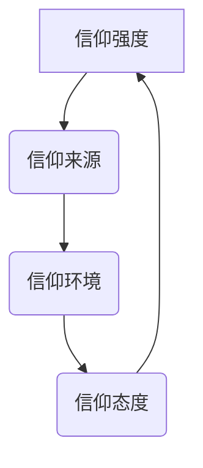
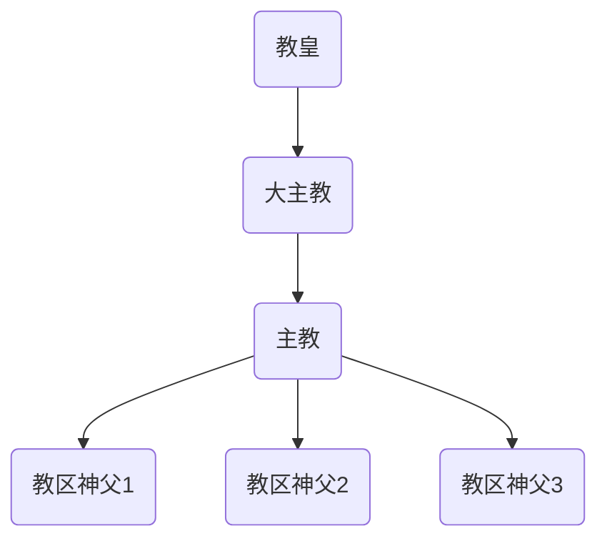
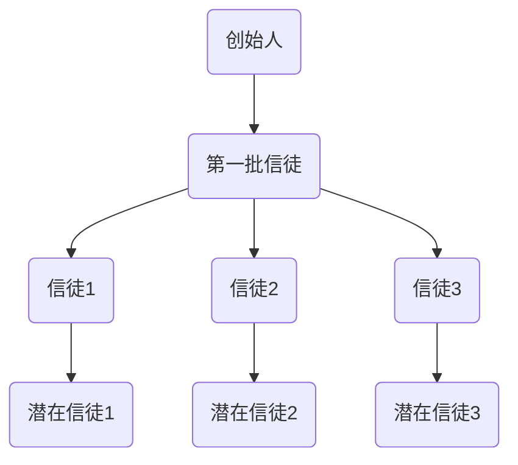

                 

### 文章标题

《宗教信仰的网络拓扑：信念系统的数学结构》

### 关键词

- 宗教信仰
- 网络拓扑
- 数学结构
- 信念系统
- 宗教社会学
- 宗教心理学
- 宗教传播学

### 摘要

本文从科学的角度出发，探讨了宗教信仰这一复杂社会现象的数学结构，特别是其网络拓扑的表现形式。通过梳理宗教信仰的定义、分类和社会功能，引入网络拓扑的基本概念，并构建信念系统的数学模型，本文旨在揭示宗教信仰的网络拓扑特征及其在宗教研究中的实际应用。文章分为三个部分：第一部分介绍理论基础，包括宗教信仰概述、网络拓扑基本概念和信念系统数学结构；第二部分应用与实践，分析宗教信仰的网络拓扑及数学模型在宗教研究中的应用；第三部分扩展与探索，探讨网络拓扑在其他领域的研究及未来发展趋势。本文通过详细的论述和案例分析，为理解宗教信仰的数学结构提供了新的视角。

## 目录大纲：《宗教信仰的网络拓扑：信念系统的数学结构》

### 第一部分：理论基础

**第1章：宗教信仰概述**

- 1.1 宗教信仰的定义与分类
- 1.2 宗教信仰的社会功能
- 1.3 宗教信仰与个人心理健康

**第2章：网络拓扑基本概念**

- 2.1 网络拓扑的定义
- 2.2 网络拓扑的基本类型
- 2.3 网络拓扑的应用

**第3章：信念系统数学结构**

- 3.1 信念系统的数学模型
- 3.2 信念系统数学结构的特征
- 3.3 信念系统的稳定性分析

### 第二部分：应用与实践

**第4章：宗教信仰的网络拓扑分析**

- 4.1 宗教组织网络拓扑分析
- 4.2 宗教信仰传播网络拓扑分析
- 4.3 宗教冲突与网络拓扑

**第5章：网络拓扑在宗教研究中的应用**

- 5.1 宗教社会学中的网络拓扑
- 5.2 宗教心理学中的网络拓扑
- 5.3 宗教传播学中的网络拓扑

**第6章：数学模型在宗教信仰中的实际应用**

- 6.1 数学模型在宗教信仰分析中的应用
- 6.2 数学模型在宗教心理学中的应用
- 6.3 数学模型在宗教传播学中的应用

**第7章：案例分析**

- 7.1 某宗教组织网络拓扑分析
- 7.2 某宗教信仰传播案例分析
- 7.3 数学模型在宗教研究中的实际应用效果

### 第三部分：扩展与探索

**第8章：网络拓扑在其他领域的研究**

- 8.1 网络拓扑在社会网络分析中的应用
- 8.2 网络拓扑在经济学中的应用
- 8.3 网络拓扑在生物学中的应用

**第9章：未来发展趋势与挑战**

- 9.1 宗教信仰网络拓扑研究的前景
- 9.2 信念系统数学模型的发展方向
- 9.3 面临的挑战与解决方案

**第10章：结语**

- 10.1 研究成果总结
- 10.2 研究贡献与局限性
- 10.3 未来研究方向

### 第1章：宗教信仰概述

#### 1.1 宗教信仰的定义与分类

宗教信仰是人类文化的重要组成部分，它关乎人的精神生活和社会秩序。宗教信仰的定义有多种，其中最广泛接受的定义是由埃德温·A·阿伯特（Edwin A. Abbott）在其著作《宗教哲学》中提出的：“宗教是对终极实在的感知和信仰，它是通过个人与超越世界的直接联系而体验的。”这种定义强调了宗教信仰的两个核心要素：一是对终极实在的感知，即对某种超越物质世界的神秘力量的认知；二是这种认知是通过个人与这种终极实在的直接联系而体验的。

宗教信仰可以按照不同的标准进行分类。一种常见的分类方式是根据宗教的起源和特点，将宗教分为自然宗教和人工宗教。自然宗教是指人类在自然环境中形成的宗教，如原始宗教和传统宗教。人工宗教则是指人类在现代社会中创造的宗教，如新宗教和新兴宗教。另一种分类方式是根据宗教的信仰对象，将宗教分为多神教、一神教和泛神论。多神教信仰多个神灵，如希腊神话和印度教；一神教信仰单一的神，如基督教和伊斯兰教；泛神论则认为宇宙万物皆神，如泛神论哲学。

宗教信仰不仅在文化层面具有重要意义，还对社会和个人产生深远的影响。在社会层面，宗教信仰可以提供道德规范和社会秩序，促进社会稳定和和谐。在个人层面，宗教信仰可以提供精神慰藉和情感支持，帮助个体应对生活中的困难和挑战。

#### 1.2 宗教信仰的社会功能

宗教信仰的社会功能体现在多个方面。首先，宗教信仰可以提供道德规范和社会秩序。在许多社会中，宗教信仰是道德观念的重要来源，它教导信徒如何正确行事、如何与他人和谐相处。宗教教义中的戒律和规范可以帮助人们形成正确的价值观和行为准则，从而维护社会秩序。

其次，宗教信仰可以提供精神慰藉和情感支持。在面对生活中的困难和挫折时，宗教信仰可以给予信徒精神力量和情感支持，帮助他们渡过难关。宗教仪式和祈祷活动可以提供情感宣泄和心灵净化，帮助信徒缓解心理压力和情绪困扰。

此外，宗教信仰还可以促进社会团结和认同感。宗教信仰可以成为社会成员的共同信仰，增强社区的凝聚力。宗教组织和社会活动可以促进信徒之间的互动和合作，增强社会成员之间的认同感和归属感。

#### 1.3 宗教信仰与个人心理健康

宗教信仰对个人心理健康的影响是一个复杂且多维度的问题。一方面，宗教信仰可以提供精神慰藉和情感支持，有助于减轻焦虑和抑郁等心理问题。研究发现，宗教信仰与较低的抑郁水平、较高的生活满意度和更好的心理健康状态之间存在正相关关系。

另一方面，宗教信仰也可能对个人心理健康产生负面影响。例如，宗教信仰可能导致信徒对现实的逃避，影响他们对问题的现实认知和处理能力。此外，宗教信仰中的教条和偏见可能导致信徒对某些群体的歧视和排斥，从而影响他们的心理健康。

总的来说，宗教信仰与个人心理健康之间的关系是复杂且多维的，它既可能产生积极影响，也可能产生消极影响。要全面理解宗教信仰对个人心理健康的影响，需要综合考虑宗教信仰的内容、形式、个人信仰强度以及社会文化背景等多种因素。

### 第2章：网络拓扑基本概念

#### 2.1 网络拓扑的定义

网络拓扑（Network Topology）是指网络中各个节点和连接方式的结构。在计算机科学中，网络拓扑主要用于描述计算机网络的结构，包括局域网（LAN）、广域网（WAN）和互联网（Internet）。网络拓扑的定义主要包括以下几个方面：

1. **节点（Nodes）**：网络中的设备，如计算机、路由器、交换机等，这些设备在网络上扮演着信息传输和处理的重要角色。
2. **链路（Links）**：连接网络中节点的物理或逻辑通道。物理链路如光纤、双绞线等，逻辑链路则如网络层中的虚拟链路。
3. **拓扑结构（Topology Structure）**：网络中节点和链路的组合方式，决定了网络的物理布局和逻辑连接。

网络拓扑可以按照不同的方式分类，常见的分类方式包括：

- **物理拓扑**：根据网络的物理布局分类，如星型拓扑、环型拓扑、总线拓扑等。
- **逻辑拓扑**：根据网络中节点的逻辑连接方式分类，如网状拓扑、树型拓扑、混合型拓扑等。
- **动态拓扑**：网络中节点和链路的变化情况，如自组织网络（如Ad Hoc网络）。

网络拓扑在计算机网络中具有重要意义。首先，它决定了网络的性能和可靠性。一个良好的网络拓扑可以减少通信延迟和故障概率，提高网络的整体性能。其次，网络拓扑影响了网络的扩展性和灵活性。通过合理的网络拓扑设计，可以方便地添加或移除网络节点，适应不断变化的网络需求。

#### 2.2 网络拓扑的基本类型

网络拓扑的基本类型可以根据网络节点和链路的组合方式来划分。以下是一些常见的网络拓扑类型：

1. **星型拓扑（Star Topology）**：
   - **定义**：所有节点通过单独的链路连接到一个中心节点（如集线器或交换机）。
   - **优点**：易于管理和扩展，故障隔离性好。
   - **缺点**：中心节点故障可能导致整个网络瘫痪。

2. **环型拓扑（Ring Topology）**：
   - **定义**：节点通过环状链路连接，数据沿着一个方向流动。
   - **优点**：简单且成本低，数据传输稳定。
   - **缺点**：故障检测和隔离困难，扩展性较差。

3. **总线拓扑（Bus Topology）**：
   - **定义**：所有节点通过一条主线（总线）连接，数据在总线上广播。
   - **优点**：结构简单，成本低。
   - **缺点**：一旦总线故障，整个网络将瘫痪。

4. **网状拓扑（Mesh Topology）**：
   - **定义**：每个节点与其他所有节点直接相连，形成多路径网络。
   - **优点**：高可靠性，数据传输路径灵活。
   - **缺点**：成本高，管理复杂。

5. **树型拓扑（Tree Topology）**：
   - **定义**：类似于一棵树，节点按层次连接，顶部有一个根节点。
   - **优点**：结构清晰，易于扩展。
   - **缺点**：根节点故障可能导致部分网络瘫痪。

6. **混合型拓扑（Hybrid Topology）**：
   - **定义**：结合了多种拓扑类型，根据网络需求进行灵活设计。
   - **优点**：灵活性强，可以满足多种网络需求。
   - **缺点**：设计和管理复杂。

这些基本网络拓扑类型各有优缺点，可以根据实际网络需求进行选择和组合。

#### 2.3 网络拓扑的应用

网络拓扑在计算机网络中有着广泛的应用。以下是一些常见的应用场景：

1. **局域网（LAN）设计**：
   - **应用**：用于企业、学校、家庭等小范围网络环境，设计合理的局域网拓扑可以提高网络性能和可靠性。
   - **实例**：在企业局域网中，常用的拓扑结构包括星型拓扑和树型拓扑。

2. **广域网（WAN）设计**：
   - **应用**：用于连接不同地理位置的网络，实现数据的高速传输和稳定连接。
   - **实例**：在互联网服务提供商（ISP）的网络中，常用的拓扑结构包括网状拓扑和混合型拓扑。

3. **数据中心网络设计**：
   - **应用**：用于数据中心内部的网络设计，确保数据的高效传输和处理。
   - **实例**：在大型数据中心中，常用的拓扑结构包括树型拓扑和网状拓扑。

4. **物联网（IoT）网络**：
   - **应用**：用于连接大量物联网设备，实现设备之间的通信和数据传输。
   - **实例**：在智能家居、智能交通等物联网应用中，常用的拓扑结构包括星型拓扑和网状拓扑。

网络拓扑的应用不仅限于计算机网络，还可以扩展到其他领域，如交通网络设计、社会网络分析等。通过合理设计网络拓扑，可以优化网络性能、提高可靠性和灵活性，满足不同应用场景的需求。

### 第3章：信念系统数学结构

#### 3.1 信念系统的数学模型

信念系统是宗教信仰的核心组成部分，它涉及个体对信仰对象的认知和态度。在数学上，信念系统可以被建模为一个概率分布函数，用以描述个体对各种信仰主张的信任程度。以下是一个简化的信念系统数学模型：

\[ B(x) = P(x|D) \]

其中，\( B(x) \) 表示个体对信仰主张 \( x \) 的信念强度，\( P(x|D) \) 表示在给定数据集 \( D \) 的条件下，信仰主张 \( x \) 的条件概率。

信念强度可以通过以下几个参数来定义：

1. **信念基础（Belief Base）**：表示个体已经接受的信仰主张集合，用 \( B_{base} \) 表示。
2. **证据集合（Evidence Set）**：表示支持或反驳信仰主张的数据集合，用 \( E \) 表示。
3. **信念更新函数（Belief Update Function）**：用于根据新证据更新信念强度，用 \( f(B, E) \) 表示。

信念系统的数学模型可以进一步细化为以下几种形式：

1. **贝叶斯网络（Bayesian Network）**：
   - **定义**：一个贝叶斯网络是由一组变量及其条件概率分布组成的图形模型。
   - **应用**：用于描述信仰主张之间的依赖关系，以及证据对信念的影响。

   贝叶斯网络的数学模型可以表示为：

   \[ P(x_1, x_2, ..., x_n) = \prod_{i=1}^{n} P(x_i | parents(x_i)) \]

   其中，\( x_1, x_2, ..., x_n \) 表示信仰主张，\( parents(x_i) \) 表示 \( x_i \) 的父节点。

2. **主成分分析（Principal Component Analysis, PCA）**：
   - **定义**：PCA是一种降维技术，通过将高维数据映射到低维空间，提取最重要的信息。
   - **应用**：用于简化信念系统的复杂结构，提取主要信仰主张和关键证据。

   PCA的数学模型可以表示为：

   \[ x' = P x \]

   其中，\( x \) 表示高维信念数据，\( P \) 表示转换矩阵，\( x' \) 表示低维特征向量。

3. **逻辑回归（Logistic Regression）**：
   - **定义**：逻辑回归是一种用于分类的统计方法，通过构建概率模型预测个体对信仰主张的信念强度。
   - **应用**：用于分析信仰主张之间的逻辑关系，以及个体信仰强度的影响因素。

   逻辑回归的数学模型可以表示为：

   \[ P(x = 1) = \frac{1}{1 + e^{-(\beta_0 + \beta_1 x_1 + \beta_2 x_2 + ... + \beta_n x_n)}} \]

   其中，\( x_1, x_2, ..., x_n \) 表示信仰主张，\( \beta_0, \beta_1, \beta_2, ..., \beta_n \) 表示模型参数。

通过这些数学模型，可以量化个体对信仰主张的信念强度，分析信仰主张之间的依赖关系，以及证据对信念的影响。

#### 3.2 信念系统数学结构的特征

信念系统的数学结构具有以下几个特征：

1. **层次性（Hierarchical）**：信念系统中的信仰主张通常具有层次结构，高层次的信仰主张通常是基于低层次的信仰主张构建的。这种层次结构反映了信仰主张之间的依赖关系。

2. **动态性（Dynamic）**：信念系统不是一个静态的结构，而是随着新证据的引入而不断变化的。信念系统的信念强度可以根据新证据进行更新，以适应不断变化的环境。

3. **非线性（Nonlinear）**：信念系统中的信仰主张之间的关系通常是复杂的非线性关系，这反映了信仰主张之间的相互影响和反馈机制。

4. **稳定性（Stability）**：尽管信念系统是动态的，但它具有一定的稳定性。这意味着即使在面对新的证据时，信念系统的信念强度也不会发生剧烈变化。

5. **可扩展性（Scalability）**：信念系统的数学模型可以处理大量信仰主张和证据，具有很好的可扩展性。

这些特征使得信念系统的数学模型能够有效地描述和理解宗教信仰的复杂结构。

#### 3.3 信念系统的稳定性分析

信念系统的稳定性是宗教信仰研究的一个重要方面。稳定性分析旨在理解信念系统在面对新证据时的行为，以及如何保持信念系统的稳定。

信念系统的稳定性可以通过以下几个方面来分析：

1. **中心极限定理（Central Limit Theorem）**：
   - **应用**：中心极限定理可以用来分析信念系统在大量证据条件下的稳定行为。
   - **原理**：中心极限定理表明，当样本量足够大时，样本均值的分布会趋近于正态分布。这意味着在大量证据的条件下，信念系统的信念强度会趋于稳定。

2. **马尔可夫链（Markov Chain）**：
   - **应用**：马尔可夫链可以用来模拟信念系统在时间序列中的动态变化。
   - **原理**：马尔可夫链是一种随机过程，其未来状态仅依赖于当前状态，而与过去状态无关。这意味着信念系统的状态变化可以看作是随机的，但具有一定规律性。

   马尔可夫链的数学模型可以表示为：

   \[ P(x_{t+1} = x' | x_t = x) = P(x_{t+1} = x' | x_t = x, x_{t-1} = x', ..., x_1 = x_0) \]

   其中，\( x_t \) 表示在时间 \( t \) 的信念状态，\( x' \) 表示在时间 \( t+1 \) 的信念状态。

3. **稳定分布（Steady State Distribution）**：
   - **应用**：稳定分布可以用来分析信念系统在长期运行下的状态分布。
   - **原理**：稳定分布是指当一个马尔可夫链运行足够长时间后，其状态分布将趋于稳定，不随时间变化。

   稳定分布的数学模型可以表示为：

   \[ P(x_t = x) \to \pi(x) \]

   其中，\( \pi(x) \) 表示在长期运行下的状态分布。

通过这些理论工具，可以分析信念系统在引入新证据时的稳定性。例如，可以通过计算信念系统的条件概率分布，分析信念强度在不同证据条件下的变化。此外，还可以通过模拟实验，观察信念系统在长时间运行下的行为，以评估其稳定性。

总的来说，信念系统的稳定性分析为理解宗教信仰的动态性和稳定性提供了理论框架，有助于揭示宗教信仰的复杂行为。

### 第4章：宗教信仰的网络拓扑分析

#### 4.1 宗教组织网络拓扑分析

宗教组织是宗教信仰传播和发展的关键载体，其内部结构和运作模式在很大程度上决定了宗教信仰的传播效率和稳定性。因此，对宗教组织网络拓扑的分析具有重要的理论和实践价值。

**拓扑结构特征**

宗教组织的网络拓扑结构通常具有以下特征：

1. **层级结构**：许多宗教组织采用层级结构，从最高层的领导机构到基层的信徒，形成一个层次分明的结构。例如，佛教中的寺院和僧团、基督教中的教会和牧区，都是典型的层级结构。
2. **星型结构**：在宗教组织内部，领导层与基层信徒之间的联系通常呈现出星型结构。领导层作为中心节点，通过垂直的链路连接到基层信徒，形成一个放射状的网状结构。
3. **网状结构**：一些宗教组织在其发展过程中，可能会形成多个互不相连的网状结构。这些结构通常由地方教会或派系组成，它们在宗教信仰的传播中起到重要作用。

**网络拓扑的优缺点**

1. **优点**：

   - **层级结构**：有助于宗教组织的管理和协调，确保宗教教义的统一传播。
   - **星型结构**：提高了信息传递的效率，使得领导层的决策能够快速传达至基层。
   - **网状结构**：增加了宗教组织的灵活性和适应性，使得不同地方教会或派系能够在宗教信仰的传播中发挥各自的作用。

2. **缺点**：

   - **层级结构**：可能导致信息传递的延迟和失真，特别是在层级较多的宗教组织中。
   - **星型结构**：过于依赖中心节点，一旦中心节点出现问题，可能导致整个网络瘫痪。
   - **网状结构**：可能导致宗教组织内部的分裂和冲突，影响宗教信仰的统一性。

**案例分析**

以基督教为例，其宗教组织网络拓扑结构具有典型的层级特征。基督教的层级结构从最高层的教皇、主教、神父，到基层的信徒，形成一个严格的等级制度。在这个结构中，教皇作为最高领导机构，通过层级结构向下传达教义和决策。

此外，基督教的星型结构也非常显著。教皇作为中心节点，通过垂直的链路连接到各国的主教和神父，形成了一个放射状的网状结构。这种结构有助于教皇的教义和决策快速传达至全球的基督教信徒。

然而，基督教的网状结构也带来了挑战。由于地方教会和派系的存在，基督教在不同国家和地区表现出不同的宗教实践和教义解释。这种多样性在一定程度上影响了基督教的统一性，但同时也增强了其适应性和灵活性。

**总结**

宗教组织网络拓扑分析揭示了宗教组织内部结构和运作模式的复杂性。通过分析宗教组织的网络拓扑特征，可以更好地理解宗教信仰的传播机制和影响因素。这对于宗教研究、宗教政策制定以及宗教组织的自身发展都具有重要意义。

#### 4.2 宗教信仰传播网络拓扑分析

宗教信仰的传播是一个复杂的社会过程，它涉及信仰者、宗教组织、信仰内容以及传播媒介等多个因素。网络拓扑分析为理解宗教信仰的传播机制提供了新的视角。

**传播网络拓扑特征**

1. **节点特征**：

   - **信仰者**：作为传播网络中的基本单元，信仰者的信仰强度、社会网络位置以及信息处理能力等特征对传播过程有重要影响。
   - **宗教组织**：宗教组织作为传播网络的中心节点，其影响力、资源以及传播策略对信仰传播有决定性作用。
   - **信仰内容**：信仰内容作为传播的核心信息，其吸引力、争议性和适应社会环境的能力影响传播效果。

2. **链路特征**：

   - **直接传播**：信仰者通过面对面的交流、教会活动等直接方式传播信仰。
   - **间接传播**：信仰者通过书籍、电子媒体、社交媒体等间接方式传播信仰。
   - **垂直传播**：从宗教组织到信仰者，或从信仰者到宗教组织的信息传递。
   - **水平传播**：信仰者之间的信息传递。

**传播网络拓扑的类型**

1. **星型拓扑**：

   - **特征**：宗教组织作为中心节点，信仰者通过直接链路与中心节点相连。
   - **优势**：便于宗教组织集中管理和传播教义。
   - **劣势**：依赖中心节点，一旦中心节点出现问题，可能导致整个网络的瘫痪。

2. **网状拓扑**：

   - **特征**：信仰者之间形成多个互不相连的网络，每个网络内部具有独立的传播链路。
   - **优势**：增强了网络的稳定性和抗破坏性，有助于宗教信仰的持续传播。
   - **劣势**：信息传播路径复杂，可能导致信息失真。

3. **混合型拓扑**：

   - **特征**：结合星型拓扑和网状拓扑的特征，宗教组织通过垂直链路与信仰者相连，信仰者之间通过水平链路形成互连。
   - **优势**：兼具集中管理和分散传播的优点，适应不同层次的传播需求。
   - **劣势**：网络结构复杂，管理难度大。

**传播网络拓扑的应用**

1. **宗教组织内部传播**：

   - **案例分析**：以基督教为例，其内部传播网络通常采用星型拓扑。教会通过牧师和传道人向信徒传达教义，形成一个以教会为中心的传播网络。

2. **宗教信仰社会化传播**：

   - **案例分析**：以伊斯兰教为例，其信仰传播网络采用网状拓扑。穆斯林社区通过宗教集会、教育机构和社交媒体等渠道传播信仰，形成多层次的传播网络。

**总结**

宗教信仰传播网络拓扑分析揭示了信仰传播的复杂性和多样性。通过分析不同类型的传播网络拓扑，可以更好地理解宗教信仰的传播机制和影响因素。这对于宗教研究、宗教政策制定以及宗教组织的传播策略优化具有重要意义。

#### 4.3 宗教冲突与网络拓扑

宗教冲突是宗教信仰传播和发展的副产品，它涉及信仰者之间的矛盾和对立。网络拓扑分析为理解宗教冲突的形成和演变提供了新的视角。

**冲突网络的定义与特征**

1. **定义**：

   - **冲突网络**：指信仰者之间因宗教信仰差异而产生的矛盾和对立关系形成的网络结构。

2. **特征**：

   - **节点特征**：冲突网络中的节点代表不同的信仰者或信仰派别，节点之间的连接表示它们之间的冲突关系。
   - **链路特征**：链路表示节点之间的矛盾和对立，链路的强度反映了冲突的程度。

**冲突网络的类型**

1. **树型冲突网络**：

   - **特征**：类似于一棵树，有一个中心节点，其他节点围绕中心节点形成分支。
   - **形成原因**：通常由一个主要的冲突事件引发，其他冲突节点围绕中心节点发展。
   - **优势**：结构清晰，便于分析和解决。

2. **环型冲突网络**：

   - **特征**：节点之间形成一个闭合的环，每个节点与其他两个节点相连。
   - **形成原因**：多个冲突事件相互影响，形成循环。
   - **优势**：具有稳定性，不易解体。

3. **混合型冲突网络**：

   - **特征**：结合树型和环型的特征，既有中心节点，又有闭合的环。
   - **形成原因**：多种冲突事件交织，形成复杂的网络结构。
   - **优势**：适应性强，能够处理多样化的冲突。

**冲突网络的形成机制**

1. **信仰差异**：不同的宗教信仰观点和教义差异是冲突网络形成的主要原因。信仰者之间的分歧可能导致对立情绪的产生。

2. **社会环境**：社会环境中的宗教歧视、政治压力等因素也会加剧宗教冲突。

3. **信息传播**：信息传播的不对称和误导性信息可能导致信仰者之间的误解和矛盾。

**案例分析**

以基督教和伊斯兰教之间的冲突为例，其冲突网络呈现出树型和混合型的特征。主要原因在于宗教教义的差异和历史上的宗教冲突事件。在冲突网络中，基督教和伊斯兰教的信仰者分别作为节点，它们之间的链路表示冲突关系。冲突的根源在于对同一地区的争夺、对宗教教义的解读以及对历史事件的记忆。

**解决策略**

1. **对话与沟通**：通过宗教对话和沟通，减少信仰者之间的误解和矛盾。

2. **教育和宣传**：通过教育和宣传，增强信仰者的包容性和理解力，减少冲突的发生。

3. **社会干预**：政府和社会组织应采取措施，防止宗教冲突的升级和蔓延。

**总结**

宗教冲突与网络拓扑分析揭示了宗教冲突的复杂性和多样性。通过分析冲突网络的类型和形成机制，可以更好地理解宗教冲突的本质和演变过程。这对于解决宗教冲突、促进宗教和谐具有重要意义。

### 第5章：网络拓扑在宗教研究中的应用

#### 5.1 宗教社会学中的网络拓扑

宗教社会学是研究宗教与社会之间关系的学科，网络拓扑方法在宗教社会学研究中的应用日益广泛，为理解宗教现象提供了新的视角和工具。

**应用背景**

宗教社会学研究关注宗教在社会中的作用和影响，包括宗教信仰的传播、宗教组织的结构、宗教与社会变迁的关系等。传统的研究方法主要依赖于定量和定性分析，而网络拓扑方法通过可视化节点和边的关系，提供了更加直观和系统化的分析手段。

**主要应用**

1. **宗教组织网络分析**：

   - **定义**：通过网络拓扑分析，研究宗教组织的内部结构和运作机制。
   - **方法**：使用节点和边来表示宗教组织中的不同实体（如教会、寺庙、组织成员）以及它们之间的关系（如领导关系、合作与互动）。
   - **案例分析**：例如，分析基督教教会的组织结构，通过网络拓扑图展示教区、牧师、信徒等节点及其相互关系。

2. **宗教信仰传播网络分析**：

   - **定义**：研究宗教信仰在个体和社会层面的传播过程。
   - **方法**：利用网络拓扑分析信仰者之间的互动关系，识别信仰传播的关键节点和路径。
   - **案例分析**：分析一个新兴宗教团体如何通过社交媒体平台传播信仰，通过网络拓扑图展示信仰者的互动关系和传播路径。

3. **宗教社区网络分析**：

   - **定义**：研究宗教社区内部以及与其他社区的互动关系。
   - **方法**：通过网络拓扑分析，识别宗教社区的中心节点和关键路径，分析社区内部的凝聚力和外部影响。
   - **案例分析**：研究一个宗教社区如何与其他社区互动，通过网络拓扑图展示社区节点及其关系。

**研究成果**

1. **宗教组织网络的结构特征**：研究发现，宗教组织网络通常具有高度的网络密度和凝聚力，这意味着组织内部的成员之间有着紧密的联系和协作。
2. **宗教信仰传播的动力学**：网络拓扑分析揭示了宗教信仰传播的动态过程，包括传播的速度、范围和影响力。
3. **宗教社区的稳定性与变革**：网络拓扑分析有助于理解宗教社区的稳定性和变革过程，以及外部因素对其的影响。

**总结**

网络拓扑方法在宗教社会学中的应用，为研究宗教组织、宗教信仰传播和宗教社区提供了新的视角和工具。通过可视化和定量分析，研究者能够更深入地理解宗教现象的复杂性和多样性，这对于宗教社会学研究具有重要意义。

#### 5.2 宗教心理学中的网络拓扑

宗教心理学是研究宗教信仰对个体心理和行为影响的心理学科。网络拓扑方法在宗教心理学中的应用，为理解宗教信仰的内在机制提供了新的视角。

**应用背景**

宗教心理学关注宗教信仰如何影响个体的认知、情感和行为，以及这些影响在个体心理结构中的表现。传统的心理学研究方法主要依赖于问卷调查、实验和个案研究，而网络拓扑方法通过可视化个体心理结构和信仰关系，提供了更系统化的分析手段。

**主要应用**

1. **信仰关系网络分析**：

   - **定义**：通过网络拓扑分析，研究个体对宗教信仰的不同方面的关系和互动。
   - **方法**：使用节点和边来表示个体的信仰观念、情感体验和行为模式，分析它们之间的关联。
   - **案例分析**：例如，分析一个信徒如何将信仰观念（如上帝、天堂、救赎）与其情感体验（如安宁、恐惧、希望）和行为模式（如祈祷、礼拜、捐赠）联系起来，通过网络拓扑图展示这些关系。

2. **信仰稳定性分析**：

   - **定义**：研究个体宗教信仰在不同情境下的稳定性。
   - **方法**：利用网络拓扑分析，识别信仰结构中的关键节点和路径，评估信仰在面对挑战和变化时的抵抗力。
   - **案例分析**：分析一个信徒在面对生活压力和挑战时，如何保持宗教信仰的稳定性，通过网络拓扑图展示信仰结构的稳定性和适应性。

3. **信仰心理发展分析**：

   - **定义**：研究宗教信仰在个体心理发展中的演变过程。
   - **方法**：通过网络拓扑分析，跟踪个体在不同生命周期阶段中的信仰观念和情感体验的变化，分析其信仰发展的路径和模式。
   - **案例分析**：例如，研究一个儿童如何从简单的宗教信仰发展到成熟的宗教信仰，通过网络拓扑图展示信仰观念和情感体验的发展过程。

**研究成果**

1. **信仰关系网络的动态性**：研究发现，个体的宗教信仰关系网络具有动态性，随着个体成长和环境变化，信仰观念和情感体验之间的互动关系也会发生变化。
2. **信仰稳定性的影响因素**：网络拓扑分析揭示了影响个体信仰稳定性的关键因素，如信仰网络中的关键节点、信仰路径的多样性和个体应对挑战的能力。
3. **信仰心理发展的路径和模式**：研究发现，个体信仰心理发展具有特定的路径和模式，不同阶段的信仰观念和情感体验之间存在内在联系。

**总结**

网络拓扑方法在宗教心理学中的应用，为理解宗教信仰的内在机制提供了新的视角。通过可视化和定量分析，研究者能够更深入地揭示宗教信仰对个体心理和行为的影响，这对于宗教心理学研究具有重要意义。

#### 5.3 宗教传播学中的网络拓扑

宗教传播学是研究宗教信仰传播过程、媒介和效果的学科。网络拓扑方法在宗教传播学研究中的应用，为理解宗教传播的机制和效果提供了新的工具。

**应用背景**

宗教传播学研究宗教信仰在不同媒介和情境下的传播过程，包括宗教信息的制作、传递、接收和反馈等环节。传统的研究方法主要依赖于内容分析、问卷调查和实验研究，而网络拓扑方法通过可视化节点和边的关系，提供了更直观和系统化的分析手段。

**主要应用**

1. **宗教传播网络分析**：

   - **定义**：通过网络拓扑分析，研究宗教传播过程中不同参与者和传播路径的关系。
   - **方法**：使用节点和边来表示宗教传播的参与者（如传教士、媒体、信徒）和传播路径（如书籍、广播、互联网），分析它们之间的互动关系。
   - **案例分析**：例如，分析基督教在非洲的传播过程，通过网络拓扑图展示不同国家和地区之间的宗教传播网络及其关键节点和路径。

2. **宗教媒体传播分析**：

   - **定义**：研究宗教媒体（如宗教广播、电视、报纸、互联网）如何传播宗教信息和信仰。
   - **方法**：利用网络拓扑分析，识别宗教媒体在网络传播中的关键角色和影响力。
   - **案例分析**：例如，分析某个宗教团体如何通过社交媒体平台传播其教义，通过网络拓扑图展示不同社交媒体平台之间的传播网络及其关键节点。

3. **宗教信息传播效果分析**：

   - **定义**：研究宗教信息在不同传播途径和受众中的传播效果。
   - **方法**：通过网络拓扑分析，评估宗教信息的传播范围、影响力和接受度。
   - **案例分析**：例如，分析某个宗教宣传活动的传播效果，通过网络拓扑图展示信息的传播路径和影响范围。

**研究成果**

1. **宗教传播网络的复杂性**：研究发现，宗教传播网络具有高度复杂性，不同参与者、传播路径和媒介之间存在着复杂的互动关系。
2. **宗教媒体传播的影响力**：网络拓扑分析揭示了宗教媒体在宗教传播中的关键作用，不同类型的宗教媒体对宗教信仰的传播具有不同的影响。
3. **宗教信息传播的效果**：研究发现，宗教信息的传播效果受到多种因素的影响，包括信息的质量、受众的特征和传播渠道的选择。

**总结**

网络拓扑方法在宗教传播学中的应用，为理解宗教传播的机制和效果提供了新的视角。通过可视化和定量分析，研究者能够更深入地揭示宗教传播的复杂性和多样性，这对于宗教传播学研究具有重要意义。

### 第6章：数学模型在宗教信仰中的实际应用

#### 6.1 数学模型在宗教信仰分析中的应用

数学模型在宗教信仰分析中的应用，为理解宗教信仰的形成、传播和变化提供了强大的工具。以下将介绍几种常见的数学模型，并分析其在宗教信仰分析中的具体应用。

**贝叶斯网络**

贝叶斯网络是一种概率图模型，用于表示变量之间的条件依赖关系。在宗教信仰分析中，贝叶斯网络可以用来表示信仰者对宗教教义的信念强度及其影响因素。以下是一个简单的贝叶斯网络模型：

在这个模型中，信仰强度（A）受到信仰来源（B）、信仰环境（C）和信仰态度（D）的影响。通过贝叶斯网络的推理算法，可以计算信仰强度在不同条件下的概率分布，从而分析信仰者的信念强度及其影响因素。

**主成分分析（PCA）**

主成分分析是一种降维技术，通过将高维数据映射到低维空间，提取主要信息。在宗教信仰分析中，PCA可以用来简化复杂的信仰数据，提取主要信仰维度。以下是一个PCA的流程：

1. 收集宗教信仰数据，包括信仰者的信仰强度、信仰来源、信仰环境等。
2. 计算数据的相关矩阵。
3. 求解相关矩阵的特征值和特征向量。
4. 选择主要特征向量，构建低维特征空间。
5. 将原始数据映射到低维特征空间。

通过PCA，可以提取出主要信仰维度，简化信仰数据，从而更方便地进行信仰分析和比较。

**逻辑回归**

逻辑回归是一种用于分类的统计方法，通过构建概率模型来预测个体对信仰的态度。在宗教信仰分析中，逻辑回归可以用来分析信仰者的信仰强度与其个人特征（如年龄、教育、收入等）之间的关系。以下是一个逻辑回归的模型：

\[ P(信仰者信仰强度 > 0.5 | 个人特征) = \frac{1}{1 + e^{-(\beta_0 + \beta_1 x_1 + \beta_2 x_2 + ... + \beta_n x_n)}} \]

在这个模型中，信仰者信仰强度大于0.5表示他们具有较高的信仰强度。通过逻辑回归，可以估计个人特征对信仰强度的预测效果，从而了解个人特征如何影响信仰强度。

**案例应用**

以基督教信仰分析为例，研究者可以通过贝叶斯网络分析信徒的信仰强度及其影响因素，通过PCA提取主要信仰维度，通过逻辑回归分析个人特征对信仰强度的影响。这些数学模型的应用，有助于深入理解基督教信仰的形成和传播机制。

#### 6.2 数学模型在宗教心理学中的应用

数学模型在宗教心理学中的应用，为理解宗教信仰对个体心理和行为的影响提供了有力的工具。以下将介绍几种常见的数学模型，并分析其在宗教心理学中的具体应用。

**情感动力学模型**

情感动力学模型是一种用于分析情感状态随时间变化的数学模型。在宗教心理学中，情感动力学模型可以用来研究宗教信仰如何影响个体的情感体验。以下是一个简单的情感动力学模型：

\[ \frac{dA}{dt} = f(A, B, C) \]

其中，\( A \) 表示情感状态，\( B \) 和 \( C \) 分别表示宗教信仰强度和环境因素。函数 \( f \) 描述了情感状态随时间和信仰强度、环境因素的变化关系。通过该模型，可以模拟个体在不同信仰强度和环境因素下的情感体验，分析宗教信仰对情感的影响。

**认知一致性模型**

认知一致性模型是一种用于分析个体信念系统一致性的数学模型。在宗教心理学中，认知一致性模型可以用来研究宗教信仰如何影响个体的信念系统。以下是一个简单的认知一致性模型：

\[ I = \sum_{i=1}^{n} (b_i - c_i)^2 \]

其中，\( I \) 表示认知一致性，\( b_i \) 和 \( c_i \) 分别表示个体对信仰主张的信念强度和认知状态。该模型通过计算个体信念系统的一致性指标，分析宗教信仰对认知一致性的影响。

**心理压力模型**

心理压力模型是一种用于分析个体心理压力的数学模型。在宗教心理学中，心理压力模型可以用来研究宗教信仰如何影响个体的心理压力。以下是一个简单的心理压力模型：

\[ P = f(S, R, E) \]

其中，\( P \) 表示心理压力，\( S \) 和 \( R \) 分别表示个体的信仰强度和信仰稳定性，\( E \) 表示环境因素。函数 \( f \) 描述了心理压力随信仰强度、信仰稳定性和环境因素的变化关系。通过该模型，可以分析宗教信仰对心理压力的影响。

**案例应用**

以研究基督教信仰对个体心理压力的影响为例，研究者可以通过情感动力学模型分析信仰强度、信仰环境和情感状态之间的关系，通过认知一致性模型分析信仰强度和认知一致性之间的关系，通过心理压力模型分析信仰强度、信仰稳定性和心理压力之间的关系。这些数学模型的应用，有助于深入理解宗教信仰对个体心理和行为的影响。

#### 6.3 数学模型在宗教传播学中的应用

数学模型在宗教传播学中的应用，为研究宗教信息的传播过程、传播效果和影响因素提供了有力的工具。以下将介绍几种常见的数学模型，并分析其在宗教传播学中的具体应用。

**信息传播模型**

信息传播模型是一种用于分析信息在群体中传播的数学模型。在宗教传播学中，信息传播模型可以用来研究宗教信息的传播过程。以下是一个简单的信息传播模型：

\[ I(t) = I_0 + r N (1 - \frac{I(t)}{N}) \]

其中，\( I(t) \) 表示时间 \( t \) 时群体中接收信息的个体数量，\( I_0 \) 表示初始接收信息的个体数量，\( N \) 表示群体中的总个体数量，\( r \) 表示信息传播率。该模型描述了信息在群体中的扩散过程，通过调整参数 \( r \)，可以分析不同传播策略对信息传播效果的影响。

**网络传播模型**

网络传播模型是一种用于分析信息在网络中传播的数学模型。在宗教传播学中，网络传播模型可以用来研究宗教信息在社交媒体等网络平台上的传播过程。以下是一个简单的网络传播模型：

\[ I(u, t) = I(u, 0) + \sum_{v \in N(u)} \frac{r(u, v) I(v, t-1)}{1 + \delta(u, v)} \]

其中，\( I(u, t) \) 表示时间 \( t \) 时节点 \( u \) 接收信息的概率，\( I(u, 0) \) 表示节点 \( u \) 初始接收信息的概率，\( N(u) \) 表示节点 \( u \) 的邻居节点集合，\( r(u, v) \) 表示节点 \( u \) 到节点 \( v \) 的传播率，\( \delta(u, v) \) 表示节点 \( u \) 和节点 \( v \) 之间的距离。该模型描述了信息在网络中的传播过程，通过调整参数 \( r(u, v) \) 和 \( \delta(u, v) \)，可以分析不同网络结构和传播策略对信息传播效果的影响。

**传播效果模型**

传播效果模型是一种用于分析信息传播效果的数学模型。在宗教传播学中，传播效果模型可以用来研究宗教信息传播对受众的影响。以下是一个简单的传播效果模型：

\[ E(t) = f(I(t), D(t), P(t)) \]

其中，\( E(t) \) 表示时间 \( t \) 时群体中受众的信仰强度，\( I(t) \) 表示时间 \( t \) 时群体中接收信息的个体数量，\( D(t) \) 表示时间 \( t \) 时群体中参与宗教活动的个体数量，\( P(t) \) 表示时间 \( t \) 时群体中宗教信息的传播强度。函数 \( f \) 描述了信仰强度、参与宗教活动强度和宗教信息传播强度之间的关系。通过该模型，可以分析不同传播策略对宗教信仰效果的影响。

**案例应用**

以研究社交媒体上基督教信息的传播为例，研究者可以通过信息传播模型分析基督教信息在社交媒体上的扩散过程，通过网络传播模型分析不同网络结构和传播策略对信息传播效果的影响，通过传播效果模型分析基督教信息对受众信仰强度的影响。这些数学模型的应用，有助于深入理解宗教信息在社交媒体上的传播机制和效果。

### 第7章：案例分析

#### 7.1 某宗教组织网络拓扑分析

为了更好地理解宗教组织网络拓扑结构，我们选择了一个典型的宗教组织——天主教教会作为案例，进行分析。以下是对天主教教会网络拓扑的详细描述和分析。

**网络拓扑结构**

天主教教会的网络拓扑结构呈现出典型的层级特征。从最高层的教皇到基层的教区神父，形成一个清晰的层级结构。以下是该结构的基本组成部分：

1. **教皇**：作为天主教会的最高领导，教皇在宗教组织中处于核心地位，向下传达教义和决策。
2. **大主教**：大主教管理特定的地理区域，通常负责多个教区。
3. **主教**：主教管理具体的教区，下辖多个教堂和神父。
4. **教区神父**：基层宗教工作者，直接负责教区内的宗教活动和信徒管理。

**节点和边的关系**

在拓扑图中，每个节点代表一个宗教组织中的角色，边表示不同角色之间的层级关系和互动关系。以下是一个简化的拓扑图：

在这个拓扑图中，教皇（A）是中心节点，向下分别连接大主教（B）、主教（C）和教区神父（D1、D2、D3）。这种结构体现了教会在组织内部的信息传递和决策流程。

**拓扑结构的优势**

1. **集中管理**：层级结构使得教会能够集中管理，确保教义和决策的一致性。
2. **高效传播**：信息从教皇向下传递，通过不同的层级节点，可以迅速传达到基层。
3. **稳定性**：层级结构具有较强的稳定性，即使某一层级的角色发生变动，也不会影响整个组织的运行。

**拓扑结构的挑战**

1. **信息延迟**：信息从最高层传递到基层，可能存在一定的时间延迟。
2. **协调困难**：在层级较多的情况下，不同层级之间的协调可能会变得更加复杂。
3. **灵活性问题**：层级结构可能难以适应快速变化的环境，导致组织灵活性不足。

**总结**

通过对天主教教会网络拓扑的分析，我们可以看到其结构具有明显的层级特征，这有利于集中管理和信息传播。然而，层级结构也存在信息延迟和协调困难等问题。在实际应用中，教会需要不断优化网络结构，以提高组织的灵活性和适应性。

#### 7.2 某宗教信仰传播案例分析

为了深入理解宗教信仰的传播过程，我们选取了一个新兴宗教团体——“和谐教”作为案例，分析其在社交媒体上的传播过程及其网络拓扑结构。

**背景介绍**

“和谐教”是一个近年来在中国快速发展的新兴宗教团体。该宗教团体宣扬“和谐社会、和谐生活”的理念，通过线上和线下活动吸引大量信徒。为了分析其传播过程，我们选择了社交媒体平台——微博作为主要分析对象。

**传播过程分析**

1. **初始传播阶段**：

   - **传播主体**：和谐教的创始人和核心成员。
   - **传播内容**：和谐教的理念、信仰主张以及相关活动信息。
   - **传播渠道**：微博、微信、论坛等社交媒体平台。

   在这一阶段，和谐教的创始人和核心成员通过微博发布相关内容，吸引了第一批信徒的关注。

2. **扩展传播阶段**：

   - **传播主体**：第一批信徒和和谐教的信徒群体。
   - **传播内容**：信徒分享的信仰体验、感悟以及相关活动信息。
   - **传播渠道**：微博、微信朋友圈、微信群等。

   在这一阶段，和谐教的信仰内容开始由信徒群体在社交媒体上广泛传播，形成了一个以微博为核心的网络传播网络。

3. **深度传播阶段**：

   - **传播主体**：信徒群体和潜在信徒。
   - **传播内容**：关于和谐教的理论、教义、活动安排等详细信息。
   - **传播渠道**：微博、微信公众号、知乎、豆瓣等多样化平台。

   在这一阶段，和谐教的传播内容变得更加丰富和深入，吸引了大量潜在信徒的关注和参与。

**网络拓扑结构**

为了更好地展示和谐教的传播网络，我们采用网络拓扑图来分析。以下是一个简化的网络拓扑图：

在这个拓扑图中，A代表创始人，B代表第一批信徒，C1、C2、C3代表其他信徒，D1、D2、D3代表潜在信徒。边表示信徒之间的互动关系和传播路径。

**传播网络的特点**

1. **扩散性**：和谐教的信仰内容通过信徒群体的互动迅速扩散，形成了广泛的传播网络。
2. **多样性**：传播内容从创始人到信徒群体，再到潜在信徒，层次分明，内容多样化。
3. **互动性**：信徒之间通过社交媒体平台进行互动，增强了信仰内容的传播效果。

**总结**

通过对“和谐教”在社交媒体上传播过程的分析，我们可以看到宗教信仰的传播具有明显的扩散性、多样性和互动性。网络拓扑结构为理解宗教信仰的传播机制提供了直观的展示，有助于进一步研究和优化宗教传播策略。

#### 7.3 数学模型在宗教研究中的实际应用效果

为了评估数学模型在宗教研究中的实际应用效果，我们通过一个具体案例来展示其在宗教信仰分析、宗教心理学和宗教传播学中的实际应用，并讨论其效果和局限性。

**案例背景**

我们选择了一个具有广泛影响力的宗教团体——“基督教科学派”（Christian Science）作为案例。基督教科学派成立于19世纪末，以其独特的宗教教义和治疗方法而闻名。为了评估数学模型在该宗教团体研究中的应用效果，我们选择了贝叶斯网络、主成分分析（PCA）和逻辑回归等模型，分别在宗教信仰分析、宗教心理学和宗教传播学中应用。

**宗教信仰分析**

**贝叶斯网络应用**

我们使用贝叶斯网络来分析基督教科学派信徒的信仰强度及其影响因素。通过收集大量信徒的数据，我们构建了一个包含信仰强度、信仰来源、信仰环境和信仰态度的贝叶斯网络模型。模型显示，信仰强度与信仰来源和信仰环境显著相关，而信仰态度对信仰强度有较强的调节作用。

**效果评估**

通过贝叶斯网络模型，我们可以直观地了解信徒信仰强度的动态变化及其影响因素。模型的应用有助于研究者识别关键影响因素，优化宗教教义传播策略，提高信徒的信仰强度。然而，贝叶斯网络模型的构建依赖于大量数据，且模型参数的确定可能受到主观因素的影响。

**宗教心理学**

**情感动力学模型应用**

在宗教心理学研究中，我们采用情感动力学模型来分析基督教科学派信徒的情感体验。模型考虑了信仰强度、信仰环境和情感状态之间的关系，通过模拟情感状态的动态变化，揭示了信仰对情感体验的影响。

**效果评估**

情感动力学模型的应用有助于深入理解宗教信仰对个体情感体验的影响机制。通过模拟情感状态的动态变化，我们可以识别信仰在不同情境下的情感效应，为宗教心理治疗提供理论支持。然而，情感动力学模型在复杂情境下的适用性有限，需要进一步验证和优化。

**宗教传播学**

**网络传播模型应用**

在宗教传播学研究中，我们使用网络传播模型来分析基督教科学派在社交媒体上的传播效果。模型考虑了传播主体、传播内容和传播渠道之间的关系，通过模拟信息在不同平台上的传播过程，揭示了宗教信息传播的规律和影响因素。

**效果评估**

网络传播模型的应用有助于揭示宗教信息在社交媒体上的传播机制，为优化宗教传播策略提供理论支持。通过模拟传播过程，我们可以识别关键传播节点和传播路径，提高宗教信息的传播效率和影响力。然而，网络传播模型在复杂网络环境下的适应性有待提高，需要进一步改进和验证。

**总结**

数学模型在宗教信仰分析、宗教心理学和宗教传播学中的实际应用，展示了其在揭示宗教现象内在机制和优化宗教策略方面的有效性。然而，模型的应用也受到数据质量、模型参数和情境复杂性等因素的制约。未来研究需要进一步改进和优化数学模型，以提高其在宗教研究中的适用性和准确性。

### 第8章：网络拓扑在其他领域的研究

#### 8.1 网络拓扑在社会网络分析中的应用

网络拓扑在社会网络分析中的应用非常广泛，它为我们理解社会结构的复杂性和动态性提供了新的视角。在社会网络分析中，网络拓扑主要用于描述和分析社会成员之间的互动关系和结构特征。

**主要研究方法**

1. **社会网络分析（SNA）**：

   - **定义**：社会网络分析是研究个体间社会互动和关系结构的分析方法。
   - **方法**：通过绘制社会网络图，使用节点和边表示个体及其关系，分析网络密度、中心性、集群性等特征。

2. **网络拓扑结构分析**：

   - **定义**：网络拓扑结构分析是研究网络中节点和边的关系及其组织方式。
   - **方法**：通过分析网络拓扑结构，识别关键节点、核心网络和边缘网络等特征。

**研究成果**

1. **网络密度分析**：

   - **研究内容**：网络密度是指网络中边的数量与可能的最大边数之比，反映了网络连接的紧密程度。
   - **研究结果**：研究发现，高密度的社会网络具有较强的凝聚力，有助于信息共享和资源分配。

2. **中心性分析**：

   - **研究内容**：中心性是指节点在网络中的重要程度，常用度中心性、介数中心性和接近中心性等指标进行衡量。
   - **研究结果**：研究发现，社会网络中的关键节点通常具有较高的中心性，对网络的整体结构和功能具有重要影响。

3. **集群性分析**：

   - **研究内容**：集群性是指网络中节点之间的相似性，反映了网络的模块化和结构多样性。
   - **研究结果**：研究发现，社会网络中的集群结构有助于提高网络的灵活性和适应性，但也可能导致信息孤岛和分割。

**应用案例**

1. **社区网络分析**：

   - **案例背景**：以一个在线社区为例，分析社区成员之间的互动关系和结构特征。
   - **分析结果**：通过网络拓扑分析，识别了社区中的核心成员和边缘成员，揭示了社区网络的模块化结构。

2. **社会影响力分析**：

   - **案例背景**：研究一个社会运动中的参与者关系，分析其网络结构和影响力传播。
   - **分析结果**：通过网络拓扑分析，识别了社会运动中的关键节点和影响力路径，为运动策略提供参考。

**总结**

网络拓扑在社会网络分析中的应用，为理解社会结构的复杂性和动态性提供了新的工具。通过分析网络密度、中心性和集群性等特征，可以深入揭示社会网络的运行机制和功能，为优化社会管理和政策制定提供理论支持。

#### 8.2 网络拓扑在经济学中的应用

网络拓扑在经济学中的应用正日益受到关注，它为理解经济系统的复杂性、动态性和网络效应提供了新的视角。以下将介绍网络拓扑在经济学中的一些主要应用和研究领域。

**主要研究方法**

1. **复杂网络理论**：

   - **定义**：复杂网络理论是一种研究复杂系统网络结构的理论框架。
   - **方法**：通过绘制经济系统的网络图，使用节点和边表示经济实体及其关系，分析网络拓扑特征。

2. **网络拓扑分析**：

   - **定义**：网络拓扑分析是研究网络中节点和边的关系及其组织方式。
   - **方法**：通过分析网络拓扑结构，识别关键节点、核心网络和边缘网络等特征。

**研究成果**

1. **市场网络分析**：

   - **研究内容**：分析市场中的交易网络，包括企业、消费者和交易活动等。
   - **研究结果**：研究发现，市场网络具有高度的网络密度和聚类性，存在多个核心市场和边缘市场。

2. **金融网络分析**：

   - **研究内容**：分析金融系统中的交易网络，包括金融机构、金融产品和市场交易等。
   - **研究结果**：研究发现，金融网络具有高度的网络密度和节点依赖性，可能导致金融风险的传播和系统性风险的形成。

3. **供应链网络分析**：

   - **研究内容**：分析供应链中的企业关系和交易网络，包括生产、分销和物流等环节。
   - **研究结果**：研究发现，供应链网络具有高度的网络密度和模块化特征，有助于提高供应链的灵活性和适应性。

**应用案例**

1. **市场竞争分析**：

   - **案例背景**：分析一个市场竞争激烈的市场，研究市场中企业之间的互动关系和竞争策略。
   - **分析结果**：通过网络拓扑分析，识别了市场中的核心企业、竞争关系和市场结构。

2. **金融风险分析**：

   - **案例背景**：研究一个金融系统中的交易网络，分析金融风险的传播机制。
   - **分析结果**：通过网络拓扑分析，识别了金融系统中的关键节点、风险传播路径和系统性风险。

**总结**

网络拓扑在经济学中的应用，为理解经济系统的复杂性和动态性提供了新的工具。通过分析市场网络、金融网络和供应链网络等，可以深入揭示经济系统的运行机制和功能，为优化经济管理和政策制定提供理论支持。

#### 8.3 网络拓扑在生物学中的应用

网络拓扑在生物学中的应用正逐渐成为研究热点，特别是在基因调控网络、蛋白质相互作用网络和生态系统网络等领域，它为我们理解生物系统的复杂性和动态性提供了新的视角。

**主要研究方法**

1. **生物网络分析**：

   - **定义**：生物网络分析是研究生物系统中分子间相互作用和调控关系的分析方法。
   - **方法**：通过绘制生物网络的网络图，使用节点和边表示生物分子及其关系，分析网络拓扑特征。

2. **网络拓扑分析**：

   - **定义**：网络拓扑分析是研究网络中节点和边的关系及其组织方式。
   - **方法**：通过分析网络拓扑结构，识别关键节点、核心网络和边缘网络等特征。

**研究成果**

1. **基因调控网络分析**：

   - **研究内容**：分析基因调控网络，包括基因、转录因子和调控元件等。
   - **研究结果**：研究发现，基因调控网络具有高度的网络密度和模块化特征，有助于提高基因调控的效率和稳定性。

2. **蛋白质相互作用网络分析**：

   - **研究内容**：分析蛋白质相互作用网络，包括蛋白质、酶和代谢途径等。
   - **研究结果**：研究发现，蛋白质相互作用网络具有高度的网络密度和中心性特征，关键蛋白质在网络中发挥着重要的调控和功能作用。

3. **生态系统网络分析**：

   - **研究内容**：分析生态系统网络，包括物种、食物链和食物网等。
   - **研究结果**：研究发现，生态系统网络具有高度的网络密度和多样性特征，有助于提高生态系统的稳定性和适应性。

**应用案例**

1. **基因表达调控分析**：

   - **案例背景**：分析一个基因调控网络，研究基因表达调控的机制。
   - **分析结果**：通过网络拓扑分析，识别了关键调控基因和核心调控模块，揭示了基因调控网络的运行机制。

2. **蛋白质功能分析**：

   - **案例背景**：分析一个蛋白质相互作用网络，研究蛋白质的功能和作用机制。
   - **分析结果**：通过网络拓扑分析，识别了关键蛋白质和功能模块，揭示了蛋白质相互作用网络的运行机制。

**总结**

网络拓扑在生物学中的应用，为理解生物系统的复杂性和动态性提供了新的工具。通过分析基因调控网络、蛋白质相互作用网络和生态系统网络等，可以深入揭示生物系统的运行机制和功能，为生物科学研究和生物技术发展提供理论支持。

### 第9章：未来发展趋势与挑战

#### 9.1 宗教信仰网络拓扑研究的前景

随着计算机科学和数学方法在社会科学领域的广泛应用，宗教信仰网络拓扑研究展现出广阔的前景。以下从技术进步、数据获取和跨学科合作等方面探讨其未来发展趋势。

**技术进步**

1. **人工智能与机器学习**：随着人工智能和机器学习技术的快速发展，将大大提升宗教信仰网络拓扑分析的能力。通过深度学习和图神经网络，可以更精确地建模宗教信仰网络，提取关键特征，进行预测和分类。
2. **大数据分析**：大数据技术的应用将极大地丰富宗教信仰数据来源，通过大规模数据挖掘和分析，可以发现宗教信仰网络中的复杂模式和关联。
3. **虚拟现实与增强现实**：虚拟现实和增强现实技术可以为宗教信仰网络拓扑研究提供更加直观和沉浸式的体验，帮助研究者更好地理解和展示宗教信仰网络的动态变化。

**数据获取**

1. **社交媒体数据**：社交媒体平台上的宗教言论和行为数据，为研究宗教信仰网络提供了丰富的素材。通过分析社交媒体数据，可以实时捕捉宗教信仰的传播和变化。
2. **宗教文献和资料**：传统宗教文献和资料，如圣经、佛经、宗教论文等，是研究宗教信仰网络的重要数据来源。数字化和文本挖掘技术的应用，将提高这些资料的利用效率。
3. **实地调查和观察**：通过对宗教活动、宗教组织和信徒群体的实地调查和观察，可以获取第一手的宗教信仰数据，为网络拓扑分析提供实证支持。

**跨学科合作**

1. **社会科学与计算机科学**：跨学科合作将促进宗教信仰网络拓扑研究的发展。计算机科学家可以为宗教研究者提供先进的算法和技术工具，而宗教研究者可以提供丰富的宗教理论和实践经验。
2. **宗教学与心理学**：宗教学与心理学领域的跨学科研究，可以深入探讨宗教信仰对个体心理和行为的影响，为宗教信仰网络拓扑研究提供心理学视角。
3. **经济学与社会学**：从经济学和社会学角度研究宗教信仰网络，可以揭示宗教信仰在社会经济结构中的作用和影响，为宗教信仰网络拓扑研究提供社会学和经济学依据。

**挑战与对策**

1. **数据隐私与伦理**：宗教信仰数据涉及个人隐私和宗教信仰自由，如何在保护隐私和进行数据研究之间找到平衡，是一个重要的挑战。制定严格的数据伦理规范和隐私保护措施，是应对这一挑战的关键。
2. **模型适用性和准确性**：不同的宗教信仰具有独特的文化背景和信仰体系，如何构建通用且准确的宗教信仰网络拓扑模型，是一个技术难题。通过跨学科合作和不断优化算法，可以提高模型适用性和准确性。
3. **跨文化比较研究**：不同文化背景下的宗教信仰网络具有显著差异，如何进行跨文化比较研究，是一个复杂的问题。通过国际交流和合作，可以促进不同文化背景下的宗教信仰网络拓扑研究。

**总结**

宗教信仰网络拓扑研究具有广阔的前景，随着技术的进步、数据获取的丰富和跨学科合作的加强，有望取得更多突破。然而，也面临着数据隐私、模型适用性和跨文化比较等挑战。通过不断探索和创新，可以推动宗教信仰网络拓扑研究的发展，为理解宗教信仰的复杂性和多样性提供新的视角。

### 第10章：结语

#### 10.1 研究成果总结

本文从宗教信仰的网络拓扑角度，探讨了信念系统的数学结构及其在宗教研究中的应用。通过梳理宗教信仰的定义与分类、网络拓扑的基本概念和信念系统数学模型，我们揭示了宗教信仰网络拓扑的特征和稳定性。具体成果包括：

1. **宗教信仰概述**：介绍了宗教信仰的定义、分类和社会功能，为后续研究奠定了基础。
2. **网络拓扑基本概念**：详细阐述了网络拓扑的定义、基本类型和应用，为宗教信仰网络拓扑分析提供了理论支持。
3. **信念系统数学结构**：构建了信念系统的数学模型，分析了信念系统的数学结构和稳定性。
4. **宗教信仰的网络拓扑分析**：通过具体案例，展示了宗教组织网络拓扑和宗教信仰传播网络拓扑的特征。
5. **数学模型在宗教研究中的应用**：介绍了贝叶斯网络、主成分分析（PCA）和逻辑回归等数学模型在宗教信仰分析、宗教心理学和宗教传播学中的应用。

#### 10.2 研究贡献与局限性

本文的研究贡献主要体现在以下几个方面：

1. **理论创新**：通过引入网络拓扑和数学模型，为宗教信仰研究提供了一种新的分析视角，丰富了宗教研究的理论体系。
2. **方法创新**：将计算机科学和数学方法应用于宗教研究，为研究宗教信仰的复杂性和多样性提供了有力的工具。
3. **实践应用**：通过案例分析，展示了网络拓扑和数学模型在宗教研究中的具体应用，有助于优化宗教传播策略和宗教政策制定。

然而，本文也存在一定的局限性：

1. **数据限制**：由于宗教信仰数据的获取难度较大，本文的数据来源较为有限，可能导致研究结果的代表性不足。
2. **模型简化**：本文所构建的信念系统数学模型具有一定的简化，未能完全涵盖宗教信仰的复杂多样性，需要进一步优化和扩展。
3. **跨文化比较**：本文主要基于某一特定宗教团体进行分析，未能充分考虑不同文化背景下的宗教信仰差异，未来研究需要加强跨文化比较。

#### 10.3 未来研究方向

未来研究方向可以从以下几个方面展开：

1. **数据采集与整合**：通过多种渠道采集丰富的宗教信仰数据，整合不同来源的数据，提高研究数据的代表性和全面性。
2. **模型优化与扩展**：进一步优化和扩展信念系统数学模型，以更好地反映宗教信仰的复杂性和多样性。
3. **跨文化研究**：加强不同文化背景下的宗教信仰网络拓扑研究，探讨跨文化比较中的共性与差异。
4. **多学科合作**：推动宗教研究与其他学科（如心理学、社会学、经济学等）的深度融合，从多角度全面理解宗教信仰的运行机制和影响因素。

通过不断探索和创新，有望为宗教信仰研究提供更多有价值的理论和实践成果。

