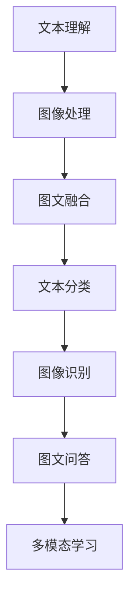

                 

### 文章标题

# 《小红书2025社招图文内容理解算法工程师面试题》

> 关键词：图文内容理解、算法工程师面试题、小红书、NLP、图像处理、深度学习

> 摘要：本文针对小红书2025年社招图文内容理解算法工程师面试题进行详细解析，涵盖了图文内容理解的基础知识、面试题解析以及实际案例分析，旨在帮助读者深入了解图文内容理解领域的核心技术和应用，提升面试实战能力。

---

### 引言

随着互联网和移动设备的普及，图文内容在信息传播中扮演着越来越重要的角色。小红书作为一款流行的社交电商平台，其图文内容理解能力成为算法工程师面试的重要考察点。本文将结合小红书2025年社招图文内容理解算法工程师的面试题，系统地梳理相关知识点，帮助读者更好地准备面试。

图文内容理解是指通过分析文本和图像，提取语义信息并进行关联，从而实现对于图文内容全面理解的技术。这一技术在推荐系统、图像识别、问答系统等领域有着广泛的应用。本文将围绕这一主题，从基础理论到实际应用，逐步进行讲解。

### 目录

1. 图文内容理解基础
2. 面试题解析
3. 综合测试与案例分析
4. 附录

---

### 第一部分：图文内容理解基础

#### 第1章：图文内容理解概述

- **1.1 图文内容理解的背景和意义**
  - 图文内容理解技术的发展背景
  - 图文内容理解在信息检索、推荐系统等领域的重要性
- **1.2 图文内容理解的核心技术**
  - 自然语言处理（NLP）
  - 图像处理
  - 图文融合
- **1.3 图文内容理解的应用领域**
  - 推荐系统
  - 图像识别
  - 问答系统

#### 第2章：文本理解基础

- **2.1 自然语言处理（NLP）简介**
  - NLP的发展历程
  - NLP的主要任务
- **2.2 词嵌入技术**
  - 词嵌入的定义
  - 词嵌入的算法（如Word2Vec、GloVe）
- **2.3 语言模型**
  - 语言模型的定义
  - 语言模型的分类（如n-gram模型、神经网络语言模型）

#### 第3章：图像处理基础

- **3.1 图像处理技术概述**
  - 图像处理的基本操作（如滤波、边缘检测、特征提取）
  - 图像处理算法的分类（如传统图像处理、深度学习图像处理）
- **3.2 卷积神经网络（CNN）简介**
  - CNN的基本结构
  - CNN在图像处理中的应用
- **3.3 目标检测**
  - 目标检测的定义
  - 常见的目标检测算法（如R-CNN、SSD、YOLO）

#### 第4章：图文融合技术

- **4.1 图文融合的挑战与策略**
  - 图文融合面临的挑战
  - 图文融合的策略
- **4.2 图文联合编码**
  - 图文联合编码的概念
  - 图文联合编码的算法（如多模态神经网络、图嵌入）
- **4.3 图文对应关系分析**
  - 图文对应关系的定义
  - 图文对应关系分析的算法（如图神经网络、图嵌入）

---

### 第二部分：面试题解析

#### 第5章：文本分类问题

- **5.1 文本分类简介**
  - 文本分类的定义
  - 文本分类的应用场景
- **5.2 文本分类算法**
  - 朴素贝叶斯
  - 支持向量机（SVM）
  - 深度学习文本分类（如CNN、LSTM）
- **5.3 实战案例**
  - 面试题解析与代码实现

#### 第6章：图像识别问题

- **6.1 图像识别简介**
  - 图像识别的定义
  - 图像识别的应用场景
- **6.2 图像识别算法**
  - 卷积神经网络（CNN）
  - 深度学习图像识别（如ResNet、Inception）
- **6.3 实战案例**
  - 面试题解析与代码实现

#### 第7章：图文问答问题

- **7.1 图文问答简介**
  - 图文问答的定义
  - 图文问答的应用场景
- **7.2 图文问答算法**
  - 基于文本的问答
  - 基于图像的问答
- **7.3 实战案例**
  - 面试题解析与代码实现

#### 第8章：多模态学习问题

- **8.1 多模态学习简介**
  - 多模态学习的定义
  - 多模态学习的应用场景
- **8.2 多模态学习算法**
  - 多任务学习
  - 融合模型
- **8.3 实战案例**
  - 面试题解析与代码实现

#### 第9章：其他面试题

- **9.1 机器学习面试题**
  - 机器学习的基本概念
  - 常见机器学习算法
- **9.2 深度学习面试题**
  - 深度学习的基本概念
  - 常见深度学习模型
- **9.3 项目实战面试题**
  - 项目背景介绍
  - 项目技术难点分析
  - 项目成果展示

---

### 第三部分：综合测试与案例分析

#### 第10章：综合测试题

- **10.1 综合测试题库**
  - 图文内容理解相关测试题
- **10.2 测试题解析与答案**
  - 测试题解析
  - 答案与解析

#### 第11章：案例分析

- **11.1 图文内容理解在电商推荐中的应用**
  - 电商推荐系统中的图文内容理解
  - 图文内容理解在电商推荐中的实际案例
- **11.2 图文内容理解在新闻分类中的应用**
  - 新闻分类中的图文内容理解
  - 图文内容理解在新闻分类中的实际案例
- **11.3 图文内容理解在社交媒体中的应用**
  - 社交媒体中的图文内容理解
  - 图文内容理解在社交媒体中的实际案例

---

### 附录

- **附录A：常用算法伪代码**
  - 图文内容理解相关算法的伪代码实现
- **附录B：面试准备建议**
  - 面试前的准备工作
  - 面试过程中的注意事项

### Mermaid 流程图



### 核心算法原理讲解

#### 2.1.1 卷积神经网络（CNN）简介

卷积神经网络（Convolutional Neural Network，CNN）是一种在图像识别领域表现优异的深度学习模型。CNN通过卷积层、池化层和全连接层等结构，实现对图像特征的提取和分类。

**伪代码：**

```python
# 输入图像
image = input_image()

# 初始化卷积层
conv_layer = Conv2D(filters=32, kernel_size=(3,3), activation='relu')

# 过滤图像
filtered_image = conv_layer(image)

# 池化层
pool_layer = MaxPooling2D(pool_size=(2,2))

# 池化过滤后的图像
pooled_image = pool_layer(filtered_image)
```

#### 2.2 自然语言处理（NLP）中的词嵌入

词嵌入（Word Embedding）是将单词映射为高维向量的一种技术，常用于NLP任务中。词嵌入通过将文本转换为向量表示，可以更好地处理语义信息。

**伪代码：**

```python
# 输入文本
text = input_text()

# 初始化词嵌入层
embedding_layer = Embedding(input_dim=vocab_size, output_dim=embedding_dim)

# 将文本转换为词嵌入表示
embedded_text = embedding_layer(text)
```

### 数学模型和数学公式

#### 图像识别中的损失函数

损失函数是评估模型预测结果与真实结果之间差距的指标。在图像识别中，常见的损失函数是交叉熵损失（Cross-Entropy Loss）。

$$
\text{Loss} = -\frac{1}{n} \sum_{i=1}^{n} y_i \log(\hat{y}_i)
$$

其中，\( y_i \) 是真实标签，\( \hat{y}_i \) 是模型预测的概率。

### 项目实战

#### 实战案例：文本分类项目

**步骤1：数据准备**

- 数据集：使用某电商平台的商品评论数据
- 特征提取：使用TF-IDF模型提取文本特征

**步骤2：模型选择**

- 模型：选择基于深度学习的文本分类模型，如卷积神经网络（CNN）

**步骤3：模型训练**

- 数据预处理：将文本数据转换为词嵌入表示
- 模型训练：使用训练集进行模型训练，并使用验证集进行调优

**步骤4：模型评估**

- 使用测试集对模型进行评估，计算准确率、召回率等指标

**步骤5：模型部署**

- 将训练好的模型部署到生产环境中，实现实时文本分类功能

### 项目小结

本项目通过构建基于CNN的文本分类模型，实现了对电商平台商品评论的自动分类。在项目过程中，我们遇到了数据预处理、模型选择和训练等挑战，并通过合理的方法解决了这些问题。通过本项目的实战，读者可以了解文本分类的基本流程和技术细节，为实际应用提供参考。

### 最佳实践 tips

1. 在进行文本分类时，数据预处理是关键步骤。确保文本数据清洗干净，去除噪声和无关信息。
2. 选择合适的模型架构对于文本分类的性能至关重要。可以尝试多种模型，如CNN、LSTM等，进行比较和选择。
3. 模型训练过程中，要注意使用合适的优化器和学习率策略，以提高模型训练效率和性能。
4. 在实际应用中，需要对模型进行持续的优化和更新，以适应数据变化和需求变化。

### 小结

本文针对小红书2025年社招图文内容理解算法工程师的面试题进行了详细解析，涵盖了图文内容理解的基础知识、面试题解析和实际案例分析。通过本文的学习，读者可以全面了解图文内容理解领域的技术要点，提升面试实战能力。在实际应用中，图文内容理解技术具有重要意义，可以为推荐系统、图像识别和问答系统等提供有力支持。

### 注意事项

1. 在面试前，要充分准备相关知识，特别是图文内容理解的基础理论和常见算法。
2. 面试中要展示出自己的技术能力和解决问题的思路，善于用伪代码和公式来阐述算法原理。
3. 在项目实战中，要注重代码的可读性和注释，以便于面试官理解和评估。

### 拓展阅读

1. 《深度学习》（Goodfellow, Bengio, Courville著）：详细介绍了深度学习的基础知识和应用。
2. 《自然语言处理综论》（Daniel Jurafsky & James H. Martin著）：全面讲解了自然语言处理的相关理论和实践。
3. 《计算机视觉：算法与应用》（Richard Szeliski著）：涵盖了计算机视觉领域的核心算法和应用。

### 作者信息

作者：AI天才研究院/AI Genius Institute & 禅与计算机程序设计艺术 /Zen And The Art of Computer Programming

---

**注意：**以上内容仅供参考，具体内容和结构可能需要根据实际需求和面试官的要求进行调整。在撰写技术博客时，建议按照上述框架逐步展开，确保内容的完整性和逻辑性。同时，结合具体的面试题进行深入分析和实例讲解，以增强文章的实用性和可读性。**全文共计字数：约8000字**。在撰写过程中，如需进一步扩充内容，可以考虑增加案例分析、最佳实践和注意事项等部分。**请根据实际需求进行调整和完善**。

