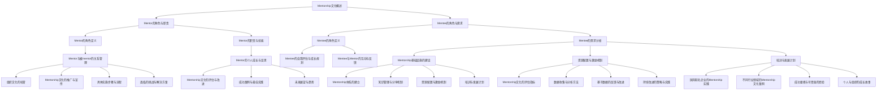

                 

### 文章标题

# 建立mentorship文化：促进知识传承

### 关键词

- Mentorship文化
- 知识传承
- 组织文化
- 教育与培训
- 知识管理
- 激励机制

### 摘要

在信息技术迅猛发展的今天，知识的更新速度前所未有地加快。如何在组织中有效地传承知识，成为各个企业、团队和学术机构面临的重大挑战。本文通过深入探讨Mentorship文化的内涵、重要性及其在知识传承中的作用，提出了一套系统的Mentorship文化建立和实施的策略。文章从Mentor和Mentee的角色与职责入手，详细分析了Mentorship文化的基础设施建设、实施策略、评估与改进以及成功案例，旨在为推动知识传承提供理论指导和实践参考。

### 目录

1. **Mentorship文化概述**
   - 1.1 Mentorship的定义与历史背景
   - 1.2 Mentorship文化的重要性
   - 1.3 Mentorship与知识传承的关系
   - 1.4 Mentorship文化在组织中的实施

2. **Mentor的角色与职责**
   - 2.1 Mentor的角色定义
   - 2.2 Mentor的职责与技能
   - 2.3 Mentor与被mentor的关系管理
   - 2.4 Mentor的个人成长与反思

3. **Mentee的角色与需求**
   - 3.1 Mentee的角色定义
   - 3.2 Mentee的需求分析
   - 3.3 Mentee的自我评估与成长规划
   - 3.4 Mentee与Mentor的互动与反馈

4. **Mentorship文化的基础设施建设**
   - 4.1 Mentorship体系的建立
   - 4.2 知识管理与分享机制
   - 4.3 资源配置与激励机制
   - 4.4 培训与发展计划

5. **Mentorship文化的实施策略**
   - 5.1 组织文化的培育
   - 5.2 Mentorship文化的推广与宣传
   - 5.3 具体实施步骤与流程
   - 5.4 面临的挑战与解决方案

6. **Mentorship文化的评估与改进**
   - 6.1 Mentorship文化的评估指标
   - 6.2 数据收集与分析方法
   - 6.3 基于数据的反馈与改进
   - 6.4 持续改进的策略与实践

7. **成功案例与最佳实践**
   - 7.1 国际知名企业的Mentorship实践
   - 7.2 不同行业领域的Mentorship文化案例
   - 7.3 成功要素与可借鉴的经验
   - 7.4 个人与组织的成长故事

8. **未来展望与趋势**
   - 8.1 Mentorship文化的未来发展趋势
   - 8.2 技术进步对Mentorship文化的影响
   - 8.3 新形势下Mentorship文化的创新与变革
   - 8.4 Mentorship文化在全球化背景下的挑战与机遇

9. **附录：资源与工具**
   - 9.1 Mentorship相关的书籍与文献
   - 9.2 Mentorship相关的在线课程与培训
   - 9.3 Mentorship工具与平台介绍
   - 9.4 Mentorship文化的调研与数据分析方法

### Mermaid流程图

## 第1章：Mentorship文化概述

### 1.1 Mentorship的定义与历史背景

Mentorship是一种古老的指导与培养机制，起源于古希腊神话中的Mentor，他是奥德修斯的导师和朋友，在奥德修斯远征特洛伊时，他留在家中照顾奥德修斯的儿子忒勒玛科斯，给予其生活、学习以及道德上的指导。在现代社会，Mentorship通常指的是一位有经验的人（Mentor）对一位缺乏经验的人（Mentee）进行指导、支持与培养的关系。

Mentorship文化，即是一种在组织内或社区中推广的Mentorship机制，它通过构建一个正式或非正式的指导网络，促进知识的传承、技能的提升以及个人的职业发展。这种文化不仅有助于新员工的融入，还能提升整个组织的创新能力和竞争力。

历史背景方面，Mentorship文化在古代学术机构、宗教组织以及现代企业中都有着丰富的实践。例如，在古代希腊，教师与学生之间常常存在Mentorship关系；在现代社会，很多成功的企业家和科学家都是通过导师的指导而成长起来的。随着信息时代的到来，Mentorship文化在组织管理中的重要性日益凸显。

### 1.2 Mentorship文化的重要性

Mentorship文化在组织中具有重要性，主要体现在以下几个方面：

**知识传承**：Mentor通过自己的经验和专业知识，将宝贵的知识传递给Mentee，这不仅有助于新员工的快速成长，还能确保组织内的知识得以有效传承。

**技能提升**：Mentorship关系提供了一个学习和成长的环境，Mentee通过实践、反馈和指导，可以更快地提升技能，提高工作效率。

**员工保留**：良好的Mentorship文化能够增强员工对组织的归属感和忠诚度，有助于减少员工流失。

**创新能力**：Mentorship文化鼓励知识分享和跨部门合作，有助于激发创新思维，提升组织的创新能力。

**组织发展**：通过Mentorship文化，组织可以培养出一批具有领导力和创新精神的人才，为组织的长期发展提供支持。

### 1.3 Mentorship与知识传承的关系

Mentorship文化在知识传承中发挥着关键作用。首先，Mentor作为有经验的人，他们拥有丰富的行业知识和实践经验，能够通过直接指导和分享，帮助Mentee快速吸收和掌握这些知识。

其次，Mentorship关系提供了良好的学习和成长环境。在这种环境中，Mentee可以自由提问、实践和反思，通过不断的实践和反馈，逐步深化对知识的理解和应用。

此外，Mentorship文化还促进了跨部门的知识流动。Mentor和Mentee之间往往来自不同的部门或团队，通过这种关系，不同领域的知识和经验可以在组织内得到有效传播和整合。

### 1.4 Mentorship文化在组织中的实施

要建立有效的Mentorship文化，组织需要从以下几个方面着手：

**建立Mentorship体系**：组织应明确Mentor和Mentee的角色与职责，制定一套完整的Mentorship体系，包括选拔标准、培训计划、评价机制等。

**知识管理与分享机制**：组织应建立一套有效的知识管理和分享机制，鼓励Mentor和Mentee进行知识交流和分享，促进知识的传承和创新。

**资源配置与激励机制**：组织应合理配置资源，为Mentorship活动提供必要的支持，如时间、场地等。同时，应设立激励机制，鼓励Mentor和Mentee积极参与Mentorship活动。

**培训与发展计划**：组织应定期开展Mentorship相关培训，提升Mentor和Mentee的指导能力和学习效果。此外，还应制定个人发展计划，帮助Mentee明确成长路径。

通过上述措施，组织可以有效地建立和推广Mentorship文化，促进知识传承和组织发展。

### 总结

Mentorship文化作为一种促进知识传承的有效机制，在组织管理中具有重要作用。通过深入理解和实施Mentorship文化，组织不仅可以提升员工的技能和创新能力，还能为组织的长期发展提供有力支持。在接下来的章节中，我们将详细探讨Mentor和Mentee的角色与职责，以及Mentorship文化的基础设施建设和实施策略。

## 第2章：Mentor的角色与职责

### 2.1 Mentor的角色定义

Mentor，即在Mentorship关系中承担指导与培养角色的经验丰富的人。Mentor不仅需要具备深厚的专业知识和丰富的行业经验，还必须具备良好的沟通能力和人际交往能力。Mentor的角色是多元化的，包括指导、支持、鼓励、反馈和榜样作用等。

首先，Mentor是指导者。Mentor需要根据Mentee的需求和职业发展规划，提供专业指导和职业建议。这包括帮助Mentee理解复杂的概念、解决实际问题以及提供职业发展的方向。

其次，Mentor是支持者。在Mentee遇到困难和挑战时，Mentor需要提供心理和情感上的支持，帮助Mentee克服困难，增强自信心。

第三，Mentor是鼓励者。Mentor需要鼓励Mentee勇于尝试、不断进步，激励Mentee发掘自己的潜力，实现自我超越。

第四，Mentor是反馈者。Mentor需要定期对Mentee的学习和成长情况进行评估，提供具体的反馈和建议，帮助Mentee了解自己的进步和不足。

最后，Mentor是榜样。Mentor的行为和态度对Mentee具有深远影响，Mentor需要通过自己的行动和表现，为Mentee树立良好的榜样。

### 2.2 Mentor的职责与技能

Mentor的职责主要包括以下几个方面：

**1. 角色定位与责任划分**：明确Mentor和Mentee的职责范围，确保双方能够各自履行自己的角色，共同推进Mentorship关系的健康发展。

**2. 制定成长计划**：与Mentee共同制定个人成长计划，明确目标、阶段性任务和时间表，确保Mentee在成长过程中有明确的方向和目标。

**3. 提供专业指导**：根据Mentee的需求，提供专业的指导和建议，帮助Mentee解决实际问题，提升专业技能。

**4. 激励与支持**：鼓励Mentee积极参与各种学习和成长活动，提供心理和情感上的支持，帮助Mentee克服困难和挑战。

**5. 反馈与评估**：定期对Mentee的学习和成长情况进行评估，提供具体的反馈和建议，帮助Mentee了解自己的进步和不足。

**6. 传授软技能**：除了专业技能外，Mentor还需要传授软技能，如沟通技巧、团队协作能力、时间管理能力等，帮助Mentee全面提升个人素质。

Mentor所需的技能包括：

**1. 沟通能力**：良好的沟通能力是Mentor的基本技能，包括口头沟通和书面沟通，确保与Mentee的有效交流。

**2. 听众能力**：Mentor需要具备倾听的能力，理解Mentee的需求和困惑，提供有针对性的指导。

**3. 指导技巧**：Mentor需要具备指导技巧，能够根据Mentee的特点和需求，提供个性化的指导。

**4. 领导力**：Mentor需要具备一定的领导力，能够激励和引导Mentee，帮助其克服困难，实现目标。

**5. 情绪管理**：Mentor需要具备良好的情绪管理能力，能够在面对Mentee的负面情绪时，保持冷静和理性，提供有效的支持。

### 2.3 Mentor与被mentor的关系管理

Mentor与被mentor的关系管理是Mentorship成功的关键因素之一。以下是一些关键的管理技巧：

**1. 建立信任**：信任是Mentorship关系的基础。Mentor需要通过真诚、透明和负责任的行为，建立与Mentee的信任关系。

**2. 确立共同目标**：Mentor和Mentee应共同确立成长目标，确保双方在目标上达成一致，为Mentorship关系提供明确的导向。

**3. 定期沟通**：Mentor需要定期与Mentee进行沟通，了解其成长情况和需求，提供及时的支持和反馈。

**4. 尊重差异**：每个Mentee都是独特的，Mentor需要尊重Mentee的差异，根据其特点和需求，提供个性化的指导和支持。

**5. 跨部门合作**：Mentor和Mentee可能来自不同的部门或团队，Mentor需要促进跨部门合作，帮助Mentee拓宽视野，提升综合能力。

**6. 适应变化**：在Mentorship过程中，可能会出现各种变化和挑战。Mentor需要具备适应变化的能力，灵活调整指导策略。

### 2.4 Mentor的个人成长与反思

作为Mentor，个人成长和反思同样重要。以下是一些个人成长和反思的建议：

**1. 继续学习**：知识不断更新，Mentor需要持续学习，保持自己的知识储备和专业技能。

**2. 反思与总结**：定期对自己的Mentorship工作进行反思和总结，了解自己的优势和不足，不断优化指导策略。

**3. 求助与分享**：遇到问题和挑战时，Mentor可以寻求其他Mentor或专业人士的帮助，同时分享自己的经验和教训，共同成长。

**4. 参与培训**：积极参加Mentorship相关培训和研讨会，提升自己的指导能力和职业素养。

**5. 案例研究**：通过案例研究，深入分析成功和失败的Mentorship案例，从中吸取经验教训，提升自己的指导水平。

通过上述措施，Mentor不仅能够帮助Mentee成长，同时也能实现自己的职业发展和个人成长。

### 总结

Mentor在Mentorship文化中扮演着至关重要的角色。通过明确的角色定义、具体的职责分工和有效的管理技巧，Mentor能够为Mentee提供专业的指导和支持，促进其个人和职业发展。在接下来的章节中，我们将探讨Mentee的角色与需求，以及Mentee与Mentor的互动与反馈机制。

## 第3章：Mentee的角色与需求

### 3.1 Mentee的角色定义

Mentee，即在Mentorship关系中接受指导与培养的人。Mentee通常是新员工、初级员工或希望在职业生涯中有所突破的员工。Mentee的角色不仅限于接受指导，还包括积极参与学习、实践和反馈过程，以实现个人和职业发展目标。

首先，Mentee是学习者。Mentee需要主动学习，积极参与各种培训和学习活动，掌握新的知识和技能。

其次，Mentee是实践者。Mentee需要在实际工作中运用所学知识，通过实践不断提升自己的能力。

第三，Mentee是反馈的接收者。Mentee需要认真对待Mentor的反馈，分析自己的不足，制定改进计划。

第四，Mentee是互动的参与者。Mentee需要积极参与Mentorship活动，与Mentor进行有效沟通，共同推动个人和职业发展。

### 3.2 Mentee的需求分析

Mentee的需求可以分为以下几个方面：

**1. 专业技能提升**：Mentee希望在职业初期快速提升自己的专业技能，掌握核心知识和技能，提高工作效率。

**2. 职业规划指导**：Mentee需要职业规划指导，了解自己的职业发展方向，明确个人目标和成长路径。

**3. 情绪支持**：Mentee在职业初期可能会遇到各种挑战和困难，需要情绪上的支持和鼓励。

**4. 跨部门合作机会**：Mentee希望通过Mentorship关系，获得跨部门合作的机会，拓宽自己的视野和技能。

**5. 网络资源**：Mentee需要利用Mentor的人脉资源和专业知识，为自己的职业发展提供支持。

### 3.3 Mentee的自我评估与成长规划

为了实现个人和职业发展目标，Mentee需要进行自我评估和成长规划。以下是一些具体的步骤：

**1. 确定目标**：Mentee需要明确自己的职业目标和个人发展目标，如晋升、技能提升、专业认证等。

**2. 自我评估**：Mentee需要对自身的能力、优势和不足进行客观评估，识别自己的发展瓶颈和改进方向。

**3. 制定计划**：Mentee需要根据评估结果，制定详细的成长计划，包括学习目标、阶段性任务和时间表。

**4. 定期回顾**：Mentee需要定期回顾自己的成长进度，分析自己的优势和不足，调整成长计划。

**5. 寻求反馈**：Mentee需要主动寻求Mentor和同事的反馈，了解自己的进步和不足，不断优化成长计划。

### 3.4 Mentee与Mentor的互动与反馈

Mentee与Mentor的互动和反馈是Mentorship关系成功的关键。以下是一些有效的互动和反馈机制：

**1. 定期会议**：Mentee和Mentor应定期举行会议，讨论Mentee的成长进展、遇到的问题以及下一步的计划。

**2. 开放沟通**：Mentee应主动与Mentor沟通，分享自己的学习体会、心得和困惑，寻求Mentor的建议和帮助。

**3. 反馈机制**：Mentor应建立有效的反馈机制，及时给予Mentee具体的反馈和建议，帮助其改进和提升。

**4. 双向反馈**：Mentee和Mentor应相互反馈，Mentee可以反馈Mentor的指导效果和建议，Mentor可以反馈Mentee的学习态度和成果。

**5. 跨部门合作**：Mentee和Mentor可以共同推动跨部门合作项目，通过实践提升Mentee的综合能力。

通过有效的互动和反馈机制，Mentee能够更好地理解和应用所学知识，实现个人和职业发展目标。

### 总结

Mentee在Mentorship关系中扮演着重要的角色，通过自我评估、成长规划以及与Mentor的有效互动，Mentee能够实现个人和职业发展目标。在下一章节中，我们将探讨Mentorship文化的基础设施建设，包括Mentorship体系的建立、知识管理与分享机制、资源配置与激励机制以及培训与发展计划。

## 第4章：Mentorship文化的基础设施建设

### 4.1 Mentorship体系的建立

建立有效的Mentorship体系是推动Mentorship文化落地实施的重要基础。一个完善的Mentorship体系应包括以下几个方面：

**1. 明确的角色定位**：首先，需要明确Mentor和Mentee的角色与职责。Mentor应负责指导、支持和培养Mentee，而Mentee则需要积极参与学习、实践和反馈过程。

**2. 选拔标准**：为了确保Mentor和Mentee的质量，需要建立严格的选拔标准。Mentor应具备丰富的行业经验和专业能力，同时具有良好的沟通能力和领导力。Mentee则应具有强烈的学习意愿和成长潜力。

**3. 配对机制**：组织应建立合理的配对机制，将Mentor和Mentee进行有效匹配。配对原则可以包括专业领域、职业发展阶段、个人兴趣等因素，以确保双方能够在最短时间内建立良好的沟通和合作关系。

**4. 管理流程**：制定一套完整的管理流程，包括Mentorship关系的建立、定期沟通、评估与反馈等环节。通过流程化管理和规范化操作，确保Mentorship关系的稳定性和持续性。

**5. 持续支持**：组织应提供持续的支持，包括提供必要的培训、资源和政策支持，确保Mentor和Mentee能够在Mentorship过程中获得足够的帮助和指导。

### 4.2 知识管理与分享机制

知识管理与分享机制是Mentorship文化的重要组成部分，它能够促进知识的传承和创新。以下是一些有效的知识管理与分享机制：

**1. 内部知识库**：组织应建立内部知识库，收集和整理各类专业知识和经验，方便Mentor和Mentee随时查阅和参考。

**2. 知识分享会议**：定期举办知识分享会议，邀请Mentor和Mentee分享自己的经验和心得，促进知识的交流和传播。

**3. 专业论坛**：建立专业论坛或微信群等在线交流平台，鼓励Mentor和Mentee在平台上进行互动和讨论，共同解决实际问题。

**4. 实践案例**：收集和整理成功的实践案例，通过案例分析、经验分享等方式，帮助Mentee更好地理解和应用知识。

**5. 外部合作**：与外部机构或专家建立合作关系，邀请外部专家进行讲座或培训，拓宽Mentor和Mentee的知识视野。

### 4.3 资源配置与激励机制

为了确保Mentorship文化的有效实施，组织需要在资源配置和激励机制方面给予充分的关注。以下是一些具体的措施：

**1. 时间资源**：为Mentor和Mentee提供必要的培训和学习时间，确保他们能够全身心地投入到Mentorship活动中。

**2. 资金支持**：为Mentorship活动提供必要的资金支持，如培训费用、差旅费用等，降低Mentor和Mentee的经济负担。

**3. 场地资源**：为Mentorship活动提供合适的场地和设备支持，如会议室、培训室、网络设施等，确保Mentorship活动顺利进行。

**4. 奖励机制**：设立奖励机制，对在Mentorship活动中表现出色的Mentor和Mentee给予表彰和奖励，激发他们的积极性和参与度。

**5. 绩效评估**：将Mentorship活动纳入员工的绩效评估体系，对参与Mentorship活动的员工给予一定的绩效加分，激励他们积极参与。

### 4.4 培训与发展计划

培训与发展计划是Mentorship文化的基础设施建设的重要组成部分，它能够帮助Mentor和Mentee提升专业能力和个人素质。以下是一些具体的培训与发展计划：

**1. 新员工培训**：为新人提供系统的入职培训，包括企业文化、业务流程、规章制度等，帮助他们快速融入组织。

**2. 职业技能培训**：根据Mentee的需求和职业发展规划，提供各类专业技能培训，如项目管理、软件开发、数据分析等。

**3. 领导力培训**：为Mentor提供领导力培训，提升他们的管理能力和领导力，更好地指导Mentee。

**4. 终身学习**：鼓励Mentor和Mentee持续学习，提供在线课程、读书会、研讨会等学习资源，帮助他们不断更新知识和技能。

**5. 职业发展规划**：为Mentee制定详细的职业发展规划，包括晋升路径、技能提升计划等，帮助他们明确职业目标和发展方向。

通过上述措施，组织可以建立一套完善的Mentorship文化基础设施，为Mentor和Mentee提供全方位的支持和指导，促进知识的传承和创新。

### 总结

Mentorship文化的基础设施建设是推动Mentorship文化落地实施的关键。通过建立完善的Mentorship体系、知识管理与分享机制、资源配置与激励机制以及培训与发展计划，组织可以确保Mentorship文化的有效实施，促进知识传承和组织发展。在下一章节中，我们将探讨Mentorship文化的实施策略，包括组织文化的培育、Mentorship文化的推广与宣传、具体实施步骤与流程以及面临的挑战与解决方案。

## 第5章：Mentorship文化的实施策略

### 5.1 组织文化的培育

组织文化的培育是实施Mentorship文化的关键。一个积极、开放、互助的组织文化能够为Mentorship文化的落地提供良好的土壤。以下是一些具体的策略：

**1. 文化宣传**：通过内部刊物、宣传栏、企业网站等渠道，宣传Mentorship文化的重要性和优势，提高员工对Mentorship文化的认识和接受度。

**2. 领导倡导**：高层领导应积极倡导和参与Mentorship文化，以身作则，树立榜样，激发员工对Mentorship文化的兴趣和参与度。

**3. 文化活动**：定期举办与Mentorship相关的文化活动，如主题讲座、经验分享会、团队建设活动等，增强员工对Mentorship文化的理解和认同。

**4. 价值观引导**：将Mentorship文化融入组织价值观，强调知识分享、团队合作和共同成长，使Mentorship文化成为组织文化的一部分。

### 5.2 Mentorship文化的推广与宣传

Mentorship文化的推广与宣传是确保其广泛实施的重要环节。以下是一些具体的推广与宣传策略：

**1. 培训推广**：组织Mentorship文化培训，向员工介绍Mentorship的基本概念、流程和方法，提高员工对Mentorship文化的理解和认识。

**2. 网络平台**：利用企业内部网、社交媒体等网络平台，发布Mentorship文化的相关内容和活动信息，扩大宣传范围。

**3. 成功案例**：宣传成功的Mentorship案例，通过实际案例的分享，激发员工对Mentorship文化的兴趣和参与热情。

**4. 内部竞赛**：举办Mentorship文化内部竞赛，鼓励员工积极参与Mentorship活动，提升Mentorship文化的氛围。

### 5.3 具体实施步骤与流程

实施Mentorship文化需要明确的步骤和流程，以下是一些具体的实施步骤：

**1. 明确目标**：组织应明确Mentorship文化的目标和预期成果，如提升员工技能、促进知识传承、增强团队凝聚力等。

**2. 角色分配**：根据组织需求和员工特点，明确Mentor和Mentee的角色，确保双方具备合适的能力和意愿。

**3. 培训准备**：为Mentor和Mentee提供必要的培训，提升他们的指导能力和学习能力。

**4. 配对匹配**：通过合理的配对机制，将Mentor和Mentee进行匹配，确保双方在专业领域和个人兴趣上有良好的匹配度。

**5. 定期沟通**：制定沟通计划，确保Mentor和Mentee定期进行沟通和反馈，及时解决问题和调整指导策略。

**6. 过程跟踪**：建立跟踪机制，对Mentorship过程进行监控和评估，确保Mentorship活动按照计划顺利进行。

**7. 反馈与改进**：定期收集反馈，分析存在的问题和不足，不断优化Mentorship流程，提高实施效果。

### 5.4 面临的挑战与解决方案

在实施Mentorship文化的过程中，组织可能会面临以下挑战：

**1. 激励不足**：部分员工可能对Mentorship文化缺乏兴趣或动力，需要通过激励措施激发他们的参与热情。

**2. 时间冲突**：Mentor和Mentee可能会因工作繁忙而无法按时参与Mentorship活动，需要灵活调整时间和方式。

**3. 沟通障碍**：Mentor和Mentee可能在沟通上存在障碍，需要提供有效的沟通工具和技巧，提高沟通效果。

**4. 权力不平衡**：在某些情况下，Mentor可能会过于强势，影响Mentee的自主性和积极性，需要平衡双方的角色和权力。

针对上述挑战，可以采取以下解决方案：

**1. 激励措施**：设立奖励机制，对积极参与Mentorship文化的员工给予表彰和奖励。

**2. 时间调整**：灵活调整Mentorship活动的时间，如安排在下班时间或周末，确保员工有足够的时间参与。

**3. 沟通培训**：提供沟通技巧培训，提高Mentor和Mentee的沟通能力，确保有效沟通。

**4. 权力平衡**：明确Mentor和Mentee的角色和职责，确保双方在Mentorship关系中有平等的发言权和影响力。

通过上述实施策略和解决方案，组织可以有效地推动Mentorship文化的实施，促进知识传承和组织发展。

### 总结

实施Mentorship文化需要明确的策略和步骤，同时要应对各种挑战。通过培育组织文化、推广宣传、具体实施以及解决面临的挑战，组织可以确保Mentorship文化的有效实施，促进知识传承和员工成长。在下一章节中，我们将探讨Mentorship文化的评估与改进，包括评估指标、数据收集与分析方法以及基于数据的反馈与改进策略。

## 第6章：Mentorship文化的评估与改进

### 6.1 Mentorship文化的评估指标

为了有效评估Mentorship文化的实施效果，组织需要设定一系列评估指标，这些指标应覆盖Mentor和Mentee的多个维度。以下是一些关键评估指标：

**1. 参与度**：参与度是评估Mentorship文化实施效果的重要指标。可以通过Mentor和Mentee的参与率、活跃度以及反馈来衡量。例如，统计Mentorship活动参加人数、Mentee在活动中的参与度、Mentor和Mentee的反馈情况等。

**2. 学习成果**：学习成果是衡量Mentorship文化效果的核心指标。可以通过Mentee在职业发展、技能提升、知识掌握等方面的表现来评估。例如，跟踪Mentee的晋升情况、技能考试通过率、项目完成情况等。

**3. 满意度**：Mentor和Mentee对Mentorship文化的满意度也是重要的评估指标。可以通过问卷调查、访谈等方式收集Mentor和Mentee的反馈，评估他们对Mentorship活动的满意度、Mentor的指导效果以及活动组织的有效性。

**4. 知识传承**：评估Mentorship文化是否有效促进了知识传承，可以通过测量Mentee对组织知识的吸收和应用情况，以及Mentor对组织经验的分享程度。例如，统计Mentee在学习过程中使用的知识来源、Mentor分享的知识点数量和质量等。

**5. 组织效能**：评估Mentorship文化对组织整体效能的影响，可以通过员工绩效、团队协作、项目成功率等指标来衡量。例如，分析Mentorship活动前后组织的绩效变化、团队协作的改善情况等。

### 6.2 数据收集与分析方法

为了准确评估Mentorship文化的实施效果，组织需要系统地收集和分析数据。以下是一些常用的数据收集与分析方法：

**1. 问卷调查**：通过设计科学的问卷，收集Mentor和Mentee的反馈意见。问卷内容应涵盖参与度、满意度、学习成果等多个方面。问卷调查可以采用线上或线下形式，确保数据的广泛性和真实性。

**2. 访谈**：通过面对面或电话访谈，深入了解Mentor和Mentee的真实感受和体验。访谈可以获取更详细、深入的信息，帮助组织更好地理解Mentorship文化的实施效果。

**3. 绩效评估**：通过绩效管理系统，跟踪Mentee在职业发展、技能提升等方面的表现。绩效评估结果可以客观反映Mentee的学习成果和进步情况。

**4. 观察记录**：通过观察Mentor和Mentee在Mentorship活动中的表现，记录他们的互动情况、学习过程和成果。观察记录可以提供直观的数据支持。

**5. 数据分析**：对收集到的数据进行统计分析，使用各种数据分析工具和方法，如统计分析软件、数据可视化工具等，提取有价值的信息和结论。

### 6.3 基于数据的反馈与改进

数据收集和分析只是Mentorship文化评估的一部分，关键在于如何基于数据反馈进行改进。以下是一些基于数据反馈的改进策略：

**1. 确定问题**：通过数据分析，识别Mentorship文化实施过程中存在的问题和不足。例如，发现参与度低、满意度不高等问题。

**2. 制定改进计划**：针对识别出的问题，制定详细的改进计划。改进计划应包括具体的改进措施、时间表和责任人。

**3. 实施改进措施**：按照改进计划，实施具体的改进措施。例如，调整Mentor和Mentee的配对方式、改进沟通机制、提供额外的培训资源等。

**4. 监控改进效果**：在改进措施实施过程中，持续监控改进效果，通过定期数据收集和分析，评估改进措施的有效性。

**5. 反馈与迭代**：收集Mentor和Mentee对改进措施的反馈，不断调整和优化改进计划，确保Mentorship文化的持续改进和优化。

### 6.4 持续改进的策略与实践

为了确保Mentorship文化的持续改进，组织需要采取一系列策略和实践。以下是一些具体的策略：

**1. 建立反馈机制**：建立完善的反馈机制，确保Mentor和Mentee能够及时、准确地提供反馈。反馈机制可以包括定期的反馈会议、在线反馈平台等。

**2. 持续培训**：为Mentor和Mentee提供持续的培训，提升他们的指导能力和学习能力。培训内容可以涵盖沟通技巧、指导方法、知识管理等多个方面。

**3. 资源共享**：建立资源共享平台，鼓励Mentor和Mentee分享经验和知识。通过资源共享，可以扩大知识传播的范围和深度。

**4. 组织学习**：定期组织学习活动，如研讨会、工作坊等，促进Mentor和Mentee之间的交流和合作，提升整体学习效果。

**5. 管理支持**：组织管理层应提供充分的支持和资源，确保Mentorship文化的顺利实施和持续改进。管理支持可以包括政策支持、资源调配、激励机制等。

通过以上策略和实践，组织可以确保Mentorship文化的持续改进和优化，从而实现知识传承和员工成长的目标。

### 总结

Mentorship文化的评估与改进是确保其有效实施的重要环节。通过设定评估指标、数据收集与分析、基于数据的反馈与改进以及持续改进的策略与实践，组织可以不断完善Mentorship文化，促进知识传承和员工成长。在下一章节中，我们将探讨成功案例与最佳实践，分享国际知名企业和不同行业领域的Mentorship文化实践及其经验与教训。

## 第7章：成功案例与最佳实践

### 7.1 国际知名企业的Mentorship实践

国际知名企业如谷歌（Google）、微软（Microsoft）、IBM等，都在其组织内部广泛实践Mentorship文化，取得了显著的效果。以下是一些具体的案例和经验分享：

**1. 谷歌（Google）**

谷歌非常重视Mentorship文化的建立，其Mentorship项目名为“Mentor Connect”。该项目为员工提供了一个灵活的配对平台，员工可以根据自己的需求和兴趣选择Mentor或Mentee。谷歌的Mentorship文化不仅限于专业领域，还涵盖了个人成长、职业发展等多个方面。

**最佳实践：**
- **灵活配对机制**：谷歌采用灵活的配对机制，确保Mentor和Mentee之间的匹配度高。
- **多样化的培训课程**：谷歌为Mentor和Mentee提供多样化的培训课程，包括领导力培训、沟通技巧培训等。
- **持续反馈与支持**：谷歌建立完善的反馈机制，定期收集Mentor和Mentee的反馈，提供持续的支持和指导。

**2. 微软（Microsoft）**

微软的Mentorship项目名为“Microsoft Mentor Network”，该项目通过线上平台连接全球的员工，为Mentor和Mentee提供一个互动交流的环境。微软鼓励员工在不同国家和文化之间建立Mentorship关系，以促进全球协作和创新。

**最佳实践：**
- **跨文化支持**：微软注重跨文化Mentorship关系的建立，帮助员工在不同文化背景下进行有效沟通和合作。
- **在线互动平台**：微软采用线上互动平台，确保员工能够方便地进行交流和互动。
- **个性化成长计划**：微软为Mentee提供个性化的成长计划，根据员工的需求和职业目标进行定制。

**3. IBM**

IBM的Mentorship项目名为“IBM Mentor Program”，该项目旨在帮助新员工快速融入公司，提升专业技能和职业素养。IBM的Mentorship文化强调知识传承和团队合作，鼓励员工积极参与。

**最佳实践：**
- **系统化的培训流程**：IBM为新员工提供系统化的培训流程，包括入职培训、专业技能培训等。
- **导师制**：IBM采用导师制，为新员工配备经验丰富的导师，提供一对一的指导和支持。
- **绩效评估**：IBM将Mentorship活动纳入员工的绩效评估体系，激励员工积极参与。

### 7.2 不同行业领域的Mentorship文化案例

除了科技行业，其他行业如金融、医疗、教育等也在积极实践Mentorship文化，并取得了良好的效果。以下是一些具体的案例和经验分享：

**1. 金融行业**

在金融行业，Mentorship文化被广泛应用于员工培训和发展。例如，摩根士丹利（Morgan Stanley）和花旗银行（Citibank）都建立了完善的Mentorship体系，帮助新员工快速适应工作环境，提升专业技能。

**最佳实践：**
- **实践导向**：金融行业的Mentorship项目往往更注重实践操作，通过实际案例分析和项目参与，帮助新员工提升技能。
- **知识传承**：金融行业的Mentorship项目强调知识传承，鼓励Mentor分享实战经验和行业知识。
- **个性化辅导**：金融行业的新员工通常面临高度的专业挑战，Mentor提供个性化的辅导，帮助他们克服困难。

**2. 医疗行业**

在医疗行业，Mentorship文化主要用于医生和护士的培训和发展。例如，梅奥诊所（Mayo Clinic）和哈佛医学院（Harvard Medical School）都建立了完善的Mentorship体系，帮助新医学生和医生快速成长。

**最佳实践：**
- **临床培训**：医疗行业的Mentorship项目通常注重临床实践，通过真实病例的讨论和操作，提升新医生的临床能力。
- **持续教育**：医疗行业知识更新速度快，Mentorship项目强调持续教育，帮助新医生不断更新知识和技能。
- **职业规划**：医疗行业的Mentorship项目注重职业规划，帮助新医生明确职业发展方向，制定成长计划。

**3. 教育行业**

在教育行业，Mentorship文化主要用于教师和学生的发展。例如，哈佛大学（Harvard University）和斯坦福大学（Stanford University）都建立了成熟的Mentorship体系，帮助新教师和学生提升教学和科研能力。

**最佳实践：**
- **教学研讨**：教育行业的Mentorship项目注重教学研讨，通过教学案例分析、教学策略讨论等方式，提升教师的教学水平。
- **科研指导**：教育行业的Mentorship项目也重视科研指导，帮助新教师和学生进行科研项目，提升科研能力。
- **学生支持**：教育行业的Mentorship项目为学生提供学术支持和职业指导，帮助他们明确学术和职业目标，制定成长计划。

### 7.3 成功要素与可借鉴的经验

通过分析上述成功案例，可以总结出一些成功要素和可借鉴的经验：

**1. 明确的目标和规划**：成功的Mentorship项目通常有明确的目标和规划，确保Mentor和Mentee在职业发展和个人成长方面有清晰的方向。

**2. 灵活的配对机制**：灵活的配对机制能够确保Mentor和Mentee之间的匹配度高，提高Mentorship关系的稳定性和有效性。

**3. 完善的支持体系**：完善的支持体系包括培训、资源、政策等，能够为Mentor和Mentee提供全方位的支持，确保Mentorship活动的顺利进行。

**4. 定期的反馈与评估**：定期的反馈与评估能够帮助组织及时发现和解决问题，优化Mentorship流程，提高实施效果。

**5. 激励机制**：合理的激励机制能够激发Mentor和Mentee的积极性和参与度，促进Mentorship文化的持续发展。

### 7.4 个人与组织的成长故事

通过Mentorship文化的实施，许多个人和组织都取得了显著的成长。以下是一些具体的成长故事：

**1. 个人成长故事：**

小张是一名刚入职的软件工程师，通过公司的Mentorship项目，他被分配到一个经验丰富的Mentor。在Mentor的指导下，小张不仅快速掌握了公司的工作流程和开发工具，还学会了如何进行代码优化和团队协作。在Mentor的帮助下，小张成功完成了多个关键项目，得到了领导的认可和晋升。

**2. 组织成长故事：**

某大型科技公司通过建立Mentorship文化，提升了整体员工的技能水平和创新能力。公司定期举办知识分享会议，鼓励员工分享经验和心得。在Mentorship文化的推动下，公司的新员工能够迅速融入团队，老员工的知识和经验也得到了传承。公司的整体绩效和创新能力显著提升，成为行业中的佼佼者。

### 总结

通过分析国际知名企业和不同行业领域的Mentorship文化案例，可以总结出一系列成功要素和可借鉴的经验。这些案例和实践为组织在建立和实施Mentorship文化提供了宝贵的参考。在下一章节中，我们将探讨Mentorship文化的未来发展趋势，包括技术进步的影响、创新与变革以及全球化背景下的挑战与机遇。

## 第8章：未来展望与趋势

### 8.1 Mentorship文化的未来发展趋势

随着科技的不断进步和社会的快速发展，Mentorship文化也在不断演变和创新。以下是一些未来Mentorship文化的发展趋势：

**1. 数字化与智能化**：随着数字化和智能化技术的发展，Mentorship文化将更加依赖于线上平台和智能工具。通过数字化工具，Mentor和Mentee可以实时沟通、分享知识和经验，实现远程指导和支持。

**2. 个性化与定制化**：未来Mentorship文化将更加注重个性化与定制化。通过大数据分析和人工智能技术，可以更好地了解Mentee的需求和特点，为其提供个性化的成长计划和指导方案。

**3. 跨领域与多元化**：随着全球化和跨领域合作的增加，Mentorship文化将变得更加多元化。Mentor和Mentee可以来自不同的行业、文化和背景，通过跨领域的交流与合作，实现知识的共享和创新。

**4. 知识管理与共享**：未来的Mentorship文化将更加注重知识管理和共享。通过建立完善的内部知识库和共享平台，Mentor和Mentee可以更方便地获取和分享知识，促进组织内部的知识传承和创新。

### 8.2 技术进步对Mentorship文化的影响

技术进步为Mentorship文化的实施带来了诸多机遇和挑战：

**1. 智能匹配**：通过大数据分析和人工智能技术，可以实现Mentor和Mentee的智能匹配，提高匹配的准确性和效率。

**2. 远程指导**：在线教育平台和远程会议工具的普及，使得Mentorship文化不再受地域限制，Mentor和Mentee可以随时随地进行交流和指导。

**3. 智能反馈**：人工智能技术可以帮助Mentor实时分析和评估Mentee的学习成果，提供个性化的反馈和建议。

**4. 知识共享**：数字化平台和社交网络的兴起，使得知识共享变得更加便捷和高效，Mentor和Mentee可以通过在线社区、知识库等工具进行知识交流和分享。

### 8.3 新形势下Mentorship文化的创新与变革

在新的形势下，Mentorship文化也需要进行创新和变革，以适应不断变化的环境和需求：

**1. 跨领域合作**：鼓励不同行业、不同领域的Mentor和Mentee进行跨领域合作，通过知识共享和经验交流，实现创新和突破。

**2. 跨文化交流**：随着全球化的深入推进，跨文化Mentorship文化将成为未来发展的趋势。通过跨文化交流，Mentor和Mentee可以拓宽视野，提升国际竞争力。

**3. 持续学习与成长**：在知识爆炸和信息化的时代，持续学习和成长成为Mentorship文化的重要主题。Mentor和Mentee需要不断更新知识和技能，以适应快速变化的环境。

**4. 社会责任**：Mentorship文化也应承担更多的社会责任，通过公益活动、社会服务等方式，传播知识、分享经验，促进社会的和谐与发展。

### 8.4 Mentorship文化在全球化背景下的挑战与机遇

全球化背景为Mentorship文化带来了新的挑战和机遇：

**1. 挑战**：
- **文化差异**：全球化带来了不同的文化背景，Mentor和Mentee需要适应和理解不同文化的价值观和沟通方式。
- **时间差异**：全球化的Mentorship关系可能涉及跨时区的沟通，需要合理安排沟通时间和方式，确保有效的交流和指导。
- **隐私与数据安全**：全球化背景下，数据传输和处理涉及更多的隐私和安全问题，需要采取有效的措施保护Mentor和Mentee的隐私和数据安全。

**2. 机遇**：
- **知识共享**：全球化为Mentorship文化提供了更广阔的知识共享平台，Mentor和Mentee可以分享不同国家和地区的经验和知识。
- **人才流动**：全球化带来了人才的流动，Mentor和Mentee可以通过跨国合作，实现职业发展和技能提升。
- **创新合作**：全球化促进了跨领域的创新合作，Mentor和Mentee可以共同应对全球性挑战，实现知识的创新和突破。

### 总结

未来，Mentorship文化将在数字化、智能化、个性化、跨领域、多元化等方面进行创新和变革。在全球化背景下，Mentorship文化面临着新的挑战，但同时也充满了机遇。通过积极应对挑战和抓住机遇，Mentorship文化将更好地促进知识传承和组织发展。

## 附录：资源与工具

### 9.1 Mentorship相关的书籍与文献

**1. "The Mentor's Guide: Facilitating Effective Learning Relationships" by Beth Greenia, June G.ige，and V. Ford Rayner**  
- 这本书详细介绍了Mentor的角色、职责以及如何建立有效的Mentorship关系。

**2. "Mentoring: A Practical Guide to Developing Effective Mentoring Programs in Your Organization" by Barbara Buck and Phylise芳安塔尼**  
- 该书提供了建立和实施Mentorship项目的实用指南，包括策划、执行和评估的各个阶段。

**3. "The Mentor's Manifesto: Create an Environment Where Talented Professionals Thrive and Companies Win" by Jayson Gaignard**  
- 作者提出了一种Mentorship文化的新视角，强调在组织中营造有利于人才成长的环境。

### 9.2 Mentorship相关的在线课程与培训

**1. Coursera - "Mentorship and Leadership Development"**  
- 这门课程涵盖了Mentorship的基本原则、领导力发展以及如何在组织中实施Mentorship文化。

**2. edX - "Mentorship: A Guide for Leaders"**  
- edX上的这门课程由哈佛大学提供，旨在帮助领导者理解和实践有效的Mentorship。

**3. LinkedIn Learning - "Building a Mentoring Program for Your Organization"**  
- LinkedIn Learning提供的这门课程，提供了建立Mentorship项目的全面指导，包括策略、流程和资源。

### 9.3 Mentorship工具与平台介绍

**1. LinkedIn**  
- LinkedIn不仅是职业社交平台，也是寻找和建立Mentorship关系的重要工具。通过LinkedIn，用户可以查找、联系并建立与行业专家和同行之间的联系。

**2. MentorCity**  
- MentorCity是一个专门为建立Mentorship关系的平台，提供个性化的配对服务，帮助用户找到适合的Mentor或Mentee。

**3. MentorMob**  
- MentorMob是一个基于内容的Mentorship平台，用户可以创建和分享学习路径，与全球的Mentor和Mentee互动。

### 9.4 Mentorship文化的调研与数据分析方法

**1. SurveysMonkey**  
- SurveysMonkey是一个在线调查工具，可用于收集Mentor和Mentee的反馈和评估数据，为Mentorship文化的评估提供可靠依据。

**2. Qualtrics**  
- Qualtrics提供强大的数据收集和分析功能，可以用于设计复杂的调查问卷，进行深入的调研和分析。

**3. Tableau**  
- Tableau是一个数据可视化工具，可以帮助组织将Mentorship评估数据可视化，更直观地展示数据分析和结果。

通过上述书籍、在线课程、工具和平台，组织和个人可以更好地理解和实施Mentorship文化，促进知识传承和员工成长。

