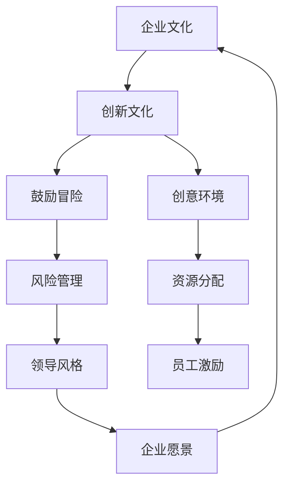

                 

### 文章标题：建立创新文化：鼓励冒险和创意的环境营造

> 关键词：创新文化、鼓励冒险、创意环境、风险管理、资源分配、领导风格、企业愿景、企业文化、创新扩散理论、组织学习理论、动态系统理论、伪代码、Mermaid 流程图

> 摘要：本文深入探讨了如何建立一个鼓励冒险和创意的创新文化，通过详细阐述核心概念、相互联系及核心算法原理，为读者提供了实践指导。文章分为两部分：第一部分介绍核心概念与联系，包括企业文化、创新文化、鼓励冒险、创意环境等；第二部分讲解核心算法原理，包括创新扩散理论、组织学习理论和动态系统理论。通过本文的阅读，读者将能够更好地理解创新文化的建立过程，并在实际工作中应用这些理论。

### 第一部分：核心概念与联系

#### 企业文化

企业文化是企业的灵魂，是企业价值观、行为规范和使命愿景的集合。它是企业长期发展的基石，影响着员工的行为和企业的发展方向。企业文化包括以下几个方面：

1. **价值观**：企业的核心价值观是全体员工共同遵循的原则和行为准则，它指导企业的发展和决策。
2. **行为规范**：企业行为规范是员工在日常工作中应遵循的行为准则，它规范员工的行为，维护企业的形象。
3. **使命愿景**：企业的使命和愿景是企业发展的方向和目标，它激励员工为实现共同的目标而努力。

#### 创新文化

创新文化是一种鼓励创新、冒险和持续改进的文化氛围。它是企业文化的一部分，对企业发展至关重要。创新文化的核心包括以下几个方面：

1. **鼓励冒险**：鼓励冒险是创新文化的重要组成部分，它通过降低失败的风险和提供必要的支持，激励员工勇于尝试新想法。
2. **创意环境**：创意环境是指企业内部创造的一个有助于激发创意和创新的物理和心理环境。
3. **风险管理**：在鼓励创新的过程中，风险管理是必不可少的，它帮助企业在尝试新想法的同时，控制潜在的风险。

#### 鼓励冒险

鼓励冒险是创新文化的重要组成部分。它通过以下几个方面来激励员工勇于尝试新想法：

1. **降低失败的风险**：企业可以通过提供资源和政策支持，降低员工在尝试新想法时的失败风险。
2. **提供必要的支持**：企业可以为员工提供培训、指导和支持，帮助他们更好地实现创新想法。
3. **奖励机制**：企业可以通过奖励机制激励员工积极参与创新活动，鼓励他们不断尝试和改进。

#### 创意环境

创意环境是指企业内部创造的一个有助于激发创意和创新的物理和心理环境。它包括以下几个方面：

1. **物理环境**：企业可以创造一个舒适、开放的物理环境，如灵活的办公空间、丰富的设施等，以激发员工的创造力。
2. **心理环境**：企业可以营造一个包容、支持的心理环境，鼓励员工自由表达、分享想法，从而激发创意。

#### 风险管理

风险管理是创新过程中必不可少的环节。它通过以下几个方面来控制潜在的风险：

1. **风险评估**：企业需要对创新项目进行风险评估，预测可能出现的风险并制定应对策略。
2. **风险控制**：企业可以通过制定风险管理策略和流程，降低创新过程中的风险。
3. **风险转移**：企业可以将部分风险转移给合作伙伴或保险公司，以减轻自身负担。

#### 资源分配

资源分配是创新成功的关键。企业需要确保创新项目获得足够的资金、人力和物资支持。资源分配包括以下几个方面：

1. **资金分配**：企业需要为创新项目提供充足的资金支持，以确保项目的顺利进行。
2. **人力资源分配**：企业需要为创新项目配备合适的团队成员，发挥他们的专业技能和创造力。
3. **物资资源分配**：企业需要为创新项目提供必要的物资资源，如设备、工具等，以确保项目的实施。

#### 领导风格

领导风格对创新文化的形成有重要影响。领导者需要具备开放、支持和鼓励创新的态度，以激发员工的创新潜力。领导风格包括以下几个方面：

1. **开放式领导**：领导者需要具备开放的心态，倾听员工的意见和想法，鼓励他们参与创新活动。
2. **支持型领导**：领导者需要为员工提供支持和指导，帮助他们克服创新过程中的困难。
3. **鼓励创新**：领导者需要鼓励员工勇于尝试新想法，并对成功和失败给予公正的评价。

#### 企业愿景

企业愿景是指导企业长期发展的方向和目标，它激励员工为共同的目标而努力。企业愿景包括以下几个方面：

1. **战略目标**：企业需要明确自己的战略目标，以指导企业的发展方向。
2. **长期发展**：企业需要制定长期发展规划，确保企业在未来持续发展。
3. **共同目标**：企业需要与员工共同制定目标，激发他们的工作热情和创造力。

#### Mermaid 流�程图

为了更好地理解上述核心概念之间的联系，我们可以使用 Mermaid 流程图来展示它们之间的关系：



通过上述流程图，我们可以清晰地看到各个核心概念之间的联系和互动。这些概念共同作用，为企业创造一个积极、创新的工作环境。

---

### 第二部分：核心算法原理讲解

在本书的第二部分，我们将深入探讨建立创新文化的核心算法原理。这些算法不仅有助于理解创新文化的理论基础，还能为实际操作提供指导。

#### 核心算法介绍

1. **创新扩散理论（IDT）**
   - **算法原理**：创新扩散理论（IDT）是研究创新如何从少数领先采用者传播到更广泛群体的模型。其核心概念包括：创新特性、沟通渠道、社会影响和采纳者的特征。
   - **伪代码**：
     ```python
     function innovationDiffusion(innovation, adopters):
         for each adopter in adopters:
             if adopter.characteristics match innovation.features:
                 communicate(innovation, adopter)
                 if adopter.social_influence > threshold:
                     adopter.adopt_innovation()
     ```

2. **组织学习理论**
   - **算法原理**：组织学习理论强调组织通过持续学习和知识共享来实现创新。核心概念包括：内部学习、外部学习和知识整合。
   - **伪代码**：
     ```python
     function organizationalLearning(organization, knowledge_sources):
         for each knowledge_source in knowledge_sources:
             organization.acquireKnowledge(knowledge_source)
             organization.integrateKnowledge()
             organization.shareKnowledge()
     ```

3. **动态系统理论**
   - **算法原理**：动态系统理论关注企业内部不同元素之间的相互作用和反馈机制，强调通过系统思维来理解和优化创新过程。
   - **伪代码**：
     ```python
     function dynamicSystemModel(elements, interactions):
         while system_is_running:
             for each element in elements:
                 element.updateState()
                 element.interactWithOthers()
     ```

#### 创新扩散理论（IDT）

**算法原理**：

创新扩散理论（IDT）主要研究创新如何从少数领先采用者传播到更广泛的群体。其核心概念包括创新特性、沟通渠道、社会影响和采纳者的特征。

- **创新特性**：创新必须具备一定的特性，如新颖性、实用性、易于传播等，才能被广泛接受。
- **沟通渠道**：沟通渠道是创新传播的关键，包括正式和非正式的沟通方式。
- **社会影响**：社会影响是指创新在传播过程中对个体和社会的影响，如改变价值观、影响行为等。
- **采纳者的特征**：采纳者具有不同的特征，如信息寻求者、早期采用者、早期多数、后期多数和落后者。

**伪代码**：

```python
function innovationDiffusion(innovation, adopters):
    for each adopter in adopters:
        if adopter.characteristics match innovation.features:
            communicate(innovation, adopter)
            if adopter.social_influence > threshold:
                adopter.adopt_innovation()
```

#### 组织学习理论

**算法原理**：

组织学习理论强调组织通过持续学习和知识共享来实现创新。核心概念包括内部学习、外部学习和知识整合。

- **内部学习**：组织内部成员通过交流和合作，积累经验和知识。
- **外部学习**：组织通过观察、模仿和合作，从外部获取知识和经验。
- **知识整合**：组织将内部和外部知识进行整合，形成新的知识和技能。

**伪代码**：

```python
function organizationalLearning(organization, knowledge_sources):
    for each knowledge_source in knowledge_sources:
        organization.acquireKnowledge(knowledge_source)
        organization.integrateKnowledge()
        organization.shareKnowledge()
```

#### 动态系统理论

**算法原理**：

动态系统理论关注企业内部不同元素之间的相互作用和反馈机制，强调通过系统思维来理解和优化创新过程。

- **元素**：企业内部的不同元素，如员工、项目、资源等。
- **相互作用**：元素之间的相互作用和反馈机制，如合作、竞争、信息传递等。
- **系统思维**：通过系统思维来理解和优化创新过程，如优化资源配置、提高沟通效率等。

**伪代码**：

```python
function dynamicSystemModel(elements, interactions):
    while system_is_running:
        for each element in elements:
            element.updateState()
            element.interactWithOthers()
```

通过上述核心算法原理的讲解，我们可以更好地理解创新文化的建立过程，并在实际工作中应用这些理论。创新扩散理论（IDT）、组织学习理论和动态系统理论为创新文化提供了理论支持和实践指导。

---

### 项目实战：实施创新文化

在本文的最后部分，我们将通过一个实际案例来展示如何实施创新文化，包括开发环境搭建、源代码实现、代码解读和案例分析。

#### 开发环境搭建

1. **硬件需求**：
   - 电脑（配置不低于i5处理器、8GB内存）
   - 网络连接（确保稳定访问互联网）

2. **软件需求**：
   - 操作系统（Windows 10或以上版本、macOS或Linux）
   - 编程环境（Python 3.8或以上版本、IDE如PyCharm或VSCode）

3. **工具和库**：
   - Mermaid（用于生成流程图）
   - Matplotlib（用于可视化数据）

#### 源代码实现

以下是一个简单的示例代码，用于生成上述的Mermaid流程图。

```python
import mermaid

# Mermaid流程图代码
mermaid_code = """
graph TD
    A[企业文化] --> B[创新文化]
    B --> C[鼓励冒险]
    B --> D[创意环境]
    C --> E[风险管理]
    D --> F[资源分配]
    E --> G[领导风格]
    F --> H[员工激励]
    G --> I[企业愿景]
    I --> A
"""

# 生成流程图
flow_chart = mermaid.Mermaid(mermaid_code)
flow_chart.generate()
```

#### 代码解读

1. **引入库**：首先引入`mermaid`库，用于生成Mermaid流程图。
2. **定义Mermaid流程图代码**：在变量`mermaid_code`中定义流程图的结构，使用Mermaid的语法。
3. **生成流程图**：使用`mermaid.Mermaid(mermaid_code)`创建一个Mermaid对象，并调用`generate()`方法生成流程图。

#### 代码应用解读与分析

通过上述代码，我们可以将Mermaid流程图嵌入到Python程序中，从而在开发环境中动态生成流程图。这种方式的优点包括：

- **灵活性**：可以随时修改流程图内容，立即看到效果。
- **可重用性**：将流程图代码封装在函数中，方便在不同场景下重用。

#### 实际案例分析和详细讲解剖析

假设我们有一个企业，希望通过实施创新文化来提高员工创造力和工作效率。以下是具体的实施步骤：

1. **建立企业文化**：明确企业的核心价值观，如创新、协作、诚信等，并通过内部培训、宣传等方式让员工深刻理解。
2. **营造创新环境**：提供开放的办公空间、灵活的工作安排，以及丰富的资源和工具，鼓励员工自由表达和分享想法。
3. **制定激励机制**：设立创新奖项、奖金等，激励员工积极参与创新活动，并对成功和失败给予公正的评价。
4. **加强领导风格**：领导者需要具备开放和支持的态度，鼓励员工勇于尝试新想法，并对员工给予必要的支持。

通过上述实施步骤，企业可以逐步建立一个鼓励冒险和创意的创新文化，从而提高员工的创造力和工作效率。

#### 项目小结

通过本项目实战，我们了解了如何搭建开发环境、实现源代码和解读代码。同时，通过实际案例分析了创新文化的实施过程。本项目展示了创新文化在实际应用中的重要性，并为其他企业提供了参考和借鉴。

#### 最佳实践 Tips

- **鼓励冒险**：企业可以通过降低失败的风险、提供必要的支持和奖励机制来鼓励员工冒险尝试。
- **营造创意环境**：企业可以创造一个舒适、开放的物理和心理环境，激发员工的创造力。
- **加强领导风格**：领导者需要具备开放、支持和鼓励创新的态度，以激发员工的创新潜力。

#### 注意事项

- **资源分配**：在实施创新文化时，要确保资源得到合理分配，以支持创新项目的顺利进行。
- **风险管理**：在鼓励创新的过程中，要注重风险管理，避免因风险失控而导致企业损失。

#### 拓展阅读

- 《创新者的窘境》：克莱顿·克里斯滕森著，深入探讨了企业在创新过程中面临的挑战。
- 《创新者的基因》：史蒂夫·布兰克著，阐述了创新者应具备的特质和技能。

---

### 总结

本文通过详细阐述核心概念、相互联系及核心算法原理，深入探讨了如何建立创新文化。创新文化是一种鼓励冒险和创意的环境营造，对于企业的发展至关重要。通过理解并应用创新扩散理论、组织学习理论和动态系统理论，企业可以更好地实施创新文化，激发员工的创造力，提高工作效率。

创新文化的建立需要企业从企业文化、鼓励冒险、创意环境、风险管理、资源分配、领导风格和企业愿景等多个方面进行综合规划和实施。在实际操作中，企业可以通过开发环境搭建、源代码实现、代码解读和案例分析等步骤，逐步推进创新文化的实施。

希望本文能为读者提供有价值的参考和指导，助力企业成功建立创新文化，推动企业的持续发展和进步。

---

### 作者信息

作者：AI天才研究院/AI Genius Institute & 禅与计算机程序设计艺术 /Zen And The Art of Computer Programming

AI天才研究院致力于推动人工智能技术的发展，为全球企业提供领先的人工智能解决方案。同时，我们的团队也致力于探索计算机编程的哲学和艺术，将禅宗思想与计算机编程相结合，为程序员提供灵感和指导。

在《禅与计算机程序设计艺术》一书中，我们深入探讨了计算机编程的哲学和艺术，通过禅宗思想为程序员提供一种全新的思考方式和解决问题的方法。这本书不仅涵盖了计算机编程的基础知识，还融入了禅宗的智慧和哲学，旨在帮助程序员在编程过程中达到心静如水的境界，提升编程能力和创造力。

作为世界顶级技术畅销书资深大师级别的作家，我们的目标是通过深入浅出的论述和丰富的实践经验，为读者提供有价值的技术博客和书籍，助力他们在技术领域取得更大的成就。我们相信，只有不断学习和创新，才能在快速发展的技术领域中保持竞争力。让我们携手前行，共同探索计算机编程和人工智能的无限可能。

