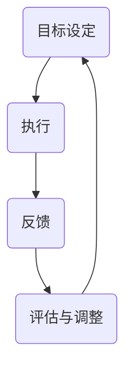
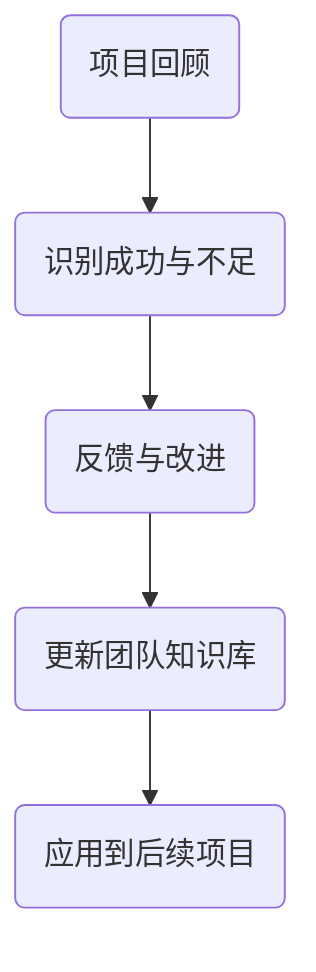
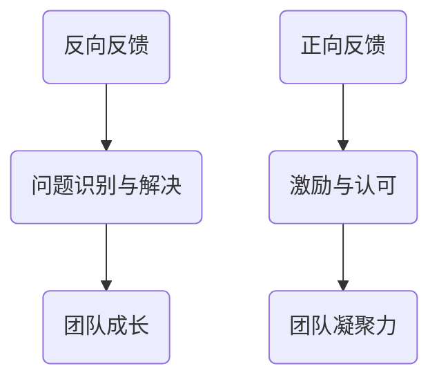
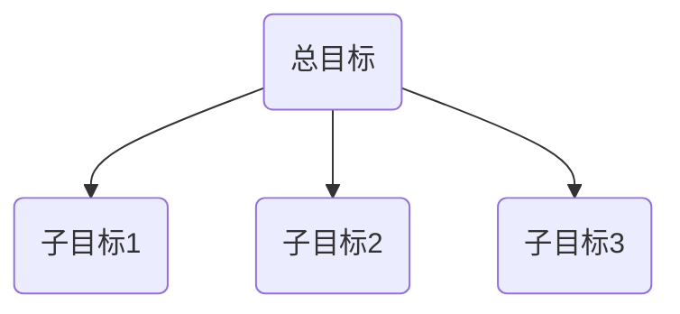
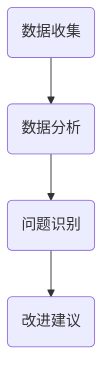
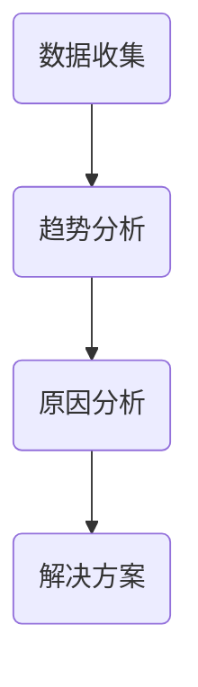
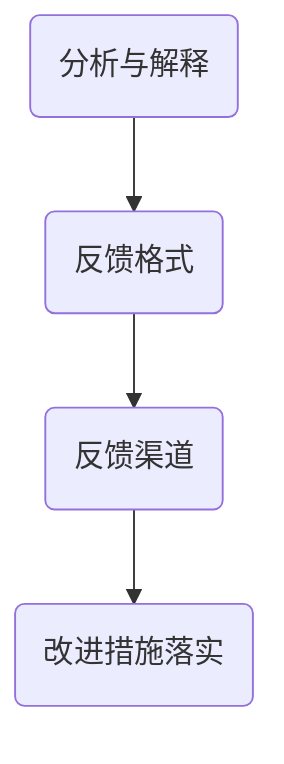
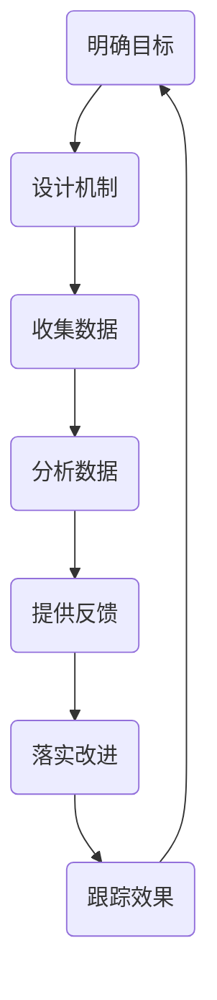

                 

### 文章标题：《建立反馈循环：持续改进的团队机制》

#### 关键词：
- 反馈循环
- 团队协作
- 持续改进
- 团队机制
- 优化策略

#### 摘要：
本文深入探讨了反馈循环在团队管理中的应用及其重要性。通过分析反馈循环的基本概念、设计要素和实施步骤，结合实际案例，本文旨在为团队建立有效的反馈机制提供指导，以实现持续改进和优化。

## 第一部分：引入与概述

### 第1章：反馈循环的基本概念

#### 1.1 反馈循环的定义与原理

反馈循环（Feedback Loop）是系统理论中的一个核心概念，它描述了一个系统如何通过其输出的反馈来调节其输入和内部状态，以达到稳定或优化的效果。在自然界、工程技术和企业管理中，反馈循环无处不在。例如，恒温器通过测量环境温度并将其与预设温度进行比较，从而调整加热器的开闭，以保持恒定的室内温度。

##### 1.1.1 反馈循环的定义

反馈循环可以简单定义为：系统的一个输出部分返回到系统的输入部分，从而影响系统的未来行为。这个过程通常包括以下几个步骤：

1. **输入（Input）**：系统的初始状态或外部环境的变化。
2. **处理（Processing）**：系统根据输入进行操作或响应。
3. **输出（Output）**：系统处理后的结果。
4. **反馈（Feedback）**：输出结果的一部分返回到输入端。
5. **调节（Regulation）**：系统根据反馈对输入或处理过程进行调整。

##### 1.1.2 反馈循环的原理

反馈循环的原理在于，通过持续的反馈和调整，系统能够不断适应外部环境的变化，从而达到稳定、优化或自我改进的目标。反馈循环可以分为两类：

- **正反馈（Positive Feedback）**：输出增强输入，导致系统行为偏离平衡状态，例如生物体内的某些繁殖过程。
- **负反馈（Negative Feedback）**：输出抑制输入，使得系统行为趋向稳定，例如恒温器调节室内温度。

#### 1.2 反馈循环的重要性

在团队管理中，反馈循环具有至关重要的作用。以下是几个关键方面：

- **持续改进**：通过反馈循环，团队能够不断识别问题、分析原因并采取纠正措施，从而实现持续改进。
- **绩效管理**：反馈循环为团队提供了一个客观评估绩效的平台，有助于设定目标、监控进展并调整策略。
- **团队协作**：有效的反馈机制促进了团队成员之间的沟通和合作，增强了团队凝聚力。
- **创新驱动**：通过反馈循环，团队能够从失败中学习，鼓励创新思维和实验，从而推动技术进步和业务增长。

#### 1.3 反馈循环的类型

根据反馈的方向和效果，反馈循环可以分为以下几种类型：

- **内部反馈**：团队内部成员之间的相互反馈，如项目回顾、代码评审等。
- **外部反馈**：来自团队外部，如客户反馈、市场调研等。
- **正向反馈**：鼓励团队成员，增强积极性和自信心。
- **反向反馈**：揭示问题和不足，促进改进和成长。

#### 1.4 团队中的反馈循环

在团队管理中，反馈循环通常包括以下几个环节：

1. **目标设定**：明确团队的目标和期望成果。
2. **执行与反馈**：团队成员执行任务并接收反馈。
3. **评估与调整**：基于反馈结果，对目标和执行过程进行调整。
4. **重复循环**：不断重复上述过程，以实现持续改进。

### 第2章：团队协作与反馈循环

#### 2.1 团队协作中的问题

在团队协作中，常常遇到以下问题：

- **沟通障碍**：团队成员之间缺乏有效沟通，导致信息传递不准确或延误。
- **分工不明**：团队成员职责不清，导致任务重叠或责任不明。
- **任务依赖**：某些任务需要依赖其他任务完成，导致进度延误。
- **绩效评估**：缺乏客观的绩效评估机制，难以激励团队成员。

#### 2.2 反馈循环在团队协作中的应用

##### 2.2.1 团队目标设定与反馈

团队目标设定是反馈循环的基础。通过明确目标，团队成员可以更有针对性地开展工作。同时，定期反馈有助于了解目标的完成情况，及时调整策略。

##### 2.2.2 反馈循环在项目回顾中的应用

项目回顾是反馈循环在团队协作中的重要应用。通过项目回顾，团队可以总结项目经验，识别成功和不足，为后续项目提供改进方向。

##### 2.2.3 反向反馈与正向反馈的平衡

在团队协作中，反向反馈（指出问题和不足）和正向反馈（鼓励和认可）都需要得到适当的应用。反向反馈有助于提高团队的绩效和成长，而正向反馈则能增强团队的凝聚力和士气。

#### 2.3 建立有效的团队反馈机制

为了建立有效的团队反馈机制，需要考虑以下几个方面：

- **明确反馈目标**：明确反馈的目的和期望结果。
- **规范反馈流程**：制定明确的反馈流程和标准，确保反馈过程的顺畅。
- **建立反馈渠道**：提供多种反馈渠道，如面对面交流、邮件、匿名调查等。
- **鼓励双向反馈**：鼓励团队成员之间进行双向反馈，促进沟通和理解。
- **跟踪反馈结果**：对反馈结果进行跟踪和评估，确保改进措施得到落实。

### 第3章：设计反馈循环的要素

#### 3.1 目标设定

目标设定是反馈循环设计的第一步。明确的目标有助于团队集中精力，确保反馈循环的有效性。

- **SMART原则**：目标应具有明确性、可衡量性、可实现性、相关性和时限性。
- **目标分解**：将总目标分解为可执行的子目标，便于跟踪和评估。

#### 3.2 数据收集

数据收集是反馈循环的核心。准确的数据有助于分析问题、识别改进方向。

- **数据来源**：包括内部数据（如项目进度、质量指标）和外部数据（如用户反馈、市场数据）。
- **数据分析**：利用统计学和数据分析工具，对收集到的数据进行分析，找出问题和改进机会。

#### 3.3 分析与解释

分析与解释是对数据收集结果进行深入分析的过程。通过分析，团队能够理解问题的本质，并找到有效的解决方案。

- **原因分析**：运用因果分析、假设检验等方法，找出问题的根本原因。
- **趋势分析**：分析数据的变化趋势，预测未来的发展趋势。

#### 3.4 反馈传递

反馈传递是将分析结果和改进建议传递给相关人员的环节。有效的反馈传递有助于确保改进措施得到落实。

- **反馈格式**：包括文字、图表、报告等多种形式，根据实际需求选择合适的反馈格式。
- **反馈渠道**：包括面对面会议、电子邮件、内部系统等多种渠道，确保反馈传递的及时性和有效性。

### 第4章：建立有效的反馈机制

#### 4.1 反馈机制的设计原则

为了建立有效的反馈机制，需要遵循以下设计原则：

- **及时性**：反馈应尽可能及时，以确保问题得到及时解决。
- **客观性**：反馈应基于事实和数据，避免主观偏见。
- **全面性**：反馈应覆盖团队各个层面，确保全面了解团队状况。
- **互动性**：反馈应鼓励双向交流，促进团队成员之间的沟通和理解。
- **隐私性**：反馈应保护反馈者的隐私，确保反馈的客观性和真实性。

#### 4.2 反馈机制的常见问题

在建立反馈机制的过程中，常见的问题包括：

- **反馈滞后**：反馈不及时，导致问题无法得到及时解决。
- **反馈质量不高**：反馈内容不全面或不准确，无法提供有效的改进建议。
- **反馈渠道不畅**：反馈渠道不畅，导致团队成员无法顺畅地提出反馈和接收反馈。
- **反馈处理不当**：反馈处理不当，导致改进措施无法得到有效落实。

#### 4.3 反馈机制的改进策略

为了解决反馈机制中的问题，可以采取以下改进策略：

- **加强培训**：对团队成员进行反馈机制相关培训，提高反馈意识和能力。
- **优化流程**：优化反馈流程，确保反馈过程高效、规范。
- **增加反馈渠道**：提供多种反馈渠道，满足团队成员的不同需求。
- **强化反馈追踪**：建立反馈追踪机制，确保反馈结果得到有效落实。
- **建立反馈文化**：鼓励团队成员积极参与反馈，形成良性循环。

### 第5章：反馈循环的实施与优化

#### 5.1 反馈循环的实施步骤

实施反馈循环通常包括以下步骤：

1. **明确目标**：确定反馈循环的目标和预期效果。
2. **设计机制**：设计反馈机制，包括反馈流程、反馈渠道和反馈工具。
3. **收集数据**：收集与目标相关的数据，包括内部和外部数据。
4. **分析数据**：对收集到的数据进行分析，识别问题和改进机会。
5. **提供反馈**：将分析结果和改进建议提供给相关团队成员。
6. **落实改进**：根据反馈结果，制定并执行改进措施。
7. **跟踪效果**：跟踪改进措施的实施效果，评估反馈循环的成效。

#### 5.2 反馈循环的常见挑战

在实施反馈循环的过程中，常见挑战包括：

- **数据收集困难**：数据来源分散，数据质量不稳定。
- **反馈质量不高**：反馈内容不全面或不准确。
- **反馈传递不畅**：反馈渠道不畅，信息传递不及时。
- **改进落实困难**：改进措施无法得到有效执行。

#### 5.3 反馈循环的优化策略

为了优化反馈循环，可以采取以下策略：

- **加强数据收集与管理**：建立统一的数据收集和管理系统，提高数据质量。
- **提高反馈质量**：提供反馈培训，提高团队成员的反馈能力。
- **优化反馈渠道**：提供多种反馈渠道，满足团队成员的不同需求。
- **加强改进跟踪**：建立改进跟踪机制，确保改进措施得到有效执行。
- **鼓励持续改进**：建立持续改进的文化，鼓励团队成员积极参与反馈和改进。

### 第6章：案例研究与应用

#### 6.1 案例一：敏捷开发团队中的反馈循环

##### 6.1.1 案例背景

某公司是一家专注于软件开发的企业，其研发团队采用敏捷开发方法。为了提高开发效率和质量，团队决定引入反馈循环机制，以实现持续改进。

##### 6.1.2 反馈循环的实施

1. **目标设定**：团队设定了几个关键目标，如提高代码质量、缩短开发周期、增强团队协作等。
2. **数据收集**：团队采用多种方式收集数据，包括代码评审、用户反馈、性能测试结果等。
3. **数据分析**：团队对收集到的数据进行分析，识别问题，如代码缺陷、沟通障碍等。
4. **提供反馈**：团队通过定期的团队会议和反馈会议，将分析结果和改进建议传达给团队成员。
5. **落实改进**：团队根据反馈结果，制定了具体的改进措施，如改进代码规范、加强沟通培训等。
6. **跟踪效果**：团队定期跟踪改进措施的实施效果，评估反馈循环的成效。

##### 6.1.3 案例分析与总结

通过实施反馈循环，团队在多个方面取得了显著改善：

- **代码质量提高**：代码缺陷率显著下降，代码可维护性增强。
- **开发周期缩短**：开发周期从原来的两个月缩短到一个半月。
- **团队协作增强**：团队成员之间的沟通更加顺畅，协作效率提高。

该案例表明，反馈循环在敏捷开发团队中具有重要作用，有助于团队实现持续改进和优化。

#### 6.2 案例二：跨部门协作中的反馈循环

##### 6.2.1 案例背景

某公司是一家大型制造企业，其生产、销售、研发等多个部门之间需要进行密切协作。为了提高协作效率，公司决定引入反馈循环机制，以优化跨部门协作。

##### 6.2.2 反馈循环的实施

1. **目标设定**：公司设定了几个关键目标，如提高生产效率、缩短交货周期、提升客户满意度等。
2. **数据收集**：公司采用多种方式收集数据，包括生产效率指标、客户反馈、销售数据等。
3. **数据分析**：公司对收集到的数据进行分析，识别协作中的问题和瓶颈。
4. **提供反馈**：公司通过定期的跨部门会议和反馈会议，将分析结果和改进建议传达给各部门。
5. **落实改进**：公司根据反馈结果，制定了具体的改进措施，如优化生产流程、加强销售与生产的沟通等。
6. **跟踪效果**：公司定期跟踪改进措施的实施效果，评估反馈循环的成效。

##### 6.2.3 案例分析与总结

通过实施反馈循环，公司在多个方面取得了显著改善：

- **生产效率提高**：生产效率提高了20%，生产周期缩短了15%。
- **交货周期缩短**：平均交货周期从原来的30天缩短到25天。
- **客户满意度提升**：客户满意度从原来的80%提高到90%。

该案例表明，反馈循环在跨部门协作中具有重要作用，有助于企业实现整体效益的提升。

### 第7章：企业内部反馈循环体系的建立

#### 8.1 案例背景

某大型企业是一家多元化经营的跨国公司，其业务涉及多个领域，包括制造业、零售业和金融服务。为了提高整体运营效率，公司决定建立企业内部反馈循环体系。

#### 8.2 反馈循环体系的建立

1. **目标设定**：公司设定了几个关键目标，如提高运营效率、提升客户满意度、增强员工满意度等。
2. **数据收集**：公司采用多种方式收集数据，包括员工绩效评估、客户反馈、市场调研等。
3. **数据分析**：公司对收集到的数据进行分析，识别运营中的问题和瓶颈。
4. **反馈机制设计**：公司设计了一套完善的反馈机制，包括定期员工绩效评估、客户满意度调查、业务回顾会议等。
5. **提供反馈**：公司通过多种渠道，如内部邮件、会议和问卷调查，将分析结果和改进建议传达给各部门。
6. **落实改进**：公司根据反馈结果，制定了具体的改进措施，并确保各部门按照计划执行。
7. **跟踪效果**：公司定期跟踪改进措施的实施效果，评估反馈循环的成效。

#### 8.3 案例分析与总结

通过建立企业内部反馈循环体系，公司在多个方面取得了显著改善：

- **运营效率提高**：运营效率提高了15%，成本降低了10%。
- **客户满意度提升**：客户满意度从原来的85%提高到95%。
- **员工满意度增强**：员工满意度从原来的70%提高到85%。

该案例表明，建立企业内部反馈循环体系有助于企业实现整体效益的提升，为企业可持续发展提供有力支持。

### 第8章：总结与展望

#### 9.1 反馈循环在团队管理中的应用前景

反馈循环在团队管理中的应用前景非常广阔。随着企业对团队协作和持续改进的需求日益增长，反馈循环将成为团队管理的重要组成部分。以下是一些未来可能的发展趋势：

- **智能化反馈系统**：利用人工智能和大数据技术，建立智能化反馈系统，实现自动数据收集、分析和反馈。
- **全方位反馈**：不仅关注绩效和效率，还关注员工满意度和客户体验，实现全方位反馈。
- **跨领域应用**：反馈循环将在更多领域得到应用，如产品开发、市场营销、客户服务等。

#### 9.2 团队管理的新趋势

随着反馈循环在团队管理中的应用，团队管理将呈现以下新趋势：

- **数据驱动**：团队管理将更加注重数据驱动，通过数据分析和反馈来指导决策和行动。
- **敏捷管理**：团队管理将更加灵活和敏捷，以适应快速变化的环境和需求。
- **个性化管理**：团队管理将更加注重个性化，根据团队成员的特点和需求进行定制化管理。

#### 9.3 反馈循环的持续改进

为了实现反馈循环的持续改进，团队需要不断优化反馈机制和流程。以下是一些建议：

- **定期评估**：定期评估反馈循环的成效，找出存在的问题和改进点。
- **培训与支持**：为团队成员提供反馈相关的培训和支持，提高他们的反馈意识和能力。
- **开放沟通**：鼓励团队成员积极参与反馈，建立开放沟通的氛围，确保反馈渠道的畅通。

### 第9章：结论

#### 10.1 主要观点总结

本文通过深入分析反馈循环的基本概念、设计要素和实施步骤，结合实际案例，阐述了反馈循环在团队管理中的重要性。主要观点包括：

- 反馈循环是一种有效的系统调节机制，有助于团队实现持续改进。
- 团队协作中的反馈循环有助于解决沟通障碍、分工不明、任务依赖等问题。
- 建立有效的反馈机制需要明确目标、规范流程、优化数据收集和分析、确保反馈传递的及时性和客观性。

#### 10.2 未来研究方向

未来研究方向包括：

- 探索反馈循环在跨行业、跨领域中的应用，丰富反馈循环的理论体系。
- 研究反馈循环与人工智能、大数据等技术的结合，提升反馈循环的智能化水平。
- 研究反馈循环在全球化背景下的团队管理中的挑战和应对策略。

#### 10.3 对读者的建议

对读者的一些建议：

- 学习反馈循环的基本概念，了解其在团队管理中的应用。
- 建立有效的反馈机制，提高团队协作效率和绩效。
- 定期评估和优化反馈循环，确保其持续改进。
- 积极参与反馈，促进团队沟通和合作。

### 附录

#### 附录A：反馈循环相关工具与资源

- **工具推荐**：
  - **JIRA**：一款功能强大的项目管理工具，可用于跟踪反馈、任务和项目进度。
  - **Asana**：一款简洁易用的任务管理工具，适用于团队协作和任务追踪。
  - **Google Forms**：一款在线问卷调查工具，可用于收集用户反馈。

- **资源推荐**：
  - **《敏捷开发实践指南》**：一本介绍敏捷开发方法和实践的经典书籍，适合初学者和从业者。
  - **《团队协作的艺术》**：一本关于团队协作和沟通的著作，提供了许多实用的方法和技巧。
  - **《绩效管理》**：一本关于绩效管理和评估的著作，详细介绍了绩效管理的理论和实践。

