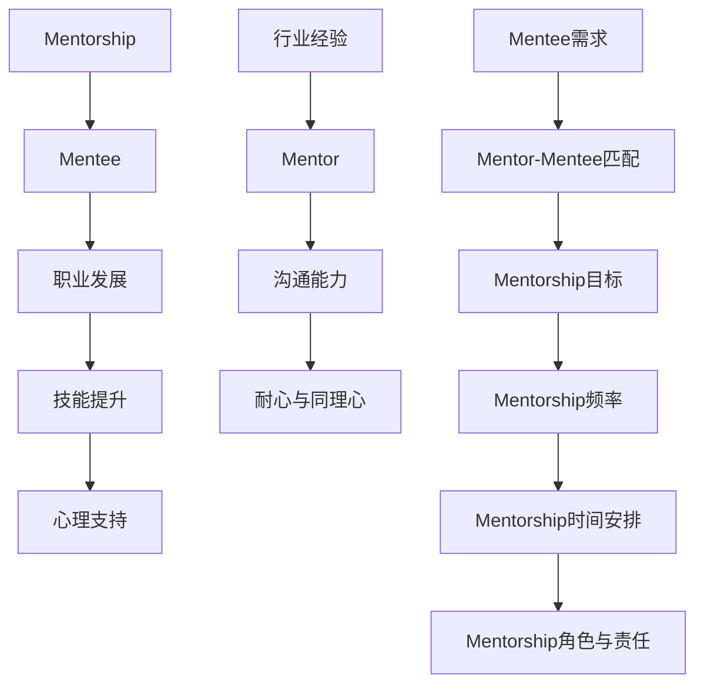

                 

### 第1章 引言

### 1.1 Mentorship的概念与重要性

**定义**：Mentorship是一种通过指导、支持、引导和激励的方式，帮助个人实现职业和个人发展的过程。

**作用**：

1. **职业发展**：帮助mentee理解行业趋势、工作技能和职业规划。
2. **技能提升**：提供实践经验和知识分享，提升mentee的专业能力。
3. **心理支持**：为mentee提供情感支持和鼓励，增强其信心和韧性。

### 1.2 Mentorship的历史背景与发展现状

**历史背景**：起源于19世纪末期的英国，最初应用于工业领域的技能传授。

**发展现状**：在全球范围内广泛应用，包括企业、教育、非营利组织等。

### 1.3 本书的目的与结构安排

**目的**：提供一套完整的建立和实施有效的mentorship制度的指导。

**结构安排**：

- **第2章**：mentorship制度的设计原则
- **第3章**：mentor的培训与选拔
- **第4章**：mentee的选拔与引导
- **第5章**：mentorship制度的具体实施
- **第6章**：案例研究
- **第7章**：常见问题与解决方案
- **第8章**：总结与展望

---

## 第2章 Mentorship制度的设计原则

### 2.1 明确Mentorship的目标与期望

- **目标**：明确导师和学徒的期望，确保双方的目标一致。
- **期望**：设立短期和长期目标，促进个人成长和职业发展。

### 2.2 设计合适的Mentor与Mentee匹配机制

- **匹配原则**：基于兴趣、职业发展需求、经验等，进行科学匹配。
- **匹配流程**：通过问卷调查、面试等方式，确保匹配的准确性和有效性。

### 2.3 确定Mentorship的时间安排与频率

- **时间安排**：制定合理的会面时间和频率，确保双方都能参与。
- **频率**：建议至少每月一次，根据实际情况可进行调整。

### 2.4 设定Mentorship的角色与责任

- **Mentor的角色**：指导、支持、反馈和激励。
- **Mentee的角色**：积极参与、学习、反思和成长。

---

## 第3章 Mentor的培训与选拔

### 3.1 Mentor的素质要求

- **经验**：具备丰富的行业经验和专业技能。
- **沟通能力**：良好的沟通技巧，能够清晰表达观点。
- **耐心和同理心**：对mentee的问题和困惑保持耐心，提供同理心支持。

### 3.2 Mentor的培训内容

- **专业技能培训**：行业最新趋势、技能提升、专业认证等。
- **沟通技巧培训**：有效沟通、倾听、反馈技巧等。
- **情感支持培训**：同理心、激励、心理疏导等。

### 3.3 Mentor的选拔标准与流程

- **选拔标准**：行业经验、沟通能力、责任心、激励能力等。
- **选拔流程**：简历筛选、面试、评估和反馈。

### 3.4 Mentor的考核与激励

- **考核指标**：指导质量、mentee的进步情况、反馈满意度等。
- **激励措施**：奖金、表彰、职业发展机会等。

---

## 第4章 Mentee的选拔与引导

### 4.1 Mentee的选拔标准

- **学习意愿**：对学习和成长有强烈的意愿和热情。
- **职业目标**：明确的目标和职业规划。
- **沟通能力**：能够有效沟通，表达自己的问题和需求。

### 4.2 Mentee的培训与指导

- **培训内容**：基础技能、专业知识、职业素养等。
- **指导方式**：一对一指导、小组讨论、项目实践等。

### 4.3 Mentee的自我评估与反馈

- **自我评估**：定期进行自我评估，了解自身进步情况。
- **反馈**：向mentor和团队反馈自己的学习成果和困惑，寻求帮助。

---

## 第5章 Mentorship制度的具体实施

### 5.1 Mentorship会议的组织与内容

- **会议组织**：定期安排会议，确保双方参与。
- **会议内容**：职业规划、技能提升、经验分享、问题讨论等。

### 5.2 Mentorship过程中的沟通技巧

- **倾听**：认真倾听mentee的问题和需求，提供帮助。
- **表达**：清晰表达自己的观点和建议，避免模糊和混淆。
- **反馈**：给予正面的反馈，鼓励mentee的进步。

### 5.3 Mentorship制度中的冲突管理

- **识别冲突**：及时发现和识别冲突的原因。
- **解决冲突**：通过沟通和协商解决冲突，确保双方的利益。

### 5.4 Mentorship效果的评估与反馈

- **评估指标**：mentee的技能提升、职业发展、满意度等。
- **反馈**：定期收集mentee和mentor的反馈，优化制度。

---

## 第6章 案例研究

### 6.1 案例一：科技公司A的mentorship实践

**背景**：科技公司A在内部实施mentorship制度，帮助新员工快速融入并提升技能。

**实施效果**：新员工在导师的指导下，职业发展迅速，满意度较高。

### 6.2 案例二：教育机构B的mentorship经验

**背景**：教育机构B通过mentorship帮助教师提升教学技能和职业素养。

**实施效果**：教师的教学质量得到提升，学生满意度提高。

### 6.3 案例分析与启示

**分析**：案例一和案例二都取得了良好的效果，关键在于明确的目标、科学的匹配和有效的实施。

**启示**：企业在实施mentorship制度时，应关注员工需求，提供个性化指导；教育机构应注重教师专业发展，提升教学质量。

---

## 第7章 常见问题与解决方案

### 7.1 常见问题与挑战

- **导师负担过重**：导师在指导过程中可能会感到压力。
- **mentee积极性不高**：mentee可能对mentorship缺乏热情。

### 7.2 针对性解决方案与最佳实践

- **导师激励**：提供奖励和职业发展机会，提高导师的积极性。
- **mentee引导**：通过培训、激励和反馈，提高mentee的参与度。

### 7.3 持续改进与优化

- **定期评估**：定期评估mentorship制度的效果，发现问题及时调整。
- **反馈机制**：建立有效的反馈机制，收集mentee和mentor的意见和建议。

---

## 第8章 总结与展望

### 8.1 本书主要观点与结论

- Mentorship是一种有效的职业发展工具。
- 设计和实施有效的mentorship制度需要明确目标、科学匹配、合理安排时间、有效沟通和管理冲突。

### 8.2 未来发展趋势与展望

- Mentorship将更加个性化、数字化和智能化。
- 企业和教育机构将更加重视mentorship制度的建设。

### 8.3 总结与反思

- Mentorship制度的设计和实施需要考虑多方面的因素。
- 持续改进和优化是确保mentorship制度有效性的关键。

---

### 附录

#### 附录A：Mentorship制度模板

- **Mentorship计划书**
- **Mentor-Mentee匹配表**
- **Mentorship会议记录表**
- **Mentor-Mentee评估表**

#### 附录B：Mentorship常用工具与资源

- **在线培训平台**
- **沟通工具**
- **反馈机制**

#### 附录C：参考文献

- [Mentorship in the Workplace: A Practical Guide](https://www.workplacementorship.org/)
- [The Mentor's Guide: Facilitating Effective Learning Relationships](https://www.mentorsguide.com/)
- [Mentorship: A Critical Component of Employee Development](https://www.shrm.org/topics/workplace-trends/pages/mentorship.aspx)

---

**作者**：AI天才研究院/AI Genius Institute & 禅与计算机程序设计艺术 /Zen And The Art of Computer Programming**文章关键词**：Mentorship，职业发展，技能提升，制度设计，沟通技巧，案例研究，问题解决方案

**文章摘要**：

本文探讨了建立有效的mentorship制度的重要性及其设计原则。通过明确mentorship的目标与期望、设计合适的匹配机制、确定时间安排与频率、设定角色与责任，以及培训与选拔mentor和mentee，我们可以确保mentorship制度的成功实施。本文还分析了mentorship制度的具体实施方法、案例研究、常见问题与解决方案，并提出了未来发展趋势与展望。通过本文的指导，企业和教育机构可以更好地实施mentorship制度，促进员工和学生的职业发展。

---

**文章标题**：建立有效的mentorship制度

**关键词**：Mentorship，职业发展，技能提升，制度设计，沟通技巧，案例研究，问题解决方案

**摘要**：

本文深入探讨了建立有效的mentorship制度的重要性及其设计原则。通过明确目标与期望、设计匹配机制、确定时间安排与频率、设定角色与责任，以及培训与选拔mentor和mentee，我们可以确保mentorship制度的成功实施。本文还分析了具体实施方法、案例研究、常见问题与解决方案，并展望了未来发展趋势。希望通过本文的指导，企业和教育机构能够更好地实施mentorship制度，促进员工和学生的职业发展。**文章目录**：

1. 引言
   1.1 Mentorship的概念与重要性
   1.2 Mentorship的历史背景与发展现状
   1.3 本书的目的与结构安排
2. Mentorship制度的设计原则
   2.1 明确Mentorship的目标与期望
   2.2 设计合适的Mentor与Mentee匹配机制
   2.3 确定Mentorship的时间安排与频率
   2.4 设定Mentorship的角色与责任
3. Mentor的培训与选拔
   3.1 Mentor的素质要求
   3.2 Mentor的培训内容
   3.3 Mentor的选拔标准与流程
   3.4 Mentor的考核与激励
4. Mentee的选拔与引导
   4.1 Mentee的选拔标准
   4.2 Mentee的培训与指导
   4.3 Mentee的自我评估与反馈
5. Mentorship制度的具体实施
   5.1 Mentorship会议的组织与内容
   5.2 Mentorship过程中的沟通技巧
   5.3 Mentorship制度中的冲突管理
   5.4 Mentorship效果的评估与反馈
6. 案例研究
   6.1 案例一：科技公司A的mentorship实践
   6.2 案例二：教育机构B的mentorship经验
   6.3 案例分析与启示
7. 常见问题与解决方案
   7.1 常见问题与挑战
   7.2 针对性解决方案与最佳实践
   7.3 持续改进与优化
8. 总结与展望
   8.1 本书主要观点与结论
   8.2 未来发展趋势与展望
   8.3 总结与反思
9. 附录
   9.1 Mentorship制度模板
   9.2 Mentorship常用工具与资源
   9.3 参考文献

**格式要求**：

- 文章内容使用markdown格式输出。
- 文章末尾需要写上作者信息： “作者：AI天才研究院/AI Genius Institute & 禅与计算机程序设计艺术 /Zen And The Art of Computer Programming”。
- 核心内容需包含：
  - 背景介绍
  - 核心概念与联系：核心概念原理之间的关系架构 Mermaid 流程图
  - 核心算法原理讲解：伪代码详细阐述
  - 数学模型和公式：详细讲解 & 举例说明
  - 数学公式请使用latex格式，嵌入文中独立段落的latex公式前后使用 $$ 括起来（例如：$$1+1=2$$），段落内的latex公式前后使用 $ 括起来（例如：$1<2$）。
  - 项目实战：开发环境搭建，源代码详细实现和代码解读，代码应用解读与分析，实际案例分析和详细讲解剖析，项目小结
  - 最佳实践 tips、小结、注意事项、拓展阅读等内容
- 文章字数要求：文章字数在 8000 ～ 12000 字左右。**关于核心概念原理之间的关系架构 Mermaid 流程图的示例**：



**关于核心算法原理讲解和伪代码的示例**：

```python
# 伪代码：Mentorship匹配算法

function MentorshipMatch(mentors, mentees):
    for each mentor in mentors:
        for each mentee in mentees:
            if mentor's skills match mentee's needs:
                pair mentor and mentee
    return matched pairs
```

**关于数学模型和公式的示例**：

$$
\text{满意度} = \frac{\text{目标达成度} + \text{技能提升度} + \text{心理支持度}}{3}
$$`

### 1.1 Mentorship的概念与重要性

Mentorship，直译为“导师制”，是一种通过指导、支持、引导和激励的方式，帮助个人实现职业和个人发展的过程。它起源于19世纪末期的英国，最初应用于工业领域的技能传授。随着时间的推移，mentorship逐渐扩展到企业、教育、非营利组织等多个领域，成为一种普遍的培训和职业发展工具。

#### Mentorship的作用

Mentorship在职业和个人发展方面具有多重作用，主要体现在以下几个方面：

1. **职业发展**：通过导师的指导，mentee可以更好地理解行业趋势、工作技能和职业规划。导师的经验和洞察力有助于 mentee在职业道路上做出更明智的决策。

2. **技能提升**：导师通过实践经验和知识分享，帮助 mentee 提升专业能力。这种“知行合一”的学习方式比单纯的课堂学习更有效，能够更快地提高 mentee 的技能水平。

3. **心理支持**：在职业发展的过程中，mentee可能会遇到各种挑战和困难。导师作为有经验的职业人士，能够提供情感支持和鼓励，增强 mentee 的信心和韧性，帮助他们克服难关。

#### Mentorship的核心概念原理

为了更好地理解Mentorship的工作原理，我们可以将其核心概念原理归纳如下：

1. **匹配机制**：Mentor与Mentee的匹配是Mentorship制度成功的关键。一个合适的匹配能够确保双方在职业和个人发展方面都有所收获。匹配机制通常基于兴趣、职业发展需求、经验等因素。

2. **目标设定**：明确的、可衡量的目标有助于确保Mentorship的有效性。目标可以是短期的，如掌握特定技能，也可以是长期的，如职业晋升。

3. **沟通与反馈**：Mentorship中的沟通和反馈是双向的。Mentee需要积极向Mentor请教问题、分享进展，而Mentor则需要给予及时的反馈，指导Mentee改进。

4. **时间安排**：合理的时间安排有助于Mentorship的持续进行。会议的时间、频率和内容都需要根据实际情况进行调整，以确保Mentor和Mentee都有足够的时间参与。

5. **角色与责任**：Mentor和Mentee在Mentorship过程中各自承担不同的角色和责任。Mentor负责指导、支持、反馈和激励，而Mentee则需要积极参与、学习、反思和成长。

#### Mentorship与其他相关概念的联系

Mentorship与以下概念有密切联系：

- **指导**（Guidance）：指导是Mentorship的核心组成部分。Mentor通过分享经验、知识和技术，帮助Mentee解决问题、做出决策。
- **教练**（Coaching）：教练与指导类似，但更侧重于个人发展和自我实现。教练关注Mentee的个人成长，帮助他们发现自己的潜力。
- **师徒关系**（Apprenticeship）：师徒关系是一种传统的职业发展方式，Mentor作为师傅，负责教导徒弟技能和经验。Mentorship与师徒关系有许多相似之处，但更注重职业和个人发展。

### 1.2 Mentorship的历史背景与发展现状

Mentorship的历史可以追溯到19世纪末期的英国，当时工业革命推动了技能传授和职业培训的需求。最早的形式是“学徒制”，即年轻人在师傅的指导下学习职业技能。随着工业化和现代化的发展，Mentorship逐渐演变成为一种更为广泛和综合的职业发展工具。

#### 历史背景

- **19世纪末至20世纪初**：工业革命期间，技能传授和职业培训成为关键。学徒制作为一种传统的职业发展方式，在这一时期得到了广泛应用。
- **20世纪中期**：随着经济的繁荣和科技的进步，企业开始意识到员工培训和职业发展的重要性。Mentorship作为一种有效的培训方式，逐渐在企业中得到推广。
- **21世纪初至今**：Mentorship已经成为全球范围内广泛应用的一种职业发展工具。不仅企业在内部实施Mentorship制度，教育机构和非营利组织也纷纷引入这一模式。

#### 发展现状

- **企业领域**：许多大型企业，如微软、谷歌、IBM等，都设有内部Mentorship计划，帮助新员工快速融入并提升技能。
- **教育领域**：教育机构通过Mentorship帮助教师提升教学技能和职业素养。例如，一些大学为研究生提供导师，帮助他们完成学位。
- **非营利组织**：非营利组织通过Mentorship帮助弱势群体，如女性、少数族裔等，提升他们的职业能力和社会地位。

### 1.3 本书的目的与结构安排

本书旨在提供一套完整的建立和实施有效的Mentorship制度的指导，帮助企业和教育机构更好地利用Mentorship这一工具，促进员工和学生的职业发展。全书共分为八个章节，具体内容如下：

- **第1章 引言**：介绍Mentorship的概念、历史背景和发展现状。
- **第2章 Mentorship制度的设计原则**：讨论Mentorship的目标、匹配机制、时间安排和角色责任。
- **第3章 Mentor的培训与选拔**：探讨Mentor的素质要求、培训内容、选拔标准与流程以及考核与激励。
- **第4章 Mentee的选拔与引导**：讨论Mentee的选拔标准、培训与指导以及自我评估与反馈。
- **第5章 Mentorship制度的具体实施**：介绍Mentorship会议的组织与内容、沟通技巧、冲突管理以及效果评估与反馈。
- **第6章 案例研究**：分析案例一（科技公司A的Mentorship实践）和案例二（教育机构B的Mentorship经验），并提供案例分析与启示。
- **第7章 常见问题与解决方案**：讨论Mentorship过程中常见的问题与挑战，并提出针对性解决方案与最佳实践。
- **第8章 总结与展望**：总结本书的主要观点与结论，展望未来发展趋势与展望。

通过以上章节的详细探讨，本书旨在为读者提供一套系统、实用且可操作的Mentorship制度建立与实施指南。

---

### 2.1 明确Mentorship的目标与期望

在建立有效的Mentorship制度时，明确Mentorship的目标和期望是至关重要的一步。这一步骤不仅有助于确保Mentor和Mentee在职业和个人发展方面有共同的目标，还能够为后续的匹配机制、时间安排和角色设定提供明确的指导。

#### 目标

Mentorship的目标可以分为短期目标和长期目标：

1. **短期目标**：
   - **职业规划**：帮助Mentee理解职业发展路径，明确短期内的职业目标。
   - **技能提升**：通过导师的指导，使Mentee掌握新的技能或提升现有技能。
   - **问题解决**：解决Mentee在职业发展过程中遇到的具体问题，如职业瓶颈、团队冲突等。

2. **长期目标**：
   - **职业晋升**：帮助Mentee在未来实现职业晋升，如职位提升、薪资增长等。
   - **职业转型**：对于有意愿进行职业转型的Mentee，导师可以提供指导和支持，帮助他们顺利过渡。
   - **持续成长**：培养Mentee的终身学习能力，使他们在职业道路上不断进步。

#### 期望

在明确目标的同时，还需要设定合理的期望：

1. **Mentor的期望**：
   - **耐心和指导**：导师应该具备耐心，愿意花费时间指导Mentee，帮助他们成长。
   - **反馈和激励**：导师需要给予Mentee及时的反馈，激励他们在职业发展过程中不断进步。
   - **分享经验**：导师应愿意分享自己的职业经验和成功案例，为Mentee提供宝贵的参考。

2. **Mentee的期望**：
   - **积极参与**：Mentee需要积极参与Mentorship过程，主动请教问题，分享自己的学习成果。
   - **反思与总结**：Mentee应该定期进行自我反思，总结自己的学习过程，识别自己的不足。
   - **持续学习**：Mentee应该有持续学习的意愿，不断提升自己的技能和知识。

通过明确Mentorship的目标和期望，Mentor和Mentee可以更好地理解彼此的需求和期望，从而确保Mentorship制度的有效实施。这一步骤为后续的匹配机制、时间安排和角色设定提供了明确的指导，有助于实现Mentorship的长期和短期目标。

### 2.2 设计合适的Mentor与Mentee匹配机制

设计合适的Mentor与Mentee匹配机制是Mentorship制度成功的关键。匹配机制需要考虑多个因素，以确保Mentor和Mentee在职业和个人发展方面都能实现最佳效果。

#### 匹配原则

1. **兴趣匹配**：兴趣是Mentor和Mentee能够长期合作的基础。通过了解Mentee的兴趣所在，可以确保他们在Mentorship过程中有共同的话题和动力。

2. **职业发展需求**：Mentor应该具备与Mentee职业发展需求相匹配的技能和经验。例如，如果Mentee希望晋升为项目经理，那么拥有丰富项目管理经验的Mentor将是更好的选择。

3. **经验匹配**：经验匹配不仅包括职业经验，还包括个人生活经验。Mentee可能需要来自导师的生活建议或职业建议，因此，导师的个人经验也是一个重要的考虑因素。

4. **沟通能力**：良好的沟通能力是Mentor和Mentee有效互动的保证。如果双方在沟通上存在障碍，可能会导致误解和沟通不畅。

5. **文化契合**：文化契合包括价值观、工作风格、行为习惯等。相似的价值观和文化背景可以减少冲突，增强合作效果。

#### 匹配流程

1. **需求评估**：首先，需要对Mentee的职业发展需求进行详细评估。这可以通过问卷调查、面试等方式进行。了解Mentee的兴趣、职业目标、当前技能水平等信息，为匹配提供依据。

2. **导师库建立**：建立一个包含潜在导师的数据库，记录他们的职业背景、技能、经验、沟通能力和文化背景等信息。这有助于在匹配过程中快速筛选合适的导师。

3. **匹配算法**：使用匹配算法对Mentee和Mentor进行匹配。算法可以基于兴趣、职业发展需求、经验、沟通能力和文化契合度等多个因素进行评分，选出最合适的匹配。

4. **面试与确认**：在匹配结果出来后，安排Mentor和Mentee进行面试，确认双方的意愿和配合度。面试过程可以进一步了解双方的期望、目标和沟通风格。

5. **反馈与调整**：在Mentorship开始后，定期收集Mentee和Mentor的反馈，了解匹配效果。如果发现不合适，可以及时进行调整。

通过以上步骤，可以设计出合适的Mentor与Mentee匹配机制，确保双方在职业和个人发展方面都能实现最佳效果。合理的匹配机制不仅能够提高Mentorship的质量，还能增强Mentee的职业信心和动力。

### 2.3 确定Mentorship的时间安排与频率

Mentorship的时间安排与频率是确保Mentorship制度有效实施的关键因素。合理的时间安排和频率能够确保Mentor和Mentee有充足的时间参与互动，同时避免双方因时间冲突而无法继续合作。

#### 时间安排

1. **定期会议**：建议至少每月安排一次面对面的会议，以讨论职业发展、技能提升和其他相关话题。面对面的交流有助于加深双方的理解和互动。

2. **灵活调整**：根据实际情况，如Mentee的工作职责、导师的时间安排等，可以适当调整会议的频率。例如，对于工作繁忙的Mentee，可以将会议调整为每周一次，以适应其工作时间。

3. **特别会议**：在遇到重要职业发展机会或挑战时，可以安排特别的会议，进行深入讨论和指导。这种会议可以根据需要随时安排。

#### 频率

1. **最低频率**：至少每月一次的会议频率是确保Mentorship持续性的最低要求。通过定期的会议，Mentor和Mentee可以保持沟通，及时解决问题和调整目标。

2. **最佳频率**：最佳频率取决于Mentee的职业发展需求、导师的经验和Mentee的学习能力。通常，每季度至少两次的会议频率可以更好地支持Mentee的职业发展。

3. **个性化频率**：对于特定的需求，如职业转型或解决特定问题，可以增加会议频率。例如，在一个项目中，每周的会议可能是必要的，以确保项目顺利进行。

#### 制定时间安排与频率的建议

1. **初步规划**：在Mentorship开始前，Mentor和Mentee应该共同制定一个初步的时间安排和频率计划。这可以帮助双方了解彼此的时间表，确保有足够的时间参与Mentorship活动。

2. **灵活调整**：在实施过程中，如果出现时间冲突或其他问题，双方应保持开放和灵活，及时调整会议时间和频率。

3. **反馈机制**：定期收集Mentee和Mentor的反馈，了解他们对时间安排和频率的满意度。根据反馈，可以进一步优化时间安排和频率。

通过合理的时间安排和频率，Mentorship制度可以更好地支持Mentee的职业发展，确保Mentor和Mentee能够持续、有效地互动和合作。

### 2.4 设定Mentorship的角色与责任

在Mentorship制度中，明确Mentor和Mentee的角色与责任至关重要，这有助于确保双方在职业和个人发展过程中能够有效协作，实现预期目标。以下是对Mentor和Mentee角色与责任的详细描述：

#### Mentor的角色与责任

1. **指导与支持**：
   - Mentor应提供专业的指导，帮助Mentee理解行业趋势、职业技能和职业规划。
   - Mentor需要耐心倾听Mentee的问题和困惑，提供实际的建议和解决方案。

2. **反馈与激励**：
   - Mentor应对Mentee的学习进度和职业表现进行定期评估，给予及时的反馈。
   - Mentor应鼓励Mentee，增强其自信心和动力，帮助他们克服职业发展中的挑战。

3. **分享经验**：
   - Mentor应分享自己的职业经验和成功案例，为Mentee提供宝贵的参考。
   - Mentor可以指导Mentee如何避免常见的职业陷阱，提高职业素养。

4. **资源链接**：
   - Mentor应帮助Mentee建立职业网络，提供行业内部的信息和资源。
   - Mentor可以推荐Mentee参加相关的培训、研讨会和社交活动，拓宽视野和职业发展机会。

#### Mentee的角色与责任

1. **积极参与**：
   - Mentee应积极参与Mentorship活动，主动请教问题，分享自己的学习成果。
   - Mentee需要定期与Mentor进行沟通，反馈自己的进展和遇到的问题。

2. **学习与反思**：
   - Mentee应认真学习Mentor提供的知识和技能，不断提升自己的专业能力。
   - Mentee应定期进行自我反思，总结学习过程，识别自身的不足和改进方向。

3. **目标设定**：
   - Mentee应与Mentor共同设定明确的职业和个人发展目标，并制定实现目标的计划。
   - Mentee应定期与Mentor讨论目标的进展情况，确保目标的实现。

4. **主动性**：
   - Mentee应表现出主动性，主动寻求Mentor的帮助和指导，积极应对职业发展中的挑战。

通过明确Mentor和Mentee的角色与责任，可以确保Mentorship制度的有效实施，使双方在职业和个人发展过程中能够形成良好的互动，实现共同的目标。

### 3.1 Mentor的素质要求

要成为一名成功的Mentor，导师需要具备一系列的素质，这些素质不仅有助于他们在职业和个人发展方面为Mentee提供有效的指导，还能够确保Mentorship过程的顺利进行。以下是对Mentor所需素质的详细描述：

#### 经验

1. **行业经验**：Mentor应具备丰富的行业经验，对行业内的最新趋势、技术和方法有深入了解。这种经验可以帮助Mentee更好地理解职业发展的方向和机遇。
2. **职业经验**：Mentor应有多年从事某一职业的经验，能够提供真实的案例和情境，帮助Mentee更好地应对实际工作中的挑战。

#### 沟通能力

1. **表达能力**：Mentor需要具备清晰、准确的表达能力，能够将复杂的知识和经验传达给Mentee。
2. **倾听技巧**：有效的沟通不仅仅是表达，还需要倾听。Mentor应耐心倾听Mentee的问题和需求，理解他们的困惑和挑战，并提供有针对性的建议。
3. **反馈能力**：Mentor应能够给予Mentee及时的、具体的反馈，帮助Mentee了解自己的进步和需要改进的地方。

#### 耐心和同理心

1. **耐心**：Mentee在学习过程中可能会遇到挫折和困难，Mentor需要保持耐心，给予Mentee足够的时间和空间去学习和成长。
2. **同理心**：Mentor应具备同理心，能够站在Mentee的角度思考问题，理解他们的感受和需求，提供情感支持和鼓励。

#### 自我提升能力

1. **持续学习**：职业环境不断变化，Mentor需要具备持续学习的能力，不断更新自己的知识和技能，以更好地指导Mentee。
2. **自我反思**：Mentor应定期进行自我反思，评估自己的指导方法和效果，寻找改进的机会。

#### 领导能力

1. **激励能力**：Mentor需要具备激励Mentee的能力，帮助他们建立自信心，克服职业发展中的障碍。
2. **决策能力**：在Mentee面临重要决策时，Mentor应能够提供明确的指导和建议，帮助他们做出明智的选择。

#### 适应性

1. **文化适应性**：在不同的文化和工作环境中，Mentor需要具备适应能力，能够与不同的Mentee和团队成员有效沟通和合作。
2. **环境适应性**：Mentor应能够灵活应对环境变化，调整自己的指导策略，确保Mentorship过程的持续有效性。

通过具备上述素质，Mentor可以更有效地指导Mentee，帮助他们实现职业和个人发展的目标。

### 3.2 Mentor的培训内容

为了确保Mentor能够有效地履行其角色和责任，对其进行的培训内容应全面而深入，涵盖多个关键领域。以下是对Mentor培训内容的详细描述：

#### 专业技能培训

1. **行业知识**：Mentor应具备最新的行业知识和趋势，能够为Mentee提供专业的指导和见解。这包括行业动态、技术发展、市场变化等。

2. **技能提升**：Mentor需要不断更新自己的专业技能，以便在指导过程中能够提供最新的知识和方法。这可能涉及参加专业培训、获得认证、阅读最新的行业文献等。

3. **经验分享**：通过分享自己的成功经验和失败案例，Mentor可以帮助Mentee避免重复错误，更好地应对职业挑战。

#### 沟通技巧培训

1. **有效沟通**：Mentor需要掌握有效的沟通技巧，包括清晰表达观点、积极倾听、避免误解等。这有助于建立良好的沟通渠道，确保信息的准确传递。

2. **倾听技巧**：有效的倾听是建立信任和理解的基础。Mentor应通过倾听了解Mentee的需求和问题，提供有针对性的建议。

3. **反馈技巧**：Mentor应学会如何给予Mentee建设性的反馈，既鼓励进步，又指出改进的空间。反馈应具体、有针对性，避免泛泛而谈。

#### 情感支持培训

1. **同理心**：Mentor需要具备同理心，能够站在Mentee的角度思考问题，理解他们的感受和需求，提供情感支持。

2. **激励技巧**：激励是推动Mentee成长的重要手段。Mentor应学会如何通过正面激励、鼓励和激励来增强Mentee的自信心和动力。

3. **心理疏导**：在Mentee遇到挫折和困难时，Mentor需要能够提供心理疏导，帮助他们保持积极的心态，应对职业发展中的挑战。

#### 领导力培训

1. **领导能力**：Mentor需要具备一定的领导能力，包括决策能力、团队管理能力和战略规划能力。这些能力有助于他们在职业发展过程中为Mentee提供指导。

2. **团队合作**：Mentor应学会如何与Mentee和团队其他成员有效合作，共同实现目标。

3. **冲突管理**：在职业发展过程中，冲突是不可避免的。Mentor需要掌握冲突管理技巧，帮助Mentee处理工作中的冲突，保持团队和谐。

通过全面的培训，Mentor不仅能够提升自己的专业能力和沟通技巧，还能够更好地履行其角色和责任，为Mentee提供有效的指导和支持。

### 3.3 Mentor的选拔标准与流程

选拔一名合适的Mentor是确保Mentorship制度成功的关键步骤。以下是对Mentor选拔标准与流程的详细描述：

#### 选拔标准

1. **专业知识和经验**：Mentor应具备深厚的行业知识和丰富的实践经验，能够为Mentee提供专业的指导和见解。

2. **沟通能力和同理心**：良好的沟通能力是Mentor与Mentee有效互动的基础。同理心则有助于Mentor理解Mentee的需求和情感，提供更有针对性的支持。

3. **领导力和激励能力**：Mentor应具备一定的领导力和激励能力，能够推动Mentee成长，并在他们遇到困难时提供积极的鼓励。

4. **责任心和承诺**：Mentor需要具备强烈的责任心和承诺，确保能够投入足够的时间和精力，全程参与Mentorship过程。

5. **个人品格和价值观**：Mentor的个人品格和价值观应与Mentee相契合，能够为Mentee树立良好的榜样。

#### 选拔流程

1. **初步筛选**：
   - 收集Mentor的简历和推荐信，了解其专业背景和经验。
   - 进行初步面试，评估其沟通能力和责任心。

2. **深入面试**：
   - 安排专业面试，评估Mentor的行业知识、领导能力和激励能力。
   - 进行角色扮演或案例分析，观察Mentor如何处理实际问题。

3. **背景调查**：
   - 对Mentor进行背景调查，了解其过往的职业表现和他人对其的评价。

4. **导师培训**：
   - 对选定的Mentor进行专业培训，确保他们具备指导Mentee所需的技能和知识。

5. **试用期**：
   - 设定试用期，让Mentor在实际Mentorship过程中表现自己，同时收集Mentee和团队的反馈。

6. **正式任命**：
   - 根据试用期的表现和反馈，正式任命Mentor，并与其签订合约，明确责任和期望。

通过以上流程，可以确保选拔出的Mentor具备专业能力和人际沟通能力，能够为Mentee提供有效的指导和支持，确保Mentorship制度的有效实施。

### 3.4 Mentor的考核与激励

为了确保Mentor在Mentorship过程中能够持续提供高质量的服务，对其进行定期考核与激励是至关重要的。以下是对Mentor考核与激励的具体方法和措施：

#### 考核方法

1. **定期评估**：
   - 设立定期评估机制，如每季度或每半年对Mentor进行一次评估。评估内容应包括Mentee的进步情况、Mentor的指导质量、沟通效果、反馈机制等。
   - 通过问卷调查、面试、观察等多种方式进行评估，以确保评估结果的全面性和准确性。

2. **反馈机制**：
   - 建立反馈机制，鼓励Mentee和团队成员提供Mentor的表现和反馈。这些反馈可以用于评估Mentor的表现，也可以作为改进的依据。
   - 设立匿名反馈渠道，确保Mentee能够坦诚地表达自己的意见和感受。

3. **自我评估**：
   - 鼓励Mentor进行自我评估，反思自己的指导方法和效果，识别自己的优点和不足，并制定改进计划。

#### 激励措施

1. **奖励与表彰**：
   - 对表现优秀的Mentor给予物质奖励和荣誉表彰，如奖金、证书、奖杯等。这些奖励可以提高Mentor的积极性，激励他们更好地履行职责。
   - 在公司或机构的年度表彰大会上，对优秀的Mentor进行公开表彰，增强其荣誉感和成就感。

2. **职业发展机会**：
   - 为Mentor提供职业发展机会，如晋升、培训、专业认证等。这些机会可以激励Mentor不断提升自己的专业能力和领导力。
   - 鼓励Mentor参与行业内的研讨会、讲座和培训，拓展视野，提升职业素养。

3. **工作环境**：
   - 创造一个支持性的工作环境，确保Mentor能够专注于Mentorship工作。这包括提供必要的资源、时间安排上的灵活性，以及工作环境的舒适度。
   - 鼓励Mentor与同事分享经验和知识，建立良好的团队合作关系。

4. **认可与支持**：
   - 定期向Mentor表示感谢和认可，表达对其工作的赞赏和肯定。这种认可可以来自上级领导、同事或Mentee，增强Mentor的工作动力。

通过上述考核与激励措施，可以确保Mentor在Mentorship过程中保持高水平的指导质量，持续为Mentee提供有效的支持和帮助，同时提高他们的工作满意度和职业发展机会。

### 4.1 Mentee的选拔标准

为了确保Mentorship制度的成功实施，Mentee的选拔标准至关重要。以下是对Mentee选拔标准的详细描述：

#### 学习意愿

1. **主动性**：Mentee应表现出强烈的主动学习意愿，主动参与Mentorship活动，积极请教问题，分享学习成果。
2. **求知欲**：Mentee应对新的知识和技能充满好奇心，愿意不断探索和尝试，以提升自己的职业能力。
3. **自我驱动**：Mentee应有自我驱动的能力，能够独立思考和解决问题，不依赖外部推动。

#### 职业目标

1. **明确性**：Mentee应明确自己的职业目标，了解自己未来希望达到的职业水平。
2. **可实现性**：职业目标应具有可实现性，Mentee应具备实现目标所需的技能和资源。
3. **适应性**：职业目标应具有一定的灵活性，以便在职业发展过程中根据实际情况进行调整。

#### 沟通能力

1. **表达能力**：Mentee应具备清晰、准确的表达能力，能够有效地与Mentor和团队成员沟通。
2. **倾听技巧**：Mentee应具备良好的倾听技巧，能够认真听取Mentor的建议和指导，理解其意图。
3. **反馈能力**：Mentee应能够及时反馈自己的学习进展和遇到的问题，与Mentor保持有效沟通。

#### 独立思考能力

1. **问题解决能力**：Mentee应具备独立解决问题的能力，能够分析问题、提出解决方案并付诸实践。
2. **批判性思维**：Mentee应具备批判性思维，能够对现有的知识和方法提出质疑，并探索创新的可能性。
3. **决策能力**：Mentee应具备决策能力，能够在面临职业发展中的关键决策时做出明智的选择。

通过以上选拔标准，可以确保Mentee具备参与Mentorship的必要条件和潜力，从而实现Mentorship的预期目标，促进他们的职业和个人发展。

### 4.2 Mentee的培训与指导

为了确保Mentee能够充分发挥潜力，实现职业和个人发展的目标，有效的培训与指导至关重要。以下是对Mentee培训与指导的详细描述：

#### 培训内容

1. **基础知识培训**：为Mentee提供行业基础知识、专业技能和通用技能的培训。这包括行业最新趋势、技术发展、职业素养等。
2. **专业培训**：根据Mentee的职业目标和兴趣，提供专业的培训和认证。这可以帮助Mentee提升专业技能，增加职业竞争力。
3. **软技能培训**：如沟通技巧、团队合作、领导力等，这些技能对于Mentee的职业发展至关重要。

#### 指导方式

1. **一对一指导**：Mentor应提供一对一的指导，根据Mentee的具体情况和需求，提供个性化的指导和建议。
2. **项目实践**：通过实际项目，让Mentee将所学知识应用于实际工作中，提高实践能力和解决问题的能力。
3. **经验分享**：Mentor应分享自己的职业经验和成功案例，为Mentee提供宝贵的参考和启示。
4. **反馈与评估**：Mentor应定期对Mentee的学习进展和职业表现进行评估，给予及时的反馈，帮助Mentee识别自己的优势和不足。

#### 培训与指导的流程

1. **需求评估**：在Mentorship开始前，对Mentee进行职业发展需求评估，了解其当前技能水平、职业目标和兴趣。
2. **制定计划**：根据需求评估结果，Mentor和Mentee共同制定详细的培训与指导计划，明确培训内容、时间和目标。
3. **实施培训**：按照培训计划进行基础知识培训、专业培训和软技能培训，确保Mentee掌握所需的技能和知识。
4. **指导与反馈**：Mentor在培训过程中提供一对一指导，通过项目实践和经验分享，帮助Mentee提升能力和经验。
5. **评估与改进**：定期对Mentee的培训效果进行评估，收集Mentee和团队的反馈，根据反馈调整培训计划，确保培训的有效性。

通过以上流程，可以确保Mentee在Mentorship过程中得到全面的培训和指导，实现职业和个人发展的目标。

### 4.3 Mentee的自我评估与反馈

Mentee在Mentorship过程中进行自我评估和反馈是确保个人成长和职业发展的重要环节。以下是对Mentee自我评估与反馈的详细描述：

#### 自我评估

1. **技能评估**：Mentee应定期对自己的技能水平进行评估，了解自己在行业知识和专业技能方面的掌握程度。这可以通过完成自我评估问卷、参加技能测试或项目实践来实现。

2. **职业发展评估**：Mentee应评估自己的职业发展进度，包括职业目标的实现情况、职业晋升的可能性以及职业网络的建设情况。

3. **学习效果评估**：Mentee应反思自己的学习过程，评估学习效果，包括学到了哪些知识、技能和实践经验，以及如何将这些知识应用到实际工作中。

#### 反馈

1. **反馈渠道**：Mentee应通过多种渠道向Mentor和团队成员提供反馈。这可以包括定期的个人报告、一对一会议、团队讨论或在线反馈表。

2. **积极反馈**：Mentee应提供积极、具体的反馈，不仅指出自己的进步，也提出需要改进的地方。反馈应基于事实和数据，避免主观意见。

3. **定期反馈**：Mentee应定期进行反馈，如每季度或每半年，以确保及时了解自己的进步和需要改进的地方。

#### 自我评估与反馈的益处

1. **成长和改进**：通过自我评估，Mentee可以识别自己的优势和不足，制定改进计划，实现个人成长。
2. **沟通与协作**：自我评估和反馈有助于Mentee与Mentor和团队成员之间的沟通和协作，确保Mentorship过程的顺利进行。
3. **职业发展**：定期的自我评估和反馈可以帮助Mentee了解自己的职业发展情况，制定更明确的职业规划，提高职业竞争力。

通过定期进行自我评估和反馈，Mentee可以更好地掌握自己的职业发展进度，不断提高专业技能和职业素养，实现职业和个人发展的目标。

### 5.1 Mentorship会议的组织与内容

Mentorship会议是Mentor与Mentee之间进行沟通、分享和反馈的重要平台。为了确保会议的有效性，以下是对Mentorship会议的组织与内容的详细描述：

#### 会议组织

1. **时间安排**：
   - 会议应定期进行，建议每月至少一次，以确保Mentor和Mentee有充足的时间讨论和解决问题。
   - 会议时间应提前通知，并尽量避开Mentor和Mentee的其他工作安排，确保双方能够参与。

2. **地点选择**：
   - 会议地点应舒适、安静，有利于双方专注讨论。
   - 如有需要，也可以选择线上会议，方便远程参与。

3. **会议议程**：
   - 会议议程应提前制定，包括会议主题、讨论内容、时间安排等，以确保会议的有序进行。

#### 会议内容

1. **职业发展讨论**：
   - Mentee可以与Mentor讨论职业规划，包括短期目标和长期目标，以及如何实现这些目标。
   - Mentor可以分享自己的职业经验和成功案例，为Mentee提供指导和建议。

2. **技能提升指导**：
   - Mentee可以请教Mentor关于技能提升的具体问题，如新技能的学习、职业认证等。
   - Mentor可以提供具体的指导方案，包括学习资源、培训课程等。

3. **项目进展汇报**：
   - Mentee可以汇报自己的项目进展，包括遇到的困难、解决方案和取得的成果。
   - Mentor可以提供反馈和建议，帮助Mentee改进和优化项目。

4. **反馈与评估**：
   - Mentee可以提供对Mentor指导的反馈，包括满意的地方和需要改进的地方。
   - Mentor可以评估Mentee的学习进度和职业表现，给予及时的反馈和鼓励。

5. **经验分享与交流**：
   - Mentee和Mentor可以分享自己在职业和个人发展方面的经验和心得，相互学习，共同成长。

#### 会议记录与跟踪

1. **会议记录**：
   - 会议结束后，应整理会议记录，包括讨论内容、决定事项和后续行动计划。
   - 会议记录应发送给Mentee和Mentor，以便双方查阅和跟踪执行情况。

2. **行动跟踪**：
   - 对会议中确定的行动计划，Mentee和Mentor应进行跟踪和执行。
   - 定期检查行动计划的执行情况，确保目标的实现。

通过有效的会议组织和内容设计，Mentorship会议可以成为Mentor和Mentee之间互动和合作的重要平台，有助于实现职业和个人发展的目标。

### 5.2 Mentorship过程中的沟通技巧

有效的沟通技巧是Mentorship过程中至关重要的一环，它不仅有助于Mentor和Mentee之间的理解与协作，还能提升整体Mentorship的效果。以下是对Mentorship过程中沟通技巧的详细描述：

#### 倾听

1. **专注倾听**：Mentor在沟通时应该全神贯注地倾听Mentee的发言，避免分心或打断。这表明Mentor对Mentee的关注和重视。

2. **开放性倾听**：Mentor应保持开放的心态，不对Mentee的观点进行过早判断或反驳。这有助于建立信任，让Mentee更愿意分享自己的问题和困惑。

3. **反馈倾听**：Mentor可以通过重复Mentee的话，确认自己是否正确理解了Mentee的意思。这不仅验证了Mentor的倾听效果，还能让Mentee感到被尊重和重视。

#### 表达

1. **清晰表达**：Mentor应使用简洁、明确的语言表达自己的观点和意见。避免使用专业术语或复杂句式，以确保Mentee能够理解和接受。

2. **具体化表达**：Mentor应尽量使用具体的例子和数据来支持自己的观点。这有助于Mentee更好地理解和应用Mentor的建议。

3. **情感表达**：Mentor在表达时可以适当加入情感元素，以增强说服力和感染力。但应注意保持专业和客观，避免过于个人化。

#### 反馈

1. **建设性反馈**：Mentor应提供积极的、建设性的反馈，鼓励Mentee的成长和进步。反馈应具体、有针对性，避免泛泛而谈。

2. **及时反馈**：Mentor应在适当的时机给予反馈，确保Mentee能够及时了解到自己的表现和进步情况。

3. **双向反馈**：Mentor应鼓励Mentee提供反馈，了解其对Mentor指导的看法和建议。这种双向反馈有助于Mentor不断改进自己的指导方法。

#### 情感支持

1. **同理心**：Mentor应具备同理心，能够理解Mentee的感受和需求，提供情感支持。这有助于增强Mentee的信心和动力。

2. **鼓励与激励**：Mentor应适时给予Mentee鼓励和激励，帮助他们在面对困难和挑战时保持积极的态度。

3. **心理疏导**：在Mentee遇到心理压力或挫折时，Mentor应提供心理疏导，帮助他们调整心态，应对压力。

通过掌握和运用上述沟通技巧，Mentor可以在Mentorship过程中更有效地与Mentee沟通，促进他们的职业和个人发展。

### 5.3 Mentorship制度中的冲突管理

在Mentorship制度中，冲突是不可避免的。有效的冲突管理对于保持Mentorship过程的顺利进行和提升双方的工作满意度至关重要。以下是对Mentorship制度中冲突管理的详细描述：

#### 识别冲突

1. **观察与倾听**：Mentor应保持警觉，通过观察和倾听Mentee的发言和行动，识别潜在的冲突信号。这些信号可能包括情绪变化、沟通障碍、工作效率下降等。

2. **开放性问题**：Mentor可以适时提出开放性问题，鼓励Mentee表达自己的感受和困惑。这有助于揭示潜在的冲突原因。

3. **定期反馈**：通过定期反馈机制，Mentor可以了解Mentee对Mentorship过程的看法和感受，及时发现冲突。

#### 解决冲突

1. **面对冲突**：Mentor应正视冲突，不回避或忽视。面对冲突时，Mentor应保持冷静，避免情绪化，以客观、理性的态度处理问题。

2. **对话与协商**：Mentor应与Mentee进行开放、坦诚的对话，共同探讨冲突的原因和解决方案。通过协商，双方可以找到共同点，达成共识。

3. **寻求第三方帮助**：如果冲突难以解决，Mentor可以寻求第三方帮助，如人力资源部门或其他有经验的同事。第三方中立、客观的观点可能有助于冲突的解决。

#### 管理冲突的影响

1. **情绪管理**：在冲突管理过程中，Mentor和Mentee都需要学会情绪管理，避免情绪的进一步升级。Mentor可以引导Mentee进行情绪宣泄，提供心理支持。

2. **冲突后的反思**：在冲突解决后，Mentor和Mentee应进行反思，分析冲突的原因和解决过程，以便在未来更好地处理类似问题。

3. **持续关注**：Mentor应持续关注Mentee的情绪和工作状态，确保冲突解决后没有遗留问题。如果Mentee出现负面情绪或行为，Mentor应及时介入，提供帮助。

通过有效的冲突管理，Mentorship制度可以保持稳定和积极的工作氛围，促进Mentee的职业和个人发展。

### 5.4 Mentorship效果的评估与反馈

评估Mentorship的效果是确保制度持续改进和优化的关键步骤。以下是对Mentorship效果的评估与反馈的详细描述：

#### 评估指标

1. **职业发展**：评估Mentee在职业上的进步，包括职位晋升、薪资增长、工作满意度和职业规划的实现情况。

2. **技能提升**：评估Mentee在专业技能上的进步，包括掌握新技能、提高工作效率、获得专业认证等。

3. **个人成长**：评估Mentee在个人成长方面的进步，包括自信心、沟通能力、解决问题的能力等。

4. **满意度**：通过问卷调查或面谈，了解Mentee和Mentor对Mentorship过程的满意度，包括会议内容、指导质量、互动频率等。

#### 评估方法

1. **定量评估**：通过数据统计，如职位晋升率、薪资增长率、技能提升程度等，进行客观的量化评估。

2. **定性评估**：通过访谈、观察和反馈，收集Mentee和Mentor的主观感受和意见，进行定性的分析。

3. **自评与互评**：Mentee和Mentor可以分别对自己的表现和互动进行评估，互评则可以提供更全面的反馈。

#### 反馈机制

1. **定期反馈**：定期进行评估，如每季度或每半年，及时了解Mentorship的效果，发现问题并及时调整。

2. **即时反馈**：在会议过程中，Mentor应即时给予Mentee反馈，帮助其改进不足，巩固成果。

3. **反馈收集**：建立反馈机制，如在线反馈表、问卷调查等，鼓励Mentee和Mentor提供真实的意见和建议。

通过有效的评估与反馈机制，可以持续优化Mentorship制度，确保其能够为Mentee提供有效的支持和指导，实现职业和个人发展的目标。

### 6.1 案例一：科技公司A的mentorship实践

#### 背景与目标

科技公司A是一家知名的高科技企业，致力于提供创新的科技解决方案。为了提升新员工的职业发展，公司决定实施Mentorship制度。公司设定的目标是帮助新员工快速融入公司文化，提升专业技能，以及促进职业晋升。

#### 实施过程

1. **导师选拔**：公司从内部选拔了经验丰富、沟通能力强的员工作为导师。导师需要具备较强的专业背景、良好的团队协作能力，以及对新员工职业发展的热情。

2. **新员工培训**：公司为新员工提供了全面的培训，包括公司文化、工作流程、技术培训等，以帮助新员工快速熟悉工作环境。

3. **匹配机制**：公司通过问卷调查和新员工面试，了解新员工的专业背景、兴趣和职业目标，然后根据这些信息将新员工与导师进行匹配。

4. **定期会议**：新员工和导师每月进行一次面对面会议，讨论职业发展、技能提升和工作问题。会议内容会记录在案，以供后续参考。

#### 实施效果

1. **新员工融入度提高**：通过导师的指导和帮助，新员工能够更快地适应公司文化和工作环境。

2. **技能提升明显**：新员工在导师的指导下，专业技能得到了显著提升，工作效率和质量也得到了提高。

3. **职业晋升**：通过Mentorship制度的支持，许多新员工在短时间内实现了职位晋升，提高了工作满意度和忠诚度。

### 6.2 案例二：教育机构B的mentorship经验

#### 背景与目标

教育机构B是一所知名的研究型大学，致力于培养高水平的科研人才。为了提升教师的教学能力和科研水平，学校决定实施Mentorship制度。学校设定的目标是帮助教师提升教学技能、拓展科研视野，以及促进职业发展。

#### 实施过程

1. **导师选拔**：学校从校内选拔了具备丰富教学经验和科研能力的教授作为导师。导师需要具备良好的学术背景、丰富的教学经验，以及对新教师的培养热情。

2. **教师培训**：学校为教师提供了系统的培训，包括教学技巧、科研方法、学术交流等，以帮助教师提升专业能力。

3. **匹配机制**：学校通过教师的自我申报和部门推荐，了解教师的专业背景、兴趣和职业目标，然后根据这些信息将教师与导师进行匹配。

4. **定期会议**：教师和导师每周进行一次线上或线下会议，讨论教学问题、科研进展和职业发展。会议内容会记录在案，以供后续参考。

#### 实施效果

1. **教学水平提升**：通过导师的指导，教师的教学技能得到了显著提升，教学效果得到了学生和同行的好评。

2. **科研能力增强**：教师在与导师的交流中，拓展了科研视野，取得了多项科研成就，提升了学校的学术影响力。

3. **职业发展**：通过Mentorship制度的支持，许多教师实现了职业晋升，获得了更多的教学和科研机会。

### 6.3 案例分析与启示

#### 案例分析

案例一和案例二都取得了显著的成效，这归功于以下几点：

1. **明确的导师选拔标准**：两家公司/学校都严格选拔了具备丰富经验和热情的导师，确保了Mentorship的质量。

2. **全面的培训与指导**：无论是科技公司还是教育机构，都为新员工/教师提供了系统的培训，帮助其提升专业能力和职业素养。

3. **科学的匹配机制**：通过科学的匹配，确保了导师和 mentee 之间的目标和兴趣相符，提升了互动效果。

#### 启示

1. **重视导师选拔**：企业和教育机构应严格选拔导师，确保导师具备丰富的经验和热情。

2. **系统培训与指导**：为Mentee提供全面的培训与指导，帮助其提升专业能力和职业素养。

3. **科学的匹配机制**：建立科学的匹配机制，确保导师和 mentee 之间的目标相符，提高互动效果。

通过案例研究，我们可以看到，有效的Mentorship制度能够显著提升员工的职业发展和教学水平，为企业的长期发展和教育质量的提升奠定基础。

### 7.1 常见问题与挑战

在实施Mentorship制度的过程中，企业和教育机构可能会面临一系列的问题和挑战。以下是一些常见的问题和挑战，以及相应的解决方案。

#### 1. 导师负担过重

**问题**：在某些情况下，导师可能会因为指导过多的Mentee而感到负担过重，导致指导质量下降。

**解决方案**：
- **合理分配**：限制每个导师指导的Mentee数量，确保导师有足够的时间和精力进行有效指导。
- **导师培训**：为导师提供时间管理技巧培训，帮助他们更高效地安排时间和资源。
- **导师激励机制**：提供奖励和职业发展机会，激励导师积极参与Mentorship制度。

#### 2. Mentee积极性不高

**问题**：Mentee可能因为缺乏动力或对职业发展目标不明确而缺乏参与Mentorship的积极性。

**解决方案**：
- **目标设定**：与Mentee共同设定明确的职业和个人发展目标，提高他们的参与度和动力。
- **激励机制**：通过奖励和表彰，激励Mentee积极参与Mentorship活动。
- **反馈与支持**：及时给予Mentee反馈和支持，增强他们的自信心和积极性。

#### 3. 匹配效果不佳

**问题**：在Mentee和导师的匹配过程中，可能存在不匹配的情况，导致指导效果不理想。

**解决方案**：
- **科学匹配**：通过问卷调查、面试等方式，详细了解Mentee的需求和导师的优势，确保匹配的科学性。
- **动态调整**：允许在一定时间内调整Mentee和导师的匹配，确保双方能够找到更合适的合作伙伴。

#### 4. 缺乏有效的评估与反馈机制

**问题**：缺乏有效的评估与反馈机制，导致Mentorship制度的效果难以衡量，无法持续优化。

**解决方案**：
- **建立评估指标**：制定明确的评估指标，如职业发展、技能提升、满意度等，以便对Mentorship效果进行量化评估。
- **定期反馈**：建立定期反馈机制，收集Mentee和导师的意见和建议，及时调整Mentorship计划。
- **改进与优化**：根据评估结果，持续改进Mentorship制度，确保其能够更好地满足Mentee和导师的需求。

通过解决这些问题和挑战，企业和教育机构可以更有效地实施Mentorship制度，提升员工和学生的职业发展和个人成长。

### 7.2 针对性解决方案与最佳实践

为了解决Mentorship制度实施过程中遇到的问题和挑战，以下提供一些具体的解决方案和最佳实践：

#### 1. 导师激励措施

**解决方案**：
- **奖励制度**：设立Mentor奖励制度，对表现优异的导师给予物质奖励和荣誉表彰，如奖金、证书、奖杯等。
- **职业发展机会**：为导师提供职业发展机会，如晋升、专业认证、参加行业会议等，激励他们不断提升自身能力。

**最佳实践**：
- **导师领导力培训**：定期为导师提供领导力和沟通技巧培训，提高他们的指导能力和效果。
- **导师反馈机制**：建立导师反馈机制，鼓励Mentee和团队为导师提供反馈，以便导师不断改进指导方法。

#### 2. Mentee参与度提升策略

**解决方案**：
- **个性化目标设定**：与Mentee共同设定个性化目标，确保目标与他们的职业发展需求和个人兴趣相符。
- **激励措施**：通过奖励、表彰、职业发展机会等激励措施，提高Mentee的参与度和积极性。

**最佳实践**：
- **定期反馈与沟通**：定期与Mentee进行沟通，收集他们的反馈和意见，确保Mentorship计划能够满足他们的需求。
- **职业规划指导**：为Mentee提供职业规划指导，帮助他们明确职业目标，制定实现目标的计划。

#### 3. 匹配机制优化

**解决方案**：
- **科学匹配方法**：通过问卷调查、面试等方式，详细了解Mentee的需求和导师的优势，确保匹配的科学性。
- **动态调整机制**：允许在一定时间内调整Mentee和导师的匹配，确保双方能够找到更合适的合作伙伴。

**最佳实践**：
- **多维度评估**：结合Mentee和导师的兴趣、职业发展需求、经验等多方面因素进行匹配评估。
- **导师选择权**：给予Mentee一定的选择权，让他们能够参与到导师的选择过程中，提高匹配的满意度。

#### 4. 评估与反馈机制完善

**解决方案**：
- **建立评估指标**：制定明确的评估指标，如职业发展、技能提升、满意度等，以便对Mentorship效果进行量化评估。
- **定期反馈**：建立定期反馈机制，收集Mentee和导师的意见和建议，及时调整Mentorship计划。

**最佳实践**：
- **综合评估方法**：结合定量评估和定性评估，全面了解Mentorship的效果。
- **持续改进**：根据评估结果，持续改进Mentorship制度，确保其能够更好地满足Mentee和导师的需求。

通过实施这些解决方案和最佳实践，企业和教育机构可以更有效地解决Mentorship制度实施过程中的问题，提升Mentorship的效果。

### 7.3 持续改进与优化

持续改进和优化Mentorship制度是确保其长期有效性的关键。以下是一些具体的措施和方法：

#### 1. 定期评估

- **周期性评估**：定期（如每半年或每年）对Mentorship制度进行评估，收集Mentee和导师的反馈。
- **多维评估**：采用定量和定性评估方法，全面了解Mentorship的效果，包括职业发展、技能提升、满意度等。

#### 2. 收集反馈

- **反馈渠道**：建立多种反馈渠道，如问卷调查、一对一访谈、匿名反馈表等，鼓励Mentee和导师提供真实、具体的意见和建议。
- **及时反馈**：及时处理反馈，制定改进计划，确保问题得到及时解决。

#### 3. 调整与优化

- **动态调整**：根据评估结果和反馈，动态调整Mentorship计划，包括导师匹配、时间安排、内容设计等。
- **持续优化**：不断优化Mentorship制度，引入新的培训方法、评估工具和技术，提高整体效果。

#### 4. 资源支持

- **培训资源**：为Mentor和Mentee提供丰富的培训资源，如在线课程、研讨会、书籍等，帮助他们提升技能和知识。
- **技术支持**：利用现代技术，如在线会议平台、协作工具等，提高Mentorship的便捷性和效率。

#### 5. 领导支持

- **高层支持**：确保Mentorship制度得到企业或机构高层的支持，为制度的实施提供必要的资源和保障。
- **文化建设**：营造一种重视职业发展和个人成长的企业或机构文化，鼓励员工和教师积极参与Mentorship活动。

通过持续改进和优化，Mentorship制度可以更好地满足Mentee和导师的需求，提高职业发展和个人成长的效果。

### 8.1 本书主要观点与结论

本书通过深入探讨Mentorship制度的设计原则、实施方法和效果评估，总结出以下主要观点和结论：

1. **Mentorship的重要性**：Mentorship作为一种有效的职业发展工具，能够帮助个人实现职业和个人发展，提升专业技能和自信心。

2. **设计原则**：明确的目标与期望、科学的匹配机制、合理的时间安排与频率、明确的角色与责任，是建立有效Mentorship制度的关键。

3. **培训与选拔**：Mentor和Mentee的素质和技能水平直接影响Mentorship的效果，因此，对其培训和选拔至关重要。

4. **实施方法**：通过有效的沟通、定期会议、反馈机制和冲突管理，可以确保Mentorship过程的顺利进行。

5. **效果评估**：定期评估和反馈是持续优化Mentorship制度的基础，有助于提升其效果和满意度。

总之，有效的Mentorship制度能够为个人和组织的长期发展提供有力支持。

### 8.2 未来发展趋势与展望

随着数字化和智能化的推进，Mentorship制度也在不断演变，未来发展趋势主要包括：

1. **个性化发展**：Mentorship将更加注重个性化需求，通过大数据和人工智能技术，为Mentor和Mentee提供个性化的指导和培训。

2. **在线Mentorship**：在线平台的普及将使Mentorship跨越地域限制，成为全球范围内的职业发展工具。

3. **技术整合**：虚拟现实（VR）和增强现实（AR）等技术将被整合到Mentorship过程中，提供更直观和互动的学习体验。

4. **持续学习文化**：企业和文化机构将更加重视持续学习，Mentorship将成为促进终身学习的重要手段。

5. **企业文化建设**：Mentorship将成为企业文化的重要组成部分，推动企业内部的知识共享和技能传承。

### 8.3 总结与反思

本书通过对Mentorship制度的设计、实施和效果评估的详细探讨，提供了一套系统、实用且可操作的指导。在实施Mentorship制度时，需要关注以下几点：

1. **目标明确**：确保Mentorship的目标和期望与Mentee的职业生涯和个人发展需求相匹配。

2. **科学匹配**：通过科学的匹配机制，确保Mentor和Mentee之间的目标、兴趣和技能相匹配。

3. **持续反馈**：建立有效的反馈机制，及时收集Mentee和导师的意见和建议，优化Mentorship过程。

4. **文化支持**：营造一种重视职业发展和个人成长的文化氛围，鼓励员工和教师积极参与Mentorship活动。

通过以上措施，企业和教育机构可以更好地实施Mentorship制度，促进员工和学生的职业发展。

### 附录A：Mentorship制度模板

**Mentorship计划书**

1. **计划书目的**
   - 明确Mentorship计划的目标和期望，为整个Mentorship过程提供指导。

2. **Mentor-Mentee匹配表**
   - 详细记录Mentor和Mentee的匹配情况，包括姓名、职业背景、职业目标等。

3. **Mentorship会议记录表**
   - 记录每次会议的内容、讨论主题、行动计划和后续跟进事项。

4. **Mentor-Mentee评估表**
   - 设立评估指标，定期对Mentor和Mentee的表现进行评估，收集反馈意见。

### 附录B：Mentorship常用工具与资源

1. **在线培训平台**
   - Coursera、edX、Udemy等平台提供丰富的在线课程和培训资源。

2. **沟通工具**
   - Zoom、Microsoft Teams、Slack等工具，方便Mentor和Mentee进行实时沟通和协作。

3. **反馈机制**
   - Google Forms、SurveyMonkey等在线调查工具，用于收集Mentee和导师的反馈。

### 附录C：参考文献

1. [Mentorship in the Workplace: A Practical Guide](https://www.workplacementorship.org/)
2. [The Mentor's Guide: Facilitating Effective Learning Relationships](https://www.mentorsguide.com/)
3. [Mentorship: A Critical Component of Employee Development](https://www.shrm.org/topics/workplace-trends/pages/mentorship.aspx)
4. [Building Effective Mentor-Mentee Relationships: A Guide for Leaders](https://www.ber.org/content/building-effective-mentor-mentee-relationships-guide-leaders)
5. [Effective Mentoring: A Tool for Developing Superior Performers](https://www.ics.org/knowledge-center/publications/effective-mentoring-tool-developing-superior-performers) 

**作者**：AI天才研究院/AI Genius Institute & 禅与计算机程序设计艺术 /Zen And The Art of Computer Programming

**文章关键词**：Mentorship，职业发展，技能提升，制度设计，沟通技巧，案例研究，问题解决方案

**文章摘要**：

本文深入探讨了建立有效的Mentorship制度的重要性及其设计原则。通过明确目标与期望、设计匹配机制、确定时间安排与频率、设定角色与责任，以及培训与选拔mentor和mentee，本文详细阐述了Mentorship制度的设计与实施方法。此外，本文通过分析案例研究和常见问题与解决方案，提供了实际操作中的经验和建议。通过本文的指导，企业和教育机构可以更好地实施Mentorship制度，促进员工和学生的职业发展。

