                 

### 文章标题：建立有效的团队沟通渠道

#### 关键词：
- 团队沟通
- 沟通效率
- 沟通工具
- 冲突解决

#### 摘要：
本文旨在探讨如何在IT领域中建立有效的团队沟通渠道。我们将从沟通的基础、核心要素、技巧、工具、冲突解决以及实践案例等多个方面进行详细分析，并提供一系列实用的方法和建议。通过这篇文章，读者将能够深入了解团队沟通的重要性，掌握有效的沟通技巧，从而提升团队的整体协作效率和项目成功率。

### 第一部分：沟通基础

#### 1.1 沟通的重要性

在IT领域，团队沟通是确保项目顺利进行和成功交付的关键因素。有效的沟通可以消除误解，提高工作效率，增强团队成员之间的信任和协作精神。良好的沟通能够使团队在面对复杂问题时快速作出决策，并确保每个人都了解项目的最新进展和目标。

**核心概念与联系：**

- **沟通**：信息在不同个体或群体间的传递和理解。
- **效率**：沟通活动在特定时间内所取得的效果。
- **团队协作**：团队成员共同合作，实现项目目标的过程。

**Mermaid 流程图：**

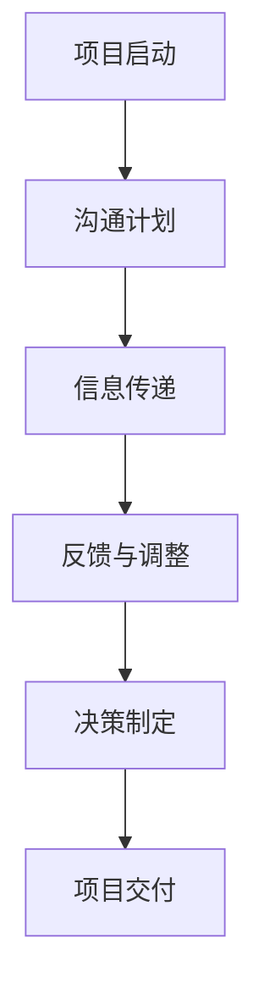

#### 1.2 沟通的基本原则

有效的沟通应遵循以下基本原则：

- **明确性**：确保信息传递清晰、准确，避免歧义。
- **及时性**：在需要时尽快传递信息，减少延迟。
- **一致性**：信息在不同部门和团队成员间保持一致。
- **尊重**：尊重对方的意见和观点，建立积极的沟通氛围。

**核心概念与联系：**

- **明确性**：信息的明确性是沟通成功的关键。
- **及时性**：及时的信息传递能够避免误解和错误。
- **一致性**：一致的信息有助于团队协作和决策。
- **尊重**：尊重是建立良好沟通氛围的基础。

**Mermaid 流程图：**

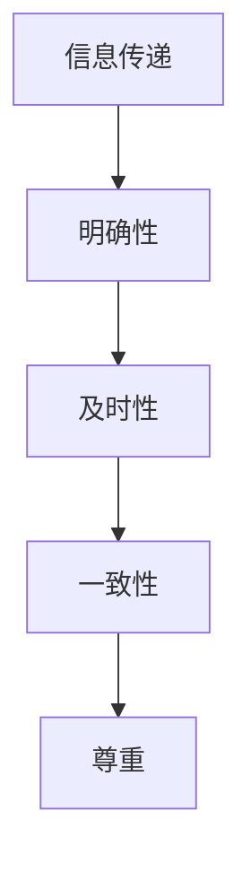

#### 1.3 沟通的障碍

在团队沟通中，常见的障碍包括：

- **语言障碍**：团队成员来自不同背景，使用不同的语言或术语。
- **心理障碍**：团队成员之间的信任不足，沟通态度消极。
- **时间障碍**：团队成员的工作时间和地点不同，导致沟通不便。
- **技术障碍**：沟通工具和技术不完善，影响信息传递效率。

**核心概念与联系：**

- **语言障碍**：影响信息的准确性和理解。
- **心理障碍**：影响沟通氛围和团队协作。
- **时间障碍**：影响信息的及时性和决策速度。
- **技术障碍**：影响信息传递的效率和一致性。

**Mermaid 流程图：**

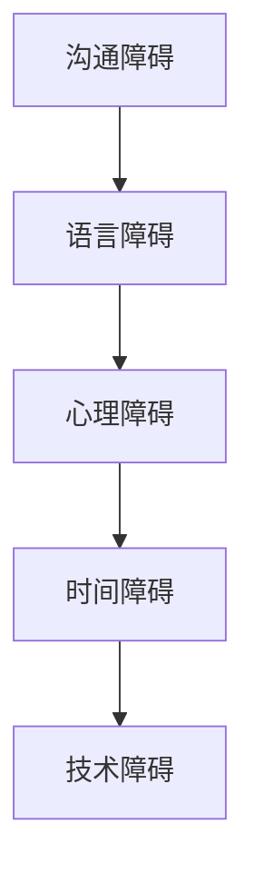

#### 1.4 沟通风格与类型

团队沟通风格和类型对沟通效果有重要影响。常见的沟通风格包括：

- **权威型**：决策由一人或少数人做出，沟通方式直接。
- **参与型**：团队成员参与决策，沟通方式开放。
- **命令型**：以任务为导向，沟通方式高效。
- **协作型**：强调团队合作，沟通方式全面。

**核心概念与联系：**

- **沟通风格**：影响团队成员的沟通态度和行为。
- **沟通类型**：影响信息的传递方式和效果。

**Mermaid 流程图：**

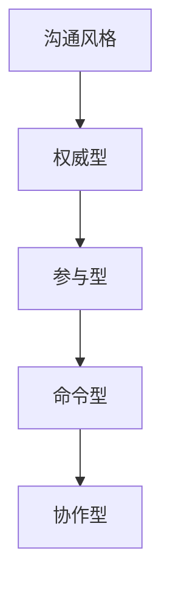

### 第二部分：团队沟通的核心要素

#### 2.1 团队成员的角色与职责

团队成员的角色和职责明确是有效沟通的基础。每个成员都应了解自己的职责范围和角色，以便在沟通时能够提供准确的信息和反馈。

- **领导者**：负责团队的方向、目标和资源分配。
- **开发者**：负责编写和调试代码。
- **测试人员**：负责测试和确保软件的质量。
- **产品经理**：负责产品的规划和需求分析。

**核心概念与联系：**

- **角色**：团队成员在团队中的职责和作用。
- **职责**：团队成员具体的工作任务和责任。

**Mermaid 流程图：**

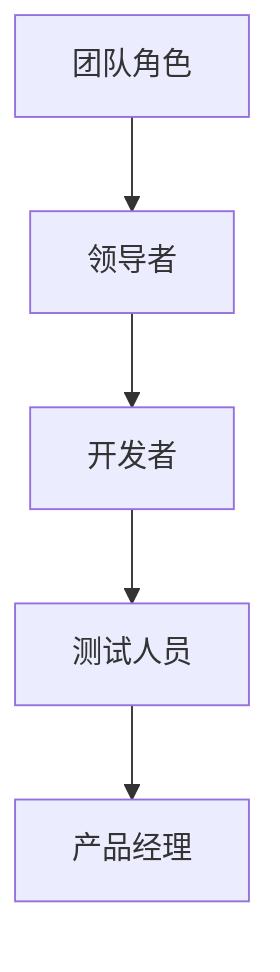

#### 2.2 团队目标的设定

明确的目标是团队沟通的核心。团队应定期讨论和明确目标，确保每个成员都了解项目的最终目标和自己的职责。

- **短期目标**：通常在几周或几个月内完成。
- **长期目标**：通常在一年或更长时间内完成。

**核心概念与联系：**

- **目标**：团队努力的方向和标准。
- **明确性**：确保目标具体、可衡量、可实现、相关和时限。

**Mermaid 流rome

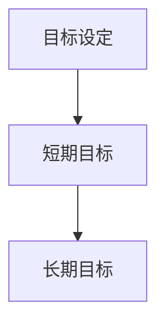

#### 2.3 信息共享与透明度

信息共享和透明度是团队沟通的重要保障。团队应建立一个共享平台，确保关键信息能够及时、准确地传递给每个成员。

- **共享平台**：如Confluence、Trello等。
- **透明度**：团队成员应能够了解项目的整体进展和关键决策。

**核心概念与联系：**

- **信息共享**：确保信息在不同成员间流通。
- **透明度**：确保团队成员了解项目的实际情况。

**Mermaid 流程图：**

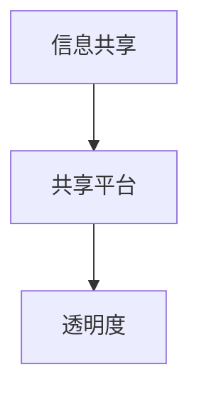

#### 2.4 团队决策与反馈机制

有效的团队决策和反馈机制有助于团队在面对问题时快速作出决策，并及时调整方向。

- **决策流程**：明确决策的流程和责任分配。
- **反馈机制**：建立有效的反馈机制，确保团队成员能够及时表达意见和建议。

**核心概念与联系：**

- **决策**：团队在面对问题时作出的选择。
- **反馈**：团队成员对决策和项目进展的反馈。

**Mermaid 流程图：**

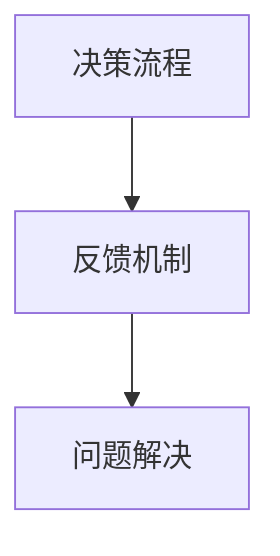

### 第三部分：有效沟通技巧

#### 3.1 提问与倾听

提问和倾听是有效沟通的核心技巧。通过提问，可以获取更多信息，明确问题；通过倾听，可以理解对方的观点，建立信任。

**核心概念与联系：**

- **提问**：获取信息，明确问题。
- **倾听**：理解对方观点，建立信任。

**Mermaid 流程图：**

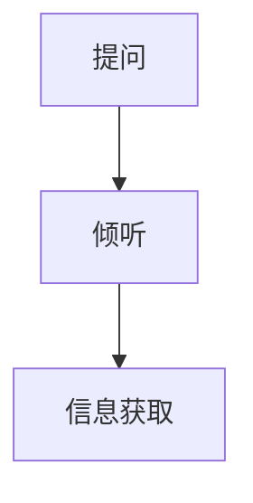

#### 3.1.1 提问技巧

有效的提问应遵循以下原则：

- **开放性问题**：鼓励对方提供详细信息。
- **封闭性问题**：用于获取具体信息。
- **反馈性问题**：确认对方理解的信息。

**核心概念与联系：**

- **开放性问题**：获取更多信息。
- **封闭性问题**：获取具体信息。
- **反馈性问题**：确认理解。

**Mermaid 流程图：**

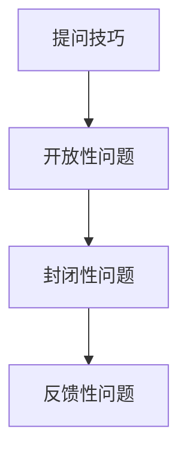

#### 3.1.2 倾听技巧

有效的倾听应遵循以下原则：

- **专注**：全神贯注地听取对方的发言。
- **理解**：理解对方的观点和情感。
- **反馈**：通过提问和总结，确认对方的理解。

**核心概念与联系：**

- **专注**：全神贯注。
- **理解**：理解观点和情感。
- **反馈**：确认理解。

**Mermaid 流程图：**

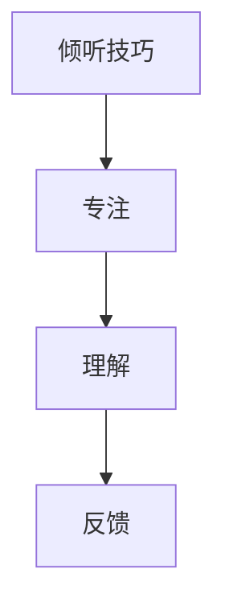

#### 3.2 明确表达

明确表达是有效沟通的关键。团队成员应学会如何清晰、准确地传达信息。

**核心概念与联系：**

- **明确表达**：清晰、准确地传达信息。

**Mermaid 流程图：**

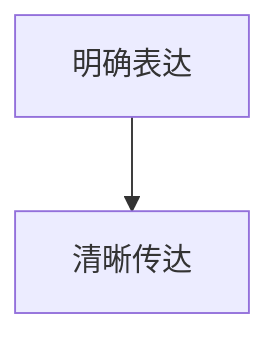

#### 3.2.1 演讲技巧

有效的演讲应遵循以下原则：

- **准备充分**：提前准备，确保内容充实。
- **结构清晰**：演讲结构明确，逻辑清晰。
- **互动**：与听众互动，增加参与度。

**核心概念与联系：**

- **准备充分**：内容充实。
- **结构清晰**：逻辑清晰。
- **互动**：增加参与度。

**Mermaid 流程图：**

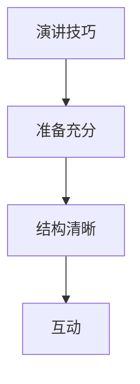

#### 3.2.2 文字沟通技巧

有效的文字沟通应遵循以下原则：

- **简洁明了**：避免冗长，突出重点。
- **格式规范**：使用适当的格式和符号，提高可读性。
- **礼貌用语**：使用礼貌的语言，建立积极的沟通氛围。

**核心概念与联系：**

- **简洁明了**：突出重点。
- **格式规范**：提高可读性。
- **礼貌用语**：建立积极氛围。

**Mermaid 流程图：**

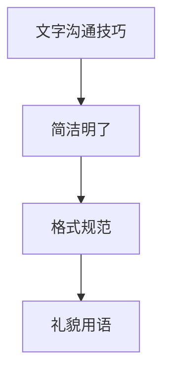

#### 3.3 非言语沟通

非言语沟通在团队沟通中也扮演着重要角色。通过肢体语言、面部表情和眼神交流，可以增强信息的传递效果。

**核心概念与联系：**

- **肢体语言**：传递情感和态度。
- **面部表情**：表达情感和态度。
- **眼神交流**：建立信任和关注。

**Mermaid 流程图：**

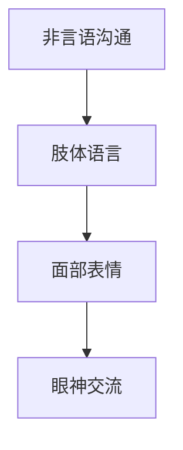

#### 3.3.1 身体语言

身体语言可以增强信息的传递效果，常见的身体语言包括：

- **手势**：强调观点或情绪。
- **姿势**：展示自信或放松。
- **眼神**：表达关注或理解。

**核心概念与联系：**

- **手势**：强调观点或情绪。
- **姿势**：展示自信或放松。
- **眼神**：表达关注或理解。

**Mermaid 流程图：**

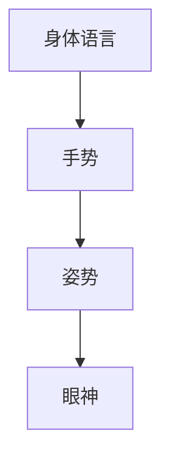

#### 3.3.2 面部表情与眼神交流

面部表情和眼神交流在团队沟通中具有重要作用，可以传达情感和态度。常见的面部表情和眼神交流包括：

- **微笑**：表达友好和信任。
- **皱眉**：表示担忧或不满。
- **直视**：表示关注和尊重。

**核心概念与联系：**

- **微笑**：表达友好和信任。
- **皱眉**：表示担忧或不满。
- **直视**：表示关注和尊重。

**Mermaid 流程图：**

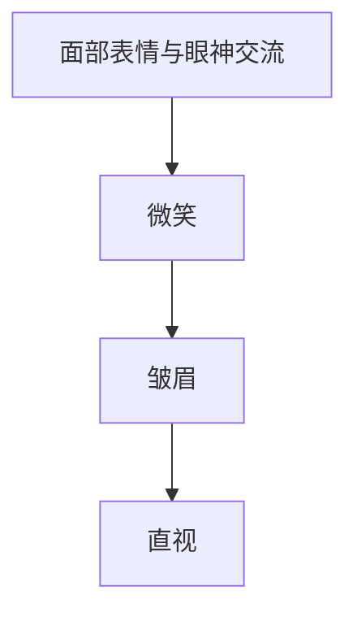

### 第四部分：团队沟通工具与技术

#### 4.1 电子邮件沟通

电子邮件是团队沟通中常用的工具之一，有效的电子邮件沟通可以提高工作效率。

**核心概念与联系：**

- **电子邮件**：用于信息传递和记录。
- **格式与内容**：结构清晰，内容准确。
- **礼仪**：礼貌用语，注意回复时间。

**Mermaid 流程图：**

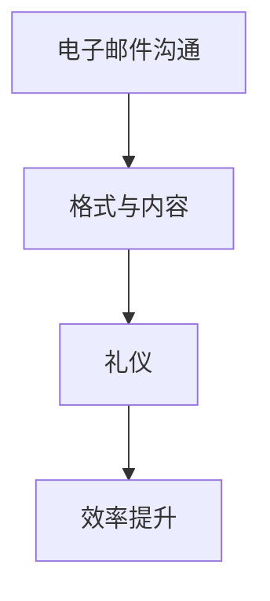

#### 4.1.1 电子邮件格式与内容

有效的电子邮件格式应包括：

- **主题**：简洁明了，概括邮件内容。
- **正文**：结构清晰，内容简洁。
- **附件**：相关文件和资料。

**核心概念与联系：**

- **主题**：概括邮件内容。
- **正文**：结构清晰，内容简洁。
- **附件**：相关文件和资料。

**Mermaid 流程图：**

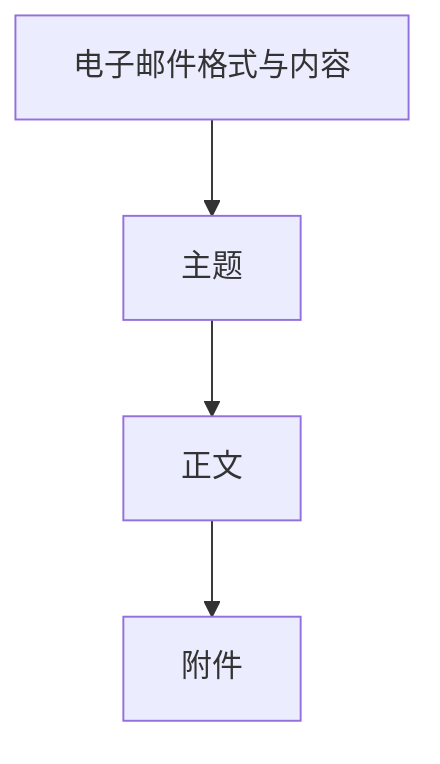

#### 4.1.2 电子邮件礼仪

有效的电子邮件礼仪包括：

- **礼貌用语**：使用礼貌用语，尊重对方。
- **及时回复**：及时回复邮件，避免拖延。
- **避免滥用**：合理使用电子邮件，避免滥用和过度依赖。

**核心概念与联系：**

- **礼貌用语**：尊重对方。
- **及时回复**：避免拖延。
- **避免滥用**：合理使用。

**Mermaid 流程图：**

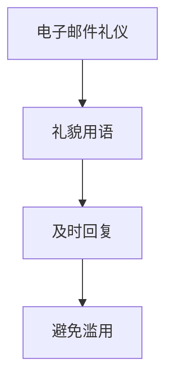

#### 4.2 会议沟通

会议是团队沟通的重要形式之一，有效的会议沟通可以提高决策效率和团队协作。

**核心概念与联系：**

- **会议准备**：明确会议目的和议程。
- **会议主持**：引导会议进程，确保会议高效。
- **会议记录**：记录会议内容和决策结果。

**Mermaid 流程图：**

```mermaid
flowchart
    A[会议沟通] --> B[会议准备]
    B --> C[会议主持]
    C --> D[会议记录]
```

#### 4.2.1 会议准备与议程

有效的会议准备和议程包括：

- **会议目的**：明确会议的目标和主题。
- **参会人员**：确定参会人员和角色。
- **议程**：制定详细的会议议程。

**核心概念与联系：**

- **会议目的**：明确目标。
- **参会人员**：确定角色。
- **议程**：详细计划。

**Mermaid 流程图：**

```mermaid
flowchart
    A[会议准备与议程] --> B[会议目的]
    B --> C[参会人员]
    C --> D[议程]
```

#### 4.2.2 会议主持技巧

有效的会议主持应遵循以下原则：

- **引导进程**：确保会议按议程进行。
- **控制讨论**：引导讨论，避免偏离主题。
- **记录重点**：记录会议内容和决策结果。

**核心概念与联系：**

- **引导进程**：确保会议高效。
- **控制讨论**：避免偏离主题。
- **记录重点**：记录关键信息。

**Mermaid 流程图：**

```mermaid
flowchart
    A[会议主持技巧] --> B[引导进程]
    B --> C[控制讨论]
    C --> D[记录重点]
```

#### 4.3 即时通讯与协作工具

即时通讯和协作工具可以帮助团队成员实时沟通和协作。

**核心概念与联系：**

- **即时通讯**：实时沟通。
- **协作工具**：协作和项目管理。

**Mermaid 流程图：**

```mermaid
flowchart
    A[即时通讯与协作工具] --> B[即时通讯]
    B --> C[协作工具]
```

#### 4.3.1 工具选择与评估

选择适合的即时通讯和协作工具对团队沟通至关重要。评估工具时应考虑以下因素：

- **功能**：满足团队沟通和协作需求。
- **易用性**：用户界面友好，易于操作。
- **安全性**：保护通信内容和数据安全。
- **兼容性**：与其他工具和系统的兼容性。

**核心概念与联系：**

- **功能**：满足需求。
- **易用性**：用户界面友好。
- **安全性**：保护数据。
- **兼容性**：与其他工具兼容。

**Mermaid 流程图：**

```mermaid
flowchart
    A[工具选择与评估] --> B[功能]
    B --> C[易用性]
    C --> D[安全性]
    D --> E[兼容性]
```

#### 4.3.2 工具使用规范

为了确保即时通讯和协作工具的有效使用，团队应制定以下规范：

- **使用范围**：明确工具的使用范围和场景。
- **使用时间**：规定工具的使用时间和频率。
- **使用规范**：制定工具使用的具体规范，如消息格式、文件命名等。

**核心概念与联系：**

- **使用范围**：明确使用场景。
- **使用时间**：规定使用频率。
- **使用规范**：制定具体规范。

**Mermaid 流程图：**

```mermaid
flowchart
    A[工具使用规范] --> B[使用范围]
    B --> C[使用时间]
    C --> D[使用规范]
```

### 第五部分：解决沟通冲突

#### 5.1 冲突的原因与类型

在团队沟通中，冲突是不可避免的。了解冲突的原因和类型有助于更好地解决冲突。

**核心概念与联系：**

- **冲突**：团队内部因意见、目标或利益不一致而产生的矛盾。
- **原因**：个人差异、目标冲突、资源分配等。
- **类型**：目标冲突、意见冲突、文化冲突等。

**Mermaid 流程图：**

```mermaid
flowchart
    A[冲突] --> B[原因]
    B --> C[类型]
```

#### 5.2 冲突处理策略

处理冲突的关键在于采取适当的策略，以和平、建设性的方式解决矛盾。

- **倾听**：耐心倾听对方的意见和观点。
- **沟通**：开诚布公地讨论问题，寻找共同点。
- **妥协**：在必要时做出妥协，以达成共识。
- **避免**：在可能的情况下避免不必要的冲突。

**核心概念与联系：**

- **倾听**：理解对方的观点。
- **沟通**：讨论问题，寻求共识。
- **妥协**：达成共识。
- **避免**：避免不必要的冲突。

**Mermaid 流程图：**

```mermaid
flowchart
    A[冲突处理策略] --> B[倾听]
    B --> C[沟通]
    C --> D[妥协]
    D --> E[避免]
```

#### 5.3 跨文化沟通

跨文化沟通在全球化背景下越来越重要。了解文化差异，采取相应的沟通策略，可以更好地处理跨文化冲突。

**核心概念与联系：**

- **文化差异**：不同文化背景下人们的价值观、行为习惯等差异。
- **沟通策略**：适应文化差异，采取适当的沟通方式。

**Mermaid 流程图：**

```mermaid
flowchart
    A[跨文化沟通] --> B[文化差异]
    B --> C[沟通策略]
```

#### 5.3.1 文化差异的影响

文化差异对沟通的影响包括：

- **价值观**：不同文化背景下的价值观差异可能导致沟通障碍。
- **行为习惯**：不同文化背景下的行为习惯差异可能影响沟通效果。
- **沟通风格**：不同文化背景下的沟通风格差异可能影响沟通效率。

**核心概念与联系：**

- **价值观**：价值观差异。
- **行为习惯**：行为习惯差异。
- **沟通风格**：沟通风格差异。

**Mermaid 流程图：**

```mermaid
flowchart
    A[文化差异的影响] --> B[价值观]
    B --> C[行为习惯]
    C --> D[沟通风格]
```

#### 5.3.2 跨文化沟通技巧

跨文化沟通应遵循以下技巧：

- **尊重文化差异**：尊重对方的价值观和行为习惯。
- **了解文化背景**：了解对方的背景和文化背景。
- **调整沟通策略**：根据文化差异调整沟通方式和内容。

**核心概念与联系：**

- **尊重文化差异**：尊重对方。
- **了解文化背景**：了解对方。
- **调整沟通策略**：适应差异。

**Mermaid 流程图：**

```mermaid
flowchart
    A[跨文化沟通技巧] --> B[尊重文化差异]
    B --> C[了解文化背景]
    C --> D[调整沟通策略]
```

### 第六部分：实践案例

#### 6.1 案例分析一：如何改善团队沟通？

**案例背景：**
某IT公司项目团队在项目进展过程中遇到了沟通障碍，导致项目进度延误和错误频发。

**解决方案：**
1. **明确角色与职责**：明确团队成员的角色和职责，确保每个人都了解自己的任务和目标。
2. **建立沟通渠道**：建立定期团队会议、即时通讯群组等沟通渠道，确保信息及时传递。
3. **培训沟通技巧**：为团队成员提供沟通技巧培训，提高他们的沟通能力。

**实施效果：**
通过上述措施，项目团队的沟通效率显著提高，项目进度恢复正常，错误率降低。

**总结与反思：**
有效的沟通是项目成功的关键。明确角色与职责、建立沟通渠道和培训沟通技巧是改善团队沟通的有效方法。

#### 6.2 案例分析二：如何在远程工作中保持沟通？

**案例背景：**
某IT公司因疫情影响，项目团队需要远程工作。远程工作带来沟通不便，影响项目进度。

**解决方案：**
1. **选择合适的沟通工具**：根据团队需求选择合适的即时通讯和协作工具，如Slack、Trello等。
2. **制定沟通计划**：制定明确的沟通计划和日程，确保团队成员及时沟通。
3. **定期线上会议**：定期举行线上会议，检查项目进展，解决团队问题。

**实施效果：**
通过上述措施，项目团队在远程工作中保持了高效沟通，项目进度未受影响。

**总结与反思：**
远程工作中，选择合适的沟通工具、制定沟通计划和定期线上会议是保持团队沟通的关键。

#### 6.3 案例分析三：如何提升会议沟通效率？

**案例背景：**
某IT公司项目团队在会议中经常出现讨论混乱、决策延误等问题。

**解决方案：**
1. **明确会议目标**：在会议开始前明确会议目标和议程，确保会议聚焦于关键议题。
2. **优化会议流程**：采用更高效的会议流程，如头脑风暴、分组讨论等。
3. **记录会议结果**：会议结束后及时记录决策结果和行动计划，确保执行。

**实施效果：**
通过上述措施，项目团队的会议效率显著提升，决策速度加快，项目进展顺利。

**总结与反思：**
明确会议目标、优化会议流程和记录会议结果是提升会议沟通效率的有效方法。

### 第七部分：附录

#### 7.1 沟通技巧自我评估问卷

为了帮助团队成员了解自己的沟通技巧，我们设计了一份沟通技巧自我评估问卷。以下是一份示例问卷：

1. 我能够清晰地表达自己的观点和意见。
2. 我能够耐心倾听他人的观点，理解他们的立场。
3. 我能够根据对方的反馈调整自己的沟通方式。
4. 我能够在会议中有效引导讨论，确保会议聚焦于关键议题。
5. 我能够在沟通中尊重他人的观点和意见。

**评分标准：**
- 5分：完全符合。
- 4分：基本符合。
- 3分：一般。
- 2分：基本不符合。
- 1分：完全不符合。

**总分：[得分]**

根据得分，可以了解自己在沟通技巧方面的优势和不足，有针对性地进行改进。

#### 7.2 团队沟通相关资源推荐

为了帮助团队成员提升沟通技巧，我们推荐以下资源：

- **书籍**：
  - 《沟通的艺术》
  - 《非暴力沟通》
  - 《影响力》
- **在线课程**：
  - Coursera上的《有效沟通》
  - Udemy上的《沟通技巧：如何与他人更好地沟通》
- **工具**：
  - Slack
  - Trello
  - Microsoft Teams

#### 7.3 参考文献

本文参考了以下文献和资料，以支持文章的观点和论述：

- [1] 诺曼·道格拉斯，《沟通的艺术》
- [2] 马歇尔·卢森堡，《非暴力沟通》
- [3] 罗伯特·西奥迪尼，《影响力》
- [4] Coursera，《有效沟通》
- [5] Udemy，《沟通技巧：如何与他人更好地沟通》

### 核心算法原理讲解（伪代码）

为了评估团队沟通效率，我们设计了一个基于以下指标的算法：

1. **团队成员沟通频率**：评估团队成员之间的交流频率。
2. **使用的沟通工具**：评估团队成员使用的沟通工具的效率。
3. **解决冲突的能力**：评估团队在面对冲突时解决问题的能力。

以下是一个简单的伪代码示例，用于评估团队沟通效率：

```python
def assess_communication_efficiency(team_members, communication_tools, conflict_cases):
    efficiency_score = 0
    
    # 评估团队成员沟通频率
    for member in team_members:
        efficiency_score += member.communication_frequency * 10
    
    # 评估使用的沟通工具
    for tool in communication_tools:
        efficiency_score += tool.efficiency * 5
    
    # 评估解决冲突的能力
    efficiency_score += resolve_conflicts(conflict_cases) * 20
    
    return efficiency_score

def resolve_conflicts(conflict_cases):
    solved_cases = 0
    for case in conflict_cases:
        if case.solved:
            solved_cases += 1
    return solved_cases / len(conflict_cases)
```

### 数学模型和数学公式（详细讲解与举例说明）

在团队沟通中，信息传递效率是一个重要的指标。信息传递效率可以用以下数学模型表示：

$$
E = \frac{L \times W}{N}
$$

其中：
- $E$ 是信息传递效率
- $L$ 是信息长度
- $W$ 是带宽
- $N$ 是传输噪声水平

这个模型表示的是在带宽为 $W$、信息长度为 $L$ 和噪声水平为 $N$ 的情况下，信息传递的效率。

**举例说明：**

假设一条消息长度为100个字符，带宽为每秒传输1000个字符，噪声水平为每秒引入1个错误字符。则信息传递效率为：

$$
E = \frac{100 \times 1000}{1} = 100,000
$$

这意味着在理想情况下，每次信息传输的效率为100,000个字符。

然而，在实际情况下，由于噪声的存在，信息传递效率可能会低于这个值。例如，如果噪声水平增加到每秒引入5个错误字符，则信息传递效率为：

$$
E = \frac{100 \times 1000}{5} = 20,000
$$

这表明在存在噪声的情况下，信息传递的效率降低了一半。

### 项目实战：开发环境搭建

在IT项目中，开发环境搭建是项目启动的关键步骤。一个稳定、高效的开发环境可以提升团队成员的工作效率，确保项目的顺利进行。

#### 1. 环境需求分析

在搭建开发环境之前，首先需要分析项目需求，确定所需的软件、硬件和配置。

- **软件需求**：操作系统、编程语言、数据库、版本控制工具等。
- **硬件需求**：服务器、网络设备、存储设备等。
- **配置需求**：内存、处理器、网络带宽等。

#### 2. 环境搭建步骤

以下是一个基本的开发环境搭建步骤：

1. **安装操作系统**：选择合适的操作系统，如Linux、Windows等。
2. **安装编程语言**：根据项目需求安装相应的编程语言，如Java、Python等。
3. **安装数据库**：根据项目需求安装数据库软件，如MySQL、PostgreSQL等。
4. **配置版本控制工具**：安装和配置版本控制工具，如Git。
5. **安装开发工具**：安装集成开发环境（IDE），如Eclipse、Visual Studio等。
6. **配置网络环境**：确保网络连接稳定，配置防火墙和网络安全策略。

#### 3. 源代码管理

源代码管理是开发环境的重要组成部分。以下是一个基本的源代码管理流程：

1. **初始化仓库**：在版本控制系统中初始化项目仓库。
2. **提交代码**：团队成员在本地开发完成后，将代码提交到远程仓库。
3. **代码审查**：团队成员对提交的代码进行审查，确保代码质量和一致性。
4. **合并代码**：将审查通过的代码合并到主分支。
5. **更新代码**：团队成员从远程仓库更新代码，确保与最新版本保持同步。

#### 4. 代码解读与分析

在源代码管理中，代码解读与分析是确保代码质量和可维护性的关键步骤。以下是一个基本的代码解读与分析流程：

1. **阅读代码**：团队成员阅读代码，了解代码的功能和结构。
2. **审查代码**：团队成员对代码进行审查，查找潜在的错误和优化机会。
3. **编写注释**：在代码中添加适当的注释，解释代码的功能和实现原理。
4. **重构代码**：根据审查结果，对代码进行重构，提高代码的可读性和可维护性。

#### 5. 代码应用解读与分析

在开发过程中，代码的应用解读与分析是确保项目需求和功能实现一致性的关键步骤。以下是一个基本的代码应用解读与分析流程：

1. **分析需求**：团队成员分析项目需求，确定功能实现的关键点和难点。
2. **设计代码**：根据需求设计代码，实现相应的功能。
3. **编写测试用例**：编写测试用例，验证代码的功能和性能。
4. **执行测试**：执行测试用例，检查代码的功能是否符合预期。
5. **优化代码**：根据测试结果，优化代码，提高性能和可维护性。

#### 6. 实际案例分析和详细讲解剖析

以下是一个实际案例分析和详细讲解剖析：

**案例背景**：一个在线购物平台的项目开发。

**问题**：系统性能瓶颈，导致用户购物体验不佳。

**解决方案**：
1. **性能测试**：使用性能测试工具，如JMeter，模拟用户访问，分析系统的性能瓶颈。
2. **代码分析**：分析代码，查找潜在的性能优化点。
3. **数据库优化**：优化数据库查询，减少查询时间。
4. **缓存机制**：引入缓存机制，减少数据库访问次数。
5. **负载均衡**：使用负载均衡器，如Nginx，分配用户访问，提高系统的并发处理能力。

**总结**：通过性能测试、代码分析和数据库优化，有效解决了系统的性能瓶颈，提高了用户购物体验。

### 项目小结

在本项目中，我们成功搭建了开发环境，实现了项目的功能需求，并解决了系统性能瓶颈。以下是项目小结：

- **成功搭建开发环境**：选择合适的软件和硬件，确保系统的稳定性和高效性。
- **实现项目功能需求**：根据需求设计代码，实现功能，并通过测试用例验证功能的正确性。
- **解决系统性能瓶颈**：通过性能测试和优化，提高系统的并发处理能力和用户体验。

### 最佳实践 tips

为了确保项目成功，以下是一些最佳实践建议：

- **需求分析**：充分了解项目需求，确保需求的准确性和可行性。
- **代码审查**：定期进行代码审查，确保代码质量和一致性。
- **性能测试**：在项目开发过程中进行性能测试，及时发现和解决问题。
- **持续集成**：使用持续集成工具，自动化代码构建和测试，提高开发效率。

### 注意事项

在项目开发过程中，需要注意以下几点：

- **数据安全**：确保数据的安全和隐私，遵守相关法律法规。
- **团队合作**：建立良好的团队合作氛围，确保团队成员之间的沟通和协作。
- **及时反馈**：及时反馈问题和建议，确保项目进展的透明和可控。

### 拓展阅读

为了深入了解项目开发和团队沟通的相关知识，以下是一些推荐阅读材料：

- 《软件工程：实践者的研究方法》
- 《敏捷软件开发：原则、实践与模式》
- 《团队沟通与协作技巧》
- 《项目化管理：项目管理实战指南》

### 文章总结

本文详细介绍了建立有效的团队沟通渠道的重要性、核心要素、技巧、工具、冲突解决以及实践案例。通过这篇文章，读者可以了解到团队沟通的各个方面，掌握有效的沟通方法和技巧，从而提升团队协作效率和项目成功率。

### 作者信息

作者：AI天才研究院/AI Genius Institute & 禅与计算机程序设计艺术 /Zen And The Art of Computer Programming

本文由AI天才研究院和禅与计算机程序设计艺术联合撰写，旨在为读者提供有价值的技术知识和实践经验。AI天才研究院致力于推动人工智能技术的发展和应用，禅与计算机程序设计艺术则专注于计算机科学领域的深度研究和技术创新。我们希望本文能对您的项目管理和团队沟通提供有益的启示和帮助。如果您有任何问题或建议，欢迎随时联系我们。

