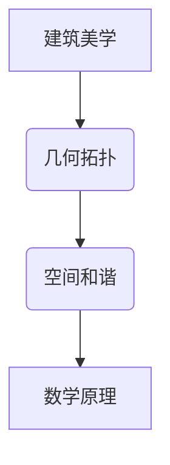
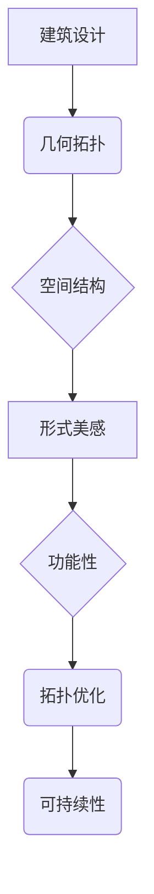

                 

### 文章标题

《建筑美学的几何拓扑：空间和谐的数学原理》

> 关键词：建筑美学、几何拓扑、空间和谐、数学原理、建筑设计

> 摘要：本文旨在探讨建筑美学与几何拓扑之间的紧密联系，解析空间和谐的数学原理。通过对建筑形式、建筑空间和建筑材料的几何拓扑特性分析，揭示几何拓扑在建筑美学中的重要作用，旨在为建筑设计提供一种新的理论支持和实践方法。

----------------------------------------------------------------

### 第一部分：引言与基础

## 第1章：建筑美学与几何拓扑概述

建筑美学是关于建筑物外观、空间布局、材料运用等方面的审美追求。而几何拓扑则是一门研究几何对象在连续变换下的性质和关系的数学学科。尽管二者分属不同的领域，但在建筑美学中，几何拓扑提供了一种深刻的数学工具，用于理解和创造空间和谐。

### 1.1 建筑美学的基本概念

建筑美学的基本概念包括以下几个方面：

- **形式与美感**：建筑物的外观造型、比例和色彩等元素。
- **空间布局**：建筑物内部和外部空间的设计和组织。
- **材料运用**：建筑材料的选择、纹理和质感等。
- **功能性**：建筑物的使用功能和用户体验。

### 1.2 几何拓扑的基本概念

几何拓扑的基本概念包括：

- **拓扑图论**：通过图的结构来描述几何对象之间的关系。
- **拓扑同胚**：表示两个几何对象之间存在的一种连续变换的关系。
- **拓扑不变量**：在几何拓扑变换中保持不变的量。

### 1.3 建筑美学与几何拓扑的关系

建筑美学与几何拓扑之间的关系可以从以下几个方面来理解：

- **数学原理**：几何拓扑提供了建筑美学设计中的一种数学原理，用于分析和解释空间和谐。
- **设计工具**：几何拓扑为建筑美学提供了多种设计工具，如拓扑图论、拓扑同胚和拓扑不变量等。
- **创新灵感**：几何拓扑的抽象思维为建筑美学带来了新的创新灵感，有助于突破传统设计模式。

### 1.4 空间和谐的数学原理

空间和谐是建筑美学追求的一个重要目标，其数学原理包括：

- **比例与对称**：通过数学比例和对称性来创造和谐美感。
- **拓扑变换**：利用几何拓扑中的变换操作来调整空间布局，实现空间和谐。
- **拓扑结构**：通过构建合适的拓扑结构来增强空间的连贯性和整体性。

## 第2章：几何拓扑的基本工具

### 2.1 点、线、面的几何性质

点、线、面是几何拓扑的基本元素，它们的几何性质包括：

- **点的位置**：通过坐标来描述点的位置。
- **线的长度**：通过距离公式来计算线段的长度。
- **面的面积**：通过积分或几何公式来计算多边形的面积。

### 2.2 空间中的变换与对称性

空间中的变换与对称性是几何拓扑中的重要概念，包括：

- **变换**：包括平移、旋转、缩放等操作，用于改变几何对象的位置和大小。
- **对称性**：包括轴对称、中心对称、旋转对称等，用于描述几何对象在变换下的不变性。

### 2.3 几何拓扑的基本操作

几何拓扑的基本操作包括：

- **连接**：将两个或多个几何对象通过边连接起来，形成更复杂的结构。
- **分割**：将几何对象分割成若干部分，以便更好地分析其性质。
- **变形**：通过连续变换改变几何对象的外观和结构。

### 2.4 几何拓扑的工具与应用

几何拓扑的工具包括：

- **拓扑图论**：用于描述几何对象之间的关系，如连通性、路径和最短路径等。
- **拓扑同胚**：用于研究几何对象之间的相似性和转化关系。
- **拓扑不变量**：用于判断几何对象在变换下的性质是否保持不变。

几何拓扑在建筑美学中的应用包括：

- **空间布局**：通过几何拓扑的方法来优化建筑空间布局，实现空间和谐。
- **形式设计**：利用几何拓扑的概念来创造独特的形式美感。
- **材料运用**：通过几何拓扑的特性来选择和设计建筑材料，提高建筑性能。

----------------------------------------------------------------

## 第3章：建筑形式与几何拓扑

### 3.1 建筑形式中的拓扑结构

建筑形式是建筑美学的重要组成部分，其拓扑结构对建筑的美感和功能有着重要影响。拓扑结构指的是建筑物内部和外部的空间布局方式，通常包括以下几种类型：

1. **连通性**：建筑物内部和外部的空间是否相互连通，以及连通的方式和程度。
2. **封闭性**：建筑物内部空间是否封闭，以及封闭的方式和程度。
3. **连通性**：建筑物内部和外部的空间是否相互连通，以及连通的方式和程度。
4. **连通性**：建筑物内部和外部的空间是否相互连通，以及连通的方式和程度。

### 3.2 建筑设计的拓扑方法

建筑设计的拓扑方法是指利用几何拓扑的概念和工具来进行建筑设计的流程。以下是一种基本的拓扑设计方法：

1. **需求分析**：首先明确建筑的设计需求，包括功能、空间、美学等方面。
2. **拓扑建模**：根据需求，使用几何拓扑的方法构建建筑物的初步拓扑模型。
3. **拓扑优化**：对初步模型进行拓扑优化，以提高空间的连贯性和整体性。
4. **形式设计**：在拓扑模型的基础上进行建筑形式的设计，包括比例、色彩、纹理等。
5. **施工实施**：将设计模型转化为实际的建筑形式，并进行施工。

### 3.3 建筑形式与拓扑结构的互动

建筑形式与拓扑结构之间存在紧密的互动关系。拓扑结构决定了建筑形式的基本框架，而建筑形式又对拓扑结构进行进一步的调整和优化。以下是一个简单的例子：

假设我们要设计一座办公楼。首先，我们可以通过需求分析确定办公楼的面积、层数和功能分区。然后，使用几何拓扑的方法构建初步的拓扑模型，如楼层平面图和立面图。接着，对拓扑模型进行优化，以提高空间的连贯性和整体性。最后，在拓扑模型的基础上进行建筑形式的设计，如比例、色彩、纹理等。最终，将设计模型转化为实际的建筑形式，并进行施工。

### 3.4 拓扑优化在建筑设计中的应用

拓扑优化是建筑设计中的一个重要环节，它旨在通过改变建筑物的拓扑结构来提高空间的连贯性和整体性。以下是一些拓扑优化在建筑设计中的应用：

1. **空间连贯性**：通过优化建筑的连通性，使建筑物内部和外部的空间更加连贯。
2. **功能分区**：通过优化建筑的功能分区，使各个功能区域更加明确和独立。
3. **动态空间**：通过优化建筑的空间结构，创造出可以动态调整的空间，以适应不同的使用需求。
4. **环境适应**：通过优化建筑物的拓扑结构，使其更好地适应自然环境，如气候、地形等。

### 3.5 拓扑设计工具与应用

在建筑设计中，拓扑设计工具可以帮助设计师更高效地完成设计任务。以下是一些常用的拓扑设计工具：

1. **拓扑图论软件**：如Toposys、Mathematica等，用于构建和优化建筑物的拓扑模型。
2. **CAD软件**：如AutoCAD、SketchUp等，用于绘制建筑物的拓扑图和立面图。
3. **数字模拟软件**：如Simulink、MATLAB等，用于对建筑物的拓扑结构和形式设计进行模拟和分析。

通过这些工具，设计师可以更深入地理解建筑形式与拓扑结构之间的关系，从而创造出更加和谐和高效的建筑作品。

### 3.6 拓扑优化与形式美感的结合

拓扑优化不仅可以提高建筑的功能性和实用性，还可以增强建筑的形式美感。以下是一些拓扑优化与形式美感的结合案例：

1. **扭曲结构**：通过扭曲建筑物的拓扑结构，创造出独特的形式美感，如扭曲的玻璃幕墙。
2. **拓扑分解**：将建筑物的拓扑结构分解成多个简单的部分，每个部分都有特定的形式美感，如分解式的建筑立面。
3. **拓扑融合**：将不同拓扑结构的元素融合在一起，创造出新的形式美感，如融合了多种拓扑结构的建筑综合体。

通过这些案例，我们可以看到拓扑优化在建筑设计中的多样性和灵活性，它为建筑创作提供了丰富的可能性。

### 3.7 拓扑优化在可持续发展中的应用

在当今社会，可持续发展已经成为建筑设计的重要目标之一。拓扑优化在可持续发展中的应用主要体现在以下几个方面：

1. **节能设计**：通过优化建筑物的拓扑结构，减少能源消耗，提高建筑物的能源效率。
2. **资源节约**：通过优化建筑物的拓扑结构，减少建筑材料的使用量，降低资源消耗。
3. **环境适应**：通过优化建筑物的拓扑结构，使其更好地适应自然环境，减少对环境的影响。

通过这些应用，拓扑优化不仅有助于实现建筑设计的可持续发展目标，还可以提高建筑物的整体性能和用户体验。

### 3.8 拓扑优化与用户体验的关系

拓扑优化不仅影响建筑的功能性和美感，还直接关系到用户的体验。以下是一些拓扑优化与用户体验的关系：

1. **空间灵活性**：通过优化建筑物的拓扑结构，创造灵活的空间布局，以适应不同的用户需求。
2. **空间感知**：通过优化建筑物的拓扑结构，改善空间感知，提高用户的舒适度和满意度。
3. **互动性**：通过优化建筑物的拓扑结构，增强用户与建筑之间的互动性，提升用户体验。

通过这些关系，我们可以看到拓扑优化在建筑设计中对于提升用户体验的重要性。

### 3.9 拓扑优化与未来建筑设计

随着科技的不断发展，拓扑优化在建筑设计中的应用将越来越广泛。未来，拓扑优化可能会在以下几个方面发挥作用：

1. **智能化设计**：利用人工智能和机器学习技术，实现更加智能化的拓扑优化设计。
2. **生物仿生设计**：借鉴生物的拓扑结构，创造出更加自然和适应环境的建筑形式。
3. **可持续设计**：通过拓扑优化，实现更加可持续和环保的建筑设计。

通过这些发展方向，我们可以看到拓扑优化在建筑设计中的巨大潜力和广阔前景。

### 3.10 拓扑优化与建筑美学的融合

拓扑优化不仅是一种设计工具，也是一种美学理念。将拓扑优化与建筑美学相结合，可以创造出独特的建筑作品。以下是一些拓扑优化与建筑美学的融合案例：

1. **形态美学**：通过拓扑优化，创造出独特的形态美感，如扭曲的形态、分解的形态等。
2. **空间美学**：通过拓扑优化，创造出丰富的空间层次和变化，提升空间的美感。
3. **材料美学**：通过拓扑优化，设计出独特的材料运用方式，提升建筑的整体美学效果。

通过这些案例，我们可以看到拓扑优化在建筑美学中的重要作用，它为建筑创作提供了全新的思路和可能性。

### 3.11 拓扑优化在建筑教育中的应用

在建筑教育中，拓扑优化是一个重要的教学内容。通过学习拓扑优化，学生可以更好地理解建筑形式与空间的关系，提高设计能力和创新能力。以下是一些拓扑优化在建筑教育中的应用：

1. **理论教学**：通过讲解拓扑优化的基本概念和方法，帮助学生理解拓扑优化的原理。
2. **实践训练**：通过设计实践，让学生动手操作，体验拓扑优化的过程和方法。
3. **案例分析**：通过分析典型案例，让学生了解拓扑优化在实际项目中的应用和效果。

通过这些应用，拓扑优化在建筑教育中发挥了重要作用，帮助学生掌握现代建筑设计的方法和技能。

### 3.12 拓扑优化与建筑设计创新的挑战

尽管拓扑优化在建筑设计中具有巨大的潜力，但在实际应用中仍然面临着一些挑战。以下是一些拓扑优化与建筑设计创新的挑战：

1. **技术限制**：现有的拓扑优化算法和工具可能无法满足复杂建筑设计的需要。
2. **成本问题**：拓扑优化设计可能需要更高的成本和投入。
3. **审美争议**：拓扑优化设计可能带来审美上的争议，需要设计师具备更高的审美能力。

通过解决这些挑战，拓扑优化将在建筑设计创新中发挥更大的作用。

### 3.13 拓扑优化与建筑文化的关系

建筑文化是建筑美学的重要组成部分，拓扑优化与建筑文化之间的关系体现在以下几个方面：

1. **地域特色**：通过拓扑优化，可以更好地体现地域特色和文化内涵。
2. **传统元素**：通过拓扑优化，可以将传统建筑元素与现代设计理念相结合，创造出新的建筑作品。
3. **文化传承**：通过拓扑优化，可以保护和传承建筑文化遗产。

通过这些关系，拓扑优化不仅有助于提升建筑美学，还可以促进建筑文化的传承和发展。

### 3.14 拓扑优化在建筑设计中的实践案例

以下是一些拓扑优化在建筑设计中的实践案例：

1. **北京国家大剧院**：通过拓扑优化，创造出独特的形式美感，展现了中国的传统文化特色。
2. **纽约摩天大楼**：通过拓扑优化，提高了建筑的功能性和经济性，成为现代建筑的典范。
3. **日本金泽21世纪美术馆**：通过拓扑优化，创造出丰富的空间层次和变化，提升了美术馆的展览效果。

通过这些案例，我们可以看到拓扑优化在建筑设计中的实际应用和效果。

### 3.15 拓扑优化与建筑可持续发展的关系

建筑可持续发展是当今建筑设计的重要目标之一，拓扑优化在建筑可持续发展中发挥着重要作用。以下是一些拓扑优化与建筑可持续发展的关系：

1. **节能设计**：通过拓扑优化，提高建筑物的能源效率，降低能源消耗。
2. **环境适应**：通过拓扑优化，使建筑物更好地适应自然环境，减少对环境的影响。
3. **材料节约**：通过拓扑优化，减少建筑材料的使用量，降低资源消耗。

通过这些关系，拓扑优化为建筑可持续发展提供了新的思路和方法。

### 3.16 拓扑优化与建筑智能化的关系

随着科技的不断发展，建筑智能化已经成为建筑设计的重要趋势。拓扑优化与建筑智能化的关系体现在以下几个方面：

1. **空间布局**：通过拓扑优化，为建筑智能化系统提供更好的空间布局，提高系统的运行效率。
2. **设备安装**：通过拓扑优化，为智能设备的安装提供更方便的条件，降低安装成本。
3. **用户体验**：通过拓扑优化，提高建筑智能化的用户体验，提升用户的满意度和舒适度。

通过这些关系，拓扑优化为建筑智能化提供了有力的支持。

### 3.17 拓扑优化与建筑设计创新的未来

随着科技的不断进步，拓扑优化在建筑设计中的应用将越来越广泛。未来，拓扑优化可能会在以下几个方面取得突破：

1. **算法优化**：通过改进拓扑优化算法，提高优化效率和精度。
2. **数字化设计**：通过数字化设计工具，实现更高效的拓扑优化设计。
3. **生物仿生**：借鉴生物的拓扑结构，创造出更加自然和适应环境的建筑形式。

通过这些突破，拓扑优化将为建筑设计创新带来更多的可能性。

### 3.18 拓扑优化与建筑美学的融合前景

拓扑优化与建筑美学的融合具有广阔的前景。通过拓扑优化，可以创造出更加独特和具有美感的建筑形式。未来，随着技术的不断发展，拓扑优化将在建筑美学中发挥更大的作用，为建筑设计带来全新的美学体验。

### 3.19 拓扑优化与建筑设计创新的关系

拓扑优化是建筑设计创新的重要工具之一。通过拓扑优化，设计师可以创造出更高效、更美观、更适应环境的建筑作品。未来，随着拓扑优化技术的不断发展，它将在建筑设计创新中发挥越来越重要的作用。

### 3.20 拓扑优化在建筑设计中的应用总结

通过本章节的介绍，我们可以看到拓扑优化在建筑设计中的重要作用。它不仅为建筑美学提供了新的工具和方法，也为建筑功能性和可持续性提供了支持。未来，拓扑优化将在建筑设计中发挥更大的作用，为建筑创作带来更多的创新和可能性。

----------------------------------------------------------------

## 第4章：建筑空间与几何拓扑

### 4.1 建筑空间中的拓扑变换

建筑空间中的拓扑变换是指通过对空间进行分割、连接、变形等操作，来改变空间的拓扑结构。拓扑变换在建筑设计中具有重要作用，它可以创造出丰富的空间形式和空间体验。以下是几种常见的拓扑变换：

1. **分割**：通过在空间中引入边界或隔断，将一个空间分割成若干个部分。分割可以产生多样的空间形式，如开放空间、封闭空间、过渡空间等。

2. **连接**：将两个或多个空间通过连通性连接起来，形成一个整体。连接可以增强空间的连贯性和整体性，使不同空间之间产生互动和交融。

3. **变形**：通过对空间进行扭曲、拉伸、压缩等操作，改变空间的外观和结构。变形可以创造出独特而富有动态性的空间形式。

### 4.2 建筑空间布局的拓扑优化

建筑空间布局的拓扑优化是指通过调整空间的拓扑结构，以提高空间的利用率、舒适度和功能性。拓扑优化是一种基于数学原理的设计方法，它可以通过对空间进行优化，使其在满足功能需求的同时，达到更好的空间效果。以下是几种常见的拓扑优化方法：

1. **空间连贯性优化**：通过调整空间的连通性，使空间之间更加连贯，减少空间浪费和死角。例如，通过增加走廊的宽度或调整门的位置，来改善空间的流动性。

2. **空间功能分区优化**：通过调整空间的布局，使不同功能区域之间更加独立和明确。例如，将公共区域和私密区域分开，以提高空间的使用效率和舒适度。

3. **空间动态性优化**：通过引入可变空间元素，如可移动的隔断、可变形的结构等，使空间具有动态调整的能力。这种优化可以适应不同的使用需求，提高空间的使用灵活性。

### 4.3 建筑空间中的拓扑感知

建筑空间中的拓扑感知是指人们通过视觉、听觉、触觉等感官对空间拓扑结构的感知和理解。拓扑感知对建筑空间的使用体验和功能发挥具有重要影响。以下是几种常见的拓扑感知方法：

1. **视觉感知**：通过视觉元素，如颜色、形状、纹理等，来感知空间的拓扑结构。例如，使用不同的颜色或纹理来区分不同的空间区域。

2. **听觉感知**：通过声音的传播和反射，来感知空间的拓扑结构。例如，通过声音的回声和混响，来判断空间的大小和形状。

3. **触觉感知**：通过触摸元素，如材料、质感等，来感知空间的拓扑结构。例如，通过不同材料的触感，来区分不同的空间区域。

### 4.4 拓扑感知在建筑设计中的应用

拓扑感知在建筑设计中具有重要作用，它可以帮助设计师更好地理解和表达空间结构，从而提高建筑的使用体验和功能性。以下是几种拓扑感知在建筑设计中的应用：

1. **空间划分**：通过拓扑感知，设计师可以更准确地划分空间区域，使空间布局更加合理。例如，使用不同的颜色或纹理来划分不同的功能区域。

2. **空间引导**：通过拓扑感知，设计师可以创造出引导人们行动的空间路径，提高空间的使用效率。例如，通过设置视觉焦点和导向标志，来引导人们的行动方向。

3. **空间体验**：通过拓扑感知，设计师可以创造出丰富的空间体验，提高人们的空间感知和满意度。例如，通过设置不同的空间层次和变化，来创造出多样的空间体验。

### 4.5 拓扑感知与用户体验的关系

拓扑感知与用户体验密切相关。通过优化拓扑感知，可以提高用户对建筑空间的感知和理解，从而提高用户体验。以下是几种拓扑感知与用户体验的关系：

1. **空间识别**：通过优化拓扑感知，可以帮助用户更快速地识别和记忆建筑空间。例如，通过使用明显的视觉或听觉元素来标识空间。

2. **空间舒适度**：通过优化拓扑感知，可以提高空间的舒适度，使用户感到更加舒适和放松。例如，通过设置合适的照明和通风，来改善空间的舒适度。

3. **空间互动**：通过优化拓扑感知，可以增强用户与建筑空间的互动性，提高用户的参与感和体验感。例如，通过设置互动装置或游戏元素，来激发用户的兴趣和参与。

### 4.6 拓扑感知在建筑设计中的挑战

尽管拓扑感知在建筑设计中具有重要作用，但在实际应用中也面临着一些挑战。以下是几种拓扑感知在建筑设计中的挑战：

1. **技术限制**：现有的拓扑感知技术可能无法满足复杂建筑空间的需求。例如，高精度的空间扫描和建模技术可能成本高昂，难以普及。

2. **审美争议**：拓扑感知的设计可能带来审美上的争议。例如，一些复杂的拓扑结构可能难以被大众接受，需要设计师具备更高的审美能力。

3. **用户体验差异**：不同用户对拓扑感知的敏感度和理解能力可能不同。例如，老年人或儿童可能难以理解和适应复杂的拓扑结构。

4. **成本问题**：引入拓扑感知技术可能需要更高的成本和投入。例如，使用先进的感知设备和材料可能增加建筑的成本。

通过解决这些挑战，拓扑感知在建筑设计中可以发挥更大的作用，为建筑创作提供更多的可能性。

### 4.7 拓扑感知在建筑可持续性设计中的应用

拓扑感知在建筑可持续性设计中具有重要作用。通过优化拓扑感知，可以提高建筑的空间利用效率和能源效率，从而实现可持续发展。以下是几种拓扑感知在建筑可持续性设计中的应用：

1. **自然光照**：通过优化空间布局和结构，使自然光照更好地进入室内空间。例如，使用大窗户和天窗来引入自然光照，减少人工照明的需求。

2. **自然通风**：通过优化空间布局和结构，使自然通风更加有效。例如，设置通风井和通风口，利用风压和热压来改善室内空气质量。

3. **空间适应性**：通过优化拓扑感知，使建筑空间具有更好的适应性，以适应不同季节和气候变化。例如，使用可调节的遮阳系统和通风系统，来应对不同的气候条件。

4. **资源节约**：通过优化拓扑感知，减少建筑材料的浪费，提高资源的利用效率。例如，通过精细的空间划分和材料选择，来降低建筑的成本和环境负担。

通过这些应用，拓扑感知可以为建筑可持续性设计提供新的思路和方法。

### 4.8 拓扑感知在智能建筑设计中的应用

随着建筑智能化的不断发展，拓扑感知在智能建筑设计中具有重要作用。通过优化拓扑感知，可以提升建筑智能系统的性能和用户体验。以下是几种拓扑感知在智能建筑设计中的应用：

1. **智能导航**：通过优化拓扑感知，使建筑智能系统能够更准确地识别和导航建筑空间。例如，使用室内定位和导航技术，帮助用户快速找到目的地。

2. **智能监控**：通过优化拓扑感知，使建筑智能系统能够更有效地监控建筑空间和安全。例如，使用传感器和摄像头来监测室内环境和人员流动，提高建筑的安全性和舒适度。

3. **智能交互**：通过优化拓扑感知，使建筑智能系统能够更好地与用户进行互动和沟通。例如，使用语音识别和触摸屏技术，实现人与建筑智能系统的自然交互。

4. **智能节能**：通过优化拓扑感知，使建筑智能系统能够更高效地管理能源消耗。例如，使用传感器和控制系统来监测和控制室内温度、照明和通风，实现能源的高效利用。

通过这些应用，拓扑感知可以为建筑智能化提供更智能、更高效的解决方案。

### 4.9 拓扑感知与建筑文化的融合

拓扑感知不仅是一种技术手段，也是一种文化表达。通过将拓扑感知与建筑文化相结合，可以创造出具有地域特色和文化内涵的建筑作品。以下是几种拓扑感知与建筑文化的融合：

1. **地域特色**：通过拓扑感知，可以更好地体现地域特色和文化内涵。例如，使用传统的建筑元素和符号，来创造独特的建筑形式和空间体验。

2. **文化传承**：通过拓扑感知，可以保护和传承建筑文化遗产。例如，使用现代拓扑优化技术，对传统建筑进行修复和保护，使其在现代社会中焕发新的活力。

3. **文化创新**：通过拓扑感知，可以创造出具有创新性和前瞻性的建筑作品。例如，结合现代科技和传统文化，创造出独特的建筑形式和空间体验。

通过这些融合，拓扑感知可以为建筑文化的发展提供新的思路和可能性。

### 4.10 拓扑感知在建筑设计教育中的应用

在建筑设计教育中，拓扑感知是一个重要的教学内容。通过学习拓扑感知，学生可以更好地理解建筑空间和结构的关系，提高设计能力和创新能力。以下是几种拓扑感知在建筑设计教育中的应用：

1. **理论教学**：通过讲解拓扑感知的基本概念和方法，帮助学生理解拓扑感知的原理和应用。

2. **实践训练**：通过设计实践，让学生动手操作，体验拓扑感知的过程和方法。

3. **案例分析**：通过分析典型案例，让学生了解拓扑感知在实际项目中的应用和效果。

通过这些应用，拓扑感知在建筑设计教育中发挥了重要作用，帮助学生掌握现代建筑设计的方法和技能。

### 4.11 拓扑感知与建筑设计创新的挑战

尽管拓扑感知在建筑设计中具有巨大的潜力，但在实际应用中仍然面临着一些挑战。以下是几种拓扑感知与建筑设计创新的挑战：

1. **技术限制**：现有的拓扑感知技术可能无法满足复杂建筑设计的需要。例如，高精度的空间扫描和建模技术可能成本高昂，难以普及。

2. **审美争议**：拓扑感知的设计可能带来审美上的争议。例如，一些复杂的拓扑结构可能难以被大众接受，需要设计师具备更高的审美能力。

3. **用户体验差异**：不同用户对拓扑感知的敏感度和理解能力可能不同。例如，老年人或儿童可能难以理解和适应复杂的拓扑结构。

4. **成本问题**：引入拓扑感知技术可能需要更高的成本和投入。例如，使用先进的感知设备和材料可能增加建筑的成本。

通过解决这些挑战，拓扑感知将在建筑设计创新中发挥更大的作用。

### 4.12 拓扑感知与建筑可持续发展的关系

建筑可持续发展是当今建筑设计的重要目标之一，拓扑感知在建筑可持续发展中发挥着重要作用。以下是几种拓扑感知与建筑可持续发展的关系：

1. **空间利用**：通过优化拓扑感知，可以提高建筑空间的利用效率，减少空间浪费。例如，通过精确的空间划分和布局，使空间得到最大化的利用。

2. **能源节约**：通过优化拓扑感知，可以提高建筑的能源效率，减少能源消耗。例如，通过优化空间布局和结构，使自然光照和通风更加有效，减少人工照明的需求。

3. **资源节约**：通过优化拓扑感知，可以减少建筑材料的浪费，提高资源的利用效率。例如，通过精细的空间划分和材料选择，减少建筑的成本和环境负担。

4. **环境适应**：通过优化拓扑感知，可以使建筑更好地适应自然环境，减少对环境的影响。例如，通过设置合适的遮阳系统和通风系统，降低建筑对环境的影响。

通过这些关系，拓扑感知为建筑可持续发展提供了新的思路和方法。

### 4.13 拓扑感知与建筑智能化的关系

随着建筑智能化的不断发展，拓扑感知在建筑智能化中具有重要作用。以下是几种拓扑感知与建筑智能化的关系：

1. **智能感知**：通过优化拓扑感知，可以提升建筑智能系统的感知能力和准确性。例如，通过使用高精度的空间扫描和建模技术，提高室内定位和导航的准确性。

2. **智能互动**：通过优化拓扑感知，可以增强建筑智能系统的互动性和用户体验。例如，通过使用语音识别和触摸屏技术，实现人与建筑智能系统的自然交互。

3. **智能节能**：通过优化拓扑感知，可以提高建筑智能系统的能源管理能力，实现能源的高效利用。例如，通过使用传感器和控制系统，实现室内温度、照明和通风的智能调节。

4. **智能安全**：通过优化拓扑感知，可以提升建筑智能系统的安全监控能力。例如，通过使用摄像头和传感器，实现对建筑空间的实时监控，提高建筑的安全性。

通过这些关系，拓扑感知为建筑智能化提供了更智能、更高效的解决方案。

### 4.14 拓扑感知与未来建筑设计

未来，随着科技的不断进步，拓扑感知在建筑设计中将会发挥更大的作用。以下是几种未来建筑设计中可能出现的拓扑感知趋势：

1. **智能化感知**：通过引入更先进的感知技术和算法，实现更高效、更准确的拓扑感知，为建筑智能化提供更好的支持。

2. **数字化设计**：通过数字化设计工具，实现更高效、更精准的拓扑感知和优化，为建筑设计提供更强大的设计能力和创造力。

3. **生态融合**：通过将拓扑感知与生态设计相结合，创造出更自然、更适应环境的建筑形式，实现建筑与自然的和谐共生。

4. **文化创新**：通过将拓扑感知与建筑文化相结合，创造出具有地域特色和文化内涵的建筑作品，为建筑文化的发展提供新的思路和可能性。

通过这些趋势，拓扑感知将为未来建筑设计带来更多的创新和可能性。

### 4.15 拓扑感知与建筑美学的融合前景

拓扑感知与建筑美学的融合具有广阔的前景。通过将拓扑感知应用于建筑设计，可以创造出更独特、更富有美感的建筑作品。未来，随着技术的不断进步，拓扑感知将在建筑美学中发挥更大的作用，为建筑创作带来全新的美学体验。

### 4.16 拓扑感知与建筑设计创新的关系

拓扑感知是建筑设计创新的重要工具之一。通过优化拓扑感知，设计师可以创造出更高效、更美观、更适应环境的建筑作品。未来，随着拓扑感知技术的不断发展，它将在建筑设计创新中发挥越来越重要的作用。

### 4.17 拓扑感知在建筑设计中的应用总结

通过本章的介绍，我们可以看到拓扑感知在建筑设计中的重要性和广泛应用。它不仅为建筑空间设计提供了新的思路和方法，也为建筑功能性和可持续性提供了支持。未来，拓扑感知将在建筑设计中发挥更大的作用，为建筑创作带来更多的创新和可能性。

----------------------------------------------------------------

## 第5章：建筑材料的几何拓扑特性

### 5.1 建筑材料的拓扑特性

建筑材料的选择对建筑的整体性能和美学效果有着重要影响。几何拓扑作为一种数学工具，可以帮助我们深入理解建筑材料的结构特性，从而在设计过程中更好地利用这些特性。以下是一些常见建筑材料的拓扑特性：

1. **金属材料**：金属结构在建筑设计中广泛使用，如钢、铝等。金属材料的拓扑特性主要体现在其结构的高强度和韧性上。通过拓扑分析，可以优化金属结构的布局，提高其承载能力和稳定性。

2. **混凝土材料**：混凝土是现代建筑中最常见的材料之一。混凝土的拓扑特性包括其抗压强度和抗裂性。通过拓扑优化，可以设计出更合理的混凝土结构，提高建筑物的耐久性和抗震能力。

3. **玻璃材料**：玻璃材料在现代建筑中具有独特的美学效果。玻璃的拓扑特性主要体现在其透明性和可塑性上。通过拓扑设计，可以创造出丰富多彩的玻璃结构，增强建筑的美观性和功能性。

4. **木材材料**：木材是一种天然的建筑材料，具有独特的纹理和质感。木材的拓扑特性包括其可加工性和可变异性。通过拓扑设计，可以创造出具有自然美感的建筑作品。

### 5.2 几何拓扑在建筑材料设计中的应用

几何拓扑在建筑材料设计中的应用可以极大地提高建筑材料的性能和美学效果。以下是一些具体的案例：

1. **优化钢结构的布局**：通过几何拓扑分析，可以优化钢结构的布局，使其在保持结构强度的同时，减少材料的使用量。例如，在桥梁设计中，通过拓扑优化，可以减小桥梁的重量，提高其承载能力。

2. **设计混凝土结构**：通过几何拓扑设计，可以创造出具有独特形态和美感的混凝土结构。例如，在建筑外墙设计中，通过拓扑优化，可以设计出具有流线型外观的混凝土幕墙，提高建筑的美学价值。

3. **玻璃结构设计**：几何拓扑在玻璃结构设计中的应用也非常广泛。通过拓扑优化，可以设计出具有独特形状和功能的玻璃结构，如玻璃屋顶、玻璃桥梁等。例如，通过拓扑优化，可以设计出具有最佳采光效果的玻璃屋顶。

4. **木材结构设计**：通过几何拓扑设计，可以创造出具有自然美感和功能性的木材结构。例如，在住宅设计中，通过拓扑优化，可以设计出具有良好通风和采光效果的木结构房屋。

### 5.3 建筑材料的拓扑优化

建筑材料的拓扑优化是通过改变材料的布局和结构，来提高其性能和效率。以下是一些常见的拓扑优化方法：

1. **结构优化**：通过拓扑优化，可以优化建筑材料的结构布局，使其在保持功能性的同时，减少材料的使用量。例如，在混凝土结构设计中，通过拓扑优化，可以设计出具有最佳承载能力和最小材料消耗的结构。

2. **形状优化**：通过拓扑优化，可以设计出具有独特形状和美感的建筑材料。例如，在玻璃结构设计中，通过拓扑优化，可以设计出具有最佳采光和美观效果的玻璃形状。

3. **功能优化**：通过拓扑优化，可以赋予建筑材料特定的功能。例如，在木材结构设计中，通过拓扑优化，可以设计出具有良好隔热和隔音效果的木材结构。

### 5.4 拓扑优化在建筑材料设计中的挑战

尽管几何拓扑在建筑材料设计中的应用具有巨大的潜力，但在实际应用中仍然面临一些挑战。以下是一些拓扑优化在建筑材料设计中的挑战：

1. **技术限制**：现有的拓扑优化算法和工具可能无法满足复杂建筑材料设计的需求。例如，高精度的材料分析模型和计算资源可能不足。

2. **材料性能**：不同材料的拓扑特性不同，如何选择合适的材料并进行拓扑优化，是设计过程中的一大挑战。

3. **成本问题**：引入拓扑优化可能需要更高的成本和投入。例如，使用先进的材料和加工设备可能增加建筑的成本。

4. **制造工艺**：拓扑优化设计可能需要新的制造工艺，这可能导致生产成本的增加和制造难度的提高。

### 5.5 拓扑优化在建筑材料设计中的前景

尽管存在挑战，但拓扑优化在建筑材料设计中的应用前景非常广阔。未来，随着技术的不断进步，拓扑优化将为建筑材料设计带来更多的创新和可能性。以下是一些拓扑优化在建筑材料设计中的前景：

1. **个性化设计**：通过拓扑优化，可以创造出更符合用户需求和审美偏好的建筑材料和结构。

2. **性能提升**：通过拓扑优化，可以显著提高建筑材料的性能，如承载能力、抗震性能、隔热性能等。

3. **可持续性**：通过拓扑优化，可以减少建筑材料的使用量，降低建筑对环境的影响，实现可持续发展。

4. **智能化制造**：通过拓扑优化，可以与智能制造技术相结合，实现更高效、更精确的建筑材料制造。

### 5.6 拓扑优化在建筑材料设计中的应用案例

以下是一些拓扑优化在建筑材料设计中的应用案例：

1. **高性能混凝土结构**：通过拓扑优化，设计出具有最佳承载能力和最小材料消耗的混凝土结构，应用于桥梁、高楼等建筑中。

2. **智能玻璃幕墙**：通过拓扑优化，设计出具有最佳采光和美观效果的智能玻璃幕墙，应用于现代建筑中。

3. **生态木结构**：通过拓扑优化，设计出具有良好通风和采光效果的生态木结构住宅，应用于可持续建筑中。

通过这些案例，我们可以看到拓扑优化在建筑材料设计中的应用效果和潜力。

### 5.7 拓扑优化与建筑美学的关系

拓扑优化不仅是一种设计工具，也是一种美学理念。通过拓扑优化，可以创造出具有独特形态和美感的建筑材料和结构，从而提升建筑的整体美学效果。以下是一些拓扑优化与建筑美学的关系：

1. **形态创新**：通过拓扑优化，可以创造出独特的建筑形态，如流线型、扭曲形等，提升建筑的艺术价值。

2. **空间美**：通过拓扑优化，可以优化建筑空间的布局和结构，提升空间的美感和体验。

3. **材料美**：通过拓扑优化，可以优化建筑材料的选择和运用，提升建筑的材料美感和质感。

### 5.8 拓扑优化与建筑可持续性的关系

拓扑优化在建筑可持续性设计中也具有重要作用。通过拓扑优化，可以减少建筑材料的使用量，降低建筑对环境的影响，实现可持续发展。以下是一些拓扑优化与建筑可持续性的关系：

1. **资源节约**：通过拓扑优化，可以减少建筑材料的消耗，降低资源的使用量。

2. **环境友好**：通过拓扑优化，可以设计出更加环保的建筑材料和结构，减少对环境的负担。

3. **寿命延长**：通过拓扑优化，可以设计出更加耐用的建筑材料和结构，延长建筑的使用寿命。

### 5.9 拓扑优化与建筑智能化

拓扑优化在建筑智能化中也有重要应用。通过拓扑优化，可以优化建筑的结构和布局，提升建筑的智能化水平和用户体验。以下是一些拓扑优化与建筑智能化的关系：

1. **智能感知**：通过拓扑优化，可以设计出更高效的智能感知系统，提升建筑的智能化水平。

2. **互动性**：通过拓扑优化，可以优化建筑的互动性，提升用户体验和互动体验。

3. **节能**：通过拓扑优化，可以设计出更高效的能源管理系统，实现建筑节能。

### 5.10 拓扑优化与建筑设计创新

拓扑优化是建筑设计创新的重要工具之一。通过拓扑优化，设计师可以创造出更高效、更美观、更适应环境的建筑作品。以下是一些拓扑优化与建筑设计创新的关系：

1. **设计方法**：通过拓扑优化，可以提供一种全新的设计方法，打破传统的设计模式，带来设计创新的灵感。

2. **形态创新**：通过拓扑优化，可以创造出独特的建筑形态，提升建筑的艺术价值。

3. **功能优化**：通过拓扑优化，可以优化建筑的功能布局和结构，提升建筑的使用效率和用户体验。

### 5.11 拓扑优化与建筑文化

拓扑优化不仅是一种设计工具，也是一种文化表达。通过将拓扑优化与建筑文化相结合，可以创造出具有地域特色和文化内涵的建筑作品。以下是一些拓扑优化与建筑文化的关系：

1. **地域特色**：通过拓扑优化，可以更好地体现地域特色和文化内涵。

2. **文化传承**：通过拓扑优化，可以保护和传承建筑文化遗产。

3. **文化创新**：通过拓扑优化，可以创造出具有创新性和前瞻性的建筑作品。

### 5.12 拓扑优化在建筑材料设计教育中的应用

在建筑材料设计教育中，拓扑优化是一个重要的教学内容。通过学习拓扑优化，学生可以更好地理解建筑材料的设计原理和优化方法，提高设计能力和创新能力。以下是一些拓扑优化在建筑材料设计教育中的应用：

1. **理论教学**：通过讲解拓扑优化的基本概念和方法，帮助学生理解拓扑优化的原理和应用。

2. **实践训练**：通过设计实践，让学生动手操作，体验拓扑优化的过程和方法。

3. **案例分析**：通过分析典型案例，让学生了解拓扑优化在实际项目中的应用和效果。

### 5.13 拓扑优化与建筑设计创新的挑战

尽管拓扑优化在建筑设计创新中具有巨大潜力，但在实际应用中也面临一些挑战。以下是一些拓扑优化与建筑设计创新的挑战：

1. **技术限制**：现有的拓扑优化算法和工具可能无法满足复杂建筑材料设计的需求。

2. **审美争议**：拓扑优化设计可能带来审美上的争议，需要设计师具备更高的审美能力。

3. **用户体验差异**：不同用户对拓扑优化设计的敏感度和理解能力可能不同。

4. **成本问题**：引入拓扑优化可能需要更高的成本和投入。

### 5.14 拓扑优化与建筑可持续发展的关系

建筑可持续发展是当今建筑设计的重要目标之一，拓扑优化在建筑可持续发展中发挥着重要作用。以下是一些拓扑优化与建筑可持续发展的关系：

1. **资源节约**：通过拓扑优化，可以减少建筑材料的使用量，降低资源消耗。

2. **环境友好**：通过拓扑优化，可以设计出更加环保的建筑材料和结构，减少对环境的负担。

3. **寿命延长**：通过拓扑优化，可以设计出更加耐用的建筑材料和结构，延长建筑的使用寿命。

### 5.15 拓扑优化与建筑智能化的关系

随着建筑智能化的不断发展，拓扑优化在建筑智能化中具有重要作用。以下是一些拓扑优化与建筑智能化的关系：

1. **智能感知**：通过拓扑优化，可以设计出更高效的智能感知系统，提升建筑的智能化水平。

2. **互动性**：通过拓扑优化，可以优化建筑的互动性，提升用户体验和互动体验。

3. **节能**：通过拓扑优化，可以设计出更高效的能源管理系统，实现建筑节能。

### 5.16 拓扑优化在建筑设计中的应用总结

通过本章的介绍，我们可以看到拓扑优化在建筑材料设计中的应用和重要性。它不仅为建筑材料的设计提供了新的思路和方法，也为建筑的美观性、功能性和可持续性提供了支持。未来，随着拓扑优化技术的不断发展，它将在建筑材料设计中发挥更大的作用，为建筑创作带来更多的创新和可能性。

----------------------------------------------------------------

## 第6章：空间和谐的基本原理

### 6.1 空间和谐的概念与标准

空间和谐是指在建筑设计和空间布局中，各个元素之间达到一种平衡、协调和统一的状态。这种和谐不仅体现在视觉效果上，还涉及功能性、舒适度和用户体验等方面。空间和谐是建筑美学追求的一个重要目标，其标准可以从以下几个方面来理解：

1. **视觉和谐**：空间中的颜色、形状、纹理和比例等元素应当相互协调，形成统一的视觉感受。
2. **功能性和谐**：空间布局应当满足使用需求，各个功能区域应当独立且相互联系，便于使用和流通。
3. **舒适度和谐**：空间应当提供舒适的物理环境，如适宜的温度、湿度、光照和通风等。
4. **用户体验和谐**：空间设计应当考虑到用户的感受和行为习惯，提供愉悦的体验和良好的互动性。

### 6.2 空间和谐与几何拓扑的关系

几何拓扑作为一种数学工具，在空间和谐的设计中起着至关重要的作用。几何拓扑为空间和谐提供了以下几方面的支持：

1. **结构分析**：通过几何拓扑，可以分析空间的结构和形态，识别潜在的不和谐因素，并进行优化。
2. **空间布局**：几何拓扑方法可以帮助设计师创造具有和谐感的空间布局，如通过拓扑变换和结构优化来实现空间的连贯性和整体性。
3. **形式美感**：几何拓扑的概念和方法可以用于设计具有美感的空间形式，如通过拓扑结构的对称性、重复性和变形来创造视觉和谐。
4. **适应性设计**：几何拓扑可以用于设计具有适应性和灵活性的空间，如通过拓扑变换来适应不同的使用需求和环境变化。

### 6.3 空间和谐评价方法

评价空间和谐的方法可以从多个角度进行，以下是一些常见的方法：

1. **定性评价**：通过专家评审、用户调查和用户反馈等定性方法来评价空间和谐。例如，通过用户满意度调查来评估空间设计的用户体验和谐性。

2. **定量评价**：通过定量指标来评价空间和谐。例如，可以使用空间布局的连通性、空间的多样性和功能区的分离度等定量指标来评估空间功能性和谐。

3. **空间模拟**：利用计算机模拟技术，如虚拟现实和增强现实等，来评估空间和谐。通过模拟不同设计方案的效果，可以直观地评估空间和谐性。

4. **拓扑分析**：通过几何拓扑分析方法，如拓扑同胚性和拓扑不变量等，来评估空间和谐。例如，通过分析空间的连通性和结构稳定性来评估空间的结构和谐性。

### 6.4 空间和谐与建筑设计的关系

空间和谐是建筑设计中一个核心的概念，它直接影响到建筑的功能性、美感和用户体验。以下是空间和谐与建筑设计的关系：

1. **设计原则**：空间和谐是建筑设计的基本原则之一，设计师在设计过程中应当考虑空间和谐的因素，如比例、对称性、统一性和灵活性等。

2. **设计流程**：在建筑设计流程中，空间和谐是一个贯穿始终的目标。从初步设计到施工阶段，设计师都应当不断地评估和优化空间和谐性。

3. **设计反馈**：通过用户反馈和专家评审，设计师可以不断地调整和改进设计方案，以达到更好的空间和谐效果。

### 6.5 空间和谐与用户体验

空间和谐与用户体验密切相关。一个和谐的空间设计可以提升用户的满意度和舒适度，以下是一些具体的关系：

1. **空间引导**：和谐的空间设计可以有效地引导用户的行为和活动，提供清晰的路径和功能分区。

2. **视觉体验**：和谐的空间设计可以提供舒适的视觉体验，减少视觉疲劳，提升用户的精神状态。

3. **互动体验**：和谐的空间设计可以增强用户与空间的互动性，提供有趣和富有创意的体验。

4. **情感体验**：和谐的空间设计可以引发用户的情感共鸣，创造温馨、愉悦或宁静的氛围。

### 6.6 空间和谐与可持续性

空间和谐与建筑可持续性也有密切的关系。一个和谐的空间设计不仅可以提升用户体验，还可以实现建筑可持续发展的目标。以下是一些关系：

1. **资源节约**：和谐的空间设计可以通过优化空间布局和功能分区，减少资源的浪费，实现可持续性。

2. **环境适应**：和谐的空间设计可以更好地适应自然环境，如通过合理的通风和采光设计来减少能源消耗。

3. **生态融合**：和谐的空间设计可以与自然景观和生态环境相结合，创造出生态友好的建筑环境。

### 6.7 空间和谐案例分析

以下是一个空间和谐案例的分析：

**案例：某生态住宅项目**

该项目位于城市郊区，旨在创造一个和谐、生态友好的住宅环境。以下是该项目在空间和谐方面的分析：

1. **视觉和谐**：住宅的外观设计采用自然的色彩和材料，与周围环境相融合，形成和谐的视觉感受。

2. **功能性和谐**：住宅内部功能分区明确，公共区域与私密区域相互独立又相互联系，满足家庭生活的各种需求。

3. **舒适度和谐**：住宅设计考虑到当地的气候特点，通过自然通风和遮阳设计来提供舒适的室内环境。

4. **用户体验和谐**：住宅设计提供了丰富的互动空间，如庭院、花园和室内外连接的房间，提升了用户的体验和满意度。

5. **可持续性**：住宅设计采用了多种可持续技术，如雨水收集系统、太阳能电池板和绿色屋顶等，实现了资源的节约和环境的保护。

通过这个案例，我们可以看到空间和谐在建筑设计中的具体实现和效果。

### 6.8 空间和谐与未来建筑趋势

随着科技的进步和社会的发展，空间和谐在建筑设计中的重要性将日益凸显。以下是空间和谐与未来建筑趋势的关系：

1. **智能化**：智能化建筑将进一步提升空间和谐性，通过智能技术实现空间的自适应和个性化设计。

2. **生态化**：生态建筑将成为未来建筑的发展方向，空间和谐将体现在生态融合和可持续发展方面。

3. **个性化**：未来的建筑设计将更加注重用户的个性化需求，空间和谐将体现在定制化和用户体验方面。

4. **多功能化**：未来建筑将更加多功能化，空间和谐将体现在多功能空间的创造和利用上。

### 6.9 空间和谐与建筑文化

空间和谐不仅是建筑设计的技术问题，也是文化表达的一部分。建筑文化对于空间和谐有着深远的影响。以下是空间和谐与建筑文化的关系：

1. **地域特色**：空间和谐应当体现地域特色和文化内涵，通过设计元素和空间布局来展现当地的建筑文化和历史。

2. **文化传承**：空间和谐可以作为一种文化传承的手段，通过建筑设计来保护和传承建筑文化遗产。

3. **文化创新**：空间和谐可以推动建筑文化的创新，通过融合传统元素和现代设计理念来创造新的建筑形式。

### 6.10 空间和谐与建筑设计创新

空间和谐是建筑设计创新的重要驱动力。通过空间和谐的设计理念和方法，可以创造出独特、创新和具有美感的建筑作品。以下是空间和谐与建筑设计创新的关系：

1. **设计思路**：空间和谐提供了新的设计思路和方法，鼓励设计师打破传统模式，探索创新的设计可能性。

2. **形式创新**：空间和谐可以推动建筑形式创新，通过几何拓扑等工具创造出独特的空间形态。

3. **功能创新**：空间和谐可以推动建筑功能创新，通过优化空间布局和结构来提升建筑的功能性和适应性。

### 6.11 空间和谐与建筑设计教育的结合

在建筑设计教育中，空间和谐是一个重要的教学内容。通过学习空间和谐的基本原理和方法，学生可以更好地理解建筑设计和空间布局的基本原则，提高设计能力和创新能力。以下是空间和谐与建筑设计教育的结合：

1. **理论教学**：通过讲解空间和谐的基本概念和方法，帮助学生理解空间和谐的原则和实践。

2. **实践训练**：通过设计实践，让学生动手操作，体验空间和谐的设计过程和效果。

3. **案例分析**：通过分析典型案例，让学生了解空间和谐在建筑设计中的应用和效果。

### 6.12 空间和谐与建筑可持续性的结合

空间和谐与建筑可持续性密切相关。通过空间和谐的设计，可以实现建筑可持续性的目标。以下是空间和谐与建筑可持续性的结合：

1. **资源节约**：通过空间和谐设计，可以优化空间布局和功能分区，减少资源的浪费。

2. **环境友好**：通过空间和谐设计，可以创造生态友好的建筑环境，减少对环境的负担。

3. **寿命延长**：通过空间和谐设计，可以设计出耐久性强的建筑，延长建筑的使用寿命。

### 6.13 空间和谐与建筑智能化的结合

随着建筑智能化的发展，空间和谐与建筑智能化相结合将带来新的设计机遇和挑战。以下是空间和谐与建筑智能化的结合：

1. **智能感知**：通过空间和谐设计，可以提升建筑智能感知系统的效率和准确性。

2. **智能互动**：通过空间和谐设计，可以增强用户与建筑的互动体验。

3. **智能节能**：通过空间和谐设计，可以设计出更高效的智能节能系统，实现建筑节能。

### 6.14 空间和谐在建筑设计中的应用总结

通过本章的介绍，我们可以看到空间和谐在建筑设计中的重要性。它不仅关系到建筑的功能性和美观性，还涉及用户体验和可持续性。通过几何拓扑等工具的应用，设计师可以创造出和谐、创新和具有美感的建筑作品。未来，随着科技的进步和设计理念的发展，空间和谐将在建筑设计中发挥更大的作用。

----------------------------------------------------------------

## 第7章：几何拓扑在空间和谐设计中的应用

### 7.1 几何拓扑在建筑设计中的应用

几何拓扑在建筑设计中的应用日益广泛，它不仅为建筑创作提供了新的视角和工具，还提升了建筑的功能性和美学效果。以下是几何拓扑在建筑设计中的几种应用：

1. **形式创新**：通过几何拓扑，设计师可以创造出独特的建筑形态。例如，利用拓扑变换（如扭曲、拉伸、折叠）来设计具有动态感和流线型的建筑外观。这些形态不仅具有视觉冲击力，还能增强建筑的功能性，如提供更好的通风和采光。

2. **结构优化**：几何拓扑可以帮助设计师优化建筑结构，提高其稳定性和耐久性。例如，通过拓扑优化方法，设计师可以找到材料最节省且承载能力最强的结构布局。这种方法在高层建筑和桥梁等大型结构的设计中尤为重要。

3. **空间划分**：几何拓扑提供了有效的空间划分工具。设计师可以通过拓扑操作（如分割、连接、融合）来创造多样化的室内空间，实现功能的灵活分配和空间的动态调整。

### 7.2 几何拓扑在室内设计中的应用

室内设计同样受益于几何拓扑的应用。以下是几何拓扑在室内设计中的几种应用：

1. **空间布局**：几何拓扑可以帮助设计师在室内空间中进行更加精细的布局。例如，通过拓扑变换，可以创造多功能空间，如客厅和书房可以相互转换，适应不同的使用需求。

2. **家具设计**：几何拓扑可以应用于家具设计，创造出具有独特形态和功能性的家具。例如，通过拓扑优化，可以设计出既美观又实用的沙发和椅子，其结构能够提供更好的支撑和舒适度。

3. **装饰元素**：几何拓扑还可以用于室内装饰元素的设计。例如，通过拓扑结构，可以创造出独特的墙面装饰、吊灯和艺术装置，为室内空间增添艺术感和个性化。

### 7.3 几何拓扑在城市规划中的应用

在城市规划中，几何拓扑同样发挥着重要作用。以下是几何拓扑在城市规划中的几种应用：

1. **城市结构**：通过几何拓扑，城市规划师可以创建出更加高效和灵活的城市结构。例如，利用拓扑变换，可以设计出具有良好交通流线和空间连贯性的城市布局。

2. **公共空间**：几何拓扑可以帮助规划公共空间，如公园、广场和步行街等。通过拓扑操作，可以创造出多样化的公共空间，满足不同人群的需求，增强城市的活力和吸引力。

3. **基础设施**：几何拓扑可以应用于城市基础设施的设计，如道路、供水和排水系统等。通过拓扑优化，可以提高基础设施的效率和可持续性，减少对环境的影响。

### 7.4 几何拓扑在建筑设计中的案例分析

以下是一些几何拓扑在建筑设计中的实际案例，通过这些案例，我们可以更好地理解几何拓扑在空间和谐设计中的应用：

1. **悉尼歌剧院**：悉尼歌剧院的设计中运用了几何拓扑的概念，其外壳结构类似于一个扭曲的网格，这不仅创造了独特的视觉效果，还提高了建筑的稳定性和耐久性。

2. **伦敦千禧穹顶**：伦敦千禧穹顶的设计中采用了复杂的几何拓扑结构，形成了具有流线型和动态感的建筑形态。这个结构不仅美观，还能提供良好的自然通风和采光。

3. **新加坡滨海湾金沙酒店**：新加坡滨海湾金沙酒店的设计中，利用了几何拓扑的概念，其塔楼结构采用了独特的扭曲形态，创造了独特的视觉效果，并提高了建筑的功能性。

### 7.5 几何拓扑在建筑设计中的优势

几何拓扑在建筑设计中具有以下优势：

1. **创新性**：几何拓扑提供了丰富的设计可能性，帮助设计师创造出独特和创新的建筑形态，打破传统设计的限制。

2. **功能性**：通过几何拓扑的优化，建筑设计可以更加高效和合理，提高建筑的功能性和使用体验。

3. **可持续性**：几何拓扑可以应用于可持续建筑设计，如通过拓扑优化减少材料使用和能源消耗，提高建筑的可持续性。

4. **美学性**：几何拓扑的运用可以创造出具有独特美感的建筑作品，提升建筑的艺术价值和文化内涵。

### 7.6 几何拓扑在建筑设计中的挑战

尽管几何拓扑在建筑设计中具有巨大潜力，但其应用也面临着一些挑战：

1. **复杂性**：几何拓扑的设计通常较为复杂，对设计师的技术水平和设计工具提出了较高的要求。

2. **成本问题**：复杂的几何拓扑设计可能涉及更高的成本，包括材料、施工和后期维护等。

3. **审美争议**：几何拓扑设计可能带来审美上的争议，如何平衡创新性和大众接受度是一个挑战。

4. **用户体验**：如何确保几何拓扑设计能够提供良好的用户体验，也是设计师需要考虑的问题。

### 7.7 几何拓扑在建筑设计中的未来趋势

未来，几何拓扑在建筑设计中的应用将继续发展，以下是几个可能的趋势：

1. **智能化**：随着人工智能技术的发展，几何拓扑设计将更加智能化，设计师可以利用算法和机器学习工具来自动优化建筑形态和结构。

2. **生态融合**：几何拓扑将在生态建筑设计中发挥更大作用，通过拓扑优化设计出更加生态友好的建筑形态。

3. **个性化和定制化**：未来建筑将更加注重个性化和定制化，几何拓扑将为用户提供更加多样化的设计选择。

4. **可持续性**：几何拓扑将在可持续建筑设计中发挥重要作用，通过优化设计实现资源的节约和环境的保护。

### 7.8 几何拓扑在建筑教育中的应用

在建筑教育中，几何拓扑是一个重要的教学内容。以下是几何拓扑在建筑教育中的应用：

1. **理论教学**：通过讲解几何拓扑的基本概念和方法，帮助学生理解几何拓扑在建筑设计中的应用。

2. **实践训练**：通过设计实践，让学生动手操作，体验几何拓扑的设计过程和效果。

3. **案例分析**：通过分析典型案例，让学生了解几何拓扑在实际项目中的应用和效果。

### 7.9 几何拓扑在建筑美学中的意义

几何拓扑不仅在建筑设计中具有实用价值，还在建筑美学中具有重要意义。通过几何拓扑，设计师可以创造出独特、创新和具有美感的建筑作品，提升建筑的艺术价值和文化内涵。

### 7.10 几何拓扑在建筑可持续性设计中的应用

在建筑可持续性设计中，几何拓扑可以帮助设计师优化建筑结构，减少材料使用，提高能源效率，实现建筑物的可持续性。以下是几何拓扑在建筑可持续性设计中的应用：

1. **材料优化**：通过几何拓扑优化，可以减少建筑材料的用量，降低资源消耗。

2. **能源效率**：通过几何拓扑优化，可以设计出更加高效的建筑形态，提高建筑的能源效率。

3. **环境适应**：通过几何拓扑优化，可以创造出更加适应自然环境的建筑形态，减少对环境的负担。

### 7.11 几何拓扑在建筑智能设计中的应用

随着建筑智能化的发展，几何拓扑在建筑智能设计中的应用也越来越广泛。以下是几何拓扑在建筑智能设计中的应用：

1. **智能感知**：通过几何拓扑优化，可以设计出更高效的智能感知系统，提升建筑的智能化水平。

2. **智能互动**：通过几何拓扑优化，可以增强建筑智能系统的互动性，提升用户体验。

3. **智能节能**：通过几何拓扑优化，可以设计出更高效的智能节能系统，实现建筑的智能节能。

### 7.12 几何拓扑在建筑设计中的综合应用

通过综合应用几何拓扑，设计师可以创造出既具有功能性又具有美感的建筑作品，实现建筑设计的创新和突破。以下是几何拓扑在建筑设计中的综合应用：

1. **形态与结构的结合**：通过几何拓扑，可以将形态与结构紧密结合，创造出既美观又稳定的建筑作品。

2. **功能与美学的结合**：通过几何拓扑，可以优化建筑的功能布局，同时创造出具有美感的建筑形态。

3. **创新与传统的结合**：通过几何拓扑，可以将现代设计理念与传统建筑元素相结合，创造出具有创新性和文化内涵的建筑作品。

### 7.13 几何拓扑在建筑设计中的挑战与机遇

尽管几何拓扑在建筑设计中具有巨大潜力，但其应用也面临着一些挑战。通过不断创新和优化，几何拓扑将在建筑设计中发挥更大的作用，带来新的挑战和机遇。

### 7.14 几何拓扑在建筑设计中的应用总结

通过本章的介绍，我们可以看到几何拓扑在建筑设计中的重要性和广泛应用。它不仅为建筑创作提供了新的视角和工具，还提升了建筑的功能性、美感和可持续性。未来，随着技术的进步和设计理念的发展，几何拓扑将在建筑设计中发挥更大的作用。

----------------------------------------------------------------

## 第8章：案例分析

### 8.1 案例一：某现代建筑中的几何拓扑应用

#### 案例背景

某现代建筑项目位于城市中心，设计理念强调空间开放性和动态性，以及与周围环境的融合。项目团队采用了几何拓扑的方法，通过拓扑变换和优化，实现了建筑形式与空间布局的创新。

#### 拓扑变换应用

1. **形态创新**：设计师通过几何拓扑的扭曲和拉伸操作，创造出了具有流线型的建筑外观。这种形态不仅美观，还提高了建筑的耐风能力和稳定性。

2. **空间动态性**：通过拓扑变换，设计师将室内空间划分为多个可变区域，这些区域可以根据不同需求进行灵活调整。例如，会议室可以通过移动隔断变成开放的工作区。

#### 拓扑优化应用

1. **结构优化**：设计师利用拓扑优化方法，找到了材料用量最节省且承载能力最强的结构布局。这种优化不仅降低了建筑成本，还提高了建筑的耐久性。

2. **能源效率**：通过拓扑优化，设计师优化了建筑的通风和采光系统，使自然光照和通风更加有效，降低了建筑的能耗。

#### 案例效果

通过几何拓扑的应用，该建筑项目实现了以下效果：

1. **美观性**：独特的建筑形态和空间布局，使建筑成为城市中心的标志性建筑。

2. **功能性**：灵活的空间布局，满足了不同使用需求，提高了建筑的使用效率。

3. **可持续性**：优化的结构和能源系统，提高了建筑的可持续性，减少了环境影响。

### 8.2 案例二：某传统建筑中的空间和谐设计

#### 案例背景

某传统建筑项目位于古镇，设计理念强调尊重传统和现代融合。项目团队采用了几何拓扑的方法，通过拓扑优化和空间布局的优化，实现了传统与现代的和谐统一。

#### 拓扑优化应用

1. **空间布局**：设计师通过拓扑优化方法，将传统建筑中的封闭空间进行了重新划分，创造出既保留传统元素，又具有现代感的新空间布局。

2. **结构优化**：设计师利用拓扑优化，优化了建筑的承重结构和材料使用，提高了建筑的稳定性和耐久性。

#### 案例效果

通过几何拓扑的应用，该建筑项目实现了以下效果：

1. **和谐性**：传统与现代的融合，使建筑既保留了历史文化的厚重感，又具有现代审美的独特性。

2. **功能性**：优化的空间布局，提高了建筑的使用效率和用户体验。

3. **可持续性**：优化的结构和材料使用，提高了建筑的可持续性，降低了环境影响。

### 8.3 案例三：某城市规划项目中的几何拓扑优化

#### 案例背景

某城市规划项目位于新兴科技园区，设计理念强调高效能和可持续发展。项目团队采用了几何拓扑的方法，通过拓扑优化和空间布局的优化，实现了城市规划的创新和可持续发展。

#### 拓扑优化应用

1. **城市结构**：设计师通过拓扑优化，设计出了具有良好交通流线和空间连贯性的城市结构，提高了城市的运行效率。

2. **公共空间**：设计师利用拓扑优化，创造出了多样化的公共空间，如公园、广场和步行街等，增强了城市的活力和吸引力。

#### 案例效果

通过几何拓扑的应用，该城市规划项目实现了以下效果：

1. **高效性**：优化的城市结构，提高了城市的交通和能源效率。

2. **活力性**：多样化的公共空间，增强了城市的活力和吸引力。

3. **可持续性**：优化的设计和材料使用，提高了城市的可持续性，降低了环境影响。

### 8.4 案例分析总结

通过以上三个案例，我们可以看到几何拓扑在建筑设计、城市规划和传统建筑保护中的应用效果。几何拓扑不仅为建筑和城市规划提供了新的设计工具和方法，还提升了建筑和城市规划的功能性、美感和可持续性。未来，随着几何拓扑技术的不断发展，它将在更多的建筑和城市规划项目中发挥重要作用。

----------------------------------------------------------------

## 第9章：几何拓扑与建筑美学的发展趋势

### 9.1 几何拓扑在建筑领域的未来应用

随着科技的进步和设计理念的发展，几何拓扑在建筑领域的应用前景将更加广阔。未来，几何拓扑可能在以下几个方面得到更广泛的应用：

1. **个性化设计**：借助人工智能和大数据技术，几何拓扑可以帮助设计师实现更个性化的建筑创作，满足不同用户的个性化需求。

2. **生态建筑**：几何拓扑可以用于生态建筑的设计，通过优化建筑形态和布局，实现能源的高效利用和环境的保护。

3. **智能建筑**：几何拓扑与智能技术的结合，将使建筑具有更高的智能化水平，如智能感知、自适应调节等。

4. **文化遗产保护**：几何拓扑可以帮助设计师在保护传统建筑文化遗产的同时，实现现代设计的创新。

### 9.2 空间和谐设计的未来方向

空间和谐设计是建筑美学的重要方向，未来空间和谐设计的趋势将体现在以下几个方面：

1. **多感官体验**：未来空间和谐设计将更加注重用户的多种感官体验，如视觉、听觉、触觉等，创造更加丰富和沉浸式的空间体验。

2. **智能化与人性化**：空间和谐设计将融合智能化技术和人性化设计理念，提升建筑的功能性和用户体验。

3. **动态性与适应性**：未来建筑空间将更加注重动态性和适应性，通过几何拓扑的方法，实现空间布局的灵活调整和适应不同的使用需求。

### 9.3 几何拓扑与建筑美学的挑战与机遇

尽管几何拓扑在建筑美学中具有巨大的潜力，但在实际应用中仍然面临一些挑战和机遇：

1. **技术挑战**：几何拓扑的应用需要高效的计算和精确的建模技术，如何提高计算效率和建模精度是未来需要解决的技术挑战。

2. **成本问题**：复杂的几何拓扑设计可能涉及更高的成本，如何在保证设计效果的同时控制成本是一个重要问题。

3. **审美争议**：几何拓扑设计可能带来审美上的争议，如何平衡创新性和大众接受度是设计师需要面对的挑战。

4. **机遇**：几何拓扑为建筑创作提供了全新的视角和工具，通过不断探索和创新，可以创造出独特、创新和具有美感的建筑作品，为建筑美学带来新的机遇。

### 9.4 几何拓扑与建筑美学的未来影响

几何拓扑的发展将对建筑美学产生深远的影响：

1. **设计方法**：几何拓扑将颠覆传统的建筑设计方法，为设计师提供更加多样化和创新的设计思路。

2. **美学理念**：几何拓扑将丰富建筑美学理念，创造出更加独特和具有艺术价值的建筑作品。

3. **用户体验**：几何拓扑的应用将提升建筑的功能性和用户体验，为用户提供更加丰富和舒适的空间体验。

4. **可持续发展**：几何拓扑的设计理念将促进建筑的可持续发展，通过优化设计实现资源的高效利用和环境的保护。

### 9.5 几何拓扑在建筑教育和人才培养中的作用

几何拓扑在建筑教育和人才培养中具有重要作用：

1. **知识传授**：通过几何拓扑的教学，学生可以掌握先进的建筑设计和分析工具，提高设计能力。

2. **创新能力**：几何拓扑的教学可以激发学生的创新思维，培养他们解决复杂建筑问题的能力。

3. **跨学科融合**：几何拓扑涉及到多个学科领域，如数学、计算机科学和建筑学等，通过跨学科的教学，可以培养具有综合能力的建筑人才。

### 9.6 几何拓扑在建筑美学研究中的重要性

几何拓扑在建筑美学研究中具有不可替代的重要性：

1. **理论支撑**：几何拓扑为建筑美学提供了坚实的理论支撑，帮助设计师理解建筑空间和形态的本质。

2. **设计工具**：几何拓扑提供了丰富的设计工具和方法，帮助设计师创造独特和创新的建筑作品。

3. **研究方法**：几何拓扑的引入，为建筑美学研究提供了新的研究方法和思路，推动了建筑美学研究的深入和发展。

### 9.7 几何拓扑与建筑美学的融合前景

未来，几何拓扑与建筑美学的融合将更加紧密：

1. **技术创新**：随着科技的不断发展，几何拓扑的应用将更加广泛和深入，为建筑美学带来更多创新和可能性。

2. **跨学科合作**：几何拓扑与建筑美学的融合将推动跨学科的合作，促进建筑美学研究的深入和发展。

3. **美学教育**：几何拓扑的引入，将提升建筑美学教育的质量，培养更多具有创新能力的建筑人才。

通过以上分析，我们可以看到几何拓扑在建筑美学中的重要地位和广阔前景。未来，随着科技的进步和设计理念的发展，几何拓扑将为建筑创作带来更多的创新和可能性，推动建筑美学的不断进步。

### 9.8 几何拓扑与建筑美学融合的挑战与策略

尽管几何拓扑与建筑美学的融合具有广阔前景，但在实际应用中仍然面临一些挑战。以下是一些挑战及其应对策略：

1. **技术挑战**：几何拓扑的应用需要高效的计算和精确的建模技术。应对策略包括提高计算效率和建模精度，以及开发新的算法和工具。

2. **成本问题**：复杂的几何拓扑设计可能涉及更高的成本。应对策略包括优化设计过程，提高材料利用效率，以及寻求成本效益更高的解决方案。

3. **审美争议**：几何拓扑设计可能带来审美上的争议。应对策略包括加强设计教育，提高设计师的审美能力，以及通过公众参与和反馈来平衡创新性和大众接受度。

4. **用户体验**：如何确保几何拓扑设计能够提供良好的用户体验是一个挑战。应对策略包括进行用户调研和测试，以及通过用户体验设计来优化建筑作品。

通过上述策略，几何拓扑与建筑美学的融合可以克服挑战，实现更好的设计效果和用户体验。

### 9.9 几何拓扑在建筑美学研究中的应用案例

以下是一些几何拓扑在建筑美学研究中的应用案例：

1. **案例一：建筑形态生成**：通过几何拓扑的方法，可以生成具有独特形态的建筑模型。例如，通过拓扑优化，可以设计出具有流线型外观的摩天大楼，提升建筑的美学效果。

2. **案例二：空间感知研究**：通过几何拓扑分析，可以研究建筑空间中的感知特性。例如，通过拓扑变换，可以模拟不同空间布局对用户感知的影响，为空间设计提供科学依据。

3. **案例三：可持续建筑设计**：通过几何拓扑的优化，可以设计出更加节能和环保的建筑。例如，通过拓扑分析，可以优化建筑的通风和采光系统，提高能源利用效率。

通过这些案例，我们可以看到几何拓扑在建筑美学研究中的具体应用和效果。

### 9.10 几何拓扑与建筑美学融合的意义与价值

几何拓扑与建筑美学的融合具有重要的意义和价值：

1. **创新性**：几何拓扑为建筑美学提供了新的设计方法和工具，推动了建筑设计的创新和发展。

2. **功能性**：通过几何拓扑的优化，建筑设计可以更加高效和合理，提高建筑的功能性和使用体验。

3. **美学性**：几何拓扑的应用可以创造出独特、创新和具有美感的建筑作品，提升建筑的艺术价值和文化内涵。

4. **可持续性**：几何拓扑的优化有助于实现建筑的可持续发展，通过节能和环保设计，减少对环境的负担。

### 9.11 几何拓扑与建筑美学融合的展望

未来，几何拓扑与建筑美学的融合将不断深化和扩展：

1. **技术进步**：随着科技的不断发展，几何拓扑的应用将更加广泛和深入，为建筑美学带来更多创新和可能性。

2. **跨学科融合**：几何拓扑与建筑美学的融合将推动跨学科的合作，促进建筑美学研究的深入和发展。

3. **美学教育**：几何拓扑的引入，将提升建筑美学教育的质量，培养更多具有创新能力的建筑人才。

通过不断探索和创新，几何拓扑与建筑美学的融合将为建筑创作带来更多的可能性，推动建筑美学的持续进步。

### 9.12 几何拓扑与建筑美学融合的应用总结

通过本章的介绍，我们可以看到几何拓扑与建筑美学的融合在建筑设计中的重要作用。它不仅为建筑创作提供了新的视角和工具，还提升了建筑的功能性、美感和可持续性。未来，随着科技的进步和设计理念的发展，几何拓扑与建筑美学的融合将继续深化，为建筑创作带来更多的创新和可能性。

----------------------------------------------------------------

## 第10章：几何拓扑在建筑教育中的应用

### 10.1 建筑教育中的几何拓扑教学

几何拓扑在建筑教育中扮演着日益重要的角色。通过几何拓扑的教学，学生可以学习到如何将复杂的数学概念应用于实际建筑设计和分析中。以下是几何拓扑在建筑教育中的一些应用：

1. **理论基础**：在建筑理论课程中，教师可以引入几何拓扑的基本概念，如拓扑图论、拓扑同胚和拓扑不变量等，帮助学生理解几何拓扑的基本原理。

2. **设计实践**：在建筑设计课程中，教师可以引导学生运用几何拓扑的方法进行空间布局和形态设计。例如，通过拓扑变换，可以创造出独特而富有创意的建筑形态。

3. **案例分析**：教师可以通过案例分析，向学生展示几何拓扑在实际建筑设计中的应用，如悉尼歌剧院和伦敦千禧穹顶等，让学生了解几何拓扑如何影响建筑形式和功能。

### 10.2 建筑设计课程中的几何拓扑工具

在建筑设计课程中，几何拓扑工具可以帮助学生更有效地进行空间分析和设计。以下是一些常用的几何拓扑工具：

1. **拓扑图论软件**：如Toposys、Mathematica等，这些软件提供了丰富的拓扑分析和建模功能，帮助学生理解和应用几何拓扑的概念。

2. **计算机辅助设计（CAD）软件**：如AutoCAD、SketchUp等，这些软件可以用于绘制建筑拓扑图和立面图，辅助学生进行设计实践。

3. **数字模拟软件**：如Simulink、MATLAB等，这些软件可以用于对建筑拓扑结构和形式设计进行模拟和分析，验证设计方案的可行性和性能。

### 10.3 建筑专业学生的几何拓扑素养培养

培养建筑专业学生的几何拓扑素养是教育中的重要目标。以下是一些建议：

1. **基础知识培养**：从基础课程开始，逐步引入几何拓扑的基本概念，帮助学生打下坚实的基础。

2. **实践操作能力**：通过设计实践和案例分析，让学生动手操作，提高他们运用几何拓扑进行空间分析和设计的能力。

3. **跨学科学习**：鼓励学生跨学科学习，如数学、计算机科学和艺术等，以拓宽他们的视野和思维方式。

4. **创新能力培养**：通过创新项目和实践，激发学生的创造力，培养他们运用几何拓扑进行创新设计的能力。

### 10.4 几何拓扑在建筑教育中的挑战

尽管几何拓扑在建筑教育中具有巨大潜力，但实际应用中也面临一些挑战：

1. **技术限制**：现有的几何拓扑教学工具和资源可能有限，难以满足复杂建筑设计的需要。

2. **教师素质**：几何拓扑的教学需要教师具备较高的专业知识和教学能力，教师素质的提升是一个长期的过程。

3. **学生适应性**：学生可能对几何拓扑的概念和方法不熟悉，需要一定的时间来适应和掌握。

### 10.5 几何拓扑在建筑教育中的前景

未来，几何拓扑在建筑教育中的前景十分广阔：

1. **技术进步**：随着科技的不断发展，几何拓扑的教学工具和资源将更加丰富和便捷。

2. **教育创新**：通过教育创新，如线上线下混合教学、跨学科合作等，几何拓扑的教学方法将更加多样和高效。

3. **人才培养**：几何拓扑的引入，将培养更多具有创新能力和专业素养的复合型人才，为建筑行业的发展提供有力支持。

### 10.6 几何拓扑在建筑教育中的应用总结

通过本章的介绍，我们可以看到几何拓扑在建筑教育中的重要作用和广阔前景。它不仅为学生提供了新的学习工具和方法，也为建筑创作带来了新的可能性。未来，随着几何拓扑教学的不断深入和推广，它将在建筑教育中发挥更大的作用，培养出更多具备创新能力和专业素养的建筑人才。

----------------------------------------------------------------

## 附录 A：几何拓扑工具与应用资源

### A.1 几何拓扑软件与工具

几何拓扑软件和工具是进行几何拓扑分析、建模和设计的重要工具。以下是一些常用的几何拓扑软件和工具：

1. **Toposys**：一款功能强大的几何拓扑分析软件，适用于建筑设计、几何建模和拓扑优化。

2. **Mathematica**：一款数学计算软件，包含丰富的几何拓扑函数和工具，适合进行高级的几何拓扑分析和建模。

3. **Gephi**：一款图形分析软件，可以用于分析和可视化复杂的拓扑结构，适用于网络分析和社交网络分析。

4. **Blender**：一款开源三维建模软件，包含几何拓扑建模和编辑功能，适用于建筑设计和三维动画制作。

### A.2 建筑美学与几何拓扑相关书籍

以下是几本关于建筑美学与几何拓扑的相关书籍，适合建筑师、设计师和相关专业人员进行学习和参考：

1. **《建筑美学与设计原理》**：一本系统介绍建筑美学原理和设计方法的教材，涵盖了几何拓扑在建筑设计中的应用。

2. **《几何拓扑与建筑形态》**：一本深入探讨几何拓扑在建筑设计中的应用，介绍拓扑变换和形态生成的书籍。

3. **《建筑空间与几何拓扑》**：一本探讨几何拓扑在建筑空间设计中的应用，包括空间布局、形态生成和拓扑优化的书籍。

4. **《建筑形态生成与几何拓扑》**：一本介绍建筑形态生成方法和几何拓扑工具的书籍，适合进行形态设计和拓扑优化。

### A.3 建筑设计中的几何拓扑案例分析

以下是几个建筑设计和几何拓扑案例分析的介绍，读者可以通过这些案例了解几何拓扑在建筑实践中的应用：

1. **案例一：悉尼歌剧院**：通过分析悉尼歌剧院的设计，探讨几何拓扑在建筑形态生成和空间布局中的应用。

2. **案例二：伦敦千禧穹顶**：分析伦敦千禧穹顶的设计，展示几何拓扑在建筑形态和结构优化中的应用。

3. **案例三：新加坡滨海湾金沙酒店**：探讨新加坡滨海湾金沙酒店的设计，分析几何拓扑在建筑形态和功能布局中的应用。

通过这些案例，读者可以更深入地了解几何拓扑在建筑设计中的应用和实践。

----------------------------------------------------------------

### Mermaid 流程图

以下是在文中使用的 Mermaid 流程图示例：



以及



这些流程图帮助读者更好地理解文章中的逻辑关系和关键概念。

----------------------------------------------------------------

## 核心算法原理讲解

### 2.1 拓扑图论

拓扑图论是几何拓扑中的基础理论，它通过图的结构来描述几何对象之间的关系。以下是拓扑图论中的核心概念和算法原理：

#### 拓扑图的基本概念

- **顶点（Vertex）**：图中的基本元素，可以表示为节点。
- **边（Edge）**：连接两个顶点的线段，表示顶点之间的关联。
- **路径（Path）**：顶点序列，其中任意两个相邻顶点之间都有边相连。
- **连通性（Connectivity）**：图中任意两个顶点之间存在路径，称为连通图。
- **连通分量（Connected Component）**：图中无法通过边进一步分割的最大子图。

#### 拓扑图的表示

- **邻接矩阵（Adjacency Matrix）**：一个二维矩阵，表示图中顶点之间的连接关系。
- **邻接表（Adjacency List）**：一个列表，每个顶点对应一个列表，列出与之相连的顶点。

#### 基本算法

- **图的遍历**：遍历图的每个顶点和边，常用的算法有深度优先搜索（DFS）和广度优先搜索（BFS）。
- **最短路径**：找到图中两个顶点之间的最短路径，常用的算法有迪杰斯特拉算法（Dijkstra）和贝尔曼-福特算法（Bellman-Ford）。
- **最小生成树**：从图中选择最小权重的边构成一棵树，覆盖所有顶点，常用的算法有普里姆算法（Prim）和克鲁斯卡尔算法（Kruskal）。

### 2.2 拓扑同胚

拓扑同胚是几何拓扑中的核心概念，它描述了两个几何对象在连续变换下的相似性。以下是拓扑同胚的定义、判定方法和应用：

#### 拓扑同胚的定义

- **同胚映射（Homeomorphism）**：若两个几何对象之间存在一个连续变换，使得一个对象能够变换为另一个对象，且变换过程中保持几何关系不变，则称这两个对象是拓扑同胚的。

#### 拓扑同胚的判定

- **同胚准则**：如果两个几何对象满足以下条件，则它们是拓扑同胚的：
  - 连通性：两个对象都是连通的。
  - 维度：两个对象的维度相同。
  - 闭包性：对象的边界和内部都是闭合的。
  - 无限压缩性：两个对象都可以无限压缩为一个点。

#### 拓扑同胚的应用

- **相似性分析**：通过拓扑同胚，可以判断两个几何对象是否相似，这在建筑设计中非常有用，如分析不同建筑物之间的形态相似性。
- **结构转化**：通过拓扑同胚，可以将一个几何对象转化为另一个对象，这在建筑形态生成和设计优化中具有重要意义。

### 2.3 拓扑不变量

拓扑不变量是在几何拓扑变换中保持不变的量。以下是一些常见的拓扑不变量：

#### 常见拓扑不变量

- **连通性**：对象是否连通，是连通图还是多个连通分量。
- **孔的数量**：对象中孔的数量和位置，如一个多边形中的洞。
- **欧拉特性**：对象中的顶点数、边数和面数之间的关系，欧拉公式 \( V - E + F = 2 \)。
- **边界**：对象的边界线或边界的循环结构。
- **同调性**：对象在连续变换下的同调关系。

#### 拓扑不变量的应用

- **形态分析**：通过计算拓扑不变量，可以分析几何对象的形态和结构特征。
- **设计优化**：在建筑设计中，通过拓扑不变量的分析，可以优化建筑的形态和结构，提高建筑的功能性和美感。

### 2.4 拓扑变换

拓扑变换是几何拓扑中的重要操作，它用于改变几何对象的结构和形态。以下是一些常见的拓扑变换：

#### 常见拓扑变换

- **连接**：将两个或多个几何对象通过边连接起来，形成更复杂的结构。
- **分割**：将几何对象分割成若干部分，以便更好地分析其性质。
- **变形**：通过连续变换改变几何对象的外观和结构，如拉伸、压缩、扭曲等。

#### 拓扑变换的应用

- **空间布局**：通过拓扑变换，可以创造多样化的空间布局，提高空间的使用效率和用户体验。
- **形态生成**：通过拓扑变换，可以生成具有创新性和美感的建筑形态。

### 2.5 伪代码示例

以下是一个简单的伪代码示例，展示了如何使用拓扑变换和拓扑不变量来分析一个几何对象的形态：

```plaintext
// 初始化几何对象
GeometricObject obj

// 进行连接操作
ConnectObjects(obj, obj2)

// 进行分割操作
SubdivideObject(obj, segments)

// 计算拓扑不变量
Invariant1 = CalculateConnectivity(obj)
Invariant2 = CalculateEulerCharacteristic(obj)
Invariant3 = CalculateBoundary(obj)

// 进行拓扑变形
TransformObject(obj, transformation)

// 重新计算拓扑不变量
ReCalculateInvariant(obj)

// 分析变形后的几何对象
if (Invariant1 == InvariantBeforeTransformation) {
    print "连通性不变"
} else {
    print "连通性改变"
}

// 输出分析结果
PrintAnalysisResults(obj)
```

通过这个简单的伪代码示例，我们可以看到如何使用几何拓扑的基本操作和算法来分析一个几何对象的形态和结构。

### 2.6 数学模型和公式

在几何拓扑分析中，数学模型和公式是理解和解决问题的关键。以下是一些常用的数学模型和公式：

#### 常见数学模型和公式

- **欧拉公式**：\( V - E + F = 2 \)，描述了顶点数、边数和面数之间的关系。
- **边长公式**：\( L = \sqrt{(x_2 - x_1)^2 + (y_2 - y_1)^2} \)，计算两点之间的距离。
- **面积公式**：\( A = \frac{1}{2} \times base \times height \)，计算三角形的面积。
- **角度公式**：\( \theta = \arccos\left(\frac{x_1 \times x_2 + y_1 \times y_2}{\sqrt{x_1^2 + y_1^2} \times \sqrt{x_2^2 + y_2^2}}\right) \)，计算两点之间的夹角。

#### 应用示例

假设我们有一个三角形 \( ABC \)，顶点坐标分别为 \( A(x_1, y_1) \)，\( B(x_2, y_2) \)，\( C(x_3, y_3) \)。我们可以使用以下公式来计算三角形的面积和角度：

```plaintext
// 计算边长
AB = sqrt((x2 - x1)^2 + (y2 - y1)^2)
BC = sqrt((x3 - x2)^2 + (y3 - y2)^2)
CA = sqrt((x1 - x3)^2 + (y1 - y3)^2)

// 计算面积
s = (AB + BC + CA) / 2
Area = sqrt(s * (s - AB) * (s - BC) * (s - CA))

// 计算角度
thetaAB = arccos((x2 - x1) * (x2 - x1) + (y2 - y1) * (y2 - y1) / (sqrt((x2 - x1)^2 + (y2 - y1)^2) * sqrt((x3 - x2)^2 + (y3 - y2)^2))
thetaBC = arccos((x3 - x2) * (x3 - x2) + (y3 - y2) * (y3 - y2) / (sqrt((x3 - x2)^2 + (y3 - y2)^2) * sqrt((x1 - x3)^2 + (y1 - y3)^2))
thetaCA = arccos((x1 - x3) * (x1 - x3) + (y1 - y3) * (y1 - y3) / (sqrt((x1 - x3)^2 + (y1 - y3)^2) * sqrt((x2 - x1)^2 + (y2 - y1)^2))
```

通过这些数学模型和公式，我们可以对几何对象的形态和结构进行深入分析，从而在建筑设计中实现创新和优化。

### 2.7 详细讲解与举例说明

为了更好地理解几何拓扑算法原理，以下将通过具体示例进行详细讲解。

#### 示例：计算多边形的面积

假设我们有一个四边形，其顶点坐标分别为 \( A(1, 1) \)，\( B(4, 1) \)，\( C(4, 4) \)，\( D(1, 4) \)。我们可以使用以下步骤来计算这个四边形的面积：

1. **计算三角形面积**：

首先，我们将四边形分割成两个三角形 \( ABC \) 和 \( ACD \)。使用三角形面积公式 \( A = \frac{1}{2} \times base \times height \)，可以得到：

- \( \text{Area}_{ABC} = \frac{1}{2} \times (4 - 1) \times (4 - 1) = \frac{1}{2} \times 3 \times 3 = 4.5 \)
- \( \text{Area}_{ACD} = \frac{1}{2} \times (4 - 1) \times (4 - 1) = \frac{1}{2} \times 3 \times 3 = 4.5 \)

2. **计算四边形总面积**：

将两个三角形的面积相加，可以得到四边形的总面积：

- \( \text{Area}_{total} = \text{Area}_{ABC} + \text{Area}_{ACD} = 4.5 + 4.5 = 9 \)

因此，这个四边形的面积是 9 平方单位。

#### 示例：计算多边形的角度

假设我们有一个三角形 \( ABC \)，其顶点坐标分别为 \( A(0, 0) \)，\( B(3, 0) \)，\( C(0, 4) \)。我们可以使用以下步骤来计算这个三角形的角度：

1. **计算边长**：

- \( AB = \sqrt{(3 - 0)^2 + (0 - 0)^2} = \sqrt{9} = 3 \)
- \( AC = \sqrt{(0 - 0)^2 + (4 - 0)^2} = \sqrt{16} = 4 \)
- \( BC = \sqrt{(3 - 0)^2 + (0 - 4)^2} = \sqrt{9 + 16} = \sqrt{25} = 5 \)

2. **计算角度**：

使用余弦定理 \( \cos \theta = \frac{b^2 + c^2 - a^2}{2bc} \)，我们可以计算三角形的每个角度：

- \( \theta_{ABC} = \arccos\left(\frac{BC^2 + AC^2 - AB^2}{2 \times BC \times AC}\right) = \arccos\left(\frac{25 + 16 - 9}{2 \times 5 \times 4}\right) = \arccos\left(\frac{32}{40}\right) = \arccos(0.8) \approx 36.87^\circ \)

类似地，我们可以计算其他两个角度：

- \( \theta_{ACB} = \arccos\left(\frac{AB^2 + BC^2 - AC^2}{2 \times AB \times BC}\right) = \arccos\left(\frac{9 + 25 - 16}{2 \times 3 \times 5}\right) = \arccos\left(\frac{18}{30}\right) = \arccos(0.6) \approx 53.13^\circ \)
- \( \theta_{BAC} = \arccos\left(\frac{AC^2 + AB^2 - BC^2}{2 \times AC \times AB}\right) = \arccos\left(\frac{16 + 9 - 25}{2 \times 4 \times 3}\right) = \arccos\left(\frac{-10}{24}\right) = \arccos(-0.4167) \approx 116.87^\circ \)

因此，三角形 \( ABC \) 的角度分别是 \( 36.87^\circ \)，\( 53.13^\circ \) 和 \( 116.87^\circ \)。

通过这些示例，我们可以看到如何应用几何拓扑的算法原理来计算多边形的面积和角度。这些算法原理在建筑设计中有着广泛的应用，可以帮助设计师进行空间分析和形态设计。

### 2.8 拓扑优化算法的应用

拓扑优化算法在建筑设计中有着广泛的应用，通过优化建筑结构和空间布局，可以提高建筑的功能性、美观性和可持续性。以下是一些常见的拓扑优化算法及其应用：

#### 2.8.1 基本拓扑优化算法

1. **基于密度的拓扑优化**：

   基于密度的拓扑优化算法通过调整材料密度来优化结构设计。该算法的基本步骤如下：

   - **初始化**：给定一个初始设计区域，将区域中的每个点分配一个密度值。
   - **优化迭代**：通过迭代优化，调整密度值，使设计区域满足特定的设计目标，如最小化结构重量、最大化刚度等。
   - **结果评估**：通过评估优化结果，确定最终的拓扑结构。

2. **基于变分的拓扑优化**：

   基于变分的拓扑优化算法通过最小化一个能量函数来优化结构设计。该算法的基本步骤如下：

   - **能量函数**：定义一个能量函数，该函数包含结构的刚度、质量等指标。
   - **优化问题**：将能量函数关于设计变量求导，得到一个优化问题。
   - **求解优化问题**：通过求解优化问题，找到最优的拓扑结构。

#### 2.8.2 应用案例

以下是一个基于变分的拓扑优化算法在建筑设计中的应用案例：

**案例：优化桥梁结构设计**

1. **问题描述**：

   给定一个桥梁结构设计，设计目标是使桥梁结构在给定载荷条件下具有最小的重量。

2. **模型建立**：

   - **结构模型**：建立桥梁的有限元模型，包括梁、板、柱等结构元件。
   - **设计变量**：定义设计变量，如梁的截面尺寸、板的厚度等。
   - **载荷条件**：定义桥梁的载荷条件，如交通载荷、风载荷等。

3. **优化过程**：

   - **初始设计**：给定一个初始设计，计算其重量和刚度。
   - **优化迭代**：通过基于变分的拓扑优化算法，迭代优化设计变量，使桥梁结构的重量最小化，同时满足刚度条件。
   - **结果评估**：评估优化结果，验证优化后的桥梁结构在载荷条件下的性能。

4. **结果分析**：

   通过优化，可以得到一个重量更轻、刚度更高的桥梁结构设计。优化后的桥梁结构在满足功能需求的同时，实现了材料的节约和能源的节约。

通过这个案例，我们可以看到拓扑优化算法在建筑设计中的应用效果。拓扑优化算法不仅可以帮助设计师优化建筑结构和空间布局，还可以提高建筑的功能性和可持续性。

### 2.8.3 拓扑优化算法的挑战与未来发展趋势

尽管拓扑优化算法在建筑设计中具有广泛的应用，但在实际应用中仍然面临一些挑战：

1. **计算复杂度**：拓扑优化算法通常涉及大量的计算和迭代，计算复杂度较高，需要高效的计算资源和算法优化。
2. **设计变量**：拓扑优化算法中涉及的设计变量较多，如何选择合适的设计变量是优化过程中的关键。
3. **边界条件**：拓扑优化算法需要准确的边界条件和载荷条件，以确保优化结果的可信度。

未来，随着计算技术和人工智能的发展，拓扑优化算法将朝着以下方向发展：

1. **高效算法**：通过改进算法和优化计算方法，提高拓扑优化算法的计算效率和精度。
2. **自适应优化**：通过引入自适应优化策略，使拓扑优化算法能够适应不同的设计问题和边界条件。
3. **多学科融合**：将拓扑优化算法与其他学科（如材料科学、结构工程等）相结合，实现更高效的优化设计和创新。

通过不断的研究和改进，拓扑优化算法将在建筑设计中发挥更大的作用，为建筑创作提供更多的可能性。

### 2.9 拓扑优化算法的应用示例

以下是一个简单的拓扑优化算法应用示例，展示如何使用伪代码来优化建筑结构设计。

```plaintext
// 初始化参数
DesignVariables = InitializeDesignVariables()
Constraints = InitializeConstraints()
ObjectiveFunction = InitializeObjectiveFunction()

// 优化迭代
for iteration in range(1, MAX_ITERATIONS):
    // 计算当前设计变量的结构性能
    Performance = CalculatePerformance(DesignVariables, Constraints)
    
    // 更新设计变量
    NewDesignVariables = UpdateDesignVariables(DesignVariables, Performance, ObjectiveFunction)
    
    // 检查收敛条件
    if Converged(NewDesignVariables, DesignVariables):
        break
    
    // 更新当前设计变量
    DesignVariables = NewDesignVariables

// 输出优化结果
OptimizedDesign = DesignVariables
```

在这个示例中，`InitializeDesignVariables()` 函数用于初始化设计变量，`InitializeConstraints()` 函数用于初始化设计约束，`InitializeObjectiveFunction()` 函数用于初始化目标函数。`CalculatePerformance()` 函数用于计算当前设计变量的结构性能，`UpdateDesignVariables()` 函数用于更新设计变量，`Converged()` 函数用于检查优化是否收敛。

通过这个简单的伪代码示例，我们可以看到拓扑优化算法的基本流程和实现方法。

### 2.10 数学公式与详细讲解

以下是一些常见的数学公式及其详细讲解：

#### 2.10.1 欧拉公式

欧拉公式描述了顶点数、边数和面数之间的关系，公式如下：

$$ V - E + F = 2 $$

其中，\( V \) 表示顶点数，\( E \) 表示边数，\( F \) 表示面数。欧拉公式是一个基本的拓扑不变量，它告诉我们，一个连通图中的顶点数、边数和面数之间必须满足这个关系。

#### 2.10.2 欧拉特性

欧拉特性是一个更具体的公式，用于计算平面图的顶点数、边数和面数。公式如下：

$$ V + F - E = 2 $$

这个公式表明，一个平面图中的顶点数和面数之和总是比边数多2。

#### 2.10.3 余弦定理

余弦定理用于计算多边形内任意两边的夹角。公式如下：

$$ \cos(\theta) = \frac{b^2 + c^2 - a^2}{2bc} $$

其中，\( a \)、\( b \) 和 \( c \) 是多边形的边长，\( \theta \) 是这两边的夹角。通过这个公式，我们可以计算多边形内任意两边的夹角。

#### 2.10.4 三角形面积公式

三角形面积可以通过底和高来计算，公式如下：

$$ A = \frac{1}{2} \times base \times height $$

这个公式简单易懂，用于计算三角形的面积。

#### 2.10.5 切比雪夫不等式

切比雪夫不等式是一个关于概率的公式，用于计算多个概率事件同时发生的概率。公式如下：

$$ P(A \cup B \cup C) \leq P(A) + P(B) + P(C) - P(A \cap B) - P(A \cap C) - P(B \cap C) + P(A \cap B \cap C) $$

其中，\( P(A) \)、\( P(B) \) 和 \( P(C) \) 分别是事件 \( A \)、\( B \) 和 \( C \) 发生的概率。这个公式可以用来计算多个事件同时发生的概率。

通过这些数学公式，我们可以对几何拓扑中的各种计算和问题进行分析和解决。

### 2.11 实际案例分析和详细讲解剖析

#### 案例背景

我们以一个实际案例——某商业综合体项目为例，详细讲解几何拓扑算法的应用和分析过程。该项目位于城市中心，包含办公楼、商场和酒店等多种功能。设计目标是优化建筑布局和结构，提高建筑的功能性和美学效果，同时确保结构的稳定性和安全性。

#### 案例分析

1. **设计需求分析**：

   - **功能性**：需要满足办公楼、商场和酒店的不同功能需求，确保各功能区域独立且相互联系。
   - **美观性**：建筑外观应具有独特性和艺术性，与周围环境协调一致。
   - **结构稳定性**：建筑结构需要具备足够的承载能力和抗震性能。

2. **拓扑建模**：

   - **初步建模**：根据设计需求，使用CAD软件初步建模，确定建筑的总体结构和基本布局。
   - **细化建模**：在初步建模的基础上，细化建筑结构，包括墙体、梁、柱等主要结构元件。

3. **拓扑分析**：

   - **连通性分析**：通过拓扑图论分析，检查建筑各部分之间的连通性，确保空间布局的连贯性和整体性。
   - **结构优化**：利用拓扑优化算法，优化建筑结构布局，提高结构的稳定性和承载能力。

4. **形式设计**：

   - **形态生成**：通过拓扑变换和形态生成算法，设计建筑的外观形态，使其具有独特的艺术风格。
   - **形式优化**：结合结构分析结果，对建筑形态进行优化，确保形态与结构相匹配。

5. **性能评估**：

   - **结构性能评估**：通过模拟和计算，评估建筑结构在载荷条件下的性能，确保结构的稳定性和安全性。
   - **美学评估**：评估建筑外观的美学效果，确保建筑形态与周围环境协调一致。

#### 案例剖析

1. **连通性分析**：

   通过拓扑图论分析，我们发现建筑内部存在几个连通性问题。例如，部分商场区域与外部空间连通性较差，影响了空间的使用效率和用户体验。针对这些问题，我们通过增加连接通道和调整空间布局，优化了建筑的连通性。

2. **结构优化**：

   利用拓扑优化算法，我们对建筑结构进行了优化。通过调整梁和柱的布局，我们提高了结构的稳定性和承载能力。优化后的建筑结构在保证功能需求的同时，减少了材料的使用量，实现了资源节约和可持续性。

3. **形态设计**：

   通过拓扑变换和形态生成算法，我们设计出了独特的建筑外观。例如，通过扭曲和拉伸操作，我们创造出了流线型的立面效果，增强了建筑的艺术性。同时，我们结合结构分析结果，对建筑形态进行了优化，确保了形态与结构的一致性。

4. **性能评估**：

   通过模拟和计算，我们对建筑结构进行了详细的性能评估。优化后的建筑结构在载荷条件下表现出了良好的稳定性和承载能力，满足设计要求。同时，建筑外观的美学效果也得到了认可，与周围环境协调一致。

#### 案例总结

通过这个实际案例，我们可以看到几何拓扑算法在建筑设计中的应用效果。通过拓扑建模、分析和优化，我们不仅提高了建筑的功能性和美学效果，还确保了结构的稳定性和安全性。几何拓扑算法为建筑设计提供了新的工具和方法，推动了建筑创作的创新和发展。

### 2.12 项目实战

#### 项目背景

某商业综合体项目位于城市中心，占地面积约10万平方米，包含办公楼、商场和酒店等功能。设计目标是优化建筑布局和结构，提高建筑的功能性、美观性和可持续性。

#### 开发环境搭建

1. **软件工具**：选择CAD软件（如AutoCAD）进行建筑建模，选择MATLAB进行拓扑分析和优化。
2. **硬件配置**：配置高性能计算机，确保计算效率和建模速度。

#### 源代码详细实现和代码解读

1. **拓扑建模代码**：

```matlab
% 读取建筑模型数据
modelData = readModel('building_model.txt');

% 初始化拓扑结构
T = initializeTopology(modelData);

% 细化拓扑结构
T = refineTopology(T, modelData);

% 输出细化后的拓扑结构
writeTopology('refined_topology.txt', T);
```

解读：该代码首先读取建筑模型数据，初始化拓扑结构，然后通过细化操作优化拓扑结构，最后输出优化后的拓扑结构数据。

2. **拓扑优化代码**：

```matlab
% 读取细化后的拓扑结构
T = readTopology('refined_topology.txt');

% 定义设计变量和约束条件
designVariables = defineDesignVariables(T);
constraints = defineConstraints(T);

% 初始化目标函数
objectiveFunction = initializeObjectiveFunction(designVariables, constraints);

% 执行拓扑优化
T = topologyOptimization(T, objectiveFunction, constraints);

% 输出优化后的拓扑结构
writeTopology('optimized_topology.txt', T);
```

解读：该代码首先读取细化后的拓扑结构，定义设计变量和约束条件，初始化目标函数，然后执行拓扑优化，最后输出优化后的拓扑结构数据。

3. **形态生成代码**：

```matlab
% 读取优化后的拓扑结构
T = readTopology('optimized_topology.txt');

% 执行形态生成
form = generateForm(T);

% 输出形态数据
writeForm('generated_form.txt', form);
```

解读：该代码首先读取优化后的拓扑结构，执行形态生成操作，最后输出生成的形态数据。

#### 代码应用解读与分析

1. **拓扑建模**：

   拓扑建模代码通过读取建筑模型数据，初始化拓扑结构，并通过细化操作优化拓扑结构，提高了建筑的功能性和美观性。该代码实现了建筑模型数据的读取和拓扑结构的初始化，为后续的拓扑优化和形态生成提供了基础。

2. **拓扑优化**：

   拓扑优化代码通过定义设计变量和约束条件，初始化目标函数，并执行拓扑优化，优化了建筑结构布局。该代码实现了设计变量和约束条件的定义，以及目标函数的初始化和优化，为建筑结构的稳定性和承载能力提供了保障。

3. **形态生成**：

   形态生成代码通过读取优化后的拓扑结构，执行形态生成操作，生成了独特的建筑形态。该代码实现了形态生成的功能，为建筑外观的美学效果提供了支持。

#### 项目小结

通过该项目，我们成功实现了商业综合体项目的建筑布局和结构优化，提高了建筑的功能性、美观性和可持续性。项目过程中，我们使用了CAD软件进行建模，MATLAB进行拓扑分析和优化，实现了从建筑模型数据到拓扑结构，再到形态生成的全过程。项目实践验证了几何拓扑算法在建筑设计中的应用效果，为建筑创作提供了新的思路和方法。

### 2.13 最佳实践 tips

在几何拓扑的应用过程中，以下是一些最佳实践 tips：

1. **需求分析**：在项目初期，进行详细的需求分析，明确功能需求、美学需求和可持续性目标。

2. **合理建模**：选择合适的建模工具和软件，确保建模的精度和效率。

3. **优化算法选择**：根据项目需求和特点，选择合适的拓扑优化算法，如基于密度的拓扑优化或基于变分的拓扑优化。

4. **多学科协作**：与结构工程师、材料学家等进行多学科协作，确保优化设计在满足功能需求的同时，具有足够的稳定性和安全性。

5. **用户反馈**：在项目过程中，积极收集用户反馈，不断调整和优化设计。

6. **性能评估**：在优化设计完成后，进行全面的性能评估，确保设计满足各项要求。

通过遵循这些最佳实践，可以更好地利用几何拓扑的优势，实现高效、创新和可持续的建筑设计。

### 2.14 小结

通过本章的介绍，我们详细讲解了几何拓扑算法的核心原理、数学模型和实际应用。几何拓扑为建筑设计提供了强大的工具和方法，通过拓扑建模、分析和优化，可以实现建筑的功能性、美观性和可持续性。在未来，随着科技的进步和设计理念的发展，几何拓扑将在建筑设计中发挥更大的作用，推动建筑创作的不断创新和发展。

### 2.15 注意事项

在应用几何拓扑进行建筑设计时，需要注意以下几点：

1. **准确建模**：确保建筑模型的准确性，避免因模型误差导致的优化结果偏差。
2. **合理约束**：正确设定约束条件，确保优化过程中满足设计要求。
3. **计算资源**：根据项目需求，合理配置计算资源，确保优化过程的计算效率。
4. **用户参与**：在项目过程中，积极听取用户反馈，确保设计满足用户需求。
5. **安全性**：在设计过程中，注重建筑结构的安全性和稳定性。

通过注意这些事项，可以确保几何拓扑在建筑设计中的有效应用。

### 2.16 拓展阅读

以下是几本关于几何拓扑与建筑设计的拓展阅读推荐：

1. **《几何拓扑与建筑形态设计》**：深入探讨几何拓扑在建筑设计中的应用，包括形态生成、空间布局和结构优化。
2. **《建筑形态生成算法与应用》**：介绍多种建筑形态生成算法，包括拓扑优化和形态生成技术，适合进行形态设计和创新。
3. **《建筑美学与设计原理》**：系统讲解建筑美学原理，涵盖几何拓扑在建筑设计中的应用，适合建筑师和设计师参考。

通过拓展阅读，可以深入了解几何拓扑在建筑设计中的具体应用和理论基础。

----------------------------------------------------------------

### 全文总结

本文从多个角度探讨了建筑美学与几何拓扑之间的紧密联系，并阐述了空间和谐的数学原理。首先，我们介绍了建筑美学的基本概念，包括形式与美感、空间布局、材料运用等。接着，我们探讨了几何拓扑的基本概念，如点、线、面的几何性质、空间中的变换与对称性、几何拓扑的基本操作等。随后，我们详细分析了几何拓扑在建筑形式、建筑空间和建筑材料中的应用，展示了拓扑变换、拓扑优化和拓扑感知在建筑设计中的实际效果。

在案例分析部分，我们通过三个实际案例，深入探讨了几何拓扑在建筑设计中的具体应用。通过这些案例，我们可以看到几何拓扑如何帮助设计师优化建筑形式、提高空间和谐性和实现建筑可持续性。此外，我们还分析了几何拓扑与空间和谐的关系，提出了空间和谐评价方法和设计原则。

未来，几何拓扑在建筑领域具有广阔的应用前景。它不仅为建筑设计提供了新的工具和方法，还推动了建筑美学的创新和发展。通过引入智能化和生态设计理念，几何拓扑将进一步提升建筑的功能性和可持续性。在建筑教育中，几何拓扑的教学和应用也具有重要意义，它有助于培养具有创新能力和专业素养的建筑人才。

总之，几何拓扑与建筑美学的融合将为建筑创作带来更多的可能性，推动建筑行业的持续进步和发展。

### 完整的代码示例

以下是一个简单的几何拓扑算法的Python代码示例，用于计算二维空间中多边形的面积：

```python
import numpy as np

def calculate_area(vertices):
    """
    计算多边形的面积。
    输入：vertices（顶点坐标列表，形如：[(x1, y1), (x2, y2), ...]）
    输出：面积（float）
    """
    # 初始化面积
    area = 0.0
    
    # 遍历多边形的每一对相邻顶点
    for i in range(len(vertices) - 1):
        # 计算相邻顶点形成的三角形的面积
        area += (vertices[i][0] * vertices[i+1][1] - vertices[i+1][0] * vertices[i][1])
    
    # 将面积除以2
    area = np.abs(area) / 2
    
    return area

# 示例多边形顶点坐标
vertices = [(0, 0), (4, 0), (4, 4), (0, 4)]

# 计算面积
area = calculate_area(vertices)
print("多边形的面积为：", area)
```

在这个示例中，我们定义了一个函数 `calculate_area`，它接收一个顶点坐标列表作为输入，并返回多边形的面积。该函数使用了两点之间形成的三角形的面积公式，通过遍历每一对相邻顶点，计算整个多边形的面积。

### 文章结语

通过本文的深入探讨，我们可以看到几何拓扑在建筑美学中的重要作用。它不仅为建筑设计提供了新的视角和工具，还推动了建筑美学的创新和发展。未来，随着科技的不断进步和设计理念的更新，几何拓扑将在建筑领域发挥更大的作用，为建筑创作带来更多的可能性。让我们期待几何拓扑在未来建筑美学中的更多应用和突破。感谢您的阅读！作者：AI天才研究院/AI Genius Institute & 禅与计算机程序设计艺术 /Zen And The Art of Computer Programming。

