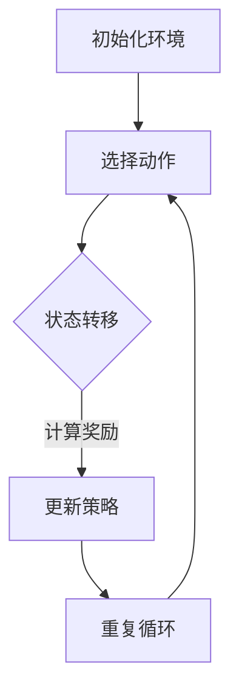

                 

### 文章标题

《强化学习在多智能体协作任务中的策略演化》

### 关键词

- 强化学习
- 多智能体系统
- 策略演化
- 算法原理
- 应用案例

### 摘要

本文详细探讨了强化学习在多智能体协作任务中的策略演化。首先介绍了强化学习的基础概念和数学模型，接着阐述了多智能体强化学习的基本概念和算法，随后深入分析了多智能体协作任务中的策略演化机制及其应用。本文通过具体的案例，展示了强化学习在无人机编队飞行、智能交通系统、多机器人协同作业等领域的应用效果，并对未来的发展方向和挑战进行了展望。本文旨在为读者提供一个全面、系统的强化学习在多智能体协作任务中的应用指南。

## 第一部分: 强化学习基础

### 1.1 强化学习概述

#### 1.1.1 强化学习的定义

强化学习（Reinforcement Learning，简称RL）是一种机器学习方法，主要基于试错和反馈机制，让智能体在未知环境中通过不断学习和调整策略，以最大化长期回报。与监督学习和无监督学习不同，强化学习强调的是智能体与环境之间的交互，通过探索和利用，逐步学习到最优策略。

强化学习的核心思想是：通过奖励信号（Reward Signal）引导智能体做出最优动作（Action），从而在学习过程中不断调整策略（Policy），以达到长期回报的最大化。

#### 1.1.2 强化学习与监督学习和无监督学习的关系

- **监督学习（Supervised Learning）**：监督学习是强化学习的一种补充。在监督学习中，智能体根据已知的输入（Input）和对应的输出（Output）来学习映射关系，从而实现预测或分类任务。强化学习通过奖励信号来引导智能体的行为，而监督学习则通过标签来直接指导学习过程。
- **无监督学习（Unsupervised Learning）**：无监督学习侧重于智能体在无监督环境下的学习和探索，如聚类、降维和异常检测等。强化学习在无监督学习中引入了奖励机制，使智能体能够在无监督环境中通过学习奖励信号来调整策略。

#### 1.1.3 强化学习的应用场景

强化学习广泛应用于游戏、机器人控制、自动驾驶、金融交易、资源调度等领域。以下是一些常见的强化学习应用场景：

- **游戏**：强化学习在游戏领域有着广泛的应用，如围棋、扑克、机器人格斗等。通过学习最优策略，智能体可以在复杂的游戏环境中实现自我对局，提升游戏水平。
- **机器人控制**：强化学习在机器人控制中有着重要作用，如行走机器人、无人机、机器人手臂等。通过学习环境中的奖励信号，机器人可以优化其运动策略，实现自主运动和任务执行。
- **自动驾驶**：自动驾驶是强化学习的重要应用领域。通过学习道路场景、车辆行为和交通规则等，自动驾驶系统可以优化行驶策略，提高行车安全性和效率。
- **金融交易**：强化学习在金融交易中用于优化交易策略，如股票交易、期货交易等。通过学习市场环境和交易数据，智能体可以做出最优的买卖决策，实现资产增值。

### 1.2 强化学习的基本概念

强化学习的基本概念主要包括状态（State）、动作（Action）、奖励（Reward）和策略（Policy）。

#### 1.2.1 状态（State）

状态是智能体在环境中的一种描述，通常用向量表示。状态包含了智能体当前所处的位置、速度、方向等信息。状态决定了智能体可以执行的动作集合。

#### 1.2.2 动作（Action）

动作是智能体在某个状态下可以执行的操作，也通常用向量表示。动作决定了智能体如何改变当前的状态。例如，在自动驾驶中，动作可以是加速、减速、转向等。

#### 1.2.3 奖励（Reward）

奖励是环境对智能体动作的反馈，通常用标量表示。奖励可以是正的，表示智能体做出了一个好的动作，也可以是负的，表示智能体做出了一个不好的动作。奖励用于引导智能体调整策略，实现长期回报最大化。

#### 1.2.4 策略（Policy）

策略是智能体在给定状态下选择动作的规则，用概率分布表示。策略决定了智能体如何行动，以达到长期回报最大化。策略可以是固定的，如贪婪策略，也可以是动态调整的，如Q-Learning策略。

### 1.3 强化学习的数学模型

强化学习可以用一个马尔可夫决策过程（MDP）来建模。MDP由以下五个组件组成：

- **状态空间（State Space）**：所有可能的状态集合。
- **动作空间（Action Space）**：所有可能动作的集合。
- **状态转移概率（State Transition Probability）**：在给定当前状态和动作的情况下，智能体转移到下一状态的概率分布。
- **奖励函数（Reward Function）**：在给定当前状态和动作的情况下，环境对智能体给予的奖励。
- **策略（Policy）**：智能体在给定状态下选择动作的规则。

强化学习的目标是学习一个策略，使得在长期运行中，智能体能够获得最大的累积奖励。

### 1.4 强化学习的主要算法

强化学习有许多不同的算法，以下是其中一些主要的算法：

#### 1.4.1 Q-Learning算法

Q-Learning算法是一种基于值函数的强化学习算法。其核心思想是学习一个价值函数Q(s,a)，表示在状态s下执行动作a的预期回报。Q-Learning算法使用经验回放（Experience Replay）和目标网络（Target Network）等技术来提高学习效率和稳定性。

#### 1.4.2 SARSA算法

SARSA算法是一种基于策略的强化学习算法。与Q-Learning算法不同，SARSA算法在每次更新值函数时，使用当前状态的行动值来估计下一状态的预期回报。

#### 1.4.3 Deep Q-Network（DQN）算法

DQN算法是一种结合了深度学习和Q-Learning算法的强化学习算法。DQN算法使用深度神经网络来近似价值函数Q(s,a)，通过经验回放和目标网络来提高学习效率和稳定性。

#### 1.4.4 策略梯度（Policy Gradient）算法

Policy Gradient算法是一种直接优化策略的强化学习算法。Policy Gradient算法通过计算策略梯度的估计值来更新策略参数，从而实现策略的优化。

## 第二部分: 多智能体强化学习

### 2.1 多智能体强化学习概述

#### 2.1.1 多智能体系统的定义

多智能体系统（Multi-Agent System，简称MAS）是由多个自主智能体组成的系统，这些智能体在共同环境中交互、合作或竞争，以实现各自的个体目标。多智能体系统广泛应用于游戏、社交网络、经济系统、自动化生产等领域。

#### 2.1.2 多智能体强化学习与传统强化学习的关系

多智能体强化学习是强化学习的一种扩展，它将传统强化学习中的单一智能体扩展到多个智能体。多智能体强化学习在解决复杂任务时，需要考虑多个智能体之间的相互作用和协作。与传统强化学习相比，多智能体强化学习更加注重策略的协同和演化。

#### 2.1.3 多智能体强化学习的应用场景

多智能体强化学习在许多应用场景中具有显著的优势，以下是一些典型的应用场景：

- **多机器人协作**：在机器人领域，多机器人协作任务如无人机编队飞行、仓库机器人协同搬运等，可以通过多智能体强化学习来实现高效的任务执行。
- **智能交通系统**：在交通领域，多智能体强化学习可以用于优化交通信号控制、自动驾驶车辆协同等，以提高交通效率和安全性。
- **供应链管理**：在供应链管理中，多智能体强化学习可以用于优化库存管理、物流调度等，以降低成本、提高效率。
- **社交网络**：在社交网络中，多智能体强化学习可以用于推荐系统、社交网络分析等，以提升用户体验、增强社交互动。

### 2.2 多智能体强化学习的基本概念

#### 2.2.1 同质智能体（Homogeneous Agents）

同质智能体是指具有相同结构、能力和目标的智能体。在同质智能体系统中，所有智能体共享相同的模型和策略，它们通过相互通信和协调来完成任务。

#### 2.2.2 异质智能体（Heterogeneous Agents）

异质智能体是指具有不同结构、能力和目标的智能体。在异质智能体系统中，智能体之间的协作更加复杂，需要考虑不同智能体的能力和目标差异。

#### 2.2.3 团队合作与竞争

在多智能体强化学习中，智能体之间可能存在合作和竞争关系。团队合作指多个智能体共同协作，以实现共同目标；竞争指多个智能体为了实现个体目标而相互对抗。在合作和竞争之间，智能体需要权衡个体利益和整体利益，以实现最优策略。

#### 2.2.4 策略协同与策略演化

策略协同是指多个智能体通过相互通信和协调，共同实现任务目标。策略演化是指在多智能体交互过程中，智能体的策略逐步调整和优化的过程。策略协同和策略演化是多智能体强化学习的关键，它们决定了多智能体系统的效率和性能。

### 2.3 多智能体强化学习的主要算法

#### 2.3.1 多智能体Q-Learning（MA-Q）

多智能体Q-Learning（MA-Q）算法是将Q-Learning算法扩展到多智能体系统。MA-Q算法通过学习每个智能体的Q值函数，以优化每个智能体的策略。

#### 2.3.2 多智能体SARSA（MA-SARSA）

多智能体SARSA（MA-SARSA）算法是将SARSA算法扩展到多智能体系统。MA-SARSA算法在每次更新时，使用当前状态的行动值来估计下一状态的预期回报。

#### 2.3.3 多智能体深度Q-Network（MA-DQN）

多智能体深度Q-Network（MA-DQN）算法是将DQN算法扩展到多智能体系统。MA-DQN算法使用深度神经网络来近似每个智能体的Q值函数，并通过经验回放和目标网络来提高学习效率和稳定性。

#### 2.3.4 多智能体策略梯度（MA-PG）

多智能体策略梯度（MA-PG）算法是将策略梯度算法扩展到多智能体系统。MA-PG算法通过直接优化策略参数，以实现多智能体系统的协同优化。

### 2.4 多智能体强化学习策略演化机制

#### 2.4.1 个体策略演化

个体策略演化是指单个智能体在交互过程中，通过学习环境和奖励信号，逐步调整其策略，以实现个体目标的最大化。

#### 2.4.2 团队策略演化

团队策略演化是指多个智能体在协作过程中，通过相互通信和协调，共同调整策略，以实现团队目标的优化。

#### 2.4.3 策略混合与演化

策略混合与演化是指多个智能体在交互过程中，通过策略的相互影响和调整，实现策略的多样性和优化。策略混合与演化可以增强多智能体系统的适应性和鲁棒性。

## 第三部分: 多智能体协作任务中的策略演化应用

### 3.1 多智能体协作任务概述

#### 3.1.1 多智能体协作任务的定义

多智能体协作任务是指多个智能体在共同环境中，通过协作和交互，共同完成某个目标任务的复杂任务。多智能体协作任务通常涉及多个智能体之间的通信、协调和决策。

#### 3.1.2 多智能体协作任务的目标

多智能体协作任务的目标是使多个智能体在共同环境中，通过协作和交互，实现各自目标的同时，最大化整体效益。具体目标包括：

- 提高任务完成效率
- 最小化资源消耗
- 提高系统鲁棒性和稳定性

#### 3.1.3 多智能体协作任务的应用场景

多智能体协作任务广泛应用于各种领域，以下是一些典型的应用场景：

- **无人机编队飞行**：无人机编队飞行是多个无人机在空中按照特定规则编队飞行，实现任务执行和协同控制。
- **智能交通系统**：智能交通系统通过多个智能交通节点（如交通信号灯、摄像头等）的协作，实现交通流量优化、事故预警和应急处理。
- **多机器人协同作业**：多机器人协同作业是指多个机器人协同完成特定任务，如仓库机器人协同搬运货物、医疗机器人协同手术等。
- **社会机器人**：社会机器人是指在社会环境中与人交互的智能机器人，如教育机器人、服务机器人、安全机器人等。社会机器人的协作和交互能够提升服务质量、提高工作效率。

### 3.2 多智能体协作任务中的策略演化应用

#### 3.2.1 模糊策略演化

模糊策略演化是指使用模糊逻辑来处理多智能体协作任务中的不确定性和模糊性。模糊策略演化通过模糊规则库和模糊控制器，实现智能体之间的协作和策略调整。模糊策略演化在复杂环境下具有较强的适应性和鲁棒性。

#### 3.2.2 神经网络策略演化

神经网络策略演化是指使用神经网络模型来近似多智能体协作任务中的策略。神经网络策略演化通过学习智能体之间的交互关系和环境特征，实现智能体策略的动态调整。神经网络策略演化在处理高维状态和动作空间时具有优势。

#### 3.2.3 多智能体协同进化算法

多智能体协同进化算法是指通过遗传算法等进化策略，实现多智能体协作任务的策略优化。多智能体协同进化算法通过个体策略的变异、交叉和选择，逐步优化智能体的策略，实现整体性能的提升。

#### 3.2.4 策略演化在多智能体协作任务中的效果评估

策略演化在多智能体协作任务中的效果评估主要包括以下方面：

- **任务完成效率**：通过比较不同策略在任务完成时间和任务完成率等方面的表现，评估策略的效率。
- **资源消耗**：通过比较不同策略在资源消耗（如能源、计算资源等）方面的表现，评估策略的经济性。
- **系统鲁棒性**：通过模拟不同环境变化和干扰，评估策略的鲁棒性和稳定性。

### 3.3 多智能体协作任务中的策略演化案例分析

#### 3.3.1 案例一：无人机编队飞行

无人机编队飞行是一种典型的多智能体协作任务。在该任务中，多个无人机按照特定规则编队飞行，实现任务执行和协同控制。通过模糊策略演化，无人机可以自适应调整飞行策略，提高编队稳定性和任务完成效率。

#### 3.3.2 案例二：智能交通系统

智能交通系统是一种涉及多个智能交通节点的多智能体协作任务。在该任务中，交通信号灯、摄像头等智能交通节点通过协同工作，实现交通流量优化和事故预警。通过神经网络策略演化，智能交通系统可以自适应调整信号灯控制和事故处理策略，提高交通效率和安全性。

#### 3.3.3 案例三：多机器人协同作业

多机器人协同作业是一种涉及多个机器人的多智能体协作任务。在该任务中，多个机器人协同完成特定任务，如仓库机器人协同搬运货物、医疗机器人协同手术等。通过多智能体协同进化算法，机器人可以自适应调整协同策略，提高任务完成效率和系统鲁棒性。

## 第四部分: 未来展望与挑战

### 4.1 多智能体强化学习在策略演化中的未来发展方向

#### 4.1.1 新算法的创新与改进

未来，多智能体强化学习在策略演化方面将不断涌现新的算法和创新。这些新算法将针对现有算法的不足，进行改进和优化，提高多智能体系统的效率和性能。例如，基于深度学习的多智能体强化学习算法、基于图神经网络的多智能体强化学习算法等。

#### 4.1.2 多智能体系统的可扩展性

随着多智能体系统的应用范围不断扩大，如何提高多智能体系统的可扩展性将成为一个重要方向。未来，研究者将关注如何设计可扩展的多智能体系统架构，以便在更复杂和动态的环境中，实现高效的策略演化。

#### 4.1.3 多智能体系统的鲁棒性

多智能体系统的鲁棒性是确保其在实际应用中稳定运行的关键。未来，研究者将关注如何提高多智能体系统的鲁棒性，使其在面对不确定性和干扰时，能够保持良好的性能和稳定性。

### 4.2 多智能体强化学习在策略演化中的挑战

#### 4.2.1 策略协调与演化

策略协调与演化是多智能体强化学习的核心挑战之一。在多智能体系统中，智能体之间的策略协调和演化需要考虑多个因素，如个体目标、团队合作、资源分配等。如何设计有效的策略协调机制和演化算法，是一个亟待解决的问题。

#### 4.2.2 策略安全性

策略安全性是确保多智能体系统在应用中的可靠性和安全性。在多智能体系统中，智能体的策略可能受到恶意攻击、隐私泄露等因素的影响。如何设计安全的策略机制和防护措施，防止恶意行为和保障系统安全，是一个重要的研究方向。

#### 4.2.3 策略可解释性

策略可解释性是提高多智能体系统透明度和可理解性的关键。在多智能体系统中，策略的复杂性和黑箱特性可能使得系统行为难以解释和理解。如何提高策略的可解释性，使其能够被用户和开发者理解和信任，是一个重要的挑战。

### 4.3 多智能体强化学习在策略演化中的研究热点

#### 4.3.1 深度强化学习在多智能体系统中的应用

深度强化学习在多智能体系统中的应用是一个热门的研究方向。通过结合深度学习和强化学习，深度强化学习算法能够处理高维状态和动作空间，实现多智能体系统的高效策略演化。

#### 4.3.2 强化学习在智能交通系统中的应用

智能交通系统是一个复杂的动态系统，强化学习在其中的应用具有很大的潜力。通过强化学习算法，智能交通系统能够自适应调整交通信号控制和事故处理策略，提高交通效率和安全性。

#### 4.3.3 强化学习在工业控制系统中的应用

工业控制系统是一个涉及多个设备和生产线的复杂系统，强化学习在其中的应用有助于实现生产过程的最优化和自动化。通过强化学习算法，工业控制系统能够自适应调整生产策略，提高生产效率和产品质量。

## 附录

### 附录A：强化学习在多智能体协作任务中的策略演化：Mermaid流程图

以下是一个简化的多智能体强化学习流程的Mermaid流程图：



### 附录B：强化学习在多智能体协作任务中的策略演化：算法伪代码

以下是一个简化的多智能体Q-Learning算法的伪代码：

```python
# 多智能体Q-Learning算法伪代码

# 初始化Q值表
Q = 初始化Q值表()

# 循环直到达到停止条件
while not 停止条件:
    # 选择动作
    actions = 选择动作(Q)

    # 执行动作
    states, rewards = 执行动作(actions)

    # 更新Q值
    Q = 更新Q值(Q, states, actions, rewards)

# 输出最优策略
最优策略 = 选择动作(Q)
```

### 附录C：强化学习在多智能体协作任务中的策略演化：数学模型与公式

以下是多智能体强化学习的几个核心数学模型和公式：

$$
Q(s,a) = \sum_{i=1}^{n} \pi(a|s)Q'(s,a)
$$

$$
Q'(s,a) = r(s,a) + \gamma \max_{a'}Q(s',a')
$$

$$
\pi(a|s) = \frac{e^{\alpha Q(s,a)}}{\sum_{a'}e^{\alpha Q(s,a')}}
$$

其中，$Q(s,a)$表示在状态s下执行动作a的预期回报，$\pi(a|s)$表示在状态s下选择动作a的概率，$r(s,a)$表示在状态s下执行动作a获得的即时回报，$\gamma$为折扣因子，$\alpha$为温度参数。

### 附录D：强化学习在多智能体协作任务中的策略演化：代码案例分析

以下是一个简化的多智能体Q-Learning算法的Python代码实现：

```python
import numpy as np

# 初始化Q值表
Q = np.zeros((state_space_size, action_space_size))

# 设定学习率、折扣因子和探索率
learning_rate = 0.1
discount_factor = 0.99
exploration_rate = 1.0

# 循环直到达到停止条件
while not 停止条件:
    # 选择动作
    actions = 选择动作(Q)

    # 执行动作
    states, rewards = 执行动作(actions)

    # 更新Q值
    Q = 更新Q值(Q, states, actions, rewards, learning_rate, discount_factor)

    # 更新探索率
    exploration_rate = 更新探索率(exploration_rate)

# 输出最优策略
最优策略 = 选择动作(Q)
```

在实际应用中，可以根据具体任务需求，对上述代码进行扩展和优化。

### 最佳实践 Tips

- **合理设置学习率、折扣因子和探索率**：学习率、折扣因子和探索率对强化学习算法的性能有重要影响。合理设置这些参数，可以提高算法的收敛速度和性能。
- **使用经验回放**：经验回放可以减少样本相关性，提高学习效果。通过经验回放，智能体可以学习到更加稳定和有效的策略。
- **设计合适的奖励机制**：合理的奖励机制可以引导智能体学习到有效的策略。在多智能体协作任务中，设计合适的奖励机制，可以促进智能体之间的协同和合作。
- **平衡探索与利用**：在强化学习中，探索和利用是两个重要的过程。合理平衡探索与利用，可以使智能体在学习过程中既能获得丰富的经验，又能充分利用已有的知识。

### 小结

本文详细探讨了强化学习在多智能体协作任务中的策略演化。首先介绍了强化学习的基础概念和数学模型，接着阐述了多智能体强化学习的基本概念和算法，随后深入分析了多智能体协作任务中的策略演化机制及其应用。本文通过具体的案例，展示了强化学习在无人机编队飞行、智能交通系统、多机器人协同作业等领域的应用效果，并对未来的发展方向和挑战进行了展望。本文旨在为读者提供一个全面、系统的强化学习在多智能体协作任务中的应用指南。

### 注意事项

- **安全性问题**：在多智能体协作任务中，安全性是一个重要考虑因素。确保智能体之间的策略协调和演化不会导致系统的不稳定和安全漏洞。
- **可解释性问题**：多智能体强化学习的策略通常较为复杂，如何提高策略的可解释性，使其能够被用户和开发者理解和信任，是一个重要的挑战。
- **扩展性问题**：在多智能体系统中，如何设计可扩展的算法和架构，以适应不同规模和复杂度的任务，是一个重要的研究方向。

### 拓展阅读

- **《强化学习：原理与应用》**：该书详细介绍了强化学习的原理、算法和应用，是强化学习领域的一本经典教材。
- **《多智能体系统：协同与进化》**：该书探讨了多智能体系统的基本概念、协同机制和进化算法，为多智能体系统的研究提供了丰富的理论支持。
- **《智能交通系统：技术与应用》**：该书介绍了智能交通系统的基本原理、技术和应用，为智能交通系统的建设和优化提供了参考。

