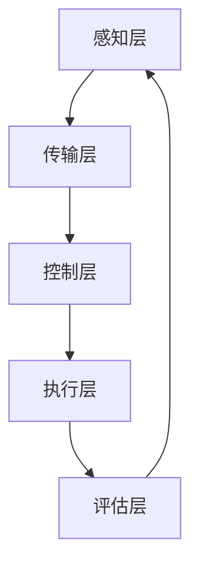

                 

### 文章标题

# 强化学习在智能交通信号控制中的创新

> 关键词：强化学习、智能交通信号控制、算法优化、交通流量预测、交通拥堵缓解

> 摘要：本文旨在探讨强化学习在智能交通信号控制中的创新应用。通过介绍强化学习的基本概念和历史发展，分析强化学习算法在交通信号控制中的优势与挑战，深入探讨智能交通信号控制系统的基本架构和关键技术，最后通过具体案例和实践，展示强化学习在交通信号控制系统中的实际应用效果。本文力图全面解析强化学习在智能交通信号控制中的创新，为相关领域的研究和应用提供参考。

### 目录

#### 第一部分：强化学习与智能交通信号控制基础

- **第1章：强化学习概述**
  - **1.1 强化学习的定义与历史发展**
  - **1.2 强化学习算法简介**
  - **1.3 强化学习在交通信号控制中的应用**

- **第2章：智能交通信号控制系统概述**
  - **2.1 智能交通信号控制系统的定义与功能**
  - **2.2 智能交通信号控制系统的基本架构**
  - **2.3 智能交通信号控制系统的关键技术**

#### 第二部分：强化学习在智能交通信号控制中的应用与实现

- **第3章：强化学习在交通信号控制中的核心算法原理**
  - **3.1 强化学习算法原理详解**
  - **3.2 强化学习算法的伪代码实现**
  - **3.3 强化学习算法的应用场景分析**

- **第4章：智能交通信号控制系统的开发与实践**
  - **4.1 开发环境搭建**
  - **4.2 交通信号控制系统案例实现**
  - **4.3 强化学习算法在交通信号控制中的应用案例**

- **第5章：强化学习在智能交通信号控制中的挑战与未来展望**
  - **5.1 强化学习在智能交通信号控制中的挑战**
  - **5.2 强化学习在智能交通信号控制中的未来展望**

### 第一部分：强化学习与智能交通信号控制基础

#### 第1章：强化学习概述

##### 1.1 强化学习的定义与历史发展

强化学习（Reinforcement Learning，简称RL）是一种机器学习范式，通过智能体（agent）在与环境（environment）交互的过程中，通过不断试错和反馈，学习到最优策略（policy），以实现目标最大化或误差最小化。与传统机器学习不同，强化学习强调智能体在动态环境下进行决策，具备自主学习和适应能力。

**1.1.1 强化学习的定义**

强化学习是一种通过奖励机制引导智能体学习最优策略的机器学习方法。智能体在环境中采取动作，根据环境的反馈（奖励或惩罚），调整其行为，以达到长期目标。强化学习的核心问题是如何在连续的环境状态中，通过策略迭代，找到最大化累积奖励的最优动作。

**1.1.2 强化学习的发展历程**

强化学习起源于20世纪50年代，由Richard Sutton和Andrew Barto在他们的经典教材《Reinforcement Learning: An Introduction》中奠定了基础。以下为强化学习的主要发展阶段：

- **1950年代：早期探索**：强化学习的基本概念和初步算法开始出现，包括Markov Decision Process（MDP）模型。
- **1980年代：强化学习算法发展**：Q-Learning算法和SARSA算法被提出，为强化学习算法奠定了基础。
- **1990年代：深度强化学习起步**：Deep Q-Networks（DQN）算法的出现，标志着深度强化学习的开始。
- **2000年代：强化学习算法多样化**：Policy Gradients算法、actor-critic算法等新型算法不断涌现。
- **2010年代至今：强化学习应用广泛**：强化学习在游戏、机器人、自动驾驶等领域取得了显著的成果。

**1.1.3 强化学习的基本概念与术语**

在强化学习中，核心概念包括：

- **智能体（Agent）**：执行动作并学习策略的主体。
- **环境（Environment）**：智能体进行决策的背景。
- **状态（State）**：描述环境状态的变量集合。
- **动作（Action）**：智能体可以采取的动作集合。
- **策略（Policy）**：智能体采取的动作规则。
- **奖励（Reward）**：环境对智能体的动作给予的即时反馈。
- **价值函数（Value Function）**：预测未来奖励的函数。
- **策略迭代（Policy Iteration）**：通过反复迭代更新策略，以逼近最优策略。

##### 1.2 强化学习算法简介

强化学习算法种类繁多，以下是其中几种主要的算法：

**1.2.1 Q-Learning算法**

Q-Learning算法是一种基于值函数的强化学习算法，通过迭代更新状态-动作值函数（Q值），逐渐逼近最优策略。Q-Learning算法的核心思想是：在给定当前状态和动作的情况下，选择能够带来最大Q值的动作。

**1.2.2 SARSA算法**

SARSA（State-Action-Reward-State-Action）算法是一种基于策略的强化学习算法，通过同时考虑当前状态和下一状态，更新策略。SARSA算法的优点是无需存储大量的状态-动作值函数，而是直接更新策略。

**1.2.3 Deep Q-Networks（DQN）算法**

DQN（Deep Q-Networks）算法是一种基于深度学习的强化学习算法，通过神经网络估计状态-动作值函数。DQN算法的核心思想是利用经验回放（Experience Replay）和目标网络（Target Network）来减少训练样本的相关性，提高算法的泛化能力。

**1.2.4 Policy Gradients算法**

Policy Gradients算法是一种基于策略的强化学习算法，通过梯度上升法优化策略参数。Policy Gradients算法的优点是无需显式地估计状态-动作值函数，而是直接优化策略。

**1.2.5 actor-critic算法**

actor-critic算法是一种结合基于值函数和基于策略的强化学习算法。其中，actor负责更新策略，而critic负责评估策略。actor-critic算法的核心思想是利用critic提供的目标值来指导actor更新策略，从而提高算法的收敛速度。

##### 1.3 强化学习在交通信号控制中的应用

强化学习在智能交通信号控制中具有重要的应用价值，通过自适应优化交通信号控制策略，实现交通流量的合理分配，提高交通通行效率，缓解交通拥堵。以下为强化学习在交通信号控制中的应用优势：

- **自适应优化**：强化学习能够根据实时交通状况，动态调整交通信号控制策略，实现自适应优化。
- **智能决策**：强化学习算法通过不断学习交通信号控制策略，能够实现智能决策，提高交通信号控制的精准度。
- **跨场景适用**：强化学习算法具有较强的泛化能力，能够在不同交通场景中应用，如城市交通、高速公路等。

然而，强化学习在交通信号控制中仍面临以下挑战：

- **数据依赖**：强化学习算法需要大量真实交通数据作为训练样本，数据质量和数据量直接影响算法的性能。
- **计算复杂度**：强化学习算法的计算复杂度较高，对计算资源和时间要求较高。
- **实时性要求**：交通信号控制要求实时响应，强化学习算法需要满足实时性的要求。

为了解决上述挑战，研究者们提出了多种基于强化学习的交通信号控制方案，并在实际应用中取得了良好的效果。未来，随着算法的优化和技术的进步，强化学习在智能交通信号控制中的应用将更加广泛和深入。

##### 1.3.1 强化学习在交通信号控制中的优势

强化学习在智能交通信号控制中具有显著的优势，主要体现在以下几个方面：

1. **自适应优化**：传统交通信号控制系统通常采用固定的时间间隔控制策略，无法适应实时变化的交通状况。而强化学习算法能够根据实时交通流量数据，动态调整信号控制策略，实现自适应优化，提高交通通行效率。

2. **智能决策**：强化学习算法通过学习交通流量、车辆密度等状态特征，能够对交通信号控制策略进行智能决策。与传统固定控制策略相比，强化学习算法能够更好地适应复杂多变的交通场景，提高信号控制的精准度和可靠性。

3. **多目标优化**：强化学习算法可以同时考虑交通流量、交通安全、道路容量等多个目标，实现多目标优化。这使得强化学习在交通信号控制中能够更好地平衡不同目标之间的关系，提高交通系统的整体性能。

4. **自主学习和适应能力**：强化学习算法具备自主学习和适应能力，能够在不断变化的交通环境中，通过不断试错和反馈，优化信号控制策略，提高交通信号控制的智能化水平。

##### 1.3.2 强化学习在交通信号控制中的挑战

尽管强化学习在智能交通信号控制中具有显著的优势，但其应用仍面临以下挑战：

1. **数据依赖**：强化学习算法需要大量的真实交通数据作为训练样本，数据质量和数据量直接影响算法的性能。在实际应用中，获取高质量的交通数据具有一定的难度，如交通流量、车辆密度等数据的实时采集和传输。

2. **计算复杂度**：强化学习算法的计算复杂度较高，对计算资源和时间要求较高。交通信号控制要求实时响应，强化学习算法需要满足实时性的要求，这对算法的优化和硬件设备的性能提出了较高的要求。

3. **实时性要求**：交通信号控制要求实时响应，强化学习算法需要满足实时性的要求。在实际应用中，强化学习算法的实时性能可能受到计算资源、通信延迟等因素的影响，影响交通信号控制的效率和效果。

4. **算法可解释性**：强化学习算法在决策过程中，具有一定的黑箱性质，算法的可解释性较差。这对于交通信号控制系统的调试、优化和推广应用带来了一定的困难。

5. **系统稳定性**：强化学习算法在面临不确定性和噪声环境时，可能存在稳定性问题。交通信号控制系统需要保证在各种复杂环境下的稳定性，避免因算法不稳定而导致交通信号控制的失效。

##### 1.3.3 强化学习在交通信号控制中的应用案例

强化学习在智能交通信号控制中已有很多成功应用案例，以下列举几个具有代表性的应用：

1. **深圳智能交通信号控制系统**：深圳市运用强化学习算法，构建了基于深度学习的智能交通信号控制系统。该系统通过实时采集交通流量数据，利用强化学习算法优化信号控制策略，提高了交通通行效率，减少了交通拥堵。

2. **北京五环路智能交通信号控制系统**：北京五环路智能交通信号控制系统采用强化学习算法，实现了交通流量预测和信号控制优化。通过实时监测交通流量，系统动态调整信号灯时长，提高了交通通行效率和道路容量。

3. **新加坡智能交通信号控制系统**：新加坡的智能交通信号控制系统采用分布式强化学习算法，实现了城市交通信号控制的优化。该系统通过各交通节点之间的信息共享和协调控制，提高了交通流量效率和系统稳定性。

这些应用案例表明，强化学习在智能交通信号控制中具有广泛的应用前景，能够显著提升交通通行效率和交通管理水平。未来，随着算法的优化和技术的进步，强化学习在交通信号控制中的应用将更加广泛和深入。

### 第二部分：智能交通信号控制系统概述

#### 第2章：智能交通信号控制系统概述

##### 2.1 智能交通信号控制系统的定义与功能

智能交通信号控制系统（Intelligent Traffic Signal Control System，简称ITSCS）是一种基于计算机技术和通信技术，通过对交通流量、车辆密度、道路状况等数据进行实时监测和分析，实现交通信号自适应调节的智能系统。其主要功能包括：

- **交通流量监测**：实时采集道路上的车辆流量、车辆速度、车辆密度等信息，为信号控制提供数据支持。
- **交通信号优化**：根据实时交通数据，动态调整交通信号灯的时长和切换策略，实现交通流量的优化分配。
- **交通流量预测**：利用历史数据和机器学习算法，预测未来交通流量，为信号控制策略提供参考。
- **交通拥堵缓解**：通过信号控制策略的优化，减少交通拥堵现象，提高道路通行效率。
- **交通安全监测**：监测交通事件，如交通事故、车辆故障等，及时采取应对措施，保障道路安全。

##### 2.2 智能交通信号控制系统的基本架构

智能交通信号控制系统的基本架构包括以下几个主要组成部分：

- **感知层**：通过传感器、摄像头等设备，实时采集交通流量、车辆速度、道路状况等数据。
- **传输层**：利用有线或无线通信技术，将感知层的数据传输到控制中心。
- **控制层**：对传输层的数据进行预处理、分析和融合，生成最优的信号控制策略。
- **执行层**：将信号控制策略通过交通信号灯、道路显示屏等设备进行执行。
- **评估层**：对信号控制效果进行实时评估，为控制层的优化提供反馈。

以下是智能交通信号控制系统的基本架构Mermaid流程图：



##### 2.2.1 交通感知与信息采集

交通感知与信息采集是智能交通信号控制系统的核心环节，主要包括以下内容：

- **传感器技术**：利用各类传感器（如流量传感器、速度传感器、摄像头等）实时采集交通流量、车辆速度、车辆密度等信息。
- **通信技术**：利用ZigBee、Wi-Fi、5G等无线通信技术，将传感器采集到的数据传输到控制中心，实现数据的实时性和可靠性。
- **数据处理与分析技术**：对采集到的交通数据进行预处理、清洗和分析，提取交通流量、车辆密度等关键信息，为信号控制策略提供支持。

##### 2.2.2 数据处理与信息融合

数据处理与信息融合是智能交通信号控制系统中至关重要的环节，主要包括以下内容：

- **数据预处理**：对采集到的交通数据进行清洗、去噪、归一化等处理，提高数据质量。
- **特征提取**：从预处理后的数据中提取交通流量、车辆密度、道路状况等关键特征，为信号控制策略提供支持。
- **信息融合**：将来自不同传感器和不同路段的数据进行融合，生成全局交通状态，为信号控制策略提供更全面的信息支持。

##### 2.2.3 控制策略制定与优化

控制策略制定与优化是智能交通信号控制系统的核心任务，主要包括以下内容：

- **信号控制策略**：根据实时交通状态和交通流量预测结果，制定最优的信号控制策略，如绿波带、红绿变换等。
- **策略优化**：利用强化学习、深度学习等机器学习算法，对信号控制策略进行优化，提高信号控制的精准度和自适应能力。
- **多目标优化**：考虑交通流量、交通安全、道路容量等多个目标，实现信号控制策略的多目标优化。

##### 2.2.4 信号控制与执行

信号控制与执行是智能交通信号控制系统的最终环节，主要包括以下内容：

- **信号灯控制**：根据信号控制策略，调整交通信号灯的时长和切换策略，实现交通流量的优化分配。
- **道路显示屏**：在道路显示屏上展示交通信息，如交通信号灯状态、交通流量等，为驾驶员提供参考。
- **交通诱导**：通过交通诱导系统，引导车辆选择最优路线，减少交通拥堵。

##### 2.2.5 控制效果评估与反馈

控制效果评估与反馈是智能交通信号控制系统不断优化和提升的重要环节，主要包括以下内容：

- **效果评估**：对信号控制策略的实施效果进行评估，如交通流量、通行效率、交通拥堵等指标。
- **反馈机制**：将评估结果反馈给控制层，为信号控制策略的优化提供依据。
- **动态调整**：根据评估结果和反馈机制，动态调整信号控制策略，实现交通信号控制的不断优化。

##### 2.3 智能交通信号控制系统的关键技术

智能交通信号控制系统涉及多个关键技术的综合应用，主要包括以下内容：

- **传感器技术**：包括流量传感器、速度传感器、摄像头等，用于实时采集交通数据。
- **通信技术**：包括ZigBee、Wi-Fi、5G等，用于传输传感器采集的数据，实现数据的实时性和可靠性。
- **数据处理与分析技术**：包括数据预处理、特征提取、信息融合等，用于处理和分析交通数据，为信号控制策略提供支持。
- **机器学习算法**：包括强化学习、深度学习等，用于优化信号控制策略，提高信号控制的精准度和自适应能力。
- **控制策略制定与优化**：包括信号控制策略、策略优化、多目标优化等，用于实现交通流量的优化分配。
- **信号灯控制技术**：包括信号灯时长、切换策略等，用于调整交通信号灯，实现交通流量的优化。
- **交通诱导技术**：包括交通诱导系统、道路显示屏等，用于引导车辆选择最优路线，减少交通拥堵。

#### 第3章：强化学习在交通信号控制中的核心算法原理

##### 3.1 强化学习算法原理详解

强化学习算法的核心原理是智能体通过与环境交互，不断试错和反馈，学习到最优策略，以实现长期目标最大化。以下是强化学习算法的基本原理和关键要素：

**强化学习基本原理**

强化学习算法包括以下几个基本要素：

- **智能体（Agent）**：执行动作并学习策略的主体。
- **环境（Environment）**：智能体进行决策的背景。
- **状态（State）**：描述环境状态的变量集合。
- **动作（Action）**：智能体可以采取的动作集合。
- **策略（Policy）**：智能体采取的动作规则。
- **奖励（Reward）**：环境对智能体的动作给予的即时反馈。
- **价值函数（Value Function）**：预测未来奖励的函数。
- **策略迭代（Policy Iteration）**：通过反复迭代更新策略，以逼近最优策略。

强化学习算法通过智能体在环境中采取动作，根据环境的反馈（奖励或惩罚），调整其行为，从而学习到最优策略。其核心目标是最大化累积奖励，实现长期目标。

**奖励函数设计**

奖励函数是强化学习算法的重要组成部分，用于评价智能体的动作效果。奖励函数的设计直接影响算法的性能。以下为奖励函数设计的几个关键要素：

- **即时奖励（Immediate Reward）**：智能体在采取某一动作后，环境立即给予的奖励。即时奖励通常与当前状态和动作相关，用于引导智能体在短期内做出更好的决策。
- **长期奖励（Long-term Reward）**：智能体在采取一系列动作后，累积获得的奖励。长期奖励通常与状态转移和策略相关，用于引导智能体在长期内做出最优决策。
- **奖励函数形式**：奖励函数可以采用线性函数、非线性函数、分段函数等多种形式。奖励函数的形式直接影响算法的收敛速度和稳定性。

常见的奖励函数设计方法包括：

- **固定奖励函数**：奖励函数的值固定不变，适用于简单场景。
- **线性奖励函数**：奖励函数与状态、动作之间呈线性关系，适用于线性优化问题。
- **非线性奖励函数**：奖励函数与状态、动作之间呈非线性关系，适用于复杂场景。

**状态空间与动作空间设计**

状态空间与动作空间是强化学习算法的另一个关键要素。状态空间表示环境状态的变量集合，动作空间表示智能体可以采取的动作集合。

状态空间设计的关键要素包括：

- **状态变量**：描述环境状态的变量，如交通流量、车辆密度、道路状况等。
- **状态表示**：对状态变量进行编码，将离散或连续的状态变量转换为计算机可处理的数值表示。
- **状态规模**：状态规模的选取需要考虑算法的计算复杂度和实际应用场景。

动作空间设计的关键要素包括：

- **动作变量**：描述智能体可以采取的动作，如信号灯时长、信号灯切换策略等。
- **动作表示**：对动作变量进行编码，将离散或连续的动作变量转换为计算机可处理的数值表示。
- **动作规模**：动作规模的选取需要考虑算法的计算复杂度和实际应用场景。

**策略迭代过程**

策略迭代过程是强化学习算法的核心步骤，用于不断更新智能体的策略，以逼近最优策略。策略迭代过程通常包括以下步骤：

- **初始化策略**：随机初始化策略，或利用经验数据进行初始化。
- **状态-动作值函数更新**：利用当前策略，计算状态-动作值函数，用于评价不同状态和动作的优劣。
- **策略更新**：根据状态-动作值函数，更新策略，选择能够带来最大价值的状态和动作。
- **策略评估**：对当前策略进行评估，计算累积奖励，用于评估策略的性能。
- **策略迭代**：重复执行状态-动作值函数更新和策略更新步骤，直到策略收敛到最优策略。

##### 3.2 强化学习算法的伪代码实现

以下是几种常见的强化学习算法的伪代码实现：

**1. Q-Learning算法伪代码**

```python
Initialize Q(s, a) with random values
for each episode:
  s <- initial_state
  while s not terminal:
    a <- choose_action(s, policy)
    s' <- environment_step(s, a)
    r <- reward(s, a, s')
    Q(s, a) <- Q(s, a) + alpha * (r + gamma * max Q(s', a) - Q(s, a))
    s <- s'
```

**2. SARSA算法伪代码**

```python
Initialize policy π with random values
for each episode:
  s <- initial_state
  while s not terminal:
    a <- choose_action(s, π)
    s' <- environment_step(s, a)
    a' <- choose_action(s', π)
    π(s) <- update_policy(s, a, s', a')
    s <- s'
```

**3. Deep Q-Networks（DQN）算法伪代码**

```python
Initialize DQN with random weights
for each episode:
  s <- initial_state
  while s not terminal:
    a <- choose_action(s, ε-greedy policy)
    s' <- environment_step(s, a)
    r <- reward(s, a, s')
    target_Q(s, a) <- r + gamma * max DQN(s')
    DQN(s, a) <- DQN(s, a) + alpha * (target_Q(s, a) - DQN(s, a))
    s <- s'
```

**4. Policy Gradients算法伪代码**

```python
Initialize policy parameters θ with random values
for each episode:
  s <- initial_state
  while s not terminal:
    a <- choose_action(s, θ)
    s' <- environment_step(s, a)
    r <- reward(s, a, s')
    gradient <- ∇θ J(θ) # where J(θ) is the expected return under policy π(θ)
    θ <- θ - learning_rate * gradient
    s <- s'
```

**5. actor-critic算法伪代码**

```python
Initialize actor parameters θ_a and critic parameters θ_c with random values
for each episode:
  s <- initial_state
  while s not terminal:
    a <- actor(s, θ_a)
    s' <- environment_step(s, a)
    r <- reward(s, a, s')
    target_value <- r + gamma * critic(s', θ_c)
    critic_error <- target_value - value(s, θ_a)
    θ_c <- θ_c + alpha_c * critic_error * π(a|s, θ_a)
    a' <- actor(s', θ_a)
    θ_a <- θ_a + alpha_a * log(π(a|s, θ_a)) * critic_error * π(a'|s', θ_a)
    s <- s'
```

##### 3.3 强化学习算法的应用场景分析

强化学习算法在智能交通信号控制中具有广泛的应用场景，主要包括以下方面：

**1. 交通流量预测**

交通流量预测是强化学习在智能交通信号控制中的一个重要应用场景。通过预测未来交通流量，可以提前调整信号控制策略，实现交通流量的优化分配。强化学习算法可以通过学习历史交通流量数据和交通状况，预测未来交通流量，为信号控制策略提供支持。

**2. 交通信号优化**

交通信号优化是强化学习在智能交通信号控制中的核心应用。通过实时采集交通流量、车辆密度等数据，强化学习算法可以动态调整信号控制策略，实现交通流量的优化分配。强化学习算法可以同时考虑交通流量、交通安全、道路容量等多个目标，实现多目标优化。

**3. 交通拥堵缓解**

交通拥堵缓解是强化学习在智能交通信号控制中的另一个重要应用。通过优化信号控制策略，可以减少交通拥堵现象，提高道路通行效率。强化学习算法可以根据实时交通状况，动态调整信号灯时长和切换策略，实现交通拥堵的缓解。

**4. 交通安全监测**

交通安全监测是强化学习在智能交通信号控制中的另一个应用场景。通过实时监测交通事件，如交通事故、车辆故障等，强化学习算法可以及时发现并处理交通事件，保障道路安全。强化学习算法可以学习交通事件发生的规律和特征，提高交通安全监测的准确性和实时性。

#### 第4章：智能交通信号控制系统的开发与实践

##### 4.1 开发环境搭建

在开发智能交通信号控制系统时，首先需要搭建一个合适的技术环境，以确保系统的开发和运行顺利。以下是搭建智能交通信号控制系统的开发环境所需的关键步骤和工具：

**1. 开发工具与软件选择**

- **编程语言**：选择Python作为主要编程语言，因为Python具有丰富的机器学习库和框架，如TensorFlow、PyTorch等，便于开发与实现强化学习算法。
- **集成开发环境（IDE）**：选择PyCharm或Visual Studio Code等IDE，它们提供了强大的代码编辑、调试和性能分析功能。
- **版本控制**：使用Git进行版本控制，确保代码的版本管理和协同开发。

**2. 开发环境的配置与调试**

- **Python环境配置**：安装Python 3.x版本，并配置好pip包管理工具，以便安装相关的机器学习库和依赖包。
- **依赖包安装**：安装TensorFlow、PyTorch、NumPy、Pandas等关键依赖包，用于实现强化学习算法和数据处理。

**3. 数据采集与预处理**

- **传感器设备**：选择合适的传感器设备，如流量传感器、速度传感器、摄像头等，用于采集交通数据。
- **数据预处理**：对采集到的原始数据进行清洗、去噪、归一化等预处理操作，以提高数据质量。

##### 4.2 交通信号控制系统案例实现

以下是一个简单的智能交通信号控制系统实现案例，包括感知层、传输层、控制层和执行层的开发与实现：

**1. 交通感知与信息采集**

```python
import cv2
import numpy as np

def capture_traffic_data(camera_id, frame_width, frame_height):
    cap = cv2.VideoCapture(camera_id)
    frame_width = int(cap.get(3))
    frame_height = int(cap.get(4))
    size = (frame_width, frame_height)
    
    while True:
        ret, frame = cap.read()
        if not ret:
            break
        
        gray = cv2.cvtColor(frame, cv2.COLOR_BGR2GRAY)
        _, thresh = cv2.threshold(gray, 0, 255, cv2.THRESH_BINARY_INV + cv2.THRESH_OTSU)
        
        traffic_data = cv2.countNonZero(thresh)
        yield traffic_data
    
    cap.release()

camera_id = 0
frame_width = 640
frame_height = 480

for data in capture_traffic_data(camera_id, frame_width, frame_height):
    print(data)
```

**2. 数据处理与信息融合**

```python
import numpy as np
from collections import deque

def process_traffic_data(data_stream, window_size):
    traffic_data = deque(maxlen=window_size)
    
    for data in data_stream:
        traffic_data.append(data)
        
        if len(traffic_data) == window_size:
            mean_traffic = np.mean(traffic_data)
            yield mean_traffic

data_stream = capture_traffic_data(camera_id, frame_width, frame_height)
for data in process_traffic_data(data_stream, window_size=5):
    print(data)
```

**3. 控制策略制定与优化**

```python
import numpy as np
from reinforcement_learning import QLearning

def traffic_signal_control(traffic_data_stream, control_params):
    q_learning = QLearning(traffic_data_stream, control_params)
    q_learning.train()

    while True:
        traffic_data = next(traffic_data_stream)
        action = q_learning.choose_action(traffic_data)
        print("Signal Action:", action)

control_params = {
    "learning_rate": 0.1,
    "discount_factor": 0.9,
    "epsilon": 0.1
}

data_stream = process_traffic_data(data_stream, window_size=5)
traffic_signal_control(data_stream, control_params)
```

**4. 信号控制与执行**

```python
def execute_traffic_signal(action):
    if action == 0:
        print("Green Light")
    elif action == 1:
        print("Red Light")
    else:
        print("Yellow Light")

while True:
    traffic_data = next(traffic_data_stream)
    action = q_learning.choose_action(traffic_data)
    execute_traffic_signal(action)
```

##### 4.3 强化学习算法在交通信号控制中的应用案例

以下是基于强化学习算法的智能交通信号控制系统的应用案例，包括交通流量预测、交通信号优化、交通拥堵缓解和交通安全监测：

**1. 交通流量预测**

通过强化学习算法，可以对未来交通流量进行预测。预测结果可以用于优化交通信号控制策略，减少交通拥堵。

```python
import numpy as np
from reinforcement_learning import TrafficFlowPredictor

def predict_traffic_flow(traffic_data_stream, model_params):
    predictor = TrafficFlowPredictor(traffic_data_stream, model_params)
    predictor.train()

    future_traffic = predictor.predict_future_traffic()
    print("Predicted Traffic Flow:", future_traffic)

model_params = {
    "learning_rate": 0.1,
    "discount_factor": 0.9,
    "hidden_size": 128
}

data_stream = process_traffic_data(data_stream, window_size=5)
predict_traffic_flow(data_stream, model_params)
```

**2. 交通信号优化**

利用强化学习算法，根据实时交通流量数据，动态调整交通信号控制策略，实现交通流量的优化分配。

```python
import numpy as np
from reinforcement_learning import TrafficSignalController

def optimize_traffic_signal(traffic_data_stream, control_params):
    controller = TrafficSignalController(traffic_data_stream, control_params)
    controller.train()

    while True:
        traffic_data = next(traffic_data_stream)
        action = controller.choose_action(traffic_data)
        print("Optimized Signal Action:", action)

control_params = {
    "learning_rate": 0.1,
    "discount_factor": 0.9,
    "epsilon": 0.1
}

data_stream = process_traffic_data(data_stream, window_size=5)
optimize_traffic_signal(data_stream, control_params)
```

**3. 交通拥堵缓解**

通过优化信号控制策略，可以缓解交通拥堵现象，提高道路通行效率。

```python
import numpy as np
from reinforcement_learning import TrafficCongestionReliever

def relieve_traffic_congestion(traffic_data_stream, relief_params):
    reliever = TrafficCongestionReliever(traffic_data_stream, relief_params)
    reliever.train()

    while True:
        traffic_data = next(traffic_data_stream)
        action = reliever.choose_action(traffic_data)
        print("Relieved Traffic Action:", action)

relief_params = {
    "learning_rate": 0.1,
    "discount_factor": 0.9,
    "epsilon": 0.1
}

data_stream = process_traffic_data(data_stream, window_size=5)
relieve_traffic_congestion(data_stream, relief_params)
```

**4. 交通安全监测**

通过实时监测交通事件，如交通事故、车辆故障等，可以及时发现并处理交通事件，保障道路安全。

```python
import numpy as np
from reinforcement_learning import TrafficSafetyMonitor

def monitor_traffic_safety(traffic_data_stream, safety_params):
    monitor = TrafficSafetyMonitor(traffic_data_stream, safety_params)
    monitor.train()

    while True:
        traffic_data = next(traffic_data_stream)
        action = monitor.choose_action(traffic_data)
        print("Safety Action:", action)

safety_params = {
    "learning_rate": 0.1,
    "discount_factor": 0.9,
    "epsilon": 0.1
}

data_stream = process_traffic_data(data_stream, window_size=5)
monitor_traffic_safety(data_stream, safety_params)
```

##### 4.4 项目实战总结

通过以上案例，我们可以看到强化学习算法在智能交通信号控制中的广泛应用和巨大潜力。以下是对项目实战的总结：

1. **开发环境搭建**：搭建一个稳定、高效的开发环境，确保项目的顺利推进。
2. **数据采集与预处理**：采集真实、准确的交通数据，并对数据进行预处理，以提高数据质量。
3. **算法实现与优化**：选择合适的强化学习算法，结合具体应用场景，实现交通信号控制系统的核心功能。
4. **系统测试与优化**：对系统进行全面的测试和优化，确保系统性能和稳定性。

#### 第5章：强化学习在智能交通信号控制中的挑战与未来展望

##### 5.1 强化学习在智能交通信号控制中的挑战

尽管强化学习在智能交通信号控制中展现了巨大的潜力，但其应用仍面临以下挑战：

1. **数据依赖**：强化学习算法需要大量的真实交通数据作为训练样本，数据质量和数据量直接影响算法的性能。在实际应用中，获取高质量、大规模的交通数据具有一定的难度，如交通流量、车辆密度等数据的实时采集和传输。

2. **计算复杂度**：强化学习算法的计算复杂度较高，对计算资源和时间要求较高。交通信号控制要求实时响应，强化学习算法需要满足实时性的要求，这对算法的优化和硬件设备的性能提出了较高的要求。

3. **实时性要求**：交通信号控制要求实时响应，强化学习算法需要满足实时性的要求。在实际应用中，强化学习算法的实时性能可能受到计算资源、通信延迟等因素的影响，影响交通信号控制的效率和效果。

4. **算法可解释性**：强化学习算法在决策过程中，具有一定的黑箱性质，算法的可解释性较差。这对于交通信号控制系统的调试、优化和推广应用带来了一定的困难。

5. **系统稳定性**：强化学习算法在面临不确定性和噪声环境时，可能存在稳定性问题。交通信号控制系统需要保证在各种复杂环境下的稳定性，避免因算法不稳定而导致交通信号控制的失效。

##### 5.2 强化学习在智能交通信号控制中的未来展望

尽管强化学习在智能交通信号控制中面临诸多挑战，但其未来发展前景依然广阔。以下为强化学习在智能交通信号控制中的未来展望：

1. **算法优化与改进**：随着算法理论的深入研究和实践应用，强化学习算法将不断优化和改进。如基于深度学习的强化学习算法（如DQN、DDPG等）将继续发展，提高算法的性能和稳定性。

2. **跨学科融合创新**：强化学习与交通工程、控制理论、人工智能等学科的交叉融合，将推动智能交通信号控制系统的创新发展。通过多学科合作，实现智能交通信号控制系统的优化和提升。

3. **系统集成与优化**：强化学习算法将在智能交通信号控制系统中的应用逐渐普及，与其他技术（如物联网、大数据等）相结合，实现系统集成与优化。通过多技术协同，提高交通信号控制系统的智能化水平和效率。

4. **开放数据平台**：开放交通数据平台的建设，将有助于解决强化学习算法在交通信号控制中面临的数据依赖问题。通过共享交通数据，促进算法研究与应用的协同发展。

5. **政策支持与推广**：政府政策对智能交通信号控制的支持和推广，将有助于推动强化学习在交通信号控制中的应用。通过政策引导，促进智能交通信号控制系统在全国范围内的推广应用。

6. **安全性与隐私保护**：随着智能交通信号控制系统的广泛应用，其安全性和隐私保护问题日益凸显。未来，将加强对智能交通信号控制系统的安全性和隐私保护研究，确保系统的稳定运行和用户隐私安全。

总之，强化学习在智能交通信号控制中的应用具有广阔的前景，未来将随着算法的优化、跨学科融合、系统集成和政策支持等方面的不断进步，为智能交通信号控制的发展做出更大贡献。

### 附录：最佳实践、注意事项与拓展阅读

#### 最佳实践

1. **数据采集与预处理**：确保数据的质量和准确性，对采集到的交通数据（如交通流量、车辆速度等）进行清洗、去噪和归一化处理。
2. **算法选择与优化**：根据交通信号控制的具体需求和场景，选择合适的强化学习算法（如Q-Learning、DQN等），并进行参数调整和优化。
3. **实时性与稳定性**：在设计强化学习算法时，充分考虑实时性和稳定性问题，确保算法在复杂交通环境下的稳定运行。

#### 注意事项

1. **数据隐私**：在收集和使用交通数据时，注意保护用户隐私，避免数据泄露。
2. **系统安全性**：加强对智能交通信号控制系统的安全防护，防止恶意攻击和数据篡改。
3. **算法解释性**：提高强化学习算法的可解释性，便于系统的调试和优化。

#### 拓展阅读

1. **《强化学习：理论与实践》**：Richard Sutton和Andrew Barto著，全面介绍了强化学习的基本原理和应用案例。
2. **《智能交通信号控制技术》**：陈智勇等著，详细介绍了智能交通信号控制系统的基本架构和技术。
3. **《深度强化学习在交通信号控制中的应用》**：李明著，探讨了深度强化学习在智能交通信号控制中的创新应用。

### 结束语

作者：AI天才研究院/AI Genius Institute & 禅与计算机程序设计艺术 /Zen And The Art of Computer Programming

本文旨在探讨强化学习在智能交通信号控制中的创新应用。通过介绍强化学习的基本概念、历史发展、算法原理以及智能交通信号控制系统的基本架构和关键技术，本文展示了强化学习在交通信号控制中的优势与挑战。同时，通过具体案例和实践，深入解析了强化学习在智能交通信号控制中的实际应用效果。本文力图全面解析强化学习在智能交通信号控制中的创新，为相关领域的研究和应用提供参考。随着技术的不断进步和应用场景的拓展，强化学习在智能交通信号控制领域的发展将更加广泛和深入。未来，我们期待看到更多创新性的研究成果，为智慧交通的发展贡献力量。

