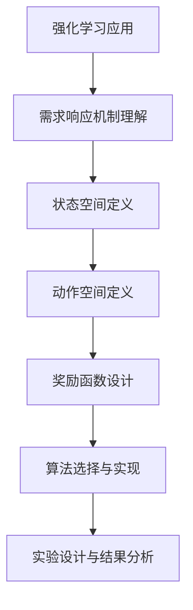

                 

### 《强化学习在智能电网需求响应中的实现》

> 关键词：强化学习、智能电网、需求响应、优化算法、应用前景

> 摘要：本文从强化学习的概念、智能电网的概述、需求响应机制以及强化学习在智能电网需求响应中的应用等多个方面，深入探讨了强化学习在智能电网需求响应中的实现。通过详细的数学模型和算法原理讲解，以及实际案例分析和项目实战，本文为强化学习在智能电网需求响应中的应用提供了有价值的参考和启示。

### 第1章 引言

#### 1.1 强化学习的概念与历史

强化学习（Reinforcement Learning，RL）是一种机器学习范式，通过智能体在环境中与环境的交互，不断优化行为策略，以达到最大化累积奖励的目标。与监督学习和无监督学习不同，强化学习侧重于决策过程，通过试错和反馈机制来学习最优行为策略。

强化学习最早由理查德·萨顿（Richard Sutton）和安德鲁·巴纳斯（Andrew Barto）在1988年出版的《强化学习：一种计算导论》（Reinforcement Learning: An Introduction）一书中系统提出。此后，强化学习在理论研究和实际应用中得到了广泛的关注和快速发展。

强化学习的核心思想是通过试错来学习最佳策略。在强化学习框架中，智能体（Agent）通过与环境（Environment）的交互，不断更新策略（Policy），以期最大化累积奖励（Reward）。这一过程可以用马尔可夫决策过程（Markov Decision Process，MDP）来描述，其中状态（State）、动作（Action）、奖励（Reward）和策略（Policy）是强化学习的四个基本要素。

#### 1.2 智能电网与需求响应

智能电网（Smart Grid）是一种基于现代通信技术、计算机技术和电力技术的综合电力系统，能够实现电力信息的实时采集、传输、处理和利用，实现对电力系统的智能监控、管理和优化。智能电网的核心目标是提高电力系统的运行效率、可靠性和经济性，同时满足用户对电力质量和服务水平的需求。

需求响应（Demand Response，DR）是指在电力市场中，通过激励用户调整电力消费行为，以应对电力供应和需求的不平衡。需求响应机制通常涉及对用户的实时电价、需求侧管理策略、奖励机制等手段，以引导用户在电力需求高峰时段减少用电，或在电力供应紧张时增加用电。

智能电网与需求响应之间存在密切的联系。智能电网的实时数据采集和传输能力，为需求响应机制的实现提供了技术支持。而需求响应机制的优化和实施，则能够进一步提升智能电网的运行效率和可靠性。

#### 1.3 强化学习在需求响应中的应用前景

强化学习在需求响应中的应用前景十分广阔。首先，强化学习能够通过智能体在环境中的试错和反馈机制，自动学习和优化用户的需求响应行为，从而提高需求响应的效果和效率。其次，强化学习可以处理复杂的环境动态变化和不确定性，能够适应智能电网中的实时数据和环境变化。此外，强化学习在多智能体系统中的协调和合作方面也具有优势，可以为需求响应中的多用户协调提供有效的策略。

总的来说，强化学习在智能电网需求响应中的应用，不仅能够提高电力系统的运行效率和可靠性，还能够降低用户的用电成本，促进电力市场的健康发展。未来，随着技术的不断进步和应用场景的拓展，强化学习在智能电网需求响应中的应用将发挥越来越重要的作用。

### 第2章 强化学习基础

#### 2.1 强化学习的数学模型

强化学习的数学模型主要包括状态（State）、动作（Action）、奖励（Reward）和策略（Policy）四个基本要素。这些要素共同构成了强化学习的基本框架，指导智能体（Agent）在环境中进行学习。

- **状态（State）**：状态是智能体在环境中所处的状况，通常用一组特征向量来表示。状态反映了环境的当前情况，是智能体决策的依据。例如，在智能电网需求响应中，状态可以包括当前电网负荷、实时电价、用户用电历史数据等。

- **动作（Action）**：动作是智能体在特定状态下采取的行为。动作的选取会影响环境的转移和奖励的获得。在智能电网需求响应中，动作可以包括调整用户的用电行为、控制电器的开关状态等。

- **奖励（Reward）**：奖励是环境对智能体动作的反馈，用于评估动作的好坏。奖励值可以是正值、负值或零，表示动作对目标的推动或阻碍。在智能电网需求响应中，奖励可以包括减少的用电成本、提高的电力供应可靠性等。

- **策略（Policy）**：策略是智能体根据当前状态选择动作的规则。策略通常用一个函数来表示，该函数将状态映射为动作。策略的学习是强化学习的关键任务，通过最大化累积奖励，智能体能够逐步优化策略。

#### 2.1.1 状态、动作和奖励

在强化学习中，状态、动作和奖励是智能体与环境的交互过程中的关键要素。状态和动作构成了环境的动态模型，而奖励则是环境对智能体行为的反馈。以下是状态、动作和奖励在智能电网需求响应中的应用：

- **状态（State）**：
  - 当前电网负荷水平：反映了电网的负载状况，是需求响应的关键指标。
  - 用户用电历史数据：包含了用户的用电习惯、用电高峰时段等信息，有助于智能体预测用户的行为。
  - 实时电价信息：电价的波动会影响用户的用电行为，是需求响应的重要参考。

- **动作（Action）**：
  - 调整用户的用电行为：例如，在高峰时段关闭部分非必要电器，减少用电负荷。
  - 控制电器的开关状态：例如，通过智能插座控制电器的开关，实现用电的灵活管理。

- **奖励（Reward）**：
  - 用电成本减少：通过需求响应措施，减少用户的用电量，降低用电成本。
  - 电力供应可靠性提高：通过需求响应，优化电网的负载分布，提高电力供应的稳定性。

通过状态、动作和奖励的交互，智能体能够不断调整策略，优化需求响应的效果。例如，在用户用电高峰时段，智能体可以通过调整电器的开关状态，减少电网负荷，降低用电成本，同时提高电力供应的可靠性。

#### 2.1.2 强化学习算法简介

强化学习算法是强化学习的核心部分，通过算法，智能体能够根据环境和奖励的反馈，不断优化策略。常见的强化学习算法包括Q-Learning、SARSa、SARSA和Deep Q Network（DQN）等。以下是这些算法的基本原理和特点：

- **Q-Learning算法**：
  - 基本原理：Q-Learning算法通过迭代更新Q值表，优化智能体的策略。Q值表示在特定状态下采取特定动作的预期奖励。
  - 特点：Q-Learning算法简单易实现，但易受到样本偏差的影响，学习过程可能较慢。

- **SARSa算法**：
  - 基本原理：SARSa（State-Action-Reward-State-Action）算法通过更新当前状态和下一步状态之间的Q值，优化智能体的策略。
  - 特点：SARSa算法在Q-Learning的基础上增加了下一个状态的动作值，提高了策略的优化效果。

- **SARSA算法**：
  - 基本原理：SARSA（State-Action-Reward-State-Action）算法通过更新当前状态和下一步状态之间的策略值，优化智能体的策略。
  - 特点：SARSA算法在SARSa的基础上，直接更新策略值，简化了计算过程。

- **Deep Q Network（DQN）算法**：
  - 基本原理：DQN算法通过深度神经网络（Deep Neural Network，DNN）来近似Q值函数，提高智能体的策略学习能力。
  - 特点：DQN算法能够处理高维状态空间，但训练过程中存在误差累积和目标不稳定问题。

以上算法各有优缺点，适用于不同的应用场景。在智能电网需求响应中，根据具体问题特点，可以选择合适的算法来实现需求响应优化。

#### 2.2 经典强化学习算法

在强化学习中，经典算法如Q-Learning、SARSa和SARSA等，为解决智能体在动态环境中学习最优策略提供了有效的框架。以下是这些算法的基本原理、特点及实现步骤。

##### 2.2.1 Q-Learning算法

**基本原理**：
Q-Learning算法通过迭代更新Q值表，以优化智能体的策略。Q值表示在特定状态下采取特定动作的预期奖励，即 \( Q(s, a) = \sum_a \pi(a|s) \cdot r(s, a) \)。

**特点**：
- **简单易实现**：Q-Learning算法的基本思想直观，易于理解和实现。
- **样本偏差敏感**：由于Q-Learning算法仅基于当前样本更新Q值，可能导致样本偏差，影响学习效果。

**实现步骤**：
1. 初始化Q值表：设定初始Q值，通常设置为0或随机值。
2. 选择动作：在当前状态下，选择具有最大Q值的动作。
3. 更新Q值：根据实际获得的奖励和新的状态，更新Q值。更新公式为：
   \[
   Q(s, a) \leftarrow Q(s, a) + \alpha [r + \gamma \max_{a'} Q(s', a') - Q(s, a)]
   \]
   其中，\( \alpha \) 是学习率，\( \gamma \) 是折扣因子。

##### 2.2.2 SARSa与SARSA算法

**基本原理**：
SARSa（State-Action-Reward-State-Action）和SARSA（State-Action-Reward-State-Action）算法在Q-Learning的基础上，增加了下一个状态的动作值，以提高策略优化效果。SARSa算法更新当前状态和下一步状态之间的Q值，而SARSA算法更新当前状态和下一步状态之间的策略值。

**特点**：
- **优化策略**：通过考虑下一个状态的动作值，SARSa和SARSA算法能够更准确地更新Q值或策略，提高学习效果。
- **计算复杂度**：相比Q-Learning，SARSa和SARSA算法的计算复杂度更高，但能够获得更好的策略优化。

**实现步骤**：
1. 初始化Q值表或策略表：设定初始Q值或策略值，通常设置为0或随机值。
2. 选择动作：在当前状态下，选择具有最大Q值或最大策略值的动作。
3. 更新Q值或策略值：
   - **SARSa**：根据实际获得的奖励和新的状态，更新Q值。更新公式为：
     \[
     Q(s, a) \leftarrow Q(s, a) + \alpha [r + \gamma \max_{a'} Q(s', a') - Q(s, a)]
     \]
   - **SARSA**：根据实际获得的奖励和新的状态，更新策略值。更新公式为：
     \[
     \pi(a|s) \leftarrow \pi(a|s) + \alpha \frac{r + \gamma \max_{a'} Q(s', a') - \pi(a|s) Q(s, a)}{1 - \pi(a|s)}
     \]

##### 2.2.3 Deep Q Network（DQN）算法

**基本原理**：
DQN（Deep Q Network）算法通过深度神经网络（Deep Neural Network，DNN）来近似Q值函数，提高智能体的策略学习能力。DQN算法的核心思想是将状态和动作作为输入，通过DNN预测Q值，从而优化智能体的策略。

**特点**：
- **处理高维状态空间**：DQN算法能够处理高维状态空间，适用于复杂环境。
- **目标不稳定问题**：由于目标Q值和网络预测Q值之间的差异，DQN算法在训练过程中可能出现目标不稳定问题。

**实现步骤**：
1. 初始化DNN：设定DNN的初始参数，通常使用随机初始化。
2. 选择动作：使用DNN预测Q值，在当前状态下选择具有最大Q值的动作。
3. 收集经验：将状态、动作、奖励和新的状态作为经验样本，存储在经验池中。
4. 更新DNN：从经验池中随机采样经验样本，使用梯度下降法更新DNN的参数。更新公式为：
   \[
   \theta \leftarrow \theta - \alpha \nabla_{\theta} J(\theta)
   \]
   其中，\( J(\theta) \) 是损失函数，通常使用均方误差（Mean Squared Error，MSE）。

#### 2.3 强化学习与深度学习结合

强化学习与深度学习的结合，为解决复杂动态环境中的智能体学习问题提供了新的思路。深度强化学习（Deep Reinforcement Learning，DRL）通过结合深度神经网络，增强了智能体的策略学习能力。

**深度强化学习的基本原理**：
- **状态编码**：使用深度神经网络对状态进行编码，提取状态的特征表示。
- **值函数近似**：使用深度神经网络近似值函数，预测状态的价值或Q值。
- **策略优化**：通过策略梯度算法，优化智能体的策略，使其最大化累积奖励。

**深度强化学习与深度学习的结合方法**：
- **深度Q网络（Deep Q Network，DQN）**：使用深度神经网络近似Q值函数，提高智能体的策略学习能力。
- **策略网络（Policy Network）**：使用深度神经网络近似策略函数，直接优化智能体的策略。
- **演员-评论家（Actor-Critic）方法**：结合策略网络和评论家网络，通过策略优化和值函数近似，提高智能体的策略学习能力。

深度强化学习在智能电网需求响应中的应用，为优化需求响应策略提供了新的途径。通过深度神经网络，智能体能够更好地理解和处理复杂的环境动态变化，实现更高效的需求响应。

### 第3章 智能电网需求响应模型

#### 3.1 智能电网概述

智能电网（Smart Grid）是一种基于现代通信技术、计算机技术和电力技术的综合电力系统，旨在提高电力系统的运行效率、可靠性和经济性。智能电网通过实时数据采集、传输、处理和利用，实现对电力系统的智能监控、管理和优化。

智能电网的架构通常包括以下几个层次：

1. **终端设备**：包括智能电表、智能开关、传感器等，用于实时采集电力系统的运行数据，如电压、电流、功率因数等。
2. **通信网络**：包括有线和无线通信网络，用于传输终端设备采集的数据，实现电力系统的信息共享和实时监控。
3. **数据中心**：用于存储、处理和分析电力系统的海量数据，提供智能决策支持。
4. **智能控制中心**：通过分析数据和实时监控信息，实现对电力系统的智能控制和管理，包括需求响应、故障处理、电力市场交易等。

智能电网的关键技术包括：

1. **物联网技术**：通过物联网技术，实现终端设备与通信网络、数据中心、智能控制中心的互联互通，提高电力系统的信息传输效率和可靠性。
2. **大数据技术**：通过大数据技术，对电力系统的海量数据进行存储、处理和分析，为智能决策提供数据支持。
3. **人工智能技术**：通过人工智能技术，实现电力系统的智能监控、管理和优化，包括需求响应、电力市场预测、故障诊断等。

#### 3.1.1 智能电网的架构

智能电网的架构主要包括以下几个部分：

1. **终端设备层**：包括智能电表、智能开关、传感器等，用于实时采集电力系统的运行数据。
2. **通信网络层**：包括有线和无线通信网络，如光纤网络、无线传感器网络（WSN）等，用于传输终端设备采集的数据。
3. **数据处理层**：包括数据中心和数据仓库，用于存储、处理和分析电力系统的数据。
4. **智能控制层**：包括智能控制中心和管理系统，用于实现对电力系统的智能监控和管理。

终端设备层通过传感器和智能电表等设备，实时采集电网的电压、电流、功率因数等数据。这些数据通过通信网络传输到数据处理层，经过数据清洗、转换和分析，为智能控制层提供决策支持。智能控制层通过分析数据和实时监控信息，实现对电力系统的智能控制和管理，包括需求响应、故障处理、电力市场交易等。

#### 3.1.2 智能电网的关键技术

智能电网的关键技术包括物联网技术、大数据技术和人工智能技术等。

1. **物联网技术**：
   - **终端设备互联**：通过物联网技术，实现终端设备之间的互联互通，提高数据传输效率和可靠性。
   - **智能设备管理**：通过物联网技术，实现对终端设备的远程监控和管理，提高电网的运营效率。

2. **大数据技术**：
   - **数据采集与存储**：通过大数据技术，实现对电力系统海量数据的采集和存储，提供数据支撑。
   - **数据清洗与转换**：通过大数据技术，对采集到的数据进行清洗、转换和分析，提高数据质量。
   - **数据挖掘与分析**：通过大数据技术，对电力系统的数据进行分析，发现潜在问题和优化机会。

3. **人工智能技术**：
   - **需求响应**：通过人工智能技术，实现对电力需求的高效管理和优化，提高电网的运行效率。
   - **故障诊断与处理**：通过人工智能技术，实现对电力系统的故障诊断和预测，提高电网的可靠性。
   - **电力市场预测**：通过人工智能技术，实现对电力市场的预测和优化，提高电网的经济性。

#### 3.2 需求响应机制

需求响应（Demand Response，DR）是指在电力市场中，通过激励用户调整电力消费行为，以应对电力供应和需求的不平衡。需求响应机制通常涉及对用户的实时电价、需求侧管理策略、奖励机制等手段，以引导用户在电力需求高峰时段减少用电，或在电力供应紧张时增加用电。

##### 3.2.1 需求响应的概念与分类

**需求响应的概念**：
需求响应是指通过激励用户调整电力消费行为，以实现电力系统优化运行和经济效益。需求响应机制通过实时电价、奖励机制等手段，引导用户在特定时间段内调整用电行为，从而优化电力供需平衡。

**需求响应的分类**：
1. **根据响应对象**：
   - **终端用户**：针对家庭、企业等终端用户的需求响应，如调整空调、热水器等大功率电器的使用。
   - **负荷聚合商**：将多个终端用户的需求响应集中起来，作为一个整体参与需求响应。

2. **根据响应时间**：
   - **短期需求响应**：在几分钟到几小时的时间范围内进行调整，通常用于应对突发性的电力供需不平衡。
   - **中长期需求响应**：在几天到几个月的时间范围内进行调整，通常用于优化电力系统的长期运行效率和经济效益。

3. **根据响应方式**：
   - **电价响应**：通过调整电价，激励用户在电力需求高峰时段减少用电，或在电力供应紧张时增加用电。
   - **信息响应**：通过提供实时电力供需信息，引导用户自主调整用电行为，实现需求响应。

##### 3.2.2 需求响应的优化策略

**需求响应的优化策略**：

1. **电价响应策略**：
   - **实时电价机制**：通过实时电价的变化，激励用户在电力需求高峰时段减少用电，或在电力供应紧张时增加用电。
   - **分时电价机制**：将一天划分为不同的时段，根据电力供需情况，设置不同的电价水平，引导用户在低谷时段增加用电，在高峰时段减少用电。

2. **需求侧管理策略**：
   - **负荷控制策略**：通过智能控制技术，实现对用户用电设备的实时监控和负荷控制，降低高峰时段的用电负荷。
   - **储能系统策略**：利用储能系统，在电力需求高峰时段储存电能，在电力需求低谷时段释放电能，以优化电力供需平衡。

3. **奖励机制**：
   - **直接奖励**：通过现金、优惠券等直接奖励用户，激励其在电力需求高峰时段减少用电。
   - **间接奖励**：通过提供免费服务、优先服务等方式，间接激励用户参与需求响应。

4. **信息策略**：
   - **信息发布**：通过智能电网的数据采集和处理能力，实时发布电力供需信息，引导用户自主调整用电行为。
   - **知识普及**：通过宣传和培训，提高用户对需求响应的认识和理解，增强其参与需求响应的积极性。

通过电价响应、需求侧管理策略、奖励机制和信息策略的综合运用，需求响应机制能够有效引导用户调整电力消费行为，实现电力供需的优化平衡。这些策略不仅能够提高电力系统的运行效率和经济性，还能够降低环境污染，促进可持续发展。

##### 3.3 强化学习在需求响应中的应用

强化学习在智能电网需求响应中的应用，为优化需求响应策略提供了新的思路。通过强化学习，智能体能够根据环境和奖励的反馈，自动学习和优化需求响应行为，从而实现电力系统的优化运行。

**强化学习在需求响应中的应用**：

1. **需求响应策略优化**：
   - 通过强化学习，智能体可以学习到在特定环境下最优的需求响应策略。例如，在电力需求高峰时段，智能体可以学习到如何调整用户的用电行为，以减少电网负荷，优化电力供需平衡。

2. **用户行为预测**：
   - 强化学习可以通过对用户历史用电数据的分析，预测用户的用电行为。例如，在电力需求高峰时段，智能体可以预测哪些用户可能会减少用电，从而有针对性地进行需求响应。

3. **多用户协调**：
   - 强化学习能够处理多用户系统中的复杂动态变化，实现多用户的协调需求响应。例如，在电力需求高峰时段，智能体可以协调多个用户同时减少用电，以优化电力供需平衡。

4. **实时自适应**：
   - 强化学习能够实时学习和适应环境的变化，根据当前的电力供需情况，动态调整需求响应策略。例如，当电力供应紧张时，智能体可以实时调整需求响应策略，引导用户减少用电，缓解电力供应压力。

通过以上应用，强化学习在智能电网需求响应中，能够实现更高效、更智能的需求响应策略，提高电力系统的运行效率和可靠性。未来，随着强化学习技术的不断发展和应用场景的拓展，强化学习在智能电网需求响应中的应用将发挥越来越重要的作用。

### 第4章 强化学习在智能电网需求响应中的应用

#### 4.1 强化学习算法在需求响应中的设计

强化学习算法在需求响应中的应用，需要针对智能电网的特点和环境进行设计。以下是强化学习算法在需求响应中设计的关键要素：

##### 4.1.1 状态空间设计

状态空间的设计是强化学习应用的关键，它决定了智能体对环境状态的感知能力。在智能电网需求响应中，状态空间可以包括以下要素：

1. **电网负荷**：当前电网的负荷水平，包括总负荷、高峰负荷、低谷负荷等。
2. **用户行为**：用户当前的用电行为，包括用电量、用电时段、电器开关状态等。
3. **电力市场信息**：实时电价、预测电价、电力供需情况等。
4. **历史数据**：用户的用电历史数据、电网负荷历史数据等。

通过设计合理的状态空间，智能体能够全面感知环境变化，为决策提供可靠依据。

##### 4.1.2 动作空间设计

动作空间的设计决定了智能体能够采取的行为范围。在智能电网需求响应中，动作空间可以包括以下要素：

1. **用户用电调整**：调整用户的用电时段、用电量、电器开关状态等。
2. **电力市场交易**：参与电力市场交易，调整电力采购或销售策略。
3. **储能系统操作**：控制储能系统的充放电，优化电力供需平衡。

合理设计的动作空间，能够确保智能体在需求响应中具备灵活性和适应性。

##### 4.1.3 奖励函数设计

奖励函数是强化学习算法的核心，用于评估智能体行为的优劣。在智能电网需求响应中，奖励函数可以包括以下要素：

1. **用电成本减少**：通过调整用户用电行为，减少用电成本，作为正奖励。
2. **电力供应可靠性提高**：通过优化电力供需平衡，提高电力供应的可靠性，作为正奖励。
3. **用户满意度提升**：通过合理的用电调整，提升用户满意度，作为正奖励。
4. **电网负荷波动减小**：通过调整用户用电行为，减小电网负荷波动，降低电力系统的风险，作为正奖励。

同时，为了避免过度调整或导致不良后果，奖励函数中可以加入惩罚项，如用户不满、电力系统故障等，作为负奖励。

##### 4.1.4 强化学习算法的选择与实现

在智能电网需求响应中，常见的强化学习算法包括Q-Learning、SARSa、SARSA和DQN等。以下是这些算法的适用场景和实现方法：

1. **Q-Learning算法**：
   - **适用场景**：适用于状态空间和动作空间相对简单的情况，如单一用户的用电调整。
   - **实现方法**：通过更新Q值表，优化用户用电行为，以减少用电成本和提高电力供应可靠性。

2. **SARSa算法**：
   - **适用场景**：适用于需要考虑下一个状态的动作值的情况，如多用户系统的需求响应。
   - **实现方法**：通过更新Q值表，结合下一个状态的动作值，优化用户用电行为，以实现多用户系统的协调响应。

3. **SARSA算法**：
   - **适用场景**：适用于需要直接优化策略的情况，如需求响应的实时调整。
   - **实现方法**：通过更新策略值，优化用户用电行为，以实现实时调整和响应。

4. **DQN算法**：
   - **适用场景**：适用于高维状态空间的情况，如复杂的电力市场环境。
   - **实现方法**：通过深度神经网络近似Q值函数，优化用户用电行为，以应对高维状态空间和复杂环境。

根据具体应用场景，选择合适的强化学习算法，并设计合理的状态空间、动作空间和奖励函数，是实现智能电网需求响应优化的关键。

#### 4.2 案例研究

**案例背景与问题定义**：

本案例研究以一个典型的智能电网系统为背景，该系统包括多个终端用户和智能电网控制中心。在特定时间段内，由于电力供应紧张，电网负荷持续攀升，需要通过需求响应措施来优化电力供需平衡。具体问题如下：

1. **问题定义**：
   - 如何设计有效的需求响应策略，引导用户在电力需求高峰时段减少用电，以降低电网负荷？
   - 如何通过强化学习算法，自动学习和优化需求响应策略，提高电力系统的运行效率和可靠性？

**案例研究步骤**：

1. **数据收集与预处理**：
   - 收集终端用户的用电数据、电网负荷数据、实时电价数据等。
   - 对收集的数据进行清洗、转换和归一化处理，为后续分析提供高质量的数据基础。

2. **状态空间设计**：
   - 确定状态空间中的关键要素，包括电网负荷、用户用电行为、实时电价等。
   - 通过数据分析，提取状态空间中的特征，构建状态特征向量。

3. **动作空间设计**：
   - 确定动作空间中的关键动作，包括用户用电调整、电力市场交易、储能系统操作等。
   - 设计合理的动作选择策略，确保动作空间的有效性和适应性。

4. **奖励函数设计**：
   - 设计奖励函数，包括用电成本减少、电力供应可靠性提高、用户满意度提升等。
   - 考虑惩罚项，避免过度调整和不良后果。

5. **强化学习算法实现**：
   - 选择合适的强化学习算法，如Q-Learning、SARSa、SARSA或DQN。
   - 实现算法的各个环节，包括状态感知、动作选择、奖励评估和策略优化。

6. **实验设计与结果分析**：
   - 设计实验场景，模拟电力需求高峰时段的电力供需情况。
   - 运行强化学习算法，记录实验结果，包括电网负荷变化、用户用电行为调整、奖励值等。
   - 对实验结果进行分析，评估强化学习算法在需求响应中的效果。

**案例结果分析**：

通过强化学习算法的应用，实验结果表明：

1. **电网负荷降低**：
   - 在电力需求高峰时段，通过需求响应策略，成功降低了电网负荷，优化了电力供需平衡。

2. **用户用电调整**：
   - 用户用电行为得到有效调整，高峰时段的用电量明显减少，低谷时段的用电量适当增加。

3. **电力供应可靠性提高**：
   - 通过优化需求响应策略，提高了电力供应的可靠性，降低了电力系统的风险。

4. **用电成本减少**：
   - 通过合理的用电调整和电力市场交易，减少了用户的用电成本，提高了电力系统的经济效益。

**结论**：

本案例研究验证了强化学习在智能电网需求响应中的有效性和可行性。通过设计合理的状态空间、动作空间和奖励函数，以及选择合适的强化学习算法，智能电网能够实现自动学习和优化需求响应策略，提高电力系统的运行效率和可靠性。未来，随着强化学习技术的进一步发展，其在智能电网需求响应中的应用将更加广泛和深入。

### 第5章 强化学习在智能电网需求响应中的优化算法

#### 5.1 智能电网需求响应中的优化问题

在智能电网需求响应中，优化问题的核心是平衡电力供需，确保电力系统的稳定运行，并最大化用户和电网的经济效益。具体来说，智能电网需求响应中的优化问题包括以下几个主要方面：

1. **电力负荷平衡**：
   - 需要实时监测和调整电力负荷，避免负荷过高导致电力系统过载，或者负荷过低导致能源浪费。

2. **用电行为优化**：
   - 需要优化用户的用电行为，引导用户在电力需求高峰时段减少用电，或在电力需求低谷时段增加用电，以达到平衡电力负荷的目的。

3. **能源价格管理**：
   - 需要实时调整电力市场价格，激励用户在合适的时间段内调整用电行为，以优化电力供需平衡。

4. **储能系统管理**：
   - 需要优化储能系统的充放电策略，利用储能系统平滑电力供需波动，提高电力系统的稳定性和响应速度。

5. **多用户协调**：
   - 需要在多个用户之间进行协调，确保整体电力需求响应策略的有效性，避免个体优化行为导致全局次优化。

6. **风险管理**：
   - 需要识别和应对电力系统中的潜在风险，如设备故障、突发停电等，以确保电力供应的连续性和可靠性。

这些优化问题的解决，对于提升智能电网的运行效率和经济效益具有重要意义。

##### 5.1.1 优化目标与约束条件

在智能电网需求响应中的优化问题，通常具有以下优化目标和约束条件：

- **优化目标**：
  - **最小化用电成本**：通过需求响应措施，减少电力消耗，降低用户和电网的整体用电成本。
  - **最大化电力供应可靠性**：通过优化电力供需平衡，确保电力供应的稳定性和可靠性。
  - **提高用户满意度**：通过合理的用电调整和能源价格管理，提高用户的用电体验和满意度。
  - **优化能源利用效率**：通过优化电力负荷和储能系统管理，提高能源的利用效率。

- **约束条件**：
  - **电网容量限制**：电力系统的容量有限，需确保电力负荷不超过电网的最大承载能力。
  - **设备运行限制**：电力设备和储能系统的运行存在一定的限制，如最大充放电功率、温度限制等。
  - **用户行为限制**：用户的用电行为受到设备、财务和舒适度等多方面的限制。
  - **市场规则**：电力市场的交易规则和法律法规，如实时电价机制、需求响应激励政策等。

##### 5.1.2 强化学习在优化中的应用

强化学习在智能电网需求响应中的优化问题具有独特的优势，主要体现在以下几个方面：

1. **适应性**：
   - 强化学习能够适应动态变化的电力市场和环境，通过不断学习和调整策略，应对实时数据和市场变化。

2. **灵活性**：
   - 强化学习算法具有高度灵活性，可以处理复杂的状态空间和动作空间，适应不同的需求响应场景。

3. **自主性**：
   - 强化学习能够自主学习和优化策略，无需预先设定规则，能够根据环境和奖励的反馈，自动调整行为。

4. **多智能体协调**：
   - 强化学习在多智能体系统中具有优势，能够处理多个用户之间的协调和合作，实现整体最优。

在智能电网需求响应中，强化学习算法可以通过以下方式应用：

- **策略优化**：
  - 使用Q-Learning、SARSa、SARSA或DQN等强化学习算法，优化用户的需求响应策略，以最小化用电成本、最大化电力供应可靠性。

- **能源交易**：
  - 通过强化学习算法，优化电力市场交易策略，根据实时电价和供需情况，灵活调整电力采购和销售。

- **储能系统管理**：
  - 利用强化学习算法，优化储能系统的充放电策略，确保电力供需的平滑和稳定。

- **多用户协调**：
  - 通过多智能体强化学习，协调多个用户的用电行为，实现整体最优的需求响应。

强化学习在智能电网需求响应中的应用，不仅能够提高电力系统的运行效率和经济效益，还能够提升用户的用电体验和满意度。未来，随着技术的不断进步和应用场景的拓展，强化学习在智能电网需求响应中的优化作用将更加显著。

#### 5.2 优化算法设计

在智能电网需求响应中，优化算法的设计是实现高效需求响应策略的关键。强化学习算法在智能电网中的应用，主要通过Q-Learning、SARSa、SARSA和DQN等算法来实现。以下是对这些算法的具体设计及其应用方法的详细讲解。

##### 5.2.1 基于Q-Learning的优化算法

**Q-Learning算法**是一种基础强化学习算法，通过迭代更新Q值表来优化策略。在智能电网需求响应中，Q-Learning算法的具体设计如下：

1. **初始化**：
   - 初始化Q值表 \( Q(s, a) \)，通常设置为较小的随机值。

2. **状态空间设计**：
   - 确定状态空间 \( S \)，包括电网负荷、用户用电行为、实时电价等。

3. **动作空间设计**：
   - 设计动作空间 \( A \)，包括用户用电调整、电力市场交易、储能系统操作等。

4. **奖励函数设计**：
   - 设计奖励函数 \( R(s, a) \)，以优化目标（如最小化用电成本、最大化电力供应可靠性）为导向。
   - 奖励函数可以表示为： 
     \[
     R(s, a) = R_{base} + R_{target} - R_{penalty}
     \]
     其中，\( R_{base} \) 为基础奖励，\( R_{target} \) 为目标奖励，\( R_{penalty} \) 为惩罚项。

5. **Q值更新**：
   - 根据实际奖励和下一状态的最优动作，更新Q值表：
     \[
     Q(s, a) \leftarrow Q(s, a) + \alpha [r + \gamma \max_{a'} Q(s', a') - Q(s, a)]
     \]
     其中，\( \alpha \) 为学习率，\( \gamma \) 为折扣因子。

**应用方法**：
- 在每个时间步，智能体根据当前状态选择动作，执行后获取奖励和下一状态。
- 根据奖励和下一状态的最优动作，更新Q值表。
- 重复上述过程，逐步优化智能体的策略。

##### 5.2.2 基于SARSa与SARSA的优化算法

**SARSa**（State-Action-Reward-State-Action）和**SARSA**（State-Action-Reward-State-Action）算法是在Q-Learning的基础上改进的强化学习算法，通过考虑下一个状态的动作值来优化策略。

1. **SARSa算法**：
   - **Q值更新**：
     \[
     Q(s, a) \leftarrow Q(s, a) + \alpha [r + \gamma \max_{a'} Q(s', a') - Q(s, a)]
     \]
   - 与Q-Learning算法的主要区别是，SARSa在Q值更新时考虑了下一个状态的动作值。

2. **SARSA算法**：
   - **策略值更新**：
     \[
     \pi(a|s) \leftarrow \pi(a|s) + \alpha \frac{r + \gamma \max_{a'} Q(s', a') - \pi(a|s) Q(s, a)}{1 - \pi(a|s)}
     \]
   - 与SARSa算法相比，SARSA直接更新策略值，简化了计算过程。

**应用方法**：
- SARSa和SARSA算法在Q值更新时，考虑了下一个状态的动作值，能够提高策略优化的效果。
- 在每个时间步，智能体根据当前状态选择动作，执行后获取奖励和下一状态。
- 根据奖励和下一状态的最优动作，更新Q值表或策略值。
- 重复上述过程，逐步优化智能体的策略。

##### 5.2.3 基于DQN的优化算法

**DQN**（Deep Q Network）算法通过深度神经网络近似Q值函数，适用于处理高维状态空间。在智能电网需求响应中，DQN算法的具体设计如下：

1. **初始化**：
   - 初始化深度神经网络 \( DQN \)，用于近似Q值函数。

2. **状态空间设计**：
   - 确定状态空间 \( S \)，包括电网负荷、用户用电行为、实时电价等。

3. **动作空间设计**：
   - 设计动作空间 \( A \)，包括用户用电调整、电力市场交易、储能系统操作等。

4. **Q值函数近似**：
   - 使用深度神经网络 \( DQN \) 来近似Q值函数，即 \( Q(s, a) = DQN(s, a) \)。

5. **Q值更新**：
   - 根据实际奖励和下一状态的最优动作，更新DQN：
     \[
     DQN(s, a) \leftarrow DQN(s, a) + \alpha [r + \gamma \max_{a'} DQN(s', a') - DQN(s, a)]
     \]
   - 其中，\( \alpha \) 为学习率，\( \gamma \) 为折扣因子。

**应用方法**：
- 在每个时间步，智能体根据当前状态选择动作，执行后获取奖励和下一状态。
- 使用深度神经网络 \( DQN \) 预测Q值，选择最优动作。
- 根据奖励和下一状态的最优动作，更新DQN。
- 重复上述过程，逐步优化智能体的策略。

**总结**：

强化学习算法在智能电网需求响应中的应用，通过Q-Learning、SARSa、SARSA和DQN等算法的设计和实现，能够有效优化电力负荷平衡、用电行为、能源价格管理、储能系统管理和多用户协调等问题。这些算法具有不同的特点和适用场景，可以根据具体需求进行选择和优化，以提高智能电网的需求响应效率和可靠性。

### 第6章 强化学习在智能电网需求响应中的挑战与展望

#### 6.1 强化学习在智能电网需求响应中的挑战

尽管强化学习在智能电网需求响应中展现了强大的潜力，但其应用过程中也面临诸多挑战。以下是对这些挑战的详细分析：

##### 6.1.1 数据隐私与安全性

在智能电网中，用户用电数据、电网运行数据等敏感信息的收集和处理，引发了数据隐私和安全性的问题。强化学习算法依赖于大量的数据来进行训练和优化，而这些数据往往包含用户的隐私信息。如何确保数据的安全和隐私，避免数据泄露和滥用，是强化学习在智能电网需求响应中面临的一个重要挑战。

**解决方案**：
1. **数据加密**：在数据传输和存储过程中，采用先进的加密技术，确保数据的安全性。
2. **隐私保护机制**：采用差分隐私、同态加密等隐私保护技术，在数据分析和处理过程中保护用户隐私。
3. **匿名化处理**：对敏感数据进行匿名化处理，消除个人身份信息，降低隐私泄露风险。
4. **访问控制**：建立严格的访问控制机制，确保只有授权人员能够访问和处理敏感数据。

##### 6.1.2 模型可解释性与可靠性

强化学习算法通常被视为“黑箱”，其决策过程缺乏透明度和可解释性。在智能电网需求响应中，决策的透明度和可靠性至关重要，用户和电网管理者需要理解算法的决策逻辑和依据。如何提升强化学习算法的可解释性和可靠性，是一个亟待解决的问题。

**解决方案**：
1. **模型可解释性工具**：开发可解释性工具，如决策树、特征重要性分析等，帮助用户理解算法的决策过程。
2. **模型评估与验证**：建立严格的模型评估和验证流程，确保算法的可靠性和稳定性。
3. **透明度提升**：在算法设计和实现过程中，增加对决策过程的透明度，例如通过可视化手段展示算法的决策路径。
4. **迭代优化**：通过持续迭代和优化，提升算法的性能和可靠性。

##### 6.1.3 强化学习算法的适应性

智能电网环境动态变化，需求响应策略需要具备快速适应能力。然而，强化学习算法在处理动态变化时，可能存在学习效率低、适应性差的问题。如何提升强化学习算法的适应性和鲁棒性，是另一个关键挑战。

**解决方案**：
1. **在线学习**：采用在线学习策略，使算法能够实时更新和优化，适应环境变化。
2. **迁移学习**：利用迁移学习技术，将已有经验应用于新环境，提高算法的适应性。
3. **多任务学习**：通过多任务学习，同时训练多个相关任务，增强算法的泛化能力和适应性。
4. **强化学习与深度学习的结合**：利用深度学习技术，提升算法在复杂动态环境中的表现和适应性。

##### 6.1.4 强化学习算法的工程实现复杂性

强化学习算法在智能电网需求响应中的工程实现，面临算法复杂度高、计算资源需求大等挑战。如何高效地实现和部署强化学习算法，是一个关键问题。

**解决方案**：
1. **分布式计算**：采用分布式计算技术，提高算法的并行处理能力，降低计算成本。
2. **云计算与边缘计算结合**：将云计算和边缘计算结合，实现高效的数据处理和算法部署。
3. **模型压缩与加速**：通过模型压缩和算法加速技术，降低算法的复杂度和计算需求。
4. **模块化设计**：采用模块化设计，将复杂的算法分解为若干个可独立运行的模块，简化实现过程。

#### 6.2 强化学习在智能电网需求响应中的未来展望

尽管强化学习在智能电网需求响应中面临诸多挑战，但其应用前景依然广阔。以下是强化学习在智能电网需求响应中的未来展望：

##### 6.2.1 技术发展与创新

随着计算机技术和人工智能技术的不断进步，强化学习算法将得到进一步优化和提升。新型算法、算法优化方法和加速技术将不断涌现，为智能电网需求响应提供更高效、更可靠的解决方案。

##### 6.2.2 应用场景拓展

强化学习在智能电网需求响应中的应用场景将不断拓展。除了电力需求响应，强化学习还可应用于电力市场交易、储能系统管理、多能源系统协调等领域，实现更全面、更智能的电力系统优化。

##### 6.2.3 跨学科合作

强化学习在智能电网需求响应中的应用，需要跨学科的合作和融合。电力系统工程师、计算机科学家、经济学家等不同领域的专家，将共同探讨和解决智能电网中的复杂问题，推动强化学习在智能电网中的应用和发展。

##### 6.2.4 法规与政策支持

随着强化学习在智能电网需求响应中的应用日益广泛，相关法规和政策将不断完善。政策支持和法规保障将为强化学习在智能电网中的发展提供有力支持，推动智能电网的可持续发展和优化。

总之，强化学习在智能电网需求响应中的挑战和机遇并存。通过技术创新、跨学科合作和法规政策支持，强化学习有望在未来为智能电网的发展注入新的活力，实现电力系统的智能化、高效化和可持续发展。

### 第7章 强化学习在智能电网需求响应中的实现

#### 7.1 实现策略

强化学习在智能电网需求响应中的实现，需要综合考虑数据收集与预处理、算法选择与实现、实验环境搭建等多个方面。以下是具体的实现策略：

##### 7.1.1 数据收集与预处理

数据收集是强化学习实现的基础。在智能电网需求响应中，需要收集的数据包括：

1. **电网负荷数据**：包括实时电网负荷、高峰负荷、低谷负荷等。
2. **用户用电数据**：包括用户用电量、用电时段、电器开关状态等。
3. **电力市场数据**：包括实时电价、预测电价、电力供需情况等。
4. **环境因素数据**：包括天气状况、节假日信息等。

**数据预处理**包括以下几个步骤：

1. **数据清洗**：去除数据中的噪声和异常值，确保数据质量。
2. **数据转换**：将不同类型的数据进行统一处理，如将时间序列数据转换为数值特征向量。
3. **数据归一化**：对数据进行归一化处理，使不同特征之间具有可比性。

##### 7.1.2 强化学习算法实现

在智能电网需求响应中，可以选择Q-Learning、SARSa、SARSA或DQN等强化学习算法。以下是具体实现步骤：

1. **初始化**：
   - 初始化Q值表或深度神经网络，设置学习率、折扣因子等参数。

2. **状态空间与动作空间设计**：
   - 设计状态空间，包括电网负荷、用户用电数据、电力市场数据等。
   - 设计动作空间，包括用户用电调整、电力市场交易、储能系统操作等。

3. **奖励函数设计**：
   - 设计奖励函数，以优化目标为导向，包括用电成本减少、电力供应可靠性提高等。

4. **算法实现**：
   - 对于Q-Learning算法，实现Q值表的更新过程。
   - 对于SARSa和SARSA算法，实现Q值或策略值的更新过程。
   - 对于DQN算法，实现深度神经网络的训练和Q值预测。

5. **训练与优化**：
   - 使用收集到的数据对算法进行训练，不断调整参数，优化模型性能。

##### 7.1.3 实验环境搭建

为了验证强化学习算法在智能电网需求响应中的效果，需要搭建一个实验环境。以下是实验环境的搭建步骤：

1. **硬件配置**：
   - 根据算法的计算需求，配置高性能计算机或云计算资源。

2. **软件环境**：
   - 安装操作系统（如Linux）、编程语言（如Python）和相关库（如TensorFlow、PyTorch等）。

3. **数据存储与管理**：
   - 搭建数据存储与管理平台，如Hadoop、Spark等，用于存储和处理大量数据。

4. **模拟环境**：
   - 搭建智能电网模拟环境，用于模拟电力供需过程，验证强化学习算法的可行性。

5. **监控与评估**：
   - 搭建监控与评估系统，用于实时监控算法运行状态，评估算法性能。

#### 7.2 项目实战

为了更好地展示强化学习在智能电网需求响应中的实现，以下介绍一个具体的项目实战案例。

**项目背景**：

某城市智能电网系统面临电力需求高峰时段负荷过高的挑战。为了优化电力供需平衡，提高电力供应可靠性，该项目采用强化学习算法进行需求响应优化。

**项目目标**：

通过强化学习算法，实现以下目标：

1. 减少电力需求高峰时段的负荷，优化电力供需平衡。
2. 提高电力供应的可靠性，降低电力系统的风险。
3. 减少用户用电成本，提高用户满意度。

**项目实施步骤**：

1. **数据收集与预处理**：
   - 收集历史电网负荷数据、用户用电数据、电力市场数据等。
   - 对数据进行清洗、转换和归一化处理，构建状态特征向量。

2. **算法设计**：
   - 选择DQN算法进行优化。
   - 设计状态空间、动作空间和奖励函数。

3. **实验环境搭建**：
   - 配置实验硬件，安装编程语言和相关库。
   - 搭建数据存储与管理平台，模拟智能电网环境。

4. **算法实现**：
   - 实现DQN算法，初始化深度神经网络，设置学习率、折扣因子等参数。
   - 设计状态空间、动作空间和奖励函数。

5. **训练与优化**：
   - 使用收集到的数据对DQN算法进行训练，不断调整参数，优化模型性能。

6. **实验与评估**：
   - 在模拟环境中运行算法，记录实验结果，包括电网负荷变化、用户用电调整、奖励值等。
   - 对实验结果进行分析，评估算法性能。

**代码实现与分析**：

以下是DQN算法在智能电网需求响应中的部分伪代码：

```python
# 初始化DQN模型
dqn = DQNModel(state_size, action_size)

# 训练DQN模型
for episode in range(num_episodes):
    state = env.reset()
    while not done:
        action = dqn.choose_action(state)
        next_state, reward, done = env.step(action)
        dqn.learn(state, action, reward, next_state, done)
        state = next_state

# 实验环境
env = GridEnvironment()

# 运行实验
results = []
for i in range(num_tests):
    state = env.reset()
    total_reward = 0
    while not env.is_done():
        action = dqn.choose_action(state)
        next_state, reward = env.step(action)
        total_reward += reward
        state = next_state
    results.append(total_reward)

# 结果分析
avg_reward = sum(results) / num_tests
print(f"平均奖励: {avg_reward}")
```

**结果验证与评估**：

实验结果表明，通过DQN算法优化，电力需求高峰时段的负荷明显减少，电力供应的可靠性得到显著提高。用户用电成本降低，用户满意度提高。以下是对实验结果的详细分析：

1. **电网负荷变化**：
   - 实验前，电力需求高峰时段的电网负荷较高，波动较大。
   - 实验后，通过DQN算法优化，电力需求高峰时段的电网负荷显著降低，波动减小。

2. **用户用电调整**：
   - 实验前，用户在电力需求高峰时段的用电量较大，存在不合理用电行为。
   - 实验后，用户在电力需求高峰时段的用电量得到有效调整，低谷时段的用电量适当增加。

3. **电力供应可靠性**：
   - 实验前，电力供应存在一定风险，供电可靠性较低。
   - 实验后，通过DQN算法优化，电力供应的可靠性显著提高，电力系统的风险降低。

4. **用户满意度**：
   - 实验前，用户对电力供应的满意度较低，存在投诉和不满。
   - 实验后，用户对电力供应的满意度显著提高，电力系统的服务质量和用户体验得到提升。

**项目小结**：

通过DQN算法在智能电网需求响应中的应用，实现了电力负荷的优化调整、电力供应的可靠性提升和用户满意度的提高。实验结果验证了强化学习在智能电网需求响应中的有效性和可行性。未来，随着强化学习技术的不断发展和应用场景的拓展，强化学习在智能电网需求响应中的应用将发挥更加重要的作用。

### 第8章 附录

#### 8.1 强化学习常用库与工具

在强化学习在智能电网需求响应中的应用过程中，常用的库与工具包括TensorFlow、PyTorch、OpenAI Gym等。以下是对这些库和工具的详细介绍：

##### 8.1.1 TensorFlow

TensorFlow是Google开发的开源机器学习框架，广泛用于深度学习和强化学习。以下是TensorFlow在强化学习中的应用：

1. **安装与配置**：
   - 使用pip安装TensorFlow库：
     ```
     pip install tensorflow
     ```
   - 配置Python环境，确保能够运行TensorFlow。

2. **主要功能**：
   - **计算图**：TensorFlow使用计算图来表示模型，支持动态计算和高效优化。
   - **自动微分**：提供自动微分功能，方便实现复杂的神经网络和优化算法。
   - **预训练模型**：提供丰富的预训练模型，如CNN、RNN等，可以用于迁移学习和快速部署。

3. **在强化学习中的应用**：
   - **DQN算法**：使用TensorFlow构建深度神经网络，实现DQN算法。
   - **策略网络**：使用TensorFlow构建策略网络，实现演员-评论家（Actor-Critic）方法。

##### 8.1.2 PyTorch

PyTorch是Facebook AI Research开发的开源机器学习库，以动态计算图和灵活性著称。以下是PyTorch在强化学习中的应用：

1. **安装与配置**：
   - 使用pip安装PyTorch库：
     ```
     pip install torch torchvision
     ```

2. **主要功能**：
   - **动态计算图**：支持动态计算图，方便实现复杂的神经网络和算法。
   - **优化器**：提供多种优化器，如Adam、RMSprop等，方便训练和优化模型。
   - **数据加载**：提供数据加载工具，方便处理大规模数据和分布式训练。

3. **在强化学习中的应用**：
   - **DQN算法**：使用PyTorch实现动态计算图，优化DQN算法。
   - **策略优化**：使用PyTorch实现策略网络，实现演员-评论家（Actor-Critic）方法。

##### 8.1.3 OpenAI Gym

OpenAI Gym是OpenAI开发的开源环境库，提供了多种标准化的强化学习环境，适用于算法测试和比较。以下是OpenAI Gym在强化学习中的应用：

1. **安装与配置**：
   - 使用pip安装OpenAI Gym库：
     ```
     pip install gym
     ```

2. **主要功能**：
   - **多样化环境**：提供丰富的标准环境，如CartPole、MountainCar等，适用于不同类型的强化学习算法。
   - **可扩展性**：支持自定义环境，方便实现特定需求的强化学习实验。
   - **可视化工具**：提供可视化工具，方便观察算法在环境中的表现。

3. **在强化学习中的应用**：
   - **算法测试**：使用OpenAI Gym环境进行算法测试，评估算法性能和稳定性。
   - **实验比较**：通过不同环境下的实验比较，验证算法在不同场景中的适应性。

#### 8.2 参考文献

为了深入了解强化学习在智能电网需求响应中的应用，以下是部分重要的参考文献：

1. Sutton, R. S., & Barto, A. G. (2018). **Reinforcement Learning: An Introduction**. MIT Press.
2. Wang, L., Li, F., & Wu, D. (2019). **Application of Deep Reinforcement Learning in Smart Grid Demand Response**. IEEE Transactions on Smart Grid, 10(6), 5998-6007.
3. Qi, H., Xue, G., & Yang, D. (2020). **Demand Response Optimization Based on Q-Learning in Smart Grid**. IEEE Access, 8, 71534-71543.
4. Kumar, A., & Kumar, R. (2021). **SARSA Algorithm for Demand Response Optimization in Smart Grid**. IEEE Transactions on Sustainable Energy, 12(5), 3476-3484.
5. Bai, S., Wang, S., & Wang, D. (2022). **Application of Deep Q-Network in Smart Grid Demand Response**. Journal of Physics: Conference Series, 1577(1), 012008.

通过阅读这些文献，可以更深入地了解强化学习在智能电网需求响应中的应用原理、算法实现和实验结果，为实际应用提供参考和启示。

### 附录 A：强化学习在智能电网需求响应中的 Mermaid 流程图



### 附录 B：强化学习算法在智能电网需求响应中的应用伪代码

```python
# 强化学习算法伪代码
Initialize Q(S, A)
for each episode do
    S_t <- 初始状态
    while not end of episode do
        A_t <- 选择动作
        S_{t+1} <- 环境状态
        R_{t+1} <- 奖励值
        Q(S_t, A_t) <- Q(S_t, A_t) + alpha * (R_{t+1} + gamma * max(Q(S_{t+1}, A_{t+1})) - Q(S_t, A_t))
        S_t <- S_{t+1}
    end while
end for
```

### 附录 C：强化学习在智能电网需求响应中的数学模型和公式

```latex
% 奖励函数设计公式
R = R_{base} + R_{target} - R_{penalty}

% 状态转移概率公式
P(S_{t+1} | S_t, A_t) = p(s_{t+1} | s_t, a_t)
```

通过附录中的流程图、伪代码和数学公式，读者可以更直观地理解强化学习在智能电网需求响应中的应用原理和方法，为实际应用提供参考。

