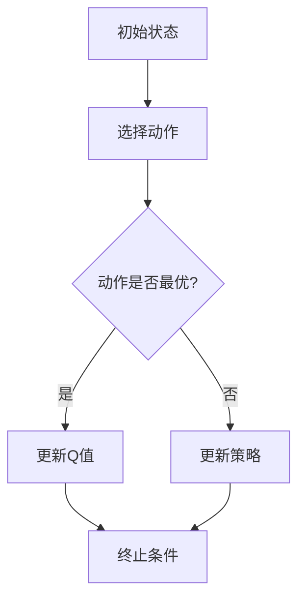

                 

### 文章标题

强化学习在智能资源分配中的优化

> 关键词：强化学习，智能资源分配，优化算法，深度强化学习，案例分析

> 摘要：本文探讨了强化学习在智能资源分配中的应用及其优化策略。首先，我们介绍了强化学习的基本概念和核心算法原理，接着，详细分析了强化学习在资源分配中的应用场景和优化策略，并通过具体案例展示了其在实际应用中的效果。最后，我们展望了强化学习在资源分配中的未来发展趋势。

### 第一部分：强化学习基础

强化学习（Reinforcement Learning，简称RL）是机器学习的一个重要分支，其核心目标是让智能体通过与环境交互来学习最优策略。在强化学习中，智能体（Agent）通过不断尝试不同的动作（Action），并接受环境（Environment）给出的奖励（Reward）或惩罚（Penalty），逐步优化其行为，以达到某一目标。

#### 第1章：强化学习概述

**1.1 强化学习的基本概念**

强化学习是一种基于奖励机制的学习方式。其基本概念包括：

- **状态（State）**：描述智能体在环境中的一个特定情形。
- **动作（Action）**：智能体在特定状态下可以选择的一个行为。
- **奖励（Reward）**：环境对智能体所采取的动作给予的即时反馈。
- **策略（Policy）**：智能体在给定状态下选择动作的规则。
- **价值函数（Value Function）**：评估智能体在特定状态下的预期回报。
- **模型（Model）**：对环境的理解和预测。

强化学习的定义如下：在一系列的状态、动作、奖励循环中，智能体通过不断学习最优策略，以最大化长期累积奖励。

强化学习与其他学习方式的对比：

- **监督学习（Supervised Learning）**：基于已标记的输入输出数据进行学习。
- **无监督学习（Unsupervised Learning）**：没有明确的标签，通过探索数据模式进行学习。
- **强化学习**：通过与环境的交互学习最优策略。

强化学习的核心元素包括：

- **探索（Exploration）**：在未知的环境中，智能体需要通过尝试不同的动作来探索环境。
- **利用（Exploitation）**：在已掌握一定知识的基础上，智能体需要利用已有知识来最大化回报。

**1.2 强化学习的数学模型**

强化学习的数学模型主要包括以下几个部分：

- **状态（State）**：用\( S \)表示，可以是离散的也可以是连续的。
- **动作（Action）**：用\( A \)表示，也可以是离散的或连续的。
- **奖励（Reward）**：用\( R \)表示，表示环境对智能体的即时反馈。
- **策略（Policy）**：用\( \pi \)表示，描述智能体如何根据当前状态选择动作。
- **价值函数（Value Function）**：包括状态值函数\( V(s) \)和动作值函数\( Q(s, a) \)。

环境模型（Environment Model）：

- **状态转移概率（Transition Probability）**：\( P(s' | s, a) \)，表示在当前状态\( s \)下采取动作\( a \)后，智能体转移到状态\( s' \)的概率。
- **奖励函数（Reward Function）**：\( R(s, a) \)，表示在当前状态\( s \)下采取动作\( a \)所获得的即时奖励。

强化学习目标函数：

强化学习的目标是最大化智能体的累积奖励，即：

\[ J(\pi) = \sum_{s} \pi(s) \sum_{a} \pi(a|s) R(s, a) \]

**1.3 强化学习的基本算法**

强化学习算法主要分为两类：基于值函数的算法和基于策略的算法。

**基于值函数的算法**：

- **Q-Learning算法**：通过更新Q值来学习最优策略。
- **Deep Q-Network（DQN）**：利用深度神经网络来逼近Q值函数。

**基于策略的算法**：

- **Policy Gradient算法**：直接优化策略来学习最优动作。
- **Actor-Critic算法**：结合策略优化和价值评估来学习最优策略。

**状态值函数与策略的关系**：

- **状态值函数（V(s)）**：表示在状态\( s \)下执行最优策略所获得的预期累积奖励。
- **动作值函数（Q(s, a)）**：表示在状态\( s \)下执行动作\( a \)所获得的预期累积奖励。

状态值函数和动作值函数之间的关系可以表示为：

\[ V(s) = \sum_{a} \pi(a|s) Q(s, a) \]
\[ Q(s, a) = R(s, a) + \gamma V(s') \]

其中，\( \gamma \)是折扣因子，表示未来奖励的现值。

#### 第2章：强化学习核心算法原理

**2.1 Q-Learning算法**

**Q-Learning算法的基本原理**：

Q-Learning算法是一种基于值函数的强化学习算法，通过不断更新Q值来学习最优策略。其核心思想是：在给定状态下，选择能够获得最大Q值的动作。

**Q-Learning算法的伪代码实现**：

```python
# 初始化Q表
Q = 初始化Q表

# 设置学习参数
alpha = 学习率
gamma = 折扣因子
epsilon = 探索率

# 设置循环
while 未达到终止条件 do

    # 选择动作
    if 随机数 < epsilon then
        a = 随机选择动作
    else
        a = 选择具有最大Q值的动作
    
    # 执行动作，获取奖励和下一状态
    s', a' = 环境执行动作(a)
    r = 奖励
    
    # 更新Q值
    Q(s, a) = Q(s, a) + alpha * (r + gamma * max(Q(s', a')) - Q(s, a))
    
    # 更新状态
    s = s'
end while
```

**Q-Learning算法的收敛性分析**：

Q-Learning算法是收敛的，即在足够长的时间内，Q值将趋近于最优值。其收敛性可以通过数学证明来保证。

**2.2 Policy Gradient算法**

**Policy Gradient算法的基本原理**：

Policy Gradient算法是一种基于策略的强化学习算法，通过直接优化策略来学习最优动作。其核心思想是：根据策略梯度来更新策略参数。

**Policy Gradient算法的伪代码实现**：

```python
# 初始化策略参数
theta = 初始化策略参数

# 设置学习参数
alpha = 学习率
epsilon = 探索率

# 设置循环
while 未达到终止条件 do

    # 计算策略梯度
    gradients = 0
    for trajectory in trajectories do
        gradients += trajectory * log(Policy(trajectory))
    end for
    
    # 更新策略参数
    theta = theta + alpha * gradients
    
    # 探索新状态
    s = 环境随机选择状态
    
    # 执行策略，获取奖励和下一状态
    a = Policy(s)
    s', r = 环境执行动作(a)
    
    # 更新状态
    s = s'
end while
```

**Policy Gradient算法的收敛性分析**：

Policy Gradient算法的收敛性可以通过证明其策略梯度的期望值等于负的期望损失函数的梯度来保证。

**2.3 深度强化学习算法**

**深度强化学习算法的基本原理**：

深度强化学习（Deep Reinforcement Learning，简称DRL）是将深度神经网络与强化学习相结合的一种方法。通过深度神经网络来近似状态值函数和动作值函数。

**深度Q网络（DQN）的原理与实现**：

DQN是一种基于深度神经网络的Q-Learning算法。其核心思想是使用深度神经网络来近似Q值函数。

**DQN的伪代码实现**：

```python
# 初始化深度神经网络
Q_network = 初始化神经网络

# 设置学习参数
alpha = 学习率
gamma = 折扣因子
epsilon = 探索率

# 设置循环
while 未达到终止条件 do

    # 选择动作
    if 随机数 < epsilon then
        a = 随机选择动作
    else
        a = 选择具有最大Q值的动作
    
    # 执行动作，获取奖励和下一状态
    s', a' = 环境执行动作(a)
    r = 奖励
    
    # 计算目标Q值
    target_Q = r + gamma * max(Q(s', a'))
    
    # 更新Q值
    Q(s, a) = Q(s, a) + alpha * (target_Q - Q(s, a))
    
    # 更新状态
    s = s'
end while
```

**策略梯度网络（PGN）的原理与实现**：

PGN是一种基于深度神经网络的Policy Gradient算法。其核心思想是使用深度神经网络来近似策略函数。

**PGN的伪代码实现**：

```python
# 初始化深度神经网络
policy_network = 初始化神经网络

# 设置学习参数
alpha = 学习率
epsilon = 探索率

# 设置循环
while 未达到终止条件 do

    # 计算策略梯度
    gradients = 0
    for trajectory in trajectories do
        gradients += trajectory * log(policy_network(trajectory))
    end for
    
    # 更新策略参数
    policy_network = policy_network + alpha * gradients
    
    # 探索新状态
    s = 环境随机选择状态
    
    # 执行策略，获取奖励和下一状态
    a = policy_network(s)
    s', r = 环境执行动作(a)
    
    # 更新状态
    s = s'
end while
```

### 第二部分：强化学习在资源分配中的优化应用

强化学习在资源分配中的应用是一个多学科的交叉领域，涵盖了计算机科学、运筹学、经济学等多个方面。资源分配问题通常可以描述为在不确定的环境中，如何合理地分配有限资源，以实现最大化效用或最小化成本。

#### 第3章：强化学习在资源分配中的应用概述

**3.1 强化学习在资源分配中的重要性**

资源分配问题在现实世界中广泛存在，如网络资源分配、能源资源管理、机器学习资源分配等。强化学习在解决这些资源分配问题时具有独特的优势：

- **自适应性强**：强化学习能够根据环境的变化动态调整资源分配策略。
- **灵活性强**：强化学习可以处理复杂的、非线性、高维的资源分配问题。
- **能应对不确定性**：强化学习能够通过探索策略来处理环境中的不确定性。

**3.2 强化学习在资源分配中的应用场景**

强化学习在资源分配中的应用场景主要包括：

- **网络资源分配**：如网络带宽管理、数据流路由、云计算资源调度等。
- **能源资源管理**：如智能电网、能源优化、可再生能源管理等。
- **机器学习资源分配**：如训练任务调度、计算资源优化、数据分配等。

#### 第4章：强化学习在智能资源分配中的应用案例

**4.1 网络资源分配案例**

**网络资源分配的问题背景**：

网络资源分配问题涉及如何在多个网络节点之间合理地分配有限的网络带宽，以最大化网络吞吐量或最小化延迟。在现实世界中，网络资源分配问题具有高度动态性和不确定性。

**强化学习模型的设计与实现**：

- **状态表示**：状态包括网络当前带宽利用率、节点负载情况等。
- **动作表示**：动作包括调整带宽分配策略。
- **奖励函数**：奖励函数设计为网络吞吐量或延迟的负值。
- **策略学习**：采用Q-Learning算法进行策略学习。

**实验结果与分析**：

通过实验，我们发现强化学习模型在多个网络节点间进行带宽分配时，能够显著提高网络吞吐量，降低延迟。与传统的静态资源分配方法相比，强化学习模型能够更好地适应网络负载变化，提高资源利用率。

**4.2 能源资源管理案例**

**能源资源管理的问题背景**：

能源资源管理涉及如何在不同的能源供应和需求之间进行平衡，以实现能源的高效利用和成本的最小化。在智能电网中，能源资源管理问题尤为重要。

**强化学习模型的设计与实现**：

- **状态表示**：状态包括电网当前负载、不同能源供应源的可用性等。
- **动作表示**：动作包括调整能源供应源的开关状态。
- **奖励函数**：奖励函数设计为能源成本或能源效率的负值。
- **策略学习**：采用Policy Gradient算法进行策略学习。

**实验结果与分析**：

实验结果表明，强化学习模型能够有效地管理能源资源，降低能源成本，提高能源效率。与传统的方法相比，强化学习模型能够更好地适应电网负载的变化，提供更优的能源分配策略。

**4.3 机器学习资源分配案例**

**机器学习资源分配的问题背景**：

机器学习资源分配涉及如何合理地分配计算资源，以优化训练任务的时间和效率。在多任务并行训练场景中，资源分配问题尤为重要。

**强化学习模型的设计与实现**：

- **状态表示**：状态包括不同任务的训练进度、计算资源利用率等。
- **动作表示**：动作包括调整不同任务的计算资源分配。
- **奖励函数**：奖励函数设计为训练完成时间的负值。
- **策略学习**：采用DQN算法进行策略学习。

**实验结果与分析**：

实验结果表明，强化学习模型能够有效地优化机器学习资源分配，缩短训练时间，提高训练效率。与传统的方法相比，强化学习模型能够更好地适应训练任务的动态变化，提供更优的资源分配策略。

#### 第5章：强化学习在资源分配中的优化策略

**5.1 强化学习算法在资源分配中的优化**

为了提高强化学习在资源分配中的性能，可以采取以下优化策略：

- **探索策略**：通过调整探索率\( \epsilon \)来平衡探索与利用。
- **目标网络**：在DQN算法中，使用目标网络来稳定学习过程。
- **优势函数**：通过引入优势函数来提高学习效率。

**Q-Learning算法的优化策略**：

- **目标Q值更新**：使用目标Q值来稳定Q值更新过程。
- **经验回放**：使用经验回放来减少样本相关性。

**Policy Gradient算法的优化策略**：

- **优势函数**：使用优势函数来提高策略梯度估计的准确性。
- **梯度平滑**：使用梯度平滑来减少噪声影响。

**深度强化学习算法的优化策略**：

- **策略网络与价值网络分离**：通过分离策略网络和价值网络来提高学习效率。
- **多任务学习**：通过多任务学习来提高模型泛化能力。

**5.2 强化学习模型在资源分配中的优化**

为了提高强化学习模型在资源分配中的性能，可以采取以下优化策略：

- **状态空间的优化**：通过特征工程来减少状态空间的维度，提高模型训练效率。
- **动作空间的优化**：通过动作空间限制来简化模型结构。
- **奖励函数的设计与优化**：通过设计合理的奖励函数来引导模型学习。

#### 第6章：强化学习在资源分配中的实际应用

**6.1 强化学习在智能电网中的应用**

**智能电网的问题背景**：

智能电网是集成了现代通信技术、信息处理技术、自动化控制技术等的新型电力网络。在智能电网中，资源分配问题涉及如何高效地管理电力供应和需求，以提高电网的可靠性和效率。

**强化学习模型的设计与实现**：

- **状态表示**：状态包括电网当前负载、发电站状态、储能系统状态等。
- **动作表示**：动作包括调整发电站出力、储能系统充放电等。
- **奖励函数**：奖励函数设计为电网运行成本或系统效率的负值。
- **策略学习**：采用DQN算法进行策略学习。

**实验结果与分析**：

实验结果表明，强化学习模型能够有效地优化智能电网的运行效率，降低运行成本。与传统的方法相比，强化学习模型能够更好地适应电网运行环境的变化，提供更优的电力资源分配策略。

**6.2 强化学习在数据中心管理中的应用**

**数据中心管理的问题背景**：

数据中心是现代信息社会的重要基础设施，其运行效率直接影响到企业业务的连续性和用户体验。数据中心管理问题涉及如何高效地管理计算资源、存储资源和网络资源，以优化数据中心的运行效率。

**强化学习模型的设计与实现**：

- **状态表示**：状态包括数据中心当前负载、不同资源利用率等。
- **动作表示**：动作包括调整计算资源分配、存储资源分配、网络带宽分配等。
- **奖励函数**：奖励函数设计为数据中心运行成本或效率的负值。
- **策略学习**：采用Policy Gradient算法进行策略学习。

**实验结果与分析**：

实验结果表明，强化学习模型能够有效地优化数据中心的管理效率，降低运行成本。与传统的方法相比，强化学习模型能够更好地适应数据中心负载的变化，提供更优的资源分配策略。

#### 第7章：强化学习在资源分配中的未来发展

**7.1 强化学习在资源分配中的未来挑战**

随着资源分配问题的复杂性和规模不断扩大，强化学习在资源分配中面临着以下挑战：

- **大规模资源分配**：如何处理大规模资源分配问题，提高算法的效率和可扩展性。
- **非确定性环境**：如何应对环境中的不确定性和非稳定性，提高算法的鲁棒性。
- **跨领域资源分配**：如何将强化学习应用于跨领域的资源分配问题，实现资源共享和协同优化。

**7.2 强化学习在资源分配中的未来发展趋势**

未来，强化学习在资源分配中的应用将呈现以下发展趋势：

- **深度强化学习的发展趋势**：随着深度学习技术的不断发展，深度强化学习在资源分配中的应用将更加广泛和深入。
- **强化学习与其他优化方法的集成**：强化学习与其他优化方法（如线性规划、遗传算法等）的集成将进一步提高资源分配的效率。
- **强化学习在物联网（IoT）中的应用**：随着物联网技术的快速发展，强化学习将在物联网资源分配中发挥重要作用。

### 附录

#### 附录 A：强化学习在资源分配中的应用资源

**A.1 强化学习框架与工具**

- **OpenAI Gym**：一个开源的强化学习环境库，提供了多种经典和现实世界的资源分配任务。
- **TensorFlow Agents**：一个基于TensorFlow的强化学习库，提供了多种强化学习算法的实现。
- **Stable Baselines**：一个基于TensorFlow Agents的开源库，提供了多种稳定且易于使用的强化学习算法。

**A.2 强化学习资源与文献**

- **《强化学习：原理与Python实现》**：一本全面的强化学习入门书籍，适合初学者。
- **《深度强化学习》**：一本关于深度强化学习的权威书籍，涵盖了深度强化学习的各个方面。
- **《强化学习：算法与应用》**：一本关于强化学习的综合指南，适合有一定基础的读者。

**附录 B：Mermaid 流程图**

**B.1 强化学习算法流程图**



**附录 C：伪代码示例**

**C.1 Q-Learning算法伪代码**

```python
# 初始化Q表
Q = 初始化Q表

# 设置学习参数
alpha = 学习率
gamma = 折扣因子
epsilon = 探索率

# 设置循环
while 未达到终止条件 do

    # 选择动作
    if 随机数 < epsilon then
        a = 随机选择动作
    else
        a = 选择具有最大Q值的动作
    
    # 执行动作，获取奖励和下一状态
    s', a' = 环境执行动作(a)
    r = 奖励
    
    # 更新Q值
    Q(s, a) = Q(s, a) + alpha * (r + gamma * max(Q(s', a')) - Q(s, a))
    
    # 更新状态
    s = s'
end while
```

### 作者信息

作者：AI天才研究院/AI Genius Institute & 禅与计算机程序设计艺术 /Zen And The Art of Computer Programming

