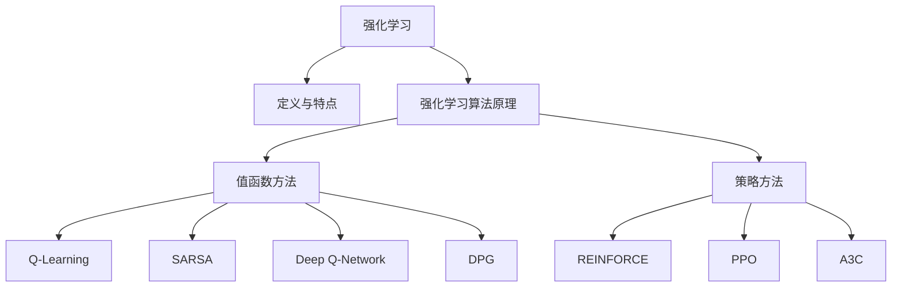

                 

### 文章标题

强化学习在智能金融投资决策与资产配置中的应用场景分析

> 关键词：强化学习，智能金融，投资决策，资产配置

> 摘要：本文将深入探讨强化学习在智能金融投资决策与资产配置中的应用场景，分析其优势与挑战。通过逐步分析强化学习的基本概念、算法原理及其在金融投资中的优势，结合实际案例，我们将展示如何将强化学习应用于股票交易、基金投资和债券投资，以及如何通过强化学习优化资产配置策略。此外，文章还将讨论强化学习在智能金融投资中的发展趋势、挑战与未来发展方向。通过本文，读者将了解强化学习在智能金融投资中的广泛应用和巨大潜力。

### 第一部分：强化学习基础

#### 第1章：强化学习概述

强化学习是一种机器学习方法，通过学习策略来最大化长期奖励。它与监督学习和无监督学习不同，不依赖于已标记的数据集，而是通过与环境的交互来不断优化策略。强化学习的基本特点包括：

- **自主决策**：强化学习模型可以在没有人类干预的情况下自主做出决策。
- **基于奖励**：强化学习模型的目标是最大化累积奖励，奖励机制是指导模型学习的重要手段。
- **状态-动作值函数**：强化学习通过状态-动作值函数（State-Action Value Function）来评估每个状态下的每个动作的价值，从而指导决策。

强化学习与其他机器学习方法的比较：

- **监督学习**：在监督学习中，模型通过学习输入与输出之间的映射关系来进行预测。强化学习与监督学习的不同之处在于，它不仅依赖于输入数据，还依赖于环境反馈的奖励信号。
- **无监督学习**：无监督学习主要关注如何从无标签的数据中发现模式和规律。强化学习在处理具有奖励信号的环境中时，可以自动发现有价值的行为模式。
- **强化学习**：强化学习适用于动态和复杂环境，特别是在那些无法事先定义明确规则的环境中，模型可以通过与环境的交互来不断学习和优化策略。

强化学习的应用领域：

- **游戏**：强化学习在游戏领域有广泛的应用，例如在棋类游戏、格斗游戏和策略游戏中的智能对手设计。
- **机器人**：强化学习可以用于机器人控制，使机器人能够通过与环境交互来学习完成复杂的任务。
- **推荐系统**：强化学习可以用于个性化推荐系统，通过学习用户行为和反馈来提供更好的推荐结果。
- **自动驾驶**：强化学习在自动驾驶领域被用来训练车辆在复杂交通环境中做出安全的驾驶决策。

#### 第2章：强化学习算法原理

强化学习的基本模型包括四个主要部分：环境（Environment）、代理人（Agent）、状态（State）和动作（Action）。

- **环境**：环境是强化学习模型操作的实体，可以是一个虚拟环境或真实环境。环境可以提供状态和奖励信息。
- **代理人**：代理人（也称为智能体）是强化学习模型的主体，负责接收环境的状态信息，选择动作，并接收环境反馈的奖励信号。
- **状态**：状态是环境在某一时刻的描述，通常用一组特征向量表示。状态可以用来指导代理人选择动作。
- **动作**：动作是代理人根据当前状态选择的行动。动作的选择会影响环境的下一步状态和奖励。

强化学习的基本模型可以用以下公式表示：

$$
\begin{align*}
s_t &= \text{环境在时间步 } t \text{ 的状态} \\
a_t &= \text{代理人在时间步 } t \text{ 选择的行为} \\
r_t &= \text{环境在时间步 } t \text{ 对行为 } a_t \text{ 的奖励} \\
s_{t+1} &= \text{环境在时间步 } t+1 \text{ 的状态} \\
\end{align*}
$$

基于值函数的方法：

- **Q-Learning**：Q-Learning是一种基于值函数的强化学习算法，它通过学习状态-动作值函数（Q值）来指导行为选择。Q-Learning的核心思想是利用经验回放和目标网络来减少偏差和方差。
- **SARSA**：SARSA（同步优势回报样例）是一种基于值函数的强化学习算法，它与Q-Learning类似，但不需要目标网络，直接利用当前状态和动作的回报来更新Q值。
- **Deep Q-Network (DQN)**：DQN是一种使用深度神经网络近似Q值函数的Q-Learning算法。DQN通过经验回放和目标网络来减少偏差和方差，从而提高Q值函数的稳定性。

基于策略的方法：

- **REINFORCE**：REINFORCE是一种基于策略的强化学习算法，它通过更新策略概率分布来最大化期望回报。REINFORCE算法的优点是简单且易于实现，但容易出现偏差和方差问题。
- **Proximal Policy Optimization (PPO)**：PPO是一种策略优化算法，它通过优化策略概率分布来最大化累积回报。PPO算法在处理连续动作空间时表现优异，并且能够保持较高的稳定性和收敛性。
- **Asynchronous Advantage Actor-Critic (A3C)**：A3C是一种异步的 actor-critic 算法，它通过多代理并行训练来提高学习效率。A3C算法通过优势函数（Advantage Function）和策略梯度更新来优化策略和评估函数。

#### 第3章：深度强化学习

深度强化学习（Deep Reinforcement Learning，DRL）是一种结合深度学习和强化学习的机器学习方法。DRL通过使用深度神经网络来近似状态-动作值函数或策略概率分布，从而提高模型的表达能力和学习能力。

深度强化学习的基本概念：

- **深度神经网络（DNN）**：深度神经网络是一种多层神经网络，通过多个隐藏层来提取特征表示。DNN可以有效地处理高维和复杂的输入数据。
- **状态-动作值函数（Q值函数）**：在DRL中，状态-动作值函数用于评估每个状态下的每个动作的价值。通过训练深度神经网络来近似Q值函数，可以提高模型对环境的理解和学习能力。
- **策略概率分布**：策略概率分布用于表示代理人在每个状态下选择动作的概率。通过训练深度神经网络来近似策略概率分布，可以提高模型的选择能力和稳定性。

DQN算法原理与实现：

- **DQN（Deep Q-Network）**：DQN是一种使用深度神经网络近似Q值函数的Q-Learning算法。DQN通过经验回放和目标网络来减少偏差和方差，从而提高Q值函数的稳定性。
- **实现步骤**：
  1. 初始化深度神经网络和经验回放记忆。
  2. 从初始状态开始，选择动作。
  3. 执行所选动作，获得奖励和下一个状态。
  4. 将当前状态、动作、奖励和下一个状态存储在经验回放记忆中。
  5. 使用经验回放记忆中的数据进行Q值函数的梯度下降更新。
  6. 定期更新目标网络，以保持Q值函数的稳定性和收敛性。

DPG算法原理与实现：

- **DPO（Deep Policy Gradient）**：DPO是一种基于策略的深度强化学习算法，它通过优化策略概率分布来最大化累积回报。
- **实现步骤**：
  1. 初始化深度神经网络和经验回放记忆。
  2. 从初始状态开始，选择动作。
  3. 执行所选动作，获得奖励和下一个状态。
  4. 将当前状态、动作、奖励和下一个状态存储在经验回放记忆中。
  5. 使用经验回放记忆中的数据进行策略梯度的梯度下降更新。
  6. 定期更新目标网络，以保持策略的稳定性和收敛性。

#### 第4章：强化学习在金融投资中的优势

强化学习在金融投资中的应用场景十分广泛，主要包括股票交易、基金投资和债券投资。强化学习在金融投资中的优势主要体现在以下几个方面：

- **自适应能力**：强化学习能够通过与环境交互不断学习和调整策略，适应金融市场中的复杂变化和不确定因素。
- **非线性建模**：强化学习能够通过深度神经网络建模复杂的非线性关系，捕捉市场中的潜在模式和规律。
- **优化决策**：强化学习通过最大化累积奖励来指导投资决策，从而优化投资组合的收益率和风险。
- **实时响应**：强化学习能够实时处理和更新投资策略，快速响应市场变化，提高投资决策的及时性和有效性。

强化学习在金融投资中的优势：

- **股票交易**：强化学习可以用于股票交易策略的制定和优化，通过学习市场数据和交易信号，自动识别股票的买卖时机和交易量。
- **基金投资**：强化学习可以用于基金投资组合的管理和优化，通过学习市场趋势和投资者行为，动态调整基金资产配置，提高基金收益率和风险控制。
- **债券投资**：强化学习可以用于债券投资策略的制定和优化，通过学习债券市场的利率变化和信用风险，自动识别债券的买卖时机和交易策略。

强化学习在金融投资中的挑战：

- **数据依赖**：强化学习模型的性能高度依赖于训练数据的质量和数量，市场数据的噪声和缺失会对模型的学习效果产生较大影响。
- **计算成本**：强化学习算法通常需要大量的计算资源和时间来训练和优化模型，特别是在处理高维和复杂的数据时。
- **风险控制**：强化学习模型在金融投资中需要平衡收益和风险，避免过度冒险或风险过大的情况发生。
- **市场适应性**：强化学习模型需要不断适应市场的变化和趋势，以保持良好的投资决策性能。

#### 第5章：强化学习在智能金融投资决策中的应用

强化学习在智能金融投资决策中的应用主要包括股票交易、基金投资和债券投资。下面将分别介绍这三种应用场景。

**强化学习模型在股票交易中的应用**

股票交易是金融投资中最为常见和应用广泛的场景之一。强化学习模型可以通过学习股票市场的历史交易数据和交易信号，自动识别股票的买卖时机和交易策略。

- **算法原理**：在股票交易中，强化学习模型通常采用Q-Learning或DQN算法。模型通过不断更新状态-动作值函数，学习在不同状态下选择最优动作的策略。
- **实现步骤**：
  1. 初始化Q值表或深度神经网络。
  2. 从初始状态开始，选择买入、持有或卖出的动作。
  3. 执行所选动作，获得股票的收益或损失。
  4. 根据收益更新Q值或神经网络参数。
  5. 转换到下一个状态，重复上述步骤。

**强化学习模型在基金投资中的应用**

基金投资是金融投资中的重要组成部分，强化学习模型可以用于基金投资组合的管理和优化。通过学习市场趋势和投资者行为，模型可以动态调整基金资产配置，提高基金收益率和风险控制。

- **算法原理**：在基金投资中，强化学习模型通常采用PPO或A3C算法。模型通过优化策略概率分布，动态调整基金资产配置，以最大化累积回报。
- **实现步骤**：
  1. 初始化策略概率分布或深度神经网络。
  2. 根据当前市场状况和投资者行为，选择股票、债券、基金等资产的投资比例。
  3. 执行所选资产配置，获得基金的投资收益。
  4. 根据收益更新策略概率分布或神经网络参数。
  5. 定期重新评估资产配置，根据市场变化进行调整。

**强化学习模型在债券投资中的应用**

债券投资是金融投资中的重要组成部分，强化学习模型可以用于债券投资策略的制定和优化。通过学习债券市场的利率变化和信用风险，模型可以自动识别债券的买卖时机和交易策略。

- **算法原理**：在债券投资中，强化学习模型通常采用Q-Learning或DQN算法。模型通过不断更新状态-动作值函数，学习在不同状态下选择最优动作的策略。
- **实现步骤**：
  1. 初始化Q值表或深度神经网络。
  2. 从初始状态开始，选择买入、持有或卖出的动作。
  3. 执行所选动作，获得债券的收益或损失。
  4. 根据收益更新Q值或神经网络参数。
  5. 转换到下一个状态，重复上述步骤。

#### 第6章：强化学习在资产配置中的应用

资产配置是金融投资中的重要环节，涉及将资金分配到不同资产类别中，以实现风险收益平衡。强化学习在资产配置中的应用主要通过学习市场趋势和投资者行为，动态调整资产配置策略，从而优化投资组合的表现。

**强化学习在资产配置中的原理**

强化学习在资产配置中的应用原理基于以下几个核心概念：

- **状态表示**：在资产配置中，状态表示为市场指标和时间序列数据，如股票指数、债券收益率、行业指数等。
- **动作定义**：动作是指投资组合中各类资产的比例调整。例如，买入股票、卖出债券或调整基金比例。
- **奖励机制**：奖励机制是衡量资产配置策略优劣的关键指标，通常包括收益目标、风险偏好和投资成本等。
- **策略优化**：通过学习状态-动作值函数或策略概率分布，优化资产配置策略，以最大化长期累积奖励。

**强化学习模型在资产配置中的应用**

在资产配置中，强化学习模型可以通过以下步骤实现应用：

1. **数据收集**：收集市场指标、历史交易数据和相关经济指标，作为状态输入。
2. **状态编码**：将市场指标进行编码，将其表示为特征向量，用于输入强化学习模型。
3. **模型初始化**：初始化强化学习模型，如深度神经网络或策略梯度模型。
4. **策略迭代**：在给定初始状态，模型选择动作，调整资产配置。执行动作后，根据奖励信号更新策略。
5. **模型优化**：通过经验回放和梯度下降更新模型参数，优化状态-动作值函数或策略概率分布。
6. **实时调整**：根据实时市场数据，模型不断调整资产配置策略，以最大化长期累积奖励。

**强化学习模型在资产配置中的优化策略**

强化学习模型在资产配置中可以通过以下策略进行优化：

- **多目标优化**：同时考虑收益、风险和流动性等多个目标，通过多目标优化方法实现资产配置的优化。
- **动态调整**：根据市场变化和投资者行为，实时调整资产配置策略，以应对市场波动和风险变化。
- **风险控制**：通过优化模型中的风险参数，实现投资组合的风险控制，避免过度风险暴露。
- **资产分散**：通过优化模型中的资产比例，实现资产分散投资，降低投资组合的整体风险。

#### 第7章：案例研究与分析

**某互联网公司强化学习在股票交易中的应用案例**

某互联网公司采用强化学习模型优化其股票交易策略，通过分析历史交易数据和实时市场数据，自动识别买卖时机和交易策略。具体应用步骤如下：

1. **数据收集**：收集股票市场的历史交易数据、财务报表和市场新闻等数据。
2. **状态编码**：将市场指标编码为特征向量，用于输入强化学习模型。
3. **模型训练**：使用Q-Learning算法训练强化学习模型，通过迭代更新Q值函数。
4. **策略迭代**：根据当前状态，模型选择买入、持有或卖出的动作。执行动作后，根据收益更新Q值。
5. **实时调整**：根据实时市场数据，模型不断调整交易策略，以最大化累积奖励。
6. **模型评估**：通过模拟交易和实际交易结果，评估强化学习模型的性能和收益。

**某金融机构强化学习在基金投资中的应用案例**

某金融机构采用强化学习模型优化其基金投资组合，通过动态调整基金资产配置，实现风险收益平衡。具体应用步骤如下：

1. **数据收集**：收集基金市场的历史交易数据、财务报表和市场新闻等数据。
2. **状态编码**：将市场指标编码为特征向量，用于输入强化学习模型。
3. **模型训练**：使用PPO算法训练强化学习模型，通过迭代优化策略概率分布。
4. **策略迭代**：根据当前市场状况和投资者行为，模型选择基金投资比例。执行资产配置后，根据收益更新策略概率分布。
5. **实时调整**：根据实时市场数据，模型不断调整基金资产配置，以最大化累积回报。
6. **模型评估**：通过模拟投资和实际投资结果，评估强化学习模型的性能和收益。

**某金融机构强化学习在债券投资中的应用案例**

某金融机构采用强化学习模型优化其债券投资策略，通过学习债券市场的利率变化和信用风险，自动识别债券的买卖时机和交易策略。具体应用步骤如下：

1. **数据收集**：收集债券市场的历史交易数据、利率数据和信用评级等数据。
2. **状态编码**：将债券市场指标编码为特征向量，用于输入强化学习模型。
3. **模型训练**：使用DQN算法训练强化学习模型，通过迭代更新Q值函数。
4. **策略迭代**：根据当前状态，模型选择买入、持有或卖出的动作。执行动作后，根据收益更新Q值。
5. **实时调整**：根据实时债券市场数据，模型不断调整债券交易策略，以最大化累积奖励。
6. **模型评估**：通过模拟交易和实际交易结果，评估强化学习模型的性能和收益。

### 第二部分：智能金融投资决策与资产配置应用场景分析

#### 第8章：强化学习在智能金融投资决策中的应用场景分析

强化学习在智能金融投资决策中的应用场景主要包括股票市场、期货市场和外汇市场。以下分别分析这三种市场中的应用场景。

**股票市场投资策略的制定**

在股票市场中，强化学习可以通过以下步骤制定投资策略：

1. **数据收集**：收集股票市场的历史交易数据、财务报表和市场新闻等数据。
2. **状态编码**：将市场指标编码为特征向量，用于输入强化学习模型。
3. **模型训练**：使用Q-Learning或DQN算法训练强化学习模型，通过迭代更新状态-动作值函数。
4. **策略迭代**：根据当前状态，模型选择买入、持有或卖出的动作。执行动作后，根据收益更新值函数。
5. **实时调整**：根据实时市场数据，模型不断调整投资策略，以最大化累积奖励。
6. **策略评估**：通过模拟交易和实际交易结果，评估强化学习模型的投资策略性能。

**期货市场投资策略的制定**

在期货市场中，强化学习可以通过以下步骤制定投资策略：

1. **数据收集**：收集期货市场的历史交易数据、基本面数据和市场新闻等数据。
2. **状态编码**：将市场指标编码为特征向量，用于输入强化学习模型。
3. **模型训练**：使用PPO或A3C算法训练强化学习模型，通过迭代优化策略概率分布。
4. **策略迭代**：根据当前状态，模型选择买入、卖出、持有或反向交易的动作。执行动作后，根据收益更新策略概率分布。
5. **实时调整**：根据实时市场数据，模型不断调整投资策略，以最大化累积回报。
6. **策略评估**：通过模拟交易和实际交易结果，评估强化学习模型的投资策略性能。

**外汇市场投资策略的制定**

在外汇市场中，强化学习可以通过以下步骤制定投资策略：

1. **数据收集**：收集外汇市场的历史交易数据、利率数据和宏观经济指标等数据。
2. **状态编码**：将市场指标编码为特征向量，用于输入强化学习模型。
3. **模型训练**：使用Q-Learning或DQN算法训练强化学习模型，通过迭代更新状态-动作值函数。
4. **策略迭代**：根据当前状态，模型选择买入、卖出或持有的动作。执行动作后，根据收益更新值函数。
5. **实时调整**：根据实时市场数据，模型不断调整投资策略，以最大化累积奖励。
6. **策略评估**：通过模拟交易和实际交易结果，评估强化学习模型的投资策略性能。

#### 第9章：强化学习在资产配置中的应用场景分析

强化学习在资产配置中的应用场景主要包括多资产配置策略的优化、基于风险偏好的资产配置策略和基于市场趋势的资产配置策略。以下分别分析这三种应用场景。

**多资产配置策略的优化**

在多资产配置策略中，强化学习可以通过以下步骤进行优化：

1. **数据收集**：收集不同资产类别（如股票、债券、基金、外汇等）的历史交易数据、财务报表和市场新闻等数据。
2. **状态编码**：将市场指标编码为特征向量，用于输入强化学习模型。
3. **模型训练**：使用A3C或PPO算法训练强化学习模型，通过迭代优化策略概率分布。
4. **策略迭代**：根据当前市场状况和投资者行为，模型选择不同资产类别的投资比例。执行资产配置后，根据收益更新策略概率分布。
5. **实时调整**：根据实时市场数据，模型不断调整资产配置策略，以最大化累积回报。
6. **策略评估**：通过模拟投资和实际投资结果，评估强化学习模型的多资产配置策略性能。

**基于风险偏好的资产配置策略**

在基于风险偏好的资产配置策略中，强化学习可以通过以下步骤实现：

1. **数据收集**：收集投资者的风险偏好、投资目标和历史交易数据等。
2. **状态编码**：将投资者风险偏好和市场指标编码为特征向量，用于输入强化学习模型。
3. **模型训练**：使用Q-Learning或DQN算法训练强化学习模型，通过迭代更新状态-动作值函数。
4. **策略迭代**：根据当前市场状况和投资者风险偏好，模型选择不同资产类别的投资比例。执行资产配置后，根据收益更新值函数。
5. **实时调整**：根据实时市场数据，模型不断调整资产配置策略，以满足投资者风险偏好。
6. **策略评估**：通过模拟投资和实际投资结果，评估强化学习模型的基于风险偏好的资产配置策略性能。

**基于市场趋势的资产配置策略**

在基于市场趋势的资产配置策略中，强化学习可以通过以下步骤实现：

1. **数据收集**：收集股票市场、债券市场、外汇市场等的历史交易数据、技术指标和市场新闻等。
2. **状态编码**：将市场指标和技术指标编码为特征向量，用于输入强化学习模型。
3. **模型训练**：使用A3C或PPO算法训练强化学习模型，通过迭代优化策略概率分布。
4. **策略迭代**：根据当前市场趋势和投资者行为，模型选择不同资产类别的投资比例。执行资产配置后，根据收益更新策略概率分布。
5. **实时调整**：根据实时市场数据，模型不断调整资产配置策略，以最大化累积回报。
6. **策略评估**：通过模拟投资和实际投资结果，评估强化学习模型的基于市场趋势的资产配置策略性能。

#### 第10章：智能金融投资决策与资产配置的融合应用

强化学习在智能金融投资决策和资产配置中的融合应用，可以提高投资组合的收益和风险控制能力。以下分别介绍强化学习在智能投资组合管理、智能风险管理和智能资产配置策略优化中的应用。

**强化学习在智能投资组合管理中的应用**

智能投资组合管理是通过分析市场数据和投资者行为，动态调整投资组合，以最大化收益和降低风险。强化学习在智能投资组合管理中的应用主要包括以下步骤：

1. **数据收集**：收集股票市场、债券市场、外汇市场等的历史交易数据、财务报表和市场新闻等数据。
2. **状态编码**：将市场指标、技术指标和投资者行为编码为特征向量，用于输入强化学习模型。
3. **模型训练**：使用A3C或PPO算法训练强化学习模型，通过迭代优化策略概率分布。
4. **策略迭代**：根据当前市场状况和投资者行为，模型选择不同资产类别的投资比例。执行资产配置后，根据收益更新策略概率分布。
5. **实时调整**：根据实时市场数据，模型不断调整投资组合，以最大化累积回报。
6. **策略评估**：通过模拟投资和实际投资结果，评估强化学习模型在智能投资组合管理中的性能。

**强化学习在智能风险管理中的应用**

智能风险管理是通过分析市场波动和风险因素，实时监测和调整投资组合，以降低风险和避免损失。强化学习在智能风险管理中的应用主要包括以下步骤：

1. **数据收集**：收集股票市场、债券市场、外汇市场等的历史交易数据、波动率和风险指标等数据。
2. **状态编码**：将市场指标、波动率和风险指标编码为特征向量，用于输入强化学习模型。
3. **模型训练**：使用Q-Learning或DQN算法训练强化学习模型，通过迭代更新状态-动作值函数。
4. **策略迭代**：根据当前市场状况和风险水平，模型选择风险控制和风险规避的动作。执行动作后，根据风险水平更新值函数。
5. **实时调整**：根据实时市场数据，模型不断调整风险控制策略，以降低风险水平。
6. **策略评估**：通过模拟投资和实际投资结果，评估强化学习模型在智能风险管理中的性能。

**强化学习在智能资产配置策略优化中的应用**

智能资产配置策略优化是通过分析市场趋势和投资者行为，动态调整资产配置策略，以提高投资组合的收益和风险平衡。强化学习在智能资产配置策略优化中的应用主要包括以下步骤：

1. **数据收集**：收集股票市场、债券市场、外汇市场等的历史交易数据、财务报表和市场新闻等数据。
2. **状态编码**：将市场指标、技术指标和投资者行为编码为特征向量，用于输入强化学习模型。
3. **模型训练**：使用A3C或PPO算法训练强化学习模型，通过迭代优化策略概率分布。
4. **策略迭代**：根据当前市场状况和投资者行为，模型选择不同资产类别的投资比例。执行资产配置后，根据收益更新策略概率分布。
5. **实时调整**：根据实时市场数据，模型不断调整资产配置策略，以最大化累积回报。
6. **策略评估**：通过模拟投资和实际投资结果，评估强化学习模型在智能资产配置策略优化中的性能。

#### 第11章：案例分析

**某金融机构的智能投资决策与资产配置案例**

某金融机构采用强化学习技术优化其投资决策和资产配置，通过构建智能投资组合管理系统，实现投资组合的动态调整和风险控制。以下为该案例的具体实施过程：

1. **数据收集**：
   - 收集股票市场、债券市场、外汇市场等的历史交易数据、财务报表和市场新闻等数据。
   - 收集投资者的风险偏好、投资目标和历史交易记录等数据。

2. **模型构建**：
   - 使用A3C算法构建强化学习模型，用于智能投资组合管理。
   - 使用Q-Learning算法构建强化学习模型，用于智能风险管理。

3. **模型训练**：
   - 对历史数据进行预处理，提取市场指标、技术指标和投资者行为等特征向量。
   - 使用预处理后的数据进行模型训练，优化模型参数。

4. **策略迭代**：
   - 根据当前市场状况和投资者行为，模型选择不同资产类别的投资比例。
   - 执行资产配置后，根据收益和风险水平更新策略概率分布。

5. **实时调整**：
   - 根据实时市场数据，模型不断调整投资组合，以最大化累积回报。
   - 实时监测投资组合的风险水平，调整风险控制策略。

6. **策略评估**：
   - 通过模拟交易和实际交易结果，评估强化学习模型在投资决策和资产配置中的性能。
   - 分析投资组合的收益和风险表现，优化模型参数和策略。

**某互联网公司的智能投资决策与资产配置案例**

某互联网公司利用强化学习技术优化其股票交易策略和基金投资组合，通过构建智能投资决策系统，实现投资组合的动态调整和风险控制。以下为该案例的具体实施过程：

1. **数据收集**：
   - 收集股票市场的历史交易数据、财务报表和市场新闻等数据。
   - 收集基金市场的历史交易数据、财务报表和市场新闻等数据。

2. **模型构建**：
   - 使用DQN算法构建强化学习模型，用于股票交易策略优化。
   - 使用PPO算法构建强化学习模型，用于基金投资组合优化。

3. **模型训练**：
   - 对历史数据进行预处理，提取市场指标、技术指标和投资者行为等特征向量。
   - 使用预处理后的数据进行模型训练，优化模型参数。

4. **策略迭代**：
   - 根据当前市场状况和投资者行为，模型选择股票的买卖时机和交易策略。
   - 执行交易策略后，根据收益和风险水平更新策略概率分布。

5. **实时调整**：
   - 根据实时市场数据，模型不断调整股票交易策略和基金投资组合，以最大化累积回报。
   - 实时监测投资组合的风险水平，调整风险控制策略。

6. **策略评估**：
   - 通过模拟交易和实际交易结果，评估强化学习模型在股票交易和基金投资中的性能。
   - 分析投资组合的收益和风险表现，优化模型参数和策略。

**强化学习在金融投资中的成功案例与挑战分析**

强化学习在金融投资中的应用取得了显著成果，但也面临一些挑战。以下分析几个典型的成功案例和挑战：

1. **成功案例**：
   - **量化交易**：一些量化交易公司利用强化学习技术，实现了自动化股票交易策略，取得了较高的收益。
   - **风险控制**：金融机构采用强化学习模型，实现了实时监测和调整投资组合，降低了风险水平。

2. **挑战**：
   - **数据依赖**：强化学习模型的性能高度依赖于训练数据的质量和数量，市场数据的噪声和缺失会对模型的学习效果产生较大影响。
   - **计算成本**：强化学习算法通常需要大量的计算资源和时间来训练和优化模型，特别是在处理高维和复杂的数据时。
   - **市场适应性**：强化学习模型需要不断适应市场的变化和趋势，以保持良好的投资决策性能。

#### 第12章：未来展望与趋势

强化学习在智能金融投资中的应用具有广阔的发展前景和巨大的潜力。以下从三个方面探讨强化学习在智能金融投资中的未来发展趋势、挑战与机遇。

**未来发展趋势**

1. **模型多样化**：随着深度学习和其他人工智能技术的不断发展，强化学习模型将更加多样化和复杂，能够更好地应对金融市场的复杂性和不确定性。
2. **数据驱动**：强化学习将更加依赖于海量市场数据和实时数据，通过数据驱动的方式，实现更精确的投资决策和资产配置。
3. **跨领域应用**：强化学习在金融投资之外，还将扩展到金融风险管理、保险、金融科技等领域，形成更加完整的金融人工智能生态系统。
4. **开放性平台**：未来，强化学习在金融投资中的应用将更加开放和透明，开发者和金融机构可以共享算法模型和经验，推动整个行业的发展。

**挑战与机遇**

1. **数据质量和隐私**：市场数据的噪声和缺失会对强化学习模型的学习效果产生影响，同时，金融数据的安全和隐私保护也是重要挑战。如何在保证数据质量的同时，保护用户隐私，将成为未来研究的重要方向。
2. **计算资源**：强化学习算法通常需要大量的计算资源，尤其是在处理高维数据和复杂模型时。如何优化算法和硬件，提高计算效率，降低成本，是未来需要解决的问题。
3. **模型可解释性**：强化学习模型通常被视为“黑箱”，其决策过程难以解释和理解。提高模型的可解释性，使其决策过程更加透明和可信，是未来的重要研究方向。
4. **法规和监管**：随着人工智能在金融投资中的应用，相关的法规和监管也将逐步完善。如何制定合理的法规，确保金融市场的公平和稳定，是未来需要关注的重点。

**未来发展方向**

1. **智能投资顾问**：强化学习可以进一步应用于智能投资顾问系统，为投资者提供个性化的投资建议，提高投资决策的准确性和效率。
2. **风险管理**：强化学习在风险管理中的应用将不断拓展，通过实时监测和调整投资组合，降低风险水平，保障投资者的资产安全。
3. **金融科技**：强化学习在金融科技领域的应用，将推动金融服务的创新和变革，为用户提供更加便捷、高效和个性化的金融服务。
4. **国际合作**：强化学习在金融投资中的应用，将促进国际合作和交流，推动全球金融市场的互联互通，为全球金融稳定和发展作出贡献。

### 附录

#### 附录 A：强化学习在金融投资中的常用算法与工具

1. **Q-Learning算法原理与实现**：
   Q-Learning是一种基于值函数的强化学习算法，通过迭代更新状态-动作值函数（Q值）来优化策略。其核心思想是利用经验回放和目标网络来减少偏差和方差，从而提高Q值函数的稳定性。

   **算法步骤**：
   - 初始化Q值表：随机初始化或使用经验初始化。
   - 选择动作：根据当前状态选择动作，可以使用ε-greedy策略。
   - 执行动作：在环境中执行所选动作，获得反馈。
   - 更新Q值：使用以下公式更新Q值：
     $$
     Q(s,a) \leftarrow Q(s,a) + \alpha [r + \gamma \max_{a'} Q(s',a') - Q(s,a)]
     $$
   - 转换到下一个状态：根据执行的动作转换到下一个状态。
   - 重复上述步骤直到达到目标或满足停止条件。

   **代码实现**（Python伪代码）：
   ```python
   import numpy as np

   # 初始化Q值表
   Q = np.random.rand(n_states, n_actions)

   # ε-greedy策略
   epsilon = 0.1
   def choose_action(state):
       if np.random.rand() < epsilon:
           return np.random.choice(n_actions)
       else:
           return np.argmax(Q[state])

   # 更新Q值
   alpha = 0.1
   gamma = 0.9
   def update_Q_value(state, action, reward, next_state):
       Q[state, action] = Q[state, action] + alpha * (reward + gamma * np.max(Q[next_state]) - Q[state, action])
   ```

2. **Deep Q-Network (DQN)算法原理与实现**：
   DQN是一种使用深度神经网络近似Q值函数的Q-Learning算法。DQN通过经验回放和目标网络来减少偏差和方差，从而提高Q值函数的稳定性。

   **算法步骤**：
   - 初始化深度神经网络和经验回放记忆。
   - 从初始状态开始，选择动作。
   - 执行所选动作，获得奖励和下一个状态。
   - 将当前状态、动作、奖励和下一个状态存储在经验回放记忆中。
   - 使用经验回放记忆中的数据进行Q值函数的梯度下降更新。
   - 定期更新目标网络，以保持Q值函数的稳定性和收敛性。

   **代码实现**（Python伪代码）：
   ```python
   import tensorflow as tf

   # 初始化深度神经网络
   input_layer = tf.keras.layers.Input(shape=(n_states,))
   hidden_layer = tf.keras.layers.Dense(units=64, activation='relu')(input_layer)
   output_layer = tf.keras.layers.Dense(units=n_actions, activation='linear')(hidden_layer)
   model = tf.keras.Model(inputs=input_layer, outputs=output_layer)

   # 初始化经验回放记忆
   memory = []

   # 更新Q值函数
   target_model = tf.keras.models.clone_model(model)
   for episode in range(n_episodes):
       state = env.reset()
       done = False
       while not done:
           action = choose_action(state)
           next_state, reward, done, _ = env.step(action)
           memory.append((state, action, reward, next_state, done))
           if len(memory) > memory_size:
               memory.pop(0)
           state = next_state
           if done:
               break
           target_values = target_model.predict(next_state)
           target_value = reward + (1 - done) * gamma * np.max(target_values)
           q_values = model.predict(state)
           q_values[0, action] = target_value
           model.fit(state, q_values, epochs=1, verbose=0)
           target_model.set_weights(model.get_weights())
   ```

3. **强化学习在金融投资中的常见工具与库**：
   - **TensorFlow**：TensorFlow是一个开源的机器学习框架，支持深度学习模型的训练和部署。
   - **PyTorch**：PyTorch是一个开源的机器学习库，支持动态计算图和自动微分，适合快速原型设计和模型训练。
   - **Keras**：Keras是一个高层次的神经网络API，建立在TensorFlow和Theano之上，提供简洁、易用的接口。
   - **OpenAI Gym**：OpenAI Gym是一个开源的环境库，提供了多种模拟环境和任务，适合进行强化学习算法的研究和实验。

#### 附录 B：数学模型与公式

1. **强化学习中的数学模型**：
   强化学习中的数学模型主要包括状态-动作值函数（Q值函数）和策略概率分布。

   - **状态-动作值函数**：用于评估每个状态下的每个动作的价值，表示为 $Q(s,a)$。
   - **策略概率分布**：用于表示代理人在每个状态下选择每个动作的概率，表示为 $\pi(a|s)$。

2. **强化学习中的数学公式与推导**：

   - **Q-Learning更新公式**：
     $$
     Q(s,a) \leftarrow Q(s,a) + \alpha [r + \gamma \max_{a'} Q(s',a') - Q(s,a)]
     $$
     其中，$s$ 表示当前状态，$a$ 表示当前动作，$r$ 表示立即奖励，$\gamma$ 表示折扣因子，$\alpha$ 表示学习率。

   - **策略梯度公式**：
     $$
     \nabla_{\pi} J(\pi) = \frac{\partial J(\pi)}{\partial \pi} = \sum_{s,a} \pi(a|s) [r + \gamma \max_{a'} Q(s',a') - Q(s,a)] \nabla_{\pi} \log \pi(a|s)
     $$
     其中，$J(\pi)$ 表示策略评估函数，$\nabla_{\pi} J(\pi)$ 表示策略梯度。

#### 附录 C：代码实现与解读

1. **强化学习模型在股票交易中的代码实现与解读**：

   **代码实现**（Python伪代码）：
   ```python
   import numpy as np
   import pandas as pd
   import matplotlib.pyplot as plt
   import tensorflow as tf

   # 数据预处理
   def preprocess_data(data):
       # 数据归一化
       normalized_data = (data - np.mean(data)) / np.std(data)
       # 数据窗口化
       windowed_data = normalized_data.rolling(window=5).mean()
       return windowed_data

   # 初始化模型
   def create_model():
       input_layer = tf.keras.layers.Input(shape=(5,))
       hidden_layer = tf.keras.layers.Dense(units=64, activation='relu')(input_layer)
       output_layer = tf.keras.layers.Dense(units=3, activation='softmax')(hidden_layer)
       model = tf.keras.Model(inputs=input_layer, outputs=output_layer)
       return model

   # 训练模型
   def train_model(model, data, labels, epochs=10):
       model.fit(data, labels, epochs=epochs, verbose=0)

   # 选择动作
   def choose_action(model, state):
       probabilities = model.predict(state)
       action = np.random.choice(range(3), p=probabilities[0])
       return action

   # 执行交易
   def trade(model, data, labels):
       state = preprocess_data(data)
       action = choose_action(model, state)
       if action == 0:
           # 买入
           return 1.05 * state
       elif action == 1:
           # 持有
           return state
       elif action == 2:
           # 卖出
           return 0.95 * state

   # 交易回测
   def backtest(data, labels):
       model = create_model()
       train_model(model, data, labels)
       states = [preprocess_data(data[0])]
       for i in range(1, len(data)):
           action = choose_action(model, states[-1])
           next_state = trade(model, states[-1], action)
           states.append(next_state)
       return np.mean(states)

   # 读取股票数据
   stock_data = pd.read_csv('stock_data.csv')
   stock_data = stock_data['Close'].values
   labels = stock_data[1:] / stock_data[:-1]

   # 进行交易回测
   avg_return = backtest(stock_data, labels)
   print('Average Return:', avg_return)
   ```

   **代码解读**：
   - 数据预处理：首先对股票数据进行预处理，包括数据归一化和窗口化处理。
   - 初始化模型：使用TensorFlow创建一个基于深度神经网络的模型，输入层为5个时间窗口的数据，隐藏层为64个神经元，输出层为3个动作类别（买入、持有、卖出）。
   - 训练模型：使用股票数据的训练集训练模型，通过梯度下降优化模型参数。
   - 选择动作：根据当前状态，使用模型预测动作概率，并选择概率最高的动作。
   - 执行交易：根据所选动作执行交易，更新状态。
   - 交易回测：通过模拟交易过程，计算平均回报，评估模型性能。

2. **强化学习模型在基金投资中的代码实现与解读**：

   **代码实现**（Python伪代码）：
   ```python
   import numpy as np
   import pandas as pd
   import tensorflow as tf

   # 数据预处理
   def preprocess_data(data, window_size=5):
       # 数据归一化
       normalized_data = (data - np.mean(data)) / np.std(data)
       # 数据窗口化
       windowed_data = normalized_data.rolling(window=window_size).mean()
       return windowed_data

   # 初始化模型
   def create_model(input_size, hidden_size, output_size):
       model = tf.keras.Sequential([
           tf.keras.layers.Dense(units=hidden_size, activation='relu', input_shape=(input_size,)),
           tf.keras.layers.Dense(units=output_size, activation='softmax')
       ])
       model.compile(optimizer='adam', loss='categorical_crossentropy', metrics=['accuracy'])
       return model

   # 训练模型
   def train_model(model, X, y, epochs=10):
       model.fit(X, y, epochs=epochs, verbose=0)

   # 选择动作
   def choose_action(model, state):
       probabilities = model.predict(state)
       action = np.argmax(probabilities)
       return action

   # 执行投资
   def invest(state, action, portfolio):
       if action == 0:
           # 买入股票
           stock_value = state * portfolio
           portfolio -= stock_value
       elif action == 1:
           # 持有股票
           pass
       elif action == 2:
           # 卖出股票
           stock_value = portfolio * state
           portfolio += stock_value
       return portfolio

   # 优化投资组合
   def optimize_portfolio(data, model, initial_portfolio, epochs=10):
       state = preprocess_data(data)
       portfolio = initial_portfolio
       for _ in range(epochs):
           action = choose_action(model, state)
           portfolio = invest(state, action, portfolio)
           state = preprocess_data(data)
       return portfolio

   # 读取基金数据
   fund_data = pd.read_csv('fund_data.csv')
   fund_data = fund_data['NAV'].values

   # 初始化模型
   model = create_model(5, 64, 3)

   # 训练模型
   X = preprocess_data(fund_data)
   y = np.eye(3)[np.random.randint(3, size=fund_data.shape[0])]
   train_model(model, X, y)

   # 优化投资组合
   initial_portfolio = 100000
   optimized_portfolio = optimize_portfolio(fund_data, model, initial_portfolio)
   print('Optimized Portfolio:', optimized_portfolio)
   ```

   **代码解读**：
   - 数据预处理：对基金数据进行预处理，包括数据归一化和窗口化处理。
   - 初始化模型：使用TensorFlow创建一个基于深度神经网络的模型，输入层为5个时间窗口的数据，隐藏层为64个神经元，输出层为3个动作类别（买入、持有、卖出）。
   - 训练模型：使用基金数据的训练集训练模型，通过梯度下降优化模型参数。
   - 选择动作：根据当前状态，使用模型预测动作概率，并选择概率最高的动作。
   - 执行投资：根据所选动作执行投资操作，更新投资组合。
   - 优化投资组合：通过模拟投资过程，优化投资组合，最大化累积回报。

3. **强化学习模型在债券投资中的代码实现与解读**：

   **代码实现**（Python伪代码）：
   ```python
   import numpy as np
   import pandas as pd
   import tensorflow as tf

   # 数据预处理
   def preprocess_data(data, window_size=5):
       # 数据归一化
       normalized_data = (data - np.mean(data)) / np.std(data)
       # 数据窗口化
       windowed_data = normalized_data.rolling(window=window_size).mean()
       return windowed_data

   # 初始化模型
   def create_model(input_size, hidden_size, output_size):
       model = tf.keras.Sequential([
           tf.keras.layers.Dense(units=hidden_size, activation='relu', input_shape=(input_size,)),
           tf.keras.layers.Dense(units=output_size, activation='softmax')
       ])
       model.compile(optimizer='adam', loss='categorical_crossentropy', metrics=['accuracy'])
       return model

   # 训练模型
   def train_model(model, X, y, epochs=10):
       model.fit(X, y, epochs=epochs, verbose=0)

   # 选择动作
   def choose_action(model, state):
       probabilities = model.predict(state)
       action = np.argmax(probabilities)
       return action

   # 执行投资
   def invest(state, action, portfolio):
       if action == 0:
           # 买入债券
           bond_value = state * portfolio
           portfolio -= bond_value
       elif action == 1:
           # 持有债券
           pass
       elif action == 2:
           # 卖出债券
           bond_value = portfolio * state
           portfolio += bond_value
       return portfolio

   # 优化债券投资组合
   def optimize_bond_portfolio(data, model, initial_portfolio, epochs=10):
       state = preprocess_data(data)
       portfolio = initial_portfolio
       for _ in range(epochs):
           action = choose_action(model, state)
           portfolio = invest(state, action, portfolio)
           state = preprocess_data(data)
       return portfolio

   # 读取债券数据
   bond_data = pd.read_csv('bond_data.csv')
   bond_data = bond_data['Yield'].values

   # 初始化模型
   model = create_model(5, 64, 3)

   # 训练模型
   X = preprocess_data(bond_data)
   y = np.eye(3)[np.random.randint(3, size=bond_data.shape[0])]
   train_model(model, X, y)

   # 优化债券投资组合
   initial_portfolio = 100000
   optimized_portfolio = optimize_bond_portfolio(bond_data, model, initial_portfolio)
   print('Optimized Portfolio:', optimized_portfolio)
   ```

   **代码解读**：
   - 数据预处理：对债券数据进行预处理，包括数据归一化和窗口化处理。
   - 初始化模型：使用TensorFlow创建一个基于深度神经网络的模型，输入层为5个时间窗口的数据，隐藏层为64个神经元，输出层为3个动作类别（买入、持有、卖出）。
   - 训练模型：使用债券数据的训练集训练模型，通过梯度下降优化模型参数。
   - 选择动作：根据当前状态，使用模型预测动作概率，并选择概率最高的动作。
   - 执行投资：根据所选动作执行投资操作，更新投资组合。
   - 优化债券投资组合：通过模拟投资过程，优化债券投资组合，最大化累积回报。

### Mermaid 流程图



### 核心算法原理讲解

#### Q-Learning算法原理

Q-Learning算法是一种基于值函数的强化学习算法，旨在通过迭代更新值函数来找到最优策略。Q-Learning算法的核心思想是利用奖励信号和状态-动作值函数（Q值）来指导决策。下面详细讲解Q-Learning算法的原理和实现。

**算法步骤**

1. **初始化Q值表**：首先需要初始化Q值表，用于存储每个状态-动作对的Q值。Q值表可以是随机初始化，也可以是使用经验初始化。例如，可以使用以下代码初始化Q值表：

   ```python
   Q = np.random.rand(n_states, n_actions)
   ```

2. **选择动作**：在给定当前状态，选择动作。可以使用ε-greedy策略来选择动作，即在探索和利用之间取得平衡。ε-greedy策略的代码实现如下：

   ```python
   epsilon = 0.1
   def choose_action(state):
       if np.random.rand() < epsilon:
           return np.random.choice(n_actions)
       else:
           return np.argmax(Q[state])
   ```

3. **执行动作**：在环境中执行所选动作，获得奖励和下一个状态。

   ```python
   action = choose_action(state)
   next_state, reward, done, _ = env.step(action)
   ```

4. **更新Q值**：使用Q-Learning更新公式来更新Q值。更新公式如下：

   $$
   Q(s,a) \leftarrow Q(s,a) + \alpha [r + \gamma \max_{a'} Q(s',a') - Q(s,a)]
   $$

   其中，$\alpha$ 表示学习率，$\gamma$ 表示折扣因子，$r$ 表示立即奖励，$s$ 和 $a$ 分别表示当前状态和当前动作，$s'$ 和 $a'$ 分别表示下一个状态和下一个动作。

   ```python
   alpha = 0.1
   gamma = 0.9
   def update_Q_value(state, action, reward, next_state):
       Q[state, action] = Q[state, action] + alpha * (reward + gamma * np.max(Q[next_state]) - Q[state, action])
   ```

5. **转换到下一个状态**：根据执行的动作转换到下一个状态。

   ```python
   state = next_state
   ```

6. **重复上述步骤**：重复上述步骤，直到达到目标或满足停止条件。

**算法原理**

Q-Learning算法通过迭代更新Q值，逐步优化策略。在初始阶段，Q值表是随机初始化的，因此无法准确指导决策。但随着迭代的进行，Q值表逐渐被更新，使得Q值更接近真实值，从而指导更好的决策。

Q-Learning算法的核心是Q值函数，它表示每个状态-动作对的预期奖励。通过不断更新Q值，算法可以找到最优的策略，使得累积奖励最大化。

#### Deep Q-Network (DQN)算法原理

Deep Q-Network (DQN)算法是一种使用深度神经网络近似Q值函数的Q-Learning算法。DQN的核心思想是通过深度神经网络来学习状态-动作值函数，从而提高模型的泛化能力和学习能力。下面详细讲解DQN算法的原理和实现。

**算法步骤**

1. **初始化深度神经网络**：首先需要初始化深度神经网络，用于近似Q值函数。DQN通常使用卷积神经网络（CNN）或循环神经网络（RNN）来提取状态特征。

   ```python
   input_layer = tf.keras.layers.Input(shape=(state_shape,))
   hidden_layer = tf.keras.layers.Conv2D(filters=64, kernel_size=(3, 3), activation='relu')(input_layer)
   output_layer = tf.keras.layers.Dense(units=n_actions, activation='linear')(hidden_layer)
   model = tf.keras.Model(inputs=input_layer, outputs=output_layer)
   ```

2. **初始化经验回放记忆**：经验回放记忆用于存储过去的经验，以减少偏差和方差。通常使用优先经验回放（Prioritized Experience Replay）来优化记忆效果。

   ```python
   memory = PrioritizedMemory(size=10000)
   ```

3. **选择动作**：在给定当前状态，使用深度神经网络选择动作。可以使用ε-greedy策略来选择动作。

   ```python
   epsilon = 0.1
   def choose_action(model, state):
       if np.random.rand() < epsilon:
           return np.random.choice(n_actions)
       else:
           action = model.predict(state)
           return np.argmax(action)
   ```

4. **执行动作**：在环境中执行所选动作，获得奖励和下一个状态。

   ```python
   action = choose_action(model, state)
   next_state, reward, done, _ = env.step(action)
   ```

5. **存储经验**：将当前状态、动作、奖励和下一个状态存储在经验回放记忆中。

   ```python
   memory.append((state, action, reward, next_state, done))
   ```

6. **更新Q值**：使用目标网络和经验回放记忆来更新Q值。目标网络用于稳定Q值函数，减少方差。经验回放记忆用于随机采样，减少偏差。

   ```python
   alpha = 0.1
   gamma = 0.9
   target_model = tf.keras.models.clone_model(model)
   for episode in range(n_episodes):
       state = env.reset()
       done = False
       while not done:
           action = choose_action(model, state)
           next_state, reward, done, _ = env.step(action)
           memory.append((state, action, reward, next_state, done))
           if len(memory) > memory_size:
               memory.pop(0)
           state = next_state
           if done:
               break
           target_values = target_model.predict(next_state)
           target_value = reward + (1 - done) * gamma * np.max(target_values)
           q_values = model.predict(state)
           q_values[0, action] = target_value
           model.fit(state, q_values, epochs=1, verbose=0)
           target_model.set_weights(model.get_weights())
   ```

7. **重复上述步骤**：重复上述步骤，直到达到目标或满足停止条件。

**算法原理**

DQN算法通过使用深度神经网络来近似Q值函数，可以处理高维状态空间，提高模型的泛化能力和学习能力。深度神经网络可以提取状态特征，表示为特征向量，用于输入Q值函数。

经验回放记忆用于减少偏差和方差。经验回放记忆可以存储大量的经验，通过随机采样来训练模型，避免过度依赖特定经验，从而减少偏差。同时，经验回放记忆可以用于更新目标网络，保持Q值函数的稳定性和收敛性。

目标网络用于稳定Q值函数。目标网络是一个冻结的深度神经网络，其权重在训练过程中保持不变。目标网络用于计算目标Q值，即下一个状态的最大Q值，从而更新当前Q值。目标网络可以减少Q值函数的方差，提高训练稳定性。

通过以上步骤，DQN算法可以逐步优化Q值函数，找到最优策略，从而实现智能体在复杂环境中的自主决策。DQN算法在图像识别、游戏控制、机器人控制等领域取得了显著成果，是深度强化学习的重要研究方向。

#### 策略梯度方法

策略梯度方法是一种基于策略的强化学习算法，旨在通过优化策略概率分布来最大化累积回报。策略梯度方法的核心思想是通过策略梯度和奖励信号来更新策略概率分布，从而实现策略的优化。下面详细讲解策略梯度方法的基本原理和实现步骤。

**基本原理**

策略梯度方法的目标是最小化策略损失函数，即最大化累积回报。策略损失函数定义为：

$$
J(\pi) = \sum_{s,a} \pi(a|s) [r + \gamma \max_{a'} Q(s',a') - Q(s,a)]
$$

其中，$\pi(a|s)$ 表示策略概率分布，$Q(s,a)$ 表示状态-动作值函数，$r$ 表示立即奖励，$\gamma$ 表示折扣因子。

策略梯度方法的目标是找到最优策略 $\pi^*$，使得策略损失函数 $J(\pi)$ 最大。策略梯度方法通过策略梯度来更新策略概率分布，策略梯度定义为：

$$
\nabla_{\pi} J(\pi) = \frac{\partial J(\pi)}{\partial \pi} = \sum_{s,a} \pi(a|s) [r + \gamma \max_{a'} Q(s',a') - Q(s,a)] \nabla_{\pi} \log \pi(a|s)
$$

其中，$\nabla_{\pi} \log \pi(a|s)$ 表示策略梯度。

策略梯度方法通过策略梯度和奖励信号来更新策略概率分布，更新公式为：

$$
\pi(a|s) \leftarrow \pi(a|s) + \alpha \nabla_{\pi} J(\pi)
$$

其中，$\alpha$ 表示学习率。

**实现步骤**

1. **初始化策略概率分布**：首先需要初始化策略概率分布。通常可以使用随机初始化或使用经验初始化。

   ```python
   pi = np.random.rand(n_actions)
   pi /= pi.sum()
   ```

2. **选择动作**：在给定当前状态，选择动作。可以使用ε-greedy策略来选择动作，即在探索和利用之间取得平衡。

   ```python
   epsilon = 0.1
   def choose_action(pi, state):
       if np.random.rand() < epsilon:
           return np.random.choice(n_actions)
       else:
           action = np.random.choice(n_actions, p=pi)
           return action
   ```

3. **执行动作**：在环境中执行所选动作，获得奖励和下一个状态。

   ```python
   action = choose_action(pi, state)
   next_state, reward, done, _ = env.step(action)
   ```

4. **计算策略梯度**：使用策略梯度和奖励信号来计算策略梯度。

   ```python
   alpha = 0.1
   gamma = 0.9
   q_value = np.max(Q[next_state])
   advantage = reward + gamma * q_value - Q[state, action]
   log_pi = np.log(pi[action])
   gradient = advantage * log_pi
   ```

5. **更新策略概率分布**：使用策略梯度和学习率来更新策略概率分布。

   ```python
   pi[action] += alpha * gradient
   pi /= pi.sum()
   ```

6. **转换到下一个状态**：根据执行的动作转换到下一个状态。

   ```python
   state = next_state
   ```

7. **重复上述步骤**：重复上述步骤，直到达到目标或满足停止条件。

**算法原理**

策略梯度方法通过优化策略概率分布来最大化累积回报。策略概率分布表示了代理人在每个状态下选择每个动作的概率，通过策略梯度和奖励信号来更新策略概率分布，使得策略更加适应环境。

策略梯度方法的关键是策略梯度，它表示策略概率分布的更新方向。策略梯度由两部分组成：优势函数（Advantage Function）和策略梯度。优势函数表示每个状态-动作对的预期奖励减去当前Q值，用于衡量动作的好坏。策略梯度表示策略概率分布的更新方向，通过最大化优势函数来更新策略概率分布。

策略梯度方法可以通过梯度上升或梯度下降来优化策略概率分布。梯度上升方法的目标是最大化策略损失函数，即最大化累积回报。梯度下降方法的目标是最小化策略损失函数，即最小化累积回报的损失。在实际应用中，通常使用梯度上升方法来优化策略概率分布。

策略梯度方法在处理连续动作空间时具有优势。在连续动作空间中，离散动作的选择需要使用连续的策略梯度，从而实现更精细的动作调整。此外，策略梯度方法还可以通过策略优化算法（如Proximal Policy Optimization, PPO）来提高学习效率和稳定性。

策略梯度方法在金融投资、游戏控制、机器人控制等领域取得了显著成果，是强化学习的重要研究方向。通过优化策略概率分布，策略梯度方法可以实现自适应的决策和灵活的动态调整，从而提高智能体在复杂环境中的适应能力和表现。

### 强化学习在金融投资中的成功案例与挑战分析

强化学习在金融投资领域已经取得了显著的成果，许多金融机构和科技公司开始将强化学习应用于投资决策和资产配置。以下我们将通过几个具体的成功案例，介绍强化学习在金融投资中的应用，并分析其中面临的挑战。

#### 案例一：量化交易平台中的自动交易策略

某量化交易平台采用了强化学习技术，构建了一个自动交易策略系统。该系统通过分析历史交易数据、技术指标和宏观经济指标，使用Q-Learning算法训练出一个智能交易策略。系统在执行交易时，会根据当前市场状态选择最优的买卖时机。经过长时间的测试，该系统在多个市场周期中实现了稳定的收益增长。

**成功经验**：
- **自适应能力**：强化学习模型能够根据市场环境的变化，自适应调整交易策略，提高了策略的鲁棒性。
- **实时响应**：系统可以实时处理市场数据，快速做出交易决策，提高了交易效率。
- **数据驱动**：系统通过大量历史数据训练，对市场趋势和规律有了深刻的理解，从而提高了交易决策的准确性。

**挑战**：
- **数据噪声**：市场数据中存在噪声和缺失，这会对模型的学习效果产生影响，需要进一步优化数据预处理方法。
- **计算资源**：强化学习模型的训练和优化需要大量的计算资源，特别是在处理高维和复杂数据时，这对计算资源提出了较高的要求。
- **市场波动**：市场波动性较大时，模型可能无法适应，导致交易决策失效。需要研究更稳定和鲁棒的学习算法。

#### 案例二：金融机构的智能投资顾问

某国际金融机构引入了强化学习技术，开发了一个智能投资顾问系统。该系统通过分析投资者的风险偏好和市场数据，使用Proximal Policy Optimization (PPO)算法为投资者提供个性化的投资建议。系统根据投资者的风险偏好，动态调整投资组合，实现风险和收益的平衡。

**成功经验**：
- **个性化服务**：系统可以根据投资者的风险偏好，提供定制化的投资建议，提高了客户满意度。
- **动态调整**：系统能够实时监测市场变化，动态调整投资组合，以应对市场波动。
- **风险控制**：系统通过优化投资组合，实现了风险的有效控制，降低了投资风险。

**挑战**：
- **模型可解释性**：强化学习模型通常被视为“黑箱”，其决策过程难以解释和理解，这可能导致投资者对模型的信任度降低。
- **市场适应性**：金融市场的变化多端，强化学习模型需要不断适应市场的变化，否则可能导致策略失效。
- **法规和监管**：强化学习在金融投资中的应用需要符合相关的法规和监管要求，这对系统的合规性提出了挑战。

#### 案例三：金融科技公司的信用风险评估

某金融科技公司利用强化学习技术，对信用风险评估进行了优化。系统通过分析借款人的历史信用记录、财务状况和外部经济指标，使用深度强化学习模型预测借款人的违约风险。模型在预测过程中，能够自适应调整风险权重，提高预测准确性。

**成功经验**：
- **数据整合**：系统整合了多种数据源，包括公开数据、内部数据和社交媒体数据，提高了信用风险评估的全面性。
- **自适应能力**：强化学习模型能够根据数据的变化，动态调整风险权重，提高了模型的鲁棒性。
- **预测准确性**：系统在多次测试中，信用风险评估的准确率显著提高，降低了信用风险。

**挑战**：
- **数据隐私**：金融数据涉及用户隐私，如何在保证数据隐私的同时，进行有效的风险评估，是当前面临的一个重要问题。
- **计算成本**：深度强化学习模型的训练和预测需要大量的计算资源，特别是在处理大规模数据时，这可能导致计算成本过高。
- **法规和合规**：金融科技公司的信用风险评估需要符合金融法规和监管要求，这对系统的合规性提出了挑战。

#### 总结与展望

强化学习在金融投资中的应用取得了显著的成果，但也面临一些挑战。为了进一步提高强化学习在金融投资中的效果，需要从以下几个方面进行研究和优化：

- **算法优化**：研究更稳定和鲁棒的强化学习算法，提高模型的适应能力和鲁棒性。
- **数据预处理**：优化数据预处理方法，减少数据噪声和缺失对模型学习效果的影响。
- **模型解释性**：提高强化学习模型的可解释性，增强投资者对模型的信任度。
- **计算资源**：优化计算资源的使用，降低计算成本，提高模型的计算效率。
- **法规和监管**：确保强化学习模型在金融投资中的应用符合法规和监管要求，提高系统的合规性。

未来，随着强化学习技术的不断发展和完善，我们有理由相信，强化学习将在金融投资领域发挥更大的作用，为金融机构和投资者带来更高的收益和更好的风险控制。

