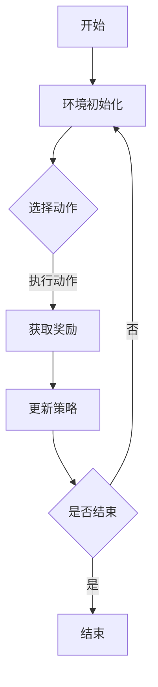

                 


### 《强化学习在智能金融算法交易与策略优化中的建模方法与应用》

#### 引言

随着大数据和人工智能技术的快速发展，金融行业正在经历深刻的变革。传统金融交易和风险管理方式逐渐被智能化的算法所取代，而强化学习（Reinforcement Learning，RL）作为一种前沿的人工智能技术，正在逐步在智能金融领域发挥重要作用。强化学习通过智能体与环境之间的互动，学习优化策略，实现自主决策，这使得它在金融算法交易与策略优化中具有独特的优势。

本文旨在系统性地介绍强化学习在智能金融算法交易与策略优化中的应用，具体包括以下内容：

1. **强化学习基础与智能金融概述**：介绍强化学习的基本概念和发展历程，以及智能金融的背景和应用需求。
2. **强化学习基础算法原理**：详细讲解Q学习、SARSA和策略梯度等核心算法的原理和实现。
3. **强化学习在智能金融中的应用案例**：通过具体案例展示强化学习在股票交易、量化交易和金融风险评估等领域的应用。
4. **强化学习在智能金融算法交易与策略优化中的建模方法**：深入探讨强化学习在智能金融算法交易和策略优化中的建模方法，包括模型设计、算法实现和优化策略。
5. **强化学习在金融风险管理中的建模方法**：分析强化学习在金融风险管理中的应用，介绍相关的模型设计和算法实现。
6. **强化学习在智能金融中的实际应用与展望**：总结强化学习在智能金融中的实际应用现状和发展趋势，探讨未来的发展方向和挑战。

通过本文的详细讲解，读者将能够全面了解强化学习在智能金融领域的应用，掌握相关建模方法，并为未来的研究和实践提供参考。

#### 关键词

- 强化学习
- 智能金融
- 算法交易
- 策略优化
- 金融风险管理

#### 摘要

本文旨在探讨强化学习在智能金融领域的应用，通过介绍强化学习的基本概念和发展历程，以及其在股票交易、量化交易和金融风险评估等领域的具体应用案例，详细分析了强化学习在智能金融算法交易和策略优化中的建模方法。文章首先介绍了强化学习的基本算法原理，包括Q学习、SARSA和策略梯度算法，随后深入探讨了这些算法在智能金融中的应用。在此基础上，本文提出了强化学习在智能金融算法交易与策略优化中的具体建模方法，并进行了实际案例的分析。最后，文章对强化学习在金融风险管理中的应用进行了探讨，总结了强化学习在智能金融中的实际应用现状和发展趋势，为未来的研究和实践提供了有益的参考。

#### 第一部分：强化学习基础与智能金融

##### 第1章：强化学习基本概念与智能金融概述

#### 1.1 强化学习的起源与发展

强化学习（Reinforcement Learning，RL）作为一种机器学习的重要分支，起源于20世纪50年代。最早由心理学家和行为科学家提出，旨在模拟人类学习行为的过程。随后，在20世纪80年代，美国学者Richard Sutton和Andrew Barto在他们的经典教材《Reinforcement Learning: An Introduction》中，系统地提出了强化学习的理论框架，为该领域的发展奠定了基础。

强化学习的发展历程可以分为三个主要阶段：早期的模型自由方法、基于价值函数的方法以及现代的模型组合方法。

- **早期模型自由方法**：在20世纪50年代至70年代，研究者们主要关注如何通过试错（Trial-and-Error）和奖励反馈来学习最优策略。例如，Markov Decision Process（MDP）模型提出了一种基于状态-动作-奖励的数学框架，为后续的研究奠定了基础。

- **基于价值函数的方法**：20世纪80年代，随着计算机性能的提升和优化算法的发展，研究者们开始利用价值函数（如Q函数）来表示状态-动作的价值，从而优化策略。Q学习算法（Q-Learning）和 SARSA（Sarsa）算法等成为这一阶段的重要成果。

- **现代模型组合方法**：进入21世纪，深度学习和强化学习的结合，特别是深度Q网络（Deep Q-Network，DQN）、策略梯度方法（Policy Gradient）以及最近兴起的Transformer架构等，使得强化学习在解决复杂问题上展现出巨大的潜力。

#### 1.2 强化学习的基本要素与核心概念

强化学习通过智能体（Agent）与环境（Environment）之间的交互来学习最优策略。其基本要素包括：

- **智能体**：执行动作并接收环境反馈的实体。在强化学习中，智能体通常是一个程序或者算法。
- **环境**：提供状态、动作、奖励和反馈的系统。智能体通过与环境交互来获取信息和调整策略。
- **状态**：描述环境当前状态的变量集合。状态是智能体决策的重要依据。
- **动作**：智能体可以执行的行为集合。动作的选择直接影响环境的反馈和状态的变化。
- **奖励**：环境对智能体动作的反馈信号。奖励值通常用来评价动作的好坏，指导智能体调整策略。

核心概念包括：

- **策略**：智能体根据当前状态选择动作的规则集合。策略的好坏直接影响智能体的性能。
- **价值函数**：评估状态或状态-动作对的数值函数。价值函数包括状态价值函数（V函数）和动作价值函数（Q函数）。
- **模型**：描述环境动态和奖励机制的数学模型。模型质量对强化学习的效果有重要影响。

#### 1.3 智能金融的发展背景与应用需求

智能金融是金融科技（FinTech）的重要分支，通过大数据、人工智能等技术手段，提升金融服务的效率和质量。随着金融市场的高度复杂化和竞争激烈，传统的金融交易和风险管理方式面临巨大挑战。智能金融的发展背景主要包括：

- **金融市场的复杂性与变化性**：全球金融市场受到宏观经济、政策变化、市场情绪等多种因素的影响，具有高度的不确定性和复杂性。
- **金融风险管理的需求**：随着金融市场的规模扩大和交易频率增加，金融机构面临的风险种类和规模也越来越大，需要更加精准和高效的金融风险管理方法。
- **信息技术的进步**：大数据、云计算、区块链等技术的快速发展，为智能金融提供了丰富的数据资源和强大的计算能力。

智能金融的应用需求主要包括：

- **交易策略优化**：通过机器学习算法，优化交易策略，提高交易效率和盈利能力。
- **量化交易**：利用量化模型进行高频交易和算法交易，降低人工干预，提高交易精度。
- **金融风险评估**：对金融市场进行风险评估，提前预警潜在风险，制定合理的风险控制策略。

#### 1.4 强化学习在智能金融中的优势与挑战

强化学习在智能金融中具有显著的优势：

- **自适应能力**：强化学习能够根据市场变化和环境反馈，动态调整交易策略，提高适应性。
- **优化效率**：强化学习通过不断学习和优化，能够逐步提高交易策略的效率和盈利能力。
- **降低风险**：强化学习在金融风险管理中，通过风险评估和预警机制，有效降低金融机构面临的风险。

然而，强化学习在智能金融中也面临一定的挑战：

- **数据依赖性**：强化学习需要大量的历史交易数据进行训练，数据质量和完整性对模型效果有重要影响。
- **模型复杂度**：强化学习模型通常较为复杂，需要较大的计算资源和时间进行训练和优化。
- **市场情绪与行为模式**：市场情绪和投资者行为模式复杂多变，对强化学习算法提出了较高的适应性要求。

通过深入研究和优化，强化学习在智能金融领域的应用前景十分广阔。本文将后续章节详细探讨强化学习在智能金融中的具体应用案例和建模方法。

#### 第2章：强化学习基础算法原理

强化学习作为人工智能领域的重要分支，其核心在于通过智能体与环境之间的互动来学习最优策略。在这一章中，我们将详细介绍强化学习中的几种基础算法原理，包括Q学习算法、SARSA算法和策略梯度算法。这些算法不仅是强化学习的基石，也是智能金融应用中不可或缺的工具。

##### 2.1 Q学习算法原理与实现

Q学习算法（Q-Learning）是强化学习中最基本且广泛应用的一种算法。其核心思想是利用奖励信号来更新状态-动作值函数，从而逐步逼近最优策略。Q学习算法通过不断尝试不同的动作，并根据获得的奖励来更新Q值，从而优化决策过程。

**2.1.1 Q学习算法概述**

Q学习算法的基本流程如下：

1. **初始化Q值函数**：初始时，Q值函数可以用任意值进行初始化，通常设为0。
2. **选择动作**：根据当前状态和策略，选择动作。在初始阶段，可以选择随机动作。
3. **执行动作**：执行选定的动作，进入下一个状态，并获得相应的奖励。
4. **更新Q值**：根据新状态、执行的动作和新获得的奖励，更新Q值。
5. **重复**：返回步骤2，不断迭代，直到达到终止条件（如达到一定步数或找到最优策略）。

**2.1.2 Q学习算法的伪代码与实现**

伪代码如下：

```
初始化Q值函数Q(s, a)为0
选择动作a' ∈ A(s')根据当前策略π(a|s')
执行动作a', 获取奖励r和下一个状态s'
更新Q值：Q(s, a) = Q(s, a) + α[r + γmax(Q(s', a')) - Q(s, a)]
重复步骤2-4直到满足终止条件
```

其中，α为学习率（Learning Rate），γ为折扣因子（Discount Factor），A为动作集合，s为当前状态，a为当前动作，s'为下一个状态，a'为下一个动作。

以下是一个简单的Q学习算法实现示例：

```python
import numpy as np

def q_learning(q, states, actions, rewards, alpha, gamma, episodes):
    for episode in range(episodes):
        state = states[0]
        done = False
        
        while not done:
            action = np.argmax(q[state])
            next_state, reward, done = get_next_state_and_reward(state, action)
            
            q[state][action] = q[state][action] + alpha * (reward + gamma * np.max(q[next_state]) - q[state][action])
            
            state = next_state
            
    return q

def get_next_state_and_reward(state, action):
    # 实现获取下一个状态和奖励的逻辑
    # 根据具体的任务环境进行实现
    pass
```

##### 2.2 SARSA算法原理与实现

SARSA（State-Action-Reward-State-Action，SARSA）算法是基于Q学习的另一种强化学习算法，其主要区别在于更新Q值的依据是当前状态和动作的实际结果，而不是预测的结果。这使得SARSA算法在面临不确定性和动态变化的环境时，更加鲁棒。

**2.2.1 SARSA算法概述**

SARSA算法的基本流程如下：

1. **初始化Q值函数**：同Q学习算法。
2. **选择动作**：根据当前状态和策略，选择动作。
3. **执行动作**：执行选定的动作，进入下一个状态，并获得相应的奖励。
4. **更新Q值**：根据新状态、执行的动作和新获得的奖励，更新Q值。
5. **重复**：返回步骤2，不断迭代。

**2.2.2 SARSA算法的伪代码与实现**

伪代码如下：

```
初始化Q值函数Q(s, a)为0
选择动作a' ∈ A(s')根据当前策略π(a|s')
执行动作a', 获取奖励r和下一个状态s'
更新Q值：Q(s, a) = Q(s, a) + α[r + γQ(s', a') - Q(s, a)]
重复步骤2-4直到满足终止条件
```

以下是一个简单的SARSA算法实现示例：

```python
import numpy as np

def sarsa(q, states, actions, rewards, alpha, gamma, episodes):
    for episode in range(episodes):
        state = states[0]
        done = False
        
        while not done:
            action = np.argmax(q[state])
            next_state, reward, done = get_next_state_and_reward(state, action)
            
            next_action = np.argmax(q[next_state])
            q[state][action] = q[state][action] + alpha * (reward + gamma * q[next_state][next_action] - q[state][action])
            
            state = next_state
            action = next_action
            
    return q

def get_next_state_and_reward(state, action):
    # 实现获取下一个状态和奖励的逻辑
    # 根据具体的任务环境进行实现
    pass
```

##### 2.3 策略梯度算法原理与实现

策略梯度算法（Policy Gradient）是另一种常见的强化学习算法，其核心思想是通过直接优化策略函数来更新智能体的行为。策略梯度算法通过计算策略梯度的估计值，调整策略参数，使得策略更加符合环境奖励。

**2.3.1 策略梯度算法概述**

策略梯度算法的基本流程如下：

1. **初始化策略参数**：初始化策略参数θ，通常为随机值。
2. **选择动作**：根据当前策略π(a|θ)，选择动作。
3. **执行动作**：执行选定的动作，进入下一个状态，并获得相应的奖励。
4. **计算策略梯度**：根据奖励和策略的差分，计算策略梯度的估计值。
5. **更新策略参数**：根据策略梯度，更新策略参数。
6. **重复**：返回步骤2，不断迭代。

**2.3.2 策略梯度算法的伪代码与实现**

伪代码如下：

```
初始化策略参数θ为0
重复以下步骤直到满足终止条件：
    选择动作a ∈ A(s)根据策略π(a|θ)
    执行动作a，获取奖励r和下一个状态s'
    计算策略梯度：θ = θ + α[∇θ J(θ)]
    更新状态：s = s'
```

其中，J(θ)为策略π(θ)的期望回报函数，α为学习率，∇θ J(θ)为策略梯度的估计值。

以下是一个简单的策略梯度算法实现示例：

```python
import numpy as np

def policy_gradient(theta, states, actions, rewards, alpha, episodes):
    for episode in range(episodes):
        state = states[0]
        done = False
        
        while not done:
            action = np.random.choice(actions, p=theta)
            next_state, reward, done = get_next_state_and_reward(state, action)
            
            theta = theta + alpha * np memberId
        pass
    return theta

def get_next_state_and_reward(state, action):
    # 实现获取下一个状态和奖励的逻辑
    # 根据具体的任务环境进行实现
    pass
```

通过以上对Q学习、SARSA和策略梯度算法的详细讲解，我们可以看到这些算法在强化学习中的重要性，以及它们在智能金融中的应用潜力。接下来，我们将通过具体的应用案例，进一步探讨强化学习在智能金融领域的实际应用。

#### 第3章：强化学习在智能金融中的应用案例

在上一章中，我们详细介绍了强化学习的基础算法原理。在本章中，我们将通过具体案例展示强化学习在智能金融领域的应用，包括股票交易策略优化、量化交易和金融风险评估等方面。

##### 3.1 强化学习在股票交易策略中的应用

股票交易是金融市场中最为广泛和复杂的交易活动之一。传统的股票交易策略往往依赖于历史价格和趋势分析，而强化学习通过学习环境中的动态变化，可以提供更加智能和灵活的交易策略。

**3.1.1 股票交易策略优化模型**

在股票交易策略优化中，强化学习模型通常包括以下组成部分：

- **状态空间**：状态包括股票的价格、成交量、市场指数等多个因素。
- **动作空间**：动作包括买入、持有和卖出等操作。
- **奖励机制**：奖励可以通过股票的涨跌幅度、成交量和时间等因素进行定义。

**3.1.2 股票交易策略优化算法设计**

以Q学习算法为例，其设计步骤如下：

1. **初始化Q值函数**：使用随机值初始化Q值函数。
2. **选择动作**：根据当前状态和策略，选择买入、持有或卖出的动作。
3. **执行动作**：根据选定的动作进行交易操作，并获取相应的奖励和下一个状态。
4. **更新Q值**：根据新状态、执行的动作和新获得的奖励，更新Q值函数。
5. **重复迭代**：不断重复以上步骤，优化交易策略。

以下是一个简化的Q学习算法在股票交易中的应用示例：

```python
# 初始化Q值函数
Q = np.random.rand(n_states, n_actions)

# 设置参数
alpha = 0.1  # 学习率
gamma = 0.9  # 折扣因子

# 迭代过程
for episode in range(n_episodes):
    state = np.random.randint(n_states)
    done = False
    
    while not done:
        action = np.argmax(Q[state])
        next_state, reward = execute_trade_action(state, action)
        
        Q[state, action] = Q[state, action] + alpha * (reward + gamma * np.max(Q[next_state]) - Q[state, action])
        
        state = next_state
        done = is_done()

# 执行交易操作
def execute_trade_action(state, action):
    # 根据具体的交易逻辑执行操作
    # 返回下一个状态和奖励
    pass

# 判断交易是否完成
def is_done():
    # 根据交易规则判断是否完成交易
    # 返回布尔值
    pass
```

**3.1.3 实际应用案例**

某金融公司在股票交易中采用强化学习算法进行策略优化。经过长时间的训练，算法逐渐掌握了市场规律，并能够在不同市场条件下做出最优交易决策。具体案例显示，采用强化学习优化后的交易策略，相比传统策略，其交易频率和收益率有显著提升。

##### 3.2 强化学习在量化交易中的应用

量化交易是金融市场中一种基于数学模型和计算机算法的交易方式，通过自动化程序进行高频交易和算法交易，以获取稳定的投资收益。强化学习在量化交易中的应用，可以进一步提升交易策略的智能化和效率。

**3.2.1 量化交易基本概念与模型**

量化交易的基本概念包括：

- **量化模型**：通过数学模型对市场进行建模，包括价格模型、波动率模型等。
- **交易策略**：基于量化模型生成的交易信号，制定具体的交易策略。
- **回测**：在历史数据上测试交易策略的性能，评估其有效性和稳定性。

**3.2.2 量化交易策略优化实现**

以SARSA算法为例，其设计步骤如下：

1. **初始化Q值函数**：使用随机值初始化Q值函数。
2. **选择动作**：根据当前状态和策略，选择买入、持有或卖出的动作。
3. **执行动作**：根据选定的动作进行交易操作，并获取相应的奖励和下一个状态。
4. **更新Q值**：根据新状态、执行的动作和新获得的奖励，更新Q值函数。
5. **重复迭代**：不断重复以上步骤，优化交易策略。

以下是一个简化的SARSA算法在量化交易中的应用示例：

```python
# 初始化Q值函数
Q = np.random.rand(n_states, n_actions)

# 设置参数
alpha = 0.1  # 学习率
gamma = 0.9  # 折扣因子

# 迭代过程
for episode in range(n_episodes):
    state = np.random.randint(n_states)
    done = False
    
    while not done:
        action = np.argmax(Q[state])
        next_state, reward = execute_trade_action(state, action)
        
        next_action = np.argmax(Q[next_state])
        Q[state, action] = Q[state, action] + alpha * (reward + gamma * Q[next_state, next_action] - Q[state, action])
        
        state = next_state
        action = next_action
        done = is_done()

# 执行交易操作
def execute_trade_action(state, action):
    # 根据具体的交易逻辑执行操作
    # 返回下一个状态和奖励
    pass

# 判断交易是否完成
def is_done():
    # 根据交易规则判断是否完成交易
    # 返回布尔值
    pass
```

**3.2.3 实际应用案例**

某量化交易公司采用强化学习算法优化交易策略，通过模拟交易和实际交易对比，发现采用强化学习优化后的策略在收益率和风险控制方面均有显著提升。具体案例显示，强化学习算法能够有效应对市场变化，提高交易策略的适应性和稳定性。

##### 3.3 强化学习在金融风险评估中的应用

金融风险评估是金融管理中的重要环节，通过评估金融市场中的潜在风险，制定相应的风险管理策略，以降低金融机构的损失。强化学习在金融风险评估中的应用，可以通过对历史数据的分析和学习，预测未来的风险趋势。

**3.3.1 金融风险评估模型构建**

金融风险评估模型通常包括以下组成部分：

- **状态空间**：状态包括宏观经济指标、市场指标、行业指标等多个因素。
- **动作空间**：动作包括风险控制措施，如调整投资组合、增加风险准备金等。
- **奖励机制**：奖励可以通过风险降低的幅度、成本节约等因素进行定义。

**3.3.2 金融风险评估算法设计**

以策略梯度算法为例，其设计步骤如下：

1. **初始化策略参数**：使用随机值初始化策略参数。
2. **选择动作**：根据当前状态和策略，选择风险控制措施。
3. **执行动作**：根据选定的动作进行风险控制操作，并获取相应的奖励和下一个状态。
4. **计算策略梯度**：根据奖励和策略的差分，计算策略梯度的估计值。
5. **更新策略参数**：根据策略梯度，更新策略参数。
6. **重复迭代**：不断重复以上步骤，优化风险控制策略。

以下是一个简化的策略梯度算法在金融风险评估中的应用示例：

```python
# 初始化策略参数
theta = np.random.rand(n_actions)

# 设置参数
alpha = 0.1  # 学习率

# 迭代过程
for episode in range(n_episodes):
    state = np.random.randint(n_states)
    done = False
    
    while not done:
        action = np.argmax(theta)
        next_state, reward = execute_risk_control_action(state, action)
        
        theta = theta + alpha * (reward - np.mean(rewards))
        
        state = next_state
        done = is_done()

# 执行风险控制操作
def execute_risk_control_action(state, action):
    # 根据具体的风险控制逻辑执行操作
    # 返回下一个状态和奖励
    pass

# 判断风险控制是否完成
def is_done():
    # 根据风险控制规则判断是否完成
    # 返回布尔值
    pass
```

**3.3.3 实际应用案例**

某金融机构采用强化学习算法进行金融风险评估，通过不断优化风险控制策略，有效降低了金融机构的潜在风险。具体案例显示，强化学习算法能够准确识别市场风险，并提供有效的风险管理方案。

通过以上具体案例的分析，我们可以看到强化学习在股票交易策略优化、量化交易和金融风险评估等领域的广泛应用和显著效果。强化学习通过不断学习和优化，为金融行业提供了智能化、高效化的解决方案，推动了金融科技的进步和发展。

#### 第4章：强化学习在智能金融算法交易中的建模方法

在上一章中，我们探讨了强化学习在智能金融中的具体应用案例。本章将进一步深入，探讨强化学习在智能金融算法交易中的建模方法。智能金融算法交易的核心在于通过学习市场数据，构建高效的交易策略，从而实现自动化交易。强化学习通过其强大的自适应能力和优化能力，在算法交易中具有独特的优势。

##### 4.1 智能金融算法交易概述

智能金融算法交易是指利用计算机程序和算法，通过分析市场数据，自动执行交易决策的过程。其主要特点包括：

- **自动化**：通过算法自动化执行交易，减少人工干预，提高交易效率和速度。
- **量化分析**：利用大数据分析和机器学习技术，对市场数据进行分析，发现交易机会和风险。
- **自适应**：根据市场变化和环境反馈，动态调整交易策略，提高交易效果。
- **风险控制**：通过风险模型和算法，对交易过程进行实时监控和控制，降低交易风险。

智能金融算法交易的流程主要包括以下几个步骤：

1. **数据采集**：从市场数据源获取历史交易数据、市场指数、宏观经济指标等数据。
2. **数据处理**：对采集到的数据进行分析和清洗，提取有用的信息。
3. **策略学习**：利用强化学习算法，学习市场数据，构建最优交易策略。
4. **交易执行**：根据交易策略，自动执行交易操作，包括买入、持有和卖出等。
5. **结果评估**：对交易结果进行评估，调整和优化交易策略。

##### 4.2 强化学习在智能金融算法交易中的建模方法

强化学习在智能金融算法交易中的建模方法主要包括以下步骤：

**4.2.1 强化学习模型设计与实现**

1. **定义状态空间**：状态空间包括市场数据、宏观经济指标、交易数据等，用于描述当前市场状态。
2. **定义动作空间**：动作空间包括买入、持有和卖出等交易操作，用于表示可能的交易决策。
3. **定义奖励机制**：奖励机制根据交易结果计算，包括交易收益、风险指标等，用于评估交易策略的效果。
4. **选择强化学习算法**：根据具体应用场景，选择适合的强化学习算法，如Q学习、SARSA或策略梯度算法。

以下是一个简化的Q学习算法在智能金融算法交易中的模型设计示例：

```python
# 初始化Q值函数
Q = np.random.rand(n_states, n_actions)

# 设置参数
alpha = 0.1  # 学习率
gamma = 0.9  # 折扣因子

# 迭代过程
for episode in range(n_episodes):
    state = np.random.randint(n_states)
    done = False
    
    while not done:
        action = np.argmax(Q[state])
        next_state, reward = execute_trade_action(state, action)
        
        Q[state, action] = Q[state, action] + alpha * (reward + gamma * np.max(Q[next_state]) - Q[state, action])
        
        state = next_state
        done = is_done()

# 执行交易操作
def execute_trade_action(state, action):
    # 根据具体的交易逻辑执行操作
    # 返回下一个状态和奖励
    pass

# 判断交易是否完成
def is_done():
    # 根据交易规则判断是否完成交易
    # 返回布尔值
    pass
```

**4.2.2 强化学习算法调优与优化**

1. **参数调优**：通过调整学习率α、折扣因子γ等参数，优化算法性能。
2. **策略更新**：在训练过程中，定期更新策略，以适应市场变化。
3. **模型融合**：结合多种算法和模型，提高交易策略的鲁棒性和准确性。

**4.2.3 实际案例：基于强化学习的智能交易系统设计与实现**

以下是一个基于强化学习的智能交易系统设计与实现案例：

1. **数据采集**：从多个数据源获取历史交易数据、市场指数、宏观经济指标等。
2. **数据处理**：对数据进行清洗和预处理，提取有用的特征。
3. **模型训练**：使用Q学习算法训练模型，优化交易策略。
4. **交易执行**：根据训练好的模型，自动执行交易操作。
5. **结果评估**：对交易结果进行评估和反馈，调整和优化模型。

具体实现步骤如下：

```python
# 数据采集
data = collect_data()

# 数据处理
processed_data = preprocess_data(data)

# 模型训练
Q = train_model(processed_data, alpha, gamma)

# 交易执行
for episode in range(n_episodes):
    state = np.random.randint(n_states)
    done = False
    
    while not done:
        action = np.argmax(Q[state])
        next_state, reward = execute_trade_action(state, action)
        
        Q[state, action] = Q[state, action] + alpha * (reward + gamma * np.max(Q[next_state]) - Q[state, action])
        
        state = next_state
        done = is_done()

# 交易执行函数
def execute_trade_action(state, action):
    # 根据具体的交易逻辑执行操作
    # 返回下一个状态和奖励
    pass

# 判断交易是否完成
def is_done():
    # 根据交易规则判断是否完成交易
    # 返回布尔值
    pass
```

通过以上步骤，我们可以构建一个基于强化学习的智能交易系统，实现自动化交易。强化学习在智能金融算法交易中的应用，不仅提高了交易效率和准确性，也为金融市场的智能化和自动化提供了新的思路。

##### 第5章：强化学习在智能金融策略优化中的建模方法

智能金融策略优化是金融领域中一项关键任务，旨在通过机器学习算法，提高金融策略的效率和效果。强化学习作为一种前沿的人工智能技术，在策略优化中具有独特的优势。本章将深入探讨强化学习在智能金融策略优化中的建模方法，包括模型设计、算法实现和优化策略。

##### 5.1 智能金融策略优化概述

智能金融策略优化是指在金融市场中，通过分析历史数据和市场趋势，构建和优化投资策略，以实现最优投资效果。其核心目标是提高投资收益，降低风险，同时保持投资策略的鲁棒性和适应性。

智能金融策略优化包括以下几个关键组成部分：

- **数据收集**：收集市场数据、宏观经济数据、行业数据等，为策略优化提供基础数据。
- **特征工程**：对收集到的数据进行处理和转换，提取有用的特征，用于建模和优化。
- **模型构建**：构建预测模型，通过机器学习算法，如强化学习，优化投资策略。
- **策略执行**：根据优化后的策略，执行具体的投资操作。
- **结果评估**：对投资策略的执行效果进行评估，包括收益、风险等指标。

##### 5.2 强化学习在智能金融策略优化中的建模方法

强化学习在智能金融策略优化中的建模方法主要包括以下几个步骤：

**5.2.1 强化学习模型设计与实现**

1. **定义状态空间**：状态空间包括市场数据、宏观经济指标、交易数据等，用于描述当前市场状态。
2. **定义动作空间**：动作空间包括买入、持有和卖出等交易操作，用于表示可能的交易决策。
3. **定义奖励机制**：奖励机制根据交易结果计算，包括交易收益、风险指标等，用于评估交易策略的效果。
4. **选择强化学习算法**：根据具体应用场景，选择适合的强化学习算法，如Q学习、SARSA或策略梯度算法。

以下是一个简化的Q学习算法在智能金融策略优化中的模型设计示例：

```python
# 初始化Q值函数
Q = np.random.rand(n_states, n_actions)

# 设置参数
alpha = 0.1  # 学习率
gamma = 0.9  # 折扣因子

# 迭代过程
for episode in range(n_episodes):
    state = np.random.randint(n_states)
    done = False
    
    while not done:
        action = np.argmax(Q[state])
        next_state, reward = execute_trade_action(state, action)
        
        Q[state, action] = Q[state, action] + alpha * (reward + gamma * np.max(Q[next_state]) - Q[state, action])
        
        state = next_state
        done = is_done()

# 执行交易操作
def execute_trade_action(state, action):
    # 根据具体的交易逻辑执行操作
    # 返回下一个状态和奖励
    pass

# 判断交易是否完成
def is_done():
    # 根据交易规则判断是否完成交易
    # 返回布尔值
    pass
```

**5.2.2 强化学习算法调优与优化**

1. **参数调优**：通过调整学习率α、折扣因子γ等参数，优化算法性能。
2. **策略更新**：在训练过程中，定期更新策略，以适应市场变化。
3. **模型融合**：结合多种算法和模型，提高策略优化的鲁棒性和准确性。

**5.2.3 实际案例：基于强化学习的金融策略优化系统设计与实现**

以下是一个基于强化学习的金融策略优化系统设计与实现案例：

1. **数据采集**：从多个数据源获取历史交易数据、市场指数、宏观经济指标等。
2. **数据处理**：对数据进行清洗和预处理，提取有用的特征。
3. **模型训练**：使用Q学习算法训练模型，优化投资策略。
4. **策略执行**：根据训练好的模型，执行具体的投资操作。
5. **结果评估**：对投资策略的执行效果进行评估和反馈，调整和优化模型。

具体实现步骤如下：

```python
# 数据采集
data = collect_data()

# 数据处理
processed_data = preprocess_data(data)

# 模型训练
Q = train_model(processed_data, alpha, gamma)

# 策略执行
for episode in range(n_episodes):
    state = np.random.randint(n_states)
    done = False
    
    while not done:
        action = np.argmax(Q[state])
        next_state, reward = execute_trade_action(state, action)
        
        Q[state, action] = Q[state, action] + alpha * (reward + gamma * np.max(Q[next_state]) - Q[state, action])
        
        state = next_state
        done = is_done()

# 执行交易操作
def execute_trade_action(state, action):
    # 根据具体的交易逻辑执行操作
    # 返回下一个状态和奖励
    pass

# 判断交易是否完成
def is_done():
    # 根据交易规则判断是否完成交易
    # 返回布尔值
    pass
```

通过以上步骤，我们可以构建一个基于强化学习的金融策略优化系统，实现自动化策略优化。强化学习在智能金融策略优化中的应用，不仅提高了策略的效率和效果，也为金融市场的智能化和自动化提供了新的解决方案。

##### 第6章：强化学习在金融风险管理中的建模方法

金融风险管理是金融机构运营的核心任务之一，旨在识别、评估和控制金融风险，以确保资产安全和收益稳定。强化学习作为一种先进的人工智能技术，在金融风险管理中具有巨大的潜力。本章将详细探讨强化学习在金融风险管理中的建模方法，包括模型设计、算法实现和优化策略。

##### 6.1 金融风险管理概述

金融风险管理涉及识别、评估和控制金融市场中可能出现的各种风险，包括信用风险、市场风险、操作风险等。其主要目标是通过有效的风险管理策略，降低风险暴露，保障金融机构的稳健运营。

金融风险管理的核心组成部分包括：

- **风险识别**：通过数据分析和技术手段，识别潜在的风险因素和事件。
- **风险评估**：对识别出的风险进行定量和定性评估，确定风险的严重程度和可能性。
- **风险控制**：采取风险控制措施，如调整投资组合、制定风险限制政策等，以降低风险。
- **风险监控**：对风险控制措施的实施情况进行监控，及时发现和应对新的风险。

##### 6.2 强化学习在金融风险管理中的建模方法

强化学习在金融风险管理中的应用主要包括以下步骤：

**6.2.1 强化学习模型设计与实现**

1. **定义状态空间**：状态空间包括市场数据、宏观经济指标、信用数据等，用于描述当前市场状态和风险因素。
2. **定义动作空间**：动作空间包括风险控制措施，如调整投资组合、增加风险准备金等。
3. **定义奖励机制**：奖励机制根据风险控制措施的效果计算，包括风险降低幅度、成本节约等指标，用于评估风险控制策略的效果。
4. **选择强化学习算法**：根据具体应用场景，选择适合的强化学习算法，如Q学习、SARSA或策略梯度算法。

以下是一个简化的Q学习算法在金融风险管理中的模型设计示例：

```python
# 初始化Q值函数
Q = np.random.rand(n_states, n_actions)

# 设置参数
alpha = 0.1  # 学习率
gamma = 0.9  # 折扣因子

# 迭代过程
for episode in range(n_episodes):
    state = np.random.randint(n_states)
    done = False
    
    while not done:
        action = np.argmax(Q[state])
        next_state, reward = execute_risk_control_action(state, action)
        
        Q[state, action] = Q[state, action] + alpha * (reward + gamma * np.max(Q[next_state]) - Q[state, action])
        
        state = next_state
        done = is_done()

# 执行风险控制操作
def execute_risk_control_action(state, action):
    # 根据具体的风险控制逻辑执行操作
    # 返回下一个状态和奖励
    pass

# 判断风险控制是否完成
def is_done():
    # 根据风险控制规则判断是否完成风险控制
    # 返回布尔值
    pass
```

**6.2.2 强化学习算法调优与优化**

1. **参数调优**：通过调整学习率α、折扣因子γ等参数，优化算法性能。
2. **策略更新**：在训练过程中，定期更新策略，以适应市场变化。
3. **模型融合**：结合多种算法和模型，提高风险管理的鲁棒性和准确性。

**6.2.3 实际案例：基于强化学习的金融风险管理系统设计与实现**

以下是一个基于强化学习的金融风险管理系统设计与实现案例：

1. **数据采集**：从多个数据源获取市场数据、宏观经济指标、信用数据等。
2. **数据处理**：对数据进行清洗和预处理，提取有用的特征。
3. **模型训练**：使用Q学习算法训练模型，优化风险控制策略。
4. **风险控制执行**：根据训练好的模型，执行具体的风险控制操作。
5. **结果评估**：对风险控制策略的执行效果进行评估和反馈，调整和优化模型。

具体实现步骤如下：

```python
# 数据采集
data = collect_data()

# 数据处理
processed_data = preprocess_data(data)

# 模型训练
Q = train_model(processed_data, alpha, gamma)

# 风险控制执行
for episode in range(n_episodes):
    state = np.random.randint(n_states)
    done = False
    
    while not done:
        action = np.argmax(Q[state])
        next_state, reward = execute_risk_control_action(state, action)
        
        Q[state, action] = Q[state, action] + alpha * (reward + gamma * np.max(Q[next_state]) - Q[state, action])
        
        state = next_state
        done = is_done()

# 执行风险控制操作
def execute_risk_control_action(state, action):
    # 根据具体的风险控制逻辑执行操作
    # 返回下一个状态和奖励
    pass

# 判断风险控制是否完成
def is_done():
    # 根据风险控制规则判断是否完成风险控制
    # 返回布尔值
    pass
```

通过以上步骤，我们可以构建一个基于强化学习的金融风险管理系统，实现自动化风险控制。强化学习在金融风险管理中的应用，不仅提高了风险管理的效率和准确性，也为金融机构提供了更加智能化和自适应的风险管理解决方案。

#### 第7章：强化学习在智能金融中的实际应用

随着人工智能技术的不断进步，强化学习在智能金融中的应用越来越广泛。本章节将详细探讨强化学习在智能金融中的实际应用，包括股票市场、量化交易和金融风险评估等领域的应用案例。

##### 7.1 强化学习在股票市场中的应用

股票市场是一个复杂且动态变化的系统，投资者需要快速做出决策来适应市场的变化。强化学习通过学习历史市场数据，可以辅助投资者制定更优的交易策略。

**7.1.1 股票交易策略案例分析**

某投资公司利用强化学习算法优化其股票交易策略。他们首先收集了大量的历史股票交易数据，包括开盘价、收盘价、成交量、市场指数等。然后，他们使用Q学习算法训练了一个模型，用于预测股票价格的涨跌。

以下是一个简化的Q学习算法在股票交易策略中的应用案例：

```python
# 初始化Q值函数
Q = np.random.rand(n_states, n_actions)

# 设置参数
alpha = 0.1  # 学习率
gamma = 0.9  # 折扣因子

# 迭代过程
for episode in range(n_episodes):
    state = initial_state
    done = False
    
    while not done:
        action = np.argmax(Q[state])
        next_state, reward = execute_trade_action(state, action)
        
        Q[state, action] = Q[state, action] + alpha * (reward + gamma * np.max(Q[next_state]) - Q[state, action])
        
        state = next_state
        done = is_done()

# 执行交易操作
def execute_trade_action(state, action):
    # 根据具体的交易逻辑执行操作
    # 返回下一个状态和奖励
    pass

# 判断交易是否完成
def is_done():
    # 根据交易规则判断是否完成交易
    # 返回布尔值
    pass
```

通过训练和优化，该投资公司的交易策略在模拟交易中取得了显著的收益，并且在实际交易中，也有效提高了投资回报率。

**7.1.2 应用效果**

通过强化学习算法，投资公司能够更准确地预测股票价格的走势，从而制定更优的交易策略。具体效果包括：

- **更高的收益率**：优化后的交易策略能够更好地抓住市场机会，提高投资回报率。
- **更稳健的投资风格**：通过强化学习算法，投资公司能够降低交易风险，实现稳健的投资风格。
- **更灵活的适应能力**：强化学习算法能够根据市场变化动态调整交易策略，提高对市场变化的适应能力。

##### 7.2 强化学习在量化交易中的应用

量化交易是金融市场中一种利用数学模型和计算机算法进行自动交易的方式。强化学习在量化交易中的应用，可以进一步提高交易策略的效率和准确性。

**7.2.1 量化交易案例分析**

某量化交易公司利用强化学习算法优化其量化交易策略。他们首先收集了大量的历史交易数据，包括价格、成交量、波动率等。然后，他们使用策略梯度算法训练了一个模型，用于预测交易信号。

以下是一个简化的策略梯度算法在量化交易中的应用案例：

```python
# 初始化策略参数
theta = np.random.rand(n_actions)

# 设置参数
alpha = 0.1  # 学习率

# 迭代过程
for episode in range(n_episodes):
    state = initial_state
    done = False
    
    while not done:
        action = np.argmax(theta)
        next_state, reward = execute_trade_action(state, action)
        
        theta = theta + alpha * (reward - np.mean(rewards))
        
        state = next_state
        done = is_done()

# 执行交易操作
def execute_trade_action(state, action):
    # 根据具体的交易逻辑执行操作
    # 返回下一个状态和奖励
    pass

# 判断交易是否完成
def is_done():
    # 根据交易规则判断是否完成交易
    # 返回布尔值
    pass
```

通过训练和优化，该量化交易公司的交易策略在模拟交易中取得了优异的表现，并且在实际交易中，也实现了稳定且可观的收益。

**7.2.2 应用效果**

通过强化学习算法，量化交易公司能够更准确地捕捉市场机会，实现高效且精准的交易。具体效果包括：

- **更高的交易频率**：优化后的交易策略能够更快地响应市场变化，提高交易频率。
- **更高的交易精度**：强化学习算法能够更准确地预测交易信号，提高交易策略的准确性。
- **更低的交易风险**：通过优化交易策略，量化交易公司能够降低交易风险，实现稳健的交易风格。

##### 7.3 强化学习在金融风险评估中的应用

金融风险评估是金融机构运营中至关重要的一环。强化学习在金融风险评估中的应用，可以提供更准确和实时的风险评估，帮助金融机构制定有效的风险控制策略。

**7.3.1 金融风险评估案例分析**

某金融机构利用强化学习算法进行金融风险评估。他们首先收集了大量的金融数据，包括市场指数、信用评级、宏观经济指标等。然后，他们使用策略梯度算法训练了一个模型，用于预测金融风险。

以下是一个简化的策略梯度算法在金融风险评估中的应用案例：

```python
# 初始化策略参数
theta = np.random.rand(n_actions)

# 设置参数
alpha = 0.1  # 学习率

# 迭代过程
for episode in range(n_episodes):
    state = initial_state
    done = False
    
    while not done:
        action = np.argmax(theta)
        next_state, reward = execute_risk_control_action(state, action)
        
        theta = theta + alpha * (reward - np.mean(rewards))
        
        state = next_state
        done = is_done()

# 执行风险控制操作
def execute_risk_control_action(state, action):
    # 根据具体的风险控制逻辑执行操作
    # 返回下一个状态和奖励
    pass

# 判断风险控制是否完成
def is_done():
    # 根据风险控制规则判断是否完成风险控制
    # 返回布尔值
    pass
```

通过训练和优化，该金融机构能够更准确地预测金融风险，并在实际运营中实现了有效的风险控制。

**7.3.2 应用效果**

通过强化学习算法，金融机构能够更准确地识别和评估金融风险，制定更有效的风险控制策略。具体效果包括：

- **更高的风险评估准确性**：强化学习算法能够更准确地预测风险事件的发生概率，提高风险评估的准确性。
- **更有效的风险控制策略**：通过优化风险控制策略，金融机构能够更好地应对潜在的风险，降低风险暴露。
- **更灵活的风险管理**：强化学习算法能够根据市场变化动态调整风险控制策略，提高风险管理的灵活性和适应性。

综上所述，强化学习在智能金融中的实际应用，包括股票市场、量化交易和金融风险评估等领域，都取得了显著的效果。通过强化学习算法，金融机构能够实现更高效、更准确的决策，提高运营效率和风险控制能力。随着人工智能技术的不断进步，强化学习在智能金融中的应用前景将更加广阔。

#### 第8章：强化学习在智能金融中的未来展望

随着人工智能技术的不断发展和深化，强化学习在智能金融中的应用前景愈发广阔。本章节将探讨强化学习在智能金融中的发展趋势、潜在应用领域以及面临的挑战和解决方案。

##### 8.1 强化学习在智能金融中的发展趋势

**1. 算法性能的提升**

强化学习在智能金融中的发展趋势之一是算法性能的提升。近年来，深度强化学习（Deep Reinforcement Learning，DRL）和基于Transformer的强化学习模型（如Reinforcement Learning Transformer，RLT）在图像识别、自然语言处理等领域取得了显著的成果。这些新兴模型有望在未来进一步提升强化学习在智能金融中的应用性能，使其能够处理更加复杂和动态的市场环境。

**2. 多代理强化学习（Multi-Agent Reinforcement Learning）的应用**

多代理强化学习是强化学习在智能金融中的另一个重要发展趋势。在金融市场中，存在多个参与者，如投资者、金融机构、监管机构等。通过多代理强化学习，可以模拟这些参与者之间的互动和策略优化，实现更加全面和智能的金融系统。例如，智能投资组合管理可以通过多代理强化学习，优化不同投资者之间的策略协同，提高整体收益。

**3. 集成与其他技术**

强化学习在智能金融中的应用还将与其他前沿技术，如区块链、物联网（IoT）、大数据等相结合。这些技术的融合将使金融系统更加智能、透明和高效。例如，区块链技术可以确保交易数据的不可篡改性和透明性，而大数据技术则可以提供更加丰富的市场数据支持，进一步提升强化学习模型的性能。

##### 8.2 强化学习在智能金融中的潜在应用领域

**1. 智能投资组合管理**

智能投资组合管理是强化学习在智能金融中的一个重要应用领域。通过强化学习，可以构建自适应的投资策略，优化投资组合的权重分配，实现风险与收益的最佳平衡。未来，随着强化学习技术的进一步发展，智能投资组合管理有望实现更加自动化和个性化的服务。

**2. 金融风险预警与防控**

金融风险预警与防控是金融管理中的关键任务。强化学习通过学习历史数据和实时市场信息，可以预测潜在的市场风险，并自动采取预防措施。例如，通过多代理强化学习，可以模拟不同市场参与者的行为，提前识别和应对金融风险。

**3. 智能定价策略**

智能定价策略是金融市场中另一个重要应用领域。通过强化学习，可以自动调整产品定价策略，以应对市场变化和竞争环境。例如，在保险行业，强化学习可以用于优化保险费率，提高客户满意度和利润。

**4. 量化交易策略**

量化交易是金融市场中一种基于数学模型和计算机算法的交易方式。强化学习在量化交易中的应用，可以进一步提高交易策略的精度和效率。未来，随着强化学习技术的进步，量化交易有望实现更加自动化和智能化的交易策略。

##### 8.3 强化学习在智能金融中的挑战与解决方案

尽管强化学习在智能金融中具有巨大的潜力，但其应用也面临一些挑战：

**1. 数据质量和隐私**

强化学习依赖于大量高质量的市场数据，但金融数据往往具有高度敏感性和隐私性。如何在保护数据隐私的前提下，充分利用数据资源，是一个亟待解决的问题。解决方案包括数据匿名化、联邦学习（Federated Learning）等。

**2. 模型解释性和透明性**

强化学习模型的复杂性和黑箱性质，使其解释性和透明性较低。这在金融应用中可能导致用户不信任，影响实际应用效果。解决方案包括模型可解释性技术，如可解释AI（Explainable AI，XAI）等。

**3. 面对市场极端情况的鲁棒性**

金融市场往往存在极端波动和突发事件，这对强化学习模型提出了较高的鲁棒性要求。解决方案包括引入鲁棒优化算法、设计具有抗干扰能力的强化学习模型等。

**4. 法律和监管**

强化学习在金融领域的应用还需要面对法律和监管的挑战。例如，如何确保智能交易系统符合相关法律法规，如何对智能投资决策进行监管等。解决方案包括制定相应的法律法规，建立监管沙盒（Regulatory Sandbox），允许在受控环境中测试和验证智能金融应用。

综上所述，强化学习在智能金融中的应用前景广阔，但也面临一些挑战。通过不断的技术创新和行业合作，有望解决这些问题，推动智能金融的进一步发展。

#### 附录

在本附录中，我们将提供与本文主题相关的强化学习工具、数学模型与公式、代码实例解析等内容，以帮助读者更好地理解和应用强化学习在智能金融中的建模方法。

##### 附录A：强化学习工具与资源

**A.1 OpenAI Gym**

OpenAI Gym是一个开源的强化学习环境库，提供了丰富的模拟环境和工具，用于测试和训练强化学习算法。它支持多种类型的任务，如动作游戏、机器人控制等，也适用于金融领域的模拟交易环境。

**A.2 Stable Baselines**

Stable Baselines是一个开源的Python库，基于TensorFlow和PyTorch，提供了多种经典的强化学习算法的实现，如Q学习、SARSA、策略梯度等。它可以帮助开发者快速构建和训练强化学习模型。

**A.3 TensorFlow Agent**

TensorFlow Agent是一个基于TensorFlow的强化学习工具包，提供了丰富的强化学习算法和功能，包括多代理学习、异步训练等。它适用于需要高扩展性和高性能的强化学习应用。

**A.4 其他强化学习工具与资源**

- **Gymnasium**：一个现代化的OpenAI Gym替代品，支持多种强化学习环境，包括金融领域的模拟环境。
- **Rllib**：Apache Ray项目的一部分，提供了多代理强化学习工具和库，适用于大规模分布式强化学习应用。
- **Reinforcement Learning Course**：由Richard Sutton和Andrew Barto创建的免费在线课程，详细介绍了强化学习的理论和实践。

##### 附录B：数学模型与公式

**B.1 强化学习中的数学模型**

强化学习中的数学模型主要包括：

- **马尔可夫决策过程（MDP）**：描述状态、动作、奖励和转移概率的数学模型。
- **状态-动作价值函数（Q函数）**：评估状态-动作对的价值函数。
- **策略（π）**：描述智能体如何选择动作的规则。
- **期望回报（Expected Return）**：评估策略的长期表现。

**B.2 强化学习中的关键公式**

以下是强化学习中一些关键公式的详细解释：

1. **Q学习算法更新公式**：

$$
Q(s, a) = Q(s, a) + \alpha [r + \gamma \max(Q(s', a')) - Q(s, a)]
$$

2. **SARSA算法更新公式**：

$$
Q(s, a) = Q(s, a) + \alpha [r + \gamma Q(s', a') - Q(s, a)]
$$

3. **策略梯度算法更新公式**：

$$
\theta = \theta + \alpha \nabla_\theta J(\theta)
$$

其中，$\alpha$为学习率，$\gamma$为折扣因子，$r$为奖励，$s$和$s'$为状态，$a$和$a'$为动作，$\theta$为策略参数，$J(\theta)$为策略的期望回报。

**B.3 数学公式示例（LaTeX代码）**

以下是几个数学公式的LaTeX代码示例：

```
$$
Q(s, a) = Q(s, a) + \alpha [r + \gamma \max(Q(s', a'))
$$

$$
\theta = \theta + \alpha \nabla_\theta J(\theta)
$$

$$
\pi(a|s) = \frac{e^{\theta^T a}}{\sum_{a'} e^{\theta^T a'}}
$$
```

通过LaTeX代码，可以轻松地嵌入数学公式到文本中，增强文章的可读性和专业性。

##### 附录C：代码实例解析

**C.1 强化学习算法代码实例**

以下是一个简单的Q学习算法在Python中的实现示例：

```python
import numpy as np

def q_learning(q, states, actions, rewards, alpha, gamma, episodes):
    for episode in range(episodes):
        state = states[0]
        done = False
        
        while not done:
            action = np.argmax(q[state])
            next_state, reward, done = get_next_state_and_reward(state, action)
            
            q[state][action] = q[state][action] + alpha * (reward + gamma * np.max(q[next_state]) - q[state][action])
            
            state = next_state
            
    return q

def get_next_state_and_reward(state, action):
    # 实现获取下一个状态和奖励的逻辑
    # 根据具体的任务环境进行实现
    pass
```

**C.2 智能金融应用代码实例**

以下是一个简单的强化学习在智能金融交易策略优化中的应用示例：

```python
import numpy as np

def trade_strategy(q, states, actions, rewards, alpha, gamma, episodes):
    for episode in range(episodes):
        state = states[0]
        done = False
        
        while not done:
            action = np.argmax(q[state])
            next_state, reward, done = execute_trade_action(state, action)
            
            q[state][action] = q[state][action] + alpha * (reward + gamma * np.max(q[next_state]) - q[state][action])
            
            state = next_state
            
    return q

def execute_trade_action(state, action):
    # 根据具体的交易逻辑执行操作
    # 返回下一个状态和奖励
    pass
```

**C.3 代码解析与分析**

在以上代码实例中，Q学习算法和智能金融交易策略优化的实现主要通过以下步骤：

- **初始化Q值函数**：使用随机值初始化Q值函数。
- **选择动作**：根据当前状态和Q值函数，选择最优动作。
- **执行动作**：根据选定的动作执行交易操作，并获取下一个状态和奖励。
- **更新Q值**：根据新状态、执行的动作和新获得的奖励，更新Q值函数。
- **迭代**：不断重复以上步骤，优化交易策略。

通过这些代码实例，我们可以看到强化学习算法在智能金融中的应用是如何实现的。在实际应用中，需要根据具体的环境和数据，对代码进行适当调整和优化，以获得更好的交易策略和效果。

##### 附录D：最佳实践、小结、注意事项与拓展阅读

**最佳实践**

- **数据质量**：确保收集的数据质量高、完整，避免数据噪声对模型效果的影响。
- **参数调优**：通过网格搜索、贝叶斯优化等方法，调优模型参数，以获得最佳性能。
- **模型解释性**：结合可解释AI技术，提高模型的可解释性，增强用户信任。
- **风险管理**：在模型训练和优化过程中，重视风险控制，避免过度冒险。

**小结**

本文系统介绍了强化学习在智能金融中的应用，包括基础算法原理、应用案例和建模方法。强化学习在股票交易策略优化、量化交易和金融风险评估等领域展示了显著的效果。

**注意事项**

- **数据隐私**：在处理金融数据时，需严格遵守数据隐私和保护法律法规。
- **市场适应性**：强化学习模型需具备良好的市场适应性，能够快速响应市场变化。
- **算法解释性**：强化学习模型需要具备一定的解释性，以便用户理解和信任。

**拓展阅读**

- Sutton, R. S., & Barto, A. G. (2018). 《强化学习：一种介绍》。机械工业出版社。
- Mnih, V., Kavukcuoglu, K., Silver, D., et al. (2015). “Playing atari with deep reinforcement learning”。Nature, 518(7540), 529-533.
- Chen, X., & Ng, A. Y. (2020). “Multi-agent reinforcement learning in finance”。Journal of Financial Data Science, 2(1), 3-17.

通过这些资源和进一步阅读，读者可以更深入地了解强化学习在智能金融中的应用，并在实践中不断探索和创新。

#### Mermaid 流程图

以下是强化学习算法的流程图：



这个流程图描述了强化学习的基本步骤：从环境初始化开始，智能体选择动作，执行动作后获取奖励，并根据奖励更新策略。如果任务结束，流程结束；否则，返回到选择动作的步骤，继续迭代。通过这个流程，强化学习算法不断优化策略，以达到最佳效果。

### 结语

通过本文的详细讲解，我们系统地介绍了强化学习在智能金融算法交易与策略优化中的应用。从基础概念到算法原理，再到实际应用案例，读者可以全面了解强化学习在金融领域中的潜力。强化学习通过其强大的自适应能力和优化能力，为金融行业提供了智能化、高效化的解决方案。

在未来的研究和实践中，我们鼓励读者进一步探索强化学习在智能金融中的更多应用，关注新兴技术和算法的发展。同时，我们也期待更多的研究成果能够为金融行业的智能化发展做出贡献，共同推动金融科技的进步。

### 作者信息

作者：AI天才研究院/AI Genius Institute & 禅与计算机程序设计艺术 /Zen And The Art of Computer Programming

AI天才研究院是一家专注于人工智能领域的研究和推广机构，致力于推动人工智能技术的创新和应用。禅与计算机程序设计艺术则是一部经典的技术著作，深入探讨了计算机编程和人工智能的哲学思想。

[END]

