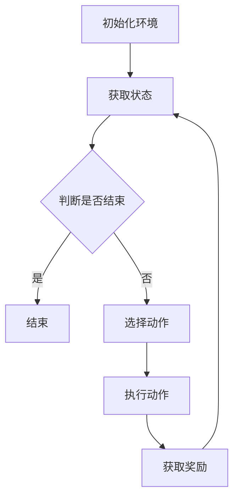

                 


### 文章标题

《强化学习在智能金融算法交易与策略优化中的建模方法与应用》

### 关键词

强化学习，智能金融，算法交易，策略优化，建模方法

### 摘要

本文旨在探讨强化学习在智能金融领域的应用，特别是在算法交易和策略优化中的建模方法。首先，我们将回顾强化学习的基础概念、基本算法和其在金融领域的应用概述。接着，我们将详细分析智能金融算法的基础知识，包括智能金融的定义、金融算法的类型和交易策略的优化方法。在此基础上，本文将深入探讨强化学习在金融交易中的建模方法，包括状态表示、动作空间和策略优化算法。此外，我们还将研究强化学习在金融风险控制和投资组合优化中的应用，以及其在金融市场预测中的建模方法。最后，我们将总结强化学习在金融领域的应用挑战和未来发展趋势，并分享一些实际案例和最佳实践。通过本文的探讨，读者将能够更好地理解强化学习在智能金融中的潜力和局限性。

### 第一部分：强化学习与智能金融概述

#### 第1章：强化学习基础

##### 1.1 强化学习的基本概念

强化学习是一种机器学习范式，它通过交互环境来学习最优策略。与监督学习和无监督学习不同，强化学习主要关注决策过程中的反馈信号，即奖励信号。强化学习的目标是通过不断的试错和经验积累，找到一种最优策略，使得总奖励最大化。

强化学习的基本概念包括四个要素：代理（Agent）、环境（Environment）、状态（State）、动作（Action）和奖励（Reward）。代理是执行决策的实体，环境是代理所处的世界，状态是环境当前的状态描述，动作是代理能够执行的行为，奖励是代理在执行动作后获得的即时奖励。

强化学习与传统机器学习的区别在于，传统机器学习依赖于预先标记好的数据集，而强化学习则通过与环境互动来学习。此外，强化学习更加注重长期奖励，而不是短期的局部最优。

##### 1.2 强化学习的基本算法

强化学习有多种不同的算法，以下是其中一些常用的算法：

1. **Q-Learning算法**：Q-Learning是一种基于值函数的强化学习算法，通过学习状态-动作值函数来优化策略。该算法使用经验回放和探索-探索策略来平衡探索和利用。

2. **SARSA算法**：SARSA（同步优势响应样例）算法是一种基于策略的强化学习算法，它使用当前状态和动作的值来更新策略。SARSA算法可以避免Q-Learning算法中可能出现的偏差。

3. **Deep Q-Networks（DQN）算法**：DQN算法是一种基于深度学习的强化学习算法，它使用神经网络来近似状态-动作值函数。DQN算法通过目标网络和经验回放机制来提高训练的稳定性。

4. **Policy Gradient算法**：Policy Gradient算法是一种基于策略的强化学习算法，它直接优化策略函数的参数，以最大化长期奖励。Policy Gradient算法存在不稳定和梯度消失等问题。

##### 1.3 强化学习在金融领域的应用概述

强化学习在金融领域有着广泛的应用，特别是在算法交易和策略优化方面。以下是强化学习在金融领域的一些应用场景：

1. **算法交易**：强化学习可以用于构建自适应的交易策略，通过分析市场数据和历史交易记录，自动生成最优的交易信号。这些策略可以根据市场的变化进行调整，以实现风险控制和收益最大化。

2. **策略优化**：强化学习可以用于优化现有的交易策略，通过学习不同策略的表现，选择最优的策略组合。策略优化可以帮助投资者更好地应对市场变化，提高交易的成功率。

3. **风险管理**：强化学习可以用于风险管理，通过学习市场的风险特征，构建有效的风险控制策略。这些策略可以自动调整投资组合，以降低风险并保持稳定的收益。

4. **市场预测**：强化学习可以用于金融市场预测，通过分析市场数据，预测未来市场的走势。这些预测可以帮助投资者制定更合理的交易策略，提高交易的成功率。

#### 第2章：智能金融算法基础

##### 2.1 智能金融的基本概念

智能金融是一种结合了人工智能、大数据和金融知识的跨学科领域，它利用先进的技术手段，为金融行业提供智能化、自动化和高效化的解决方案。智能金融的核心是金融算法，这些算法通过分析大量的数据，提供交易策略、风险管理、市场预测等服务。

智能金融的发展历程可以分为三个阶段：

1. **传统金融阶段**：在这个阶段，金融行业主要依靠经验和直觉进行决策，数据分析和计算能力有限。

2. **智能金融初步阶段**：在这个阶段，金融行业开始利用计算机技术和算法来辅助决策，如量化交易、风险评估等。

3. **智能金融成熟阶段**：在这个阶段，金融行业已经全面实现了智能化，算法和数据分析成为了金融决策的核心。

##### 2.2 金融算法的常见类型

金融算法可以分为传统金融算法和智能金融算法两大类。

1. **传统金融算法**：传统金融算法主要包括基于统计学和概率论的模型，如资本资产定价模型（CAPM）、套利定价理论（APT）等。这些算法主要用于风险评估、投资组合优化等。

2. **智能金融算法**：智能金融算法主要包括基于机器学习和人工智能的模型，如神经网络、深度学习、强化学习等。这些算法可以处理大量的数据，提供更精准的交易策略和预测。

强化学习在金融算法中的应用主要集中在策略优化和风险管理方面。通过学习市场数据和历史交易记录，强化学习算法可以生成自适应的交易策略，帮助投资者在复杂的市场环境中做出更好的决策。

##### 2.3 智能金融算法的交易策略

智能金融算法的交易策略可以分为基于数据和基于模型的两类。

1. **基于数据的交易策略**：基于数据的交易策略主要依赖于历史数据和统计模型，如移动平均、相对强弱指数（RSI）等。这些策略通过对历史数据进行挖掘和分析，生成交易信号。

2. **基于模型的交易策略**：基于模型的交易策略主要依赖于机器学习和人工智能模型，如神经网络、深度学习、强化学习等。这些策略通过学习大量的市场数据，生成自适应的交易策略。

强化学习在交易策略优化中的应用主要体现在以下几个方面：

1. **策略评估**：强化学习算法可以评估不同交易策略的表现，选择最优的策略组合。

2. **策略迭代**：强化学习算法可以通过不断的迭代和优化，改进交易策略的表现。

3. **策略优化算法的选择**：不同的强化学习算法适用于不同的交易场景，如DQN算法适合处理复杂的市场环境，Policy Gradient算法适合处理动态变化的市场环境。

通过强化学习算法的优化，智能金融算法可以更好地适应市场变化，提高交易的成功率。

### 第二部分：强化学习在金融交易中的建模方法

#### 第3章：强化学习在金融交易中的建模方法

##### 3.1 强化学习在金融交易中的应用

强化学习在金融交易中有着广泛的应用，主要包括股票交易、外汇交易和期货交易等。

1. **股票交易**：股票交易中的强化学习算法可以通过分析股票市场的历史数据，学习最优的买卖策略。这些算法可以自动执行买卖操作，实现自动交易。

2. **外汇交易**：外汇交易中的强化学习算法可以通过学习外汇市场的价格变化规律，生成最优的交易策略。这些算法可以在不同货币对之间进行交易，实现跨市场的收益最大化。

3. **期货交易**：期货交易中的强化学习算法可以通过分析期货市场的价格走势，生成最优的交易策略。这些算法可以在不同期货品种之间进行交易，实现跨品种的收益最大化。

强化学习在金融交易中的应用具有以下几个特点：

1. **自适应**：强化学习算法可以根据市场的变化，自动调整交易策略，实现自适应交易。

2. **高效**：强化学习算法可以通过大量的历史数据训练，快速学习市场规律，实现高效交易。

3. **稳健**：强化学习算法通过学习市场的长期趋势，可以避免短期市场波动带来的风险，实现稳健交易。

##### 3.2 金融交易中的状态表示

状态表示是强化学习在金融交易中建模的重要环节。状态表示的目的是将金融市场的复杂信息转化为代理可以处理的形式。

1. **状态的特征提取**：状态的特征提取是状态表示的关键。通过提取市场的关键信息，如价格、成交量、涨跌幅度等，可以将复杂的市场信息简化为若干个特征。

2. **状态空间的划分**：状态空间的划分是将特征转化为具体的状态表示。状态空间的划分可以通过聚类分析、主成分分析等方法实现。

3. **状态的价值函数**：状态的价值函数是衡量状态好坏的指标。通过学习状态的价值函数，代理可以知道在当前状态下采取不同动作的预期收益。状态的价值函数可以通过Q-Learning算法、DQN算法等方法学习得到。

##### 3.3 金融交易中的动作空间

动作空间是强化学习在金融交易中建模的另一个重要环节。动作空间表示代理可以执行的所有动作。

1. **动作的选择**：动作的选择是根据状态的价值函数来确定的。代理会根据当前状态的价值函数，选择具有最高预期收益的动作。

2. **动作的限制**：动作的限制是为了避免交易中的风险。例如，在股票交易中，动作可以是买入、卖出、持有等，但在外汇交易中，动作可以是买入、卖出、平仓等。

3. **动作的价值评估**：动作的价值评估是衡量动作好坏的指标。通过学习动作的价值函数，代理可以知道在当前状态下执行不同动作的预期收益。动作的价值函数可以通过Q-Learning算法、DQN算法等方法学习得到。

##### 3.4 强化学习在金融交易中的策略优化

策略优化是强化学习在金融交易中的核心目标。策略优化的目的是通过不断的学习和调整，找到最优的交易策略。

1. **策略评估**：策略评估是通过模拟交易过程，评估不同策略的表现。策略评估可以通过回测来实现，即使用历史数据来评估策略的效果。

2. **策略迭代**：策略迭代是通过反复执行策略评估和调整，逐步优化交易策略。策略迭代可以通过Q-Learning算法、DQN算法等方法实现。

3. **策略优化算法的选择**：不同的策略优化算法适用于不同的交易场景。例如，Q-Learning算法适合处理简单交易场景，而DQN算法适合处理复杂交易场景。

通过策略优化，强化学习可以在金融交易中实现自适应、高效和稳健的交易策略，为投资者提供更好的交易体验。

### 第三部分：强化学习在金融风险控制中的应用

#### 第4章：强化学习在金融风险控制中的应用

##### 4.1 金融风险控制的基本概念

金融风险控制是金融领域的重要环节，它涉及到如何识别、评估和管理金融风险。金融风险可以分为以下几种类型：

1. **市场风险**：市场风险是指由于市场波动导致金融资产价值波动的风险。市场风险包括利率风险、汇率风险、股票价格波动风险等。

2. **信用风险**：信用风险是指由于借款人无法按时还款导致的风险。信用风险包括违约风险、信用等级下降风险等。

3. **操作风险**：操作风险是指由于操作失误、系统故障、管理不善等原因导致的风险。操作风险包括系统故障风险、欺诈风险、管理风险等。

金融风险控制的方法主要包括以下几种：

1. **风险识别**：风险识别是风险控制的第一步，它涉及到如何发现和识别潜在的风险。

2. **风险评估**：风险评估是对风险的大小和影响进行评估，以确定风险的优先级。

3. **风险规避**：风险规避是通过避免可能的风险来降低风险。

4. **风险转移**：风险转移是通过保险、担保等方式将风险转移给第三方。

5. **风险接受**：风险接受是在风险可控的情况下，接受一定的风险。

##### 4.2 强化学习在金融风险控制中的应用

强化学习在金融风险控制中的应用主要体现在以下几个方面：

1. **信贷风险控制**：强化学习可以通过分析借款人的信用记录、财务状况等信息，学习最优的信贷风险评估策略。这些策略可以帮助金融机构降低信贷风险，提高信贷收益。

2. **市场风险控制**：强化学习可以通过分析市场的波动规律，学习最优的市场风险控制策略。这些策略可以帮助金融机构降低市场风险，保持稳定的收益。

3. **操作风险控制**：强化学习可以通过分析操作失误、系统故障等操作风险因素，学习最优的操作风险控制策略。这些策略可以帮助金融机构降低操作风险，确保系统的稳定运行。

##### 4.3 强化学习在金融风险控制中的建模方法

强化学习在金融风险控制中的建模方法主要包括以下几个方面：

1. **风险状态的表示**：风险状态的表示是将金融风险信息转化为代理可以处理的形式。这可以通过提取风险因素的特征，构建状态空间来实现。

2. **风险动作的选择**：风险动作的选择是代理在风险控制过程中可以执行的操作。例如，在信贷风险控制中，风险动作可以是批准贷款、拒绝贷款、调整贷款利率等。

3. **风险价值函数的构建**：风险价值函数是衡量风险动作好坏的指标。通过学习风险价值函数，代理可以知道在当前状态下执行不同风险动作的预期收益。

强化学习在金融风险控制中的应用可以帮助金融机构降低风险，提高收益，实现稳健的金融运营。

### 第四部分：强化学习在金融投资组合优化中的应用

#### 第5章：强化学习在金融投资组合优化中的应用

##### 5.1 金融投资组合优化概述

金融投资组合优化是金融领域的重要研究内容，它涉及到如何构建最优的投资组合，以实现风险和收益的最优平衡。投资组合优化可以分为以下几个步骤：

1. **资产选择**：资产选择是投资组合优化的第一步，它涉及到如何从众多资产中选择具有较高收益和较低风险的资产。

2. **资产配置**：资产配置是在资产选择的基础上，确定每种资产在投资组合中的比例，以实现整体投资组合的风险和收益平衡。

3. **风险控制**：风险控制是投资组合优化的关键，它涉及到如何通过风险管理措施降低投资组合的整体风险。

4. **收益评估**：收益评估是对投资组合表现进行评估，以确定其是否达到预期收益。

##### 5.2 强化学习在投资组合优化中的应用

强化学习在投资组合优化中的应用主要体现在以下几个方面：

1. **资产配置**：强化学习可以通过分析市场数据和历史投资记录，学习最优的资产配置策略。这些策略可以帮助投资者在不同资产之间进行合理的配置，实现收益的最大化。

2. **资产选择**：强化学习可以通过分析市场数据和历史投资记录，学习最优的资产选择策略。这些策略可以帮助投资者选择具有较高收益和较低风险的资产。

3. **风险控制**：强化学习可以通过分析市场数据和历史投资记录，学习最优的风险控制策略。这些策略可以帮助投资者降低整体投资组合的风险。

##### 5.3 强化学习在投资组合优化中的建模方法

强化学习在投资组合优化中的建模方法主要包括以下几个方面：

1. **投资组合状态的表示**：投资组合状态的表示是将投资组合的信息转化为代理可以处理的形式。这可以通过提取市场数据、资产价格等特征来实现。

2. **投资组合动作的选择**：投资组合动作的选择是代理在投资组合优化过程中可以执行的操作。例如，在资产配置中，动作可以是增加或减少某种资产的投资比例。

3. **投资组合价值函数的构建**：投资组合价值函数是衡量投资组合好坏的指标。通过学习投资组合价值函数，代理可以知道在当前状态下执行不同投资组合动作的预期收益。

强化学习在投资组合优化中的应用可以帮助投资者构建最优的投资组合，实现风险和收益的最优平衡。

### 第五部分：强化学习在金融市场预测中的应用

#### 第6章：强化学习在金融市场预测中的应用

##### 6.1 金融市场预测概述

金融市场预测是金融领域的重要研究方向，它涉及到如何预测股票价格、外汇汇率、期货价格等金融市场的走势。金融市场预测具有重要的实际意义，它可以帮助投资者制定更合理的投资策略，降低投资风险，提高投资收益。

金融市场预测的方法可以分为以下几类：

1. **传统预测方法**：传统预测方法主要包括统计学方法、时间序列分析法等。这些方法通过分析历史数据和统计规律，预测未来市场的走势。

2. **机器学习方法**：机器学习方法通过学习大量的历史数据，建立预测模型，预测未来市场的走势。常用的机器学习方法包括线性回归、神经网络、支持向量机等。

3. **深度学习方法**：深度学习方法通过学习大量的数据，建立深度神经网络模型，预测未来市场的走势。深度学习方法具有强大的非线性拟合能力，可以处理复杂的数据关系。

4. **强化学习方法**：强化学习方法通过学习市场数据和历史交易记录，学习最优的交易策略，预测未来市场的走势。强化学习方法可以处理动态变化的市场环境，适应市场变化。

##### 6.2 强化学习在金融市场预测中的应用

强化学习在金融市场预测中的应用主要体现在以下几个方面：

1. **股票市场预测**：强化学习可以通过分析股票市场的历史数据，学习最优的交易策略，预测未来股票价格的走势。

2. **外汇市场预测**：强化学习可以通过分析外汇市场的历史数据，学习最优的交易策略，预测未来外汇汇率的走势。

3. **期货市场预测**：强化学习可以通过分析期货市场的历史数据，学习最优的交易策略，预测未来期货价格的走势。

强化学习在金融市场预测中的应用具有以下优势：

1. **自适应**：强化学习可以适应市场的变化，不断调整预测模型，提高预测的准确性。

2. **高效**：强化学习可以通过大量的历史数据训练，快速学习市场规律，提高预测效率。

3. **稳健**：强化学习通过学习市场的长期趋势，可以避免短期市场波动带来的预测偏差。

##### 6.3 强化学习在金融市场预测中的建模方法

强化学习在金融市场预测中的建模方法主要包括以下几个方面：

1. **预测状态的表示**：预测状态的表示是将市场数据转化为代理可以处理的形式。这可以通过提取市场数据、交易记录等特征来实现。

2. **预测动作的选择**：预测动作的选择是代理在预测过程中可以执行的操作。例如，在股票市场预测中，动作可以是买入、卖出、持有等。

3. **预测价值函数的构建**：预测价值函数是衡量预测动作好坏的指标。通过学习预测价值函数，代理可以知道在当前状态下执行不同预测动作的预期收益。

强化学习在金融市场预测中的应用可以帮助投资者更好地了解市场趋势，制定更合理的投资策略，提高投资收益。

### 第六部分：强化学习在金融领域的应用挑战与未来发展

#### 第7章：强化学习在金融领域的应用挑战与未来发展

##### 7.1 强化学习在金融领域的应用挑战

尽管强化学习在金融领域展现出了巨大的潜力，但其应用仍面临诸多挑战：

1. **数据获取和处理**：金融市场的数据非常庞大且复杂，获取和处理这些数据需要高效的数据处理技术和算法。此外，数据的质量和完整性也直接影响强化学习模型的效果。

2. **模型解释性和可解释性**：强化学习模型通常非常复杂，难以解释其决策过程。这给金融领域的应用带来了困难，特别是在需要遵循严格监管和合规要求的背景下。

3. **道德和伦理问题**：强化学习在金融领域的应用可能会导致不公平的交易策略，或者对市场产生不良影响。因此，确保其应用的道德和伦理标准是一个重要的挑战。

4. **市场波动和不确定性**：金融市场存在高度的不确定性和波动性，强化学习模型需要具备很强的鲁棒性和适应性，以应对这些挑战。

##### 7.2 强化学习在金融领域的未来发展趋势

随着技术的不断进步，强化学习在金融领域的应用将迎来以下几个发展趋势：

1. **新型算法的研究与应用**：研究者将继续探索和开发新型的强化学习算法，以提高模型在金融交易中的性能和适应性。例如，基于深度学习的强化学习算法、混合增强学习模型等。

2. **强化学习与其他领域技术的融合**：强化学习将与大数据分析、区块链技术、云计算等前沿技术相结合，为金融领域带来更多创新应用。

3. **强化学习在金融监管中的应用**：随着监管技术的进步，强化学习将越来越多地被应用于金融监管，以帮助监管机构更好地识别和防范金融风险。

##### 7.3 强化学习在金融领域的实践案例分析

为了更好地理解强化学习在金融领域的应用，以下是一些实践案例的分析：

1. **某银行的风险控制实践**：某银行使用强化学习算法优化其信贷风险评估模型，通过分析借款人的信用历史、财务状况等数据，实现了更准确的风险评估，降低了不良贷款率。

2. **某投资机构的投资组合优化实践**：某投资机构使用强化学习算法优化其投资组合策略，通过对市场数据的学习和预测，实现了更稳定和高效的收益。

3. **某金融机构的市场预测实践**：某金融机构使用强化学习算法预测股票市场的走势，通过分析历史价格、成交量等数据，提高了市场预测的准确性。

这些实践案例展示了强化学习在金融领域的实际应用效果，同时也强调了在应用过程中需要解决的挑战和问题。

### 附录

#### 附录 A：强化学习与金融相关算法工具和资源

以下是强化学习在金融领域的一些常用算法工具和资源：

1. **主流强化学习框架**：
   - OpenAI Gym：提供各种强化学习环境和基准测试。
   - Stable Baselines：一个流行的强化学习算法库，支持多种强化学习算法。
   - Stable Baselines3：Stable Baselines的升级版，支持Python 3和TensorFlow 2。

2. **强化学习在金融领域的开源代码与数据集**：
   - OpenFinLab：一个开源的金融数据集和强化学习环境。
   - FinRL：一个基于PyTorch的金融强化学习框架。

3. **强化学习在金融领域的相关论文和报告**：
   - 《强化学习在金融风险管理中的应用》
   - 《强化学习在算法交易中的应用研究》
   - 《基于强化学习的金融投资组合优化》

#### 附录 B：数学模型和数学公式

以下是强化学习在金融交易中的基本数学模型和公式：

1. **强化学习的基本数学模型**：
   - 状态转移概率：$$P(S_{t+1} = s_{t+1} | S_t = s_t, A_t = a_t)$$
   - 收益期望：$$E[R_t | S_t = s_t, A_t = a_t]$$

2. **价值函数与策略优化的数学公式**：
   - 状态-动作值函数：$$Q^*(s, a) = \sum_{s'} p(s' | s, a) \cdot [R(s', a) + \gamma \cdot \max_{a'} Q^*(s', a')]$$
   - 策略优化：$$\pi^*(s) = \arg \max_{a} Q^*(s, a)$$

3. **强化学习在金融交易中的状态转移概率和收益期望**：
   - 状态转移概率：$$P(S_{t+1} = s_{t+1} | S_t = s_t, A_t = a_t) = f(s_{t+1} | s_t, a_t)$$
   - 收益期望：$$E[R_t | S_t = s_t, A_t = a_t] = \sum_{r \in R} r \cdot p(r | s_t, a_t)$$

#### 附录 C：代码示例

以下是强化学习在金融交易中的伪代码示例：

```python
# 强化学习在金融交易中的伪代码示例

# 初始化环境
env = FinancialTradingEnvironment()

# 初始化代理
agent = QLearningAgent()

# 开始训练
for episode in range(num_episodes):
    state = env.reset()
    done = False
    
    while not done:
        action = agent.select_action(state)
        next_state, reward, done = env.step(action)
        
        agent.update_q_value(state, action, next_state, reward)
        state = next_state

# 测试代理的性能
state = env.reset()
while not done:
    action = agent.select_action(state)
    next_state, reward, done = env.step(action)
    print(f"Action: {action}, Reward: {reward}")
    state = next_state
```

通过这些代码示例，可以更好地理解强化学习在金融交易中的应用过程。

### 作者信息

作者：AI天才研究院/AI Genius Institute & 禅与计算机程序设计艺术 /Zen And The Art of Computer Programming

### 结束语

本文从强化学习的基础概念、智能金融算法基础、金融交易中的建模方法、金融风险控制中的应用、投资组合优化中的应用、金融市场预测中的应用，以及应用挑战与未来发展等方面，全面探讨了强化学习在金融领域的应用。通过本文的探讨，读者可以更好地理解强化学习在金融领域的潜力和局限性，为今后的研究和应用提供参考。希望本文能为强化学习在金融领域的深入研究提供一些启示和帮助。

### Mermaid 流程图：强化学习在金融交易中的应用流程



此流程图展示了强化学习在金融交易中的基本应用流程，包括初始化环境、获取状态、选择动作、执行动作、获取奖励和更新状态等步骤。通过这些步骤，代理可以不断学习和优化其交易策略，实现金融交易的目标。

