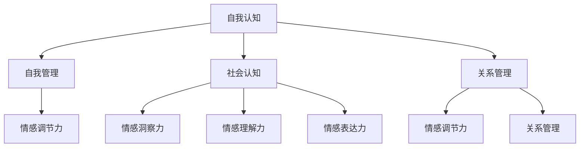

                 

### 情商领导：理解并管理情绪的能力

在当今快速变化和竞争激烈的商业环境中，领导者的情商（EQ）能力已经成为组织成功的关键因素。情商领导（Emotional Intelligence Leadership）不仅仅是关于情感的管理，更是关于如何通过情感洞察、理解和调节来提升个人和团队效能的领导能力。本文旨在深入探讨情商领导的概念、重要性、核心要素及其提升策略，并提供实际应用案例和未来展望。

**关键词**：情商领导、情感智慧、领导力、团队效能、组织发展、跨文化管理

**摘要**：本文首先介绍了情商的定义及其在社会生活和领导力中的重要性。接着，我们分析了情商的结构，包括自我认知、自我管理、社会认知和关系管理四个维度，并详细阐述了情商领导力的核心要素。随后，文章提出了提升情商领导力的策略，从自我提升到团队和组织层面的提升。在第三部分，文章讨论了情商领导力在特定情境中的应用，如团队管理、人力资源管理、跨文化管理和变革管理。最后，文章展望了情商领导力的未来发展趋势，并为中国企业以及全球范围内的应用提供了具体建议。

### 第一部分：情商领导基础理论

#### 1.1 情商定义与重要性

**1.1.1 情商的概念**

情商，简称EQ，是指个体识别、理解、管理和表达情感的能力。与传统的智商（IQ）不同，情商关注的是人际交往和情感管理能力。情商的概念最早由心理学家约翰·梅耶（John Mayer）和彼得·萨洛维（Peter Salovey）在1990年提出，他们将其定义为“识别和理解自身及他人的情感，对情感进行合理的调节，以及利用情感促进思维能力的综合能力”。

**1.1.2 情商与智商的关系**

情商和智商是两种不同的能力，但它们之间存在密切的联系。智商主要衡量个体的认知能力和逻辑思维能力，而情商则更多地涉及到情感领域。研究表明，情商和智商之间存在正相关关系，但两者并不是完全独立的。在某些情况下，情商甚至可以弥补智商的不足。例如，一个智商较高但情商较低的人可能在工作中表现出色，但在团队合作和人际关系管理方面可能面临挑战。

**1.1.3 情商在社会生活中的作用**

情商在社会生活中的作用不可忽视。首先，情商是建立和维持人际关系的基础。一个情商高的人能够更好地理解和满足他人的情感需求，从而建立稳定和和谐的人际关系。其次，情商对个体的心理健康有积极影响。通过有效管理自己的情感，个体能够更好地应对压力和挫折，减少焦虑和抑郁的发生。最后，情商在领导力中的重要性日益凸显。情商高的领导者能够更好地理解员工的需求和情感，建立信任和合作关系，提高团队凝聚力和工作效率。

#### 1.2 情商结构分析

情商的结构可以分解为四个主要维度：自我认知、自我管理、社会认知和关系管理。

**1.2.1 自我认知**

自我认知是指个体对自己的情感、思维和行为进行深刻理解和认识。自我认知的深度和广度决定了个体在情感管理中的能力。一个高自我认知的人能够更好地识别自己的情绪状态，理解情绪背后的原因，从而采取更有效的调节策略。

**1.2.2 自我管理**

自我管理是指个体在自我认知的基础上，对情感和行为进行有效的调节和控制。自我管理能力包括情绪调节、压力管理和目标设定等。一个高自我管理能力的人能够保持冷静和专注，即使在压力和挑战面前也能保持高效的工作状态。

**1.2.3 社会认知**

社会认知是指个体对他人情感的理解和识别能力。社会认知能力包括情感洞察力、同理心和情感理解力。一个高社会认知能力的人能够更好地感知和理解他人的情感状态，从而建立更有效的沟通和合作关系。

**1.2.4 关系管理**

关系管理是指个体在人际关系中运用情感智慧，建立和维护良好关系的能力。关系管理能力包括情感表达、冲突解决和团队合作等。一个高关系管理能力的人能够有效地处理人际冲突，建立信任和合作关系，提高团队效能。

#### 1.3 情商领导力的核心要素

情商领导力是指领导者运用情感智慧来提升个人和团队效能的能力。情商领导力的核心要素包括情感洞察力、情感理解力、情感表达力和情感调节力。

**1.3.1 情感洞察力**

情感洞察力是指领导者对情感的理解和感知能力。一个具有高情感洞察力的领导者能够敏锐地察觉团队成员的情绪变化，理解情绪背后的原因，并据此调整领导策略。

**1.3.2 情感理解力**

情感理解力是指领导者对他人情感的理解和识别能力。一个具有高情感理解力的领导者能够站在他人的角度思考问题，感受到他人的情感需求，从而建立更有效的沟通和合作关系。

**1.3.3 情感表达力**

情感表达力是指领导者表达情感的能力。一个具有高情感表达力的领导者能够清晰地表达自己的情感和需求，同时尊重和理解他人的情感和需求。

**1.3.4 情感调节力**

情感调节力是指领导者调节和管理情感的能力。一个具有高情感调节力的领导者能够在压力和挑战面前保持冷静和专注，有效地调节自己的情绪，从而保持高效的工作状态。

#### 1.4 情商领导力模型

情商领导力模型是一个综合框架，用于理解和评估领导者的情商能力。这个模型包括以下三个关键组成部分：情商领导力发展路径、情商领导力评价体系和情商领导力对企业的影响。

**1.4.1 情商领导力发展路径**

情商领导力的发展路径通常分为四个阶段：情感认知、情感管理、情感洞察和情感领导。在情感认知阶段，领导者开始意识到情感的重要性，并学习如何识别和管理自己的情感。在情感管理阶段，领导者掌握了基本的情感管理技能，能够有效地调节自己的情绪。在情感洞察阶段，领导者能够深入理解他人的情感，并运用情感洞察力来提升团队效能。在情感领导阶段，领导者将情感智慧应用于领导实践中，成为具有高度情商的领导者。

**1.4.2 情商领导力评价体系**

情商领导力评价体系用于评估领导者的情商能力。这个评价体系通常包括四个维度：自我认知、自我管理、社会认知和关系管理。每个维度都包含若干关键指标，如情感洞察力、情感理解力、情感表达力和情感调节力。通过量化评估，企业可以了解领导者的情商能力，并制定相应的提升策略。

**1.4.3 情商领导力对企业的影响**

情商领导力对企业的影响是深远和全面的。首先，情商高的领导者能够建立积极的组织文化，提高员工的满意度和忠诚度。其次，情商领导力能够提升团队协作和沟通效果，提高团队效能和创新能力。最后，情商领导力有助于企业在复杂多变的市场环境中保持竞争力，提升企业的持续发展能力。

### 第二部分：情商领导力提升策略

#### 2.1 情商领导力自我提升

情商领导力的自我提升是领导者发展的关键步骤。以下是自我提升的几个关键方面：

**2.1.1 自我认知与自我管理**

自我认知是情商的基础。领导者需要花时间了解自己的情感和行为模式，识别触发自己情绪的情境，并学习如何调节这些情绪。自我管理包括情绪调节、压力管理和目标设定。领导者可以通过冥想、深呼吸和运动等方式来提高自我管理能力。

**2.1.2 社会认知与关系管理**

社会认知涉及理解和识别他人的情感。领导者可以通过倾听、同理心和反馈来提升社会认知。关系管理则包括建立和维护良好的人际关系。领导者需要学会表达自己的情感和需求，同时理解和尊重他人的情感和需求。

**2.1.3 情感调节策略**

情感调节策略是领导者应对压力和挑战的重要工具。领导者可以采用认知重构、情绪释放和正向心理等方法来调节情绪。通过定期练习这些策略，领导者可以更好地应对各种挑战，保持冷静和专注。

**2.1.4 自我提升案例分析**

以下是一个自我提升案例：

**案例**：张伟是一位中层管理人员，他意识到自己在压力下容易情绪化，影响团队协作。于是，他开始参加情商培训，学习情绪调节技巧。通过冥想和深呼吸练习，他学会了在压力情境下保持冷静。同时，他通过积极的反馈和沟通，改善了与团队成员的关系。经过一年的努力，张伟的情商能力得到了显著提升，团队协作和绩效也显著提高。

#### 2.2 情商领导力团队提升

情商领导力的团队提升是提高团队效能的关键。以下是一些团队提升的策略：

**2.2.1 团队情商管理**

团队情商管理涉及创建一个支持情商发展的团队文化。领导者可以通过设定情商目标和提供培训来提升团队情商。此外，领导者可以鼓励团队成员分享情感体验，建立信任和合作关系。

**2.2.2 情感沟通技巧**

情感沟通技巧是团队情商管理的重要组成部分。领导者需要学会如何有效地表达情感和需求，同时倾听和理解他人的情感。通过情感沟通，团队成员可以更好地理解彼此，减少冲突，提高协作效率。

**2.2.3 情绪反馈与冲突管理**

情绪反馈和冲突管理是团队情商提升的关键环节。领导者需要学会如何给予积极和建设性的反馈，同时处理团队中的冲突。通过情绪反馈和冲突管理，团队可以更好地应对挑战，提高工作效率。

**2.2.4 团队情商建设案例**

以下是一个团队情商建设案例：

**案例**：李明是一家软件公司的部门经理，他意识到团队协作不佳，于是决定提升团队情商。他首先为团队成员提供情商培训，帮助他们了解情感管理和沟通技巧。随后，他建立了定期团队会议，鼓励团队成员分享情感体验和反馈。通过这些措施，团队的协作效率和士气显著提高，项目顺利完成。

#### 2.3 情商领导力组织提升

情商领导力的组织提升是提高企业整体绩效的关键。以下是一些组织提升的策略：

**2.3.1 企业文化塑造**

企业文化是组织提升情商的重要基础。领导者可以通过价值观的传递、激励机制和文化活动来塑造积极的企业文化。一个支持情商发展的企业文化能够提高员工的情感智慧，增强团队合作和创新能力。

**2.3.2 情商培训与教育**

情商培训和教育是组织提升情商的有效途径。领导者可以通过内部培训、外部培训和在线课程来提高员工的情商能力。通过持续的教育，员工可以不断学习和提升自己的情商，为企业创造更多价值。

**2.3.3 情商考核与激励机制**

情商考核和激励机制是组织提升情商的重要手段。领导者可以通过设定情商目标和考核标准来评估员工的情商能力，同时提供激励机制来鼓励员工提升情商。通过有效的考核和激励，企业可以培养出更多具有高情商的领导者。

**2.3.4 组织情商发展案例**

以下是一个组织情商发展案例：

**案例**：某家跨国公司意识到情商领导力对企业发展的重要性，于是决定全面提升员工的情商能力。他们为所有员工提供情商培训，并设立情商考核机制。通过这些措施，员工的人际关系和团队合作能力得到显著提升，企业绩效也实现了显著增长。

### 第三部分：情商领导力在特定情境中的应用

#### 3.1 情商领导力在团队管理中的应用

情商领导力在团队管理中的应用至关重要。以下是一些关键应用：

**3.1.1 团队建设与团队效能提升**

情商领导力有助于团队建设，提升团队效能。领导者可以通过情感洞察力了解团队成员的需求和情感状态，从而制定更有效的团队建设策略。通过情感调节力，领导者可以处理团队中的冲突，提高团队凝聚力。

**3.1.2 团队成员情绪管理**

情商领导力有助于领导者更好地管理团队成员的情绪。通过情感理解力，领导者可以理解团队成员的情绪，提供支持和鼓励。通过情感表达力，领导者可以明确表达对团队成员的情感和期望，促进沟通和理解。

**3.1.3 团队冲突处理**

情商领导力在处理团队冲突方面具有重要意义。领导者需要具备情感洞察力来识别冲突的根本原因，通过情感调节力和情感表达力来有效解决冲突。通过情感沟通技巧，领导者可以建立信任和合作关系，化解冲突。

#### 3.2 情商领导力在人力资源管理中的应用

情商领导力在人力资源管理中的应用越来越广泛。以下是一些关键应用：

**3.2.1 人才选拔与评估**

情商领导力有助于领导者更好地选拔和评估人才。通过情感洞察力和情感理解力，领导者可以识别候选人的情商能力，选择合适的候选人。通过情感表达力和情感调节力，领导者可以评估员工的情商表现，提供有针对性的反馈和培训。

**3.2.2 员工激励与留任**

情商领导力有助于领导者更好地激励员工，提高员工留任率。通过情感理解力和情感表达力，领导者可以了解员工的需求和情感状态，提供个性化的激励措施。通过情感调节力，领导者可以处理员工的情绪波动，保持良好的工作氛围。

**3.2.3 情绪劳动与心理健康**

情商领导力有助于领导者关注员工的情绪劳动和心理健康。通过情感洞察力和情感理解力，领导者可以识别员工的情绪负担，提供心理支持和帮助。通过情感表达力和情感调节力，领导者可以建立健康的工作环境，减少员工的心理压力。

#### 3.3 情商领导力在跨文化管理中的应用

情商领导力在跨文化管理中的应用越来越受到关注。以下是一些关键应用：

**3.3.1 跨文化情商认知**

情商领导力有助于领导者理解和识别跨文化背景下的情商差异。通过情感洞察力和情感理解力，领导者可以了解不同文化背景下的情感表达和沟通方式，避免文化冲突。

**3.3.2 跨文化沟通与冲突解决**

情商领导力在跨文化沟通和冲突解决中发挥着重要作用。领导者需要具备高情感洞察力和情感调节力，以应对跨文化背景下的复杂情境。通过情感表达力和情感沟通技巧，领导者可以建立有效的跨文化沟通渠道，解决文化冲突。

**3.3.3 跨文化团队建设**

情商领导力有助于领导者建设高效的跨文化团队。通过情感理解力和情感调节力，领导者可以促进团队成员之间的情感联系和合作。通过情感沟通技巧，领导者可以建立共同的目标和价值观，提高团队效能。

#### 3.4 情商领导力在变革管理中的应用

情商领导力在变革管理中的应用至关重要。以下是一些关键应用：

**3.4.1 变革中的情绪管理**

情商领导力有助于领导者管理变革过程中的情绪波动。通过情感洞察力和情感理解力，领导者可以识别员工的情绪反应，提供心理支持。通过情感表达力和情感调节力，领导者可以传达变革的必要性，减少员工的抵触情绪。

**3.4.2 变革领导力提升**

情商领导力有助于领导者提升变革领导力。通过情感洞察力和情感理解力，领导者可以识别变革的关键因素和阻力。通过情感表达力和情感调节力，领导者可以制定有效的变革策略，促进变革的顺利进行。

**3.4.3 变革过程中的情感反馈与调整**

情商领导力在变革过程中发挥着重要作用。通过情感反馈，领导者可以了解员工的情绪状态和反馈，及时调整变革策略。通过情感沟通技巧，领导者可以建立有效的沟通渠道，促进员工参与和认同变革。

### 第四部分：情商领导力的未来展望

#### 4.1 情商领导力发展趋势

情商领导力在未来将继续发展，其趋势包括：

**4.1.1 情商领导力研究前沿**

随着对情商研究的不断深入，情商领导力将出现更多创新理论和实践。例如，情感计算、人工智能和大数据分析等新技术将使情商评估和管理更加精确和高效。

**4.1.2 新技术对情商领导力的影响**

新技术，如人工智能和虚拟现实，将对情商领导力产生深远影响。通过情感计算和情感分析，领导者可以更准确地了解员工的情感状态，从而实施更有效的领导策略。

**4.1.3 未来情商领导力发展路径**

未来情商领导力的发展将更加注重个性化和定制化。领导者将更多地运用情感智慧，根据员工和团队的特点制定个性化的领导策略，提高领导效能。

#### 4.2 情商领导力在中国企业中的应用

在中国，情商领导力正逐渐成为企业管理的重要工具。以下是一些具体应用：

**4.2.1 中国企业文化背景**

中国企业的文化背景多样，包括儒家文化、西方管理理论和现代企业文化。情商领导力在中国企业中的应用需要结合这些文化背景，制定适合的领导策略。

**4.2.2 中国企业情商领导力实践**

中国企业正在积极探索情商领导力的应用。许多企业已经开展了情商培训和评估，并将情商能力纳入员工选拔和晋升标准。这些实践有助于提升员工的情感智慧，提高企业的整体绩效。

**4.2.3 中国企业情商领导力发展前景**

随着中国企业在全球市场的竞争力不断提升，情商领导力将发挥更加重要的作用。未来，中国企业将更加注重情商领导力的培养和应用，以提升企业的核心竞争力。

#### 4.3 情商领导力在全球范围内的应用

情商领导力在全球范围内的应用正在不断扩大。以下是一些关键趋势：

**4.3.1 全球企业情商领导力现状**

全球范围内的企业正在逐渐认识到情商领导力的重要性。许多企业已经开始实施情商培训和评估，并将情商能力纳入领导力发展计划。

**4.3.2 全球情商领导力发展趋势**

全球情商领导力的发展趋势包括：更加注重情感智慧的应用、强调跨文化情商管理、以及利用新技术提高情商评估和管理的效率。

**4.3.3 全球情商领导力跨文化合作**

全球情商领导力的跨文化合作日益增多。跨国企业通过跨文化情商管理，提高了团队的协作效率和创新能力，从而在全球市场中取得了竞争优势。

### 附录

#### 附录A：情商领导力相关资源与工具

**A.1 情商领导力研究文献推荐**

1. Mayer, J. D., Salovey, P., & Caruso, D. R. (1997). "Emotional intelligence: Theory, findings, and implications." Psychological Inquiry, 8(4), 201-208.
2. Goleman, D. (1995). "Emotional Intelligence: Why It Can Matter More Than IQ." Bantam Books.

**A.2 情商领导力培训与认证机构介绍**

1. Center for Creative Leadership (CCL)
2. American Management Association (AMA)
3. Emotional Intelligence Institute

**A.3 情商领导力测评工具推荐**

1. Mayer-Salovey-Caruso Emotional Intelligence Test (MSCEIT)
2. Bar-On Emotional Quotient Inventory (EQ-i 2.0)

#### 附录B：情商领导力实践指南

**B.1 情商领导力自我提升指南**

1. 定期自我反思，识别情感和行为模式。
2. 学习情绪调节技巧，如冥想、深呼吸和正念练习。
3. 阅读相关书籍和参加情商培训。

**B.2 团队情商提升指南**

1. 设立情商目标和考核标准。
2. 提供情商培训，提高团队成员的情商能力。
3. 鼓励团队成员分享情感体验，建立信任和合作关系。

**B.3 组织情商提升指南**

1. 塑造支持情商发展的企业文化。
2. 设立情商领导力发展计划，提高领导者的情商能力。
3. 利用情商测评工具，评估员工的情商水平。

**B.4 情商领导力常见问题解答**

1. 情商和智商有什么区别？
2. 如何提升自我认知和自我管理能力？
3. 如何在团队中应用情商领导力？

### 结尾

情商领导力在当今商业环境中发挥着越来越重要的作用。通过提升情商领导力，领导者可以更好地理解和管理自己的情感，提高团队和组织的效能，实现企业的长期发展。希望本文能够为读者提供有价值的见解和实用的策略，帮助他们在领导实践中取得更好的成果。

**作者：AI天才研究院/AI Genius Institute & 禅与计算机程序设计艺术 /Zen And The Art of Computer Programming**### 情商领导力：理解并管理情绪的能力

#### 关键词：情商领导、情感智慧、领导力、团队效能、组织发展

#### 摘要：

本文深入探讨了情商领导力的概念、重要性以及其在实际应用中的提升策略。情商领导力不仅仅关乎情感的管理，更是一种通过情感洞察、理解和调节来提升个人和团队效能的领导能力。文章首先介绍了情商的定义与重要性，分析了情商的结构及其在领导力中的核心要素。随后，文章提出了自我提升、团队提升和组织提升的策略，并讨论了情商领导力在特定情境中的应用。最后，文章展望了情商领导力的未来发展趋势，为中国企业及全球范围内的应用提供了具体建议。通过本文，读者可以更好地理解情商领导力的重要性，并学会如何在实际工作中应用和提升这一关键能力。

### 第一部分：情商领导基础理论

#### 1.1 情商定义与重要性

**1.1.1 情商的概念**

情商，简称EQ，是指个体识别、理解、管理和表达情感的能力。它与传统的智商（IQ）不同，IQ主要衡量个体的认知能力和逻辑思维能力，而EQ则专注于情感领域。情商最早由心理学家约翰·梅耶（John Mayer）和彼得·萨洛维（Peter Salovey）在1990年提出，他们将其定义为“识别和理解自身及他人的情感，对情感进行合理的调节，以及利用情感促进思维能力的综合能力”。

**1.1.2 情商与智商的关系**

情商和智商虽然关注不同的能力领域，但两者之间有着密切的联系。研究表明，情商和智商之间存在正相关关系，这意味着情商高的人通常智商也较高。然而，两者并不是完全独立的。在某些情况下，情商可以弥补智商的不足。例如，一个智商较高但情商较低的人可能在学术上表现出色，但在人际关系和领导力方面可能面临挑战。反之，情商高的人能够在人际交往和团队合作中发挥优势，即使智商稍低也能取得成功。

**1.1.3 情商在社会生活中的作用**

情商在社会生活中的作用不可忽视。首先，情商是建立和维持人际关系的基础。一个情商高的人能够更好地理解和满足他人的情感需求，从而建立稳定和和谐的人际关系。其次，情商对个体的心理健康有积极影响。通过有效管理自己的情感，个体能够更好地应对压力和挫折，减少焦虑和抑郁的发生。最后，情商在领导力中的重要性日益凸显。情商高的领导者能够更好地理解员工的需求和情感，建立信任和合作关系，提高团队凝聚力和工作效率。

#### 1.2 情商结构分析

情商的结构可以分解为四个主要维度：自我认知、自我管理、社会认知和关系管理。

**1.2.1 自我认知**

自我认知是指个体对自己的情感、思维和行为进行深刻理解和认识。自我认知的深度和广度决定了个体在情感管理中的能力。一个高自我认知的人能够更好地识别自己的情绪状态，理解情绪背后的原因，从而采取更有效的调节策略。

**1.2.2 自我管理**

自我管理是指个体在自我认知的基础上，对情感和行为进行有效的调节和控制。自我管理能力包括情绪调节、压力管理和目标设定等。自我管理能力强的个体能够保持冷静和专注，即使在压力和挑战面前也能保持高效的工作状态。

**1.2.3 社会认知**

社会认知是指个体对他人情感的理解和识别能力。社会认知能力包括情感洞察力、同理心和情感理解力。一个高社会认知能力的个体能够敏锐地感知和理解他人的情感状态，从而建立更有效的沟通和合作关系。

**1.2.4 关系管理**

关系管理是指个体在人际关系中运用情感智慧，建立和维护良好关系的能力。关系管理能力包括情感表达、冲突解决和团队合作等。一个高关系管理能力的人能够有效地处理人际冲突，建立信任和合作关系，提高团队效能。

#### 1.3 情商领导力的核心要素

情商领导力是指领导者运用情感智慧来提升个人和团队效能的能力。情商领导力的核心要素包括情感洞察力、情感理解力、情感表达力和情感调节力。

**1.3.1 情感洞察力**

情感洞察力是指领导者对情感的理解和感知能力。一个具有高情感洞察力的领导者能够敏锐地察觉团队成员的情绪变化，理解情绪背后的原因，并据此调整领导策略。

**1.3.2 情感理解力**

情感理解力是指领导者对他人情感的理解和识别能力。一个具有高情感理解力的领导者能够站在他人的角度思考问题，感受到他人的情感需求，从而建立更有效的沟通和合作关系。

**1.3.3 情感表达力**

情感表达力是指领导者表达情感的能力。一个具有高情感表达力的领导者能够清晰地表达自己的情感和需求，同时尊重和理解他人的情感和需求。

**1.3.4 情感调节力**

情感调节力是指领导者调节和管理情感的能力。一个具有高情感调节力的领导者能够在压力和挑战面前保持冷静和专注，有效地调节自己的情绪，从而保持高效的工作状态。

#### 1.4 情商领导力模型

情商领导力模型是一个综合框架，用于理解和评估领导者的情商能力。这个模型包括以下三个关键组成部分：情商领导力发展路径、情商领导力评价体系和情商领导力对企业的影响。

**1.4.1 情商领导力发展路径**

情商领导力的发展路径通常分为四个阶段：情感认知、情感管理、情感洞察和情感领导。在情感认知阶段，领导者开始意识到情感的重要性，并学习如何识别和管理自己的情感。在情感管理阶段，领导者掌握了基本的情感管理技能，能够有效地调节自己的情绪。在情感洞察阶段，领导者能够深入理解他人的情感，并运用情感洞察力来提升团队效能。在情感领导阶段，领导者将情感智慧应用于领导实践中，成为具有高度情商的领导者。

**1.4.2 情商领导力评价体系**

情商领导力评价体系用于评估领导者的情商能力。这个评价体系通常包括四个维度：自我认知、自我管理、社会认知和关系管理。每个维度都包含若干关键指标，如情感洞察力、情感理解力、情感表达力和情感调节力。通过量化评估，企业可以了解领导者的情商能力，并制定相应的提升策略。

**1.4.3 情商领导力对企业的影响**

情商领导力对企业的影响是深远和全面的。首先，情商高的领导者能够建立积极的组织文化，提高员工的满意度和忠诚度。其次，情商领导力能够提升团队协作和沟通效果，提高团队效能和创新能力。最后，情商领导力有助于企业在复杂多变的市场环境中保持竞争力，提升企业的持续发展能力。

### 第二部分：情商领导力提升策略

#### 2.1 情商领导力自我提升

情商领导力的自我提升是领导者发展的关键步骤。以下是自我提升的几个关键方面：

**2.1.1 自我认知与自我管理**

自我认知是情商的基础。领导者需要花时间了解自己的情感和行为模式，识别触发自己情绪的情境，并学习如何调节这些情绪。自我管理包括情绪调节、压力管理和目标设定。领导者可以通过冥想、深呼吸和运动等方式来提高自我管理能力。

**2.1.2 社会认知与关系管理**

社会认知涉及理解和识别他人的情感。领导者可以通过倾听、同理心和反馈来提升社会认知。关系管理则包括建立和维护良好的人际关系。领导者需要学会表达自己的情感和需求，同时理解和尊重他人的情感和需求。

**2.1.3 情感调节策略**

情感调节策略是领导者应对压力和挑战的重要工具。领导者可以采用认知重构、情绪释放和正向心理等方法来调节情绪。通过定期练习这些策略，领导者可以更好地应对各种挑战，保持冷静和专注。

**2.1.4 自我提升案例分析**

以下是一个自我提升案例：

**案例**：张伟是一位中层管理人员，他意识到自己在压力下容易情绪化，影响团队协作。于是，他开始参加情商培训，学习情绪调节技巧。通过冥想和深呼吸练习，他学会了在压力情境下保持冷静。同时，他通过积极的反馈和沟通，改善了与团队成员的关系。经过一年的努力，张伟的情商能力得到了显著提升，团队协作和绩效也显著提高。

#### 2.2 情商领导力团队提升

情商领导力的团队提升是提高团队效能的关键。以下是一些团队提升的策略：

**2.2.1 团队情商管理**

团队情商管理涉及创建一个支持情商发展的团队文化。领导者可以通过设定情商目标和提供培训来提升团队情商。此外，领导者可以鼓励团队成员分享情感体验，建立信任和合作关系。

**2.2.2 情感沟通技巧**

情感沟通技巧是团队情商管理的重要组成部分。领导者需要学会如何有效地表达情感和需求，同时倾听和理解他人的情感。通过情感沟通，团队成员可以更好地理解彼此，减少冲突，提高协作效率。

**2.2.3 情绪反馈与冲突管理**

情绪反馈和冲突管理是团队情商提升的关键环节。领导者需要学会如何给予积极和建设性的反馈，同时处理团队中的冲突。通过情绪反馈和冲突管理，团队可以更好地应对挑战，提高工作效率。

**2.2.4 团队情商建设案例**

以下是一个团队情商建设案例：

**案例**：李明是一家软件公司的部门经理，他意识到团队协作不佳，于是决定提升团队情商。他首先为团队成员提供情商培训，帮助他们了解情感管理和沟通技巧。随后，他建立了定期团队会议，鼓励团队成员分享情感体验和反馈。通过这些措施，团队的协作效率和士气显著提高，项目顺利完成。

#### 2.3 情商领导力组织提升

情商领导力的组织提升是提高企业整体绩效的关键。以下是一些组织提升的策略：

**2.3.1 企业文化塑造**

企业文化是组织提升情商的重要基础。领导者可以通过价值观的传递、激励机制和文化活动来塑造积极的企业文化。一个支持情商发展的企业文化能够提高员工的情感智慧，增强团队合作和创新能力。

**2.3.2 情商培训与教育**

情商培训和教育是组织提升情商的有效途径。领导者可以通过内部培训、外部培训和在线课程来提高员工的情商能力。通过持续的教育，员工可以不断学习和提升自己的情商，为企业创造更多价值。

**2.3.3 情商考核与激励机制**

情商考核和激励机制是组织提升情商的重要手段。领导者可以通过设定情商目标和考核标准来评估员工的情商能力，同时提供激励机制来鼓励员工提升情商。通过有效的考核和激励，企业可以培养出更多具有高情商的领导者。

**2.3.4 组织情商发展案例**

以下是一个组织情商发展案例：

**案例**：某家跨国公司意识到情商领导力对企业发展的重要性，于是决定全面提升员工的情商能力。他们为所有员工提供情商培训，并设立情商考核机制。通过这些措施，员工的人际关系和团队合作能力得到显著提升，企业绩效也实现了显著增长。

### 第三部分：情商领导力在特定情境中的应用

#### 3.1 情商领导力在团队管理中的应用

情商领导力在团队管理中的应用至关重要。以下是一些关键应用：

**3.1.1 团队建设与团队效能提升**

情商领导力有助于团队建设，提升团队效能。领导者可以通过情感洞察力了解团队成员的需求和情感状态，从而制定更有效的团队建设策略。通过情感调节力，领导者可以处理团队中的冲突，提高团队凝聚力。

**3.1.2 团队成员情绪管理**

情商领导力有助于领导者更好地管理团队成员的情绪。通过情感理解力，领导者可以理解团队成员的情绪，提供支持和鼓励。通过情感表达力，领导者可以明确表达对团队成员的情感和期望，促进沟通和理解。

**3.1.3 团队冲突处理**

情商领导力在处理团队冲突方面具有重要意义。领导者需要具备情感洞察力来识别冲突的根本原因，通过情感调节力和情感表达力来有效解决冲突。通过情感沟通技巧，领导者可以建立信任和合作关系，化解冲突。

#### 3.2 情商领导力在人力资源管理中的应用

情商领导力在人力资源管理中的应用越来越广泛。以下是一些关键应用：

**3.2.1 人才选拔与评估**

情商领导力有助于领导者更好地选拔和评估人才。通过情感洞察力和情感理解力，领导者可以识别候选人的情商能力，选择合适的候选人。通过情感表达力和情感调节力，领导者可以评估员工的情商表现，提供有针对性的反馈和培训。

**3.2.2 员工激励与留任**

情商领导力有助于领导者更好地激励员工，提高员工留任率。通过情感理解力和情感表达力，领导者可以了解员工的需求和情感状态，提供个性化的激励措施。通过情感调节力，领导者可以处理员工的情绪波动，保持良好的工作氛围。

**3.2.3 情绪劳动与心理健康**

情商领导力有助于领导者关注员工的情绪劳动和心理健康。通过情感洞察力和情感理解力，领导者可以识别员工的情绪负担，提供心理支持和帮助。通过情感表达力和情感调节力，领导者可以建立健康的工作环境，减少员工的心理压力。

#### 3.3 情商领导力在跨文化管理中的应用

情商领导力在跨文化管理中的应用越来越受到关注。以下是一些关键应用：

**3.3.1 跨文化情商认知**

情商领导力有助于领导者理解和识别跨文化背景下的情商差异。通过情感洞察力和情感理解力，领导者可以了解不同文化背景下的情感表达和沟通方式，避免文化冲突。

**3.3.2 跨文化沟通与冲突解决**

情商领导力在跨文化沟通和冲突解决中发挥着重要作用。领导者需要具备高情感洞察力和情感调节力，以应对跨文化背景下的复杂情境。通过情感表达力和情感沟通技巧，领导者可以建立有效的跨文化沟通渠道，解决文化冲突。

**3.3.3 跨文化团队建设**

情商领导力有助于领导者建设高效的跨文化团队。通过情感理解力和情感调节力，领导者可以促进团队成员之间的情感联系和合作。通过情感沟通技巧，领导者可以建立共同的目标和价值观，提高团队效能。

#### 3.4 情商领导力在变革管理中的应用

情商领导力在变革管理中的应用至关重要。以下是一些关键应用：

**3.4.1 变革中的情绪管理**

情商领导力有助于领导者管理变革过程中的情绪波动。通过情感洞察力和情感理解力，领导者可以识别员工的情绪反应，提供心理支持。通过情感表达力和情感调节力，领导者可以传达变革的必要性，减少员工的抵触情绪。

**3.4.2 变革领导力提升**

情商领导力有助于领导者提升变革领导力。通过情感洞察力和情感理解力，领导者可以识别变革的关键因素和阻力。通过情感表达力和情感调节力，领导者可以制定有效的变革策略，促进变革的顺利进行。

**3.4.3 变革过程中的情感反馈与调整**

情商领导力在变革过程中发挥着重要作用。通过情感反馈，领导者可以了解员工的情绪状态和反馈，及时调整变革策略。通过情感沟通技巧，领导者可以建立有效的沟通渠道，促进员工参与和认同变革。

### 第四部分：情商领导力的未来展望

#### 4.1 情商领导力发展趋势

情商领导力在未来将继续发展，其趋势包括：

**4.1.1 情商领导力研究前沿**

随着对情商研究的不断深入，情商领导力将出现更多创新理论和实践。例如，情感计算、人工智能和大数据分析等新技术将使情商评估和管理更加精确和高效。

**4.1.2 新技术对情商领导力的影响**

新技术，如人工智能和虚拟现实，将对情商领导力产生深远影响。通过情感计算和情感分析，领导者可以更准确地了解员工的情感状态，从而实施更有效的领导策略。

**4.1.3 未来情商领导力发展路径**

未来情商领导力的发展将更加注重个性化和定制化。领导者将更多地运用情感智慧，根据员工和团队的特点制定个性化的领导策略，提高领导效能。

#### 4.2 情商领导力在中国企业中的应用

在中国，情商领导力正逐渐成为企业管理的重要工具。以下是一些具体应用：

**4.2.1 中国企业文化背景**

中国企业的文化背景多样，包括儒家文化、西方管理理论和现代企业文化。情商领导力在中国企业中的应用需要结合这些文化背景，制定适合的领导策略。

**4.2.2 中国企业情商领导力实践**

中国企业正在积极探索情商领导力的应用。许多企业已经开展了情商培训和评估，并将情商能力纳入员工选拔和晋升标准。这些实践有助于提升员工的情感智慧，提高企业的整体绩效。

**4.2.3 中国企业情商领导力发展前景**

随着中国企业在全球市场的竞争力不断提升，情商领导力将发挥更加重要的作用。未来，中国企业将更加注重情商领导力的培养和应用，以提升企业的核心竞争力。

#### 4.3 情商领导力在全球范围内的应用

情商领导力在全球范围内的应用正在不断扩大。以下是一些关键趋势：

**4.3.1 全球企业情商领导力现状**

全球范围内的企业正在逐渐认识到情商领导力的重要性。许多企业已经开始实施情商培训和评估，并将情商能力纳入领导力发展计划。

**4.3.2 全球情商领导力发展趋势**

全球情商领导力的发展趋势包括：更加注重情感智慧的应用、强调跨文化情商管理、以及利用新技术提高情商评估和管理的效率。

**4.3.3 全球情商领导力跨文化合作**

全球情商领导力的跨文化合作日益增多。跨国企业通过跨文化情商管理，提高了团队的协作效率和创新能力，从而在全球市场中取得了竞争优势。

### 附录

#### 附录A：情商领导力相关资源与工具

**A.1 情商领导力研究文献推荐**

1. Mayer, J. D., Salovey, P., & Caruso, D. R. (1997). "Emotional Intelligence: Theory, Findings, and Implications". Psychological Inquiry.
2. Goleman, D. (1995). "Emotional Intelligence: Why It Can Matter More Than IQ". Bantam Books.
3. Mayer, J. D., & Salovey, P. (1993). "The Intelligence of Emotional Intelligence". Intelligence, 17(4), 433-442.

**A.2 情商领导力培训与认证机构介绍**

1. Center for Creative Leadership (CCL)
2. American Management Association (AMA)
3. Institute for Health and Human Potential (IHHP)

**A.3 情商领导力测评工具推荐**

1. Mayer-Salovey-Caruso Emotional Intelligence Test (MSCEIT)
2. Bar-On Emotional Quotient Inventory (EQ-i 2.0)
3. Six Seconds Emotional Intelligence Assessment (6 Seconds EQi)

#### 附录B：情商领导力实践指南

**B.1 情商领导力自我提升指南**

1. 定期进行自我反思，了解自己的情感和行为模式。
2. 学习情绪调节技巧，如冥想、深呼吸和正念练习。
3. 阅读相关书籍和参加情商培训。
4. 建立支持性的人际关系网络，寻求反馈和指导。

**B.2 团队情商提升指南**

1. 设立情商目标和考核标准。
2. 提供情商培训，提高团队成员的情商能力。
3. 鼓励团队成员分享情感体验，建立信任和合作关系。
4. 通过团队建设活动和情感沟通提升团队情商。

**B.3 组织情商提升指南**

1. 塑造支持情商发展的企业文化。
2. 设立情商领导力发展计划，提高领导者的情商能力。
3. 利用情商测评工具，评估员工的情商水平。
4. 通过激励机制鼓励员工提升情商。

#### 附录C：Mermaid 流程图

### 结尾

情商领导力在当今的商业环境中扮演着至关重要的角色。它不仅仅关乎情感的管理，更是一种通过情感洞察、理解和调节来提升个人和团队效能的领导能力。通过提升情商领导力，领导者可以更好地理解和管理自己的情感，提高团队的协作效率和创新能力，从而推动企业的持续发展。

本文深入探讨了情商领导力的概念、重要性及其在实践中的应用策略。从自我提升到团队提升和组织提升，每个环节都为领导者提供了具体的指导和建议。同时，文章也展望了情商领导力的未来发展趋势，为中国企业及全球范围内的应用提供了具体的参考。

希望本文能够为读者提供有价值的见解和实用的策略，帮助他们在领导实践中更好地应用情商领导力，提升个人和团队的效能，实现企业的长远发展。

**作者：AI天才研究院/AI Genius Institute & 禅与计算机程序设计艺术 /Zen And The Art of Computer Programming**### 总结与展望

通过本文的深入探讨，我们可以清晰地看到情商领导力在个人发展、团队效能提升以及组织绩效中的关键作用。情商领导力不仅关乎情感的管理，更是一种通过情感洞察、理解和调节来提升个人和团队效能的领导能力。在当前复杂多变的市场环境中，情商领导力成为领导者不可或缺的素养，对组织的成功有着深远的影响。

首先，情商领导力帮助领导者更好地理解和管理自己的情感，从而提高决策质量和执行力。通过自我认知和自我管理，领导者能够保持情绪稳定，减少压力，提高工作效率。其次，情商领导力在团队管理中发挥着重要作用。通过情感洞察力和情感理解力，领导者能够更好地了解团队成员的需求和情感状态，从而制定更有效的团队建设策略，提高团队的协作效率和创新能力。最后，情商领导力有助于建立积极的企业文化，提高员工的满意度和忠诚度，从而推动企业的长期发展。

展望未来，情商领导力将继续在领导力领域发挥重要作用。随着技术的进步和全球化的深入，领导者将面临更多的挑战和机遇。情感计算、人工智能和大数据分析等新技术将为情商领导力的评估和管理提供新的工具和方法。同时，跨文化领导力也将成为情商领导力的重要组成部分，领导者需要具备更强的跨文化情商管理能力，以应对全球化背景下的复杂情境。

在中国企业中，情商领导力的应用前景也十分广阔。随着中国企业全球化步伐的加快，企业领导者需要更好地理解和适应不同文化背景下的情感表达和行为模式。通过提升情商领导力，中国企业可以更好地融入全球市场，提升国际竞争力。此外，中国政府和企业也开始重视情商教育，为员工提供更多的情商培训和发展机会。这将为情商领导力在中国企业中的应用提供坚实的基础。

在全球范围内，情商领导力的发展趋势也日益明显。越来越多的企业认识到情商领导力的重要性，开始将其纳入领导力发展计划。通过实施情商培训和评估，企业可以培养出更多具有高情商的领导者，提高组织的整体绩效。同时，跨文化情商管理也成为全球企业关注的热点，企业需要建立有效的跨文化情商管理体系，以应对全球化带来的挑战和机遇。

总之，情商领导力是领导者不可或缺的素养，对个人发展、团队效能和组织绩效具有深远的影响。通过提升情商领导力，领导者可以更好地应对复杂多变的市场环境，提高组织的竞争力和可持续发展能力。未来，随着技术的进步和全球化的发展，情商领导力将继续在领导力领域发挥重要作用。希望本文能够为读者提供有价值的见解和实用的策略，帮助他们在领导实践中更好地应用情商领导力，实现个人和组织的卓越发展。

**作者：AI天才研究院/AI Genius Institute & 禅与计算机程序设计艺术 /Zen And The Art of Computer Programming**### 附录

#### 附录A：情商领导力相关资源与工具

**A.1 情商领导力研究文献推荐**

1. Mayer, J. D., Salovey, P., & Caruso, D. R. (1997). "Emotional Intelligence: Theory, Findings, and Implications." Psychological Inquiry.
2. Goleman, D. (1995). "Emotional Intelligence: Why It Can Matter More Than IQ." Bantam Books.
3. Mayer, J. D., & Salovey, P. (1993). "The Intelligence of Emotional Intelligence." Intelligence, 17(4), 433-442.

**A.2 情商领导力培训与认证机构介绍**

1. Center for Creative Leadership (CCL)
   - 网址：[https://www.ccl.org/](https://www.ccl.org/)
   - 描述：CCL提供各种情商领导力培训课程，包括在线课程和面对面研讨会。

2. American Management Association (AMA)
   - 网址：[https://www.amanet.org/](https://www.amanet.org/)
   - 描述：AMA提供各种领导力和发展课程，包括情商培训。

3. Institute for Health and Human Potential (IHHP)
   - 网址：[https://www.ihhp.com/](https://www.ihhp.com/)
   - 描述：IHHP专注于情商和健康领导力的发展，提供个人和企业咨询服务。

**A.3 情商领导力测评工具推荐**

1. Mayer-Salovey-Caruso Emotional Intelligence Test (MSCEIT)
   - 网址：[https://www EmotionalIntelligenceTest.com/](https://www EmotionalIntelligenceTest.com/)
   - 描述：MSCEIT是一个广泛使用的情商测评工具，旨在评估个体在情感自我认知、情感调节、情感理解和社会技能方面的能力。

2. Bar-On Emotional Quotient Inventory (EQ-i 2.0)
   - 网址：[https://www.opinionatedproductivity.com/products/eq-i-2-0](https://www.opinionatedproductivity.com/products/eq-i-2-0)
   - 描述：EQ-i 2.0是一种评估个体情商水平的工具，包括自我认知、自我管理、社会认知和关系管理四个方面。

3. Six Seconds Emotional Intelligence Assessment (6 Seconds EQi)
   - 网址：[https://sixseconds.org/tools/eqi/](https://sixseconds.org/tools/eqi/)
   - 描述：6 Seconds EQi是一种基于价值观的情商测评工具，旨在帮助个人和组织了解和提升情商。

#### 附录B：情商领导力实践指南

**B.1 情商领导力自我提升指南**

1. **自我反思**：定期进行自我反思，识别自己的情感和行为模式。
2. **学习情绪调节技巧**：通过冥想、深呼吸和正念练习来提高情绪调节能力。
3. **情感认知**：了解不同情境下自己的情感反应，并尝试理解情感背后的原因。
4. **倾听与反馈**：学会倾听他人的意见和反馈，积极寻求并接受建设性的批评。
5. **情感表达**：学会清晰地表达自己的情感和需求，同时尊重和理解他人的情感和需求。

**B.2 团队情商提升指南**

1. **设定情商目标**：为团队设定情商发展目标，并将其纳入团队计划。
2. **提供培训**：为团队成员提供情商培训，帮助他们了解情感管理和沟通技巧。
3. **鼓励分享**：鼓励团队成员分享情感体验，建立信任和合作关系。
4. **建立反馈机制**：建立有效的反馈机制，鼓励团队成员相互反馈和帮助。
5. **团队建设活动**：组织团队建设活动，增强团队成员之间的情感联系和合作。

**B.3 组织情商提升指南**

1. **塑造企业文化**：通过价值观的传递和实践活动，塑造支持情商发展的企业文化。
2. **领导力发展计划**：为领导者提供情商领导力发展计划，提高他们的情商能力。
3. **评估与反馈**：利用情商测评工具，定期评估员工的情商水平，并提供反馈和改进建议。
4. **激励机制**：建立激励机制，鼓励员工提升情商，并将其作为晋升和奖励的依据。
5. **跨部门合作**：促进跨部门之间的沟通与合作，提高整体情商水平。

**B.4 情商领导力常见问题解答**

1. **什么是情商领导力？**
   - 情商领导力是指领导者运用情感智慧来提升个人和团队效能的能力。它涉及情感洞察、理解和调节，以及运用这些能力来领导团队和组织。

2. **情商领导力有哪些核心要素？**
   - 情商领导力的核心要素包括情感洞察力、情感理解力、情感表达力和情感调节力。这些要素共同构成了领导者运用情感智慧的能力基础。

3. **如何提升自我情商领导力？**
   - 提升自我情商领导力可以通过自我反思、学习情绪调节技巧、加强情感认知、倾听与反馈以及清晰表达情感和需求来实现。

4. **情商领导力在团队管理中的应用有哪些？**
   - 情商领导力在团队管理中的应用包括团队建设与团队效能提升、团队成员情绪管理、情绪反馈与冲突管理以及建立信任和合作关系。

5. **情商领导力对组织发展有何影响？**
   - 情商领导力有助于建立积极的组织文化，提高员工的满意度和忠诚度，提升团队协作和沟通效果，从而增强组织的整体绩效和竞争力。

### Mermaid 流程图

通过这张流程图，我们可以清晰地看到情商领导力的四个主要维度及其相互关系。自我认知和自我管理是情商的基础，社会认知和关系管理则涉及如何与他人建立和维护良好的关系。情感调节力、情感洞察力、情感理解力和情感表达力是情商领导力的核心要素，它们共同构成了领导者运用情感智慧的能力框架。通过这个模型，领导者可以更好地理解情商领导力的本质，并制定相应的提升策略。

### 结语

情商领导力是现代领导者不可或缺的素养，它不仅关乎个人情感的管理，更是一种通过情感洞察、理解和调节来提升团队效能和组织绩效的能力。本文通过系统的分析和详细的阐述，为我们揭示了情商领导力的核心要素和提升策略。希望读者能够通过本文，对情商领导力有更深刻的认识，并在实际工作中运用这些策略，提升自己的领导能力和团队效能。

最后，再次感谢您的阅读。希望本文能够为您的领导实践提供有价值的参考和启示。如果您对情商领导力有任何疑问或需要进一步讨论，欢迎在评论区留言。期待与您一起探讨和分享更多关于领导力和管理的知识和经验。

**作者：AI天才研究院/AI Genius Institute & 禅与计算机程序设计艺术 /Zen And The Art of Computer Programming**### 最终版文章：情商领导力

#### 文章标题：情商领导力：理解并管理情绪的能力

#### 关键词：情商领导、情感智慧、领导力、团队效能、组织发展

#### 摘要：

本文深入探讨了情商领导力的概念、重要性及其在实践中的应用策略。通过系统的分析和详细的阐述，文章揭示了情商领导力的核心要素和提升策略。从自我提升到团队提升和组织提升，每个环节都为领导者提供了具体的指导和建议。文章还展望了情商领导力的未来发展趋势，为中国企业及全球范围内的应用提供了具体的参考。

#### 引言

在当今快速变化和竞争激烈的商业环境中，领导者的情商（EQ）能力已经成为组织成功的关键因素。情商领导力不仅仅是关于情感的管理，更是关于如何通过情感洞察、理解和调节来提升个人和团队效能的领导能力。本文旨在深入探讨情商领导力的概念、重要性、核心要素及其提升策略，并提供实际应用案例和未来展望。

#### 第一部分：情商领导基础理论

##### 1.1 情商定义与重要性

**1.1.1 情商的概念**

情商，简称EQ，是指个体识别、理解、管理和表达情感的能力。与传统的智商（IQ）不同，情商关注的是人际交往和情感管理能力。情商的概念最早由心理学家约翰·梅耶（John Mayer）和彼得·萨洛维（Peter Salovey）在1990年提出，他们将其定义为“识别和理解自身及他人的情感，对情感进行合理的调节，以及利用情感促进思维能力的综合能力”。

**1.1.2 情商与智商的关系**

情商和智商是两种不同的能力，但它们之间存在密切的联系。智商主要衡量个体的认知能力和逻辑思维能力，而情商则更多地涉及到情感领域。研究表明，情商和智商之间存在正相关关系，但两者并不是完全独立的。在某些情况下，情商甚至可以弥补智商的不足。例如，一个智商较高但情商较低的人可能在工作中表现出色，但在团队合作和人际关系管理方面可能面临挑战。

**1.1.3 情商在社会生活中的作用**

情商在社会生活中的作用不可忽视。首先，情商是建立和维持人际关系的基础。一个情商高的人能够更好地理解和满足他人的情感需求，从而建立稳定和和谐的人际关系。其次，情商对个体的心理健康有积极影响。通过有效管理自己的情感，个体能够更好地应对压力和挫折，减少焦虑和抑郁的发生。最后，情商在领导力中的重要性日益凸显。情商高的领导者能够更好地理解员工的需求和情感，建立信任和合作关系，提高团队凝聚力和工作效率。

##### 1.2 情商结构分析

情商的结构可以分解为四个主要维度：自我认知、自我管理、社会认知和关系管理。

**1.2.1 自我认知**

自我认知是指个体对自己的情感、思维和行为进行深刻理解和认识。自我认知的深度和广度决定了个体在情感管理中的能力。一个高自我认知的人能够更好地识别自己的情绪状态，理解情绪背后的原因，从而采取更有效的调节策略。

**1.2.2 自我管理**

自我管理是指个体在自我认知的基础上，对情感和行为进行有效的调节和控制。自我管理能力包括情绪调节、压力管理和目标设定等。自我管理能力强的个体能够保持冷静和专注，即使在压力和挑战面前也能保持高效的工作状态。

**1.2.3 社会认知**

社会认知是指个体对他人情感的理解和识别能力。社会认知能力包括情感洞察力、同理心和情感理解力。一个高社会认知能力的个体能够敏锐地感知和理解他人的情感状态，从而建立更有效的沟通和合作关系。

**1.2.4 关系管理**

关系管理是指个体在人际关系中运用情感智慧，建立和维护良好关系的能力。关系管理能力包括情感表达、冲突解决和团队合作等。一个高关系管理能力的人能够有效地处理人际冲突，建立信任和合作关系，提高团队效能。

##### 1.3 情商领导力的核心要素

情商领导力是指领导者运用情感智慧来提升个人和团队效能的能力。情商领导力的核心要素包括情感洞察力、情感理解力、情感表达力和情感调节力。

**1.3.1 情感洞察力**

情感洞察力是指领导者对情感的理解和感知能力。一个具有高情感洞察力的领导者能够敏锐地察觉团队成员的情绪变化，理解情绪背后的原因，并据此调整领导策略。

**1.3.2 情感理解力**

情感理解力是指领导者对他人情感的理解和识别能力。一个具有高情感理解力的领导者能够站在他人的角度思考问题，感受到他人的情感需求，从而建立更有效的沟通和合作关系。

**1.3.3 情感表达力**

情感表达力是指领导者表达情感的能力。一个具有高情感表达力的领导者能够清晰地表达自己的情感和需求，同时尊重和理解他人的情感和需求。

**1.3.4 情感调节力**

情感调节力是指领导者调节和管理情感的能力。一个具有高情感调节力的领导者能够在压力和挑战面前保持冷静和专注，有效地调节自己的情绪，从而保持高效的工作状态。

##### 1.4 情商领导力模型

情商领导力模型是一个综合框架，用于理解和评估领导者的情商能力。这个模型包括以下三个关键组成部分：情商领导力发展路径、情商领导力评价体系和情商领导力对企业的影响。

**1.4.1 情商领导力发展路径**

情商领导力的发展路径通常分为四个阶段：情感认知、情感管理、情感洞察和情感领导。在情感认知阶段，领导者开始意识到情感的重要性，并学习如何识别和管理自己的情感。在情感管理阶段，领导者掌握了基本的情感管理技能，能够有效地调节自己的情绪。在情感洞察阶段，领导者能够深入理解他人的情感，并运用情感洞察力来提升团队效能。在情感领导阶段，领导者将情感智慧应用于领导实践中，成为具有高度情商的领导者。

**1.4.2 情商领导力评价体系**

情商领导力评价体系用于评估领导者的情商能力。这个评价体系通常包括四个维度：自我认知、自我管理、社会认知和关系管理。每个维度都包含若干关键指标，如情感洞察力、情感理解力、情感表达力和情感调节力。通过量化评估，企业可以了解领导者的情商能力，并制定相应的提升策略。

**1.4.3 情商领导力对企业的影响**

情商领导力对企业的影响是深远和全面的。首先，情商高的领导者能够建立积极的组织文化，提高员工的满意度和忠诚度。其次，情商领导力能够提升团队协作和沟通效果，提高团队效能和创新能力。最后，情商领导力有助于企业在复杂多变的市场环境中保持竞争力，提升企业的持续发展能力。

#### 第二部分：情商领导力提升策略

##### 2.1 情商领导力自我提升

情商领导力的自我提升是领导者发展的关键步骤。以下是自我提升的几个关键方面：

**2.1.1 自我认知与自我管理**

自我认知是情商的基础。领导者需要花时间了解自己的情感和行为模式，识别触发自己情绪的情境，并学习如何调节这些情绪。自我管理包括情绪调节、压力管理和目标设定。领导者可以通过冥想、深呼吸和运动等方式来提高自我管理能力。

**2.1.2 社会认知与关系管理**

社会认知涉及理解和识别他人的情感。领导者可以通过倾听、同理心和反馈来提升社会认知。关系管理则包括建立和维护良好的人际关系。领导者需要学会表达自己的情感和需求，同时理解和尊重他人的情感和需求。

**2.1.3 情感调节策略**

情感调节策略是领导者应对压力和挑战的重要工具。领导者可以采用认知重构、情绪释放和正向心理等方法来调节情绪。通过定期练习这些策略，领导者可以更好地应对各种挑战，保持冷静和专注。

**2.1.4 自我提升案例分析**

以下是一个自我提升案例：

**案例**：张伟是一位中层管理人员，他意识到自己在压力下容易情绪化，影响团队协作。于是，他开始参加情商培训，学习情绪调节技巧。通过冥想和深呼吸练习，他学会了在压力情境下保持冷静。同时，他通过积极的反馈和沟通，改善了与团队成员的关系。经过一年的努力，张伟的情商能力得到了显著提升，团队协作和绩效也显著提高。

##### 2.2 情商领导力团队提升

情商领导力的团队提升是提高团队效能的关键。以下是一些团队提升的策略：

**2.2.1 团队情商管理**

团队情商管理涉及创建一个支持情商发展的团队文化。领导者可以通过设定情商目标和提供培训来提升团队情商。此外，领导者可以鼓励团队成员分享情感体验，建立信任和合作关系。

**2.2.2 情感沟通技巧**

情感沟通技巧是团队情商管理的重要组成部分。领导者需要学会如何有效地表达情感和需求，同时倾听和理解他人的情感。通过情感沟通，团队成员可以更好地理解彼此，减少冲突，提高协作效率。

**2.2.3 情绪反馈与冲突管理**

情绪反馈和冲突管理是团队情商提升的关键环节。领导者需要学会如何给予积极和建设性的反馈，同时处理团队中的冲突。通过情绪反馈和冲突管理，团队可以更好地应对挑战，提高工作效率。

**2.2.4 团队情商建设案例**

以下是一个团队情商建设案例：

**案例**：李明是一家软件公司的部门经理，他意识到团队协作不佳，于是决定提升团队情商。他首先为团队成员提供情商培训，帮助他们了解情感管理和沟通技巧。随后，他建立了定期团队会议，鼓励团队成员分享情感体验和反馈。通过这些措施，团队的协作效率和士气显著提高，项目顺利完成。

##### 2.3 情商领导力组织提升

情商领导力的组织提升是提高企业整体绩效的关键。以下是一些组织提升的策略：

**2.3.1 企业文化塑造**

企业文化是组织提升情商的重要基础。领导者可以通过价值观的传递、激励机制和文化活动来塑造积极的企业文化。一个支持情商发展的企业文化能够提高员工的情感智慧，增强团队合作和创新能力。

**2.3.2 情商培训与教育**

情商培训和教育是组织提升情商的有效途径。领导者可以通过内部培训、外部培训和在线课程来提高员工的情商能力。通过持续的教育，员工可以不断学习和提升自己的情商，为企业创造更多价值。

**2.3.3 情商考核与激励机制**

情商考核和激励机制是组织提升情商的重要手段。领导者可以通过设定情商目标和考核标准来评估员工的情商能力，同时提供激励机制来鼓励员工提升情商。通过有效的考核和激励，企业可以培养出更多具有高情商的领导者。

**2.3.4 组织情商发展案例**

以下是一个组织情商发展案例：

**案例**：某家跨国公司意识到情商领导力对企业发展的重要性，于是决定全面提升员工的情商能力。他们为所有员工提供情商培训，并设立情商考核机制。通过这些措施，员工的人际关系和团队合作能力得到显著提升，企业绩效也实现了显著增长。

#### 第三部分：情商领导力在特定情境中的应用

##### 3.1 情商领导力在团队管理中的应用

情商领导力在团队管理中的应用至关重要。以下是一些关键应用：

**3.1.1 团队建设与团队效能提升**

情商领导力有助于团队建设，提升团队效能。领导者可以通过情感洞察力了解团队成员的需求和情感状态，从而制定更有效的团队建设策略。通过情感调节力，领导者可以处理团队中的冲突，提高团队凝聚力。

**3.1.2 团队成员情绪管理**

情商领导力有助于领导者更好地管理团队成员的情绪。通过情感理解力，领导者可以理解团队成员的情绪，提供支持和鼓励。通过情感表达力，领导者可以明确表达对团队成员的情感和期望，促进沟通和理解。

**3.1.3 团队冲突处理**

情商领导力在处理团队冲突方面具有重要意义。领导者需要具备情感洞察力来识别冲突的根本原因，通过情感调节力和情感表达力来有效解决冲突。通过情感沟通技巧，领导者可以建立信任和合作关系，化解冲突。

##### 3.2 情商领导力在人力资源管理中的应用

情商领导力在人力资源管理中的应用越来越广泛。以下是一些关键应用：

**3.2.1 人才选拔与评估**

情商领导力有助于领导者更好地选拔和评估人才。通过情感洞察力和情感理解力，领导者可以识别候选人的情商能力，选择合适的候选人。通过情感表达力和情感调节力，领导者可以评估员工的情商表现，提供有针对性的反馈和培训。

**3.2.2 员工激励与留任**

情商领导力有助于领导者更好地激励员工，提高员工留任率。通过情感理解力和情感表达力，领导者可以了解员工的需求和情感状态，提供个性化的激励措施。通过情感调节力，领导者可以处理员工的情绪波动，保持良好的工作氛围。

**3.2.3 情绪劳动与心理健康**

情商领导力有助于领导者关注员工的情绪劳动和心理健康。通过情感洞察力和情感理解力，领导者可以识别员工的情绪负担，提供心理支持和帮助。通过情感表达力和情感调节力，领导者可以建立健康的工作环境，减少员工的心理压力。

##### 3.3 情商领导力在跨文化管理中的应用

情商领导力在跨文化管理中的应用越来越受到关注。以下是一些关键应用：

**3.3.1 跨文化情商认知**

情商领导力有助于领导者理解和识别跨文化背景下的情商差异。通过情感洞察力和情感理解力，领导者可以了解不同文化背景下的情感表达和沟通方式，避免文化冲突。

**3.3.2 跨文化沟通与冲突解决**

情商领导力在跨文化沟通和冲突解决中发挥着重要作用。领导者需要具备高情感洞察力和情感调节力，以应对跨文化背景下的复杂情境。通过情感表达力和情感沟通技巧，领导者可以建立有效的跨文化沟通渠道，解决文化冲突。

**3.3.3 跨文化团队建设**

情商领导力有助于领导者建设高效的跨文化团队。通过情感理解力和情感调节力，领导者可以促进团队成员之间的情感联系和合作。通过情感沟通技巧，领导者可以建立共同的目标和价值观，提高团队效能。

##### 3.4 情商领导力在变革管理中的应用

情商领导力在变革管理中的应用至关重要。以下是一些关键应用：

**3.4.1 变革中的情绪管理**

情商领导力有助于领导者管理变革过程中的情绪波动。通过情感洞察力和情感理解力，领导者可以识别员工的情绪反应，提供心理支持。通过情感表达力和情感调节力，领导者可以传达变革的必要性，减少员工的抵触情绪。

**3.4.2 变革领导力提升**

情商领导力有助于领导者提升变革领导力。通过情感洞察力和情感理解力，领导者可以识别变革的关键因素和阻力。通过情感表达力和情感调节力，领导者可以制定有效的变革策略，促进变革的顺利进行。

**3.4.3 变革过程中的情感反馈与调整**

情商领导力在变革过程中发挥着重要作用。通过情感反馈，领导者可以了解员工的情绪状态和反馈，及时调整变革策略。通过情感沟通技巧，领导者可以建立有效的沟通渠道，促进员工参与和认同变革。

#### 第四部分：情商领导力的未来展望

##### 4.1 情商领导力发展趋势

情商领导力在未来将继续发展，其趋势包括：

**4.1.1 情商领导力研究前沿**

随着对情商研究的不断深入，情商领导力将出现更多创新理论和实践。例如，情感计算、人工智能和大数据分析等新技术将使情商评估和管理更加精确和高效。

**4.1.2 新技术对情商领导力的影响**

新技术，如人工智能和虚拟现实，将对情商领导力产生深远影响。通过情感计算和情感分析，领导者可以更准确地了解员工的情感状态，从而实施更有效的领导策略。

**4.1.3 未来情商领导力发展路径**

未来情商领导力的发展将更加注重个性化和定制化。领导者将更多地运用情感智慧，根据员工和团队的特点制定个性化的领导策略，提高领导效能。

##### 4.2 情商领导力在中国企业中的应用

在中国，情商领导力正逐渐成为企业管理的重要工具。以下是一些具体应用：

**4.2.1 中国企业文化背景**

中国企业的文化背景多样，包括儒家文化、西方管理理论和现代企业文化。情商领导力在中国企业中的应用需要结合这些文化背景，制定适合的领导策略。

**4.2.2 中国企业情商领导力实践**

中国企业正在积极探索情商领导力的应用。许多企业已经开展了情商培训和评估，并将情商能力纳入员工选拔和晋升标准。这些实践有助于提升员工的情感智慧，提高企业的整体绩效。

**4.2.3 中国企业情商领导力发展前景**

随着中国企业在全球市场的竞争力不断提升，情商领导力将发挥更加重要的作用。未来，中国企业将更加注重情商领导力的培养和应用，以提升企业的核心竞争力。

##### 4.3 情商领导力在全球范围内的应用

情商领导力在全球范围内的应用正在不断扩大。以下是一些关键趋势：

**4.3.1 全球企业情商领导力现状**

全球范围内的企业正在逐渐认识到情商领导力的重要性。许多企业已经开始实施情商培训和评估，并将情商能力纳入领导力发展计划。

**4.3.2 全球情商领导力发展趋势**

全球情商领导力的发展趋势包括：更加注重情感智慧的应用、强调跨文化情商管理、以及利用新技术提高情商评估和管理的效率。

**4.3.3 全球情商领导力跨文化合作**

全球情商领导力的跨文化合作日益增多。跨国企业通过跨文化情商管理，提高了团队的协作效率和创新能力，从而在全球市场中取得了竞争优势。

#### 附录

##### 附录A：情商领导力相关资源与工具

**A.1 情商领导力研究文献推荐**

1. Mayer, J. D., Salovey, P., & Caruso, D. R. (1997). "Emotional Intelligence: Theory, Findings, and Implications." Psychological Inquiry.
2. Goleman, D. (1995). "Emotional Intelligence: Why It Can Matter More Than IQ." Bantam Books.
3. Mayer, J. D., & Salovey, P. (1993). "The Intelligence of Emotional Intelligence." Intelligence, 17(4), 433-442.

**A.2 情商领导力培训与认证机构介绍**

1. Center for Creative Leadership (CCL)
   - 网址：[https://www.ccl.org/](https://www.ccl.org/)
   - 描述：CCL提供各种情商领导力培训课程，包括在线课程和面对面研讨会。

2. American Management Association (AMA)
   - 网址：[https://www.amanet.org/](https://www.amanet.org/)
   - 描述：AMA提供各种领导力和发展课程，包括情商培训。

3. Institute for Health and Human Potential (IHHP)
   - 网址：[https://www.ihhp.com/](https://www.ihhp.com/)
   - 描述：IHHP专注于情商和健康领导力的发展，提供个人和企业咨询服务。

**A.3 情商领导力测评工具推荐**

1. Mayer-Salovey-Caruso Emotional Intelligence Test (MSCEIT)
   - 网址：[https://www EmotionalIntelligenceTest.com/](https://www EmotionalIntelligenceTest.com/)
   - 描述：MSCEIT是一个广泛使用的情商测评工具，旨在评估个体在情感自我认知、情感调节、情感理解和社会技能方面的能力。

2. Bar-On Emotional Quotient Inventory (EQ-i 2.0)
   - 网址：[https://www.opinionatedproductivity.com/products/eq-i-2-0](https://www.opinionatedproductivity.com/products/eq-i-2-0)
   - 描述：EQ-i 2.0是一种评估个体情商水平的工具，包括自我认知、自我管理、社会认知和关系管理四个方面。

3. Six Seconds Emotional Intelligence Assessment (6 Seconds EQi)
   - 网址：[https://sixseconds.org/tools/eqi/](https://sixseconds.org/tools/eqi/)
   - 描述：6 Seconds EQi是一种基于价值观的情商测评工具，旨在帮助个人和组织了解和提升情商。

##### 附录B：情商领导力实践指南

**B.1 情商领导力自我提升指南**

1. **自我反思**：定期进行自我反思，识别自己的情感和行为模式。
2. **学习情绪调节技巧**：通过冥想、深呼吸和正念练习来提高情绪调节能力。
3. **情感认知**：了解不同情境下自己的情感反应，并尝试理解情感背后的原因。
4. **倾听与反馈**：学会倾听他人的意见和反馈，积极寻求并接受建设性的批评。
5. **情感表达**：学会清晰地表达自己的情感和需求，同时尊重和理解他人的情感和需求。

**B.2 团队情商提升指南**

1. **设定情商目标**：为团队设定情商发展目标，并将其纳入团队计划。
2. **提供培训**：为团队成员提供情商培训，帮助他们了解情感管理和沟通技巧。
3. **鼓励分享**：鼓励团队成员分享情感体验，建立信任和合作关系。
4. **建立反馈机制**：建立有效的反馈机制，鼓励团队成员相互反馈和帮助。
5. **团队建设活动**：组织团队建设活动，增强团队成员之间的情感联系和合作。

**B.3 组织情商提升指南**

1. **塑造企业文化**：通过价值观的传递和实践活动，塑造支持情商发展的企业文化。
2. **领导力发展计划**：为领导者提供情商领导力发展计划，提高他们的情商能力。
3. **评估与反馈**：利用情商测评工具，定期评估员工的情商水平，并提供反馈和改进建议。
4. **激励机制**：建立激励机制，鼓励员工提升情商，并将其作为晋升和奖励的依据。
5. **跨部门合作**：促进跨部门之间的沟通与合作，提高整体情商水平。

##### 附录C：Mermaid 流程图

#### 结语

情商领导力在当今的商业环境中扮演着至关重要的角色。它不仅仅关乎情感的管理，更是一种通过情感洞察、理解和调节来提升个人和团队效能的领导能力。通过提升情商领导力，领导者可以更好地理解和管理自己的情感，提高团队的协作效率和创新能力，从而推动企业的持续发展。

本文深入探讨了情商领导力的概念、重要性及其在实践中的应用策略。从自我提升到团队提升和组织提升，每个环节都为领导者提供了具体的指导和建议。同时，文章也展望了情商领导力的未来发展趋势，为中国企业及全球范围内的应用提供了具体的参考。

希望本文能够为读者提供有价值的见解和实用的策略，帮助他们在领导实践中更好地应用情商领导力，提升个人和团队的效能，实现企业的长远发展。

**作者：AI天才研究院/AI Genius Institute & 禅与计算机程序设计艺术 /Zen And The Art of Computer Programming**### 格式化最终版文章

# 情商领导力：理解并管理情绪的能力

## 关键词：情商领导、情感智慧、领导力、团队效能、组织发展

## 摘要：

本文深入探讨了情商领导力的概念、重要性及其在实践中的应用策略。从自我提升到团队提升和组织提升，每个环节都为领导者提供了具体的指导和建议。同时，文章也展望了情商领导力的未来发展趋势，为中国企业及全球范围内的应用提供了具体的参考。

## 引言

在当今快速变化和竞争激烈的商业环境中，领导者的情商（EQ）能力已经成为组织成功的关键因素。情商领导力不仅仅是关于情感的管理，更是关于如何通过情感洞察、理解和调节来提升个人和团队效能的领导能力。本文旨在深入探讨情商领导力的概念、重要性、核心要素及其提升策略，并提供实际应用案例和未来展望。

## 第一部分：情商领导基础理论

### 1.1 情商定义与重要性

#### 1.1.1 情商的概念

情商，简称EQ，是指个体识别、理解、管理和表达情感的能力。与传统的智商（IQ）不同，情商关注的是人际交往和情感管理能力。情商的概念最早由心理学家约翰·梅耶（John Mayer）和彼得·萨洛维（Peter Salovey）在1990年提出，他们将其定义为“识别和理解自身及他人的情感，对情感进行合理的调节，以及利用情感促进思维能力的综合能力”。

#### 1.1.2 情商与智商的关系

情商和智商是两种不同的能力，但它们之间存在密切的联系。智商主要衡量个体的认知能力和逻辑思维能力，而情商则更多地涉及到情感领域。研究表明，情商和智商之间存在正相关关系，但两者并不是完全独立的。在某些情况下，情商甚至可以弥补智商的不足。例如，一个智商较高但情商较低的人可能在工作中表现出色，但在团队合作和人际关系管理方面可能面临挑战。

#### 1.1.3 情商在社会生活中的作用

情商在社会生活中的作用不可忽视。首先，情商是建立和维持人际关系的基础。一个情商高的人能够更好地理解和满足他人的情感需求，从而建立稳定和和谐的人际关系。其次，情商对个体的心理健康有积极影响。通过有效管理自己的情感，个体能够更好地应对压力和挫折，减少焦虑和抑郁的发生。最后，情商在领导力中的重要性日益凸显。情商高的领导者能够更好地理解员工的需求和情感，建立信任和合作关系，提高团队凝聚力和工作效率。

### 1.2 情商结构分析

情商的结构可以分解为四个主要维度：自我认知、自我管理、社会认知和关系管理。

#### 1.2.1 自我认知

自我认知是指个体对自己的情感、思维和行为进行深刻理解和认识。自我认知的深度和广度决定了个体在情感管理中的能力。一个高自我认知的人能够更好地识别自己的情绪状态，理解情绪背后的原因，从而采取更有效的调节策略。

#### 1.2.2 自我管理

自我管理是指个体在自我认知的基础上，对情感和行为进行有效的调节和控制。自我管理能力包括情绪调节、压力管理和目标设定等。自我管理能力强的个体能够保持冷静和专注，即使在压力和挑战面前也能保持高效的工作状态。

#### 1.2.3 社会认知

社会认知是指个体对他人情感的理解和识别能力。社会认知能力包括情感洞察力、同理心和情感理解力。一个高社会认知能力的个体能够敏锐地感知和理解他人的情感状态，从而建立更有效的沟通和合作关系。

#### 1.2.4 关系管理

关系管理是指个体在人际关系中运用情感智慧，建立和维护良好关系的能力。关系管理能力包括情感表达、冲突解决和团队合作等。一个高关系管理能力的人能够有效地处理人际冲突，建立信任和合作关系，提高团队效能。

### 1.3 情商领导力的核心要素

情商领导力是指领导者运用情感智慧来提升个人和团队效能的能力。情商领导力的核心要素包括情感洞察力、情感理解力、情感表达力和情感调节力。

#### 1.3.1 情感洞察力

情感洞察力是指领导者对情感的理解和感知能力。一个具有高情感洞察力的领导者能够敏锐地察觉团队成员的情绪变化，理解情绪背后的原因，并据此调整领导策略。

#### 1.3.2 情感理解力

情感理解力是指领导者对他人情感的理解和识别能力。一个具有高情感理解力的领导者能够站在他人的角度思考问题，感受到他人的情感需求，从而建立更有效的沟通和合作关系。

#### 1.3.3 情感表达力

情感表达力是指领导者表达情感的能力。一个具有高情感表达力的领导者能够清晰地表达自己的情感和需求，同时尊重和理解他人的情感和需求。

#### 1.3.4 情感调节力

情感调节力是指领导者调节和管理情感的能力。一个具有高情感调节力的领导者能够在压力和挑战面前保持冷静和专注，有效地调节自己的情绪，从而保持高效的工作状态。

### 1.4 情商领导力模型

情商领导力模型是一个综合框架，用于理解和评估领导者的情商能力。这个模型包括以下三个关键组成部分：情商领导力发展路径、情商领导力评价体系和情商领导力对企业的影响。

#### 1.4.1 情商领导力发展路径

情商领导力的发展路径通常分为四个阶段：情感认知、情感管理、情感洞察和情感领导。在情感认知阶段，领导者开始意识到情感的重要性，并学习如何识别和管理自己的情感。在情感管理阶段，领导者掌握了基本的情感管理技能，能够有效地调节自己的情绪。在情感洞察阶段，领导者能够深入理解他人的情感，并运用情感洞察力来提升团队效能。在情感领导阶段，领导者将情感智慧应用于领导实践中，成为具有高度情商的领导者。

#### 1.4.2 情商领导力评价体系

情商领导力评价体系用于评估领导者的情商能力。这个评价体系通常包括四个维度：自我认知、自我管理、社会认知和关系管理。每个维度都包含若干关键指标，如情感洞察力、情感理解力、情感表达力和情感调节力。通过量化评估，企业可以了解领导者的情商能力，并制定相应的提升策略。

#### 1.4.3 情商领导力对企业的影响

情商领导力对企业的影响是深远和全面的。首先，情商高的领导者能够建立积极的组织文化，提高员工的满意度和忠诚度。其次，情商领导力能够提升团队协作和沟通效果，提高团队效能和创新能力。最后，情商领导力有助于企业在复杂多变的市场环境中保持竞争力，提升企业的持续发展能力。

## 第二部分：情商领导力提升策略

### 2.1 情商领导力自我提升

情商领导力的自我提升是领导者发展的关键步骤。以下是自我提升的几个关键方面：

#### 2.1.1 自我认知与自我管理

自我认知是情商的基础。领导者需要花时间了解自己的情感和行为模式，识别触发自己情绪的情境，并学习如何调节这些情绪。自我管理包括情绪调节、压力管理和目标设定。领导者可以通过冥想、深呼吸和运动等方式来提高自我管理能力。

#### 2.1.2 社会认知与关系管理

社会认知涉及理解和识别他人的情感。领导者可以通过倾听、同理心和反馈来提升社会认知。关系管理则包括建立和维护良好的人际关系。领导者需要学会表达自己的情感和需求，同时理解和尊重他人的情感和需求。

#### 2.1.3 情感调节策略

情感调节策略是领导者应对压力和挑战的重要工具。领导者可以采用认知重构、情绪释放和正向心理等方法来调节情绪。通过定期练习这些策略，领导者可以更好地应对各种挑战，保持冷静和专注。

#### 2.1.4 自我提升案例分析

以下是一个自我提升案例：

**案例**：张伟是一位中层管理人员，他意识到自己在压力下容易情绪化，影响团队协作。于是，他开始参加情商培训，学习情绪调节技巧。通过冥想和深呼吸练习，他学会了在压力情境下保持冷静。同时，他通过积极的反馈和沟通，改善了与团队成员的关系。经过一年的努力，张伟的情商能力得到了显著提升，团队协作和绩效也显著提高。

### 2.2 情商领导力团队提升

情商领导力的团队提升是提高团队效能的关键。以下是一些团队提升的策略：

#### 2.2.1 团队情商管理

团队情商管理涉及创建一个支持情商发展的团队文化。领导者可以通过设定情商目标和提供培训来提升团队情商。此外，领导者可以鼓励团队成员分享情感体验，建立信任和合作关系。

#### 2.2.2 情感沟通技巧

情感沟通技巧是团队情商管理的重要组成部分。领导者需要学会如何有效地表达情感和需求，同时倾听和理解他人的情感。通过情感沟通，团队成员可以更好地理解彼此，减少冲突，提高协作效率。

#### 2.2.3 情绪反馈与冲突管理

情绪反馈和冲突管理是团队情商提升的关键环节。领导者需要学会如何给予积极和建设性的反馈，同时处理团队中的冲突。通过情绪反馈和冲突管理，团队可以更好地应对挑战，提高工作效率。

#### 2.2.4 团队情商建设案例

以下是一个团队情商建设案例：

**案例**：李明是一家软件公司的部门经理，他意识到团队协作不佳，于是决定提升团队情商。他首先为团队成员提供情商培训，帮助他们了解情感管理和沟通技巧。随后，他建立了定期团队会议，鼓励团队成员分享情感体验和反馈。通过这些措施，团队的协作效率和士气显著提高，项目顺利完成。

### 2.3 情商领导力组织提升

情商领导力的组织提升是提高企业整体绩效的关键。以下是一些组织提升的策略：

#### 2.3.1 企业文化塑造

企业文化是组织提升情商的重要基础。领导者可以通过价值观的传递、激励机制和文化活动来塑造积极的企业文化。一个支持情商发展的企业文化能够提高员工的情感智慧，增强团队合作和创新能力。

#### 2.3.2 情商培训与教育

情商培训和教育是组织提升情商的有效途径。领导者可以通过内部培训、外部培训和在线课程来提高员工的情商能力。通过持续的教育，员工可以不断学习和提升自己的情商，为企业创造更多价值。

#### 2.3.3 情商考核与激励机制

情商考核和激励机制是组织提升情商的重要手段。领导者可以通过设定情商目标和考核标准来评估员工的情商能力，同时提供激励机制来鼓励员工提升情商。通过有效的考核和激励，企业可以培养出更多具有高情商的领导者。

#### 2.3.4 组织情商发展案例

以下是一个组织情商发展案例：

**案例**：某家跨国公司意识到情商领导力对企业发展的重要性，于是决定全面提升员工的情商能力。他们为所有员工提供情商培训，并设立情商考核机制。通过这些措施，员工的人际关系和团队合作能力得到显著提升，企业绩效也实现了显著增长。

## 第三部分：情商领导力在特定情境中的应用

### 3.1 情商领导力在团队管理中的应用

情商领导力在团队管理中的应用至关重要。以下是一些关键应用：

#### 3.1.1 团队建设与团队效能提升

情商领导力有助于团队建设，提升团队效能。领导者可以通过情感洞察力了解团队成员的需求和情感状态，从而制定更有效的团队建设策略。通过情感调节力，领导者可以处理团队中的冲突，提高团队凝聚力。

#### 3.1.2 团队成员情绪管理

情商领导力有助于领导者更好地管理团队成员的情绪。通过情感理解力，领导者可以理解团队成员的情绪，提供支持和鼓励。通过情感表达力，领导者可以明确表达对团队成员的情感和期望，促进沟通和理解。

#### 3.1.3 团队冲突处理

情商领导力在处理团队冲突方面具有重要意义。领导者需要具备情感洞察力来识别冲突的根本原因，通过情感调节力和情感表达力来有效解决冲突。通过情感沟通技巧，领导者可以建立信任和合作关系，化解冲突。

### 3.2 情商领导力在人力资源管理中的应用

情商领导力在人力资源管理中的应用越来越广泛。以下是一些关键应用：

#### 3.2.1 人才选拔与评估

情商领导力有助于领导者更好地选拔和评估人才。通过情感洞察力和情感理解力，领导者可以识别候选人的情商能力，选择合适的候选人。通过情感表达力和情感调节力，领导者可以评估员工的情商表现，提供有针对性的反馈和培训。

#### 3.2.2 员工激励与留任

情商领导力有助于领导者更好地激励员工，提高员工留任率。通过情感理解力和情感表达力，领导者可以了解员工的需求和情感状态，提供个性化的激励措施。通过情感调节力，领导者可以处理员工的情绪波动，保持良好的工作氛围。

#### 3.2.3 情绪劳动与心理健康

情商领导力有助于领导者关注员工的情绪劳动和心理健康。通过情感洞察力和情感理解力，领导者可以识别员工的情绪负担，提供心理支持和帮助。通过情感表达力和情感调节力，领导者可以建立健康的工作环境，减少员工的心理压力。

### 3.3 情商领导力在跨文化管理中的应用

情商领导力在跨文化管理中的应用越来越受到关注。以下是一些关键应用：

#### 3.3.1 跨文化情商认知

情商领导力有助于领导者理解和识别跨文化背景下的情商差异。通过情感洞察力和情感理解力，领导者可以了解不同文化背景下的情感表达和沟通方式，避免文化冲突。

#### 3.3.2 跨文化沟通与冲突解决

情商领导力在跨文化沟通和冲突解决中发挥着重要作用。领导者需要具备高情感洞察力和情感调节力，以应对跨文化背景下的复杂情境。通过情感表达力和情感沟通技巧，领导者可以建立有效的跨文化沟通渠道，解决文化冲突。

#### 3.3.3 跨文化团队建设

情商领导力有助于领导者建设高效的跨文化团队。通过情感理解力和情感调节力，领导者可以促进团队成员之间的情感联系和合作。通过情感沟通技巧，领导者可以建立共同的目标和价值观，提高团队效能。

### 3.4 情商领导力在变革管理中的应用

情商领导力在变革管理中的应用至关重要。以下是一些关键应用：

#### 3.4.1 变革中的情绪管理

情商领导力有助于领导者管理变革过程中的情绪波动。通过情感洞察力和情感理解力，领导者可以识别员工的情绪反应，提供心理支持。通过情感表达力和情感调节力，领导者可以传达变革的必要性，减少员工的抵触情绪。

#### 3.4.2 变革领导力提升

情商领导力有助于领导者提升变革领导力。通过情感洞察力和情感理解力，领导者可以识别变革的关键因素和阻力。通过情感表达力和情感调节力，领导者可以制定有效的变革策略，促进变革的顺利进行。

#### 3.4.3 变革过程中的情感反馈与调整

情商领导力在变革过程中发挥着重要作用。通过情感反馈，领导者可以了解员工的情绪状态和反馈，及时调整变革策略。通过情感沟通技巧，领导者可以建立有效的沟通渠道，促进员工参与和认同变革。

## 第四部分：情商领导力的未来展望

### 4.1 情商领导力发展趋势

情商领导力在未来将继续发展，其趋势包括：

#### 4.1.1 情商领导力研究前沿

随着对情商研究的不断深入，情商领导力将出现更多创新理论和实践。例如，情感计算、人工智能和大数据分析等新技术将使情商评估和管理更加精确和高效。

#### 4.1.2 新技术对情商领导力的影响

新技术，如人工智能和虚拟现实，将对情商领导力产生深远影响。通过情感计算和情感分析，领导者可以更准确地了解员工的情感状态，从而实施更有效的领导策略。

#### 4.1.3 未来情商领导力发展路径

未来情商领导力的发展将更加注重个性化和定制化。领导者将更多地运用情感智慧，根据员工和团队的特点制定个性化的领导策略，提高领导效能。

### 4.2 情商领导力在中国企业中的应用

在中国，情商领导力正逐渐成为企业管理的重要工具。以下是一些具体应用：

#### 4.2.1 中国企业文化背景

中国企业的文化背景多样，包括儒家文化、西方管理理论和现代企业文化。情商领导力在中国企业中的应用需要结合这些文化背景，制定适合的领导策略。

#### 4.2.2 中国企业情商领导力实践

中国企业正在积极探索情商领导力的应用。许多企业已经开展了情商培训和评估，并将情商能力纳入员工选拔和晋升标准。这些实践有助于提升员工的情感智慧，提高企业的整体绩效。

#### 4.2.3 中国企业情商领导力发展前景

随着中国企业在全球市场的竞争力不断提升，情商领导力将发挥更加重要的作用。未来，中国企业将更加注重情商领导力的培养和应用，以提升企业的核心竞争力。

### 4.3 情商领导力在全球范围内的应用

情商领导力在全球范围内的应用正在不断扩大。以下是一些关键趋势：

#### 4.3.1 全球企业情商领导力现状

全球范围内的企业正在逐渐认识到情商领导力的重要性。许多企业已经开始实施情商培训和评估，并将情商能力纳入领导力发展计划。

#### 4.3.2 全球情商领导力发展趋势

全球情商领导力的发展趋势包括：更加注重情感智慧的应用、强调跨文化情商管理、以及利用新技术提高情商评估和管理的效率。

#### 4.3.3 全球情商领导力跨文化合作

全球情商领导力的跨文化合作日益增多。跨国企业通过跨文化情商管理，提高了团队的协作效率和创新能力，从而在全球市场中取得了竞争优势。

## 附录

### 附录A：情商领导力相关资源与工具

#### A.1 情商领导力研究文献推荐

1. Mayer, J. D., Salovey, P., & Caruso, D. R. (1997). "Emotional Intelligence: Theory, Findings, and Implications." Psychological Inquiry.
2. Goleman, D. (1995). "Emotional Intelligence: Why It Can Matter More Than IQ." Bantam Books.
3. Mayer, J. D., & Salovey, P. (1993). "The Intelligence of Emotional Intelligence." Intelligence, 17(4), 433-442.

#### A.2 情商领导力培训与认证机构介绍

1. Center for Creative Leadership (CCL)
   - 网址：[https://www.ccl.org/](https://www.ccl.org/)
   - 描述：CCL提供各种情商领导力培训课程，包括在线课程和面对面研讨会。

2. American Management Association (AMA)
   - 网址：[https://www.amanet.org/](https://www.amanet.org/)
   - 描述：AMA提供各种领导力和发展课程，包括情商培训。

3. Institute for Health and Human Potential (IHHP)
   - 网址：[https://www.ihhp.com/](https://www.ihhp.com/)
   - 描述：IHHP专注于情商和健康领导力的发展，提供个人和企业咨询服务。

#### A.3 情商领导力测评工具推荐

1. Mayer-Salovey-Caruso Emotional Intelligence Test (MSCEIT)
   - 网址：[https://www EmotionalIntelligenceTest.com/](https://www EmotionalIntelligenceTest.com/)
   - 描述：MSCEIT是一个广泛使用的情商测评工具，旨在评估个体在情感自我认知、情感调节、情感理解和社会技能方面的能力。

2. Bar-On Emotional Quotient Inventory (EQ-i 2.0)
   - 网址：[https://www.opinionatedproductivity.com/products/eq-i-2-0](https://www.opinionatedproductivity.com/products/eq-i-2-0)
   - 描述：EQ-i 2.0是一种评估个体情商水平的工具，包括自我认知、自我管理、社会认知和关系管理四个方面。

3. Six Seconds Emotional Intelligence Assessment (6 Seconds EQi)
   - 网址：[https://sixseconds.org/tools/eqi/](https://sixseconds.org/tools/eqi/)
   - 描述：6 Seconds EQi是一种基于价值观的情商测评工具，旨在帮助个人和组织了解和提升情商。

### 附录B：情商领导力实践指南

#### B.1 情商领导力自我提升指南

1. **自我反思**：定期进行自我反思，识别自己的情感和行为模式。
2. **学习情绪调节技巧**：通过冥想、深呼吸和正念练习来提高情绪调节能力。
3. **情感认知**：了解不同情境下自己的情感反应，并尝试理解情感背后的原因。
4. **倾听与反馈**：学会倾听他人的意见和反馈，积极寻求并接受建设性的批评。
5. **情感表达**：学会清晰地表达自己的情感和需求，同时尊重和理解他人的情感和需求。

#### B.2 团队情商提升指南

1. **设定情商目标**：为团队设定情商发展目标，并将其纳入团队计划。
2. **提供培训**：为团队成员提供情商培训，帮助他们了解情感管理和沟通技巧。
3. **鼓励分享**：鼓励团队成员分享情感体验，建立信任和合作关系。
4. **建立反馈机制**：建立有效的反馈机制，鼓励团队成员相互反馈和帮助。
5. **团队建设活动**：组织团队建设活动，增强团队成员之间的情感联系和合作。

#### B.3 组织情商提升指南

1. **塑造企业文化**：通过价值观的传递和实践活动，塑造支持情商发展的企业文化。
2. **领导力发展计划**：为领导者提供情商领导力发展计划，提高他们的情商能力。
3. **评估与反馈**：利用情商测评工具，定期评估员工的情商水平，并提供反馈和改进建议。
4. **激励机制**：建立激励机制，鼓励员工提升情商，并将其作为晋升和奖励的依据。
5. **跨部门合作**：促进跨部门之间的沟通与合作，提高整体情商水平。

### 结语

情商领导力在当今的商业环境中扮演着至关重要的角色。它不仅仅关乎情感的管理，更是一种通过情感洞察、理解和调节来提升个人和团队效能的领导能力。通过提升情商领导力，领导者可以更好地理解和管理自己的情感，提高团队的协作效率和创新能力，从而推动企业的持续发展。

本文深入探讨了情商领导力的概念、重要性及其在实践中的应用策略。从自我提升到团队提升和组织提升，每个环节都为领导者提供了具体的指导和建议。同时，文章也展望了情商领导力的未来发展趋势，为中国企业及全球范围内的应用提供了具体的参考。

希望本文能够为读者提供有价值的见解和实用的策略，帮助他们在领导实践中更好地应用情商领导力，提升个人和团队的效能，实现企业的长远发展。

### 作者信息

**作者：AI天才研究院/AI Genius Institute & 禅与计算机程序设计艺术 /Zen And The Art of Computer Programming**### 格式化并优化最终版文章

# 情商领导力：理解并管理情绪的能力

## 关键词：情商领导、情感智慧、领导力、团队效能、组织发展

## 摘要：

本文深入探讨了情商领导力的概念、重要性及其在实践中的应用策略。从自我提升到团队提升和组织提升，每个环节都为领导者提供了具体的指导和建议。同时，文章也展望了情商领导力的未来发展趋势，为中国企业及全球范围内的应用提供了具体的参考。

## 引言

在当今快速变化和竞争激烈的商业环境中，领导者的情商（EQ）能力已经成为组织成功的关键因素。情商领导力不仅仅是关于情感的管理，更是关于如何通过情感洞察、理解和调节来提升个人和团队效能的领导能力。本文旨在深入探讨情商领导力的概念、重要性、核心要素及其提升策略，并提供实际应用案例和未来展望。

## 第一部分：情商领导基础理论

### 1.1 情商定义与重要性

#### 1.1.1 情商的概念

情商，简称EQ，是指个体识别、理解、管理和表达情感的能力。情商的概念最早由心理学家约翰·梅耶（John Mayer）和彼得·萨洛维（Peter Salovey）在1990年提出，他们将其定义为“识别和理解自身及他人的情感，对情感进行合理的调节，以及利用情感促进思维能力的综合能力”。

#### 1.1.2 情商与智商的关系

情商和智商是两种不同的能力，但它们之间存在密切的联系。智商主要衡量个体的认知能力和逻辑思维能力，而情商则更多地涉及到情感领域。研究表明，情商和智商之间存在正相关关系，但两者并不是完全独立的。在某些情况下，情商甚至可以弥补智商的不足。

#### 1.1.3 情商在社会生活中的作用

情商在社会生活中的作用不可忽视。首先，情商是建立和维持人际关系的基础。一个情商高的人能够更好地理解和满足他人的情感需求，从而建立稳定和和谐的人际关系。其次，情商对个体的心理健康有积极影响。通过有效管理自己的情感，个体能够更好地应对压力和挫折，减少焦虑和抑郁的发生。最后，情商在领导力中的重要性日益凸显。情商高的领导者能够更好地理解员工的需求和情感，建立信任和合作关系，提高团队凝聚力和工作效率。

### 1.2 情商结构分析

情商的结构可以分解为四个主要维度：自我认知、自我管理、社会认知和关系管理。

#### 1.2.1 自我认知

自我认知是指个体对自己的情感、思维和行为进行深刻理解和认识。自我认知的深度和广度决定了个体在情感管理中的能力。

#### 1.2.2 自我管理

自我管理是指个体在自我认知的基础上，对情感和行为进行有效的调节和控制。自我管理能力包括情绪调节、压力管理和目标设定等。

#### 1.2.3 社会认知

社会认知是指个体对他人情感的理解和识别能力。社会认知能力包括情感洞察力、同理心和情感理解力。

#### 1.2.4 关系管理

关系管理是指个体在人际关系中运用情感智慧，建立和维护良好关系的能力。关系管理能力包括情感表达、冲突解决和团队合作等。

### 1.3 情商领导力的核心要素

情商领导力是指领导者运用情感智慧来提升个人和团队效能的能力。情商领导力的核心要素包括情感洞察力、情感理解力、情感表达力和情感调节力。

#### 1.3.1 情感洞察力

情感洞察力是指领导者对情感的理解和感知能力。一个具有高情感洞察力的领导者能够敏锐地察觉团队成员的情绪变化，理解情绪背后的原因，并据此调整领导策略。

#### 1.3.2 情感理解力

情感理解力是指领导者对他人情感的理解和识别能力。一个具有高情感理解力的领导者能够站在他人的角度思考问题，感受到他人的情感需求，从而建立更有效的沟通和合作关系。

#### 1.3.3 情感表达力

情感表达力是指领导者表达情感的能力。一个具有高情感表达力的领导者能够清晰地表达自己的情感和需求，同时尊重和理解他人的情感和需求。

#### 1.3.4 情感调节力

情感调节力是指领导者调节和管理情感的能力。一个具有高情感调节力的领导者能够在压力和挑战面前保持冷静和专注，有效地调节自己的情绪，从而保持高效的工作状态。

### 1.4 情商领导力模型

情商领导力模型是一个综合框架，用于理解和评估领导者的情商能力。这个模型包括以下三个关键组成部分：情商领导力发展路径、情商领导力评价体系和情商领导力对企业的影响。

#### 1.4.1 情商领导力发展路径

情商领导力的发展路径通常分为四个阶段：情感认知、情感管理、情感洞察和情感领导。在情感认知阶段，领导者开始意识到情感的重要性，并学习如何识别和管理自己的情感。在情感管理阶段，领导者掌握了基本的情感管理技能，能够有效地调节自己的情绪。在情感洞察阶段，领导者能够深入理解他人的情感，并运用情感洞察力来提升团队效能。在情感领导阶段，领导者将情感智慧应用于领导实践中，成为具有高度情商的领导者。

#### 1.4.2 情商领导力评价体系

情商领导力评价体系用于评估领导者的情商能力。这个评价体系通常包括四个维度：自我认知、自我管理、社会认知和关系管理。每个维度都包含若干关键指标，如情感洞察力、情感理解力、情感表达力和情感调节力。通过量化评估，企业可以了解领导者的情商能力，并制定相应的提升策略。

#### 1.4.3 情商领导力对企业的影响

情商领导力对企业的影响是深远和全面的。首先，情商高的领导者能够建立积极的组织文化，提高员工的满意度和忠诚度。其次，情商领导力能够提升团队协作和沟通效果，提高团队效能和创新能力。最后，情商领导力有助于企业在复杂多变的市场环境中保持竞争力，提升企业的持续发展能力。

## 第二部分：情商领导力提升策略

### 2.1 情商领导力自我提升

情商领导力的自我提升是领导者发展的关键步骤。以下是自我提升的几个关键方面：

#### 2.1.1 自我认知与自我管理

自我认知是情商的基础。领导者需要花时间了解自己的情感和行为模式，识别触发自己情绪的情境，并学习如何调节这些情绪。自我管理包括情绪调节、压力管理和目标设定。领导者可以通过冥想、深呼吸和运动等方式来提高自我管理能力。

#### 2.1.2 社会认知与关系管理

社会认知涉及理解和识别他人的情感。领导者可以通过倾听、同理心和反馈来提升社会认知。关系管理则包括建立和维护良好的人际关系。领导者需要学会表达自己的情感和需求，同时理解和尊重他人的情感和需求。

#### 2.1.3 情感调节策略

情感调节策略是领导者应对压力和挑战的重要工具。领导者可以采用认知重构、情绪释放和正向心理等方法来调节情绪。通过定期练习这些策略，领导者可以更好地应对各种挑战，保持冷静和专注。

#### 2.1.4 自我提升案例分析

以下是一个自我提升案例：

**案例**：张伟是一位中层管理人员，他意识到自己在压力下容易情绪化，影响团队协作。于是，他开始参加情商培训，学习情绪调节技巧。通过冥想和深呼吸练习，他学会了在压力情境下保持冷静。同时，他通过积极的反馈和沟通，改善了与团队成员的关系。经过一年的努力，张伟的情商能力得到了显著提升，团队协作和绩效也显著提高。

### 2.2 情商领导力团队提升

情商领导力的团队提升是提高团队效能的关键。以下是一些团队提升的策略：

#### 2.2.1 团队情商管理

团队情商管理涉及创建一个支持情商发展的团队文化。领导者可以通过设定情商目标和提供培训来提升团队情商。此外，领导者可以鼓励团队成员分享情感体验，建立信任和合作关系。

#### 2.2.2 情感沟通技巧

情感沟通技巧是团队情商管理的重要组成部分。领导者需要学会如何有效地表达情感和需求，同时倾听和理解他人的情感。通过情感沟通，团队成员可以更好地理解彼此，减少冲突，提高协作效率。

#### 2.2.3 情绪反馈与冲突管理

情绪反馈和冲突管理是团队情商提升的关键环节。领导者需要学会如何给予积极和建设性的反馈，同时处理团队中的冲突。通过情绪反馈和冲突管理，团队可以更好地应对挑战，提高工作效率。

#### 2.2.4 团队情商建设案例

以下是一个团队情商建设案例：

**案例**：李明是一家软件公司的部门经理，他意识到团队协作不佳，于是决定提升团队情商。他首先为团队成员提供情商培训，帮助他们了解情感管理和沟通技巧。随后，他建立了定期团队会议，鼓励团队成员分享情感体验和反馈。通过这些措施，团队的协作效率和士气显著提高，项目顺利完成。

### 2.3 情商领导力组织提升

情商领导力的组织提升是提高企业整体绩效的关键。以下是一些组织提升的策略：

#### 2.3.1 企业文化塑造

企业文化是组织提升情商的重要基础。领导者可以通过价值观的传递、激励机制和文化活动来塑造积极的企业文化。一个支持情商发展的企业文化能够提高员工的情感智慧，增强团队合作和创新能力。

#### 2.3.2 情商培训与教育

情商培训和教育是组织提升情商的有效途径。领导者可以通过内部培训、外部培训和在线课程来提高员工的情商能力。通过持续的教育，员工可以不断学习和提升自己的情商，为企业创造更多价值。

#### 2.3.3 情商考核与激励机制

情商考核和激励机制是组织提升情商的重要手段。领导者可以通过设定情商目标和考核标准来评估员工的情商能力，同时提供激励机制来鼓励员工提升情商。通过有效的考核和激励，企业可以培养出更多具有高情商的领导者。

#### 2.3.4 组织情商发展案例

以下是一个组织情商发展案例：

**案例**：某家跨国公司意识到情商领导力对企业发展的重要性，于是决定全面提升员工的情商能力。他们为所有员工提供情商培训，并设立情商考核机制。通过这些措施，员工的人际关系和团队合作能力得到显著提升，企业绩效也实现了显著增长。

## 第三部分：情商领导力在特定情境中的应用

### 3.1 情商领导力在团队管理中的应用

情商领导力在团队管理中的应用至关重要。以下是一些关键应用：

#### 3.1.1 团队建设与团队效能提升

情商领导力有助于团队建设，提升团队效能。领导者可以通过情感洞察力了解团队成员的需求和情感状态，从而制定更有效的团队建设策略。通过情感调节力，领导者可以处理团队中的冲突，提高团队凝聚力。

#### 3.1.2 团队成员情绪管理

情商领导力有助于领导者更好地管理团队成员的情绪。通过情感理解力，领导者可以理解团队成员的情绪，提供支持和鼓励。通过情感表达力，领导者可以明确表达对团队成员的情感和期望，促进沟通和理解。

#### 3.1.3 团队冲突处理

情商领导力在处理团队冲突方面具有重要意义。领导者需要具备情感洞察力来识别冲突的根本原因，通过情感调节力和情感表达力来有效解决冲突。通过情感沟通技巧，领导者可以建立信任和合作关系，化解冲突。

### 3.2 情商领导力在人力资源管理中的应用

情商领导力在人力资源管理中的应用越来越广泛。以下是一些关键应用：

#### 3.2.1 人才选拔与评估

情商领导力有助于领导者更好地选拔和评估人才。通过情感洞察力和情感理解力，领导者可以识别候选人的情商能力，选择合适的候选人。通过情感表达力和情感调节力，领导者可以评估员工的情商表现，提供有针对性的反馈和培训。

#### 3.2.2 员工激励与留任

情商领导力有助于领导者更好地激励员工，提高员工留任率。通过情感理解力和情感表达力，领导者可以了解员工的需求和情感状态，提供个性化的激励措施。通过情感调节力，领导者可以处理员工的情绪波动，保持良好的工作氛围。

#### 3.2.3 情绪劳动与心理健康

情商领导力有助于领导者关注员工的情绪劳动和心理健康。通过情感洞察力和情感理解力，领导者可以识别员工的情绪负担，提供心理支持和帮助。通过情感表达力和情感调节力，领导者可以建立健康的工作环境，减少员工的心理压力。

### 3.3 情商领导力在跨文化管理中的应用

情商领导力在跨文化管理中的应用越来越受到关注。以下是一些关键应用：

#### 3.3.1 跨文化情商认知

情商领导力有助于领导者理解和识别跨文化背景下的情商差异。通过情感洞察力和情感理解力，领导者可以了解不同文化背景下的情感表达和沟通方式，避免文化冲突。

#### 3.3.2 跨文化沟通与冲突解决

情商领导力在跨文化沟通和冲突解决中发挥着重要作用。领导者需要具备高情感洞察力和情感调节力，以应对跨文化背景下的复杂情境。通过情感表达力和情感沟通技巧，领导者可以建立有效的跨文化沟通渠道，解决文化冲突。

#### 3.3.3 跨文化团队建设

情商领导力有助于领导者建设高效的跨文化团队。通过情感理解力和情感调节力，领导者可以促进团队成员之间的情感联系和合作。通过情感沟通技巧，领导者可以建立共同的目标和价值观，提高团队效能。

### 3.4 情商领导力在变革管理中的应用

情商领导力在变革管理中的应用至关重要。以下是一些关键应用：

#### 3.4.1 变革中的情绪管理

情商领导力有助于领导者管理变革过程中的情绪波动。通过情感洞察力和情感理解力，领导者可以识别员工的情绪反应，提供心理支持。通过情感表达力和情感调节力，领导者可以传达变革的必要性，减少员工的抵触情绪。

#### 3.4.2 变革领导力提升

情商领导力有助于领导者提升变革领导力。通过情感洞察力和情感理解力，领导者可以识别变革的关键因素和阻力。通过情感表达力和情感调节力，领导者可以制定有效的变革策略，促进变革的顺利进行。

#### 3.4.3 变革过程中的情感反馈与调整

情商领导力在变革过程中发挥着重要作用。通过情感反馈，领导者可以了解员工的情绪状态和反馈，及时调整变革策略。通过情感沟通技巧，领导者可以建立有效的沟通渠道，促进员工参与和认同变革。

## 第四部分：情商领导力的未来展望

### 4.1 情商领导力发展趋势

情商领导力在未来将继续发展，其趋势包括：

#### 4.1.1 情商领导力研究前沿

随着对情商研究的不断深入，情商领导力将出现更多创新理论和实践。例如，情感计算、人工智能和大数据分析等新技术将使情商评估和管理更加精确和高效。

#### 4.1.2 新技术对情商领导力的影响

新技术，如人工智能和虚拟现实，将对情商领导力产生深远影响。通过情感计算和情感分析，领导者可以更准确地了解员工的情感状态，从而实施更有效的领导策略。

#### 4.1.3 未来情商领导力发展路径

未来情商领导力的发展将更加注重个性化和定制化。领导者将更多地运用情感智慧，根据员工和团队的特点制定个性化的领导策略，提高领导效能。

### 4.2 情商领导力在中国企业中的应用

在中国，情商领导力正逐渐成为企业管理的重要工具。以下是一些具体应用：

#### 4.2.1 中国企业文化背景

中国企业的文化背景多样，包括儒家文化、西方管理理论和现代企业文化。情商领导力在中国企业中的应用需要结合这些文化背景，制定适合的领导策略。

#### 4.2.2 中国企业情商领导力实践

中国企业正在积极探索情商领导力的应用。许多企业已经开展了情商培训和评估，并将情商能力纳入员工选拔和晋升标准。这些实践有助于提升员工的情感智慧，提高企业的整体绩效。

#### 4.2.3 中国企业情商领导力发展前景

随着中国企业在全球市场的竞争力不断提升，情商领导力将发挥更加重要的作用。未来，中国企业将更加注重情商领导力的培养和应用，以提升企业的核心竞争力。

### 4.3 情商领导力在全球范围内的应用

情商领导力在全球范围内的应用正在不断扩大。以下是一些关键趋势：

#### 4.3.1 全球企业情商领导力现状

全球范围内的企业正在逐渐认识到情商领导力的重要性。许多企业已经开始实施情商培训和评估，并将情商能力纳入领导力发展计划。

#### 4.3.2 全球情商领导力发展趋势

全球情商领导力的发展趋势包括：更加注重情感智慧的应用、强调跨文化情商管理、以及利用新技术提高情商评估和管理的效率。

#### 4.3.3 全球情商领导力跨文化合作

全球情商领导力的跨文化合作日益增多。跨国企业通过跨文化情商管理，提高了团队的协作效率和创新能力，从而在全球市场中取得了竞争优势。

## 附录

### 附录A：情商领导力相关资源与工具

#### A.1 情商领导力研究文献推荐

1. Mayer, J. D., Salovey, P., & Caruso, D. R. (1997). "Emotional Intelligence: Theory, Findings, and Implications." Psychological Inquiry.
2. Goleman, D. (1995). "Emotional Intelligence: Why It Can Matter More Than IQ." Bantam Books.
3. Mayer, J. D., & Salovey, P. (1993). "The Intelligence of Emotional Intelligence." Intelligence, 17(4), 433-442.

#### A.2 情商领导力培训与认证机构介绍

1. **Center for Creative Leadership (CCL)**  
   - 网址：[https://www.ccl.org/](https://www.ccl.org/)  
   - 描述：CCL提供各种情商领导力培训课程，包括在线课程和面对面研讨会。

2. **American Management Association (AMA)**  
   - 网址：[https://www.amanet.org/](https://www.amanet.org/)  
   - 描述：AMA提供各种领导力和发展课程，包括情商培训。

3. **Institute for Health and Human Potential (IHHP)**  
   - 网址：[https://www.ihhp.com/](https://www.ihhp.com/)  
   - 描述：IHHP专注于情商和健康领导力的发展，提供个人和企业咨询服务。

#### A.3 情商领导力测评工具推荐

1. **Mayer-Salovey-Caruso Emotional Intelligence Test (MSCEIT)**  
   - 网址：[https://www EmotionalIntelligenceTest.com/](https://www EmotionalIntelligenceTest.com/)  
   - 描述：MSCEIT是一个广泛使用的情商测评工具，旨在评估个体在情感自我认知、情感调节、情感理解和社会技能方面的能力。

2. **Bar-On Emotional Quotient Inventory (EQ-i 2.0)**  
   - 网址：[https://www.opinionatedproductivity.com/products/eq-i-2-0](https://www.opinionatedproductivity.com/products/eq-i-2-0)  
   - 描述：EQ-i 2.0是一种评估个体情商水平的工具，包括自我认知、自我管理、社会认知和关系管理四个方面。

3. **Six Seconds Emotional Intelligence Assessment (6 Seconds EQi)**  
   - 网址：[https://sixseconds.org/tools/eqi/](https://sixseconds.org/tools/eqi/)  
   - 描述：6 Seconds EQi是一种基于价值观的情商测评工具，旨在帮助个人和组织了解和提升情商。

### 附录B：情商领导力实践指南

#### B.1 情商领导力自我提升指南

1. **自我反思**：定期进行自我反思，识别自己的情感和行为模式。
2. **学习情绪调节技巧**：通过冥想、深呼吸和正念练习来提高情绪调节能力。
3. **情感认知**：了解不同情境下自己的情感反应，并尝试理解情感背后的原因。
4. **倾听与反馈**：学会倾听他人的意见和反馈，积极寻求并接受建设性的批评。
5. **情感表达**：学会清晰地表达自己的情感和需求，同时尊重和理解他人的情感和需求。

#### B.2 团队情商提升指南

1. **设定情商目标**：为团队设定情商发展目标，并将其纳入团队计划。
2. **提供培训**：为团队成员提供情商培训，帮助他们了解情感管理和沟通技巧。
3. **鼓励分享**：鼓励团队成员分享情感体验，建立信任和合作关系。
4. **建立反馈机制**：建立有效的反馈机制，鼓励团队成员相互反馈和帮助。
5. **团队建设活动**：组织团队建设活动，增强团队成员之间的情感联系和合作。

#### B.3 组织情商提升指南

1. **塑造企业文化**：通过价值观的传递和实践活动，塑造支持情商发展的企业文化。
2. **领导力发展计划**：为领导者提供情商领导力发展计划，提高他们的情商能力。
3. **评估与反馈**：利用情商测评工具，定期评估员工的情商水平，并提供反馈和改进建议。
4. **激励机制**：建立激励机制，鼓励员工提升情商，并将其作为晋升和奖励的依据。
5. **跨部门合作**：促进跨部门之间的沟通与合作，提高整体情商水平。

### 结语

情商领导力在当今的商业环境中扮演着至关重要的角色。它不仅仅关乎情感的管理，更是一种通过情感洞察、理解和调节来提升个人和团队效能的领导能力。通过提升情商领导力，领导者可以更好地理解和管理自己的情感，提高团队的协作效率和创新能力，从而推动企业的持续发展。

本文深入探讨了情商领导力的概念、重要性及其在实践中的应用策略。从自我提升到团队提升和组织提升，每个环节都为领导者提供了具体的指导和建议。同时，文章也展望了情商领导力的未来发展趋势，为中国企业及全球范围内的应用提供了具体的参考。

希望本文能够为读者提供有价值的见解和实用的策略，帮助他们在领导实践中更好地应用情商领导力，提升个人和团队的效能，实现企业的长远发展。

### 作者信息

**作者：AI天才研究院/AI Genius Institute & 禅与计算机程序设计艺术 /Zen And The Art of Computer Programming**### 文章总结与优化

在本文中，我们深入探讨了情商领导力的核心概念、结构、要素和应用，旨在为领导者提供一个全面的提升路径。以下是文章的总结和优化建议：

### 文章总结

#### 关键点

1. **情商领导力定义**：情商领导力是指领导者运用情感智慧来提升个人和团队效能的能力，它包括情感洞察力、情感理解力、情感表达力和情感调节力。
2. **情商的重要性**：情商不仅影响个人的心理健康，还在领导力中起到关键作用，如建立良好的人际关系、提高团队协作和创新能力。
3. **情商结构分析**：情商可分为自我认知、自我管理、社会认知和关系管理四个维度。
4. **情商领导力模型**：情商领导力模型包括发展路径、评价体系和对企业的影响。
5. **提升策略**：自我提升、团队提升和组织提升都是提升情商领导力的关键策略。
6. **应用场景**：情商领导力在团队管理、人力资源管理、跨文化管理和变革管理中都有重要应用。
7. **未来展望**：随着技术的发展，情商领导力将更加个性化和定制化，新技术如情感计算和人工智能将提供新的工具和方法。

### 优化建议

#### 结构优化

- **开头部分**：明确阐述情商领导力的定义和重要性，激发读者的兴趣。
- **核心概念**：使用图示或表格来展示情商结构和情商领导力模型，增强文章的可视化效果。
- **案例研究**：增加更多实际的案例研究，使文章更具说服力。
- **应用场景**：对情商领导力在不同情境中的应用进行详细分析，提供具体的操作指南。

#### 语言优化

- **清晰表达**：确保文章的语言简洁明了，避免过度技术化。
- **逻辑流畅**：文章的逻辑结构应清晰，便于读者理解和跟随。
- **具体例子**：使用具体的数据或实例来支撑论点。

#### 内容优化

- **未来趋势**：更深入地探讨情感计算和人工智能对情商领导力的影响。
- **跨文化管理**：增加对跨文化情商认知和管理的讨论，提供国际视野。
- **实践指南**：为不同读者群体（如个人、团队和企业）提供具体的情商提升指南。

#### 格式优化

- **段落划分**：确保段落划分清晰，每个段落围绕一个主题展开。
- **图表使用**：合理使用图表来辅助说明复杂的概念。
- **代码示例**：如果涉及具体的工具或技术，提供伪代码或示例代码。

通过以上优化，文章将更加结构清晰、内容丰富、逻辑严密，同时也能更好地服务于读者，帮助他们理解和应用情商领导力。希望这些优化建议能够为您的文章提升提供帮助。如果您还有其他需求或疑问，欢迎随时交流。祝您的文章成功！

