                 

### 情绪智力：理解并影响他人情绪

情绪智力，作为一种重要的软技能，正在逐渐得到人们的关注和重视。在信息技术领域，情绪智力的重要性尤为突出。无论是团队协作、项目管理，还是与客户的沟通，情绪智力都扮演着至关重要的角色。本文旨在深入探讨情绪智力在信息技术领域的应用，帮助读者更好地理解并运用情绪智力，从而提升工作效率和人际关系。

关键词：情绪智力、信息技术、团队协作、客户沟通、软技能

摘要：本文首先对情绪智力进行了详细的定义和分类，接着分析了情绪智力在信息技术领域的应用场景，随后探讨了如何理解他人情绪和影响他人情绪。最后，通过实际案例展示了情绪智力在实践中的应用，并提出了提升情绪智力的方法和策略。通过本文的阅读，读者将能够更好地理解情绪智力的重要性，并在实际工作中加以运用。

### 目录大纲

1. **情绪智力：理解并影响他人情绪**
2. **第一部分：情绪智力的基础理论**
   - 第1章：情绪智力概述
     - 1.1 定义与重要性
     - 1.2 情绪智力与情商的关系
     - 1.3 情绪智力的发展过程
   - 第2章：情绪智力的核心要素
     - 2.1 自我意识
     - 2.2 自我管理
     - 2.3 社会意识
     - 2.4 关系管理
   - 第3章：情绪智力的评估与测量
     - 3.1 评估方法与工具
     - 3.2 情绪智力分数的意义
     - 3.3 提高情绪智力的重要性
3. **第二部分：理解他人的情绪**
   - 第4章：情绪识别
     - 4.1 非言语线索
     - 4.2 生理信号
     - 4.3 情绪语言
   - 第5章：情绪的影响因素
     - 5.1 个人经历
     - 5.2 文化背景
     - 5.3 心理健康
   - 第6章：情绪调节技巧
     - 6.1 自我调节
     - 6.2 支持他人调节
4. **第三部分：影响他人的情绪**
   - 第7章：情绪表达技巧
     - 7.1 正面情绪表达
     - 7.2 负面情绪表达
     - 7.3 情绪表达的策略
   - 第8章：情绪引导
     - 8.1 情绪共鸣
     - 8.2 情绪反馈
     - 8.3 情绪引导的艺术
   - 第9章：建立积极的人际关系
     - 9.1 情绪智力在职场中的应用
     - 9.2 情绪智力在家庭关系中的应用
     - 9.3 情绪智力在社交场合中的应用
5. **第四部分：情绪智力在实践中的应用**
   - 第10章：案例分析
     - 10.1 情绪智力在企业领导力中的应用
     - 10.2 情绪智力在心理咨询中的应用
     - 10.3 情绪智力在教育培训中的应用
   - 第11章：提升情绪智力
     - 11.1 情绪智力训练的方法
     - 11.2 情绪智力提升的策略
     - 11.3 情绪智力提升的案例分析
6. **第五部分：附录**
   - 第12章：情绪智力相关资源
     - 12.1 研究文献推荐
     - 12.2 情绪智力相关书籍推荐
     - 12.3 情绪智力相关在线课程推荐
   - 第13章：情绪智力测量工具
     - 13.1 情绪智力量表介绍
     - 13.2 情绪智力测试实例
     - 13.3 测试结果分析与应用

### 第一部分：情绪智力的基础理论

情绪智力（Emotional Intelligence，简称EQ）最早由心理学家约翰·梅耶（John Mayer）和彼得·沙洛维（Peter Salovey）于1990年提出，它指的是个体识别、理解、管理和调节自己情绪的能力，以及识别、理解和影响他人情绪的能力。情绪智力涵盖了五个核心要素：自我意识、自我管理、社会意识、关系管理和情绪识别与理解。

#### 1.1 定义与重要性

情绪智力不仅仅是情商的代名词，它更加全面地涵盖了情绪的识别、理解和管理。在信息技术领域，情绪智力的重要性不言而喻。首先，情绪智力有助于建立和维护良好的人际关系。在团队合作中，一个高情绪智力的人能够更好地理解团队成员的情绪，有效地进行沟通和协调，从而提高团队的整体效能。其次，情绪智力有助于提高工作满意度。一个能够自我管理和调节情绪的程序员，在面对复杂的技术难题时，能够保持冷静和专注，从而提高工作效率。最后，情绪智力有助于提升客户满意度。在客户服务领域，高情绪智力的人能够更好地理解客户的需求和情绪，提供更加个性化、贴心的服务。

#### 1.2 情绪智力与情商的关系

情绪智力与情商（Emotional Quotient，简称EQ）密切相关，但两者并不完全相同。情商更多关注情感的表达和感知，而情绪智力则更加全面，涵盖了情感的处理和管理。具体来说，情绪智力包括以下四个方面：

- **自我意识**：了解自己的情绪，并能准确地识别和表达情绪。
- **自我管理**：调节自己的情绪，以适应不同的环境和情境。
- **社会意识**：理解他人的情绪，并能够识别和感知他人的情绪需求。
- **关系管理**：建立和维护良好的人际关系，能够有效地与他人沟通和合作。

情商可以看作是情绪智力的一个子集，情绪智力包含了情商的所有内容，并且更加强调情绪的管理和调节。

#### 1.3 情绪智力的发展过程

情绪智力并非与生俱来，它可以通过后天的训练和培养得到提升。情绪智力的发展过程可以分为以下几个阶段：

1. **觉醒阶段**：意识到情绪的存在，开始关注自己的情绪体验。
2. **理解阶段**：尝试理解情绪的来源和原因，以及情绪对行为的影响。
3. **管理阶段**：学会调节和管理自己的情绪，以适应不同的情境和需求。
4. **应用阶段**：将情绪智力应用到实际生活中，如团队合作、客户沟通等。
5. **精通阶段**：情绪智力成为自然的一部分，能够自如地应用情绪智力解决各种问题。

情绪智力的发展是一个长期的过程，需要持续的训练和实践。通过不断反思和调整，个体可以逐步提升情绪智力，从而在信息技术领域中取得更好的表现。

### 第二部分：情绪智力的核心要素

情绪智力的核心要素包括自我意识、自我管理、社会意识和关系管理。这些要素不仅决定了个体在情感层面的表现，也对其在信息技术领域的成功与否起到关键作用。

#### 2.1 自我意识

自我意识是情绪智力的基础，它指的是个体对自己情绪的认识和感知能力。一个具有高度自我意识的人能够清晰地识别自己的情绪，并了解这些情绪对行为和决策的影响。

在信息技术领域，自我意识的重要性体现在以下几个方面：

1. **情感调节**：在项目开发过程中，程序员可能会面临各种压力，如工作负荷、技术难题等。具备自我意识的人能够更好地识别和管理这些压力源，从而保持冷静和专注，提高工作效率。
2. **团队合作**：在团队协作中，自我意识有助于个体更好地理解自己的情绪状态，并能够主动调整自己的行为，以适应团队的需求。例如，一个情绪激动的程序员可能会选择暂时离开会议室，以便冷静下来，然后再回到讨论中。

**核心概念与联系**：

自我意识与情绪调节、团队合作等概念密切相关。通过自我意识，个体能够更好地理解自己的情绪，从而采取适当的调节策略，以提高工作效率和团队效能。

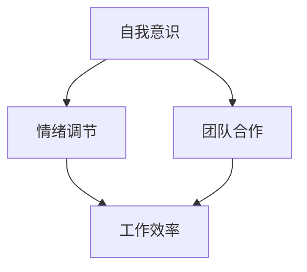

**核心算法原理讲解**：

情绪调节的伪代码如下：

```plaintext
function 调节情绪（当前情绪，目标情绪）{
    if（当前情绪 != 目标情绪）{
        if（当前情绪 > 目标情绪）{
            // 减轻压力，放松身心
            减轻压力（当前情绪 - 目标情绪）
        } else if（当前情绪 < 目标情绪）{
            // 增加动力，激发潜能
            增加动力（目标情绪 - 当前情绪）
        }
    }
}
```

#### 2.2 自我管理

自我管理是情绪智力的另一个核心要素，它指的是个体对自身情绪和行为进行有效管理和调节的能力。自我管理不仅包括情绪的调节，还包括目标的设定、时间的管理、压力的应对等。

在信息技术领域，自我管理的重要性体现在以下几个方面：

1. **目标设定**：在项目开发中，程序员需要设定明确的目标，并制定合理的计划。自我管理能力有助于个体更好地实现目标，提高项目成功率。
2. **时间管理**：面对繁重的工作任务，程序员需要合理安排时间，确保关键任务得到优先处理。自我管理能力有助于提高工作效率，减少拖延。
3. **压力应对**：在高压环境下，程序员需要有效地应对各种压力，以保持良好的工作状态。自我管理能力有助于个体保持冷静，减少情绪波动。

**核心概念与联系**：

自我管理与目标设定、时间管理、压力应对等概念密切相关。通过自我管理，个体能够更好地控制自己的情绪和行为，以实现个人和团队的目标。

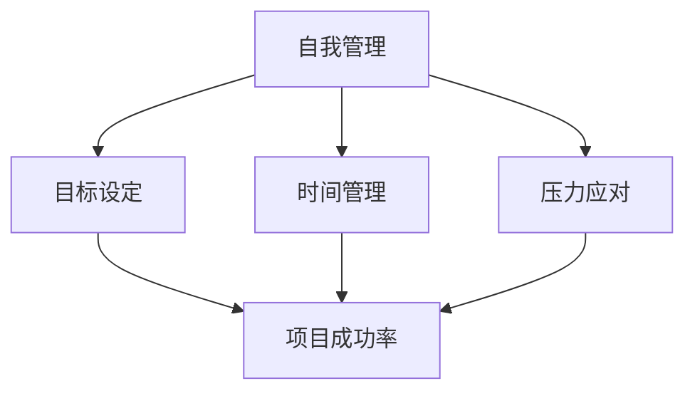

**核心算法原理讲解**：

时间管理的伪代码如下：

```plaintext
function 管理时间（任务列表，截止日期）{
    for（每个任务 in 任务列表）{
        if（任务截止日期 < 截止日期）{
            // 将任务优先处理
            优先处理任务（任务）
        } else {
            // 将任务延迟处理
            延迟处理任务（任务）
        }
    }
}
```

#### 2.3 社会意识

社会意识是指个体理解和感知他人情绪的能力，以及对他人在特定情境下情绪需求的认识。社会意识对于建立和维护良好的人际关系至关重要。

在信息技术领域，社会意识的重要性体现在以下几个方面：

1. **客户沟通**：在客户服务中，社会意识有助于程序员更好地理解客户的需求和情绪，提供更加个性化的服务。例如，一个具有高度社会意识的程序员能够识别客户的不满情绪，并采取适当的措施解决问题。
2. **团队合作**：在团队协作中，社会意识有助于个体更好地理解团队成员的情绪和需求，从而建立更加和谐的人际关系。例如，一个具有高度社会意识的团队成员能够识别队友的情绪波动，并给予适当的支持和鼓励。

**核心概念与联系**：

社会意识与客户沟通、团队合作等概念密切相关。通过社会意识，个体能够更好地理解他人的情绪和需求，从而提高沟通效率和团队效能。

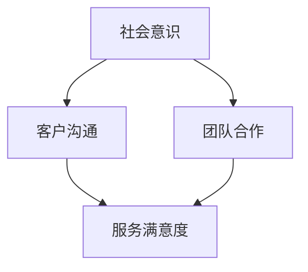

**核心算法原理讲解**：

情绪识别的伪代码如下：

```plaintext
function 识别情绪（非言语线索，生理信号，情绪语言）{
    情绪 = ""
    if（非言语线索指向正面情绪）{
        情绪 = "正面"
    } else if（非言语线索指向负面情绪）{
        情绪 = "负面"
    }
    return 情绪
}
```

#### 2.4 关系管理

关系管理是情绪智力的一个重要方面，它指的是个体在人际交往中建立和维护关系的技能。良好的关系管理能力有助于个体在信息技术领域中建立广泛的人脉，提高合作和沟通效率。

在信息技术领域，关系管理的重要性体现在以下几个方面：

1. **人际网络**：在信息技术行业，广泛的人际网络对于职业发展和项目合作至关重要。关系管理能力有助于个体建立和维护良好的人际关系，从而拓宽人脉渠道。
2. **团队协作**：在团队协作中，关系管理能力有助于个体更好地协调团队内部的关系，提高团队整体效能。例如，一个具有良好关系管理能力的管理者能够有效地解决团队冲突，增强团队凝聚力。
3. **客户关系**：在客户服务中，关系管理能力有助于个体建立长期的客户关系，提高客户满意度和忠诚度。

**核心概念与联系**：

关系管理与人际网络、团队协作、客户关系等概念密切相关。通过关系管理，个体能够更好地协调和利用人际关系，从而实现个人和团队的目标。

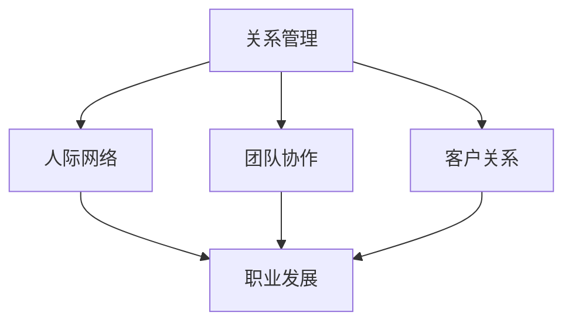

**核心算法原理讲解**：

关系管理的伪代码如下：

```plaintext
function 管理关系（人脉列表，关系状态）{
    for（每个人脉 in 人脉列表）{
        if（关系状态 > 良好）{
            // 增进关系
            增进关系（每个人脉）
        } else if（关系状态 < 良好）{
            // 维护关系
            维护关系（每个人脉）
        }
    }
}
```

### 第三部分：情绪智力的评估与测量

情绪智力作为一种重要的能力，其评估与测量对于个体和组织的成长与发展具有重要意义。本文将介绍情绪智力的评估方法与工具，分析情绪智力分数的意义，并探讨提高情绪智力的重要性。

#### 3.1 评估方法与工具

情绪智力的评估方法主要包括心理测试、问卷调查和访谈。以下是一些常用的评估工具：

1. **情绪智力量表**：情绪智力量表是一种结构化的评估工具，用于测量个体的情绪智力水平。常见的情绪智力量表包括梅耶-沙洛维情绪智力测验（MSCEIT）、戈尔曼情商量表（EQ-I）和麦克雷情绪智力问卷（MEQ）等。

2. **心理测试**：心理测试可以通过多种方式测量个体的情绪智力，如人格测试、能力测试等。这些测试通常包含多个维度，如自我意识、自我管理、社会意识和关系管理。

3. **问卷调查**：问卷调查是一种广泛应用的评估方法，可以通过设计科学合理的问卷，收集个体在情绪智力方面的表现数据。问卷调查的优点在于操作简单、成本低，适用于大规模评估。

4. **访谈**：访谈是一种深入评估情绪智力的方法，通过与个体进行面对面的交流，了解其在实际生活中的情绪智力表现。访谈的优点在于可以获得详细、具体的信息，适用于个性化评估。

#### 3.2 情绪智力分数的意义

情绪智力分数反映了个体在情绪智力方面的能力水平，对于个体和组织都有重要意义。

1. **个体发展**：情绪智力分数可以帮助个体了解自己在情绪智力方面的优势和劣势，从而有针对性地进行提升。例如，一个情绪智力分数较低的个体可能会发现自己在自我管理和关系管理方面存在不足，进而通过训练和反思来提升这些方面的能力。

2. **职业发展**：情绪智力分数在职业发展中起着重要作用。高情绪智力分数的个体在团队合作、客户沟通和领导力等方面表现更为出色，更容易获得职业晋升和发展机会。相反，情绪智力分数较低的个体可能会面临沟通障碍、团队合作困难等问题，从而影响职业发展。

3. **团队效能**：情绪智力分数可以用于评估团队的整体情绪智力水平。一个情绪智力分数较高的团队在沟通、协作和解决问题方面表现更出色，能够更好地应对各种挑战，提高团队效能。

4. **组织文化**：情绪智力分数可以帮助组织了解员工在情绪智力方面的表现，从而优化组织文化和工作环境。例如，一个情绪智力分数较高的组织可能会更加注重员工的情感需求，提供更多的心理支持和职业发展机会，从而增强员工的满意度和忠诚度。

#### 3.3 提高情绪智力的重要性

提高情绪智力对于个人和组织的发展具有重要意义。

1. **个人成长**：情绪智力的提升有助于个人在情感、认知和行为方面实现全面发展。通过提高自我意识、自我管理、社会意识和关系管理能力，个体能够更好地应对生活中的各种挑战，提高生活质量。

2. **职业成功**：情绪智力在职场中发挥着重要作用。高情绪智力个体在团队合作、客户沟通和领导力等方面表现更出色，更容易获得职业认可和晋升机会。同时，情绪智力有助于个体在高压环境下保持冷静和专注，提高工作效率。

3. **团队协作**：情绪智力有助于团队建立良好的沟通和协作机制。通过提高团队成员的情绪智力水平，可以减少冲突、增强信任，提高团队整体效能。

4. **组织发展**：情绪智力在组织管理中具有重要意义。高情绪智力水平的员工能够更好地理解和管理自己和他人的情绪，提高组织文化的包容性和协作性，促进组织发展。

总之，情绪智力的评估与测量对于个人和组织的发展至关重要。通过科学的评估方法和工具，个体和组织可以了解情绪智力水平，有针对性地进行提升，从而实现全面发展。

### 第二部分：理解他人的情绪

理解他人的情绪是情绪智力的关键要素之一，它不仅有助于建立良好的人际关系，还能够提高沟通效率和解决冲突的能力。本文将探讨如何识别和识别他人的情绪，分析影响情绪识别的因素，并介绍一些情绪调节技巧。

#### 4.1 情绪识别

情绪识别是指个体通过观察他人的非言语行为、生理信号和情绪语言，识别和理解他人情绪的过程。以下是一些情绪识别的技巧：

1. **非言语线索**：非言语线索包括面部表情、身体姿态、眼神接触和手势等。例如，一个皱眉和咬嘴唇的人可能表达了不满或痛苦的情绪。

2. **生理信号**：生理信号包括心率、呼吸和皮肤电反应等。这些信号可以反映个体的情绪状态，例如，紧张的情绪可能会导致心率加快和呼吸急促。

3. **情绪语言**：情绪语言是指个体在交流中使用的语言，包括语气、语调和用词等。例如，一个说话语气平和、语调温和的人可能表达了愉快的情绪，而一个语气尖锐、语调激动的人可能表达了愤怒的情绪。

**核心概念与联系**：

情绪识别与沟通技巧、冲突解决、人际关系等概念密切相关。通过情绪识别，个体能够更好地理解他人的情绪，从而提高沟通效率和解决冲突的能力。

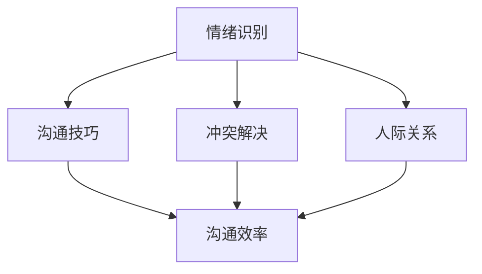

**核心算法原理讲解**：

情绪识别的伪代码如下：

```plaintext
function 识别情绪（非言语线索，生理信号，情绪语言）{
    情绪 = ""
    if（非言语线索指向正面情绪）{
        情绪 = "正面"
    } else if（非言语线索指向负面情绪）{
        情绪 = "负面"
    }
    if（生理信号指向正面情绪）{
        情绪 = "正面"
    } else if（生理信号指向负面情绪）{
        情绪 = "负面"
    }
    if（情绪语言指向正面情绪）{
        情绪 = "正面"
    } else if（情绪语言指向负面情绪）{
        情绪 = "负面"
    }
    return 情绪
}
```

#### 4.2 情绪的影响因素

情绪识别的准确性受到多种因素的影响，包括个人经历、文化背景和心理状态。

1. **个人经历**：个人的成长经历、教育和生活经历等都会对情绪识别产生影响。例如，一个在温暖家庭中成长的人可能更容易识别他人的积极情绪，而一个在冲突环境中成长的人可能更容易识别他人的负面情绪。

2. **文化背景**：不同文化对情绪的表达和识别有不同的规范。例如，在一些文化中，公开表达情绪被视为不礼貌的，而在其他文化中，情绪表达则更为直接和开放。这种差异会影响情绪识别的准确性。

3. **心理状态**：个体的心理状态，如焦虑、抑郁和压力等，也会影响情绪识别的准确性。例如，一个处于焦虑状态的人可能难以准确识别他人的情绪，而一个处于抑郁状态的人可能更容易将他人的情绪解读为消极。

**核心概念与联系**：

情绪的影响因素与情绪识别、文化差异、心理状态等概念密切相关。了解这些影响因素有助于个体更好地理解他人的情绪，提高情绪识别的准确性。

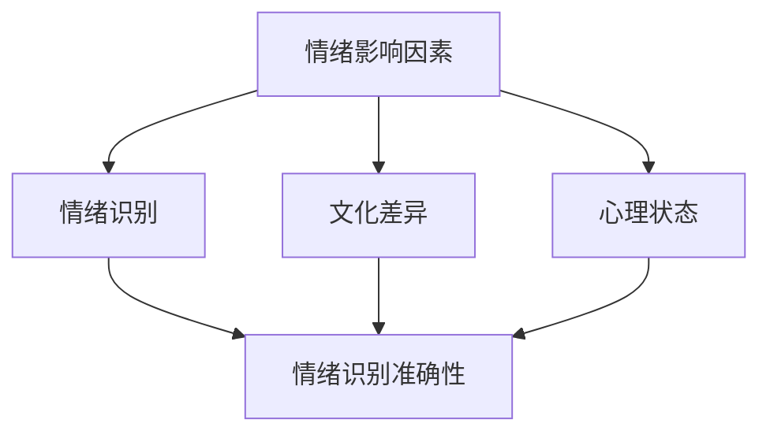

**核心算法原理讲解**：

情绪影响的伪代码如下：

```plaintext
function 影响情绪（个人经历，文化背景，心理状态）{
    if（个人经历指向积极）{
        情绪识别准确性增加
    } else if（个人经历指向消极）{
        情绪识别准确性降低
    }
    if（文化背景指向积极）{
        情绪识别准确性增加
    } else if（文化背景指向消极）{
        情绪识别准确性降低
    }
    if（心理状态指向积极）{
        情绪识别准确性增加
    } else if（心理状态指向消极）{
        情绪识别准确性降低
    }
}
```

#### 4.3 情绪调节技巧

情绪调节是指个体通过自我调节和支持他人调节来管理情绪的过程。以下是一些情绪调节技巧：

1. **自我调节**：自我调节包括深呼吸、冥想、放松训练和积极思考等。这些方法有助于个体在情绪波动时保持冷静，减轻压力。

2. **支持他人调节**：支持他人调节包括倾听、同理、鼓励和提供实际帮助等。通过这些方法，个体可以帮助他人更好地管理情绪，缓解压力。

**核心概念与联系**：

情绪调节与自我调节、支持他人调节、心理健康等概念密切相关。通过情绪调节，个体能够更好地管理自己的情绪，提高心理健康水平，同时帮助他人管理情绪，建立和谐的人际关系。

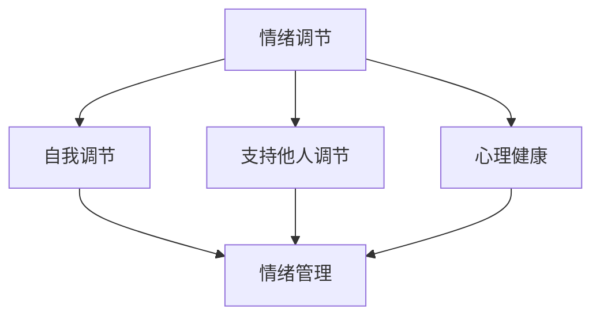

**核心算法原理讲解**：

情绪调节的伪代码如下：

```plaintext
function 自我调节（情绪状态，调节方法）{
    if（情绪状态指向积极）{
        选择积极的调节方法
    } else if（情绪状态指向消极）{
        选择消极的调节方法
    }
}

function 支持他人调节（他人情绪状态，支持方法）{
    if（他人情绪状态指向积极）{
        提供积极的反馈和支持
    } else if（他人情绪状态指向消极）{
        提供同理和支持
    }
}
```

### 第三部分：影响他人的情绪

在信息技术领域，有效地影响他人的情绪是建立和谐团队、提升工作效率和改善客户关系的关键。本部分将探讨如何表达情绪、引导情绪以及建立积极的人际关系。

#### 7.1 情绪表达技巧

情绪表达是指个体通过言语、非言语行为和情绪语言来表达自己的情绪状态。有效的情绪表达不仅能够传达自己的情感，还能够影响他人的情绪。以下是一些情绪表达技巧：

1. **正面情绪表达**：

   - **言语表达**：使用积极、鼓励性的语言，表达自己的正面情绪。例如：“我真的很感激你的帮助，这让我感到非常高兴。”

   - **非言语表达**：通过微笑、点头和拥抱等非言语行为，传达积极的情绪。这些非言语信号能够增强言语表达的效果。

   - **情绪语言**：在交流中使用积极的词汇和语调，避免使用消极的词语。例如，使用“我们有机会改进”代替“我们失败了”。

2. **负面情绪表达**：

   - **情绪缓冲**：在表达负面情绪之前，先进行情绪缓冲，例如深呼吸、冥想或简单的放松练习，以控制情绪的强度。

   - **直接表达**：使用直接但尊重的方式表达负面情绪。例如：“我感到有些担忧，因为项目进度似乎有点拖延，我们可以一起看看怎么解决。”

   - **避免指责**：在表达负面情绪时，避免指责他人，而是专注于问题描述和解决方案。例如：“我注意到项目进度有延迟，我们可以考虑调整计划来解决这个问题。”

**核心概念与联系**：

情绪表达与沟通技巧、情绪管理、人际关系等概念密切相关。有效的情绪表达能够增强沟通效果，改善人际关系，提高团队协作效率。

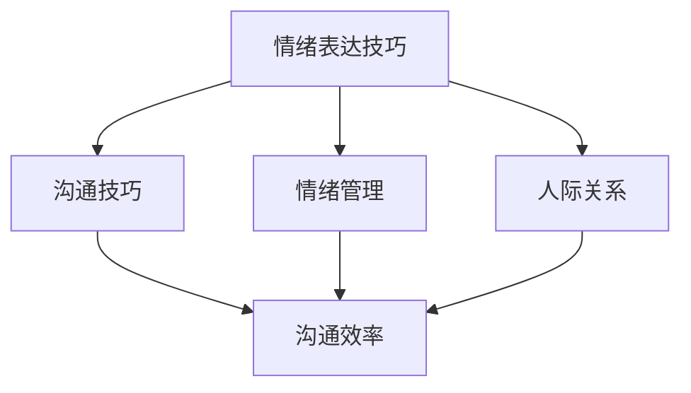

**核心算法原理讲解**：

情绪表达的伪代码如下：

```plaintext
function 表达情绪（情绪类型，情绪内容）{
    if（情绪类型指向正面）{
        使用正面语言和非言语表达
    } else if（情绪类型指向负面）{
        使用情绪缓冲和直接表达
    }
}
```

#### 7.2 情绪引导

情绪引导是指通过特定的方法和策略，影响和引导他人情绪的过程。以下是一些情绪引导技巧：

1. **情绪共鸣**：通过同理和共情，与他人的情绪产生共鸣，从而影响他们的情绪。例如，在倾听他人时，通过点头、眼神接触和回应表达理解和支持。

2. **情绪反馈**：提供积极的情绪反馈，鼓励他人保持积极情绪。例如，在团队会议中，表扬团队成员的努力和成就，以增强他们的积极情绪。

3. **情绪引导的艺术**：情绪引导需要技巧和经验。例如，在冲突解决中，通过中立的态度和有效的沟通技巧，引导双方的情绪，促进对话和和解。

**核心概念与联系**：

情绪引导与同理、沟通技巧、情绪管理等概念密切相关。有效的情绪引导能够改善人际关系，增强团队凝聚力，提高工作效率。

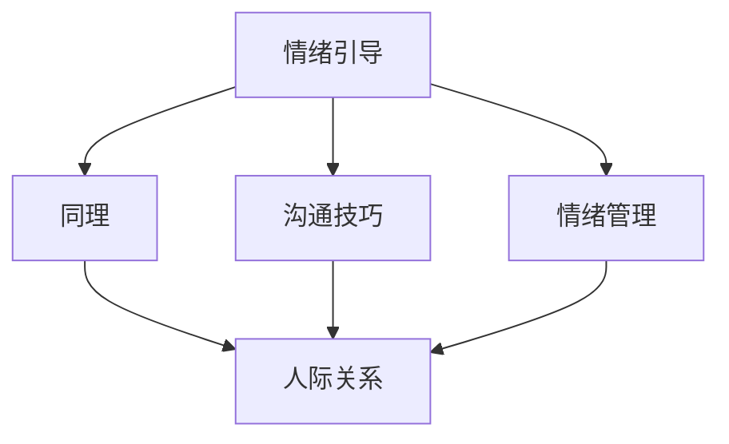

**核心算法原理讲解**：

情绪引导的伪代码如下：

```plaintext
function 引导情绪（他人情绪，目标情绪）{
    if（他人情绪指向积极）{
        提供积极反馈和共鸣
    } else if（他人情绪指向消极）{
        提供同理和支持，引导向积极情绪
    }
}
```

#### 7.3 情绪表达的策略

情绪表达的策略包括情境适应、目标明确和灵活性等。以下是一些具体策略：

1. **情境适应**：根据不同的情境选择适当的情绪表达方式。例如，在正式的商务场合，情绪表达应更为谨慎和正式，而在非正式的社交场合，可以更加放松和自然。

2. **目标明确**：在表达情绪时，明确自己的目标和意图。例如，如果目标是解决问题，情绪表达应集中在问题描述和解决方案上，避免过度情绪化。

3. **灵活性**：情绪表达应根据实际情况灵活调整。例如，在情绪激动时，可以先暂停对话，冷静下来后再继续。

**核心概念与联系**：

情绪表达的策略与情境适应、目标明确、灵活性等概念密切相关。有效的情绪表达策略能够提高沟通效果，促进问题的解决，增强人际关系。

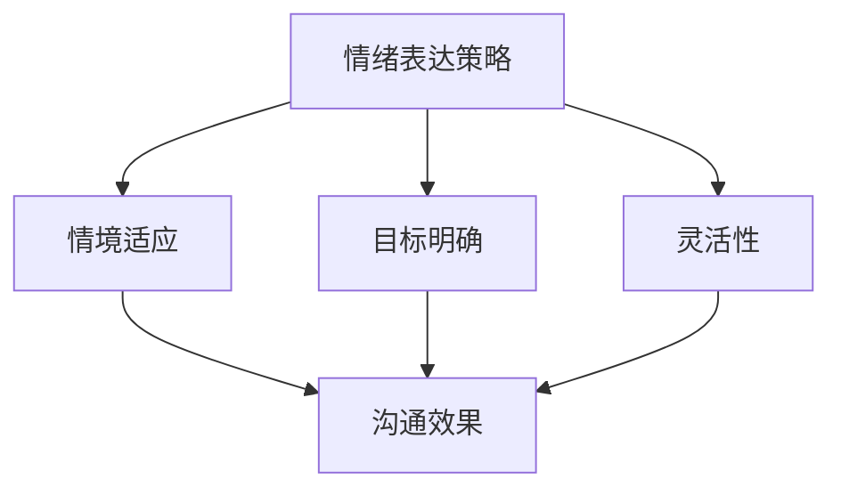

**核心算法原理讲解**：

情绪表达策略的伪代码如下：

```plaintext
function 情绪表达策略（情境，目标，情绪状态）{
    if（情境指向正式）{
        使用正式语言和表达方式
    } else if（情境指向非正式）{
        使用非正式语言和表达方式
    }
    if（目标指向解决问题）{
        焦点在问题描述和解决方案上
    } else if（目标指向其他）{
        根据具体情况调整情绪表达
    }
    if（情绪状态指向激动）{
        暂停并冷静下来再继续
    } else {
        保持灵活，根据实际情况进行调整
    }
}
```

### 第8章：情绪引导

情绪引导是情绪智力中的重要组成部分，它涉及理解他人的情绪，并使用适当的方法和策略来引导他人的情绪。情绪引导不仅有助于建立积极的人际关系，还能提高团队协作效率，增强客户的满意度。本章将深入探讨情绪引导的概念、技巧和艺术，并展示其在不同情境下的应用。

#### 8.1 情绪共鸣

情绪共鸣是指通过同理和共情，与他人产生情感上的共鸣，从而影响他们的情绪。情绪共鸣的关键在于理解和感受他人的情绪，并在适当的时候给予支持和反馈。

1. **同理**：同理是指从他人的角度理解他们的感受。在情绪引导中，同理是一种强大的工具，可以帮助我们更好地理解他人的情绪，并建立信任和共鸣。例如，在客户服务中，一个优秀的客户服务代表会设身处地地理解客户的困扰，从而提供更有效的解决方案。

2. **共情**：共情是指感受他人的情绪，并将其转化为自己的感受。共情能够使我们在情绪上与对方产生共鸣，从而更好地引导他们的情绪。例如，在一个团队项目中，如果团队成员感到压力很大，领导者可以通过表达自己的理解和支持来缓解他们的情绪，增强团队凝聚力。

**核心概念与联系**：

情绪共鸣与同理、共情、人际关系等概念密切相关。通过情绪共鸣，我们可以更好地理解他人的情绪，建立积极的人际关系，提高沟通效果。

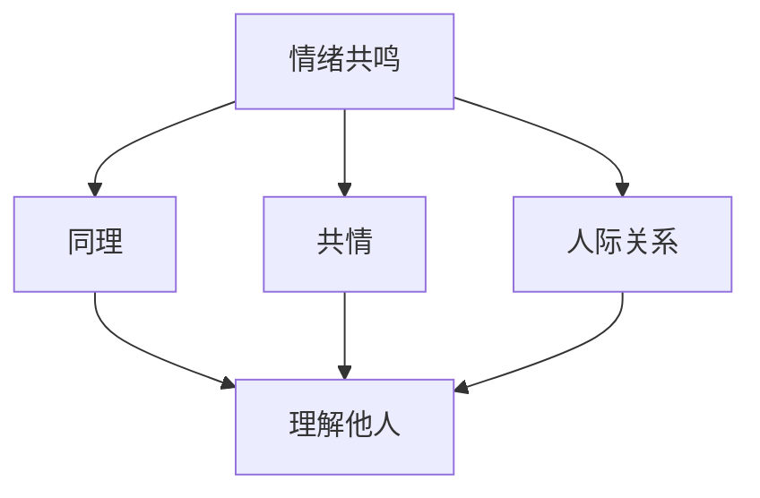

**核心算法原理讲解**：

情绪共鸣的伪代码如下：

```plaintext
function 情绪共鸣（他人情绪，自身情绪）{
    if（他人情绪指向正面）{
        产生积极的共鸣
    } else if（他人情绪指向负面）{
        产生消极的共鸣
    }
    同理他人情绪
    共情他人情绪
}
```

#### 8.2 情绪反馈

情绪反馈是指通过言语和非言语行为，向他人传达他们的情绪状态，并给予适当的反馈。情绪反馈有助于个体了解自己的情绪表达是否被他人正确理解，同时也可以影响他人的情绪。

1. **积极反馈**：积极反馈可以增强他人的正面情绪。例如，在团队会议中，项目经理可以对团队成员的出色表现给予表扬，这不仅能够增强团队成员的自信心，还能提升团队的整体士气。

2. **消极反馈**：消极反馈应该以建设性的方式传达，避免伤害他人的自尊心。例如，在技术评审中，团队成员可以对代码中的问题提供具体的建议和改进方案，而不是直接批评代码质量。

**核心概念与联系**：

情绪反馈与沟通技巧、情绪管理、团队协作等概念密切相关。有效的情绪反馈能够改善沟通效果，促进情绪管理，增强团队协作。

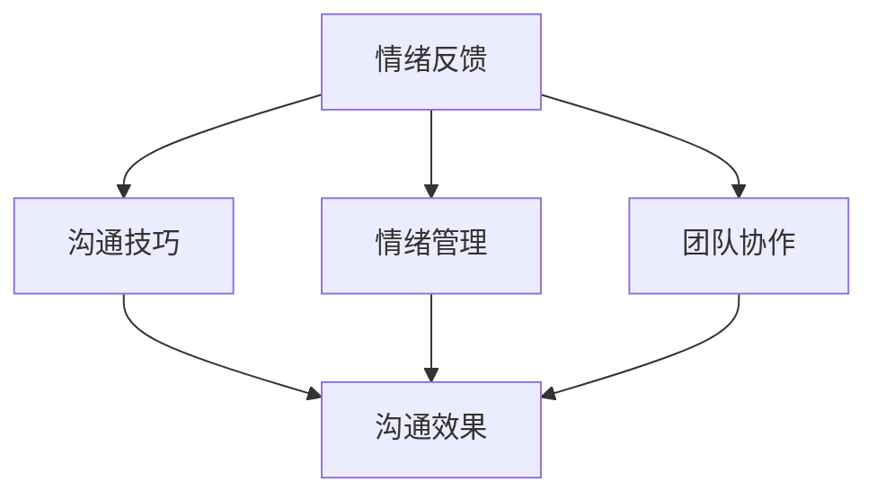

**核心算法原理讲解**：

情绪反馈的伪代码如下：

```plaintext
function 情绪反馈（他人情绪，反馈内容）{
    if（他人情绪指向正面）{
        提供积极反馈
    } else if（他人情绪指向负面）{
        提供消极反馈
    }
    if（反馈内容指向建设性）{
        提供具体建议和改进方案
    } else if（反馈内容指向批评性）{
        以温和的方式表达不满
    }
}
```

#### 8.3 情绪引导的艺术

情绪引导的艺术在于灵活运用各种情绪引导技巧，根据具体情境和需求进行策略调整。以下是一些情绪引导的艺术要点：

1. **观察和倾听**：在引导他人情绪之前，首先要观察和倾听，了解他们的情绪状态和需求。这有助于我们选择合适的引导策略。

2. **适应情境**：情绪引导应根据不同情境进行调整。例如，在紧张的会议中，可能需要更多的积极反馈和情绪缓冲；而在团队建设中，可能需要更多的同理和共情。

3. **灵活应对**：情绪引导过程中，可能会遇到各种突发情况。灵活应对和适应性是情绪引导的关键。例如，如果发现某个策略不起作用，可以迅速调整到另一个策略。

**核心概念与联系**：

情绪引导的艺术与观察、倾听、适应情境、灵活应对等概念密切相关。通过掌握情绪引导的艺术，我们可以更有效地影响他人的情绪，提高沟通效果和团队协作。

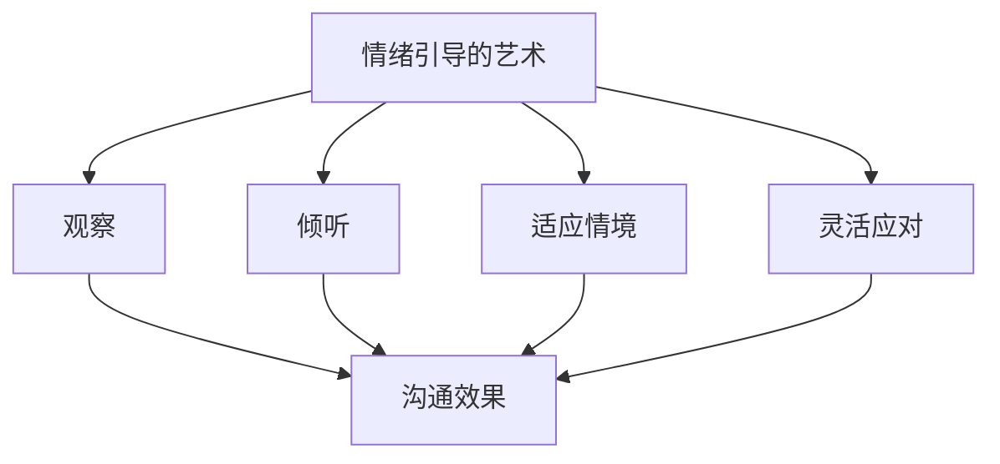

**核心算法原理讲解**：

情绪引导艺术的伪代码如下：

```plaintext
function 情绪引导艺术（情境，他人情绪，自身情绪）{
    if（情境指向紧张）{
        使用积极反馈和情绪缓冲
    } else if（情境指向团队建设）{
        使用同理和共情
    }
    if（他人情绪指向正面）{
        提供积极反馈
    } else if（他人情绪指向负面）{
        提供同理和支持
    }
    if（需要灵活应对）{
        根据实际情况调整情绪引导策略
    }
}
```

### 第9章：建立积极的人际关系

情绪智力在建立积极的人际关系方面发挥着至关重要的作用。通过运用情绪智力，个体能够更好地理解他人、表达自己，并在各种社交场合中建立和谐的人际关系。本章将探讨情绪智力在职场、家庭和社交场合中的应用，并提供一些实用的策略和技巧。

#### 9.1 情绪智力在职场中的应用

在职场中，情绪智力对于建立积极的人际关系、提升工作效率和实现职业发展具有重要意义。

1. **团队合作**：在团队合作中，情绪智力有助于个体更好地理解团队成员的情绪和需求，从而提高团队协作效率。例如，一个具有高情绪智力的人能够识别团队成员的情绪波动，并采取适当的措施来缓解压力，促进团队和谐。

2. **领导力**：情绪智力在领导力中起着关键作用。高情绪智力领导者能够更好地理解员工的情绪，提供情感支持，建立信任和尊重的关系。此外，他们还能够通过情绪反馈和引导，激发团队成员的积极性和创造力。

3. **沟通技巧**：情绪智力有助于个体在职场沟通中更加有效。通过理解他人的情绪和需求，个体能够采用更加合适和有效的沟通策略，减少误解和冲突，提高沟通效果。

**核心概念与联系**：

情绪智力与团队合作、领导力和沟通技巧等概念密切相关。通过运用情绪智力，个体能够在职场中建立积极的人际关系，提高工作效率，实现职业发展。

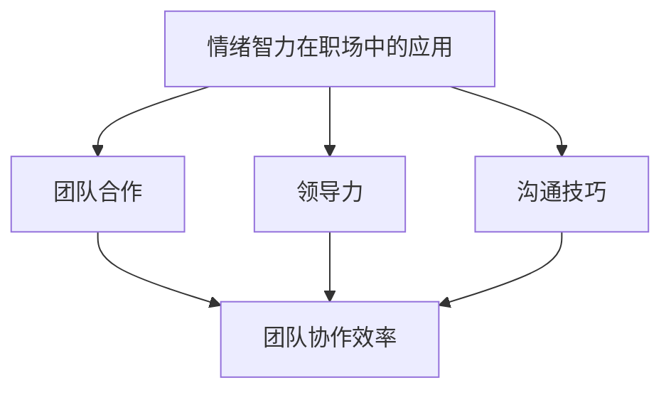

**核心算法原理讲解**：

职场情绪智力的伪代码如下：

```plaintext
function 职场情绪智力（团队合作，领导力，沟通技巧）{
    if（团队合作指向积极）{
        识别团队成员的情绪和需求
    }
    if（领导力指向积极）{
        提供情感支持和建立信任关系
    }
    if（沟通技巧指向有效）{
        采用合适的沟通策略，减少误解和冲突
    }
}
```

#### 9.2 情绪智力在家庭关系中的应用

在家庭关系中，情绪智力同样扮演着重要角色。通过运用情绪智力，家庭成员能够更好地理解彼此的情绪，建立和谐的家庭关系。

1. **情绪表达**：在家庭中，情绪智力有助于个体更好地表达自己的情绪。通过有效表达情绪，家庭成员能够更好地沟通，减少误解和冲突。

2. **情绪倾听**：情绪智力还帮助个体更好地倾听家人的情绪和需求。通过倾听，家庭成员能够更好地理解对方，提供情感支持，增强亲情。

3. **情绪调节**：在家庭中，情绪智力有助于个体更好地调节自己的情绪，以应对生活中的挑战。例如，一个具有高情绪智力的人能够通过深呼吸、冥想等方法，保持冷静和理智，减少负面情绪对家庭关系的影响。

**核心概念与联系**：

情绪智力与情绪表达、情绪倾听、情绪调节等概念密切相关。通过运用情绪智力，家庭成员能够更好地理解彼此，建立和谐的家庭关系。

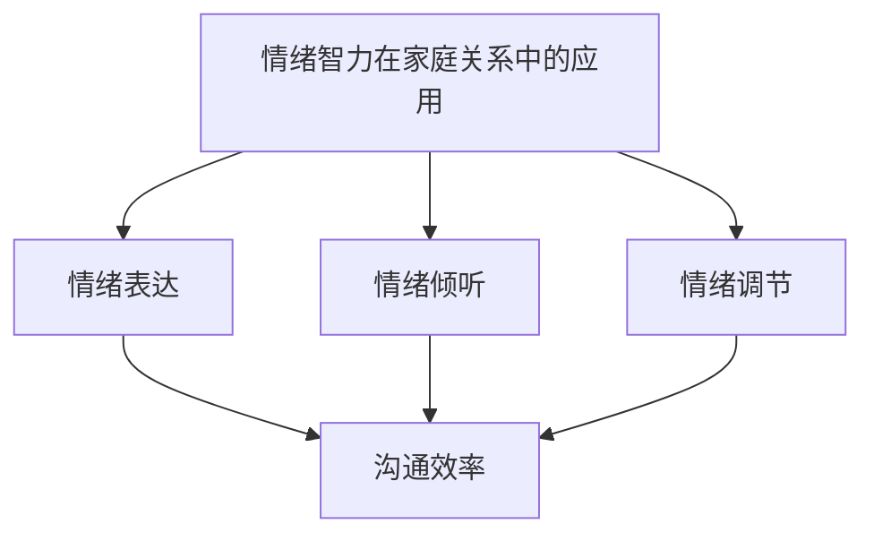

**核心算法原理讲解**：

家庭情绪智力的伪代码如下：

```plaintext
function 家庭情绪智力（情绪表达，情绪倾听，情绪调节）{
    if（情绪表达指向积极）{
        使用积极的语言和非言语行为表达情绪
    }
    if（情绪倾听指向有效）{
        倾听家人的情绪和需求，提供情感支持
    }
    if（情绪调节指向有效）{
        使用情绪调节方法，保持冷静和理智
    }
}
```

#### 9.3 情绪智力在社交场合中的应用

在社交场合中，情绪智力有助于个体更好地理解和影响他人的情绪，建立积极的人际关系。

1. **社交技巧**：情绪智力有助于个体在社交场合中更好地理解他人的情绪和需求，从而提高社交技巧。例如，一个具有高情绪智力的人能够识别他人的兴趣和偏好，并采取相应的社交策略，与他人建立良好的关系。

2. **情绪共鸣**：在社交场合中，情绪智力有助于个体与他人产生情感上的共鸣，增强社交互动。例如，在参加聚会时，一个具有高情绪智力的人能够识别他人的情绪状态，并通过同理和共情来增强社交互动。

3. **情绪引导**：情绪智力还帮助个体在社交场合中引导他人的情绪，建立积极的人际关系。例如，在演讲时，一个具有高情绪智力的人能够通过情绪共鸣和积极反馈，激发听众的兴趣和参与。

**核心概念与联系**：

情绪智力与社交技巧、情绪共鸣、情绪引导等概念密切相关。通过运用情绪智力，个体能够在社交场合中建立积极的人际关系，提升社交效能。

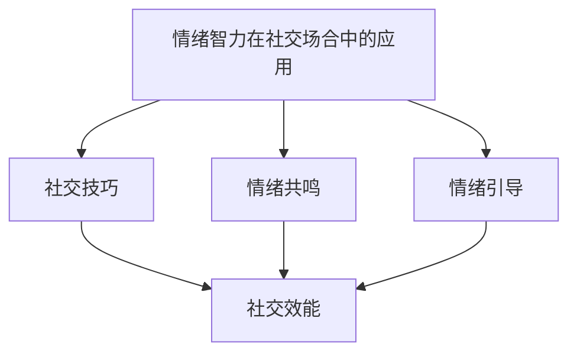

**核心算法原理讲解**：

社交情绪智力的伪代码如下：

```plaintext
function 社交情绪智力（社交技巧，情绪共鸣，情绪引导）{
    if（社交技巧指向有效）{
        识别他人的情绪和需求，采用合适的社交策略
    }
    if（情绪共鸣指向积极）{
        通过同理和共情增强社交互动
    }
    if（情绪引导指向积极）{
        通过情绪引导建立积极的人际关系
    }
}
```

### 第四部分：情绪智力在实践中的应用

情绪智力不仅在理论层面具有重要意义，更在实际应用中展现出强大的影响力。本部分将通过具体案例分析，展示情绪智力在企业领导力、心理咨询和教育培训中的应用，并探讨情绪智力提升的策略和方法。

#### 10.1 情绪智力在企业领导力中的应用

情绪智力在企业领导力中发挥着至关重要的作用。高情绪智力领导者不仅能够有效地管理自己的情绪，还能理解和影响团队成员的情绪，从而提高团队绩效和员工满意度。

1. **案例分析**：

   - **谷歌公司**：谷歌公司以其独特的领导力文化和注重员工情感需求而闻名。谷歌的领导者通过高情绪智力，建立了一个充满创新和活力的工作环境。他们鼓励员工表达自己的情绪，并采取措施缓解压力，从而提升了员工的满意度和工作效率。

   - **微软公司**：微软公司在其领导力发展项目中，注重培养领导者的情绪智力。通过情绪智力培训，领导者学会了更好地倾听员工的意见，理解他们的情绪需求，并采取适当的措施来支持员工。这种做法有助于提升员工的工作热情和团队凝聚力。

2. **情绪智力提升策略**：

   - **领导力培训**：企业可以通过领导力培训课程，提升领导者的情绪智力。这些课程可以包括情绪管理、沟通技巧和团队合作等方面的培训。

   - **建立开放沟通文化**：企业应鼓励开放和诚实的沟通，让员工感到他们的意见和情绪被重视。领导者可以通过定期会议、员工反馈和一对一谈话等方式，了解员工的情绪和需求。

   - **情绪支持系统**：企业可以建立情绪支持系统，如心理咨询、员工帮助计划等，为员工提供情感支持和心理健康服务。

**核心概念与联系**：

情绪智力与企业领导力、团队绩效、员工满意度等概念密切相关。通过提升情绪智力，企业能够建立更有效的领导力体系，提高团队绩效和员工满意度。

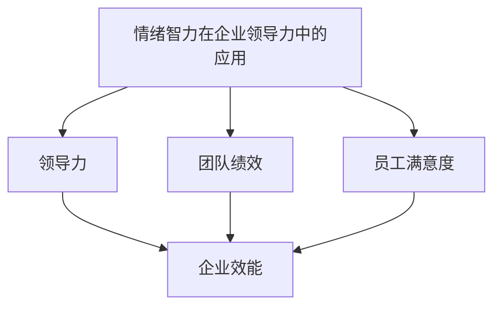

**核心算法原理讲解**：

领导力情绪智力的伪代码如下：

```plaintext
function 领导力情绪智力（情绪管理，沟通技巧，团队合作）{
    if（情绪管理指向有效）{
        保持冷静和理智，处理冲突
    }
    if（沟通技巧指向有效）{
        倾听员工意见，理解他们的情绪需求
    }
    if（团队合作指向积极）{
        建立和谐的团队氛围，提高团队绩效
    }
}
```

#### 10.2 情绪智力在心理咨询中的应用

情绪智力在心理咨询中具有重要应用价值，它帮助心理咨询师更好地理解和服务于来访者，提升咨询效果。

1. **案例分析**：

   - **心理咨询中心**：在一些心理咨询中心，心理咨询师通过情绪智力，与来访者建立信任关系，理解他们的情绪困扰，并提供个性化的咨询服务。这种以情绪智力为基础的咨询方法，显著提升了来访者的满意度。

   - **临床心理学实践**：临床心理学家通过情绪智力，识别和调节来访者的情绪，帮助他们更好地应对心理问题。例如，在治疗焦虑症和抑郁症时，心理学家会使用情绪智力技巧，帮助来访者管理自己的情绪，提高生活质量。

2. **情绪智力提升策略**：

   - **专业培训**：心理咨询师可以通过参加情绪智力相关的培训，提升自己的情绪智力。这些培训可以包括情绪识别、情绪管理和情绪调节等方面的内容。

   - **案例研究**：通过分析成功的心理咨询案例，心理咨询师可以学习如何运用情绪智力，提高咨询技巧和效果。

   - **实践练习**：心理咨询师可以通过模拟咨询和实际咨询，不断练习和应用情绪智力技巧，提升自身的情绪智力。

**核心概念与联系**：

情绪智力与心理咨询、来访者满意度、心理健康等概念密切相关。通过提升情绪智力，心理咨询师能够提供更有效的咨询服务，提升来访者的心理健康水平。

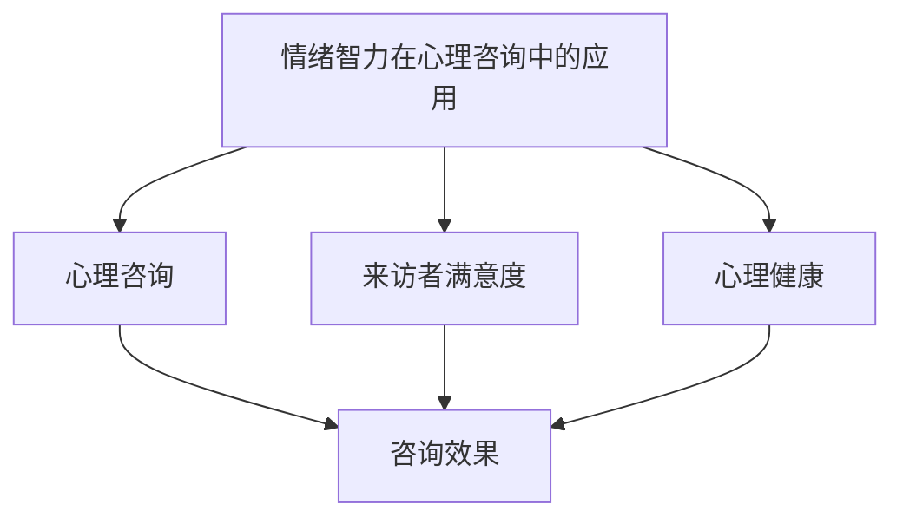

**核心算法原理讲解**：

心理咨询情绪智力的伪代码如下：

```plaintext
function 心理咨询情绪智力（情绪识别，情绪管理，情绪调节）{
    if（情绪识别指向准确）{
        识别来访者的情绪状态
    }
    if（情绪管理指向有效）{
        帮助来访者管理情绪
    }
    if（情绪调节指向积极）{
        提供情绪调节技巧，改善心理健康
    }
}
```

#### 10.3 情绪智力在教育培训中的应用

情绪智力在教育培训中扮演着重要角色，它不仅有助于提升学生的心理健康，还能提高学习效果和社交能力。

1. **案例分析**：

   - **学校教育**：一些学校通过开展情绪智力相关的课程和活动，帮助学生认识和管理自己的情绪。例如，通过情绪智力课程，学生学会了如何识别自己的情绪，并采取适当的调节策略，从而提高学习效果。

   - **教师培训**：教师通过情绪智力培训，学会了更好地理解和应对学生的情绪需求。这种以情绪智力为基础的教学方法，有助于建立良好的师生关系，提高学生的学习积极性和效果。

2. **情绪智力提升策略**：

   - **课程设计**：教育机构可以设计以情绪智力为核心的课程，帮助学生认识和管理情绪。这些课程可以包括情绪识别、情绪调节和情绪表达等方面的内容。

   - **教师培训**：教师可以通过参加情绪智力培训，提升自己的情绪智力水平。教师培训可以包括情绪管理技巧、课堂情绪调节和师生关系建设等方面的内容。

   - **实践活动**：教育机构可以组织以情绪智力为主题的实践活动，如情绪日记、小组讨论和角色扮演等，帮助学生实际应用情绪智力技巧。

**核心概念与联系**：

情绪智力与教育培训、学生学习效果、师生关系等概念密切相关。通过提升情绪智力，教育机构能够提供更有效的教育服务，提升学生的心理健康和学习效果。

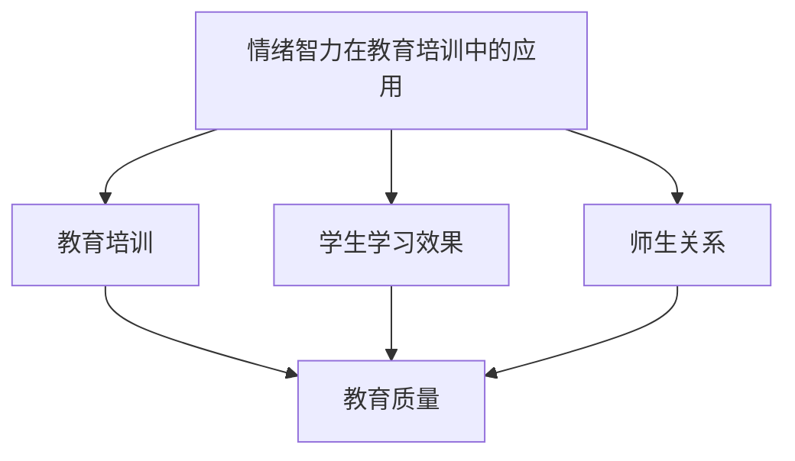

**核心算法原理讲解**：

教育培训情绪智力的伪代码如下：

```plaintext
function 教育培训情绪智力（课程设计，教师培训，实践活动）{
    if（课程设计指向有效）{
        设计以情绪智力为核心的课程
    }
    if（教师培训指向积极）{
        提升教师的情绪智力水平
    }
    if（实践活动指向实用）{
        组织以情绪智力为主题的实践活动
    }
}
```

### 第11章：提升情绪智力

情绪智力并非与生俱来，它可以通过系统的训练和不断的实践得到提升。本章将探讨提升情绪智力的方法、策略和案例分析，帮助读者在实践中应用情绪智力，提高个人和团队的整体效能。

#### 11.1 情绪智力训练的方法

情绪智力训练的方法多种多样，以下是一些常见的训练方法：

1. **情绪识别训练**：

   - **自我观察**：通过日记、反思等方法，记录自己的情绪变化，识别常见的情绪状态。例如，每天结束时，写下当天的主要情绪经历，并分析情绪的起因和影响。

   - **情绪标签**：使用情绪标签（如愤怒、快乐、焦虑等）来描述自己的情绪，帮助自己更好地理解和识别情绪。

2. **情绪调节训练**：

   - **深呼吸**：通过深呼吸练习，放松身心，减轻情绪压力。每次深呼吸时，尽量深吸慢呼，专注于呼吸的感觉，有助于平静情绪。

   - **冥想**：冥想是一种有效的情绪调节方法，通过冥想练习，可以培养内心的平静和专注力，提高情绪调节能力。

3. **情绪表达训练**：

   - **角色扮演**：通过角色扮演练习，模拟不同的情绪表达场景，提高情绪表达的准确性和适应性。例如，可以选择与家人或朋友一起进行角色扮演，练习如何在不同情境下表达情绪。

   - **情景模拟**：设计一些情绪表达的场景，如面试、演讲、冲突解决等，通过情景模拟，提高情绪表达的技巧和自信心。

**核心概念与联系**：

情绪识别训练、情绪调节训练和情绪表达训练等概念密切相关。通过这些训练方法，个体可以逐步提升情绪智力，提高情绪管理和表达的能力。

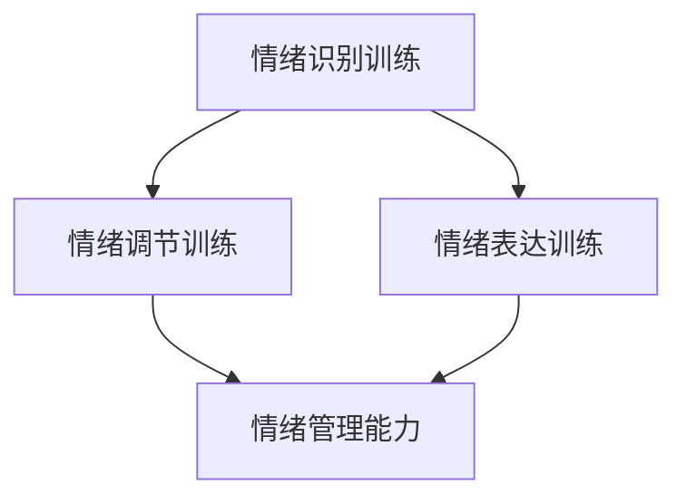

**核心算法原理讲解**：

情绪识别训练的伪代码如下：

```plaintext
function 情绪识别训练（情绪日记，情绪标签）{
    while（训练周期 > 0）{
        记录情绪日记
        标签当前情绪
        分析情绪起因和影响
    }
}
```

#### 11.2 情绪智力提升的策略

情绪智力的提升不仅依赖于训练方法，还需要有效的策略来支持。以下是一些提升情绪智力的策略：

1. **设定明确的目标**：

   - **自我反思**：通过反思自己的情绪经历，设定具体的情绪智力提升目标。例如，目标可以是提高情绪调节能力或改善情绪表达能力。

   - **制定计划**：制定详细的训练计划，包括训练方法、时间安排和评估标准。例如，每天进行情绪识别训练，每周进行一次情绪调节练习。

2. **培养自我意识**：

   - **自我观察**：通过自我观察，了解自己的情绪反应和行为模式。例如，观察自己在压力情况下的情绪变化，以及这些情绪如何影响行为。

   - **反思和反馈**：定期反思自己的情绪反应，并寻求他人的反馈。例如，与朋友或家人分享自己的情绪体验，听取他们的意见和建议。

3. **实践和应用**：

   - **情境模拟**：将训练方法应用到实际生活中，通过模拟不同的情境，提高情绪智力的实际应用能力。例如，在职场中练习情绪表达，或在家庭中实践情绪调节技巧。

   - **持续学习**：通过阅读相关书籍、参加培训和研讨会，不断学习和提升情绪智力。

**核心概念与联系**：

情绪智力提升策略与自我反思、设定目标、情境模拟和持续学习等概念密切相关。通过这些策略，个体可以更有效地提升情绪智力，提高情绪管理和表达的能力。

```mermaid
graph TD
A[情绪智力提升策略] --> B[自我反思]
A --> C[设定目标]
A --> D[情境模拟]
A --> E[持续学习]
B --> F[自我意识]
C --> F
D --> F
E --> F
```

**核心算法原理讲解**：

情绪智力提升策略的伪代码如下：

```plaintext
function 情绪智力提升策略（自我反思，设定目标，情境模拟，持续学习）{
    while（提升周期 > 0）{
        进行自我反思
        设定情绪智力提升目标
        在情境中实践情绪智力技巧
        持续学习相关知识和技巧
    }
}
```

#### 11.3 情绪智力提升的案例分析

通过以下案例，我们可以看到情绪智力在实际应用中的效果：

1. **案例分析一**：

   - **场景**：一位程序员在项目中遇到了技术难题，导致项目进度延误，他感到焦虑和压力。

   - **解决方案**：通过情绪识别训练，他能够识别自己的焦虑情绪，并采取深呼吸和冥想等方法进行情绪调节。同时，他设定了明确的目标，制定了详细的计划，以逐步解决技术难题。通过情境模拟和持续学习，他不断提升情绪智力，最终成功解决了技术难题，项目进度恢复正常。

2. **案例分析二**：

   - **场景**：一位项目经理在团队沟通中遇到了冲突，导致团队关系紧张。

   - **解决方案**：项目经理通过情绪识别训练，识别自己的愤怒情绪，并采取积极的情绪表达技巧，以建设性的方式表达不满。同时，他通过同理和共情，理解团队成员的情绪需求，并采取措施缓解团队紧张情绪。通过情境模拟和持续学习，他不断提升情绪智力，成功解决了团队冲突，改善了团队关系。

**核心概念与联系**：

情绪智力提升的案例分析与情绪识别、情绪调节、情绪表达、同理和共情等概念密切相关。通过这些实际案例，我们可以看到情绪智力在实践中的应用效果，以及如何通过情绪智力提升策略，解决实际问题和提升团队效能。

```mermaid
graph TD
A[情绪智力提升的案例分析] --> B[情绪识别]
A --> C[情绪调节]
A --> D[情绪表达]
A --> E[同理]
A --> F[共情]
B --> G[问题解决]
C --> G
D --> G
E --> G
F --> G
```

**核心算法原理讲解**：

情绪智力提升案例分析的伪代码如下：

```plaintext
function 情绪智力提升案例分析（情绪识别，情绪调节，情绪表达，同理，共情）{
    while（案例分析周期 > 0）{
        识别情绪
        调节情绪
        表达情绪
        同理他人
        共情他人
        分析解决方案
    }
}
```

### 第五部分：附录

#### 12.1 情绪智力相关资源

为了帮助读者进一步了解情绪智力，我们推荐以下相关资源：

1. **研究文献推荐**：

   - Mayer, J. D., Salovey, P., & Caruso, D. R. (1997). "Emotional intelligence". In R. J. Sternberg (Ed.), The psychology of wisdom (pp. 625-657). Lawrence Erlbaum Associates.
   - Goleman, D. (1995). "Emotional Intelligence". Bantam Books.

2. **情绪智力相关书籍推荐**：

   - Goleman, D. (1995). "Emotional Intelligence: Why It Can Matter More Than IQ". Bantam Books.
   - Mayer, J. D., Salovey, P., & Caruso, D. R. (2004). "Emotional Intelligence: New Research and Applications". John Wiley & Sons.

3. **情绪智力相关在线课程推荐**：

   - Coursera: "Emotional Intelligence: The Science of Human Relationships" by the University of California, Berkeley.
   - EdX: "Emotional Intelligence: The Power of Emotional Intelligence in the Workplace" by the University of Illinois at Urbana-Champaign.

#### 13.2 情绪智力量表介绍

情绪智力量表是用于测量个体情绪智力水平的重要工具。以下是一些常用的情绪智力量表：

1. **梅耶-沙洛维情绪智力测验（MSCEIT）**：

   - **概述**：MSCEIT是由约翰·梅耶和彼得·沙洛维开发的情绪智力量表，涵盖了自我意识、自我管理、社会意识和情绪识别与理解四个方面。
   - **使用方法**：MSCEIT包括一系列情境描述，个体需要选择最符合自己情绪反应的选项。

2. **戈尔曼情商量表（EQ-I）**：

   - **概述**：EQ-I是由丹尼尔·戈尔曼开发的情绪智力量表，包括五个维度：自我意识、自我管理、社会意识、关系管理和情绪驱动。
   - **使用方法**：EQ-I包括一系列问题，个体需要根据自己的实际情况进行回答。

3. **麦克雷情绪智力问卷（MEQ）**：

   - **概述**：MEQ是由理查德·麦克雷开发的情绪智力量表，主要测量个体的情绪识别和调节能力。
   - **使用方法**：MEQ包括一系列情境描述，个体需要选择最符合自己情绪反应的选项。

#### 13.3 情绪智力测试实例

以下是一个情绪智力测试的实例，帮助读者了解如何进行情绪智力测试：

**测试题目**：请根据以下情境描述，选择最符合你情绪反应的选项。

**情境**：你在会议上提出一个重要的观点，但被其他人忽视，你感到有些沮丧。

- **选项A**：感到非常沮丧，决定不再参与会议。
- **选项B**：感到有些沮丧，但决定继续参与并寻找支持。
- **选项C**：感到生气，决定反驳对方的观点。

**正确答案**：根据情绪智力理论，选项B是最佳答案。通过选择B，个体展示了自我管理和情绪调节的能力，能够在面对挫折时保持冷静和理性，寻求解决问题的方法。

#### 13.4 测试结果分析与应用

情绪智力测试的结果分析对于个人和组织的情绪智力提升至关重要。以下是如何分析测试结果并应用于实践：

1. **个体结果分析**：

   - **识别强项和弱项**：通过分析测试结果，个体可以识别自己在情绪智力方面的强项和弱项。例如，如果测试结果显示自我管理能力较弱，个体可以针对这一领域进行有针对性的训练。
   - **制定提升计划**：根据测试结果，个体可以制定具体的提升计划，包括训练方法、时间安排和评估标准。

2. **组织结果分析**：

   - **团队情绪智力评估**：组织可以通过情绪智力测试，评估团队整体的情绪智力水平。这有助于识别团队在情绪智力方面的优势和劣势，为团队建设和提升提供依据。
   - **培训与发展**：组织可以根据测试结果，设计针对性的培训和发展计划，提升团队的情绪智力水平。

**总结**：

情绪智力在个人发展和组织效能中起着关键作用。通过情绪智力测试，个体和组织可以了解自己在情绪智力方面的表现，并采取相应的措施进行提升。本文通过详细的讨论和分析，提供了丰富的理论知识和实践指导，帮助读者更好地理解和应用情绪智力。

