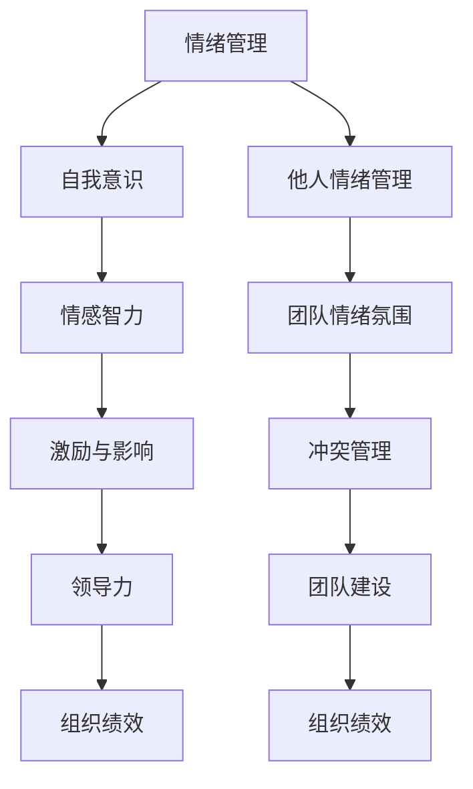

                 

# 情绪领导力：管理自己和他人情绪的技巧

## 关键词

- 情绪领导力
- 情绪管理
- 团队情绪
- 领导魅力
- 组织绩效

## 摘要

本文将深入探讨情绪领导力的核心概念和技巧，旨在帮助读者理解如何有效管理自身和他人的情绪，从而提升个人和组织绩效。通过分析情绪领导力与传统领导力的区别，以及情绪识别、表达和管理的基本策略，本文还将探讨情绪领导力在组织中的应用和实践。最后，通过成功和失败案例的解析，读者将获得对情绪领导力的深刻理解，并学会如何在工作和生活中提升自己的情绪领导力。

## 目录

### 第一部分：情绪领导力概述

**第1章：情绪领导力的核心概念**

- 1.1 情绪领导力的定义
- 1.2 情绪领导力的重要性
- 1.3 情绪领导力与传统领导力的区别
- 1.4 情绪领导力的发展历史
- 1.5 情绪领导力的适用范围

**第2章：情绪识别与管理**

- 2.1 自我情绪识别的方法
- 2.2 情绪表达与反馈技巧
- 2.3 情绪管理的基本策略
- 2.4 情绪调节的技巧
- 2.5 情绪管理与心理健康的关系

### 第二部分：情绪领导力在组织中的应用

**第3章：团队情绪领导力**

- 3.1 团队情绪识别与反馈
- 3.2 提升团队情绪氛围的方法
- 3.3 团队冲突管理
- 3.4 情绪领导力在团队建设中的应用
- 3.5 团队情绪领导力的案例分析

**第4章：领导者的情绪影响力**

- 4.1 领导者的情绪榜样作用
- 4.2 情绪影响力与领导魅力
- 4.3 领导者如何调动团队情绪
- 4.4 情绪领导力与领导力风格
- 4.5 领导者的情绪管理能力提升

**第5章：组织情绪领导力策略**

- 5.1 组织情绪氛围的评估
- 5.2 情绪领导力在组织文化建设中的应用
- 5.3 情绪领导力与员工满意度
- 5.4 情绪领导力在组织变革中的应用
- 5.5 情绪领导力与组织绩效

### 第三部分：情绪领导力实践

**第6章：情绪领导力在工作场合的应用**

- 6.1 情绪领导力在项目管理中的应用
- 6.2 情绪领导力在员工激励中的应用
- 6.3 情绪领导力在客户服务中的应用
- 6.4 情绪领导力在跨文化管理中的应用
- 6.5 情绪领导力在应急情况下的应用

**第7章：情绪领导力案例解析**

- 7.1 情绪领导力成功案例
- 7.2 情绪领导力失败案例
- 7.3 案例分析与启示
- 7.4 情绪领导力的未来趋势

**第8章：情绪领导力自我提升**

- 8.1 自我情绪领导力评估
- 8.2 提升情绪领导力的方法
- 8.3 情绪领导力训练与反思
- 8.4 情绪领导力与个人成长
- 8.5 情绪领导力在社会责任中的应用

**附录**

- 附录A：情绪领导力工具与资源

### 第一部分：情绪领导力概述

#### 第1章：情绪领导力的核心概念

情绪领导力是一种新兴的领导理念，它关注领导者如何通过管理自身和他人的情绪来提升组织绩效。情绪领导力不仅涉及个人的情绪管理，还包括如何激励、影响和领导团队中的其他成员。与传统领导力相比，情绪领导力更加注重情感层面，强调领导者与团队成员之间的情感连接和沟通。

### 核心概念与联系

首先，让我们通过一个Mermaid流程图来了解情绪领导力的核心概念及其相互关系：



在情绪领导力中，情绪管理是核心。情绪管理包括自我情绪管理和他人情绪管理。自我情绪管理涉及领导者如何识别、理解和调节自己的情绪，以保持冷静和专注。他人情绪管理则是指领导者如何识别、理解和影响团队成员的情绪，以促进团队合作和提高绩效。

### 核心算法原理讲解

情绪领导力的核心算法原理可以看作是一个复杂的多层次反馈系统。以下是一个简化的伪代码，用于描述这一过程：

```python
def emotional_leadership():
    # 自我情绪管理
    self_emotion = recognize_self_emotion()
    regulated_emotion = manage_self_emotion(self_emotion)

    # 他人情绪管理
    team_emotions = recognize_team_emotions()
    influenced_emotions = manage_team_emotions(team_emotions)

    # 领导力展现
    leadership_effectiveness = exhibit_leadership(regulated_emotion, influenced_emotions)

    # 组织绩效评估
    organizational_performance = assess_organizational_performance(leadership_effectiveness)

    return organizational_performance
```

在上述伪代码中，`recognize_self_emotion()` 函数用于识别领导者的自我情绪，`manage_self_emotion()` 函数用于调节这些情绪。`recognize_team_emotions()` 函数用于识别团队成员的情绪，`manage_team_emotions()` 函数用于影响这些情绪。最后，`exhibit_leadership()` 函数用于展现领导力，而`assess_organizational_performance()` 函数用于评估组织的绩效。

### 数学模型和公式

在情绪领导力中，有一些关键的数学模型和公式可以帮助我们理解情绪管理的过程。以下是一个简单的情绪调节模型：

$$
\text{regulated\_emotion} = f(\text{initial\_emotion}, \text{emotional\_intelligence}, \text{external\_influences})
$$

其中，`regulated_emotion` 是调节后的情绪，`initial_emotion` 是初始情绪，`emotional_intelligence` 是情感智力，`external_influences` 是外部影响。这个公式表明，情绪的调节不仅依赖于领导者的初始情绪，还受到情感智力和外部影响的影响。

### 举例说明

假设一位领导者在面对一个紧急的项目交付时感到焦虑。通过自我情绪识别，他意识到自己的焦虑情绪。接下来，他使用情感智力来分析焦虑的原因，并寻找调节情绪的方法。最终，他通过深呼吸和冥想技巧成功地调节了自己的情绪，从而保持了冷静和专注。这有助于他在团队中展现出稳定的领导力，提高了团队的绩效。

### 注意事项

- **持续学习**：情绪领导力是一个不断发展的领域，领导者需要持续学习和更新自己的知识。
- **实践应用**：情绪领导力的技巧需要通过实践来掌握，领导者应积极尝试并反馈改进。

### 拓展阅读

- 《情绪领导力：如何激发团队潜能》（Daniel Goleman）
- 《情绪智力》（Daniel Goleman）
- 《领导力与情绪智力》（Jack Zenger & Joseph R. Petroff）

### 小结

情绪领导力是一种新兴的领导理念，它强调领导者通过管理自身和他人的情绪来提升组织绩效。情绪领导力包括自我情绪管理和他人情绪管理，涉及多个关键概念和技巧。通过理解情绪领导力的核心概念、原理和实际应用，领导者可以更好地管理自己和团队的情绪，从而实现组织的长期成功。

### 参考文献

- Goleman, D. (1998). Emotional Intelligence. Bantam Books.
- Goleman, D. (1995). Working with Emotional Intelligence. Bantam Books.
- Zenger, T. R., & Petroff, J. R. (2015). The Role of Emotional Intelligence in Leadership: A Meta-analytic Review of 162 Leadership Studies. Journal of Management, 41(6), 1759-1798.

