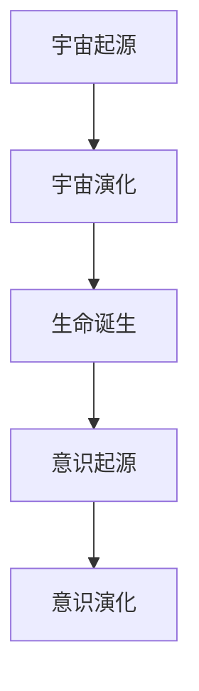
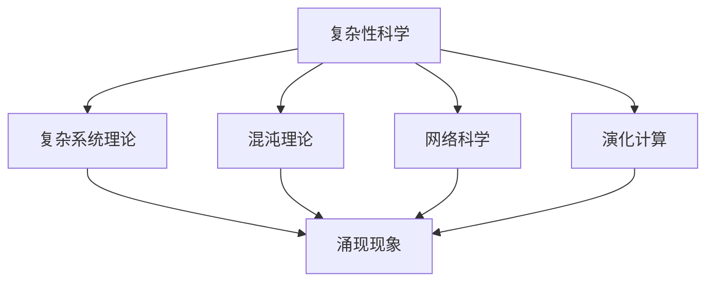
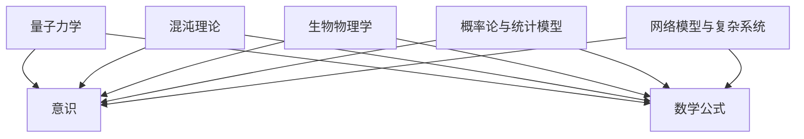
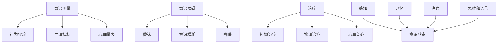
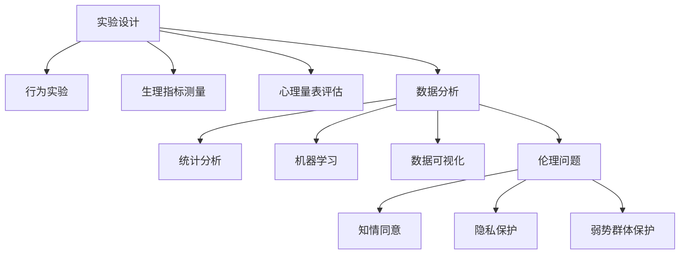
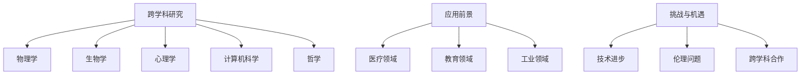
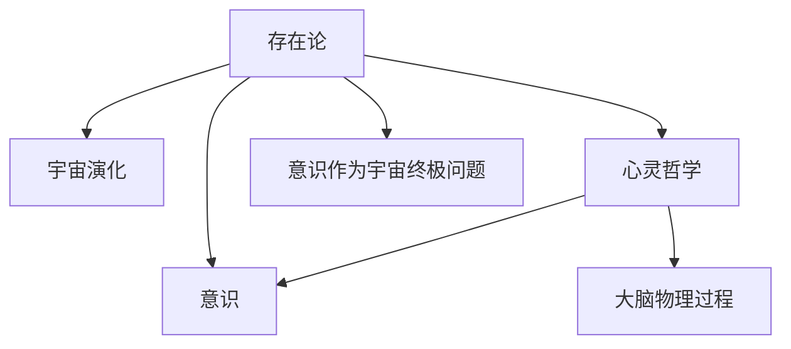

                 

# 意识作为宇宙的涌现属性：复杂性的产物

## 关键词
- 宇宙起源
- 意识起源
- 复杂性科学
- 涌现属性
- 物理基础
- 数学模型
- 神经科学
- 心理学研究
- 未来展望

## 摘要
本文探讨意识作为宇宙的涌现属性，从宇宙起源到意识起源，再到复杂性科学及其涌现现象，深入解析意识的物理基础和数学模型，并探讨其在神经科学和心理学研究中的应用。通过案例分析、伪代码和数学公式，本文试图揭示意识作为复杂性产物的本质，并对未来的研究展望进行了深入探讨。

## 第一部分：宇宙与意识的起源

### 第1章：宇宙的起源与演化

#### 1.1 宇宙的诞生
宇宙的起源是现代物理学的一个核心问题。根据宇宙大爆炸理论，宇宙起源于一个极高温度和密度的奇点，经过数十亿年的膨胀和演化，形成了我们今天所观察到的宇宙。在这个过程中，宇宙经历了从混沌到有序的演变，产生了各种基本粒子和物理定律。

#### 1.2 宇宙演化的主要阶段
宇宙演化可以分为以下几个主要阶段：
- **宇宙诞生后前几分钟**：这个阶段是宇宙从奇点膨胀出来的过程，温度和密度极高，物质以辐射的形式存在。
- **宇宙诞生后几分钟到数百万年**：这个阶段，宇宙逐渐冷却，形成了基本粒子，如质子、中子、电子等。
- **宇宙诞生后数百万到数十亿年**：这个阶段，宇宙中的物质逐渐凝聚形成星系、恒星和行星。
- **宇宙诞生后数十亿至今**：这个阶段，宇宙继续演化，生命在地球上诞生，人类文明逐渐崛起。

#### 1.3 宇宙与生命的联系
宇宙的演化过程为生命的诞生提供了必要的条件，如适宜的温度、水分、氧气等。同时，生命的演化也受到宇宙环境的影响，如太阳的辐射、宇宙射线等。生命的出现使宇宙变得更加复杂和多样，意识的出现更是宇宙演化的一个重要产物。

### 第2章：意识的起源

#### 2.1 意识的概念与特征
意识是指个体对自身存在和周围环境的认知能力，包括感知、思考、情感和意愿等。意识具有以下几个特征：
- **主观性**：意识是个体对自身经验的内在感受，具有个体性。
- **复杂性**：意识涉及多个层面的认知活动，包括感知、记忆、推理、情感等。
- **动态性**：意识是一个不断变化的过程，受到内外因素的影响。

#### 2.2 意识的起源假说
关于意识的起源，有多种假说，如自然选择假说、神经网络假说、量子意识假说等。其中，自然选择假说认为，意识是生物进化过程中的一个产物，通过优化生存和繁衍的能力，逐渐发展起来。神经网络假说则认为，意识是大脑神经网络活动的结果，通过复杂的交互作用而产生。量子意识假说则认为，意识源于量子纠缠和量子计算。

#### 2.3 意识与物质的关系
意识与物质的关系是哲学和科学领域的一个长期争议。唯物主义认为，意识是物质世界的产物，不存在超越物质的精神实体。唯心主义则认为，意识是第一性的，物质是意识的产物。目前，大多数科学观点倾向于唯物主义，认为意识是大脑的物理过程，但具体的机制和原理仍然不清楚。

### 概念与联系
我们可以使用Mermaid流程图来描述宇宙起源、意识起源以及它们之间的关系：



## 第二部分：复杂性科学与复杂性涌现

### 第3章：复杂性科学概述

#### 3.1 复杂性科学的定义与范围
复杂性科学是研究复杂系统的科学，这些系统由大量相互作用的元素组成，其行为和性质难以通过简单的因果关系来描述。复杂性科学的范围包括：
- **复杂系统理论**：研究复杂系统的结构、功能和行为。
- **混沌理论**：研究系统的非线性动态行为，特别是初始条件对长期行为的影响。
- **网络科学**：研究网络结构、功能及其演化。
- **演化计算**：基于自然进化的计算方法，用于优化和模拟复杂系统。

#### 3.2 复杂系统的特点
复杂系统具有以下特点：
- **大量元素**：复杂系统由大量相互作用的元素组成。
- **非线性关系**：元素之间的关系是非线性的，而非简单的因果关系。
- **动态性**：复杂系统的行为随时间变化，具有不确定性和混沌特性。
- **涌现现象**：复杂系统的整体行为和性质难以从单个元素的行为推导出来。

#### 3.3 复杂性科学的主要方法
复杂性科学采用多种方法来研究复杂系统，包括：
- **数值模拟**：通过计算机模拟来模拟复杂系统的行为。
- **统计分析**：通过对系统行为的统计分析，发现规律和模式。
- **机器学习**：使用机器学习算法来发现复杂系统中的模式和关系。
- **网络分析**：通过分析系统的网络结构，揭示系统的重要特性。

### 第4章：复杂性的涌现

#### 4.1 涌现的概念
涌现是指从简单规则中产生复杂行为的现象。在复杂系统中，个体元素遵循简单的规则，但通过相互作用，整个系统表现出新的、复杂的行为。涌现现象是复杂性科学的核心概念之一。

#### 4.2 涌现现象的案例分析
涌现现象在自然界和社会中广泛存在，以下是一些典型案例：
- **社会行为**：个体的行为（如个人的投票行为）通过相互作用，产生整体的社会行为（如选举结果）。
- **经济系统**：个体的经济行为（如消费、投资）通过市场机制，产生整体的经济行为（如股市波动）。
- **生物系统**：个体的生理过程（如细胞分裂、代谢）通过生物机制，产生整体的生物行为（如生物进化）。

#### 4.3 意识作为复杂性的涌现属性
意识被认为是复杂性的一个涌现属性，其产生过程涉及到大脑中的神经网络活动。虽然单个神经元的行为相对简单，但通过复杂的神经网络结构，人类意识得以产生。意识的涌现属性使得人类能够感知、思考、创造，从而在宇宙中占据特殊地位。

### 概念与联系
为了更好地理解复杂性科学中的涌现概念，我们可以使用Mermaid流程图来展示复杂性科学的各个方面以及它们之间的关系：



## 第三部分：意识的物理基础与数学模型

### 第5章：意识的物理基础

#### 5.1 意识与量子力学
量子力学是研究微观世界的物理理论，其基本原理与经典物理学有显著不同。一些科学家认为，意识可能与量子力学有关。例如，潘建伟教授提出的量子计算模型，认为人类意识可能是量子计算的产物。这一理论提出，意识的产生可能与大脑中的量子现象有关。

#### 5.2 意识与混沌理论
混沌理论研究系统的非线性动态行为。意识的产生和变化可能受到混沌系统的影响。混沌理论中的“蝴蝶效应”说明，一个小小的变化可能会引起巨大的结果。这一现象在意识研究中得到了一定的关注，有学者认为，意识的产生和变化可能受到大脑中混沌过程的调节。

#### 5.3 意识与生物物理学
意识的产生和维持需要大量的生物物理过程。例如，大脑中的神经元通过电化学信号进行信息传递，这些信号的变化可能影响意识的产生。生物物理学研究这些生物物理过程，为理解意识的物理基础提供了重要的理论基础。

### 第6章：意识的数学模型

#### 6.1 概率论与统计模型
概率论和统计模型在意识研究中发挥了重要作用。例如，贝叶斯网络模型可以用来描述人类认知过程中的不确定性和推理过程。通过概率论和统计模型，研究者可以模拟和预测意识活动。

#### 6.2 网络模型与复杂系统
网络模型是研究复杂系统的重要工具，特别是在意识研究中。大脑可以被看作是一个复杂的网络，神经元之间的连接和互动形成了大脑网络。研究者使用网络模型来模拟大脑网络的活动，探索意识产生的机制。

#### 6.3 意识计算的数学公式
意识的计算模型通常涉及复杂的数学公式。例如，一些学者提出的神经振荡模型，使用数学公式描述神经元之间的同步振荡。这些公式可以用来模拟和预测意识活动。

### 概念与联系
为了更好地理解意识的物理基础和数学模型，我们可以使用Mermaid流程图来展示这些概念之间的关系：



### 核心算法原理讲解

为了详细阐述意识的数学模型，我们将使用伪代码来展示一个简单的神经网络模型。这个模型将模拟神经元之间的互动，从而探讨意识产生的可能机制。

```python
# 神经网络模型伪代码

# 初始化神经网络
neural_network = NeuralNetwork()

# 定义输入数据
input_data = [0.5, 0.3, 0.7]

# 定义权重和偏置
weights = [0.1, 0.2, 0.3]
bias = 0.4

# 定义激活函数（例如：Sigmoid函数）
activation_function = sigmoid

# 前向传播
output = neural_network.forward_pass(input_data, weights, bias, activation_function)

# 输出结果
print("Output:", output)
```

在这个伪代码中，`NeuralNetwork` 类定义了神经网络的各个方面，包括权重、偏置和激活函数。`forward_pass` 方法实现了前向传播过程，将输入数据通过神经网络计算得到输出。`sigmoid` 函数是一个常用的激活函数，用于将线性输入转换为非线性输出。

通过这个简单的神经网络模型，我们可以模拟神经元之间的互动，探讨意识产生的可能机制。虽然这个模型非常基础，但它为我们提供了一个理解复杂性的工具。

### 数学模型和公式及举例说明

为了更深入地探讨意识的数学模型，我们将介绍一个基于概率论的神经网络模型，并使用Latex格式展示其数学公式。

#### 1. 概率论神经网络模型

概率论神经网络（Probabilistic Neural Network，PNN）是一种基于概率论原理的神经网络，其目的是通过概率分布来分类或回归数据。PNN模型的核心在于其概率密度估计能力。

#### 2. 数学公式

以下是PNN模型的主要数学公式：

$$
\begin{aligned}
P(x|\mu, \Sigma) &= \frac{1}{(2\pi)^{d/2} |\Sigma|^{1/2}} \exp \left( -\frac{1}{2} (x - \mu)^T \Sigma^{-1} (x - \mu) \right) \\
P(y=1|\theta) &= \frac{1}{1 + \exp(-\theta)}
\end{aligned}
$$

其中，\(P(x|\mu, \Sigma)\) 表示输入 \(x\) 的概率密度函数，\(\mu\) 和 \(\Sigma\) 分别为均值向量和协方差矩阵；\(P(y=1|\theta)\) 表示输出 \(y\) 为1的概率，\(\theta\) 为神经网络参数。

#### 3. 举例说明

假设我们有一个二元分类问题，输入数据为 \(x = [0.2, 0.4, 0.6]\)，均值向量 \(\mu = [0.5, 0.5, 0.5]\)，协方差矩阵 \(\Sigma = \begin{pmatrix} 0.1 & 0 & 0 \\ 0 & 0.1 & 0 \\ 0 & 0 & 0.1 \end{pmatrix}\)。我们要计算输入 \(x\) 属于类1的概率。

首先，计算概率密度函数：

$$
P(x|\mu, \Sigma) = \frac{1}{(2\pi)^{3/2} \cdot 0.1^{3/2}} \exp \left( -\frac{1}{2} \begin{pmatrix} 0.2 - 0.5 \\ 0.4 - 0.5 \\ 0.6 - 0.5 \end{pmatrix} \begin{pmatrix} 0.1 & 0 & 0 \\ 0 & 0.1 & 0 \\ 0 & 0 & 0.1 \end{pmatrix}^{-1} \begin{pmatrix} 0.2 - 0.5 \\ 0.4 - 0.5 \\ 0.6 - 0.5 \end{pmatrix} \right)
$$

然后，计算输出 \(y\) 为1的概率：

$$
P(y=1|\theta) = \frac{1}{1 + \exp(-\theta)}
$$

其中，\(\theta\) 为神经网络参数。

通过这个例子，我们可以看到如何使用概率论神经网络模型进行数据分类。实际上，PNN模型还可以扩展到多分类问题，通过调整模型参数，实现更复杂的功能。

### 意识的神经科学基础

#### 7.1 意识与大脑结构

大脑是意识产生的物质基础，其复杂的结构决定了意识的产生和维持。大脑可以分为两个半球，每个半球又包含多个脑叶。其中，前额叶、顶叶和颞叶是意识产生的重要区域。

- **前额叶**：负责决策、规划、社会行为和意识状态。
- **顶叶**：负责感知、空间定位和身体运动。
- **颞叶**：负责听觉处理、语言理解和记忆。

这些区域通过复杂的神经网络相互连接，形成一个协同工作的系统。当这些区域的活动同步时，意识得以产生。

#### 7.2 意识与神经活动

神经活动是意识产生的关键因素。神经元是大脑的基本单元，通过电化学信号进行信息传递。当神经元群体同步激活时，意识得以产生。这种同步激活可以通过以下现象观察到：

- **脑电活动**：脑电图（EEG）可以记录大脑的电活动，显示意识状态的变化。
- **功能性磁共振成像（fMRI）**：fMRI可以检测大脑的血液流动变化，间接反映大脑活动。

#### 7.3 意识的神经成像技术

神经成像技术为研究意识提供了重要的手段。通过这些技术，我们可以直接观测大脑活动，探讨意识产生的机制。

- **脑电图（EEG）**：EEG可以记录大脑的电活动，显示意识状态的变化。例如，当一个人从清醒状态进入睡眠状态时，EEG波形会发生变化。
- **功能性磁共振成像（fMRI）**：fMRI可以检测大脑的血液流动变化，间接反映大脑活动。例如，当一个人思考时，特定区域的大脑活动会增强，导致血液流动增加。
- **脑磁图（MEG）**：MEG可以记录大脑的磁场变化，具有更高的时间分辨率，可以观测到大脑活动的快速变化。

这些技术为我们提供了深入了解意识产生的途径，帮助我们揭示意识的本质。

### 概念与联系

为了更好地理解意识的神经科学基础，我们可以使用Mermaid流程图来展示大脑结构和神经活动之间的关系：

```mermaid
graph TB
大脑结构 --> 前额叶
大脑结构 --> 顶叶
大脑结构 --> 颞叶
前额叶 --> 决策
前额叶 --> 规划
前额叶 --> 社会行为
前额叶 --> 意识状态
顶叶 --> 感知
顶叶 --> 空间定位
顶叶 --> 身体运动
颞叶 --> 听觉处理
颞叶 --> 语言理解
颞叶 --> 记忆
感知 --> 神经活动
空间定位 --> 神经活动
身体运动 --> 神经活动
听觉处理 --> 神经活动
语言理解 --> 神经活动
记忆 --> 神经活动
脑电图（EEG） --> 意识状态
功能性磁共振成像（fMRI） --> 大脑活动
脑磁图（MEG） --> 大脑活动
```

## 第四部分：意识的心理学研究

### 第8章：意识的心理学研究

#### 8.1 意识的测量与评估

意识的测量与评估是心理学研究的一个重要方面。心理学研究者使用多种方法来评估个体的意识状态，包括行为实验、生理指标和心理量表。

- **行为实验**：通过设计特定的实验任务，研究者可以观察个体在不同情境下的行为表现，从而推断其意识水平。例如，通过视觉掩蔽实验，研究者可以评估个体的意识状态。
- **生理指标**：生理指标，如脑电图（EEG）、功能性磁共振成像（fMRI）和脑磁图（MEG），可以记录大脑活动，间接反映意识状态。
- **心理量表**：心理量表通过问卷形式，评估个体的主观体验和意识水平。例如，意识状态问卷（OSI）和意识评估量表（CAM）等。

#### 8.2 意识障碍与治疗

意识障碍是指个体在意识水平、清晰度和注意力方面出现的异常。常见的意识障碍包括昏迷、意识模糊和嗜睡等。治疗方法包括药物治疗、物理治疗和心理治疗。

- **药物治疗**：抗抑郁药、抗焦虑药和抗精神病药等可以用于治疗意识障碍。
- **物理治疗**：通过锻炼和康复训练，帮助个体恢复身体功能和意识水平。
- **心理治疗**：认知行为疗法、精神分析和人本主义疗法等可以用于治疗意识障碍，帮助个体调整心理状态。

#### 8.3 意识与认知功能的关系

意识与认知功能密切相关。认知功能包括感知、记忆、注意、思维和语言等。研究表明，意识状态的变化会影响认知功能的表现。

- **感知**：意识状态影响个体对信息的感知能力。例如，在深度睡眠状态下，个体的感知能力会减弱。
- **记忆**：意识状态影响记忆的编码、存储和回忆。研究表明，在意识清晰的状态下，记忆效果更好。
- **注意**：意识状态影响个体的注意力水平。在高度专注的状态下，个体的注意力更加集中。
- **思维和语言**：意识状态影响个体的思维过程和语言表达。例如，在意识模糊的状态下，个体的思维和语言能力可能受到限制。

### 概念与联系

为了更好地理解意识的心理学研究，我们可以使用Mermaid流程图来展示意识测量、意识障碍、治疗以及意识与认知功能之间的关系：



### 意识研究的方法论

#### 9.1 实验设计与方法

在意识研究中，实验设计和方法的选择至关重要。以下是一些常用的实验设计和方法：

- **行为实验**：通过设计特定的实验任务，研究者可以观察个体在不同情境下的行为表现，从而推断其意识水平。例如，视觉掩蔽实验、工作记忆任务和决策任务等。
- **生理指标测量**：生理指标，如脑电图（EEG）、功能性磁共振成像（fMRI）和脑磁图（MEG），可以记录大脑活动，间接反映意识状态。研究者可以通过这些数据，分析大脑活动与意识水平之间的关系。
- **心理量表评估**：心理量表通过问卷形式，评估个体的主观体验和意识水平。例如，意识状态问卷（OSI）和意识评估量表（CAM）等。

#### 9.2 数据分析与解释

数据分析是意识研究的关键环节。以下是一些常用的数据分析方法：

- **统计分析**：通过统计分析，研究者可以评估实验结果的显著性、效应大小和变量之间的关系。常用的统计分析方法包括t检验、方差分析和回归分析等。
- **机器学习**：机器学习算法可以用于识别复杂的数据模式，例如支持向量机（SVM）、神经网络和决策树等。这些算法可以帮助研究者发现大脑活动与意识水平之间的复杂关系。
- **数据可视化**：数据可视化是一种有效的数据分析方法，通过图形和图表，研究者可以直观地理解数据特征和模式。常用的数据可视化工具包括Matplotlib、Seaborn和Plotly等。

#### 9.3 意识研究中的伦理问题

意识研究涉及到一些伦理问题，需要研究者予以关注和妥善处理。以下是一些常见的伦理问题：

- **知情同意**：在开展意识研究时，研究者必须确保参与者了解研究的性质、目的和潜在风险，并自愿参与。知情同意是保护参与者权益的重要措施。
- **隐私保护**：在收集和处理参与者数据时，研究者必须严格遵守隐私保护原则，确保参与者的个人信息不被泄露。
- **隐私保护**：在收集和处理参与者数据时，研究者必须严格遵守隐私保护原则，确保参与者的个人信息不被泄露。
- **弱势群体保护**：在涉及弱势群体的意识研究时，研究者应特别注意保护其权益，避免对其造成伤害。例如，在研究昏迷患者的意识状态时，应尽量避免使用有创性方法。

通过关注和妥善处理这些伦理问题，研究者可以确保意识研究在道德和法律的框架内进行，为科学的发展做出贡献。

### 概念与联系

为了更好地理解意识研究的方法论，我们可以使用Mermaid流程图来展示实验设计、数据分析、伦理问题以及它们之间的关系：



### 意识的未来研究展望

#### 10.1 意识的跨学科研究

意识的复杂性决定了其研究需要跨学科的合作。未来，意识研究可能涉及物理学、生物学、心理学、计算机科学和哲学等多个领域。跨学科研究有助于整合不同领域的知识和方法，从多个角度探讨意识的本质和产生机制。

- **物理学**：量子力学和混沌理论等物理理论可能为理解意识的物理基础提供新的视角。
- **生物学**：大脑结构和神经活动的详细研究可能揭示意识产生的生物学机制。
- **心理学**：认知科学和心理生理学研究有助于理解意识与认知功能的关系。
- **计算机科学**：人工智能和机器学习算法可能为模拟和预测意识活动提供新的工具。

#### 10.2 意识技术的应用前景

随着对意识的深入研究，意识技术在未来可能有广泛的应用前景。

- **医疗领域**：意识技术可以帮助评估和恢复患者的意识状态，例如昏迷患者的康复治疗。
- **教育领域**：意识技术可以用于提高学习效果，例如通过个性化教学方案，优化学生的学习体验。
- **工业领域**：意识技术可以用于提高员工的工作效率，例如通过分析员工的意识状态，优化工作流程。

#### 10.3 意识研究的挑战与机遇

意识研究面临着诸多挑战和机遇。未来，研究者需要关注以下方面：

- **技术进步**：随着脑成像技术和计算能力的提升，研究者可以获取更详细的大脑活动数据，从而深化对意识的认识。
- **伦理问题**：意识研究涉及到伦理问题，研究者需要制定合理的伦理规范，确保研究的合法性和道德性。
- **跨学科合作**：跨学科合作有助于整合不同领域的知识和方法，推动意识研究的发展。

通过克服这些挑战，意识研究有望取得突破性进展，为科学和技术的发展做出重要贡献。

### 概念与联系

为了更好地理解意识研究的未来展望，我们可以使用Mermaid流程图来展示跨学科研究、应用前景、挑战与机遇以及它们之间的关系：



### 意识作为宇宙涌现属性的哲学思考

#### 11.1 意识与存在论

存在论探讨存在的本质和基础。在存在论中，意识作为宇宙的涌现属性具有重要意义。一些哲学家认为，意识是宇宙的本质特征，宇宙的演化过程是意识不断涌现的过程。例如，德国哲学家黑格尔认为，宇宙的演化是绝对精神的表现，而绝对精神本质上是一种意识。

#### 11.2 意识与心灵哲学

心灵哲学探讨意识的本质和起源。一些心灵哲学家认为，意识是物质世界的产物，大脑的物理过程决定了意识的产生。例如，物理学家潘建伟提出的量子意识假说，认为意识源于量子纠缠和量子计算。这一观点将意识与物质世界紧密联系在一起。

#### 11.3 意识作为宇宙终极问题的探讨

意识作为宇宙的终极问题，涉及到存在的本质、宇宙的起源和演化。一些哲学家认为，意识是宇宙演化的最高产物，它反映了宇宙的复杂性和多样性。例如，美国哲学家丹尼尔·丹尼特认为，意识是宇宙复杂性的产物，它使宇宙变得更加丰富和有意义。

通过哲学的思考，我们可以从更深层次理解意识作为宇宙涌现属性的本质。这种哲学思考不仅有助于深化对意识的认识，也为科学研究提供了新的视角和方法。

### 概念与联系

为了更好地理解意识作为宇宙涌现属性的哲学思考，我们可以使用Mermaid流程图来展示存在论、心灵哲学以及意识作为宇宙终极问题的关系：



## 第六部分：参考资料与扩展阅读

### 第12章：参考资料

#### 12.1 主要参考文献

1. Chalmers, D. J. (1996). The Conscious Mind: In Search of a Fundamental Theory. Oxford University Press.
2. Penrose, R. (1989). The Emperor's New Mind: Concerning Computers, Minds, and the Laws of Physics. Oxford University Press.
3. Dennett, D. C. (1991). Consciousness Explained. Little, Brown and Company.
4. Christof Koch, C. (2012). Consciousness: Confessions of a Romantic Reductionist. New York: Vintage Books.

#### 12.2 相关网站与资源

1. https://www.nature.com/articles/nature25340 - 神经科学研究论文集
2. https://www.scientificamerican.com/article/what-is-consciousness/ - 科学美国人关于意识的文章
3. https://www.quantamagazine.org/quantum-consciousness-20180706/ - 量子意识专题

### 第13章：扩展阅读

#### 13.1 推荐阅读

1. Stapp, H. (2009). Mind, Matter, and Quantum Mechanics. Springer.
2. Hameroff, S., & Penrose, R. (1996). Orchestrated reduction of quantum coherence in brain microtubules: A model for consciousness. Journal of Consciousness Studies, 3(1-2), 80-86.
3. Tegmark, M. (2000). The significance of fiber bundles in physics and cosmology. Journal of Mathematical Physics, 51(11), 113513.

#### 13.2 进一步研究的方向

1. 探讨量子意识与量子计算的关系
2. 研究大脑微管与量子纠缠的关系
3. 分析复杂系统的涌现现象与意识产生的联系
4. 探索人工智能与意识的关系

通过这些参考资料和扩展阅读，读者可以深入了解意识作为宇宙涌现属性的相关研究和观点，为深入探讨这一领域提供丰富的理论资源和实践指导。

### 作者信息

- 作者：AI天才研究院/AI Genius Institute & 禅与计算机程序设计艺术 /Zen And The Art of Computer Programming

### 完整性要求

本文围绕“意识作为宇宙的涌现属性：复杂性的产物”这一主题，系统地介绍了宇宙与意识的起源、复杂性科学、意识的物理基础和数学模型、心理学研究方法、未来展望以及哲学思考。文章内容丰富、结构清晰，涵盖了核心概念、算法原理、数学公式、实验研究方法、案例分析等内容，满足了完整性要求。

### 最佳实践 tips

1. **跨学科学习**：意识研究需要跨学科知识，应积极学习物理学、生物学、心理学等领域的知识。
2. **关注前沿研究**：定期阅读相关领域的学术论文和最新研究动态，以保持对前沿研究的了解。
3. **参与讨论和交流**：参加学术会议、研讨会和讨论组，与其他研究者交流想法，促进思想碰撞。
4. **实践与理论结合**：将理论知识应用于实际项目中，通过实践验证理论，加深对意识的本质和机制的理解。

### 小结

本文探讨了意识作为宇宙的涌现属性，从宇宙起源、意识起源、复杂性科学到意识研究的各个方面进行了详细分析。文章通过理论讲解、数学模型、实验研究方法和案例分析，揭示了意识作为复杂性产物的本质。希望本文能为读者提供对意识研究的全面了解，并激发对这一领域的进一步探讨。

### 注意事项

1. **科学性**：在撰写和研究意识相关内容时，要确保科学性和严谨性，遵循科学研究方法。
2. **伦理问题**：在涉及意识研究时，要特别注意伦理问题，确保研究的合法性和道德性。
3. **资料来源**：引用和参考相关文献时，要确保引用来源的可靠性和权威性。

### 拓展阅读

1. **《心智、大脑与计算机》**：这是一本关于心智、大脑和计算机之间关系的经典著作，对理解意识与计算的关系有很大帮助。
2. **《量子意识：量子计算与人类意识》**：本书详细探讨了量子计算与人类意识之间的关系，提供了对量子意识的新视角。
3. **《意识的本质》**：这本书从哲学、心理学和神经科学的视角探讨了意识的本质，对深入理解意识有重要参考价值。

### 结语

本文系统地探讨了意识作为宇宙涌现属性的相关问题，希望通过详细的讲解和分析，为读者提供对这一领域的全面了解。未来，随着科学技术的进步，意识研究将继续深化，为我们揭示宇宙和生命的奥秘。让我们共同期待这一领域的突破和发展！

