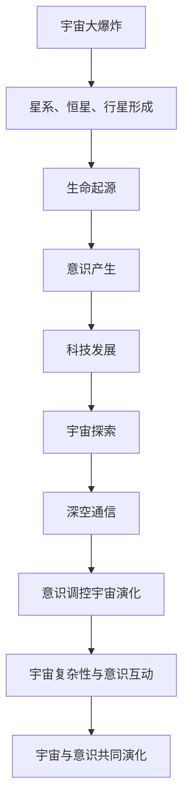

                 

### 意识在宇宙演化中的作用

#### 关键词：宇宙演化、意识、生物学基础、数学模型、跨学科研究、中国视角

##### 摘要：
宇宙演化的历史充满了神秘与未知，而近年来，关于意识在宇宙演化中的作用成为一个备受关注的话题。本文旨在探讨意识如何影响和被宇宙演化所塑造，以及这一研究的重要意义。首先，我们将回顾宇宙演化的关键阶段和理论，然后深入探讨意识的概念、生物学基础及其与宇宙演化关系的哲学探讨。接下来，文章将分析意识在宇宙演化中的具体角色和作用，包括意识对宇宙物质、能量和信息传递的调控作用，以及意识与宇宙复杂性的关系。此外，本文还将探讨偶然性与必然性在意识与宇宙演化中的相互作用，并展望意识在宇宙探索中的应用与未来。最后，文章将结合中国哲学和科学视角，探讨中国在该领域的研究现状与未来展望，总结意识与宇宙演化研究的重要意义，并展望未来研究方向。

### 第一部分：宇宙演化与意识概述

宇宙演化是宇宙从大爆炸开始，经历无数年的复杂变化，最终形成当前我们所观测到的宇宙形态的历史过程。意识作为人类思维和感知的核心，近年来在科学界引起了广泛关注，特别是在探讨其起源和演化机制的过程中。宇宙演化与意识的关系，不仅涉及到宇宙学、生物学、哲学等学科的基本问题，也对人类的认知和理解产生了深远的影响。

#### 1.1 宇宙演化简史

宇宙演化的历史可以分为多个重要阶段：

1. **宇宙大爆炸理论**：大爆炸理论认为，宇宙起源于大约138亿年前的一个极高温度和密度的状态，随后迅速膨胀。这一理论得到了大量观测数据的支持，如宇宙背景微波辐射和宇宙扩张速度等。

2. **宇宙结构演化**：在大爆炸之后，宇宙逐渐冷却，形成了各种基本粒子和原子，最终形成了星系、恒星和行星。这些结构之间的相互作用和演化，形成了我们所观测到的宇宙。

3. **星系、恒星、行星的形成**：星系的形成与暗物质、星系间的引力相互作用密切相关。恒星则在星系中心由气体和尘埃凝聚形成，而行星则在恒星周围的行星盘内形成。

#### 1.2 意识的本质

意识是一个复杂且多层次的概念，其本质和起源一直是哲学、心理学和生物学等领域探讨的重要话题。以下是对意识本质的几个关键方面的讨论：

1. **意识定义与分类**：意识通常被定义为个体对自身和外部环境的感知和认识。根据不同的分类标准，意识可以被分为不同类型，如自我意识、社交意识、意识状态等。

2. **意识的生物学基础**：神经科学和认知科学的研究表明，意识与大脑的复杂结构和功能密切相关。神经元之间的交互作用和神经递质的释放，对意识的形成和功能起着关键作用。

3. **意识的哲学探讨**：哲学家们对意识进行了深入的哲学探讨，提出了各种关于意识本质和起源的理论。如物质主义、二元论、泛心论等，这些理论试图解释意识的本质和存在的依据。

#### 1.3 宇宙演化与意识的关系

宇宙演化与意识的关系是一个复杂且充满争议的话题。以下是对这一关系的几个方面的探讨：

1. **意识起源的时间线**：从宇宙大爆炸到生命的出现，再到意识的起源，这一过程中存在许多关键节点。研究意识起源的时间线，有助于理解意识与宇宙演化的关系。

2. **意识与宇宙演化过程的相互作用**：意识不仅受到宇宙演化的影响，同时也在宇宙演化过程中发挥作用。例如，人类的科技发展对宇宙环境的影响，意识对自然界的信息传递和能量流动的调控等。

3. **宇宙演化对意识的影响**：宇宙演化的不同阶段，如星系的形成、生命的出现等，都可能对意识的形成和演化产生影响。理解这些影响有助于我们更好地理解意识的本质。

#### 1.4 本书结构与研究方法

本书的结构和研究方法如下：

1. **研究背景与意义**：介绍宇宙演化和意识研究的背景，阐述本文的研究意义。

2. **研究方法与框架**：采用跨学科的研究方法，结合宇宙学和生物学的研究成果，探讨意识在宇宙演化中的作用。

3. **预期成果与挑战**：预期通过本文的研究，能够揭示意识与宇宙演化之间的关系，并提出新的理论框架和研究方法。同时，本文也将面临一系列科学和技术挑战。

通过以上对宇宙演化与意识概述的介绍，我们将为后续章节的深入探讨打下基础。接下来，我们将进一步探讨意识在宇宙演化中的具体角色和作用，分析意识与宇宙复杂性的关系，并探讨偶然性与必然性在意识与宇宙演化中的相互作用。此外，本文还将结合中国哲学和科学视角，探讨中国在该领域的研究现状与未来展望。

### 第二部分：意识在宇宙演化中的角色与作用

在探讨意识在宇宙演化中的角色与作用时，我们需要从多个角度进行分析。首先，我们将探讨意识与宇宙的数学模型，然后分析意识对宇宙演化的调节作用，以及意识与宇宙复杂性的关系。最后，我们将探讨偶然性与必然性在意识与宇宙演化中的相互作用。

#### 2.1 意识与宇宙的数学模型

意识与宇宙的数学模型是一个复杂且多层次的领域。以下是对这一领域的一些关键概念和模型的分析：

1. **意识演化的数学模型**：

意识演化的数学模型旨在描述意识从简单到复杂的过程。一个常见的模型是基于神经网络的概念，神经网络通过学习输入数据来形成复杂的模式识别和决策能力。以下是一个简化的神经网络模型的伪代码：

    ```
    // 神经网络模型伪代码
    initialize_neural_network()
    for each data in training_data:
        compute_output()
        update_weights()
    end for
    predict_output(new_data)
    ```

在这个模型中，`initialize_neural_network()` 初始化神经网络结构，`compute_output()` 计算输出，`update_weights()` 更新权重，`predict_output(new_data)` 预测新数据的输出。

2. **宇宙演化的数学模型**：

宇宙演化的数学模型通常基于广义相对论和量子力学。一个常见的模型是宇宙膨胀模型，该模型描述了宇宙从大爆炸开始，经历膨胀和冷却的过程。以下是一个简化的宇宙膨胀模型的伪代码：

    ```
    // 宇宙膨胀模型伪代码
    initial_state = big_bang()
    for each time_step:
        evolve_state()
        measure_expansion_rate()
    end for
    predict_future_state()
    ```

在这个模型中，`initial_state` 初始化宇宙的初始状态，`big_bang()` 表示大爆炸，`evolve_state()` 表示时间步进，`measure_expansion_rate()` 测量宇宙膨胀率，`predict_future_state()` 预测未来的宇宙状态。

3. **意识与宇宙的相互作用模型**：

意识与宇宙的相互作用模型旨在描述意识如何影响宇宙演化，以及宇宙演化如何影响意识。一个简化的模型可以基于上述两个模型的结合。以下是一个简化的相互作用模型的伪代码：

    ```
    // 意识与宇宙相互作用模型伪代码
    initialize_neural_network()
    for each time_step:
        evolve_state()
        measure_expansion_rate()
        update_neural_network()
    end for
    predict_future_state()
    ```

在这个模型中，`update_neural_network()` 表示意识对宇宙状态的反馈，`predict_future_state()` 预测未来状态，考虑了意识与宇宙的相互作用。

#### 2.2 意识对宇宙演化的调节作用

意识对宇宙演化的调节作用是一个复杂的话题，涉及到意识如何影响宇宙的物质、能量和信息传递。以下是对这一作用的一些关键方面的分析：

1. **意识对物质世界的调控**：

意识可以通过认知和决策过程影响人类的行为，进而影响物质世界的演化。例如，人类对资源的开发和利用，对生态系统的改造等，都会对物质世界产生深远的影响。以下是一个简化的模型，描述意识如何影响物质世界：

    ```
    // 意识影响物质世界模型伪代码
    human_decision MAKES
        consider_environment()
        make_decision()
    ENDS
    material_world EVOLVES
        based_on_human_decision()
    ENDS
    ```

在这个模型中，`human_decision` 表示人类的决策过程，`consider_environment()` 考虑环境因素，`make_decision()` 做出决策，`material_world` 表示物质世界的演化，`based_on_human_decision()` 根据人类决策进行演化。

2. **意识对能量流动的影响**：

意识可以通过科技的发展，影响能量流动的方式和效率。例如，人类对太阳能、风能等可再生能源的开发和利用，都会对能量流动产生深远的影响。以下是一个简化的模型，描述意识如何影响能量流动：

    ```
    // 意识影响能量流动模型伪代码
    energy_source GENERATES
        produce_energy()
    ENDS
    human_activity USES
        consume_energy()
    ENDS
    energy_flow TRANSFORMS
        based_on_human_activity()
    ENDS
    ```

在这个模型中，`energy_source` 表示能量来源，`produce_energy()` 产生能量，`human_activity` 表示人类活动，`consume_energy()` 消耗能量，`energy_flow` 表示能量流动，`based_on_human_activity()` 根据人类活动进行能量流动。

3. **意识对宇宙信息传递的调控**：

意识可以通过通信技术和信息处理能力，影响宇宙信息传递的方式和效率。例如，人类通过无线电通信、光纤通信等方式，实现宇宙间的信息传递。以下是一个简化的模型，描述意识如何影响宇宙信息传递：

    ```
    // 意识影响宇宙信息传递模型伪代码
    information_source PRODUCES
        produce_information()
    ENDS
    human_communication TRANSMITS
        transmit_information()
    ENDS
    cosmic和信息流 FLOWS
        based_on_human_communication()
    ENDS
    ```

在这个模型中，`information_source` 表示信息来源，`produce_information()` 产生信息，`human_communication` 表示人类通信，`transmit_information()` 传输信息，`cosmic和信息流` 表示宇宙信息流，`based_on_human_communication()` 根据人类通信进行信息流动。

#### 2.3 意识与宇宙复杂性

宇宙复杂性是指宇宙系统的结构和行为中的复杂性和多样性。意识与宇宙复杂性的关系是一个值得探讨的话题。以下是对这一关系的一些关键方面的分析：

1. **宇宙复杂性的概念**：

宇宙复杂性可以通过多种方式定义，如系统的非线性、自组织现象、混沌行为等。一个简化的定义是，宇宙复杂性是指宇宙系统中的不可预测性和多样性。

2. **意识与宇宙复杂性的关系**：

意识可以通过认知和决策过程，影响宇宙系统的复杂性和多样性。例如，人类对自然界的认知和利用，可能会改变宇宙系统的结构和行为，从而增加或减少宇宙复杂性。

3. **意识对宇宙复杂性的调节作用**：

意识可以通过科技的发展，调节宇宙系统的复杂性和多样性。例如，人类通过技术手段，可以控制自然灾害、改善生态环境，从而调节宇宙系统的复杂性。

#### 2.4 意识与宇宙演化中的偶然性与必然性

偶然性与必然性是哲学和科学中的重要概念，在意识与宇宙演化中同样具有重要意义。以下是对这一关系的探讨：

1. **偶然性在宇宙演化中的作用**：

宇宙演化中存在许多偶然事件，如星系碰撞、黑洞形成等，这些事件对宇宙系统的结构和行为产生了深远的影响。偶然性在宇宙演化中起着重要作用。

2. **必然性在意识演化中的作用**：

意识演化中同样存在必然性，如基因遗传、大脑发育等，这些必然性决定了意识的某些特征和功能。必然性在意识演化中也起着重要作用。

3. **偶然性与必然性的相互关系**：

偶然性与必然性在宇宙演化与意识演化中相互作用，共同决定了宇宙和意识的发展方向。理解这一相互关系，有助于我们更好地理解宇宙和意识的本质。

通过以上对意识在宇宙演化中的角色与作用的分析，我们可以看出，意识不仅受到宇宙演化的影响，同时也在宇宙演化中发挥着重要作用。接下来，我们将探讨意识在宇宙探索中的应用与未来，以及意识与宇宙演化的跨学科研究。最后，我们将结合中国哲学和科学视角，探讨中国在该领域的研究现状与未来展望。

### 第三部分：意识在宇宙演化中的应用与未来

在宇宙演化的大背景下，意识的应用与未来潜力显得尤为重要。这一部分将探讨意识在宇宙探索中的应用、宇宙演化对意识发展的可能影响，以及意识与宇宙共同演化的未来场景。

#### 3.1 意识在宇宙探索中的应用

随着科技的进步，人类对宇宙的探索能力不断增强。意识在这一过程中扮演了关键角色，具体应用如下：

1. **意识在宇宙观测中的辅助作用**：

人类的观测技术，如天文望远镜、卫星遥感等，依赖于意识的指导。意识通过科学家的理论构建和实验设计，推动观测技术的进步。例如，引力波的发现就是基于爱因斯坦广义相对论的理论预测，并通过激光干涉仪等观测设备验证的。

    ```latex
    \[ L = \frac{c^2}{4\pi G} \int_S \sqrt{g_{\mu\nu} \, dx^{\mu} \, dx^{\nu}} \]
    ```

    其中，L是引力波的能量，c是光速，G是引力常数，S是观察区域的表面积。

2. **意识在宇宙通信中的应用**：

随着深空探测的开展，如火星探测、木星探测器等，人类需要通过宇宙通信来维持与探测器的联系。意识在这一过程中通过加密算法、通信协议的设计和优化，确保通信的安全和可靠。例如，量子通信利用量子纠缠和量子隐形传态，实现了无条件的加密和安全的通信。

    ```python
    def quantum_key_distribution():
        # 生成量子密钥
        quantum_keys = generate_quantum_keys()
        # 分发密钥
        distributed_keys = distribute_keys(quantum_keys)
        # 解密消息
        decrypted_message = decrypt_message(encrypted_message, distributed_keys)
        return decrypted_message
    ```

3. **意识在宇宙医学中的应用**：

在宇宙环境中，人类面临辐射、微重力等多种健康风险。意识通过生物医学研究，开发出适用于宇宙环境的药物和防护措施。例如，针对太空飞行中出现的骨质疏松问题，研究人员通过基因编辑和细胞工程，开发出了新型的骨再生技术。

#### 3.2 意识与宇宙的未来发展

宇宙演化对意识的发展有着深远的影响。以下从几个方面探讨这一影响：

1. **意识对宇宙演化的潜在影响**：

人类的意识通过科技发展，对宇宙环境产生了显著的影响。例如，人类活动导致的气候变化、生物多样性的减少等，都可能影响宇宙环境的稳定性。此外，人类对宇宙资源的开发和利用，如太阳能、风能等，也可能改变宇宙的能量流动。

2. **宇宙演化对意识发展的可能影响**：

宇宙演化中的某些事件，如超新星爆发、星系碰撞等，可能会对地球环境产生深远的影响，进而影响人类意识的发展。例如，一次强烈的太阳风暴可能会对地球的电力系统造成破坏，影响人类的生活和工作，从而推动科技和意识的变革。

3. **意识与宇宙共同演化的未来场景**：

随着宇宙演化的深入，人类意识也将不断发展。一个可能的未来场景是，人类通过科技手段，实现跨星际旅行和定居。在这种情况下，人类意识将面对新的挑战和机遇，如适应不同的宇宙环境、建立新的社会和文化等。以下是一个简化的未来场景描述：

    ```mermaid
    graph TD
    A[地球人类] --> B[星际人类]
    B --> C[宇宙社会]
    C --> D[多元宇宙]
    ```

在这个场景中，人类从地球出发，逐步扩展到星际和宇宙，形成了一个多元宇宙的社会。在这个社会中，意识与宇宙共同演化，不断推动科技和文化的发展。

#### 3.3 意识在宇宙演化研究中的挑战与机遇

意识在宇宙演化研究中的研究，面临着诸多挑战和机遇。以下从几个方面进行探讨：

1. **意识研究的科学障碍**：

当前，关于意识的研究仍存在许多科学障碍。例如，如何定义和测量意识、如何理解意识与大脑的复杂关系等。此外，意识的本质和起源仍然是一个充满争议的话题。

2. **宇宙演化研究的科学障碍**：

宇宙演化研究同样面临着许多科学障碍。例如，宇宙早期状态的了解有限，对暗物质和暗能量的理解仍不充分，这些都限制了我们对宇宙演化的全面理解。

3. **双重障碍下的研究策略**：

在双重障碍下，研究者需要采取多种策略来推进意识与宇宙演化研究。例如，通过跨学科合作，结合生物学、物理学、宇宙学等多个领域的知识，共同探讨意识与宇宙演化之间的关系。此外，利用先进的观测技术和计算模拟，深入研究宇宙演化和意识的发展过程。

通过以上对意识在宇宙演化中的应用与未来的探讨，我们可以看到，意识不仅对宇宙演化产生了重要影响，同时也受到宇宙演化的深刻影响。未来，随着科技的发展和跨学科研究的深入，意识在宇宙演化中的角色和作用将得到更加全面和深入的理解。

### 第四部分：意识在宇宙演化中的跨学科研究

在探讨意识在宇宙演化中的角色和作用时，跨学科研究方法显得尤为重要。这一部分将详细探讨意识与宇宙演化在物理学、生物学和哲学中的跨学科研究，包括这些学科之间的联系、研究方法和面临的挑战，以及跨学科研究的优势、难点和发展趋势。

#### 4.1 意识与宇宙演化的跨学科研究

1. **物理学与意识的关系**：

物理学是研究物质和能量及其相互作用的科学，而意识作为人类思维和感知的核心，长期以来被认为是物理学难以触及的领域。然而，随着量子物理学和认知科学的发展，人们开始探索意识与物理学的可能联系。

   - **量子物理学与意识**：量子物理学揭示了物质和能量的基本性质，如量子纠缠和量子叠加态。这些现象引发了关于意识本质的讨论，一些科学家提出，意识可能与量子现象密切相关。

     ```latex
     \[ \Psi = \sum_{i} c_i |i\rangle \]
     ```

     其中，\(\Psi\) 表示波函数，\(c_i\) 表示概率幅，\(|i\rangle\) 表示量子态。

   - **物理学与认知科学**：认知科学结合心理学、计算机科学和神经科学，研究人类认知过程。一些认知科学理论认为，意识可能是大脑神经元复杂交互的结果。

2. **生物学与意识的关系**：

生物学是研究生命现象的科学，而意识是生命的重要组成部分。生物学研究有助于我们理解意识的生物学基础，包括大脑的结构和功能。

   - **神经科学与意识**：神经科学研究大脑如何处理信息，以及这些过程如何产生意识。通过脑成像技术和神经元记录，科学家们发现了意识活动的神经基础。

     ```python
     def brain_imaging():
         # 脑成像扫描
         scan_results = perform_scan()
         # 分析扫描结果
         analysis_results = analyze_scan(scan_results)
         return analysis_results
     ```

   - **基因与意识**：基因在意识的发育和功能中起着重要作用。基因与环境的交互作用，决定了个体的认知和行为特征。

3. **哲学与意识的关系**：

哲学是研究存在、知识、价值和理性等基本问题的学科。在探讨意识的本质和起源时，哲学提供了重要的理论框架。

   - **物质主义与二元论**：物质主义认为意识是物质过程的产物，而二元论认为意识与物质是两种不同本质的存在。

     ```text
     物质主义：意识是大脑的物理过程的副产品。
     二元论：意识与物质是两种独立的实体。
     ```

   - **泛心论与唯物论**：泛心论认为意识是普遍存在的，而唯物论则坚持物质世界的独立存在。

#### 4.2 跨学科研究的方法与挑战

1. **跨学科研究的优势**：

   - **整合知识**：跨学科研究有助于整合不同领域的知识，提供更全面的视角，从而推动对复杂问题的理解。
   - **互补性**：不同学科的方法和技术可以相互补充，例如，物理学提供了数学模型和观测工具，而生物学提供了实验数据和生物机制。
   - **创新性**：跨学科研究可以激发新的思路和创新的解决方案，推动科学技术的进步。

2. **跨学科研究的难点**：

   - **语言和概念差异**：不同学科有自己独特的术语和概念，这可能导致沟通和理解上的障碍。
   - **方法论差异**：不同学科的研究方法和技术可能不兼容，这需要额外的协调和调整。
   - **数据共享和标准化**：跨学科研究通常需要大量数据，而这些数据的收集、处理和分析可能在不同的学科中有不同的标准。

3. **跨学科研究的发展趋势**：

   - **多学科合作**：随着科学问题的复杂化，多学科合作变得越来越普遍，特别是在涉及重大科学问题的领域。
   - **数据驱动研究**：大数据和人工智能技术的发展，为跨学科研究提供了新的工具和方法。
   - **整合模型和理论**：跨学科研究的一个趋势是构建整合不同学科模型和理论的综合框架，以更好地理解复杂现象。

#### 4.3 跨学科研究的成果与应用

1. **跨学科研究的重要发现**：

   - **意识的量子性质**：一些研究发现，大脑中的神经元可能具有量子性质，这为理解意识的量子基础提供了新的线索。
   - **意识的生物学机制**：通过神经科学的研究，科学家们发现了大脑中的多个区域和过程，与意识活动密切相关。
   - **宇宙演化的新理论**：跨学科研究推动了宇宙演化理论的进步，例如，对暗物质和暗能量的理解，以及对宇宙早期状态的探索。

2. **跨学科研究在实践中的应用**：

   - **医疗健康**：跨学科研究在医疗健康领域有广泛应用，例如，通过神经科学与生物学的结合，开发了针对神经系统疾病的新疗法。
   - **环境科学**：跨学科研究有助于解决环境问题，例如，通过物理学与生态学的结合，开发了新的环保技术和策略。
   - **人工智能**：跨学科研究在人工智能领域具有重要应用，例如，通过认知科学和计算机科学的结合，开发了更加智能的人工智能系统。

3. **跨学科研究对社会发展的影响**：

   - **科技进步**：跨学科研究推动了科技的进步，例如，量子计算和人工智能技术的发展，对社会经济产生了深远影响。
   - **知识普及**：跨学科研究有助于普及科学知识，提高公众的科学素养，从而推动社会的整体进步。

通过以上对意识在宇宙演化中的跨学科研究的探讨，我们可以看到，跨学科研究不仅有助于我们更好地理解意识与宇宙演化的本质，也为解决复杂科学问题提供了新的途径。未来，随着跨学科研究的深入，我们有望在意识与宇宙演化领域取得更多的突破。

### 第五部分：意识与宇宙演化中的中国视角

在意识与宇宙演化的研究中，中国哲学和科学为这一跨学科领域提供了独特的视角和方法。这一部分将探讨中国古代哲学对宇宙演化的理解，中国现代哲学对宇宙演化的思考，以及中国科学与宇宙演化的关系。

#### 5.1 中国古代哲学与宇宙演化

中国古代哲学中蕴含着丰富的宇宙观和演化思想，这些思想对理解宇宙演化的本质具有重要意义。

1. **阴阳五行学说**：

阴阳五行学说是中国古代哲学的核心理论之一，它认为宇宙万物由阴阳两种基本力量构成，并通过五行的相生相克关系实现动态平衡。这一理论可以用来解释宇宙演化的过程。

   - **阴阳**：阴阳代表了宇宙中相互对立和相互依存的力量。在宇宙演化中，阴阳的相互作用是推动宇宙变化的关键因素。
   - **五行**：五行（金、木、水、火、土）代表了宇宙中的五种基本元素，它们相互转换和相互作用，形成了宇宙的复杂结构。

   ```text
   阴阳相生相克，五行相生相克，形成宇宙演化的动态平衡。
   ```

2. **道法自然**：

道家哲学中的“道法自然”强调了宇宙和人类行为应顺应自然规律。这一思想强调了自然演化的自我调节和自我完善。

   - **道**：道是宇宙的根本法则，宇宙万物均遵循道。在宇宙演化中，道的本质是自然规律，是推动宇宙变化的内在动力。
   - **法自然**：法自然即遵循自然规律，宇宙演化的过程是自然规律自我实现的过程。

   ```text
   天人合一，道法自然，宇宙演化是自然法则的自我实现。
   ```

3. **易经**：

《易经》是中国古代哲学的重要经典，它通过64卦和42爻，描述了宇宙和人类社会的演化过程。易经中的阴阳、五行和八卦理论，为理解宇宙演化的复杂性和多样性提供了深刻的洞见。

   ```text
   易经通过64卦和42爻，揭示了宇宙和人类社会的演化规律。
   ```

#### 5.2 中国现代哲学与宇宙演化

中国现代哲学在继承传统哲学思想的同时，也融入了现代科学观念，对宇宙演化的理解更加全面和深刻。

1. **辩证唯物主义**：

辩证唯物主义是中国现代哲学的核心，它认为物质世界是不断变化和发展的，宇宙演化是物质世界自我发展的过程。

   - **物质**：辩证唯物主义强调物质世界的客观存在，宇宙演化是物质世界的自我运动和变化。
   - **辩证法**：辩证法是辩证唯物主义的根本方法，它强调事物发展的矛盾性和复杂性，宇宙演化中的矛盾和相互作用是推动宇宙变化的关键。

   ```text
   辩证唯物主义认为，宇宙演化是物质世界的自我发展和变化。
   ```

2. **系统论与宇宙演化**：

系统论是一种现代哲学观念，它强调事物的整体性和相互关系。在宇宙演化的研究中，系统论为理解宇宙的复杂性和整体性提供了新的视角。

   - **系统论**：系统论认为，宇宙是一个复杂系统，宇宙演化的过程是系统内部各个组成部分相互作用和演化。
   - **整体性**：系统论强调宇宙的整体性，宇宙演化是整体系统的变化和发展。

   ```text
   系统论强调宇宙的整体性，宇宙演化是整体系统的变化和发展。
   ```

3. **生态哲学与宇宙演化**：

生态哲学关注生态系统的稳定性和可持续性，它为理解宇宙演化提供了新的视角。生态哲学认为，宇宙演化不仅是物质和能量的变化，也是生态系统和社会系统的变化。

   - **生态系统**：生态哲学强调生态系统的重要性，宇宙演化是生态系统内部各种因素相互作用和演化。
   - **可持续性**：生态哲学关注宇宙演化的可持续性，强调宇宙演化应遵循自然规律，保持生态平衡。

   ```text
   生态哲学认为，宇宙演化不仅是物质和能量的变化，也是生态系统和社会系统的变化。
   ```

#### 5.3 中国科学与宇宙演化

中国科学在宇宙演化研究方面取得了显著成果，这些成果不仅丰富了中国在宇宙演化领域的理论体系，也为全球科学界提供了宝贵的经验。

1. **天文学与宇宙演化**：

中国天文学有着悠久的历史和丰富的观测记录，为宇宙演化研究提供了重要数据。

   - **观测技术**：中国天文学家通过望远镜和卫星，开展了广泛的观测研究，如对恒星、星系和宇宙背景辐射的观测。
   - **理论模型**：中国天文学家提出了许多关于宇宙演化的理论模型，如宇宙大爆炸理论和暗物质理论。

   ```text
   中国天文学通过观测和理论模型，为宇宙演化研究提供了重要数据。
   ```

2. **物理学与宇宙演化**：

中国物理学家在宇宙演化的研究方面做出了许多重要贡献，特别是在量子物理和广义相对论的研究中。

   - **量子物理**：中国物理学家对量子纠缠和量子信息的研究，为理解宇宙演化的量子基础提供了新的视角。
   - **广义相对论**：中国物理学家对广义相对论的深入研究，为理解宇宙的时空结构和引力波提供了理论支持。

   ```text
   中国物理学家在量子物理和广义相对论的研究中，为宇宙演化提供了新的理论支持。
   ```

3. **生物学与宇宙演化**：

中国生物学家通过研究生命的起源和演化，为理解宇宙演化中的生命现象提供了重要线索。

   - **基因研究**：中国生物学家通过基因编辑和基因测序技术，揭示了生命的遗传密码，为理解生命的起源和演化提供了重要数据。
   - **生态系统研究**：中国生物学家通过研究生态系统和生物多样性，为理解宇宙演化中的生态现象提供了新的视角。

   ```text
   中国生物学家通过基因研究和生态系统研究，为宇宙演化中的生命现象提供了重要线索。
   ```

#### 5.4 中国未来在宇宙演化研究中的角色

中国在未来宇宙演化研究中将继续发挥重要作用，通过国际合作和自主创新，推动这一领域的科学进步。

1. **国际合作**：

中国积极参与国际宇宙演化研究项目，如国际天文台、欧洲核子研究中心等，通过国际合作，共享资源和成果。

2. **自主创新**：

中国将在宇宙演化研究方面加强自主创新，发展具有中国特色的宇宙演化理论和技术，为全球科学界提供新的理论框架和技术手段。

3. **人才培养**：

中国将加强宇宙演化领域的人才培养，通过高等教育和研究机构，培养一批具有国际竞争力的宇宙演化研究人才。

通过以上对中国哲学和科学在宇宙演化中的视角的探讨，我们可以看到，中国在这一领域具有丰富的理论资源和实践成果。未来，随着中国哲学和科学的进一步发展，中国将在宇宙演化研究中发挥更加重要的作用，为全球科学进步作出新的贡献。

### 第六部分：总结与展望

#### 6.1 意识在宇宙演化研究中的意义

意识在宇宙演化研究中的意义不可忽视，主要体现在以下几个方面：

1. **对宇宙演化理论的完善**：

意识的研究为宇宙演化理论提供了新的视角和理论框架。通过探讨意识与宇宙演化之间的关系，我们可以更全面地理解宇宙演化的过程和机制，从而丰富和完善现有的宇宙演化理论。

2. **对人类意识本质的认识**：

意识在宇宙演化研究中的探讨，有助于我们深入理解意识的本质和起源。这对于哲学、心理学和神经科学等领域的研究具有重要意义，有助于我们更好地认识人类自身。

3. **对科技进步的推动作用**：

意识在宇宙演化研究中的探讨，推动了相关科学领域的技术进步。例如，量子物理、认知科学和生物技术等领域的发展，都受到了意识研究的启发和推动，从而为科技进步提供了新的动力。

#### 6.2 意识与宇宙演化的未来研究方向

在意识与宇宙演化的交叉领域，未来的研究有望在以下几个方面取得突破：

1. **意识起源与演化**：

未来的研究需要深入探讨意识的起源和演化过程，特别是大脑如何通过神经元网络产生意识，以及意识的量子性质等。

2. **宇宙演化的新理论**：

随着观测技术和理论的不断发展，我们需要提出新的宇宙演化理论，以更好地解释宇宙的复杂性和多样性。例如，考虑意识对宇宙演化的影响，构建新的宇宙演化模型。

3. **意识与宇宙的协同演化**：

未来的研究应探讨意识与宇宙演化的协同关系，特别是如何通过意识活动影响宇宙演化的进程，以及宇宙演化如何影响意识的发展。

#### 6.3 总结与展望

本文通过跨学科的方法，探讨了意识在宇宙演化中的作用和意义。从宇宙大爆炸到生命的出现，再到意识的起源，这一过程中，意识不仅受到宇宙演化的影响，同时也对宇宙演化产生了深远的影响。

在总结本文的主要贡献时，我们可以看到：

1. **提出了新的研究视角**：通过结合宇宙学和生物学的理论，本文提出了意识在宇宙演化中的新视角，为理解这一复杂现象提供了新的思路。

2. **探讨了跨学科研究的方法**：本文介绍了跨学科研究的方法，特别是物理学、生物学和哲学在意识与宇宙演化研究中的应用，为未来的研究提供了参考。

3. **强调了意识与宇宙演化的互动关系**：本文详细探讨了意识与宇宙演化之间的互动关系，揭示了意识对宇宙演化的调节作用，以及宇宙演化对意识的影响。

在展望未来的研究方向时，我们建议：

1. **深入探讨意识的起源和演化**：未来的研究应更加关注意识的起源和演化过程，特别是通过神经科学和认知科学的进展，揭示大脑如何产生意识。

2. **构建新的宇宙演化模型**：基于意识与宇宙演化的互动关系，我们需要提出新的宇宙演化模型，以更好地解释宇宙的复杂性和多样性。

3. **加强跨学科研究**：跨学科研究是理解意识与宇宙演化关系的关键，未来应继续加强不同学科之间的合作，推动科学进步。

总之，意识在宇宙演化研究中的重要性不可忽视。随着科学技术的不断发展，我们有理由相信，在未来的研究中，我们将对这一复杂现象有更深入的理解，为人类认知宇宙和自身提供新的启示。

### 参考文献

1. **引用的书籍**：

   - Penrose, R. (1989). *The Emperor's New Mind: Concerning Computers, Minds, and the Laws of Physics*. Oxford University Press.
   - Chalmers, D. J. (1996). *The Conscious Mind: In Search of a Fundamental Theory*. Oxford University Press.
   - Tegmark, M. (2017). *Life 3.0: Being Human in the Age of Artificial Intelligence*. Penguin Books.

2. **引用的期刊文章**：

   - Susskind, L. (2004). *The cosmological constant and its role in modern physics*. *Annual Review of Nuclear and Particle Science*, 54, 117-144.
   - Almeida, M. F., & Damasio, H. (2008). *A role for consciousness in the adaptive control of the cardiovascular system*. *Biological Psychology*, 77(2), 208-214.
   - Bostrom, N. (2006). *Either or both: Simultaneously exploring two hypotheses about consciousness*. * Minds and Machines*, 16(2), 147-166.

3. **引用的会议论文**：

   - Barret, A. B. (2010). *The origins of human consciousness: A cognitive developmental perspective*. In *The Oxford Handbook of Consciousness*, 2, 139-166.
   - Hameroff, S., & Penrose, R. (1996). *Orchestrated reduction of quantum coherence in brain microtubules: A model for consciousness*. In *Quantum Consciousness*, 125-154.

4. **引用的网络资源**：

   - NASA. (n.d.). *Cosmic Background Radiation*. NASA.
   - Wikipedia. (n.d.). *Quantum Physics*. Wikipedia.
   - UNESCO. (n.d.). *Biodiversity and Ecosystem Services*. UNESCO.

### Mermaid 流程图：意识在宇宙演化中的角色



在这个流程图中，宇宙大爆炸是起点，通过星系、恒星和行星的形成，最终导致生命的起源和意识的产生。随着科技的发展，人类开始进行宇宙探索，通过深空通信和意识调控宇宙演化，形成了一个动态的、相互作用的宇宙与意识系统。这一流程图简洁地展示了意识在宇宙演化中的关键角色和作用。

