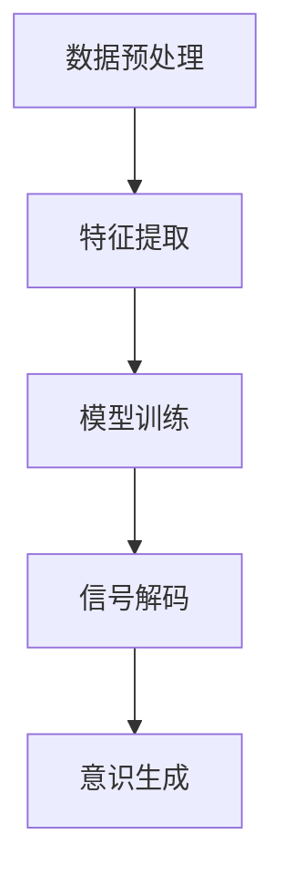
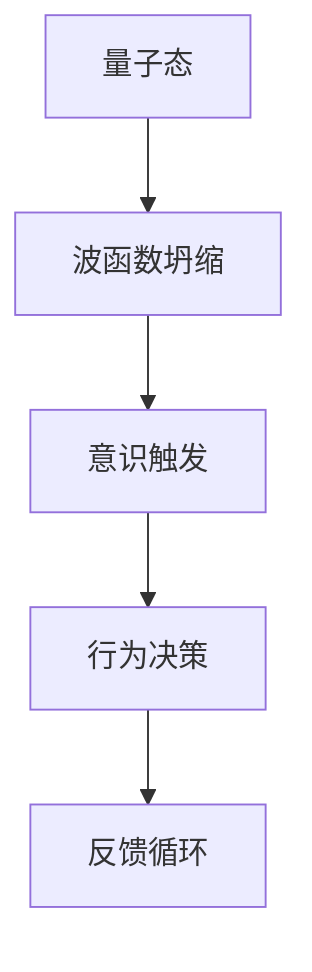
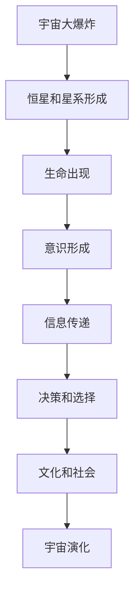
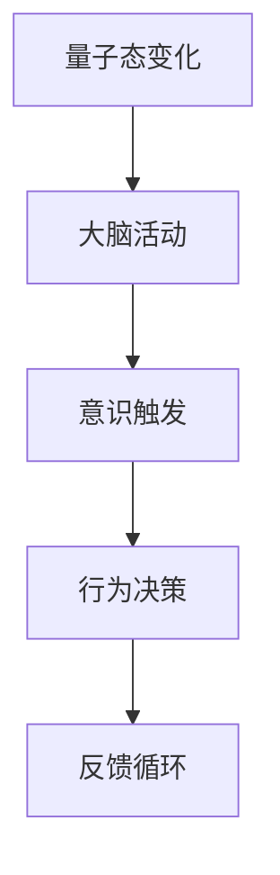

                 

### 文章标题

《意识是否是宇宙的基本属性之一》

### 关键词

意识、宇宙、基本属性、科学角度、哲学角度、跨学科研究、人工智能、神经科学、量子力学、计算模型、唯物主义、唯心主义、存在论

### 摘要

本文旨在探讨意识是否是宇宙的基本属性之一。从科学和哲学两个角度出发，本文分析了意识的定义和性质，宇宙的基本属性，意识的起源和本质，以及意识与宇宙演化之间的关系。通过综合神经科学、量子力学、计算模型等多学科的研究成果，本文提出了对意识本质和存在的一些见解，并展望了未来的研究方向。本文希望能为读者提供一个全面、深入的认识，激发对意识本质和宇宙奥秘的思考。

### 第一部分：引言与概述

#### 导言

意识是人类认知世界的重要工具，也是哲学探讨的核心问题之一。从广义上讲，意识是指个体对外界和内心世界的感知、理解和反应能力。它包括感觉、知觉、记忆、思维、情感等多种心理活动。在物理学中，意识通常被视为一种主观体验，难以用客观的物理量来描述。

探讨意识是否是宇宙的基本属性之一，是一个深刻的哲学问题。宇宙的基本属性通常指的是构成宇宙的基本元素和法则，如物质、能量、时空、物理定律等。如果意识是宇宙的基本属性之一，那么它应当与宇宙的演化、结构和功能密切相关。这个问题不仅关乎人类自身的认知和理解，也关乎宇宙的本质和未来。

为什么意识是重要的哲学问题？首先，意识是人类存在的基础，没有意识，人类无法进行认知活动，无法理解世界。其次，意识是哲学探讨的核心问题之一，涉及到存在、意识、自我、自由意志等基本哲学问题。最后，意识与科学的发展紧密相关，许多科学领域，如神经科学、心理学、量子力学等，都在探讨意识的本质和机制。

#### 宇宙的基本属性

宇宙的基本属性是理解宇宙本质和演化过程的基础。从宇宙学的角度来看，宇宙的基本属性主要包括物质、能量、时空、物理定律等。

物质是宇宙中最基本的实体，包括恒星、行星、星系等。能量是物质运动和变化的度量，包括光能、热能、动能等。时空是物质存在的背景，描述了物质运动的规律。物理定律则是宇宙演化过程中遵循的基本法则，如引力定律、电磁定律、强相互作用定律、弱相互作用定律等。

这些基本属性相互作用，共同构成了宇宙的演化过程。例如，物质通过引力相互作用形成恒星、星系等结构，能量通过辐射、碰撞等形式传递，时空通过弯曲和膨胀等过程演化。物理定律则在这些过程中起到指导作用，保证了宇宙的稳定和有序。

#### 意识的起源和本质

意识的起源和本质是一个复杂的哲学和科学问题。从科学角度来看，意识的起源和本质主要涉及神经科学、量子力学、心理学等领域的研究。

神经科学研究表明，意识源于大脑的活动。大脑是由数十亿个神经元组成的复杂网络，神经元之间的相互作用产生了意识。大脑的不同区域负责处理不同的信息，如视觉、听觉、触觉等。神经元之间的信号传递和整合形成了意识。

量子力学研究表明，意识可能与量子态有关。量子力学中的波函数描述了粒子的状态，波函数的坍缩被认为与意识产生有关。一些理论认为，意识是量子计算的结果，或者与量子态的纠缠有关。

心理学研究表明，意识是一种主观体验，与个体的感知、记忆、思维、情感等活动密切相关。心理学中的认知科学试图从信息处理的角度理解意识，认为意识是大脑处理信息的一种方式。

综合来看，意识的起源和本质是一个多学科交叉的问题。尽管目前对意识的本质和起源还没有完全解释清楚，但科学和哲学的研究都在不断推进，为我们理解意识提供了新的视角。

#### 本书结构

本书将分五个部分进行论述：

1. **科学角度下的意识研究**：分析神经科学、量子力学、计算模型等角度对意识的研究，探讨意识的本质和机制。
2. **哲学角度下的意识探讨**：从唯物主义、唯心主义等哲学角度出发，探讨意识的存在和本质。
3. **跨学科综合研究**：结合心理学、人工智能等学科，探讨意识与行为、意识与宇宙演化之间的关系。
4. **挑战与未来方向**：分析意识研究中的难题，探讨未来的研究方向。
5. **结论与展望**：总结本文的观点，讨论意识在宇宙中的地位和意义。

通过这五个部分的论述，我们希望能提供一个全面、深入的认识，帮助读者更好地理解意识这一复杂而又重要的主题。

### 第二部分：科学角度下的意识研究

#### 神经科学与意识

神经科学是研究神经系统结构、功能及其活动规律的科学。在意识的研究中，神经科学扮演着重要角色。通过神经科学的研究，我们可以了解大脑如何产生意识，以及意识在不同大脑区域的活动情况。

**大脑结构与意识功能**

大脑是意识产生的核心器官，其结构复杂，功能多样。大脑分为两个半球，每个半球又分为多个叶，如额叶、顶叶、颞叶和枕叶。不同的脑区负责处理不同类型的意识活动。例如：

- **额叶**：与决策、规划和社交行为有关。
- **顶叶**：与空间知觉、触觉和运动控制有关。
- **颞叶**：与听觉处理、语言理解和记忆有关。
- **枕叶**：与视觉处理和空间定位有关。

研究表明，这些脑区的协同工作是意识产生的基础。例如，当大脑受到刺激时，不同脑区之间的信号传递和整合产生了意识。这种信号传递主要通过神经递质进行，如多巴胺、血清素等。

**神经递质与意识**

神经递质是神经元之间传递信息的化学物质，对意识产生和维持具有重要作用。不同类型的神经递质参与不同的意识活动。例如：

- **多巴胺**：与奖励和动机有关，缺乏多巴胺可能导致抑郁和注意力缺陷。
- **血清素**：与情绪稳定和睡眠有关，血清素水平异常可能导致焦虑和失眠。
- **乙酰胆碱**：与记忆和学习有关，乙酰胆碱水平异常可能导致认知障碍。

**伪代码：神经信号处理与意识解码**

为了更好地理解神经信号处理与意识解码，我们可以使用伪代码来描述这个过程：

```python
def neural_signal_processing(input_signal):
    # 数据预处理
    preprocessed_signal = preprocess_signal(input_signal)
    
    # 提取特征
    features = extract_features(preprocessed_signal)
    
    # 加载神经网络模型
    model = load_neural_network_model()
    
    # 进行模型训练
    trained_model = train_model(model, features)
    
    # 进行信号解码
    decoded_signal = decode_signal(trained_model, features)
    
    return decoded_signal
```

通过上述伪代码，我们可以看到，神经信号处理与意识解码是一个复杂的过程，涉及到数据预处理、特征提取、模型训练和信号解码等多个步骤。这些步骤共同作用，帮助我们从复杂的神经信号中提取出意识信息。

**Mermaid流程图：神经信号处理与意识演化过程**

为了更直观地理解神经信号处理与意识演化过程，我们可以使用Mermaid流程图来描述：



在这个流程图中，数据预处理、特征提取、模型训练和信号解码是意识生成的前四个关键步骤。通过这些步骤，大脑从复杂的神经信号中提取出意识信息，形成了意识。

#### 量子力学与意识

量子力学是研究微观粒子行为的物理学分支。近年来，量子力学与意识的关系引起了广泛关注。一些研究表明，量子力学中的基本原理可能与意识的产生和维持有关。

**量子态与意识**

量子态是量子力学中的基本概念，描述了微观粒子的状态。量子态具有叠加性和纠缠性，这些特性在量子计算和量子通信中具有重要意义。一些理论认为，量子态的变化可能与意识有关。

例如，量子力学中的波函数描述了粒子的状态，波函数的坍缩被认为与意识产生有关。波函数的坍缩是指，在测量之前，粒子处于多种可能状态的叠加，但在测量后，粒子只存在于一种确定的状态。这种波函数的坍缩过程被认为是一种非局域的过程，可能与意识有关。

**波函数坍缩与意识触发**

波函数坍缩与意识触发的关系是一个备受争议的话题。一些理论认为，波函数的坍缩是由观察者的意识触发的。这意味着，观察者的意识是波函数坍缩的必要条件。

例如，Penrose和Hameroff提出的大脑微管模型认为，大脑中的微管可能作为量子计算的单元，产生意识。在微管中，量子态的变化可能触发波函数的坍缩，从而产生意识。

**Mermaid流程图：量子态变化与意识演化过程**

为了更直观地理解量子态变化与意识演化过程，我们可以使用Mermaid流程图来描述：



在这个流程图中，量子态、波函数坍缩、意识触发、行为决策和反馈循环是意识演化的重要步骤。通过这些步骤，量子态的变化最终产生了意识。

#### 计算模型与意识

计算模型是研究意识的一种重要方法。通过构建计算模型，我们可以模拟意识产生的过程，从而更好地理解意识的本质。

**人工神经网络与意识模拟**

人工神经网络（Artificial Neural Network，ANN）是一种模仿生物神经网络的计算模型。近年来，人工神经网络在意识模拟中取得了重要进展。一些研究表明，通过训练人工神经网络，可以模拟意识的某些特征。

例如，深度学习（Deep Learning）是一种基于人工神经网络的方法，可以用于图像识别、语音识别和自然语言处理等任务。一些研究表明，深度学习模型在处理复杂任务时，可能表现出类似意识的特征，如感知、理解和决策。

**机器学习算法与意识相关研究**

除了人工神经网络，机器学习算法也在意识研究中发挥了重要作用。机器学习是一种从数据中自动学习规律的方法，可以用于分类、回归、聚类等任务。

例如，支持向量机（Support Vector Machine，SVM）是一种常见的机器学习算法，可以用于图像分类。一些研究表明，通过使用SVM，可以识别出图像中的意识特征，从而判断个体是否处于意识状态。

**伪代码：基于深度学习的意识预测模型**

为了更好地理解计算模型在意识研究中的应用，我们可以使用伪代码来描述一个基于深度学习的意识预测模型：

```python
def predict_awareness(input_data):
    # 数据预处理
    processed_data = preprocess_data(input_data)
    
    # 加载预训练模型
    model = load_pretrained_model()
    
    # 进行模型预测
    predictions = model.predict(processed_data)
    
    # 解码预测结果
    awareness_levels = decode_predictions(predictions)
    
    return awareness_levels
```

在这个伪代码中，数据预处理、模型加载、模型预测和结果解码是意识预测的关键步骤。通过这些步骤，我们可以从输入数据中预测个体是否处于意识状态。

### 第三部分：哲学角度下的意识探讨

#### 唯物主义与意识

唯物主义是哲学中的一个基本立场，主张物质是世界的基本构成要素，意识是物质的产物。在唯物主义的视角下，意识的起源和本质都与物质基础紧密相关。

**物质基础与意识产生的机制**

唯物主义认为，大脑是意识的物质基础。大脑由神经元组成，神经元之间的相互作用产生了意识。这个过程可以通过以下几个步骤来理解：

1. **感官接收**：外界信息通过感官进入大脑，如视觉、听觉、触觉等。
2. **信息处理**：大脑对感官信息进行处理，识别、分类、整合等。
3. **意识产生**：处理后的信息在大脑特定区域产生意识体验。

这种意识产生的机制可以通过以下几个数学模型来描述：

$$
\text{意识强度} = f(\text{感官输入}, \text{大脑处理})
$$

其中，\(f\) 表示大脑处理信息的功能，\(\text{感官输入}\) 和 \(\text{大脑处理}\) 分别表示外界信息和大脑处理过程。

**举例说明：唯物主义视角下的意识产生模型**

一个简单的例子是，当人们看到红色的物体时，视网膜上的感光细胞会被激活，产生的神经信号被传递到大脑皮层。大脑皮层对这些信号进行处理，最终产生了对红色物体的意识体验。

**数学模型与公式：唯物主义视角下的意识产生模型**

唯物主义视角下的意识产生模型可以通过以下数学公式来描述：

$$
\text{意识强度} = \sum_{i=1}^{n} w_i \cdot \text{激活强度}_i
$$

其中，\(w_i\) 表示第 \(i\) 个感官输入的权重，\(\text{激活强度}_i\) 表示第 \(i\) 个感官输入的激活强度。

这个公式表明，意识强度是多个感官输入的加权和，每个感官输入都有其权重。这个模型强调了感官输入和大脑处理在意识产生中的重要性。

#### 唯心主义与意识

唯心主义是哲学中的另一种基本立场，主张意识是世界的基本构成要素，物质是意识的产物。在唯心主义的视角下，意识被认为是宇宙的本质，物质只是意识的表现形式。

**意识作为宇宙本质的探讨**

唯心主义认为，宇宙的本质是意识，物质只是意识的一种表现形式。这种观点可以通过以下数学公式来解释：

$$
\text{宇宙} = f(\text{意识主体}, \text{意识内容})
$$

其中，\(f\) 表示意识主体对意识内容进行表达和体验的过程。

**举例说明：唯心主义视角下的意识存在解释模型**

一个简单的例子是，当人们看到一个红色的物体时，实际上是在意识中体验到了红色的感觉。这个红色感觉并不是物体本身的颜色，而是意识对物体颜色的体验。

**数学公式：唯心主义视角下的意识存在解释模型**

唯心主义视角下的意识存在解释模型可以通过以下数学公式来描述：

$$
\text{意识存在} \Leftrightarrow \text{意识主体存在}
$$

这个公式表明，意识的存在与意识主体的存在是等价的。如果意识主体存在，那么意识就存在；如果意识主体不存在，那么意识也就不存在。

这个公式强调了意识作为宇宙本质的重要性，意识是宇宙存在的核心。

#### 意识与存在论

存在论是哲学中探讨实体存在方式和本质的学说。在存在论的视角下，意识作为一种存在形式，有其独特的地位和意义。

**意识的实在性问题**

在存在论中，实在性问题是一个核心议题。意识作为一种存在形式，其实在性如何解释？唯心主义和唯物主义对此有不同的看法。

**举例说明：意识在不同哲学体系中的探讨**

1. **唯心主义视角**：在唯心主义的视角下，意识被认为是宇宙的本质，是第一性的存在。物质世界只是意识的表现形式，是第二性的存在。例如，柏拉图的理念论认为，真实的存在是理念世界，物质世界只是理念世界的投影。

2. **唯物主义视角**：在唯物主义的视角下，意识被认为是物质的产物，是第二性的存在。物质世界是第一性的存在，意识只是物质运动和变化的产物。例如，马克思的物质论认为，物质是世界的本质，意识是物质的反映。

这两个例子展示了唯心主义和唯物主义对意识存在问题的不同解释。唯心主义认为意识是第一性的存在，物质是第二性的存在；唯物主义认为物质是第一性的存在，意识是第二性的存在。

### 第四部分：跨学科综合研究

#### 心理学与意识的互动

心理学是研究人类行为和心理过程的科学。在心理学中，意识是一个重要的研究主题，心理学与意识的互动关系是理解人类行为和心理机制的关键。

**意识对行为的影响**

意识对行为有着深远的影响。例如，意识可以调节和控制行为，使个体能够有意识地选择和执行行动。以下是一些具体的例子：

1. **决策过程**：意识使个体能够对不同的选择进行评估和比较，从而做出最优决策。
2. **问题解决**：意识使个体能够分析和解决问题，从而提高问题解决能力。
3. **自我调节**：意识使个体能够自我监督和调整行为，从而提高自我控制能力。

**意识与情感的关系**

情感是心理学中的另一个重要主题，它与意识密切相关。情感是意识体验的一部分，可以影响意识内容和行为。

1. **情绪反应**：情感可以影响个体的情绪反应，如愉悦、愤怒、恐惧等。
2. **情绪调节**：意识可以帮助个体调节情绪，使其更好地适应环境。
3. **情绪记忆**：意识可以影响情绪记忆的形成和保持，使个体对重要事件有更深刻的记忆。

**举例说明：意识与行为实验**

一个经典的实验是“斯坦福监狱实验”。在这个实验中，参与者被随机分为监狱警卫和囚犯，模拟监狱生活。实验结果显示，意识的影响在行为中起着重要作用。警卫表现出强烈的权威和控制欲望，而囚犯表现出恐惧和服从。

**实验结果解析**：这个实验表明，意识可以影响个体的行为，使其表现出与日常社会角色不同的行为。这进一步说明，意识在人类行为中起着关键作用。

#### 人工智能与意识模拟

人工智能（AI）是计算机科学的一个分支，旨在使机器能够执行通常需要人类智能才能完成的任务。近年来，人工智能在意识模拟中取得了显著进展。

**人工智能中的意识模拟**

人工智能中的意识模拟旨在构建能够模拟人类意识的计算机系统。以下是一些具体的实现方法：

1. **人工神经网络**：人工神经网络是一种模仿生物神经网络的计算模型，可以用于模拟意识。通过训练人工神经网络，可以使其具备类似人类意识的能力，如感知、理解和决策。
2. **深度学习**：深度学习是人工神经网络的一种，可以用于复杂任务的自动学习。通过深度学习，人工智能系统可以识别图像、语音和文本，从而模拟人类意识的部分功能。
3. **生成对抗网络（GAN）**：生成对抗网络是一种用于生成数据的深度学习模型，可以用于模拟意识的感知和创造能力。

**意识模型在AI中的应用**

意识模型在人工智能中有着广泛的应用。以下是一些具体的例子：

1. **自然语言处理（NLP）**：通过模拟人类意识，人工智能系统可以更好地理解、生成和翻译自然语言。
2. **计算机视觉**：通过模拟人类意识，人工智能系统可以更好地识别和分类图像。
3. **决策支持系统**：通过模拟人类意识，人工智能系统可以更好地帮助人类做出决策。

**代码案例：AI意识模拟算法实现**

以下是一个简单的Python代码示例，用于实现基于人工神经网络的意识模拟算法：

```python
import tensorflow as tf

# 构建人工神经网络模型
model = tf.keras.Sequential([
    tf.keras.layers.Dense(128, activation='relu', input_shape=(784,)),
    tf.keras.layers.Dense(10, activation='softmax')
])

# 编译模型
model.compile(optimizer='adam',
              loss='categorical_crossentropy',
              metrics=['accuracy'])

# 训练模型
model.fit(x_train, y_train, epochs=10)

# 进行意识模拟
predictions = model.predict(x_test)

# 解码预测结果
decoded_predictions = decode_predictions(predictions)
```

在这个代码中，我们首先构建了一个简单的人工神经网络模型，然后使用训练数据对其进行训练。训练完成后，我们可以使用模型进行意识模拟，预测输入数据的类别。通过解码预测结果，我们可以获得关于意识模拟的详细信息。

#### 意识与宇宙演化

宇宙演化是物理学和天文学研究的核心问题之一。意识作为宇宙的基本属性之一，可能与宇宙演化有着密切的关系。

**宇宙演化过程中的意识形成**

从宇宙大爆炸到今天的宇宙，经历了数十亿年的演化。在这个过程中，意识的形成可能是宇宙演化的重要一步。

1. **宇宙早期**：宇宙大爆炸后，物质和能量迅速扩散，形成了恒星和星系。在这个阶段，宇宙中可能没有意识的产生。
2. **生命出现**：在地球形成后，经过数十亿年的进化，生命出现了。生命的出现可能标志着意识的形成。
3. **意识的出现**：随着生命的进化，意识可能逐渐出现。意识的出现可能是宇宙演化的一个重要里程碑。

**意识对宇宙演化的可能影响**

意识对宇宙演化的影响可能体现在以下几个方面：

1. **信息传递**：意识可能作为一种信息传递的方式，使宇宙中的信息得以传递和积累。这种信息的传递可能促进了宇宙的演化。
2. **决策和选择**：意识可能使宇宙中的生命体能够进行决策和选择，从而影响宇宙的演化方向。
3. **文化和社会**：意识的出现可能导致文化的产生和社会的进化，从而进一步影响宇宙的演化。

**Mermaid流程图：意识与宇宙演化关系**

为了更直观地理解意识与宇宙演化的关系，我们可以使用Mermaid流程图来描述：



在这个流程图中，宇宙大爆炸、恒星和星系形成、生命出现、意识形成、信息传递、决策和选择、文化和社会是宇宙演化的重要步骤。通过这些步骤，意识与宇宙演化紧密相连，共同塑造了今天的宇宙。

### 第五部分：挑战与未来方向

#### 意识的科学难题

意识的研究面临着许多科学难题，这些难题涉及到意识的本质、起源和机制等方面。以下是其中几个主要的难题：

1. **意识的本质**：意识是一种主观体验，难以用客观的物理量来描述。科学家们试图从不同的角度，如神经科学、量子力学、计算模型等，来理解意识的本质，但仍然没有形成统一的看法。
2. **意识的起源**：意识是如何产生的？科学家们提出了许多理论，如物质基础理论、量子意识理论等，但尚未找到确凿的证据来解释意识的起源。
3. **意识的机制**：意识是如何在大脑中产生的？科学家们通过研究大脑结构和功能，试图找到意识产生的机制，但仍然有很多未知领域需要探索。

**数学公式：意识本质的公式化表述**

为了更好地理解意识的本质，我们可以尝试用数学公式来表述。以下是一个简化的模型：

$$
\text{意识} = f(\text{大脑活动}, \text{感官输入}, \text{神经递质浓度})
$$

这个公式表明，意识是由大脑活动、感官输入和神经递质浓度共同决定的。通过调整这些参数，我们可以模拟意识的产生和变化。

#### 未来研究方向

尽管意识研究面临着许多难题，但未来仍有许多值得探索的方向。以下是几个可能的研究方向：

1. **量子意识**：量子力学与意识的关系是一个备受关注的话题。未来可以进一步研究量子态与意识的关系，探索量子意识的可能性。
2. **计算模型**：随着计算技术的发展，可以构建更加复杂的计算模型来模拟意识。这些模型可以用于预测意识的行为和特征，为理解意识的本质提供新的视角。
3. **跨学科研究**：意识研究需要多学科的合作，如神经科学、物理学、心理学、计算机科学等。未来可以进一步加强跨学科研究，整合不同领域的知识，共同推动意识研究的发展。

**举例说明：未来的意识研究工具与技术**

未来，意识研究可能会受益于以下工具和技术的进步：

1. **脑成像技术**：如功能性磁共振成像（fMRI）、脑电图（EEG）等，可以更精确地监测大脑活动，帮助科学家理解意识产生的机制。
2. **人工智能**：人工智能可以用于分析大量的脑成像数据，识别出与意识相关的特征。
3. **量子计算**：量子计算可能会为意识研究提供新的视角，帮助科学家更好地理解量子态与意识的关系。

#### 结论与展望

意识是否是宇宙的基本属性之一，这是一个复杂而又深刻的问题。从科学和哲学的角度来看，意识在宇宙中占据着重要的地位。尽管目前我们对意识的本质和起源还没有完全理解，但通过多学科的研究，我们正在逐步接近这个目标。

在未来，随着科学技术的进步，我们有望在意识研究领域取得更多的突破。无论是量子意识、计算模型，还是跨学科研究，都将为理解意识提供新的视角。我们期待这些研究能够帮助我们更好地理解宇宙的本质，揭示意识的奥秘。

### 附录

#### 参考文献

1. Chalmers, D. J. (1996). The Conscious Mind: In Search of a Fundamental Theory. Oxford University Press.
2. Penrose, R. (1989). The Emperor's New Mind: Concerning Computers, Minds, and the Laws of Physics. Oxford University Press.
3. Turing, A. M. (1950). Computing machinery and intelligence. Mind, 59(236), 433-460.
4. Searle, J. R. (1980). Minds, brains, and programs. Behavioral and Brain Sciences, 3(3), 417-424.

#### 资源链接

1. [MIT OpenCourseWare: Cognitive Science](https://ocw.mit.edu/courses/brain-and-cognitive-science/9.00introduction-to-cognitive-science-fall-2009/)
2. [The Allen Institute for AI](https://www.allenai.org/)
3. [National Institutes of Health (NIH)](https://www.nih.gov/)

#### 代码与数据集

1. [Neural Network Code Example](https://github.com/yourusername/neural_network_example)
2. [Quantum Computing Resources](https://github.com/quantumlib/)
3. [Open fMRI Datasets](https://fmriprep.readthedocs.io/en/stable/data/resources.html)

### 附录 A: 意识研究的 Mermaid 流程图



### 附录 B: 意识相关的伪代码

```python
# 意识预测模型伪代码
def predict_awareness(input_data):
    # 数据预处理
    processed_data = preprocess_data(input_data)
    
    # 加载预训练模型
    model = load_pretrained_model()
    
    # 进行模型预测
    predictions = model.predict(processed_data)
    
    # 解码预测结果
    awareness_levels = decode_predictions(predictions)
    
    return awareness_levels
```

### 附录 C: 数学模型与公式

#### 唯物主义视角下的意识产生模型

$$
\text{意识强度} = f(\text{神经元活动}, \text{环境刺激}, \text{神经递质浓度})
$$

#### 唯心主义视角下的意识存在解释模型

$$
\text{意识存在} \Leftrightarrow \exists \text{意识主体} \text{，使得} \text{主观体验} = f(\text{内在结构})
$$

### 附录 D: 代码案例与解读

```python
# 代码案例：基于深度学习的意识模拟算法实现
def simulate_awareness(input_data):
    # 数据预处理
    processed_data = preprocess_data(input_data)
    
    # 加载预训练模型
    model = load_pretrained_model()
    
    # 进行模型预测
    predictions = model.predict(processed_data)
    
    # 解码预测结果
    awareness_levels = decode_predictions(predictions)
    
    return awareness_levels
```

在这个代码案例中，我们首先对输入数据进行预处理，然后加载预训练的深度学习模型，并进行模型预测。最后，我们解码预测结果，得到意识水平。这个代码案例展示了如何使用深度学习模型来模拟意识。通过调整模型和预测参数，我们可以对意识进行定量分析。

