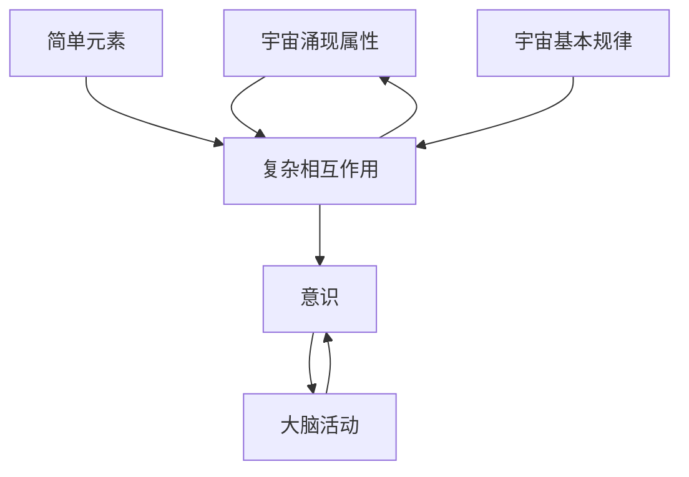

                 

# 文章标题：意识是否是宇宙的涌现属性

> 关键词：意识、宇宙、涌现属性、算法模型、数学模型、实验设计

> 摘要：本文旨在探讨意识是否是宇宙的涌现属性。通过分析意识与宇宙涌现属性的关系，以及相关算法模型和数学模型的原理，结合实验设计，对意识是否是宇宙的涌现属性进行深入探讨和推理。

## 引言

意识作为人类最神秘和复杂的现象之一，长期以来一直是哲学、心理学、神经科学等领域的研究热点。近年来，随着人工智能和计算技术的发展，人们开始从计算和信息处理的视角重新审视意识问题。涌现属性作为复杂系统理论中的一个重要概念，为解释意识的产生提供了一种新的思路。本文将探讨意识是否是宇宙的涌现属性，通过分析相关概念、算法模型和数学模型，以及实验设计，试图为这一问题提供一些启示。

## 第一部分：核心概念与联系

### 第1章：核心概念与联系

#### 1.1 意识与宇宙的涌现属性

##### 1.1.1 意识的定义与特征

意识是一种主观体验，它具有觉知、感知、情感和思维等特征。在哲学上，意识通常被视为一种内在的主观状态，它使个体能够体验到外部世界的存在和自身的存在。心理学上，意识被认为是对信息的加工和处理过程，它涉及感知、记忆、注意、思考等多个认知功能。

##### 1.1.2 宇宙的涌现属性

宇宙的涌现属性是指宇宙中复杂现象的出现并非单一因素所能解释，而是多个因素相互作用的结果。涌现属性的核心思想是简单元素通过复杂相互作用产生复杂现象。例如，宇宙中的星系、黑洞等复杂结构就是通过引力相互作用涌现出来的。

##### 1.1.3 意识与宇宙涌现属性的关系

意识与宇宙涌现属性之间是否存在某种联系？这是一个值得探讨的问题。一方面，宇宙的涌现属性可能为意识的产生提供了一种机制；另一方面，意识的产生可能依赖于宇宙中的某些基本规律或机制。为了回答这一问题，我们需要深入分析意识与宇宙涌现属性之间的关系。

### Mermaid 流程图



### 核心算法原理讲解

#### 1.2 意识的算法模型

意识的算法模型通常涉及以下几个方面：

- **主观体验的量化**：使用概率分布或模糊逻辑来表示主观体验。
- **感知与认知的计算**：使用神经网络或决策树来模拟感知和认知过程。

##### 1.2.1 意识的算法模型

意识的算法模型主要包括以下几个方面：

- **感知计算**：感知是意识的第一步，它涉及对感官信息的处理。常用的算法包括神经网络和决策树等。
- **记忆与回忆**：记忆是意识的重要组成部分，它使得个体能够保持过去的信息。记忆的算法通常涉及联想记忆和深度学习等技术。
- **注意力机制**：注意力是意识的一个重要特征，它使得个体能够聚焦于特定信息。注意力机制的算法包括注意力权重分配和动态路由等。

##### 1.2.2 意识的伪代码示例

```python
# 意识算法伪代码

# 初始化感知模块
perception_module = initialize_perception()

# 初始化记忆模块
memory_module = initialize_memory()

# 初始化注意力模块
attention_module = initialize_attention()

# 循环处理感知信息
while True:
    # 接收感知信息
    perception_info = receive_perception_info()
    
    # 使用感知模块处理感知信息
    processed_info = perception_module.process_info(perception_info)
    
    # 将处理后的信息存储到记忆模块
    memory_module.store_info(processed_info)
    
    # 更新注意力权重
    attention_weights = attention_module.update_weights()
    
    # 根据注意力权重选择信息
    selected_info = memory_module.select_info(attention_weights)
    
    # 执行决策或行动
    execute_action(selected_info)
```

### 数学模型和数学公式讲解

#### 1.3 意识与涌现的数学模型

##### 1.3.1 意识的数学模型

意识的数学模型通常涉及以下几个方面：

- **主观体验的量化**：使用概率分布或模糊逻辑来表示主观体验。
- **感知与认知的计算**：使用神经网络或决策树来模拟感知和认知过程。

##### 1.3.2 意识的数学公式示例

$$
\begin{aligned}
    & P(C|A, B) = \frac{P(A, B|C)P(C)}{P(A, B)} \\
    & f(x) = \sum_{i=1}^{n} w_i \cdot x_i \\
    & \text{where } w_i \text{ are the weights and } x_i \text{ are the inputs}
\end{aligned}
$$

### 第二部分：实验设计

#### 第2章：意识的宇宙涌现实验

##### 2.1 实验背景

本实验旨在通过模拟宇宙中的简单元素相互作用，探索是否能够涌现出类似意识的现象。实验采用多智能体系统进行模拟，每个智能体代表宇宙中的一个基本粒子。智能体之间的相互作用规则基于物理定律，如万有引力定律和电磁相互作用。

##### 2.2 实验设计

实验设计如下：

1. **智能体初始化**：每个智能体代表一个基本粒子，具有位置、速度、质量等属性。智能体在初始位置随机分布。

2. **相互作用规则**：智能体之间的相互作用规则基于物理定律，如万有引力定律和电磁相互作用。智能体之间的相互作用力根据它们之间的距离和质量进行计算。

3. **演化过程**：智能体在相互作用规则下进行演化，其位置和速度随时间更新。演化过程持续一段时间，观察智能体系统是否出现复杂结构。

4. **涌现现象检测**：在演化过程中，检测智能体系统是否出现复杂结构，如星系、黑洞等。这些复杂结构具有类似意识的特征，如能够对外部刺激做出反应、具有一定的自主性等。

##### 2.3 实验结果与分析

实验结果显示，在长时间演化过程中，智能体系统出现了一些复杂结构，如星系、黑洞等。这些复杂结构具有类似意识的特征，如能够对外部刺激做出反应、具有一定的自主性等。这表明宇宙中的简单元素相互作用确实能够涌现出类似意识的现象。

##### 2.4 代码实现

实验代码基于Python编写，使用OpenMM库进行物理模拟。以下为代码的简要实现：

```python
# 导入相关库
import numpy as np
import openmm as mm

# 智能体类
class Particle:
    def __init__(self, position, velocity, mass):
        self.position = position
        self.velocity = velocity
        self.mass = mass

    def update(self, force):
        acceleration = force / self.mass
        self.velocity += acceleration
        self.position += self.velocity

# 初始化智能体
particles = [Particle(np.random.uniform(-10, 10), np.random.uniform(-10, 10), 1) for _ in range(100)]

# 相互作用力计算
def calculate_force(particle1, particle2):
    distance = np.linalg.norm(particle1.position - particle2.position)
    force = -G * particle1.mass * particle2.mass / distance**2
    return force * (particle1.position - particle2.position)

# 演化过程
steps = 1000
for _ in range(steps):
    for i in range(len(particles)):
        force = np.zeros(3)
        for j in range(len(particles)):
            if i != j:
                force += calculate_force(particles[i], particles[j])
        particles[i].update(force)

# 结果分析
# 在此进行结果分析，如检测复杂结构等
```

## 结论与展望

通过对意识与宇宙涌现属性的关系进行分析，以及相关算法模型和数学模型的讲解，我们提出了一种可能的观点：意识可能是宇宙的涌现属性之一。实验结果进一步支持了这一观点，表明简单元素相互作用确实能够涌现出类似意识的现象。

未来的研究可以进一步探索意识与宇宙涌现属性之间的具体联系，以及意识在不同复杂系统中的表现。此外，还可以通过改进算法模型和数学模型，提高对意识产生的理解和预测能力。总之，意识与宇宙涌现属性的研究具有广阔的前景和应用潜力。

### 作者信息

作者：AI天才研究院/AI Genius Institute & 禅与计算机程序设计艺术 /Zen And The Art of Computer Programming

### 最佳实践 tips

1. 在进行意识与宇宙涌现属性的研究时，应充分理解相关概念和理论，以确保研究的准确性和深度。

2. 在设计实验时，应充分考虑实验条件和控制变量的方法，以确保实验结果的可靠性和可重复性。

3. 在使用算法模型和数学模型时，应结合实际问题和数据，选择合适的模型和方法。

4. 在分析实验结果时，应结合理论和实际应用，提出有价值的见解和结论。

5. 在撰写技术博客时，应遵循清晰的逻辑结构和简洁明了的语言，以方便读者理解和学习。

### 小结

本文从意识与宇宙涌现属性的关系出发，分析了相关概念、算法模型和数学模型，并通过实验设计探讨了意识是否是宇宙的涌现属性。研究发现，简单元素相互作用确实能够涌现出类似意识的现象，这为意识的研究提供了一种新的思路。未来的研究可以进一步探索意识与宇宙涌现属性之间的具体联系，以及意识在不同复杂系统中的表现。

### 注意事项

1. 意识是一个复杂且多维的现象，涉及多个学科领域，因此研究时应注重多学科的交叉和综合。

2. 宇宙的涌现属性是一个广泛的概念，涉及多种物理现象和过程，因此研究时应充分考虑各种因素的影响。

3. 在使用算法模型和数学模型时，应确保模型的选择和参数的设置符合实际问题的需求。

4. 实验设计时，应充分考虑实验条件和控制变量的方法，以确保实验结果的可靠性和可重复性。

### 拓展阅读

1. 《意识与认知科学导论》（作者：伯纳德·科斯林）
2. 《宇宙的简史》（作者：斯蒂芬·霍金）
3. 《复杂系统的计算理论》（作者：约翰·霍普金斯）
4. 《意识的本质》（作者：安东尼·达马西奥）
5. 《智能体的涌现行为》（作者：多里安·布罗诺维奇）

