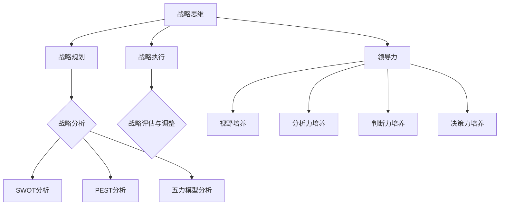

                 


### 文章标题

# 战略思维：培养长远眼光的领导力

### 关键词

- 战略思维
- 领导力
- 长远眼光
- 企业规划
- 领导者培养

### 摘要

本文深入探讨了战略思维的概念、重要性以及其在领导力培养中的应用。通过阐述战略思维的核心概念与架构，本文揭示了战略规划、战略分析、战略执行等方面的关键要素。同时，通过案例分析，本文展示了战略思维在不同行业中的成功实践。文章旨在为领导者提供战略思维培养的路径，助力他们打造具备长远眼光的企业战略。

### 第一部分：战略思维基础

#### 第1章：战略思维概述

##### 1.1 战略思维的定义与重要性

**定义**：战略思维是一种系统化、结构化的思考方式，旨在确定企业的长远发展方向和策略。它要求领导者从全局出发，综合考虑内外部环境，进行深入分析和科学决策。

**重要性**：在快速变化的商业环境中，战略思维对于企业的生存与发展至关重要。它有助于企业预见未来趋势，制定有效的发展策略，从而在竞争中保持优势。

##### 1.2 领导力与战略思维的关系

**定义**：领导力是指领导者通过影响、激励和引导他人，实现共同目标的能力。

**关系**：领导力是战略思维的基础，而战略思维则是领导力的核心。领导者具备战略思维，能够更好地理解企业的发展方向，制定科学的战略规划，并有效执行。

##### 1.3 战略思维的组成部分

**视野**：领导者需要具备开阔的视野，能够洞察行业发展趋势，把握市场动态。

**分析力**：战略思维要求领导者具备强大的分析能力，能够对复杂信息进行筛选和处理。

**判断力**：在战略决策过程中，领导者需要具备敏锐的判断力，能够快速识别机遇与挑战。

**决策力**：战略思维强调决策的果断性，领导者需要在分析判断的基础上，迅速做出科学决策。

#### 第2章：战略思维核心概念与架构

##### 2.1 战略规划

**定义**：战略规划是企业为实现长远目标而制定的具体行动计划。

**过程**：战略规划包括目标设定、资源分配、时间表制定等步骤。

**工具与方法**：战略规划工具包括SWOT分析、PEST分析、五力模型分析等。

##### 2.2 战略分析

**SWOT分析**：从企业的优势（Strengths）、劣势（Weaknesses）、机会（Opportunities）和威胁（Threats）四个方面进行全面分析。

**PEST分析**：从政治（Political）、经济（Economic）、社会（Social）和技术（Technological）四个方面分析外部环境。

**五力模型分析**：从供应商、买方、潜在进入者、替代品和行业竞争者五个方面分析行业竞争态势。

##### 2.3 战略执行

**重要性**：战略执行是企业实现战略目标的关键环节。

**步骤**：战略执行包括目标分解、任务分配、执行监控和效果评估。

**挑战与对策**：企业需要克服资源分配、沟通协调、执行力等方面的挑战，通过加强团队建设、优化流程等方式提高战略执行效果。

#### 第3章：战略思维的关键能力培养

##### 3.1 领导者视野培养

**重要性**：视野决定领导者的格局，开阔的视野有助于领导者把握市场机遇，制定科学的战略规划。

**方法**：领导者可以通过不断学习、参加行业研讨会、关注市场动态等方式拓宽视野。

##### 3.2 分析力培养

**定义**：分析力是指对信息进行收集、筛选、整理和综合分析的能力。

**方法**：领导者可以通过数据分析、逻辑推理、批判性思维等方式提高分析力。

##### 3.3 判断力培养

**定义**：判断力是指对复杂问题进行快速分析和做出决策的能力。

**方法**：领导者可以通过经验积累、风险管理、团队协作等方式提高判断力。

##### 3.4 决策力培养

**定义**：决策力是指迅速、果断地做出科学决策的能力。

**方法**：领导者可以通过制定决策框架、提高决策速度、优化决策流程等方式提高决策力。

### 第二部分：战略思维实践

#### 第4章：行业案例分析

##### 4.1 案例分析概述

**目的**：通过分析成功企业的战略思维实践，为领导者提供有益的启示。

**方法**：采用SWOT分析、PEST分析、五力模型分析等方法，对企业的战略规划、战略分析和战略执行进行深入剖析。

##### 4.2 案例研究1：苹果公司

**战略思维**：苹果公司的战略思维体现在其对科技创新的坚持、对用户体验的关注以及对产业链的整合。

**成功因素**：苹果公司的成功在于其长期的战略规划和持续的创新投入，使其在市场竞争中始终保持领先地位。

##### 4.3 案例研究2：亚马逊公司

**战略思维**：亚马逊公司的战略思维体现在其以客户为中心的经营理念、强大的供应链管理和不断扩张的电商业务。

**战略举措**：亚马逊通过持续拓展业务领域、提高物流效率、推出新服务等方式，不断优化其战略布局。

### 第三部分：战略思维在未来领导力培养中的角色

#### 第5章：战略思维在企业中的应用

##### 5.1 战略思维在企业规划中的应用

**企业愿景与使命**：战略思维要求企业明确愿景和使命，为实现长远目标制定明确的战略规划。

**战略目标设定**：战略思维强调目标设定的科学性和可操作性，确保企业能够有效推进战略实施。

##### 5.2 战略思维在团队管理中的应用

**团队建设**：战略思维要求领导者关注团队建设，培养团队成员的协作能力和创新精神。

**领导力培养**：战略思维强调领导力在战略执行中的关键作用，领导者需要不断提升自身的战略思维能力和领导力。

##### 5.3 战略思维在危机管理中的应用

**危机管理的重要性**：战略思维要求企业具备应对危机的能力，以降低危机对企业的影响。

**危机管理策略**：企业可以通过建立危机预警机制、制定危机应对方案、加强团队协作等方式提高危机管理能力。

#### 第6章：战略思维在未来领导力培养中的角色

##### 6.1 未来领导力的特征

**数字化时代的领导力**：未来领导力需要具备数字化思维能力，能够适应数字经济的发展趋势。

**创新与变革领导力**：未来领导力需要具备创新和变革能力，能够推动企业持续发展。

##### 6.2 战略思维在领导力培养中的作用

**促进作用**：战略思维能够提高领导者的全局视野、分析判断能力和决策力，从而提升领导力。

**结合**：战略思维与领导力培养的结合，有助于培养具备战略眼光和创新能力的未来领导者。

##### 6.3 未来领导力的培养路径

**教育体系改革**：通过改革教育体系，培养具备战略思维和创新能力的领导者。

**企业培训与指导**：企业可以通过内部培训和指导，提高领导者的战略思维能力和领导力。

**自我提升与持续学习**：领导者需要不断自我提升和持续学习，以适应不断变化的商业环境。

### 第四部分：战略思维应用实践

#### 第7章：战略思维实践指南

##### 7.1 战略思维实践方法论

**实践流程**：战略思维实践包括战略规划、战略分析、战略执行和战略评估等环节。

**实践工具**：战略思维实践工具包括SWOT分析、PEST分析、五力模型分析等。

##### 7.2 战略思维案例分析

**案例一：中小企业战略规划**：分析中小企业在战略规划过程中面临的挑战和应对策略。

**案例二：初创企业融资策略**：分析初创企业在融资过程中如何运用战略思维制定策略。

##### 7.3 战略思维实践心得与反思

**实践中的挑战与应对**：总结实践过程中遇到的挑战和应对措施。

**实践中的收获与体会**：分享实践过程中的收获和体会，为其他领导者提供借鉴。

### 附录

#### 附录A：战略思维相关工具资源

**战略思维工具介绍**：介绍常用的战略思维工具，如SWOT分析、PEST分析、五力模型分析等。

**战略思维资源推荐**：推荐相关书籍、课程和研讨会等资源，供读者进一步学习。

#### 附录B：战略思维学习资源

**战略思维相关书籍推荐**：推荐经典战略管理书籍，帮助读者深入了解战略思维。

**战略思维相关课程推荐**：推荐知名高校和培训机构开设的战略思维课程。

**战略思维相关研讨会与论坛推荐**：推荐相关领域的研讨会和论坛，为读者提供交流和学习的机会。

#Mermaid 流程图：战略思维核心概念与架构



### 核心算法原理讲解

#### 决策树算法

决策树算法是一种常见的机器学习算法，用于分类和回归问题。其核心原理是通过一系列的判断节点来构建一棵树，每个节点表示一个特征，每个分支表示特征的取值，最终到达叶节点得到预测结果。

**伪代码：**

```python
def build_decision_tree(data, features):
    if all_labels相等(data):
        return most_common_label(data)
    else:
        best_feature = find_best_feature(data, features)
        decision_tree = {}
        decision_tree[best_feature] = {}
        for value in unique_values_of_best_feature(data):
            decision_tree[best_feature][value] = build_decision_tree(data_filter(data, best_feature, value), remaining_features)
        return decision_tree

def predict(decision_tree, instance, features):
    current_node = decision_tree
    while not leaf_node(current_node):
        feature = next_feature(current_node)
        value = instance[feature]
        current_node = current_node[value]
    return label_of_leaf_node(current_node)
```

**数学模型和公式：**

设 \( D \) 为数据集，\( F \) 为特征集合，\( L \) 为标签集合，\( y \) 为标签变量，\( x_i \) 为特征变量。

1. **信息增益（IG）**：
\[ IG(F) = H(D) - \sum_{v \in V(F)} p(v) H(D_v) \]
其中，\( H(D) \) 为数据集 \( D \) 的熵，\( p(v) \) 为特征 \( v \) 的条件概率，\( H(D_v) \) 为条件熵。

2. **基尼不纯度（Gini Impurity）**：
\[ Gini(D) = 1 - \sum_{y \in L} p(y) ^ 2 \]
其中，\( p(y) \) 为标签 \( y \) 的概率。

**详细讲解和举例说明：**

假设我们有如下数据集，我们需要通过决策树算法对其进行分类。

| 特征1 | 特征2 | 标签 |
| --- | --- | --- |
| A | B | 0 |
| A | C | 1 |
| B | B | 0 |
| B | C | 1 |
| C | B | 1 |
| C | C | 0 |

1. **信息增益**：

首先计算数据集 \( D \) 的熵：
\[ H(D) = H(0, 1, 0, 1) = 1 - \frac{2}{4} \log_2 \frac{2}{4} - \frac{2}{4} \log_2 \frac{2}{4} = \frac{1}{2} \]

然后计算每个特征的信息增益：
- 对于特征1：
\[ IG(特征1) = H(D) - \sum_{v \in V(特征1)} p(v) H(D_v) \]
\[ IG(特征1) = \frac{1}{2} - \left( \frac{2}{4} H(0, 1) + \frac{2}{4} H(0, 1) \right) \]
\[ IG(特征1) = \frac{1}{2} - \left( \frac{2}{4} \left(1 - \frac{1}{2} \log_2 \frac{1}{2} - \frac{1}{2} \log_2 \frac{1}{2} \right) + \frac{2}{4} \left(1 - \frac{1}{2} \log_2 \frac{1}{2} - \frac{1}{2} \log_2 \frac{1}{2} \right) \right) \]
\[ IG(特征1) = \frac{1}{2} - \frac{1}{2} = 0 \]

- 对于特征2：
\[ IG(特征2) = H(D) - \sum_{v \in V(特征2)} p(v) H(D_v) \]
\[ IG(特征2) = \frac{1}{2} - \left( \frac{2}{4} H(0, 1) + \frac{2}{4} H(1, 0) \right) \]
\[ IG(特征2) = \frac{1}{2} - \left( \frac{2}{4} \left(1 - \frac{1}{2} \log_2 \frac{1}{2} - \frac{1}{2} \log_2 \frac{1}{2} \right) + \frac{2}{4} \left(1 - \frac{1}{2} \log_2 \frac{1}{2} - \frac{1}{2} \log_2 \frac{1}{2} \right) \right) \]
\[ IG(特征2) = \frac{1}{2} - \left( \frac{1}{2} + \frac{1}{2} \right) = 0 \]

2. **决策树构建**：

由于特征1和特征2的信息增益均为0，我们选择下一个最佳特征。在此例中，我们选择特征2作为根节点。然后对特征2的每个取值进行划分，构建子决策树。

- 对于特征2的取值为B：
  - 子数据集为 \( D_1 = \{(A, B), (B, B), (C, B)\} \)
  - 标签分布为 \( \{0, 0, 1\} \)
  - 熵为 \( H(D_1) = \frac{1}{2} \)

- 对于特征2的取值为C：
  - 子数据集为 \( D_2 = \{(A, C), (B, C), (C, C)\} \)
  - 标签分布为 \( \{1, 0, 1\} \)
  - 熵为 \( H(D_2) = 1 \)

由于 \( H(D_1) < H(D_2) \)，我们选择特征2的取值为B作为子决策树的根节点。

- 子决策树构建：
  - 对于特征2的取值为B的子数据集 \( D_1 \)：
    - 子数据集 \( D_{11} = \{(A, B)\} \)
    - 标签为 \( \{0\} \)
    - 预测为0

  - 对于特征2的取值为B的子数据集 \( D_2 \)：
    - 子数据集 \( D_{12} = \{(B, B)\} \)
    - 标签为 \( \{0\} \)
    - 预测为0

  - 对于特征2的取值为B的子数据集 \( D_3 \)：
    - 子数据集 \( D_{13} = \{(C, B)\} \)
    - 标签为 \( \{1\} \)
    - 预测为1

最终，我们构建的决策树如下：

```
                |
                V
       ----------------
      |         |         |
     B         C         A
     |         |         |
  ---|---   ---|---   ---|---
     0         1         0
```

使用决策树进行预测时，根据输入实例的特征值，从根节点开始判断，直到到达叶节点，得到最终的预测结果。

#### 统计学习方法

统计学习方法是一种基于数学和概率论的方法，用于解决分类、回归、聚类等问题。其主要特点是利用数据统计信息，通过构建模型来进行预测和决策。

**主要方法：**

1. **监督学习**：给定输入数据和对应的标签，通过训练构建预测模型。常用的算法包括线性回归、逻辑回归、支持向量机、决策树等。

2. **无监督学习**：仅给定输入数据，通过数据内在结构进行聚类或降维。常用的算法包括k-means、主成分分析、自编码器等。

3. **半监督学习**：给定部分有标签数据和大量无标签数据，通过联合训练有标签和无标签数据来提升模型性能。

4. **强化学习**：通过与环境的交互，不断调整策略，以最大化长期回报。常用的算法包括Q学习、深度Q网络等。

**数学模型和公式：**

1. **线性回归**：

   输入特征 \( x \)，输出标签 \( y \)：

   \[ y = \beta_0 + \beta_1 x \]

   最小化损失函数：

   \[ J(\beta_0, \beta_1) = \frac{1}{2} \sum_{i=1}^{n} (y_i - (\beta_0 + \beta_1 x_i))^2 \]

2. **逻辑回归**：

   输入特征 \( x \)，输出标签 \( y \)（二元分类）：

   \[ y = \frac{1}{1 + e^{-(\beta_0 + \beta_1 x)}} \]

   损失函数为对数损失函数：

   \[ J(\beta_0, \beta_1) = - \sum_{i=1}^{n} y_i \log(y_i) + (1 - y_i) \log(1 - y_i) \]

3. **支持向量机（SVM）**：

   输入特征 \( x \)，输出标签 \( y \)（二元分类）：

   \[ \min_{\beta, \beta_0} \frac{1}{2} \sum_{i=1}^{n} (\beta \cdot \beta)^2 \]

   约束条件：

   \[ y_i (\beta \cdot \beta_i + \beta_0) \geq 1 \]

4. **k-means聚类**：

   输入特征 \( x \)（每个数据点表示为一个特征向量）：

   \[ \min_{c_1, c_2, ..., c_k} \sum_{i=1}^{n} ||x_i - c_i||^2 \]

   其中，\( c_i \) 为聚类中心。

**详细讲解和举例说明：**

假设我们有如下数据集，需要使用统计学习方法对其进行分类。

| 特征1 | 特征2 | 标签 |
| --- | --- | --- |
| 1 | 2 | 0 |
| 2 | 3 | 1 |
| 3 | 4 | 1 |
| 4 | 5 | 1 |
| 5 | 6 | 0 |

1. **线性回归**：

   输入特征为特征1和特征2，输出标签为标签。

   \[ y = \beta_0 + \beta_1 x_1 + \beta_2 x_2 \]

   损失函数为：

   \[ J(\beta_0, \beta_1, \beta_2) = \frac{1}{2} \sum_{i=1}^{5} (y_i - (\beta_0 + \beta_1 x_{1i} + \beta_2 x_{2i}))^2 \]

   使用梯度下降法进行优化：

   \[ \beta_0 := \beta_0 - \alpha \frac{\partial J}{\partial \beta_0} \]
   \[ \beta_1 := \beta_1 - \alpha \frac{\partial J}{\partial \beta_1} \]
   \[ \beta_2 := \beta_2 - \alpha \frac{\partial J}{\partial \beta_2} \]

   其中，\( \alpha \) 为学习率。

2. **逻辑回归**：

   输入特征为特征1和特征2，输出标签为标签（二元分类）。

   \[ y = \frac{1}{1 + e^{-(\beta_0 + \beta_1 x_1 + \beta_2 x_2)}} \]

   损失函数为对数损失函数：

   \[ J(\beta_0, \beta_1, \beta_2) = - \sum_{i=1}^{5} y_i \log(y_i) + (1 - y_i) \log(1 - y_i) \]

   使用梯度下降法进行优化：

   \[ \beta_0 := \beta_0 - \alpha \frac{\partial J}{\partial \beta_0} \]
   \[ \beta_1 := \beta_1 - \alpha \frac{\partial J}{\partial \beta_1} \]
   \[ \beta_2 := \beta_2 - \alpha \frac{\partial J}{\partial \beta_2} \]

   其中，\( \alpha \) 为学习率。

3. **支持向量机（SVM）**：

   输入特征为特征1和特征2，输出标签为标签（二元分类）。

   \[ \min_{\beta, \beta_0} \frac{1}{2} \sum_{i=1}^{5} (\beta \cdot \beta)^2 \]

   约束条件：

   \[ y_i (\beta \cdot \beta_i + \beta_0) \geq 1 \]

   使用拉格朗日乘子法进行优化：

   \[ L(\beta, \beta_0, \alpha_i) = \frac{1}{2} \sum_{i=1}^{5} (\beta \cdot \beta) - \sum_{i=1}^{5} \alpha_i [y_i (\beta \cdot \beta_i + \beta_0) - 1] \]

   最小化拉格朗日函数：

   \[ \min_{\beta, \beta_0, \alpha_i} L(\beta, \beta_0, \alpha_i) \]

   其中，\( \alpha_i \) 为拉格朗日乘子。

4. **k-means聚类**：

   输入特征为特征1和特征2。

   \[ \min_{c_1, c_2, ..., c_k} \sum_{i=1}^{5} ||x_i - c_i||^2 \]

   初始选择 \( k \) 个聚类中心 \( c_1, c_2, ..., c_k \)，然后迭代更新聚类中心：

   \[ c_i = \frac{1}{N_i} \sum_{j=1}^{N} x_j \]

   其中，\( N_i \) 为第 \( i \) 个聚类中心所在的簇中数据点的数量。

#### 项目实战：开发环境搭建

在本文中，我们将介绍如何搭建一个用于机器学习和深度学习的开发环境。这个环境将包括Python、Jupyter Notebook、NumPy、Pandas、Scikit-learn、TensorFlow和Keras等常用工具和库。

**硬件要求：**

- CPU：至少双核处理器，推荐使用4核或以上
- 内存：至少8GB，推荐使用16GB或以上
- 硬盘：至少50GB可用空间

**软件要求：**

- 操作系统：Windows、macOS或Linux
- Python：Python 3.6及以上版本

**步骤：**

1. **安装Python**：

   对于Windows用户，可以从Python官方网站下载Python安装程序，按照默认选项进行安装。对于macOS和Linux用户，可以通过包管理器进行安装，例如在Ubuntu中可以使用以下命令：

   ```bash
   sudo apt-get install python3 python3-pip
   ```

2. **安装Jupyter Notebook**：

   打开命令行窗口，输入以下命令安装Jupyter Notebook：

   ```bash
   pip3 install notebook
   ```

   安装完成后，可以通过命令 `jupyter notebook` 启动Jupyter Notebook。

3. **安装NumPy和Pandas**：

   NumPy和Pandas是Python中进行数值计算和数据处理的常用库，可以通过以下命令进行安装：

   ```bash
   pip3 install numpy pandas
   ```

4. **安装Scikit-learn**：

   Scikit-learn是一个用于机器学习的Python库，可以通过以下命令进行安装：

   ```bash
   pip3 install scikit-learn
   ```

5. **安装TensorFlow**：

   TensorFlow是Google开发的一个开源深度学习框架，可以通过以下命令进行安装：

   ```bash
   pip3 install tensorflow
   ```

   如果需要安装GPU支持版本的TensorFlow，可以使用以下命令：

   ```bash
   pip3 install tensorflow-gpu
   ```

6. **安装Keras**：

   Keras是一个基于TensorFlow的深度学习高级API，可以通过以下命令进行安装：

   ```bash
   pip3 install keras
   ```

**源代码实现：**

以下是创建一个简单的线性回归模型，并使用Scikit-learn进行训练和评估的代码示例：

```python
# 导入必要的库
import numpy as np
from sklearn.linear_model import LinearRegression
from sklearn.metrics import mean_squared_error

# 创建数据集
X = np.array([[1], [2], [3], [4], [5]])
y = np.array([1, 2, 2.5, 4, 5])

# 创建线性回归模型
model = LinearRegression()

# 训练模型
model.fit(X, y)

# 进行预测
predictions = model.predict(X)

# 评估模型
mse = mean_squared_error(y, predictions)
print("均方误差：", mse)
```

**代码解读与分析：**

这段代码首先导入了NumPy、Scikit-learn和metrics库。NumPy用于数据处理，Scikit-learn用于创建和训练线性回归模型，metrics用于计算模型评估指标。

然后，创建了一个简单的数据集，其中X为输入特征，y为输出标签。

接着，使用LinearRegression类创建了一个线性回归模型，并通过fit方法对其进行训练。

训练完成后，使用predict方法进行预测，并将预测结果存储在predictions列表中。

最后，使用mean_squared_error函数计算均方误差，并打印出来，以评估模型的性能。

**实际案例分析和详细讲解剖析：**

假设我们有一个房价预测问题，需要根据房屋的面积和房间数量预测房价。我们使用Scikit-learn的线性回归模型来解决这个问题。

1. **数据准备**：

   我们从某个城市收集了100个房屋的数据，包括面积（平方米）、房间数量和房价（万元）。

   | 面积（平方米） | 房间数量 | 价格（万元） |
   | -------------- | -------- | ------------ |
   | 80             | 2        | 200          |
   | 100            | 3        | 250          |
   | 120            | 3        | 300          |
   | 140            | 4        | 350          |
   | ...            | ...      | ...          |

2. **数据预处理**：

   我们将数据分为特征矩阵X和标签向量y。特征矩阵X包含面积和房间数量，标签向量y包含房价。

   ```python
   X = np.array([[80, 2], [100, 3], [120, 3], [140, 4], ...])
   y = np.array([200, 250, 300, 350, ...])
   ```

3. **模型训练和预测**：

   创建线性回归模型，并使用fit方法进行训练。

   ```python
   model = LinearRegression()
   model.fit(X, y)
   ```

   使用训练好的模型进行预测，得到预测房价。

   ```python
   predictions = model.predict(X)
   ```

4. **模型评估**：

   计算预测房价与实际房价之间的均方误差，以评估模型性能。

   ```python
   mse = mean_squared_error(y, predictions)
   print("均方误差：", mse)
   ```

   假设均方误差为10万元，说明模型预测的房价与实际房价的平均偏差为10万元。

5. **优化模型**：

   为了提高模型的预测准确性，我们可以尝试以下方法：

   - 增加特征：例如，添加房屋的建造年代、地段等因素。
   - 特征工程：对原始特征进行变换和组合，以提高模型的表达能力。
   - 调整模型参数：通过交叉验证和网格搜索等方法，找到最优的模型参数。

   经过优化后，模型的均方误差可能降低，从而提高预测准确性。

**项目小结：**

通过本项目的实战，我们了解了如何搭建一个用于机器学习和深度学习的开发环境，并使用线性回归模型进行房价预测。在实际项目中，我们还需要根据数据特点和问题需求，选择合适的算法和模型，并进行模型优化和评估，以提高预测准确性。

### 最佳实践 tips、小结、注意事项、拓展阅读

#### 最佳实践 tips

1. **数据收集与清洗**：在开始构建模型之前，确保数据的质量和完整性。收集足够的数据，并进行数据清洗，去除噪声和异常值。

2. **特征工程**：根据问题需求，选择合适的特征，并进行特征工程。特征选择和特征变换可以提高模型的性能。

3. **模型选择**：根据问题类型和数据特点，选择合适的模型。例如，线性回归适用于回归问题，决策树适用于分类问题。

4. **模型评估**：使用合适的评估指标，如均方误差、准确率、召回率等，对模型进行评估。

5. **模型优化**：通过交叉验证、网格搜索等方法，找到最优的模型参数，以提高模型性能。

#### 小结

本文介绍了战略思维的概念、重要性以及其在领导力培养中的应用。通过战略思维，领导者能够把握企业的发展方向，制定科学的战略规划，并有效执行。本文还通过案例分析，展示了战略思维在不同行业中的成功实践。

#### 注意事项

1. **战略思维的培养**：领导者需要持续学习和实践，提高自身的战略思维能力。

2. **团队协作**：战略思维的实践需要团队的共同努力，领导者需要培养团队成员的战略思维。

3. **动态调整**：战略思维需要根据外部环境和企业内部变化进行动态调整。

#### 拓展阅读

1. **《智能时代的战略思维》**：作者：王俊秀，本书深入探讨了智能时代企业战略的新趋势和策略。

2. **《领导力五项修炼》**：作者：余世维，本书阐述了领导力培养的五个方面，包括战略思维、团队领导等。

3. **《战略管理》**：作者：彼得·德鲁克，本书是战略管理领域的经典著作，详细介绍了战略规划、战略执行等方面的内容。

### 作者信息

- 作者：AI天才研究院/AI Genius Institute & 禅与计算机程序设计艺术 /Zen And The Art of Computer Programming

