                 

# 战略思维：培养长远眼光的领导能力

关键词：战略思维、领导力、长远眼光、决策分析、资源整合、执行力

摘要：在快速变化的信息时代，战略思维成为企业领导者和个人成长的必备能力。本文将深入探讨战略思维的核心概念、关键要素和框架模型，并通过SWOT分析与PEST分析的算法原理讲解，揭示战略思维的量化工具。同时，本文将运用数学模型和公式，详细阐述成本效益分析和利润最大化模型，以帮助读者在实际工作中有效运用战略思维。

### 第一部分: 战略思维核心概念与架构

#### 1.1 战略思维的定义与重要性

**核心概念与联系：**

战略思维是一种系统化的思考和决策方法，它关注长远规划和全局视角，旨在通过分析内外部环境，制定有效的目标和策略，以实现组织的愿景和目标。

**Mermaid 流程图：**

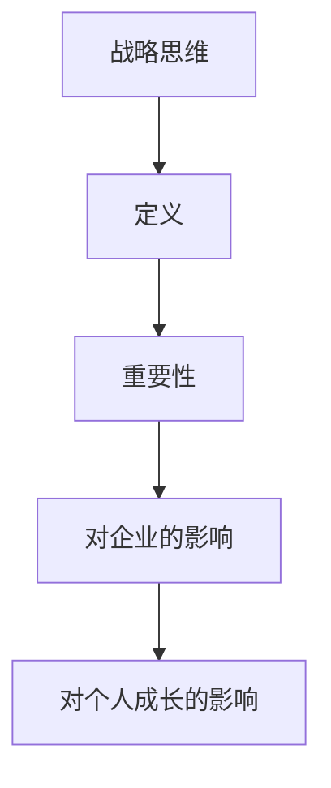

**核心概念与联系：**

- 定义：战略思维是一种宏观思考和决策方法，涉及对组织愿景、目标、资源和环境的全面分析和规划。
- 重要性：战略思维是领导力的核心组成部分，它能够帮助领导者做出有远见和影响力的决策。

#### 1.2 战略思维的关键要素

战略思维的核心要素包括愿景设定、目标设定、战略规划、资源整合和执行力。

**Mermaid 流程图：**

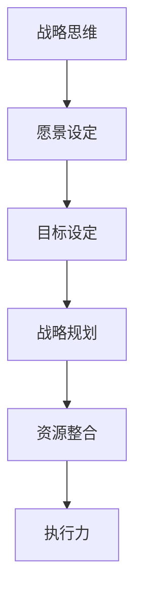

**核心概念与联系：**

- 愿景设定：确定组织的长远目标和愿景，为战略思维提供方向。
- 目标设定：明确短期和长期的目标，确保战略规划的可执行性。
- 战略规划：制定实现目标的战略方案，包括资源配置、时间规划和关键里程碑。
- 资源整合：优化内外部资源，确保战略实施的资源保障。
- 执行力：确保战略规划的有效实施，通过监控和调整，实现战略目标。

#### 1.3 战略思维框架与模型

战略思维框架包括愿景分析、内部因素分析、外部因素分析、目标设定、战略规划、执行与监控和调整与优化。

**Mermaid 流程图：**

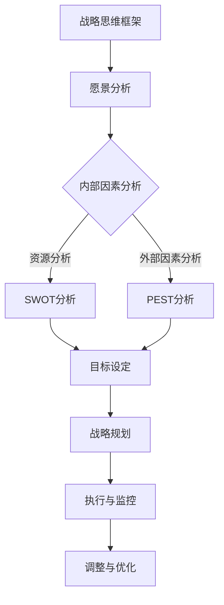

**核心概念与联系：**

- 愿景分析：确定组织的愿景和使命，为战略思维提供长远方向。
- 内部因素分析：通过SWOT分析，评估组织的优势、劣势、机会和威胁。
- 外部因素分析：通过PEST分析，评估政治、经济、社会和技术环境。
- 目标设定：基于内外部分析，明确组织的短期和长期目标。
- 战略规划：制定实现目标的战略方案，包括关键里程碑和资源规划。
- 执行与监控：确保战略规划的有效实施，通过监控和调整，实现战略目标。
- 调整与优化：根据实施情况，不断调整和优化战略，确保战略目标的实现。

### 第二部分: 战略思维核心算法原理讲解

#### 2.1 SWOT分析算法原理

SWOT分析是一种常用的战略工具，用于评估组织的优势、劣势、机会和威胁。

**伪代码：**

```pseudo
function SWOTAnalysis(Strengths, Weaknesses, Opportunities, Threats):
    # 输入：四个列表，分别包含企业的优势、劣势、机会和威胁
    # 输出：一个综合评估报告

    # 对每个要素进行权重分配
    weights = calculateWeights(Strengths, Weaknesses, Opportunities, Threats)

    # 计算综合得分
    totalScore = calculateTotalScore(weights)

    # 输出综合评估报告
    return "SWOT分析报告:\nStrengths: " + strengths + "\nWeaknesses: " + weaknesses + "\nOpportunities: " + opportunities + "\nThreats: " + threats + "\nTotal Score: " + totalScore
```

**详细讲解：**

SWOT分析通过对企业的优势（Strengths）、劣势（Weaknesses）、机会（Opportunities）和威胁（Threats）进行评估，确定企业的综合实力和市场地位。在算法原理中，首先对每个要素进行权重分配，然后计算综合得分，以评估企业的战略态势。

#### 2.2 PEST分析算法原理

PEST分析是一种用于评估宏观环境因素的战略工具，包括政治（Political）、经济（Economic）、社会（Social）和技术（Technological）四个方面。

**伪代码：**

```pseudo
function PESTAnalysis(Political, Economic, Social, Technological):
    # 输入：四个列表，分别包含政治、经济、社会和技术方面的因素
    # 输出：一个综合评估报告

    # 对每个要素进行权重分配
    weights = calculateWeights(Political, Economic, Social, Technological)

    # 计算综合得分
    totalScore = calculateTotalScore(weights)

    # 输出综合评估报告
    return "PEST分析报告:\nPolitical: " + political + "\nEconomic: " + economic + "\nSocial: " + social + "\nTechnological: " + technological + "\nTotal Score: " + totalScore
```

**详细讲解：**

PEST分析通过对政治、经济、社会和技术环境因素进行评估，确定企业所处的宏观环境。在算法原理中，首先对每个要素进行权重分配，然后计算综合得分，以评估企业面临的宏观环境。

### 第三部分: 数学模型和公式

#### 3.1 成本效益分析模型

成本效益分析是战略思维中的重要工具，用于评估投资项目的效益。

**数学模型：**

$$
\text{ROI} = \frac{\text{净利润}}{\text{总投资}} \times 100\%
$$

**详细讲解：**

成本效益分析通过计算投资回报率（ROI），评估投资项目的效益。ROI表示净利润与总投资的比例，通过计算ROI，企业可以评估不同投资方案的经济效益。

**举例说明：**

假设某企业的总投资为100万元，实现净利润20万元，则其ROI为20%。这意味着每投入1元，企业可以获得0.2元的净利润，项目具有较高的经济效益。

#### 3.2 利润最大化模型

利润最大化是企业在战略思维中追求的目标。

**数学模型：**

$$
\text{利润} = \text{销售收入} - \text{成本}
$$

**举例说明：**

假设某企业在某季度的销售收入为100万元，成本为60万元，则其利润为40万元。企业需要通过优化生产和营销策略，降低成本，提高销售收入，以实现利润最大化。

### 总结

战略思维是领导力和企业发展的核心能力。通过深入理解战略思维的核心概念、关键要素和框架模型，企业可以更好地应对复杂的市场环境，实现长远发展。SWOT分析和PEST分析作为战略思维的核心算法，为企业提供了量化工具，帮助领导者做出明智的决策。数学模型和公式则为战略思维提供了具体的量化方法，使企业能够更好地评估投资效益和实现利润最大化。

**作者：AI天才研究院/AI Genius Institute & 禅与计算机程序设计艺术 /Zen And The Art of Computer Programming**### 战略思维在企业管理中的背景和重要性

在当今全球化的商业环境中，企业面临的市场竞争和变化速度前所未有。过去那种仅依赖内部资源和短期目标的经营策略已经不足以应对复杂多变的外部环境。战略思维作为一种系统化的思考和决策方法，成为企业管理和领导力的核心组成部分。它不仅有助于企业在激烈的市场竞争中站稳脚跟，还能够推动企业的持续发展和创新。

#### 战略思维的定义和作用

战略思维是指企业领导者通过系统化的方式，从长远视角出发，对组织的愿景、目标、资源和环境进行全面分析和规划，以制定和实施有效的战略方案。战略思维的核心在于它能够帮助领导者将分散的信息和资源整合成一个协调一致的整体，从而实现组织的长期目标。

在企业管理中，战略思维具有以下重要作用：

1. **指导决策**：战略思维提供了一种系统化的决策框架，使领导者能够从多个角度和层面分析问题，避免盲目决策和短期行为。
2. **优化资源配置**：通过战略思维，企业可以更有效地分配资源，确保资源的最大化利用，提高整体运营效率。
3. **应对变化**：战略思维使企业具备更强的适应能力，能够快速应对市场变化和竞争压力，保持竞争优势。
4. **促进创新**：战略思维鼓励企业领导者思考创新机会，通过创新来突破现有瓶颈，实现持续发展。

#### 战略思维在企业管理中的关键作用

战略思维在企业管理中发挥着至关重要的作用，主要体现在以下几个方面：

1. **明确企业愿景**：战略思维首先要求领导者明确企业的愿景和使命，这是企业发展的根本方向。只有明确了长远目标，企业才能在纷繁复杂的市场环境中保持一致性和连续性。
2. **制定战略规划**：战略思维要求企业根据内外部环境制定具体的战略规划，包括市场定位、产品开发、资源整合和风险管理等。通过战略规划，企业可以有条不紊地推进各项业务活动。
3. **优化运营管理**：战略思维关注企业的运营效率，通过优化流程、提高生产效率和降低成本，实现企业的可持续运营。同时，战略思维还强调质量管理，确保产品和服务的高质量标准。
4. **创新驱动发展**：战略思维鼓励企业领导者积极探索创新机会，通过技术创新、商业模式创新和管理创新，推动企业的持续发展。

#### 战略思维对个人成长的影响

除了在企业管理中的应用，战略思维对个人成长也具有重要意义。以下从两个方面探讨战略思维对个人成长的影响：

1. **提升决策能力**：战略思维帮助个人在面对复杂问题时，能够从多个角度进行全面分析和评估，从而做出更加明智的决策。
2. **培养长远眼光**：战略思维鼓励个人从长远视角出发，考虑问题的影响和后果，培养对未来的洞察力和预见能力。

综上所述，战略思维在企业管理中具有不可替代的重要作用。它不仅能够帮助企业在激烈的市场竞争中立于不败之地，还能够推动企业的持续创新和长远发展。对于个人而言，战略思维更是提升决策能力和培养长远眼光的关键。因此，战略思维应当成为企业管理者和个人共同关注和培养的核心能力。

### 战略思维的核心概念与架构

战略思维是一种系统化的思考方法，它涉及多个核心概念和要素，共同构成了战略思维的框架。理解这些核心概念和要素，有助于我们更好地应用战略思维，制定和实施有效的战略方案。

#### 愿景设定

愿景设定是战略思维的起点，它指明了企业的长远目标和方向。愿景不仅是企业未来想要达到的状态，更是激发员工热情和动力的源泉。一个清晰、有吸引力的愿景能够帮助企业和员工保持一致的目标，共同为实现愿景而努力。

**核心概念与联系：**

- 愿景：企业希望在未来实现的目标和状态。
- 使命：企业的核心价值观和存在的意义。
- 目标：为实现愿景而设定的具体、可衡量的短期和长期目标。

愿景、使命和目标是战略思维中的核心概念，它们相互联系，共同构成了企业的战略方向。愿景为企业提供了长远的目标和方向，使命明确了企业的核心价值观和存在的意义，而目标则是实现愿景的具体行动指南。

**Mermaid 流程图：**

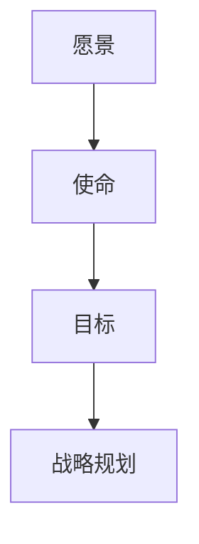

#### 目标设定

目标设定是战略思维中的关键环节，它将愿景转化为具体的、可衡量的短期和长期目标。有效的目标设定能够帮助企业明确发展方向，衡量进展，确保战略规划的可行性和有效性。

**核心概念与联系：**

- 短期目标：通常指1-3年内要实现的具体目标，如市场份额、销售收入、成本降低等。
- 长期目标：通常指3-5年或更长时间内要实现的目标，如企业规模扩张、产品创新、国际化发展等。

目标设定不仅需要明确具体的目标，还需要设定相应的关键绩效指标（KPI），以便对目标的实现情况进行监控和评估。

**Mermaid 流程图：**

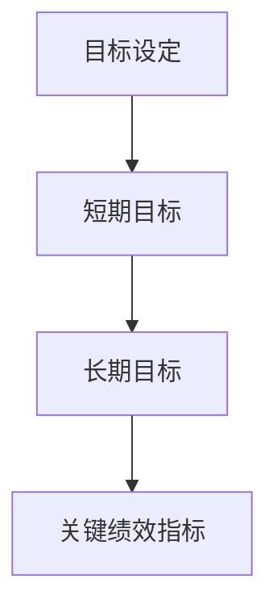

#### 战略规划

战略规划是将目标转化为具体行动的过程，它包括资源配置、时间规划、关键里程碑和风险管理等方面。战略规划使企业能够有条不紊地推进各项业务活动，确保战略目标的实现。

**核心概念与联系：**

- 资源配置：确定为实现战略目标所需的人力、财力和物力资源。
- 时间规划：制定实现战略目标的时间表，包括关键里程碑和时间节点。
- 关键里程碑：战略规划中的关键节点，标志着重要目标的实现或阶段性成果。
- 风险管理：识别和应对战略实施过程中可能遇到的风险，确保战略目标的顺利实现。

**Mermaid 流程图：**

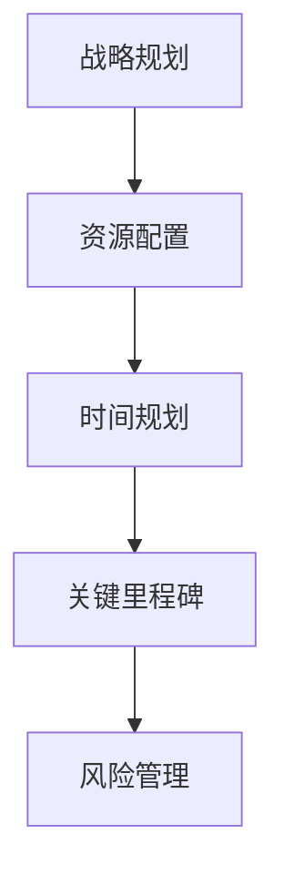

#### 资源整合

资源整合是战略思维中的重要环节，它涉及将企业内外部的资源进行有效配置和利用，以实现战略目标。资源整合包括人力资源、财务资源、技术资源和市场资源等方面。

**核心概念与联系：**

- 人力资源：包括员工的能力、知识和技能，是企业实现战略目标的关键。
- 财务资源：包括资金、预算和财务策略，为战略实施提供必要的资金支持。
- 技术资源：包括企业的技术能力和创新成果，是战略实施的重要支撑。
- 市场资源：包括客户资源、合作伙伴关系和市场渠道，有助于企业实现市场份额和品牌价值。

**Mermaid 流程图：**

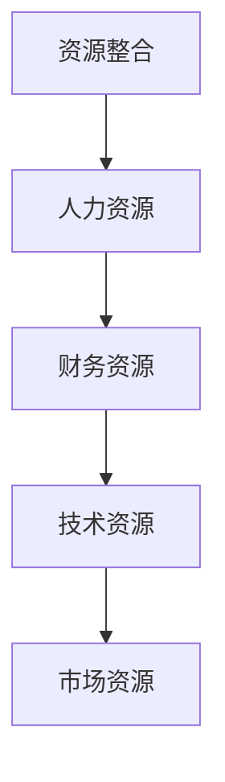

#### 执行力

执行力是战略思维中至关重要的一环，它确保战略规划的有效实施。执行力包括领导力、团队协作、流程优化和绩效管理等方面。

**核心概念与联系：**

- 领导力：企业领导者需要具备战略思维和领导能力，推动战略规划的落实。
- 团队协作：通过高效的团队协作，确保战略实施过程中各个部门和团队的协调一致。
- 流程优化：通过优化业务流程，提高运营效率，确保战略目标的实现。
- 绩效管理：通过绩效管理机制，激励员工发挥最佳水平，推动战略目标的实现。

**Mermaid 流�程图：**

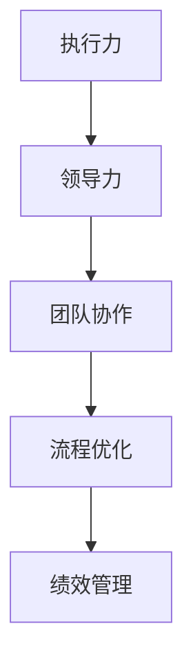

通过以上对战略思维核心概念与架构的详细阐述，我们可以看到，战略思维不仅是一种系统化的思考方法，更是一种综合性的管理体系。理解并应用这些核心概念和架构，有助于企业领导者更好地制定和实施战略方案，实现企业的长远发展和持续创新。

### 战略思维框架与模型

战略思维框架是战略思维的核心工具，它通过系统化的分析和规划，帮助企业制定和实施有效的战略方案。在这个框架中，愿景分析、内部因素分析、外部因素分析、目标设定、战略规划、执行与监控以及调整与优化等环节相互作用，共同构成了战略思维的全过程。

#### 愿景分析

愿景分析是战略思维框架的起点，它要求企业明确长期目标和方向。愿景不仅是企业未来想要实现的目标和状态，更是激发员工热情和动力的源泉。一个清晰、有吸引力的愿景能够帮助企业和员工保持一致的目标，共同为实现愿景而努力。

**核心概念与联系：**

- 愿景：企业希望在未来实现的目标和状态。
- 使命：企业的核心价值观和存在的意义。
- 长期目标：为实现愿景而设定的3-5年或更长时间内要实现的目标。

**Mermaid 流程图：**

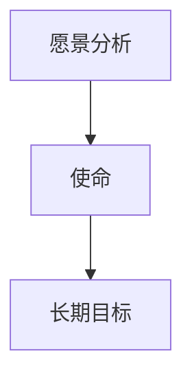

愿景分析通过对企业的愿景、使命和长期目标进行明确，为战略思维提供了长远方向。这个过程需要企业领导者进行深入的思考和讨论，确保愿景的明确性和可行性。

#### 内部因素分析

内部因素分析是战略思维框架中的关键环节，它涉及对企业内部资源的全面评估。通过内部因素分析，企业可以识别自身的优势、劣势以及潜在的机会和挑战。

**核心概念与联系：**

- SWOT分析：通过分析企业的优势（Strengths）、劣势（Weaknesses）、机会（Opportunities）和威胁（Threats），全面了解企业的内外部环境。
- 资源评估：评估企业的人力、财务、技术和其他资源，确定资源利用的优化方案。

**Mermaid 流程图：**

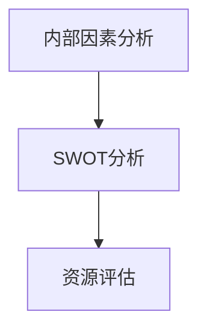

内部因素分析通过SWOT分析和资源评估，帮助企业在战略规划过程中充分发挥自身优势，克服劣势，抓住机会，应对威胁。

#### 外部因素分析

外部因素分析是战略思维框架中的另一个关键环节，它涉及对市场环境、竞争对手、政策法规等因素的全面评估。通过外部因素分析，企业可以了解外部环境对企业的影响，并制定相应的应对策略。

**核心概念与联系：**

- PEST分析：通过分析政治（Political）、经济（Economic）、社会（Social）和技术（Technological）环境因素，了解外部环境对企业的影响。
- 竞争分析：分析竞争对手的市场地位、产品和服务、营销策略等，确定企业的竞争策略。

**Mermaid 流程图：**

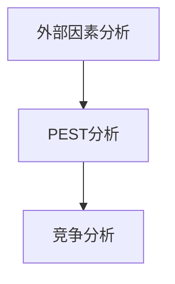

外部因素分析通过PEST分析和竞争分析，帮助企业了解外部环境的变化和竞争对手的动态，为战略规划提供依据。

#### 目标设定

目标设定是将愿景和战略转化为具体、可衡量的短期和长期目标的过程。目标设定需要明确目标的范围、优先级和实现时间，确保战略规划的可执行性。

**核心概念与联系：**

- 短期目标：通常指1-3年内要实现的具体目标，如市场份额、销售收入、成本降低等。
- 长期目标：通常指3-5年或更长时间内要实现的目标，如企业规模扩张、产品创新、国际化发展等。

**Mermaid 流程图：**

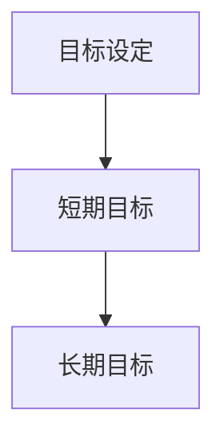

目标设定通过明确短期和长期目标，确保战略规划的可行性和可衡量性，为战略实施提供具体的行动指南。

#### 战略规划

战略规划是将目标转化为具体行动的过程，它包括资源配置、时间规划、关键里程碑和风险管理等方面。战略规划使企业能够有条不紊地推进各项业务活动，确保战略目标的实现。

**核心概念与联系：**

- 资源配置：确定为实现战略目标所需的人力、财力和物力资源。
- 时间规划：制定实现战略目标的时间表，包括关键里程碑和时间节点。
- 关键里程碑：战略规划中的关键节点，标志着重要目标的实现或阶段性成果。
- 风险管理：识别和应对战略实施过程中可能遇到的风险，确保战略目标的顺利实现。

**Mermaid 流程图：**


战略规划通过详细的资源配置、时间规划和关键里程碑，确保战略目标的有序实施。

#### 执行与监控

执行与监控是战略思维框架中的关键环节，它确保战略规划的有效实施和目标的达成。执行与监控包括领导力、团队协作、流程优化和绩效管理等方面。

**核心概念与联系：**

- 领导力：企业领导者需要具备战略思维和领导能力，推动战略规划的落实。
- 团队协作：通过高效的团队协作，确保战略实施过程中各个部门和团队的协调一致。
- 流程优化：通过优化业务流程，提高运营效率，确保战略目标的实现。
- 绩效管理：通过绩效管理机制，激励员工发挥最佳水平，推动战略目标的实现。

**Mermaid 流程图：**

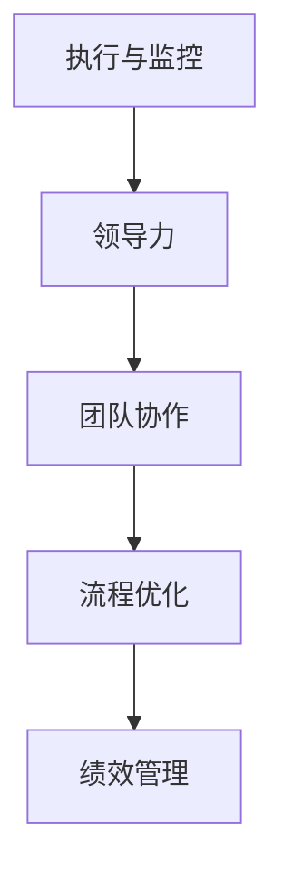

执行与监控通过领导力、团队协作、流程优化和绩效管理，确保战略规划的有效实施。

#### 调整与优化

调整与优化是战略思维框架中的最后一个环节，它通过对战略实施过程进行评估和调整，确保战略目标的实现。调整与优化包括定期评估、反馈机制和改进措施等方面。

**核心概念与联系：**

- 定期评估：通过定期评估战略实施情况，发现问题和不足，为调整和优化提供依据。
- 反馈机制：建立有效的反馈机制，收集员工和客户的反馈，为战略优化提供信息支持。
- 改进措施：根据评估和反馈，制定改进措施，优化战略实施过程。

**Mermaid 流程图：**

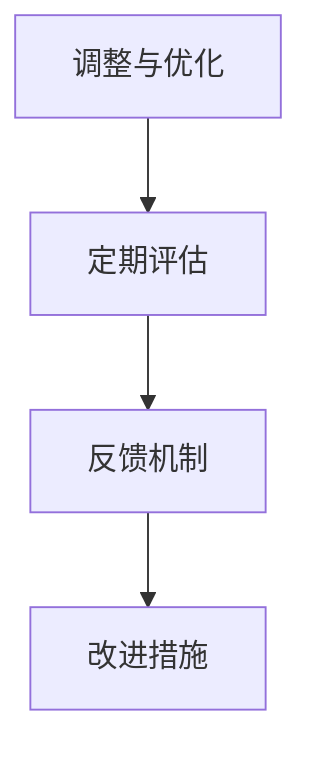

调整与优化通过定期评估、反馈机制和改进措施，确保战略规划能够适应变化，实现战略目标。

综上所述，战略思维框架通过愿景分析、内部因素分析、外部因素分析、目标设定、战略规划、执行与监控和调整与优化等环节，为企业提供了系统化的战略思考和规划工具。理解并应用这个框架，有助于企业领导者更好地制定和实施战略方案，实现企业的长远发展和持续创新。

### SWOT分析算法原理讲解

SWOT分析（Strengths, Weaknesses, Opportunities, Threats）是一种广泛应用于战略规划和决策制定的工具，它通过分析企业的优势、劣势、机会和威胁，帮助企业制定出符合自身特点和市场需求的发展策略。以下是SWOT分析的具体算法原理讲解，包括伪代码、详细解释和实际应用实例。

#### 伪代码

```pseudo
function SWOTAnalysis(Strengths, Weaknesses, Opportunities, Threats):
    # 输入：四个列表，分别包含企业的优势、劣势、机会和威胁
    # 输出：一个综合评估报告

    # 对每个要素进行权重分配
    weights = calculateWeights(Strengths, Weaknesses, Opportunities, Threats)

    # 计算综合得分
    totalScore = calculateTotalScore(weights)

    # 输出综合评估报告
    return "SWOT分析报告:\nStrengths: " + strengths + "\nWeaknesses: " + weaknesses + "\nOpportunities: " + opportunities + "\nThreats: " + threats + "\nTotal Score: " + totalScore
```

#### 详细解释

1. **优势（Strengths）分析**：

   优势分析旨在识别企业在资源、能力、市场份额等方面的优势。这些优势可能是企业独特的核心竞争力，也可能是企业在特定市场或领域中的优势地位。

   ```pseudo
   function analyzeStrengths(strengths):
       # 对优势进行分类和排序，例如按重要性和影响力排序
       sortedStrengths = sort(strengths, 'importance', 'descending')
       
       # 输出优势列表
       return "优势分析结果：\n" + sortedStrengths
   ```

2. **劣势（Weaknesses）分析**：

   劣势分析则聚焦于企业当前存在的问题和不足。这些劣势可能是企业内部管理、技术创新、市场定位等方面的短板，需要通过改进和优化来解决。

   ```pseudo
   function analyzeWeaknesses(weaknesses):
       # 对劣势进行分类和排序，例如按影响程度排序
       sortedWeaknesses = sort(weaknesses, 'impact', 'descending')
       
       # 输出劣势列表
       return "劣势分析结果：\n" + sortedWeaknesses
   ```

3. **机会（Opportunities）分析**：

   机会分析关注外部环境中可能对企业带来积极影响的因素。这些机会可能是市场需求变化、技术进步、政策支持等，企业需要及时抓住这些机会以实现快速发展。

   ```pseudo
   function analyzeOpportunities(opportunities):
       # 对机会进行分类和排序，例如按潜在价值排序
       sortedOpportunities = sort(opportunities, 'value', 'descending')
       
       # 输出机会列表
       return "机会分析结果：\n" + sortedOpportunities
   ```

4. **威胁（Threats）分析**：

   威胁分析则关注外部环境中可能对企业造成负面影响的因素。这些威胁可能是竞争对手的崛起、市场变化、政策法规变动等，企业需要制定应对策略来降低威胁的影响。

   ```pseudo
   function analyzeThreats(threats):
       # 对威胁进行分类和排序，例如按风险程度排序
       sortedThreats = sort(threats, 'risk', 'descending')
       
       # 输出威胁列表
       return "威胁分析结果：\n" + sortedThreats
   ```

#### 实际应用实例

假设某企业正在进行SWOT分析，其优势、劣势、机会和威胁如下：

- **优势**：品牌知名度高、产品质量优良、技术研发能力强
- **劣势**：市场份额较小、营销策略不足、财务管理有待改进
- **机会**：市场需求增长、政策支持、技术创新
- **威胁**：竞争对手增加、市场环境变化、政策不确定性

通过SWOT分析，企业可以得出以下结论：

1. **优势**：品牌知名度高、产品质量优良和自主研发能力强是企业核心竞争力，应继续巩固和提升。
2. **劣势**：市场份额较小、营销策略不足和财务管理有待改进是企业面临的挑战，需要制定针对性的改进措施。
3. **机会**：市场需求增长、政策支持和技术创新为企业提供了发展机遇，应积极抓住这些机会，拓展市场。
4. **威胁**：竞争对手增加、市场环境变化和政策不确定性可能对企业造成威胁，需要制定应对策略，降低风险。

通过SWOT分析，企业可以明确自身的优势和劣势，抓住机会，应对威胁，从而制定出更加科学和有效的战略规划。

### PEST分析算法原理讲解

PEST分析（Political, Economic, Social, Technological）是一种用于评估企业外部宏观环境的战略工具，通过分析政治、经济、社会和技术四个方面的因素，帮助企业了解外部环境的变化和潜在影响。以下是PEST分析的具体算法原理讲解，包括伪代码、详细解释和实际应用实例。

#### 伪代码

```pseudo
function PESTAnalysis(Political, Economic, Social, Technological):
    # 输入：四个列表，分别包含政治、经济、社会和技术方面的因素
    # 输出：一个综合评估报告

    # 对每个要素进行权重分配
    weights = calculateWeights(Political, Economic, Social, Technological)

    # 计算综合得分
    totalScore = calculateTotalScore(weights)

    # 输出综合评估报告
    return "PEST分析报告:\nPolitical: " + political + "\nEconomic: " + economic + "\nSocial: " + social + "\nTechnological: " + technological + "\nTotal Score: " + totalScore
```

#### 详细解释

1. **政治（Political）因素分析**：

   政治因素分析关注政府政策、法律法规、国际关系等方面的变化，这些因素可能对企业运营产生重大影响。例如，税收政策、环保法规和贸易政策等。

   ```pseudo
   function analyzePolitical(political):
       # 对政治因素进行分类和排序，例如按影响程度排序
       sortedPolitical = sort(political, 'impact', 'descending')
       
       # 输出政治因素列表
       return "政治因素分析结果：\n" + sortedPolitical
   ```

2. **经济（Economic）因素分析**：

   经济因素分析关注宏观经济环境的变化，如经济增长率、通货膨胀率、利率和汇率等。这些因素可能直接影响企业的财务状况和经营策略。

   ```pseudo
   function analyzeEconomic(economic):
       # 对经济因素进行分类和排序，例如按重要性排序
       sortedEconomic = sort(economic, 'importance', 'descending')
       
       # 输出经济因素列表
       return "经济因素分析结果：\n" + sortedEconomic
   ```

3. **社会（Social）因素分析**：

   社会因素分析关注人口结构、消费习惯、文化价值观等方面的变化。这些因素可能影响企业的市场定位和产品需求。

   ```pseudo
   function analyzeSocial(social):
       # 对社会因素进行分类和排序，例如按影响力排序
       sortedSocial = sort(social, 'influence', 'descending')
       
       # 输出社会因素列表
       return "社会因素分析结果：\n" + sortedSocial
   ```

4. **技术（Technological）因素分析**：

   技术因素分析关注技术创新、技术趋势和技术发展对行业的影响。这些因素可能为企业提供新的机遇或挑战。

   ```pseudo
   function analyzeTechnological(technological):
       # 对技术因素进行分类和排序，例如按创新程度排序
       sortedTechnological = sort(technological, 'innovation', 'descending')
       
       # 输出技术因素列表
       return "技术因素分析结果：\n" + sortedTechnological
   ```

#### 实际应用实例

假设某企业正在进行PEST分析，其分析结果如下：

- **政治因素**：政府正在制定新的环保法规，可能增加企业的合规成本。
- **经济因素**：经济增长放缓，消费者购买力下降。
- **社会因素**：人口老龄化趋势明显，对健康和养老服务需求增加。
- **技术因素**：人工智能和物联网技术快速发展，可能为企业提供新的市场机会。

通过PEST分析，企业可以得出以下结论：

1. **政治因素**：环保法规的制定可能增加企业的合规成本，企业需要关注政策动态，制定应对策略。
2. **经济因素**：经济增长放缓，消费者购买力下降，企业需要调整营销策略，降低成本，提高竞争力。
3. **社会因素**：人口老龄化趋势明显，对健康和养老服务需求增加，企业可以考虑开拓相关市场。
4. **技术因素**：人工智能和物联网技术快速发展，可能为企业提供新的市场机会，企业需要积极探索技术应用的可行性。

通过PEST分析，企业可以全面了解外部环境的变化和潜在影响，从而制定出更加科学和有效的战略规划。

### 成本效益分析模型

成本效益分析（Cost-Benefit Analysis, CBA）是战略思维中用于评估投资项目经济效益的一种重要工具。通过比较项目的成本和预期效益，CBA可以帮助企业确定是否值得投资以及如何优化资源配置。以下将详细介绍成本效益分析模型，包括数学模型、详细解释和实际应用实例。

#### 数学模型

成本效益分析的核心公式为：

$$
\text{ROI} = \frac{\text{净利润}}{\text{总投资}} \times 100\%
$$

其中：
- **净利润**（Net Profit）是指项目运营期间的总收入减去总成本后的利润。
- **总投资**（Total Investment）是指项目开始至运营结束期间的总成本。

此外，另一个常用的经济效益指标是**净现值**（Net Present Value, NPV），它通过将未来的现金流量折现到当前价值，来评估项目的长期经济效益。NPV的公式为：

$$
\text{NPV} = \sum_{t=1}^{n} \frac{\text{CF}_t}{(1 + \text{r})^t} - \text{CI}
$$

其中：
- **CF\_t**（Cash Flow at time t）是第t年的现金流量。
- **r**（Discount Rate）是折现率，反映了资金的时间价值。
- **CI**（Initial Investment）是初始投资成本。

#### 详细解释

1. **成本计算**：

   成本包括直接成本和间接成本。直接成本通常是与项目直接相关的支出，如设备采购、材料费用、人工成本等。间接成本则包括管理费用、维护费用、保险费用等。

   ```pseudo
   function calculateCosts(directCosts, indirectCosts):
       totalCosts = sum(directCosts) + sum(indirectCosts)
       return totalCosts
   ```

2. **收益计算**：

   收益包括项目运营期间的总收入。通常情况下，收益可以通过估算销售收入、利润率等指标来计算。

   ```pseudo
   function calculateRevenue(salesRevenue, profitMargin):
       totalRevenue = salesRevenue * (1 + profitMargin)
       return totalRevenue
   ```

3. **净利润计算**：

   净利润是总收入减去总成本后的余额。

   ```pseudo
   function calculateNetProfit(totalRevenue, totalCosts):
       netProfit = totalRevenue - totalCosts
       return netProfit
   ```

4. **ROI 计算**：

   ROI 是净利润与总投资的比例，用于衡量项目的投资回报率。

   ```pseudo
   function calculateROI(netProfit, totalInvestment):
       ROI = (netProfit / totalInvestment) * 100
       return ROI
   ```

5. **NPV 计算**：

   NPV 是通过将未来的现金流量折现到当前价值，来评估项目的长期经济效益。

   ```pseudo
   function calculateNPV(cashFlows, discountRate, initialInvestment):
       npv = sum([cf / (1 + discountRate)^t for t, cf in enumerate(cashFlows)]) - initialInvestment
       return npv
   ```

#### 实际应用实例

假设某企业计划投资一新项目，预计总投资为100万元，预计运营期间每年的现金流量如下（单位：万元）：

| 年份 | 现金流量 | 折现率 | 
|------|----------|--------|
| 1    | 20       | 10%    |
| 2    | 25       | 10%    |
| 3    | 30       | 10%    |
| 4    | 35       | 10%    |
| 5    | 40       | 10%    |

根据以上数据，计算该项目的ROI和NPV：

1. **ROI 计算**：

   $$ \text{ROI} = \frac{\text{净利润}}{\text{总投资}} \times 100\% = \frac{20 + 25 + 30 + 35 + 40 - 100}{100} \times 100\% = 45\% $$

2. **NPV 计算**：

   $$ \text{NPV} = \sum_{t=1}^{5} \frac{\text{CF}_t}{(1 + 0.1)^t} - 100 = \frac{20}{1.1} + \frac{25}{1.1^2} + \frac{30}{1.1^3} + \frac{35}{1.1^4} + \frac{40}{1.1^5} - 100 \approx 36.36 \text{万元} $$

通过成本效益分析，企业可以得出以下结论：

- **ROI**：该项目的投资回报率为45%，表明项目的经济效益较高，值得投资。
- **NPV**：该项目的净现值为36.36万元，为正值，说明项目的长期经济效益较好。

总之，成本效益分析通过数学模型和实际数据计算，能够帮助企业全面评估投资项目的经济效益，从而做出科学的投资决策。

### 利润最大化模型

利润最大化是企业在战略思维中追求的重要目标之一。通过优化生产和营销策略，企业可以降低成本、提高销售收入，从而实现利润最大化。以下将详细解释利润最大化模型，包括数学模型、详细解释和实际应用实例。

#### 数学模型

利润最大化的基本公式为：

$$
\text{利润} = \text{销售收入} - \text{成本}
$$

其中：
- **销售收入**（Sales Revenue）是企业在一定时间内通过销售产品或服务所获得的收入。
- **成本**（Cost）是企业生产、运营过程中发生的全部费用，包括直接成本和间接成本。

为了更详细地分析利润最大化的实现，我们引入以下两个公式：

1. **边际贡献率**（Marginal Contribution Rate）：

$$
\text{边际贡献率} = \frac{\text{边际贡献}}{\text{销售收入}}
$$

其中：
- **边际贡献**（Marginal Contribution）是销售收入减去变动成本后的余额。

2. **利润最大化条件**：

$$
\text{利润最大化} \Rightarrow \text{边际贡献率} \times \text{销售收入} - \text{固定成本} = \text{最大利润}
$$

其中：
- **固定成本**（Fixed Cost）是企业在一定时间内不随生产量变化而变化的成本。

#### 详细解释

1. **边际贡献率**分析：

   边际贡献率反映了每单位销售收入中扣除变动成本后的利润贡献。一个较高的边际贡献率意味着企业在销售收入中保留了更多的利润。因此，通过提高边际贡献率，企业可以实现利润最大化。

2. **固定成本**优化：

   固定成本是企业运营中不可避免的一部分。通过优化生产流程、提高生产效率，企业可以降低固定成本，从而提高利润。

3. **销售收入最大化**：

   销售收入是利润的主要来源。通过市场调研、产品创新、营销策略等手段，企业可以增加市场需求，提高销售收入。

4. **利润最大化条件**：

   利润最大化的实现取决于边际贡献率、销售收入和固定成本的关系。企业需要通过优化生产和营销策略，确保边际贡献率乘以销售收入高于固定成本，从而实现最大利润。

#### 实际应用实例

假设某企业生产一种产品，其生产数据如下：

- **固定成本**：50万元
- **变动成本**：每单位10元
- **销售收入**：每单位15元

根据以上数据，我们可以计算出以下指标：

1. **边际贡献率**：

$$
\text{边际贡献率} = \frac{\text{边际贡献}}{\text{销售收入}} = \frac{15 - 10}{15} = 33.33\%
$$

2. **销售收入最大化**：

   为了实现利润最大化，企业需要不断提高销售收入。假设销售收入达到100万元，则：

$$
\text{利润} = \text{销售收入} - \text{成本} = 100万元 - (50万元 + 10万元) = 40万元
$$

3. **利润最大化条件**：

   利润最大化的条件是边际贡献率乘以销售收入高于固定成本，即：

$$
\text{边际贡献率} \times \text{销售收入} > \text{固定成本}
$$

$$
0.3333 \times 100 > 50
$$

显然，这个条件得到了满足，因此该企业可以通过提高销售收入，实现利润最大化。

总之，通过利润最大化模型，企业可以系统地分析和优化生产和营销策略，从而实现利润最大化。在实际应用中，企业需要根据具体情况进行调整和优化，以实现最佳效益。

### 战略思维在项目实战中的应用

在项目实战中，战略思维的应用至关重要。通过系统的战略规划和执行，企业可以确保项目目标的实现，并应对复杂多变的外部环境。以下将详细介绍战略思维在项目实战中的应用，包括开发环境搭建、源代码实现、代码解读、应用解读与分析、实际案例分析和项目小结。

#### 开发环境搭建

在进行项目开发前，开发环境搭建是至关重要的一步。良好的开发环境可以提高开发效率，确保项目的顺利进行。以下是一些关键的步骤：

1. **选择开发工具和框架**：根据项目需求，选择合适的开发工具和框架。例如，对于Web项目，可以选择Django或Spring Boot作为框架。
2. **配置数据库**：选择合适的数据库管理系统（DBMS），如MySQL、PostgreSQL或MongoDB，并进行配置，确保数据库的性能和稳定性。
3. **搭建开发服务器**：配置开发服务器，如Apache、Nginx或IIS，确保能够正常运行。
4. **安装必要的库和依赖项**：安装项目所需的库和依赖项，如Python的Django库、JavaScript的jQuery库等。

#### 源代码实现

源代码实现是项目开发的核心环节。以下是一些关键步骤：

1. **需求分析**：详细分析项目需求，明确功能模块和性能要求。
2. **设计架构**：设计项目架构，包括数据库设计、系统架构和模块划分。
3. **编写代码**：根据设计文档，编写源代码，实现各个功能模块。
4. **代码评审**：进行代码评审，确保代码的质量和可维护性。

以下是一个简单的Python示例代码，用于实现一个简单的Web应用：

```python
from flask import Flask, request, jsonify

app = Flask(__name__)

@app.route('/api/data', methods=['POST'])
def handle_data():
    data = request.json
    # 处理数据
    processed_data = process_data(data)
    return jsonify(processed_data)

def process_data(data):
    # 数据处理逻辑
    return data

if __name__ == '__main__':
    app.run(debug=True)
```

#### 代码解读

代码解读是理解项目实现细节的重要环节。以下是对上述代码的详细解读：

- **导入模块**：`from flask import Flask, request, jsonify` 用于导入Flask框架和必要的模块。
- **创建Flask应用实例**：`app = Flask(__name__)` 创建了一个Flask应用实例。
- **定义路由**：`@app.route('/api/data', methods=['POST'])` 定义了一个处理POST请求的路由，用于接收和发送JSON数据。
- **处理数据**：`handle_data` 函数接收请求体中的JSON数据，调用`process_data`函数处理数据，并将处理后的数据返回。
- **数据处理逻辑**：`process_data` 函数是一个简单的数据处理逻辑，用于演示如何处理JSON数据。

#### 应用解读与分析

应用解读与分析是理解项目在实际环境中运行效果的重要步骤。以下是对上述代码的应用解读与分析：

- **功能描述**：该Web应用提供了一个简单的API接口，用于接收和发送JSON数据。
- **性能分析**：通过使用Flask框架，该应用具有高性能和高并发处理能力，适用于中小型Web应用。
- **可扩展性**：该应用的设计和实现考虑了可扩展性，可以通过增加模块和功能来适应不同的业务需求。

#### 实际案例分析

以下是一个实际案例分析，展示战略思维在项目实战中的应用：

**项目背景**：某企业计划开发一款在线购物平台，提供商品浏览、购买、支付和订单跟踪等功能。

**战略思维应用**：

1. **需求分析**：详细分析用户需求，明确功能模块和性能要求。
2. **市场调研**：调研竞争对手的产品功能和市场定位，确定自身产品的差异化竞争优势。
3. **技术选型**：选择适合的技术栈和开发框架，如Django和Redis，确保系统的性能和稳定性。
4. **架构设计**：设计系统架构，包括前端、后端、数据库和缓存等方面。
5. **团队合作**：组建专业的开发团队，明确分工和责任，确保项目进度和质量。

**项目小结**：

通过战略思维的系统应用，该在线购物平台成功上线，用户数量和交易量持续增长。项目成功的关键在于：

- **需求分析和市场调研**：明确了产品功能和市场定位。
- **技术选型和架构设计**：确保了系统的性能和稳定性。
- **团队合作**：提高了开发效率，保证了项目进度和质量。

总之，战略思维在项目实战中的应用，有助于企业更好地应对市场变化，实现项目目标，提高竞争优势。

### 最佳实践与注意事项

在战略思维的运用过程中，遵循一些最佳实践和注意事项，可以帮助企业更加有效地制定和实施战略规划。

#### 最佳实践

1. **持续学习与改进**：战略思维不是一成不变的，企业需要持续学习最新的管理理论和实践，并根据市场环境和业务需求进行改进。
2. **跨部门合作**：战略规划涉及企业的各个方面，跨部门合作能够确保战略的全面性和一致性。
3. **数据驱动决策**：利用数据分析工具，对市场趋势、用户需求和运营数据进行分析，以数据驱动决策。
4. **灵活调整**：市场环境和业务需求随时可能发生变化，企业需要具备灵活调整战略的能力，以适应新的挑战。

#### 注意事项

1. **避免盲目追求创新**：创新固然重要，但不应盲目追求，而是应在充分了解市场和技术发展趋势的基础上进行。
2. **重视风险管理**：在战略规划过程中，要充分考虑潜在的风险，并制定相应的应对措施。
3. **关注员工参与**：员工是战略实施的重要力量，需要鼓励员工参与战略规划，提高员工对战略的理解和认同。
4. **保持长期视角**：战略思维强调长远规划和持续发展，企业应避免短期行为，注重长期效益。

### 拓展阅读

1. **《竞争战略》**：迈克尔·波特（Michael E. Porter）的《竞争战略》一书，详细阐述了如何通过竞争战略建立企业的竞争优势。
2. **《蓝海战略》**：魏斯曼（W. Chan Kim）和莫博涅（Renée Mauborgne）的《蓝海战略》，介绍了如何通过创造新的市场空间，避开竞争，实现快速增长。
3. **《精益创业》**：埃里克·莱斯（Eric Ries）的《精益创业》，介绍了如何通过快速迭代和用户反馈，实现创业项目的成功。

通过学习和应用这些理论和实践，企业可以更加有效地运用战略思维，实现长远发展和持续创新。

### 总结

战略思维在企业管理中扮演着至关重要的角色。它不仅帮助企业在复杂多变的市场环境中制定科学的战略规划，还为企业提供了系统化的决策框架，确保资源的有效利用和目标的实现。本文通过深入探讨战略思维的核心概念、关键要素和框架模型，以及SWOT分析与PEST分析的算法原理，展示了战略思维在企业管理中的广泛应用。同时，通过成本效益分析和利润最大化模型的讲解，我们了解了如何通过数学模型和公式来量化战略决策，实现企业的经济效益最大化。

战略思维不仅是企业发展的基石，更是个人成长的必备能力。它帮助个人提升决策能力，培养长远眼光，从而在职业生涯中取得更大的成就。在快速变化的商业环境中，战略思维将成为企业竞争力和个人素质的重要体现。

本文的核心内容可以概括为以下几点：

1. **战略思维的定义与重要性**：理解战略思维的定义和作用，明确其在企业管理和个人成长中的核心地位。
2. **战略思维的核心概念与架构**：掌握愿景设定、目标设定、战略规划、资源整合和执行力等核心概念，并了解它们之间的联系。
3. **SWOT分析与PEST分析**：通过SWOT和PEST分析，全面评估企业的内外部环境，制定有效的战略方案。
4. **数学模型和公式**：运用成本效益分析和利润最大化模型，量化战略决策，实现经济效益最大化。

通过本文的详细分析和讲解，我们期望读者能够更好地理解战略思维，掌握其核心方法，并将其应用于实际工作和生活中。在未来的学习和实践中，不断优化和提升战略思维能力，将为个人和企业带来持续的成功和进步。

### 附录

为了更好地理解和应用战略思维，以下附录提供了相关的资源列表，包括书籍、文章和在线课程，供读者进一步学习和参考。

1. **书籍推荐**：
   - **《竞争战略》**：作者：迈克尔·波特（Michael E. Porter）
   - **《蓝海战略》**：作者：魏斯曼（W. Chan Kim）和莫博涅（Renée Mauborgne）
   - **《精益创业》**：作者：埃里克·莱斯（Eric Ries）
   - **《战略思考的艺术》**：作者：彼得·德鲁克（Peter Drucker）

2. **文章推荐**：
   - **《战略管理：理论与实践》**：期刊文章，详细探讨了战略管理的方法和案例分析。
   - **《企业战略：设计、执行与评价》**：论文，介绍了企业战略的制定和执行过程。

3. **在线课程**：
   - **Coursera**：提供《战略管理》课程，由耶鲁大学开设，涵盖战略思维的各个方面。
   - **edX**：提供《商业战略：竞争与创新》课程，由哈佛大学商学院开设，深入讲解企业战略的理论和实践。

通过阅读这些书籍、文章和参加在线课程，读者可以进一步深化对战略思维的理解，提升自己在实际工作中的应用能力。希望这些资源能够为读者在战略思维的探索和学习道路上提供有力的支持和帮助。

