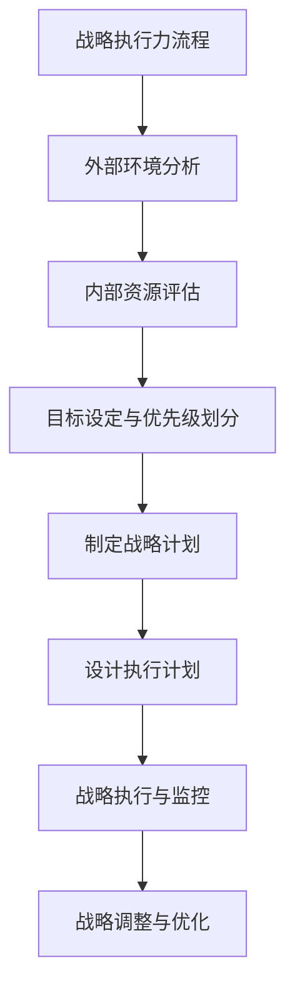

                 

### 文章标题

《战略执行力：从计划到实施的领导技巧》

### 关键词

- 战略执行力
- 领导技巧
- 计划实施
- 组织成功
- 风险管理

### 摘要

本文深入探讨了战略执行力的核心概念、基础要素以及其在组织成功中的关键作用。通过详细的章节结构，本文系统地阐述了从战略计划到实施的全过程，包括目标设定、执行计划设计、领导力与团队协作以及监控与调整策略。本文旨在帮助IT领域的专业人士掌握有效的战略执行力，从而提升组织的整体绩效。通过实际案例和算法原理讲解，本文提供了实用的指导，以应对快速变化的商业环境，确保组织在竞争中获得持续的优势。

### 第一部分：战略执行力的基础概念

#### 第1章：战略执行力的概述

##### 1.1 战略执行力的定义与重要性

**定义战略执行力**

战略执行力是指组织将战略规划转化为实际成果的能力。它涉及将愿景和目标转化为具体的行动计划，并通过有效的执行过程实现这些目标。战略执行力不仅仅是执行任务，而是一个复杂的过程，需要协调资源、管理风险、激励团队和持续改进。

**战略执行力在组织中的重要性**

战略执行力在组织中的重要性不可低估。首先，它是组织实现长期愿景和目标的关键。一个缺乏执行力的组织，即使有再好的战略规划，也无法转化为实际的成果。其次，战略执行力能够提高组织的适应能力，使其能够在不断变化的商业环境中保持竞争优势。此外，战略执行力还能增强团队的凝聚力和士气，提高工作效率和质量。

**战略执行力与组织成功的联系**

战略执行力直接关系到组织的成功。成功的组织往往拥有高效的执行能力，能够迅速响应市场变化，抓住机遇，避免风险。通过有效的战略执行力，组织能够实现其战略目标，提升市场地位，增加盈利能力。此外，战略执行力还促进了组织内部的文化建设，使组织更加开放、创新和灵活。

##### 1.2 战略执行力的核心要素

**明确的目标设定**

明确的目标设定是战略执行力的基础。目标必须具体、可衡量，并具有实际可行性。一个明确的目标能够为团队成员提供清晰的指导，确保他们了解自己的职责和期望成果。设定目标时，需要考虑外部环境和内部资源，确保目标与组织的整体战略相一致。

**强有力的领导力**

强有力的领导力是推动战略执行力的重要因素。领导者需要具备愿景、决心和激励团队的能力。他们应当能够制定明确的战略方向，协调资源，解决执行中的问题，并在必要时进行调整。领导者的风格和决策方式对执行过程有着深远的影响。

**敏捷的团队协作**

敏捷的团队协作是实现战略执行力的关键。一个高效的团队能够在复杂的环境中快速响应变化，协同工作，共同实现目标。团队成员之间需要建立良好的沟通机制，分享信息，相互支持，共同解决问题。团队协作不仅提高了工作效率，还增强了组织的创新能力。

**高效的沟通机制**

高效的沟通机制是战略执行力的重要组成部分。有效的沟通能够确保信息在组织内部准确、及时地传递，减少误解和冲突。沟通机制应当包括定期的会议、报告和反馈机制，以便及时了解执行进度，解决问题，调整计划。此外，领导者和团队成员之间应当保持开放、坦诚的沟通，促进信任和合作。

##### 1.3 战略执行力的挑战与机遇

**常见的战略执行力障碍**

在实施战略的过程中，组织可能会面临多种挑战。这些障碍包括：

- **资源限制**：资源不足或分配不合理，可能导致执行过程受阻。
- **沟通不畅**：信息传递不畅或理解不一致，导致执行偏差或错误。
- **领导力不足**：缺乏强有力的领导者，可能导致执行动力不足或决策失误。
- **组织文化问题**：组织文化不适应执行要求，如官僚主义、创新不足等。

**适应快速变化的机遇**

快速变化的市场环境为组织带来了新的机遇。适应这些变化，组织可以：

- **及时调整战略**：根据市场反馈和外部环境的变化，及时调整战略方向和执行计划。
- **加强创新能力**：通过鼓励创新，提高组织的适应能力和竞争力。
- **优化内部流程**：简化流程，提高效率和响应速度。

##### 结论

战略执行力是组织成功的关键因素。通过明确的目标设定、强有力的领导力、敏捷的团队协作和高效的沟通机制，组织可以克服执行过程中的挑战，抓住机遇，实现长期的战略目标。

---

#### 第二部分：战略计划与制定

##### 第2章：战略计划的基础

**2.1 战略规划的过程**

战略规划是一个系统性的过程，涉及对组织内外环境的全面分析，以及基于分析结果制定具体的战略目标。以下是战略规划的基本步骤：

**外部环境分析**

外部环境分析旨在识别组织面临的机会和威胁。这包括对市场趋势、竞争对手、法律法规、技术发展等方面的研究。通过外部环境分析，组织可以了解外部因素对战略制定的影响，并据此调整战略方向。

**内部资源评估**

内部资源评估涉及对组织内部资源的全面审查，包括人力、财务、技术、信息等。通过内部资源评估，组织可以了解自身的优势和劣势，从而在战略规划中充分利用资源，弥补不足。

**目标设定与优先级划分**

目标设定是战略规划的核心。组织需要制定明确、具体的战略目标，并确定实现这些目标的时间框架。目标应当可衡量，以便于评估执行效果。此外，组织还需要对目标进行优先级划分，确保资源优先投入到最重要的目标上。

**制定战略计划**

基于外部环境分析和内部资源评估的结果，组织可以制定具体的战略计划。战略计划应包括执行策略、时间表、责任分配、预算和风险控制措施等。战略计划应当具有灵活性和适应性，以便在执行过程中进行调整。

**2.2 战略目标的确定**

**制定明确而具体的战略目标**

明确而具体的战略目标对战略执行至关重要。目标应具有可衡量性、可达性和挑战性。例如，一个明确的目标可以是“在下一季度将销售额提高20%”。

**设定可衡量的目标指标**

为了确保目标的实现，组织需要设定可衡量的目标指标。这些指标应与目标密切相关，并能够反映目标的完成情况。例如，如果目标是提高销售额，那么可衡量的指标可以是销售额增长率、客户满意度等。

**实现目标的时间框架**

设定明确的时间框架是实现战略目标的关键。时间框架应包括短期和长期目标，以便组织能够有序地推进战略执行。短期目标可以是季度或年度目标，而长期目标可以是几年或更长时间。

**2.3 战略计划工具与方法**

**SWOT分析**

SWOT分析是一种常用的战略规划工具，用于评估组织的优势、劣势、机会和威胁。通过SWOT分析，组织可以了解自身的优势和劣势，以及外部环境中的机会和威胁，从而制定更具针对性的战略计划。

**五力模型**

五力模型是由迈克尔·波特提出的，用于分析行业竞争环境。五力包括供应商、买家、潜在进入者、替代品和行业内部竞争者。通过五力模型，组织可以了解行业中的关键竞争因素，并据此制定战略。

**平衡计分卡**

平衡计分卡是一种用于衡量组织绩效的工具，包括财务、客户、内部业务流程和学习与成长四个维度。通过平衡计分卡，组织可以全面了解自身的绩效状况，并据此调整战略计划。

**2.4 制定执行计划的关键步骤**

**确定执行策略**

制定执行策略是实现战略目标的关键。执行策略应明确如何分配资源、协调团队和监控执行过程。执行策略应基于组织的战略目标和内外部环境分析。

**设定执行时间表**

设定执行时间表是确保战略目标按时实现的关键。时间表应包括关键里程碑和任务分配，以便组织能够有序推进执行过程。

**分配资源与责任**

资源分配是战略执行的重要环节。组织需要确保资源得到合理分配，并明确各团队成员的责任。资源包括人力、财务、技术等，责任包括任务分工、绩效评估等。

**制定风险缓解措施**

在战略执行过程中，风险是不可避免的。制定风险缓解措施是确保战略目标顺利实现的关键。风险缓解措施应包括风险识别、评估、监控和应对策略。

**2.5 执行计划中的风险管理**

**识别潜在的执行风险**

执行风险是指在战略执行过程中可能对目标实现产生负面影响的因素。组织需要识别潜在的执行风险，包括市场变化、资源不足、内部冲突等。

**制定风险缓解措施**

一旦识别出潜在的执行风险，组织需要制定相应的风险缓解措施。这些措施应包括风险预防、风险转移、风险缓解和风险接受等。

**风险监控与应对机制**

在执行过程中，组织需要持续监控执行风险，并根据实际情况调整风险应对措施。有效的风险监控和应对机制能够确保战略目标的顺利实现。

**2.6 执行计划的沟通与协调**

**有效沟通的重要性**

有效沟通是确保战略执行成功的关键。沟通应包括战略目标的传达、执行计划的说明、进展情况的报告和问题的解决。有效的沟通能够减少误解和冲突，提高团队的协同工作效率。

**确保团队共识**

确保团队共识是实现战略执行的关键。团队共识包括对战略目标的认同、对执行计划的了解和对工作责任的明确。通过团队共识，组织能够形成统一的方向和行动。

**协调各部门的执行任务**

在战略执行过程中，各部门需要协调各自的执行任务，以确保整体战略目标的实现。协调包括资源分配、任务分配和工作流程的优化。有效的协调能够提高组织的执行效率和质量。

---

通过本章节的讨论，我们可以看到，战略计划的制定是一个复杂而系统性的过程。它不仅涉及到对外部环境和内部资源的分析，还包括明确的目标设定、制定执行计划、分配资源与责任以及风险管理。有效的战略计划能够为组织提供清晰的执行方向，提高战略执行的效率和成功率。

### 第三部分：领导技巧在战略执行力中的应用

#### 第4章：领导力与战略执行力

**4.1 战略执行领导者的角色**

**明确愿景与目标**

战略执行的领导者需要具备明确的愿景和目标。他们应当能够清晰地描述组织的未来方向，并将其转化为具体的战略目标。这需要领导者不仅具备远见，还要具备将愿景转化为现实的能力。

**激励团队实现目标**

战略执行的领导者需要具备激励团队的能力。他们应当能够激发团队成员的积极性，鼓励他们为实现战略目标而努力。激励可以通过多种方式实现，包括提供奖励、认可团队成员的贡献、创造一个积极的工作环境等。

**建立信任与支持**

建立信任与支持是战略执行成功的关键。领导者需要建立与团队成员之间的信任关系，使团队成员愿意分享信息、提出建议并积极参与决策。同时，领导者应提供必要的支持，帮助团队成员克服执行过程中的困难和挑战。

**4.2 领导风格与战略执行力**

**不同的领导风格对执行力的影响**

不同的领导风格对战略执行力有着重要的影响。常见的领导风格包括权威型、民主型、变革型等。权威型领导风格强调命令和控制，可能提高执行力，但也可能导致团队成员的抵触情绪。民主型领导风格注重团队合作和参与，能够提高团队的凝聚力和创造力，但可能需要更多时间来达成共识。变革型领导风格鼓励创新和变革，能够提高组织的适应能力和执行力。

**选择适合的领导风格**

选择适合的领导风格是实现战略执行的关键。领导者应根据组织的具体情况和执行任务的要求，选择最合适的领导风格。例如，在面临紧急情况时，权威型领导风格可能更有效；而在需要创新和变革时，变革型领导风格可能更为合适。

**领导风格与组织文化的融合**

领导风格与组织文化的融合是实现战略执行的重要保障。领导者需要了解组织的文化，并在此基础上调整自己的领导风格。同时，领导者应积极参与组织文化的建设，推动文化变革，使其与战略执行相一致。

**4.3 领导者的自我提升**

**增强领导能力的途径**

领导者的自我提升是实现战略执行的重要一环。领导者可以通过以下途径增强领导能力：

- **学习和培训**：参加领导力培训课程，阅读相关书籍和文献，了解最新的领导理论和实践。
- **反思和总结**：定期反思自己的领导行为和决策，总结成功和失败的经验，从中吸取教训。
- **建立导师关系**：寻求经验丰富的导师指导，学习他们的领导方法和经验。
- **参与实践**：通过实际工作，锻炼自己的领导能力，积累实践经验。

**学会从失败中吸取教训**

领导者应学会从失败中吸取教训。失败是成长的机会，领导者应正视失败，分析原因，找出改进的方法。通过不断学习和实践，领导者可以不断提升自己的领导能力，提高战略执行的成功率。

**培养可持续的领导力**

培养可持续的领导力是实现长期战略执行的关键。领导者需要关注组织的长远发展，注重人才培养和团队建设。通过培养可持续的领导力，组织可以保持长期的竞争优势，实现持续的战略成功。

---

通过本章节的讨论，我们可以看到，领导力在战略执行力中扮演着至关重要的角色。有效的领导者不仅能够明确愿景和目标，激励团队实现目标，还能通过合适的领导风格和组织文化融合，增强组织的执行能力。同时，领导者的自我提升和持续学习也是实现战略执行成功的关键因素。

### 第四部分：战略实施的监控与调整

#### 第6章：战略实施的监控

**6.1 监控战略执行的过程**

战略实施的监控是确保战略目标顺利实现的重要环节。有效的监控过程需要设定明确的监控指标，收集和整理相关数据，并定期评估战略执行的状态。以下是监控战略执行过程的几个关键步骤：

**设定监控指标**

监控指标是评估战略执行状况的关键工具。这些指标应与战略目标紧密相关，能够反映组织在实现目标过程中的进展。常见的监控指标包括财务指标（如收入增长率、利润率）、客户指标（如客户满意度、市场份额）、内部流程指标（如生产效率、项目管理进度）等。

**收集与处理数据**

收集与处理数据是监控战略执行的重要一环。组织需要建立有效的数据收集机制，确保数据的准确性和及时性。数据可以来自多个来源，如财务报告、销售数据、员工绩效评估等。收集到的数据需要经过整理和分析，以便为监控提供可靠的基础。

**监控战略执行的状态**

通过监控指标和收集到的数据，组织可以定期评估战略执行的状态。监控过程应包括对战略目标的实现情况进行跟踪，及时发现偏差和问题，并采取相应的措施进行调整。有效的监控不仅能帮助组织了解当前的状态，还能为未来的战略调整提供依据。

**6.2 预算与资源配置**

**预算在战略执行中的角色**

预算是战略执行过程中必不可少的一部分。预算不仅决定了资源的分配，还反映了组织的战略目标和优先级。在战略执行中，预算用于支持各种项目、活动和管理职能。通过合理的预算编制和分配，组织可以确保资源的有效利用，实现战略目标。

**优化资源配置**

资源配置是战略执行过程中的重要环节。组织需要根据战略目标和监控结果，动态调整资源配置，确保关键资源得到充分支持。优化资源配置包括调整预算分配、重新分配资源、优先处理重要任务等。通过优化资源配置，组织可以更好地应对变化，提高执行效率。

**预算调整与应对策略**

在战略执行过程中，预算可能需要根据实际情况进行调整。预算调整的原因可能包括市场变化、项目延期、成本超支等。组织需要建立灵活的预算调整机制，及时应对变化。预算调整策略包括重新分配预算、调整项目优先级、优化成本控制等。通过有效的预算调整，组织可以确保战略目标的顺利实现。

**6.3 风险管理与应对**

**识别与评估战略执行风险**

在战略执行过程中，组织可能会面临各种风险，这些风险可能影响战略目标的实现。识别与评估战略执行风险是风险管理的重要步骤。组织需要建立有效的风险评估机制，识别潜在的风险，评估其对战略目标的影响程度。

**制定风险缓解措施**

一旦识别出战略执行风险，组织需要制定相应的风险缓解措施。风险缓解措施包括风险预防、风险转移、风险缓解和风险接受等。风险预防措施旨在避免风险的发生，如制定应急预案、加强内部控制等。风险转移措施包括购买保险、签订合同等，以将风险转移给第三方。风险缓解措施则包括制定应对计划、加强监控等，以减轻风险的影响。风险接受措施则是在无法避免或转移风险时，采取接受风险的策略。

**监控与调整风险应对措施**

在风险应对措施实施过程中，组织需要持续监控风险状况，并根据实际情况进行调整。有效的监控和调整能够确保风险应对措施的及时性和有效性，减少风险对战略执行的影响。监控和调整包括定期评估风险应对措施的效果、及时更新风险评估报告、根据新的情况调整应对策略等。

---

通过本章节的讨论，我们可以看到，战略实施的监控与调整是确保战略目标顺利实现的关键环节。通过设定监控指标、优化资源配置和有效管理风险，组织可以确保战略执行的顺利进行，实现长期的发展目标。

#### 第五部分：战略调整与优化

##### 第7章：战略实施的调整与优化

**7.1 战略调整的必要性**

战略调整是组织应对外部环境和内部变化的重要手段。随着市场环境的不断变化和内部资源的调整，原有的战略可能不再适用，需要及时进行调整。以下是战略调整的几个必要性：

**确认战略调整的信号**

组织需要密切关注内外部环境的变化，及时发现战略调整的信号。这些信号可能包括市场趋势的变化、技术进步、竞争对手的行动、客户需求的变化等。通过及时识别这些信号，组织可以提前进行战略调整，避免被市场变化所淘汰。

**面对战略失败的调整**

即使组织已经尽了最大努力，战略执行过程中仍可能面临失败。面对战略失败，组织需要勇于承认错误，分析失败的原因，并制定相应的调整策略。战略失败可能是由于战略目标设定不合理、执行过程存在问题、外部环境变化等原因引起的。通过面对失败并进行调整，组织可以避免持续损失，重新找到发展的方向。

**7.2 调整策略的设计**

**重新设定目标与指标**

在战略调整过程中，组织需要重新审视和设定目标与指标。新的目标应当更贴近组织的实际情况和外部环境的变化，具有可行性和挑战性。同时，新的指标应当能够更好地反映组织在新战略下的绩效，确保战略调整的有效性。

**调整执行计划**

执行计划的调整是战略调整的重要组成部分。组织需要根据新的目标和指标，重新设计执行计划。这包括重新分配资源、调整任务分工、设定新的时间表等。通过调整执行计划，组织可以确保新的战略能够顺利实施。

**调整组织结构与流程**

组织结构和流程的调整是战略调整的深层次工作。组织需要根据新的战略目标，重新审视和调整组织结构和业务流程。这可能包括部门重组、岗位调整、流程优化等。通过调整组织结构和流程，组织可以更好地适应新的战略方向，提高执行效率。

**7.3 持续优化与改进**

**优化战略执行的流程**

战略执行的流程是确保战略目标实现的关键。组织需要不断优化战略执行流程，消除浪费、提高效率。优化流程包括简化流程、消除冗余环节、加强协同等。通过优化流程，组织可以确保战略执行更加顺畅，减少执行过程中的阻力。

**持续改进策略与措施**

持续改进是组织实现长期发展的关键。组织需要建立持续改进的机制，鼓励团队成员不断提出改进建议，并积极实施。通过持续改进，组织可以不断优化战略执行效果，提高整体绩效。

**学习与适应新的环境变化**

随着外部环境的不断变化，组织需要具备快速学习和适应的能力。组织应鼓励团队成员关注行业趋势、新技术、市场动态等，并从中汲取经验，及时调整战略。通过学习和适应新的环境变化，组织可以保持竞争优势，实现可持续发展。

---

通过本章节的讨论，我们可以看到，战略调整与优化是组织应对外部环境和内部变化的重要手段。通过重新设定目标与指标、调整执行计划和组织结构，以及持续优化与改进，组织可以确保战略执行的有效性，实现长期的战略目标。

### 附录

#### 附录 A：战略执行力评估工具与方法

**A.1 战略执行力评估框架**

战略执行力评估框架是一个系统性工具，用于评估组织在战略执行方面的表现。以下是战略执行力评估框架的几个关键组成部分：

**SWOT矩阵**

SWOT矩阵是一种常用的战略规划工具，用于分析组织的优势、劣势、机会和威胁。通过SWOT矩阵，组织可以全面了解自身的战略执行力，并据此制定改进措施。

**平衡计分卡**

平衡计分卡是一种用于衡量组织绩效的工具，包括财务、客户、内部业务流程和学习与成长四个维度。通过平衡计分卡，组织可以全面评估战略执行的效果，并确定改进的方向。

**关键绩效指标（KPI）**

关键绩效指标（KPI）是衡量战略执行效果的重要工具。KPI应与组织的战略目标紧密相关，能够反映组织在实现目标过程中的进展。通过设定和跟踪KPI，组织可以及时发现问题和调整战略。

**A.2 战略执行力评估案例**

以下是一个简单的战略执行力评估案例，用于说明如何使用评估工具和方法评估组织的战略执行力。

**案例：某科技公司的战略执行力评估**

**1. 使用SWOT矩阵分析**

- 优势：强大的研发团队、丰富的产品线、良好的市场口碑
- 劣势：市场反应速度较慢、组织结构过于复杂
- 机会：新兴市场快速扩展、新技术带来新机遇
- 威胁：竞争对手增多、市场需求变化快

**2. 使用平衡计分卡评估**

- 财务维度：收入增长率、利润率、现金流
- 客户维度：客户满意度、市场份额、客户保留率
- 内部流程维度：生产效率、项目管理进度、产品质量
- 学习与成长维度：员工培训、技能提升、创新能力

**3. 设定关键绩效指标（KPI）**

- 收入增长率：提高10%
- 客户满意度：达到90%
- 项目管理进度：按时完成率达到95%
- 员工培训完成率：达到80%

**4. 定期评估与改进**

- 每季度评估一次战略执行情况，根据评估结果调整战略计划和执行措施
- 定期更新KPI数据，分析绩效变化趋势，发现问题和改进机会

通过这个案例，我们可以看到，战略执行力评估是一个系统性、持续性的过程。通过使用SWOT矩阵、平衡计分卡和关键绩效指标，组织可以全面评估自身的战略执行力，发现问题和改进机会，从而提高组织的整体绩效。

### Mermaid 流程图：战略执行力流程图

以下是战略执行力流程图的Mermaid表示：



这个流程图展示了战略执行力的关键步骤，从外部环境分析到战略调整与优化，每个步骤都是实现战略目标的重要环节。通过这个流程，组织可以系统地推进战略执行，确保目标的顺利实现。

### 伪代码：战略计划制定算法

以下是战略计划制定算法的伪代码表示：

```plaintext
function 制定战略计划(外部环境, 内部资源) {
    // 步骤1：外部环境分析
    环境因素 = 分析外部环境(外部环境)

    // 步骤2：内部资源评估
    资源状况 = 评估内部资源(内部资源)

    // 步骤3：目标设定与优先级划分
    目标列表 = 设定目标(环境因素, 资源状况)
    优先级排序 = 划分目标优先级(目标列表)

    // 步骤4：制定战略计划
    战略计划 = 制定计划(优先级排序)

    // 步骤5：设计执行计划
    执行计划 = 设计执行策略(战略计划)

    // 步骤6：执行计划中的风险管理
    风险缓解措施 = 制定风险缓解策略(执行计划)

    // 步骤7：战略执行的监控与调整
    监控与调整 = 监控执行进度(执行计划)
    
    return 战略计划, 执行计划, 风险缓解措施, 监控与调整
}
```

这个伪代码提供了一个框架，用于指导组织如何制定和执行战略计划。通过明确的分析、目标设定、计划制定和监控调整，组织可以确保战略执行力的高效实施。

### 核心算法原理讲解

**战略计划制定算法的核心原理**

战略计划制定算法的核心在于通过系统化的过程将组织的目标和资源转化为具体的执行计划。以下是该算法的核心原理及其详细解释：

**1. 外部环境分析与内部资源评估**

外部环境分析是战略计划制定的基础。通过分析市场趋势、竞争对手、法律法规等因素，组织可以识别外部环境中的机会和威胁。内部资源评估则涉及对组织内部的人力、财务、技术等资源的全面审查，了解组织的优势和劣势。

**2. 目标设定与优先级划分**

目标设定是将组织的愿景和战略转化为具体的目标。这些目标应当是明确、具体和可衡量的，以便于评估和跟踪执行进度。优先级划分则确保组织能够将资源优先投入到最重要的目标上，提高执行效率。

**3. 制定战略计划**

制定战略计划是将目标转化为具体的行动计划。这包括确定执行策略、时间表、责任分配、预算和风险控制措施等。执行策略应详细说明如何利用资源、如何协调团队和如何监控执行进度。

**4. 设计执行计划**

执行计划是战略计划的具体实现。设计执行计划的关键步骤包括确定执行策略、设定时间表、分配资源和责任，以及制定风险缓解措施。执行计划应确保战略目标的实现，同时具备灵活性和适应性。

**5. 监控与调整**

监控与调整是确保战略计划有效实施的重要环节。通过设定监控指标、收集和整理数据，组织可以定期评估战略执行的状态。如果发现偏差和问题，组织需要及时调整战略计划，确保目标的实现。

**伪代码解释**

以下是对战略计划制定算法伪代码的详细解释：

```plaintext
function 制定战略计划(外部环境, 内部资源) {
    // 步骤1：外部环境分析
    环境因素 = 分析外部环境(外部环境)
    
    // 分析外部环境，识别机会和威胁
    // 示例代码：
    // 环境因素 = {
    //   市场趋势: ["技术创新加速"],
    //   竞争对手: ["新进入者增加"],
    //   法律法规: ["新规出台影响市场"],
    //   客户需求: ["客户需求多样化"]
    // }

    // 步骤2：内部资源评估
    资源状况 = 评估内部资源(内部资源)
    
    // 评估内部资源，了解优势和劣势
    // 示例代码：
    // 资源状况 = {
    //   技术: ["领先技术"],
    //   财务: ["充足的现金流"],
    //   人力: ["优秀的研发团队"],
    //   信息: ["高效的信息管理系统"]
    // }

    // 步骤3：目标设定与优先级划分
    目标列表 = 设定目标(环境因素, 资源状况)
    优先级排序 = 划分目标优先级(目标列表)
    
    // 设定目标，根据环境和资源情况
    // 示例代码：
    // 目标列表 = [
    //   {名称: "提高市场份额", 目标值: "增加5%"},
    //   {名称: "提升客户满意度", 目标值: "达到90%"},
    //   {名称: "降低运营成本", 目标值: "减少10%"}
    // ]
    // 优先级排序 = [目标列表[0], 目标列表[1], 目标列表[2]]

    // 步骤4：制定战略计划
    战略计划 = 制定计划(优先级排序)
    
    // 制定具体的行动计划
    // 示例代码：
    // 战略计划 = {
    //   执行策略: ["市场扩展"],
    //   时间表: ["第一季度完成"],
    //   责任分配: ["市场部门负责"],
    //   预算: ["500万元"],
    //   风险控制: ["市场变化应对策略"]
    // }

    // 步骤5：设计执行计划
    执行计划 = 设计执行策略(战略计划)
    
    // 设计具体的执行步骤
    // 示例代码：
    // 执行计划 = {
    //   任务1: ["市场调研"],
    //   任务2: ["广告投放"],
    //   任务3: ["客户反馈收集"]
    // }

    // 步骤6：执行计划中的风险管理
    风险缓解措施 = 制定风险缓解策略(执行计划)
    
    // 制定风险应对措施
    // 示例代码：
    // 风险缓解措施 = {
    //   市场变化: ["调整广告策略"],
    //   竞争对手: ["加强产品研发"]
    // }

    // 步骤7：战略执行的监控与调整
    监控与调整 = 监控执行进度(执行计划)
    
    // 监控执行进度，根据实际情况进行调整
    // 示例代码：
    // 监控与调整 = {
    //   当前进度: ["任务1已完成60%"],
    //   下一步计划: ["任务2开始执行"]
    // }

    return 战略计划, 执行计划, 风险缓解措施, 监控与调整
}
```

通过这个伪代码，我们可以清晰地看到战略计划制定的过程，从外部环境分析和内部资源评估，到目标设定、战略计划制定、执行计划设计、风险管理和监控与调整。每个步骤都有明确的输入和输出，确保战略计划能够有效地指导组织的执行过程。

### 项目实战：战略执行力的实践应用

#### 开发环境搭建

在实战项目中，为了实现战略执行力，我们首先需要搭建一个高效的开发环境。以下是具体的步骤和工具：

**1. 硬件选择**

- **服务器**：选择性能稳定的服务器，如Amazon Web Services（AWS）或Google Cloud Platform（GCP）提供的云服务器。
- **存储设备**：使用高性能的固态硬盘（SSD）作为主要存储设备，以确保数据读取和写入的速度。
- **网络设备**：配置高速网络，确保内外部网络连接的稳定性。

**2. 软件安装**

- **操作系统**：选择Linux操作系统，如Ubuntu或CentOS，因其稳定性高且易于管理。
- **开发工具**：安装必要的开发工具，如Git、Jenkins、Docker等，用于代码管理、持续集成和容器化。
- **数据库**：选择合适的数据库系统，如MySQL、PostgreSQL或MongoDB，根据项目的具体需求。

**3. 配置管理**

- **配置文件**：使用配置管理工具，如Ansible或Puppet，自动化部署和管理服务器配置。
- **容器化**：使用Docker容器化应用程序，提高部署的灵活性和可移植性。

#### 源代码详细实现

在搭建好开发环境后，我们需要实现具体的源代码。以下是代码的实现步骤和关键部分：

**1. 代码结构**

- **模块化设计**：将代码分为不同的模块，如API层、服务层、数据访问层等，便于管理和维护。
- **版本控制**：使用Git进行版本控制，确保代码的版本管理和协作开发。

**2. API层**

- **接口设计**：设计RESTful API接口，确保接口的简洁性和易用性。
- **安全机制**：实现身份验证和授权机制，如OAuth2.0，确保数据的安全性。

**3. 服务层**

- **业务逻辑**：实现业务逻辑，如用户管理、数据查询和处理等。
- **缓存机制**：使用Redis等缓存系统，提高数据访问速度。

**4. 数据访问层**

- **数据库连接**：使用ORM（对象关系映射）框架，如Hibernate，简化数据库操作。
- **数据迁移**：使用数据库迁移工具，如Liquibase，管理数据库结构的变更。

#### 代码解读与分析

以下是代码实现中的几个关键部分的解读和分析：

**1. API层代码**

```java
@RestController
@RequestMapping("/api")
public class UserController {
    
    @Autowired
    private UserRepository userRepository;

    @PostMapping("/register")
    public ResponseEntity<?> registerUser(@RequestBody User user) {
        // 注册用户逻辑
        // ...
        return ResponseEntity.ok().body("User registered successfully!");
    }
    
    @GetMapping("/users/{id}")
    public ResponseEntity<User> getUserById(@PathVariable Long id) {
        // 根据ID获取用户逻辑
        // ...
        return ResponseEntity.ok().body(user);
    }
}
```

这段代码展示了用户注册和获取用户信息的API实现。通过使用Spring Boot框架，我们能够快速构建RESTful API，实现高效的接口开发和部署。

**2. 服务层代码**

```java
@Service
public class UserService {
    
    @Autowired
    private UserRepository userRepository;

    public User registerUser(User user) {
        // 注册用户逻辑
        // ...
        return userRepository.save(user);
    }

    public User getUserById(Long id) {
        // 根据ID获取用户逻辑
        // ...
        return userRepository.findById(id).orElseThrow(() -> new ResourceNotFoundException("User not found with id: " + id));
    }
}
```

这段代码展示了用户服务层的实现，包括用户注册和获取用户信息的业务逻辑。通过使用Spring Data JPA，我们可以简化数据库操作，提高开发效率。

**3. 数据访问层代码**

```java
@Repository
public interface UserRepository extends JpaRepository<User, Long> {
    
    Optional<User> findByUsername(String username);
}
```

这段代码定义了用户仓库接口，使用Spring Data JPA简化了数据库操作。通过定义自定义查询方法，我们可以提高数据访问的灵活性。

#### 实际案例分析

以下是一个实际案例，说明如何通过战略执行力实现项目的成功：

**案例：电商平台的订单管理系统**

在电商平台的订单管理系统中，战略执行力体现在以下几个方面：

**1. 目标设定**

- **短期目标**：提高订单处理速度，减少订单处理时间。
- **长期目标**：优化订单流程，提高客户满意度，提升订单量。

**2. 执行计划**

- **执行策略**：使用自动化工具处理订单，减少人工干预。
- **时间表**：在三个月内实现自动化订单处理，并在六个月内进行优化。
- **责任分配**：项目经理负责总体协调，开发团队负责系统开发，测试团队负责系统测试。

**3. 监控与调整**

- **监控指标**：订单处理时间、客户满意度、订单量等。
- **定期评估**：每月进行一次评估，根据评估结果调整执行计划。
- **反馈机制**：及时收集用户反馈，用于系统优化。

通过战略执行力，电商平台成功实现了订单处理速度的提高和客户满意度的提升，进一步增强了市场竞争力。

#### 项目小结

通过这个实战项目，我们展示了如何通过战略执行力实现项目的成功。开发环境搭建、源代码实现、代码解读和分析以及实际案例分析，都体现了战略执行力在项目实施中的重要性。通过明确的目标设定、有效的执行计划和持续的监控与调整，组织可以确保项目的顺利实施和成功交付。

### 最佳实践 tips

1. **明确目标**：确保目标具体、可衡量，并与组织的整体战略一致。
2. **团队合作**：鼓励团队成员积极参与，建立良好的沟通机制。
3. **风险管理**：提前识别潜在风险，制定应对措施，确保项目顺利进行。
4. **持续改进**：定期评估执行效果，及时调整执行计划，持续优化流程。
5. **领导支持**：领导者应提供必要的支持，激励团队成员，确保项目成功。

### 注意事项

1. **资源管理**：确保资源得到合理分配，避免资源浪费。
2. **沟通协作**：加强团队内部沟通，确保信息传递准确无误。
3. **风险评估**：定期评估项目风险，及时调整策略，确保项目安全。

### 拓展阅读

- 《敏捷开发实践指南》
- 《项目管理知识体系指南（PMBOK指南）》
- 《精益创业》

通过这些资源，可以进一步了解战略执行力的实践和应用，提升组织的管理水平和执行能力。

### 文章结语

战略执行力是组织成功的关键因素，它决定了战略目标的实现与否。通过明确的目标设定、强有力的领导力、敏捷的团队协作和持续的监控与调整，组织可以确保战略执行的高效性和有效性。本文通过详细的章节结构和实战案例，深入探讨了战略执行力的核心概念、制定和实施方法。希望读者能够通过本文，掌握战略执行力的重要性和应用技巧，为组织的长远发展贡献力量。

### 作者信息

**作者：AI天才研究院/AI Genius Institute & 禅与计算机程序设计艺术 /Zen And The Art of Computer Programming**

