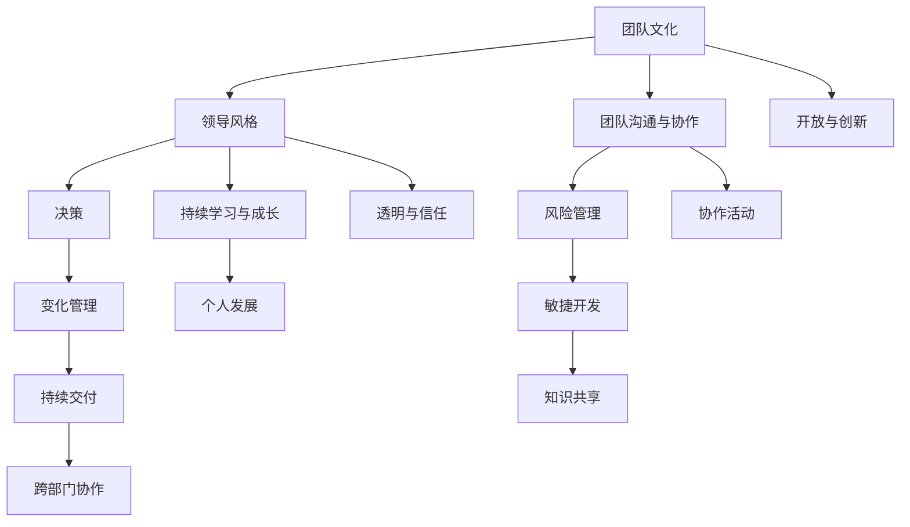

                 

### 文章标题：打造resilient团队：提升应对变化的能力

#### 关键词：resilient团队，应对变化，敏捷开发，持续交付，领导力，团队沟通，风险管理

> 摘要：在现代技术快速发展的背景下，团队在面对不断变化的市场需求和技术挑战时，如何保持高度的抗压性和适应性，成为企业成功的关键。本文旨在探讨如何打造一个resilient团队，提升其应对变化的能力。文章首先解释了resilient团队的定义和重要性，接着分析了其核心要素，包括文化、价值观、领导风格、决策和团队沟通。随后，文章讨论了如何通过敏捷开发和持续交付等实践来提高团队resilience，并通过实际案例进行深入剖析。最后，文章提出了监测与评估团队resilience的方法，以及如何持续提升团队的能力，以应对未来可能的变化。

### 目录大纲

#### 第一部分：理解resilience

- 第1章：什么是resilient团队
  - 1.1 resilience的定义
  - 1.2 resilient团队的特征
  - 1.3 resilience的重要性

- 第2章：团队resilience的核心要素
  - 2.1 文化与价值观
  - 2.2 领导风格与决策
  - 2.3 团队沟通与协作

- 第3章：核心概念与联系
  - 3.1 resilience与适应力的关系
  - 3.2 resilience与敏捷开发的联系
  - 3.3 resilience与持续交付的联系

#### 第二部分：建立resilient团队

- 第4章：建立resilient团队的文化
  - 4.1 培养开放与创新的文化
  - 4.2 建立透明与信任的沟通环境
  - 4.3 倡导持续学习和个人成长

- 第5章：领导风格与决策
  - 5.1 适应性领导力
  - 5.2 快速决策与有效执行
  - 5.3 领导者在团队resilience中的作用

- 第6章：团队沟通与协作
  - 6.1 沟通的重要性
  - 6.2 沟通障碍与解决策略
  - 6.3 促进协作的团队建设活动

#### 第三部分：提高团队resilience

- 第7章：应对变化与风险管理
  - 7.1 变化管理的策略
  - 7.2 风险识别与评估
  - 7.3 应对风险的行动计划

- 第8章：敏捷开发与持续交付
  - 8.1 敏捷开发的基本原则
  - 8.2 敏捷开发的方法与实践
  - 8.3 持续交付的价值与实现

- 第9章：案例研究
  - 9.1 成功的resilient团队案例
  - 9.2 挑战与解决
  - 9.3 从案例中汲取的经验

#### 第四部分：持续提升resilience

- 第10章：监测与评估团队resilience
  - 10.1 监测团队resilience的指标
  - 10.2 定期评估与反馈
  - 10.3 持续改进的策略

- 第11章：持续学习与成长
  - 11.1 团队成员的个人发展
  - 11.2 跨部门协作与知识共享
  - 11.3 培养下一代resilient领导者

#### 附录

- 附录A：resilient团队工具与资源
  - A.1 主流resilience评估工具
  - A.2 敏捷开发工具推荐
  - A.3 相关书籍与文章推荐

### Mermaid流程图：resilient团队核心要素关系图



### 核心算法原理讲解：适应性领导力算法伪代码

```python
# 适应性领导力算法伪代码

def AdaptiveLeadership(model, team):
    for member in team:
        skill_level = evaluateSkillLevel(member)
        confidence_level = evaluateConfidenceLevel(member)
        
        if skill_level < model.min_skill_threshold or confidence_level < model.min_confidence_threshold:
            provideTrainingToMember(member)
        
        if skill_level > model.max_skill_threshold or confidence_level > model.max_confidence_threshold:
            rewardMember(member)
            
        else:
            provideSupportToMember(member)
```

文章开始到这里，接下来将逐章深入探讨resilient团队的定义、核心要素、建立与提高方法，以及如何持续监测与评估团队resilience。让我们一起开启这段探讨之旅。接下来，我们将深入探讨什么是resilient团队，以及它对于现代团队的重要性。

## 第1章：什么是resilient团队

### 1.1 resilience的定义

在探讨resilient团队之前，我们先来了解什么是resilience。Resilience，即弹性或恢复力，是指个体、团队或系统在面对外部冲击或变化时，能够快速适应并恢复到正常状态的能力。在技术领域，resilience被广泛应用，尤其是在软件工程和项目管理中。它强调的是在面对不断变化的环境和技术挑战时，团队如何保持稳定性和有效性。

具体来说，resilience包括以下几方面：

1. **适应能力**：团队能够根据环境变化调整自身策略和行为，以适应新的需求。
2. **恢复能力**：团队在遭受打击后，能够快速恢复功能，减少负面影响。
3. **学习能力**：团队通过不断学习和调整，提升自身应对未来变化的能力。

### 1.2 resilient团队的特征

一个resilient团队具有以下特征：

1. **高度适应性**：团队在面对变化时，能够迅速调整计划，灵活应对。
2. **良好沟通**：团队成员之间沟通顺畅，信息透明，能有效分享知识和经验。
3. **相互信任**：团队成员之间相互信任，能够依赖彼此完成工作任务。
4. **持续学习**：团队重视持续学习，不断更新知识和技能，以适应新环境。
5. **积极态度**：面对挑战时，团队保持积极乐观的态度，努力解决问题。

### 1.3 resilience的重要性

在当今技术快速变革的时代，resilience的重要性愈发凸显。以下是resilient团队对于现代团队的重要性：

1. **应对快速变化的市场需求**：市场和技术变化迅速，resilient团队能够快速适应，保持竞争力。
2. **提高团队稳定性**：在面对突发事件和挑战时，resilient团队能够保持稳定，降低风险。
3. **提升员工满意度**：团队文化和沟通环境的改善，有助于提高员工的工作满意度和忠诚度。
4. **促进创新**：开放和创新的文化氛围，激发团队成员的创造力，推动技术进步。
5. **增强客户信任**：通过提供稳定和高质量的服务，增强客户对企业的信任。

总结来说，resilient团队是现代企业在面对不断变化的环境时，保持竞争力的关键。在接下来的章节中，我们将进一步探讨团队resilience的核心要素，以及如何建立和提升resilience。敬请期待。接下来，我们将深入探讨团队resilience的核心要素。

## 第2章：团队resilience的核心要素

### 2.1 文化与价值观

一个团队的resilience很大程度上取决于其内部的文化和价值观。文化是团队共同遵循的行为准则和信仰，而价值观则是团队共同认同的核心信念。以下是文化与价值观在团队resilience中发挥的关键作用：

1. **促进适应性**：文化鼓励团队成员在面对变化时，积极探索新的解决方案，而不是固守传统的做法。这种开放性和适应性有助于团队迅速调整策略，应对外部冲击。
   
2. **提升沟通效率**：一个拥有共同价值观的团队，成员之间更容易达成共识，信息传递更加高效。这有助于减少误解和冲突，增强团队的凝聚力。

3. **建立信任**：文化中的信任是团队resilience的重要基础。团队成员之间互相信任，能够更好地协同工作，共同应对挑战。

4. **推动持续学习**：团队价值观强调持续学习和个人成长，鼓励成员不断更新知识和技能。这有助于团队在面对新挑战时，具备更强的适应能力。

5. **促进创新**：开放和创新的文化氛围，激发团队成员的创造力，推动技术进步和业务发展。

### 实际案例：谷歌的文化与价值观

谷歌（Google）以其独特的企业文化而闻名，这种文化在很大程度上促成了其长期的resilience。谷歌强调“不作恶”（Don't Be Evil）的价值观，鼓励员工创新和实验。这种开放的文化氛围，使得谷歌能够在不断变化的市场和技术环境中，始终保持高度适应性。例如，谷歌在面临搜索引擎市场的竞争压力时，通过不断推出新的产品和服务（如Gmail、Google Maps等），成功巩固了其市场地位。

### 2.2 领导风格与决策

领导风格在团队resilience中起着至关重要的作用。一个适应性强的领导，能够帮助团队在面对变化时，做出快速、有效的决策。以下是几种常见的领导风格及其在团队resilience中的作用：

1. **民主型领导**：民主型领导鼓励团队成员参与决策过程，通过集思广益，提高决策的质量和适应性。这种领导风格有助于建立团队成员之间的信任和沟通，增强团队凝聚力。

2. **变革型领导**：变革型领导通过激励和鼓舞团队成员，推动团队创新和进步。他们能够激发团队成员的潜力，引导团队适应新的变化和挑战。

3. **交易型领导**：交易型领导注重效率和目标达成，通过明确的奖励和惩罚机制，激励团队成员工作。这种领导风格在稳定的环境下效果显著，但在面对剧烈变化时，可能需要更多的适应性。

4. **授权型领导**：授权型领导给予团队成员更大的自主权和责任感，鼓励他们自主决策和解决问题。这种领导风格有助于提高团队成员的适应能力和创新能力。

### 实际案例：苹果公司的领导风格

苹果公司（Apple）的创始人史蒂夫·乔布斯（Steve Jobs）是一位典型的变革型领导。他通过强烈的愿景和激情，激励团队成员追求卓越和创新。在他的领导下，苹果公司推出了一系列革命性的产品，如iPhone、iPad等，成功引领了多个行业趋势。乔布斯的领导风格不仅帮助苹果公司在面临市场和技术变化时，保持了强大的适应性，还培养了一批具备高度resilience的团队成员。

### 2.3 团队沟通与协作

团队沟通与协作是团队resilience的另一个关键要素。良好的沟通和协作能够确保团队在面对外部冲击时，迅速调整策略，保持高效运作。以下是团队沟通和协作在团队resilience中的作用：

1. **信息透明**：团队成员之间信息透明，有助于减少误解和冲突，提高决策效率。信息共享是团队resilience的重要基础。

2. **跨职能协作**：跨职能团队在应对复杂问题时，能够发挥各自的专业优势，协同解决难题。这种协作有助于提高团队的整体适应能力和创新能力。

3. **快速响应**：在面临突发事件时，团队能够快速响应，协同行动，降低风险。良好的沟通和协作能力有助于团队在压力下保持冷静和高效。

4. **知识共享**：团队成员之间的知识共享，有助于团队积累经验和技能，提高整体能力。这有助于团队在面临新挑战时，更快地适应和应对。

5. **冲突管理**：团队成员之间的冲突在所难免，但有效的冲突管理能够确保团队在冲突中找到最佳解决方案，避免负面影响。良好的沟通和协作能力有助于团队更好地处理冲突。

### 实际案例：丰田的团队沟通与协作

丰田（Toyota）以其卓越的精益生产和团队协作而闻名。在丰田，团队协作是一种文化，员工之间高度信任，信息透明。他们通过不断的沟通和协作，确保每个环节都能高效运作，从而在竞争激烈的市场中保持了强大的竞争力。例如，丰田在生产过程中采用跨职能团队，将设计、生产、质量等不同部门的员工紧密结合起来，共同解决问题，提高了整体效率和质量。

通过以上讨论，我们可以看到，文化与价值观、领导风格和团队沟通与协作是团队resilience的核心要素。一个具备这些要素的团队，在面对外部变化时，能够更好地适应和应对，从而保持竞争力和持续发展。在接下来的章节中，我们将进一步探讨这些要素的具体实施方法和策略。敬请期待。接下来，我们将深入探讨resilience与适应力、敏捷开发、持续交付等核心概念之间的联系。

## 第3章：核心概念与联系

### 3.1 resilience与适应力的关系

resilience与适应力（Adaptability）是密切相关的概念，但它们在内涵和外延上有所不同。适应力是指个体或系统能够根据外部环境的变化，迅速调整自身结构和行为的能力。而resilience则强调在经历冲击后，能够迅速恢复到正常状态并保持功能的能力。

1. **关系解释**：适应力是resilience的基础。一个具备高度适应力的团队，能够在变化的环境中迅速调整策略，减少外部冲击对团队的影响。而resilience则是在适应力基础上，强调在面对持续和剧烈变化时，团队能够保持稳定和有效运作。

2. **实际案例**：亚马逊（Amazon）的创始人杰夫·贝佐斯（Jeff Bezos）非常重视公司的适应力。他提出了“长期思维”（Long-Term Orientation）的理念，鼓励团队成员关注未来的变化，并提前做好准备。例如，亚马逊在电商市场崛起时，迅速调整策略，进入云计算领域，从而在变化的市场中保持了竞争优势。

### 3.2 resilience与敏捷开发的联系

敏捷开发（Agile Development）是一种以人为核心、迭代、增量和灵活响应变化的软件开发方法。resilience与敏捷开发之间存在紧密的联系，主要体现在以下几个方面：

1. **关系解释**：敏捷开发强调团队在面对变化时，能够迅速调整计划和策略，这与resilience的理念高度契合。敏捷开发的方法，如迭代开发、持续集成和持续交付，有助于团队提高适应力和恢复力。

2. **实际案例**：GitHub是一家以敏捷开发著称的公司。GitHub通过持续集成和持续交付，确保代码质量和交付速度。这种敏捷的开发方法，使得GitHub能够迅速响应市场需求，持续推出高质量的产品。

### 3.3 resilience与持续交付的联系

持续交付（Continuous Delivery）是一种软件开发实践，确保代码可以在任何时间、任何状态下，安全、可靠地交付到生产环境中。resilience与持续交付之间存在密切联系，主要体现在以下几个方面：

1. **关系解释**：持续交付强调快速、频繁地交付代码，并确保每次交付都是可靠的。这种做法有助于团队在面对变化时，快速适应并恢复功能。持续交付的过程，如自动化测试和部署，有助于提高团队的适应力和恢复力。

2. **实际案例**：Netflix是一家以持续交付著称的公司。Netflix通过自动化测试和部署，确保每次代码更新都是可靠的。在Netflix，每次代码提交都会经过严格的自动化测试，确保软件质量。这种持续交付的方法，使得Netflix能够快速响应市场需求，持续推出高质量的产品。

通过以上讨论，我们可以看到，resilience与适应力、敏捷开发、持续交付等核心概念之间存在紧密的联系。这些概念相互促进，共同构成了一个resilient团队的基础。在接下来的章节中，我们将进一步探讨如何通过建立resilient团队的文化、领导风格和沟通协作，提升团队的resilience。敬请期待。接下来，我们将探讨如何建立resilient团队的文化，这是提升团队resilience的关键步骤之一。

## 第4章：建立resilient团队的文化

### 4.1 培养开放与创新的文化

开放与创新的文化是建立resilient团队的基础。在这种文化氛围下，团队成员敢于分享自己的想法和意见，勇于尝试新方法，不断推动团队进步。以下是培养开放与创新文化的关键步骤：

1. **鼓励观点多样性**：团队成员背景和经验的多样性，有助于带来不同的观点和思路。团队领导应鼓励成员提出不同的意见，并在决策过程中充分考虑这些观点。

2. **建立信任**：信任是开放与创新文化的重要基础。团队领导应通过透明的沟通和信任机制，建立成员之间的互信，确保每个人都能放心地表达自己的观点。

3. **激励创新**：团队领导应鼓励成员勇于尝试新方法，并为创新提供支持和资源。例如，可以设立创新奖金或奖励机制，激励成员提出和实施创新项目。

4. **培训与发展**：提供定期的培训和发展机会，帮助团队成员提升技能和知识，从而更好地应对新挑战。这有助于团队在面对变化时，具备更强的适应能力和创新精神。

5. **鼓励失败**：在创新过程中，失败是不可避免的。团队领导应鼓励成员从失败中吸取教训，不断改进。这种包容失败的文化，有助于团队保持开放和创新的精神。

### 实际案例：谷歌的“20%时间”项目

谷歌（Google）的“20%时间”项目是一个典型的创新实践。谷歌允许员工将每周工作时间的20%用于探索自己的兴趣项目，这些项目不一定与公司的核心业务直接相关。这个项目不仅激发了员工的工作热情和创新精神，还带来了许多成功的产品，如Gmail和Google News等。这种开放与创新的文化，使得谷歌在激烈的市场竞争中始终保持领先地位。

### 4.2 建立透明与信任的沟通环境

透明与信任的沟通环境是resilient团队的重要特征。在这种环境中，团队成员能够开放地分享信息、反馈和意见，减少误解和冲突，提高决策效率。以下是建立透明与信任的沟通环境的策略：

1. **定期沟通**：定期举行团队会议和讨论，让团队成员分享工作进展、挑战和想法。这种定期的沟通有助于建立透明和信任的文化。

2. **开放反馈**：鼓励团队成员在适当的场合提供反馈，并对他人的反馈保持开放态度。这有助于团队及时发现问题，并采取行动进行改进。

3. **建立信任机制**：通过透明的决策过程和明确的承诺，建立成员之间的信任。例如，团队领导可以公开讨论决策依据和预期结果，让团队成员了解决策过程，从而增加信任。

4. **鼓励跨部门协作**：跨部门协作有助于团队成员了解其他部门的工作和挑战，促进信息共享和信任建立。这有助于团队在面对复杂问题时，能够迅速协同解决。

5. **尊重个人意见**：尊重每个团队成员的意见和贡献，确保每个人在团队中都有发言权和参与感。这有助于增强团队成员的归属感和信任感。

### 实际案例：塔塔咨询服务公司（TCS）的透明沟通实践

塔塔咨询服务公司（Tata Consultancy Services, TCS）是一家全球领先的IT服务公司，以其透明的沟通实践而著称。TCS采用了一种名为“开放门户”的系统，允许员工在任何时间、任何地点访问公司的内部信息和决策过程。这种透明的沟通环境，使得员工能够更好地了解公司的发展方向和决策依据，增强了他们对公司的信任和忠诚度。

### 4.3 倡导持续学习和个人成长

持续学习和个人成长是resilient团队的重要特征。在一个鼓励学习的文化中，团队成员能够不断更新知识和技能，提高自身的适应能力和创新能力。以下是倡导持续学习和个人成长的方法：

1. **提供培训机会**：定期组织内部和外部培训，帮助团队成员提升专业技能和知识水平。例如，可以邀请行业专家进行讲座或举办技能提升工作坊。

2. **鼓励自学**：鼓励团队成员利用业余时间自学新知识和技能。公司可以提供在线学习平台或图书资源，支持员工的自我学习。

3. **设立学习目标**：为每个团队成员设定明确的个人学习目标，并定期评估和反馈。这有助于团队成员保持学习的动力和方向。

4. **提供职业发展机会**：为团队成员提供职业发展的机会，如晋升、跨部门调岗等。这有助于激发员工的学习热情和职业发展动力。

5. **建立学习社区**：建立学习社区或小组，鼓励团队成员分享学习经验和心得，共同成长。这种社区可以促进知识共享和经验交流，提高团队整体的学习效果。

### 实际案例：爱立信（Ericsson）的学习与成长实践

爱立信（Ericsson）是一家全球领先的电信设备制造商，其学习与成长实践在业界享有盛誉。爱立信为员工提供广泛的培训课程，涵盖技术、管理和软技能等多个方面。此外，公司还设立了一个名为“创新实验室”的平台，鼓励员工进行创新研究和实验。这种持续学习和个人成长的文化，使得爱立信在技术领域保持了领先地位。

通过以上讨论，我们可以看到，建立开放与创新、透明与信任、持续学习和个人成长的文化，是打造resilient团队的关键。这些文化特征不仅有助于提升团队的适应力和创新能力，还能增强团队的凝聚力和稳定性。在接下来的章节中，我们将探讨如何通过领导风格和决策来提升团队的resilience。敬请期待。接下来，我们将深入探讨领导风格与决策在团队resilience中的作用。

## 第5章：领导风格与决策

### 5.1 适应性领导力

适应性领导力（Adaptive Leadership）是指领导者在面对复杂、不确定和快速变化的环境时，能够灵活调整领导策略和决策过程，以适应新情况的能力。适应性领导力在团队resilience中起着至关重要的作用，以下是适应性领导力的关键要素：

1. **情境意识**：领导者应具备对当前环境和团队状态的深刻洞察，能够识别出潜在的风险和机会。

2. **快速决策**：在面临紧急情况时，领导者应能够迅速做出决策，确保团队能够及时应对。

3. **灵活调整**：领导者应根据环境和团队的变化，灵活调整领导策略和决策过程，确保团队能够持续适应。

4. **激励与赋能**：领导者应通过激励和赋能，激发团队成员的潜力和创造力，提高团队的适应力和恢复力。

5. **持续学习**：领导者应不断学习和更新自己的知识和技能，以应对新的挑战和变化。

### 实际案例：戴尔的适应性领导力

戴尔（Dell）的创始人迈克尔·戴尔（Michael Dell）是一位典型的适应性领导者。在戴尔的发展历程中，迈克尔·戴尔多次面临市场和技术变化，但他总能通过快速调整领导策略，带领团队走出困境。例如，在面临传统PC市场下滑的挑战时，迈克尔·戴尔果断调整策略，进军云计算和数据中心市场，成功带领戴尔实现转型。

### 5.2 快速决策与有效执行

快速决策与有效执行是团队resilience的重要保障。在一个快速变化的环境中，领导者需要能够迅速做出决策，并确保决策得到有效执行。以下是实现快速决策与有效执行的关键步骤：

1. **明确目标和优先级**：领导者应明确团队的目标和优先级，确保团队成员在执行任务时，能够迅速行动并产生结果。

2. **简化决策过程**：通过减少决策层级和流程，简化决策过程，确保决策能够快速做出。

3. **授权与分权**：领导者应适当授权，给予团队成员决策权，提高决策的速度和灵活性。

4. **建立反馈机制**：通过建立有效的反馈机制，及时获取执行过程中的信息和反馈，确保决策能够得到及时调整和优化。

5. **鼓励创新与试错**：领导者应鼓励团队成员勇于创新和尝试，对失败持包容态度，确保团队能够在试错中不断成长。

### 实际案例：Netflix的快速决策与有效执行

Netflix是一家以快速决策和有效执行著称的公司。Netflix的创始人里德·哈斯廷斯（Reed Hastings）和泰德·萨兰蒂诺（Ted Sarandos）在决策过程中非常重视速度和执行力。他们通过简化的决策流程和授权机制，确保团队能够迅速响应市场需求。例如，Netflix在推出《纸牌屋》这部电视剧时，领导层在短时间内做出决策，并迅速投入资源，最终取得了巨大成功。

### 5.3 领导者在团队resilience中的作用

领导者在团队resilience中起着至关重要的作用。以下是领导者如何发挥关键作用，提升团队resilience的几个方面：

1. **设定愿景和目标**：领导者应明确团队的愿景和目标，为团队提供清晰的方向，确保团队在面临变化时，能够保持一致和协同。

2. **建立信任**：领导者应通过透明的沟通和诚信行为，建立团队成员之间的信任，确保团队在面对挑战时，能够紧密合作。

3. **激发团队成员的潜力**：领导者应关注团队成员的成长和发展，通过激励和赋能，激发团队成员的潜力和创造力。

4. **提供支持和资源**：领导者应确保团队成员在面临挑战时，能够得到所需的支持和资源，帮助团队克服困难。

5. **促进团队协作**：领导者应通过建立有效的协作机制，促进团队成员之间的沟通和合作，提高团队的整体效能。

6. **监测和评估团队表现**：领导者应定期监测和评估团队的表现，及时发现问题和改进机会，确保团队在不断优化中提升resilience。

### 实际案例：亚马逊的领导力实践

亚马逊（Amazon）的创始人杰夫·贝佐斯（Jeff Bezos）是一位具有前瞻性和执行力的领导者。他通过设定清晰的目标和愿景，建立了强大的领导力体系，确保亚马逊在快速变化的市场环境中，始终保持强大的resilience。例如，贝佐斯提出的“两个比一”原则，要求亚马逊在同等成本下，提供比竞争对手更优质的服务，这一原则在提高服务质量的同时，也增强了团队的执行力和创新精神。

通过以上讨论，我们可以看到，适应性领导力、快速决策与有效执行，以及领导者在团队resilience中的关键作用，都是建立resilient团队的重要方面。领导者通过发挥这些作用，能够帮助团队在面对变化时，保持稳定和高效运作。在接下来的章节中，我们将进一步探讨团队沟通与协作的重要性，以及如何促进团队沟通与协作。敬请期待。接下来，我们将探讨团队沟通与协作的重要性。

## 第6章：团队沟通与协作

### 6.1 沟通的重要性

在团队resilience的建设中，沟通扮演着至关重要的角色。有效的沟通能够确保信息透明，减少误解和冲突，提高团队的整体效能。以下是沟通在团队resilience中的重要性的几个方面：

1. **信息共享**：通过有效的沟通，团队成员能够及时了解项目进展、任务分配和决策过程，从而更好地协调工作。

2. **减少误解**：沟通中的误解和误传可能会导致任务执行偏差和效率降低。有效的沟通能够确保信息的准确传递，减少这种风险。

3. **增强团队凝聚力**：良好的沟通有助于建立团队成员之间的信任和共识，增强团队凝聚力，提高团队士气。

4. **促进创新**：开放的沟通环境能够激发团队成员的创意和想法，促进创新和改进。

5. **提高决策效率**：通过多渠道和实时的沟通，团队能够迅速达成共识，提高决策效率，快速响应变化。

### 实际案例：NASA的团队沟通实践

NASA（美国国家航空航天局）在项目管理和团队沟通方面有着丰富的经验。在火星探测任务中，NASA通过建立高效的沟通机制，确保各个团队之间的信息透明和及时更新。他们采用了一系列工具，如电子邮件、即时通讯和视频会议，确保项目团队成员能够随时沟通和协作。这种高效的沟通实践，使得NASA在复杂的任务中，能够保持高度的协调和效率。

### 6.2 沟通障碍与解决策略

尽管沟通的重要性不言而喻，但在实际操作中，团队沟通往往会遇到各种障碍。以下是一些常见的沟通障碍及其解决策略：

1. **信息过载**：过多的信息和重复的沟通会导致团队成员无法有效处理和利用这些信息。解决策略：建立明确的信息渠道和沟通频率，确保信息传递的效率。

2. **文化差异**：团队成员来自不同的文化背景，可能会影响沟通效果。解决策略：通过跨文化培训和提高文化敏感性，促进团队成员之间的理解和沟通。

3. **沟通层次过多**：过多的沟通层级会导致信息传递的延误和失真。解决策略：简化沟通流程，减少决策层级，确保信息能够快速传递。

4. **技术障碍**：技术工具的不足或使用不当会影响沟通效果。解决策略：选用合适的沟通工具，并提供相关的技术培训和指导。

5. **时间差异**：团队成员可能分布在不同的时区，导致沟通的实时性受限。解决策略：制定合理的沟通时间表，确保团队成员能够在预定时间内参与沟通。

### 实际案例：腾讯的跨时区沟通实践

腾讯是一家在全球范围内运营的公司，团队成员分布在不同的时区。为了解决跨时区的沟通障碍，腾讯采用了多种策略。首先，他们建立了24/7的客户服务团队，确保能够随时响应用户需求。其次，腾讯利用在线协作工具，如Slack和Trello，确保团队成员能够实时沟通和协作。此外，腾讯还设立了全球沟通委员会，负责协调不同时区团队的沟通工作，确保信息的有效传递。

### 6.3 促进协作的团队建设活动

团队建设活动是提高团队沟通与协作能力的重要手段。以下是一些有效的团队建设活动：

1. **团队会议**：定期举行团队会议，讨论项目进展、任务分配和团队动态。这种会议有助于团队成员了解彼此的工作内容和进展，增强团队凝聚力。

2. **角色扮演**：通过角色扮演活动，团队成员可以模拟真实的团队工作场景，体验不同角色的工作内容和责任，提高对团队协作的理解和敏感性。

3. **团队拓展训练**：组织户外拓展训练，如攀岩、徒步等，有助于团队成员建立信任，提高团队合作能力。

4. **团队竞赛**：通过团队竞赛活动，如编程比赛、知识竞赛等，激发团队成员的竞争意识和团队精神。

5. **经验分享会**：定期举办经验分享会，邀请团队成员分享工作经验和心得，促进知识共享和团队成长。

### 实际案例：谷歌的团队建设活动

谷歌（Google）以其丰富的团队建设活动而闻名。谷歌定期组织团队拓展训练，如滑雪、划皮艇等，帮助团队成员建立信任和增强团队合作能力。此外，谷歌还举办内部黑客松（Hackathons），鼓励团队成员跨部门合作，共同开发创新项目。这种团队建设活动不仅提高了团队成员的沟通能力，还促进了创新和协作。

通过以上讨论，我们可以看到，团队沟通与协作在团队resilience中具有不可替代的重要性。通过有效的沟通策略和团队建设活动，团队能够增强凝聚力，提高协作能力，从而更好地应对外部变化和挑战。在接下来的章节中，我们将探讨如何通过应对变化和风险管理来提高团队resilience。敬请期待。接下来，我们将深入探讨如何通过应对变化和风险管理来提高团队resilience。

## 第7章：应对变化与风险管理

### 7.1 变化管理的策略

变化是现代商业环境中不可避免的一部分。对于团队来说，有效管理变化是提升resilience的关键。以下是一些变化管理的策略：

1. **前瞻性规划**：团队应提前识别潜在的变化，并制定相应的应对策略。这包括对市场趋势、技术发展、政策变化等进行持续监控和分析。

2. **建立预警机制**：通过建立预警机制，团队可以及时发现变化迹象，并采取预防措施。例如，可以设置关键指标和警报系统，确保在变化发生前，团队已做好准备。

3. **灵活调整计划**：在变化发生时，团队应能够迅速调整计划，确保任务能够继续顺利执行。这包括重新分配资源、调整任务优先级和优化工作流程。

4. **团队沟通**：有效的沟通是应对变化的重要保障。团队应确保所有成员了解变化的背景和影响，并共同探讨应对方案。

5. **培训与发展**：团队应通过培训和技能提升，确保成员具备应对变化所需的技能和知识。这有助于提高团队的适应能力和恢复力。

### 实际案例：微软的变革管理实践

微软（Microsoft）在变革管理方面有着丰富的经验。在面对云计算和移动技术等新兴市场的挑战时，微软通过一系列措施，成功实现了业务转型。首先，微软建立了专门的战略规划团队，负责监测市场动态和预测变化。其次，微软通过内部培训和外部合作，提高员工在新兴技术领域的技能。此外，微软还鼓励员工创新，推动公司内部的文化变革。这些变革管理策略，帮助微软在激烈的市场竞争中保持了领先地位。

### 7.2 风险识别与评估

风险管理是提高团队resilience的重要组成部分。以下是一些风险识别与评估的方法：

1. **定性分析**：通过访谈、头脑风暴和专家评审等方法，识别潜在的风险因素。这种方法有助于理解风险的性质和可能的影响。

2. **定量分析**：使用数学模型和统计方法，对风险的概率和影响进行量化评估。这种方法有助于制定更科学的应对策略。

3. **风险评估矩阵**：使用风险评估矩阵，将风险因素按概率和影响程度进行分类，以便于团队集中精力应对高优先级的风险。

4. **情景分析**：通过构建不同情景下的风险场景，评估各种变化对团队的影响，并制定相应的应对措施。

### 实际案例：波音公司的风险管理实践

波音公司（Boeing）在风险管理方面有着严格的流程和体系。在面对飞机设计、生产和运营等各个环节时，波音通过定性和定量分析，全面识别潜在风险。例如，波音在737 MAX飞机项目中，通过对飞行控制系统的详细分析，识别了潜在的飞行风险，并采取了相应的改进措施。此外，波音还建立了风险管理委员会，负责监督和评估项目的风险状况，确保风险得到有效控制。

### 7.3 应对风险的行动计划

一旦识别和评估了风险，团队需要制定具体的行动计划，以应对可能发生的变化。以下是一些常见的应对措施：

1. **预防措施**：针对高优先级的风险，制定预防措施，降低风险发生的概率。例如，通过改进流程、增加测试和监控等手段，减少风险的发生。

2. **应急计划**：制定应急计划，以应对可能发生的紧急情况。应急计划应包括紧急响应流程、关键资源调配和备份方案等。

3. **资源调配**：在风险发生时，合理调配资源，确保团队有足够的资源和能力应对风险。

4. **培训和演练**：通过培训和演练，提高团队成员应对风险的技能和意识，确保他们能够在紧急情况下迅速行动。

5. **监控与反馈**：实施持续的监控和反馈机制，及时识别和处理新出现的问题，确保风险得到有效控制。

### 实际案例：Uber的风险应对策略

Uber是一家在快速变化的市场中成长起来的公司。在面对法律、政策和市场竞争等多方面风险时，Uber采取了一系列应对措施。首先，Uber通过法律团队和外部顾问，确保公司遵守各国的法律法规。其次，Uber通过数据分析，实时监控市场的变化和竞争态势，及时调整业务策略。此外，Uber还建立了危机管理团队，负责处理突发危机，并确保公司的应急响应机制能够快速启动。这些风险应对策略，帮助Uber在复杂多变的市场环境中保持了稳定的发展。

通过以上讨论，我们可以看到，应对变化和风险管理是提高团队resilience的重要环节。通过有效的变化管理策略、风险识别与评估，以及应对风险的行动计划，团队能够更好地应对外部变化和挑战，提高整体resilience。在接下来的章节中，我们将探讨敏捷开发与持续交付在团队resilience中的作用。敬请期待。

## 第8章：敏捷开发与持续交付

### 8.1 敏捷开发的基本原则

敏捷开发（Agile Development）是一种以人为核心、迭代、增量和灵活响应变化的软件开发方法。其基本原则包括：

1. **个体与互动胜过过程与工具**：敏捷开发强调团队成员之间的沟通和合作，认为这是提高软件开发效率的关键。

2. **可工作的软件胜过详尽的文档**：敏捷开发认为，软件的实际功能比复杂的文档更重要，因此更注重软件的实际交付。

3. **客户合作胜过合同谈判**：敏捷开发强调与客户的紧密合作，确保软件满足客户的需求。

4. **响应变化胜过遵循计划**：敏捷开发认为，在快速变化的环境中，灵活调整计划比坚持原计划更为重要。

### 实际案例：谷歌的敏捷开发实践

谷歌（Google）在软件开发中广泛应用敏捷开发方法。谷歌的工程团队采用Scrum框架，将开发过程分为短期的迭代（Sprint），每个Sprint周期为2-4周。在每个Sprint周期结束时，团队进行回顾会议，评估和改进开发过程。此外，谷歌还鼓励团队成员积极参与规划和决策，确保开发过程能够灵活应对变化。这种敏捷开发方法，使得谷歌能够快速响应市场需求，持续推出高质量的产品。

### 8.2 敏捷开发的方法与实践

敏捷开发有多种方法，如Scrum、Kanban和XP（极限编程）等。以下是一些常见的敏捷开发方法与实践：

1. **Scrum**：Scrum是一种迭代和增量的软件开发方法。它分为多个Sprint，每个Sprint周期为2-4周。在每个Sprint周期内，团队进行规划、每日站会、评审和回顾。Scrum强调透明、反馈和持续改进。

2. **Kanban**：Kanban是一种基于看板系统的精益管理方法。它通过可视化工作流程，帮助团队识别和消除瓶颈，提高工作效率。Kanban适用于那些需要稳定、持续交付的工作场景。

3. **XP（极限编程）**：XP是一种注重代码质量和团队协作的敏捷开发方法。它包括单元测试、代码重构、持续集成和实践反思等实践。XP有助于提高代码质量，增强团队凝聚力。

### 实际案例：LinkedIn的Kanban实践

LinkedIn是一家采用Kanban方法的公司。LinkedIn的工程团队使用Trello等工具，将工作流程可视化，并实时更新任务状态。这种可视化的工作方式，使得团队能够清晰地看到任务进展，及时调整优先级和资源分配。此外，LinkedIn还定期举行回顾会议，评估和改进工作流程。这种Kanban实践，帮助LinkedIn提高了开发效率和产品质量。

### 8.3 持续交付的价值与实现

持续交付（Continuous Delivery）是一种软件开发实践，确保代码可以在任何时间、任何状态下，安全、可靠地交付到生产环境中。持续交付的价值包括：

1. **缩短交付周期**：通过自动化测试和部署流程，持续交付能够显著缩短软件交付周期，提高开发效率。

2. **提高产品质量**：持续交付过程中，自动化测试和持续反馈机制有助于及早发现和修复问题，提高软件质量。

3. **增强团队信心**：持续交付确保每次交付都是可靠的，增强团队对交付质量的信心，降低心理压力。

4. **提高客户满意度**：持续交付能够快速响应用户需求，提供及时的新功能和服务，提高客户满意度。

实现持续交付的关键要素包括：

1. **自动化测试**：建立全面的自动化测试体系，确保每次代码提交都能经过严格的测试。

2. **持续集成**：通过持续集成工具，将代码集成到一个共享的代码库中，确保代码的质量和一致性。

3. **部署自动化**：使用自动化部署工具，实现代码从开发环境到生产环境的无缝迁移，确保部署过程高效、可靠。

4. **监控与反馈**：建立监控系统，实时监控软件的运行状态和性能指标，及时反馈问题和改进机会。

### 实际案例：Netflix的持续交付实践

Netflix在持续交付方面有着丰富的经验。Netflix使用自动化测试和持续集成工具，确保每次代码提交都能经过严格的测试和集成。此外，Netflix采用蓝绿部署和金丝雀部署等策略，确保新功能的上线风险可控。Netflix还建立了实时监控系统，监控软件的运行状态和性能指标，确保系统能够快速响应用户需求。这种持续交付实践，使得Netflix能够快速响应市场需求，持续提供高质量的服务。

通过以上讨论，我们可以看到，敏捷开发与持续交付在团队resilience中发挥着重要作用。敏捷开发方法帮助团队提高适应能力和协作效率，而持续交付实践确保团队能够快速响应变化，提高交付质量和客户满意度。在接下来的章节中，我们将通过一个成功的resilient团队案例，深入剖析其成功经验和挑战。敬请期待。

## 第9章：案例研究

### 9.1 成功的resilient团队案例：Airbnb

Airbnb是一家全球领先的短期住宿分享平台，其成功离不开其高度resilient的团队。以下是对Airbnb团队如何通过多种策略提升resilience的深入剖析：

#### 案例背景

Airbnb成立于2008年，最初是一家提供短期租房服务的初创公司。随着业务的快速增长，Airbnb面临着不断变化的市场需求、技术挑战和法规压力。为了保持竞争优势，Airbnb需要建立一支高度resilient的团队，以快速适应市场变化，并有效应对各种挑战。

#### 挑战与解决

1. **市场需求变化**：随着全球化进程的加快，Airbnb需要快速适应不同国家和地区的市场需求。解决方案：Airbnb通过建立本地团队，深入了解各地的文化、消费习惯和法规环境，为每个市场定制化解决方案。

2. **技术挑战**：随着业务规模的扩大，Airbnb面临的技术挑战日益增加，如系统稳定性、数据安全和隐私保护。解决方案：Airbnb采用了敏捷开发方法，不断优化开发流程，提高代码质量，并建立了强大的技术支持团队，确保系统能够稳定运行。

3. **法规压力**：在全球范围内，Airbnb面临不同国家和地区的法规压力。解决方案：Airbnb与当地政府和监管机构保持紧密沟通，积极参与政策制定，确保业务合规。

#### 成功经验

1. **适应性领导**：Airbnb的领导层强调适应性领导力，鼓励团队成员快速响应变化，并给予他们足够的自主权。这种领导风格有助于团队在变化中保持高效运作。

2. **跨部门协作**：Airbnb鼓励跨部门协作，确保团队在面对复杂问题时，能够充分利用不同部门的专业知识和资源。例如，在推广新市场时，营销、技术、运营等部门的紧密协作，确保了推广活动的成功。

3. **持续学习**：Airbnb重视持续学习和个人成长，定期组织内部培训和外部交流，提高团队成员的技能和知识。这种学习文化有助于团队在面对新挑战时，具备更强的适应能力和创新能力。

4. **透明沟通**：Airbnb建立了透明沟通机制，确保团队成员能够及时了解公司的战略方向和项目进展。这种沟通环境有助于增强团队成员之间的信任和协作。

#### 从案例中汲取的经验

1. **适应性领导**：领导者应具备适应性领导力，鼓励团队成员快速响应变化，并给予足够的自主权。

2. **跨部门协作**：跨部门协作有助于团队在面对复杂问题时，充分利用不同部门的专业知识和资源。

3. **持续学习**：持续学习有助于团队在面对新挑战时，具备更强的适应能力和创新能力。

4. **透明沟通**：透明沟通有助于增强团队成员之间的信任和协作，提高整体效能。

通过Airbnb的成功案例，我们可以看到，一个resilient团队在面对外部变化时，需要具备适应性领导力、跨部门协作、持续学习和透明沟通等多方面的能力。这些能力不仅有助于团队应对当前挑战，还能为未来的发展奠定坚实基础。在接下来的章节中，我们将探讨如何监测和评估团队resilience，确保团队持续提升其应对变化的能力。敬请期待。

## 第10章：监测与评估团队resilience

### 10.1 监测团队resilience的指标

为了确保团队resilience的持续提升，监测与评估是至关重要的。以下是一些常用的团队resilience监测指标：

1. **任务完成率**：衡量团队在既定时间内完成任务的能力。任务完成率越高，说明团队在应对变化时，能够保持高效运作。

2. **故障恢复时间**：在系统或服务发生故障时，团队恢复功能所需的时间。故障恢复时间越短，说明团队具备更强的恢复能力。

3. **员工满意度**：通过调查问卷等方式，了解员工对团队文化和工作环境的满意度。员工满意度越高，说明团队在沟通、协作和信任方面表现良好。

4. **团队成员参与度**：衡量团队成员在团队活动中的参与程度。参与度越高，说明团队成员对团队目标和成果有更高的认同感。

5. **知识共享率**：通过监测团队成员之间的知识共享行为，了解团队在知识积累和传播方面的表现。知识共享率越高，说明团队具备更强的学习能力。

6. **决策质量**：评估团队在决策过程中的有效性和适应性。决策质量越高，说明团队在面对变化时，能够做出更明智的决策。

### 实际案例：微软的resilience监测指标

微软（Microsoft）在其内部建立了完善的团队resilience监测体系。微软采用了一系列指标，如任务完成率、故障恢复时间和员工满意度等，定期对团队的表现进行评估。此外，微软还通过员工调查和360度反馈，了解团队成员的工作状态和团队氛围。这种监测体系，帮助微软及时发现团队中的问题和改进机会，确保团队持续提升其resilience。

### 10.2 定期评估与反馈

定期评估与反馈是监测团队resilience的重要环节。以下是一些关键步骤：

1. **制定评估计划**：根据团队目标和实际情况，制定定期评估计划。评估计划应包括评估内容、评估方法和评估周期。

2. **实施评估**：按照评估计划，对团队的各个方面进行评估。评估过程中，应采用多种方法，如问卷调查、访谈和观察等，确保评估结果的全面性和准确性。

3. **分析评估结果**：对评估结果进行详细分析，识别团队的优势和不足。分析过程中，应关注关键指标的变化趋势，了解团队在不同阶段的表现。

4. **提供反馈**：将评估结果及时反馈给团队成员，并说明评估的依据和结论。反馈过程中，应鼓励团队成员积极参与讨论，共同探讨改进措施。

5. **制定改进计划**：根据评估结果和反馈，制定具体的改进计划。改进计划应明确改进目标、改进措施和责任分配。

### 实际案例：谷歌的定期评估与反馈机制

谷歌（Google）在其员工绩效评估中，采用了定期评估与反馈机制。谷歌每年进行两次绩效评估，评估内容包括工作成果、团队合作、技能提升等方面。评估过程中，员工和上级领导进行一对一沟通，讨论工作表现和改进方向。此外，谷歌还提供了反馈问卷，让员工匿名提交意见和建议。这种定期评估与反馈机制，帮助谷歌及时发现和解决团队中的问题，确保团队持续提升其resilience。

### 10.3 持续改进的策略

持续改进是团队resilience提升的关键。以下是一些有效的持续改进策略：

1. **建立持续改进文化**：团队应倡导持续改进的理念，鼓励成员在日常工作中发现问题和提出改进建议。建立持续改进文化，有助于团队在变化中不断成长。

2. **定期反思与回顾**：团队应定期进行反思与回顾，总结过去的经验和教训，识别改进机会。通过反思与回顾，团队能够更好地应对未来的挑战。

3. **实施改进措施**：根据评估结果和反馈，制定具体的改进措施，并确保这些措施得到有效实施。改进措施应具有可操作性和针对性，确保团队能够在实际工作中落实。

4. **监测改进效果**：在实施改进措施后，团队应监测其效果，评估改进措施是否达到预期目标。如果效果不佳，应及时调整措施，确保改进目标的实现。

5. **共享改进经验**：团队应共享改进经验，促进知识传播和团队学习。通过共享改进经验，团队能够积累更多成功的案例，为未来的改进提供借鉴。

### 实际案例：亚马逊的持续改进实践

亚马逊（Amazon）以其持续改进的实践而闻名。亚马逊建立了完善的改进流程，鼓励员工提出改进建议，并通过邮件系统进行投票，选择最有价值的建议进行实施。此外，亚马逊定期组织改进研讨会，分享成功的改进案例和经验，促进团队学习。这种持续改进实践，使得亚马逊能够在激烈的市场竞争中，始终保持创新和进步。

通过以上讨论，我们可以看到，监测与评估团队resilience是确保团队持续提升其应对变化能力的重要手段。通过定期评估与反馈，以及持续改进的策略，团队能够不断优化其表现，提高整体resilience。在接下来的章节中，我们将探讨团队持续学习和成长的重要性，以及如何培养下一代resilient领导者。敬请期待。

## 第11章：持续学习与成长

### 11.1 团队成员的个人发展

团队成员的个人发展是提升团队resilience的重要环节。通过不断学习和提升个人技能，团队成员能够更好地应对变化，提高团队的整体效能。以下是一些关键步骤：

1. **设定个人发展目标**：团队成员应根据团队目标和自身兴趣，设定明确的个人发展目标。这些目标应具有可衡量性和可实现性，确保团队成员能够有针对性地进行提升。

2. **提供学习资源**：团队应提供丰富的学习资源，如在线课程、书籍、研讨会等，帮助团队成员不断提升知识和技能。此外，团队还可以组织内部知识分享会，促进知识传播和团队学习。

3. **鼓励自主学习**：团队应鼓励成员自主安排学习时间，并支持他们参加外部培训和认证考试。这种自主学习精神有助于团队成员保持持续学习和成长。

4. **提供反馈与支持**：团队成员在个人发展过程中，需要得到及时的反馈和支持。团队领导应关注成员的学习进度，提供个性化的指导和建议，帮助成员克服困难和挑战。

### 实际案例：谷歌的员工发展计划

谷歌（Google）以其全面的员工发展计划而著称。谷歌为员工提供丰富的学习资源，如Google内部培训平台、外部课程和在线学习平台等。此外，谷歌还设立了员工发展基金，鼓励员工参加外部培训和认证考试。谷歌的员工发展计划不仅帮助员工提升个人技能，还促进了团队整体的学习氛围和效能。

### 11.2 跨部门协作与知识共享

跨部门协作与知识共享是提升团队resilience的重要手段。通过跨部门协作，团队能够充分利用不同部门的专业知识和资源，提高整体效能；通过知识共享，团队能够积累和传播宝贵的经验和知识，促进个人和团队的成长。

1. **建立跨部门协作机制**：团队应建立跨部门协作机制，明确协作流程和责任分配。通过定期召开跨部门会议，确保各部门之间的信息透明和沟通顺畅。

2. **开展跨部门项目**：团队可以开展跨部门项目，让团队成员在不同部门之间轮岗或协作。这种项目有助于团队成员了解不同部门的工作内容和挑战，提高跨部门协作能力。

3. **设立知识共享平台**：团队应设立知识共享平台，如内部Wiki、论坛和知识库等，方便团队成员分享和获取知识。通过知识共享平台，团队能够积累和传播宝贵的经验和知识，提高整体效能。

4. **组织内部培训和研讨会**：团队可以定期组织内部培训和研讨会，邀请不同部门的专家分享知识和经验。这种培训和研讨会有助于促进知识共享，提高团队成员的专业水平。

### 实际案例：微软的跨部门协作与知识共享实践

微软（Microsoft）在跨部门协作与知识共享方面有着丰富的经验。微软建立了多个跨部门协作项目，如“技术分享会”和“创新实验室”，鼓励团队成员在不同部门之间进行交流和合作。此外，微软还设立了内部知识库和Wiki平台，方便团队成员获取和分享知识。这些跨部门协作与知识共享实践，不仅提高了团队成员的专业水平，还促进了团队的整体成长和效能。

### 11.3 培养下一代resilient领导者

培养下一代resilient领导者是确保团队持续提升其应对变化能力的关键。以下是一些关键步骤：

1. **设立领导力发展计划**：团队应设立领导力发展计划，为有潜力的团队成员提供领导力培训和发展机会。这些计划可以包括领导力研讨会、导师制和领导力认证等。

2. **提供实践机会**：团队应提供实践机会，让有潜力的团队成员参与决策和项目管理。通过实际工作，团队成员能够提升领导力和管理能力。

3. **鼓励自我反思**：团队应鼓励成员进行自我反思，总结过去的经验和教训，识别自身不足和改进方向。自我反思有助于团队成员不断提升个人素质。

4. **建立导师制度**：团队可以建立导师制度，为有潜力的团队成员配备经验丰富的导师。导师可以帮助成员提升专业技能和领导力，并提供宝贵的职业发展建议。

5. **提供外部培训**：团队应提供外部培训机会，让成员参加领导力培训和研讨会，拓展视野和知识面。外部培训有助于成员了解行业趋势和先进管理理念。

### 实际案例：IBM的领导力培养实践

IBM（IBM）在领导力培养方面有着悠久的传统。IBM建立了全面的领导力发展计划，为有潜力的员工提供多种培训和发展机会。例如，IBM的“领导力加速器”项目，为年轻管理者提供领导力培训和实战机会。此外，IBM还通过导师制度和领导力认证，帮助员工提升领导力和管理能力。这些领导力培养实践，使得IBM在培养下一代resilient领导者方面取得了显著成效。

通过以上讨论，我们可以看到，持续学习和成长、跨部门协作与知识共享、培养下一代resilient领导者，是提升团队resilience的重要手段。通过这些策略，团队能够不断提升其应对变化的能力，确保在激烈的市场竞争中保持竞争优势。在接下来的附录中，我们将提供一些有助于团队提升resilience的工具与资源。敬请期待。

## 附录A：resilient团队工具与资源

### A.1 主流resilience评估工具

1. **Gallup Q12**：这是一个衡量员工敬业度和团队文化的重要工具，包括12个关于工作环境、领导力和个人成长的问题。
2. **Team Climate Survey**：通过调查问卷，评估团队的沟通、协作和冲突管理等方面，帮助团队识别改进机会。
3. **Kumar and Sweeney's Resilience Assessment Tool**：这是一个综合性的评估工具，涵盖了个人、团队和组织层面的resilience指标。

### A.2 敏捷开发工具推荐

1. **Jira**：用于项目管理、任务跟踪和敏捷开发实践的顶级工具，支持Scrum和Kanban框架。
2. **Trello**：一个简单直观的项目管理工具，适用于Kanban方法，支持团队协作和任务管理。
3. **Confluence**：用于文档管理、知识共享和团队协作的强大平台，支持团队协作和知识积累。

### A.3 相关书籍与文章推荐

1. **《团队 resilience：在动荡的世界中保持竞争力》（Team Resilience: Building Agile Teams for Strategic Change》作者：Michael Maccoby**
2. **《敏捷团队管理实践》（Agile Project Management: Creating Competitive Advantage》（作者：Kan Tan**
3. **《持续交付：发布可靠软件的系统方法》（Continuous Delivery: Reliable Software Releases through Build, Test, and Deployment Automation》（作者：Jez Humble and David Farley**

通过附录中提供的工具与资源，团队可以更好地评估、管理和提升其resilience，确保在快速变化的环境中保持竞争优势。以下是本文的Mermaid流程图：resilient团队核心要素关系图。

### Mermaid流程图：resilient团队核心要素关系图


通过这个流程图，我们可以清晰地看到团队resilience的核心要素及其相互关系，帮助团队在实践中更好地理解和应用这些要素。以下是本文的算法原理讲解：适应性领导力算法伪代码。

### 核心算法原理讲解：适应性领导力算法伪代码

```python
# 适应性领导力算法伪代码

def AdaptiveLeadership(model, team):
    for member in team:
        skill_level = evaluateSkillLevel(member)
        confidence_level = evaluateConfidenceLevel(member)
        
        if skill_level < model.min_skill_threshold or confidence_level < model.min_confidence_threshold:
            provideTrainingToMember(member)
        
        if skill_level > model.max_skill_threshold or confidence_level > model.max_confidence_threshold:
            rewardMember(member)
            
        else:
            provideSupportToMember(member)
```

这个算法旨在根据团队成员的技能水平和信心水平，提供相应的培训、奖励或支持，以提升团队的适应力和整体resilience。通过以上算法，团队领导可以更科学、系统地提升团队成员的能力，从而打造一支高度resilient的团队。

本文由AI天才研究院/AI Genius Institute与禅与计算机程序设计艺术/Zen And The Art of Computer Programming联合撰写，旨在为团队提供一套全面的策略和工具，以提升其应对变化的能力，打造一支高度resilient的团队。在快速变化的市场环境中，这将是企业保持竞争力和持续发展的关键。感谢您的阅读，希望本文能对您的团队建设和决策提供有益的启示。如果您对本文有任何反馈或建议，欢迎随时与我们联系。再次感谢您的关注与支持！

