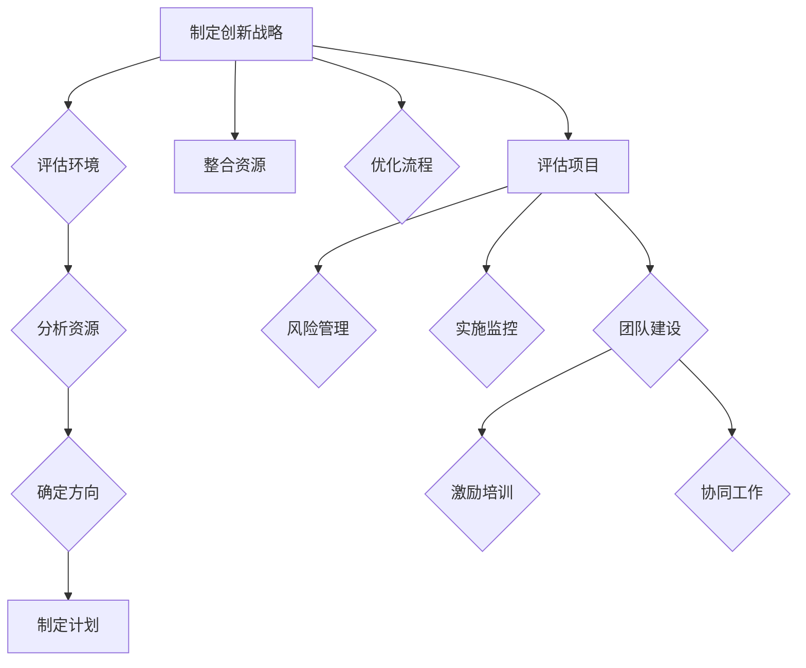

                 

### 文章标题

《打造创新型组织：鼓励冒险和容忍失败》

### 关键词

创新组织，冒险文化，失败容忍，组织发展，激励机制，创新战略，团队建设，案例分析

### 摘要

本文旨在探讨如何打造一个创新型组织，重点分析鼓励冒险和容忍失败在创新过程中的重要性。通过深入解析创新的本质、创新型组织的核心特征以及冒险与容忍失败的关系，本文为组织管理者提供了一套系统的实践指南，以促进创新文化的建设，从而推动组织持续发展。同时，通过国内外创新型组织的案例分析，本文揭示了成功与创新失败背后的关键因素，为读者提供了宝贵的经验和启示。

## 第一部分：创新的基石

### 第1章：创新的本质与重要性

#### 1.1 创新的定义与类型

创新，是指通过新的想法、方法、产品或服务来满足需求或创造新的需求。它可以分为三种类型：技术性创新、业务模式创新和社会创新。

- **技术性创新**：主要涉及产品或服务的生产技术改进，如新材料、新工艺、新设备等。这种创新能够显著提高生产效率和产品质量。
  
- **业务模式创新**：涉及组织如何创造、传递和捕获价值，如新型商业模式、运营策略、营销手段等。这种创新能够为企业带来新的增长点和竞争优势。
  
- **社会创新**：旨在解决社会问题，提高社会福利，如公益项目、社会企业等。这种创新对于社会可持续发展具有重要意义。

#### 1.2 创新在组织发展中的作用

创新是组织发展的核心动力，具有以下作用：

- **提升竞争力**：通过创新，组织可以开发新产品、提供新服务，满足市场的新需求，从而在竞争中脱颖而出。
  
- **推动增长**：创新能够为企业带来新的市场和业务领域，促进企业持续增长。
  
- **增强活力**：创新能够激发员工的创造力和主动性，提升组织的活力和凝聚力。
  
- **提升品牌价值**：创新能够为企业带来新的声誉和品牌形象，提升品牌价值。

#### 1.3 创新与传统组织的差异

与传统组织相比，创新型组织具有以下特点：

- **文化导向**：创新型组织注重创新文化的建设，鼓励员工敢于尝试、勇于挑战，容忍失败。
  
- **开放性**：创新型组织更加开放，乐于接受外部新思想、新技术，善于与外部合作。
  
- **灵活性**：创新型组织具有高度的灵活性，能够快速响应市场变化，调整战略和业务模式。
  
- **人才导向**：创新型组织重视人才，注重员工的个人发展和职业成长，提供丰富的创新机会和激励。

### 第2章：创新型组织的核心特征

#### 2.1 创新文化的建设

创新文化是创新型组织的灵魂，它包括以下方面：

- **鼓励冒险**：创新型组织鼓励员工敢于尝试，不怕失败，对于冒险行为给予正面评价。
  
- **容忍失败**：创新型组织对失败持宽容态度，认为失败是创新过程中的必要阶段，鼓励员工从失败中学习。
  
- **共享知识**：创新型组织重视知识的共享和传播，通过团队协作和知识共享平台，促进知识的流动和积累。
  
- **尊重个性**：创新型组织尊重员工的个性和创造力，鼓励员工发挥自己的特长和潜力。

#### 2.2 激励创新的激励机制

激励机制是推动员工创新的重要手段，包括以下方面：

- **物质激励**：通过提供奖金、股权等物质激励，激励员工积极参与创新活动。
  
- **精神激励**：通过荣誉表彰、公开表扬等精神激励，提升员工的荣誉感和成就感。
  
- **职业发展**：为员工提供职业发展的机会和路径，激励员工长期投入创新工作。
  
- **工作环境**：营造良好的工作环境，提供必要的资源和支持，为员工创新提供保障。

#### 2.3 创新型组织的领导力

领导力是创新型组织成功的关键因素，包括以下方面：

- **愿景引领**：领导者需要明确组织的愿景和目标，引领组织走向创新的道路。
  
- **激发潜能**：领导者需要激发员工的潜能，鼓励员工发挥最大潜力。
  
- **信任与支持**：领导者需要建立信任和支持的氛围，让员工敢于冒险，勇于创新。
  
- **持续学习**：领导者需要不断学习和更新知识，以身作则，推动组织的持续创新。

## 第二部分：创新的实践指南

### 第3章：冒险与容忍失败的哲学

#### 3.1 冒险与创新的关系

冒险与创新密切相关，冒险是创新的前提和动力。没有冒险，就没有创新。冒险精神鼓励员工勇于突破常规，探索未知领域，寻找新的机会和解决方案。冒险不仅是一种行为，更是一种思维方式，它要求员工敢于挑战现状，敢于尝试新的方法和技术。

#### 3.2 失败的必然性

失败是创新过程中不可避免的，它是创新的一部分，是通往成功的必经之路。失败并不意味着终结，而是一个学习和成长的机会。通过失败，员工可以发现自己的不足，了解问题的本质，从而在未来的创新活动中避免同样的错误。

#### 3.3 容忍失败的文化建设

容忍失败的文化是创新型组织的重要特征，它包括以下几个方面：

- **正面看待失败**：组织应该将失败视为一种常态，鼓励员工正视失败，从中吸取教训。
  
- **开放反馈**：组织应该建立一个开放的反馈机制，让员工能够自由地表达自己的观点和想法，包括失败的教训。
  
- **持续支持**：组织应该为员工提供持续的支持和帮助，让他们在失败后能够重新振作，继续前进。
  
- **鼓励学习**：组织应该鼓励员工从失败中学习，将失败转化为经验和知识，为未来的创新活动提供参考。

## 第三部分：创新的案例分析

### 第4章：构建创新战略

#### 4.1 创新战略的制定

创新战略的制定是组织创新活动的基础，它包括以下几个步骤：

1. **明确目标**：确定组织的创新目标，包括短期和长期目标，以及创新的核心领域。
   
2. **分析环境**：分析组织所处的市场环境、技术环境和社会环境，了解外部环境的变化趋势和机遇。
   
3. **资源评估**：评估组织的资源状况，包括资金、技术、人才等，确定创新所需的资源。
   
4. **确定方向**：根据目标和环境分析，确定组织的创新方向，包括技术性创新、业务模式创新和社会创新等。
   
5. **制定计划**：制定具体的创新计划，包括创新项目的选择、实施步骤和时间表等。

#### 4.2 创新资源的整合

创新资源的整合是确保创新战略实施的重要环节，它包括以下几个方面：

1. **资金资源**：确保创新项目有足够的资金支持，包括内部资金和外部资金。
   
2. **技术资源**：整合组织内外部的技术资源，包括内部研发能力和外部合作。
   
3. **人才资源**：吸引和培养创新人才，包括内部员工和外部专家。
   
4. **市场资源**：建立与市场紧密联系，了解市场需求和趋势。

#### 4.3 创新流程的优化

创新流程的优化是提高创新效率和质量的重要手段，它包括以下几个方面：

1. **需求分析**：明确创新项目的需求，确保项目符合市场和用户的需求。
   
2. **原型开发**：快速开发原型，验证创新项目的可行性。
   
3. **测试与反馈**：对原型进行测试，收集用户反馈，不断优化产品。
   
4. **商业化推广**：将创新项目推向市场，实现商业价值。

### 第5章：创新项目的管理

#### 5.1 创新项目的评估

创新项目的评估是确保项目成功的重要环节，它包括以下几个方面：

1. **项目目标**：评估项目是否达到预期目标，包括技术目标、市场目标和商业目标。
   
2. **项目进度**：评估项目是否按照计划进行，及时发现并解决进度问题。
   
3. **项目资源**：评估项目资源的利用情况，包括资金、技术、人才等。
   
4. **项目风险**：评估项目面临的风险，包括技术风险、市场风险和运营风险。

#### 5.2 创新项目的风险管理

创新项目的风险管理是确保项目顺利进行的重要手段，它包括以下几个方面：

1. **风险识别**：识别项目可能面临的风险，包括已知风险和潜在风险。
   
2. **风险评估**：评估风险的可能性和影响程度，确定风险优先级。
   
3. **风险应对**：制定风险应对策略，包括风险规避、风险减轻、风险接受等。
   
4. **风险监控**：持续监控项目风险，及时调整风险应对策略。

#### 5.3 创新项目的实施与监控

创新项目的实施与监控是确保项目成功的关键环节，它包括以下几个方面：

1. **项目实施**：按照项目计划和风险应对策略，实施创新项目。
   
2. **项目监控**：实时监控项目进展，及时发现并解决项目问题。
   
3. **项目评估**：项目完成后，对项目进行评估，总结经验教训，为未来项目提供参考。

### 第6章：创新团队的建设与培养

#### 6.1 创新团队的组建

创新团队的组建是确保创新项目成功的关键，它包括以下几个方面：

1. **团队目标**：明确团队的目标和任务，确保团队成员对项目有共同的认识和期望。
   
2. **团队结构**：确定团队的组成结构，包括团队成员的角色和职责。
   
3. **团队沟通**：建立有效的团队沟通机制，确保团队成员之间的信息畅通。
   
4. **团队激励**：制定团队激励机制，激发团队成员的积极性和创造力。

#### 6.2 创新团队的激励与培训

创新团队的激励与培训是提高团队创新能力和绩效的重要手段，它包括以下几个方面：

1. **激励措施**：提供物质和精神激励，激发团队成员的创新动力。
   
2. **培训机会**：为团队成员提供培训机会，提升团队的专业技能和创新能力。
   
3. **团队活动**：组织团队活动，增强团队凝聚力和合作精神。
   
4. **知识分享**：建立知识分享机制，促进团队内部的知识传播和共享。

#### 6.3 创新团队的协同工作

创新团队的协同工作是确保团队高效运作的重要环节，它包括以下几个方面：

1. **分工协作**：明确团队成员的分工，确保每个人都能在自己的岗位上发挥最大的作用。
   
2. **信息共享**：建立信息共享平台，确保团队成员能够及时获取所需信息。
   
3. **团队沟通**：定期组织团队会议，确保团队成员之间的沟通畅通。
   
4. **协同创新**：鼓励团队成员之间的合作，共同解决创新过程中的问题和挑战。

### 第7章：国内创新型组织案例解析

#### 7.1 阿里巴巴的创新之路

阿里巴巴作为中国最大的电子商务公司，其创新之路值得深入解析。

- **技术性创新**：阿里巴巴通过自主研发和创新，打造了强大的电商生态系统，包括淘宝、天猫、支付宝等平台。
- **业务模式创新**：阿里巴巴不断探索新的商业模式，如云计算、大数据、物联网等，为企业和个人提供多元化的服务。
- **社会创新**：阿里巴巴积极参与公益事业，如公益宝贝、阿里巴巴公益平台等，推动社会可持续发展。

#### 7.2 腾讯的创新战略

腾讯作为中国领先的互联网公司，其创新战略具有以下特点：

- **多元化发展**：腾讯通过投资和并购，涉足多个领域，如社交媒体、游戏、金融科技等，实现多元化发展。
- **技术研发**：腾讯重视技术研发，不断推出新的产品和服务，如微信、QQ等。
- **全球化布局**：腾讯积极拓展海外市场，通过收购和合作，提升国际影响力。

#### 7.3 华为的持续创新实践

华为作为中国领先的通信技术企业，其持续创新实践具有以下经验：

- **研发投入**：华为持续加大研发投入，保持技术领先地位。
- **人才战略**：华为重视人才培养和引进，打造了一支高素质的研发团队。
- **开放合作**：华为通过开放合作，吸收全球创新资源，推动自身发展。

### 第8章：国际创新型组织案例研究

#### 8.1 苹果公司的创新文化

苹果公司作为全球领先的科技公司，其创新文化备受关注。

- **用户至上**：苹果始终坚持以用户需求为导向，推出深受用户喜爱的产品。
- **设计驱动**：苹果注重产品设计，通过简洁、美观的设计，提升用户体验。
- **技术领先**：苹果在技术研发上投入巨大，保持技术领先地位。

#### 8.2 特斯拉的创新策略

特斯拉作为全球领先的电动汽车制造商，其创新策略具有以下特点：

- **技术突破**：特斯拉通过自主研发，实现了电动汽车的技术突破，如电池技术、自动驾驶技术等。
- **商业模式创新**：特斯拉通过直销模式、订阅服务等方式，推动电动汽车的普及。
- **绿色环保**：特斯拉致力于推动可持续发展，为全球环境保护贡献力量。

#### 8.3 微软的创新转型之路

微软作为全球领先的软件公司，其创新转型之路值得深入分析。

- **云计算转型**：微软通过云计算业务，实现了从传统软件公司到云计算公司的转型。
- **人工智能布局**：微软积极布局人工智能领域，推出了一系列人工智能产品和解决方案。
- **生态建设**：微软通过构建开发者生态，推动技术创新和应用。

### 第9章：创新失败的案例分析

#### 9.1 创新失败的原因分析

创新失败的原因多种多样，主要包括以下几个方面：

- **技术风险**：技术的不成熟或不可行性可能导致创新项目失败。
- **市场风险**：市场需求不足或竞争激烈可能导致创新项目无法实现商业价值。
- **运营风险**：项目管理不善、资源配置不合理等可能导致创新项目失败。
- **人才风险**：缺乏创新人才或人才流失可能导致创新项目无法持续推进。

#### 9.2 创新失败的应对策略

面对创新失败，组织可以采取以下策略：

- **总结教训**：分析失败的原因，总结经验教训，为未来项目提供参考。
- **调整策略**：根据失败的经验，调整创新策略，优化项目实施过程。
- **持续支持**：为创新项目提供持续的支持和资源，帮助项目重新找到发展方向。
- **培养人才**：加强人才培养，提升团队的创新能力和应对风险的能力。

#### 9.3 创新失败后的调整与优化

创新失败后的调整与优化是确保组织持续发展的重要环节，包括以下几个方面：

- **项目复盘**：对失败项目进行复盘，分析失败原因，总结经验教训。
- **策略调整**：根据复盘结果，调整创新策略，优化项目实施过程。
- **团队激励**：对失败项目团队成员进行激励，鼓励他们继续创新。
- **持续学习**：组织持续学习，吸收外部创新经验和最佳实践，提升自身创新能力。

## 附录：创新资源与工具推荐

### 附录 A：创新管理工具

#### A.1 设计思维工具

设计思维是一种以用户为中心的创新方法，它包括以下几个步骤：

1. **同理心**：了解用户的需求和痛点。
2. **定义问题**：明确创新项目要解决的问题。
3. **创意生成**：通过头脑风暴和创意思维，提出多种解决方案。
4. **原型开发**：快速开发原型，验证解决方案的可行性。
5. **测试与迭代**：对原型进行测试，收集用户反馈，不断优化产品。

#### A.2 市场调研工具

市场调研是了解市场需求和趋势的重要手段，以下是一些常用的市场调研工具：

1. **问卷调查**：通过在线或线下问卷收集用户反馈。
2. **焦点小组**：组织一组用户进行讨论，收集他们的意见和建议。
3. **深度访谈**：与用户进行一对一的深入访谈，了解他们的需求和想法。
4. **竞争分析**：分析竞争对手的产品和市场策略，了解市场动态。

#### A.3 创新评估工具

创新评估是确保创新项目成功的重要环节，以下是一些常用的创新评估工具：

1. **成本效益分析**：评估创新项目的成本和潜在收益，确定项目的可行性。
2. **价值评估**：评估创新项目的价值和影响，确定项目的优先级。
3. **风险管理**：识别创新项目可能面临的风险，制定风险应对策略。
4. **SWOT分析**：分析创新项目的优势、劣势、机会和威胁，制定相应的策略。

### 附录 B：创新资源推荐

#### B.1 创新书籍推荐

以下是一些关于创新的经典书籍，供读者参考：

1. **《创新者的窘境》**：作者克里斯坦森，探讨创新者在发展过程中面临的挑战。
2. **《创新者的基因》**：作者史蒂夫·布兰克，分析成功创新者的思维模式和行为习惯。
3. **《设计思维》**：作者大卫·凯利，介绍设计思维的方法和应用。
4. **《精益创业》**：作者埃里克·莱斯，探讨精益创业的方法和原则。

#### B.2 创新网站推荐

以下是一些关于创新的优质网站，供读者参考：

1. **InnovationX**：一个关于创新的新闻和分析网站，提供最新的创新动态和深度报道。
2. **HBR.org**：哈佛商业评论官方网站，提供关于创新的经典文章和案例分析。
3. **FastCompany**：快速公司官方网站，报道全球创新企业和人物。
4. **TED**：一个分享创新思想和观点的在线平台，提供丰富的创新演讲视频。

#### B.3 创新论坛推荐

以下是一些关于创新的在线论坛，供读者交流学习：

1. **创新者论坛**：一个面向创新者的在线社区，提供创新项目交流和合作机会。
2. **创新管理论坛**：一个面向创新管理者的在线社区，讨论创新管理实践和案例。
3. **设计思维论坛**：一个关于设计思维的在线社区，分享设计思维的方法和实践。
4. **创业论坛**：一个面向创业者的在线社区，提供创业经验和资源分享。

### 附录 C：梅里狄安（Mermaid）流程图

以下是一个使用梅里狄安（Mermaid）绘制的流程图，展示了创新组织从制定创新战略到管理创新项目的全过程。

作者：AI天才研究院/AI Genius Institute & 禅与计算机程序设计艺术 /Zen And The Art of Computer Programming

