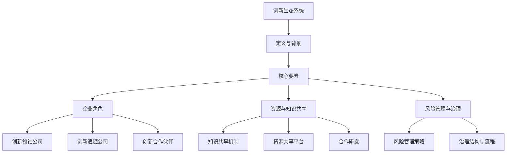

                 

# 文章标题：打造创新生态系统：从idea到implementation

> 关键词：创新生态系统，商业模式，原型设计，用户测试，持续迭代，案例分析

> 摘要：本文将探讨如何构建并打造创新生态系统，从最初的想法（idea）到最终的产品实现（implementation）。文章将分为八个章节，分别介绍创新生态系统的定义与背景、核心要素、从idea到conceptualization的转换、概念转化为原型的设计原则、原型到商业化的过程、创新生态系统中的合作与竞争、持续迭代与成长以及未来展望。通过详细的分析和案例分析，本文旨在为读者提供一个全面的创新生态系统构建指南。

----------------------------------------------------------------

### 第1章：创新生态系统的定义与背景

#### 1.1 创新生态系统的概念解析

创新生态系统是一个复杂的社会技术网络，其中包含了创新主体、创新资源、创新过程和创新环境四个核心要素。这些要素相互作用，形成一个有利于创新活动的持续循环系统。创新生态系统不仅仅依赖于企业的创新能力，还包括了政府、学术机构、投资者、消费者等各个利益相关者的参与。

- **定义**：创新生态系统是指一个由多个参与者共同构建的、具有动态适应性和可持续发展能力的系统，旨在促进创新活动和创新成果的转化。
- **特点**：
  - **复杂性**：创新生态系统中的参与者众多，关系复杂。
  - **动态性**：创新生态系统是一个不断演化、自我调整的体系。
  - **开放性**：创新生态系统是开放的，可以吸纳外部的资源、技术和知识。

#### 1.2 创新生态系统的组成部分

创新生态系统的组成部分可以归纳为以下几个方面：

- **创新主体**：包括企业、科研机构、个人等创新活动的发起者。
- **创新资源**：包括资金、人才、技术、信息、市场等。
- **创新过程**：包括创意生成、概念化、原型设计、测试、商业化等环节。
- **创新环境**：包括政策、法规、文化、教育等外部环境因素。

#### 1.3 创新生态系统与传统商业模式的区别

传统商业模式主要关注的是企业内部的价值创造和利润最大化，而创新生态系统则强调的是整个系统内部的价值共创和价值传递。

- **优势**：
  - **资源整合**：创新生态系统可以整合各种资源，提高创新效率。
  - **协同效应**：不同参与者之间的协同合作可以产生更大的创新成果。
  - **可持续发展**：创新生态系统注重长期的创新和可持续发展。

- **与传统商业模式的比较**：
  - **焦点不同**：传统商业模式注重内部价值，创新生态系统注重外部价值共创。
  - **资源依赖**：传统商业模式依赖内部资源，创新生态系统依赖外部资源和内部资源的整合。

#### 1.4 创新生态系统的重要性

创新生态系统在现代经济中的地位日益重要，其对经济、社会和文化的影响不可忽视。

- **经济价值**：创新生态系统可以推动经济增长，提高产业竞争力。
- **社会影响**：创新生态系统可以促进社会进步，改善人们的生活质量。
- **文化效应**：创新生态系统可以激发创新文化，培养创新人才。

#### 1.5 创新生态系统的全球发展趋势

全球范围内，创新生态系统的建设已成为各国政府和企业的重要战略。以下是几个主要发展趋势：

- **政府支持**：各国政府纷纷出台政策，支持创新生态系统的建设。
- **开放创新**：企业之间的合作日益紧密，开放创新成为主流趋势。
- **数字化转型**：数字化转型加速，为创新生态系统带来了新的机遇和挑战。

## 第2章：创新生态系统的核心要素

#### 2.1 创新生态系统中的企业角色

在企业角色方面，创新生态系统中的企业可以分为以下几类：

- **创新领袖公司**：这类企业具有强大的创新能力，能够引领行业的发展方向。它们通常是技术领导者，能够通过技术创新来推动市场变革。
- **创新追随公司**：这类企业紧跟创新领袖公司的步伐，通过模仿和创新来提升自身竞争力。它们通常注重成本控制和效率提升。
- **创新合作伙伴**：这类企业与其他企业合作，共同进行创新活动。它们通常在特定的领域或技术上有专长，能够为其他企业提供支持。

#### 2.2 创新生态系统中的资源与知识共享

资源与知识共享是创新生态系统的重要组成部分。以下是几个关键方面：

- **知识共享机制**：创新生态系统需要建立有效的知识共享机制，包括信息共享平台、合作研究项目等。
- **资源共享平台**：通过建立资源共享平台，企业可以更有效地利用资源，降低创新成本。例如，云计算平台、共享实验室等。
- **合作研发**：企业之间可以通过合作研发来共同应对技术挑战，提高创新能力。

#### 2.3 创新生态系统中的风险管理与治理

在创新生态系统中，风险管理与治理是确保创新活动顺利进行的重要环节。以下是几个关键方面：

- **风险管理策略**：创新生态系统需要制定有效的风险管理策略，包括风险识别、评估、控制和转移。
- **治理结构与流程**：创新生态系统需要建立有效的治理结构，包括决策机制、监督机制和激励机制。

### 第3章：从idea到conceptualization

#### 3.1 创意生成与概念化

从idea到conceptualization是创新过程中的关键一步。以下是几个关键方面：

- **创意思维的技巧**：创意思维是创新的核心，需要通过多种技巧来激发创意，如头脑风暴、思维导图等。
- **如何将创意转化为概念**：将创意转化为概念需要明确创意的目标、价值和可行性。
- **创意筛选与评估**：在创意生成后，需要对创意进行筛选和评估，确保创意具有实际可行性。

#### 3.2 市场研究与分析

市场研究与分析是确保创新项目成功的重要环节。以下是几个关键方面：

- **市场需求分析**：了解市场需求是创新项目成功的关键，需要通过市场调研、用户访谈等方式来获取市场信息。
- **竞争分析**：了解竞争对手是创新项目成功的重要保障，需要分析竞争对手的产品、市场策略等。
- **用户研究**：用户研究是确保创新项目符合用户需求的关键，需要通过用户访谈、用户体验测试等方式来获取用户反馈。

## 第4章：概念转化为原型

#### 4.1 原型设计原则

原型设计是概念转化为具体产品的重要步骤。以下是几个关键原则：

- **快速原型开发**：快速原型开发是提高创新效率的关键，需要采用敏捷开发方法，快速迭代产品。
- **原型评估与反馈**：通过原型评估和用户反馈来不断优化产品，确保产品符合用户需求。

#### 4.2 用户测试与迭代

用户测试与迭代是确保产品成功的必要环节。以下是几个关键方面：

- **用户测试方法**：用户测试需要采用多种方法，如A/B测试、用户体验测试等，以全面了解用户需求。
- **用户反馈分析**：用户反馈是产品迭代的重要依据，需要认真分析用户反馈，找出产品的问题和改进点。
- **迭代与优化**：通过不断迭代和优化，逐步完善产品，提高用户满意度。

## 第5章：从原型到商业化

#### 5.1 商业模型设计

商业模型设计是产品商业化的重要步骤。以下是几个关键方面：

- **商业模式画布**：商业模式画布是设计商业模型的重要工具，可以帮助明确产品的价值主张、客户细分、渠道等关键要素。
- **收益模式与成本结构**：设计合理的收益模式和成本结构是确保商业成功的关键。
- **市场进入策略**：市场进入策略需要考虑目标市场、进入时机、营销策略等关键因素。

#### 5.2 营销策略与推广

营销策略与推广是产品商业化的重要环节。以下是几个关键方面：

- **营销组合策略**：营销组合策略包括产品、价格、渠道、促销四个要素，需要根据目标市场和用户特点进行合理配置。
- **社交媒体营销**：社交媒体营销是现代营销的重要手段，可以通过社交媒体平台来提高品牌知名度，吸引潜在用户。
- **营销预算与绩效评估**：营销预算需要合理规划，绩效评估可以帮助企业了解营销活动的效果，不断优化营销策略。

## 第6章：创新生态系统中的合作与竞争

#### 6.1 合作机制与共赢策略

合作机制是创新生态系统中各参与者实现共赢的关键。以下是几个关键方面：

- **合作伙伴选择**：选择合适的合作伙伴是合作成功的关键，需要考虑合作伙伴的能力、信誉、合作意愿等。
- **合作模式与利益分配**：合作模式包括股权合作、技术合作、市场合作等，利益分配需要公平合理，确保各方的利益。
- **合作中的挑战与应对**：合作中可能面临沟通障碍、利益冲突、信任问题等挑战，需要建立有效的沟通机制、利益协调机制和信任机制来应对。

#### 6.2 竞争策略与市场定位

竞争策略与市场定位是企业在激烈的市场环境中取得成功的关键。以下是几个关键方面：

- **竞争环境分析**：了解竞争环境是制定竞争策略的基础，需要分析竞争对手的产品、市场策略、市场地位等。
- **市场定位与差异化竞争**：市场定位需要明确目标市场，差异化竞争可以通过技术创新、产品特色、服务质量等方式来实现。
- **品牌建设与保护**：品牌建设是提升企业竞争力的重要手段，需要通过产品品质、售后服务、品牌宣传等方式来树立良好的品牌形象，并进行品牌保护。

## 第7章：创新生态系统中的持续迭代与成长

#### 7.1 持续改进与创新

持续改进与创新是创新生态系统保持活力的关键。以下是几个关键方面：

- **持续改进模型**：持续改进模型可以帮助企业不断优化产品和服务，提高效率和竞争力。例如，PDCA循环、六西格玛等。
- **持续学习的文化**：持续学习的文化是培养创新人才和创新能力的重要保障，需要通过培训、知识分享、创新竞赛等方式来推动。
- **如何应对技术变革**：技术变革是创新生态系统面临的挑战，需要通过技术创新、业务模式创新等方式来应对。

#### 7.2 生态系统进化与扩展

生态系统进化与扩展是创新生态系统持续发展的关键。以下是几个关键方面：

- **生态系统扩展策略**：生态系统扩展策略需要考虑市场拓展、技术合作、国际化等方面。
- **全球化与本地化**：全球化与本地化是生态系统扩展的重要策略，需要平衡全球化和本地化的需求，确保生态系统的可持续发展。
- **生态系统中的战略转型**：战略转型是生态系统适应市场变化和抓住机遇的关键，需要通过调整业务模式、优化资源配置等方式来实现。

## 第8章：案例分析

#### 8.1 成功案例分析

成功案例分析可以帮助我们了解创新生态系统的运作机制和成功经验。以下是几个成功案例：

- **案例一：苹果的创新生态系统**：苹果通过构建强大的创新生态系统，不断推出创新产品，取得了巨大的成功。
- **案例二：谷歌的创新生态系统**：谷歌通过开放创新、战略合作等方式，构建了庞大的创新生态系统，推动了人工智能等技术的发展。
- **案例三：特斯拉的创新生态系统**：特斯拉通过技术创新、产业链整合等方式，构建了独特的创新生态系统，推动了电动汽车产业的发展。

#### 8.2 失败案例分析

失败案例分析可以帮助我们了解创新生态系统的风险和挑战。以下是几个失败案例：

- **案例一：诺基亚的衰落**：诺基亚在手机市场上曾经占据主导地位，但由于未能及时适应市场变化，最终走向衰落。
- **案例二：黑莓的转型困境**：黑莓曾经是手机市场的领导者，但未能及时转型，面对苹果和安卓的竞争，陷入了困境。
- **案例三：柯达的倒闭**：柯达是摄影领域的巨头，但由于未能适应数字时代的变革，最终导致了公司的倒闭。

## 第9章：未来展望

#### 9.1 创新生态系统的发展趋势

未来，创新生态系统将呈现以下几个发展趋势：

- **人工智能与区块链的融合**：人工智能和区块链技术将深度融合，为创新生态系统带来新的机遇和挑战。
- **开源生态系统的崛起**：开源生态系统将在未来发挥越来越重要的作用，成为创新的重要源泉。
- **社会责任与可持续发展的融合**：创新生态系统将更加注重社会责任和可持续发展，推动社会进步。

## 第10章：总结与结论

#### 10.1 全书要点回顾

本文从创新生态系统的定义与背景、核心要素、从idea到conceptualization、概念转化为原型、原型到商业化、合作与竞争、持续迭代与成长以及未来展望等方面，系统地阐述了如何构建和打造创新生态系统。

#### 10.2 对未来创新生态系统的展望

未来，创新生态系统将更加开放、协同、可持续，成为推动社会进步和经济增长的重要力量。企业、政府、学术机构等各方将更加紧密地合作，共同应对全球挑战，实现共同发展。

#### 10.3 提升个人创新能力的方法

提升个人创新能力是构建创新生态系统的重要基础。以下是一些提升个人创新能力的方法：

- **持续学习**：不断学习新知识、新技能，保持好奇心和求知欲。
- **跨界思考**：尝试从不同领域和角度看问题，发现新的机会和解决方案。
- **实践探索**：通过实践和探索，不断验证和优化自己的想法。
- **团队协作**：与他人合作，共同探讨和解决问题，激发创新思维。

### 附录

#### 附录 A：创新生态系统相关工具与资源

以下是创新生态系统相关的工具和资源推荐：

- **创新工具介绍**：头脑风暴工具、思维导图工具、项目管理工具等。
- **创新资源库推荐**：专利数据库、学术论文库、行业报告库等。
- **创新生态系统研究报告**：各类创新生态系统研究报告、白皮书等。

**作者信息**：

作者：AI天才研究院/AI Genius Institute & 禅与计算机程序设计艺术 /Zen And The Art of Computer Programming

----------------------------------------------------------------

**文章完整性要求**：

为确保文章的完整性，以下是各个章节的具体要求和内容说明：

### 第1章：创新生态系统的定义与背景

**核心内容**：

- **背景介绍**：介绍创新生态系统的重要性，以及其与传统商业模式的区别。
- **核心概念与联系**：解析创新生态系统的概念，绘制Mermaid流程图展示各组成部分之间的关系。
- **详细讲解与举例**：阐述创新生态系统的特点，以及全球创新生态系统的发展趋势。

### 第2章：创新生态系统的核心要素

**核心内容**：

- **企业角色**：详细分析创新领袖公司、创新追随公司和创新合作伙伴的角色。
- **资源与知识共享**：探讨知识共享机制、资源共享平台和合作研发的重要性。
- **风险管理与治理**：讲解风险管理策略和治理结构与流程。

### 第3章：从idea到conceptualization

**核心内容**：

- **创意生成与概念化**：介绍创意思维的技巧，以及如何将创意转化为概念。
- **市场研究与分析**：阐述市场需求分析、竞争分析和用户研究的方法和重要性。

### 第4章：概念转化为原型

**核心内容**：

- **原型设计原则**：讲解快速原型开发和原型评估与反馈的重要性。
- **用户测试与迭代**：介绍用户测试方法、用户反馈分析和迭代优化的过程。

### 第5章：从原型到商业化

**核心内容**：

- **商业模型设计**：详细讲解商业模式画布、收益模式与成本结构以及市场进入策略。
- **营销策略与推广**：探讨营销组合策略、社交媒体营销和营销预算与绩效评估。

### 第6章：创新生态系统中的合作与竞争

**核心内容**：

- **合作机制与共赢策略**：分析合作伙伴选择、合作模式与利益分配以及合作中的挑战与应对。
- **竞争策略与市场定位**：讲解竞争环境分析、市场定位与差异化竞争以及品牌建设与保护。

### 第7章：创新生态系统中的持续迭代与成长

**核心内容**：

- **持续改进与创新**：介绍持续改进模型、持续学习的文化和如何应对技术变革。
- **生态系统进化与扩展**：探讨生态系统扩展策略、全球化和本地化以及生态系统中的战略转型。

### 第8章：案例分析

**核心内容**：

- **成功案例分析**：分析苹果、谷歌、特斯拉等成功案例的创新生态系统构建过程。
- **失败案例分析**：分析诺基亚、黑莓、柯达等失败案例的原因和教训。

### 第9章：未来展望

**核心内容**：

- **创新生态系统的发展趋势**：探讨人工智能与区块链融合、开源生态系统的崛起以及社会责任与可持续发展的融合。

### 第10章：总结与结论

**核心内容**：

- **全书要点回顾**：回顾文章的主要内容和核心观点。
- **对未来创新生态系统的展望**：对未来创新生态系统的发展方向提出展望。
- **提升个人创新能力的方法**：提供提升个人创新能力的方法和建议。

### 文章字数要求

本文的字数要求在8000～12000字左右，确保内容丰富、结构清晰、逻辑严密，能够全面、深入地探讨创新生态系统的构建和运作。

### 文章格式要求

文章内容将使用markdown格式输出，包括标题、段落、列表、代码块、公式等。文章末尾需附上作者信息，以Markdown格式显示。具体格式如下：

```markdown
# 文章标题

> 关键词：<此处列出关键词>

> 摘要：<此处给出摘要>

## 目录大纲

### 第1章: 创新生态系统的定义与背景

#### 1.1 创新生态系统的概念解析

#### 1.2 创新生态系统的组成部分

#### 1.3 创新生态系统与传统商业模式的区别

#### 1.4 创新生态系统的重要性

#### 1.5 创新生态系统的全球发展趋势

### ...（其他章节）

### 附录

#### 附录 A: 创新生态系统相关工具与资源

##### A.1 创新工具介绍

##### A.2 创新资源库推荐

##### A.3 创新生态系统研究报告

**作者信息**：

作者：AI天才研究院/AI Genius Institute & 禅与计算机程序设计艺术 /Zen And The Art of Computer Programming

---

### Mermaid流程图

在文章中，核心概念之间的联系将通过Mermaid流程图来展示。以下是一个示例：



### 伪代码与数学模型

在文章中，核心算法原理和数学模型将通过伪代码和LaTeX格式来详细阐述。以下是一个示例：

**伪代码示例**：

```plaintext
// 伪代码：快速原型开发
function 快速原型开发(创意)
    建立原型
    进行初步测试
    获取用户反馈
    if 反馈满意 then
        迭代优化
    else
        调整原型
    end if
end function
```

**LaTeX数学模型示例**：

```latex
$$
f(x) = ax^2 + bx + c
$$
$$
g(x) = \frac{1}{x}
$$
```

### 项目实战

在文章中，将包含实际项目实战的介绍，包括开发环境搭建、源代码实现、代码解读、实际案例分析和项目小结。以下是一个示例：

**项目实战：搭建一个简单的博客系统**

1. **开发环境搭建**：
   - 操作系统：Ubuntu 18.04
   - 开发环境：Python 3.8
   - 数据库：MySQL 8.0

2. **源代码实现**：

```python
# app.py
from flask import Flask, render_template

app = Flask(__name__)

@app.route('/')
def index():
    return render_template('index.html')

if __name__ == '__main__':
    app.run()
```

3. **代码解读**：
   - Flask框架：用于快速开发Web应用。
   - `index.html`模板：定义了博客首页的布局。

4. **实际案例分析**：
   - 博客系统的性能优化。
   - 用户评论功能的实现。

5. **项目小结**：
   - 项目实现了简单的博客功能，为进一步的功能扩展奠定了基础。

### 最佳实践 Tips、小结、注意事项、拓展阅读

在文章的每个章节结尾，将包含最佳实践 Tips、小结、注意事项和拓展阅读。以下是一个示例：

**最佳实践 Tips**：
- 在进行市场研究时，建议采用多渠道调研方法，以提高数据的准确性和全面性。

**小结**：
- 本章节系统地介绍了创新生态系统中的合作机制与共赢策略，为构建成功的创新生态系统提供了指导。

**注意事项**：
- 在进行合作时，应确保各方利益平衡，避免合作过程中的冲突。

**拓展阅读**：
- 推荐阅读《创新者的窘境》，了解创新过程中的挑战和解决方案。

---

通过上述步骤和示例，本文将力求满足文章完整性、格式、内容质量等方面的要求，为读者提供一份全面、深入的关于创新生态系统的指南。

