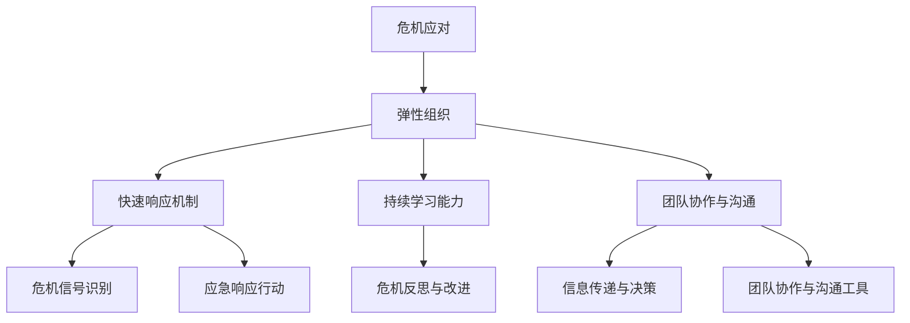

                 

### 文章标题：打造弹性组织：提升团队应对危机的能力

#### 关键词：弹性组织、危机应对、团队协作、战略规划、技术创新

#### 摘要：
在现代商业环境中，组织面临着前所未有的复杂性和不确定性。危机应对成为企业生存和发展的重要课题。打造具有高度弹性的组织，能够使团队在面临各种危机时快速响应，保持持续运营，并从中学习、成长。本文将从核心概念、战略规划、实践策略等多方面，深入探讨如何构建和提升弹性组织，以应对不断变化的商业环境。

## 《打造弹性组织：提升团队应对危机的能力》目录大纲

### 第一部分：危机应对与弹性组织概述

#### 第1章：危机应对的基本概念
- **1.1 危机的类型与特点**
  - 自然灾害
  - 经济危机
  - 社会事件
- **1.2 弹性组织的定义**
  - 弹性组织的含义
  - 弹性组织的重要性
- **1.3 弹性组织的核心要素**
  - 快速响应机制
  - 持续学习能力
  - 团队协作与沟通

#### 第2章：构建弹性组织的战略规划
- **2.1 组织战略的调整**
  - 风险评估
  - 目标调整
- **2.2 人力资源优化**
  - 能力提升
  - 职责划分
- **2.3 技术与创新**
  - 新技术的应用
  - 创新能力的培养

### 第二部分：危机应对策略与实践

#### 第3章：危机预警与监测
- **3.1 预警机制**
  - 预警系统设计
  - 预警信号识别
- **3.2 监测方法**
  - 数据收集与分析
  - 情报监测

#### 第4章：快速响应与应急处理
- **4.1 紧急响应团队组建**
  - 成员选择
  - 角色分工
- **4.2 应急预案制定**
  - 应急流程
  - 应急资源的调配

#### 第5章：团队协作与沟通
- **5.1 危机中的沟通策略**
  - 信息传递
  - 决策过程
- **5.2 团队协作的重要性**
  - 紧急协作
  - 协作工具的选择

#### 第6章：学习与改进
- **6.1 危机后的反思**
  - 经验总结
  - 改进措施
- **6.2 组织学习机制**
  - 学习方法
  - 学习成果的转化

#### 第7章：案例研究
- **7.1 国内外危机应对案例**
  - 案例介绍
  - 分析与启示

#### 第8章：构建弹性组织的实践指南
- **8.1 弹性组织的建设步骤**
  - 规划
  - 实施与监测
  - 改进
- **8.2 实践建议**
  - 针对不同组织特点的建议
  - 面临的挑战与应对

### 第三部分：弹性组织的未来展望

#### 第9章：技术进步与弹性组织
- **9.1 新技术在危机应对中的应用**
  - 人工智能
  - 大数据
- **9.2 技术进步对弹性组织的影响**

#### 第10章：弹性组织的发展趋势
- **10.1 全球化背景下的弹性组织**
  - 灵活性与多样性
- **10.2 未来弹性组织的特征**
  - 智能化
  - 自适应性

#### 第11章：总结与展望
- **11.1 弹性组织的意义**
  - 对企业的影响
  - 对社会的贡献
- **11.2 未来研究方向**
  - 理论体系完善
  - 实践应用深化

### 附录
- **附录A：危机应对工具与资源**
  - 预警系统
  - 应急预案模板
  - 沟通协作工具

### 第1章：危机应对与弹性组织的核心概念

#### 1.1 弹性组织的核心概念

弹性组织（Resilient Organization）是指在面临外部环境变化和内部挑战时，能够迅速适应并恢复的团队或组织。弹性组织的核心概念包括以下几个方面：

**弹性组织的定义**：弹性组织不仅能够在危机发生时保持运营，还能在危机过后迅速恢复，并从中学到经验教训，不断提升自身应对危机的能力。

**弹性组织与灵活性的关系**：弹性组织强调的是在应对变化时的快速适应能力，而不仅仅是业务运作的灵活性。灵活性是弹性组织的基石，但弹性组织还强调持续学习和改进，以应对未来可能出现的各种挑战。

**弹性组织与传统组织的对比**：传统组织往往以稳定和可控为出发点，追求规模和效率。而弹性组织则更加注重灵活性和适应性，以应对快速变化的市场环境和突发事件。

#### 1.2 危机应对的概念

危机应对（Crisis Management）是指组织在面临突发事件或重大挑战时，采取的一系列应对措施。危机应对的核心概念包括：

**危机的定义**：危机是指对组织生存和运营构成严重威胁的突发事件或重大挑战。危机可以是自然灾害、经济危机、社会事件等多种类型。

**危机的分类**：根据危机的影响范围和严重程度，可以将危机分为以下几类：
- **灾难性危机**：对组织造成毁灭性打击，可能导致组织破产或解散。
- **重大危机**：对组织造成较大影响，可能影响组织的声誉和运营。
- **一般性危机**：对组织造成一定影响，但可以通过应对措施缓解。

**危机应对的重要性**：危机应对是组织风险管理的重要组成部分。有效的危机应对能够最大限度地减少危机对组织的负面影响，甚至将危机转化为发展的机遇。

#### 1.3 弹性组织与危机应对的关系

弹性组织与危机应对之间存在密切的联系，弹性组织的构建有助于提升危机应对能力：

**弹性组织如何应对危机**：弹性组织通过构建快速响应机制、持续学习能力和团队协作与沟通，能够在危机发生时迅速采取行动，将危机影响降到最低。

**弹性组织在危机中的表现**：弹性组织在危机中的表现通常优于传统组织。弹性组织能够更快地识别危机信号、更有效地组织应急响应、更快地恢复运营。

**弹性组织的优势与挑战**：弹性组织的优势在于其快速适应性和持续学习能力，但同时也面临以下挑战：
- **资源限制**：构建弹性组织需要投入大量资源和精力。
- **文化冲突**：弹性组织强调快速变化和持续学习，可能与传统组织文化存在冲突。
- **技术依赖**：弹性组织依赖于新技术和工具，但技术变革也带来了不确定性和风险。

### 构建弹性组织与危机应对的核心概念

弹性组织与危机应对的核心概念密切相关，构成了现代组织管理的重要组成部分。弹性组织强调在面临外部环境和内部挑战时，组织能够迅速适应并恢复，以保持持续运营和竞争力。而危机应对则是在危机发生时，组织采取的一系列应对措施，以减轻危机影响，保障组织的生存和发展。

**核心概念之间的关系架构**：

1. **危机应对**：危机应对是弹性组织应对外部风险和内部挑战的基本手段。有效的危机应对能够将危机影响降到最低，为组织的持续运营提供保障。

2. **弹性组织**：弹性组织是危机应对的基础。通过构建弹性组织，组织能够提升应对危机的能力，实现快速响应、持续学习和团队协作与沟通。

3. **快速响应机制**：快速响应机制是弹性组织的关键要素之一。在危机发生时，快速响应机制能够使组织迅速采取行动，将危机影响降到最低。

4. **持续学习能力**：持续学习能力使组织能够在危机过后进行反思和改进，从中学到经验教训，提升未来应对危机的能力。

5. **团队协作与沟通**：团队协作与沟通是危机应对和弹性组织构建的重要保障。在危机中，团队成员之间的有效沟通和协作能够提高组织应对危机的效率和效果。

**Mermaid 流程图**：

通过上述核心概念之间的关系架构和Mermaid流程图，我们可以更清晰地理解弹性组织和危机应对的基本原理和实践方法。在后续章节中，我们将进一步探讨如何构建和提升弹性组织，以及如何制定和实施危机应对策略。

#### 1.4 弹性组织的重要性

在现代商业环境中，弹性组织的重要性不言而喻。随着全球化和技术变革的加速，企业面临的不确定性和挑战日益增加。构建弹性组织不仅是应对危机的必要手段，更是提升企业竞争力的关键因素。

**1.4.1 应对不确定性的能力**

不确定性是现代商业环境中普遍存在的问题。经济波动、市场变化、技术创新等都会对企业的运营和战略产生重大影响。弹性组织能够快速适应这些变化，保持持续运营。通过构建灵活的架构和快速响应机制，企业能够迅速调整战略和运营方式，以应对外部环境的不确定性。

**1.4.2 降低危机影响**

危机对企业的影响往往巨大而深远。无论是自然灾害、经济危机，还是内部管理问题，危机都会对企业的生存和发展构成严重威胁。弹性组织能够通过有效的危机应对措施，将危机影响降到最低。快速响应机制和持续学习能力使企业能够在危机中迅速采取行动，减轻危机对运营和财务的负面影响。

**1.4.3 提升持续竞争力**

在竞争激烈的市场环境中，持续竞争力是企业生存和发展的关键。弹性组织通过不断学习和改进，能够持续提升自身能力，以应对不断变化的市场需求和技术趋势。持续学习使企业能够保持创新活力，抓住市场机遇，实现持续增长。

**1.4.4 增强企业韧性**

韧性（Toughness）是指企业面对挑战和困难时的承受能力和恢复能力。弹性组织通过构建灵活的架构和强大的危机应对能力，能够显著提升企业的韧性。在危机中，韧性使企业能够迅速恢复运营，保持市场地位，甚至实现逆势增长。

**1.4.5 保障员工福祉**

弹性组织不仅关注企业的持续发展，还重视员工的福祉。通过构建良好的团队协作与沟通机制，弹性组织能够提高员工的工作满意度和忠诚度。在危机中，良好的员工关系有助于保持团队的稳定和高效，提升整体应对能力。

综上所述，弹性组织在应对不确定性的能力、降低危机影响、提升持续竞争力、增强企业韧性和保障员工福祉等方面具有重要意义。构建弹性组织不仅是企业应对危机的必要手段，更是提升企业长期竞争力的关键策略。

#### 1.5 弹性组织的核心要素

弹性组织之所以能够迅速应对各种挑战，关键在于其核心要素的构建与完善。以下将详细阐述弹性组织的三大核心要素：快速响应机制、持续学习能力以及团队协作与沟通。

**1.5.1 快速响应机制**

快速响应机制是弹性组织的基石，它决定了组织在危机发生时能否迅速采取行动，将损失降至最低。一个高效的快速响应机制应包括以下几个关键方面：

1. **危机信号识别**：组织需要建立一套有效的危机信号识别系统，能够及时发现潜在的风险和危机。这可以通过实时监控系统、大数据分析和专业人员的判断来实现。

2. **应急响应团队**：应急响应团队是快速响应机制的重要组成部分。团队成员应具备跨部门、跨专业的综合能力，能够在危机发生时迅速行动，协调各方资源，采取有效的应对措施。

3. **决策流程**：在危机发生时，快速的决策流程至关重要。组织应建立高效的决策机制，确保信息传递畅通，决策者能够在最短时间内做出正确的决策。

4. **应急资源调配**：组织需要提前规划并储备应急资源，如物资、设备、资金等，以便在危机发生时能够迅速调配，支持应急响应行动。

**1.5.2 持续学习能力**

持续学习能力是弹性组织的另一重要要素。在快速变化的市场环境中，组织只有不断学习、改进，才能保持竞争优势。以下是如何构建和提升持续学习能力：

1. **学习文化**：组织应倡导学习文化，鼓励员工持续学习、分享知识和经验。通过定期的培训、研讨会和工作坊，提升员工的专业能力和综合素质。

2. **知识管理**：组织应建立有效的知识管理体系，确保知识和经验得以传承和共享。这包括建立知识库、开展知识分享会、实施导师制等。

3. **问题解决机制**：组织应建立问题解决机制，鼓励员工在工作中遇到问题时主动寻求解决方案。通过问题解决过程，员工能够积累经验、提升能力。

4. **反馈与改进**：组织应建立反馈机制，及时收集员工和客户的意见和建议，不断改进产品和服务。通过持续的反馈和改进，组织能够不断提高自身的竞争力。

**1.5.3 团队协作与沟通**

团队协作与沟通是弹性组织成功的关键。在危机中，团队成员之间的有效沟通和协作能够提高组织应对危机的效率和效果。以下是构建高效团队协作与沟通的几个要点：

1. **沟通渠道**：组织应建立多种沟通渠道，如定期会议、即时通讯工具、邮件等，确保信息传递畅通无阻。

2. **角色分工**：在团队中明确每个成员的角色和责任，确保每个成员都清楚自己的任务和目标。

3. **冲突解决**：团队中难免出现冲突，组织应建立冲突解决机制，通过对话和协商，找到解决问题的最佳方法。

4. **协作工具**：利用协作工具，如项目管理软件、在线协作平台等，提高团队协作效率和效果。

通过构建和完善快速响应机制、持续学习能力和团队协作与沟通，弹性组织能够更好地应对各种挑战，保持持续运营和竞争优势。

#### 1.6 弹性组织与传统组织的对比

弹性组织与传统组织在结构、文化和应对危机的能力方面存在显著差异。以下将详细对比两者的主要特点。

**1.6.1 结构差异**

1. **传统组织**：传统组织通常采用垂直管理结构，权力集中在高层管理者手中。这种结构使得信息传递缓慢，决策周期较长，难以迅速应对变化。

2. **弹性组织**：弹性组织则更倾向于扁平化管理结构，权力下放，鼓励基层员工参与决策。这种结构有助于提高信息传递速度，缩短决策周期，使组织能够更快地适应外部变化。

**1.6.2 文化差异**

1. **传统组织**：传统组织往往强调稳定和秩序，员工更多地遵循既定的规则和流程。这种文化可能导致组织对创新的接受度较低，难以适应快速变化的市场环境。

2. **弹性组织**：弹性组织则鼓励创新和灵活性，倡导学习和适应。这种文化使组织能够更快地响应市场变化，抓住机遇，提升竞争力。

**1.6.3 应对危机能力的差异**

1. **传统组织**：传统组织在面对危机时，往往采取保守的应对策略，以避免损失。这种策略可能导致组织在危机中错失机遇，甚至进一步加剧危机。

2. **弹性组织**：弹性组织则通过快速响应和持续学习，积极应对危机。在危机中，弹性组织能够迅速调整战略，优化资源分配，提高应对危机的能力。

**具体案例分析**：

- **传统组织**：在2008年全球金融危机期间，某大型制造企业由于过度依赖单一市场，缺乏灵活的应对策略，导致销售额大幅下滑，最终不得不裁员、停产。

- **弹性组织**：同样在2008年全球金融危机期间，一家互联网公司通过快速调整战略，开拓新市场，同时加大对新技术的研究和开发投入，成功渡过危机，实现了逆势增长。

通过对比可以看出，弹性组织在结构、文化和应对危机能力方面具有明显优势。现代企业应借鉴弹性组织的经验，逐步转型，以应对不断变化的市场环境。

### 第2章：构建弹性组织的战略规划

构建一个具有高度弹性的组织，不仅需要理解其核心概念和重要性，更重要的是要制定出切实可行的战略规划。战略规划是构建弹性组织的关键步骤，它涉及到组织结构的调整、人力资源的优化以及技术的创新与运用。以下将详细探讨如何进行弹性组织的战略规划。

#### 2.1 组织战略的调整

组织战略的调整是构建弹性组织的基础。在快速变化的市场环境中，企业需要具备灵活的战略思维，以应对不确定性。以下是一些关键步骤：

**2.1.1 风险评估**

首先，企业需要对内外部环境进行全面的评估，识别潜在的风险和挑战。这包括市场变化、技术进步、政策法规等多方面因素。通过风险评估，企业可以明确哪些方面需要重点关注和应对。

**2.1.2 目标调整**

在识别风险后，企业需要根据实际情况调整战略目标。例如，如果市场环境变得不稳定，企业可能需要调整长期目标，将短期目标的优先级提升，以确保在短期内能够保持运营和竞争力。

**2.1.3 战略调整**

基于风险评估和目标调整，企业需要制定新的战略。这包括调整业务模式、优化资源配置、改进运营流程等。例如，企业可以增加对新兴市场的投资，提升技术创新能力，以应对市场变化。

**2.1.4 持续监控**

战略规划不是一次性的任务，而是一个持续的过程。企业需要建立监控机制，定期评估战略执行的进展和效果。如果发现战略执行过程中存在偏差，企业需要及时进行调整，以确保战略目标的实现。

#### 2.2 人力资源优化

人力资源是构建弹性组织的重要资源。优化人力资源，提升员工的能力和团队协作水平，是构建弹性组织的关键步骤。以下是一些关键措施：

**2.2.1 能力提升**

企业需要通过培训、学习和发展机会，不断提升员工的专业能力和综合素质。这不仅包括技术技能的培训，还包括领导力、沟通能力和团队协作能力的培养。

**2.2.2 职责划分**

在弹性组织中，职责划分需要更加灵活。员工不仅需要明确自己的职责，还需要具备跨部门和跨领域的协作能力。企业可以通过重新定义岗位职责，鼓励员工承担更多责任，提升整体协作效率。

**2.2.3 激励机制**

有效的激励机制能够激励员工积极参与到弹性组织的构建中。企业可以通过绩效评估、奖金制度、晋升机会等方式，激励员工不断提升自身能力和团队协作水平。

**2.2.4 人才流动**

在弹性组织中，人才流动是保持组织活力和创新力的重要手段。企业可以通过内部调岗、跨部门交流等方式，促进人才流动，激发员工的创新思维和工作积极性。

#### 2.3 技术与创新

技术在构建弹性组织中发挥着至关重要的作用。通过技术创新，企业可以提高运营效率，增强应对危机的能力。以下是一些关键措施：

**2.3.1 新技术的应用**

企业需要密切关注新技术的发展趋势，积极探索和应用新技术。例如，云计算、大数据、人工智能等技术，可以帮助企业实现资源的快速调配、数据的实时分析和智能决策。

**2.3.2 创新能力的培养**

企业需要建立创新机制，鼓励员工提出创新想法，并给予支持和资源。通过创新文化、创新实验室、创新竞赛等方式，培养员工的创新能力和创新意识。

**2.3.3 产学研合作**

产学研合作是企业获取新技术和创新成果的重要途径。通过与高校、研究机构和企业的合作，企业可以获取最新的科研成果和技术支持，提升自身的技术创新能力和市场竞争力。

**2.3.4 信息技术基础设施建设**

企业需要加强信息技术基础设施建设，为技术创新提供支持。这包括建立高效的数据中心、搭建云计算平台、升级网络设备等，确保企业具备强大的技术基础设施。

通过组织战略的调整、人力资源的优化和技术的创新与运用，企业可以逐步构建起一个具有高度弹性的组织。这不仅有助于企业在面对危机时保持稳定和持续运营，还能提升企业的竞争力和创新能力。

### 第3章：危机预警与监测

在构建弹性组织的过程中，危机预警与监测是至关重要的一环。通过建立有效的预警机制和监测方法，组织可以提前识别潜在的危机信号，并采取相应的措施进行防范，从而最大限度地减少危机对组织的负面影响。以下将详细探讨危机预警与监测的方法和策略。

#### 3.1 预警机制

预警机制是危机管理的重要组成部分，它旨在通过实时监测和数据分析，及时发现潜在的危机信号，并发出预警。一个有效的预警机制应包括以下几个关键方面：

**3.1.1 预警系统设计**

预警系统的设计是预警机制的核心。企业需要建立一套完整的预警系统，包括数据采集、分析处理、预警信号生成和发布等环节。预警系统应具备以下功能：

- **数据采集**：通过多种渠道收集内部和外部数据，包括市场数据、财务数据、运营数据等。
- **分析处理**：利用数据分析和挖掘技术，对采集到的数据进行分析和处理，识别潜在的危机信号。
- **预警信号生成**：根据分析结果，生成预警信号，并通过可视化工具展示给相关人员。
- **预警信号发布**：通过邮件、短信、即时通讯工具等方式，及时将预警信号通知给相关人员。

**3.1.2 预警信号识别**

预警信号识别是预警机制的关键环节。企业需要明确哪些信号是潜在的危机信号，并制定相应的识别标准。常见的预警信号包括：

- **财务预警信号**：如现金流短缺、利润下降、市场份额减少等。
- **运营预警信号**：如生产事故、供应链中断、客户投诉增加等。
- **市场预警信号**：如市场需求变化、竞争对手动作、行业政策变化等。

**3.1.3 预警信号评估**

在识别预警信号后，企业需要对预警信号进行评估，确定其严重程度和影响范围。评估过程应包括：

- **预警信号分类**：根据预警信号的严重程度和影响范围，将其分为不同等级。
- **预警信号分析**：对每个预警信号进行分析，评估其对组织的潜在影响。
- **预警信号反馈**：将评估结果反馈给相关部门和人员，制定相应的应对措施。

#### 3.2 监测方法

监测方法是预警机制的重要组成部分，它旨在通过实时监测和数据分析，及时发现潜在的危机信号。以下是一些常见的监测方法：

**3.2.1 数据收集与分析**

数据收集与分析是监测方法的基础。企业需要建立一套完整的数据收集和分析系统，包括：

- **内部数据收集**：收集企业的财务数据、运营数据、人力资源数据等。
- **外部数据收集**：收集市场数据、行业数据、政策法规数据等。
- **数据分析**：利用数据分析和挖掘技术，对收集到的数据进行分析和处理，识别潜在的危机信号。

**3.2.2 情报监测**

情报监测是监测方法的重要补充。企业需要建立一套情报监测系统，包括：

- **情报收集**：通过多种渠道收集情报，如市场调研、竞争对手分析、行业报告等。
- **情报分析**：对收集到的情报进行分析，识别潜在的危机信号。
- **情报反馈**：将分析结果反馈给相关部门和人员，制定相应的应对措施。

**3.2.3 实时监测**

实时监测是监测方法的核心。企业需要建立一套实时监测系统，包括：

- **实时数据采集**：通过传感器、监控系统等实时采集数据。
- **实时数据分析**：利用实时数据分析技术，对采集到的数据进行实时分析。
- **实时预警**：根据分析结果，实时发出预警信号。

**3.2.4 跨部门协作**

跨部门协作是监测方法的重要保障。企业需要建立跨部门协作机制，确保各部门之间的信息传递和协作畅通。跨部门协作包括：

- **信息共享**：确保各部门能够及时获取和共享相关信息。
- **协同监测**：各部门共同参与监测工作，提高监测的准确性和效率。
- **协同应对**：各部门共同应对潜在的危机信号，制定和实施应对措施。

通过建立完善的预警机制和监测方法，企业可以提前识别潜在的危机信号，并采取相应的措施进行防范，从而最大限度地减少危机对组织的负面影响。同时，预警机制和监测方法的建立和运行也需要不断地优化和完善，以适应不断变化的市场环境和内部管理需求。

### 第4章：快速响应与应急处理

在面对突发危机时，快速响应和应急处理是确保组织能够迅速恢复正常运营的关键。这一章将详细探讨如何组建紧急响应团队、制定应急预案以及应对危机的具体步骤。

#### 4.1 紧急响应团队的组建

紧急响应团队（Emergency Response Team）是组织在危机发生时最直接的应对力量。一个高效的紧急响应团队应具备以下几个关键要素：

**4.1.1 成员选择**

紧急响应团队的成员应具备跨部门、跨专业的综合能力。团队成员应包括以下几类：

- **领导层**：团队成员中的领导层负责整体协调和指挥，确保紧急响应行动有序进行。
- **技术专家**：技术专家负责解决技术问题和提供技术支持，确保关键系统和服务能够迅速恢复。
- **运营人员**：运营人员负责日常运营的监控和调整，确保各项业务能够恢复正常。
- **法务人员**：法务人员负责处理危机中的法律问题，确保组织的合法权益。
- **沟通人员**：沟通人员负责与外部利益相关者沟通，如客户、供应商、政府等，确保信息传递畅通。

**4.1.2 角色分工**

在紧急响应团队中，明确每个成员的角色和职责是确保团队高效运作的基础。以下是一些常见角色及其职责：

- **指挥官**：负责整体指挥和协调，确保紧急响应行动有序进行。
- **技术负责人**：负责解决技术问题和提供技术支持。
- **运营协调员**：负责日常运营的监控和调整。
- **法务顾问**：负责处理危机中的法律问题。
- **沟通协调员**：负责与外部利益相关者沟通，确保信息传递畅通。

**4.1.3 培训与演练**

紧急响应团队的成员应定期进行培训与演练，以提高应对突发危机的能力。培训内容应包括危机应对知识、技术技能、角色职责等。通过模拟演练，团队成员可以熟悉应急预案的执行流程，提高团队协作效率。

#### 4.2 应急预案的制定

应急预案（Emergency Response Plan）是组织在危机发生时行动的指南。一个完善的应急预案应包括以下几个关键部分：

**4.2.1 应急流程**

应急流程是应急预案的核心，它明确了危机发生时组织应采取的步骤和措施。应急流程应包括：

- **预警阶段**：当危机信号出现时，立即启动应急预案，进行初步评估。
- **响应阶段**：根据危机的性质和影响，采取相应的应急措施，如暂停业务、通知相关人员、启动紧急响应团队等。
- **处理阶段**：对危机进行具体处理，如修复系统故障、调整运营策略、恢复业务等。
- **恢复阶段**：在危机得到控制后，评估危机影响，进行恢复工作，如恢复业务、修复损坏设备、总结经验教训等。

**4.2.2 应急资源调配**

应急资源调配是应急预案的重要组成部分。组织应提前规划并储备必要的应急资源，包括物资、设备、资金等。在危机发生时，应迅速进行资源调配，确保紧急响应行动的顺利进行。

**4.2.3 应急预案演练**

应急预案演练是检验应急预案有效性的重要手段。组织应定期组织应急演练，包括桌面演练、实战演练等，以检验应急预案的可行性和团队成员的应急能力。通过演练，可以及时发现应急预案中的不足，进行修订和完善。

#### 4.3 应急处理的具体步骤

在危机发生时，组织应迅速采取行动，按照应急预案的步骤进行应对。以下是一些具体的步骤：

**4.3.1 初步评估**

在危机信号出现时，组织应立即进行初步评估，确定危机的性质、影响范围和紧急程度。初步评估的结果将决定后续的应急响应措施。

**4.3.2 启动应急预案**

根据初步评估的结果，启动相应的应急预案。紧急响应团队应立即行动，按照应急预案的步骤进行响应。

**4.3.3 应急响应**

在应急响应阶段，组织应采取以下措施：

- **通知相关人员**：通过邮件、短信、电话等方式通知相关人员，确保每个人都了解危机的情况和应急措施。
- **启动紧急响应团队**：紧急响应团队应迅速行动，按照应急预案的流程进行应对。
- **资源调配**：根据实际情况，迅速调配应急资源，确保紧急响应行动的顺利进行。

**4.3.4 具体处理**

在具体处理阶段，组织应采取以下措施：

- **解决问题**：针对危机的具体问题，采取相应的技术手段和措施进行解决。
- **调整运营策略**：根据危机的影响，调整运营策略，如暂停部分业务、调整人员安排等。
- **恢复业务**：在危机得到控制后，逐步恢复业务，确保业务的连续性。

**4.3.5 总结与反思**

在危机得到控制后，组织应进行总结与反思，评估危机应对的效果，找出应急预案中的不足，进行修订和完善。

通过快速响应和应急处理，组织可以最大限度地减少危机对运营和财务的负面影响，保持业务的连续性和稳定性。同时，快速响应和应急处理也是提升组织危机应对能力的重要手段，有助于组织在未来更好地应对各种突发危机。

### 第5章：团队协作与沟通

在危机应对过程中，团队协作与沟通的重要性不言而喻。有效的团队协作与沟通不仅能够提高危机应对的效率和效果，还能增强团队的凝聚力和执行力。以下将详细探讨危机中的沟通策略、团队协作的重要性以及协作工具的选择。

#### 5.1 危机中的沟通策略

危机中的沟通策略是确保信息准确传递和有效决策的关键。以下是一些关键策略：

**5.1.1 信息传递的准确性**

在危机中，信息传递的准确性至关重要。为确保信息的准确性，组织应采取以下措施：

- **标准化信息格式**：制定统一的信息格式，确保不同部门和人员使用相同的模板进行信息汇报。
- **多渠道验证**：通过多个渠道验证信息，减少错误和误解的风险。
- **实时反馈机制**：建立实时反馈机制，确保信息的及时更新和验证。

**5.1.2 决策过程的透明度**

危机中的决策过程需要高度的透明度，以确保团队成员了解决策的依据和目的。以下措施有助于提高决策过程的透明度：

- **公开决策依据**：将决策的依据、数据和理由公开给团队成员，确保他们能够理解决策的背景和目的。
- **定期更新信息**：定期向团队成员更新决策进展和结果，确保他们能够及时了解决策的最新情况。
- **建立沟通渠道**：建立专门的沟通渠道，如决策会议、在线讨论平台等，确保团队成员能够方便地获取决策信息。

**5.1.3 冲突解决与沟通**

在危机中，冲突难以避免。有效的沟通策略有助于解决冲突，提高团队的协作效率。以下措施有助于解决冲突：

- **建立沟通机制**：建立专门的沟通机制，如冲突解决会议、沟通协调小组等，确保团队成员能够在出现冲突时及时沟通和解决。
- **提供沟通培训**：为团队成员提供沟通技巧和冲突解决技巧的培训，提高他们的沟通能力和协作效率。
- **鼓励开放沟通**：鼓励团队成员在沟通中保持开放和坦诚，避免因误解和猜疑导致冲突加剧。

#### 5.2 团队协作的重要性

团队协作在危机应对中至关重要。以下是一些关键原因：

**5.2.1 提高应急响应效率**

团队协作能够提高应急响应的效率。在危机发生时，团队成员可以共同分析问题、制定解决方案，并迅速采取行动。通过协作，组织可以更快地解决问题，减少危机对运营的影响。

**5.2.2 增强团队凝聚力**

危机应对过程中，团队成员需要共同面对挑战和困难。这种共同经历可以增强团队的凝聚力，提高团队成员之间的信任和默契。在未来的工作中，这种凝聚力将有助于团队更好地协作和应对挑战。

**5.2.3 提升整体应对能力**

团队协作能够提升组织的整体应对能力。通过协作，组织可以汇集不同部门和专业领域的知识和经验，形成强大的应对力量。在危机中，这种整体应对能力将有助于组织更好地应对复杂多变的局面。

#### 5.3 协作工具的选择

在现代商业环境中，协作工具的选择对于团队协作和沟通至关重要。以下是一些常见的协作工具及其特点：

**5.3.1 项目管理软件**

项目管理软件可以帮助团队更好地规划、跟踪和协调项目进度。常见的项目管理软件包括：

- **Trello**：一个简单易用的看板式项目管理工具，适合团队协作和任务管理。
- **Jira**：一个功能强大的敏捷项目管理工具，适合大型团队和复杂项目。
- **Asana**：一个全面的任务管理工具，支持项目规划、进度跟踪和团队协作。

**5.3.2 即时通讯工具**

即时通讯工具可以帮助团队成员实时沟通和协作。常见的即时通讯工具包括：

- **Slack**：一个功能强大的团队沟通平台，支持聊天、文件共享和集成第三方应用。
- **Microsoft Teams**：一个集成式的沟通和协作工具，支持聊天、会议和文档协作。
- **WhatsApp**：一个广泛使用的即时通讯应用，适合小团队和日常沟通。

**5.3.3 在线协作平台**

在线协作平台可以帮助团队进行文档共享、讨论和协作。常见的在线协作平台包括：

- **Google Workspace**：包括Google Docs、Google Sheets、Google Slides等，支持多人实时协作。
- **Microsoft Office 365**：包括Word、Excel、PowerPoint等，支持在线协作和文档共享。
- **Notion**：一个功能强大的知识管理和协作工具，支持文档、数据库、看板等多种形式的内容组织。

通过选择合适的协作工具，团队可以更好地进行协作和沟通，提高危机应对的效率和效果。同时，协作工具的选用也需要根据组织的实际情况和需求进行评估和选择，以确保其能够满足团队的实际需求。

### 第6章：学习与改进

在危机应对过程中，学习与改进是确保组织在应对未来危机时更加从容和高效的关键。通过危机后的反思、经验总结和持续学习，组织可以不断提升自身的应对能力和管理水平。以下将详细探讨危机后的反思与经验总结、组织学习机制以及学习成果的转化。

#### 6.1 危机后的反思与经验总结

危机发生后，组织需要进行深入的反思和经验总结，以找出危机中的问题和不足，为未来的应对提供参考。以下是一些关键步骤：

**6.1.1 现状评估**

首先，组织需要对危机发生后的现状进行全面评估，包括危机对业务运营、财务状况、员工士气等方面的影响。通过评估，组织可以了解危机的严重程度和影响范围，为后续的改进工作提供依据。

**6.1.2 原因分析**

在了解现状后，组织需要分析危机发生的原因。原因分析应包括以下几个方面：

- **内部原因**：如管理缺陷、制度不完善、员工能力不足等。
- **外部原因**：如市场变化、政策法规、竞争对手等。

通过原因分析，组织可以找出危机发生的根本原因，为改进工作提供方向。

**6.1.3 经验总结**

在原因分析的基础上，组织需要总结危机应对过程中的经验教训。经验总结应包括以下几个方面：

- **成功经验**：如应对措施的有效性、团队合作的成功等。
- **失败经验**：如应对措施的不当、沟通不畅等。

通过经验总结，组织可以了解在危机应对中的得失，为未来的改进提供参考。

**6.1.4 反思与改进建议**

在反思和经验总结的基础上，组织需要提出改进建议。改进建议应包括以下几个方面：

- **管理制度**：完善危机应对管理制度，明确危机应对流程和责任。
- **人员培训**：加强对员工的培训和激励，提升其危机应对能力和素质。
- **技术支持**：引入新技术和工具，提高危机监测和应对能力。

通过反思与改进建议，组织可以不断优化危机应对策略，提升整体应对能力。

#### 6.2 组织学习机制

组织学习机制是确保组织持续学习和成长的关键。以下是一些关键步骤：

**6.2.1 学习方法**

组织应采用多种学习方法，以提高员工的能力和素质。常见的学习方法包括：

- **培训**：组织内部或外部的培训课程，提升员工的专业知识和技能。
- **研讨会**：组织研讨会和工作坊，促进员工之间的交流和学习。
- **在线学习**：利用在线学习平台，提供灵活的学习时间和内容。

**6.2.2 学习成果的转化**

学习成果的转化是组织学习机制的关键。以下是一些关键步骤：

- **知识分享**：建立知识分享机制，鼓励员工分享学习成果和经验。
- **实践应用**：将学习成果应用到实际工作中，提升员工的工作能力和团队协作效率。
- **评估反馈**：定期对学习成果进行评估和反馈，确保学习成果的有效转化。

通过组织学习机制，组织可以不断提升员工的能力和团队协作水平，为应对未来危机提供有力支持。

#### 6.3 学习成果的转化

学习成果的转化是组织学习的最终目的。以下是一些关键步骤：

**6.3.1 实践应用**

将学习成果应用到实际工作中，是学习成果转化的关键。以下是一些具体措施：

- **案例分享**：通过案例分享会，将学习成果分享给其他部门和员工，促进实践应用。
- **实践应用指南**：制定实践应用指南，明确学习成果在实际工作中的应用方法和步骤。
- **实践培训**：组织实践培训，帮助员工掌握学习成果的实践应用。

**6.3.2 持续改进**

学习成果的转化是一个持续改进的过程。以下是一些关键步骤：

- **评估与反馈**：定期对学习成果的实践应用进行评估和反馈，及时发现问题和不足，进行改进。
- **培训与辅导**：对应用过程中出现的问题，提供培训和辅导，帮助员工掌握实践应用技能。
- **持续优化**：根据评估和反馈结果，不断优化学习成果的实践应用，提升员工的工作效率和团队协作水平。

通过学习成果的转化，组织可以不断提升自身的应对能力和管理水平，为应对未来危机提供有力支持。

### 第7章：案例研究

通过分析国内外弹性组织的危机应对案例，我们可以深入了解弹性组织的构建和实践方法，从而为其他组织提供有益的借鉴和启示。

#### 7.1 案例介绍

**7.1.1 国内案例：阿里巴巴集团**

阿里巴巴集团是中国领先的互联网公司，其业务涵盖电商、云计算、金融科技等多个领域。在2020年新冠疫情爆发期间，阿里巴巴迅速采取行动，确保业务的连续性和员工的福祉。通过构建弹性组织，阿里巴巴成功应对了疫情带来的挑战。

**7.1.2 国际案例：特斯拉汽车公司**

特斯拉是一家全球知名的电动汽车制造商。在2020年新冠疫情爆发期间，特斯拉美国工厂因疫情爆发而关闭。然而，特斯拉迅速调整生产计划，将部分生产线转移到其他地区，并采取措施确保员工的健康和安全。特斯拉的弹性组织使其能够快速应对疫情带来的影响。

#### 7.2 案例分析

**7.2.1 阿里巴巴集团的危机应对**

1. **预警与监测**：阿里巴巴建立了完善的危机预警和监测机制，通过实时监测疫情动态，及时识别潜在风险。
2. **快速响应**：在疫情爆发后，阿里巴巴迅速启动应急预案，确保业务的连续性。公司采取远程办公、弹性工作制等措施，保障员工的安全和健康。
3. **技术创新**：阿里巴巴利用云计算、人工智能等技术，提升业务运营效率和危机应对能力。例如，公司利用大数据分析技术，为疫情防控提供数据支持。
4. **团队协作与沟通**：阿里巴巴强调团队协作和沟通，通过内部沟通平台，确保信息传递畅通，提高决策效率。

**7.2.2 特斯拉汽车的危机应对**

1. **预警与监测**：特斯拉通过实时监测疫情动态，及时识别潜在风险。公司设立了专门的疫情应对小组，负责监测和应对疫情。
2. **快速响应**：在疫情爆发后，特斯拉迅速调整生产计划，将部分生产线转移到其他地区，确保业务的连续性。公司采取措施确保员工的健康和安全，如提供防护设备、定期检测等。
3. **技术创新**：特斯拉利用智能制造技术，提高生产效率和灵活性。公司还通过远程办公、数字化管理等方式，提高员工的效率和协作能力。
4. **团队协作与沟通**：特斯拉强调团队协作和沟通，通过内部沟通平台，确保信息传递畅通，提高决策效率。

#### 7.3 分析与启示

通过分析阿里巴巴和特斯拉的危机应对案例，我们可以得出以下启示：

**7.3.1 建立完善的预警和监测机制**

有效的预警和监测机制是危机应对的基础。通过实时监测疫情动态、市场变化等，组织可以提前识别潜在风险，并采取相应的预防措施。

**7.3.2 快速响应和灵活调整**

在危机发生时，快速响应和灵活调整是关键。组织需要建立应急预案，确保在危机爆发时能够迅速采取行动，保障业务的连续性和员工的福祉。

**7.3.3 技术创新和数字化管理**

技术创新和数字化管理可以提高组织的应对能力和运营效率。通过利用大数据、云计算、人工智能等新技术，组织可以更好地监测和应对危机。

**7.3.4 强调团队协作和沟通**

团队协作和沟通是危机应对的重要组成部分。通过建立有效的沟通机制，组织可以确保信息传递畅通，提高决策效率，确保团队的整体协作和执行力。

通过借鉴阿里巴巴和特斯拉的危机应对经验，组织可以构建和提升自身的弹性组织，提高应对危机的能力，为持续发展和竞争力提升奠定坚实基础。

### 第8章：构建弹性组织的实践指南

构建弹性组织是一个复杂而长期的过程，需要组织在战略规划、实施和监测等多个方面进行持续的努力。以下将详细探讨构建弹性组织的具体步骤、实践建议以及面临的挑战与应对策略。

#### 8.1 弹性组织的建设步骤

**8.1.1 规划阶段**

在规划阶段，组织需要明确构建弹性组织的目标和愿景。以下是一些关键步骤：

- **目标设定**：明确组织在弹性组织建设中的目标，如提升危机应对能力、增强业务连续性、提高员工福祉等。
- **风险评估**：对组织面临的内外部风险进行评估，确定需要优先解决的问题和资源需求。
- **资源规划**：根据风险评估结果，规划所需的资源和预算，包括人力、技术和资金等。

**8.1.2 实施阶段**

在实施阶段，组织需要根据规划的具体方案，逐步推进弹性组织的建设。以下是一些关键步骤：

- **组织结构调整**：调整组织架构，建立灵活的模块化结构和扁平化的管理层次，提高组织的反应速度和协作效率。
- **人力资源优化**：优化人力资源配置，提升员工的专业能力和综合素质，鼓励跨部门和跨领域的协作。
- **技术创新与实施**：引入新技术和工具，如云计算、大数据、人工智能等，提升组织的数字化水平和应对能力。

**8.1.3 监测与改进阶段**

在监测与改进阶段，组织需要建立持续监测和评估机制，以确保弹性组织的有效运行。以下是一些关键步骤：

- **监测机制**：建立预警和监测机制，实时监测组织在危机应对中的表现和绩效。
- **绩效评估**：定期对弹性组织的建设效果进行评估，识别存在的问题和不足，制定改进措施。
- **反馈与改进**：根据监测和评估结果，及时调整和优化弹性组织的策略和措施，确保其持续改进和优化。

#### 8.2 实践建议

**8.2.1 针对不同组织特点的建议**

不同组织在构建弹性组织时，需要根据自身的特点和需求，制定相应的策略和措施。以下是一些建议：

- **大型企业**：大型企业通常具有较为复杂的业务和架构，需要重点关注跨部门协作和资源的整合。建议建立跨部门协作机制，提高信息传递效率和决策速度。
- **中小型企业**：中小型企业资源有限，建议优先关注核心业务和关键环节的弹性建设。可以通过外包、合作等方式，利用外部资源提升自身弹性。
- **非营利组织**：非营利组织通常更加注重社会责任和公共形象，建议在构建弹性组织时，充分考虑社会影响和公众利益。

**8.2.2 面临的挑战与应对策略**

在构建弹性组织的过程中，组织可能会面临以下挑战：

- **文化冲突**：弹性组织的建设可能与传统组织文化存在冲突，如鼓励创新与保守的平衡。建议通过文化培训、沟通和激励措施，逐步推动组织文化的转变。
- **资源限制**：构建弹性组织需要投入大量的资源和精力，特别是在技术和人力资源方面。建议合理规划资源，优先关注关键领域，并通过合作、外包等方式，利用外部资源。
- **技术依赖**：随着技术的发展，组织对技术的依赖程度不断提高。建议加强技术团队的培养和建设，确保技术的可靠性和安全性。

#### 8.3 面临的挑战与应对策略

**8.3.1 挑战一：文化冲突**

**挑战描述**：在构建弹性组织时，传统组织文化与新型弹性组织文化之间的冲突可能导致推进困难。

**应对策略**：
- **沟通与培训**：通过定期组织培训和研讨会，提高员工对弹性组织文化的认知和接受度。
- **激励与表彰**：建立激励和表彰机制，鼓励员工积极参与弹性组织的建设，并对表现优异的员工进行表彰。

**8.3.2 挑战二：资源限制**

**挑战描述**：构建弹性组织需要大量的资金和人力资源，对于一些中小型企业而言，可能面临资源不足的问题。

**应对策略**：
- **合理规划**：根据组织实际情况，合理规划资源投入，优先关注关键领域。
- **合作与外包**：通过与其他企业、机构合作，或者将部分非核心业务外包，利用外部资源提升自身弹性。

**8.3.3 挑战三：技术依赖**

**挑战描述**：随着技术的不断发展，组织对技术的依赖程度不断提高，但技术更新带来的不确定性和风险也相应增加。

**应对策略**：
- **技术评估**：定期对现有技术进行评估，确保其符合组织的需求和标准。
- **人才培养**：加强技术团队的培养和建设，提高其对新技术的研究和应用能力。

通过以上实践指南和建议，组织可以更好地构建和提升弹性组织，提高应对危机的能力，实现持续发展和竞争力提升。

### 第9章：技术进步与弹性组织

技术进步对弹性组织的构建和发展具有深远的影响。随着人工智能、大数据和云计算等新兴技术的不断发展，组织可以借助这些技术提升其危机应对能力和运营效率。以下将探讨新技术在危机应对中的应用以及技术进步对弹性组织的影响。

#### 9.1 新技术在危机应对中的应用

**9.1.1 人工智能**

人工智能（AI）在危机应对中具有广泛的应用潜力。以下是一些关键应用场景：

- **智能预警系统**：利用机器学习和大数据分析技术，AI可以实时监测和分析大量数据，提前识别潜在危机信号。例如，通过分析天气数据，AI可以预测自然灾害的发生，为组织提供预警信息。
- **自动化应急响应**：AI可以通过自动化系统，在危机发生时自动执行应急预案。例如，在电力故障发生时，AI可以自动调配备用电源，确保关键业务不受影响。
- **智能决策支持**：AI可以提供基于数据的决策支持，帮助组织在危机中做出快速、准确的决策。例如，通过分析市场数据和竞争对手动作，AI可以帮助企业制定有效的应对策略。

**9.1.2 大数据**

大数据技术在危机应对中同样具有重要应用价值。以下是一些关键应用场景：

- **实时监测**：通过收集和分析大量实时数据，大数据技术可以帮助组织实时监测运营状况和外部环境变化。例如，通过监控供应链数据，组织可以及时发现供应链中断风险，并采取相应措施。
- **风险预测**：利用大数据分析技术，组织可以预测潜在风险的发生概率和影响范围。例如，通过分析历史数据和趋势，组织可以预测市场需求变化，提前调整生产计划。
- **决策优化**：大数据技术可以帮助组织优化决策过程，提高决策的科学性和准确性。例如，通过分析客户行为数据，组织可以优化营销策略，提高客户满意度和市场份额。

**9.1.3 云计算**

云计算技术为弹性组织提供了强大的计算能力和数据存储能力，有助于提升组织的运营效率。以下是一些关键应用场景：

- **弹性扩展**：云计算提供了弹性扩展能力，组织可以根据需求随时调整计算资源和存储资源。在危机发生时，组织可以利用云计算的弹性扩展能力，快速增加计算资源，支持应急处理和恢复工作。
- **分布式计算**：云计算技术支持分布式计算，组织可以将任务分布在多个计算节点上，提高计算效率和可靠性。在危机应对中，分布式计算可以支持大规模数据处理和分析，提高危机应对的效率。
- **数据共享**：云计算技术支持数据共享和协作，组织可以通过云平台实时共享数据和资源，提高团队协作效率。在危机应对中，数据共享可以帮助组织快速获取和分析关键信息，做出更准确的决策。

#### 9.2 技术进步对弹性组织的影响

技术进步对弹性组织的影响主要体现在以下几个方面：

**9.2.1 提升危机应对能力**

新技术为弹性组织提供了强大的工具和手段，可以提升其危机应对能力。通过利用人工智能、大数据和云计算等技术，组织可以实时监测和预警危机，自动化执行应急预案，快速恢复运营，从而减少危机对组织的负面影响。

**9.2.2 提高运营效率**

技术进步有助于提高组织的运营效率。通过自动化和智能化的技术手段，组织可以减少人为错误和重复工作，提高工作流程的效率。例如，通过自动化系统，组织可以在危机发生时快速调配资源，提高应急响应速度。

**9.2.3 增强团队协作**

新技术为团队协作提供了更高效的工具和平台。通过云计算和即时通讯工具，团队成员可以实时共享数据和资源，协同工作，提高协作效率。在危机应对中，良好的团队协作是确保应急措施有效实施的关键。

**9.2.4 降低运营成本**

新技术可以降低组织的运营成本。通过云计算和自动化技术，组织可以减少硬件投资和运营维护成本。同时，通过大数据分析和智能决策，组织可以优化运营流程，减少浪费和资源消耗，提高资源利用率。

**9.2.5 促进持续学习**

技术进步也为组织的持续学习提供了新的途径。通过在线学习平台和虚拟实验室，组织可以提供丰富的学习资源和实践机会，鼓励员工持续学习和成长。在危机应对中，持续学习可以帮助组织不断改进和优化危机应对策略。

总之，技术进步为弹性组织的构建和发展提供了强大支持。通过利用新技术，组织可以提升其危机应对能力、提高运营效率、增强团队协作、降低运营成本，并促进持续学习，从而在激烈的市场竞争中保持竞争优势。

### 第10章：弹性组织的发展趋势

随着全球化和技术变革的加速，弹性组织正成为现代企业发展的新趋势。以下将探讨全球化背景下弹性组织的发展趋势，以及未来弹性组织的特征。

#### 10.1 全球化背景下的弹性组织

全球化使得企业面临更加复杂和多变的市场环境，这要求企业具备更高的弹性和适应性。以下是一些关键趋势：

**10.1.1 灵活性与多样性**

全球化带来了文化、技术和市场的多样性，这要求企业具备更高的灵活性。弹性组织通过灵活的架构和流程，能够迅速适应不同市场的需求和文化差异，抓住全球市场的机遇。

**10.1.2 跨国协作**

全球化使得企业需要在全球范围内进行协作，构建跨国团队。弹性组织通过建立高效的跨部门、跨地域协作机制，能够实现全球资源的整合和优化，提高整体运营效率。

**10.1.3 风险分散**

全球化可以帮助企业实现风险分散。通过在不同国家和地区建立业务，企业可以降低单一市场风险，提升整体抗风险能力。

**10.1.4 数据驱动**

全球化使得企业能够获取更多的数据资源，这要求企业具备强大的数据分析能力。弹性组织通过数据驱动决策，能够更好地把握市场动态，优化业务策略。

#### 10.2 未来弹性组织的特征

未来弹性组织将具备以下特征：

**10.2.1 智能化**

随着人工智能技术的发展，未来弹性组织将实现智能化。组织可以利用AI技术进行实时监测、自动化决策和优化运营，提高危机应对能力和运营效率。

**10.2.2 自适应性**

未来弹性组织将具备更强的适应性。通过持续学习和改进，组织能够快速适应市场和技术变革，保持持续竞争力。

**10.2.3 分布式**

未来弹性组织将采用分布式架构，利用云计算和物联网等技术，实现全球资源的整合和优化。分布式架构可以提高组织的灵活性和可靠性，降低运营成本。

**10.2.4 透明化**

未来弹性组织将实现更高的透明化。通过实时数据监控和可视化工具，组织可以实时了解业务运营状况和外部环境变化，做出更准确的决策。

**10.2.5 社会责任**

未来弹性组织将更加注重社会责任。在全球化背景下，企业需要承担更多的社会责任，如环境保护、员工权益保障等。弹性组织将通过社会责任实践，提升品牌形象，增强市场竞争力。

总之，未来弹性组织将具备智能化、适应性、分布式、透明化和社会责任等特征。通过适应全球化和技术变革，弹性组织将在激烈的市场竞争中脱颖而出，实现持续发展和竞争力提升。

### 第11章：总结与展望

弹性组织的构建是现代企业应对复杂多变的市场环境的重要策略。通过构建具有高度弹性的组织，企业能够提升危机应对能力、提高运营效率、增强团队协作，并促进持续学习。以下将总结弹性组织的意义，探讨其对企业和社会的贡献，并展望未来的研究方向。

#### 11.1 弹性组织的意义

**11.1.1 提升危机应对能力**

弹性组织的核心优势在于其强大的危机应对能力。在面对自然灾害、经济危机、社会事件等突发事件时，弹性组织能够迅速响应、快速恢复，最大限度地减少危机对企业的负面影响。通过构建快速响应机制、持续学习能力和团队协作与沟通，企业能够在危机中保持稳定运营，降低损失。

**11.1.2 提高运营效率**

弹性组织通过灵活的架构和高效的协作机制，能够提高运营效率。利用新技术和工具，如云计算、大数据和人工智能，企业可以实现资源的优化配置，提高业务的自动化和智能化水平。通过数据驱动的决策和流程优化，企业能够更好地把握市场动态，提升运营效率，降低运营成本。

**11.1.3 增强团队协作**

弹性组织强调团队协作和沟通，通过建立良好的团队协作机制和沟通渠道，企业能够提高员工的协作效率和创新能力。团队成员之间的有效沟通和协作能够提高危机应对的效率和效果，增强团队凝聚力，提升整体竞争力。

**11.1.4 促进持续学习**

弹性组织注重持续学习和改进，通过建立学习文化和知识管理体系，企业能够不断提升员工的能力和素质。持续学习不仅有助于提升员工的专业技能，还能激发员工的创新思维和创造力，推动企业的持续发展和竞争力提升。

#### 11.2 对企业的影响

**11.2.1 竞争力提升**

弹性组织的构建有助于企业提升竞争力。通过快速适应市场变化、提高运营效率和增强团队协作，企业能够在激烈的市场竞争中保持领先地位。同时，弹性组织能够更好地应对突发事件和挑战，降低业务中断风险，提高客户满意度和市场份额。

**11.2.2 业务连续性**

弹性组织的核心目标之一是确保业务的连续性。在面对突发事件和危机时，弹性组织能够迅速采取行动，保持业务的稳定运行，降低对企业财务和声誉的负面影响。通过建立应急预案和应急响应机制，企业能够确保在危机中快速恢复运营，减少损失。

**11.2.3 员工福祉**

弹性组织注重员工的福祉和职业发展。通过提供良好的工作环境、培训和学习机会，企业能够提高员工的工作满意度和忠诚度。同时，弹性组织的团队协作和沟通机制能够增强员工之间的信任和合作，提升团队整体绩效和创新能力。

#### 11.3 对社会的贡献

**11.3.1 社会责任**

弹性组织的构建不仅有助于企业自身的持续发展，还能积极履行社会责任。通过关注环境保护、员工权益保障和社会公益，企业能够为社会做出贡献，提升品牌形象和社会认可度。

**11.3.2 创新推动**

弹性组织通过持续学习和创新，推动社会技术进步和产业升级。企业可以利用新技术和工具，开发新的产品和服务，推动产业链的整合和创新，为社会发展注入新动能。

**11.3.3 经济增长**

弹性组织的构建有助于促进经济增长。通过提升企业的竞争力和创新能力，企业能够创造更多就业机会，带动产业链上下游的发展，推动经济的持续增长。

#### 11.4 未来研究方向

**11.4.1 理论体系完善**

未来的研究应进一步深化弹性组织理论体系，探讨弹性组织的核心要素、构建方法和评估指标，为实际应用提供理论支持。

**11.4.2 实践应用深化**

未来的研究应加强对弹性组织实践应用的探索，通过案例研究和实证分析，总结成功的实践经验，为其他组织提供借鉴和启示。

**11.4.3 新技术与弹性组织**

未来的研究应关注新技术（如人工智能、大数据、区块链等）在弹性组织构建中的应用，探讨新技术如何提升组织的弹性能力和运营效率。

**11.4.4 跨学科研究**

未来的研究应加强跨学科合作，融合管理学、心理学、计算机科学等领域的知识，为构建更加科学、有效的弹性组织提供新的视角和方法。

总之，弹性组织在应对不确定性、提升竞争力和促进社会发展中具有重要意义。通过不断探索和优化弹性组织的构建方法和实践应用，企业和社会将能够更好地应对未来的挑战，实现持续发展和共同繁荣。

### 附录：危机应对工具与资源

#### 附录A：危机应对工具与资源

**A.1 预警系统**

预警系统是危机应对的关键工具，能够实时监测风险信号，提供及时的预警。以下是一些常用的预警系统：

- **Early Warning System (EWS)**：EWS 是一种基于大数据分析的预警系统，可以实时监测市场变化、政策法规等，提供全面的预警报告。
- **DARWIN**：DARWIN 是一款基于人工智能的预警系统，能够通过机器学习算法预测潜在的风险，并提供决策支持。

**A.2 应急预案模板**

应急预案模板是组织在危机发生时行动的指南，以下是一些常用的应急预案模板：

- **Business Continuity Plan (BCP)**：BCP 是一份详细的业务连续性计划，包括业务恢复流程、资源调配、沟通渠道等。
- **Incident Response Plan (IRP)**：IRP 是一份详细的危机应对计划，包括危机响应流程、角色分配、应急资源管理等。

**A.3 沟通协作工具**

沟通协作工具在危机应对中扮演着重要角色，能够确保信息传递的准确性和及时性。以下是一些常用的沟通协作工具：

- **Slack**：Slack 是一款功能强大的即时通讯工具，支持聊天、文件共享、整合第三方应用等。
- **Microsoft Teams**：Microsoft Teams 是一款集成式的沟通和协作工具，支持聊天、会议、文档协作等。
- **Google Workspace**：Google Workspace 包括 Gmail、Google Docs、Google Sheets 等，支持多人实时协作。

**A.4 网络安全工具**

网络安全工具在危机应对中至关重要，能够保护组织的网络安全和隐私。以下是一些常用的网络安全工具：

- **Firewall**：防火墙是一种网络安全工具，用于保护网络不受外部攻击。
- **Antivirus Software**：杀毒软件用于检测和清除计算机病毒，保护计算机系统的安全。
- **VPN**：虚拟专用网络（VPN）用于加密网络数据传输，保护数据隐私和安全。

通过使用上述危机应对工具和资源，组织可以更好地监测风险、制定应急预案、确保沟通协作以及保护网络安全，从而提高整体的危机应对能力。

