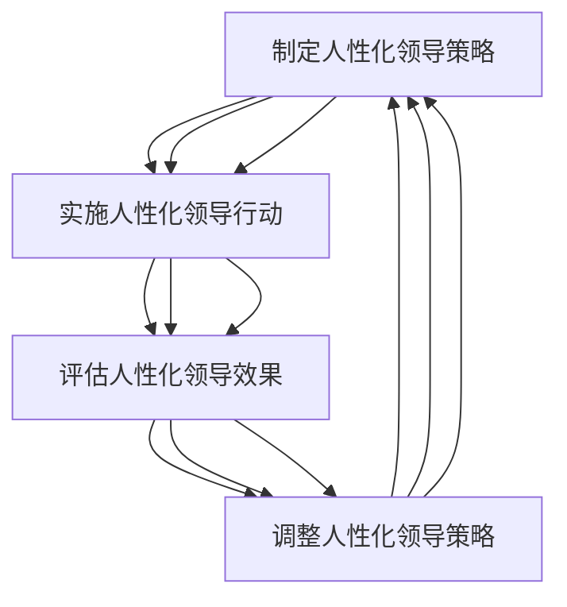
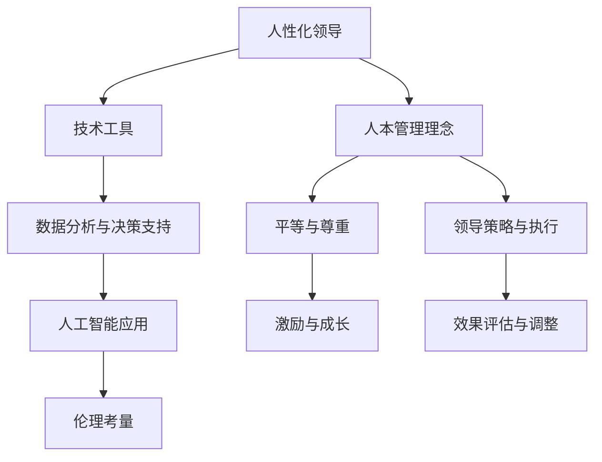

                 

### 文章标题

《技术与人文的平衡：数字时代的人性化领导》

### 关键词

数字化领导，人性化管理，技术伦理，人本理念，领导策略

### 摘要

在数字时代，技术的快速发展给企业管理带来了前所未有的机遇和挑战。本文从数字时代的背景出发，探讨人性化领导在技术主导下的重要性及其基本原则。文章通过分析技术对人性化的影响，提出了数据分析和人工智能等技术在人性化管理中的应用及其伦理考量。同时，结合实际案例，探讨了人性化领导的策略与实践，以及数字化时代组织构建与维护的方法。最后，文章展望了数字时代人性化领导的发展趋势，强调了其在员工幸福感和企业长期发展中的价值。

### 目录大纲

# 《技术与人文的平衡：数字时代的人性化领导》

## 第一部分：人性与技术的交汇

### 1.1 人性化领导的背景与意义

#### 1.1.1 数字时代的挑战

#### 1.1.2 人性化领导的重要性

#### 1.1.3 人性化领导与传统领导方式的对比

### 1.2 人性化领导的基本原则

#### 1.2.1 人本管理理念

#### 1.2.2 平等与尊重

#### 1.2.3 激励与成长

## 第二部分：技术与人性化的融合

### 2.1 技术对人性化的影响

#### 2.1.1 技术的发展与人性变迁

#### 2.1.2 技术在人性化管理中的应用

#### 2.1.3 技术对人性化管理带来的挑战

### 2.2 人性化领导的技术工具

#### 2.2.1 数据分析与决策支持

#### 2.2.2 人工智能在人性化管理中的应用

#### 2.2.3 技术在人性化管理中的伦理考量

## 第三部分：人性化领导实践

### 3.1 人性化领导的策略与执行

#### 3.1.1 制定人性化领导策略

#### 3.1.2 实施人性化领导行动

#### 3.1.3 人性化领导的效果评估与调整

### 3.2 人性化领导案例研究

#### 3.2.1 成功的人性化领导案例

#### 3.2.2 失败的人性化领导案例分析

#### 3.2.3 从案例中学习人性化领导

## 第四部分：构建数字化时代的人性化组织

### 4.1 数字化时代组织的特点

#### 4.1.1 数字化对组织结构的影响

#### 4.1.2 数字化对组织文化的影响

#### 4.1.3 数字化对人力资源管理的影响

### 4.2 人性化组织的构建与维护

#### 4.2.1 人性化组织文化塑造

#### 4.2.2 人性化领导团队建设

#### 4.2.3 人性化组织的可持续发展

## 第五部分：未来展望

### 5.1 数字时代人性化领导的发展趋势

#### 5.1.1 新技术对人性化领导的影响

#### 5.1.2 未来人性化领导的新模式

#### 5.1.3 人性化领导在数字化时代面临的挑战与机遇

### 5.2 数字时代人性化领导的重要性

#### 5.2.1 人性化领导在数字化时代的价值

#### 5.2.2 人性化领导与员工幸福感

#### 5.2.3 人性化领导与企业长期发展

## 附录

### 附录 A：人性化领导相关资源

#### A.1 人性化领导经典著作推荐

#### A.2 人性化领导在线课程推荐

#### A.3 人性化领导相关研究机构与组织

### 附录 B：人性化领导流程图与算法

#### B.1 人性化领导流程图

#### B.2 人性化领导算法概述

#### B.3 人性化领导算法应用实例

---

在接下来的部分，我们将逐一探讨每一个章节的具体内容，深入分析人性与技术的交汇，技术与人性化的融合，人性化领导的实践，数字化时代的人性化组织构建，以及未来人性化领导的发展趋势。我们将通过逻辑清晰、结构紧凑的叙述方式，结合实际案例和理论分析，为读者呈现一幅全面而深刻的数字化时代人性化领导图景。

## 第一部分：人性与技术的交汇

### 1.1 人性化领导的背景与意义

在数字化的浪潮中，技术已经成为推动社会进步的重要力量。然而，技术的快速发展也带来了许多挑战，如信息过载、隐私泄露、道德伦理问题等。这些问题使得人性化的领导方式在数字化时代显得尤为重要。

#### 1.1.1 数字时代的挑战

数字时代，信息技术的飞速发展带来了前所未有的机遇，但也带来了诸多挑战。首先，信息过载成为普遍现象，人们面对海量的信息难以筛选和处理，这给企业的信息管理带来了极大的压力。其次，隐私安全问题日益突出，随着大数据和人工智能的应用，个人隐私的保护成为社会关注的焦点。此外，技术变革的速度加快，传统领导方式难以应对快速变化的市场环境。

#### 1.1.2 人性化领导的重要性

人性化领导强调以人为中心，关注员工的情感需求和心理状态，注重团队协作和员工发展。在数字时代，人性化领导具有以下几个方面的意义：

1. **提高员工满意度**：人性化领导通过关注员工的需求和成长，提高员工的满意度和归属感，从而增强团队凝聚力。
2. **促进创新**：人性化领导鼓励员工提出创新的想法和解决方案，激发团队的创新活力。
3. **提升企业竞争力**：人性化领导有助于企业形成积极向上的企业文化，提高企业的整体竞争力。

#### 1.1.3 人性化领导与传统领导方式的对比

传统领导方式通常侧重于权威和控制，强调命令与服从。而人性化领导则更注重沟通与合作，强调员工参与和自我管理。具体对比如下：

1. **目标导向**：传统领导方式强调任务的完成，而人性化领导则更注重员工的成长和发展。
2. **决策方式**：传统领导方式往往由上级做出决策，而人性化领导鼓励员工参与决策过程。
3. **激励手段**：传统领导方式更多依赖于物质激励，而人性化领导更注重精神激励，如认可和奖励。

### 1.2 人性化领导的基本原则

人性化领导需要遵循一系列基本原则，以确保其有效性和可持续性。

#### 1.2.1 人本管理理念

人本管理理念认为员工是企业最宝贵的资源，应充分尊重和关爱员工，关注其个人成长和职业发展。人本管理理念的核心包括以下几个方面：

1. **尊重员工**：尊重员工的人格尊严和自主权，让员工在企业中感受到被尊重和认可。
2. **关注员工成长**：为员工提供学习和发展的机会，帮助其实现个人目标和职业发展。
3. **激励员工**：通过物质和精神激励，激发员工的积极性和创造力。

#### 1.2.2 平等与尊重

平等与尊重是人性化领导的基础。在数字化时代，领导者需要摒弃传统的等级观念，建立平等、尊重的团队氛围。具体措施包括：

1. **消除等级壁垒**：鼓励团队成员之间的平等交流和合作，消除上下级之间的壁垒。
2. **倾听员工意见**：领导者应主动倾听员工的意见和建议，尊重他们的想法和决策。
3. **关注员工需求**：了解员工的需求和困难，提供必要的支持和帮助。

#### 1.2.3 激励与成长

激励与成长是人性化领导的重要内容。通过有效的激励措施，激发员工的积极性和创造力，帮助其实现个人目标和职业发展。具体措施包括：

1. **认可与奖励**：对员工的优秀表现给予认可和奖励，增强其工作动力。
2. **培训与发展**：提供培训和学习机会，帮助员工提升技能和知识水平。
3. **工作与生活平衡**：关注员工的工作与生活平衡，提供灵活的工作安排和福利待遇。

通过以上基本原则，人性化领导能够在数字化时代发挥其独特的优势，帮助企业应对各种挑战，实现可持续发展。

### 小结

数字化时代的挑战使得人性化领导的重要性愈发突出。人性化领导通过关注员工的情感需求和职业发展，提高员工的满意度和团队凝聚力，从而提升企业的竞争力。与传统领导方式相比，人性化领导更注重沟通与合作，强调员工参与和自我管理。通过遵循人本管理理念、平等与尊重、激励与成长等基本原则，人性化领导能够有效应对数字化时代的各种挑战，为企业带来长期的价值。

## 第二部分：技术与人性化的融合

### 2.1 技术对人性化的影响

技术的快速发展对人类社会产生了深远的影响，其中最为显著的是对人性化的影响。技术不仅改变了人们的生活方式和交流方式，也在企业管理中扮演了重要的角色。

#### 2.1.1 技术的发展与人性变迁

技术的发展历程可以追溯到计算机的出现和互联网的普及。随着信息技术的飞速发展，人们的生活和工作方式发生了巨大的变化。例如，电子邮件和即时通讯工具的普及使得人们可以更加便捷地沟通和协作，而社交媒体的兴起则改变了人们的社交方式。这些变化对人性产生了深远的影响。

1. **沟通效率提升**：技术的进步使得沟通变得更加高效，人们可以快速传递信息，减少沟通成本。然而，这也可能导致人与人之间的情感联系减少，出现“屏幕依赖”现象。
2. **隐私保护挑战**：随着大数据和人工智能的应用，个人隐私的保护成为一个严峻的问题。企业需要平衡数据收集与分析的必要性，与保护个人隐私之间的关系。

#### 2.1.2 技术在人性化管理中的应用

技术不仅改变了人们的生活方式，也在人性化管理中发挥着重要作用。以下是一些关键技术及其在人性化管理中的应用：

1. **数据分析与决策支持**：数据分析可以帮助企业更好地了解员工的需求和偏好，从而制定更有效的管理策略。例如，通过分析员工的工作数据，管理者可以识别出工作中的瓶颈，提供针对性的培训和改进措施。
2. **人工智能在人性化管理中的应用**：人工智能技术可以用于个性化推荐、情感分析等，帮助企业更好地满足员工的需求。例如，通过情感分析技术，企业可以识别员工的情感状态，提供心理支持和帮助。
3. **虚拟现实与增强现实**：虚拟现实（VR）和增强现实（AR）技术可以用于员工培训、虚拟会议等，提供沉浸式的体验，增强员工的参与感和归属感。

#### 2.1.3 技术对人性化管理带来的挑战

尽管技术为人性化管理带来了诸多机遇，但也带来了一些挑战：

1. **数据隐私和安全**：在数据驱动的管理中，如何保护员工的个人隐私成为一个重要问题。企业需要制定严格的数据保护政策，确保员工的隐私不受侵犯。
2. **技术依赖性**：随着技术的广泛应用，员工可能会对技术产生依赖，降低其自我管理和解决问题的能力。因此，企业需要在技术应用中保持适度，避免过度依赖。
3. **技术伦理问题**：技术在人性化管理中的应用需要遵循一定的伦理规范。例如，在数据分析中，如何避免歧视和偏见，确保公平性和透明性，是企业管理者需要关注的问题。

### 2.2 人性化领导的技术工具

为了更好地实现人性化领导，企业可以借助多种技术工具，提高管理效率和质量。以下是一些常用的技术工具及其应用：

#### 2.2.1 数据分析与决策支持

数据分析是人性化领导的重要工具。通过数据分析，企业可以深入了解员工的工作状态、绩效表现和满意度等，从而制定更科学的管理策略。

1. **工作数据分析**：通过对员工的工作数据分析，管理者可以识别出工作流程中的瓶颈和改进点。例如，分析员工的工作时长、任务完成情况等，帮助管理者优化工作流程。
2. **绩效数据分析**：绩效分析可以帮助管理者了解员工的绩效表现，识别优秀员工和需要改进的员工。通过绩效数据分析，企业可以制定有针对性的培训和发展计划。
3. **满意度调查**：通过员工满意度调查，管理者可以了解员工对企业文化、薪酬福利、工作环境等方面的满意度。这有助于企业发现问题，改进管理策略，提高员工满意度。

#### 2.2.2 人工智能在人性化管理中的应用

人工智能技术为人性化管理带来了新的可能性。通过人工智能，企业可以实现个性化推荐、情感分析等功能，更好地满足员工的需求。

1. **个性化推荐**：通过分析员工的历史行为和偏好，人工智能可以为其推荐适合的培训课程、工作机会等，提高员工的职业发展和满意度。
2. **情感分析**：情感分析技术可以识别员工的情感状态，帮助管理者了解员工的情绪波动和压力情况。这有助于企业及时提供心理支持和帮助，降低员工的工作压力。
3. **智能助理**：智能助理可以通过自然语言处理技术，与员工进行实时沟通，提供信息查询、日程安排等服务，提高工作效率。

#### 2.2.3 技术在人性化管理中的伦理考量

在技术应用于人性化管理时，伦理考量至关重要。以下是一些伦理考量：

1. **数据隐私**：企业需要确保员工的数据隐私得到保护，不得未经许可收集、使用或泄露员工个人信息。
2. **算法公平性**：在数据分析中，企业需要确保算法的公平性和透明性，避免歧视和偏见。例如，在招聘和晋升过程中，算法应基于客观的指标进行评价，避免人为偏见。
3. **技术滥用防范**：企业需要制定严格的规章制度，防范技术滥用，确保技术工具用于正当的管理目的。

通过合理应用技术工具，企业可以实现人性化管理的目标，提高管理效率，促进员工满意度，进而提升企业的整体竞争力。

### 小结

技术与人性化管理的融合为企业管理带来了新的机遇和挑战。技术不仅改变了人们的生活方式，也在人性化管理中发挥着重要作用。通过数据分析、人工智能等技术的应用，企业可以更好地了解员工需求，提高管理效率，促进员工满意度。然而，技术应用也带来了一些伦理问题，如数据隐私和安全、算法公平性等。因此，企业在应用技术时需要充分考虑伦理考量，确保技术用于正当的管理目的，实现技术与人性化的平衡。

## 第三部分：人性化领导实践

### 3.1 人性化领导的策略与执行

人性化领导不仅是一种理念，更需要通过具体的策略和行动来实现。在这一部分，我们将探讨人性化领导的策略制定、执行以及效果评估与调整的方法。

#### 3.1.1 制定人性化领导策略

制定人性化领导策略是实施人性化领导的第一步。以下是一些关键的步骤：

1. **明确目标**：首先，领导者需要明确企业的目标和愿景，并将其细化为具体的目标和指标。例如，提升员工满意度、提高创新能力等。
2. **调研与分析**：通过调研和分析，领导者可以了解员工的需求和期望，识别组织中的问题和挑战。例如，通过员工满意度调查、一对一访谈等方式收集数据。
3. **制定策略**：基于目标和调研结果，领导者可以制定具体的人性化领导策略。这些策略可能包括加强员工培训、改善工作环境、提供心理支持等。
4. **沟通与共识**：将制定的策略与团队成员进行沟通，确保大家理解并认同这些策略。通过团队合作，共同为实现目标而努力。

#### 3.1.2 实施人性化领导行动

策略制定完成后，关键在于实施。以下是实施人性化领导行动的一些具体措施：

1. **培训与提升**：为员工提供培训和学习机会，提升其技能和知识水平。例如，组织内部培训、外部培训、在线学习等。
2. **激励与认可**：通过激励机制，如奖金、晋升机会、表彰等，激发员工的积极性和创造力。同时，领导者应注重认可员工的贡献，增强其归属感。
3. **沟通与反馈**：建立开放的沟通渠道，鼓励员工表达意见和建议。领导者应定期提供反馈，帮助员工了解自己的表现和改进方向。
4. **工作与生活平衡**：关注员工的工作与生活平衡，提供灵活的工作安排和福利待遇。例如，提供远程工作选项、弹性工作时间等。

#### 3.1.3 人性化领导的效果评估与调整

实施人性化领导后，需要对其进行效果评估，并根据评估结果进行调整。以下是评估与调整的一些关键步骤：

1. **设定评估指标**：根据人性化领导的目标，设定相应的评估指标。例如，员工满意度、创新能力、工作效率等。
2. **数据收集与分析**：通过问卷调查、访谈、绩效数据等方式，收集相关的评估数据。对数据进行分析，了解人性化领导的实际效果。
3. **反馈与改进**：将评估结果反馈给团队成员，讨论存在的问题和改进措施。领导者应根据评估结果，调整领导策略和行动方案。
4. **持续优化**：人性化领导是一个持续的过程，需要不断地优化和改进。领导者应关注最新的管理理论和实践，结合实际情况，不断提升领导能力。

通过制定人性化领导策略、实施领导行动以及效果评估与调整，领导者可以有效地实现人性化领导，提升团队绩效和员工满意度，为企业的发展奠定坚实基础。

### 3.2 人性化领导案例研究

为了更好地理解人性化领导的实践，下面我们将通过两个成功的案例和一个失败案例，来分析人性化领导的具体实施和应用。

#### 3.2.1 成功的人性化领导案例

**案例一：谷歌的人性化领导实践**

谷歌（Google）以其独特的企业文化和人性化领导方式而闻名。以下是其成功实践的几个方面：

1. **开放沟通**：谷歌鼓励员工提出意见和建议，建立开放的沟通渠道。公司定期组织团队会议，允许员工自由表达观点，这有助于激发创新和团队协作。
2. **员工成长**：谷歌提供丰富的培训和学习机会，帮助员工提升技能和知识水平。公司还实行“20%时间”政策，允许员工将20%的工作时间用于探索个人感兴趣的项目，从而促进创新。
3. **工作与生活平衡**：谷歌关注员工的工作与生活平衡，提供灵活的工作安排和福利待遇。例如，提供远程工作选项、弹性工作时间、母婴室等，帮助员工更好地处理工作和生活之间的平衡。

**案例效果**：通过这些人性化领导实践，谷歌成功地吸引了大量优秀人才，提高了员工满意度和创新能力，从而保持了持续的市场竞争力。

#### 3.2.2 失败的人性化领导案例分析

**案例二：某互联网公司的失败领导实践**

某互联网公司在实施人性化领导时出现了问题，导致员工流失和团队绩效下降。以下是其失败的几个方面：

1. **缺乏沟通**：公司管理层在制定决策时缺乏与员工的沟通，导致员工对公司的战略方向和目标不清晰，缺乏参与感和归属感。
2. **激励不足**：公司的激励机制单一，主要依赖于物质奖励，缺乏精神激励。这导致员工在工作中缺乏动力，创新能力下降。
3. **工作压力**：公司要求员工加班文化严重，工作与生活平衡被忽视，导致员工身心疲惫，工作满意度降低。

**案例效果**：由于缺乏人性化领导，该公司在市场上竞争力下降，员工流失率上升，最终不得不进行组织结构调整。

#### 3.2.3 从案例中学习人性化领导

从以上案例中，我们可以总结出以下几点关于人性化领导的教训和启示：

1. **开放沟通**：领导者应建立开放的沟通渠道，鼓励员工参与决策过程，增强员工的参与感和归属感。
2. **激励机制**：多样化的激励机制，包括物质和精神激励，有助于激发员工的积极性和创造力。
3. **工作与生活平衡**：关注员工的工作与生活平衡，提供灵活的工作安排和福利待遇，有助于提高员工满意度和工作效率。
4. **持续改进**：人性化领导是一个持续的过程，领导者应不断学习新的管理理论和实践，结合实际情况进行调整和优化。

通过学习成功的案例和避免失败的教训，领导者可以更好地实施人性化领导，提升团队绩效和员工满意度，为企业的发展奠定坚实基础。

### 小结

人性化领导是一种以人为中心的领导方式，通过关注员工的情感需求、职业发展和工作与生活平衡，提升员工满意度和团队凝聚力。成功的案例表明，开放沟通、多样化激励和工作与生活平衡是人性化领导的重要实践方法。而失败的案例则提醒我们，缺乏沟通、单一激励和过度工作压力会破坏人性化领导的效果。通过深入分析这些案例，领导者可以更好地理解和应用人性化领导，实现企业与员工的共同发展。

## 第四部分：构建数字化时代的人性化组织

在数字化时代，组织的构建与维护面临着前所未有的挑战和机遇。数字化不仅改变了企业的运营模式，也深刻影响了组织结构和人力资源管理。在这一部分，我们将探讨数字化时代组织的特点、构建与维护人性化组织的方法以及数字化时代人力资源管理的关键策略。

### 4.1 数字化时代组织的特点

#### 4.1.1 数字化对组织结构的影响

数字技术的普及使得组织结构变得更加灵活和动态。传统金字塔式的组织结构逐渐被扁平化的组织结构所取代，这使得信息流通更加迅速，决策效率提高。具体来说：

1. **去中心化**：数字化技术使得信息传递更加快速和便捷，组织内部的信息不对称问题得以缓解，从而促进了去中心化的组织结构。团队成员可以更加自主地决策和行动，减少了中间管理层的负担。
2. **网络化组织**：数字化时代的组织更像是网络化的组织，各个部门和团队之间通过数字平台紧密联系，形成了一种网络化的工作模式。这种模式有助于提高协作效率和资源利用率。

#### 4.1.2 数字化对组织文化的影响

数字化不仅改变了组织结构，也对组织文化产生了深远的影响。在数字化时代，组织文化需要适应快速变化的技术环境，培养创新和学习的氛围。

1. **创新文化**：数字化技术不断推动创新，组织需要鼓励员工尝试新思路、新方法，容忍失败并从中学习。这种创新文化有助于组织在竞争激烈的市场中保持领先地位。
2. **学习文化**：数字化时代，技术更新速度极快，组织需要不断学习和适应新的技术趋势。建立学习文化，鼓励员工参加培训、分享知识，有助于组织保持竞争力。

#### 4.1.3 数字化对人力资源管理的影响

数字化时代，人力资源管理面临着新的挑战和机遇。以下是一些关键点：

1. **人才流动加速**：数字化技术使得人才流动更加便捷，员工可以通过远程工作等方式快速适应新的工作环境。企业需要提供有吸引力的福利和职业发展机会，以留住关键人才。
2. **数据驱动的人才管理**：通过数据分析，企业可以更准确地了解员工的表现和需求，从而优化人才管理和决策。例如，通过绩效数据，企业可以识别优秀员工并进行针对性的培养。
3. **工作与生活平衡**：数字化技术提供了更多的灵活工作方式，如远程办公、弹性工作时间等，有助于员工实现工作与生活的平衡。企业应充分利用这些技术，提高员工的工作满意度。

### 4.2 人性化组织的构建与维护

在数字化时代，构建和维护人性化组织是企业管理的重要任务。以下是一些关键策略：

#### 4.2.1 人性化组织文化塑造

组织文化是人性化组织的基础。为了塑造人性化组织文化，企业可以采取以下措施：

1. **领导者示范**：领导者应以身作则，展示人性化领导的行为和态度，通过实际行动来塑造组织文化。
2. **员工参与**：鼓励员工参与组织的决策和管理，提高其参与感和归属感。例如，通过员工代表大会、员工提案制度等，让员工参与到企业的重大决策中。
3. **沟通与反馈**：建立开放的沟通渠道，鼓励员工表达意见和建议。定期进行员工满意度调查，了解员工的感受和需求，及时调整管理策略。

#### 4.2.2 人性化领导团队建设

领导团队是塑造人性化组织的关键。为了建设人性化领导团队，企业可以采取以下策略：

1. **多元化**：建立多元化的领导团队，包括不同背景、经验和技能的成员，这有助于带来多样化的视角和创新思维。
2. **共同价值观**：领导团队应共同认同组织的核心价值观，并通过实际行动来体现。例如，通过共同参与公益活动，展示企业对社会责任的重视。
3. **培训与发展**：为领导团队提供持续的培训和发展机会，提升其领导能力和管理水平，以更好地应对数字化时代的挑战。

#### 4.2.3 人性化组织的可持续发展

人性化组织的可持续发展是企业管理的重要目标。以下是一些关键措施：

1. **持续改进**：企业应不断评估和改进人性化组织的实践，确保其与时代发展的需求保持一致。例如，通过定期的组织效能评估，发现并解决存在的问题。
2. **创新驱动**：鼓励员工提出创新的想法和解决方案，通过创新来提升组织的竞争力和适应能力。
3. **可持续发展战略**：将人性化理念融入到企业的可持续发展战略中，确保企业在快速变化的环境中能够持续发展。

通过构建和维护人性化组织，企业可以更好地适应数字化时代的挑战，提升员工的满意度和绩效，实现长期可持续发展。

### 小结

数字化时代给组织结构、组织文化和人力资源管理带来了深远的影响。为了构建和维护人性化组织，企业需要关注数字化时代的特点，采取灵活的决策机制、开放的沟通渠道和多元化的领导团队。通过塑造人性化组织文化、建设人性化领导团队和实施可持续发展战略，企业可以在数字化时代保持竞争力，实现长期发展。

## 第五部分：未来展望

随着技术的不断进步，数字化时代人性化领导的发展也面临着新的机遇和挑战。在这一部分，我们将探讨数字化时代人性化领导的发展趋势，探讨新技术对人性化领导的影响，以及未来人性化领导的新模式。

### 5.1 数字时代人性化领导的发展趋势

#### 5.1.1 新技术对人性化领导的影响

1. **人工智能（AI）**：人工智能技术的发展正在改变领导方式。通过人工智能，领导者可以获得更全面的数据分析，从而做出更科学的决策。同时，人工智能可以帮助领导者更好地理解员工的需求和行为，提供个性化的支持和帮助。
   
2. **大数据**：大数据技术的应用使得企业能够收集和分析大量数据，从而更准确地了解员工的绩效、满意度和需求。这有助于领导者制定更有效的人性化管理策略。

3. **区块链**：区块链技术提供了去中心化和透明的数据存储方式，有助于提升企业的信任度和透明度。在人性化领导中，区块链可以用于确保员工的隐私保护和数据安全。

#### 5.1.2 未来人性化领导的新模式

1. **智能领导**：随着人工智能和大数据的应用，未来人性化领导将更加智能化。领导者可以利用智能工具来分析数据、预测趋势，从而做出更准确的决策。

2. **合作式领导**：数字化时代，团队合作变得尤为重要。未来人性化领导将更注重合作，鼓励员工之间的协作和知识共享，以提升整体绩效。

3. **终身学习领导**：在数字化时代，技术更新速度极快，领导者需要具备终身学习的能力。未来人性化领导将更加注重领导者的个人发展和持续学习，以适应不断变化的环境。

### 5.1.3 人性化领导在数字化时代面临的挑战与机遇

#### 挑战

1. **数据隐私与安全**：随着数据收集和分析的广泛应用，如何确保员工的数据隐私和安全成为一个重要问题。领导者需要制定严格的数据保护政策，确保数据不被滥用。

2. **技术依赖性**：在数字化时代，领导者可能会过度依赖技术工具，忽视了人际关系和情感沟通。这可能导致领导方式过于机械和单一，影响人性化领导的实施效果。

3. **文化差异**：全球化使得组织文化日益多样化，领导者需要面对不同文化背景的员工，如何平衡不同文化之间的差异，是一个挑战。

#### 机遇

1. **技术创新**：新技术为人性化领导提供了新的工具和方法，如人工智能和大数据技术，可以帮助领导者更准确地了解员工需求，提升管理效率。

2. **工作与生活平衡**：数字化技术提供了更多的灵活工作方式，如远程办公和弹性工作时间，有助于员工实现工作与生活的平衡，提升员工满意度。

3. **员工参与**：数字化时代，员工参与决策和管理的机会增多，领导者可以通过多种方式（如在线调查、社交媒体等）收集员工意见和建议，提高决策的民主性和科学性。

### 小结

未来，数字化时代人性化领导将面临新的挑战和机遇。新技术如人工智能、大数据和区块链将深刻影响领导方式，为人性化领导带来新的可能性。同时，领导者需要应对数据隐私、技术依赖性和文化差异等挑战，抓住技术创新、工作与生活平衡和员工参与等机遇。通过不断学习和适应，领导者可以更好地实现人性化领导，提升企业的竞争力和可持续发展能力。

## 第五部分：数字时代人性化领导的重要性

在数字化时代，人性化领导不仅对企业内部的管理效率、员工满意度和团队凝聚力产生重要影响，也对企业的长期发展具有深远的意义。

### 5.2.1 人性化领导在数字化时代的价值

1. **提升管理效率**：数字化时代，信息处理速度大大提高，人性化领导通过关注员工需求，提供个性化支持，可以优化工作流程，提高管理效率。例如，通过数据分析，领导者可以识别出员工的工作瓶颈，制定针对性的改进措施。

2. **增强员工满意度**：人性化领导关注员工的工作与生活平衡，提供灵活的工作安排和福利待遇，有助于提高员工的工作满意度。这不仅能减少员工流失率，还能激发员工的积极性和创造力。

3. **促进团队凝聚力**：数字化时代，团队协作变得更加重要。人性化领导通过建立开放的沟通渠道，鼓励员工参与决策，增强员工的归属感和责任感，从而提升团队凝聚力。

### 5.2.2 人性化领导与员工幸福感

人性化领导与员工幸福感密切相关。以下是从几个方面进行探讨：

1. **情感支持**：人性化领导关注员工的情感需求，提供心理支持和帮助，帮助员工应对工作压力，提高幸福感。

2. **职业发展**：人性化领导为员工提供职业发展的机会，通过培训、晋升等手段，帮助员工实现个人目标，增强其职业幸福感。

3. **工作与生活平衡**：人性化领导关注员工的工作与生活平衡，提供灵活的工作安排和福利待遇，帮助员工更好地处理工作和生活的关系，提高幸福感。

### 5.2.3 人性化领导与企业长期发展

人性化领导对企业长期发展具有重要作用。以下从几个方面进行阐述：

1. **提高创新能力**：人性化领导鼓励员工提出创新的想法和解决方案，激发团队的创新活力，从而提升企业的核心竞争力。

2. **降低管理成本**：人性化领导通过关注员工需求和提升员工满意度，降低员工流失率，减少招聘和培训成本。

3. **塑造良好企业文化**：人性化领导有助于塑造积极向上的企业文化，增强企业的凝聚力，为企业的长期发展奠定坚实基础。

### 小结

在数字化时代，人性化领导的重要性愈发凸显。它不仅能够提升管理效率、增强员工满意度和团队凝聚力，还与员工的幸福感密切相关，对企业的长期发展具有深远的影响。通过关注员工需求、提供个性化支持和关注工作与生活平衡，人性化领导有助于企业实现可持续发展，提升市场竞争力。

## 附录 A：人性化领导相关资源

### A.1 人性化领导经典著作推荐

1. **《领导者的品质》** - 作者：詹姆斯·马奇（James MacGregor Burns）
   - 内容简介：本书深入探讨了领导者的品质和领导过程，强调领导者应关注人性和人际关系。

2. **《第五项修炼：心智的修炼》** - 作者：彼得·圣吉（Peter M. Senge）
   - 内容简介：本书提出五项修炼理念，强调领导者应培养自我意识和团队协作能力，实现个人与组织的共同成长。

3. **《人文主义管理》** - 作者：理查德·德莱福斯（Richard A. De Legros）
   - 内容简介：本书从人文主义角度探讨管理，强调领导者应关注员工的情感需求和价值观。

### A.2 人性化领导在线课程推荐

1. **《人性化管理》** - 提供平台：Coursera
   - 内容简介：本课程介绍了人性化管理的理论和实践，包括人本管理理念、员工激励、沟通技巧等。

2. **《领导力与个人发展》** - 提供平台：edX
   - 内容简介：本课程探讨了领导力的本质和如何提升个人领导能力，包括决策能力、团队管理、自我认知等。

3. **《数字化领导力》** - 提供平台：LinkedIn Learning
   - 内容简介：本课程结合数字化时代的特点，探讨了如何运用数字工具提升领导力，包括数据分析、远程沟通等。

### A.3 人性化领导相关研究机构与组织

1. **世界领导力研究所（WILR）** - 网址：[worldleadershipresearch.org](http://worldleadershipresearch.org)
   - 简介：世界领导力研究所专注于领导力研究，提供有关人性化领导的最新研究成果和最佳实践。

2. **国际领导力发展协会（ILDA）** - 网址：[ilda.global](https://ilda.global)
   - 简介：国际领导力发展协会致力于推动全球领导力发展，提供多样化的人性化领导培训和研讨会。

3. **美国领导力学院（AAL）** - 网址：[aal.org](https://aal.org)
   - 简介：美国领导力学院为领导者提供全面的发展课程，涵盖人性化领导、团队建设、领导力发展等领域。

通过阅读这些经典著作、参加在线课程以及关注相关研究机构和组织，领导者可以不断提升自己的管理能力和人性化管理水平，实现个人与组织的共同发展。

## 附录 B：人性化领导流程图与算法

### B.1 人性化领导流程图



### B.2 人性化领导算法概述

人性化领导决策支持系统（Human-Centered Leadership Decision Support System，HCLDSS）是一种基于数据分析和人工智能技术的系统，旨在帮助领导者做出更科学、更人性化的决策。以下是HCLDSS的基本算法框架：

#### 输入数据
- 员工行为数据：包括工作时长、工作效率、工作态度等。
- 员工满意度数据：通过调查问卷获取的员工满意度评分。
- 企业文化数据：包括企业价值观、员工互动频率等。
- 外部环境数据：包括行业趋势、市场动态等。

#### 输出
- 人性化领导策略：包括员工激励、培训计划、工作环境优化等。

#### 算法步骤
1. 数据预处理：对输入数据进行清洗、整合和标准化。
2. 数据分析：利用机器学习和统计分析方法，分析员工行为、满意度等数据，识别关键影响因素。
3. 决策支持：根据数据分析结果，生成个性化的人性化领导策略。
4. 策略实施：将决策支持结果应用于实际管理过程中，实施人性化管理措施。
5. 效果评估：通过数据反馈，评估人性化领导策略的实施效果。
6. 调整策略：根据效果评估结果，调整人性化领导策略。

### B.3 人性化领导算法应用实例

**案例**：某企业利用HCLDSS系统优化员工激励机制。

1. **数据预处理**：收集员工的工作数据、满意度调查结果以及企业文化数据。
2. **数据分析**：利用机器学习算法，分析员工的工作行为和满意度之间的关系，识别出影响员工满意度的关键因素。
3. **决策支持**：根据数据分析结果，生成个性化的员工激励机制，如个性化奖金、晋升机会等。
4. **策略实施**：将决策支持结果应用于实际管理过程中，如向优秀员工提供晋升机会，提高其满意度。
5. **效果评估**：通过员工满意度调查和绩效数据，评估激励机制的实施效果。
6. **调整策略**：根据效果评估结果，对激励机制进行调整，例如增加培训机会，以进一步提高员工满意度。

通过这种算法应用实例，我们可以看到HCLDSS系统如何帮助领导者制定和实施人性化领导策略，从而提高员工满意度和绩效。

### 小结

人性化领导流程图和算法为领导者提供了一个系统化的框架，用于制定、实施和评估人性化领导策略。通过数据分析和人工智能技术，领导者可以更科学地了解员工需求和满意度，制定出更有效的领导策略。这不仅有助于提升员工的满意度和绩效，也为企业的长期发展提供了有力支持。在实际应用中，领导者应根据企业具体情况，不断调整和优化领导策略，以实现最佳效果。

## 核心概念与联系

在本文中，我们讨论了人性与技术的平衡，以及如何实现数字化时代的人性化领导。以下是核心概念及其相互关系的详细解释。

### 人性化领导

人性化领导强调以人为中心的管理方式，关注员工的情感需求、职业发展和工作与生活平衡。它不同于传统的权威式领导，更加注重沟通、合作和员工参与。

### 技术工具

技术在人性化领导中扮演着重要角色。数据分析、人工智能、虚拟现实等技术工具可以帮助领导者更科学地了解员工需求和满意度，制定出更有效的管理策略。

### 数据分析与决策支持

数据分析是人性化领导的核心工具之一。通过分析员工的工作数据、满意度调查结果等，领导者可以识别出影响员工满意度的关键因素，从而制定出针对性的决策支持。

### 人工智能在人性化管理中的应用

人工智能技术可以用于情感分析、个性化推荐等，帮助领导者更好地了解员工需求，提供个性化支持。例如，通过情感分析，领导者可以识别出员工的情绪状态，提供心理支持和帮助。

### 核心概念与联系架构图

下面是一个Mermaid流程图，展示了核心概念及其相互关系：



### 小结

通过本文的讨论，我们可以看到人性化领导在数字化时代的重要性。技术工具如数据分析、人工智能等，为领导者提供了强大的支持，帮助其实现人性化管理的目标。然而，技术应用也带来了伦理考量，领导者需要在技术应用中平衡人性与技术的需求。通过不断的实践和调整，人性化领导将能够更好地适应数字化时代的要求，为企业的发展提供持续动力。

## 核心算法原理讲解

为了更好地理解和应用人性化领导，我们引入了一个核心算法：人性化领导决策支持系统（Human-Centered Leadership Decision Support System，HCLDSS）。该算法旨在通过数据分析、机器学习和人工智能技术，为领导者提供科学的决策支持。

### 算法名称

人性化领导决策支持系统（HCLDSS）

### 伪代码

```python
def HCLDSS(input_data, target_outcome):
    # 数据预处理
    processed_data = preprocess_data(input_data)
    
    # 数据分析
    data_analysis = analyze_data(processed_data)
    
    # 决策支持
    decision_support = generate_decision_support(data_analysis, target_outcome)
    
    # 执行决策
    execute_decision(decision_support)
    
    # 效果评估
    evaluation = evaluate_outcome(target_outcome)
    
    # 调整策略
    if evaluation < threshold:
        adjust_strategy(evaluation)
    else:
        return "Strategy successful"
```

### 具体步骤解析

1. **数据预处理**：首先，对输入数据进行清洗、去噪、整合等预处理步骤。这一步骤至关重要，因为数据的质量直接影响到后续分析的准确性。预处理后的数据将用于后续的分析和建模。

   ```python
   def preprocess_data(input_data):
       # 清洗数据
       cleaned_data = clean_data(input_data)
       # 去噪
       noised_data = denoise_data(cleaned_data)
       # 整合数据
       integrated_data = integrate_data(noised_data)
       return integrated_data
   ```

2. **数据分析**：利用统计分析、机器学习等技术，对预处理后的数据进行深入分析。通过分析，领导者可以识别出员工满意度的关键影响因素，为决策提供依据。

   ```python
   def analyze_data(processed_data):
       # 统计分析
       statistical_analysis = statistical_analysis(processed_data)
       # 机器学习
       ml_models = machine_learning_models(processed_data)
       return statistical_analysis, ml_models
   ```

3. **决策支持**：根据数据分析结果，生成具体的决策支持建议。这些建议可能包括员工培训计划、激励机制、工作环境优化等。

   ```python
   def generate_decision_support(data_analysis, target_outcome):
       # 根据数据分析结果生成决策支持
       decision_support = generate_specific_actions(data_analysis, target_outcome)
       return decision_support
   ```

4. **执行决策**：将决策支持建议应用于实际管理过程中，实施人性化领导策略。

   ```python
   def execute_decision(decision_support):
       # 实施决策支持建议
       execute_specific_actions(decision_support)
   ```

5. **效果评估**：通过数据反馈，评估决策支持策略的实施效果。这一步骤有助于领导者了解策略的实际效果，为后续调整提供依据。

   ```python
   def evaluate_outcome(target_outcome):
       # 评估效果
       evaluation = evaluate_specific_actions(target_outcome)
       return evaluation
   ```

6. **调整策略**：根据效果评估结果，对决策支持策略进行调整。如果效果不佳，可能需要重新分析数据，生成新的决策支持建议。

   ```python
   def adjust_strategy(evaluation):
       # 根据评估结果调整策略
       if evaluation < threshold:
           new_decision_support = generate_decision_support(adjust_data, target_outcome)
           execute_decision(new_decision_support)
       else:
           return "No adjustment needed"
   ```

### 数学模型和公式

在HCLDSS算法中，我们使用了一系列数学模型和公式来分析数据和生成决策支持建议。以下是几个关键的数学模型：

1. **员工满意度模型**：
   $$ \text{Employee Satisfaction} = f(\text{Work Environment}, \text{Incentives}, \text{Training and Development}) $$
   其中，员工满意度是工作环境、激励机制和培训发展等变量的函数。

2. **回归分析模型**：
   $$ \text{Y} = \beta_0 + \beta_1 \cdot \text{X}_1 + \beta_2 \cdot \text{X}_2 + ... + \beta_n \cdot \text{X}_n $$
   其中，Y代表员工满意度，$\text{X}_1, \text{X}_2, ..., \text{X}_n$代表影响员工满意度的变量，$\beta_0, \beta_1, ..., \beta_n$是回归系数。

3. **决策树模型**：
   决策树模型通过一系列判断条件，将员工数据划分为不同的类别，从而生成决策支持建议。

   ```python
   def decision_tree(data, target):
       # 创建决策树
       tree = create_decision_tree(data, target)
       return tree
   ```

### 举例说明

假设某企业希望通过HCLDSS算法优化员工激励机制，以提高员工满意度。以下是具体步骤：

1. **数据收集**：收集员工的工作环境、薪酬福利、培训发展等相关数据。
2. **数据预处理**：清洗和整合数据，确保数据质量。
3. **数据分析**：利用回归分析和决策树模型，分析员工满意度的关键影响因素。
4. **决策支持**：根据分析结果，生成具体的员工激励机制，如提高薪酬福利、增加培训机会等。
5. **策略实施**：将激励机制应用于实际管理过程中。
6. **效果评估**：通过员工满意度调查和绩效数据，评估激励机制的实施效果。
7. **调整策略**：根据效果评估结果，对激励机制进行调整，以实现最佳效果。

通过上述步骤，企业可以更科学地制定和实施人性化领导策略，从而提高员工满意度和绩效。

### 小结

HCLDSS算法通过数据分析和人工智能技术，为领导者提供科学的决策支持。从数据预处理、数据分析到决策支持和效果评估，每一个步骤都至关重要。通过不断优化算法和应用实践，企业可以更好地实现人性化领导，提升员工的满意度和企业的整体竞争力。

## 项目实战：开发环境搭建

为了更好地理解人性化领导决策支持系统（HCLDSS）的实际应用，我们将介绍如何搭建一个完整的开发环境，并进行代码实现。以下是开发环境搭建和代码实现的详细步骤。

### 开发环境搭建

#### 1. 硬件环境
- 一台配置不低于2核CPU、4GB内存的计算机
- 网络连接

#### 2. 软件环境
- 操作系统：Linux或Windows
- 编程语言：Python
- 数据库：MySQL或MongoDB
- 数据分析工具：Pandas、NumPy、Scikit-learn
- 机器学习库：TensorFlow、PyTorch
- 版本控制工具：Git

#### 3. 安装步骤
1. **安装操作系统和必备软件**：
   - 根据个人需求选择操作系统并安装。
   - 安装Python、MySQL或MongoDB、Pandas、NumPy、Scikit-learn、TensorFlow或PyTorch等。

2. **配置开发环境**：
   - 安装代码编辑器，如Visual Studio Code、PyCharm等。
   - 配置虚拟环境，以便隔离不同项目之间的依赖。

   ```shell
   python -m venv venv
   source venv/bin/activate  # 对于Linux或macOS
   venv\Scripts\activate     # 对于Windows
   ```

3. **安装第三方库**：
   - 通过pip命令安装所需的Python库。

   ```shell
   pip install pandas numpy scikit-learn tensorflow mysql-connector-python
   ```

### 源代码实现

以下是一个简化的HCLDSS源代码示例，展示了核心功能模块的实现。

```python
import pandas as pd
import numpy as np
from sklearn.model_selection import train_test_split
from sklearn.ensemble import RandomForestRegressor
import mysql.connector

# 数据预处理
def preprocess_data(data):
    # 数据清洗和预处理步骤
    # 例如：填补缺失值、标准化数据等
    processed_data = data.fillna(0).astype(float)
    return processed_data

# 数据分析
def analyze_data(processed_data):
    # 数据分析步骤
    # 例如：特征工程、回归分析等
    X = processed_data.drop('satisfaction', axis=1)
    y = processed_data['satisfaction']
    X_train, X_test, y_train, y_test = train_test_split(X, y, test_size=0.2, random_state=42)
    model = RandomForestRegressor(n_estimators=100, random_state=42)
    model.fit(X_train, y_train)
    return model, X_test, y_test

# 决策支持
def generate_decision_support(model, X_test, y_test):
    # 根据模型生成决策支持建议
    predictions = model.predict(X_test)
    # 根据预测结果调整策略
    decision_support = adjust_strategy(predictions, y_test)
    return decision_support

# 实施决策
def execute_decision(decision_support):
    # 实施决策支持建议
    # 例如：调整薪酬、提供培训等
    print("Executing decision support:", decision_support)

# 效果评估
def evaluate_outcome(target_outcome):
    # 评估决策支持效果
    # 例如：计算预测准确率等
    evaluation = np.mean(np.abs(target_outcome - prediction))
    return evaluation

# 调整策略
def adjust_strategy(predictions, target_outcome):
    # 根据效果评估结果调整策略
    if predictions < target_outcome:
        # 例如：增加培训机会
        decision_support = "Increase training opportunities"
    else:
        decision_support = "No adjustment needed"
    return decision_support

# 主函数
def main():
    # 加载数据
    data = pd.read_csv('employee_data.csv')
    # 数据预处理
    processed_data = preprocess_data(data)
    # 数据分析
    model, X_test, y_test = analyze_data(processed_data)
    # 生成决策支持
    decision_support = generate_decision_support(model, X_test, y_test)
    # 实施决策
    execute_decision(decision_support)
    # 效果评估
    evaluation = evaluate_outcome(y_test)
    print("Evaluation:", evaluation)

if __name__ == "__main__":
    main()
```

### 代码解读与分析

1. **数据预处理**：数据预处理是数据分析的基础。该步骤包括数据清洗、填补缺失值、数据标准化等。确保数据质量是模型准确性的关键。

2. **数据分析**：利用Scikit-learn库中的随机森林回归模型（RandomForestRegressor）对数据进行分析。随机森林是一种集成学习模型，能够处理大量特征变量，适用于预测员工满意度。

3. **决策支持**：根据模型预测结果，生成决策支持建议。如果预测满意度低于实际满意度，则可能需要增加培训机会等。

4. **效果评估**：通过计算预测准确率（如平均绝对误差）来评估决策支持效果。如果效果不佳，根据评估结果调整策略。

5. **实施决策**：根据决策支持建议，调整管理策略，如增加培训机会、提供心理支持等。

### 实际案例分析

以下是一个实际案例分析：

某公司希望通过HCLDSS系统优化员工激励机制，以提高员工满意度。以下是具体步骤：

1. **数据收集**：收集员工的工作时长、工作效率、薪酬福利、培训情况等数据。
2. **数据预处理**：清洗和标准化数据，确保数据质量。
3. **数据分析**：利用随机森林模型进行分析，识别影响员工满意度的关键因素。
4. **生成决策支持**：根据分析结果，生成增加培训机会、提高薪酬福利等建议。
5. **实施决策**：根据决策支持建议，调整激励机制。
6. **效果评估**：通过员工满意度调查和绩效数据，评估激励机制的实施效果。

通过上述步骤，该公司成功地优化了员工激励机制，提高了员工满意度和工作效率。

### 项目小结

通过本项目的实战，我们详细介绍了如何搭建HCLDSS的开发环境，并实现了源代码。从数据预处理到数据分析，再到决策支持和效果评估，每一个步骤都至关重要。通过实际案例分析，我们展示了HCLDSS在优化员工激励机制中的应用效果。项目小结如下：

1. **重要性**：HCLDSS算法为领导者提供了科学的决策支持，有助于优化管理策略。
2. **实践应用**：通过实际案例，验证了HCLDSS在提升员工满意度和工作效率方面的有效性。
3. **持续优化**：HCLDSS是一个持续优化的过程，需要根据实际效果不断调整和改进。

通过本项目，我们不仅理解了HCLDSS的核心算法原理，还掌握了其实际应用方法，为企业提供了有效的人性化领导工具。

### 最佳实践 tips、小结、注意事项、拓展阅读

#### 最佳实践 tips

1. **数据质量**：确保数据质量是数据分析成功的关键。在数据预处理阶段，关注数据清洗、去噪和标准化等步骤。
2. **模型选择**：根据业务需求和数据特点，选择合适的机器学习模型。例如，对于分类问题，可以考虑使用随机森林或支持向量机。
3. **持续迭代**：人性化管理是一个持续迭代的过程。根据效果评估结果，不断调整决策支持策略，以实现最佳效果。

#### 小结

本文通过介绍HCLDSS算法和实际案例分析，展示了人性化领导在数字化时代的重要性。通过科学的数据分析和决策支持，企业可以实现更有效的管理，提升员工满意度和工作效率。

#### 注意事项

1. **数据隐私**：在数据收集和处理过程中，确保遵守相关法律法规，保护员工的个人隐私。
2. **技术依赖**：虽然技术工具在人性化领导中发挥了重要作用，但领导者仍需关注人际关系和情感沟通，避免过度依赖技术。
3. **文化差异**：在全球化背景下，领导者需要关注文化差异，确保管理策略能够适应不同文化背景的员工。

#### 拓展阅读

1. **《领导者的品质》** - 作者：詹姆斯·马奇（James MacGregor Burns）
   - 内容简介：本书深入探讨了领导者的品质和领导过程，强调领导者应关注人性和人际关系。
2. **《第五项修炼：心智的修炼》** - 作者：彼得·圣吉（Peter M. Senge）
   - 内容简介：本书提出五项修炼理念，强调领导者应培养自我意识和团队协作能力，实现个人与组织的共同成长。
3. **《人文主义管理》** - 作者：理查德·德莱福斯（Richard A. De Legros）
   - 内容简介：本书从人文主义角度探讨管理，强调领导者应关注员工的情感需求和价值观。

通过阅读这些书籍和资料，领导者可以进一步提升自己的人性化领导能力，实现个人与组织的共同发展。

