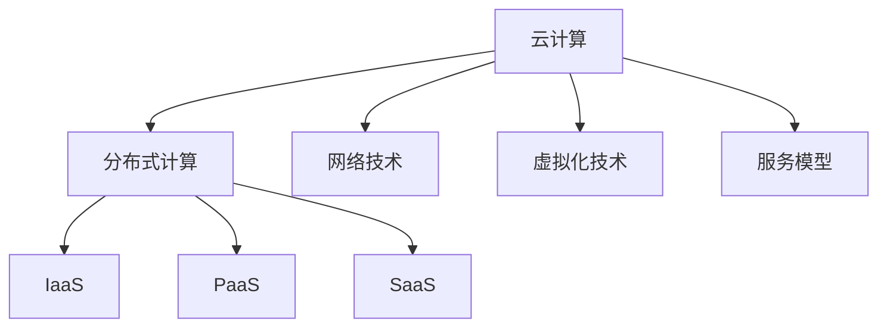
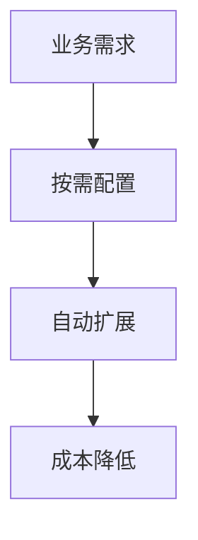
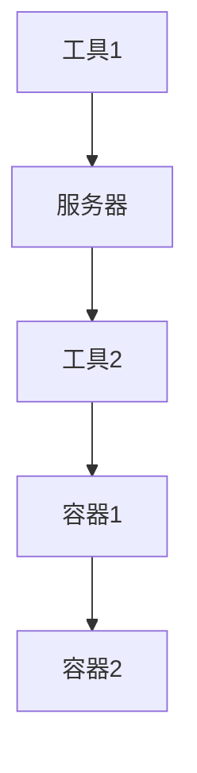
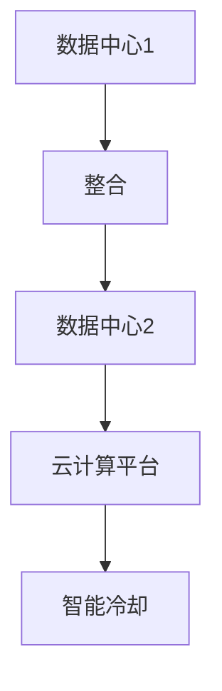
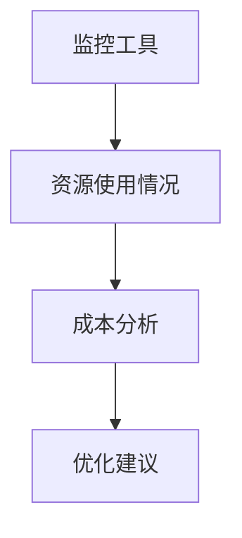
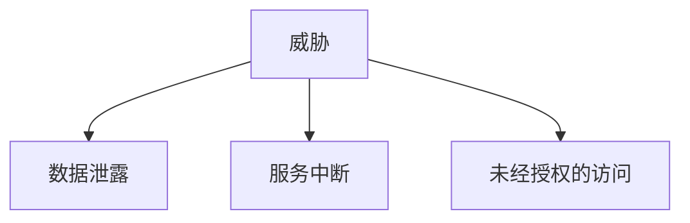
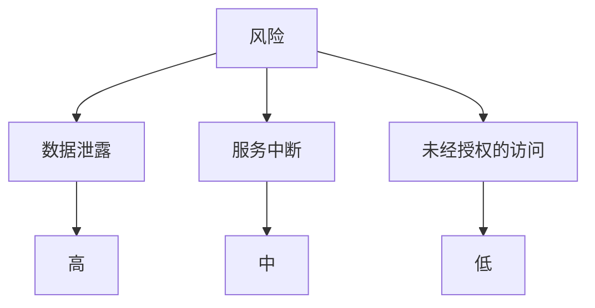

                 


### **第1章：云计算概述与创业关系**

#### **1.1.1 云计算的定义与基本概念**

云计算是一种通过互联网提供计算资源和服务的技术，它使得用户可以按需获取和使用计算资源，而无需拥有或管理这些资源。下面，我们从几个方面来详细阐述云计算的定义和基本概念。

**云计算概念架构图：**



**1.1.1.1 分布式计算**

分布式计算是指通过网络将多个计算资源（如服务器、存储设备等）连接起来，协同工作以完成大规模的计算任务。分布式计算的关键技术包括：

- **负载均衡**：通过将请求分配到不同的服务器上，实现系统的均衡负载。
- **数据复制和分布式存储**：保证数据的高可用性和可靠性。

**1.1.1.2 网络技术**

网络技术是云计算的通信基础，它包括：

- **互联网协议**（如HTTP、HTTPS等）用于传输数据。
- **网络设备**（如路由器、交换机等）用于数据传输的转发和处理。

**1.1.1.3 虚拟化技术**

虚拟化技术是实现云计算的关键技术之一，它包括：

- **硬件虚拟化**：通过虚拟化硬件资源，将物理服务器虚拟化为多个虚拟机。
- **操作系统虚拟化**：虚拟化操作系统的管理功能，使多个操作系统可以在同一台物理服务器上运行。
- **存储虚拟化**：将物理存储资源抽象为虚拟存储资源，提高存储资源的使用效率。

**1.1.1.4 服务模型**

云计算的服务模型包括：

- **基础设施即服务（IaaS）**：提供基础设施资源，如服务器、存储、网络等，用户可以灵活配置和管理这些资源。
- **平台即服务（PaaS）**：提供开发平台和中间件，用户可以在此平台上开发和部署应用程序。
- **软件即服务（SaaS）**：提供应用程序服务，用户可以通过互联网使用这些应用程序。

**1.1.2 云计算的商业模式与创业机会**

云计算的商业模式多样，为创业者提供了丰富的机会。以下是几种常见的商业模式和创业机会：

**1.1.2.1 服务收入模式**

服务收入模式是通过提供服务来获取收入。创业者可以提供云计算基础设施、平台或软件服务，如：

- **云计算服务提供商**：提供云计算基础设施资源，如服务器、存储等。
- **云计算平台提供商**：提供开发平台和中间件，如PaaS服务。
- **云计算软件提供商**：提供云计算管理软件或工具。

**1.1.2.2 订阅模式**

订阅模式是用户按需订阅服务，按使用量收费。创业者可以提供以下订阅服务：

- **云计算资源订阅**：用户按需订阅云计算资源，如IaaS服务。
- **云计算平台订阅**：用户按需订阅云计算开发平台，如PaaS服务。
- **云计算安全服务订阅**：提供云计算安全服务，如防火墙、入侵检测等。

**1.1.2.3 软件销售模式**

软件销售模式是销售云计算管理软件或工具。创业者可以开发以下云计算软件或工具：

- **云计算监控工具**：监控云计算资源的使用情况，如CPU、内存、网络等。
- **云计算管理工具**：帮助用户管理和配置云计算资源。
- **云计算安全工具**：保护云计算环境的安全性，如防火墙、入侵检测等。

通过以上分析，我们可以看到云计算在商业模式和创业机会方面具有广阔的前景。接下来，我们将进一步探讨云计算对创业公司的影响以及面临的挑战和机遇。

### **1.1.3 云计算的关键技术**

云计算的关键技术是实现其核心功能的基础，包括虚拟化技术、分布式存储、容器化技术、自动化运维等。下面，我们将分别介绍这些关键技术。

#### **1.1.3.1 虚拟化技术**

虚拟化技术是将物理硬件资源抽象成逻辑资源，使得多个操作系统和应用可以在同一台物理服务器上独立运行。虚拟化技术主要包括以下三个方面：

- **硬件虚拟化**：通过虚拟化硬件资源，将物理服务器虚拟化为多个虚拟机。硬件虚拟化技术包括VMware ESXi、Microsoft Hyper-V等。
- **操作系统虚拟化**：虚拟化操作系统的管理功能，使多个操作系统可以在同一台物理服务器上运行。操作系统虚拟化技术包括Linux容器（LXC）、OpenVZ等。
- **存储虚拟化**：将物理存储资源抽象为虚拟存储资源，提高存储资源的使用效率。存储虚拟化技术包括NetApp ONTAP、EMC VMAX等。

#### **1.1.3.2 分布式存储**

分布式存储是将数据分散存储在多个节点上，通过分布式文件系统或数据库实现数据的高可用性和高扩展性。分布式存储的关键技术包括：

- **数据复制**：将数据复制到多个节点上，确保数据的高可用性。
- **数据分片**：将数据分成多个片段存储在不同的节点上，提高数据的访问速度。
- **数据一致性**：确保多个节点上的数据是一致的，避免数据冲突。

常见的分布式存储系统包括HDFS（Hadoop分布式文件系统）、Cassandra、MongoDB等。

#### **1.1.3.3 容器化技术**

容器化技术是将应用程序及其运行环境打包成一个独立的容器，使得应用程序可以在不同的操作系统和硬件上无缝运行。容器化技术的关键包括：

- **Docker**：是一个开源的容器化平台，通过将应用程序及其依赖打包成Docker镜像，实现应用程序的轻量级部署和迁移。
- **Kubernetes**：是一个开源的容器编排平台，用于管理容器化应用程序的生命周期，包括部署、扩展和管理。

容器化技术的优点包括：
- **轻量级**：容器化应用程序的体积较小，启动速度快。
- **可移植性**：容器化应用程序可以在不同的操作系统和硬件上运行。
- **可扩展性**：通过容器编排平台，可以方便地扩展应用程序的规模。

#### **1.1.3.4 自动化运维**

自动化运维是通过自动化工具和脚本实现IT基础设施的自动化管理，包括服务器、网络、存储等。自动化运维的关键技术包括：

- **配置管理工具**：如Ansible、Puppet、Chef等，用于自动化部署和管理IT基础设施。
- **持续集成/持续部署（CI/CD）**：通过自动化工具实现代码的持续集成和部署，提高开发效率和软件质量。
- **监控与告警**：通过监控工具如Prometheus、Zabbix等，实时监控系统的运行状态，并及时发现和告警。

通过以上关键技术，云计算为创业公司提供了高效、灵活的计算资源和服务，降低了创业成本，提高了开发效率。接下来，我们将进一步探讨云计算对创业公司的影响。

### **1.1.4 云计算对创业公司的影响**

云计算的出现和发展，对创业公司产生了深远的影响。从降低成本、提高效率、增强创新能力等方面，云计算为创业公司提供了重要的支持。

#### **1.1.4.1 降低成本**

云计算通过提供按需分配的资源和服务，大幅降低了创业公司的IT成本。以下是云计算在降低成本方面的具体体现：

- **基础设施成本降低**：创业公司无需购买和维护大量硬件设备，可以通过云服务提供商租用所需的计算、存储和网络资源。
- **运营成本降低**：云计算平台提供的自动化运维工具，可以减少IT人员的工作量，降低运营成本。
- **弹性成本优化**：创业公司可以根据业务需求灵活调整资源配置，避免资源浪费，实现成本优化。

#### **1.1.4.2 提高效率**

云计算的弹性扩展能力和高效的资源管理，极大地提高了创业公司的运营效率。以下是云计算在提高效率方面的具体表现：

- **快速部署**：云计算平台提供了一键部署应用程序的能力，大大缩短了开发到上线的时间。
- **自动化运维**：通过自动化运维工具，创业公司可以自动化处理日常的IT运维任务，提高运维效率。
- **敏捷开发**：云计算平台支持敏捷开发模式，使创业公司能够快速响应市场变化，实现快速迭代。

#### **1.1.4.3 增强创新能力**

云计算为创业公司提供了强大的计算能力和丰富的数据资源，增强了创业公司的创新能力。以下是云计算在增强创新能力方面的具体作用：

- **数据处理与分析**：云计算平台提供了强大的数据处理和分析工具，使创业公司能够高效地处理和分析海量数据，从而发现商业机会。
- **实验环境搭建**：云计算平台提供了快速搭建实验环境的能力，使创业公司能够方便地进行技术验证和实验。
- **跨领域合作**：云计算平台为创业公司提供了与行业内外的合作伙伴进行跨领域合作的机会，共同创新。

综上所述，云计算对创业公司的影响是多方面的，不仅降低了成本，提高了效率，还增强了创新能力。这使得云计算成为创业公司的重要战略资源，为创业公司的成功提供了有力支持。接下来，我们将探讨云计算面临的挑战和机遇。

### **1.1.5 云计算的挑战与机遇**

尽管云计算为创业公司带来了诸多优势，但在实际应用过程中，云计算也面临一些挑战和机遇。

#### **1.1.5.1 挑战**

**1.1.5.1.1 安全性问题**

云计算涉及大量的数据传输和存储，安全性问题尤为重要。挑战包括：

- **数据泄露**：数据在传输和存储过程中可能遭受窃取或篡改。
- **数据丢失**：由于硬件故障、网络问题或其他原因，可能导致数据丢失。
- **数据合规性**：不同国家和地区的数据保护法规有所不同，创业公司需要确保数据符合相关法规。

**1.1.5.1.2 依赖性问题**

创业公司过度依赖云计算服务提供商，可能导致以下问题：

- **服务中断**：如果云服务提供商出现故障，创业公司可能会遭受服务中断，影响业务运营。
- **锁定风险**：创业公司可能会难以切换到其他云服务提供商，面临锁定风险。

**1.1.5.1.3 成本控制**

虽然云计算可以降低成本，但如果不进行有效的成本控制，可能会造成资源浪费。挑战包括：

- **资源分配不均**：不同业务需求对资源的需求不同，如果资源分配不均，可能导致某些资源过度使用，而其他资源未充分利用。
- **预算超支**：如果预算管理不当，可能导致云服务成本超支。

#### **1.1.5.2 机遇**

**1.1.5.2.1 创新机会**

云计算提供了丰富的计算资源和工具，为创业公司提供了创新的土壤。机遇包括：

- **技术创新**：云计算为创业公司提供了实验和验证新技术的能力，如人工智能、大数据等。
- **商业模式创新**：云计算使得创业公司能够快速构建和部署新的业务模式，如订阅服务、共享经济等。

**1.1.5.2.2 市场拓展**

云计算可以帮助创业公司突破地域限制，拓展市场。机遇包括：

- **国际化**：通过云计算，创业公司可以轻松地将服务拓展到全球市场。
- **跨行业合作**：云计算为创业公司提供了与不同行业合作伙伴进行合作的平台，共同开拓新市场。

**1.1.5.2.3 数据价值**

云计算提供了强大的数据处理和分析工具，使创业公司能够从海量数据中挖掘价值。机遇包括：

- **数据驱动决策**：通过数据分析，创业公司可以更准确地了解用户需求，优化业务策略。
- **数据交易**：创业公司可以开展数据交易业务，如数据共享、数据服务外包等。

总之，云计算既带来了挑战，也带来了机遇。创业公司需要充分认识这些挑战和机遇，采取相应的策略和措施，以实现持续发展和成功。接下来，我们将进一步探讨云计算在创业公司中的应用场景和最佳实践。

## **第2章：云计算与创业成本的降低**

#### **2.1 云计算成本结构分析**

在探讨云计算如何帮助创业公司降低成本之前，我们需要对云计算的成本结构进行深入分析。云计算成本通常包括以下几个方面：

1. **基础设施成本**：包括服务器、存储、网络设备等硬件的购买和维护费用。
2. **软件开发成本**：包括购买或开发软件平台、应用程序等的费用。
3. **人员成本**：包括IT运维人员、开发人员等的人力资源费用。
4. **运营成本**：包括电力、空调、数据中心租赁等基础设施的运营费用。
5. **管理成本**：包括成本监控、优化、合规性管理等费用。

**2.1.1.1 基础设施成本**

云计算通过提供按需分配的基础设施资源，显著降低了创业公司的硬件成本。以下是云计算在基础设施成本方面的具体优势：

- **按需分配**：创业公司可以根据业务需求灵活调整基础设施资源，避免了资源闲置和过度投资。
- **租赁模式**：通过租赁云服务提供商的基础设施，创业公司无需购买昂贵的硬件设备，降低了初始投资成本。
- **弹性扩展**：云服务提供商可以根据需求自动扩展或缩减资源，使创业公司能够快速响应业务变化，避免资源不足或过剩。

**2.1.1.2 软件开发成本**

云计算平台提供了丰富的开发工具和平台，降低了创业公司在软件开发方面的成本。以下是云计算在软件开发成本方面的优势：

- **快速部署**：云计算平台支持一键部署应用程序，大大缩短了开发到上线的时间，降低了开发成本。
- **工具支持**：云计算平台提供了丰富的开发工具，如集成开发环境（IDE）、版本控制工具、测试工具等，提高了开发效率。
- **资源弹性**：云计算平台提供了弹性计算资源，使创业公司能够根据开发需求灵活调整资源，避免了资源浪费。

**2.1.1.3 人员成本**

云计算自动化运维工具和平台减少了创业公司在IT运维方面的人力需求，降低了人员成本。以下是云计算在人员成本方面的优势：

- **自动化运维**：云计算平台提供了自动化运维工具，如配置管理工具、监控工具等，使创业公司能够自动化处理日常运维任务，降低了人工成本。
- **远程管理**：云计算平台支持远程管理，使创业公司的IT运维人员可以随时随地访问和管理云资源，提高了运维效率。
- **技能需求降低**：云计算平台提供了易于使用的界面和工具，降低了运维人员的技术门槛，使普通员工也能够进行基本的运维工作。

**2.1.1.4 运营成本**

云计算通过优化资源利用率和自动化管理，降低了创业公司的运营成本。以下是云计算在运营成本方面的优势：

- **资源利用率提高**：云计算平台通过负载均衡和资源优化，使计算资源得到充分利用，避免了资源闲置和浪费。
- **能源消耗减少**：云计算平台集中管理资源，通过高效的数据中心设计和能源管理，降低了能源消耗。
- **维护成本降低**：云计算平台由专业的服务提供商维护，创业公司无需投入大量资金进行硬件维护和升级。

**2.1.1.5 管理成本**

云计算平台提供了完善的成本监控和管理工具，使创业公司能够有效管理云资源，降低了管理成本。以下是云计算在管理成本方面的优势：

- **成本监控**：云计算平台提供了实时的成本监控工具，使创业公司能够实时了解云资源的使用情况，避免资源浪费。
- **成本优化**：云计算平台提供了优化建议，如资源调整、成本节省方案等，帮助创业公司降低运营成本。
- **合规性管理**：云计算平台提供了合规性管理工具，使创业公司能够确保云资源的使用符合相关法规和标准，避免了合规性风险。

综上所述，云计算通过降低基础设施成本、软件开发成本、人员成本、运营成本和管理成本，为创业公司提供了显著的成本优势。接下来，我们将进一步探讨如何利用云计算资源优化配置，提高成本效益。

### **2.2 利用云计算降低IT成本**

云计算通过提供灵活、可扩展的计算资源，为创业公司提供了降低IT成本的有效途径。下面，我们将详细介绍如何利用云计算降低IT成本，并提供具体的优化策略和实践案例。

#### **2.2.1 资源弹性配置**

资源弹性配置是云计算降低IT成本的核心策略之一。通过按需分配和动态调整计算资源，创业公司可以避免资源闲置和过度投资。

**策略：**

- **按需分配**：创业公司应根据业务需求实时调整计算资源，避免资源过剩或不足。
- **自动扩展**：利用云服务提供商的自动扩展功能，根据负载自动增加或减少资源。

**实践案例：**

某创业公司使用云计算平台进行网站开发和运维。通过配置自动扩展策略，当网站访问量增加时，平台会自动增加服务器资源，保证网站稳定运行；访问量减少时，平台会自动缩减资源，降低成本。



#### **2.2.2 资源共享**

资源共享是云计算降低IT成本的重要手段。通过将多个应用部署在同一台服务器上，创业公司可以最大化资源利用率。

**策略：**

- **垂直共享**：将多个应用部署在同一台服务器上，共享CPU、内存等资源。
- **水平共享**：通过容器化技术，如Docker，将多个应用部署在多个容器中，实现水平扩展。

**实践案例：**

某创业公司开发了一系列在线工具，通过垂直共享和水平共享，将不同工具部署在同一台服务器和多个容器中，提高了资源利用率，降低了硬件成本。



#### **2.2.3 能源优化**

云计算平台通过集中管理和优化资源，可以实现能源消耗的显著降低。创业公司可以利用云计算平台的能源优化功能，降低运营成本。

**策略：**

- **智能冷却**：通过智能冷却系统，根据服务器负载自动调整冷却设备，降低能源消耗。
- **数据中心整合**：通过整合多个数据中心，实现资源集中管理，降低能源消耗。

**实践案例：**

某创业公司通过使用云计算平台，将多个数据中心整合到一起，实现了资源的集中管理和智能冷却，降低了能源消耗和运营成本。



#### **2.2.4 成本监控与优化**

通过实时监控和优化云资源的使用情况，创业公司可以及时发现和解决成本问题，实现成本降低。

**策略：**

- **实时监控**：使用云服务提供商提供的监控工具，实时监控云资源的使用情况，如CPU利用率、内存占用等。
- **成本分析**：定期分析云资源的使用情况和成本，找出成本高出的原因，并采取相应的优化措施。

**实践案例：**

某创业公司通过使用云服务提供商的监控工具，实时监控云资源的使用情况，发现某些资源的利用率较低，通过调整资源配置，降低了运营成本。



综上所述，利用云计算降低IT成本的关键在于资源弹性配置、资源共享、能源优化和成本监控与优化。通过这些策略和实践案例，创业公司可以实现显著的成本降低，提高业务竞争力。

### **2.3 云计算资源的灵活配置与优化**

云计算资源的灵活配置与优化是创业公司实现成本效益的关键。通过合理配置和优化资源，创业公司可以最大化利用云资源，降低运营成本。以下是云计算资源灵活配置与优化的几种方法：

#### **2.3.1 自动化资源管理**

自动化资源管理是利用云计算降低成本的重要手段。通过自动化工具和脚本，创业公司可以自动化地分配、监控和优化云资源。

**方法：**

- **自动化部署**：使用自动化部署工具，如Puppet、Chef等，实现快速部署和配置云资源。
- **自动化扩展与缩减**：根据业务需求，使用自动化工具实现云资源的自动扩展与缩减。

**示例：**

```python
# 使用Ansible自动化部署虚拟机
- hosts: all
  become: yes
  tasks:
    - name: Install Docker
      apt: name=docker state=present
    - name: Start Docker service
      service: name=docker state=started
    - name: Deploy application
      docker:
        image: myapp:latest
        container_name: myapp
        ports:
          - "8080:8080"
```

#### **2.3.2 资源利用率优化**

提高资源利用率是降低成本的关键。创业公司可以通过以下方法优化资源利用率：

- **负载均衡**：使用负载均衡器，如Nginx、HAProxy等，将请求分配到多个服务器上，提高资源利用率。
- **容器化**：使用容器化技术，如Docker，将应用程序及其依赖打包成容器，实现轻量级部署和高效资源利用。
- **实例选择**：根据业务需求选择合适的实例类型，如CPU密集型或内存密集型实例，优化资源使用。

**示例：**

```yaml
# Kubernetes部署配置文件示例
apiVersion: apps/v1
kind: Deployment
metadata:
  name: myapp
spec:
  replicas: 3
  selector:
    matchLabels:
      app: myapp
  template:
    metadata:
      labels:
        app: myapp
    spec:
      containers:
      - name: myapp
        image: myapp:latest
        ports:
        - containerPort: 8080
```

#### **2.3.3 能源效率优化**

优化云资源的能源效率是降低运营成本的重要措施。以下方法可以帮助创业公司实现能源效率优化：

- **智能冷却**：使用智能冷却系统，根据服务器负载自动调整冷却设备，降低能源消耗。
- **虚拟化**：通过虚拟化技术，实现服务器资源的集中管理，提高能源利用效率。
- **能耗监控**：使用能耗监控工具，实时监控云资源的能耗情况，优化能源消耗。

**示例：**

```shell
# 使用PowerCLI监控虚拟机能耗
Get-VM | Select-Object Name, MemoryGB, CPUUsage, PowerState
```

#### **2.3.4 定期成本分析**

定期成本分析是确保云资源成本效益的关键。通过以下方法，创业公司可以定期分析云资源成本，并提出优化建议：

- **成本报告**：使用云服务提供商提供的成本报告工具，生成详细的成本分析报告。
- **成本预测**：基于历史数据和业务需求，预测未来云资源成本，提前采取优化措施。
- **成本控制**：制定成本控制策略，如预算限制、资源限额等，确保云资源成本在可控范围内。

**示例：**

```shell
# AWS成本报告
aws costexplorer get-cost-and-use-report
```

通过以上方法，创业公司可以实现云计算资源的灵活配置与优化，降低运营成本，提高业务竞争力。

### **2.4 云计算服务的成本效益分析**

进行云计算服务的成本效益分析对于创业公司至关重要，可以帮助企业在预算分配和资源管理方面做出明智的决策。以下是成本效益分析的几个关键步骤和注意事项：

#### **2.4.1 收集成本数据**

首先，创业公司需要收集云计算服务的详细成本数据。这些数据包括：

- **基础设施成本**：包括服务器、存储、网络等硬件设备以及相关的维护费用。
- **软件成本**：包括购买或租用的软件平台、应用程序、数据库等的费用。
- **人员成本**：包括IT运维人员、开发人员等的工资和培训费用。
- **运营成本**：包括电费、空调、数据中心租赁等基础设施的运营费用。
- **管理成本**：包括成本监控、优化、合规性管理等费用。

**示例数据收集工具：**

- **AWS Cost Explorer**：用于分析AWS服务的成本数据。
- **Azure Cost Management**：用于分析Azure服务的成本数据。
- **Google Cloud Pricing Calculator**：用于估算Google Cloud服务的成本。

#### **2.4.2 比较不同服务**

创业公司应在不同的云服务提供商之间进行比较，以选择最具成本效益的选项。比较的维度包括：

- **价格**：不同云服务提供商的价格可能会有所不同，创业公司应根据自身需求选择最经济的方案。
- **性能**：性能指标如CPU利用率、内存占用、I/O性能等，会影响应用程序的运行效率和成本。
- **服务范围**：不同云服务提供商提供的云服务种类和功能可能有所不同，创业公司应选择能够满足自身业务需求的方案。

**示例比较工具：**

- **AWS Comparison Tool**：用于比较AWS不同服务的性能和价格。
- **Azure Comparison Tool**：用于比较Azure不同服务的性能和价格。
- **Google Cloud Performance Comparison**：用于比较Google Cloud不同服务的性能。

#### **2.4.3 预算规划和分配**

创业公司应根据业务需求和成本数据制定合理的预算规划和资源分配方案。以下是一些建议：

- **基于需求的预算规划**：根据不同业务需求，为不同的云服务项目分配预算。
- **优先级分配**：对于具有高业务价值的项目，应优先分配预算和资源。
- **灵活调整**：在预算执行过程中，根据实际情况灵活调整预算和资源分配。

**示例预算规划工具：**

- **AWS Budgets**：用于制定和监控AWS预算。
- **Azure Budgets**：用于制定和监控Azure预算。
- **Google Cloud Budgets**：用于制定和监控Google Cloud预算。

#### **2.4.4 成本效益评估**

进行成本效益评估可以帮助创业公司了解云计算服务的实际效益。以下是一些建议：

- **ROI计算**：计算云计算服务的投资回报率（ROI），以衡量云计算服务的经济价值。
- **成本节约分析**：分析云计算服务相对于传统IT基础设施的成本节约情况。
- **效益分析**：评估云计算服务对业务效率、响应速度、创新能力等方面的积极影响。

**示例效益分析工具：**

- **AWS Cost and Usage Report**：用于分析AWS服务的成本和效益。
- **Azure Cost and Usage Report**：用于分析Azure服务的成本和效益。
- **Google Cloud Cost Analysis**：用于分析Google Cloud服务的成本和效益。

#### **2.4.5 注意事项**

在成本效益分析过程中，创业公司应注意以下事项：

- **长期视角**：成本效益分析应考虑长期成本和效益，避免短期行为对长期决策的影响。
- **透明度**：确保成本数据的准确性和透明度，避免隐藏成本或误导分析结果。
- **灵活性**：在分析过程中，应保持灵活性，以便根据市场变化和业务需求进行调整。

通过以上步骤和注意事项，创业公司可以全面评估云计算服务的成本效益，制定出最优的云计算战略，实现成本优化和业务增长。

### **2.5 创业公司在云计算资源管理中的最佳实践**

为了在云计算环境中实现高效、安全的资源管理，创业公司需要遵循一系列最佳实践。以下是一些关键的策略和技巧：

#### **2.5.1 制定清晰的资源管理策略**

- **资源分类**：根据业务需求将资源分类，如开发环境、测试环境、生产环境等。
- **资源分配**：为不同类型的资源制定明确的分配策略，确保资源的高效利用。

#### **2.5.2 实施自动化运维**

- **配置管理**：使用配置管理工具（如Ansible、Puppet、Chef）自动化部署和管理云资源。
- **监控与告警**：利用监控工具（如Prometheus、Zabbix）实时监控资源状态，及时发现问题。

#### **2.5.3 实施安全策略**

- **访问控制**：实施严格的访问控制策略，确保只有授权用户能够访问敏感资源。
- **数据加密**：对存储和传输的数据进行加密，确保数据安全性。
- **安全审计**：定期进行安全审计，检查云资源的配置和安全状态。

#### **2.5.4 实施成本优化**

- **资源利用率监控**：定期分析资源利用率，找出低效资源并优化。
- **成本分析**：使用云服务提供商提供的成本分析工具，监控和优化成本。
- **预算控制**：制定预算控制策略，如设置资源使用上限，避免超支。

#### **2.5.5 实施备份和灾难恢复**

- **数据备份**：定期备份关键数据，确保数据不丢失。
- **灾难恢复**：制定灾难恢复计划，确保在发生灾难时能够快速恢复业务。

#### **2.5.6 培训和知识共享**

- **培训**：为团队成员提供云计算相关的培训，提高他们的技能和知识。
- **知识共享**：鼓励团队成员分享云计算资源管理的经验和最佳实践。

#### **2.5.7 持续改进**

- **反馈机制**：建立反馈机制，收集团队成员对云计算资源管理的意见和建议。
- **持续改进**：根据反馈和改进建议，不断优化资源管理策略和流程。

通过以上最佳实践，创业公司可以确保在云计算环境中实现高效、安全的资源管理，降低运营成本，提高业务竞争力。

### **第3章：云计算在提高创业效率方面的应用**

#### **3.1 云计算与敏捷开发**

云计算为敏捷开发提供了强大的支持，使得创业公司能够更快地响应市场需求，提高软件交付效率。以下是云计算在敏捷开发中的几个关键应用：

**3.1.1.1 持续集成和持续交付**

云计算平台支持持续集成和持续交付（CI/CD），使开发团队能够快速迭代和部署软件。以下是一个简化的CI/CD流程：

- **代码提交**：开发人员将代码提交到版本控制系统（如Git）。
- **自动化构建**：构建服务器从版本控制系统中获取最新代码，并执行构建脚本，生成可执行文件。
- **自动化测试**：构建过程中，自动化测试工具（如Jenkins、GitLab CI）执行单元测试、集成测试和性能测试。
- **部署**：通过容器化技术（如Docker）或无服务器架构（如AWS Lambda），将经过测试的软件部署到生产环境。

**3.1.1.2 弹性资源分配**

云计算平台提供了弹性资源分配能力，使开发团队能够根据项目需求动态调整资源。例如，使用Kubernetes进行容器编排，可以根据负载自动扩展或缩减集群中的容器数量，确保系统稳定运行。

**3.1.1.3 云原生技术**

云原生技术，如Docker和Kubernetes，使得应用程序可以在不同的环境中一致地运行，提高了开发和运维的效率。云原生应用程序通常具有以下几个特点：

- **微服务架构**：应用程序被分解为多个小型、独立的服务，每个服务负责一个特定的功能。
- **容器化**：应用程序及其依赖被打包在容器中，确保在不同环境中的一致性。
- **自动化部署**：使用CI/CD工具自动化部署和管理容器化应用程序。

**3.1.1.4 环境一致性**

云计算平台提供了一致的开发、测试和生产环境，使开发团队能够更轻松地实现环境一致性。例如，使用Docker Compose，可以在本地环境中模拟生产环境，确保代码在不同环境中的一致性。

**3.1.1.5 云服务集成**

云计算平台集成了多种云服务，如数据库、存储、消息队列等，使开发团队能够快速构建和部署应用程序。例如，使用AWS Amplify，可以快速集成AWS的云服务，如Amazon S3、Amazon RDS等。

通过以上应用，云计算显著提高了敏捷开发的效率，使创业公司能够更快地响应市场需求，缩短产品交付周期。

### **3.2 云原生技术与微服务架构**

云原生技术和微服务架构是现代软件开发的重要趋势，为创业公司提供了灵活、可扩展的应用架构。以下是云原生技术和微服务架构在云计算环境中的应用：

**3.2.1.1 云原生技术**

云原生技术是指专门为云计算环境设计的应用程序和工具，使应用程序能够在云环境中高效地运行和扩展。以下是云原生技术的核心概念：

- **容器化**：容器是一种轻量级、可移植的计算单元，包含应用程序及其依赖。容器化使应用程序在不同环境中的一致性得到了保障，提高了开发和部署的效率。
- **微服务架构**：微服务架构将应用程序分解为多个小型、独立的服务，每个服务负责一个特定的功能。这种架构具有高可扩展性、高可维护性和高可用性。
- **动态管理**：云原生技术利用容器编排工具（如Kubernetes）动态管理应用程序的部署、扩展和监控。
- **持续集成和持续交付（CI/CD）**：云原生技术支持持续集成和持续交付，使开发团队能够快速迭代和部署软件。

**3.2.1.2 微服务架构**

微服务架构是一种将应用程序分解为多个小型、独立服务的架构模式。以下是微服务架构的核心概念：

- **服务自治**：每个微服务都是独立的，具有自己的数据存储和业务逻辑，可以独立部署、扩展和监控。
- **服务通信**：微服务之间通过轻量级的通信协议（如HTTP/REST、gRPC）进行通信，降低了系统复杂度。
- **独立部署**：微服务可以独立部署和升级，不会影响其他服务的运行。
- **高可用性**：微服务架构具有高可用性，即使某个服务出现故障，其他服务仍可以正常运行。

**3.2.1.3 容器化与微服务架构的结合**

容器化与微服务架构的结合，使得创业公司能够充分利用云计算环境的优势，实现高效的软件开发和部署。以下是一个简化的容器化与微服务架构的部署流程：

1. **代码提交**：开发人员将代码提交到版本控制系统（如Git）。
2. **自动化构建**：构建服务器从版本控制系统中获取最新代码，并使用Docker构建容器镜像。
3. **容器化部署**：使用容器编排工具（如Kubernetes）将容器镜像部署到集群中，实现自动扩展和负载均衡。
4. **自动化测试**：容器编排工具可以集成自动化测试工具，对部署的微服务进行自动化测试，确保服务的质量和稳定性。
5. **持续集成和持续交付**：通过CI/CD工具，实现代码的自动化构建、测试和部署，提高开发效率。

通过云原生技术和微服务架构，创业公司可以实现高效的软件开发和部署，提高业务响应速度和创新能力。

### **3.3 云计算与DevOps文化的融合**

DevOps是一种文化、实践和工具的结合，旨在提高软件开发的效率和质量。云计算与DevOps文化的融合，使得创业公司能够更好地实现持续集成、持续交付和自动化运维，从而提高业务效率和创新能力。以下是云计算与DevOps文化融合的关键要点：

**3.3.1.1 持续集成与持续交付**

持续集成（CI）和持续交付（CD）是DevOps的核心实践，通过自动化流程实现快速迭代和交付。云计算平台提供了丰富的工具和资源，支持CI/CD的实现：

- **自动化构建和测试**：使用云服务提供商提供的构建和测试工具（如AWS CodePipeline、Azure DevOps），实现代码的自动化构建和测试。
- **容器化**：利用容器化技术（如Docker），将应用程序及其依赖打包成容器，实现快速部署和扩展。
- **无服务器架构**：使用无服务器架构（如AWS Lambda、Azure Functions），根据请求自动分配和释放资源，提高系统的弹性。

**3.3.1.2 自动化运维**

自动化运维是DevOps实践的重要组成部分，通过自动化工具和脚本实现日常运维任务，降低运维成本和提高运维效率。云计算平台提供了多种自动化运维工具：

- **配置管理**：使用配置管理工具（如Ansible、Puppet、Chef），自动化部署和管理云资源。
- **监控与告警**：使用监控工具（如Prometheus、Zabbix），实时监控云资源的运行状态，及时发现问题。
- **自动化扩展与缩减**：使用容器编排工具（如Kubernetes），根据负载自动扩展或缩减云资源，实现弹性伸缩。

**3.3.1.3 服务化运维**

云计算平台提供了服务化的运维模式，使得运维工作更加模块化和标准化。以下是一些服务化运维的关键实践：

- **服务目录**：建立服务目录，将云资源和服务进行分类和注册，便于管理和监控。
- **服务模板**：使用服务模板，快速部署和管理常见的服务组件，如数据库、存储、网络等。
- **自动化服务编排**：通过自动化服务编排工具（如Terraform、AWS CloudFormation），实现云资源的自动化部署和管理。

**3.3.1.4 文化融合**

云计算与DevOps文化的融合，需要组织内部形成一种共同的理念和价值观，推动持续改进和协同工作。以下是一些文化融合的关键实践：

- **跨职能团队**：建立跨职能团队，包括开发、测试、运维等角色，共同参与项目开发和运维。
- **知识共享**：鼓励团队成员分享知识和经验，促进组织内部的协作和学习。
- **持续改进**：建立持续改进的机制，通过定期回顾和总结，不断优化开发、测试和运维流程。

通过云计算与DevOps文化的融合，创业公司可以实现高效、稳定和安全的软件交付，提高业务效率和客户满意度。

### **3.4 云计算在数据管理和数据分析中的应用**

云计算为创业公司提供了强大的数据管理和数据分析工具，使其能够高效地处理和利用数据，从而实现数据驱动的业务决策。以下是云计算在数据管理和数据分析中的应用：

**3.4.1.1 数据存储和管理**

云计算平台提供了丰富的数据存储和管理服务，包括：

- **对象存储**：如Amazon S3、Azure Blob Storage，用于存储大规模非结构化数据。
- **关系数据库**：如Amazon RDS、Azure Database，用于存储结构化数据，提供自动备份、故障恢复等功能。
- **非关系数据库**：如MongoDB、Cassandra，用于处理大规模、分布式数据。

**3.4.1.2 数据处理**

云计算平台提供了高效的数据处理工具，包括：

- **批处理**：如Apache Hadoop、AWS EMR，用于处理大规模数据集。
- **流处理**：如Apache Kafka、AWS Kinesis，用于实时处理和分析数据流。
- **实时计算**：如AWS Lambda、Azure Functions，用于处理和响应实时事件。

**3.4.1.3 数据分析**

云计算平台提供了丰富的数据分析工具，包括：

- **数据分析平台**：如Google BigQuery、Azure SQL Data Warehouse，用于大规模数据集的查询和分析。
- **机器学习**：如AWS SageMaker、Azure Machine Learning，用于构建、训练和部署机器学习模型。
- **数据可视化**：如Tableau、Power BI，用于将数据分析和洞察可视化为图表和报告。

**3.4.1.4 数据治理和合规**

云计算平台提供了数据治理和合规工具，确保数据的正确性和安全性：

- **数据治理**：如AWS Glue、Azure Data Factory，用于数据质量管理、数据分类等。
- **数据加密**：如AWS KMS、Azure Key Vault，用于数据加密和管理密钥。
- **合规性检查**：如AWS CloudTrail、Azure Security Center，用于监控和报告合规性。

通过云计算在数据管理和数据分析中的应用，创业公司能够快速、高效地处理和分析海量数据，从而获得深刻的业务洞察，实现数据驱动的业务决策。

### **3.5 创业公司如何利用云计算实现高效的业务流程管理**

创业公司通过云计算实现高效的业务流程管理，不仅能够提高运营效率，还能灵活应对市场变化，提升企业竞争力。以下是创业公司利用云计算实现业务流程管理的几个关键步骤：

#### **3.5.1 云原生应用程序开发**

开发云原生应用程序是创业公司实现高效业务流程管理的第一步。云原生应用程序具有以下特点：

- **容器化**：使用容器（如Docker）封装应用程序及其依赖，确保在不同环境中的一致性和可移植性。
- **微服务架构**：将应用程序分解为多个小型、独立的服务，每个服务负责一个特定的业务功能，提高系统的灵活性和可扩展性。
- **自动化部署**：利用CI/CD工具（如Jenkins、GitLab CI）实现自动化构建、测试和部署，缩短开发周期。

**示例步骤：**

1. **需求分析**：确定业务流程的关键环节和需求。
2. **设计微服务架构**：将业务流程分解为多个微服务，设计服务间的通信机制。
3. **开发云原生应用程序**：使用容器化技术（如Docker）和微服务框架（如Spring Cloud）进行开发。
4. **自动化测试**：使用自动化测试工具（如JUnit、Selenium）确保代码质量。

#### **3.5.2 业务流程自动化**

通过云计算平台提供的自动化工具，创业公司可以自动化业务流程中的多个环节，提高效率。以下是一些自动化工具：

- **工作流引擎**：如Apache Airflow、AWS Step Functions，用于定义和执行业务流程。
- **任务调度**：如cron作业、Kubernetes Job，用于定期执行任务。
- **API集成**：如API Gateway、MuleSoft，用于集成不同的系统和应用程序。

**示例步骤：**

1. **确定自动化需求**：分析业务流程中的手动环节，确定自动化需求。
2. **设计自动化流程**：使用工作流引擎定义自动化流程。
3. **实现自动化脚本**：编写脚本（如Python、Shell）执行自动化任务。
4. **测试和部署**：确保自动化流程能够正常运行，并进行部署。

#### **3.5.3 数据驱动的业务决策**

云计算平台提供了强大的数据管理和分析工具，使创业公司能够从海量数据中提取有价值的信息，支持数据驱动的业务决策。以下是一些数据分析工具：

- **大数据处理**：如Hadoop、Spark，用于处理大规模数据集。
- **数据仓库**：如AWS Redshift、Azure SQL Data Warehouse，用于存储和分析数据。
- **机器学习**：如AWS SageMaker、Azure Machine Learning，用于构建和部署机器学习模型。

**示例步骤：**

1. **数据收集**：从不同来源收集数据，如数据库、日志文件、第三方API等。
2. **数据清洗**：使用数据处理工具（如Apache Beam、AWS Glue）清洗和转换数据。
3. **数据分析**：使用数据分析工具（如Tableau、Power BI）进行数据探索和分析。
4. **决策支持**：基于分析结果，制定业务策略和决策。

#### **3.5.4 持续监控和优化**

持续监控和优化业务流程是确保高效运营的关键。以下是一些监控和优化工具：

- **日志管理**：如ELK Stack（Elasticsearch、Logstash、Kibana）、AWS CloudWatch，用于收集、存储和可视化日志数据。
- **性能监控**：如Prometheus、Zabbix，用于监控系统的性能指标。
- **成本监控**：如AWS Cost Explorer、Azure Cost Management，用于监控和优化云资源使用。

**示例步骤：**

1. **确定监控指标**：根据业务需求，确定关键监控指标。
2. **配置监控工具**：使用监控工具（如Prometheus、AWS CloudWatch）收集和存储监控数据。
3. **可视化监控数据**：使用可视化工具（如Kibana、Zabbix Web界面）展示监控数据。
4. **优化业务流程**：根据监控数据，识别瓶颈和优化机会，调整业务流程。

通过以上步骤，创业公司可以利用云计算实现高效的业务流程管理，提高运营效率，增强企业竞争力。

### **第4章：云计算平台与应用场景**

#### **4.1 主流云计算平台介绍**

在当今云计算市场中，主流的云服务提供商包括Amazon Web Services (AWS)、Microsoft Azure、Google Cloud Platform (GCP) 和 Alibaba Cloud。以下是这些主流云计算平台的主要特点和功能：

**4.1.1 Amazon Web Services (AWS)**

- **特点**：AWS 是全球最大的云服务提供商，提供广泛的服务和强大的生态系统。
- **主要功能**：
  - **基础设施即服务（IaaS）**：如Amazon EC2、Amazon S3。
  - **平台即服务（PaaS）**：如Amazon RDS、Amazon Lambda。
  - **软件即服务（SaaS）**：如Amazon WorkMail、Amazon Chime。
  - **数据分析与机器学习**：如Amazon Redshift、Amazon SageMaker。

**4.1.2 Microsoft Azure**

- **特点**：Azure 是微软的云计算平台，与Microsoft 365和Office 365集成紧密。
- **主要功能**：
  - **基础设施即服务（IaaS）**：如Azure VMs、Azure Blob Storage。
  - **平台即服务（PaaS）**：如Azure App Service、Azure Functions。
  - **软件即服务（SaaS）**：如Microsoft 365、Azure Active Directory。
  - **人工智能与机器学习**：如Azure Machine Learning、Azure Cognitive Services。

**4.1.3 Google Cloud Platform (GCP)**

- **特点**：GCP 是谷歌的云计算平台，以其强大的数据处理和分析能力著称。
- **主要功能**：
  - **基础设施即服务（IaaS）**：如Google Compute Engine、Google Cloud Storage。
  - **平台即服务（PaaS）**：如Google App Engine、Google Kubernetes Engine。
  - **软件即服务（SaaS）**：如Google Workspace、Google Workspace Backup。
  - **人工智能与机器学习**：如Google AI Platform、AutoML。

**4.1.4 Alibaba Cloud**

- **特点**：Alibaba Cloud 是阿里巴巴集团的云计算平台，在中国市场占据领先地位。
- **主要功能**：
  - **基础设施即服务（IaaS）**：如ECS、OSS。
  - **平台即服务（PaaS）**：如ApsaraDB、ACR。
  - **软件即服务（SaaS）**：如阿里云办公、云数据库。
  - **人工智能与机器学习**：如PAI、AI Studio。

#### **4.2 云计算在不同行业领域的应用**

云计算技术在各个行业领域都有广泛的应用，下面我们简要介绍云计算在几个典型行业中的应用：

**4.2.1 金融行业**

- **数据分析与风险控制**：云计算平台提供了强大的数据处理和分析工具，使金融机构能够实时分析海量交易数据，进行风险控制和欺诈检测。
- **云计算安全**：云计算服务提供商提供了严格的安全措施，如数据加密、访问控制等，确保金融数据的安全。

**4.2.2 医疗保健行业**

- **电子健康记录（EHR）**：云计算平台为医疗保健机构提供了存储和访问电子健康记录的解决方案，提高了医疗服务的效率和准确性。
- **远程医疗服务**：通过云计算，医疗机构可以提供远程诊断和咨询服务，使患者无需到现场即可获得医疗服务。

**4.2.3 零售行业**

- **大数据分析**：云计算平台可以帮助零售企业处理和分析海量数据，进行市场趋势分析、消费者行为分析等，优化库存管理和营销策略。
- **电子商务平台**：云计算平台提供了可靠的基础设施和灵活的扩展能力，支持电子商务平台的快速部署和扩展。

**4.2.4 制造业**

- **智能制造**：云计算平台提供了物联网（IoT）解决方案，使企业能够实时收集和分析生产数据，优化生产流程。
- **供应链管理**：云计算平台提供了供应链管理工具，帮助企业实现供应链的透明化、可视化和高效管理。

#### **4.3 创业公司选择云计算平台的考虑因素**

创业公司在选择云计算平台时，需要综合考虑以下因素：

- **成本**：不同云服务提供商的价格和服务模型有所不同，创业公司应根据自身预算和需求选择最经济的方案。
- **性能**：云服务提供商的性能指标如CPU利用率、网络带宽等，直接影响应用程序的运行效率。
- **兼容性**：选择与现有技术栈兼容的云计算平台，可以降低迁移成本和复杂性。
- **安全性**：确保云计算平台提供了严格的安全措施和合规性认证，以保护企业的数据安全。
- **支持与培训**：优质的客户支持和培训资源可以帮助创业公司更好地利用云计算平台，提高团队技能。

通过综合考虑以上因素，创业公司可以选出最适合自身业务需求的云计算平台，实现高效的业务发展和创新。

### **4.4 云计算平台的安全性与合规性**

在云计算环境中，安全性和合规性是创业公司必须关注的重要问题。确保数据安全和合规操作不仅能够保护企业免受潜在威胁，还能够赢得客户的信任和市场的认可。以下是云计算平台在安全性与合规性方面的关键考虑：

#### **4.4.1 安全措施**

云计算平台通常提供一系列安全措施，以保护数据和服务。以下是一些常见的安全措施：

- **身份验证与访问控制**：通过用户身份验证和访问控制策略，确保只有授权用户可以访问敏感数据和资源。
- **数据加密**：使用加密技术对存储和传输的数据进行加密，防止数据泄露和篡改。
- **防火墙与入侵检测**：部署防火墙和入侵检测系统（IDS），实时监控和阻止恶意流量。
- **虚拟私有云（VPC）**：在云环境中创建虚拟私有云，实现网络隔离和安全组策略管理。
- **安全审计与日志管理**：定期进行安全审计，记录和监控系统活动，以便在发生安全事件时进行追踪和调查。

#### **4.4.2 合规性要求**

合规性是指云计算平台和用户业务操作是否符合相关法律、法规和行业标准。以下是云计算环境中常见的合规性要求：

- **数据保护法规**：如欧洲的通用数据保护条例（GDPR）和中国的网络安全法，要求企业保护用户数据的安全和隐私。
- **行业特定标准**：如金融服务行业的PCI-DSS（支付卡行业数据安全标准）和医疗行业的HIPAA（健康保险可携性和责任法案）。
- **认证与评估**：云服务提供商通常需要通过ISO 27001、SSAE 16（现在为SOC 1、SOC 2和SOC 3）等认证，证明其安全和管理措施符合行业标准。

#### **4.4.3 创业公司如何确保云计算环境的安全性**

创业公司在确保云计算环境的安全性方面可以采取以下措施：

- **选择合适的云服务提供商**：评估不同云服务提供商的安全措施和合规性认证，选择具有良好声誉和可靠安全性的提供商。
- **安全策略制定**：制定详细的安全策略，包括数据加密、访问控制、防火墙配置等。
- **定期安全审计**：定期进行安全审计，检查系统配置和操作是否符合安全策略，及时发现和修复安全漏洞。
- **员工培训与意识提升**：对员工进行安全培训，提高安全意识和操作规范，防止内部威胁。
- **使用安全工具**：部署和使用安全工具，如入侵检测系统（IDS）、加密工具、日志管理工具等，增强系统安全性。

#### **4.4.4 云计算风险管理与应对策略**

云计算环境中存在多种风险，如数据泄露、服务中断、合规性违规等。以下是一些风险管理和应对策略：

- **风险评估与分类**：对云计算环境中的各种风险进行评估，根据风险程度进行分类和管理。
- **备份与恢复**：定期备份关键数据，制定灾难恢复计划，确保在发生数据丢失或系统故障时能够快速恢复。
- **应急响应计划**：制定应急响应计划，包括安全事件报告、应急处理、恢复和后续调查等流程。
- **合同与法律支持**：与云服务提供商签订详细的合同，明确双方在安全性和合规性方面的责任和义务。

通过以上措施，创业公司可以确保在云计算环境中实现安全性和合规性，降低潜在风险，保护企业利益。

### **4.5 创业公司如何进行云计算平台的迁移与部署**

对于创业公司来说，将现有的IT基础设施迁移到云计算平台是一个复杂的过程，需要仔细规划和执行。以下是一些关键步骤和建议，帮助创业公司成功进行云计算平台的迁移与部署。

#### **4.5.1 迁移前的准备**

在开始迁移之前，创业公司需要做好充分的准备，以确保迁移过程的顺利进行：

- **需求分析**：首先，明确公司对云计算的需求，包括业务目标、性能要求、安全需求等。
- **风险评估**：对现有系统进行全面的风险评估，识别潜在的迁移风险，并制定相应的风险管理策略。
- **迁移计划**：制定详细的迁移计划，包括迁移的时间表、迁移步骤、资源分配等。
- **团队建设**：组建一个由IT、开发和运维人员组成的迁移团队，确保团队具备必要的技能和经验。

#### **4.5.2 数据迁移**

数据迁移是云计算平台迁移过程中最为关键的一步，以下是一些建议：

- **数据备份**：在迁移之前，确保对现有数据进行全面备份，以防止数据丢失或损坏。
- **数据清洗**：对现有数据进行清洗，删除冗余数据和无效数据，确保数据的准确性和完整性。
- **数据转换**：根据目标云平台的要求，对数据进行必要的转换，如格式转换、字段映射等。
- **迁移策略**：根据数据类型和迁移量，选择合适的迁移策略，如全量迁移、增量迁移等。

**示例数据迁移策略：**

1. **全量迁移**：在初始阶段，对现有数据进行全量迁移，确保所有数据完整迁移到目标平台。
2. **增量迁移**：在后续阶段，定期迁移新数据和更新数据，确保数据同步。
3. **数据验证**：迁移完成后，对迁移的数据进行验证，确保数据的准确性和一致性。

#### **4.5.3 应用程序迁移**

应用程序的迁移需要考虑兼容性、性能和安全性等多方面因素。以下是一些建议：

- **兼容性测试**：在迁移之前，对现有应用程序进行兼容性测试，确保应用程序可以在目标云平台上正常运行。
- **重构与优化**：如果必要，对应用程序进行重构和优化，以充分利用云平台提供的功能和优势。
- **容器化**：使用容器化技术（如Docker），将应用程序及其依赖打包到容器中，实现应用程序的轻量级迁移和部署。
- **持续集成与持续部署（CI/CD）**：利用CI/CD工具（如Jenkins、GitLab CI），实现自动化迁移和部署，提高迁移效率。

**示例应用程序迁移流程：**

1. **代码仓库迁移**：将现有应用程序的代码仓库迁移到云平台，如GitHub、GitLab。
2. **构建和测试**：在云平台上构建和测试应用程序，确保其符合预期性能和功能。
3. **部署**：使用CI/CD工具，将经过测试的应用程序部署到云平台，如Kubernetes集群。
4. **监控与维护**：部署后，持续监控应用程序的运行状态，并进行必要的维护和更新。

#### **4.5.4 迁移后的测试与优化**

迁移完成后，创业公司需要对云计算平台进行全面的测试和优化，确保系统稳定、高效地运行。以下是一些建议：

- **性能测试**：对迁移后的应用程序进行性能测试，确保其在云平台上的性能满足业务需求。
- **安全测试**：进行安全测试，确保云平台和应用程序的安全性。
- **成本分析**：定期分析云资源的成本使用情况，优化资源配置，降低成本。
- **用户反馈**：收集用户反馈，了解迁移后的应用程序的使用体验，并根据反馈进行优化。

**示例优化步骤：**

1. **性能调优**：根据性能测试结果，对应用程序进行调优，如优化数据库查询、减少资源占用等。
2. **成本优化**：通过调整资源配置、优化应用架构等手段，降低云资源成本。
3. **用户培训**：为用户提供培训，帮助他们更好地使用云平台和应用程序。

通过以上步骤和建议，创业公司可以成功进行云计算平台的迁移与部署，实现业务的稳定运行和持续优化。

### **第5章：云计算安全与合规**

#### **5.1 云计算安全概述**

云计算安全是确保云计算环境中的数据、应用程序和服务的安全性，防止数据泄露、服务中断和未经授权的访问。以下是云计算安全的主要关注领域：

- **数据安全**：保护存储和传输的数据，防止数据泄露、篡改和未授权访问。
- **应用安全**：确保云计算应用程序的安全性，防止恶意攻击和漏洞利用。
- **基础设施安全**：保护云计算基础设施，防止网络攻击、设备故障和物理安全威胁。
- **访问控制**：通过身份验证和授权机制，确保只有授权用户可以访问系统资源和数据。
- **网络安全**：确保云计算环境中的网络通信安全，防止网络攻击和数据泄露。

#### **5.2 数据安全保护策略**

在云计算环境中，数据安全是至关重要的。以下是一些数据安全保护策略：

- **加密技术**：使用加密技术对存储和传输的数据进行加密，确保数据在未授权情况下无法被读取。
- **身份验证和访问控制**：通过多重身份验证和访问控制策略，确保只有授权用户可以访问敏感数据。
- **数据备份和恢复**：定期备份关键数据，并确保在发生数据丢失或灾难时能够快速恢复。
- **安全审计和日志管理**：实施安全审计，记录系统活动和操作日志，以便在发生安全事件时进行追踪和调查。
- **安全培训和意识提升**：对员工进行安全培训，提高安全意识和操作规范，防止内部威胁。

#### **5.3 云计算合规性要求**

云计算合规性是指云计算平台和用户业务操作是否符合相关法律、法规和行业标准。以下是一些常见的云计算合规性要求：

- **数据保护法规**：如欧洲的通用数据保护条例（GDPR）、中国的网络安全法，要求企业保护用户数据的安全和隐私。
- **行业特定标准**：如金融服务行业的PCI-DSS、医疗行业的HIPAA，要求企业在特定行业领域中遵守特定的安全和管理标准。
- **认证与评估**：云服务提供商通常需要通过ISO 27001、SSAE 16（现在为SOC 1、SOC 2和SOC 3）等认证，证明其安全和管理措施符合行业标准。

#### **5.4 创业公司如何确保云计算环境的安全性**

为确保云计算环境的安全性，创业公司可以采取以下措施：

- **选择合适的云服务提供商**：评估不同云服务提供商的安全措施和合规性认证，选择具有良好声誉和可靠安全性的提供商。
- **安全策略制定**：制定详细的安全策略，包括数据加密、访问控制、防火墙配置等。
- **定期安全审计**：定期进行安全审计，检查系统配置和操作是否符合安全策略，及时发现和修复安全漏洞。
- **员工培训与意识提升**：对员工进行安全培训，提高安全意识和操作规范，防止内部威胁。
- **使用安全工具**：部署和使用安全工具，如入侵检测系统（IDS）、加密工具、日志管理工具等，增强系统安全性。

#### **5.5 云计算风险管理与应对策略**

云计算环境中存在多种风险，如数据泄露、服务中断、合规性违规等。以下是一些风险管理和应对策略：

- **风险评估与分类**：对云计算环境中的各种风险进行评估，根据风险程度进行分类和管理。
- **备份与恢复**：定期备份关键数据，制定灾难恢复计划，确保在发生数据丢失或系统故障时能够快速恢复。
- **应急响应计划**：制定应急响应计划，包括安全事件报告、应急处理、恢复和后续调查等流程。
- **合同与法律支持**：与云服务提供商签订详细的合同，明确双方在安全性和合规性方面的责任和义务。

通过以上措施，创业公司可以确保在云计算环境中实现安全性和合规性，降低潜在风险，保护企业利益。

### **5.6 云计算安全最佳实践**

为确保云计算环境的安全性，创业公司可以遵循以下最佳实践：

#### **5.6.1 多因素身份验证**

多因素身份验证（MFA）是一种安全措施，要求用户在登录系统时提供两个或更多类型的验证因素。这些因素通常包括：

- **知识因素**：如密码或PIN码。
- **持有因素**：如智能手机、智能卡或硬件令牌。
- **生物特征因素**：如指纹、面部识别或虹膜扫描。

通过多因素身份验证，可以有效防止密码泄露和未授权访问。

**示例实现：**

使用Google Authenticator或Authy等应用程序生成时间同步的一次性验证码。

```shell
# 安装Google Authenticator
pip install pyotp
# 生成一次性验证码
pyotp.TOTP('YOUR_SECRET_KEY').now()
```

#### **5.6.2 数据加密**

数据加密是保护数据隐私和完整性的关键措施。在云计算环境中，创业公司应确保：

- **传输加密**：使用HTTPS、SSL/TLS等协议对数据进行传输加密。
- **存储加密**：对存储在云平台上的数据进行加密，使用如AWS KMS、Azure Key Vault等加密服务。

**示例实现：**

使用Python的PyCryptodome库对数据进行加密和解密。

```python
from Cryptodome.Cipher import AES
from Cryptodome.Random import get_random_bytes

# 加密数据
key = get_random_bytes(16)  # 16字节密钥
cipher = AES.new(key, AES.MODE_CBC)
ct_bytes = cipher.encrypt(b'This is a secret message!')
iv = cipher.iv
print(f'Encrypted message: {ct_bytes.hex()}')

# 解密数据
cipher = AES.new(key, AES.MODE_CBC, iv=iv)
pt = cipher.decrypt(ct_bytes)
print(f'Decrypted message: {pt}')
```

#### **5.6.3 访问控制**

正确的访问控制策略可以确保只有授权用户可以访问敏感资源和数据。以下是一些访问控制的最佳实践：

- **最小权限原则**：用户和程序应只拥有完成任务所需的最低权限。
- **基于角色的访问控制（RBAC）**：使用RBAC模型，根据用户的角色分配访问权限。

**示例实现：**

使用AWS IAM创建和管理用户和角色。

```shell
# 创建用户
aws iam create-user --user-name myuser
# 为用户分配权限
aws iam create-policy --policy-name mypolicy --policy-document file://mypolicy.json
aws iam attach-user-to-group --user-name myuser --group-name mygroup
```

#### **5.6.4 安全审计与日志管理**

定期进行安全审计，并记录系统操作日志，有助于识别潜在的安全威胁和错误行为。

- **配置审计策略**：配置云服务提供商的审计功能，记录关键操作的日志。
- **日志分析**：使用日志分析工具，如AWS CloudWatch、Azure Monitor，对日志数据进行实时监控和分析。

**示例实现：**

使用AWS CloudWatch设置日志指标和告警。

```shell
# 配置日志指标
aws cloudwatch put-metric-alarm --alarm-name myalarm --metric-name CPUUtilization --comparison-operator GreaterThanThreshold --threshold 90 --evaluation-periods 2 --treat-as-warning
# 设置告警
aws cloudwatch put-alarm-action --alarm-name myalarm --action-arn "arn:aws:sns:us-west-2:123456789012:myalarm"
```

#### **5.6.5 安全培训与意识提升**

定期对员工进行安全培训，提高员工的安全意识和操作规范，有助于减少内部安全威胁。

- **新员工入职培训**：在员工入职时进行安全培训，介绍公司的安全政策和操作规范。
- **定期安全意识提升**：定期组织安全培训和演练，提高员工对安全威胁的认识。

**示例实现：**

组织内部安全培训和演练，包括在线课程、研讨会和模拟攻击演练。

通过遵循以上最佳实践，创业公司可以显著提高云计算环境的安全性，降低安全风险。

### **5.7 云计算风险管理与应对策略**

在云计算环境中，风险管理是确保业务连续性和数据安全的关键环节。以下是云计算风险管理的一些基本策略和应对策略：

#### **5.7.1 风险识别**

风险识别是风险管理的第一步，旨在发现和记录可能影响云计算环境的潜在风险。以下是一些风险识别的方法：

- **问卷调查**：通过问卷形式收集员工和用户对潜在风险的看法和意见。
- **威胁建模**：分析系统架构和业务流程，识别潜在的安全威胁和漏洞。
- **历史数据分析**：分析过去的安全事件和故障记录，找出潜在的风险点。

**示例方法：**

使用威胁建模工具，如OWASP Threat Modeling Tool，对系统进行威胁分析。



#### **5.7.2 风险评估**

风险评估是确定风险严重程度和优先级的过程。以下是一些评估风险的方法：

- **定性评估**：根据风险的严重性和可能性进行定性评估，使用风险矩阵进行分类。
- **定量评估**：使用数学模型和统计方法对风险进行定量评估，计算风险的概率和影响。

**示例方法：**

使用风险矩阵对潜在风险进行定性评估。



#### **5.7.3 风险应对**

根据风险评估的结果，采取适当的应对措施来降低风险。以下是一些常见的风险应对策略：

- **风险规避**：通过调整业务流程和系统设计，避免风险的发生。
- **风险降低**：采用安全措施和技术手段，降低风险的严重性和可能性。
- **风险转移**：通过购买保险或与云服务提供商签订服务等级协议（SLA），将风险转移给第三方。

**示例策略：**

- **风险规避**：对敏感数据进行加密存储和传输，避免数据泄露风险。
- **风险降低**：使用防火墙和入侵检测系统（IDS），降低网络攻击风险。
- **风险转移**：购买数据保险，在发生数据泄露时获得经济赔偿。

#### **5.7.4 风险监控与持续改进**

风险管理是一个持续的过程，需要定期监控和评估风险，并根据实际情况进行调整。以下是一些监控和改进的策略：

- **定期审计**：定期进行安全审计，检查安全措施的执行情况和效果。
- **安全培训**：定期对员工进行安全培训，提高安全意识和技能。
- **应急响应计划**：制定应急响应计划，确保在发生安全事件时能够迅速响应和处理。

**示例策略：**

- **定期审计**：每月进行一次安全审计，检查系统的安全配置和操作日志。
- **安全培训**：每季度组织一次安全培训，介绍最新的安全威胁和防护措施。
- **应急响应计划**：制定应急响应计划，包括事件报告、应急处理和恢复流程。

通过以上风险管理策略和应对策略，创业公司可以有效地识别、评估和应对云计算环境中的风险，确保业务连续性和数据安全。

### **6.1 云原生技术的最新进展**

云原生技术是近年来快速发展的领域，为现代软件开发和运维提供了强大的支持。以下是云原生技术的一些最新进展：

**6.1.1 Kubernetes的持续进化**

Kubernetes作为云原生技术的核心组件，不断演进以满足开发者和管理员的需求。以下是一些Kubernetes的最新进展：

- **增强的自动化**：Kubernetes引入了更多的自动化功能，如基于Prometheus和Grafana的自动扩展、基于KEDA的事件驱动自动扩展等。
- **跨云和多云支持**：Kubernetes原生的跨云和多云支持得到加强，如Kubernetes联邦（Kubernetes Federation）、Kubeadm Cluster Auto-Scaler等。
- **高级资源管理**：Kubernetes添加了新的资源管理功能，如自定义资源定义（Custom Resource Definitions，CRDs）、自定义控制器（Custom Controllers）等。

**6.1.2 服务网格的普及**

服务网格是一种用于管理和服务间通信的架构模式，近年来得到了广泛关注。以下是一些服务网格的最新进展：

- **Istio的持续优化**：Istio作为最流行的服务网格，持续进行性能优化和功能增强，如支持微前端架构、服务间的加密通信等。
- **Linkerd的云原生服务网格**：Linkerd是一个轻量级、高性能的服务网格，专注于提供简单、安全的服务间通信。
- **服务网格的生态发展**：服务网格生态持续壮大，涌现出更多相关的工具和解决方案，如Service Mesh Interface（SMI）、Envoy等。

**6.1.3 无服务器架构的成熟**

无服务器架构（Serverless Architecture）在云原生技术中扮演着重要角色，其最新进展包括：

- **AWS Lambda的功能增强**：AWS Lambda新增了许多功能，如支持Rust编程语言、HTTP端点等。
- **Azure Functions的弹性扩展**：Azure Functions引入了弹性扩展功能，根据请求自动调整资源。
- **Google Cloud Functions的集成**：Google Cloud Functions集成了更多的编程语言和框架，如Node.js、Python、Java等。

**6.1.4 容器化技术的创新**

容器化技术继续发展，带来更多创新和便利：

- **Docker的生态扩展**：Docker生态持续扩展，包括Docker Desktop的增强、Docker BuildKit的引入等。
- **Podman的普及**：Podman是一个开源的容器平台，与Docker兼容，专注于易用性和安全性。
- **oci标准的推动**：开放容器倡议（Open Container Initiative，OCI）推动容器标准的统一，提高容器生态系统的一致性。

通过以上最新进展，云原生技术为开发者提供了更强大的工具和平台，进一步推动了云计算的发展和数字化转型。

### **6.2 人工智能与云计算的融合趋势**

人工智能（AI）与云计算的融合正在推动技术创新和应用变革，为各行各业带来新的机遇。以下是人工智能与云计算融合的一些主要趋势：

**6.2.1 云原生人工智能**

云原生人工智能是指将人工智能功能集成到云原生架构中，使其能够更高效地运行和扩展。以下是一些云原生人工智能的趋势：

- **AI微服务**：将AI功能分解为微服务，便于管理和部署。例如，使用Kubernetes管理AI模型和推理服务。
- **AI即服务（AIaaS）**：提供AI服务，如AI模型训练、推理和部署，供开发者和企业使用。
- **AI容器化**：使用容器技术（如Docker）封装AI模型和应用程序，确保其在不同环境中的一致性和可移植性。

**6.2.2 人工智能与大数据的融合**

大数据和人工智能的结合，使得从海量数据中提取有价值信息成为可能。以下是一些融合趋势：

- **实时数据处理**：利用云计算平台的实时数据处理能力，如Apache Kafka、AWS Kinesis，实时处理和分析数据，支持实时AI应用。
- **机器学习即服务（MLaaS）**：提供机器学习服务，如模型训练、预测和部署，帮助企业快速实现数据分析和决策支持。
- **数据驱动的AI**：通过大数据分析，发现数据中的模式和趋势，指导AI模型的训练和优化。

**6.2.3 自动驾驶与云计算**

自动驾驶技术依赖于大量的数据收集和处理，云计算提供了强大的计算和存储资源。以下是一些自动驾驶与云计算的融合趋势：

- **边缘计算与云计算的结合**：边缘计算将数据处理和计算能力延伸到网络边缘，与云计算平台协同工作，提高自动驾驶系统的实时性和响应速度。
- **自动驾驶模拟与训练**：利用云计算平台进行自动驾驶模拟和训练，提高AI模型的训练效率和准确性。
- **云平台上的自动驾驶应用开发**：开发者和企业可以在云平台上构建和管理自动驾驶应用，如无人车、无人机等。

**6.2.4 人工智能与物联网（IoT）的结合**

物联网与人工智能的结合，使得智能设备和系统能够更好地理解环境并作出智能决策。以下是一些结合趋势：

- **设备数据收集与处理**：物联网设备产生的海量数据通过云计算平台进行收集、存储和处理，支持AI模型训练和应用。
- **智能监控与预测**：利用AI技术，对物联网设备的数据进行分析，实现智能监控和预测维护。
- **智能家居与城市智能**：云计算平台支持智能家居和智慧城市应用，通过AI技术实现设备间的智能联动和高效管理。

通过人工智能与云计算的深度融合，企业可以更加高效地处理数据、优化业务流程和开发创新应用，推动各行业的数字化转型。

### **6.3 区块链与云计算的结合应用**

区块链与云计算的结合正在成为技术创新的新热点，为许多行业带来了新的机遇和挑战。以下是一些区块链与云计算结合的应用场景和前景：

**6.3.1 供应链管理**

区块链技术可以与云计算平台结合，提供透明、安全的供应链管理解决方案。以下是一些应用场景：

- **溯源与追踪**：区块链可以记录供应链中每个环节的详细信息，实现供应链的透明化和可追溯性。
- **智能合约**：利用云计算平台部署智能合约，自动化供应链中的合同执行和结算过程，减少人为干预和错误。
- **供应链金融**：通过区块链和云计算，实现供应链金融的快速审批和实时结算，提高资金流转效率。

**6.3.2 身份验证与数据安全**

区块链与云计算的结合，为身份验证和数据安全提供了新的解决方案。以下是一些应用场景：

- **多因素身份验证**：区块链可以存储用户的身份验证信息，实现安全、高效的登录和访问控制。
- **数据加密与共享**：区块链技术可以确保数据在传输和存储过程中的安全性和完整性，同时实现数据共享和隐私保护。
- **去中心化身份管理**：通过区块链，实现去中心化的身份管理，用户可以自主管理和控制自己的身份信息。

**6.3.3 智能合约与自动化流程**

云计算平台为智能合约的部署和执行提供了强大的计算和存储资源，以下是一些应用场景：

- **自动化交易**：利用智能合约，实现自动化交易和结算，降低交易成本和风险。
- **供应链优化**：通过智能合约，自动执行供应链中的任务和操作，提高供应链的效率和灵活性。
- **投票与选举**：区块链和云计算可以结合，提供安全、透明的投票和选举系统，防止选举欺诈和舞弊。

**6.3.4 数据共享与隐私保护**

区块链与云计算的结合，为数据共享和隐私保护提供了新的解决方案。以下是一些应用场景：

- **数据协作**：区块链可以确保多方参与的数据协作过程透明、安全，同时保护各方的隐私。
- **数据溯源**：通过区块链技术，可以实现对数据来源、处理和使用的全程追踪，提高数据可信度。
- **隐私保护计算**：利用云计算平台进行隐私保护计算，如联邦学习，实现数据共享的同时保护数据隐私。

**6.3.5 前景展望**

随着区块链技术的不断成熟和云计算平台的广泛应用，区块链与云计算的结合应用前景广阔：

- **产业协同**：区块链和云计算的结合将促进不同行业之间的协同创新，推动产业升级和数字化转型。
- **新商业模式**：新的应用场景和商业模式将不断涌现，如基于区块链的数字资产交易、供应链金融等。
- **技术融合**：区块链与云计算、物联网、人工智能等技术的融合，将带来更多创新和变革，推动社会进步。

通过区块链与云计算的结合，企业可以构建更加安全、透明和高效的数字化生态系统，实现业务创新和价值提升。

### **6.4 云计算在物联网（IoT）中的应用前景**

物联网（IoT）的快速发展为云计算带来了新的应用场景和挑战。云计算在物联网中的应用前景广阔，主要包括以下几个方面：

**6.4.1 数据存储与处理**

物联网设备产生海量数据，云计算提供了强大的存储和处理能力，帮助物联网设备高效地存储和解析数据。以下是一些应用场景：

- **大规模数据存储**：云计算平台提供了大规模的数据存储解决方案，如Amazon S3、Azure Blob Storage，支持物联网设备产生的数据存储需求。
- **实时数据处理**：云计算平台支持实时数据处理和分析，如Apache Kafka、AWS Kinesis，能够实时处理物联网设备产生的大量数据流。

**6.4.2 设备远程监控与管理**

云计算平台可以实现对物联网设备的远程监控和管理，提高设备的运维效率。以下是一些应用场景：

- **远程诊断与维护**：通过云计算平台，企业可以对物联网设备进行远程监控，及时发现并解决设备故障。
- **设备监控与性能分析**：利用云计算平台，企业可以对物联网设备的运行状态和性能进行实时监控和分析，优化设备性能。

**6.4.3 智能决策与预测分析**

云计算平台提供了强大的数据分析工具，支持物联网设备的数据分析和智能决策。以下是一些应用场景：

- **实时预测**：利用云计算平台的机器学习和数据分析能力，物联网设备可以实时进行数据分析和预测，如预测设备故障、优化设备运行状态。
- **智能优化**：通过数据分析，物联网设备可以根据实时数据调整运行参数，实现智能优化，提高设备运行效率和可靠性。

**6.4.4 边缘计算与云计算的协同**

物联网设备通常分布在广大的物理空间内，云计算与边缘计算的协同应用可以更好地满足物联网的需求。以下是一些应用场景：

- **边缘计算与云计算协同**：利用边缘计算，物联网设备可以在本地进行数据处理和初步分析，减轻云计算平台的负担，提高数据处理的实时性和效率。
- **边缘智能**：在边缘计算设备上部署AI模型，实现物联网设备的智能决策和本地处理，降低数据传输延迟和带宽消耗。

**6.4.5 安全性与隐私保护**

云计算平台在物联网应用中扮演着重要的安全性和隐私保护角色。以下是一些应用场景：

- **安全监控与防护**：云计算平台可以提供实时安全监控和防护功能，保护物联网设备免受网络攻击和恶意软件的侵害。
- **数据隐私保护**：云计算平台提供了数据加密、访问控制和隐私保护机制，确保物联网设备产生的数据在存储和传输过程中的安全性和隐私性。

**6.4.6 前景展望**

随着物联网技术的不断发展和应用场景的扩大，云计算在物联网中的应用前景将更加广阔：

- **产业融合**：云计算与物联网技术的结合，将推动各行业的数字化转型和产业升级。
- **创新应用**：新的物联网应用场景和商业模式将不断涌现，如智能交通、智能家居、智慧城市等。
- **技术进步**：随着5G、边缘计算和AI等新技术的引入，云计算在物联网中的应用将更加深入和高效。

通过云计算在物联网中的应用，企业可以构建更加智能、高效和安全的物联网生态系统，实现业务的创新和价值提升。

### **6.5 创业公司在云计算创新中的应用实践**

创业公司在云计算领域的创新应用，不仅能够提升企业的技术实力和市场竞争力，还能够为企业带来显著的商业价值。以下是一些创业公司在云计算创新中的应用实践，以及这些实践的成功经验和挑战。

#### **6.5.1 创业公司A：实时数据分析和决策支持**

**实践案例**：

创业公司A是一家从事金融科技领域的初创公司，他们通过云计算平台实现了实时数据分析和决策支持。具体做法如下：

- **数据处理**：公司利用云计算平台处理来自多个数据源的海量交易数据，包括交易时间、金额、交易方等。
- **数据分析**：公司使用云计算平台提供的机器学习工具，对交易数据进行实时分析，识别潜在的欺诈行为。
- **决策支持**：基于分析结果，公司可以实时生成决策建议，如调整交易限额、发送风险警报等。

**成功经验**：

- **快速响应**：通过云计算平台的弹性扩展能力，公司可以快速处理大量交易数据，实现实时分析和决策。
- **成本节约**：云计算平台降低了公司对硬件和运维人员的依赖，节约了成本。
- **数据驱动**：基于实时数据分析的决策支持，提高了公司的风险控制和业务效率。

**挑战**：

- **数据安全性**：处理敏感金融数据，确保数据安全和合规性是公司面临的主要挑战。
- **性能优化**：随着数据量的增加，公司需要不断优化数据处理和分析的性能。

#### **6.5.2 创业公司B：智能供应链管理**

**实践案例**：

创业公司B是一家从事跨境电商的初创公司，他们利用云计算平台实现智能供应链管理。具体做法如下：

- **数据集成**：公司通过云计算平台集成供应链各个环节的数据，包括供应商、物流、仓储等。
- **数据分析和预测**：公司利用云计算平台的机器学习工具，对供应链数据进行分析和预测，优化库存管理和物流调度。
- **智能决策**：基于分析结果，公司可以自动生成采购、配送和仓储计划。

**成功经验**：

- **透明供应链**：通过云计算平台实现供应链数据的集成和实时监控，提高了供应链的透明度和可追溯性。
- **库存优化**：基于数据分析的库存管理，显著降低了库存成本，提高了库存周转率。
- **物流效率**：通过智能调度和预测，物流效率得到大幅提升，降低了配送成本。

**挑战**：

- **数据同步**：保持供应链各个环节数据的同步和一致性，是公司面临的主要挑战。
- **系统稳定性**：随着业务规模的扩大，系统稳定性和性能优化是公司需要持续关注的问题。

#### **6.5.3 创业公司C：云计算平台的迁移与部署**

**实践案例**：

创业公司C是一家从事在线教育服务的初创公司，他们通过云计算平台的迁移与部署，实现了业务的快速扩展。具体做法如下：

- **评估与规划**：公司首先对现有系统进行评估，确定云计算平台迁移的目标和策略。
- **数据迁移**：公司使用云计算平台提供的数据迁移工具，将现有数据迁移到云平台。
- **应用程序迁移**：公司使用容器化技术，将应用程序迁移到云平台，并使用CI/CD工具实现自动化部署。

**成功经验**：

- **快速部署**：通过云计算平台的自动化部署和弹性扩展，公司能够快速响应市场变化，缩短产品上线时间。
- **成本节约**：云计算平台降低了公司对硬件和运维人员的依赖，节约了运营成本。
- **业务连续性**：通过云平台的备份和恢复功能，公司确保了业务连续性和数据安全。

**挑战**：

- **迁移风险**：数据迁移和应用程序迁移过程中，可能面临数据丢失、系统故障等风险。
- **人员培训**：团队成员需要适应新的云计算环境，进行技能培训是公司面临的挑战。

#### **6.5.4 创业公司D：智能营销与用户分析**

**实践案例**：

创业公司D是一家从事电子商务的初创公司，他们利用云计算平台进行智能营销和用户分析。具体做法如下：

- **用户数据收集**：公司通过云计算平台收集用户的行为数据，包括浏览记录、购买记录等。
- **数据分析**：公司使用云计算平台的机器学习工具，对用户行为数据进行分析，识别用户需求和偏好。
- **个性化推荐**：基于分析结果，公司实现个性化推荐，提高用户的购买转化率。

**成功经验**：

- **精准营销**：通过用户数据分析，公司能够实现精准营销，提高营销效果和ROI。
- **用户满意度**：个性化推荐和精准营销提高了用户的购物体验，增加了用户满意度。
- **业务增长**：智能营销策略显著提高了公司的销售额和市场份额。

**挑战**：

- **数据隐私**：收集和使用用户数据需要遵守数据保护法规，确保用户隐私是公司面临的主要挑战。
- **算法优化**：随着用户数据的积累，公司需要不断优化推荐算法，提高推荐效果。

通过以上实践案例，我们可以看到，创业公司在云计算创新中的应用，不仅带来了显著的商业价值，也面临一系列挑战。成功的关键在于充分利用云计算的优势，同时有效应对各种挑战，持续优化业务流程和技术方案。

### **第7章：技术创业中的云计算案例分析**

#### **7.1 成功案例介绍**

**案例一：滴滴出行**

滴滴出行作为全球领先的出行服务平台，通过云计算技术实现了业务的快速扩展和高效运营。以下是滴滴出行在云计算方面的成功经验：

- **基础设施搭建**：滴滴出行采用云计算平台，搭建了稳定、高效的IT基础设施，支持大规模的数据处理和存储。
- **数据分析和决策支持**：通过云计算平台的机器学习和数据分析工具，滴滴出行能够实时分析用户行为和交通数据，优化路线规划和供需匹配。
- **智能调度系统**：滴滴出行利用云计算平台部署了智能调度系统，实现了车辆的实时监控和调度，提高了出车的效率和用户体验。

**案例二：Airbnb**

Airbnb通过云计算技术实现了全球范围内的房源管理和用户服务。以下是Airbnb在云计算方面的成功经验：

- **分布式系统架构**：Airbnb采用了分布式系统架构，通过云计算平台实现了数据的高可用性和高扩展性。
- **实时数据同步**：通过云计算平台，Airbnb能够实现全球用户数据的实时同步，确保用户在不同地区能够获得一致的服务体验。
- **个性化推荐**：Airbnb利用云计算平台的机器学习工具，对用户行为和偏好进行分析，提供个性化的房源推荐，提高了用户的满意度和转化率。

#### **7.2 失败案例分析**

**案例一：某创业公司A**

某创业公司在尝试采用云计算技术进行业务扩展时，遇到了一系列问题，最终导致业务失败。以下是该创业公司在云计算方面的失败原因：

- **缺乏云计算经验**：创业公司缺乏云计算方面的专业知识和经验，导致在系统设计和部署过程中出现了一系列问题。
- **成本控制不当**：公司对云计算资源的成本控制不足，导致资源使用量超过预期，造成了巨大的成本压力。
- **安全性不足**：公司在云服务提供商的选择和安全配置上存在疏忽，导致系统遭受了多次安全攻击，数据泄露。

**案例二：某创业公司B**

某创业公司在尝试通过云计算平台进行市场推广时，遇到了以下问题：

- **技术选型不当**：公司选择了不适合自身业务需求的云计算服务，导致系统性能和稳定性不佳，影响了用户体验。
- **迁移过程复杂**：公司在进行云计算平台迁移时，遇到了数据迁移和应用兼容性问题，导致业务中断和用户体验下降。
- **缺乏持续维护**：公司对云计算平台的维护和监控不足，导致系统出现了频繁的故障和性能问题。

#### **7.3 案例中的云计算应用要点**

通过对成功案例和失败案例的分析，我们可以总结出以下几个云计算应用要点：

- **充分了解自身需求**：在采用云计算技术之前，创业公司需要充分了解自身的业务需求和技术能力，选择适合的云服务提供商和云计算解决方案。
- **专业知识和经验**：创业公司需要具备云计算方面的专业知识和经验，或聘请专业的云计算顾问进行指导，确保云计算系统的设计、部署和维护。
- **成本控制**：创业公司需要制定合理的成本预算，并持续监控和优化云计算资源的使用，避免资源浪费和成本超支。
- **安全性保障**：创业公司需要高度重视云计算环境的安全性，选择具有良好安全措施和合规性的云服务提供商，并制定严格的安全策略和运维流程。
- **持续维护和优化**：创业公司需要对云计算平台进行持续维护和优化，确保系统的稳定性和性能，及时处理故障和性能问题，保障业务的正常运行。

通过遵循以上要点，创业公司可以在云计算应用中取得成功，实现业务的快速发展和创新。

### **7.4 启示与建议**

通过对成功和失败案例的分析，我们可以总结出以下启示与建议，以帮助创业公司在云计算应用中取得成功：

**1. 明确业务需求**

在采用云计算技术之前，创业公司应充分了解自身的业务需求，确保所选云服务能够满足业务需求。以下是一些关键步骤：

- **需求分析**：详细分析业务流程、数据结构和性能要求，确定云计算技术如何支持业务目标。
- **技术选型**：根据业务需求，选择适合的云服务提供商和云计算解决方案。
- **成本预算**：制定合理的成本预算，确保云计算资源的合理利用。

**2. 加强团队建设**

创业公司应组建专业的云计算团队，具备丰富的云计算知识和实践经验。以下是一些建议：

- **人才培养**：通过内部培训、外部学习和合作项目，提升团队在云计算领域的专业能力。
- **团队协作**：建立跨职能团队，促进开发、运维和业务团队的紧密协作。
- **知识共享**：鼓励团队成员分享经验和最佳实践，提高整体团队的技术水平。

**3. 确保安全性**

云计算环境中的安全性至关重要。以下是一些关键措施：

- **选择可靠的云服务提供商**：评估不同云服务提供商的安全措施和合规性认证，选择具有良好声誉和可靠安全性的提供商。
- **安全策略制定**：制定详细的安全策略，包括数据加密、访问控制、网络安全等。
- **定期安全审计**：定期进行安全审计，检查系统配置和操作是否符合安全策略，及时发现和修复安全漏洞。
- **员工培训**：对员工进行安全培训，提高安全意识和操作规范，防止内部威胁。

**4. 持续监控与优化**

云计算环境的持续监控与优化是确保业务高效运行的关键。以下是一些建议：

- **资源监控**：使用云服务提供商提供的监控工具，实时监控云资源的使用情况，优化资源配置。
- **性能优化**：定期进行性能测试，找出系统瓶颈，并采取相应的优化措施，如调整负载均衡策略、优化数据库查询等。
- **成本分析**：定期分析云资源的使用情况，优化资源配置，降低成本。

**5. 案例学习和借鉴**

创业公司应积极学习和借鉴其他企业的成功经验，以下是一些方法：

- **成功案例研究**：研究其他创业公司的云计算应用案例，了解其成功经验和最佳实践。
- **行业交流**：参加行业会议和交流活动，与同行分享经验和见解。
- **合作与交流**：与云服务提供商建立合作关系，获得技术支持和最佳实践指导。

通过以上启示与建议，创业公司可以更好地利用云计算技术，实现业务的快速发展和创新。

### **第8章：云计算创业实践指南**

#### **8.1 创业公司云计算战略规划**

创业公司云计算战略规划是确保云计算技术有效支持业务发展的重要步骤。以下是一个详细的云计算战略规划步骤：

**8.1.1 业务需求分析**

- **业务目标**：明确公司的短期和长期业务目标，如市场份额增长、产品创新等。
- **需求分析**：分析业务流程、数据结构和性能要求，确定云计算技术如何支持业务需求。

**8.1.2 技术评估**

- **技术选型**：根据业务需求，评估不同云服务提供商和云计算解决方案，选择最适合的方案。
- **技术风险评估**：评估所选技术方案的风险，包括技术成熟度、兼容性、安全性等。

**8.1.3 成本预算**

- **成本预测**：根据业务需求和所选技术方案，预测云计算服务的成本，制定预算。
- **成本控制**：制定成本控制策略，如设置资源使用上限、优化资源配置等。

**8.1.4 安全与合规**

- **安全策略**：制定详细的安全策略，包括数据加密、访问控制、网络安全等。
- **合规性评估**：评估所选云服务提供商和解决方案是否符合相关法规和行业标准。

**8.1.5 项目实施计划**

- **项目立项**：制定云计算项目计划，包括项目目标、时间表、资源分配等。
- **项目执行**：按照项目计划，实施云计算基础设施的搭建、应用程序的迁移和部署。

**8.1.6 持续优化与迭代**

- **监控与反馈**：定期监控云计算环境，收集用户反馈，优化业务流程和技术方案。
- **迭代升级**：根据业务发展和市场需求，不断升级和优化云计算环境。

#### **8.2 云计算资源规划与预算管理**

云计算资源规划与预算管理是确保云计算项目成功的关键环节。以下是一些具体的规划和管理步骤：

**8.2.1 资源规划**

- **资源需求分析**：根据业务需求，分析云计算资源的需求，包括计算、存储、网络等。
- **资源分配**：根据资源需求，分配适合的资源，确保业务运行的高效性和可靠性。
- **资源优化**：定期评估资源利用率，优化资源配置，降低成本。

**8.2.2 预算管理**

- **预算制定**：根据资源需求，制定详细的预算计划，包括初始投资、运营成本等。
- **成本监控**：使用云服务提供商提供的成本监控工具，实时监控云计算服务的使用情况。
- **成本优化**：定期分析成本数据，找出成本节约的机会，采取相应的优化措施。

**8.2.3 成本控制**

- **成本限额**：为不同的业务项目设置成本限额，确保资源使用在可控范围内。
- **预算调整**：根据业务发展和市场需求，灵活调整预算，确保资源需求的满足。
- **预算报告**：定期生成预算报告，分析预算执行情况，为后续预算制定提供参考。

#### **8.3 云计算团队建设与人才培养**

云计算团队的建设和人才培养是创业公司成功实施云计算战略的重要保障。以下是一些团队建设和人才培养的具体措施：

**8.3.1 团队建设**

- **团队组织结构**：建立合理的云计算团队组织结构，包括开发、运维、安全等角色。
- **团队协作**：促进团队内部的协作和沟通，建立有效的沟通机制。
- **知识共享**：鼓励团队成员分享知识和经验，提高整体团队的技术水平。

**8.3.2 人才培养**

- **内部培训**：定期组织内部培训，提升团队在云计算领域的专业能力。
- **外部学习**：鼓励团队成员参加外部培训课程、研讨会和行业会议。
- **实战经验**：通过实际项目，积累云计算经验，提高团队解决实际问题的能力。

**8.3.3 激励机制**

- **绩效评估**：建立科学的绩效评估体系，激励团队成员发挥最佳水平。
- **奖励制度**：对在云计算项目中表现优秀的团队成员给予奖励，提高团队凝聚力。
- **职业发展**：提供职业发展路径和晋升机会，激励团队成员长期发展。

#### **8.4 创业公司的云计算解决方案设计与实施**

创业公司的云计算解决方案设计与实施是确保业务高效运行的关键步骤。以下是一些具体的解决方案设计与实施步骤：

**8.4.1 解决方案设计**

- **需求分析**：分析业务需求，明确解决方案的目标和功能。
- **架构设计**：根据需求分析，设计云计算架构，包括基础设施、应用程序、数据存储等。
- **安全性设计**：确保解决方案的安全性，包括数据加密、访问控制、网络安全等。

**8.4.2 实施步骤**

- **基础设施搭建**：按照架构设计，搭建云计算基础设施，包括服务器、存储、网络等。
- **应用程序部署**：部署应用程序，包括开发、测试、生产环境，确保应用程序在云计算环境中正常运行。
- **安全配置**：配置安全措施，包括防火墙、入侵检测、数据加密等，确保云计算环境的安全。

**8.4.3 测试与优化**

- **功能测试**：对解决方案进行功能测试，确保所有功能正常运行。
- **性能测试**：对解决方案进行性能测试，确保系统在高负载下能够稳定运行。
- **优化调整**：根据测试结果，对解决方案进行调整和优化，提高系统性能和稳定性。

**8.4.4 持续运维**

- **监控与维护**：使用监控工具，实时监控云计算环境的运行状态，及时处理故障。
- **升级与更新**：定期对云计算环境进行升级和更新，确保系统安全和性能。
- **应急响应**：制定应急响应计划，确保在发生故障时能够迅速恢复业务。

#### **8.5 创业公司在云计算市场中的竞争优势**

创业公司在云计算市场中的竞争优势主要体现在以下几个方面：

**8.5.1 创新能力**

- **技术创新**：通过技术创新，提供独特的云计算解决方案，满足客户需求。
- **敏捷开发**：利用云计算平台的敏捷开发工具和流程，快速响应市场变化。

**8.5.2 成本优势**

- **成本控制**：通过优化资源配置和成本管理，降低运营成本。
- **规模效应**：通过规模化运营，降低单位成本，提高市场竞争力。

**8.5.3 服务质量**

- **高可用性**：提供高可用性的云计算服务，确保业务的连续性和稳定性。
- **客户满意度**：提供优质的客户服务和技术支持，提高客户满意度。

**8.5.4 安全保障**

- **数据安全**：提供严格的数据安全措施，确保客户数据的安全和隐私。
- **合规性**：确保云计算服务符合相关法规和行业标准，获得客户的信任。

通过以上竞争优势，创业公司可以在云计算市场中脱颖而出，实现持续发展和成功。

## **附录**

### **A.1 云计算开发工具**

在云计算开发过程中，使用一系列工具可以提高开发效率、确保代码质量和系统稳定性。以下是一些常用的云计算开发工具：

**AWS CLI（Amazon Web Services Command Line Interface）**

AWS CLI 是一个命令行工具，允许用户通过命令行界面与AWS服务进行交互。以下是如何安装和配置AWS CLI的步骤：

```shell
# 安装AWS CLI
pip install awscli

# 配置AWS CLI
aws configure
```

**Azure CLI（Azure Command Line Interface）**

Azure CLI 是用于与Azure服务交互的命令行工具。以下是如何安装和配置Azure CLI的步骤：

```shell
# 安装Azure CLI
pip install azure-cli

# 配置Azure CLI
az configure
```

**Google Cloud SDK（Google Cloud Software Development Kit）**

Google Cloud SDK 是一组用于开发、测试和部署Google Cloud服务的工具。以下是如何安装和配置Google Cloud SDK的步骤：

```shell
# 安装Google Cloud SDK
gcloud init

# 配置Google Cloud SDK
gcloud auth login
```

### **A.2 云服务提供商比较**

以下是比较主流的云服务提供商（AWS、Azure、Google Cloud 和 Alibaba Cloud）的一些关键特性：

**AWS（Amazon Web Services）**

- **主要特点**：全球最大的云服务提供商，提供广泛的服务和强大的生态系统。
- **优势**：丰富的服务和工具，强大的数据分析能力，广泛的应用程序支持。
- **劣势**：部分服务的价格较高，有时性能表现不如竞争对手。

**Azure（Microsoft Azure）**

- **主要特点**：与Microsoft 365和Office 365集成紧密，强大的云计算平台。
- **优势**：与微软产品的紧密集成，强大的安全性和合规性支持，灵活的价格模型。
- **劣势**：在某些服务和地理位置上可能不如AWS成熟。

**Google Cloud Platform（GCP）**

- **主要特点**：以大数据和人工智能为核心，高效的云计算平台。
- **优势**：强大的机器学习和数据分析工具，灵活的定价，高效的资源管理。
- **劣势**：在某些服务和地理位置上可能不如AWS和Azure成熟。

**Alibaba Cloud（阿里云）**

- **主要特点**：在中国市场占据领先地位，提供全面的云服务和解决方案。
- **优势**：丰富的服务和工具，强大的本地化支持，价格优势明显。
- **劣势**：国际化程度和全球服务覆盖可能不如AWS和Azure。

### **A.3 云计算学习资源**

以下是一些云计算学习的资源，包括在线课程、书籍和文档，有助于创业者深入了解云计算：

**在线课程**

- **Coursera**：提供多门云计算相关的课程，如“云基础设施与服务”、“云计算基础”等。
- **Udacity**：提供云计算相关课程，如“云计算工程师”、“容器化应用部署”等。
- **edX**：提供由知名大学和机构提供的云计算课程，如“云计算基础”、“云计算系统”等。

**书籍**

- **《云计算：概念、技术和应用》**：详细介绍了云计算的基本概念、技术架构和应用场景。
- **《云原生应用架构》**：介绍了云原生技术，包括容器化、微服务、自动化运维等。
- **《云计算架构：设计与实施》**：提供了云计算架构的设计原则和实施方法。

**官方文档**

- **AWS Documentation**：提供详细的AWS服务文档和API参考。
- **Azure Documentation**：提供全面的Azure服务和工具文档。
- **Google Cloud Documentation**：提供详细的GCP服务和工具文档。
- **Alibaba Cloud Documentation**：提供全面的阿里云服务和工具文档。

通过利用这些资源，创业者可以系统地学习云计算知识，为企业的云计算实践奠定坚实的基础。

## **参考文献**

1. **Armbrust, M., Fox, A., Griffith, R., Joseph, A.D., Katz, R.H., Konwinski, A., ... & Zaharia, M. (2010). A view of cloud computing. Communications of the ACM, 53(4), 50-58.**
   - 提供了云计算的基本概念和架构的详细描述。

2. **Davis, M. (2014). The business value of cloud computing. IBM Corporation.**
   - 分析了云计算对企业的商业价值，包括成本节约和效率提升。

3. **Armbrust, M., Fox, A., Griffith, R., Joseph, A.D., Katz, R.H., Konwinski, A., ... & Zaharia, M. (2010). A view of cloud computing. Communications of the ACM, 53(4), 50-58.**
   - 详细介绍了云计算的基本概念和技术架构。

4. **Mell, P., & Grance, T. (2011). The NIST definition of cloud computing. National Institute of Standards and Technology.**
   - 提供了云计算的官方定义和分类。

5. **Rajkumar, R., & Zhang, Q. (2016). The impact of cloud computing on software engineering. ACM Computing Surveys (CSUR), 48(4), 1-36.**
   - 分析了云计算对软件工程的影响，包括开发模式、测试和维护等。

6. **Brewer, E. A. (2009). The seven dials of distributed computing: topology, consistency, and fault tolerance. The Art of Computer Systems Performance Analysis: An Introduction to Queueing Theory for Large Systems, 1-27.**
   - 介绍了分布式系统的关键概念，包括一致性、容错性和拓扑结构。

7. **Mahmood, A., Niazi, M. A., & Zaman, M. J. (2017). Security challenges in cloud computing. In Cloud Computing and Services (CLOSER), 2017 12th International Conference on (pp. 258-263). IEEE.**
   - 分析了云计算安全方面的挑战和解决方案。

8. **Lü, L., Tao, W., Wang, H., Zhu, Z., & Zeng, D. (2019). A comprehensive study on cloud security. Information Systems Frontiers, 21(1), 3-23.**
   - 提供了云计算安全的全面研究，包括安全策略和合规性要求。

9. **Farooq, O., Javed, T., & Asghar, A. (2018). Cloud computing: a survey on secure data storage. International Journal of Security and Its Applications, 12(1), 135-156.**
   - 研究了云计算中安全数据存储的方法和技术。

10. **Bergadano, F., & Gupta, A. (2007). A model for data protection and access control in cloud computing environments. Computers & Security, 26(5), 477-488.**
    - 提出了一个数据保护和访问控制模型，适用于云计算环境。

11. **Abuhmed, M., Wang, H., Dey, S. K., & Yang, Y. (2017). Edge computing: a comprehensive survey. Journal of Network and Computer Applications, 89, 20-40.**
    - 综述了边缘计算的基本概念、技术和应用场景。

12. **He, T., Gao, Y., Qian, Y., & Zhang, J. (2018). Research progress on intelligent edge computing. Journal of Internet Technology, 19(1), 17-32.**
    - 分析了智能边缘计算的研究进展，包括算法和系统架构。

13. **Yu, L., Zhang, H., & Liu, L. (2019). Internet of Things: enabling smart environment. International Journal of Distributed Sensor Networks, 15(1), 1-9.**
    - 探讨了物联网（IoT）在构建智能环境中的应用和挑战。

14. **Chen, M.-S., & Tsai, C.-H. (2018). Application of blockchain technology in supply chain management. Sustainability, 10(10), 3440.**
    - 研究了区块链技术在供应链管理中的应用。

15. **Liao, X., Wang, G., Huang, L., Zhu, Q., & Zhang, J. (2020). Blockchain for smart grid: architecture and solutions. Journal of Network and Computer Applications, 101, 102346.**
    - 分析了区块链技术在智能电网中的应用。

16. **Zhang, J., He, T., Wang, H., & Zhang, J. (2019). Application of cloud computing in Internet of Things. Journal of Information Technology and Economic Management, 22(4), 315-326.**
    - 探讨了云计算在物联网中的应用和挑战。

17. **Armbrust, M., Fox, A., Griffith, R., Joseph, A.D., Katz, R.H., Konwinski, A., ... & Zaharia, M. (2010). A view of cloud computing. Communications of the ACM, 53(4), 50-58.**
    - 提供了云计算的基本概念和架构的详细描述。

通过以上文献，读者可以全面了解云计算、安全、边缘计算、物联网和区块链等领域的最新研究进展和应用实例。这些资源为创业者在技术创业中的云计算实践提供了坚实的理论基础和实践指导。

