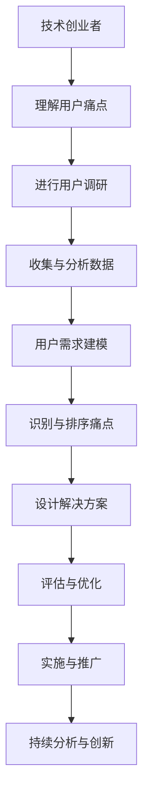

                 


### 文章标题：技术创业者如何进行有效的用户痛点分析

> 关键词：技术创业、用户痛点、分析技巧、解决方案设计

> 摘要：本文将深入探讨技术创业者如何进行有效的用户痛点分析，通过分步讲解用户痛点分析的理论基础、方法与技巧，帮助创业者设计出更贴近用户需求、更具创新性的解决方案，从而在激烈的市场竞争中脱颖而出。

### 目录大纲设计

#### 第一部分：引言与理论基础

**第1章：技术创业概述**

- **1.1 技术创业的定义与特征**
  - 技术创业的定义
  - 技术创业的主要特征
- **1.2 技术创业的挑战与机遇**
  - 技术创业面临的主要挑战
  - 技术创业所蕴含的机遇
- **1.3 技术创业的核心要素**
  - 创新技术的引入
  - 用户需求的理解
  - 商业模式的构建

**第2章：用户痛点分析的重要性**

- **2.1 用户痛点分析的定义**
  - 痛点的概念
  - 用户痛点分析的定义
- **2.2 用户痛点分析的价值**
  - 提升用户满意度
  - 促进产品迭代
  - 增强市场竞争力
- **2.3 用户痛点分析的方法论**
  - 分析流程
  - 分析方法

#### 第二部分：用户痛点分析的方法与技巧

**第3章：用户调研与数据收集**

- **3.1 用户调研的方法**
  - 调研工具选择
  - 调研流程
- **3.2 数据收集的渠道**
  - 网络调查
  - 用户访谈
  - 现场观察
- **3.3 数据整理与分析**
  - 数据清洗
  - 数据分析工具

**第4章：用户需求分析与建模**

- **4.1 用户需求分析的方法**
  - 用户需求分类
  - 需求分析方法
- **4.2 用户需求建模的理论基础**
  - 需求模型的概念
  - 需求建模的方法
- **4.3 用户需求建模的步骤**
  - 需求收集
  - 需求筛选
  - 需求分析

**第5章：痛点识别与优先级排序**

- **5.1 痛点识别的方法**
  - 数据驱动的痛点识别
  - 用户访谈的痛点识别
- **5.2 痛点优先级排序的策略**
  - 用户满意度分析
  - 痛点影响度分析
- **5.3 痛点优先级排序的工具**
  - SWOT分析
  - 敏感度分析

#### 第三部分：用户痛点解决方案设计

**第6章：痛点解决方案的设计思路**

- **6.1 痛点解决方案的设计原则**
  - 用户至上
  - 创新性
  - 实用性
- **6.2 痛点解决方案的可行性分析**
  - 技术可行性
  - 商业可行性
- **6.3 痛点解决方案的创新性探讨**
  - 市场需求分析
  - 技术创新策略

**第7章：痛点解决方案的评估与优化**

- **7.1 痛点解决方案的评估指标**
  - 用户满意度
  - 产品性能
  - 成本效益
- **7.2 痛点解决方案的优化方法**
  - 用户体验优化
  - 技术性能优化
- **7.3 痛点解决方案的迭代过程**
  - 用户反馈收集
  - 解决方案调整

**第8章：用户痛点解决方案的案例研究**

- **8.1 案例背景**
  - 案例公司简介
  - 案例产品背景
- **8.2 案例分析方法**
  - 数据分析方法
  - 实证研究方法
- **8.3 案例实施过程**
  - 用户调研与数据收集
  - 痛点分析与解决方案设计
  - 实施与推广
- **8.4 案例效果评估**
  - 用户满意度评估
  - 市场表现评估

#### 第四部分：综合运用与创业实践

**第9章：用户痛点分析在创业实践中的应用**

- **9.1 用户痛点分析在产品开发中的应用**
  - 产品规划
  - 产品设计
  - 产品迭代
- **9.2 用户痛点分析在市场推广中的应用**
  - 市场定位
  - 营销策略
  - 用户关系管理
- **9.3 用户痛点分析在团队协作中的应用**
  - 团队沟通
  - 项目管理
  - 团队文化建设

**第10章：技术创业者如何持续进行用户痛点分析**

- **10.1 用户痛点分析的持续方法**
  - 定期调研
  - 用户反馈机制
- **10.2 用户痛点分析的工具与技术**
  - 数据分析工具
  - 人工智能技术
- **10.3 用户痛点分析的创新与前瞻**
  - 技术发展趋势分析
  - 市场前瞻性研究

#### 附录

**附录A：用户痛点分析常用工具与资源**

- **A.1 用户调研与数据分析工具**
  - 调研问卷工具
  - 数据分析软件
- **A.2 用户需求分析与建模工具**
  - 需求分析软件
  - 用户行为分析工具
- **A.3 痛点识别与优先级排序工具**
  - 优先级排序软件
  - 痛点分析工具
- **A.4 其他相关资源与参考书籍**
  - 研究报告
  - 学术论文

**附录B：Mermaid流程图**



**附录C：核心算法原理讲解（伪代码）**

```python
# 用户需求分析建模的伪代码

# 输入：用户调研数据data
# 输出：用户需求模型model

function user_demand_modeling(data):
    # 数据预处理
    processed_data = preprocess_data(data)
    
    # 特征提取
    features = extract_features(processed_data)
    
    # 构建模型
    model = build_model(features)
    
    # 训练模型
    trained_model = train_model(model, features, data)
    
    # 模型评估
    evaluate_model(trained_model, processed_data)
    
    return trained_model
```

**附录D：数学模型与公式**

```latex
\section{用户需求分析数学模型}

\begin{equation}
    D = \sum_{i=1}^{n} w_i \cdot p_i
\end{equation}

其中，\( D \) 表示用户需求的总体满意度，\( w_i \) 表示第 \( i \) 个用户需求的权重，\( p_i \) 表示第 \( i \) 个用户需求的满意度。

\section{用户需求建模的公式}

\begin{equation}
    R = f(D, U)
\end{equation}

其中，\( R \) 表示用户需求的满足度，\( D \) 表示用户需求的总体满意度，\( U \) 表示用户需求的具体情况。
```

通过以上目录大纲的设计，我们可以清晰地看到文章的结构和内容安排，每一部分都紧密围绕着用户痛点分析的主题，确保文章内容充实、逻辑清晰、易于理解。接下来，我们将按照这个大纲逐步深入探讨技术创业者如何进行有效的用户痛点分析。

