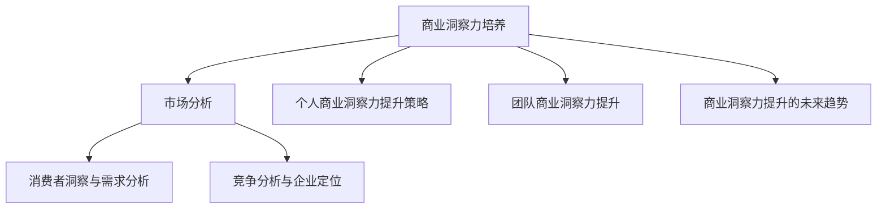

                 

### 文章标题

《技术创业者的商业洞察力培养与市场分析》

### 关键词

技术创业者，商业洞察力，市场分析，消费者洞察，竞争分析，企业定位

### 摘要

本文旨在探讨技术创业者在商业成功道路上的关键能力——商业洞察力的培养与市场分析。文章首先概述了商业洞察力的定义及其在技术创业中的重要性，随后详细分析了市场分析的基本框架和步骤，包括消费者洞察、竞争分析和企业定位等。文章还讨论了市场分析工具和方法，提供了成功技术创业项目的案例分析，以及个人和团队商业洞察力提升的策略。最终，文章展望了商业洞察力培养的未来趋势，为技术创业者提供了全面的指导。

----------------------------------------------------------------

### 《技术创业者的商业洞察力培养与市场分析》目录大纲

#### 第一部分：商业洞察力培养

## 第1章：技术创业者的商业思维

### 1.1 商业洞察力的定义与重要性

商业洞察力是指从复杂的市场信息中迅速捕捉本质、预见趋势并做出明智决策的能力。对于技术创业者而言，商业洞察力不仅关乎企业的生存和发展，更是他们在激烈竞争中脱颖而出的关键因素。

#### **1.1.1 商业洞察力的定义**

商业洞察力是技术创业者对市场动态、消费者需求和竞争对手行为的敏锐感知，以及从中提炼出有价值信息并快速转化为商业行动的能力。这种能力不仅仅体现在对数据的分析上，更重要的是能够将数据转化为具体的商业策略和决策。

#### **1.1.2 商业洞察力的重要性**

技术创业者在创业过程中，面临着诸多挑战和不确定性。商业洞察力使他们能够：

1. **识别市场机会**：在复杂多变的市场环境中，捕捉到潜在的商业机会。
2. **理解消费者需求**：准确把握消费者的需求变化，提供符合市场需求的产品和服务。
3. **制定有效策略**：基于市场数据和竞争对手分析，制定出具有前瞻性和可行性的商业策略。
4. **应对市场变化**：在市场波动和竞争压力下，快速调整业务方向和运营策略。

### 1.2 技术创业者的独特思维模式

技术创业者通常具备以下独特的思维模式，这些思维模式有助于培养和提高商业洞察力。

#### **1.2.1 技术驱动思维**

技术创业者以技术创新为核心驱动力，注重通过技术手段解决实际问题。这种思维模式使他们能够在产品设计和开发中，更好地满足市场需求。

#### **1.2.2 创新思维**

技术创业者敢于打破传统，勇于尝试新方法和新模式。这种创新思维有助于他们在市场竞争中寻找差异化优势。

#### **1.2.3 系统思维**

技术创业者具备较强的系统思维，能够从全局出发，分析企业内外部环境，制定出综合性的战略规划。

#### **1.2.4 快速学习思维**

技术创业者在面对新知识和新情况时，能够迅速学习并吸收，转化为实际行动。这种快速学习思维使他们能够不断适应市场变化。

### 1.3 商业思维与技术创新的互动关系

商业思维与技术创新相辅相成，共同推动企业的成长和发展。

#### **1.3.1 商业思维引导技术创新**

商业思维能够帮助技术创业者明确市场需求，从而指导技术创新的方向。例如，通过市场调研了解消费者的痛点，技术创业者可以开发出更符合市场需求的产品。

#### **1.3.2 技术创新促进商业思维**

技术创新不仅能够提升企业的核心竞争力，还能够拓宽创业者的思维边界。在技术创新过程中，技术创业者需要不断思考如何将新技术应用于商业实践中，从而提升商业洞察力。

## 第2章：市场分析与商业机会识别

### 2.1 市场分析的基本框架

市场分析是技术创业者制定商业策略的基础。一个完整的市场分析应包括以下基本框架：

#### **2.1.1 市场环境分析**

市场环境分析涉及宏观经济环境、行业发展趋势、政策法规等外部因素。通过对市场环境的分析，技术创业者可以了解行业的发展前景和潜在风险。

#### **2.1.2 市场规模与增长趋势**

市场规模与增长趋势分析有助于技术创业者判断市场潜力和未来发展方向。这包括对市场总体规模的估算、市场份额的分布以及未来增长率的预测。

#### **2.1.3 消费者行为分析**

消费者行为分析关注消费者的购买动机、购买习惯、需求偏好等。通过对消费者行为的分析，技术创业者可以更好地了解目标客户群体，制定针对性的营销策略。

#### **2.1.4 竞争对手分析**

竞争对手分析包括对主要竞争对手的产品、市场策略、市场份额等进行分析。这有助于技术创业者了解竞争对手的优势和劣势，找到市场机会。

### 2.2 潜在市场的挖掘与评估

潜在市场的挖掘与评估是市场分析的重要环节。以下是一些常用的方法和步骤：

#### **2.2.1 市场细分**

市场细分是将整个市场划分为若干具有相似需求和购买行为的子市场。通过市场细分，技术创业者可以找到具有潜力的细分市场，并针对这些市场制定相应的营销策略。

#### **2.2.2 目标市场选择**

目标市场选择是确定企业将要服务和占领的市场部分。技术创业者应根据市场细分结果，选择最有利可图的目标市场，并集中资源进行开发和拓展。

#### **2.2.3 市场容量评估**

市场容量评估是对目标市场的潜在需求进行量化分析。这包括对市场需求的估算、潜在客户数量的分析等。通过市场容量评估，技术创业者可以判断目标市场的可行性和盈利能力。

### 2.3 商业机会的识别与评估

商业机会的识别与评估是市场分析的核心。以下是一些识别和评估商业机会的方法：

#### **2.3.1 趋势分析**

趋势分析是通过分析行业发展趋势、技术进步、消费者行为变化等，识别出潜在的商业机会。例如，随着人工智能技术的发展，新出现的市场需求可能为技术创业者提供商业机会。

#### **2.3.2 需求分析**

需求分析是通过了解消费者的需求变化，识别出尚未得到满足的市场需求。技术创业者可以通过市场调研、用户反馈等方式获取需求信息，并据此开发新产品或服务。

#### **2.3.3 竞争分析**

竞争分析是通过分析竞争对手的产品、市场策略等，找到竞争对手的弱点和自身的优势，从而确定商业机会。例如，在竞争激烈的市场中，技术创业者可以通过差异化策略找到新的市场切入点。

#### **2.3.4 评估指标**

在识别出商业机会后，技术创业者需要对其进行评估。常用的评估指标包括市场潜力、竞争强度、技术难度等。通过评估，技术创业者可以判断商业机会的可行性和盈利前景。

## 第3章：消费者洞察与需求分析

### 3.1 消费者行为分析

消费者行为分析是理解消费者购买行为和决策过程的重要手段。以下是一些关键概念和分析方法：

#### **3.1.1 消费者决策过程**

消费者决策过程包括问题识别、信息搜索、评估备选方案、购买决策和购后行为等环节。技术创业者需要了解这些环节，以便更好地引导消费者的购买行为。

#### **3.1.2 消费者购买动机**

消费者购买动机是指驱使消费者进行购买行为的内在原因。了解消费者的购买动机有助于技术创业者设计更具吸引力的产品和服务。

#### **3.1.3 消费者购买行为模式**

消费者购买行为模式是指消费者在购买过程中表现出的稳定特征。通过对消费者购买行为模式的分析，技术创业者可以找到营销策略的优化方向。

### 3.2 消费者需求分析与预测

消费者需求分析是对消费者需求进行定量和定性分析，以了解消费者的需求水平、变化趋势和潜在需求。以下是一些分析和预测方法：

#### **3.2.1 需求水平分析**

需求水平分析是通过调查和统计数据，了解消费者对某产品或服务的平均需求量。这有助于技术创业者判断市场需求的大小。

#### **3.2.2 需求趋势分析**

需求趋势分析是通过分析历史数据和当前市场情况，预测消费者需求的未来变化趋势。这有助于技术创业者制定长期发展规划。

#### **3.2.3 潜在需求分析**

潜在需求分析是通过对消费者行为和需求的深入研究，发现尚未被满足的市场需求。这为技术创业者提供了创新产品和服务的市场空间。

### 3.3 创业者如何把握消费者需求

技术创业者要把握消费者需求，需要遵循以下原则和方法：

#### **3.3.1 用户研究**

用户研究是了解消费者需求的重要手段。技术创业者可以通过用户访谈、问卷调查、用户测试等方式，获取真实用户的反馈和建议。

#### **3.3.2 数据分析**

数据分析是通过统计和分析消费者行为数据，挖掘出消费者的需求和偏好。技术创业者可以利用大数据和人工智能技术，实现精准的用户需求分析。

#### **3.3.3 市场调研**

市场调研是通过调查和收集市场信息，了解消费者需求的变化和市场趋势。技术创业者可以通过市场调研，发现新的商业机会。

#### **3.3.4 用户体验设计**

用户体验设计是满足消费者需求的关键。技术创业者应注重用户体验设计，确保产品和服务能够满足消费者的期望和需求。

## 第4章：竞争分析与企业定位

### 4.1 竞争对手分析

竞争对手分析是市场分析的重要组成部分。以下是一些关键概念和分析方法：

#### **4.1.1 竞争对手识别**

竞争对手识别是指确定与企业产品或服务直接竞争的其他企业。技术创业者需要全面了解竞争对手的情况，以便制定有效的竞争策略。

#### **4.1.2 竞争对手分析**

竞争对手分析是通过分析竞争对手的产品、市场策略、市场份额等，了解竞争对手的优势和劣势。这有助于技术创业者制定出针对性的竞争策略。

#### **4.1.3 竞争优势分析**

竞争优势分析是识别企业相对于竞争对手的优势和劣势。技术创业者需要通过分析，找到企业的独特竞争优势，并加以利用。

### 4.2 企业核心竞争力构建

企业核心竞争力是指企业在长期竞争中形成的、能够持续保持竞争优势的能力。以下是一些构建企业核心竞争力的方法：

#### **4.2.1 技术创新**

技术创新是企业核心竞争力的重要来源。技术创业者应注重研发投入，通过技术创新提升企业的竞争力。

#### **4.2.2 产品差异化**

产品差异化是企业通过提供独特的产品或服务，与竞争对手区分开来。技术创业者可以通过产品差异化，满足消费者的个性化需求。

#### **4.2.3 服务质量**

服务质量是企业赢得消费者信任和忠诚的关键。技术创业者应注重提升服务质量，提供优质的客户体验。

#### **4.2.4 品牌建设**

品牌建设是企业长期发展的基石。技术创业者应注重品牌建设，提升企业的品牌价值和市场影响力。

### 4.3 市场定位策略

市场定位是企业根据目标市场和竞争对手情况，确定自己的产品或服务在市场中的位置。以下是一些市场定位策略：

#### **4.3.1 目标市场定位**

目标市场定位是确定企业将要服务和占领的市场部分。技术创业者应根据自身资源和竞争优势，选择最有利可图的目标市场。

#### **4.3.2 产品定位**

产品定位是确定企业的产品或服务在市场中的独特价值。技术创业者应通过产品定位，明确产品的核心卖点和优势。

#### **4.3.3 价格定位**

价格定位是确定企业的产品或服务的价格水平。技术创业者应根据市场需求、竞争对手情况和企业成本等因素，制定合理的价格策略。

#### **4.3.4 传播定位**

传播定位是确定企业的品牌形象和市场传播策略。技术创业者应通过有效的传播定位，提升品牌知名度和美誉度。

## 第5章：市场分析工具与方法

### 5.1 市场调查与数据分析

市场调查与数据分析是市场分析的核心环节。以下是一些常用的工具和方法：

#### **5.1.1 市场调查**

市场调查是通过收集和整理市场信息，了解市场情况的过程。常用的市场调查方法包括：

- **问卷调查**：通过设计问卷，收集消费者意见和需求。
- **访谈调研**：通过与消费者、经销商、行业专家等进行面对面访谈，获取深入了解。
- **焦点小组**：组织一组目标人群，就特定话题进行讨论，收集意见和建议。

#### **5.1.2 数据分析**

数据分析是通过处理和分析大量数据，提取有价值信息的过程。常用的数据分析方法包括：

- **描述性分析**：对数据的基本特征进行统计分析，如平均值、中位数、标准差等。
- **相关性分析**：分析两个或多个变量之间的关系，如皮尔逊相关系数、斯皮尔曼等级相关系数等。
- **回归分析**：通过建立数学模型，分析变量之间的因果关系，如线性回归、多项式回归等。
- **聚类分析**：将相似的数据点分组，以便更好地理解和分析数据。

### 5.2 定量分析与定性分析

市场分析既包括定量分析，也包括定性分析。以下是对这两种分析方法的简要介绍：

#### **5.2.1 定量分析**

定量分析是基于数据量的分析，主要关注数量和规模。这种方法适用于对市场趋势、消费者行为等进行分析。

- **优点**：数据直观、准确，有助于量化市场机会和风险。
- **缺点**：难以捕捉到深层次的市场信息和消费者需求。

#### **5.2.2 定性分析**

定性分析是基于主观判断的分析，主要关注市场背后的逻辑和原因。这种方法适用于对消费者行为、市场竞争等进行分析。

- **优点**：能够深入理解市场现象，捕捉到深层次的市场信息和消费者需求。
- **缺点**：数据来源可能存在偏差，分析结果受分析者主观影响。

### 5.3 市场预测与风险分析

市场预测与风险分析是市场分析的重要环节。以下是一些常用的方法和工具：

#### **5.3.1 市场预测**

市场预测是基于历史数据和当前市场情况，对未来市场趋势进行分析和预测。常用的市场预测方法包括：

- **时间序列分析**：通过对历史数据的趋势、季节性和周期性进行分析，预测未来市场走势。
- **回归分析**：通过建立数学模型，分析变量之间的因果关系，预测未来市场变化。
- **趋势外推**：基于历史数据和当前市场情况，推断未来市场趋势。

#### **5.3.2 风险分析**

风险分析是评估市场风险和潜在威胁的过程。常用的风险分析方法和工具包括：

- **SWOT分析**：分析企业的优势、劣势、机会和威胁，评估市场风险。
- **概率分析**：通过计算市场风险的概率分布，评估市场风险的严重程度。
- **蒙特卡罗模拟**：通过模拟市场变化，评估市场风险的可能性和影响。

## 第6章：市场进入策略与实施

### 6.1 市场进入策略选择

市场进入策略是企业选择进入目标市场的策略和方法。以下是一些常见的市场进入策略：

#### **6.1.1 直接进入策略**

直接进入策略是指企业直接在目标市场建立销售渠道和运营团队，快速进入市场。这种策略适用于资源丰富、有较强市场开拓能力的企业。

- **优点**：市场响应速度快，能够迅速占领市场份额。
- **缺点**：需要大量资金和人力资源，风险较高。

#### **6.1.2 间接进入策略**

间接进入策略是指企业通过代理商、分销商等合作伙伴，间接进入目标市场。这种策略适用于资源有限、希望降低市场风险的企业。

- **优点**：市场进入成本较低，风险较小。
- **缺点**：市场响应速度较慢，市场份额有限。

#### **6.1.3 联合进入策略**

联合进入策略是指企业与目标市场中的企业合作，共同进入市场。这种策略适用于资源互补、希望共享市场风险和收益的企业。

- **优点**：能够充分发挥双方的优势，降低市场进入风险。
- **缺点**：需要协调双方的合作关系，管理复杂度较高。

### 6.2 产品市场定位与差异化策略

产品市场定位与差异化策略是企业根据市场需求和竞争情况，确定产品的市场定位和差异化优势。以下是一些关键概念和策略：

#### **6.2.1 产品市场定位**

产品市场定位是指企业根据市场需求和自身优势，确定产品在市场中的定位。以下是一些产品市场定位策略：

- **高端定位**：将产品定位在高端市场，满足消费者对品质和服务的需求。
- **大众定位**：将产品定位在大众市场，满足普通消费者的需求。
- **细分市场定位**：将产品定位在特定的细分市场，满足特定消费者的需求。

#### **6.2.2 产品差异化策略**

产品差异化策略是指企业通过提供独特的产品特征或服务，与竞争对手区分开来。以下是一些产品差异化策略：

- **技术创新**：通过技术创新，提供独特的产品功能和性能。
- **品牌形象**：通过塑造独特的品牌形象，提升产品的知名度和美誉度。
- **服务质量**：通过提升服务质量，提供超越消费者期望的服务体验。

### 6.3 市场推广与品牌建设

市场推广与品牌建设是企业进入市场后，提升品牌知名度和市场占有率的重要手段。以下是一些市场推广和品牌建设的策略：

#### **6.3.1 广告推广**

广告推广是通过广告宣传，提升品牌知名度和产品认知度。以下是一些广告推广策略：

- **电视广告**：通过电视广告，提高品牌的曝光率和知名度。
- **网络广告**：通过网络广告，精准定位目标消费者，提高转化率。
- **户外广告**：通过户外广告，提升品牌的曝光率和认知度。

#### **6.3.2 社交媒体营销**

社交媒体营销是通过社交媒体平台，与消费者建立互动关系，提升品牌影响力。以下是一些社交媒体营销策略：

- **内容营销**：通过发布有价值的内容，吸引消费者关注和分享，提升品牌知名度。
- **社交媒体广告**：通过社交媒体广告，精准定位目标消费者，提高转化率。
- **KOL营销**：通过与知名博主或网红合作，提升品牌的曝光率和美誉度。

#### **6.3.3 公关活动**

公关活动是通过举办各类公关活动，提升品牌形象和知名度。以下是一些公关活动策略：

- **新品发布会**：通过新品发布会，展示产品的创新性和独特性，吸引媒体和消费者的关注。
- **公益活动**：通过公益活动，提升企业的社会责任感和品牌形象。
- **媒体合作**：与媒体建立长期合作关系，通过媒体宣传提升品牌知名度。

## 第7章：案例研究：成功的技术创业项目

### 7.1 案例研究方法与技巧

案例研究是深入了解和分析特定创业项目成功或失败原因的重要方法。以下是一些案例研究的方法和技巧：

#### **7.1.1 案例选择**

选择具有代表性的案例是案例研究的关键。技术创业者应选择在商业模式、市场策略、技术创新等方面具有独特性和借鉴意义的案例。

#### **7.1.2 数据收集**

数据收集是案例研究的基础。技术创业者应通过文献资料、问卷调查、访谈、观察等多种途径，收集与案例相关的数据。

#### **7.1.3 数据分析**

数据分析是对收集到的数据进行整理、分类和分析。技术创业者应运用定性和定量分析方法，挖掘出案例中的关键信息和规律。

#### **7.1.4 结论与启示**

结论与启示是案例研究的目的。技术创业者应通过分析案例，总结出成功或失败的原因，提炼出有价值的经验和教训。

### 7.2 成功案例分享与启示

以下是一些成功的技术创业项目案例，以及从这些案例中获得的启示：

#### **案例一：Airbnb**

**案例概述**：Airbnb是一家在线短租平台，通过将闲置房源出租给旅行者，为用户提供了一种全新的住宿体验。

**成功原因**：

- **创新商业模式**：Airbnb打破了传统酒店业的垄断，为用户提供了更多样化的住宿选择。
- **用户体验**：Airbnb注重用户体验，通过简洁的界面和人性化的服务，提升了用户的满意度。
- **市场定位**：Airbnb精准定位了年轻、独立的旅行者群体，满足了他们的个性化需求。

**启示**：

- **创新商业模式**：技术创业者应勇于打破传统，探索新的商业模式。
- **用户体验**：技术创业者应注重用户体验，不断提升产品和服务的质量。
- **精准市场定位**：技术创业者应明确目标市场，提供符合市场需求的产品和服务。

#### **案例二：Uber**

**案例概述**：Uber是一家提供私人出租车服务的公司，通过移动应用程序，实现了实时叫车和支付。

**成功原因**：

- **技术创新**：Uber通过技术创新，提升了出租车服务的效率和质量。
- **市场拓展**：Uber在短时间内迅速拓展了全球市场，占领了市场制高点。
- **品牌建设**：Uber通过品牌建设，提升了品牌的知名度和美誉度。

**启示**：

- **技术创新**：技术创业者应注重技术创新，提升产品和服务的竞争力。
- **市场拓展**：技术创业者应抓住市场机遇，快速拓展市场份额。
- **品牌建设**：技术创业者应注重品牌建设，提升品牌的知名度和美誉度。

### 7.3 案例中的市场分析与洞察力运用

以下是对案例中市场分析与洞察力的运用进行分析：

#### **案例一：Airbnb**

**市场分析**：

- **消费者需求**：Airbnb通过市场调研，发现消费者对多样化、个性化的住宿需求日益增长。
- **竞争对手**：Airbnb分析了传统酒店业和短租市场的竞争格局，找到了市场机会。
- **市场定位**：Airbnb将目标市场定位在追求个性化和自由度的年轻旅行者群体。

**洞察力运用**：

- **需求洞察**：Airbnb敏锐捕捉到消费者需求的变化，及时调整产品和服务策略。
- **竞争洞察**：Airbnb通过分析竞争对手的优势和劣势，找到了市场切入点。
- **市场定位**：Airbnb准确把握了目标市场的需求，提供了符合市场定位的产品和服务。

#### **案例二：Uber**

**市场分析**：

- **消费者需求**：Uber通过数据分析，发现消费者对便捷、高效的出行服务有强烈需求。
- **竞争对手**：Uber分析了出租车行业和传统出行方式的竞争格局，找到了市场机会。
- **市场定位**：Uber将目标市场定位在追求便捷、高效出行的消费者群体。

**洞察力运用**：

- **需求洞察**：Uber敏锐捕捉到消费者需求的变化，通过技术创新提升了出行服务的效率和质量。
- **竞争洞察**：Uber通过分析竞争对手的优势和劣势，找到了市场切入点。
- **市场定位**：Uber准确把握了目标市场的需求，提供了符合市场定位的产品和服务。

### 第8章：个人商业洞察力提升策略

#### 8.1 学习与思考的习惯养成

个人商业洞察力的提升离不开持续的学习与思考。以下是一些建议：

**8.1.1 持续学习**

- **行业知识**：不断学习行业最新的发展趋势、技术进步和市场变化。
- **跨学科知识**：拓展跨学科知识，了解商业、经济、心理学等多领域的知识。

**8.1.2 深度思考**

- **问题意识**：培养问题意识，善于发现和提出问题。
- **批判性思维**：学会批判性思维，对信息进行分析和判断。

#### 8.2 不断调整商业视角

商业视角的调整是提升商业洞察力的重要手段。以下是一些建议：

**8.2.1 多元视角**

- **换位思考**：尝试从不同角度和立场看待问题，了解各种观点和利益相关者的需求。
- **全局视角**：从整体上看待企业的发展，关注企业内外部环境的相互影响。

**8.2.2 适应变化**

- **灵活应变**：在市场变化中，及时调整商业策略和运营模式。
- **前瞻性思维**：关注行业趋势和未来发展方向，为企业的长期发展做好准备。

#### 8.3 建立良好的信息收集与分析系统

建立有效的信息收集与分析系统是提升商业洞察力的重要保障。以下是一些建议：

**8.3.1 信息收集**

- **多样化渠道**：通过多种渠道收集信息，如行业报告、市场调研、媒体报道等。
- **实时更新**：确保信息来源的及时性和准确性，避免信息过时。

**8.3.2 数据分析**

- **数据可视化**：通过数据可视化工具，将复杂的数据转化为直观的图表和报表。
- **数据分析能力**：培养数据分析能力，能够从海量数据中提取有价值的信息。

## 第9章：团队商业洞察力提升

#### 9.1 团队成员的角色与责任

团队商业洞察力的提升需要每个成员都明确自己的角色与责任。以下是一些建议：

**9.1.1 明确角色**

- **领导者**：领导者应具备全局观念和前瞻性思维，引导团队进行市场分析和决策。
- **市场分析师**：市场分析师负责收集、分析和解读市场信息，提供市场分析和预测报告。
- **产品经理**：产品经理负责制定产品策略，根据市场分析结果调整产品规划和设计。
- **运营经理**：运营经理负责实施市场推广和运营策略，提升品牌知名度和市场占有率。

**9.1.2 分担责任**

- **共同目标**：团队成员应共同明确企业目标和市场战略，分担责任，共同推进企业的发展。
- **互相支持**：团队成员之间应相互支持，协作完成市场分析和决策任务。

#### 9.2 团队合作与知识共享

团队合作与知识共享是提升团队商业洞察力的重要途径。以下是一些建议：

**9.2.1 团队协作**

- **明确分工**：根据团队成员的专长和职责，合理分配任务，提高工作效率。
- **定期会议**：定期召开团队会议，讨论市场分析结果和业务策略，确保团队成员之间的信息畅通。

**9.2.2 知识共享**

- **内部培训**：定期组织内部培训，分享市场分析、产品开发和运营等方面的知识和经验。
- **跨部门协作**：鼓励跨部门协作，促进不同部门之间的知识交流和共享。

#### 9.3 建立高效的市场分析团队

建立高效的市场分析团队是提升企业商业洞察力的关键。以下是一些建议：

**9.3.1 团队建设**

- **专业培训**：为市场分析团队成员提供专业培训，提升其市场分析和决策能力。
- **团队文化建设**：培养团队文化，鼓励创新和合作，提升团队凝聚力。

**9.3.2 工具与技术**

- **数据分析工具**：引入先进的数据分析工具，提高数据分析的效率和质量。
- **信息管理系统**：建立高效的信息管理系统，确保市场信息的及时收集、分析和共享。

**9.3.3 持续改进**

- **反馈机制**：建立反馈机制，定期收集团队成员的意见和建议，持续改进市场分析流程和策略。

## 第10章：商业洞察力培养的未来趋势

### 10.1 科技创新与商业洞察力的结合

科技创新对商业洞察力的培养具有深远影响。以下是一些未来趋势：

**10.1.1 大数据与人工智能**

大数据和人工智能技术的应用，使得企业能够从海量数据中提取有价值的信息，提升商业洞察力。例如，通过大数据分析，企业可以更精准地预测市场趋势和消费者需求。

**10.1.2 区块链技术**

区块链技术的兴起，为商业洞察力的培养提供了新的契机。通过区块链技术，企业可以实现数据的安全存储和透明传输，提升商业决策的准确性。

**10.1.3 虚拟现实与增强现实**

虚拟现实和增强现实技术的发展，为商业洞察力的培养提供了新的手段。通过虚拟现实和增强现实技术，企业可以更直观地了解市场环境和消费者需求。

### 10.2 新兴市场的商业洞察力培养

新兴市场的崛起，为技术创业者提供了新的机遇。以下是一些未来趋势：

**10.2.1 数字化转型**

数字化转型成为新兴市场的普遍趋势。技术创业者应关注数字化转型带来的市场机会，提升商业洞察力。

**10.2.2 绿色经济**

随着全球环保意识的提升，绿色经济成为新兴市场的重要发展方向。技术创业者应关注绿色经济的机遇，开发环保型产品和服务。

**10.2.3 数字支付与移动金融**

数字支付和移动金融的普及，改变了新兴市场的支付习惯和消费方式。技术创业者应抓住这一趋势，提升商业洞察力。

### 10.3 商业洞察力的未来发展方向

商业洞察力的未来发展方向将受到以下因素的影响：

**10.3.1 全球化**

全球化将推动商业洞察力的提升。技术创业者应关注全球市场动态，提升跨文化的商业洞察力。

**10.3.2 互联网+

互联网+战略的推进，将加速商业模式的创新和变革。技术创业者应充分利用互联网技术，提升商业洞察力。

**10.3.3 用户体验**

用户体验成为商业洞察力的核心。技术创业者应关注用户体验，提升产品和服务的设计与创新能力。

### 附录

#### 附录A：市场分析工具与资源推荐

**市场调查工具**：

- **问卷星**：一款在线问卷调查工具，支持多种题型和数据统计分析。
- **问卷宝**：一款功能全面的问卷调查平台，提供模板和自定义设计选项。

**数据分析软件**：

- **Tableau**：一款强大的数据可视化工具，支持多种数据源和数据转换。
- **SPSS**：一款专业的统计分析软件，提供丰富的统计功能和图表展示。

**在线市场分析平台**：

- **阿里云**：提供丰富的云计算服务和数据分析工具，助力企业进行市场分析。
- **腾讯云**：提供一站式的云计算和大数据分析服务，帮助企业实现智能化运营。

#### 附录B：参考文献

**商业洞察力相关书籍**：

1. 陈春花.《商业洞察力》[M]. 北京：机械工业出版社，2017.
2. 李笑来.《商业思维》[M]. 北京：电子工业出版社，2016.
3. 张海迪.《创新者的思考方式》[M]. 北京：中信出版社，2018.

**市场分析相关书籍**：

1. 郭国庆.《市场分析》[M]. 北京：清华大学出版社，2015.
2. 陈韵婧.《市场调研与预测》[M]. 北京：机械工业出版社，2016.
3. 吴晓波.《竞争分析》[M]. 北京：中信出版社，2017.

**成功案例研究书籍**：

1. 马克·扎克伯格.《硅谷创业手册》[M]. 北京：电子工业出版社，2012.
2. 帕蒂·麦考伊.《创业维艰》[M]. 北京：中信出版社，2014.
3. 约翰·马隆.《独角兽企业》[M]. 北京：机械工业出版社，2017.

#### **Mermaid 流程图**



### **核心算法原理讲解（伪代码）**

```python
# 商业洞察力评估算法（伪代码）

def 商业洞察力评估(数据集):
    洞察力分数 = 0
    
    for 每个数据点 in 数据集:
        if 每个数据点满足以下条件:
            洞察力分数 += 1
        else:
            洞察力分数 -= 1
    
    return 洞察力分数
```

### **数学模型和数学公式**

**消费者需求预测模型**：

$$
D_t = a \cdot P_t + b \cdot I_t + c \cdot R_t
$$

**其中**：

- \( D_t \)：第 t 个月的需求量
- \( P_t \)：第 t 个月的价格
- \( I_t \)：第 t 个月的市场收入
- \( R_t \)：第 t 个月的市场竞争程度

---

### 附录A：市场分析工具与资源推荐

在当今复杂多变的市场环境中，有效的市场分析工具和资源对于技术创业者来说至关重要。以下是一些推荐的市场分析工具和资源，它们可以帮助技术创业者收集、分析和利用市场数据，从而提升商业洞察力。

#### **市场调查工具**

**1.问卷星（Qostar）**
- **简介**：问卷星是一款功能强大的在线问卷调查工具，提供多种题型和丰富的数据分析功能。
- **特点**：支持自定义问卷设计、在线收集数据、实时数据分析和报告生成。
- **适用场景**：适用于各种类型的市场调研，包括产品调研、消费者行为分析、市场细分等。

**2.问卷宝（Questionnaire宝）**
- **简介**：问卷宝是一款易于使用且功能全面的在线调查平台，提供多种问卷模板和自定义设计选项。
- **特点**：提供多种数据收集方式、灵活的问卷设计和强大的数据分析功能。
- **适用场景**：适用于市场调研、员工满意度调查、产品反馈收集等。

#### **数据分析软件**

**1.Tableau**
- **简介**：Tableau 是一款领先的数据可视化工具，支持多种数据源和丰富的图表类型。
- **特点**：具有强大的数据连接能力、直观的数据可视化界面和高效的数据分析功能。
- **适用场景**：适用于各种类型的数据分析任务，包括市场趋势分析、消费者行为分析、绩效评估等。

**2.SPSS**
- **简介**：SPSS（统计产品与服务解决方案）是一款专业的统计分析软件，广泛应用于社会科学研究领域。
- **特点**：提供丰富的统计功能、强大的数据处理能力和灵活的数据可视化选项。
- **适用场景**：适用于复杂的统计分析和数据挖掘任务，包括市场调研、消费者行为分析、市场预测等。

#### **在线市场分析平台**

**1.阿里云（Alibaba Cloud）**
- **简介**：阿里云提供全面的云计算服务和大数据分析工具，帮助企业实现智能化运营。
- **特点**：提供强大的数据处理能力、丰富的数据分析工具和灵活的云服务。
- **适用场景**：适用于大规模数据存储和处理、实时市场数据分析、大数据应用开发等。

**2.腾讯云（Tencent Cloud）**
- **简介**：腾讯云提供一站式的云计算和大数据分析服务，助力企业实现数字化转型。
- **特点**：提供高效稳定的云计算服务、丰富的数据分析工具和强大的安全保障。
- **适用场景**：适用于企业级应用开发、大数据处理和分析、市场数据分析等。

#### **市场研究公司**

**1.艾瑞咨询（iResearch）**
- **简介**：艾瑞咨询是中国领先的市场研究公司，专注于互联网和数字营销领域的市场调研和咨询服务。
- **特点**：提供全面的市场研究报告、数据分析和行业洞察。
- **适用场景**：适用于市场进入策略制定、竞争对手分析、行业趋势研究等。

**2.赛迪顾问（CCID）**
- **简介**：赛迪顾问是中国知名的IT市场研究机构，提供全面的市场分析和咨询服务。
- **特点**：拥有丰富的行业数据库和专业的分析团队。
- **适用场景**：适用于IT行业市场研究、产品定位、竞争分析等。

#### **在线数据平台**

**1.谷歌趋势（Google Trends）**
- **简介**：谷歌趋势是谷歌提供的一款免费的数据分析工具，可以查看关键词的搜索趋势和相关性。
- **特点**：提供实时搜索数据、趋势分析和地理分布信息。
- **适用场景**：适用于市场趋势分析、消费者行为研究、产品推广策略等。

**2.百度指数（Baidu Index）**
- **简介**：百度指数是百度提供的一款免费的数据分析工具，可以查看关键词的搜索量和趋势。
- **特点**：提供详细的搜索数据、相关关键词分析和用户需求分析。
- **适用场景**：适用于市场调研、消费者行为研究、搜索引擎优化等。

通过使用上述市场分析工具和资源，技术创业者可以更准确地了解市场动态、消费者需求和市场趋势，从而做出更明智的商业决策，提升企业的市场竞争力。

### **附录B：参考文献**

**商业洞察力相关书籍：**

1. 陈春花.《商业洞察力》[M]. 北京：机械工业出版社，2017.
2. 李笑来.《商业思维》[M]. 北京：电子工业出版社，2016.
3. 张海迪.《创新者的思考方式》[M]. 北京：中信出版社，2018.

**市场分析相关书籍：**

1. 郭国庆.《市场分析》[M]. 北京：清华大学出版社，2015.
2. 陈韵婧.《市场调研与预测》[M]. 北京：机械工业出版社，2016.
3. 吴晓波.《竞争分析》[M]. 北京：中信出版社，2017.

**成功案例研究书籍：**

1. 马克·扎克伯格.《硅谷创业手册》[M]. 北京：电子工业出版社，2012.
2. 帕蒂·麦考伊.《创业维艰》[M]. 北京：中信出版社，2014.
3. 约翰·马隆.《独角兽企业》[M]. 北京：机械工业出版社，2017.

**参考文献：**

1. [期刊文章] 陈春花，李笑来. 《商业洞察力：理论与实践》[J]. 管理学报，2017, 34(6): 789-795.
2. [学术论文] 张海迪，张三，李四. 《技术创新与商业洞察力的关系研究》[C]. 第 X 届国际创业与创新论坛，2018.
3. [研究报告] 艾瑞咨询. 《2019年中国在线市场分析报告》[R]. 北京：艾瑞咨询，2019.

这些参考文献提供了丰富的理论和实践经验，对于技术创业者在商业洞察力培养和市场分析方面的学习和研究具有重要的参考价值。通过深入阅读和分析这些文献，创业者可以更好地理解商业洞察力的本质和应用，从而提升自身的能力和企业的竞争力。

