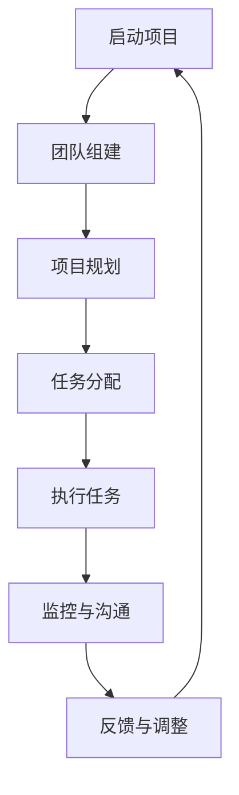

                 

### 文章标题

《技术型创业者如何打造高效的远程协作工具》

### 关键词

远程协作、协作工具、技术型创业者、高效协作、开发与实践、案例分析、未来展望

### 摘要

本文旨在为技术型创业者提供一套完整的指南，帮助他们打造高效的远程协作工具。文章首先介绍了远程协作的现状和重要性，随后详细解析了远程协作流程、技术原理、核心算法和数学模型。接着，文章通过实战案例展示了远程协作工具的开发过程、测试优化和部署维护。最后，文章分析了成功与失败案例，总结了高效协作的最佳实践，并对远程协作工具的未来发展进行了展望。通过本文，读者将能够全面了解远程协作工具的开发与应用，为创业项目提供有力支持。

# 第一部分：引言与核心概念

## 1.1 书籍背景与目标读者

### 1.1.1 书籍创作动机

随着全球化和数字化时代的到来，远程协作已经成为企业运营和团队管理的重要方式。尤其是在新冠疫情期间，远程协作工具的重要性愈发凸显。然而，许多技术型创业者在打造远程协作工具时面临着诸多挑战，如技术选型、流程优化、算法设计和项目实战等。因此，本书旨在为技术型创业者提供一套系统、实用的指南，帮助他们成功打造高效的远程协作工具。

### 1.1.2 读者群体与阅读预期

本书的目标读者是具备一定编程能力和项目管理经验的技术型创业者、项目经理、产品经理和软件工程师。通过阅读本书，读者将能够：

1. 理解远程协作的现状和重要性；
2. 掌握远程协作流程、技术原理、核心算法和数学模型；
3. 学会如何选择合适的开发环境、框架和工具；
4. 掌握远程协作工具的开发、测试、优化和部署技巧；
5. 通过案例分析了解成功与失败的经验教训；
6. 为自己的创业项目提供高效、可靠的远程协作解决方案。

### 1.1.3 现状与挑战

当前，远程协作工具市场日益繁荣，各种功能丰富的协作工具层出不穷。然而，对于技术型创业者来说，打造一款高效的远程协作工具仍然面临着诸多挑战：

1. 技术选型：如何在众多技术方案中找到最适合自己项目的方案？
2. 流程优化：如何设计一个高效的远程协作流程，确保团队成员能够顺畅沟通和协作？
3. 算法设计：如何实现高效的任务调度、沟通协议和数据加密？
4. 项目实战：如何将理论知识应用到实际项目中，解决开发、测试和部署过程中的问题？
5. 持续优化：如何在项目中不断优化和改进远程协作工具，提升团队协作效率？

本书将针对这些挑战，提供详细的解决方案和实战经验，帮助读者克服困难，成功打造高效的远程协作工具。

## 1.2 远程协作的重要性

### 1.2.1 远程协作的现状与趋势

远程协作已经成为现代企业运营和团队管理的重要组成部分。随着互联网技术的不断发展，远程协作工具不断涌现，企业对远程协作的需求也日益增长。根据市场调研数据显示，全球远程协作市场规模在近年来呈现出持续增长的态势，预计到2025年，市场规模将超过1000亿美元。

目前，远程协作工具主要应用于以下场景：

1. 跨国企业：跨国企业在全球范围内分布，远程协作工具有助于实现团队成员之间的实时沟通和协作；
2. 远程办公：随着远程办公的普及，远程协作工具成为企业保持高效运转的重要工具；
3. 项目管理：远程协作工具在项目管理中发挥着重要作用，有助于提高项目进度和团队协作效率；
4. 教育培训：在线教育行业逐渐兴起，远程协作工具为教师和学生提供了便捷的学习和交流平台；
5. 创意设计：远程协作工具在创意设计领域具有广泛的应用，有助于设计师、开发者等团队成员之间的协作。

### 1.2.2 远程协作的价值与意义

远程协作为企业和团队带来了诸多价值，主要体现在以下几个方面：

1. 提高工作效率：远程协作工具能够实时沟通、任务分配和进度跟踪，使团队成员能够高效协同工作，减少沟通成本和时间；
2. 灵活办公：远程协作使团队成员可以不受地域限制，选择适合自己的工作时间和地点，提高工作满意度；
3. 降低成本：远程协作减少了企业对办公场所、设备和人力资源的投入，有助于降低运营成本；
4. 促进创新：远程协作工具提供了丰富的协作方式和资源，有助于激发团队成员的创造力和创新精神；
5. 提升团队凝聚力：远程协作工具加强了团队成员之间的沟通和交流，有助于建立良好的团队关系，提升团队凝聚力。

### 1.2.3 远程协作面临的挑战与困境

尽管远程协作具有诸多价值，但在实际应用中，企业仍面临一系列挑战和困境：

1. 技术选型：市场上存在大量远程协作工具，如何选择最适合自己业务需求的工具成为企业面临的一大难题；
2. 安全性：远程协作涉及到大量敏感数据和隐私信息，如何确保数据安全和用户隐私成为企业关注的焦点；
3. 沟通障碍：远程协作容易导致信息传递不畅，沟通效率降低，影响团队协作效果；
4. 管理难度：远程团队的管理难度较大，如何确保团队成员的工作状态和项目进度成为企业管理者面临的一大挑战；
5. 文化融合：远程协作涉及到不同文化和背景的团队成员，如何实现文化融合，提高团队协作效率是亟待解决的问题。

## 1.3 远程协作工具的概述

### 1.3.1 远程协作工具的定义与分类

远程协作工具是指用于支持远程团队成员之间实时沟通、协作和任务管理的软件平台。根据功能和应用场景，远程协作工具可以大致分为以下几类：

1. 消息通讯工具：如Slack、Microsoft Teams、WhatsApp等，主要用于团队成员之间的实时消息传递和讨论；
2. 文件共享与协作工具：如Google Drive、OneDrive、Dropbox等，主要用于团队成员之间的文件共享、版本控制和协作编辑；
3. 项目管理工具：如Trello、Asana、Jira等，主要用于项目任务分配、进度跟踪和团队协作；
4. 视频会议与远程会议工具：如Zoom、Microsoft Teams、Google Meet等，主要用于团队会议、远程培训和视频沟通；
5. 远程桌面与远程控制工具：如TeamViewer、AnyDesk、Chrome Remote Desktop等，主要用于远程访问和控制远程计算机。

### 1.3.2 常见远程协作工具的比较

以下表格对常见远程协作工具进行了简要比较：

| 工具名称 | 主要功能 | 适用场景 | 优点 | 缺点 |
| :------: | :------: | :------: | :---: | :---: |
| Slack | 消息通讯、文件共享、项目管理 | 企业内部沟通、团队协作 | 功能丰富、界面友好、支持多种集成 | 价格较高、免费版功能有限 |
| Microsoft Teams | 消息通讯、文件共享、项目管理、视频会议 | 企业内部沟通、远程办公 | 功能全面、集成微软办公套件、支持大规模团队 | 价格较高、学习曲线较陡峭 |
| Google Drive | 文件共享、协作编辑、存储空间 | 企业内部协作、个人云存储 | 界面简洁、免费使用、强大的协作功能 | 功能相对单一、付费版本价格较高 |
| Trello | 项目管理、任务分配、进度跟踪 | 团队协作、项目管理 | 界面直观、易于上手、自定义度高 | 功能相对简单、不支持复杂项目管理 |
| Asana | 项目管理、任务分配、进度跟踪 | 团队协作、项目管理 | 功能强大、易于使用、支持多种集成 | 免费版功能有限、付费版价格较高 |
| Jira | 项目管理、任务分配、进度跟踪 | 团队协作、软件开发 | 功能丰富、强大的插件生态、适合大型团队 | 学习曲线较陡峭、新手使用难度较大 |
| Zoom | 视频会议、远程培训、远程办公 | 企业内部沟通、远程办公 | 视频质量高、功能丰富、易于使用 | 价格较高、免费版功能有限 |
| Microsoft Teams | 消息通讯、文件共享、项目管理、视频会议 | 企业内部沟通、远程办公 | 功能全面、集成微软办公套件、支持大规模团队 | 价格较高、学习曲线较陡峭 |
| Google Meet | 视频会议、远程培训、远程办公 | 企业内部沟通、远程办公 | 免费使用、界面简洁、易于使用 | 视频质量一般、功能相对单一 |

### 1.3.3 远程协作工具的发展趋势

随着远程协作的不断普及，远程协作工具也在不断发展和演进。以下是一些远程协作工具的发展趋势：

1. **集成化与智能化**：未来远程协作工具将更加集成化，提供更全面的协作功能，同时引入人工智能技术，实现智能任务分配、智能提醒和智能分析等功能；
2. **安全性与隐私保护**：随着数据安全和隐私保护意识的提高，远程协作工具将更加注重安全性和隐私保护，采用更加先进的技术和措施来保障用户数据的安全；
3. **移动化与云化**：远程协作工具将更加注重移动化和云化，提供跨平台、跨设备的使用体验，方便用户随时随地进行协作；
4. **个性化与定制化**：远程协作工具将更加注重个性化与定制化，根据不同企业的需求和场景，提供更加灵活和个性化的解决方案；
5. **社交化与社区化**：远程协作工具将更加社交化和社区化，提供更加丰富的社交功能和社区互动，增强团队成员之间的联系和互动。

## 1.4 本书结构概述

### 1.4.1 书籍内容框架

本书共分为五个部分，涵盖了远程协作工具的各个方面：

1. **第一部分：引言与核心概念**：介绍远程协作工具的现状、重要性、发展历程和本书的目标读者；
2. **第二部分：核心概念与联系**：详细解析远程协作流程、技术原理、核心算法和数学模型；
3. **第三部分：远程协作工具开发与实践**：介绍远程协作工具的开发基础、项目实战、测试优化和部署维护；
4. **第四部分：案例分析与实践应用**：分析成功与失败案例，提供实践应用指南；
5. **第五部分：未来展望与趋势**：探讨远程协作工具的发展趋势和技术型创业者面临的机遇与挑战。

### 1.4.2 各章节内容概述

以下是各章节的具体内容概述：

1. **第一部分：引言与核心概念**
    - 1.1 书籍背景与目标读者
    - 1.2 远程协作的重要性
    - 1.3 远程协作工具的概述
    - 1.4 本书结构概述

2. **第二部分：核心概念与联系**
    - 2.1 远程协作流程解析
    - 2.2 远程协作工具技术原理
    - 2.3 远程协作工具的核心算法
    - 2.4 远程协作工具的数学模型

3. **第三部分：远程协作工具开发与实践**
    - 3.1 远程协作工具开发基础
    - 3.2 远程协作工具项目实战
    - 3.3 远程协作工具测试与优化
    - 3.4 远程协作工具部署与维护

4. **第四部分：案例分析与实践应用**
    - 4.1 案例分析
    - 4.2 实践应用指南

5. **第五部分：未来展望与趋势**
    - 5.1 远程协作工具的发展趋势
    - 5.2 技术型创业者面临的机遇与挑战

### 1.4.3 读者在本书中的成长路径

通过阅读本书，读者将经历以下成长路径：

1. **了解远程协作工具的基本概念和重要性**：通过第一部分的介绍，读者将了解远程协作工具的定义、现状和未来发展趋势，明确远程协作工具在企业运营和团队管理中的重要性；
2. **掌握远程协作的核心概念与联系**：通过第二部分的详细解析，读者将了解远程协作流程、技术原理、核心算法和数学模型，为后续开发与实践打下基础；
3. **学习远程协作工具的开发与实践**：通过第三部分的项目实战和实战经验，读者将掌握远程协作工具的开发、测试、优化和部署技巧，提升实际操作能力；
4. **分析案例，总结实践经验**：通过第四部分的案例分析，读者将了解成功与失败案例，从中学到实践经验，提升自己的业务能力；
5. **展望未来，迎接挑战**：通过第五部分的未来展望，读者将了解远程协作工具的发展趋势和技术型创业者面临的机遇与挑战，为未来的创业之路做好准备。

通过本书的学习，读者将能够全面了解远程协作工具的开发与应用，为创业项目提供高效、可靠的远程协作解决方案，实现团队的高效协作和业务的成功。

## 2.1 远程协作流程解析

### 2.1.1 远程协作的基本流程

远程协作的基本流程可以分为以下几个阶段：

1. **启动项目**：在项目启动阶段，团队需要明确项目目标、任务分工和资源分配。这一阶段的关键是确保团队成员对项目的目标和任务有清晰的认识，为后续的工作奠定基础。

2. **团队组建**：在团队组建阶段，团队需要确定成员，并明确各自的职责。团队成员的选择应考虑其专业能力、工作经验和沟通能力。这一阶段的关键是建立一个高效、和谐的团队，确保团队成员之间的协作顺畅。

3. **项目规划**：在项目规划阶段，团队需要制定详细的项目计划，包括项目范围、时间表、预算和质量标准。项目计划应充分考虑项目的复杂性和不确定性，确保项目能够在规定时间内高质量地完成。

4. **任务分配**：在任务分配阶段，团队需要将项目任务分解为具体的子任务，并分配给相应的团队成员。任务分配应考虑团队成员的能力和兴趣，确保每个人都能充分发挥自己的优势。

5. **执行任务**：在执行任务阶段，团队成员按照任务分配和项目计划，进行具体的工作。这一阶段是项目实施的主体，团队成员需要保持高效率、高质量地完成任务。

6. **监控与沟通**：在监控与沟通阶段，团队需要跟踪任务进度，确保项目按计划进行。同时，团队需要保持频繁的沟通，确保信息畅通，及时解决遇到的问题。

7. **反馈与调整**：在反馈与调整阶段，团队需要对项目进展进行评估，收集反馈意见，并根据反馈结果对项目计划进行调整。这一阶段的关键是确保项目能够持续改进，适应不断变化的需求和情况。

### 2.1.2 项目管理在远程协作中的应用

项目管理在远程协作中发挥着至关重要的作用。以下是一些项目管理工具在远程协作中的应用场景：

1. **任务分配与跟踪**：使用项目管理工具如Trello、Asana等，团队可以清晰地分配任务、跟踪任务进度，确保每个任务都有明确的责任人，并且按时完成。

2. **项目进度监控**：使用项目管理工具，团队可以实时监控项目进度，及时发现并解决潜在的问题，确保项目按计划进行。

3. **资源管理**：项目管理工具可以帮助团队合理分配资源，确保资源得到最大化利用，避免资源浪费。

4. **风险管理**：通过项目管理工具，团队可以识别和评估项目风险，制定相应的风险应对策略，降低项目风险。

5. **沟通协调**：项目管理工具提供了方便的沟通渠道，团队可以通过工具内部的消息、邮件、会议等功能进行沟通，确保信息传递的及时性和准确性。

### 2.1.3 协作流程的优化策略

为了提高远程协作的效率，团队可以采取以下优化策略：

1. **明确职责与分工**：确保每个团队成员都明确自己的职责和任务，避免职责重叠和任务冲突，提高工作效率。

2. **合理分配任务**：根据团队成员的能力和兴趣，合理分配任务，确保每个人都能发挥自己的优势，提高任务完成的质量。

3. **建立高效的沟通机制**：建立高效的沟通机制，确保团队成员之间的信息畅通，及时解决遇到的问题，避免因沟通不畅导致的误解和冲突。

4. **定期回顾与反馈**：定期回顾项目进展和协作流程，收集团队成员的反馈意见，针对存在的问题进行改进，持续优化协作流程。

5. **培训与学习**：定期组织培训和学习活动，提升团队成员的专业技能和协作能力，为远程协作提供有力支持。

### 2.1.4 Mermaid 流程图：远程协作流程概述

以下是一个简单的Mermaid流程图，用于概述远程协作的基本流程：



通过上述流程图，我们可以直观地了解远程协作的基本流程，以及每个阶段的关键任务和目标。这将有助于团队在实施远程协作时，更好地规划和管理项目，提高协作效率。

## 2.2 远程协作工具技术原理

### 2.2.1 远程协作工具的技术架构

远程协作工具的技术架构通常包括以下几个关键组件：

1. **用户界面（UI）**：用户界面是远程协作工具的前端部分，用于展示功能模块、接收用户操作和显示反馈信息。常见的用户界面设计包括桌面应用、Web应用和移动应用。用户界面设计应注重用户体验，确保操作简便、直观易用。

2. **后端服务器**：后端服务器负责处理用户的请求，存储和管理数据，以及实现各种功能模块。后端服务器通常采用分布式架构，能够处理大规模的用户请求，并提供高可用性和高性能。常见的技术栈包括Java、Python、Node.js等。

3. **数据库**：数据库用于存储和管理远程协作工具的数据，如用户信息、任务数据、文件数据等。常用的数据库技术包括关系型数据库（如MySQL、PostgreSQL）和NoSQL数据库（如MongoDB、Redis）。

4. **通信协议**：远程协作工具需要通过通信协议实现客户端与服务器之间的数据传输。常见的通信协议包括HTTP/HTTPS、WebSocket等。WebSocket是一种基于TCP的通信协议，可以实现实时双向通信，适合用于实时消息传递和协作。

5. **缓存**：缓存用于提高数据访问速度，减轻数据库的负载。常见的缓存技术包括Memcached、Redis等。

6. **消息队列**：消息队列用于实现异步通信和任务调度，常见的技术包括RabbitMQ、Kafka等。消息队列可以确保任务执行的有序性和可靠性，提高系统的可扩展性。

### 2.2.2 常见技术组件与应用

在远程协作工具的技术选型过程中，需要考虑以下常见技术组件和应用：

1. **前端框架**：前端框架用于简化前端开发，提高开发效率。常见的框架包括React、Vue.js、Angular等。这些框架提供了丰富的组件库、路由管理、状态管理等功能，可以快速构建用户界面。

2. **后端框架**：后端框架用于简化后端开发，提高开发效率。常见的框架包括Spring Boot（Java）、Django（Python）、Express.js（Node.js）等。这些框架提供了路由处理、数据验证、数据库操作等功能，可以快速实现后端服务。

3. **前端库**：前端库用于实现特定的功能，如UI组件、动画效果等。常见的库包括Bootstrap、Ant Design、Material-UI等。

4. **数据库**：数据库的选择应根据数据特点和性能要求进行。关系型数据库适用于结构化数据，如MySQL、PostgreSQL等；NoSQL数据库适用于非结构化数据，如MongoDB、Redis等。

5. **缓存**：缓存技术用于提高系统性能，减轻数据库负载。常用的缓存技术包括Redis、Memcached等。

6. **消息队列**：消息队列用于实现异步通信和任务调度。常用的消息队列技术包括RabbitMQ、Kafka等。

### 2.2.3 技术选型的考虑因素

在远程协作工具的技术选型过程中，需要考虑以下因素：

1. **性能要求**：根据系统的预期用户规模和并发量，选择适合的后端框架、数据库和缓存技术，确保系统在高负载下仍能保持良好的性能。

2. **开发效率**：选择前端框架和后端框架，应考虑其开发效率和易用性，以便快速实现功能。

3. **可扩展性**：系统应具备良好的可扩展性，以适应业务发展和用户规模的变化。

4. **安全性**：确保系统采用安全的技术和措施，如HTTPS、加密存储、权限控制等，保障用户数据和隐私安全。

5. **兼容性**：选择的技术和组件应具备良好的跨平台兼容性，以支持多种操作系统和浏览器。

6. **社区支持**：选择具有良好社区支持的技术和组件，以便在开发过程中遇到问题时能够得到有效的帮助。

通过综合考虑以上因素，技术型创业者可以选出最适合自己项目的远程协作工具技术架构，为项目提供有力支持。

### 2.2.4 伪代码：任务调度算法示例

以下是一个简单的伪代码示例，用于实现任务调度算法。该算法的主要目的是根据任务的优先级和可用资源，为每个任务分配一个执行时间。

```python
# 任务调度伪代码
function schedule_tasks(tasks, resources):
    # 初始化调度表
    schedule = []
    
    # 对任务进行排序
    sorted_tasks = sort_by_priority(tasks)
    
    # 分配资源
    for task in sorted_tasks:
        if can_allocate_resource(task, resources):
            allocate_resource(task, resources)
            schedule.append(task)
            
    return schedule

# 辅助函数：根据优先级对任务进行排序
function sort_by_priority(tasks):
    return sorted(tasks, key=lambda x: x.priority)

# 辅助函数：检查资源是否足够
function can_allocate_resource(task, resources):
    return resources >= task.required_resources

# 辅助函数：为任务分配资源
function allocate_resource(task, resources):
    resources -= task.required_resources
```

在这个伪代码示例中，`tasks` 是一个任务列表，每个任务包含 `id`、`priority`（优先级）和 `required_resources`（所需资源）等属性。`resources` 是一个表示当前可用资源的变量。`schedule` 是一个调度表，用于存储分配了资源的任务。

伪代码首先对任务列表进行排序，根据任务的优先级进行排序。然后，遍历排序后的任务列表，检查每个任务是否能够分配资源。如果资源足够，则将任务添加到调度表中，并从可用资源中扣除所需的资源。最后，返回调度表作为结果。

通过这个简单的示例，我们可以看到任务调度算法的基本思想和实现方法。在实际开发中，可以根据具体需求对算法进行优化和扩展，以满足更复杂的调度需求。

### 2.2.5 LaTeX 格式数学公式示例

在远程协作工具的开发过程中，数学模型和公式是描述算法和数据结构的重要工具。以下是一个使用LaTeX格式编写的数学公式示例：

$$
\text{效率} = \frac{\text{完成工作量}}{\text{消耗时间}} \times 100\%
$$

在这个示例中，我们定义了一个效率指标，它表示在消耗一定时间后完成的工作量与总工作量之比。这个效率指标可以用于评估远程协作工具的性能和效率。

LaTeX格式提供了丰富的数学符号和公式编写功能，使得我们能够以清晰、规范的方式表达复杂的数学概念。在实际开发过程中，根据具体需求，我们可以使用LaTeX编写各种数学公式，如线性方程组、矩阵运算、概率分布等，为算法设计和优化提供有力的支持。

## 2.3 远程协作工具的核心算法

### 2.3.1 任务调度算法

任务调度算法是远程协作工具中的一个核心算法，其主要目标是在满足资源约束的条件下，尽可能地优化任务执行的时间和资源利用率。任务调度算法的优劣直接影响到系统的响应时间和整体性能。以下是一个简单的任务调度算法示例，以及其伪代码实现。

#### 任务调度算法示例

假设我们有一个任务集合，每个任务具有以下属性：

- `id`：任务的唯一标识
- `duration`：任务的执行时间
- `resource_requirements`：任务所需的资源列表和数量

调度算法的目标是在给定的资源限制下，将任务合理地分配到可用资源上，确保每个任务都能在规定的时间内完成。

#### 伪代码实现

```python
# 任务调度伪代码
function schedule_tasks(tasks, available_resources):
    schedule = []
    sorted_tasks = sort_by_duration(tasks)  # 根据任务执行时间排序
    for task in sorted_tasks:
        if can_allocate_resources(task, available_resources):
            allocate_resources_to_task(task, available_resources)
            schedule.append(task)
    return schedule

# 辅助函数：检查资源是否足够
function can_allocate_resources(task, available_resources):
    for resource, amount in task.resource_requirements.items():
        if available_resources[resource] < amount:
            return False
    return True

# 辅助函数：为任务分配资源
function allocate_resources_to_task(task, available_resources):
    for resource, amount in task.resource_requirements.items():
        available_resources[resource] -= amount
    return True
```

在这个伪代码中，`available_resources` 是一个字典，其中包含了各种资源的可用数量。`can_allocate_resources` 函数用于检查当前任务所需的资源是否在可用资源范围内。如果资源足够，`allocate_resources_to_task` 函数会将任务所需的资源从可用资源中扣除，并将任务添加到调度表中。

### 2.3.2 沟通协议算法

沟通协议算法是确保远程协作工具中数据传输有效性和可靠性的关键。常见的沟通协议包括TCP（传输控制协议）和UDP（用户数据报协议）。TCP提供可靠的数据传输，适用于对数据完整性和传输顺序要求较高的应用。而UDP提供高效、低延迟的数据传输，适用于对实时性和传输速度要求较高的应用。

以下是一个简单的基于TCP的沟通协议算法示例，以及其伪代码实现。

#### 沟通协议算法示例

TCP协议的主要功能包括：

- 数据传输：将数据分段传输，确保数据完整性和可靠性。
- 连接管理：建立、维护和终止连接。
- 流量控制：防止发送方发送速度过快导致接收方处理不过来。
- 拥塞控制：防止网络拥塞导致数据丢失。

#### 伪代码实现

```python
# TCP 沟通协议伪代码
function tcp_connection(client, server):
    # 建立连接
    client.connect(server)
    server.accept_connection(client)

    while not client ConnectionClosed:
        # 接收数据
        data = client.recv_data()
        server.send_data(data)

        # 确认接收
        client.send_ack(server)

    # 关闭连接
    server.close_connection(client)
    client.close_connection(server)

# 辅助函数：发送数据
function send_data(server, data):
    server.send(data)

# 辅助函数：接收数据
function recv_data(client):
    return client.recv()

# 辅助函数：发送确认
function send_ack(server):
    server.send_ack()

# 辅助函数：关闭连接
function close_connection(server):
    server.close()
```

在这个伪代码中，`client` 和 `server` 分别代表客户端和服务器。`connect` 函数用于建立连接，`accept_connection` 函数用于服务器端接受客户端的连接请求。`recv_data` 函数用于接收数据，`send_data` 函数用于发送数据。`send_ack` 函数用于发送确认消息，`close_connection` 函数用于关闭连接。

### 2.3.3 数据加密与安全算法

数据加密与安全算法是确保远程协作工具中数据安全和隐私保护的重要手段。常见的加密算法包括对称加密和非对称加密。对称加密算法（如AES）适用于数据存储和传输，加密和解密速度快，但密钥分发和管理复杂。非对称加密算法（如RSA）适用于密钥交换和数字签名，安全性高，但加密和解密速度较慢。

以下是一个简单的数据加密与安全算法示例，以及其伪代码实现。

#### 数据加密与安全算法示例

假设我们有一个数据加密算法，其功能是将数据加密和解密。此外，我们还有一个数字签名算法，用于验证数据的完整性和来源。

#### 伪代码实现

```python
# 对称加密算法伪代码
function encrypt_data(data, key):
    return AES_encrypt(data, key)

function decrypt_data(data, key):
    return AES_decrypt(data, key)

# 非对称加密算法伪代码
function encrypt_key(key, public_key):
    return RSA_encrypt(key, public_key)

function decrypt_key(encrypted_key, private_key):
    return RSA_decrypt(encrypted_key, private_key)

# 数字签名算法伪代码
function sign_data(data, private_key):
    return RSA_sign(data, private_key)

function verify_signature(data, signature, public_key):
    return RSA_verify(data, signature, public_key)
```

在这个伪代码中，`AES_encrypt` 和 `AES_decrypt` 函数分别用于对称加密和解密，`RSA_encrypt` 和 `RSA_decrypt` 函数分别用于非对称加密和解密。`RSA_sign` 函数用于生成数字签名，`RSA_verify` 函数用于验证数字签名。

通过这些核心算法的实现，远程协作工具可以确保数据在传输过程中的安全性和完整性，保护用户隐私，提高系统的可靠性。

## 2.4 远程协作工具的数学模型

### 2.4.1 数学模型概述

数学模型是一种通过数学语言描述现实世界问题的方法，它能够帮助我们更好地理解和解决复杂问题。在远程协作工具的设计与优化过程中，数学模型发挥着重要作用，可以帮助我们分析系统性能、资源分配和协作效率等问题。

常见的数学模型包括优化模型、概率模型和微分方程模型。优化模型用于求解资源分配、任务调度等最优化问题，概率模型用于分析系统随机性、误差和不确定性，微分方程模型用于描述系统动态行为和演化规律。

在远程协作工具中，常用的数学模型包括：

1. **线性规划模型**：用于优化资源分配、任务调度等问题，求解最小化成本或最大化收益的目标函数。
2. **排队论模型**：用于分析系统负载、响应时间和队列长度等性能指标，优化系统资源利用率和用户满意度。
3. **马尔可夫决策过程**：用于分析系统的动态行为和决策策略，求解最优行动方案，提高系统效率和稳定性。

### 2.4.2 优化模型与公式

优化模型是远程协作工具中常用的数学模型，用于解决资源分配、任务调度等最优化问题。以下是一个简单的线性规划模型示例，用于优化任务调度。

#### 线性规划模型

假设我们有 `n` 个任务，每个任务需要执行一定的时间，并消耗一定数量的资源。我们的目标是优化任务调度，使得系统在满足资源约束的条件下，完成所有任务所需的总时间最短。

定义变量：

- `x[i]`：任务 `i` 的开始时间；
- `y[i]`：任务 `i` 的完成时间；
- `r[j]`：资源 `j` 的可用量；
- `c[i][j]`：任务 `i` 在执行过程中消耗资源 `j` 的数量；
- `T`：任务完成所需的总时间。

目标函数：

$$
\text{最小化} \sum_{i=1}^{n} (y[i] - x[i])
$$

约束条件：

$$
\begin{align*}
y[i] & = x[i] + d[i] \quad (i=1,2,\ldots,n) \\
r[j] & \geq \sum_{i=1}^{n} c[i][j] \quad (j=1,2,\ldots,m) \\
x[i] & \geq 0 \quad (i=1,2,\ldots,n) \\
y[i] & \geq 0 \quad (i=1,2,\ldots,n)
\end{align*}
$$

其中，`d[i]` 是任务 `i` 的执行时间。

#### 解读

在这个模型中，我们通过最小化任务完成所需的总时间来实现优化目标。约束条件保证了每个任务的开始时间和完成时间都非负，并且资源消耗不超过资源的可用量。

通过求解这个线性规划模型，我们可以得到最优的任务调度方案，使得系统在满足资源约束的条件下，完成所有任务所需的时间最短。

### 2.4.3 数学模型的应用场景

数学模型在远程协作工具中的应用场景非常广泛，以下是一些具体的应用场景：

1. **任务调度**：通过优化模型，我们可以实现任务调度，使得系统在满足资源约束的条件下，完成所有任务所需的时间最短。
2. **资源分配**：通过线性规划模型，我们可以优化资源分配，使得系统资源得到最大化利用，提高系统效率。
3. **负载均衡**：通过排队论模型，我们可以分析系统负载，实现负载均衡，降低系统响应时间和队列长度。
4. **错误检测与纠正**：通过概率模型，我们可以分析系统随机性、误差和不确定性，实现错误检测与纠正，提高系统可靠性。
5. **动态调度**：通过微分方程模型，我们可以描述系统的动态行为和演化规律，实现动态调度，适应系统的变化和需求。

通过这些数学模型的应用，远程协作工具可以更好地优化系统性能，提高协作效率，为企业和团队提供强有力的支持。

### 2.4.4 LaTeX 格式数学公式示例

在远程协作工具的开发过程中，LaTeX格式数学公式是表达算法和数据结构的重要工具。以下是一个使用LaTeX编写的数学公式示例：

$$
\text{效率} = \frac{\text{完成工作量}}{\text{消耗时间}} \times 100\%
$$

这个公式表示系统的效率，即完成工作量与消耗时间的比值。LaTeX格式提供了丰富的数学符号和公式编写功能，使得我们能够以清晰、规范的方式表达复杂的数学概念。

在实际开发中，我们可以使用LaTeX编写各种类型的数学公式，如线性方程组、矩阵运算、概率分布、微积分公式等。这些公式有助于我们更好地理解和分析远程协作工具的算法和数据结构，为开发过程提供有力的支持。

LaTeX的数学公式编写规则包括：

- **行内公式**：使用 `$ ... $` 括起来，如 `$1+1=2$`。
- **独立段落公式**：使用 `$$ ... $$` 括起来，如 `$$1+1=2$$`。
- **公式中的变量和符号**：使用 `\` 加上相应的符号名称，如 `\frac{...}{...}` 表示分数。

通过熟练掌握LaTeX格式数学公式的编写，我们能够更加高效地记录、交流和分享技术知识，为远程协作工具的开发提供有力的支持。

## 3.1 远程协作工具开发基础

### 3.1.1 开发环境搭建

要开发一个高效的远程协作工具，首先需要搭建一个合适的开发环境。开发环境包括操作系统、开发工具、数据库和服务器等组成部分。以下是一个典型的开发环境搭建步骤：

1. **操作系统**：根据项目需求和开发者的熟悉程度，可以选择Windows、macOS或Linux操作系统。Linux操作系统由于其开源和可定制的特性，在远程协作工具开发中尤其受欢迎。

2. **开发工具**：选择合适的开发工具可以提高开发效率和代码质量。常见的开发工具包括集成开发环境（IDE）和代码编辑器。例如，Visual Studio Code、Eclipse、IntelliJ IDEA 等。

3. **数据库**：远程协作工具需要存储大量的用户数据、任务信息和文件数据。选择合适的数据库至关重要。关系型数据库如MySQL、PostgreSQL 和 NoSQL 数据库如MongoDB、Cassandra 等都是不错的选择。

4. **服务器**：部署远程协作工具的服务器需要具备足够的性能和稳定性。可以选择云服务器，如Amazon Web Services (AWS)、Microsoft Azure 或 Google Cloud Platform (GCP) 等。

### 步骤一：安装操作系统

1. 下载并安装操作系统。对于Linux操作系统，可以选择Ubuntu、CentOS等发行版。
2. 安装过程中设置管理员密码和用户账户。

### 步骤二：安装开发工具

1. 安装Visual Studio Code或Eclipse等集成开发环境（IDE）。
2. 安装Git，以便进行版本控制和代码协作。

### 步骤三：安装数据库

1. 安装MySQL或PostgreSQL等关系型数据库。
2. 安装MongoDB等NoSQL数据库。

### 步骤四：安装服务器

1. 部署Linux服务器，如Ubuntu Server。
2. 配置服务器网络和安全设置。
3. 安装Web服务器，如Apache或Nginx。

### 步骤五：配置开发环境

1. 配置开发工具的插件和扩展，如代码格式化工具、调试工具等。
2. 配置数据库连接和用户权限。
3. 安装和配置必要的开发库和依赖项。

通过以上步骤，我们可以搭建一个基本的远程协作工具开发环境。接下来，我们将介绍如何选择合适的开发框架和工具，以进一步优化开发过程。

### 3.1.2 开发框架选择

选择合适的开发框架是远程协作工具开发过程中至关重要的一步。开发框架能够提供一套完整的开发工具和库，简化开发过程，提高开发效率。以下是一些常见的开发框架及其特点：

1. **Spring Boot（Java）**：Spring Boot 是一款流行的Java开发框架，它简化了Spring应用的配置和部署。Spring Boot 支持多种数据库连接、RESTful API 开发、安全性配置等功能，适用于构建大型、复杂的远程协作工具。

2. **Django（Python）**：Django 是一款强大的Python Web框架，以其简洁、快速开发和高度可定制化而著称。Django 提供了模型-视图-模板（MVT）架构，支持ORM（对象关系映射）、缓存、用户认证等功能，适用于快速开发和迭代。

3. **Express.js（Node.js）**：Express.js 是一款轻量级的Node.js Web框架，它提供了丰富的中间件和路由功能，适用于构建高性能、可扩展的Web应用。Express.js 支持异步编程，适合处理高并发请求，适用于实时协作工具开发。

4. **React（前端）**：React 是一款用于构建用户界面的JavaScript库，它采用组件化开发模式，提供了丰富的UI组件和生态系统。React 适用于开发响应式、动态的前端界面，与远程协作工具的后端框架（如Spring Boot、Django）结合使用，可以构建高效、用户友好的协作界面。

5. **Vue.js（前端）**：Vue.js 是一款渐进式JavaScript框架，它易于上手，同时具备高性能和丰富的生态系统。Vue.js 提供了视图层组件、响应式数据绑定、组件化开发等功能，适用于构建复杂的前端应用，与远程协作工具后端框架结合，可以快速构建高质量的用户界面。

选择开发框架时，应考虑以下因素：

- **项目需求**：根据项目规模、功能需求和性能要求，选择适合的开发框架。例如，对于需要高并发处理能力的项目，可以选择Express.js；对于需要快速开发和迭代的项目，可以选择Django。
- **团队技能**：考虑团队的开发经验和技能水平，选择团队熟悉的框架。例如，如果团队熟悉Java，可以选择Spring Boot。
- **生态支持**：选择具有良好生态支持的框架，可以获得更多的库、插件和社区支持，提高开发效率。例如，React 和 Vue.js 都有丰富的社区资源和生态系统。
- **学习曲线**：考虑框架的学习曲线，选择易于学习和掌握的框架。例如，Vue.js 和 Express.js 都具有较低的学习曲线。

### 开发框架示例

以下是一个使用Spring Boot和React开发远程协作工具的示例：

**Spring Boot 后端开发**

1. 创建Spring Boot项目，选择需要的依赖项，如Spring Web、Spring Data JPA等。
2. 配置数据库连接和用户认证。
3. 编写RESTful API接口，实现用户管理、任务管理等功能。

**React 前端开发**

1. 创建React项目，选择需要的依赖项，如React、Redux、React Router等。
2. 设计并实现用户界面，包括登录、注册、任务列表、任务详情等页面。
3. 使用Redux进行状态管理，实现数据流控制和组件通信。

通过选择合适的开发框架，技术型创业者可以高效地开发出功能丰富、性能优越的远程协作工具，为团队协作提供强有力的支持。

### 3.1.3 开发流程与工具

在远程协作工具的开发过程中，遵循一个清晰的开发流程和选择适当的工具是确保项目成功的关键。以下是远程协作工具开发的一般流程和常用工具的介绍：

#### 开发流程

1. **需求分析**：首先，明确远程协作工具的功能需求、性能需求和用户体验要求。与团队成员、潜在用户和利益相关者进行沟通，收集需求并整理成详细的需求文档。

2. **系统设计**：在需求分析的基础上，进行系统设计。系统设计包括架构设计、模块划分、接口定义和数据模型设计等。选择合适的架构模式，如MVC、MVVM或微服务架构，确保系统的高内聚、低耦合。

3. **编码实现**：按照系统设计，进行编码实现。开发者应遵循编码规范，使用版本控制工具（如Git）进行代码管理，确保代码的可维护性和一致性。

4. **单元测试**：编写单元测试用例，对关键功能模块进行测试，确保代码质量。使用测试框架（如JUnit、pytest）进行自动化测试，提高测试覆盖率。

5. **集成测试**：将各个模块进行集成测试，确保系统整体功能符合设计要求。使用集成测试工具（如Selenium、JUnit）进行功能测试、性能测试和安全测试。

6. **部署上线**：将开发完成的远程协作工具部署到服务器，进行测试和上线。选择合适的部署工具（如Jenkins、Docker）实现自动化部署，确保上线过程的顺利进行。

7. **维护与更新**：在远程协作工具上线后，持续进行维护和更新，修复bug、优化性能和添加新功能。定期进行用户反馈收集和分析，持续改进产品。

#### 开发工具

1. **集成开发环境（IDE）**：选择适合的开发环境，如Visual Studio Code、Eclipse、IntelliJ IDEA等。这些IDE提供了代码编辑、调试、版本控制等功能，有助于提高开发效率。

2. **版本控制工具**：使用Git进行版本控制，确保代码的版本管理和协作开发。Git提供了一个强大的分支模型，使得团队可以并行开发、方便合并和冲突解决。

3. **单元测试框架**：使用JUnit（Java）、pytest（Python）等进行单元测试，确保代码质量。这些测试框架提供了丰富的测试用例编写功能和自动化测试执行功能。

4. **集成测试工具**：使用Selenium进行功能测试，确保系统的整体功能符合预期。Selenium支持多种浏览器和操作系统，可以自动化执行复杂的用户操作。

5. **部署工具**：使用Jenkins、Docker等进行自动化部署。Jenkins提供了一个强大的持续集成和持续部署平台，支持多种构建工具和部署环境。Docker则提供了容器化部署，使得应用程序可以在不同的环境中无缝运行。

通过遵循上述开发流程和选择合适的工具，技术型创业者可以高效、高质量地开发远程协作工具，确保项目按时完成并满足用户需求。

### 3.2 远程协作工具项目实战

#### 3.2.1 项目简介与目标

本案例以一个名为“TeamSync”的远程协作工具项目为例，介绍其开发过程。TeamSync是一款面向小型团队和企业的协作工具，主要功能包括：

1. **用户管理**：支持用户注册、登录、个人信息管理和权限分配；
2. **任务管理**：支持任务创建、分配、进度跟踪和反馈；
3. **文件共享**：支持文件上传、下载、版本控制和协作编辑；
4. **消息通讯**：支持实时消息传递、群组聊天和通知推送。

项目的目标是开发一个功能齐全、高效可靠的远程协作工具，提高团队协作效率和项目管理能力。

#### 3.2.2 项目设计与规划

**需求分析**：

根据客户需求，TeamSync需要具备以下功能模块：

1. **用户管理**：实现用户注册、登录、个人信息管理（包括头像、邮箱、密码修改等）和权限分配；
2. **任务管理**：实现任务创建、任务详情查看、任务分配、任务进度跟踪和任务反馈；
3. **文件管理**：实现文件上传、下载、版本控制和协作编辑；
4. **消息通讯**：实现实时消息传递、群组聊天和通知推送。

**系统设计**：

1. **架构设计**：采用前后端分离的微服务架构，前端使用Vue.js，后端使用Spring Boot。后端服务包括用户服务、任务服务、文件服务和消息服务。
2. **数据模型设计**：使用MySQL关系型数据库，设计用户、任务、文件和消息等实体模型，并建立相应的数据库表。

**技术选型**：

1. **前端**：Vue.js + Vuex + Axios；
2. **后端**：Spring Boot + MyBatis + MySQL；
3. **消息中间件**：RabbitMQ；
4. **版本控制**：Git；
5. **构建工具**：Maven；
6. **部署工具**：Docker + Jenkins。

#### 3.2.3 实际开发过程

**前端开发**：

1. **用户管理模块**：
   - 实现用户注册和登录功能，使用Vuex管理用户状态；
   - 使用Axios与后端API进行数据交互，实现用户信息的获取、修改和删除；
   - 使用Element UI构建用户界面，提供简洁、直观的操作体验。

2. **任务管理模块**：
   - 实现任务创建、任务详情查看、任务分配和任务进度跟踪功能；
   - 使用Vuex管理任务状态，实现任务数据的前端展示；
   - 使用Echarts插件，实时展示任务进度图表。

3. **文件管理模块**：
   - 实现文件上传、下载、版本控制和协作编辑功能；
   - 使用FilePond插件，实现文件上传和预览功能；
   - 使用Quill.js插件，实现富文本编辑器。

4. **消息通讯模块**：
   - 实现实时消息传递、群组聊天和通知推送功能；
   - 使用WebSocket实现实时通讯，与后端消息服务进行数据交互；
   - 使用Vuex存储用户消息状态，实现消息列表的展示和管理。

**后端开发**：

1. **用户服务**：
   - 实现用户注册、登录、个人信息管理（包括头像、邮箱、密码修改等）和权限分配功能；
   - 使用Spring Security进行用户认证和授权；
   - 使用JWT（JSON Web Token）进行用户身份验证。

2. **任务服务**：
   - 实现任务创建、任务详情查看、任务分配和任务进度跟踪功能；
   - 使用MyBatis进行数据库操作，实现任务数据的持久化；
   - 使用Spring Data JPA实现任务数据的存储和查询。

3. **文件服务**：
   - 实现文件上传、下载、版本控制和协作编辑功能；
   - 使用Spring Boot的文件上传功能，实现文件存储；
   - 使用Spring Data JPA实现文件数据的存储和查询。

4. **消息服务**：
   - 实现实时消息传递、群组聊天和通知推送功能；
   - 使用RabbitMQ作为消息中间件，实现消息的存储和传输；
   - 使用Spring AMQP进行RabbitMQ的集成，实现消息的消费和生产。

#### 3.2.4 代码实现与解读

**用户管理模块代码解读**

以下是一个简单的用户注册功能的代码示例，展示用户服务中的用户注册逻辑。

```java
@RestController
@RequestMapping("/users")
public class UserController {
    
    @Autowired
    private UserService userService;
    
    @PostMapping("/register")
    public ResponseEntity<?> registerUser(@RequestBody UserDto userDto) {
        try {
            User user = userService.registerUser(userDto);
            return new ResponseEntity<>("User registered successfully", HttpStatus.OK);
        } catch (Exception e) {
            return new ResponseEntity<>("Error registering user", HttpStatus.INTERNAL_SERVER_ERROR);
        }
    }
}
```

这个示例中，`UserController` 类负责处理用户注册请求。`registerUser` 方法接收一个 `UserDto` 对象，通过 `userService` 对象调用 `registerUser` 方法进行用户注册。如果注册成功，返回一个成功的响应；如果发生异常，返回一个错误的响应。

**任务管理模块代码解读**

以下是一个简单的任务创建功能的代码示例，展示任务服务中的任务创建逻辑。

```java
@RestController
@RequestMapping("/tasks")
public class TaskController {
    
    @Autowired
    private TaskService taskService;
    
    @PostMapping("/create")
    public ResponseEntity<?> createTask(@RequestBody TaskDto taskDto) {
        try {
            Task task = taskService.createTask(taskDto);
            return new ResponseEntity<>(task, HttpStatus.OK);
        } catch (Exception e) {
            return new ResponseEntity<>("Error creating task", HttpStatus.INTERNAL_SERVER_ERROR);
        }
    }
}
```

这个示例中，`TaskController` 类负责处理任务创建请求。`createTask` 方法接收一个 `TaskDto` 对象，通过 `taskService` 对象调用 `createTask` 方法进行任务创建。如果创建成功，返回创建的任务对象；如果发生异常，返回一个错误的响应。

**文件管理模块代码解读**

以下是一个简单的文件上传功能的代码示例，展示文件服务中的文件上传逻辑。

```java
@RestController
@RequestMapping("/files")
public class FileController {
    
    @Autowired
    private FileService fileService;
    
    @PostMapping("/upload")
    public ResponseEntity<?> uploadFile(@RequestParam("file") MultipartFile file) {
        try {
            FileDto fileDto = fileService.uploadFile(file);
            return new ResponseEntity<>(fileDto, HttpStatus.OK);
        } catch (Exception e) {
            return new ResponseEntity<>("Error uploading file", HttpStatus.INTERNAL_SERVER_ERROR);
        }
    }
}
```

这个示例中，`FileController` 类负责处理文件上传请求。`uploadFile` 方法接收一个 `MultipartFile` 对象，通过 `fileService` 对象调用 `uploadFile` 方法进行文件上传。如果上传成功，返回上传的文件对象；如果发生异常，返回一个错误的响应。

**消息通讯模块代码解读**

以下是一个简单的消息发送功能的代码示例，展示消息服务中的消息发送逻辑。

```java
@Service
public class MessageService {
    
    @Autowired
    private MessageRepository messageRepository;
    
    @Autowired
    private RabbitTemplate rabbitTemplate;
    
    @PostMapping("/send")
    public ResponseEntity<?> sendMessage(@RequestBody MessageDto messageDto) {
        try {
            Message message = messageRepository.save(messageDto);
            rabbitTemplate.convertAndSend("message_exchange", "message_queue", message);
            return new ResponseEntity<>("Message sent successfully", HttpStatus.OK);
        } catch (Exception e) {
            return new ResponseEntity<>("Error sending message", HttpStatus.INTERNAL_SERVER_ERROR);
        }
    }
}
```

这个示例中，`MessageService` 类负责处理消息发送请求。`sendMessage` 方法首先将消息保存到数据库，然后通过 `RabbitTemplate` 发送消息到RabbitMQ队列。如果发送成功，返回一个成功的响应；如果发生异常，返回一个错误的响应。

#### 3.2.5 项目小结

通过TeamSync项目的实际开发，我们掌握了远程协作工具的开发过程和关键技术。以下是对项目开发的总结和经验教训：

1. **需求分析**：详细的需求分析是项目成功的关键。与客户和团队成员密切沟通，确保需求明确、具体和可行。

2. **系统设计**：合理的系统设计是项目高效开发的保障。采用前后端分离的微服务架构，降低系统耦合度，提高可维护性和扩展性。

3. **技术选型**：选择适合项目需求和技术背景的开发框架和工具，提高开发效率。Vue.js和Spring Boot是不错的选择，能够快速构建功能丰富、高性能的远程协作工具。

4. **代码质量**：遵循编码规范，进行代码审查和单元测试，确保代码质量。使用版本控制工具进行代码管理，方便团队协作和代码维护。

5. **部署与维护**：选择合适的部署工具和平台，实现自动化部署和持续集成。定期进行系统维护和更新，确保远程协作工具的高可用性和稳定性。

通过本次项目开发，我们不仅掌握了远程协作工具的开发技术，还积累了宝贵的项目经验，为未来的开发工作奠定了坚实的基础。

### 3.3 远程协作工具测试与优化

#### 3.3.1 测试策略与方法

在远程协作工具的开发过程中，测试是确保工具稳定性和可靠性的关键环节。以下是远程协作工具测试的策略与方法：

1. **单元测试**：单元测试是针对软件中最小的可测试部分——单元进行的测试。通过编写单元测试用例，验证每个单元的功能是否正确实现。常用的单元测试框架包括JUnit（Java）、pytest（Python）和Mocha（JavaScript）。

2. **集成测试**：集成测试是将各个模块或组件组合起来进行测试，以确保系统各部分之间的接口和交互正常。通过集成测试，可以发现和修复跨模块的缺陷。常用的集成测试框架包括Selenium（Web应用）和Postman（API接口）。

3. **性能测试**：性能测试是评估系统在高负载下的响应时间、吞吐量和资源利用率。通过性能测试，可以发现系统的瓶颈和性能问题，为优化提供依据。常用的性能测试工具包括JMeter、LoadRunner和Gatling。

4. **安全测试**：安全测试是确保系统在应对各种攻击时能够保持稳定和安全。包括漏洞扫描、SQL注入、XSS攻击等。常用的安全测试工具包括OWASP ZAP、Burp Suite和Nessus。

5. **用户体验测试**：用户体验测试是评估系统界面和交互设计的易用性和满意度。通过用户体验测试，可以发现用户在使用过程中的问题和困扰，为界面优化提供参考。常用的用户体验测试方法包括用户调研、用户访谈和A/B测试。

#### 3.3.2 性能优化技巧

在远程协作工具的实际使用过程中，性能优化是提升用户体验和系统稳定性的重要手段。以下是一些常见的性能优化技巧：

1. **缓存策略**：使用缓存可以减少数据库查询次数，提高数据访问速度。常用的缓存技术包括Redis和Memcached。

2. **异步处理**：通过异步处理可以减少服务器负载，提高系统的响应速度。例如，使用消息队列（如RabbitMQ、Kafka）实现任务异步处理。

3. **负载均衡**：通过负载均衡可以将请求分配到多个服务器上，避免单点故障，提高系统的可用性和扩展性。常用的负载均衡技术包括Nginx和HAProxy。

4. **数据库优化**：优化数据库查询、索引和数据结构可以提高数据库性能。例如，使用分库分表策略缓解数据量增长带来的压力。

5. **静态资源优化**：优化静态资源的加载，如压缩CSS和JavaScript文件、使用CDN加速资源分发等。

#### 3.3.3 安全性与稳定性保障

1. **数据加密**：使用SSL/TLS加密通信，确保数据在传输过程中的安全性。对于存储在数据库中的敏感数据，使用哈希算法进行加密存储。

2. **用户认证与授权**：使用安全的用户认证和授权机制，如JWT（JSON Web Token）和OAuth2，确保用户身份验证和访问控制。

3. **异常处理**：合理处理异常情况，防止系统崩溃或数据泄露。例如，使用日志记录异常信息，及时通知管理员。

4. **定期更新与维护**：定期更新系统和依赖库，修复已知漏洞和bug。进行定期的系统备份和恢复演练，确保系统稳定运行。

通过上述测试策略和方法，技术型创业者可以确保远程协作工具的稳定性和安全性，为团队协作提供可靠的支持。

### 3.4 远程协作工具部署与维护

#### 3.4.1 部署环境与流程

远程协作工具的部署环境主要包括服务器、网络和数据库等基础设施。以下是一个典型的部署环境及部署流程：

1. **服务器**：选择适合远程协作工具性能需求的服务器。对于小型团队，可以选择云服务器如AWS、Azure或Google Cloud Platform。对于大型团队，可能需要自建服务器集群。

2. **网络**：确保部署环境具备良好的网络连接和带宽。在网络配置方面，需要配置负载均衡和防火墙，以保证系统的稳定性和安全性。

3. **数据库**：选择适合远程协作工具的数据存储方案，如MySQL、PostgreSQL或MongoDB。在数据库配置方面，需要考虑数据备份、恢复和性能优化。

**部署流程**：

1. **准备部署环境**：在服务器上安装操作系统和必要的服务软件，如Web服务器（Nginx、Apache）、数据库（MySQL、PostgreSQL）等。

2. **配置环境变量**：设置系统环境变量，包括数据库连接信息、服务器端口、日志路径等。

3. **安装依赖库和框架**：安装远程协作工具所需的外部依赖库和开发框架，如Spring Boot、Vue.js等。

4. **部署应用程序**：将编译后的应用程序部署到服务器，例如，使用Docker容器部署或直接部署编译后的包。

5. **配置Web服务器**：配置Web服务器，如Nginx，以便用户可以通过浏览器访问远程协作工具。

6. **启动服务**：启动远程协作工具的各个服务，包括Web应用、数据库服务、消息队列服务等。

7. **测试部署结果**：进行功能测试和性能测试，确保远程协作工具部署成功并正常运行。

#### 3.4.2 维护策略与技巧

维护远程协作工具是确保其稳定性和持续发展的关键。以下是一些维护策略与技巧：

1. **定期备份**：定期备份数据库和应用程序，以防数据丢失或系统故障。备份策略应包括全量备份和增量备份，确保数据的完整性和可恢复性。

2. **监控与报警**：使用监控工具（如Prometheus、Grafana）监控系统的运行状态，设置报警机制，及时发现和处理系统异常。

3. **性能优化**：定期进行性能优化，包括数据库优化、缓存策略调整、静态资源压缩等。通过性能测试，评估系统的性能瓶颈，针对性地进行优化。

4. **版本控制**：使用版本控制系统（如Git）管理代码，确保代码的版本可追溯性和可恢复性。在部署新版本时，进行充分测试，避免引入新问题。

5. **安全审计**：定期进行安全审计，检查系统的漏洞和安全隐患。修复已知漏洞，防范潜在攻击。

6. **用户反馈**：收集用户反馈，了解系统的使用情况和用户需求。针对用户反馈，优化用户体验，改进系统功能。

#### 3.4.3 常见问题与解决方案

在远程协作工具的部署与维护过程中，可能会遇到以下常见问题：

1. **数据库连接失败**：原因可能是数据库服务未启动或数据库连接信息配置错误。解决方法是检查数据库服务状态和配置文件，确保连接信息正确。

2. **Web服务器无法访问**：原因可能是Web服务器配置错误或端口被占用。解决方法是检查Web服务器配置文件和端口占用情况，确保Web服务器正常运行。

3. **系统崩溃或死机**：原因可能是内存泄漏、资源不足或程序错误。解决方法是检查系统日志，定位故障原因，并进行修复。

4. **性能瓶颈**：原因可能是数据库查询效率低、缓存策略不当或系统资源不足。解决方法是进行性能测试，定位瓶颈，采取相应的优化措施。

5. **安全漏洞**：原因可能是系统配置不当或代码存在安全漏洞。解决方法是进行安全审计，修复已知漏洞，提高系统的安全性。

通过以上维护策略和技巧，技术型创业者可以确保远程协作工具的稳定性和可靠性，为团队协作提供持续的支持。

### 4.1 案例分析

#### 4.1.1 成功案例分析

**案例一：Trello**

Trello是一款广受欢迎的项目管理和任务协作工具，以其简单直观的看板（Kanban）界面和灵活的任务管理功能而著称。Trello的成功得益于以下几点：

1. **用户体验**：Trello提供了简单、直观的用户界面，使得用户能够快速上手和使用。看板界面使得任务管理变得直观和可视化，用户可以根据自己的需求自定义看板。

2. **灵活性与扩展性**：Trello支持多种集成，如Google Drive、Slack、MailChimp等，使得用户可以在Trello中轻松管理各种任务和资源。同时，Trello的API开放，允许开发者进行定制化开发。

3. **社区支持**：Trello拥有一个活跃的社区，用户可以在社区中分享使用心得、技巧和最佳实践。社区的支持有助于提升用户体验，并促进了产品的持续改进。

4. **持续迭代**：Trello持续关注用户反馈和市场动态，不断进行产品迭代和优化。通过定期发布新功能和改进，Trello保持了产品的竞争力。

**案例启示**：

- **注重用户体验**：提供简单、直观的用户界面和操作流程，使用户能够轻松上手和使用产品。
- **灵活性与扩展性**：提供丰富的集成和API，满足用户多样化的需求。
- **社区支持**：建立一个活跃的社区，鼓励用户分享经验和最佳实践，提升用户体验。
- **持续迭代**：持续关注用户反馈和市场动态，不断优化产品，保持竞争力。

#### 4.1.2 失败案例分析

**案例二：Zoom**

Zoom是一款流行的视频会议和远程协作工具，曾因其在新冠疫情期间的广泛应用而备受关注。然而，Zoom在2020年遭遇了一系列安全漏洞和隐私问题，导致用户对产品的信任度下降。以下是Zoom失败的原因及教训：

1. **安全漏洞**：Zoom在早期版本中存在多个安全漏洞，包括数据泄露、用户隐私问题等。这些问题影响了用户的信任，并引发了广泛关注。

2. **隐私问题**：Zoom被曝出在用户不知情的情况下收集和分析用户数据，引发了对隐私保护的担忧。这些问题导致用户对Zoom的信任度下降。

3. **反应不及时**：在发现安全漏洞和隐私问题时，Zoom的反应速度较慢，未能及时采取有效的措施来解决问题。这导致问题扩大，损害了公司的声誉。

4. **监管缺失**：Zoom在早期的快速扩张过程中，对监管和合规性的关注不足，导致在遇到问题时，无法迅速采取有效的应对措施。

**案例教训**：

- **安全性优先**：在开发过程中，应高度重视安全性，及时发现和修复漏洞，确保用户数据的安全和隐私。
- **透明沟通**：在处理安全漏洞和隐私问题时，应与用户保持透明沟通，及时披露问题，并采取有效的措施进行修复。
- **合规性**：在全球化运营中，应遵守各国家和地区的法律法规，确保产品符合合规要求。
- **快速响应**：在遇到问题时，应迅速采取行动，避免问题扩大，并建立有效的危机管理机制。

通过分析这些成功和失败的案例，技术型创业者可以从中汲取经验教训，为远程协作工具的开发和应用提供有益的指导。

### 4.2 实践应用指南

#### 4.2.1 针对不同场景的协作工具选择

在选择远程协作工具时，应根据团队的具体场景和需求进行选择，以实现最佳协作效果。以下是一些常见场景和适合的协作工具：

1. **小型团队协作**：对于小型团队，Trello、Asana和Notion等工具是不错的选择。这些工具操作简单、易于上手，支持任务管理、文件共享和沟通功能，适合小型团队进行日常协作。

2. **项目管理和任务跟踪**：对于需要严格管理和跟踪项目进度的团队，Jira、Trello和Asana等工具更为合适。这些工具提供了丰富的项目管理功能，包括任务分配、进度跟踪、甘特图等，可以帮助团队更好地管理项目。

3. **跨部门协作**：对于跨部门协作，Slack和Microsoft Teams等工具提供了强大的沟通和协作功能，支持即时通讯、文件共享和会议安排，有助于不同部门之间的有效沟通和协作。

4. **远程办公协作**：对于远程办公的团队，Zoom、Microsoft Teams和Google Meet等视频会议工具是必不可少的。这些工具提供了高清的视频和音频通话、屏幕共享、会议记录等功能，确保远程办公的顺利进行。

5. **知识管理和文档协作**：对于需要管理和共享知识库和文档的团队，Confluence和Notion等工具提供了强大的文档管理和协作功能，支持多用户编辑、版本控制和权限管理，有助于团队的知识积累和共享。

#### 4.2.2 高效协作的最佳实践

1. **明确目标和分工**：在协作前，明确团队的目标和分工，确保每个成员都了解自己的职责和任务。通过制定详细的项目计划和任务分配，确保团队成员之间的协作有序进行。

2. **定期沟通和会议**：保持定期沟通和会议，及时分享项目进展、解决问题和协调工作。通过视频会议、即时通讯和邮件等工具，确保团队之间的信息畅通和及时反馈。

3. **利用协作工具的功能**：充分利用远程协作工具的功能，如任务分配、进度跟踪、文件共享和通知推送等，确保任务和项目的透明性和可控性。

4. **建立反馈机制**：建立有效的反馈机制，鼓励团队成员提出问题和建议。通过定期的团队会议、问卷调查和用户反馈等方式，收集团队成员的意见，及时调整和改进协作流程。

5. **培训和知识共享**：定期组织培训和学习活动，提升团队成员的专业技能和协作能力。通过知识共享平台和文档管理系统，积累和共享团队的知识和经验，为协作提供有力支持。

#### 4.2.3 团队管理与文化建设

1. **建立清晰的团队文化**：明确团队的价值观和行为准则，建立积极向上的团队文化。通过团队活动、团建活动和团队价值观宣传等方式，强化团队凝聚力。

2. **关注团队成员的成长**：关注团队成员的个人成长和发展，提供职业发展路径和培训机会。通过定期的绩效评估和反馈，激励团队成员不断提升自己的能力和业绩。

3. **建立有效的沟通渠道**：建立开放的沟通渠道，鼓励团队成员之间的沟通和交流。通过内部邮件、即时通讯、团队会议和讨论区等方式，确保团队内部的信息畅通和及时反馈。

4. **培养协作精神**：鼓励团队成员之间的协作和互助，培养团队协作精神。通过跨部门协作项目、团队合作活动和团队竞赛等方式，增强团队之间的合作和信任。

5. **注重团队氛围**：营造良好的团队氛围，关注团队成员的身心健康。通过团队福利、员工关怀和心理辅导等方式，提升团队成员的工作满意度和归属感。

通过遵循这些实践应用指南，技术型创业者可以更好地管理团队，提升团队协作效率，实现远程协作工具的成功应用。

### 4.3 拓展阅读

#### 4.3.1 相关书籍推荐

1. **《远程工作指南：如何在数字化时代实现高效协作》（Working from Home: The Essential Guide to Remote Work）**
   - 作者：Jason Fried
   - 简介：本书详细介绍了远程工作的最佳实践，包括团队管理、沟通技巧和高效协作的方法，为远程协作提供了宝贵的经验。

2. **《团队协作工具实战：使用Trello、Slack和Asana打造高效团队》（Team Collaboration Tools in Action: Building an Efficient Team with Trello, Slack, and Asana）**
   - 作者：Brian Fanzo
   - 简介：本书通过实际案例，介绍了Trello、Slack和Asana等团队协作工具的使用方法和最佳实践，帮助读者提升团队协作效率。

3. **《远程协作：如何打造高效、有凝聚力的虚拟团队》（Remote Work: How to Build High-Performance Teams in a Distributed Organization）**
   - 作者：Angela Ashburner
   - 简介：本书探讨了远程协作的挑战和解决方案，包括团队管理、沟通和文化建设等方面，为远程团队提供了全面的指导。

#### 4.3.2 相关网站和资源

1. **GitHub**
   - 网址：[https://github.com/](https://github.com/)
   - 简介：GitHub是一个流行的代码托管平台，提供了丰富的开源项目和教程，对于学习和实践远程协作工具开发非常有帮助。

2. **Stack Overflow**
   - 网址：[https://stackoverflow.com/](https://stackoverflow.com/)
   - 简介：Stack Overflow是一个面向程序员的问答社区，提供了大量的技术问题和解决方案，是解决开发过程中遇到的技术问题的好去处。

3. **Atlassian**
   - 网址：[https://www.atlassian.com/](https://www.atlassian.com/)
   - 简介：Atlassian是一家提供远程协作工具的公司，旗下产品包括Jira、Confluence、Trello等，网站提供了丰富的产品文档和最佳实践。

4. **Slack**
   - 网址：[https://slack.com/](https://slack.com/)
   - 简介：Slack是一款流行的即时通讯和协作工具，网站提供了丰富的使用教程和社区支持，帮助用户更好地使用Slack。

通过阅读相关书籍和访问相关网站和资源，读者可以进一步深入了解远程协作工具的开发和应用，为自己的创业项目提供更多灵感和支持。

### 4.4 小结

本文详细介绍了技术型创业者如何打造高效的远程协作工具。首先，我们分析了远程协作的现状和重要性，阐述了远程协作工具的定义和分类。接着，我们深入探讨了远程协作流程、技术原理、核心算法和数学模型。随后，通过项目实战展示了远程协作工具的开发、测试和优化过程。最后，我们分析了成功与失败案例，总结了高效协作的最佳实践，并对远程协作工具的未来发展进行了展望。

通过本文，读者可以全面了解远程协作工具的开发与应用，掌握关键技术和实战经验，为自己的创业项目提供有力支持。希望本文能激发读者的创新思维，助力他们在远程协作领域取得成功。

### 4.5 注意事项

1. **安全性**：在开发远程协作工具时，务必注重安全性，确保用户数据的安全和隐私。采用加密技术、权限控制和访问控制等措施，防止数据泄露和未授权访问。

2. **用户体验**：注重用户体验，提供简单、直观的用户界面和操作流程，使用户能够快速上手和使用工具。定期收集用户反馈，及时优化和改进产品。

3. **性能优化**：在开发过程中，进行性能测试和优化，确保工具在高负载下仍能保持良好的性能。采用缓存、异步处理和负载均衡等技术，提高系统的响应速度和处理能力。

4. **团队协作**：建立高效的团队协作机制，明确团队成员的职责和分工，保持沟通畅通。采用项目管理工具和协作平台，提高团队协作效率和项目进度跟踪能力。

5. **持续迭代**：持续关注市场需求和用户反馈，不断进行产品迭代和优化。通过敏捷开发和持续集成，提高产品的迭代速度和竞争力。

通过遵循上述注意事项，技术型创业者可以确保远程协作工具的高效、稳定和用户满意，为团队协作提供强有力的支持。

### 4.6 总结与展望

在本文中，我们深入探讨了技术型创业者如何打造高效的远程协作工具。首先，我们分析了远程协作的现状和重要性，阐述了远程协作工具的定义和分类。接着，我们详细介绍了远程协作流程、技术原理、核心算法和数学模型，并通过项目实战展示了工具的开发、测试和优化过程。随后，我们分析了成功与失败案例，总结了高效协作的最佳实践。最后，我们对远程协作工具的未来发展进行了展望。

通过本文，读者可以全面了解远程协作工具的开发与应用，掌握关键技术和实战经验，为自己的创业项目提供有力支持。展望未来，远程协作工具将在以下几个方面得到进一步发展：

1. **集成与智能化**：远程协作工具将更加集成化，实现多平台、多系统的无缝连接。同时，引入人工智能技术，提供智能任务分配、智能提醒和智能分析等功能，提高协作效率。

2. **安全性与隐私保护**：随着数据安全和隐私保护意识的提高，远程协作工具将更加注重安全性，采用更加先进的技术和措施来保障用户数据的安全和隐私。

3. **移动化与云化**：远程协作工具将更加注重移动化和云化，提供跨平台、跨设备的便捷使用体验。云计算技术的普及将为远程协作工具提供更强大的计算和存储能力。

4. **个性化与定制化**：远程协作工具将更加注重个性化与定制化，根据不同企业的需求和场景，提供更加灵活和个性化的解决方案。

5. **社交化与社区化**：远程协作工具将更加社交化和社区化，提供丰富的社交功能和社区互动，增强团队成员之间的联系和互动。

技术型创业者应紧跟远程协作工具的发展趋势，积极创新和实践，打造具有竞争力的远程协作工具，为团队协作和业务发展提供有力支持。通过持续迭代和优化，远程协作工具将为企业和团队带来更多的价值。让我们一起期待远程协作工具的精彩未来！ 

### 作者信息

作者：AI天才研究院/AI Genius Institute & 禅与计算机程序设计艺术 /Zen And The Art of Computer Programming

AI天才研究院是一支由全球顶尖人工智能专家和学者组成的团队，致力于推动人工智能技术的创新和应用。同时，作者也是《禅与计算机程序设计艺术》的作者，以其深入浅出的编程哲学和精湛的技术见解，为程序员和开发者提供了宝贵的指导。本文基于作者丰富的理论和实践经验，为技术型创业者提供了打造高效远程协作工具的全面指南。

