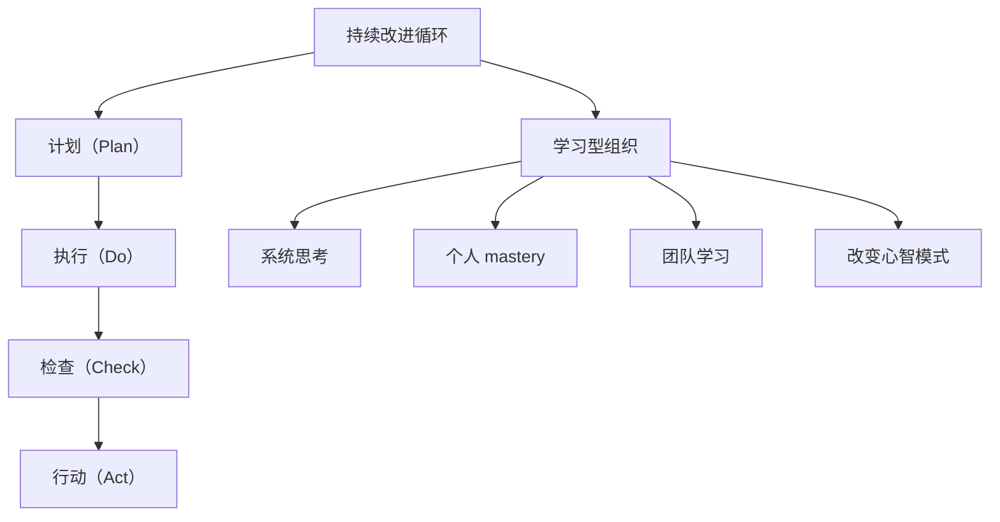

                 

# 持续改进循环：建立学习型组织的方法

> 关键词：持续改进循环、PDCA循环、学习型组织、质量管理、组织应用

> 摘要：本文旨在探讨持续改进循环的概念、历史与发展，以及其在建立学习型组织中的应用。通过分析持续改进循环的组成部分和建立学习型组织的步骤，本文探讨了持续改进循环在企业绩效管理和项目管理中的应用，为组织提供了一种有效的持续改进方法。

## 引言

在当今竞争激烈的市场环境中，企业需要不断适应变化，提高效率，以保持竞争优势。持续改进作为一种管理哲学，已经被广泛应用于各种组织中。本文将探讨持续改进循环（PDCA循环）的概念、历史与发展，以及其在建立学习型组织中的应用。通过分析持续改进循环的组成部分和建立学习型组织的步骤，本文旨在为组织提供一种有效的持续改进方法，以实现长期发展。

## 第一部分：持续改进循环的概念与历史

### 第1章：持续改进循环概述

#### 1.1 持续改进循环的概念与重要性

持续改进循环，又称PDCA循环，是一种用于持续改进和优化业务流程的方法。它由四个阶段组成：计划（Plan）、执行（Do）、检查（Check）和行动（Act）。每个阶段都有其特定的任务和目标，通过循环迭代，不断提高组织的效率和质量。

**1.1.1 持续改进循环的定义**

持续改进循环（PDCA循环）是一种质量管理工具，由美国质量管理专家爱德华兹·戴明提出。PDCA循环包括以下四个阶段：

1. **计划（Plan）**：确定改进目标，制定行动计划和方案。
2. **执行（Do）**：按照计划执行，实施具体的操作。
3. **检查（Check）**：收集数据，评估实际结果与预期目标的差距。
4. **行动（Act）**：根据检查结果进行调整和优化，确保持续改进。

**1.1.2 持续改进的核心**

持续改进的核心在于不断地发现问题、解决问题，并从经验中学习，从而提高组织的效率和质量。持续改进不仅关注问题的解决，更强调问题的预防和改进。

#### 1.2 持续改进循环的历史与发展

**1.2.1 持续改进循环的起源**

持续改进循环由美国质量管理专家爱德华兹·戴明提出。戴明在二战期间被美国政府邀请到日本，帮助日本企业提高生产效率。他提出了PDCA循环，并将其作为日本质量管理运动的核心。这一方法在二战后对日本经济复苏产生了深远影响，成为日本企业质量管理的基础。

**1.2.2 持续改进循环在质量管理中的应用**

持续改进循环在质量管理中被广泛应用，成为现代质量管理不可或缺的一部分。它帮助组织识别问题、分析问题、解决问题，并不断优化业务流程。

**1.2.3 持续改进循环在全球的推广与应用**

持续改进循环已被全球企业广泛接受，成为现代质量管理不可或缺的一部分。许多国家和地区都将其作为质量管理标准，如ISO 9001质量管理体系。

#### 1.3 持续改进循环的组成部分

**1.3.1 计划（Plan）**

计划阶段是持续改进循环的第一步，其主要任务包括：

1. 确定改进目标：明确需要改进的具体领域和目标。
2. 制定行动计划：制定具体的行动计划和方案，包括任务分配和时间表。

**1.3.2 执行（Do）**

执行阶段是计划的具体实施过程，其主要任务包括：

1. 按照计划执行：按照计划执行具体的操作，确保每个任务按时完成。
2. 实施控制：对执行过程进行监控和控制，确保计划的顺利进行。

**1.3.3 检查（Check）**

检查阶段是对执行结果进行评估和反馈，其主要任务包括：

1. 收集数据：收集与改进目标相关的数据，进行定量和定性的分析。
2. 评估结果：评估实际结果与预期目标的差距，识别存在的问题。

**1.3.4 行动（Act）**

行动阶段是对检查结果的反馈和改进，其主要任务包括：

1. 根据检查结果进行调整和优化：对存在的问题进行改进，确保持续改进。
2. 制定新的计划：根据检查结果，制定新的改进计划，开始新一轮的PDCA循环。

### 第2章：建立学习型组织的方法

#### 2.1 学习型组织的概念

**2.1.1 学习型组织的定义**

学习型组织是一种以学习为基础，注重知识共享和持续改进的组织。它具有以下特征：

1. 系统思考：组织成员能够从整体角度看待问题，识别系统中的相互关系。
2. 个人 mastery：组织成员具备专业知识和技能，能够持续提升自己的能力。
3. 团队学习：组织鼓励团队之间的学习和合作，共同解决问题。
4. 改变心智模式：组织成员能够从不同的角度思考问题，摒弃陈旧观念。

**2.1.2 学习型组织的特征**

1. **系统思考**：组织成员能够从整体角度看待问题，识别系统中的相互关系。
2. **个人 mastery**：组织成员具备专业知识和技能，能够持续提升自己的能力。
3. **团队学习**：组织鼓励团队之间的学习和合作，共同解决问题。
4. **改变心智模式**：组织成员能够从不同的角度思考问题，摒弃陈旧观念。

#### 2.2 建立学习型组织的步骤

**2.2.1 创建组织愿景和目标**

建立学习型组织的第一步是明确组织的愿景和目标。这包括：

1. 确定组织的长期愿景：明确组织的发展方向和目标。
2. 制定具体目标：根据愿景，制定具体的、可量化的目标。

**2.2.2 建立学习文化**

建立学习文化是建立学习型组织的核心。这包括：

1. 创造一个鼓励学习和分享知识的氛围：鼓励员工分享经验和知识，促进组织内的知识共享。
2. 提供学习和发展的机会：为员工提供培训和学习机会，提升员工的专业能力和素质。

**2.2.3 提供学习和发展的机会**

提供学习和发展的机会是建立学习型组织的重要步骤。这包括：

1. 设计培训计划：根据员工的需求和发展目标，设计个性化的培训计划。
2. 鼓励员工参加外部培训：鼓励员工参加外部培训和学习活动，拓宽视野。

**2.2.4 促进知识共享**

促进知识共享是建立学习型组织的核心。这包括：

1. 建立有效的知识管理系统：建立知识管理系统，收集、整理和分享组织内的知识资源。
2. 开展知识交流活动：定期组织知识交流活动，如研讨会、座谈会等，促进知识共享。

#### 2.3 建立学习型组织的策略

**2.3.1 强化领导力**

强化领导力是建立学习型组织的关键。领导者应当起到榜样作用，推动学习型组织的建设。这包括：

1. 树立学习型组织的理念：领导者应当树立学习型组织的理念，推动组织内的学习氛围。
2. 关注员工的学习和发展：领导者应当关注员工的学习和发展，提供必要的支持和资源。

**2.3.2 建立反馈机制**

建立反馈机制是建立学习型组织的重要步骤。这包括：

1. 定期进行绩效评估：定期对员工进行绩效评估，了解员工的学习和发展情况。
2. 开展员工满意度调查：定期开展员工满意度调查，了解员工的需求和意见。

**2.3.3 促进跨部门合作**

促进跨部门合作是建立学习型组织的关键。这包括：

1. 建立跨部门项目：通过建立跨部门项目，促进不同部门之间的协作和学习。
2. 开展跨部门交流活动：定期开展跨部门交流活动，促进不同部门之间的知识共享和合作。

## 第二部分：持续改进循环在组织中的应用

### 第3章：持续改进循环在企业中的应用

#### 3.1 持续改进循环在企业中的实施

**3.1.1 确定改进目标**

持续改进循环在企业中的第一步是确定改进目标。这包括：

1. 确定需要改进的具体领域：根据企业的发展需求和实际情况，确定需要改进的具体领域。
2. 制定具体的改进目标：根据确定的领域，制定具体的、可量化的改进目标。

**3.1.2 制定行动计划**

在确定改进目标后，企业需要制定详细的行动计划。这包括：

1. 制定具体的行动方案：根据改进目标，制定具体的行动方案，明确任务分配和执行时间。
2. 制定资源分配计划：根据行动方案，制定资源分配计划，确保各项任务能够按时完成。

**3.1.3 实施行动计划**

实施行动计划是持续改进循环的核心。这包括：

1. 按照计划执行：按照制定的行动方案和资源分配计划，执行各项任务，确保任务按时完成。
2. 实施控制：对执行过程进行监控和控制，确保计划的顺利进行。

**3.1.4 检查实施结果**

检查实施结果是持续改进循环的重要环节。这包括：

1. 收集数据：收集与改进目标相关的数据，进行定量和定性的分析。
2. 评估效果：评估实际结果与预期目标的差距，识别存在的问题。

**3.1.5 调整行动计划**

根据检查结果，企业需要对行动计划进行调整。这包括：

1. 根据检查结果进行调整：根据检查结果，对行动计划进行调整和优化，确保持续改进。
2. 制定新的计划：根据检查结果，制定新的改进计划，开始新一轮的PDCA循环。

#### 3.2 持续改进循环在企业绩效管理中的作用

**3.2.1 提高生产效率**

持续改进循环在企业绩效管理中可以提高生产效率。这包括：

1. 识别生产过程中的浪费：通过持续改进，识别生产过程中的浪费，并采取措施进行改进。
2. 优化生产流程：通过持续改进，优化生产流程，减少生产时间和成本。

**3.2.2 提高产品质量**

持续改进循环在企业绩效管理中可以提高产品质量。这包括：

1. 识别质量问题：通过持续改进，识别生产过程中的质量问题，并采取措施进行改进。
2. 优化质量控制：通过持续改进，优化质量控制流程，确保产品质量达到标准。

**3.2.3 提升员工满意度**

持续改进循环在企业绩效管理中可以提升员工满意度。这包括：

1. 关注员工需求：通过持续改进，关注员工的需求，提供更好的工作环境和条件。
2. 提升员工技能：通过持续改进，提升员工的技能和素质，增强员工的职业发展机会。

### 第4章：持续改进循环在项目管理中的应用

#### 4.1 持续改进循环在项目规划中的角色

**4.1.1 确定项目目标**

在项目规划阶段，持续改进循环的角色是确定项目目标。这包括：

1. 确定项目的具体目标：根据项目需求，确定项目的具体目标。
2. 制定项目的关键绩效指标（KPI）：根据项目目标，制定关键绩效指标，用于评估项目进度和效果。

**4.1.2 制定项目计划**

在项目规划阶段，持续改进循环的角色是制定项目计划。这包括：

1. 制定项目的时间表：根据项目目标，制定项目的时间表，明确任务分配和执行时间。
2. 制定项目的资源需求：根据项目计划，制定项目的资源需求，包括人力、物资和资金。

**4.1.3 实施项目计划**

在项目实施阶段，持续改进循环的角色是实施项目计划。这包括：

1. 按照项目计划执行：按照项目计划，执行各项任务，确保项目进度和效果。
2. 实施控制：对项目实施过程进行监控和控制，确保项目按计划进行。

**4.1.4 监控项目进度**

在项目监控阶段，持续改进循环的角色是监控项目进度。这包括：

1. 定期收集项目数据：定期收集项目进度数据，进行定量和定性的分析。
2. 评估项目进度：评估项目进度与计划目标的差距，识别存在的问题。

#### 4.2 持续改进循环在项目执行中的关键作用

**4.2.1 问题识别与解决**

在项目执行阶段，持续改进循环的关键作用是问题识别与解决。这包括：

1. 识别问题：通过定期收集项目数据，识别项目中的问题。
2. 解决问题：根据识别出的问题，制定解决方案，并进行实施。

**4.2.2 风险管理**

在项目执行阶段，持续改进循环的关键作用是风险管理。这包括：

1. 识别风险：通过定期收集项目数据，识别项目中的风险。
2. 应对风险：根据识别出的风险，制定应对策略，并进行实施。

## 结论

持续改进循环是一种有效的方法，可以帮助组织不断优化业务流程，提高效率和质量。通过分析持续改进循环的概念、历史与发展，以及其在建立学习型组织中的应用，本文为组织提供了一种有效的持续改进方法。在未来的实践中，组织应积极应用持续改进循环，建立学习型组织，以适应不断变化的市场环境，实现长期发展。

### 作者信息

作者：AI天才研究院/AI Genius Institute & 禅与计算机程序设计艺术 /Zen And The Art of Computer Programming

### 附录

本文的核心概念和原理之间的关系架构如下图所示：

### 参考文献

1. 戴明，爱德华兹。（1994）。质量管理：策略与方法。机械工业出版社。
2. 波特，迈克尔·E。（2001）。竞争战略：行业和竞争对手分析的技术。华夏出版社。
3. 芒克，约翰。（2010）。精益思想：精益管理实践指南。机械工业出版社。
4. 西蒙，赫伯特·亚历山大。（1996）。系统思考：指导与管理实践的新视角。上海人民出版社。
5. 克里斯滕森，克莱顿·M。（1997）。创新者的窘境。机械工业出版社。

