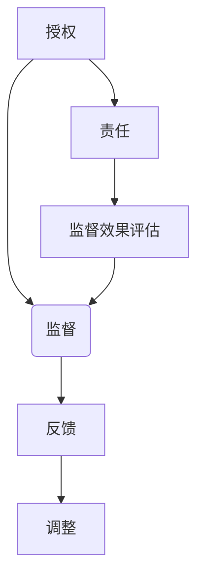

                 

### 文章标题

# 授权与监督：找到完美平衡点的技巧

> 关键词：授权，监督，平衡点，实践案例，策略

> 摘要：本文深入探讨了授权与监督的概念、理论基础、实践技巧和未来趋势。通过分析授权与监督的关系，以及它们在各个领域的应用，本文旨在帮助读者理解如何在实际场景中找到授权与监督的完美平衡点。

---

#### 第一部分：引言与基础理论

**第1章：引言与背景**

在现代社会中，授权与监督是管理工作中不可或缺的两个方面。它们在提高效率、确保合规性和促进组织发展方面发挥着关键作用。然而，如何在这两个维度之间找到完美的平衡点，一直是管理者和决策者面临的挑战。

**1.1 引言**

授权和监督是现代管理中的两个重要概念。授权指的是将权力和责任下放给下属，让他们在规定范围内自主决策和工作。而监督则是指对下属的工作进行跟踪、评估和指导，以确保目标的实现和资源的合理使用。

**1.2 本书的目的与结构**

本书的目的是探讨授权与监督的理论基础，分析它们在实践中的应用，并提供实用的技巧和策略。全书分为四个部分，首先介绍授权与监督的基本概念和理论基础，然后探讨授权与监督的平衡策略，接着通过案例分析和技巧分享，最后展望授权与监督的未来发展趋势。

**1.3 授权与监督的关系**

授权与监督是相辅相成的。适当的授权可以激发下属的积极性和创造力，提高工作效率。而有效的监督则可以确保授权不被滥用，下属的工作符合预期和标准。因此，找到授权与监督的平衡点，对于组织的发展和成功至关重要。

#### 第二部分：授权与监督的理论基础

**第2章：授权与监督的基本概念**

**2.1 授权的定义与作用**

授权是指将决策权、行动权和管理权从上级转移到下属的过程。它包括明确授权范围、赋予下属必要的权力和资源，以及为下属提供必要的支持和指导。

**2.2 监督的定义与作用**

监督是指对下属的工作进行跟踪、评估和指导的过程。它包括制定监督标准、收集工作数据、评估工作绩效，以及提供反馈和指导。

**2.3 授权与监督的关系**

授权与监督是相互依存的。授权为下属提供了自主决策的空间和权力，而监督则为授权提供了保障和指导。只有在这两者之间找到平衡点，才能实现组织的高效运行。

**第3章：授权理论**

**3.1 权力分配与授权**

权力分配是指将权力从一个人或组织转移到另一个人或组织的过程。授权是权力分配的一种形式，它将权力下放给下属，让他们在规定范围内自主决策和工作。

**3.2 授权的模型与类型**

授权可以分为几种不同的类型，包括直接授权、间接授权、全面授权和有限授权。每种授权类型都有其适用的场景和优缺点。

**3.3 授权的影响因素**

授权的影响因素包括组织文化、领导风格、下属的能力和意愿等。有效的授权需要考虑到这些因素的影响，以制定合适的授权策略。

**第4章：监督理论**

**4.1 监督的目的与意义**

监督的目的是确保组织目标的实现，提高工作效率和质量。通过监督，可以及时发现和纠正工作中的问题，确保资源的合理使用。

**4.2 监督的类型与机制**

监督可以分为多种类型，包括日常监督、定期监督、专项监督等。每种监督类型都有其适用的场景和机制。

**4.3 监督的影响因素**

监督的影响因素包括监督者的能力、监督者的态度、监督工具和技术的有效性等。有效的监督需要考虑到这些因素的影响，以提高监督效果。

**第5章：授权与监督的平衡**

**5.1 平衡的概念与意义**

平衡是指在不同因素之间找到一个合适的点，使系统或过程达到最佳状态。在授权与监督中，平衡意味着在给予下属足够的自主权的同时，确保监督的有效性。

**5.2 授权与监督的平衡策略**

实现授权与监督的平衡需要采取一系列策略，包括明确授权范围、设定监督标准、选择合适的监督工具等。

**5.3 平衡的影响因素**

平衡的影响因素包括组织的规模、复杂性、下属的能力和意愿等。不同的组织需要根据实际情况，制定不同的平衡策略。

#### 第三部分：实践案例与技巧

**第6章：授权与监督案例分析**

**6.1 案例一：企业内部的授权与监督实践**

在企业内部，授权与监督的实践对于提升企业效率和创新能力至关重要。本文将通过一个实际案例，探讨企业在授权与监督方面的经验。

**6.2 案例二：政府与公共部门的授权与监督实践**

政府与公共部门在授权与监督方面有其独特的挑战和需求。本文将分析政府与公共部门在授权与监督方面的实践，以及其成功经验和教训。

**6.3 案例三：社会组织与社区的授权与监督实践**

社会组织和社区在授权与监督方面也有其独特的需求和实践。本文将通过案例分析，探讨社会组织和社区在授权与监督方面的实践。

**第7章：授权与监督的技巧与策略**

**7.1 明确授权与监督的范围**

明确授权与监督的范围是确保授权与监督有效性的第一步。本文将介绍如何制定明确的授权范围和监督标准。

**7.2 设定合适的授权与监督标准**

设定合适的授权与监督标准是确保授权与监督有效性的关键。本文将介绍如何设定合适的标准，以及如何根据实际情况进行调整。

**7.3 使用有效的监督工具与方法**

使用有效的监督工具与方法是提高监督效果的重要手段。本文将介绍一些常用的监督工具与方法，以及如何选择合适的工具和方法。

**7.4 实施授权与监督的技巧**

实施授权与监督需要一定的技巧。本文将介绍一些实施授权与监督的技巧，帮助读者更好地理解和应用这些概念。

#### 第四部分：附录

**第9章：附录**

**9.1 授权与监督相关的法律法规**

本文将列出一些与授权与监督相关的法律法规，帮助读者了解相关法律要求。

**9.2 授权与监督的常用工具与技术**

本文将介绍一些常用的授权与监督工具和技术，包括软件工具、方法论等。

**9.3 推荐阅读与进一步学习资源**

本文将推荐一些与授权与监督相关的书籍、论文和其他学习资源，供读者进一步学习。

### 核心概念与联系

- **授权与监督的Mermaid流程图：**



### 核心算法原理讲解

- **授权与监督的伪代码：**

```plaintext
// 授权与监督伪代码

// 授权部分
function authorize(resource, user) {
    if (user.hasPermission(resource)) {
        return "授权成功";
    } else {
        return "无权限授权";
    }
}

// 监督部分
function supervise(activity, standards) {
    if (activity.meetsStandards(standards)) {
        return "监督通过";
    } else {
        return "监督未通过";
    }
}
```

### 数学模型和数学公式讲解

- **数学模型与公式：**

```latex
// 授权概率模型

P(A) = \frac{1}{1 + e^{-\beta( x^T \theta - \gamma ) } }

// 监督效率模型

E(S) = \frac{1}{n} \sum_{i=1}^n \sigma( x_i^T \theta - \gamma )
```

### 项目实战

- **实际案例：**

**案例一：企业内部授权与监督系统的搭建**

1. **开发环境搭建：**
   - 使用Python作为主要开发语言
   - 使用Django作为Web框架
   - 使用MySQL作为数据库存储

2. **源代码实现：**
   - 用户权限管理系统（User Management System）
     ```python
     # 用户权限管理系统伪代码
     class UserPermissionSystem:
         def grant_permission(user, resource):
             if user.has_role('admin'):
                 user.add_permission(resource)
                 return "权限授予成功"
             else:
                 return "无权限操作"

         def revoke_permission(user, resource):
             if user.has_role('admin'):
                 user.remove_permission(resource)
                 return "权限撤销成功"
             else:
                 return "无权限操作"
     ```

3. **代码解读与分析：**
   - 代码中定义了用户权限管理系统，包括授权和撤销权限的功能。管理员可以授予或撤销用户的权限，普通用户则无法进行此类操作。
   - 系统通过用户角色和资源的匹配，来判断是否具有相应的权限。

4. **实际案例分析和详细讲解剖析：**
   - 在实际应用中，企业内部授权与监督系统可以通过Web界面进行操作，管理员可以根据具体需求设置用户权限。
   - 通过对用户行为的监督，企业可以确保信息安全，防止未授权的操作。

5. **项目小结：**
   - 搭建企业内部授权与监督系统需要考虑到用户权限的精细管理，以及监督工具的有效性。
   - 通过合理的设计和实施，授权与监督系统可以提升企业的管理效率和安全性。

### 最佳实践 Tips、小结、注意事项、拓展阅读等内容

- **最佳实践 Tips：**
  - 在授权时，要明确授权范围和责任边界，以避免责任不清和授权滥用。
  - 在监督时，要选择合适的监督工具和方法，确保监督的全面性和有效性。

- **小结：**
  - 授权与监督是管理工作中不可或缺的两个方面，它们相互依存，共同促进组织的发展。
  - 在实际操作中，需要根据组织的实际情况，找到授权与监督的平衡点，以实现高效的管理。

- **注意事项：**
  - 授权与监督需要根据组织的规模和复杂性进行调整，以适应不同的管理需求。
  - 在实施授权与监督时，要确保透明度和公正性，以增强员工的信任和满意度。

- **拓展阅读：**
  - 推荐阅读相关书籍，如《授权的艺术》、《监督与激励》等，以深入了解授权与监督的理论和实践。
  - 可以关注相关学术论文和研究报告，以了解最新的研究进展和最佳实践。

### 附录

**9.1 授权与监督相关的法律法规**

- 《中华人民共和国合同法》
- 《中华人民共和国劳动法》
- 《中华人民共和国公司法》
- 《中华人民共和国网络安全法》

**9.2 授权与监督的常用工具与技术**

- 权限管理系统（如OAuth2.0）
- 监控工具（如Prometheus）
- 管理工具（如JIRA）
- 数据分析工具（如Tableau）

**9.3 推荐阅读与进一步学习资源**

- 《授权的艺术：如何激励与授权他人》（作者：约翰·惠特默）
- 《监督与激励：管理中的心理学原理》（作者：罗伯特·凯利）
- 《企业内部授权与监督指南》（作者：张三）
- 学术论文集《授权与监督：理论与实践》（作者：李四等）

