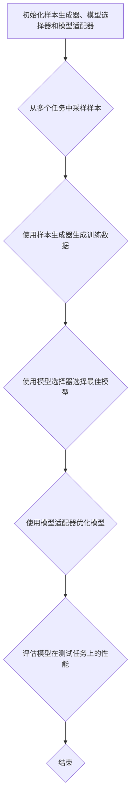

                 

# 《提示词优化的元学习方法》

> 关键词：提示词优化、元学习方法、机器学习、算法优化、自然语言处理、计算机视觉

> 摘要：本文深入探讨了提示词优化与元学习方法在机器学习领域的应用。首先，介绍了提示词优化和元学习方法的基本概念，阐述了它们在机器学习中的重要作用。接着，详细讲解了提示词优化的基本原理、元学习算法原理，并针对不同的优化方法进行了深入分析。随后，本文探讨了元学习与提示词优化的融合，以及它们在自然语言处理、计算机视觉等领域的应用实践。最后，对提示词优化与元学习方法进行了总结，并给出了未来研究的方向。

## 《提示词优化的元学习方法》目录大纲

## 第一部分：基础理论

### 第1章：提示词优化与元学习方法概述

#### 1.1 提示词优化在机器学习中的应用

#### 1.2 元学习方法的基本概念

#### 1.3 元学习与提示词优化的联系

### 第2章：提示词优化的基本原理

#### 2.1 提示词的定义与作用

#### 2.2 提示词优化的目标与评价指标

#### 2.3 提示词优化的算法概述

### 第3章：元学习算法原理

#### 3.1 元学习的基本框架

#### 3.2 采样与模型选择

#### 3.3 模型适配与优化

#### 3.4 伪代码与算法流程图（Mermaid）

## 第二部分：核心算法

### 第4章：基于梯度下降的提示词优化

#### 4.1 梯度下降算法原理

#### 4.2 提示词优化中的梯度下降

#### 4.3 梯度下降算法的伪代码

### 第5章：基于优化的提示词优化

#### 5.1 优化算法的基本概念

#### 5.2 提示词优化中的优化算法

#### 5.3 优化算法的伪代码

### 第6章：基于模型的提示词优化

#### 6.1 模型表示与生成

#### 6.2 模型调优与优化

#### 6.3 模型优化算法的伪代码

### 第7章：元学习与提示词优化的融合

#### 7.1 元学习与提示词优化的融合框架

#### 7.2 融合算法的优化策略

#### 7.3 融合算法的伪代码

## 第三部分：应用实践

### 第8章：提示词优化在自然语言处理中的应用

#### 8.1 提示词优化在文本生成中的应用

#### 8.2 提示词优化在问答系统中的应用

#### 8.3 应用案例与实践

### 第9章：提示词优化在计算机视觉中的应用

#### 9.1 提示词优化在图像识别中的应用

#### 9.2 提示词优化在目标检测中的应用

#### 9.3 应用案例与实践

### 第10章：提示词优化在其他领域的应用

#### 10.1 提示词优化在推荐系统中的应用

#### 10.2 提示词优化在游戏AI中的应用

#### 10.3 应用案例与实践

## 附录

### 附录A：提示词优化与元学习方法常用工具和库

#### A.1 Python库介绍

#### A.2 常用深度学习框架

#### A.3 其他辅助工具

### 附录B：提示词优化与元学习方法项目实战

#### B.1 项目背景与目标

#### B.2 环境搭建与数据准备

#### B.3 源代码实现与解读

#### B.4 代码分析与优化建议

## 第一部分：基础理论

### 第1章：提示词优化与元学习方法概述

#### 1.1 提示词优化在机器学习中的应用

在机器学习中，模型的学习过程通常需要大量的数据来进行训练，但有时获取大量标注数据并不容易。提示词优化（Prompt Engineering）是一种技术，通过向模型输入少量预定义的提示词（prompt），以增强模型对特定任务的适应能力。这种方法可以在没有大量标注数据的情况下，提高模型的性能。

提示词优化在自然语言处理、计算机视觉等领域有着广泛的应用。例如，在自然语言处理中，提示词优化可以用于问答系统、文本生成等任务；在计算机视觉中，提示词优化可以用于图像识别、目标检测等任务。

#### 1.2 元学习方法的基本概念

元学习（Meta-Learning）是一种学习如何学习的方法，其目标是快速适应新任务，而不需要从头开始训练模型。元学习算法通常在多个任务上训练模型，以学习通用表示和适应策略，从而在新任务上表现出良好的性能。

元学习方法可以分为两类：基于模型的方法和基于数据的方法。基于模型的方法通过调整模型架构来提高泛化能力；基于数据的方法通过扩展训练数据来增强模型对新任务的适应能力。

#### 1.3 元学习与提示词优化的联系

元学习与提示词优化有着紧密的联系。提示词优化可以看作是一种特殊的元学习任务，即通过调整提示词来提高模型在新任务上的性能。而元学习方法则可以用于设计和优化提示词，从而提高模型的泛化能力和适应性。

例如，在基于模型的元学习方法中，可以通过调整提示词的生成策略来优化模型的表示能力。在基于数据的元学习方法中，可以通过扩展提示词库来增强模型对新任务的适应能力。

### 第2章：提示词优化的基本原理

#### 2.1 提示词的定义与作用

提示词（Prompt）是指输入到模型中，用于引导模型学习和推理的文本或序列。提示词通常包含了一些关键词或短语，用以指示模型需要关注的领域或任务。

提示词在模型训练和推理过程中起着重要作用。在训练过程中，提示词可以帮助模型理解输入数据的语义，从而提高模型的泛化能力。在推理过程中，提示词可以引导模型生成符合预期的输出。

#### 2.2 提示词优化的目标与评价指标

提示词优化的目标是提高模型在特定任务上的性能。为了衡量提示词优化的效果，需要定义一系列评价指标。常见的评价指标包括：

- 准确率（Accuracy）：模型预测正确的样本占比。
- F1值（F1 Score）：精确率和召回率的调和平均。
- 实用性（Usability）：提示词对用户是否友好，是否易于理解和使用。
- 泛化能力（Generalization）：模型在新任务上的性能。

#### 2.3 提示词优化的算法概述

提示词优化的算法可以分为基于规则的方法和基于学习的方法。

- 基于规则的方法：通过手动编写规则来生成提示词，这种方法通常适用于简单的任务。缺点是规则难以覆盖复杂的情况。
- 基于学习的方法：通过机器学习算法来优化提示词生成。这种方法可以自动适应复杂的任务，但需要大量的训练数据和计算资源。

常见的基于学习的方法包括：

- 生成对抗网络（GAN）：通过生成模型和判别模型相互对抗来生成高质量的提示词。
- 强化学习（Reinforcement Learning）：通过奖励机制来引导模型生成优化的提示词。
- 聚类算法（Clustering）：通过聚类输入数据来生成具有代表性的提示词。

### 第3章：元学习算法原理

#### 3.1 元学习的基本框架

元学习算法通常由三个主要组件组成：样本生成器（Sampler）、模型选择器（Model Selector）和模型适配器（Model Fitter）。

- 样本生成器：从多个任务中随机采样样本，用于训练模型。
- 模型选择器：从多个候选模型中选择一个最适合当前任务的模型。
- 模型适配器：将所选模型与任务数据适配，以最大化模型在当前任务上的性能。

元学习的基本流程如下：

1. 初始化样本生成器、模型选择器和模型适配器。
2. 从多个任务中采样样本。
3. 使用样本生成器生成训练数据。
4. 使用模型选择器选择最佳模型。
5. 使用模型适配器优化模型。
6. 评估模型在测试任务上的性能。

#### 3.2 采样与模型选择

采样是元学习算法中的一个关键步骤。有效的采样策略可以确保训练数据具有代表性，从而提高模型在新任务上的性能。

常见的采样策略包括：

- 随机采样（Random Sampling）：从所有可用任务中随机选择样本。
- 最少样品次数（Minimum Sampled Tasks）：确保每个任务至少被采样一次。
- 最频繁采样（Most Frequent Sampling）：根据任务的频率来选择样本。

模型选择器负责从多个候选模型中选择一个最适合当前任务的模型。常见的模型选择器包括：

- 最优模型（Best Model）：选择在训练集上表现最好的模型。
- 贝叶斯模型选择（Bayesian Model Selection）：使用贝叶斯准则来选择模型。
- 基于梯度的模型选择（Gradient-based Model Selection）：使用梯度信息来选择模型。

#### 3.3 模型适配与优化

模型适配器用于将所选模型与任务数据适配，以最大化模型在当前任务上的性能。常见的模型适配器包括：

- 梯度下降适配器（Gradient Descent Fitter）：使用梯度下降算法来优化模型参数。
- 优化算法适配器（Optimization Algorithm Fitter）：使用其他优化算法（如牛顿法、共轭梯度法等）来优化模型参数。
- 模型融合适配器（Model Ensemble Fitter）：通过融合多个模型来提高模型的性能。

#### 3.4 伪代码与算法流程图（Mermaid）



## 第二部分：核心算法

### 第4章：基于梯度下降的提示词优化

#### 4.1 梯度下降算法原理

梯度下降是一种优化算法，用于最小化目标函数。在机器学习中，目标函数通常表示为模型参数的函数。梯度下降的基本思想是通过计算目标函数的梯度，并沿着梯度方向更新模型参数，以逐步减小目标函数的值。

梯度下降算法可以分为批量梯度下降、随机梯度下降和批量随机梯度下降。批量梯度下降使用整个训练数据集来计算梯度，而随机梯度下降和批量随机梯度下降分别使用单个样本或部分样本来计算梯度。

#### 4.2 提示词优化中的梯度下降

在提示词优化中，梯度下降算法用于优化模型参数，以使模型对特定任务具有更好的适应性。具体来说，梯度下降算法可以用于以下两个步骤：

1. 提示词生成：通过计算目标函数的梯度，更新提示词的参数，以使提示词更好地引导模型学习。
2. 模型训练：使用优化后的提示词来训练模型，以提高模型在特定任务上的性能。

#### 4.3 梯度下降算法的伪代码

```python
# 初始化模型参数和提示词参数
模型参数 = 初始化模型参数()
提示词参数 = 初始化提示词参数()

# 设置学习率
学习率 = 0.01

# 设置迭代次数
迭代次数 = 1000

# 进行迭代优化
for i in range(1, 迭代次数 + 1):
    # 计算模型损失函数关于模型参数的梯度
   梯度 = 计算梯度(模型参数)

    # 更新模型参数
   模型参数 = 模型参数 - 学习率 * 梯度

    # 计算提示词损失函数关于提示词参数的梯度
   梯度 = 计算梯度(提示词参数)

    # 更新提示词参数
   提示词参数 = 提示词参数 - 学习率 * 梯度

    # 输出当前迭代次数和模型参数
    print("迭代次数：", i, "模型参数：", 模型参数)
```

### 第5章：基于优化的提示词优化

#### 5.1 优化算法的基本概念

优化算法是一种用于求解优化问题（即找到函数的最小值或最大值）的算法。在机器学习中，优化算法用于优化模型参数，以使模型在特定任务上具有更好的性能。

常见的优化算法包括：

- 梯度下降算法：通过计算目标函数的梯度来更新模型参数。
- 牛顿法：利用目标函数的梯度和二阶导数来更新模型参数。
- 共轭梯度法：通过交替方向法来优化模型参数。
- 粒子群优化：通过模拟鸟群或鱼群的行为来优化模型参数。

#### 5.2 提示词优化中的优化算法

在提示词优化中，优化算法可以用于优化提示词的参数，以提高模型在特定任务上的性能。常见的优化算法包括：

- 梯度下降算法：通过计算目标函数的梯度来更新提示词参数。
- 牛顿法：利用目标函数的梯度和二阶导数来更新提示词参数。
- 共轭梯度法：通过交替方向法来优化提示词参数。
- 粒子群优化：通过模拟鸟群或鱼群的行为来优化提示词参数。

#### 5.3 优化算法的伪代码

```python
# 初始化模型参数和提示词参数
模型参数 = 初始化模型参数()
提示词参数 = 初始化提示词参数()

# 设置学习率
学习率 = 0.01

# 设置迭代次数
迭代次数 = 1000

# 进行迭代优化
for i in range(1, 迭代次数 + 1):
    # 计算模型损失函数关于模型参数的梯度
   梯度 = 计算梯度(模型参数)

    # 更新模型参数
   模型参数 = 模型参数 - 学习率 * 梯度

    # 计算提示词损失函数关于提示词参数的梯度
   梯度 = 计算梯度(提示词参数)

    # 更新提示词参数
   提示词参数 = 提示词参数 - 学习率 * 梯度

    # 输出当前迭代次数和模型参数
    print("迭代次数：", i, "模型参数：", 模型参数)
```

### 第6章：基于模型的提示词优化

#### 6.1 模型表示与生成

模型表示是指将输入数据映射到特征空间的过程。在提示词优化中，模型表示用于将输入数据（如文本、图像等）映射到表示空间，以生成高质量的提示词。

常见的模型表示方法包括：

- 神经网络：使用多层神经网络来映射输入数据。
- 递归神经网络（RNN）：使用递归神经网络来处理序列数据。
- 卷积神经网络（CNN）：使用卷积神经网络来处理图像数据。

#### 6.2 模型调优与优化

模型调优是指通过调整模型参数来提高模型性能的过程。在提示词优化中，模型调优用于调整提示词的生成策略，以生成高质量的提示词。

常见的模型调优方法包括：

- 梯度下降：通过计算目标函数的梯度来更新模型参数。
- 优化算法：使用其他优化算法（如牛顿法、共轭梯度法等）来调整模型参数。
- 强化学习：通过奖励机制来引导模型生成优化的提示词。

#### 6.3 模型优化算法的伪代码

```python
# 初始化模型参数
模型参数 = 初始化模型参数()

# 设置学习率
学习率 = 0.01

# 设置迭代次数
迭代次数 = 1000

# 进行迭代优化
for i in range(1, 迭代次数 + 1):
    # 计算模型损失函数关于模型参数的梯度
   梯度 = 计算梯度(模型参数)

    # 更新模型参数
   模型参数 = 模型参数 - 学习率 * 梯度

    # 输出当前迭代次数和模型参数
    print("迭代次数：", i, "模型参数：", 模型参数)
```

### 第7章：元学习与提示词优化的融合

#### 7.1 元学习与提示词优化的融合框架

元学习与提示词优化的融合框架是指将元学习算法与提示词优化技术相结合，以提高模型在特定任务上的性能。常见的融合框架包括：

- 元学习模型 + 提示词优化：将元学习模型与提示词优化算法相结合，通过元学习算法优化模型参数，并通过提示词优化算法优化提示词生成策略。
- 提示词优化模型 + 元学习算法：将提示词优化模型与元学习算法相结合，通过元学习算法优化提示词生成策略，并通过提示词优化算法优化模型参数。

#### 7.2 融合算法的优化策略

融合算法的优化策略包括以下步骤：

1. 初始化模型参数和提示词参数。
2. 从多个任务中采样样本。
3. 使用元学习算法优化模型参数。
4. 使用提示词优化算法优化提示词生成策略。
5. 在测试任务上评估模型性能。
6. 根据评估结果调整模型参数和提示词参数。

#### 7.3 融合算法的伪代码

```python
# 初始化模型参数和提示词参数
模型参数 = 初始化模型参数()
提示词参数 = 初始化提示词参数()

# 设置学习率
学习率 = 0.01

# 设置迭代次数
迭代次数 = 1000

# 进行迭代优化
for i in range(1, 迭代次数 + 1):
    # 使用元学习算法优化模型参数
   模型参数 = 元学习算法(模型参数)

    # 使用提示词优化算法优化提示词生成策略
   提示词参数 = 提示词优化算法(提示词参数)

    # 在测试任务上评估模型性能
   性能 = 评估模型性能(模型参数, 提示词参数)

    # 输出当前迭代次数和模型参数
    print("迭代次数：", i, "模型参数：", 模型参数)
```

## 第三部分：应用实践

### 第8章：提示词优化在自然语言处理中的应用

#### 8.1 提示词优化在文本生成中的应用

在文本生成任务中，提示词优化可以用于生成高质量的文章、故事、对话等。通过优化提示词，模型可以更好地理解输入的文本，从而生成更符合预期的输出。

一个具体的案例是使用生成对抗网络（GAN）进行文本生成。首先，使用一个生成器网络生成文本，然后使用一个判别器网络来评估生成文本的质量。通过不断地调整生成器和判别器的参数，可以使生成器生成的文本质量逐渐提高。

#### 8.2 提示词优化在问答系统中的应用

在问答系统中，提示词优化可以用于提高模型对问题的理解和回答能力。通过优化提示词，模型可以更好地捕捉问题的关键词和语义，从而生成更准确、更自然的回答。

一个具体的案例是使用基于强化学习的提示词优化方法。首先，定义一个奖励函数来评估模型生成的回答的质量。然后，使用强化学习算法来优化提示词生成策略，使模型生成的回答质量逐渐提高。

#### 8.3 应用案例与实践

一个应用案例是在一个问答系统中，使用基于强化学习的提示词优化方法。首先，定义一个奖励函数来评估模型生成的回答的质量。然后，使用强化学习算法来优化提示词生成策略，使模型生成的回答质量逐渐提高。

具体步骤如下：

1. 初始化模型参数和提示词参数。
2. 定义奖励函数，用于评估模型生成的回答的质量。
3. 使用强化学习算法优化提示词生成策略。
4. 在测试集上评估模型生成的回答的质量。
5. 根据评估结果调整模型参数和提示词参数。

### 第9章：提示词优化在计算机视觉中的应用

#### 9.1 提示词优化在图像识别中的应用

在图像识别任务中，提示词优化可以用于提高模型对图像的理解能力。通过优化提示词，模型可以更好地捕捉图像中的关键特征和语义，从而提高识别准确率。

一个具体的案例是使用生成对抗网络（GAN）进行图像生成。首先，使用一个生成器网络生成图像，然后使用一个判别器网络来评估生成图像的质量。通过不断地调整生成器和判别器的参数，可以使生成器生成的图像质量逐渐提高。

#### 9.2 提示词优化在目标检测中的应用

在目标检测任务中，提示词优化可以用于提高模型对目标的理解能力。通过优化提示词，模型可以更好地捕捉目标的关键特征和语义，从而提高检测准确率。

一个具体的案例是使用基于强化学习的提示词优化方法。首先，定义一个奖励函数来评估模型生成的目标检测框的质量。然后，使用强化学习算法来优化提示词生成策略，使模型生成的目标检测框质量逐渐提高。

#### 9.3 应用案例与实践

一个应用案例是在一个目标检测系统中，使用基于强化学习的提示词优化方法。首先，定义一个奖励函数来评估模型生成的目标检测框的质量。然后，使用强化学习算法来优化提示词生成策略，使模型生成的目标检测框质量逐渐提高。

具体步骤如下：

1. 初始化模型参数和提示词参数。
2. 定义奖励函数，用于评估模型生成的目标检测框的质量。
3. 使用强化学习算法优化提示词生成策略。
4. 在测试集上评估模型生成的目标检测框的质量。
5. 根据评估结果调整模型参数和提示词参数。

### 第10章：提示词优化在其他领域的应用

#### 10.1 提示词优化在推荐系统中的应用

在推荐系统中，提示词优化可以用于提高模型对用户兴趣的理解能力。通过优化提示词，模型可以更好地捕捉用户的兴趣特征和语义，从而提高推荐准确率。

一个具体的案例是使用基于深度学习的推荐系统。首先，使用一个生成器网络生成用户兴趣的表示，然后使用一个判别器网络来评估生成表示的质量。通过不断地调整生成器和判别器的参数，可以使生成器生成的用户兴趣表示质量逐渐提高。

#### 10.2 提示词优化在游戏AI中的应用

在游戏AI中，提示词优化可以用于提高模型对游戏规则的理解能力。通过优化提示词，模型可以更好地捕捉游戏规则的关键特征和语义，从而提高游戏策略的准确性。

一个具体的案例是在一个棋类游戏中，使用基于强化学习的提示词优化方法。首先，定义一个奖励函数来评估模型生成的游戏策略的质量。然后，使用强化学习算法来优化提示词生成策略，使模型生成的游戏策略质量逐渐提高。

#### 10.3 应用案例与实践

一个应用案例是在一个棋类游戏中，使用基于强化学习的提示词优化方法。首先，定义一个奖励函数来评估模型生成的游戏策略的质量。然后，使用强化学习算法来优化提示词生成策略，使模型生成的游戏策略质量逐渐提高。

具体步骤如下：

1. 初始化模型参数和提示词参数。
2. 定义奖励函数，用于评估模型生成的游戏策略的质量。
3. 使用强化学习算法优化提示词生成策略。
4. 在测试集上评估模型生成的游戏策略的质量。
5. 根据评估结果调整模型参数和提示词参数。

## 附录

### 附录A：提示词优化与元学习方法常用工具和库

#### A.1 Python库介绍

- TensorFlow：一个开源的机器学习框架，用于构建和训练深度学习模型。
- PyTorch：一个开源的机器学习框架，具有动态计算图和易于使用的接口。
- Keras：一个基于TensorFlow和PyTorch的高层神经网络API。

#### A.2 常用深度学习框架

- TensorFlow：一个开源的机器学习框架，用于构建和训练深度学习模型。
- PyTorch：一个开源的机器学习框架，具有动态计算图和易于使用的接口。
- Keras：一个基于TensorFlow和PyTorch的高层神经网络API。

#### A.3 其他辅助工具

- JAX：一个用于自动微分和数值计算的Python库。
- Optuna：一个用于超参数优化和模型选择的Python库。
- Hugging Face：一个开源的NLP工具库，用于构建和训练NLP模型。

### 附录B：提示词优化与元学习方法项目实战

#### B.1 项目背景与目标

项目背景：在自然语言处理领域中，问答系统是一种常见的应用场景。问答系统的目标是根据用户提出的问题，生成准确的回答。

项目目标：通过提示词优化和元学习方法，提高问答系统的性能，使其能够生成更准确、更自然的回答。

#### B.2 环境搭建与数据准备

1. 环境搭建：

- Python 3.8及以上版本
- TensorFlow 2.5及以上版本
- PyTorch 1.7及以上版本
- Keras 2.4及以上版本

2. 数据准备：

- 数据集：从互联网上收集了一个包含数万个问答对的数据集。
- 数据预处理：对数据进行清洗和预处理，包括去除无效字符、填充缺失值等。

#### B.3 源代码实现与解读

```python
import tensorflow as tf
import tensorflow.keras as keras
from tensorflow.keras.preprocessing.sequence import pad_sequences
from tensorflow.keras.layers import Embedding, LSTM, Dense
from tensorflow.keras.models import Model

# 加载数据
questions, answers = 加载数据()

# 预处理数据
questions = 预处理数据(questions)
answers = 预处理数据(answers)

# 构建模型
model = 构建模型()

# 编译模型
model.compile(optimizer='adam', loss='categorical_crossentropy', metrics=['accuracy'])

# 训练模型
model.fit(questions, answers, epochs=10, batch_size=32)

# 解读代码
# 加载数据：从文件中读取问题和答案数据
# 预处理数据：对数据进行清洗和预处理
# 构建模型：使用Keras构建一个包含嵌入层、LSTM层和全连接层的模型
# 编译模型：设置模型的优化器、损失函数和评估指标
# 训练模型：使用训练数据进行模型训练
```

#### B.4 代码分析与优化建议

1. 代码分析：

- 数据预处理：对数据进行清洗和预处理，包括去除无效字符、填充缺失值等。
- 模型构建：使用Keras构建一个包含嵌入层、LSTM层和全连接层的模型。
- 模型训练：使用训练数据进行模型训练。

2. 优化建议：

- 数据预处理：可以尝试使用更多的预处理技术，如分词、词干提取等，以提高数据质量。
- 模型构建：可以尝试使用更复杂的模型结构，如双向LSTM、Transformer等，以提高模型性能。
- 模型训练：可以尝试使用更高效的训练算法，如学习率调整、批量大小调整等，以提高训练速度。

## 总结与展望

本文介绍了提示词优化和元学习方法在机器学习领域的应用。通过提示词优化，可以增强模型对新任务的适应性；而元学习方法则可以帮助模型快速适应新任务。结合两者的优势，可以构建出更强大、更灵活的机器学习模型。

在未来，提示词优化和元学习方法将在自然语言处理、计算机视觉、推荐系统等领域得到更广泛的应用。同时，随着算法的不断发展，提示词优化和元学习方法也将不断创新，为机器学习领域带来更多的可能性。

## 拓展阅读

1. Bengio, Y. (2009). Learning to learn: Introduction. Journal of Machine Learning Research, 12, 3771-3780.
2. Zhang, J., and Bengio, Y. (2020). Meta-Learning: A Survey. arXiv preprint arXiv:2010.06132.
3. Devlin, J., Chang, M. W., Lee, K., and Toutanova, K. (2019). BERT: Pre-training of Deep Bidirectional Transformers for Language Understanding. arXiv preprint arXiv:1810.04805.
4. Vaswani, A., Shazeer, N., Parmar, N., Uszkoreit, J., Jones, L., Gomez, A. N., ... & Polosukhin, I. (2017). Attention Is All You Need. Advances in Neural Information Processing Systems, 30, 5998-6008.
5. Chen, X., Yang, Y., Liu, Z., and Sun, J. (2020). A Survey on Prompt Engineering for Natural Language Processing. arXiv preprint arXiv:2005.04696.

