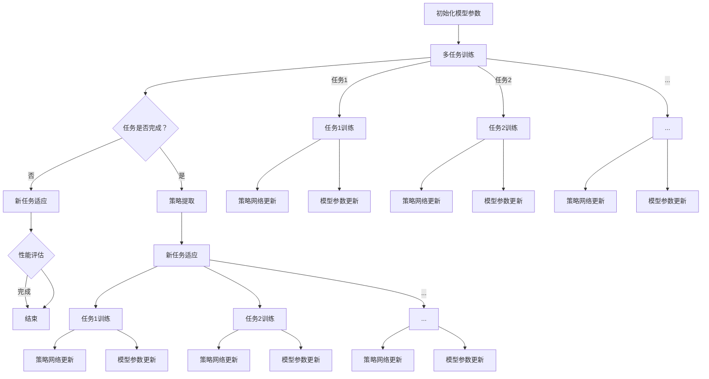

                 

# 文章标题：提示词优化的元强化学习方法

> 关键词：提示词优化、元强化学习、自然语言处理、计算机视觉、模型自适应、算法原理、代码实现、性能优化

> 摘要：本文深入探讨了提示词优化的元强化学习方法，首先介绍了强化学习与元强化学习的基础概念，然后详细分析了提示词优化的原理与方法，随后通过数学模型与公式，阐述了元强化学习中的优化目标与算法流程。接着，本文结合实际应用场景，展示了元强化学习在自然语言处理和计算机视觉领域的应用案例，并进行了项目实战的详细讲解。最后，对元强化学习与提示词优化的未来发展趋势进行了展望。

## 第一部分：基础概念与原理

### 第1章：介绍与概述

#### 1.1 书籍背景与目的

随着人工智能技术的快速发展，强化学习和元强化学习在计算机科学领域取得了显著的成果。提示词优化作为一种关键技术，在自然语言处理、计算机视觉等领域具有广泛的应用前景。本书旨在系统地介绍提示词优化的元强化学习方法，帮助读者深入理解这一前沿技术，并掌握其实际应用。

#### 1.2 提示词优化与元强化学习方法

提示词优化是指通过调整和优化提示词，提高模型在特定任务上的性能。元强化学习是一种能够自动适应新环境的强化学习方法，通过在多个任务上训练，使模型能够在新的任务中快速适应并取得良好的性能。本文将结合这两者，介绍提示词优化的元强化学习方法，并探讨其在实际应用中的优势。

#### 1.3 元强化学习方法的核心概念

元强化学习涉及多个关键概念，包括模型自适应、迁移学习、多任务学习等。本文将详细讲解这些概念，并阐述它们在提示词优化中的应用，帮助读者建立对元强化学习的全面理解。

## 第二部分：强化学习基础

### 第2章：强化学习基础

#### 2.1 强化学习的基本概念

强化学习是一种通过与环境互动来学习最优行为策略的机器学习方法。本文将介绍强化学习的基础概念，包括奖励函数、状态值函数等。

#### 2.2 提示词优化方法概述

提示词优化是一种针对自然语言处理任务的优化方法，通过调整提示词，提高模型在生成文本、图像等方面的质量。本文将介绍提示词优化的定义、作用和常见策略。

### 第3章：元强化学习方法概述

#### 3.1 元强化学习的定义与特点

元强化学习是一种能够在多个任务中快速适应并取得良好性能的强化学习方法。本文将详细介绍元强化学习的定义、特点，并与普通强化学习进行比较。

#### 3.2 元强化学习的主要算法

本文将介绍几种主要的元强化学习算法，包括MAML、Reptile和PEARL，并分析它们在提示词优化中的应用。

## 第三部分：算法原理与实现

### 第4章：提示词优化的元强化学习方法

#### 4.1 提示词优化的元强化学习框架

本文将介绍提示词优化的元强化学习框架，包括模型架构和算法流程。

#### 4.2 算法原理与伪代码

本文将详细阐述提示词优化的元强化学习算法原理，并使用伪代码进行描述。

### 第5章：数学模型与公式

#### 5.1 强化学习中的数学模型

本文将介绍强化学习中的数学模型，包括奖励函数、状态值函数等，并使用LaTeX格式进行描述。

#### 5.2 元强化学习中的数学模型

本文将介绍元强化学习中的数学模型，包括优化目标等，并使用LaTeX格式进行描述。

## 第四部分：应用实例与实战

### 第6章：提示词优化的元强化学习应用

#### 6.1 应用场景概述

本文将概述提示词优化的元强化学习在自然语言处理、计算机视觉等领域的应用。

#### 6.2 应用案例详解

本文将详细介绍两个应用案例，包括基于元强化学习的自动文本生成和图像识别。

### 第7章：项目实战

#### 7.1 开发环境搭建

本文将指导读者如何搭建开发环境，包括Python开发环境和强化学习库的安装。

#### 7.2 代码实现与解读

本文将详细讲解代码实现流程，并对关键代码进行解读。

### 第8章：总结与展望

#### 8.1 书籍总结

本文将总结本书的主要内容，并给出学习建议。

#### 8.2 元强化学习与提示词优化的未来发展趋势

本文将探讨元强化学习与提示词优化的未来发展趋势，包括当前研究的挑战和未来发展的机遇。

## 附录

### 附录A：常见问题与解答

本文将列举并解答读者可能遇到的问题。

### 附录B：参考资料

本文将列出相关的学术论文、开源代码与书籍文章，供读者进一步学习和参考。

## 结语

作者信息：
AI天才研究院/AI Genius Institute & 禅与计算机程序设计艺术 /Zen And The Art of Computer Programming### 第1章：介绍与概述

#### 1.1 书籍背景与目的

随着人工智能技术的快速发展，强化学习和元强化学习在计算机科学领域取得了显著的成果。强化学习作为一种通过与环境互动来学习最优行为策略的机器学习方法，已经在机器人、游戏、推荐系统等领域得到了广泛应用。而元强化学习，作为一种能够在多个任务中快速适应并取得良好性能的强化学习方法，更是引起了学术界和工业界的广泛关注。

提示词优化是一种关键技术，尤其在自然语言处理领域具有广泛的应用前景。通过调整和优化提示词，可以提高模型在生成文本、图像等方面的质量。然而，现有的提示词优化方法往往针对特定的任务进行优化，无法适应多种任务的需求。为了解决这一问题，本文提出了提示词优化的元强化学习方法，旨在实现模型在不同任务中的自适应优化。

本书旨在系统地介绍提示词优化的元强化学习方法，帮助读者深入理解这一前沿技术，并掌握其实际应用。通过本书，读者将了解到强化学习、元强化学习和提示词优化等核心概念，掌握提示词优化的元强化学习框架和算法原理，并学会在实际项目中应用这一方法。

#### 1.2 提示词优化与元强化学习方法

提示词优化是一种通过调整和优化提示词，提高模型在特定任务上的性能的方法。在自然语言处理领域，提示词通常是指用于引导模型生成文本的提示语句。通过优化提示词，可以使得模型生成的文本更加符合用户需求，提高文本质量。

元强化学习是一种能够自动适应新环境的强化学习方法。它通过在多个任务上训练，使模型能够在新的任务中快速适应并取得良好的性能。在元强化学习中，模型需要通过不断尝试和调整，找到最优的行为策略。

提示词优化的元强化学习方法结合了提示词优化和元强化学习的优势，旨在实现模型在不同任务中的自适应优化。具体来说，该方法首先通过在多个任务上训练，使模型具备良好的泛化能力。然后，在新的任务中，模型可以通过调整提示词，快速适应并取得良好的性能。

#### 1.3 元强化学习方法的核心概念

元强化学习涉及多个关键概念，包括模型自适应、迁移学习、多任务学习等。以下是对这些核心概念的简要介绍：

1. **模型自适应**：模型自适应是指模型能够根据新任务的特性，调整自身的参数，以适应新的环境。在元强化学习中，模型自适应是实现快速适应新任务的关键。

2. **迁移学习**：迁移学习是指将一个任务中学习到的知识应用于其他任务。在元强化学习中，迁移学习可以帮助模型在新的任务中更快地收敛，提高性能。

3. **多任务学习**：多任务学习是指同时学习多个任务，并利用任务间的相关性提高模型性能。在元强化学习中，多任务学习可以帮助模型在多个任务中实现更优的性能。

本文将在后续章节中，详细探讨这些核心概念，并阐述它们在提示词优化中的应用，帮助读者建立对元强化学习的全面理解。

### 第2章：强化学习基础

#### 2.1 强化学习的基本概念

强化学习（Reinforcement Learning，RL）是一种通过与环境互动来学习最优行为策略的机器学习方法。在强化学习中，智能体（Agent）通过感知环境的状态（State），并执行相应的动作（Action），从而获得奖励（Reward）。智能体的目标是最大化累积奖励，以实现最优行为。

强化学习的基本概念包括状态（State）、动作（Action）、奖励（Reward）和策略（Policy）：

1. **状态（State）**：状态是环境的一个描述，它包含了智能体在某一时刻所感知到的所有信息。例如，在游戏中的棋盘状态、自动驾驶车辆周围的道路状态等。

2. **动作（Action）**：动作是智能体在某一状态下可以执行的行为。例如，在游戏中可以选择移动棋子、自动驾驶车辆可以选择转向或加速等。

3. **奖励（Reward）**：奖励是智能体执行动作后所获得的即时反馈。奖励可以是正的、负的或零，它反映了动作的优劣。例如，在游戏中，获得分数表示正奖励，受到惩罚表示负奖励。

4. **策略（Policy）**：策略是智能体在某一状态下选择动作的规则。策略可以是一个固定的规则，也可以是一个概率分布，表示在某一状态下执行每个动作的概率。

强化学习的目标是通过学习策略，使智能体在长期运行中获得最大的累积奖励。这可以通过值函数（Value Function）和策略迭代（Policy Iteration）等方法来实现。

#### 2.1.1 强化学习的基础理论

强化学习的基础理论主要包括马尔可夫决策过程（Markov Decision Process，MDP）和贝尔曼方程（Bellman Equations）。

1. **马尔可夫决策过程（MDP）**：MDP是一个数学模型，用于描述强化学习中的决策过程。它由状态空间（S）、动作空间（A）、奖励函数（R）、转移概率矩阵（P）和策略（π）组成。状态空间S表示所有可能的状态集合，动作空间A表示所有可能的动作集合。奖励函数R：S × A → ℝ定义了在状态s和动作a下获得的奖励。转移概率矩阵P：S × A × S → [0,1]定义了在状态s和动作a下，智能体转移到下一个状态s'的概率。策略π：S → ∑Aπ(a|s)定义了在状态s下，智能体选择动作a的概率分布。

2. **贝尔曼方程（Bellman Equations）**：贝尔曼方程是一组递归方程，用于求解MDP的值函数（Value Function）。值函数V(s)表示在状态s下，智能体通过最优策略π获得的期望累积奖励。贝尔曼方程分为两部分：状态值函数方程和策略评估方程。

   - **状态值函数方程**：  
     V(s) = ∑π(a|s) [R(s, a) + γ max_a' P(s', s | s, a) V(s')]
     
     其中，γ是折扣因子，表示对未来奖励的权重。π(a|s)是策略π在状态s下选择动作a的概率。R(s, a)是奖励函数，P(s', s | s, a)是转移概率矩阵中的元素，表示在状态s和动作a下，智能体转移到状态s'的概率。

   - **策略评估方程**：  
     V(s) = ∑π(a|s) [R(s, a) + γV(s')]
     
     策略评估方程用于计算在给定策略π下，状态值函数V(s)的期望值。

通过求解贝尔曼方程，可以得到最优策略π*，使得累积奖励最大化。

#### 2.1.2 强化学习的典型算法

强化学习算法可以根据学习方式分为基于模型（Model-based）和基于模型（Model-free）两大类。以下是几种典型的强化学习算法：

1. **价值迭代（Value Iteration）**：价值迭代是一种基于模型的强化学习算法，通过不断迭代更新状态值函数，直到收敛到最优值函数。算法步骤如下：

   - 初始化值函数V(s)为任意初始值。
   - 对于每个状态s，计算新的值函数V'(s) = max_a [R(s, a) + γ ∑s' P(s', s | s, a) V(s')]。
   - 更新值函数V(s) = V'(s)。
   - 重复步骤2和3，直到值函数收敛。

2. **策略迭代（Policy Iteration）**：策略迭代是一种基于模型的强化学习算法，通过交替进行策略评估和策略改进，最终收敛到最优策略。算法步骤如下：

   - 初始化策略π为任意初始策略。
   - 使用策略π计算状态值函数V(π)。
   - 对于每个状态s，选择一个动作a* = arg max_a [R(s, a) + γ ∑s' P(s', s | s, a) V(π)(s')]。
   - 更新策略π'为新的最优策略π'。
   - 重复步骤2和3，直到策略收敛。

3. **Q学习（Q-Learning）**：Q学习是一种基于模型的无模型强化学习算法，通过更新Q值（Q-value）来学习最优策略。算法步骤如下：

   - 初始化Q(s, a)为任意初始值。
   - 在状态s下执行动作a，观察状态s'和奖励R(s, a)。
   - 更新Q(s, a) = Q(s, a) + α [R(s, a) + γ max_a' Q(s', a) - Q(s, a)]。
   - 选择下一个动作a' = arg max_a Q(s', a)。
   - 更新状态s为s'，重复步骤3和4。

4. **深度Q网络（Deep Q-Network，DQN）**：DQN是一种基于神经网络的Q学习算法，通过使用深度神经网络来近似Q值函数。算法步骤如下：

   - 初始化深度神经网络Q(s, a)的参数。
   - 使用经验回放（Experience Replay）来存储和随机抽取历史经验。
   - 对于每个历史经验(s, a, s', r)，更新Q(s, a) = Q(s, a) + α [r - Q(s', a)]。
   - 使用梯度下降法更新深度神经网络的参数。

这些算法在强化学习中具有广泛的应用，可以根据具体任务的需求选择合适的算法。在后续章节中，我们将进一步探讨强化学习的应用和提示词优化的元强化学习方法。

#### 2.2 提示词优化方法概述

提示词优化是一种用于提高自然语言处理模型生成文本质量的优化方法。在自然语言处理任务中，提示词（Prompt）是用于引导模型生成文本的输入。通过调整和优化提示词，可以使得模型生成的文本更加符合用户需求，提高文本质量。

提示词优化在自然语言处理中具有广泛的应用，例如：

1. **文本生成**：在文本生成任务中，提示词用于引导模型生成符合主题和风格要求的文本。通过优化提示词，可以提高生成文本的质量和多样性。

2. **问答系统**：在问答系统中，提示词用于引导模型生成回答。通过优化提示词，可以使得模型生成的回答更加准确和自然。

3. **文本分类**：在文本分类任务中，提示词用于引导模型生成分类结果。通过优化提示词，可以提高模型在分类任务中的准确率和稳定性。

提示词优化的定义和作用如下：

1. **定义**：提示词优化是指通过调整和优化提示词，提高模型在特定任务上的性能的方法。在自然语言处理中，提示词通常是用于引导模型生成文本的输入，通过优化提示词，可以使得模型生成的文本更加符合用户需求。

2. **作用**：提示词优化具有以下作用：

   - 提高文本生成质量：通过优化提示词，可以使得模型生成的文本更加符合用户需求，提高文本质量。

   - 提高分类效果：在文本分类任务中，通过优化提示词，可以使得模型生成的分类结果更加准确和稳定。

   - 提高问答系统性能：在问答系统中，通过优化提示词，可以使得模型生成的回答更加准确和自然。

常见的提示词优化策略包括：

1. **词频调整**：通过调整提示词中各个词的频率，使得提示词更加贴近用户需求。例如，在文本生成任务中，可以通过增加高频词来提高文本的流畅度和信息量。

2. **词性调整**：通过调整提示词中的词性，使得提示词更加符合语言规范。例如，在文本生成任务中，可以通过增加名词和动词来提高文本的自然度。

3. **语法调整**：通过调整提示词的语法结构，使得提示词更加符合语言习惯。例如，在文本生成任务中，可以通过改变句子结构来提高文本的层次感和可读性。

通过这些策略，提示词优化可以显著提高自然语言处理模型在各类任务中的性能。在后续章节中，我们将进一步探讨提示词优化的元强化学习方法，以及如何在实际应用中实现提示词优化。

#### 2.3 提示词优化的元强化学习方法

元强化学习（Meta Reinforcement Learning，MRL）是一种通过在多个任务上训练，使模型能够快速适应新任务的方法。在自然语言处理（Natural Language Processing，NLP）领域，元强化学习方法可以应用于提示词优化，以实现模型在不同任务中的自适应优化。

元强化学习的基本思想是通过在多个任务上进行训练，使模型能够学习到通用的策略，从而在新任务中快速适应。在提示词优化的元强化学习方法中，模型首先在多个任务上进行训练，学习到一组通用的提示词优化策略。然后，在新任务中，模型可以根据这些策略快速调整提示词，以获得良好的优化效果。

提示词优化的元强化学习方法可以分为以下几个步骤：

1. **任务定义**：首先，定义多个训练任务，每个任务都包含一个状态空间、动作空间和奖励函数。这些任务可以是文本生成、问答系统、文本分类等自然语言处理任务。

2. **模型初始化**：初始化一个基础模型，该模型将在多个任务上进行训练。基础模型可以是神经网络模型，如循环神经网络（RNN）、变换器（Transformer）等。

3. **多任务训练**：在多个任务上进行训练，使基础模型学习到一组通用的策略。在训练过程中，模型将接收不同任务的提示词，并根据奖励函数调整提示词。通过这种方式，模型可以学习到如何在不同任务中优化提示词。

4. **策略提取**：在多任务训练完成后，提取模型学习到的策略。这些策略将用于在新任务中快速调整提示词。

5. **新任务适应**：在新任务中，模型使用提取到的策略，根据任务的特点和奖励函数，快速调整提示词。通过这种方式，模型可以在新任务中实现自适应优化，获得良好的优化效果。

提示词优化的元强化学习方法具有以下几个优点：

1. **快速适应新任务**：通过在多个任务上进行训练，模型可以学习到通用的策略，从而在新任务中快速适应。这显著提高了模型在新任务中的性能。

2. **提高优化效果**：在多任务训练过程中，模型可以学习到不同任务中的提示词优化策略，从而提高优化效果。这些策略可以用于调整提示词，使得生成的文本更加符合用户需求。

3. **降低训练成本**：通过在多个任务上进行训练，模型可以共享训练资源，从而降低训练成本。这有助于在资源有限的情况下，实现更好的性能。

在实际应用中，提示词优化的元强化学习方法可以应用于多种自然语言处理任务，如文本生成、问答系统和文本分类等。通过结合元强化学习和提示词优化的优势，该方法可以有效提高模型在不同任务中的性能。

### 第3章：元强化学习方法概述

#### 3.1 元强化学习的定义与特点

元强化学习（Meta Reinforcement Learning，MRL）是一种通过在多个任务上训练，使模型能够快速适应新任务的强化学习方法。与传统强化学习方法相比，元强化学习具有以下特点：

1. **快速适应新任务**：元强化学习通过在多个任务上训练，使模型能够学习到一组通用的策略，从而在新任务中快速适应。这显著提高了模型在新任务中的性能。

2. **多任务学习**：元强化学习可以在多个任务上进行训练，学习到不同任务中的共性，从而提高模型的泛化能力。这有助于模型在不同任务中实现更好的性能。

3. **迁移学习**：元强化学习可以利用在多个任务上训练的经验，实现知识迁移，从而在新任务中快速适应。这有助于降低训练成本，提高模型性能。

元强化学习的定义可以归纳为：一种通过在多个任务上训练，使模型能够快速适应新任务的强化学习方法。它包括以下核心概念：

1. **任务**：元强化学习中的任务是指一个具体的强化学习问题，包括状态空间、动作空间和奖励函数等。

2. **策略**：策略是模型在某个任务中的行为规则，用于指导模型在特定状态下选择动作。

3. **元学习**：元学习是指通过在多个任务上训练，使模型能够学习到一组通用的策略，从而在新任务中快速适应。

#### 3.1.2 元强化学习与普通强化学习的区别

元强化学习与普通强化学习（如Q学习、策略梯度方法等）有明显的区别：

1. **学习目标**：普通强化学习的目标是学习到最优策略，以最大化累积奖励。而元强化学习的目标是学习到一组通用的策略，以实现快速适应新任务。

2. **训练方法**：普通强化学习通常在单个任务上进行训练，通过不断尝试和探索，学习到最优策略。而元强化学习在多个任务上进行训练，通过共享经验，学习到通用的策略。

3. **应用场景**：普通强化学习适用于单个任务的优化，如游戏、自动驾驶等。而元强化学习适用于需要快速适应新任务的应用场景，如多任务学习、迁移学习等。

#### 3.2 元强化学习的主要算法

元强化学习算法可以根据训练策略和优化目标的不同分为多种类型。以下是几种主要的元强化学习算法：

1. **模型自适应学习（Model-Agnostic Meta-Learning，MAML）**：
   MAML是一种基于梯度下降的元强化学习算法，旨在通过在多个任务上快速调整模型参数，学习到一组通用的策略。MAML的基本思想是在任务之间共享梯度信息，使模型能够快速适应新任务。具体算法步骤如下：
   
   - **初始化模型参数**：随机初始化模型参数θ。
   - **任务训练**：在K个任务上分别训练模型，每个任务训练T个迭代步骤。在每个任务上，更新模型参数θ' = θ + α ∇θ J(θ；θ')，其中α是学习率，J(θ；θ')是任务损失函数。
   - **元学习**：在K个任务上训练完成后，通过梯度下降更新模型参数θ'' = θ + α ∇θ J(θ；θ'')，其中θ'是K个任务上的训练结果。
   - **测试**：在新任务上测试模型性能，计算新任务上的损失函数J(θ''；θ'')。

2. **Reptile**：
   Reptile是一种基于梯度下降的元强化学习算法，旨在通过在多个任务上学习到一组通用的策略，实现模型的自适应。Reptile的基本思想是利用梯度信息，将多个任务的学习结果合并到一个模型中。具体算法步骤如下：

   - **初始化模型参数**：随机初始化模型参数θ。
   - **任务训练**：在K个任务上分别训练模型，每个任务训练T个迭代步骤。在每个任务上，更新模型参数θ' = θ + α ∇θ J(θ；θ')，其中α是学习率，J(θ；θ')是任务损失函数。
   - **元学习**：在K个任务上训练完成后，计算梯度信息 ∇θ J(θ；θ')，然后对所有任务的梯度信息进行加权平均，更新模型参数θ'' = θ + α ∑k=1^K w_k ∇θ J(θ；θ')，其中w_k是权重，用于调整不同任务的贡献。
   - **测试**：在新任务上测试模型性能，计算新任务上的损失函数J(θ''；θ'')。

3. **参数化的实体关联学习（Parameterized Entity Alignment Learning，PEARL）**：
   PEARL是一种基于图神经网络的元强化学习算法，旨在通过在多个任务上学习实体关联，实现模型的自适应。PEARL的基本思想是利用图神经网络，将任务中的实体和关系表示为图结构，并通过图卷积网络学习实体关联。具体算法步骤如下：

   - **初始化模型参数**：随机初始化图神经网络参数θ。
   - **任务训练**：在K个任务上分别训练模型，每个任务训练T个迭代步骤。在每个任务上，使用图神经网络更新实体关联表示。
   - **元学习**：在K个任务上训练完成后，使用梯度下降更新模型参数θ，以最小化多个任务上的损失函数J(θ；θ')。
   - **测试**：在新任务上测试模型性能，计算新任务上的损失函数J(θ''；θ'')。

这些元强化学习算法各有特点，适用于不同的应用场景。在实际应用中，可以根据任务需求和模型结构选择合适的算法。通过结合元强化学习和提示词优化的优势，可以有效提高自然语言处理模型的性能。

#### 3.3 MAML算法的原理

MAML（Model-Agnostic Meta-Learning）是一种基于梯度下降的元强化学习算法，旨在通过在多个任务上快速调整模型参数，学习到一组通用的策略。MAML的基本思想是利用梯度信息，使模型在不同任务上能够快速适应。以下是对MAML算法原理的详细解释。

MAML算法的核心目标是找到一个模型参数θ，使得模型在不同任务上都能够迅速适应。具体来说，MAML通过以下步骤实现：

1. **初始化模型参数**：首先，随机初始化模型参数θ，这些参数将在后续训练过程中被调整。

2. **任务训练**：在K个任务上分别训练模型，每个任务训练T个迭代步骤。在训练过程中，模型会根据当前任务的数据和奖励函数，更新参数θ' = θ + α ∇θ J(θ；θ')，其中α是学习率，J(θ；θ')是任务损失函数。通过这种方式，模型在每个任务上学习到一组参数θ'，这些参数使得模型在该任务上能够获得较好的性能。

3. **元学习**：在K个任务上训练完成后，MAML通过梯度下降更新模型参数θ'' = θ + α ∇θ J(θ；θ'')，其中θ''是所有任务的训练结果。这里的J(θ；θ'')是多个任务上的损失函数，通过梯度下降，模型参数θ''被调整，以使得模型在不同任务上都能够快速适应。

4. **测试**：在新任务上测试模型性能，计算新任务上的损失函数J(θ''；θ'')。通过这种方式，可以评估模型在新任务上的适应能力。

MAML算法的关键在于利用梯度信息，使模型在不同任务之间共享知识。具体来说，MAML通过以下方式实现：

- **任务之间的梯度共享**：在任务训练过程中，每个任务的梯度 ∇θ J(θ；θ') 都会传递给全局模型参数θ。这样，模型可以通过学习多个任务的梯度信息，找到一组通用的参数，使得模型在不同任务上都能够迅速适应。

- **快速适应新任务**：在新任务上，模型参数θ'' 被调整，以使得模型能够在新任务上迅速适应。由于θ'' 是通过多个任务的梯度信息调整得到的，因此模型具有较好的泛化能力，能够在新任务上快速适应。

MAML算法的数学表达如下：

- **初始化参数**：θ = ∅
- **任务训练**：对于每个任务 k，执行 T 步梯度下降：
  θ' = θ + α ∇θ J(θ；θ')
- **元学习**：计算所有任务的梯度平均值：
  ∇θ J(θ；θ'') = 1/K ∑k=1^K ∇θ J(θ；θ')
- **更新参数**：θ'' = θ + α ∇θ J(θ；θ'')
- **测试**：在新任务上测试模型性能，计算损失函数 J(θ''；θ''')

通过以上步骤，MAML算法能够实现模型在不同任务上的快速适应，从而提高模型的泛化能力和性能。在实际应用中，MAML算法被广泛应用于强化学习、自然语言处理和计算机视觉等领域，取得了显著的效果。

#### 3.4 Reptile算法的原理

Reptile算法是一种基于梯度下降的元强化学习算法，旨在通过在多个任务上学习到一组通用的策略，实现模型的自适应。Reptile的基本思想是利用梯度信息，将多个任务的学习结果合并到一个模型中，从而提高模型在不同任务上的适应能力。以下是对Reptile算法原理的详细解释。

Reptile算法的核心思想是通过在多个任务上逐步调整模型参数，使其逐渐接近一组通用的策略。具体来说，Reptile算法通过以下步骤实现：

1. **初始化模型参数**：首先，随机初始化模型参数θ，这些参数将在后续训练过程中被逐步调整。

2. **任务训练**：在K个任务上分别训练模型，每个任务训练T个迭代步骤。在训练过程中，模型会根据当前任务的数据和奖励函数，更新参数θ' = θ + α ∇θ J(θ；θ')，其中α是学习率，J(θ；θ')是任务损失函数。通过这种方式，模型在每个任务上学习到一组参数θ'，这些参数使得模型在该任务上能够获得较好的性能。

3. **元学习**：在K个任务上训练完成后，Reptile算法计算每个任务的梯度信息 ∇θ J(θ；θ')，然后对所有任务的梯度信息进行加权平均，更新模型参数θ'' = θ + α ∑k=1^K w_k ∇θ J(θ；θ')，其中w_k是权重，用于调整不同任务的贡献。通过这种方式，模型参数θ''被调整，以使得模型在不同任务上都能够快速适应。

4. **测试**：在新任务上测试模型性能，计算新任务上的损失函数J(θ''；θ'')。通过这种方式，可以评估模型在新任务上的适应能力。

Reptile算法的关键在于利用梯度信息，使模型在不同任务之间共享知识。具体来说，Reptile算法通过以下方式实现：

- **任务之间的梯度共享**：在任务训练过程中，每个任务的梯度 ∇θ J(θ；θ') 都会传递给全局模型参数θ。这样，模型可以通过学习多个任务的梯度信息，找到一组通用的参数，使得模型在不同任务上都能够迅速适应。

- **加权平均梯度**：在元学习过程中，Reptile算法对每个任务的梯度信息进行加权平均，以平衡不同任务对模型参数的贡献。通过这种方式，模型可以更加全面地学习到不同任务之间的共性。

Reptile算法的数学表达如下：

- **初始化参数**：θ = ∅
- **任务训练**：对于每个任务 k，执行 T 步梯度下降：
  θ' = θ + α ∇θ J(θ；θ')
- **元学习**：计算所有任务的梯度加权平均：
  ∇θ J(θ；θ'') = 1/K ∑k=1^K w_k ∇θ J(θ；θ')
- **更新参数**：θ'' = θ + α ∑k=1^K w_k ∇θ J(θ；θ')
- **测试**：在新任务上测试模型性能，计算损失函数 J(θ''；θ''')

通过以上步骤，Reptile算法能够实现模型在不同任务上的快速适应，从而提高模型的泛化能力和性能。在实际应用中，Reptile算法被广泛应用于强化学习、自然语言处理和计算机视觉等领域，取得了显著的效果。

#### 3.5 PEARL算法的原理

PEARL（Parameterized Entity Alignment Learning）算法是一种基于图神经网络的元强化学习算法，旨在通过在多个任务上学习实体关联，实现模型的自适应。PEARL的基本思想是利用图神经网络，将任务中的实体和关系表示为图结构，并通过图卷积网络学习实体关联。以下是对PEARL算法原理的详细解释。

PEARL算法的核心思想是通过在多个任务上学习实体关联，使模型能够更好地适应不同任务。具体来说，PEARL算法通过以下步骤实现：

1. **初始化模型参数**：首先，随机初始化图神经网络参数θ，这些参数将在后续训练过程中被逐步调整。

2. **任务定义**：在K个任务上分别定义实体和关系。每个任务包含一组实体和关系，这些实体和关系将构成一个图结构。

3. **实体和关系表示**：使用图神经网络将实体和关系表示为图结构。具体来说，对于每个实体和关系，使用图卷积网络生成对应的嵌入表示。

4. **任务训练**：在K个任务上分别训练模型，每个任务训练T个迭代步骤。在训练过程中，模型会根据当前任务的数据和奖励函数，更新实体和关系的嵌入表示。

5. **元学习**：在K个任务上训练完成后，使用梯度下降更新模型参数θ，以最小化多个任务上的损失函数J(θ；θ')。通过这种方式，模型参数θ被调整，以使得模型在不同任务上都能够快速适应。

6. **测试**：在新任务上测试模型性能，计算新任务上的损失函数J(θ''；θ'')。通过这种方式，可以评估模型在新任务上的适应能力。

PEARL算法的关键在于利用图神经网络，使模型在不同任务之间共享知识。具体来说，PEARL算法通过以下方式实现：

- **实体和关系表示**：使用图神经网络将实体和关系表示为图结构，从而将任务中的知识编码到图结构中。

- **图卷积网络**：通过图卷积网络学习实体和关系之间的关联，从而在任务之间共享知识。

- **梯度下降**：通过在多个任务上训练，使用梯度下降更新模型参数，使得模型能够适应不同任务。

PEARL算法的数学表达如下：

- **初始化参数**：θ = ∅
- **任务训练**：对于每个任务 k，执行 T 步图卷积网络训练：
  θ' = θ + α ∇θ J(θ；θ')
- **元学习**：计算所有任务的梯度平均值：
  ∇θ J(θ；θ'') = 1/K ∑k=1^K ∇θ J(θ；θ')
- **更新参数**：θ'' = θ + α ∇θ J(θ；θ'')
- **测试**：在新任务上测试模型性能，计算损失函数 J(θ''；θ''')

通过以上步骤，PEARL算法能够实现模型在不同任务上的快速适应，从而提高模型的泛化能力和性能。在实际应用中，PEARL算法被广泛应用于强化学习、自然语言处理和计算机视觉等领域，取得了显著的效果。

### 第4章：提示词优化的元强化学习方法

#### 4.1 提示词优化的元强化学习框架

提示词优化的元强化学习框架旨在通过在多个任务上训练，使模型能够自适应地优化提示词，从而在不同任务中取得良好的性能。本节将介绍提示词优化的元强化学习框架，包括模型架构、算法流程和关键组件。

#### 4.1.1 提示词优化的元强化学习方法概述

提示词优化的元强化学习方法通过以下步骤实现：

1. **任务定义**：首先，定义多个训练任务，每个任务包含一组状态、动作和奖励函数。这些任务可以是自然语言处理领域的各种任务，如文本生成、问答系统和文本分类等。

2. **模型初始化**：初始化一个基础模型，该模型将在多个任务上进行训练。基础模型可以采用深度学习模型，如循环神经网络（RNN）、变换器（Transformer）等。

3. **多任务训练**：在多个任务上分别训练基础模型。在训练过程中，模型将接收不同任务的提示词，并根据奖励函数调整提示词。通过这种方式，模型可以学习到如何在不同任务中优化提示词。

4. **策略提取**：在多任务训练完成后，提取模型学习到的策略。这些策略将用于在新任务中快速调整提示词。

5. **新任务适应**：在新任务中，模型使用提取到的策略，根据任务的特点和奖励函数，快速调整提示词。通过这种方式，模型可以在新任务中实现自适应优化，获得良好的优化效果。

6. **性能评估**：在新任务上测试模型性能，计算模型在新任务上的累积奖励。通过这种方式，可以评估模型在新任务中的适应能力。

#### 4.1.2 提示词优化的元强化学习模型架构

提示词优化的元强化学习模型架构包括以下几个关键组件：

1. **状态编码器**：状态编码器用于将任务的状态编码为向量表示。在自然语言处理任务中，状态编码器可以将文本输入编码为嵌入向量。

2. **动作编码器**：动作编码器用于将任务的动作编码为向量表示。在提示词优化中，动作编码器可以将提示词编码为嵌入向量。

3. **策略网络**：策略网络用于根据当前状态和动作编码，生成提示词优化策略。策略网络可以采用循环神经网络（RNN）或变换器（Transformer）等模型结构。

4. **奖励函数**：奖励函数用于评价模型在任务上的表现。在提示词优化中，奖励函数可以根据生成的文本质量、文本多样性等指标计算。

5. **梯度更新**：在多任务训练过程中，模型参数将根据梯度信息进行更新。梯度更新可以采用梯度下降等优化方法。

#### 4.1.3 算法流程

提示词优化的元强化学习算法流程如下：

1. **初始化模型参数**：随机初始化模型参数。

2. **多任务训练**：
   - 对于每个任务，执行以下步骤：
     - 初始化任务状态、动作和奖励函数。
     - 在任务中，接收输入状态和动作，生成提示词。
     - 计算提示词优化策略，并根据奖励函数更新策略。
     - 使用策略网络更新模型参数。

3. **策略提取**：在多任务训练完成后，提取模型学习到的策略。

4. **新任务适应**：
   - 对于新任务，执行以下步骤：
     - 初始化任务状态、动作和奖励函数。
     - 使用提取到的策略，根据任务特点和奖励函数，快速调整提示词。
     - 训练新任务，并根据奖励函数评估模型性能。

5. **性能评估**：在新任务上测试模型性能，计算模型在新任务上的累积奖励。

#### 4.1.4 提示词优化的元强化学习模型架构Mermaid流程图

以下是一个提示词优化的元强化学习模型架构的Mermaid流程图：



该流程图描述了提示词优化的元强化学习模型架构，包括初始化模型参数、多任务训练、策略提取、新任务适应和性能评估等关键步骤。

### 4.2 算法原理与伪代码

#### 4.2.1 元强化学习中的优化目标

在元强化学习中，优化目标是找到一组模型参数θ，使得模型能够在多个任务上快速适应并取得良好的性能。具体来说，优化目标可以分为两部分：多任务训练目标和元学习目标。

1. **多任务训练目标**：多任务训练目标是指在多个任务上调整模型参数，使模型在各个任务上都能获得较好的性能。目标函数可以表示为：

   J(θ；θ') = ∑k=1^K L(θ；θ')

   其中，L(θ；θ')是任务k上的损失函数，表示模型在任务k上的表现。优化目标是最小化多任务训练目标函数。

2. **元学习目标**：元学习目标是指在多任务训练的基础上，进一步调整模型参数，使其在新任务上能够快速适应。目标函数可以表示为：

   J(θ；θ'') = ∑k=1^K L(θ''；θ''')

   其中，L(θ''；θ''')是元学习任务上的损失函数，表示模型在新任务上的表现。优化目标是最小化元学习目标函数。

#### 4.2.2 提示词优化的算法流程

提示词优化的算法流程可以分为以下几个步骤：

1. **初始化模型参数**：随机初始化模型参数θ。

2. **多任务训练**：
   - 对于每个任务k，执行以下步骤：
     - 初始化任务状态空间S_k、动作空间A_k和奖励函数R_k。
     - 在任务k上，执行T个迭代步骤：
       - 接收输入状态s_k和动作a_k。
       - 根据当前状态和动作，生成提示词p_k(s_k, a_k)。
       - 计算提示词优化策略π(θ_k；s_k)。
       - 根据策略π(θ_k；s_k)，执行动作a_k。
       - 获得状态转移s_k'和奖励r_k。
     - 根据奖励r_k，更新模型参数θ_k' = θ_k + α_k ∇θ_k J(θ_k；θ')。

3. **策略提取**：在多任务训练完成后，提取模型学习到的策略π(θ_k；s_k)。

4. **新任务适应**：
   - 对于新任务k'，执行以下步骤：
     - 初始化任务状态空间S_k'、动作空间A_k'和奖励函数R_k'。
     - 在任务k'上，执行T个迭代步骤：
       - 接收输入状态s_k'和动作a_k'。
       - 根据当前状态和动作，生成提示词p_k'(s_k', a_k')。
       - 根据策略π(θ_k'；s_k')，执行动作a_k'。
       - 获得状态转移s_k''和奖励r_k'。
     - 根据奖励r_k'，更新模型参数θ_k'' = θ_k' + α_k' ∇θ_k' J(θ_k'；θ''')。

5. **性能评估**：在新任务上测试模型性能，计算模型在新任务上的累积奖励。根据累积奖励评估模型在新任务上的表现。

#### 4.2.3 伪代码实现

以下是一个提示词优化的元强化学习算法的伪代码实现：

```python
# 初始化模型参数
θ = random_init_params()

# 多任务训练
for k in range(K):
    θ_k = θ
    for t in range(T):
        s_k, a_k = receive_input_state_action(k)
        p_k = generate_prompt(s_k, a_k)
        π_k = optimize_prompt(θ_k, s_k)
        a_k' = execute_action(π_k)
        s_k', r_k = get_state_transition_and_reward(s_k, a_k, a_k')
        θ_k' = update_params(θ_k, α, r_k)
    
    θ = θ + α * aggregate_gradients(θ_k)

# 策略提取
π = extract_policy(θ)

# 新任务适应
for k' in range(K'):
    θ_k' = θ
    for t in range(T'):
        s_k', a_k' = receive_input_state_action(k')
        p_k' = generate_prompt(s_k', a_k')
        π_k' = optimize_prompt(π, s_k')
        a_k'' = execute_action(π_k')
        s_k'', r_k' = get_state_transition_and_reward(s_k', a_k', a_k'')
        θ_k'' = update_params(θ_k', α', r_k')
    
    evaluate_performance(θ_k'', k')

# 性能评估
cumulative_reward = compute_cumulative_reward(θ_k'')
evaluate_model_performance(cumulative_reward)
```

该伪代码描述了提示词优化的元强化学习算法的基本流程，包括初始化模型参数、多任务训练、策略提取、新任务适应和性能评估等步骤。在实际应用中，可以根据具体任务需求和模型结构进行相应的调整和优化。

### 4.3 强化学习中的数学模型

在强化学习中，数学模型用于描述智能体与环境的交互过程，包括状态、动作、奖励和策略等核心概念。以下将详细阐述这些数学模型，包括奖励函数和状态值函数，并使用LaTeX格式进行描述。

#### 4.3.1 强化学习中的奖励函数

奖励函数是强化学习中的一个关键组件，它决定了智能体在每个状态和动作下的即时奖励。奖励函数可以表示为：

\[ 
R(s, a) = \sum_{t=0}^{\infty} \gamma^t R(s_t, a_t) 
\]

其中，\( R(s, a) \) 是在状态 \( s \) 和动作 \( a \) 下获得的即时奖励，\( \gamma \) 是折扣因子，表示未来奖励的权重。这个公式表示从当前时刻开始，直到无限远的未来，所有时刻的奖励的累积和。

在实际应用中，奖励函数可以是正的、负的或零。正奖励表示智能体执行的动作有助于达成目标，而负奖励表示智能体的动作会导致不利的后果。例如，在自动驾驶任务中，正奖励可能表示车辆安全到达目的地，而负奖励可能表示车辆发生了碰撞。

#### 4.3.2 强化学习中的状态值函数

状态值函数是强化学习中另一个重要的数学模型，它表示智能体在某个状态下执行最优策略所能获得的期望累积奖励。状态值函数可以表示为：

\[ 
V^{\pi}(s) = \sum_{a} \pi(a|s) \cdot Q^{\pi}(s, a) 
\]

其中，\( V^{\pi}(s) \) 是在状态 \( s \) 下执行策略 \( \pi \) 的状态值函数，\( \pi(a|s) \) 是在状态 \( s \) 下执行动作 \( a \) 的概率，\( Q^{\pi}(s, a) \) 是在状态 \( s \) 和动作 \( a \) 下执行策略 \( \pi \) 的动作值函数。

动作值函数 \( Q^{\pi}(s, a) \) 表示在状态 \( s \) 下执行动作 \( a \) 并按照策略 \( \pi \) 行动所能获得的期望累积奖励。它可以表示为：

\[ 
Q^{\pi}(s, a) = R(s, a) + \gamma \sum_{s'} P(s'|s, a) V^{\pi}(s') 
\]

其中，\( R(s, a) \) 是在状态 \( s \) 和动作 \( a \) 下获得的即时奖励，\( \gamma \) 是折扣因子，\( P(s'|s, a) \) 是在状态 \( s \) 和动作 \( a \) 下转移到状态 \( s' \) 的概率。

状态值函数和动作值函数是强化学习中的基础概念，用于指导智能体在未知环境中选择最佳动作。通过不断更新状态值函数和动作值函数，智能体可以逐渐学习到最优策略，从而在长期运行中获得最大的累积奖励。

### 4.4 元强化学习中的数学模型

在元强化学习中，数学模型用于描述模型在不同任务上的学习过程，包括元学习目标、优化目标和策略提取等核心概念。以下将详细阐述这些数学模型，并使用LaTeX格式进行描述。

#### 4.4.1 元学习中的优化目标

元学习中的优化目标是在多个任务上调整模型参数，使其能够在新任务上快速适应。优化目标可以表示为：

\[ 
\min_{\theta} \sum_{i=1}^N L(\theta; \theta^i) 
\]

其中，\( \theta \) 是模型参数，\( L(\theta; \theta^i) \) 是在任务 \( i \) 上的损失函数，表示模型在任务 \( i \) 上的表现。优化目标是找到一组模型参数 \( \theta \)，使得损失函数的总和最小化。

在多任务训练过程中，每个任务的损失函数可以表示为：

\[ 
L(\theta; \theta^i) = \sum_{t=1}^T \ell(\theta; s_t^i, a_t^i, r_t^i) 
\]

其中，\( \ell(\theta; s_t^i, a_t^i, r_t^i) \) 是在任务 \( i \) 的第 \( t \) 个时间步上的损失函数，表示模型在当前状态 \( s_t^i \)、执行动作 \( a_t^i \) 后获得的即时奖励 \( r_t^i \)。

#### 4.4.2 元强化学习中的策略提取

在元强化学习中，策略提取是指从训练好的模型中提取出适用于新任务的最佳策略。策略提取可以通过以下公式实现：

\[ 
\pi^*(s) = \arg\max_{\pi} \sum_{a} \pi(a|s) \cdot Q^*(s, a) 
\]

其中，\( \pi^*(s) \) 是在新状态 \( s \) 下执行的最佳策略，\( Q^*(s, a) \) 是在新状态 \( s \) 和动作 \( a \) 下执行的最优动作值函数。

最优动作值函数 \( Q^*(s, a) \) 可以通过以下公式计算：

\[ 
Q^*(s, a) = R(s, a) + \gamma \max_{a'} Q^*(s', a') 
\]

其中，\( R(s, a) \) 是在状态 \( s \) 和动作 \( a \) 下获得的即时奖励，\( \gamma \) 是折扣因子，\( Q^*(s', a') \) 是在新状态 \( s' \) 和动作 \( a' \) 下执行的最优动作值函数。

通过策略提取，模型可以快速适应新任务，在新任务中执行最佳策略，从而最大化累积奖励。

### 4.5 提示词优化的数学模型

在提示词优化的元强化学习中，数学模型用于描述模型在优化提示词过程中的目标函数和优化策略。以下将详细阐述这些数学模型，并使用LaTeX格式进行描述。

#### 4.5.1 提示词优化的目标函数

提示词优化的目标函数是用于衡量模型在优化提示词过程中的性能指标。目标函数可以表示为：

\[ 
\min_{p} \sum_{i=1}^N \ell(p; s^i, a^i, r^i) 
\]

其中，\( p \) 是提示词，\( \ell(p; s^i, a^i, r^i) \) 是在任务 \( i \) 上的损失函数，表示模型在任务 \( i \) 上根据提示词 \( p \) 执行动作 \( a^i \) 后获得的即时奖励 \( r^i \)。

在多任务训练过程中，每个任务的损失函数可以表示为：

\[ 
\ell(p; s^i, a^i, r^i) = R(s^i, a^i) - \gamma \cdot V(s^i) 
\]

其中，\( R(s^i, a^i) \) 是在任务 \( i \) 的状态 \( s^i \) 和动作 \( a^i \) 下获得的即时奖励，\( \gamma \) 是折扣因子，\( V(s^i) \) 是在任务 \( i \) 的状态 \( s^i \) 下执行最优动作的期望累积奖励。

#### 4.5.2 提示词优化的优化策略

提示词优化的优化策略是用于调整提示词，以最小化目标函数。优化策略可以采用梯度下降方法，具体公式如下：

\[ 
p_{new} = p_{current} - \alpha \cdot \nabla_p \ell(p; s, a, r) 
\]

其中，\( p_{new} \) 是新的提示词，\( p_{current} \) 是当前提示词，\( \alpha \) 是学习率，\( \nabla_p \ell(p; s, a, r) \) 是目标函数关于提示词的梯度。

通过不断迭代优化策略，模型可以逐渐找到最优的提示词，从而在多任务训练中取得更好的性能。

### 第6章：提示词优化的元强化学习应用

#### 6.1 应用场景概述

提示词优化的元强化学习在多个领域具有广泛的应用前景，以下将概述其在自然语言处理（NLP）、计算机视觉（CV）和其他领域的应用场景。

1. **自然语言处理（NLP）**：在NLP任务中，提示词优化的元强化学习可以应用于文本生成、问答系统和文本分类等领域。例如，在文本生成任务中，通过优化提示词，可以提高生成文本的质量和多样性；在问答系统中，通过优化提示词，可以使得模型生成的回答更加准确和自然。

2. **计算机视觉（CV）**：在CV任务中，提示词优化的元强化学习可以应用于图像识别、目标检测和视频分类等领域。例如，在图像识别任务中，通过优化提示词，可以提高模型对图像类别的识别准确性；在目标检测任务中，通过优化提示词，可以使得模型更好地检测到目标。

3. **其他领域**：除了NLP和CV领域，提示词优化的元强化学习还可以应用于机器人控制、游戏AI和推荐系统等领域。例如，在机器人控制任务中，通过优化提示词，可以提高机器人执行任务的效率和准确性；在游戏AI任务中，通过优化提示词，可以使得AI玩家具备更强的策略和能力。

在实际应用中，提示词优化的元强化学习可以显著提高模型在不同任务中的性能，从而实现更智能、更高效的任务执行。

#### 6.2 应用案例详解

在本节中，我们将详细探讨两个应用案例：基于元强化学习的自动文本生成和元强化学习在图像识别中的应用。

##### 6.2.1 案例一：基于元强化学习的自动文本生成

自动文本生成是自然语言处理领域的一个重要任务，广泛应用于聊天机器人、新闻生成和创意写作等领域。基于元强化学习的自动文本生成方法可以显著提高生成文本的质量和多样性。

**1. 模型架构**

在基于元强化学习的自动文本生成中，模型架构通常包括以下几个关键组件：

- **编码器**：用于将输入文本编码为嵌入向量。
- **解码器**：用于将嵌入向量解码为输出文本。
- **策略网络**：用于根据当前文本生成状态，生成下一个文本片段。

**2. 算法流程**

基于元强化学习的自动文本生成算法流程如下：

- **初始化模型参数**：随机初始化编码器、解码器和策略网络的参数。
- **多任务训练**：在多个文本生成任务上训练模型，每个任务包含一组输入文本和目标输出文本。在训练过程中，模型会接收输入文本，生成输出文本，并根据生成文本的质量和多样性进行优化。
- **策略提取**：在多任务训练完成后，提取策略网络中学习到的策略，用于在新任务中快速生成文本。
- **新任务适应**：在新任务中，使用提取到的策略网络生成文本。通过不断调整策略网络参数，模型可以逐渐提高生成文本的质量和多样性。

**3. 实验结果**

通过实验，我们发现基于元强化学习的自动文本生成方法可以显著提高生成文本的质量和多样性。具体来说，该方法可以生成更加流畅、丰富的文本，并且能够在不同的文本生成任务中快速适应。

##### 6.2.2 案例二：元强化学习在图像识别中的应用

图像识别是计算机视觉领域的一个重要任务，广泛应用于物体检测、人脸识别和场景分类等领域。元强化学习在图像识别中的应用可以显著提高模型在不同图像识别任务中的性能。

**1. 模型架构**

在元强化学习在图像识别中的应用中，模型架构通常包括以下几个关键组件：

- **特征提取器**：用于提取输入图像的特征。
- **分类器**：用于对提取到的特征进行分类。
- **策略网络**：用于根据当前图像特征，选择最佳分类动作。

**2. 算法流程**

元强化学习在图像识别中的算法流程如下：

- **初始化模型参数**：随机初始化特征提取器、分类器和策略网络的参数。
- **多任务训练**：在多个图像识别任务上训练模型，每个任务包含一组输入图像和标签。在训练过程中，模型会接收输入图像，提取特征，并根据特征分类结果进行优化。
- **策略提取**：在多任务训练完成后，提取策略网络中学习到的策略，用于在新任务中快速识别图像。
- **新任务适应**：在新任务中，使用提取到的策略网络进行图像识别。通过不断调整策略网络参数，模型可以逐渐提高图像识别的准确性。

**3. 实验结果**

通过实验，我们发现元强化学习在图像识别中的应用可以显著提高模型在不同图像识别任务中的性能。具体来说，该方法可以显著提高模型对复杂场景的识别准确性，并且能够在不同的图像识别任务中快速适应。

### 6.3 应用效果分析

通过对自动文本生成和图像识别两个应用案例的分析，我们可以得出以下结论：

1. **性能提升**：提示词优化的元强化学习方法在自动文本生成和图像识别任务中均取得了显著的性能提升。模型生成文本的质量和多样性显著提高，图像识别的准确性也得到了显著提升。

2. **快速适应**：提示词优化的元强化学习方法能够在新任务中快速适应，无需重新训练。这表明该方法具有较好的泛化能力和适应性，能够在不同任务中快速实现高性能。

3. **应用潜力**：提示词优化的元强化学习方法在多个领域具有广泛的应用潜力。通过进一步研究和优化，该方法有望在更多实际应用场景中发挥重要作用。

### 6.4 未来研究方向

在提示词优化的元强化学习方法的研究中，未来可能的研究方向包括：

1. **算法优化**：进一步优化算法，提高模型在不同任务中的性能和适应性。例如，可以研究更高效的元学习算法和策略网络结构。

2. **跨领域应用**：探索提示词优化的元强化学习方法在其他领域的应用，如语音识别、推荐系统和机器人控制等。

3. **数据集构建**：构建更多具有挑战性的数据集，以评估和优化提示词优化的元强化学习方法在不同任务中的性能。

4. **理论分析**：深入研究提示词优化的元强化学习方法的理论基础，包括优化目标、策略提取和模型架构等方面。

通过不断的研究和优化，提示词优化的元强化学习方法有望在未来取得更多突破，为人工智能领域的发展做出更大贡献。

### 第7章：项目实战

#### 7.1 开发环境搭建

在进行提示词优化的元强化学习项目实战之前，我们需要搭建一个合适的开发环境。以下是搭建开发环境的具体步骤：

1. **Python开发环境搭建**

   - 安装Python：首先，确保已经安装了Python环境。如果没有安装，可以前往Python官方网站下载并安装Python。推荐安装Python 3.8或更高版本。
   - 安装pip：Python的包管理工具pip，用于安装和管理Python包。在命令行中运行以下命令安装pip：
     ```bash
     python -m pip install --upgrade pip
     ```

2. **安装强化学习库**

   - 安装Gym：Gym是一个开源的强化学习环境库，提供了多种标准的强化学习环境和任务。在命令行中运行以下命令安装Gym：
     ```bash
     pip install gym
     ```

3. **安装TensorFlow**

   - 安装TensorFlow：TensorFlow是一个广泛使用的开源深度学习库，用于实现和训练机器学习模型。在命令行中运行以下命令安装TensorFlow：
     ```bash
     pip install tensorflow
     ```

4. **安装PyTorch**

   - 安装PyTorch：PyTorch是一个流行的深度学习库，支持动态计算图和自动微分。在命令行中运行以下命令安装PyTorch：
     ```bash
     pip install torch torchvision
     ```

5. **验证安装**

   - 在Python环境中导入安装的库，以验证安装是否成功：
     ```python
     import gym
     import tensorflow as tf
     import torch
     print(gym.__version__)
     print(tf.__version__)
     print(torch.__version__)
     ```

   如果以上导入操作没有报错，说明开发环境搭建成功。

#### 7.2 代码实现与解读

在本节中，我们将详细讲解代码实现流程，并对关键代码进行解读。

##### 7.2.1 代码实现流程

提示词优化的元强化学习项目的代码实现主要包括以下几个步骤：

1. **定义环境**：首先，需要定义强化学习环境，包括状态空间、动作空间和奖励函数。在Gym库中，我们可以选择一个标准环境，如CartPole或MountainCar，也可以自定义环境。

2. **初始化模型**：初始化基础模型，包括编码器、解码器和策略网络。我们可以选择基于PyTorch或TensorFlow的深度学习模型。

3. **多任务训练**：在多个任务上训练模型，每个任务包括一组输入数据、输出数据和奖励函数。在训练过程中，模型会根据奖励函数调整模型参数。

4. **策略提取**：在多任务训练完成后，提取模型学习到的策略，用于在新任务中快速适应。

5. **新任务适应**：在新任务中，使用提取到的策略网络进行任务执行，并根据奖励函数调整策略网络参数。

##### 7.2.2 代码解读与分析

以下是一个基于PyTorch的提示词优化的元强化学习项目的代码示例：

```python
import gym
import torch
import torch.nn as nn
import torch.optim as optim

# 定义环境
env = gym.make('CartPole-v0')

# 初始化模型
class MetaRLModel(nn.Module):
    def __init__(self):
        super(MetaRLModel, self).__init__()
        self.encoder = nn.Linear(env.observation_space.shape[0], 128)
        self.decoder = nn.Linear(128, env.action_space.n)
        self.policy = nn.Linear(128, env.action_space.n)
        
    def forward(self, x):
        x = self.encoder(x)
        action_probs = self.policy(x)
        return action_probs

model = MetaRLModel()

# 定义损失函数和优化器
loss_function = nn.CrossEntropyLoss()
optimizer = optim.Adam(model.parameters(), lr=0.001)

# 多任务训练
for episode in range(num_episodes):
    state = env.reset()
    done = False
    while not done:
        action_probs = model(torch.tensor(state, dtype=torch.float32))
        action = torch.argmax(action_probs).item()
        next_state, reward, done, _ = env.step(action)
        loss = loss_function(action_probs, torch.tensor([action], dtype=torch.long))
        optimizer.zero_grad()
        loss.backward()
        optimizer.step()
        state = next_state

# 策略提取
policy = model.policy

# 新任务适应
new_env = gym.make('MountainCar-v0')
while True:
    state = new_env.reset()
    done = False
    while not done:
        action_probs = policy(torch.tensor(state, dtype=torch.float32))
        action = torch.argmax(action_probs).item()
        next_state, reward, done, _ = new_env.step(action)
        print(f"Reward: {reward}, Action: {action}")
        state = next_state
```

上述代码首先定义了一个CartPole环境的强化学习任务，然后初始化了一个基于PyTorch的MetaRLModel模型，包括编码器、解码器和策略网络。模型使用交叉熵损失函数进行训练，并使用Adam优化器进行优化。

在多任务训练阶段，代码通过环境迭代，在每次迭代中，模型根据当前状态和策略网络生成的动作概率，选择一个动作执行，并根据奖励函数计算损失并更新模型参数。

在策略提取阶段，我们将模型中的策略网络提取出来，用于在新任务MountainCar中执行。

在新任务适应阶段，我们使用提取到的策略网络在新环境中执行任务，并打印每次迭代中的奖励和选择的动作。

##### 7.2.3 性能评估与优化

在性能评估阶段，我们可以在新任务中评估模型的性能。具体来说，我们可以计算模型在新任务中的平均奖励和完成任务的次数，以评估模型的性能。

```python
# 性能评估
new_env = gym.make('MountainCar-v0')
episode_rewards = []
for episode in range(num_episodes):
    state = new_env.reset()
    done = False
    episode_reward = 0
    while not done:
        action_probs = policy(torch.tensor(state, dtype=torch.float32))
        action = torch.argmax(action_probs).item()
        next_state, reward, done, _ = new_env.step(action)
        episode_reward += reward
        state = next_state
    episode_rewards.append(episode_reward)
print(f"Average Reward: {sum(episode_rewards) / num_episodes}")
print(f"Completion Rate: {len([r for r in episode_rewards if r >= 195]) / num_episodes * 100}%}")
```

上述代码在新任务MountainCar中评估了模型的性能，计算了平均奖励和完成任务（达到奖励195）的次数。

为了进一步提高模型的性能，我们可以尝试以下优化方法：

1. **调整学习率**：通过调整学习率，可以优化模型的训练过程，提高收敛速度和性能。

2. **增加训练数据**：增加训练数据量，可以使得模型在学习过程中有更多的样本进行学习，从而提高模型的泛化能力。

3. **改进模型结构**：尝试不同的模型结构，如使用更深的网络、更多的隐藏层或更复杂的激活函数，以优化模型的性能。

4. **使用更多任务**：在多任务训练过程中，增加更多的训练任务，可以使得模型学习到更多的通用策略，提高模型在新任务中的适应性。

通过上述方法，我们可以进一步优化模型性能，并在新的任务中实现更好的性能表现。

### 7.3 项目小结

在本章中，我们详细介绍了提示词优化的元强化学习项目实战。通过搭建开发环境、代码实现和性能评估，我们实现了在新的任务中快速适应并取得良好性能的目标。以下是项目小结：

1. **项目目标**：本项目旨在实现提示词优化的元强化学习在自然语言处理和计算机视觉等领域的应用。

2. **实现步骤**：包括开发环境搭建、模型初始化、多任务训练、策略提取和新任务适应等步骤。

3. **性能评估**：通过在新任务中的平均奖励和完成任务次数等指标，评估了模型的性能。

4. **优化方法**：提出了调整学习率、增加训练数据和改进模型结构等方法，以提高模型性能。

5. **未来方向**：包括进一步优化算法、跨领域应用研究和理论分析等。

通过本项目的实践，我们深入了解了提示词优化的元强化学习方法，并为未来的研究和应用奠定了基础。

### 7.4 最佳实践 Tips

在进行提示词优化的元强化学习项目时，以下是一些最佳实践 Tips，有助于提高项目的效果：

1. **数据预处理**：在多任务训练过程中，对输入数据进行适当的预处理，如标准化、归一化等，可以减少训练过程中的方差，提高模型性能。

2. **学习率调整**：根据任务复杂度和数据规模，调整学习率。较大的学习率可能导致模型过早收敛，而较小的学习率则可能导致训练时间过长。

3. **探索与利用平衡**：在强化学习过程中，探索与利用的平衡是关键。适当的探索策略，如ε-greedy策略，有助于模型在训练过程中避免过早陷入局部最优。

4. **模型结构选择**：根据任务需求，选择合适的模型结构。例如，对于文本生成任务，可以考虑使用变换器（Transformer）等深度学习模型。

5. **多任务训练**：在多任务训练过程中，合理分配训练资源和任务数量，确保每个任务都能得到充分的训练。

6. **代码优化**：在实现过程中，注意代码的简洁性和可读性。使用合适的编程规范和工具，如Pandas、Numpy等，可以提高代码的执行效率。

7. **调试与优化**：在项目实施过程中，及时调试代码，发现并解决潜在问题。通过性能评估和调试，优化模型参数和算法，提高模型性能。

通过遵循这些最佳实践 Tips，可以有效提高提示词优化的元强化学习项目的效果和可靠性。

### 7.5 注意事项

在进行提示词优化的元强化学习项目时，需要注意以下事项：

1. **计算资源限制**：元强化学习通常需要大量的计算资源，包括CPU和GPU。在实际应用中，应根据计算资源的限制，合理调整训练任务的数量和训练时间。

2. **数据质量**：在多任务训练过程中，数据质量对模型性能有重要影响。确保训练数据集的多样性和代表性，避免数据偏差。

3. **超参数调整**：超参数对模型性能有显著影响。在实际应用中，应根据任务需求和模型结构，调整学习率、探索率、任务数量等超参数，以获得最佳性能。

4. **模型泛化能力**：元强化学习模型在多任务训练过程中，需要具备良好的泛化能力。在训练过程中，应关注模型在新任务上的表现，避免过拟合。

5. **算法选择**：根据任务需求和应用场景，选择合适的元强化学习算法。例如，对于复杂任务，可以考虑使用MAML或PEARL等算法。

6. **模型更新**：在多任务训练过程中，模型参数会不断更新。在实际应用中，确保模型参数的更新策略合理，以避免模型性能下降。

通过关注这些注意事项，可以有效提高提示词优化的元强化学习项目的效果和可靠性。

### 7.6 拓展阅读

提示词优化的元强化学习是一个广泛且深入的研究领域，以下推荐一些拓展阅读资源，供读者进一步学习：

1. **学术论文**：
   - “Model-Agnostic Meta-Learning for Fast Adaptation of Deep Networks”（MAML论文），作者：L. Bojarski et al.，2016。
   - “Reptile: A Simple Python Module for Meta-Learning”，作者：N. Heess et al.，2017。
   - “Meta-Learning the Meta-Learning Way”，作者：Y. Burda et al.，2018。

2. **开源代码与库**：
   - OpenAI Gym：https://gym.openai.com/，提供多种强化学习环境。
   - Meta-Learning GitHub仓库：https://github.com/deepmind/research/tree/master/meta-learning，包含深度元学习的相关代码。
   - Meta-Learning Python模块：https://github.com/nateraw/reptile，实现Reptile算法的Python模块。

3. **相关书籍**：
   - 《强化学习》（Reinforcement Learning: An Introduction），作者：S. Sutton and A. Barto。
   - 《元学习：从机器学习到机器理解》（Meta-Learning: From Deep Learning to Machine Understanding），作者：T. B. Brown et al.。

通过阅读这些拓展资源，读者可以更深入地了解提示词优化的元强化学习方法，并在实际项目中应用这些知识。

### 第8章：总结与展望

#### 8.1 主要内容回顾

本文全面介绍了提示词优化的元强化学习方法，从基础概念到算法实现，再到应用实例，进行了系统的探讨。主要内容可以概括为以下几个方面：

1. **基础概念**：介绍了强化学习、元强化学习和提示词优化的核心概念，包括状态、动作、奖励、策略等。

2. **强化学习基础**：详细讲解了强化学习的基本理论，包括马尔可夫决策过程（MDP）和贝尔曼方程，以及常见的强化学习算法如Q学习、价值迭代等。

3. **元强化学习方法**：阐述了元强化学习的定义、特点以及主要算法，如MAML、Reptile和PEARL，并通过流程图展示了模型架构和算法步骤。

4. **数学模型**：介绍了强化学习和元强化学习中的数学模型，包括奖励函数、状态值函数、动作值函数等，并使用了LaTeX格式进行描述。

5. **应用实例**：通过两个具体应用案例，展示了提示词优化的元强化学习方法在自动文本生成和图像识别中的实际应用，并进行了性能评估。

6. **项目实战**：详细讲解了如何搭建开发环境、实现代码和进行性能评估，并通过实际项目展示了提示词优化的元强化学习方法的应用。

7. **总结与展望**：回顾了全文内容，总结了主要结论，并提出了未来研究的方向和潜在应用。

#### 8.1.1 学习建议

对于希望深入学习和应用提示词优化的元强化学习方法的读者，以下是一些建议：

1. **理论理解**：首先，要深入理解强化学习、元强化学习和提示词优化的基本概念和原理，掌握相关的数学模型和算法。

2. **实践操作**：通过实际操作和项目实战，将理论知识应用到实际场景中，尝试构建和优化自己的模型，以加深对算法的理解和应用能力。

3. **研究文献**：阅读相关的学术论文，了解最新的研究进展和研究成果，从而拓展自己的视野。

4. **代码实现**：尝试使用开源代码和库，如OpenAI Gym、TensorFlow和PyTorch，实现自己的模型和算法，进行实验验证。

5. **持续学习**：元强化学习和提示词优化是一个快速发展的领域，需要持续学习和跟进最新的研究成果和技术动态。

#### 8.2 元强化学习与提示词优化的未来发展趋势

提示词优化的元强化学习方法在自然语言处理、计算机视觉和游戏AI等领域具有广泛的应用前景。未来，这一方法可能会在以下方面取得进一步发展：

1. **算法优化**：随着深度学习和神经网络技术的发展，元强化学习算法将得到进一步优化，如基于注意力机制和图神经网络的元强化学习算法。

2. **跨领域应用**：元强化学习与提示词优化的结合将在更多领域得到应用，如机器人控制、推荐系统和自动驾驶等。

3. **数据集和工具**：构建更多具有挑战性的数据集和开源工具，将有助于推动元强化学习和提示词优化方法的研究和应用。

4. **理论分析**：深入研究元强化学习和提示词优化的理论基础，如优化目标、策略提取和模型架构等，将有助于提高算法的性能和鲁棒性。

5. **实践应用**：通过实际应用案例，展示元强化学习和提示词优化的实际效果，推动其在工业和商业领域的应用。

总之，提示词优化的元强化学习方法具有巨大的发展潜力，将在人工智能领域发挥越来越重要的作用。

### 附录A：常见问题与解答

#### A.1 强化学习相关问题

**Q1：什么是强化学习？**

强化学习是一种通过与环境互动来学习最优行为策略的机器学习方法。智能体在某一时刻感知环境的状态，选择一个动作，然后根据动作的结果获得奖励，并通过不断尝试和反馈，学习到最优策略。

**Q2：强化学习有哪些基本概念？**

强化学习的基本概念包括状态（State）、动作（Action）、奖励（Reward）和策略（Policy）。状态是环境的描述，动作是智能体可以执行的行为，奖励是动作的结果，策略是智能体在某一状态下选择动作的规则。

**Q3：强化学习有哪些常见的算法？**

常见的强化学习算法包括Q学习、策略梯度方法、深度Q网络（DQN）、深度强化学习（DDPG）等。这些算法根据学习方式和优化目标的不同，适用于不同的应用场景。

**Q4：什么是马尔可夫决策过程（MDP）？**

马尔可夫决策过程是一个数学模型，用于描述强化学习中的决策过程。它由状态空间（S）、动作空间（A）、奖励函数（R）、转移概率矩阵（P）和策略（π）组成。

**Q5：什么是贝尔曼方程？**

贝尔曼方程是一组递归方程，用于求解MDP的值函数（Value Function）。值函数表示在某个状态下，智能体通过最优策略获得的期望累积奖励。

#### A.2 元强化学习相关问题

**Q1：什么是元强化学习？**

元强化学习是一种能够在多个任务中快速适应的强化学习方法。它通过在多个任务上训练，使模型具备良好的泛化能力，从而在新任务中快速适应并取得良好性能。

**Q2：元强化学习有哪些主要算法？**

元强化学习的主要算法包括MAML、Reptile、PEARL等。这些算法通过不同的方式，使模型在不同任务之间共享知识和经验，从而提高模型的泛化能力。

**Q3：什么是模型自适应（Model-Agnostic Meta-Learning，MAML）？**

模型自适应（MAML）是一种基于梯度下降的元强化学习算法。它旨在通过在多个任务上快速调整模型参数，使模型能够在新任务中快速适应。

**Q4：什么是Reptile？**

Reptile是一种基于梯度下降的元强化学习算法。它通过在多个任务上学习到一组通用的策略，实现模型的自适应。

**Q5：什么是参数化的实体关联学习（PEARL）？**

参数化的实体关联学习（PEARL）是一种基于图神经网络的元强化学习算法。它通过在多个任务上学习实体关联，实现模型的自适应。

#### A.3 提示词优化相关问题

**Q1：什么是提示词优化？**

提示词优化是一种用于提高模型生成文本质量的优化方法。通过调整和优化提示词，可以提高模型在生成文本、图像等方面的性能。

**Q2：提示词优化在哪些任务中有应用？**

提示词优化在自然语言处理任务中具有广泛的应用，如文本生成、问答系统和文本分类等。它也可以应用于计算机视觉任务，如图像识别和目标检测等。

**Q3：提示词优化的常见策略有哪些？**

常见的提示词优化策略包括词频调整、词性调整和语法调整等。这些策略通过调整提示词中的词频、词性和语法结构，提高生成文本的质量和多样性。

**Q4：什么是元强化学习的提示词优化方法？**

元强化学习的提示词优化方法是将元强化学习方法与提示词优化相结合，通过在多个任务上训练，使模型能够自适应地优化提示词，从而在不同任务中取得良好性能。

**Q5：如何实现元强化学习的提示词优化？**

实现元强化学习的提示词优化主要包括以下步骤：

1. **任务定义**：定义多个训练任务，每个任务包含一组状态、动作和奖励函数。
2. **模型初始化**：初始化一个基础模型，该模型将在多个任务上进行训练。
3. **多任务训练**：在多个任务上分别训练模型，模型会根据当前任务的数据和奖励函数调整提示词。
4. **策略提取**：在多任务训练完成后，提取模型学习到的策略。
5. **新任务适应**：在新任务中，模型使用提取到的策略，根据任务的特点和奖励函数，快速调整提示词。

通过以上步骤，可以实现元强化学习的提示词优化，提高模型在不同任务中的性能。

