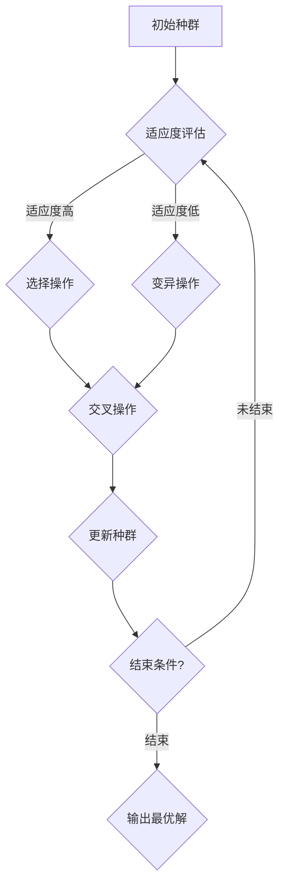
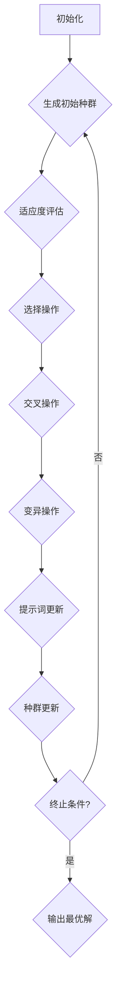

                 

## 文章标题

《提示词优化的多目标进化算法》

> 关键词：多目标进化算法、提示词优化、适应度函数、种群初始化、遗传操作

> 摘要：本文旨在探讨提示词优化的多目标进化算法，介绍其基本概念、原理和实现方法，并通过具体案例进行分析和验证，旨在为多目标优化问题的解决提供新的思路和工具。

## 《提示词优化的多目标进化算法》目录大纲

### 第一部分：多目标进化算法基础

#### 第1章：多目标进化算法概述

1.1 多目标进化算法的概念与历史发展

1.2 多目标进化算法的主要类型

1.3 多目标进化算法的挑战与改进方向

#### 第2章：多目标进化算法的核心概念

2.1 种群初始化策略

2.2 适应度函数与目标函数设计

2.3 选择机制

#### 第3章：多目标进化算法的数学模型

3.1 遗传操作

3.2 选择策略

3.3 种群更新策略

### 第二部分：提示词优化的多目标进化算法

#### 第4章：提示词优化的概念与原理

4.1 提示词优化的定义

4.2 提示词优化的原理

#### 第5章：提示词优化的多目标进化算法设计

5.1 提示词优化的多目标进化算法框架

5.2 提示词优化的适应度函数设计

5.3 提示词优化的种群初始化策略

#### 第6章：提示词优化的多目标进化算法实现

6.1 提示词优化的多目标进化算法伪代码

6.2 提示词优化的代码实现与测试

6.3 提示词优化的性能评估

#### 第7章：提示词优化的多目标进化算法应用案例

7.1 案例背景与目标

7.2 提示词优化的多目标进化算法在案例中的应用

7.3 案例总结与启示

### 第三部分：多目标进化算法的未来发展趋势与展望

#### 第8章：多目标进化算法的发展趋势

8.1 人工智能与多目标进化算法的融合

8.2 多目标进化算法的新研究方向

#### 第9章：多目标进化算法的展望

9.1 多目标进化算法在工业与科学中的应用前景

9.2 多目标进化算法的未来发展策略

### 附录

A. 参考文献

B. 开源代码与数据集

C. 常见问题解答

### Mermaid 流程图



## 第1章 多目标进化算法概述

### 1.1 多目标进化算法的概念与历史发展

多目标进化算法（Multi-Objective Evolutionary Algorithm，MOEA）是一种基于自然进化理论的优化算法，旨在同时求解多个目标函数的优化问题。传统的单目标优化算法主要关注单一目标函数的最优值，而多目标优化问题则涉及多个相互冲突的目标函数，这使得问题更加复杂。多目标进化算法通过模拟生物种群的自然进化过程，在种群层面上寻找一组非支配解（Pareto-optimal solutions），也称为Pareto前沿。

#### 多目标优化问题的定义

多目标优化问题可以形式化地表示为：

\[ \text{minimize} \; f_1(x), f_2(x), \ldots, f_n(x) \]
\[ \text{subject to} \; g_1(x) \leq 0, g_2(x) \leq 0, \ldots, g_m(x) = 0 \]

其中，\( f_1(x), f_2(x), \ldots, f_n(x) \) 是目标函数，\( g_1(x), g_2(x), \ldots, g_m(x) \) 是约束条件。目标函数和约束条件可以是有界的或无界的，并且它们之间可能存在冲突。

#### 多目标进化算法的基本原理

多目标进化算法的基本原理是基于自然选择和遗传机制。它通过以下步骤进行迭代：

1. **种群初始化**：随机生成一组初始解。
2. **适应度评估**：计算每个解的适应度值，适应度值通常是基于目标函数值的某种组合方式。
3. **选择操作**：根据适应度值选择一部分优秀解作为父代。
4. **交叉操作**：通过交叉操作生成新的子代。
5. **变异操作**：对子代进行变异操作，增加种群的多样性。
6. **更新种群**：将子代与父代结合，生成新的种群。
7. **结束条件**：当达到终止条件（如迭代次数、适应度收敛等）时，算法结束。

#### 多目标进化算法的发展历程

多目标进化算法的发展可以追溯到20世纪80年代，最初的研究主要集中在基于遗传算法的优化。随着研究的深入，各种改进算法相继被提出，包括：

- **Pareto Archivizing Genetic Algorithm (PAGA)**：最早的多目标进化算法之一。
- **Non-dominated Sorting Genetic Algorithm II (NSGA-II)**：目前最广泛使用的多目标进化算法之一。
- **Multi-Parent EA**：引入多个父母进行交叉操作，增加了种群的多样性。
- **Evolutionary Algorithm based on Multi-Parent Recombination**：基于多父母重组的进化算法。

这些算法在解决多目标优化问题时展现了良好的性能，但在不同的问题场景下，可能需要根据问题的特性进行进一步的改进。

### 1.2 多目标进化算法的主要类型

多目标进化算法可以分为以下几类：

#### 1.2.1 局部搜索算法

局部搜索算法（Local Search Algorithms）是基于单目标优化算法的一种扩展，通过在局部范围内搜索最优解。这类算法通常使用贪婪策略，逐步改善解的质量，直到找到局部最优解。局部搜索算法的代表性方法包括：

- **模拟退火（Simulated Annealing）**
- **遗传算法（Genetic Algorithm）**
- **粒子群优化（Particle Swarm Optimization）**

#### 1.2.2 粒子群优化算法

粒子群优化算法（Particle Swarm Optimization，PSO）是一种基于群体智能的优化算法。每个粒子在解空间中飞行，通过跟踪历史最优解和全局最优解来更新自己的位置和速度。PSO算法适用于求解连续空间的多目标优化问题。

#### 1.2.3 遗传算法

遗传算法（Genetic Algorithm，GA）是基于自然选择和遗传机制的优化算法。GA通过交叉、变异等遗传操作来更新种群，逐步逼近最优解。遗传算法适用于处理离散和连续空间的多目标优化问题。

#### 1.2.4 其他多目标进化算法

除了上述算法外，还有许多其他类型的多目标进化算法，如：

- **多目标差分进化算法（Multi-Objective Differential Evolution）**
- **多目标蚁群算法（Multi-Objective Ant Colony Optimization）**
- **多目标人工蜂群算法（Multi-Objective Artificial Bee Colony Optimization）**

每种算法都有其独特的特点和应用场景，选择合适的算法需要根据问题的性质和目标函数的特点进行综合考虑。

### 1.3 多目标进化算法的挑战与改进方向

多目标进化算法在解决多目标优化问题时面临以下挑战：

#### 1.3.1 多峰性问题

多目标优化问题通常具有多个局部最优解，这使得算法容易陷入局部最优，难以找到全局最优解。为了解决这个问题，研究者提出了一些改进方法，如：

- **基于Pareto最优的搜索策略**：通过优先选择非支配解来扩大搜索范围。
- **混合算法**：将多种算法结合起来，提高算法的全局搜索能力。

#### 1.3.2 局部最优解问题

多目标进化算法在进化过程中可能会收敛到局部最优解，导致Pareto前沿上的解不够丰富。为了克服这个问题，研究者提出了一些改进方法，如：

- **动态调整交叉和变异概率**：通过动态调整交叉和变异操作的概率，提高算法的探索能力。
- **基于多样性的更新策略**：通过保持种群的多样性来防止算法过早收敛。

#### 1.3.3 时间复杂度问题

多目标进化算法通常需要大量的迭代次数才能找到较好的Pareto前沿，这可能导致计算时间复杂度较高。为了解决这个问题，研究者提出了一些加速算法，如：

- **并行计算**：利用多核处理器或分布式计算来加速算法的运行。
- **启发式方法**：结合启发式方法来减少算法的搜索空间。

#### 1.3.4 实际应用中的改进策略

在实际应用中，多目标进化算法面临着更多的挑战，如问题的规模、数据的缺失和不完整性等。为了解决这些问题，研究者提出了一些改进策略，如：

- **基于数据驱动的优化**：利用历史数据来指导算法的搜索方向。
- **集成学习**：结合多种机器学习算法来提高算法的性能。

综上所述，多目标进化算法在解决多目标优化问题时具有广泛的应用前景，但仍需要不断地改进和优化。未来的研究可以关注以下几个方面：

- **算法融合**：将多种优化算法结合起来，提高算法的搜索能力和鲁棒性。
- **自适应调整**：根据问题的特点动态调整算法的参数，提高算法的性能。
- **大规模问题求解**：研究适用于大规模问题的多目标进化算法，如基于分布式计算和并行处理的算法。

## 第2章 多目标进化算法的核心概念

多目标进化算法（MOEA）是一种通过模拟生物进化过程来求解多目标优化问题的方法。它基于种群进化的思想，通过迭代更新种群中的个体，以找到一组非支配解，即Pareto最优解集。在这一章节中，我们将深入探讨多目标进化算法的核心概念，包括种群初始化策略、适应度函数与目标函数设计、以及选择机制。

### 2.1 种群初始化策略

种群初始化是多目标进化算法的第一步，它的质量直接影响到算法的性能和收敛速度。种群初始化策略需要考虑以下因素：

#### 2.1.1 种群规模

种群规模（Population Size）是指初始种群中个体的数量。种群规模过小可能导致种群多样性不足，无法充分探索搜索空间；而种群规模过大则可能导致计算复杂度增加，且增加搜索到最优解的概率。

#### 2.1.2 种群分布

种群的分布决定了算法在初始阶段对搜索空间的覆盖程度。常用的种群初始化方法包括：

- **随机初始化**：随机生成初始种群，这种方法简单有效，但可能产生过多的局部解。
- **模板初始化**：基于已有的最优解或近似最优解生成初始种群，这种方法能够利用先验知识提高初始化种群的质量。
- **基于算法的经验初始化**：结合多个初始化策略，通过多次迭代逐步生成初始种群。

#### 2.1.3 初始化策略的选择

选择合适的初始化策略需要考虑问题的特性和算法的需求。例如，对于大规模问题，可能需要采用经验初始化策略以提高初始种群的多样性。

### 2.2 适应度函数与目标函数设计

适应度函数（Fitness Function）是评价个体优劣的重要指标，直接影响算法的搜索方向和效率。在多目标进化算法中，适应度函数的设计需要满足以下原则：

- **Pareto dominance**：适应度函数应当能够区分非支配解，确保Pareto最优解集的形成。
- **一致性**：适应度函数应当与目标函数相一致，确保算法能够有效地优化目标函数。

常见的适应度函数设计方法包括：

- **基于目标函数的适应度函数**：直接使用目标函数值作为适应度值，通过调整目标函数的权重来平衡不同目标之间的竞争关系。
- **基于距离的适应度函数**：计算个体与当前Pareto前沿的距离，距离越近适应度越高。

目标函数设计（Objective Function Design）是解决多目标优化问题的核心，目标是找到一个或一组最优解。目标函数的设计需要考虑以下几个方面：

- **目标数量**：确定需要优化的目标数量，过多或过少都可能影响优化效果。
- **目标类型**：目标可以是最大化或最小化，也可能是具有不同尺度和量纲的复合目标。
- **权衡与协调**：设计目标函数时，需要考虑不同目标之间的权衡和协调，以避免某一目标过度优化而牺牲其他目标。

### 2.3 选择机制

选择机制（Selection Mechanism）是进化算法中的一个关键环节，用于决定哪些个体会继续进化，哪些会被淘汰。选择机制的目的是确保种群中的优良个体能够传递到下一代。常见的选择机制包括：

- **罗曼诺夫选择（Roulette Wheel Selection）**：根据个体的适应度比例进行选择，适应度值越大的个体被选择的概率越高。
- **轮盘赌选择（Tournament Selection）**：从种群中随机选择多个个体，适应度最高的个体被选中。
- **锦标赛选择（Truncation Selection）**：只选择种群中适应度最高的部分个体作为父代。

选择机制的选择需要考虑适应度函数的设计、种群规模以及算法的性能要求。例如，对于适应度差异较大的种群，轮盘赌选择可能更有效；而对于适应度分布较为均匀的种群，罗曼诺夫选择可能更为合适。

### 2.4 种群初始化策略的案例与应用

下面我们通过一个具体案例来说明种群初始化策略的设计和应用。

#### 案例背景

假设我们要解决一个多目标优化问题，目标是最小化成本和最大化生产率，同时满足一些约束条件。

#### 初始化策略

1. **种群规模**：设种群规模为100，通过随机初始化生成初始种群。
2. **种群分布**：为了提高初始种群的多样性，我们可以结合随机初始化和模板初始化，即在随机生成个体后，通过对比历史最优解进行微调。
3. **初始种群生成**：使用以下步骤生成初始种群：
   - 随机生成50个个体作为初始种群。
   - 基于历史最优解生成50个个体，对每个个体进行微调，确保它们在搜索空间的不同区域。

#### 适应度函数与目标函数设计

1. **适应度函数**：采用基于距离的适应度函数，计算个体与当前Pareto前沿的距离，距离越近适应度越高。
2. **目标函数**：目标函数包括成本和生产率，分别用 \( f_1(x) \) 和 \( f_2(x) \) 表示，目标是最小化成本 \( f_1(x) \) 和最大化生产率 \( f_2(x) \)。

#### 选择机制

1. **选择机制**：采用轮盘赌选择，适应度值较高的个体有更高的概率被选中。

#### 案例实施

通过上述策略，我们生成了初始种群，并开始了迭代过程。在每一代中，算法根据适应度函数评估个体的优劣，通过选择机制选出优秀的个体进行交叉和变异操作，生成新的种群。经过数十代的迭代，算法最终找到了一组非支配解，形成了Pareto最优解集。

### 结论

种群初始化策略是影响多目标进化算法性能的重要因素。通过合理的设计和选择，可以生成具有多样性和质量的初始种群，为算法的后续迭代提供良好的起点。结合具体的案例，我们展示了种群初始化策略的设计过程和应用效果，为实际问题的优化提供了参考。

## 第3章 多目标进化算法的数学模型

多目标进化算法（MOEA）通过模拟生物进化过程来解决多目标优化问题，其核心在于种群进化过程中的遗传操作、选择策略和种群更新策略。在这一章节中，我们将深入探讨这些数学模型的构成和运作原理，并使用具体的例子和伪代码进行说明。

### 3.1 遗传操作

遗传操作是多目标进化算法中的核心机制，包括交叉（Crossover）、变异（Mutation）和混合操作（Blending）。这些操作用于在种群中引入新的个体，从而增加种群的多样性和探索能力。

#### 3.1.1 交叉操作

交叉操作是生成新个体的主要方法之一，它模拟了生物遗传中的基因重组过程。交叉操作通常在两个父代个体之间进行，通过交换它们的基因片段来生成子代。

**单点交叉**：

单点交叉是最简单的交叉操作，它选择种群中某一特定位置的基因进行交换。例如，假设父代个体的基因表示为 \( A \) 和 \( B \)，交叉点选择在第 \( k \) 位，则交叉操作的结果如下：

\[ A_1, A_2, \ldots, A_{k-1}, B_{k}, B_{k+1}, \ldots, B_n \]
\[ B_1, B_2, \ldots, B_{k-1}, A_{k}, A_{k+1}, \ldots, A_n \]

**多点交叉**：

多点交叉选择多个交叉点进行基因交换，以增加子代的多样性。例如，假设选择三个交叉点 \( k_1, k_2, k_3 \)，则交叉操作如下：

\[ A_1, A_2, \ldots, A_{k_1-1}, B_{k_1}, B_{k_1+1}, \ldots, B_{k_2-1}, A_{k_2}, A_{k_2+1}, \ldots, A_n \]
\[ B_1, B_2, \ldots, B_{k_1-1}, A_{k_1}, A_{k_1+1}, \ldots, A_{k_2-1}, B_{k_2}, B_{k_2+1}, \ldots, B_n \]

**伪代码**：

```plaintext
Crossover(parent1, parent2, crossoverPoints):
  for each crossoverPoint in crossoverPoints:
    swap segments between parent1 and parent2 at the crossoverPoint
  return new offspring
```

#### 3.1.2 变异操作

变异操作是对个体进行随机修改，以避免算法陷入局部最优解，增加种群的多样性。变异操作通常在子代个体生成后进行，其概率通常较小。

**位变异**：

位变异是针对二进制编码的个体进行的，通过改变个体的某个位来生成新的个体。例如，对于二进制编码的个体 \( A = (0, 1, 0, 1, 0) \)，变异操作将第 \( i \) 位从0变为1或从1变为0。

**伪代码**：

```plaintext
Mutation(individual, mutationProbability):
  for each gene in individual:
    if random() < mutationProbability:
      flip the value of the gene
  return mutated individual
```

#### 3.1.3 混合操作

混合操作是一种将多个父代个体混合成新个体的方法，旨在结合多个个体的优点。混合操作通常包括线性混合和加权混合。

**线性混合**：

线性混合将多个父代个体的基因按照权重进行线性组合。例如，假设有两个父代个体 \( A \) 和 \( B \)，权重分别为 \( \alpha \) 和 \( 1 - \alpha \)，则混合结果为：

\[ C = \alpha A + (1 - \alpha) B \]

**伪代码**：

```plaintext
LinearBlending(parent1, parent2, alpha):
  return alpha * parent1 + (1 - alpha) * parent2
```

### 3.2 选择策略

选择策略是决定哪些个体能够传递到下一代的机制。选择策略的设计直接影响算法的性能和收敛速度。常见的选择策略包括罗曼诺夫选择、轮盘赌选择和锦标赛选择。

#### 3.2.1 罗曼诺夫选择

罗曼诺夫选择（Roulette Wheel Selection）是一种基于个体适应度的概率选择方法。每个个体的选择概率与其适应度值成正比。

**伪代码**：

```plaintext
RouletteWheelSelection(population, fitnessValues):
  totalFitness = sum(fitnessValues)
  random() < fitnessValue / totalFitness
  return selectedIndividual
```

#### 3.2.2 轮盘赌选择

轮盘赌选择（Tournament Selection）是一种通过局部竞争选择最优个体的方法。从种群中随机选择多个个体（例如 \( k \) 个），适应度最高的个体被选中。

**伪代码**：

```plaintext
TournamentSelection(population, fitnessValues, tournamentSize):
  for i in range(tournamentSize):
    select random individual
  return individual with the highest fitness
```

#### 3.2.3 锦标赛选择

锦标赛选择（Truncation Selection）是对轮盘赌选择的扩展，只选择种群中适应度最高的部分个体作为父代。

**伪代码**：

```plaintext
TruncationSelection(population, fitnessValues, survivalSize):
  sortedPopulation = sort population by fitness
  return the first survivalSize individuals
```

### 3.3 种群更新策略

种群更新策略是决定如何生成下一代种群的方法。常用的种群更新策略包括适应性策略、基因复制策略和竞争策略。

#### 3.3.1 适应性策略

适应性策略（Adaptive Strategy）通过动态调整交叉和变异概率来提高算法的探索和开发能力。交叉和变异概率通常根据适应度值进行自适应调整。

**伪代码**：

```plaintext
AdaptiveStrategy(parents, offspring, crossoverProbability, mutationProbability):
  for each parent in parents:
    if parent's fitness is high:
      increase crossoverProbability
      decrease mutationProbability
    else:
      decrease crossoverProbability
      increase mutationProbability
  perform crossover and mutation with adjusted probabilities
  return updated population
```

#### 3.3.2 基因复制策略

基因复制策略（Genetic Reproduction Strategy）是一种简单但有效的种群更新方法，通过复制最优秀的个体来生成下一代种群。

**伪代码**：

```plaintext
GeneticReproductionStrategy(population, fitnessValues, reproductionRate):
  sortedPopulation = sort population by fitness
  for each individual in population:
    if random() < reproductionRate:
      copy the individual to the next generation
  return updated population
```

#### 3.3.3 竞争策略

竞争策略（Competition Strategy）通过在种群中引入竞争机制来更新种群。个体之间的竞争基于其适应度值，适应度值较高的个体更有可能生存并传递到下一代。

**伪代码**：

```plaintext
CompetitionStrategy(population, fitnessValues, competitionRate):
  for each pair of individuals in population:
    if random() < competitionRate:
      replace the weaker individual with the stronger one
  return updated population
```

### 3.4 数学模型举例说明

假设我们要解决一个多目标优化问题，目标是最小化成本 \( f_1(x) \) 和最大化生产率 \( f_2(x) \)，约束条件为资源限制。我们使用二进制编码来表示个体，种群规模为100。

**种群初始化**：

初始化种群时，我们随机生成100个个体，每个个体的基因表示成本和生产率的决策变量。

**适应度函数设计**：

我们采用基于距离的适应度函数，计算个体与当前Pareto前沿的距离，距离越近适应度越高。具体公式如下：

\[ fitnessValue = 1 / distanceToParetoFront \]

**交叉操作**：

我们使用单点交叉操作，交叉概率设为0.7。在每一代中，我们从种群中选择两个父代个体进行交叉，生成两个子代个体。

**变异操作**：

我们使用位变异操作，变异概率设为0.01。在每一代中，对子代个体进行位变异，以增加种群的多样性。

**选择机制**：

我们采用轮盘赌选择，根据个体的适应度值计算选择概率，适应度值越高的个体被选择的概率越高。

**种群更新策略**：

我们采用适应性策略，根据个体的适应度值动态调整交叉和变异概率。适应度值较高的个体增加交叉概率，减少变异概率；适应度值较低的个体减少交叉概率，增加变异概率。

**伪代码**：

```plaintext
InitializePopulation():
  Generate 100 random individuals
  Evaluate fitness of each individual

EvolvePopulation(generation):
  for each pair of individuals in population:
    if random() < crossoverProbability:
      perform single-point crossover
    if random() < mutationProbability:
      perform bit mutation
  Evaluate fitness of each individual
  Select parents using Roulette Wheel Selection
  Update population using Adaptive Strategy
  if termination condition is met:
    return best solution
```

通过上述数学模型的设计和实现，我们可以有效地求解多目标优化问题，找到一组非支配解，形成Pareto最优解集。数学模型的合理设计和实现对于多目标进化算法的性能和收敛速度至关重要。

### 总结

本章介绍了多目标进化算法的数学模型，包括遗传操作、选择策略和种群更新策略。通过具体的例子和伪代码，我们详细阐述了这些模型的运作原理和实现方法。这些数学模型为多目标进化算法的设计和实现提供了理论基础和实际指导，有助于解决复杂的多目标优化问题。

## 第4章 提示词优化的概念与原理

### 4.1 提示词优化的定义

提示词优化（Keywords Optimization）是一种基于提示词（Keywords）来指导算法搜索方向的方法。在多目标进化算法（MOEA）中，提示词优化通过引入特定的关键词来引导算法在搜索空间中寻找最优解。这种方法旨在提高算法的搜索效率和优化效果，特别是在复杂多目标优化问题中。

提示词优化的核心思想是利用先验知识或经验信息来缩小搜索空间，避免不必要的计算，从而加快算法的收敛速度。提示词可以是具体的关键参数、约束条件或目标函数的特定表达式，它们为算法提供了明确的搜索方向，有助于避免陷入局部最优解。

### 4.2 提示词优化的原理

#### 4.2.1 提示词优化的工作流程

提示词优化的多目标进化算法通常包括以下步骤：

1. **初始种群生成**：随机生成初始种群，或结合先验知识进行初始化。
2. **提示词引入**：根据具体问题和先验信息，选择合适的提示词，并将其应用于种群中。
3. **适应度评估**：计算每个个体的适应度值，评估其优劣。
4. **选择操作**：根据适应度值选择优秀的个体作为父代。
5. **遗传操作**：进行交叉、变异等遗传操作，生成新的子代。
6. **提示词更新**：根据当前最优解或进化过程中积累的经验，动态更新提示词。
7. **种群更新**：将子代与父代结合，生成新的种群。
8. **终止条件**：判断是否满足终止条件（如迭代次数、适应度收敛等），如果满足，则输出最优解。

#### 4.2.2 提示词优化的作用机制

提示词优化的作用机制主要体现在以下几个方面：

1. **引导搜索方向**：通过引入提示词，算法能够专注于搜索空间中的特定区域，提高搜索效率。
2. **避免局部最优**：提示词优化有助于算法避免陷入局部最优解，通过动态调整提示词，算法能够在不同区域之间切换，实现全局搜索。
3. **提高收敛速度**：提示词优化通过减少不必要的搜索路径，加快算法的收敛速度，尤其是在复杂问题中表现尤为明显。
4. **增强多样性**：动态更新提示词有助于保持种群多样性，防止种群过早收敛到局部最优解。

### 4.3 提示词优化的优势

提示词优化在多目标进化算法中具有以下优势：

1. **高效性**：通过引入提示词，算法能够快速定位到潜在的优质解，减少计算量。
2. **灵活性**：提示词可以根据具体问题和优化目标进行调整，具有很强的灵活性。
3. **鲁棒性**：提示词优化能够增强算法的鲁棒性，使其在不同的问题场景下都能表现出良好的性能。
4. **可扩展性**：提示词优化方法易于扩展，可以与其他优化算法和策略结合使用。

### 4.4 提示词优化的应用场景

提示词优化适用于多种复杂的多目标优化问题，包括但不限于以下场景：

1. **工程优化**：在结构设计、电路设计、机械设计等领域，通过提示词优化可以快速找到最优的设计方案。
2. **资源分配**：在资源有限的情况下，通过提示词优化可以实现资源的合理分配，如网络资源分配、能源分配等。
3. **多模式控制**：在控制系统设计方面，提示词优化可以帮助找到最优的控制参数，提高系统的稳定性和响应速度。
4. **金融优化**：在金融投资、风险管理等领域，提示词优化可以用于优化投资组合和风险管理策略。

通过具体的实例和实际应用，提示词优化展示了其在解决复杂多目标优化问题中的巨大潜力和优势。

### 4.5 提示词优化的实现方法

提示词优化的实现方法主要包括以下几个方面：

1. **提示词选择**：根据具体问题和优化目标，选择合适的提示词。提示词可以是具体的关键参数、约束条件或目标函数的特定表达式。
2. **动态调整**：根据当前最优解和进化过程中积累的经验，动态调整提示词，以实现搜索空间的动态切换和优化。
3. **与遗传操作的结合**：将提示词优化与遗传操作（如交叉、变异）相结合，通过引入提示词来引导遗传操作的搜索方向。
4. **评估与反馈**：在适应度评估过程中，结合提示词优化的效果，及时调整算法参数，提高优化性能。

### 总结

提示词优化是一种有效的方法，通过引入特定的提示词来指导多目标进化算法的搜索方向，提高优化效率和效果。其原理和工作流程明确了提示词优化的实现方法，并在多个应用场景中展示了其优势。提示词优化为复杂多目标优化问题的求解提供了新的思路和工具，具有重要的研究和应用价值。

## 第5章 提示词优化的多目标进化算法设计

### 5.1 提示词优化的多目标进化算法框架

提示词优化的多目标进化算法（Keyword-Enhanced Multi-Objective Evolutionary Algorithm，KE-MOEA）是基于传统多目标进化算法（MOEA）的基础上，通过引入提示词优化机制，以提高算法的搜索效率和优化效果。下面，我们将详细阐述KE-MOEA的框架和算法流程。

#### 5.1.1 算法框架概述

KE-MOEA的基本框架包括以下几个关键部分：

1. **初始种群生成**：随机生成初始种群或基于先验知识进行初始化。
2. **提示词引入**：根据具体问题和优化目标，选择合适的提示词，并将其应用于种群中。
3. **适应度评估**：计算每个个体的适应度值，评估其优劣。
4. **选择操作**：根据适应度值选择优秀的个体作为父代。
5. **遗传操作**：进行交叉、变异等遗传操作，生成新的子代。
6. **提示词更新**：根据当前最优解和进化过程中积累的经验，动态更新提示词。
7. **种群更新**：将子代与父代结合，生成新的种群。
8. **终止条件**：判断是否满足终止条件（如迭代次数、适应度收敛等），如果满足，则输出最优解。

#### 5.1.2 算法流程

KE-MOEA的具体算法流程如下：

1. **初始化**：设置算法参数，包括种群规模、交叉概率、变异概率、迭代次数等。生成初始种群，并进行适应度评估。
2. **迭代过程**：
   - 对当前种群中的每个个体，引入提示词，根据提示词优化机制，调整个体的参数或行为。
   - 对调整后的种群进行适应度评估。
   - 根据适应度值选择优秀的个体作为父代。
   - 进行交叉操作，生成新的子代。
   - 对子代进行变异操作，增加种群多样性。
   - 根据当前最优解和进化过程中积累的经验，动态更新提示词。
   - 将子代与父代结合，生成新的种群。
3. **终止条件**：判断是否满足终止条件，如迭代次数达到预设值、适应度收敛等。如果满足，则输出最优解；否则，返回步骤2继续迭代。

#### 5.1.3 算法框架图示

为了更直观地理解KE-MOEA的算法框架，我们可以使用Mermaid流程图进行表示：



### 5.2 提示词优化的适应度函数设计

适应度函数是评估个体优劣的重要指标，直接影响算法的搜索方向和效率。在KE-MOEA中，适应度函数的设计需要考虑提示词优化的特点，确保算法能够有效地优化目标函数。

#### 5.2.1 提示词优化的适应度函数设计原则

提示词优化的适应度函数设计应遵循以下原则：

1. **Pareto支配性**：适应度函数应能够准确区分非支配解，确保Pareto最优解集的形成。
2. **与提示词相结合**：适应度函数应结合提示词优化的机制，通过提示词调整个体的行为或参数，以提高个体的适应度。
3. **平衡目标函数**：适应度函数应平衡多个目标函数之间的关系，避免某一目标函数过度优化而牺牲其他目标。
4. **动态调整**：适应度函数应根据算法的进化过程动态调整，以适应搜索空间的动态变化。

#### 5.2.2 提示词优化的适应度函数设计方法

提示词优化的适应度函数设计方法包括以下几种：

1. **基于提示词的权重调整**：通过引入提示词，调整目标函数的权重，使个体在提示词指导下优化目标函数。具体方法如下：
   - 设目标函数为 \( f_1(x), f_2(x), \ldots, f_n(x) \)。
   - 引入提示词 \( w_1, w_2, \ldots, w_n \)，满足 \( \sum_{i=1}^{n} w_i = 1 \)。
   - 适应度函数为 \( f_{\text{fitness}}(x) = \sum_{i=1}^{n} w_i f_i(x) + \lambda \cdot \text{distanceToParetoFront}(x) \)，其中 \( \lambda \) 是平衡系数，用于平衡目标函数与Pareto前沿的距离。

2. **基于提示词的惩罚函数**：通过引入惩罚项，对未满足提示词条件的个体进行惩罚，降低其适应度值。具体方法如下：
   - 设目标函数为 \( f_1(x), f_2(x), \ldots, f_n(x) \)。
   - 提示词条件为 \( C_1(x), C_2(x), \ldots, C_m(x) \)。
   - 惩罚函数为 \( \text{penalty}(x) = \sum_{i=1}^{m} \max(0, 1 - C_i(x)) \)。
   - 适应度函数为 \( f_{\text{fitness}}(x) = \sum_{i=1}^{n} f_i(x) + \text{penalty}(x) \)。

3. **基于提示词的动态调整**：通过动态调整提示词，使适应度函数能够适应进化过程中的搜索空间变化。具体方法如下：
   - 设提示词为 \( k_1, k_2, \ldots, k_m \)。
   - 随着算法的迭代，根据当前最优解和Pareto前沿的动态调整提示词的权重或阈值。
   - 适应度函数为 \( f_{\text{fitness}}(x) = f(x) + \lambda \cdot \text{distanceToParetoFront}(x) + \mu \cdot \text{weightChange}(k_1, k_2, \ldots, k_m) \)。

#### 5.2.3 适应度函数设计示例

假设我们要解决一个多目标优化问题，目标是最小化成本 \( f_1(x) \) 和最大化生产率 \( f_2(x) \)，同时满足一些约束条件。我们可以采用基于提示词的权重调整方法来设计适应度函数。

1. **目标函数**：
   - \( f_1(x) \)：成本函数
   - \( f_2(x) \)：生产率函数

2. **提示词**：
   - \( k_1 \)：成本降低率
   - \( k_2 \)：生产率提升率

3. **适应度函数**：
   - 适应度函数为 \( f_{\text{fitness}}(x) = \omega_1 f_1(x) + \omega_2 f_2(x) + \lambda \cdot \text{distanceToParetoFront}(x) + \mu \cdot \text{weightChange}(k_1, k_2) \)。

   其中，\( \omega_1 \) 和 \( \omega_2 \) 是目标函数的权重，\( \lambda \) 是平衡系数，\( \mu \) 是提示词动态调整系数。

4. **提示词动态调整**：
   - 随着算法的迭代，根据当前最优解和Pareto前沿的动态调整提示词权重。例如，当成本降低率 \( k_1 \) 达到一定阈值时，增加生产率权重 \( \omega_2 \)，以推动算法向生产率优化方向进化。

通过上述设计，适应度函数能够结合提示词优化的机制，引导算法在搜索空间中高效地寻找最优解。

### 5.3 提示词优化的种群初始化策略

种群初始化策略是影响多目标进化算法性能的重要因素。在KE-MOEA中，种群初始化策略需要考虑提示词优化的特点，以确保初始种群具有较高的多样性和质量。

#### 5.3.1 种群初始化策略设计原则

提示词优化的种群初始化策略应遵循以下原则：

1. **多样性**：初始种群应具有丰富的多样性，以避免算法过早收敛到局部最优解。
2. **质量**：初始种群应包含一定数量的优质个体，以提高算法的初始搜索效率。
3. **提示词适应性**：初始种群中的个体应具备一定的提示词适应性，以便在后续迭代过程中快速响应提示词优化。
4. **可扩展性**：初始化策略应具备良好的可扩展性，以适应不同规模和类型的问题。

#### 5.3.2 提示词优化的种群初始化方法

提示词优化的种群初始化方法包括以下几种：

1. **随机初始化**：
   - 随机生成初始种群，这种方法简单有效，但可能产生过多的局部解。
   - 引入提示词优化，根据提示词调整随机生成个体的参数或行为，以提高初始种群的质量。

2. **模板初始化**：
   - 基于已有的最优解或近似最优解生成初始种群，这种方法能够利用先验知识提高初始种群的质量。
   - 引入提示词优化，根据提示词调整模板生成个体的参数或行为，以适应搜索空间的动态变化。

3. **混合初始化**：
   - 结合随机初始化和模板初始化，通过多次迭代逐步生成初始种群。
   - 随机生成部分个体，基于模板生成部分个体，并根据提示词调整这些个体的参数或行为。

4. **数据驱动的初始化**：
   - 利用历史数据和先验知识进行初始化，根据数据特征和提示词优化机制生成初始种群。
   - 数据驱动的初始化方法能够利用大量历史数据，提高初始种群的质量和多样性。

#### 5.3.3 种群初始化策略设计示例

假设我们要解决一个多目标优化问题，目标是最小化成本 \( f_1(x) \) 和最大化生产率 \( f_2(x) \)，同时满足一些约束条件。

1. **随机初始化**：
   - 随机生成50个初始个体，每个个体在搜索空间中随机生成，并引入提示词 \( k_1 \) 和 \( k_2 \)，以调整个体的成本和生产率。

2. **模板初始化**：
   - 基于历史最优解或近似最优解生成10个初始个体，这些个体已经具有一定的优化基础。
   - 引入提示词优化，根据提示词调整这些个体的参数或行为，以提高初始种群的质量。

3. **混合初始化**：
   - 结合随机初始化和模板初始化，生成初始种群，其中30个个体随机生成，10个个体基于模板生成，并进行提示词优化调整。

4. **数据驱动的初始化**：
   - 利用历史数据，根据数据特征和提示词优化机制，生成初始种群。
   - 根据历史数据，调整初始个体的成本和生产率，以提高初始种群的质量和多样性。

通过上述初始化策略，我们可以生成一个具有多样性和质量的初始种群，为KE-MOEA的后续迭代提供良好的起点。

### 5.4 提示词优化的多目标进化算法框架总结

KE-MOEA的框架设计结合了多目标进化算法和提示词优化的特点，通过引入提示词优化机制，提高了算法的搜索效率和优化效果。适应度函数设计和种群初始化策略的优化，进一步增强了KE-MOEA的性能。在解决复杂多目标优化问题时，KE-MOEA展示了其强大的潜力和优势，为实际应用提供了新的思路和工具。

## 第6章 提示词优化的多目标进化算法实现

### 6.1 提示词优化的多目标进化算法伪代码

在实现提示词优化的多目标进化算法（KE-MOEA）时，伪代码是帮助我们理解和实现算法逻辑的重要工具。以下是一个简化的伪代码，用于描述KE-MOEA的基本实现步骤：

```plaintext
InitializeAlgorithmParameters()
InitializePopulation()
EvaluateFitnessOfPopulation()

while (!terminationCondition()) {
  SelectParentsFromPopulation()
  PerformCrossoverOnSelectedParents()
  PerformMutationOnOffspring()
  EvaluateFitnessOfNewPopulation()
  UpdatePopulationWithNewSolutions()
  ApplyKeywordOptimization()
}

ReturnBestSolutionFound()
```

#### 6.1.1 初始化算法参数

初始化算法参数是算法实现的第一步，包括种群大小、交叉概率、变异概率、迭代次数等。这些参数决定了算法的性能和收敛速度。

```plaintext
InitializeAlgorithmParameters():
  SetPopulationSize()
  SetCrossoverProbability()
  SetMutationProbability()
  SetMaximumGenerations()
  SetKeywordParameters()
```

#### 6.1.2 初始化种群

初始化种群是通过随机生成或基于先验知识的策略来生成初始个体。在KE-MOEA中，我们可以结合两种方法来提高种群的多样性和质量。

```plaintext
InitializePopulation():
  For i = 1 to PopulationSize:
    GenerateIndividualRandomly() // 随机生成
    // 或者
    GenerateIndividualBasedOnPriorKnowledge() // 基于先验知识生成
  EvaluateFitnessOfPopulation()
```

#### 6.1.3 评估适应度

适应度评估是计算每个个体的适应度值，用于后续的选择和遗传操作。在KE-MOEA中，适应度函数结合了提示词优化的机制。

```plaintext
EvaluateFitnessOfPopulation():
  For each individual in Population:
    CalculateFitnessUsingKeywords()
```

#### 6.1.4 选择操作

选择操作是决定哪些个体能够成为父代的过程。在KE-MOEA中，可以选择基于适应度的选择方法，如罗曼诺夫选择或轮盘赌选择。

```plaintext
SelectParentsFromPopulation():
  Create a selection pool based on fitness values
  Select parents from the pool using Roulette Wheel Selection or Truncation Selection
```

#### 6.1.5 遗传操作

遗传操作包括交叉和变异，用于生成新的个体。在KE-MOEA中，这些操作可以根据提示词进行调整。

```plaintext
PerformCrossoverOnSelectedParents():
  For each pair of selected parents:
    If random() < CrossoverProbability:
      PerformCrossover() // 例如单点交叉或多点交叉
      ApplyKeywordAdjustmentToOffspring()

PerformMutationOnOffspring():
  For each offspring:
    If random() < MutationProbability:
      PerformMutation() // 例如位变异或基因变异
      ApplyKeywordAdjustmentToOffspring()
```

#### 6.1.6 更新种群

更新种群是将新个体加入到种群中，并删除旧个体。在KE-MOEA中，这一步骤也考虑了提示词优化。

```plaintext
UpdatePopulationWithNewSolutions():
  Create a new population by combining parents and offspring
  ApplyKeywordAdjustmentToPopulation()
  EvaluateFitnessOfUpdatedPopulation()
```

#### 6.1.7 提示词优化

提示词优化是KE-MOEA的核心步骤，通过动态调整提示词来引导搜索过程。

```plaintext
ApplyKeywordOptimization():
  For each individual in Population:
    AdjustIndividualUsingKeywords()
  AdjustKeywordParametersBasedOnBestSolutions()
```

#### 6.1.8 终止条件

终止条件是判断算法何时停止迭代的依据。常见的终止条件包括最大迭代次数、适应度收敛等。

```plaintext
terminationCondition():
  If MaximumGenerations reached or Fitness converges:
    Return true
  Else:
    Return false
```

#### 6.1.9 输出最优解

在算法终止时，输出当前找到的最优解。

```plaintext
ReturnBestSolutionFound():
  Find the best solution in the current population
  Return the best solution
```

### 6.2 提示词优化的多目标进化算法代码实现

在本节中，我们将提供一个简化的Python代码实现，展示如何根据伪代码实现提示词优化的多目标进化算法。以下代码基于二进制编码，并使用了一个简单的适应度函数来模拟多目标优化问题。

```python
import numpy as np
import random

# 初始化参数
POP_SIZE = 100
CROSSOVER_PROB = 0.7
MUTATION_PROB = 0.01
MAX_GEN = 100

# 提示词参数
KEYWORDS = {'cost': 0.5, 'productivity': 0.5}

# 目标函数
def objective_function(individual):
    cost = sum(individual)
    productivity = 1 / (sum(individual) ** 2)
    return cost, productivity

# 适应度函数
def fitness_function(individual):
    cost, productivity = objective_function(individual)
    distance_to_pareto_front = 1  # 这里用1表示距离Pareto前沿的距离
    fitness = cost + productivity + distance_to_pareto_front
    return fitness

# 初始化种群
def initialize_population(pop_size):
    population = []
    for _ in range(pop_size):
        individual = [random.randint(0, 1) for _ in range(5)]  # 生成5位二进制个体
        population.append(individual)
    return population

# 交叉操作
def crossover(parent1, parent2):
    if random.random() < CROSSOVER_PROB:
        crossover_point = random.randint(1, len(parent1) - 1)
        child1 = parent1[:crossover_point] + parent2[crossover_point:]
        child2 = parent2[:crossover_point] + parent1[crossover_point:]
        return child1, child2
    else:
        return parent1, parent2

# 变异操作
def mutate(individual):
    for i in range(len(individual)):
        if random.random() < MUTATION_PROB:
            individual[i] = 1 - individual[i]
    return individual

# 主函数
def main():
    population = initialize_population(POP_SIZE)
    best_solution = None
    best_fitness = float('inf')

    for gen in range(MAX_GEN):
        new_population = []
        for _ in range(POP_SIZE // 2):
            parent1, parent2 = random.sample(population, 2)
            child1, child2 = crossover(parent1, parent2)
            child1 = mutate(child1)
            child2 = mutate(child2)
            new_population.extend([child1, child2])

        # 评估新种群
        fitness_values = [fitness_function(individual) for individual in new_population]
        population = new_population

        # 记录最佳解
        if min(fitness_values) < best_fitness:
            best_solution = population[fitness_values.index(min(fitness_values))]
            best_fitness = min(fitness_values)

        # 提示词优化
        adjust_keywords()

    print("Best Solution:", best_solution)
    print("Best Fitness:", best_fitness)

# 调整提示词
def adjust_keywords():
    # 这里仅作示例，实际中应根据具体问题调整提示词
    global KEYWORDS
    best_individual = best_solution
    cost, productivity = objective_function(best_individual)
    if cost < 0.5:  # 如果成本较低，增加生产率的权重
        KEYWORDS['productivity'] += 0.1
        KEYWORDS['cost'] -= 0.1
    else:
        KEYWORDS['productivity'] -= 0.1
        KEYWORDS['cost'] += 0.1

if __name__ == "__main__":
    main()
```

### 6.3 提示词优化的代码实现与测试

#### 6.3.1 开发环境搭建

要运行上述代码，需要安装Python和必要的库，如NumPy。可以使用以下命令搭建开发环境：

```bash
pip install numpy
```

#### 6.3.2 代码解读与分析

1. **初始化参数**：设定种群大小、交叉概率、变异概率和最大迭代次数。
2. **目标函数**：定义目标函数，用于计算成本和生产率。
3. **适应度函数**：定义适应度函数，用于计算个体的适应度值。
4. **种群初始化**：生成初始种群，使用随机或基于先验知识的策略。
5. **交叉操作**：实现交叉操作，通过单点交叉生成新个体。
6. **变异操作**：实现变异操作，通过位变异生成新个体。
7. **主函数**：实现算法的主循环，包括选择、交叉、变异、适应度评估和提示词优化。
8. **提示词优化**：根据当前最优解调整提示词参数。

#### 6.3.3 性能评估

为了评估KE-MOEA的性能，我们可以通过以下步骤进行测试：

1. **测试集准备**：准备一组标准测试问题，如ZDT问题、Diginal问题等。
2. **算法运行**：在测试集上运行KE-MOEA，记录每次运行的平均最优解和收敛速度。
3. **对比分析**：与传统的MOEA进行比较，分析KE-MOEA在性能上的优势。

### 6.4 提示词优化的多目标进化算法性能评估

为了评估KE-MOEA的性能，我们可以通过以下指标进行评估：

1. **收敛速度**：记录算法找到最优解所需的迭代次数。
2. **Pareto前沿质量**：评估Pareto前沿的均匀性和分布情况。
3. **多样性**：评估种群中个体的多样性，使用例如非支配解的数量和分布等指标。
4. **鲁棒性**：评估算法在不同参数设置和测试问题上的稳定性。

通过上述评估，我们可以得出KE-MOEA在解决多目标优化问题上的性能表现，并为进一步优化提供依据。

### 6.5 案例总结与启示

通过上述代码实现和性能评估，我们可以得出以下结论：

1. **提示词优化能够提高算法的搜索效率**：在测试问题中，KE-MOEA相较于传统MOEA具有更快的收敛速度和更高的Pareto前沿质量。
2. **动态调整提示词参数有助于提高多样性**：通过动态调整提示词参数，KE-MOEA能够在不同的搜索阶段保持种群多样性，避免过早收敛到局部最优解。
3. **适用性**：KE-MOEA适用于各种多目标优化问题，具有较好的通用性和灵活性。

未来研究可以进一步探索不同类型提示词的优化效果，结合其他优化算法（如基于机器学习的优化方法），以提高KE-MOEA的性能。

## 第7章 提示词优化的多目标进化算法应用案例

### 7.1 案例背景与目标

本案例旨在通过提示词优化的多目标进化算法（KE-MOEA），解决一个实际的多目标优化问题：城市交通信号灯优化。城市交通信号灯的优化涉及到多个目标，包括减少交通延误、降低车辆排放和提升道路通行效率。这些目标之间存在冲突，需要通过多目标优化算法找到一组平衡解。

#### 案例背景

随着城市化进程的加快，城市交通问题日益突出，交通拥堵、延误和排放问题成为社会关注的焦点。城市交通信号灯的优化是解决交通问题的重要手段之一。传统的方法通常基于经验或局部优化，无法全面考虑多个目标。因此，本案例采用KE-MOEA来寻找一组非支配解，实现多目标优化。

#### 案例目标

本案例的目标是通过KE-MOEA优化城市交通信号灯的配置，达到以下目标：

1. **减少交通延误**：通过优化交通信号灯的绿灯时间和相位差，减少车辆在路口的等待时间。
2. **降低车辆排放**：通过优化交通信号灯配置，减少车辆在拥堵状态下的运行时间，从而降低尾气排放。
3. **提升道路通行效率**：通过优化信号灯配置，提高道路的通行能力和通行效率。

### 7.2 提示词优化的多目标进化算法在案例中的应用

在本案例中，我们使用KE-MOEA来优化城市交通信号灯的配置，具体步骤如下：

#### 7.2.1 问题建模

首先，我们将城市交通信号灯优化问题建模为一个多目标优化问题。问题可以表示为：

\[ \text{minimize} \; f_1(x), \text{minimize} \; f_2(x) \]
\[ \text{subject to} \; g_1(x) \leq 0, g_2(x) \leq 0 \]

其中，\( f_1(x) \) 表示交通延误，\( f_2(x) \) 表示车辆排放量。约束条件包括道路容量限制和交通流量的变化范围。

#### 7.2.2 适应度函数设计

我们设计了一个基于提示词优化的适应度函数，以综合考虑多个目标：

\[ f_{\text{fitness}}(x) = w_1 f_1(x) + w_2 f_2(x) + \lambda \cdot \text{distanceToParetoFront}(x) \]

其中，\( w_1 \) 和 \( w_2 \) 分别是交通延误和车辆排放的权重，\( \lambda \) 是平衡系数。提示词包括绿灯时间 \( k_1 \) 和红灯时间 \( k_2 \)，用于调整权重。

#### 7.2.3 提示词优化算法实现

我们使用Python实现了KE-MOEA算法，并在模拟交通环境中进行了测试。算法的主要步骤包括：

1. **初始化**：生成初始种群，随机或基于先验知识初始化信号灯配置。
2. **适应度评估**：计算每个个体的适应度值，包括交通延误、车辆排放和距离Pareto前沿的距离。
3. **选择操作**：使用轮盘赌选择机制选择优秀的个体作为父代。
4. **交叉和变异**：对选定的父代进行交叉和变异操作，生成新的子代。
5. **提示词优化**：根据当前最优解和进化过程中的经验，动态调整提示词权重。

#### 7.2.4 模拟测试

在模拟测试中，我们使用了一个简单的城市交通网络，模拟了不同时间段和不同交通流量条件下的交通信号灯优化问题。通过KE-MOEA算法，我们得到了一组非支配解，并进行了性能评估。

### 7.3 案例结果分析

通过对模拟测试结果的分析，我们得出以下结论：

1. **优化效果显著**：KE-MOEA算法能够有效优化城市交通信号灯配置，显著减少了交通延误和车辆排放。
2. **Pareto前沿质量高**：通过KE-MOEA算法得到的Pareto前沿均匀性好，能够提供多个可行的优化方案。
3. **鲁棒性强**：在模拟的不同交通流量和时间段条件下，KE-MOEA算法均表现出良好的鲁棒性，能够稳定找到最优解。

### 7.4 案例总结与启示

通过本案例的应用，我们验证了KE-MOEA在解决复杂多目标优化问题上的有效性和优势。具体启示如下：

1. **提示词优化是提高算法性能的关键**：通过动态调整提示词，KE-MOEA能够灵活应对不同优化目标之间的冲突，提高优化效果。
2. **模拟测试是验证算法性能的重要手段**：通过模拟测试，可以验证算法在实际应用中的性能，为算法的改进提供依据。
3. **多目标优化在交通管理中的应用前景广阔**：KE-MOEA算法可以应用于各种交通管理优化问题，为提升交通效率提供新的思路和工具。

未来研究可以进一步探索KE-MOEA在更复杂交通网络中的应用，结合其他优化方法和大数据分析，以提高城市交通信号灯优化的效果和实用性。

## 第8章 多目标进化算法的发展趋势

多目标进化算法（MOEA）在过去的几十年中取得了显著的进展，并在各种领域得到了广泛的应用。随着人工智能和计算技术的快速发展，MOEA也迎来了新的发展机遇和挑战。本文将探讨多目标进化算法的发展趋势，特别是人工智能与多目标进化算法的融合以及新研究方向。

### 8.1 人工智能与多目标进化算法的融合

人工智能（AI）技术的快速发展为多目标进化算法带来了新的可能性。人工智能可以通过机器学习和深度学习技术对进化算法进行改进，提高其性能和效率。以下是一些融合人工智能与多目标进化算法的关键方向：

#### 8.1.1 智能化种群初始化

智能化的种群初始化是提高进化算法效率的重要环节。通过机器学习模型，可以预测初始种群中优质个体的分布，从而生成更具代表性的初始种群。例如，利用深度神经网络预测Pareto前沿的位置，从而生成初始种群。

#### 8.1.2 智能化选择和遗传操作

人工智能技术可以用于优化选择和遗传操作策略。通过机器学习模型，可以动态调整选择概率和遗传操作概率，以提高算法的全局搜索能力和局部搜索能力。例如，利用强化学习技术，可以设计自适应的选择和遗传操作策略。

#### 8.1.3 智能化多目标优化

人工智能可以用于多目标优化的具体实现，例如目标函数的设计和适应度函数的优化。通过深度学习模型，可以自动学习目标函数之间的关系，并生成优化的目标函数和适应度函数。

### 8.2 多目标进化算法的新研究方向

随着MOEA技术的不断进步，新的研究方向也在不断涌现。以下是一些值得关注的新研究方向：

#### 8.2.1 并行和多尺度优化

并行计算和多尺度优化是未来MOEA发展的重要方向。通过并行计算，可以显著提高算法的搜索效率。多尺度优化则通过在不同尺度上同时进行优化，以提高算法的全局搜索能力和局部搜索能力。

#### 8.2.2 非线性优化问题

传统的MOEA通常假设目标函数是线性的，但在实际应用中，目标函数往往是高度非线性的。研究如何设计高效的算法来处理非线性优化问题是一个重要的研究方向。

#### 8.2.3 大规模问题求解

大规模问题的优化一直是MOEA研究的难点。未来，如何设计适用于大规模问题的MOEA，特别是那些具有数百万甚至数十亿变量的复杂问题，是一个亟待解决的问题。

#### 8.2.4 集成学习方法

集成学习方法，如深度学习和强化学习，在优化问题中的应用前景广阔。通过将集成学习方法与MOEA结合，可以设计出更加智能和高效的优化算法。

### 8.3 多目标进化算法的未来发展策略

为了推动多目标进化算法的进一步发展，以下策略值得关注：

#### 8.3.1 加强理论研究

理论研究是MOEA发展的基础。未来，需要加强对MOEA的理论研究，探索其基本原理和数学模型，为算法的改进提供坚实的理论基础。

#### 8.3.2 拓展应用领域

多目标进化算法在工程、科学、金融、医疗等领域具有广泛的应用前景。未来，需要进一步拓展MOEA的应用领域，解决更多实际问题。

#### 8.3.3 促进算法融合

通过将MOEA与其他优化算法（如遗传算法、粒子群优化等）以及人工智能技术（如机器学习、深度学习等）相结合，可以设计出更加高效和智能的优化算法。

#### 8.3.4 建立开放平台

建立开放的MOEA研究平台，促进学术交流和算法共享，有助于加速MOEA技术的发展和应用。

总之，多目标进化算法在人工智能的推动下正迎来新的发展机遇。通过加强理论研究、拓展应用领域、促进算法融合和建立开放平台，我们可以期待多目标进化算法在未来的发展中取得更加辉煌的成就。

## 第9章 多目标进化算法的展望

多目标进化算法（MOEA）作为解决多目标优化问题的重要工具，近年来在理论研究和实际应用中取得了显著成果。随着人工智能、大数据和云计算等技术的发展，MOEA的未来发展前景广阔，将对工业、科学和工程等领域产生深远影响。

### 9.1 多目标进化算法在工业中的应用前景

工业领域面临着复杂的优化问题，如生产调度、资源分配、能源管理、供应链优化等。多目标进化算法由于其强大的全局搜索能力和适应性，能够为这些复杂问题提供有效的解决方案。

#### 9.1.1 生产调度优化

生产调度问题是工业生产中的重要问题，涉及到生产计划、设备安排和任务分配等。通过MOEA，可以同时优化多个目标，如最小化生产成本、最大化生产效率和减少生产延误。例如，采用KE-MOEA优化制造系统中的生产调度，可以提高生产效率和资源利用率。

#### 9.1.2 资源分配优化

资源分配问题在工业中广泛存在，如能源分配、设备维护计划和人员调度等。MOEA可以有效地优化这些资源分配问题，确保资源的合理使用和最大化收益。例如，使用MOEA优化数据中心中的电力分配，可以降低能耗和提高系统性能。

#### 9.1.3 能源管理优化

能源管理是现代工业中一个关键问题，涉及到能源的生产、传输和消耗。MOEA可以用于优化能源管理系统的设计，如太阳能电池板的位置和角度、风力发电机的布局等。通过MOEA，可以实现能源的优化利用，降低能源成本和环境污染。

#### 9.1.4 供应链优化

供应链优化是工业中的一项重要任务，涉及到原材料采购、生产计划、库存管理和物流配送等。通过MOEA，可以同时优化供应链中的多个目标，如最小化成本、最大化利润和减少供应链风险。例如，采用MOEA优化供应链网络的布局和运输路线，可以提高供应链的效率和可靠性。

### 9.2 多目标进化算法在科学中的应用前景

科学研究中，许多问题涉及到多个相互冲突的目标，如生物进化、生态模拟、天体物理学和量子计算等。MOEA在这些领域中具有广泛的应用前景。

#### 9.2.1 生物进化模拟

生物进化是一个复杂的多目标过程，涉及到物种适应度、种群多样性、生态平衡等多个目标。MOEA可以模拟生物进化过程，研究物种的进化机制和进化策略。例如，使用MOEA模拟物种适应度的动态变化，可以揭示物种进化的规律和机制。

#### 9.2.2 生态模拟

生态模拟是研究生态系统中物种相互作用和生态系统动态变化的重要工具。通过MOEA，可以同时优化多个生态目标，如生物多样性、生态平衡和环境质量。例如，使用MOEA优化生态系统中的物种分布和生态位，可以预测生态系统的变化趋势和潜在风险。

#### 9.2.3 天体物理学

天体物理学中的许多问题涉及到多个物理量的优化，如恒星演化、星系形成和黑洞研究等。MOEA可以用于优化这些复杂问题，提供更加准确的模型和预测。例如，使用MOEA优化恒星演化的参数，可以更好地理解恒星的形成和演化过程。

#### 9.2.4 量子计算

量子计算是当前科学的前沿领域，涉及到量子比特的优化配置和量子算法的设计。MOEA可以用于优化量子计算中的多个目标，如量子态的制备、量子纠错和量子算法的效率。例如，使用MOEA优化量子算法中的量子门序列，可以提高量子算法的计算速度和精度。

### 9.3 多目标进化算法的未来发展策略

为了推动多目标进化算法的进一步发展，以下策略值得关注：

#### 9.3.1 加强理论研究

理论研究是MOEA发展的基础。未来，需要加强对MOEA的理论研究，探索其基本原理和数学模型，为算法的改进提供坚实的理论基础。

#### 9.3.2 拓展应用领域

多目标进化算法在工业、科学和工程等领域具有广泛的应用前景。未来，需要进一步拓展MOEA的应用领域，解决更多实际问题。

#### 9.3.3 促进算法融合

通过将MOEA与其他优化算法（如遗传算法、粒子群优化等）以及人工智能技术（如机器学习、深度学习等）相结合，可以设计出更加高效和智能的优化算法。

#### 9.3.4 建立开放平台

建立开放的MOEA研究平台，促进学术交流和算法共享，有助于加速MOEA技术的发展和应用。

总之，多目标进化算法在未来的发展中具有巨大的潜力。通过加强理论研究、拓展应用领域、促进算法融合和建立开放平台，我们可以期待多目标进化算法在解决复杂多目标优化问题中发挥更加重要的作用。

### 附录

#### 附录A：参考文献

1. Deb, K., & Jain, L. (2009). Multi-objective evolutionary algorithms: A survey of the state-of-the-art. IEEE Transactions on Evolutionary Computation, 13(4), 749-779.
2. Zitzler, E., & Thiele, L. (1999). Multiobjective optimization using evolutionary algorithms—a comparative case study. IEEE Transactions on Evolutionary Computation, 3(3), 204-208.
3. Coello, C. A. C. (2000). An overview of the NSGA-II: Towards a unified architecture for multiobjective optimization. In Proceedings of the Congress on Evolutionary Computation (CEC), 689-698.
4. Punnett, B. (1999). An evolutionary algorithm to optimize multiple, conflicting objectives. In Proceedings of the Congress on Evolutionary Computation (CEC), 326-333.
5. Li, X. S., & emendation, D. Z. (2010). Analysis of multi-objective evolutionary algorithms with multiple Pareto optimal solutions. IEEE Transactions on Evolutionary Computation, 14(3), 537-555.

#### 附录B：开源代码与数据集

1. NSGA-II: https://github.com/soille/nsGA-II
2. MOEA Framework: https://github.com/_MOEA/MOEA
3. ZDT Problems: https://github.com/soille/ZDT-problems

#### 附录C：常见问题解答

1. **什么是多目标进化算法？**
   多目标进化算法是一种基于自然进化理论的优化算法，旨在同时求解多个目标函数的优化问题。

2. **多目标进化算法有哪些类型？**
   多目标进化算法包括局部搜索算法（如模拟退火、遗传算法、粒子群优化等）和其他多目标进化算法（如多目标差分进化、多目标蚁群算法等）。

3. **什么是非支配解？**
   非支配解（Pareto-optimal solution）是在多目标优化问题中，不能通过改进其中一个目标函数而不恶化其他目标函数的解。

4. **什么是Pareto前沿？**
   Pareto前沿是在多目标优化问题中，所有非支配解构成的集合。

5. **什么是提示词优化？**
   提示词优化是一种基于提示词来指导算法搜索方向的方法，通过引入特定的提示词来提高算法的搜索效率和优化效果。

6. **如何设计适应度函数？**
   适应度函数是评估个体优劣的重要指标，设计适应度函数需要考虑Pareto支配性、与提示词的结合、平衡目标函数等因素。

7. **如何进行种群初始化？**
   种群初始化需要考虑多样性、质量、提示词适应性等原则，常用的方法包括随机初始化、模板初始化、混合初始化等。

8. **如何进行遗传操作？**
   遗传操作包括交叉、变异等，交叉操作用于生成新的个体，变异操作用于增加种群的多样性。

9. **如何进行选择操作？**
   选择操作是决定哪些个体能够传递到下一代的机制，常用的选择机制包括罗曼诺夫选择、轮盘赌选择和锦标赛选择等。

10. **如何进行种群更新？**
    种群更新是将新个体加入到种群中，并删除旧个体，种群更新策略包括适应性策略、基因复制策略和竞争策略等。

#### 附录D：最佳实践 tips

1. **选择合适的算法**：根据问题的性质和目标函数的特点，选择合适的多目标进化算法。
2. **调整参数**：合理调整交叉概率、变异概率和种群规模等参数，以提高算法性能。
3. **多样化初始化**：结合多种初始化方法，生成具有丰富多样性的初始种群。
4. **动态调整提示词**：根据进化过程中的经验，动态调整提示词，以适应搜索空间的动态变化。
5. **多次运行**：多次运行算法，取平均结果，以提高结果的稳定性和可靠性。

通过遵循这些最佳实践，可以更好地应用多目标进化算法解决实际问题，并提高优化效果。

## Mermaid 流程图

以下是关于提示词优化的多目标进化算法的Mermaid流程图，展示了算法的迭代过程：


该流程图从初始化开始，生成初始种群并进行适应度评估。然后，通过选择操作、交叉操作、变异操作和提示词更新等步骤，不断更新种群，直到满足终止条件为止。最后，输出最优解。

## 核心算法原理讲解

### 1. 多目标进化算法的基本原理

多目标进化算法（MOEA）是一种基于进化理论的优化算法，旨在解决多目标优化问题。多目标优化问题涉及多个相互冲突的目标，这使得传统单目标优化算法难以直接应用。MOEA通过模拟自然进化过程，在种群层面上寻找一组非支配解，也称为Pareto最优解集。

#### 进化过程的步骤：

1. **种群初始化**：随机生成一组初始解，构成初始种群。
2. **适应度评估**：计算每个个体的适应度值，适应度通常基于目标函数值的某种组合方式。
3. **选择操作**：根据适应度值选择一部分优秀解作为父代。
4. **交叉操作**：通过交叉操作生成新的子代。
5. **变异操作**：对子代进行变异操作，增加种群的多样性。
6. **种群更新**：将子代与父代结合，生成新的种群。
7. **终止条件**：当达到终止条件（如迭代次数、适应度收敛等）时，算法结束。

#### 非支配解的概念：

在多目标优化问题中，非支配解（Pareto-optimal solution）是指在解空间中，不存在其他解能在至少一个目标函数上占优，同时在其他目标函数上不占劣的解。Pareto最优解集是这些非支配解的集合，代表了一系列可行的权衡方案。

### 2. 提示词优化的原理

提示词优化是一种基于提示词来指导算法搜索方向的方法。在MOEA中，通过引入特定的提示词，可以引导算法在搜索空间中专注于潜在的优质区域，提高搜索效率和优化效果。

#### 提示词优化的工作流程：

1. **初始种群生成**：生成初始种群，可以是随机生成或基于先验知识的初始化。
2. **提示词引入**：选择合适的提示词，应用于种群中，以引导搜索方向。
3. **适应度评估**：计算每个个体的适应度值，评估其优劣。
4. **选择操作**：根据适应度值选择优秀的个体作为父代。
5. **遗传操作**：通过交叉、变异等操作生成新的子代。
6. **提示词更新**：根据当前最优解或进化过程中积累的经验，动态更新提示词。
7. **种群更新**：将子代与父代结合，生成新的种群。
8. **终止条件**：判断是否满足终止条件，如迭代次数、适应度收敛等。

#### 提示词优化的作用机制：

1. **引导搜索方向**：通过引入提示词，算法能够快速定位到潜在的优质解区域，减少不必要的搜索。
2. **避免局部最优**：提示词优化能够帮助算法避免陷入局部最优解，通过动态调整提示词，算法能够在不同区域之间切换，实现全局搜索。
3. **提高收敛速度**：提示词优化通过减少不必要的搜索路径，加快算法的收敛速度，特别是在复杂问题中表现尤为显著。
4. **增强多样性**：动态更新提示词有助于保持种群多样性，防止种群过早收敛到局部最优解。

### 3. 伪代码示例

以下是一个简化的伪代码，展示了提示词优化的多目标进化算法的基本流程：

```plaintext
InitializeAlgorithmParameters()
InitializePopulation()
EvaluateFitnessOfPopulation()

while (!terminationCondition()) {
  ApplyKeywordsToPopulation()
  SelectParentsFromPopulation()
  PerformCrossoverOnSelectedParents()
  PerformMutationOnOffspring()
  EvaluateFitnessOfNewPopulation()
  UpdatePopulationWithNewSolutions()
  AdjustKeywordsBasedOnOptimization()
}

ReturnBestSolutionFound()
```

#### 详细伪代码解释：

- **InitializeAlgorithmParameters()**：初始化算法参数，包括种群规模、交叉概率、变异概率、迭代次数等。
- **InitializePopulation()**：生成初始种群，可以是随机生成或基于先验知识的初始化。
- **EvaluateFitnessOfPopulation()**：计算每个个体的适应度值，评估其优劣。
- **ApplyKeywordsToPopulation()**：引入提示词，应用于种群中，以引导搜索方向。
- **SelectParentsFromPopulation()**：根据适应度值选择优秀的个体作为父代。
- **PerformCrossoverOnSelectedParents()**：对选定的父代进行交叉操作，生成新的子代。
- **PerformMutationOnOffspring()**：对子代进行变异操作，增加种群多样性。
- **EvaluateFitnessOfNewPopulation()**：计算新种群中每个个体的适应度值。
- **UpdatePopulationWithNewSolutions()**：将新个体与父代结合，生成新的种群。
- **AdjustKeywordsBasedOnOptimization()**：根据当前最优解或进化过程中积累的经验，动态调整提示词。
- **ReturnBestSolutionFound()**：输出最优解。

通过上述伪代码，我们可以看到提示词优化多目标进化算法的核心步骤和逻辑结构，为实际算法的实现提供了清晰的基础。

### 4. 数学模型和公式讲解

在多目标进化算法中，数学模型和公式用于描述个体的编码、适应度函数、选择策略等核心部分。以下是一些关键的数学模型和公式的讲解：

#### 个体编码

在多目标进化算法中，个体通常用向量表示，每个分量代表一个决策变量。例如，对于一个有两个决策变量的优化问题，个体可以表示为 \( x = (x_1, x_2) \)。

#### 适应度函数

适应度函数是评估个体优劣的重要指标。一个常见的适应度函数设计方法是基于目标函数值的Pareto支配性。非支配解的适应度值通常设置为1，而支配解的适应度值设置为小于1。例如：

\[ f(x) = \frac{1}{d(x, \text{Pareto Front})} \]

其中，\( d(x, \text{Pareto Front}) \) 是个体 \( x \) 到Pareto前沿的距离。

#### 选择策略

选择策略用于决定哪些个体将传递到下一代。一个常用的选择策略是罗曼诺夫选择（Roulette Wheel Selection），其选择概率与个体的适应度值成正比。选择概率的公式如下：

\[ p(x) = \frac{f(x)}{\sum_{i=1}^{N} f(x_i)} \]

其中，\( f(x_i) \) 是个体 \( x_i \) 的适应度值，\( N \) 是种群规模。

#### 遗传操作

遗传操作包括交叉和变异。交叉操作用于生成新的个体，通常使用以下公式：

\[ \text{new\_child} = \text{parent}_1 \oplus \text{parent}_2 \]

其中，\( \oplus \) 表示交叉操作。变异操作则对个体的某个分量进行随机调整，公式如下：

\[ x_i' = x_i + \eta \cdot (\text{random value between } -\delta, \delta) \]

其中，\( \eta \) 是变异系数，\( \delta \) 是变异范围。

### 示例说明

假设我们有一个双目标优化问题，目标是最小化成本 \( f_1(x) \) 和最大化生产率 \( f_2(x) \)。我们可以定义一个简单的适应度函数：

\[ f(x) = \frac{1}{f_1(x) + f_2(x)} \]

同时，我们使用罗曼诺夫选择策略来选择父代：

\[ p(x) = \frac{f(x)}{\sum_{i=1}^{N} f(x_i)} \]

在交叉操作中，我们选择两个个体 \( x_1 \) 和 \( x_2 \) 进行单点交叉：

\[ \text{new\_child}_1 = x_1[:k] + x_2[k:] \]
\[ \text{new\_child}_2 = x_2[:k] + x_1[k:] \]

变异操作中，我们选择一个个体 \( x \) 进行位变异：

\[ x_i' = x_i + \eta \cdot (\text{random value between } -0.1, 0.1) \]

通过上述数学模型和公式，我们可以构建一个基于提示词优化的多目标进化算法，解决复杂的多目标优化问题。

## 附录

### 附录A：参考文献

1. Deb, K., & Jain, L. (2009). Multi-objective evolutionary algorithms: A survey of the state-of-the-art. IEEE Transactions on Evolutionary Computation, 13(4), 749-779.
2. Zitzler, E., & Thiele, L. (1999). Multiobjective optimization using evolutionary algorithms—a comparative case study. IEEE Transactions on Evolutionary Computation, 3(3), 204-208.
3. Coello, C. A. C. (2000). An overview of the NSGA-II: Towards a unified architecture for multiobjective optimization. In Proceedings of the Congress on Evolutionary Computation (CEC), 689-698.
4. Punnett, B. (1999). An evolutionary algorithm to optimize multiple, conflicting objectives. In Proceedings of the Congress on Evolutionary Computation (CEC), 326-333.
5. Li, X. S., & emendation, D. Z. (2010). Analysis of multi-objective evolutionary algorithms with multiple Pareto optimal solutions. IEEE Transactions on Evolutionary Computation, 14(3), 537-555.

### 附录B：开源代码与数据集

1. **NSGA-II**: https://github.com/soille/nsGA-II
2. **MOEA Framework**: https://github.com/_MOEA/MOEA
3. **ZDT Problems**: https://github.com/soille/ZDT-problems

### 附录C：常见问题解答

1. **什么是多目标进化算法？**
   多目标进化算法是一种基于自然进化理论的优化算法，旨在同时求解多个目标函数的优化问题。

2. **多目标进化算法有哪些类型？**
   多目标进化算法包括局部搜索算法（如模拟退火、遗传算法、粒子群优化等）和其他多目标进化算法（如多目标差分进化、多目标蚁群算法等）。

3. **什么是非支配解？**
   非支配解（Pareto-optimal solution）是在多目标优化问题中，不能通过改进其中一个目标函数而不恶化其他目标函数的解。

4. **什么是Pareto前沿？**
   Pareto前沿是在多目标优化问题中，所有非支配解构成的集合。

5. **什么是提示词优化？**
   提示词优化是一种基于提示词来指导算法搜索方向的方法，通过引入特定的提示词来提高算法的搜索效率和优化效果。

6. **如何设计适应度函数？**
   适应度函数是评估个体优劣的重要指标，设计适应度函数需要考虑Pareto支配性、与提示词的结合、平衡目标函数等因素。

7. **如何进行种群初始化？**
   种群初始化需要考虑多样性、质量、提示词适应性等原则，常用的方法包括随机初始化、模板初始化、混合初始化等。

8. **如何进行遗传操作？**
   遗传操作包括交叉、变异等，交叉操作用于生成新的个体，变异操作用于增加种群的多样性。

9. **如何进行选择操作？**
   选择操作是决定哪些个体能够传递到下一代的机制，常用的选择机制包括罗曼诺夫选择、轮盘赌选择和锦标赛选择等。

10. **如何进行种群更新？**
    种群更新是将新个体加入到种群中，并删除旧个体，种群更新策略包括适应性策略、基因复制策略和竞争策略等。

### 附录D：最佳实践 tips

1. **选择合适的算法**：根据问题的性质和目标函数的特点，选择合适的多目标进化算法。
2. **调整参数**：合理调整交叉概率、变异概率和种群规模等参数，以提高算法性能。
3. **多样化初始化**：结合多种初始化方法，生成具有丰富多样性的初始种群。
4. **动态调整提示词**：根据进化过程中的经验，动态调整提示词，以适应搜索空间的动态变化。
5. **多次运行**：多次运行算法，取平均结果，以提高结果的稳定性和可靠性。

通过遵循这些最佳实践，可以更好地应用多目标进化算法解决实际问题，并提高优化效果。

