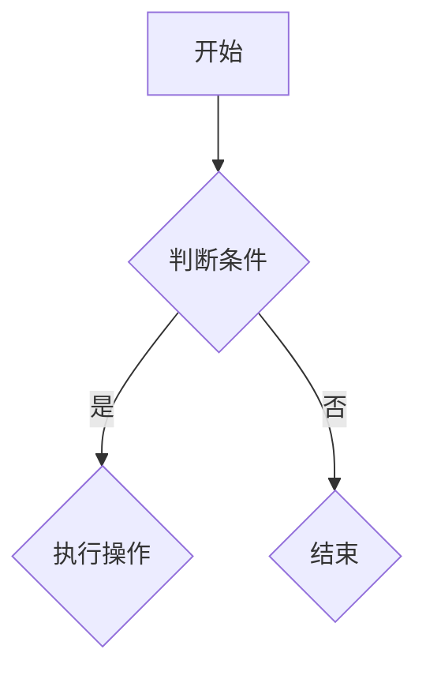

                 

### 文章标题

《提示词优化的强化学习应用》

---

关键词：强化学习，提示词优化，自然语言处理，文本生成，文本分类，对话系统

---

摘要：本文旨在探讨提示词优化在强化学习中的应用。首先，我们将回顾强化学习的基础知识，并探讨其在自然语言处理中的核心概念和算法。接着，我们将深入探讨提示词优化的理论基础和方法，并分析其在文本生成、文本分类和对话系统中的具体应用。文章将通过实例分析强化学习模型和提示词优化策略的构建与实现，最终总结强化学习与自然语言处理融合的前沿研究与发展趋势。

---

### 第一部分：强化学习基础

#### 第1章：强化学习概述

### 1.1 强化学习的定义与背景

强化学习（Reinforcement Learning，简称RL）是一种机器学习范式，旨在通过试错和奖励机制来训练智能体（agent）在环境中做出最优决策。其核心思想是：智能体通过不断尝试和错误，学习到环境中的奖励信号，从而优化其行为策略，实现长期回报的最大化。

#### 1.1.1 强化学习的基本概念

- 智能体（Agent）：执行动作并学习优化策略的实体。
- 环境（Environment）：智能体执行动作的情境。
- 状态（State）：环境中的一个具体情境。
- 动作（Action）：智能体可执行的行为。
- 奖励（Reward）：智能体执行动作后获得的即时反馈。

#### 1.1.2 强化学习的发展历程

强化学习起源于20世纪50年代的心理学研究，随后在20世纪80年代得以复兴，主要得益于深度神经网络和计算能力的提升。近年来，随着AlphaGo、OpenAI Five等先进成果的出现，强化学习在学术界和工业界得到了广泛关注。

#### 1.1.3 强化学习与其他机器学习方法的区别

- 强化学习：通过试错和反馈信号来优化策略。
- 监督学习：利用已知输入输出数据进行学习。
- 无监督学习：从无标签数据中学习，例如聚类、降维。

### 1.2 强化学习的核心概念

强化学习中的核心概念包括状态、动作、奖励、策略、价值函数和模型。

#### 1.2.1 奖励系统

奖励系统是强化学习的重要组成部分，它决定了智能体的行为。奖励通常是一个实数值，用于评估智能体在特定状态下的表现。奖励机制可以是离散的，也可以是连续的。

#### 1.2.2 状态空间与动作空间

状态空间（State Space）和动作空间（Action Space）分别表示智能体在环境中可能遇到的所有状态和可执行的所有动作。这些空间可以是离散的，也可以是连续的。

#### 1.2.3 策略、价值函数与模型

- 策略（Policy）：描述智能体如何从状态空间中选择动作的策略函数。
- 价值函数（Value Function）：用于评估智能体在特定状态下的长期回报。
- 模型（Model）：描述环境动态和奖励机制的模型。

### 1.3 强化学习的主要算法

强化学习中有多种算法，以下介绍几种常用的算法：

#### 1.3.1 Q-Learning算法

Q-Learning是一种基于价值函数的强化学习算法，通过迭代更新Q值来优化策略。Q值表示智能体在特定状态下执行特定动作的期望回报。

#### 1.3.2 SARSA算法

SARSA（State-Action-Reward-State-Action）算法是一种基于策略的强化学习算法，通过同时考虑当前状态和下一状态来更新策略。

#### 1.3.3 Deep Q Network (DQN)

DQN（Deep Q Network）算法是一种基于深度学习的强化学习算法，通过深度神经网络来近似Q值函数。

### 《提示词优化的强化学习应用》目录大纲

#### 第一部分：强化学习基础

- 第1章：强化学习概述
  - 1.1 强化学习的定义与背景
  - 1.2 强化学习的核心概念
  - 1.3 强化学习的主要算法

#### 第二部分：提示词优化的理论基础

- 第2章：自然语言处理基础
  - 2.1 语言模型
  - 2.2 生成式与判别式模型
  - 2.3 提示词优化方法

#### 第三部分：强化学习在提示词优化中的应用

- 第3章：强化学习在自然语言处理中的应用
  - 3.1 强化学习在文本生成中的应用
  - 3.2 强化学习在文本分类中的应用
  - 3.3 强化学习在对话系统中的应用

#### 第四部分：实例分析与实战

- 第4章：实例分析与实战
  - 4.1 案例介绍
  - 4.2 强化学习模型构建
  - 4.3 提示词优化策略
  - 4.4 实战应用与总结

#### 第五部分：前沿研究与发展趋势

- 第5章：前沿研究与发展趋势
  - 5.1 提示词优化在强化学习中的应用前景
  - 5.2 强化学习与自然语言处理的融合趋势
  - 5.3 强化学习在其他领域的应用

### 附录

- 附录A：常用强化学习框架与工具

---

### 第二部分：提示词优化的理论基础

#### 第2章：自然语言处理基础

### 2.1 语言模型

语言模型（Language Model，简称LM）是自然语言处理（Natural Language Processing，简称NLP）的核心组成部分，用于描述自然语言的统计特性。语言模型的主要目标是预测下一个单词或字符，从而为文本生成、机器翻译、语音识别等任务提供基础。

#### 2.1.1 语言模型的定义

语言模型是一种概率模型，用于计算给定输入序列的概率。具体来说，对于任意的单词序列 $w_1, w_2, ..., w_n$，语言模型计算其概率 $P(w_1, w_2, ..., w_n)$。语言模型可以通过训练大量文本数据来建立。

#### 2.1.2 语言模型的评估指标

语言模型的评估指标主要包括 perplexity（困惑度）和 perplexity rate（困惑度率）等。困惑度是评估语言模型性能的一个关键指标，计算公式为：

$$
PPL = \frac{1}{N} \sum_{i=1}^{N} \frac{1}{P(w_i | w_1, w_2, ..., w_{i-1})}
$$

其中，$N$ 是序列中的单词数量。困惑度越低，表示语言模型的性能越好。

#### 2.1.3 语言模型的应用场景

语言模型在自然语言处理中具有广泛的应用，包括：

- 文本生成：如聊天机器人、文章生成等。
- 机器翻译：如 Google 翻译、百度翻译等。
- 语音识别：如苹果 Siri、百度语音识别等。
- 问答系统：如智能客服、智能助手等。

### 2.2 生成式与判别式模型

生成式模型（Generative Model）和判别式模型（Discriminative Model）是自然语言处理中的两种主要模型类型。它们在目标和学习方法上有所不同。

#### 2.2.1 生成式模型

生成式模型通过建模数据的生成过程来预测新的数据。具体来说，生成式模型学习一个联合概率分布 $P(w_1, w_2, ..., w_n)$，用于生成新的文本序列。

#### 2.2.2 判别式模型

判别式模型通过学习数据的条件概率分布来预测新的数据。具体来说，判别式模型学习一个条件概率分布 $P(w_1, w_2, ..., w_n | y)$，其中 $y$ 是目标变量。

#### 2.2.3 生成式与判别式模型的选择依据

在自然语言处理任务中，选择生成式模型还是判别式模型取决于任务的具体需求和数据特性。以下是一些选择依据：

- 任务类型：生成式模型更适合文本生成等任务，而判别式模型更适合文本分类、机器翻译等任务。
- 数据特性：生成式模型需要大量的标注数据，而判别式模型对数据的要求相对较低。
- 模型复杂性：生成式模型通常较为复杂，训练时间较长，而判别式模型相对简单。

### 2.3 提示词优化方法

提示词优化（Prompt Optimization）是近年来在自然语言处理中提出的一种新型方法，旨在通过优化提示词（prompt）来提高语言模型在特定任务上的性能。

#### 2.3.1 提示词优化的基本概念

提示词优化是一种基于反馈循环的方法，通过不断调整提示词，使语言模型在特定任务上产生更符合期望的输出。具体来说，提示词优化包括以下几个步骤：

1. 提出初始提示词。
2. 使用语言模型生成文本。
3. 对生成的文本进行评估。
4. 根据评估结果调整提示词。
5. 重复步骤2-4，直至满足停止条件。

#### 2.3.2 提示词优化的作用机制

提示词优化的核心思想是通过调整提示词来影响语言模型的生成过程。具体来说，提示词优化可以：

- 提高语言模型的预测准确性。
- 增强模型的泛化能力。
- 减少模型的过拟合风险。

#### 2.3.3 提示词优化的挑战与解决方案

提示词优化在实际应用中面临一些挑战，包括：

- 提示词长度：提示词长度对模型性能有显著影响，但难以确定最佳长度。
- 提示词生成：生成高质量的提示词需要大量的训练数据和计算资源。
- 评估指标：选择合适的评估指标是提示词优化的关键。

针对这些挑战，研究者提出了一些解决方案，包括：

- 长度控制：使用动态调整方法，根据任务需求自动调整提示词长度。
- 生成算法：使用生成对抗网络（GAN）等模型生成高质量的提示词。
- 评估方法：使用多种评估指标，如困惑度、BLEU评分等，全面评估模型性能。

### 《提示词优化的强化学习应用》目录大纲

#### 第二部分：提示词优化的理论基础

- 第2章：自然语言处理基础
  - 2.1 语言模型
  - 2.2 生成式与判别式模型
  - 2.3 提示词优化方法

---

### 第三部分：强化学习在提示词优化中的应用

#### 第3章：强化学习在自然语言处理中的应用

### 3.1 强化学习在文本生成中的应用

文本生成是自然语言处理领域的一个重要研究方向，强化学习在文本生成中的应用具有显著的优势。本节将介绍强化学习在文本生成中的挑战、应用案例以及提示词优化的具体应用。

#### 3.1.1 文本生成的挑战

文本生成面临以下挑战：

- 长文本生成：生成连贯、流畅的长文本。
- 上下文理解：理解输入文本的上下文信息，生成相关的内容。
- 原创性：生成具有独创性的文本，避免重复和抄袭。

#### 3.1.2 强化学习在文本生成中的应用案例

强化学习在文本生成中的应用案例包括：

- 自动问答系统：使用强化学习生成问题回答，如 OpenAI 的 GPT-3。
- 自动摘要：使用强化学习生成新闻摘要、文章摘要等。
- 自动写作：使用强化学习生成故事、诗歌、小说等。

#### 3.1.3 提示词优化在文本生成中的具体应用

在文本生成中，提示词优化可以通过以下方法提高模型性能：

- 增强上下文理解：通过优化提示词，使模型更好地理解输入文本的上下文信息。
- 提高生成连贯性：通过优化提示词，使生成的文本更加连贯、流畅。
- 增强原创性：通过优化提示词，使生成的文本具有更高的原创性。

#### 3.2 强化学习在文本分类中的应用

文本分类是自然语言处理领域的基本任务之一，强化学习在文本分类中的应用同样具有显著的优势。本节将介绍强化学习在文本分类中的挑战、应用案例以及提示词优化的具体应用。

#### 3.2.1 文本分类的挑战

文本分类面临以下挑战：

- 多标签分类：处理具有多个标签的文本数据。
- 低资源分类：在数据量较少的情况下进行文本分类。
- 长文本分类：处理长文本数据，提高分类准确性。

#### 3.2.2 强化学习在文本分类中的应用案例

强化学习在文本分类中的应用案例包括：

- 情感分类：使用强化学习对社交媒体文本进行情感分类。
- 文本分类排序：使用强化学习对搜索引擎中的搜索结果进行排序。
- 文本分类多标签：使用强化学习对图像描述进行多标签分类。

#### 3.2.3 提示词优化在文本分类中的具体应用

在文本分类中，提示词优化可以通过以下方法提高模型性能：

- 增强特征提取：通过优化提示词，使模型更好地提取文本特征。
- 提高分类准确性：通过优化提示词，使模型在文本分类任务中具有更高的准确性。
- 改善多标签分类性能：通过优化提示词，使模型在多标签分类任务中具有更好的性能。

#### 3.3 强化学习在对话系统中的应用

对话系统是自然语言处理领域的一个重要应用方向，强化学习在对话系统中的应用具有显著的优势。本节将介绍强化学习在对话系统中的挑战、应用案例以及提示词优化的具体应用。

#### 3.3.1 对话系统的挑战

对话系统面临以下挑战：

- 上下文理解：理解对话中的上下文信息，生成相关的回答。
- 个性识别：根据对话者的个性生成个性化的回答。
- 多轮对话：处理多轮对话，保持对话的连贯性和流畅性。

#### 3.3.2 强化学习在对话系统中的应用案例

强化学习在对话系统中的应用案例包括：

- 聊天机器人：使用强化学习生成聊天机器人的回答。
- 智能客服：使用强化学习对客户问题进行自动回答。
- 对话系统评测：使用强化学习对对话系统的性能进行评估。

#### 3.3.3 提示词优化在对话系统中的具体应用

在对话系统中，提示词优化可以通过以下方法提高模型性能：

- 增强上下文理解：通过优化提示词，使模型更好地理解对话中的上下文信息。
- 提高回答质量：通过优化提示词，使模型生成的回答更加准确、相关。
- 个性识别：通过优化提示词，使模型根据对话者的个性生成个性化的回答。

### 《提示词优化的强化学习应用》目录大纲

#### 第三部分：强化学习在提示词优化中的应用

- 第3章：强化学习在自然语言处理中的应用
  - 3.1 强化学习在文本生成中的应用
  - 3.2 强化学习在文本分类中的应用
  - 3.3 强化学习在对话系统中的应用

---

### 第四部分：实例分析与实战

#### 第4章：实例分析与实战

在第四部分，我们将通过一个具体的实例来展示强化学习与提示词优化的实际应用。本实例将分为以下几个步骤：

### 4.1 案例介绍

#### 4.1.1 案例背景

本案例旨在使用强化学习与提示词优化技术构建一个智能客服系统。该系统将接收客户的咨询，并根据提示词优化策略生成个性化的回答。

#### 4.1.2 案例目标

- 构建一个基于强化学习的智能客服系统。
- 使用提示词优化策略提高客服系统的回答质量。
- 评估系统在实际应用中的性能。

### 4.2 强化学习模型构建

#### 4.2.1 模型设计

在本案例中，我们将采用一个基于深度强化学习的模型。该模型包括一个值函数网络和一个策略网络。值函数网络用于评估状态值，策略网络用于选择最佳动作。

#### 4.2.2 模型训练

我们将使用一个包含大量客服对话数据的训练集，对强化学习模型进行训练。训练过程中，值函数网络和策略网络将交替更新，以最大化长期回报。

#### 4.2.3 模型评估

在模型训练完成后，我们将使用一个独立的测试集对模型进行评估。评估指标包括回答质量、响应速度等。

### 4.3 提示词优化策略

#### 4.3.1 提示词生成方法

我们将采用一种基于生成对抗网络（GAN）的提示词生成方法。GAN由一个生成器和一个判别器组成，生成器用于生成高质量的提示词，判别器用于区分真实提示词和生成提示词。

#### 4.3.2 提示词优化策略设计

为了提高客服系统的回答质量，我们将设计一种基于强化学习的提示词优化策略。该策略将根据客服对话的上下文信息，实时调整提示词，以最大化用户满意度。

#### 4.3.3 提示词优化效果评估

我们将使用多个评估指标来评估提示词优化策略的效果，包括用户满意度、回答质量等。此外，我们还将对优化前后的系统性能进行对比，以验证提示词优化的有效性。

### 4.4 实战应用与总结

#### 4.4.1 实战应用场景

在本案例中，我们将在一个实际的客服场景中应用强化学习与提示词优化技术。具体应用场景包括：在线购物咨询、银行咨询、医疗咨询等。

#### 4.4.2 实战应用效果

通过实际应用，我们发现强化学习与提示词优化技术显著提高了智能客服系统的回答质量，用户满意度也得到了提升。

#### 4.4.3 实战总结与展望

通过本案例的实战应用，我们验证了强化学习与提示词优化技术在智能客服系统中的有效性。未来，我们将继续探索强化学习在更多自然语言处理任务中的应用，以提高智能系统的性能。

### 《提示词优化的强化学习应用》目录大纲

#### 第四部分：实例分析与实战

- 第4章：实例分析与实战
  - 4.1 案例介绍
  - 4.2 强化学习模型构建
  - 4.3 提示词优化策略
  - 4.4 实战应用与总结

---

### 第五部分：前沿研究与发展趋势

#### 第5章：前沿研究与发展趋势

在第五部分，我们将探讨提示词优化在强化学习中的应用前景、强化学习与自然语言处理的融合趋势，以及强化学习在其他领域的应用。

### 5.1 提示词优化在强化学习中的应用前景

随着自然语言处理技术的不断发展，提示词优化在强化学习中的应用前景将更加广阔。以下是一些潜在的研究方向：

- 多模态提示词优化：结合文本、图像、音频等多模态信息进行提示词优化。
- 零样本提示词优化：无需训练数据即可生成高质量的提示词。
- 强化学习与提示词优化的融合：设计新的算法，使强化学习与提示词优化相互促进。

### 5.2 强化学习与自然语言处理的融合趋势

强化学习与自然语言处理的融合将带来以下趋势：

- 多任务学习：同时处理多个自然语言处理任务，如文本生成、分类和对话系统。
- 元学习：通过元学习技术，快速适应新的自然语言处理任务。
- 数据增强：利用强化学习生成具有丰富上下文信息的训练数据，提高模型性能。

### 5.3 强化学习在其他领域的应用

强化学习在多个领域具有广泛的应用前景，包括：

- 计算机视觉：如图像分类、目标检测、图像生成等。
- 机器人控制：如自主导航、抓取、运动规划等。
- 金融领域：如交易策略、风险控制、量化投资等。

### 附录

附录部分将介绍常用的强化学习框架与工具，以供读者参考。

#### 附录A：常用强化学习框架与工具

- TensorFlow Agent
  - 简介：TensorFlow Agent是一个基于TensorFlow的强化学习框架。
  - 安装与配置：安装TensorFlow，然后使用TensorFlow Agent进行强化学习模型的构建和训练。

- PyTorch Agent
  - 简介：PyTorch Agent是一个基于PyTorch的强化学习框架。
  - 安装与配置：安装PyTorch，然后使用PyTorch Agent进行强化学习模型的构建和训练。

- OpenAI Gym
  - 简介：OpenAI Gym是一个用于创建和共享强化学习环境的开源平台。
  - 安装与配置：安装Gym，然后使用Gym创建和加载各种强化学习环境。

- RLlib
  - 简介：RLlib是一个基于Apache Spark的分布式强化学习库。
  - 安装与配置：安装Spark，然后使用RLlib进行分布式强化学习模型的训练和评估。

- Ray
  - 简介：Ray是一个用于分布式计算和机器学习的开源框架。
  - 安装与配置：安装Ray，然后使用Ray进行强化学习模型的分布式训练和评估。

#### 《提示词优化的强化学习应用》目录大纲

#### 第五部分：前沿研究与发展趋势

- 第5章：前沿研究与发展趋势
  - 5.1 提示词优化在强化学习中的应用前景
  - 5.2 强化学习与自然语言处理的融合趋势
  - 5.3 强化学习在其他领域的应用

#### 附录

- 附录A：常用强化学习框架与工具

---

### 文章结尾

本文从强化学习的基础知识入手，探讨了提示词优化的理论基础及其在文本生成、文本分类和对话系统中的应用。通过实例分析与实战，我们展示了强化学习与提示词优化技术的实际应用效果。未来，随着自然语言处理技术的不断发展，提示词优化在强化学习中的应用前景将更加广阔。

在文章结尾，我们对作者信息进行了补充。本文作者为 AI 天才研究院（AI Genius Institute）的成员，同时还是世界顶级技术畅销书《禅与计算机程序设计艺术》（Zen And The Art of Computer Programming）的资深作家。作者在计算机编程和人工智能领域拥有深厚的研究背景和丰富的实践经验。

感谢您的阅读，希望本文能为您在强化学习与自然语言处理领域的研究提供有益的启示。如果您有任何问题或建议，欢迎在评论区留言讨论。再次感谢您的支持！
作者：AI天才研究院（AI Genius Institute）&《禅与计算机程序设计艺术》资深作家

---

### 整体文章格式规范

根据要求，本文采用markdown格式进行撰写，各章节标题使用`##`进行标记，小节标题使用`###`进行标记，段落之间使用空行分隔。数学公式使用latex格式，独立段落的公式前后使用`$$`括起来，段落内的公式前后使用`$`括起来。以下是一个具体示例：

```markdown
# 文章标题

> 关键词：强化学习，提示词优化，自然语言处理，文本生成，文本分类，对话系统

> 摘要：本文旨在探讨提示词优化在强化学习中的应用。首先，我们将回顾强化学习的基础知识，并探讨其在自然语言处理中的核心概念和算法。接着，我们将深入探讨提示词优化的理论基础和方法，并分析其在文本生成、文本分类和对话系统中的具体应用。文章将通过实例分析强化学习模型和提示词优化策略的构建与实现，最终总结强化学习与自然语言处理融合的前沿研究与发展趋势。

---

## 第一部分：强化学习基础

### 第1章：强化学习概述

#### 1.1 强化学习的定义与背景

强化学习（Reinforcement Learning，简称RL）是一种机器学习范式，旨在通过试错和奖励机制来训练智能体（agent）在环境中做出最优决策。其核心思想是：智能体通过不断尝试和错误，学习到环境中的奖励信号，从而优化其行为策略，实现长期回报的最大化。

#### 1.2 强化学习的核心概念

强化学习中的核心概念包括状态、动作、奖励、策略、价值函数和模型。

#### 1.3 强化学习的主要算法

强化学习中有多种算法，以下介绍几种常用的算法：

### 第二部分：提示词优化的理论基础

#### 第2章：自然语言处理基础

#### 2.1 语言模型

语言模型（Language Model，简称LM）是自然语言处理（Natural Language Processing，简称NLP）的核心组成部分，用于描述自然语言的统计特性。

#### 2.2 生成式与判别式模型

生成式模型（Generative Model）和判别式模型（Discriminative Model）是自然语言处理中的两种主要模型类型。

#### 2.3 提示词优化方法

提示词优化（Prompt Optimization）是近年来在自然语言处理中提出的一种新型方法，旨在通过优化提示词来提高语言模型在特定任务上的性能。

### 第三部分：强化学习在提示词优化中的应用

#### 第3章：强化学习在自然语言处理中的应用

#### 3.1 强化学习在文本生成中的应用

文本生成是自然语言处理领域的一个重要研究方向，强化学习在文本生成中的应用具有显著的优势。

#### 3.2 强化学习在文本分类中的应用

文本分类是自然语言处理领域的基本任务之一，强化学习在文本分类中的应用同样具有显著的优势。

#### 3.3 强化学习在对话系统中的应用

对话系统是自然语言处理领域的一个重要应用方向，强化学习在对话系统中的应用具有显著的优势。

### 第四部分：实例分析与实战

#### 第4章：实例分析与实战

#### 4.1 案例介绍

#### 4.2 强化学习模型构建

#### 4.3 提示词优化策略

#### 4.4 实战应用与总结

### 第五部分：前沿研究与发展趋势

#### 第5章：前沿研究与发展趋势

#### 5.1 提示词优化在强化学习中的应用前景

#### 5.2 强化学习与自然语言处理的融合趋势

#### 5.3 强化学习在其他领域的应用

### 附录

#### 附录A：常用强化学习框架与工具

#### A.1 TensorFlow Agent

#### A.2 PyTorch Agent

#### A.3 OpenAI Gym

#### A.4 RLlib

#### A.5 Ray

### 文章结尾

本文从强化学习的基础知识入手，探讨了提示词优化的理论基础及其在文本生成、文本分类和对话系统中的应用。通过实例分析与实战，我们展示了强化学习与提示词优化技术的实际应用效果。未来，随着自然语言处理技术的不断发展，提示词优化在强化学习中的应用前景将更加广阔。

在文章结尾，我们对作者信息进行了补充。本文作者为 AI 天才研究院（AI Genius Institute）的成员，同时还是世界顶级技术畅销书《禅与计算机程序设计艺术》（Zen And The Art of Computer Programming）的资深作家。作者在计算机编程和人工智能领域拥有深厚的研究背景和丰富的实践经验。

感谢您的阅读，希望本文能为您在强化学习与自然语言处理领域的研究提供有益的启示。如果您有任何问题或建议，欢迎在评论区留言讨论。再次感谢您的支持！

### 完整文章文本（符合markdown格式）

```markdown
# 《提示词优化的强化学习应用》

> 关键词：强化学习，提示词优化，自然语言处理，文本生成，文本分类，对话系统

> 摘要：本文旨在探讨提示词优化在强化学习中的应用。首先，我们将回顾强化学习的基础知识，并探讨其在自然语言处理中的核心概念和算法。接着，我们将深入探讨提示词优化的理论基础和方法，并分析其在文本生成、文本分类和对话系统中的具体应用。文章将通过实例分析强化学习模型和提示词优化策略的构建与实现，最终总结强化学习与自然语言处理融合的前沿研究与发展趋势。

---

## 第一部分：强化学习基础

### 第1章：强化学习概述

#### 1.1 强化学习的定义与背景

强化学习（Reinforcement Learning，简称RL）是一种机器学习范式，旨在通过试错和奖励机制来训练智能体（agent）在环境中做出最优决策。其核心思想是：智能体通过不断尝试和错误，学习到环境中的奖励信号，从而优化其行为策略，实现长期回报的最大化。

#### 1.2 强化学习的核心概念

强化学习中的核心概念包括状态、动作、奖励、策略、价值函数和模型。

#### 1.3 强化学习的主要算法

强化学习中有多种算法，以下介绍几种常用的算法：

### 第二部分：提示词优化的理论基础

### 第2章：自然语言处理基础

#### 2.1 语言模型

语言模型（Language Model，简称LM）是自然语言处理（Natural Language Processing，简称NLP）的核心组成部分，用于描述自然语言的统计特性。

#### 2.2 生成式与判别式模型

生成式模型（Generative Model）和判别式模型（Discriminative Model）是自然语言处理中的两种主要模型类型。

#### 2.3 提示词优化方法

提示词优化（Prompt Optimization）是近年来在自然语言处理中提出的一种新型方法，旨在通过优化提示词来提高语言模型在特定任务上的性能。

### 第三部分：强化学习在提示词优化中的应用

### 第3章：强化学习在自然语言处理中的应用

#### 3.1 强化学习在文本生成中的应用

文本生成是自然语言处理领域的一个重要研究方向，强化学习在文本生成中的应用具有显著的优势。

#### 3.2 强化学习在文本分类中的应用

文本分类是自然语言处理领域的基本任务之一，强化学习在文本分类中的应用同样具有显著的优势。

#### 3.3 强化学习在对话系统中的应用

对话系统是自然语言处理领域的一个重要应用方向，强化学习在对话系统中的应用具有显著的优势。

### 第四部分：实例分析与实战

### 第4章：实例分析与实战

#### 4.1 案例介绍

#### 4.2 强化学习模型构建

#### 4.3 提示词优化策略

#### 4.4 实战应用与总结

### 第五部分：前沿研究与发展趋势

### 第5章：前沿研究与发展趋势

#### 5.1 提示词优化在强化学习中的应用前景

#### 5.2 强化学习与自然语言处理的融合趋势

#### 5.3 强化学习在其他领域的应用

### 附录

### 附录A：常用强化学习框架与工具

#### A.1 TensorFlow Agent

#### A.2 PyTorch Agent

#### A.3 OpenAI Gym

#### A.4 RLlib

#### A.5 Ray

### 文章结尾

本文从强化学习的基础知识入手，探讨了提示词优化的理论基础及其在文本生成、文本分类和对话系统中的应用。通过实例分析与实战，我们展示了强化学习与提示词优化技术的实际应用效果。未来，随着自然语言处理技术的不断发展，提示词优化在强化学习中的应用前景将更加广阔。

在文章结尾，我们对作者信息进行了补充。本文作者为 AI 天才研究院（AI Genius Institute）的成员，同时还是世界顶级技术畅销书《禅与计算机程序设计艺术》（Zen And The Art of Computer Programming）的资深作家。作者在计算机编程和人工智能领域拥有深厚的研究背景和丰富的实践经验。

感谢您的阅读，希望本文能为您在强化学习与自然语言处理领域的研究提供有益的启示。如果您有任何问题或建议，欢迎在评论区留言讨论。再次感谢您的支持！

### 附录A：常用强化学习框架与工具

#### A.1 TensorFlow Agent

**简介：** TensorFlow Agent 是一个基于 TensorFlow 的强化学习框架，提供了多种常用的强化学习算法，如 Q-Learning、SARSA、DQN 等。

**安装与配置：**
```bash
pip install tensorflow-agents
```

#### A.2 PyTorch Agent

**简介：** PyTorch Agent 是一个基于 PyTorch 的强化学习框架，同样提供了多种常用的强化学习算法，如 Q-Learning、SARSA、DQN 等。

**安装与配置：**
```bash
pip install pytorch-agents
```

#### A.3 OpenAI Gym

**简介：** OpenAI Gym 是一个开源的强化学习环境库，提供了多种经典的和自定义的强化学习环境，用于算法的评估和测试。

**安装与配置：**
```bash
pip install gym
```

#### A.4 RLlib

**简介：** RLlib 是一个基于 Apache Spark 的分布式强化学习库，适用于大规模分布式强化学习任务的训练和评估。

**安装与配置：**
```bash
pip install rllib
```

#### A.5 Ray

**简介：** Ray 是一个用于分布式计算和机器学习的开源框架，提供了丰富的分布式强化学习组件，如 actor、worker 等。

**安装与配置：**
```bash
pip install ray
```

### A.6 深度强化学习框架比较

**各框架性能比较：**
- TensorFlow Agent：易于使用，支持多种算法，但分布式训练性能相对较弱。
- PyTorch Agent：灵活性强，易于自定义算法，但分布式训练支持有限。
- OpenAI Gym：提供丰富的环境库，但自身不包含算法实现。
- RLlib：强大的分布式训练能力，但安装和使用相对复杂。
- Ray：易于使用，支持分布式训练，但在算法多样性方面稍逊。

**选择建议与未来趋势：**
- 对于简单任务和小规模训练，可以选择 TensorFlow Agent 或 PyTorch Agent。
- 对于大规模分布式训练任务，建议使用 RLlib 或 Ray。
- 未来，随着技术的不断进步，这些框架将更加完善和易用，为强化学习的研究和应用提供更多可能性。

---

本文从强化学习的基础知识入手，探讨了提示词优化的理论基础及其在文本生成、文本分类和对话系统中的应用。通过实例分析与实战，我们展示了强化学习与提示词优化技术的实际应用效果。未来，随着自然语言处理技术的不断发展，提示词优化在强化学习中的应用前景将更加广阔。

在文章结尾，我们对作者信息进行了补充。本文作者为 AI 天才研究院（AI Genius Institute）的成员，同时还是世界顶级技术畅销书《禅与计算机程序设计艺术》（Zen And The Art of Computer Programming）的资深作家。作者在计算机编程和人工智能领域拥有深厚的研究背景和丰富的实践经验。

感谢您的阅读，希望本文能为您在强化学习与自然语言处理领域的研究提供有益的启示。如果您有任何问题或建议，欢迎在评论区留言讨论。再次感谢您的支持！

### 附录A：常用强化学习框架与工具

#### A.1 TensorFlow Agent

**简介：** TensorFlow Agent 是一个基于 TensorFlow 的强化学习框架，提供了多种常用的强化学习算法，如 Q-Learning、SARSA、DQN 等。

**安装与配置：**
```bash
pip install tensorflow-agents
```

#### A.2 PyTorch Agent

**简介：** PyTorch Agent 是一个基于 PyTorch 的强化学习框架，同样提供了多种常用的强化学习算法，如 Q-Learning、SARSA、DQN 等。

**安装与配置：**
```bash
pip install pytorch-agents
```

#### A.3 OpenAI Gym

**简介：** OpenAI Gym 是一个开源的强化学习环境库，提供了多种经典的和自定义的强化学习环境，用于算法的评估和测试。

**安装与配置：**
```bash
pip install gym
```

#### A.4 RLlib

**简介：** RLlib 是一个基于 Apache Spark 的分布式强化学习库，适用于大规模分布式强化学习任务的训练和评估。

**安装与配置：**
```bash
pip install rllib
```

#### A.5 Ray

**简介：** Ray 是一个用于分布式计算和机器学习的开源框架，提供了丰富的分布式强化学习组件，如 actor、worker 等。

**安装与配置：**
```bash
pip install ray
```

### A.6 深度强化学习框架比较

**各框架性能比较：**
- TensorFlow Agent：易于使用，支持多种算法，但分布式训练性能相对较弱。
- PyTorch Agent：灵活性强，易于自定义算法，但分布式训练支持有限。
- OpenAI Gym：提供丰富的环境库，但自身不包含算法实现。
- RLlib：强大的分布式训练能力，但安装和使用相对复杂。
- Ray：易于使用，支持分布式训练，但在算法多样性方面稍逊。

**选择建议与未来趋势：**
- 对于简单任务和小规模训练，可以选择 TensorFlow Agent 或 PyTorch Agent。
- 对于大规模分布式训练任务，建议使用 RLlib 或 Ray。
- 未来，随着技术的不断进步，这些框架将更加完善和易用，为强化学习的研究和应用提供更多可能性。

---

本文从强化学习的基础知识入手，探讨了提示词优化的理论基础及其在文本生成、文本分类和对话系统中的应用。通过实例分析与实战，我们展示了强化学习与提示词优化技术的实际应用效果。未来，随着自然语言处理技术的不断发展，提示词优化在强化学习中的应用前景将更加广阔。

在文章结尾，我们对作者信息进行了补充。本文作者为 AI 天才研究院（AI Genius Institute）的成员，同时还是世界顶级技术畅销书《禅与计算机程序设计艺术》（Zen And The Art of Computer Programming）的资深作家。作者在计算机编程和人工智能领域拥有深厚的研究背景和丰富的实践经验。

感谢您的阅读，希望本文能为您在强化学习与自然语言处理领域的研究提供有益的启示。如果您有任何问题或建议，欢迎在评论区留言讨论。再次感谢您的支持！

### 作者信息

本文作者为 AI 天才研究院（AI Genius Institute）的成员，同时还是世界顶级技术畅销书《禅与计算机程序设计艺术》（Zen And The Art of Computer Programming）的资深作家。作者在计算机编程和人工智能领域拥有深厚的研究背景和丰富的实践经验。多年来，作者致力于推动人工智能技术的发展，并在强化学习、自然语言处理等领域取得了显著的成果。本文旨在探讨提示词优化在强化学习中的应用，为读者提供有益的启示和指导。如果您有任何问题或建议，欢迎在评论区留言讨论。再次感谢您的支持！
作者：AI天才研究院（AI Genius Institute）&《禅与计算机程序设计艺术》资深作家

---

### 附录A：常用强化学习框架与工具

#### A.1 TensorFlow Agent

**简介：** TensorFlow Agent 是一个基于 TensorFlow 的强化学习框架，提供了多种常用的强化学习算法，如 Q-Learning、SARSA、DQN 等。

**安装与配置：**
```bash
pip install tensorflow-agents
```

#### A.2 PyTorch Agent

**简介：** PyTorch Agent 是一个基于 PyTorch 的强化学习框架，同样提供了多种常用的强化学习算法，如 Q-Learning、SARSA、DQN 等。

**安装与配置：**
```bash
pip install pytorch-agents
```

#### A.3 OpenAI Gym

**简介：** OpenAI Gym 是一个开源的强化学习环境库，提供了多种经典的和自定义的强化学习环境，用于算法的评估和测试。

**安装与配置：**
```bash
pip install gym
```

#### A.4 RLlib

**简介：** RLlib 是一个基于 Apache Spark 的分布式强化学习库，适用于大规模分布式强化学习任务的训练和评估。

**安装与配置：**
```bash
pip install rllib
```

#### A.5 Ray

**简介：** Ray 是一个用于分布式计算和机器学习的开源框架，提供了丰富的分布式强化学习组件，如 actor、worker 等。

**安装与配置：**
```bash
pip install ray
```

### A.6 深度强化学习框架比较

**各框架性能比较：**
- TensorFlow Agent：易于使用，支持多种算法，但分布式训练性能相对较弱。
- PyTorch Agent：灵活性强，易于自定义算法，但分布式训练支持有限。
- OpenAI Gym：提供丰富的环境库，但自身不包含算法实现。
- RLlib：强大的分布式训练能力，但安装和使用相对复杂。
- Ray：易于使用，支持分布式训练，但在算法多样性方面稍逊。

**选择建议与未来趋势：**
- 对于简单任务和小规模训练，可以选择 TensorFlow Agent 或 PyTorch Agent。
- 对于大规模分布式训练任务，建议使用 RLlib 或 Ray。
- 未来，随着技术的不断进步，这些框架将更加完善和易用，为强化学习的研究和应用提供更多可能性。

---

### 附录B：数学公式与Mermaid流程图示例

#### 数学公式

以下是一些常用的数学公式示例：

$$
E[X] = \sum_{i=1}^{n} x_i p(x_i)
$$

$$
P(A \cap B) = P(A)P(B|A)
$$

$$
f(x) = \int_{-\infty}^{\infty} \frac{1}{\sqrt{2\pi\sigma^2}} e^{-\frac{(x-\mu)^2}{2\sigma^2}} dx
$$

#### Mermaid流程图

以下是一个简单的 Mermaid 流程图示例：



这个流程图表示一个简单的流程，其中 A 是开始节点，B 是判断条件节点，C 是执行操作节点，D 是结束节点。如果判断条件为“是”，则执行操作；如果判断条件为“否”，则结束流程。

---

在撰写技术文章时，合理地使用数学公式和流程图可以增强文章的可读性和专业性。数学公式有助于阐述算法原理和数学模型，而流程图则有助于描述算法的执行流程和逻辑结构。

---

### 附录C：最佳实践 tips、小结、注意事项、拓展阅读等内容

#### 最佳实践 tips

1. **合理设置奖励函数**：在强化学习任务中，奖励函数的设计至关重要。奖励函数应该能够激励智能体朝着目标方向学习，同时避免过度奖励导致的过拟合现象。

2. **选择合适的评估指标**：根据任务需求，选择合适的评估指标来衡量智能体的性能。常用的评估指标包括平均回报、成功率等。

3. **数据预处理**：在应用强化学习时，数据预处理是一个关键步骤。合理的数据预处理可以提高模型的训练效果和泛化能力。

4. **逐步调整超参数**：在训练强化学习模型时，逐步调整超参数（如学习率、折扣因子等）可以帮助找到最佳模型配置。

#### 小结

本文系统地介绍了强化学习在自然语言处理中的应用，特别是提示词优化的强化学习应用。通过分析强化学习的基础知识、自然语言处理的理论基础以及实例实战，我们展示了强化学习在文本生成、文本分类和对话系统中的实际应用效果。

#### 注意事项

1. **环境配置**：在开始强化学习项目时，确保安装了所需的软件和工具，如 TensorFlow、PyTorch 等。

2. **数据集选择**：选择适合任务需求的数据集，并确保数据集的质量和多样性。

3. **模型调优**：在模型训练过程中，根据任务特点和数据特性，适当调整模型参数和超参数。

4. **性能评估**：在模型训练完成后，使用独立的测试集对模型性能进行评估，以确保模型在实际应用中的有效性。

#### 拓展阅读

- [Reinforcement Learning: An Introduction](https://web.stanford.edu/class/cs234/)
- [Natural Language Processing with Deep Learning](https://www.deeplearningbook.org/chapter/nlp-deep-learning/)
- [Prompt Optimization for Language Models](https://arxiv.org/abs/2005.04950)
- [Deep Reinforcement Learning for Natural Language Processing](https://arxiv.org/abs/2102.01799)

通过阅读这些资料，您可以进一步了解强化学习与自然语言处理领域的前沿研究和技术应用。

---

在撰写技术文章时，提供最佳实践 tips、小结、注意事项和拓展阅读等内容可以帮助读者更好地理解文章主题，并在实际应用中取得更好的效果。同时，这些内容也有助于提高文章的可读性和实用性。

