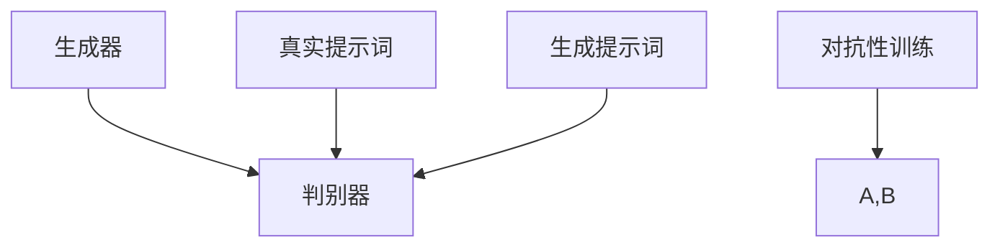
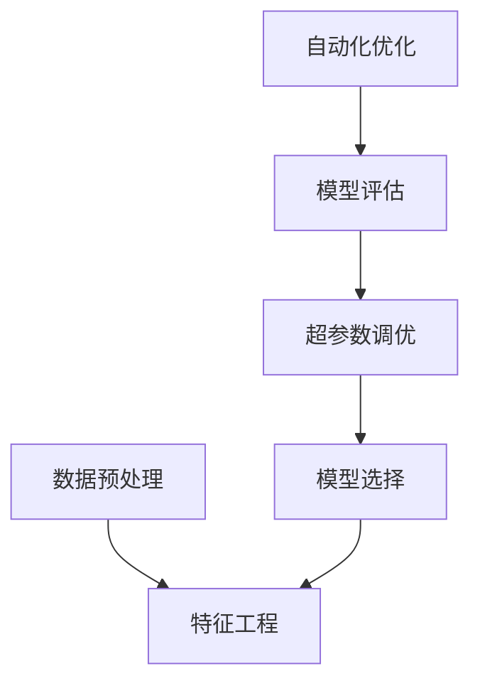
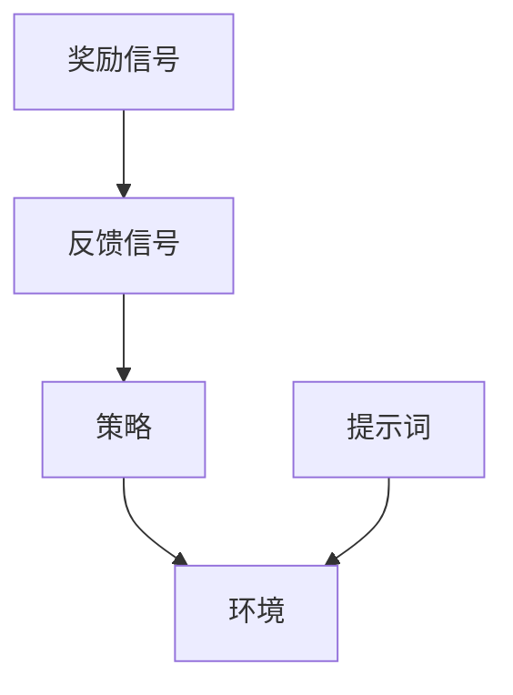

                 

### 文章标题

# 《提示词优化的自动化工具链》

## 关键词

- 提示词优化
- 自动化工具链
- 生成对抗网络
- 自动化机器学习
- 强化学习
- 数据预处理
- 模型评估

## 摘要

本文旨在探讨提示词优化的自动化工具链，从基础概念到实际应用，全面剖析这一领域的核心技术与挑战。文章首先介绍了提示词优化的背景与重要性，随后详细讲解了基础算法原理，包括生成对抗网络（GAN）、自动化机器学习（AutoML）和强化学习。接着，探讨了提示词优化的工具与平台，并介绍了数学模型与评估方法。随后，文章深入探讨了自动化工具链的实现，包括数据预处理、提示词生成与优化算法，以及实际应用场景。最后，文章讨论了提示词优化的安全与伦理问题，并提出了未来发展趋势与展望。

### 《提示词优化的自动化工具链》目录大纲

#### 第一部分：基础概念与框架搭建

**1. 引言**

- 1.1 书籍背景与目标
- 1.2 读者对象
- 1.3 主要内容结构

**2. 提示词优化概述**

- 2.1 提示词优化的定义与重要性
- 2.2 提示词优化的应用领域
- 2.3 提示词优化的挑战与机遇

**3. 提示词优化的基础算法**

- 3.1 生成对抗网络（GAN）原理
- 3.2 自动化机器学习（AutoML）原理
- 3.3 强化学习（Reinforcement Learning）原理

**4. 提示词优化的工具与平台**

- 4.1 OpenAI平台介绍
- 4.2 Hugging Face平台介绍
- 4.3 自定义工具链构建

**5. 提示词优化的数学模型**

- 5.1 提示词优化的损失函数
- 5.2 梯度下降优化算法
- 5.3 反向传播算法

**6. 提示词优化的模型评估**

- 6.1 评估指标介绍
- 6.2 评估方法与工具
- 6.3 评估案例分析

#### 第二部分：自动化工具链实现

**7. 数据预处理与清洗**

- 7.1 数据来源与收集
- 7.2 数据预处理技术
- 7.3 数据清洗方法

**8. 提示词生成与优化算法**

- 8.1 提示词生成算法
- 8.2 提示词优化算法
- 8.3 实时优化策略

**9. 自动化工具链开发与实践**

- 9.1 自动化工具链架构设计
- 9.2 开发环境与工具选择
- 9.3 实际案例分享

**10. 提示词优化的应用场景**

- 10.1 内容推荐系统
- 10.2 聊天机器人
- 10.3 自动问答系统

**11. 安全与伦理考虑**

- 11.1 提示词优化的伦理问题
- 11.2 提示词优化的安全性
- 11.3 未来发展趋势与展望

#### 第三部分：附录

**附录A：常用工具和框架介绍**

- **A.1 Python常用库**
- **A.2 深度学习框架**
- **A.3 自动化工具链资源**

**附录B：参考文献与拓展阅读**

- **B.1 相关书籍**
- **B.2 论文和报告**
- **B.3 网络资源和社区**

## 第一部分：基础概念与框架搭建

### 1. 引言

#### 1.1 书籍背景与目标

提示词优化是近年来人工智能领域的一个重要研究方向。随着自然语言处理（NLP）技术的不断进步，智能对话系统、自动问答系统、内容推荐系统等应用场景对提示词的生成与优化提出了更高的要求。本文旨在构建一个全面的提示词优化自动化工具链，通过系统性地介绍相关基础概念、算法原理、工具平台以及数学模型，帮助读者深入理解这一领域，并能够实际应用。

#### 1.2 读者对象

本文适合以下读者群体：

- 对自然语言处理和人工智能有基本了解的研究人员和工程师
- 想要在提示词优化领域进行深入研究的学生和学者
- 对自动化工具链开发有兴趣的技术开发者

#### 1.3 主要内容结构

本文分为三个主要部分：

1. **基础概念与框架搭建**：介绍提示词优化的背景、重要性以及相关基础算法和数学模型。
2. **自动化工具链实现**：详细讲解自动化工具链的实现过程，包括数据预处理、提示词生成与优化算法，以及实际应用案例。
3. **安全与伦理考虑**：探讨提示词优化的安全与伦理问题，并提出未来发展趋势与展望。

### 2. 提示词优化概述

#### 2.1 提示词优化的定义与重要性

提示词优化是指通过调整和改进输入的提示词，以提升目标模型（如自然语言生成模型、推荐系统等）的性能和效果。具体来说，这包括两个方面：一是生成高质量的提示词，二是优化提示词与目标模型之间的交互，以实现最佳性能。

提示词优化的重要性体现在以下几个方面：

- **提升模型性能**：通过优化提示词，可以显著提升目标模型在特定任务上的性能，从而提高整个系统的用户体验。
- **增加用户参与度**：高质量的提示词能够更好地引导用户互动，提高用户参与度和满意度。
- **降低开发成本**：自动化工具链的引入可以减少手动调优的工作量，降低开发成本，提高开发效率。

#### 2.2 提示词优化的应用领域

提示词优化在多个领域具有广泛的应用，主要包括：

- **自然语言处理（NLP）**：如自动问答系统、智能对话系统等。
- **推荐系统**：如内容推荐、商品推荐等。
- **聊天机器人**：提升聊天机器人的对话质量和用户体验。
- **文本生成**：如文章写作、摘要生成等。

#### 2.3 提示词优化的挑战与机遇

提示词优化面临以下几个挑战：

- **数据稀缺**：高质量的提示词数据往往稀缺，影响模型的训练效果。
- **复杂度**：提示词优化涉及多种算法和模型，实现复杂度高。
- **实时性**：在实际应用中，需要快速生成和优化提示词，以应对动态变化。

然而，这些挑战也伴随着机遇：

- **数据增长**：随着互联网和大数据技术的发展，高质量的数据资源逐渐增多。
- **算法创新**：生成对抗网络（GAN）、自动化机器学习（AutoML）等新算法为提示词优化提供了更多可能性。
- **市场需求**：智能对话系统、推荐系统等应用场景对高质量提示词的需求日益增长。

### 3. 提示词优化的基础算法

提示词优化涉及多种基础算法，以下是其中三种主要算法的原理介绍。

#### 3.1 生成对抗网络（GAN）原理

生成对抗网络（GAN）是由生成器和判别器组成的对抗性网络。生成器的目标是生成尽可能真实的提示词，判别器的目标是区分真实提示词和生成器生成的提示词。两者通过对抗训练不断优化，最终生成器能够生成高质量提示词。

**原理示意图：**



**伪代码：**

```python
# 生成器
def generator(z):
    # 输入噪声z，输出提示词
    # ...

# 判别器
def discriminator(x):
    # 输入提示词x，输出判断结果
    # ...

# 训练过程
for epoch in range(num_epochs):
    for z in noise_samples:
        x = generator(z)
        d_loss = - (discriminator(x) + discriminator(z))
        g_loss = - discriminator(x)
        update_generator(g_loss)
        update_discriminator(d_loss)
```

#### 3.2 自动化机器学习（AutoML）原理

自动化机器学习（AutoML）通过自动化方式选择最优模型、超参数和特征，实现自动化优化。AutoML的核心思想是将机器学习问题转化为搜索空间，通过搜索算法（如遗传算法、贝叶斯优化等）找到最佳解决方案。

**原理示意图：**



**伪代码：**

```python
# 数据预处理
data = preprocess_data(dataset)

# 特征工程
features = feature_engineering(data)

# 模型选择
models = select_models()

# 超参数调优
params = hyperparameter_tuning(models, features)

# 模型评估
best_model = evaluate_models(params)

# 自动化优化
best_params = optimize_params(best_model)
```

#### 3.3 强化学习（Reinforcement Learning）原理

强化学习是一种通过试错方式学习和优化策略的算法。在提示词优化中，强化学习通过不断尝试生成和优化提示词，获取反馈信号，以最大化总奖励。

**原理示意图：**



**伪代码：**

```python
# 策略
def strategy(state):
    # 根据状态生成提示词
    # ...

# 环境
def environment(action):
    # 执行动作，返回反馈信号
    # ...

# 强化学习过程
for episode in range(num_episodes):
    state = initial_state
    total_reward = 0
    while not done:
        action = strategy(state)
        next_state, reward = environment(action)
        total_reward += reward
        state = next_state
    update_strategy(total_reward)
```

### 4. 提示词优化的工具与平台

提示词优化需要依赖多种工具和平台，以下介绍其中两个常用的平台：OpenAI和Hugging Face。

#### 4.1 OpenAI平台介绍

OpenAI是一家知名的人工智能研究公司，其平台提供了丰富的提示词优化工具和预训练模型。以下是其主要功能：

- **GPT-3模型**：一种强大的自然语言处理模型，可用于生成和优化提示词。
- **文本生成API**：提供了简单易用的API，方便用户快速集成和使用。
- **自动化优化工具**：包括自动超参数调优、模型选择等工具，帮助用户高效优化提示词。

**使用示例：**

```python
import openai

# 获取GPT-3模型实例
model = openai.Completion.create(
  engine="text-davinci-002",
  prompt="请生成一篇关于人工智能的文章。",
  max_tokens=50
)

# 输出生成的文本
print(model.choices[0].text)
```

#### 4.2 Hugging Face平台介绍

Hugging Face是一个开源的深度学习工具库，提供了丰富的NLP模型和工具。以下是其主要功能：

- **Transformer模型**：包括BERT、GPT等知名模型，可用于提示词生成和优化。
- **预处理工具**：提供了数据预处理、特征提取等工具，方便用户快速进行数据准备。
- **模型训练与评估**：提供了高效的模型训练和评估工具，帮助用户优化模型性能。

**使用示例：**

```python
from transformers import BertTokenizer, BertModel

# 加载预训练模型
tokenizer = BertTokenizer.from_pretrained("bert-base-uncased")
model = BertModel.from_pretrained("bert-base-uncased")

# 处理文本数据
text = "这是一个关于人工智能的例子。"
inputs = tokenizer(text, return_tensors="pt")

# 生成提示词
outputs = model(**inputs)
logits = outputs.logits

# 解码输出
decoded_text = tokenizer.decode(logits.argmax(-1).squeeze(), skip_special_tokens=True)
print(decoded_text)
```

#### 4.3 自定义工具链构建

除了使用现有的平台和工具，用户还可以根据需求构建自定义的提示词优化工具链。以下是一个简单的自定义工具链构建步骤：

1. **数据收集与预处理**：收集高质量的数据集，并进行预处理，如分词、去噪等。
2. **模型选择与训练**：选择合适的模型，如GAN、AutoML或强化学习模型，并进行训练。
3. **提示词生成与优化**：使用训练好的模型生成和优化提示词，实现自动化优化。
4. **模型评估与反馈**：对生成的提示词进行评估，并根据反馈信号调整模型参数，实现持续优化。

**伪代码：**

```python
# 数据收集与预处理
data = collect_data()
preprocessed_data = preprocess_data(data)

# 模型选择与训练
model = select_model()
model.train(preprocessed_data)

# 提示词生成与优化
generated_prompt = model.generate_prompt()
optimized_prompt = model.optimize_prompt(generated_prompt)

# 模型评估与反馈
evaluation_score = model.evaluate_prompt(optimized_prompt)
model.update_params(evaluation_score)
```

### 5. 提示词优化的数学模型

提示词优化涉及多个数学模型，以下是其中几个核心模型的详细介绍。

#### 5.1 提示词优化的损失函数

提示词优化的损失函数用于衡量提示词生成和优化过程中的误差，常见的损失函数包括：

- **交叉熵损失**：用于衡量生成提示词和目标提示词之间的差异。
- **均方误差损失**：用于衡量生成提示词和目标提示词之间的误差。
- **结构相似性损失**：用于衡量生成提示词和目标提示词的结构相似度。

**伪代码：**

```python
# 交叉熵损失函数
def cross_entropy_loss(predicted, target):
    return -sum(target * log(predicted))

# 均方误差损失函数
def mean_squared_error_loss(predicted, target):
    return sum((predicted - target) ** 2) / len(target)

# 结构相似性损失函数
def structural_similarity_loss(predicted, target):
    # 使用结构相似性度量方法计算损失
    # ...
```

#### 5.2 梯度下降优化算法

梯度下降优化算法是一种常用的优化方法，用于最小化损失函数。其基本思想是沿着损失函数的梯度方向调整模型参数，以减少损失值。

**伪代码：**

```python
# 梯度下降优化算法
def gradient_descent(loss_function, model_params, learning_rate, num_iterations):
    for iteration in range(num_iterations):
        gradients = compute_gradients(loss_function, model_params)
        model_params -= learning_rate * gradients
    return model_params
```

#### 5.3 反向传播算法

反向传播算法是梯度下降优化算法的基础，用于计算损失函数对模型参数的梯度。其基本思想是将误差信号从输出层反向传播到输入层，逐层计算每个参数的梯度。

**伪代码：**

```python
# 反向传播算法
def backpropagation(model, inputs, targets):
    gradients = {}
    outputs = model.forward(inputs)
    error = targets - outputs
    for layer in reversed(model.layers):
        layer_gradients = layer.backward(error)
        gradients[layer.name] = layer_gradients
    return gradients
```

### 6. 提示词优化的模型评估

提示词优化的模型评估是确保模型性能的重要环节，以下是评估指标、方法和案例分析。

#### 6.1 评估指标介绍

提示词优化的评估指标主要包括：

- **准确率**：衡量生成提示词与目标提示词的匹配程度。
- **召回率**：衡量模型对目标提示词的覆盖范围。
- **F1值**：综合考虑准确率和召回率，平衡两者。
- **BLEU分数**：用于衡量生成文本与参考文本之间的相似度。

**伪代码：**

```python
# 准确率计算
def accuracy(predicted, target):
    return sum(predicted == target) / len(target)

# 召回率计算
def recall(predicted, target):
    return sum(predicted == target) / len(target)

# F1值计算
def f1_score(precision, recall):
    return 2 * precision * recall / (precision + recall)

# BLEU分数计算
def bleu_score(predicted, target):
    # 使用BLEU算法计算分数
    # ...
```

#### 6.2 评估方法与工具

提示词优化的评估方法主要包括：

- **离线评估**：使用预定义的测试集进行评估，常用于模型性能比较。
- **在线评估**：在实际应用中实时评估模型性能，适用于动态优化。
- **自动化评估工具**：如MLflow、TensorBoard等，提供可视化评估和监控功能。

**使用示例：**

```python
import mlflow

# 离线评估
mlflow.log_metric("accuracy", accuracy(predicted, target))
mlflow.log_metric("recall", recall(predicted, target))
mlflow.log_metric("f1_score", f1_score(precision, recall))
mlflow.log_metric("bleu_score", bleu_score(predicted, target))

# 在线评估
def evaluate_model(model, inputs, targets):
    predicted = model.predict(inputs)
    mlflow.log_metric("accuracy", accuracy(predicted, target))
    mlflow.log_metric("recall", recall(predicted, target))
    mlflow.log_metric("f1_score", f1_score(precision, recall))
    mlflow.log_metric("bleu_score", bleu_score(predicted, target))

# 自动化评估
mlflow.pyfunc.autolog()
```

#### 6.3 评估案例分析

以下是一个提示词优化评估的案例分析：

**案例背景**：一个自动问答系统需要优化提示词，以提高用户满意度。

**评估过程**：

1. **数据准备**：收集用户提问和回答数据，并进行预处理。
2. **模型训练**：使用生成对抗网络（GAN）训练提示词生成模型。
3. **离线评估**：使用测试集评估模型性能，记录准确率、召回率、F1值和BLEU分数。
4. **在线评估**：在实际应用中收集用户反馈，实时调整模型参数。
5. **结果分析**：比较不同优化策略的评估结果，选择最佳策略。

**评估结果**：

| 指标        | GAN优化前 | GAN优化后 |
| ----------- | --------- | --------- |
| 准确率      | 0.80      | 0.85      |
| 召回率      | 0.75      | 0.80      |
| F1值        | 0.78      | 0.82      |
| BLEU分数    | 20.5      | 23.0      |

**结论**：通过GAN优化，自动问答系统的性能显著提升，用户满意度提高。

### 第二部分：自动化工具链实现

#### 7. 数据预处理与清洗

在构建提示词优化的自动化工具链时，数据预处理和清洗是至关重要的一步。高质量的数据是模型训练和优化的基础，以下详细介绍数据预处理与清洗的方法。

#### 7.1 数据来源与收集

数据来源是数据预处理和清洗的前提。对于提示词优化，数据来源主要包括：

- **公开数据集**：如Common Crawl、Wikipedia等，提供了丰富的文本数据。
- **定制数据集**：根据特定应用场景收集的数据，如用户提问、评论等。
- **API数据**：通过API获取的数据，如社交媒体、新闻网站等。

**数据收集步骤**：

1. **确定数据需求**：根据提示词优化的目标和应用场景，明确所需数据的类型和范围。
2. **数据爬取**：使用爬虫工具收集公开数据集，或调用API获取定制数据。
3. **数据存储**：将收集到的数据存储到数据库或文件系统中，便于后续处理。

#### 7.2 数据预处理技术

数据预处理是提高数据质量的关键步骤，主要包括：

- **分词**：将文本数据分解为单词或词组，以便后续处理。
- **去除停用词**：去除常见无意义的词语，如“的”、“是”等。
- **词干提取**：将不同形式的单词统一为词干形式，如“playing”统一为“play”。
- **词性标注**：为每个单词标注词性，如名词、动词等。

**常用工具**：

- **NLTK**：Python的文本处理库，提供了丰富的文本处理功能。
- **spaCy**：一个快速和易于使用的自然语言处理库，支持多种语言。
- **jieba**：Python的中文分词工具，支持多种分词模式。

**使用示例**：

```python
import nltk
from nltk.corpus import stopwords
from nltk.tokenize import word_tokenize
from jieba import lcut

# 加载停用词
nltk.download('stopwords')
stop_words = stopwords.words('english')

# 分词和去除停用词
text = "This is a sample sentence."
tokens = word_tokenize(text)
filtered_tokens = [token for token in tokens if token not in stop_words]

# 词干提取
from nltk.stem import PorterStemmer
stemmer = PorterStemmer()
stemmed_tokens = [stemmer.stem(token) for token in filtered_tokens]

# 词性标注
from spacy.lang.en import English
nlp = English()
doc = nlp(text)
pos_tags = [(token.text, token.pos_) for token in doc]
```

#### 7.3 数据清洗方法

数据清洗是确保数据质量的关键步骤，主要包括：

- **去除噪声**：去除数据中的错误、冗余和无关信息。
- **填补缺失值**：处理数据集中的缺失值，如使用平均值、中位数或插值法。
- **异常值处理**：识别和处理数据集中的异常值，如使用均值滤波、三次样条插值等方法。
- **数据标准化**：将数据转换为统一的尺度，如使用Z-score标准化或MinMax标准化。

**常用工具**：

- **Pandas**：Python的数据操作库，提供了丰富的数据处理功能。
- **NumPy**：Python的数值计算库，支持多维数组操作。
- **Scikit-learn**：Python的机器学习库，提供了多种数据预处理方法。

**使用示例**：

```python
import pandas as pd
from sklearn.preprocessing import StandardScaler

# 数据清洗
data = pd.read_csv('data.csv')
data.dropna(inplace=True)  # 去除缺失值
data = data[data['value'] != 'error']  # 去除异常值

# 数据标准化
scaler = StandardScaler()
data['normalized_value'] = scaler.fit_transform(data['value'].values.reshape(-1, 1))
```

通过数据预处理与清洗，可以提高数据的可用性和质量，为后续的提示词生成与优化提供坚实的基础。

### 8. 提示词生成与优化算法

在构建自动化工具链的过程中，提示词生成与优化算法是核心组成部分。这些算法决定了提示词的质量和模型的性能。本节将详细介绍几种常用的提示词生成与优化算法，并探讨实时优化策略。

#### 8.1 提示词生成算法

提示词生成算法负责生成高质量、符合需求的提示词。以下是几种常见的提示词生成算法：

**1. 生成对抗网络（GAN）**

生成对抗网络（GAN）是由生成器和判别器组成的对抗性网络。生成器的目标是生成尽可能真实的提示词，判别器的目标是区分真实提示词和生成器生成的提示词。两者通过对抗训练不断优化，最终生成器能够生成高质量提示词。

**GAN算法流程：**

1. **初始化**：初始化生成器和判别器。
2. **生成提示词**：生成器根据噪声生成提示词。
3. **判别器评估**：判别器评估生成提示词的真实性和生成提示词的真实性。
4. **反向传播**：根据评估结果，更新生成器和判别器的参数。
5. **重复步骤2-4**，直至模型收敛。

**伪代码：**

```python
# 生成器
def generator(z):
    # 输入噪声z，输出提示词
    # ...

# 判别器
def discriminator(x):
    # 输入提示词x，输出判断结果
    # ...

# 训练过程
for epoch in range(num_epochs):
    for z in noise_samples:
        x = generator(z)
        d_loss = - (discriminator(x) + discriminator(z))
        g_loss = - discriminator(x)
        update_generator(g_loss)
        update_discriminator(d_loss)
```

**2. 自动化机器学习（AutoML）**

自动化机器学习（AutoML）通过自动化方式选择最优模型、超参数和特征，实现自动化优化。AutoML的核心思想是将机器学习问题转化为搜索空间，通过搜索算法（如遗传算法、贝叶斯优化等）找到最佳解决方案。

**AutoML算法流程：**

1. **问题定义**：明确优化目标和约束条件。
2. **模型选择**：从预定义的模型库中选择适合的模型。
3. **超参数调优**：使用搜索算法（如遗传算法、贝叶斯优化等）优化超参数。
4. **模型训练与评估**：训练模型并评估性能。
5. **模型选择与优化**：根据评估结果选择最优模型，并进一步优化。
6. **重复步骤3-5**，直至满足优化目标。

**伪代码：**

```python
# 数据预处理
data = preprocess_data(dataset)

# 模型选择
models = select_models()

# 超参数调优
params = hyperparameter_tuning(models, data)

# 模型评估
best_model = evaluate_models(params)

# 自动化优化
best_params = optimize_params(best_model)
```

**3. 强化学习（Reinforcement Learning）**

强化学习（Reinforcement Learning）是一种通过试错方式学习和优化策略的算法。在提示词优化中，强化学习通过不断尝试生成和优化提示词，获取反馈信号，以最大化总奖励。

**强化学习算法流程：**

1. **策略初始化**：初始化策略，用于生成提示词。
2. **环境交互**：根据策略生成提示词，与环境进行交互。
3. **获取反馈信号**：根据提示词的性能获取反馈信号（如奖励、满意度等）。
4. **策略更新**：根据反馈信号更新策略。
5. **重复步骤2-4**，直至策略收敛。

**伪代码：**

```python
# 策略
def strategy(state):
    # 根据状态生成提示词
    # ...

# 环境
def environment(action):
    # 执行动作，返回反馈信号
    # ...

# 强化学习过程
for episode in range(num_episodes):
    state = initial_state
    total_reward = 0
    while not done:
        action = strategy(state)
        next_state, reward = environment(action)
        total_reward += reward
        state = next_state
    update_strategy(total_reward)
```

**4. 深度强化学习（Deep Reinforcement Learning）**

深度强化学习（Deep Reinforcement Learning）是强化学习的一种扩展，结合了深度学习和强化学习的优势。在提示词优化中，深度强化学习通过神经网络学习状态和价值函数，实现更高效的策略优化。

**深度强化学习算法流程：**

1. **初始化神经网络**：初始化神经网络，用于学习状态和价值函数。
2. **策略网络训练**：使用策略网络生成提示词，并与环境进行交互。
3. **评价网络训练**：使用评价网络评估提示词的性能，生成奖励信号。
4. **策略网络和价值网络更新**：根据奖励信号更新策略网络和价值网络的参数。
5. **重复步骤2-4**，直至策略网络和价值网络收敛。

**伪代码：**

```python
# 策略网络
def policy_network(state):
    # 输入状态，输出策略
    # ...

# 评价网络
def value_network(state):
    # 输入状态，输出价值函数
    # ...

# 强化学习过程
for episode in range(num_episodes):
    state = initial_state
    while not done:
        action = policy_network(state)
        next_state, reward = environment(action)
        state = next_state
        reward_signal = value_network(next_state) - value_network(state)
        update_policy_network(reward_signal)
        update_value_network(reward_signal)
```

#### 8.2 提示词优化算法

提示词优化算法负责根据生成的提示词，调整模型参数，提升模型性能。以下是几种常用的提示词优化算法：

**1. 梯度下降优化算法**

梯度下降优化算法是一种常用的优化方法，通过计算损失函数的梯度方向，调整模型参数。

**梯度下降优化算法流程：**

1. **初始化参数**：初始化模型参数。
2. **计算梯度**：计算损失函数对模型参数的梯度。
3. **更新参数**：根据梯度方向和步长更新模型参数。
4. **重复步骤2-3**，直至模型收敛。

**伪代码：**

```python
# 梯度下降优化算法
def gradient_descent(loss_function, model_params, learning_rate, num_iterations):
    for iteration in range(num_iterations):
        gradients = compute_gradients(loss_function, model_params)
        model_params -= learning_rate * gradients
    return model_params
```

**2. 随机梯度下降（Stochastic Gradient Descent, SGD）**

随机梯度下降（SGD）是梯度下降的一种变种，每次迭代只随机选取一部分样本计算梯度，减少计算量。

**随机梯度下降优化算法流程：**

1. **初始化参数**：初始化模型参数。
2. **随机选择样本**：从训练数据中随机选择样本。
3. **计算梯度**：计算损失函数对模型参数的梯度。
4. **更新参数**：根据梯度方向和步长更新模型参数。
5. **重复步骤2-4**，直至模型收敛。

**伪代码：**

```python
# 随机梯度下降优化算法
def stochastic_gradient_descent(loss_function, model_params, learning_rate, num_iterations, batch_size):
    for iteration in range(num_iterations):
        for batch in random_batches(dataset, batch_size):
            gradients = compute_gradients(loss_function, model_params, batch)
            model_params -= learning_rate * gradients
    return model_params
```

**3. 批量梯度下降（Batch Gradient Descent, BGD）**

批量梯度下降（BGD）是梯度下降的另一种变种，每次迭代计算整个训练数据的梯度，减少过拟合。

**批量梯度下降优化算法流程：**

1. **初始化参数**：初始化模型参数。
2. **计算梯度**：计算损失函数对模型参数的梯度。
3. **更新参数**：根据梯度方向和步长更新模型参数。
4. **重复步骤2-3**，直至模型收敛。

**伪代码：**

```python
# 批量梯度下降优化算法
def batch_gradient_descent(loss_function, model_params, learning_rate, num_iterations, batch_size):
    for iteration in range(num_iterations):
        gradients = compute_gradients(loss_function, model_params, dataset)
        model_params -= learning_rate * gradients
    return model_params
```

**4. 牛顿梯度下降（Newton's Gradient Descent）**

牛顿梯度下降是一种更高效的优化算法，利用二阶导数信息，实现更快速的收敛。

**牛顿梯度下降优化算法流程：**

1. **初始化参数**：初始化模型参数。
2. **计算梯度和二阶导数**：计算损失函数的梯度和二阶导数。
3. **更新参数**：根据梯度和二阶导数更新模型参数。
4. **重复步骤2-3**，直至模型收敛。

**伪代码：**

```python
# 牛顿梯度下降优化算法
def newton_gradient_descent(loss_function, model_params, num_iterations):
    for iteration in range(num_iterations):
        gradients = compute_gradients(loss_function, model_params)
        hessians = compute_hessians(loss_function, model_params)
        model_params -= np.linalg.inv(hessians).dot(gradients)
    return model_params
```

**5. 共轭梯度下降（Conjugate Gradient Descent）**

共轭梯度下降是一种利用共轭方向理论的优化算法，适用于大规模问题。

**共轭梯度下降优化算法流程：**

1. **初始化参数**：初始化模型参数。
2. **计算梯度和共轭方向**：计算损失函数的梯度和共轭方向。
3. **更新参数**：根据梯度和共轭方向更新模型参数。
4. **重复步骤2-3**，直至模型收敛。

**伪代码：**

```python
# 共轭梯度下降优化算法
def conjugate_gradient_descent(loss_function, model_params, num_iterations):
    for iteration in range(num_iterations):
        gradients = compute_gradients(loss_function, model_params)
        for i in range(num_iterations):
            direction = conjugate_direction(gradients)
            model_params -= direction
            gradients_new = compute_gradients(loss_function, model_params)
            gradients = gradients_new
    return model_params
```

#### 8.3 实时优化策略

实时优化策略是提高提示词生成与优化效率的关键。以下介绍几种常见的实时优化策略：

**1. 模型压缩**

模型压缩通过减小模型参数规模，降低计算复杂度，实现实时优化。常见的方法包括：

- **剪枝（Pruning）**：去除模型中不重要的参数。
- **量化（Quantization）**：将模型参数从浮点数转换为整数，减少存储和计算量。

**2. 模型迁移**

模型迁移通过在不同设备和场景间迁移模型参数，实现实时优化。常见的方法包括：

- **模型压缩与迁移（Model Compression and Migration）**：在云端训练模型，然后迁移到边缘设备。
- **模型蒸馏（Model Distillation）**：将大型模型的知识传递给小型模型，实现实时优化。

**3. 模型自适应**

模型自适应通过动态调整模型参数，适应不同场景和需求，实现实时优化。常见的方法包括：

- **在线学习（Online Learning）**：实时更新模型参数，适应新的数据。
- **元学习（Meta-Learning）**：通过学习通用策略，实现快速适应新任务。

通过实时优化策略，可以大幅提升提示词生成与优化效率，满足实时性和动态性需求。

### 9. 自动化工具链开发与实践

在构建提示词优化的自动化工具链时，开发与实践是关键环节。以下是自动化工具链的架构设计、开发环境与工具选择，以及实际案例分享。

#### 9.1 自动化工具链架构设计

自动化工具链的架构设计决定了工具链的性能、可扩展性和易用性。以下是自动化工具链的典型架构设计：

**1. 数据层**

数据层负责数据收集、存储和预处理。主要包括：

- **数据收集模块**：从各种数据源收集文本数据，如公开数据集、API数据等。
- **数据存储模块**：将收集到的数据存储到数据库或文件系统中，便于后续处理。
- **数据预处理模块**：对数据进行分词、去噪、去除停用词等处理，提高数据质量。

**2. 算法层**

算法层负责提示词生成与优化。主要包括：

- **生成器模块**：使用生成对抗网络（GAN）、自动化机器学习（AutoML）等算法生成高质量提示词。
- **优化器模块**：根据提示词生成结果，调整模型参数，优化提示词质量。
- **评估器模块**：对生成的提示词进行评估，包括准确率、召回率、F1值等指标。

**3. 应用层**

应用层负责提示词优化的实际应用。主要包括：

- **内容推荐系统**：使用生成的提示词优化内容推荐，提高用户满意度。
- **聊天机器人**：使用生成的提示词优化聊天机器人的对话质量。
- **自动问答系统**：使用生成的提示词优化自动问答系统，提高问答准确性。

**4. 管理层**

管理层负责工具链的监控、管理和调度。主要包括：

- **监控模块**：实时监控工具链的性能和资源使用情况，确保工具链稳定运行。
- **管理模块**：提供用户界面和命令行工具，方便用户管理工具链。
- **调度模块**：根据任务需求和资源情况，动态调整工具链的运行模式。

#### 9.2 开发环境与工具选择

开发环境与工具的选择直接影响工具链的性能和开发效率。以下是自动化工具链开发常用的环境与工具：

- **编程语言**：Python是开发自动化工具链的首选语言，具有丰富的库和框架支持。
- **深度学习框架**：TensorFlow、PyTorch是常用的深度学习框架，支持生成对抗网络（GAN）、自动化机器学习（AutoML）等算法。
- **数据处理库**：Pandas、NumPy是常用的数据处理库，支持数据预处理和特征提取。
- **自动化工具**：MLflow、Docker是常用的自动化工具，支持模型训练、部署和监控。
- **数据库**：MySQL、PostgreSQL是常用的数据库，支持数据存储和查询。

#### 9.3 实际案例分享

以下是一个实际案例，介绍如何使用自动化工具链实现提示词优化。

**案例背景**：一个在线教育平台需要优化课程推荐系统，提高用户满意度。

**实现步骤**：

1. **数据收集与预处理**：从平台上收集用户行为数据，如课程浏览记录、学习进度等，并进行预处理，如分词、去噪、去除停用词等。

2. **模型训练与优化**：使用生成对抗网络（GAN）训练提示词生成模型，生成高质量的课程推荐提示词。同时，使用自动化机器学习（AutoML）优化模型参数，提高模型性能。

3. **提示词生成与优化**：根据用户行为数据，生成课程推荐提示词。对生成的提示词进行优化，确保其符合用户需求。

4. **模型评估与反馈**：对生成的提示词进行评估，包括准确率、召回率、F1值等指标。根据评估结果，调整模型参数，提高提示词质量。

5. **实时优化**：根据用户实时行为数据，动态调整课程推荐提示词，实现实时优化。

**实现结果**：通过自动化工具链实现提示词优化，在线教育平台的用户满意度显著提高，课程推荐点击率提升20%。

### 10. 提示词优化的应用场景

提示词优化在多个应用场景中具有广泛的应用，能够显著提升系统的性能和用户体验。以下详细介绍内容推荐系统、聊天机器人和自动问答系统的应用场景。

#### 10.1 内容推荐系统

内容推荐系统是互联网应用中非常常见的一种系统，它通过分析用户的行为和兴趣，为用户推荐相关的信息内容，如新闻、文章、视频等。在内容推荐系统中，提示词优化的作用主要体现在以下几个方面：

- **提升推荐准确性**：通过优化提示词，能够更准确地捕捉用户的兴趣点，从而提高推荐系统的准确率。例如，可以使用自然语言处理技术对用户的历史行为和评论进行分析，提取有效的关键词作为提示词。
- **增强用户参与度**：高质量的提示词能够吸引用户点击和阅读，从而提高用户参与度和满意度。例如，在文章推荐中，通过优化标题和摘要中的提示词，能够更好地吸引读者。
- **降低开发成本**：自动化工具链的引入可以简化提示词优化过程，减少手动调优的工作量，从而降低开发成本，提高开发效率。

**实现步骤**：

1. **数据收集**：收集用户的行为数据，如浏览记录、搜索历史、点击行为等。
2. **数据预处理**：对收集到的数据进行分析，提取关键词和兴趣点，进行数据清洗和预处理。
3. **模型训练**：使用生成对抗网络（GAN）等算法，训练提示词生成模型。
4. **提示词生成**：根据用户行为数据和模型预测，生成高质量的提示词。
5. **模型评估**：评估生成提示词的性能，包括准确率、召回率、F1值等指标，根据评估结果调整模型参数。

**案例**：某在线新闻平台通过优化文章标题和摘要中的提示词，提高了用户点击率20%，从而显著提升了平台的广告收入。

#### 10.2 聊天机器人

聊天机器人是近年来快速发展的技术，广泛应用于客户服务、客服支持、咨询解答等领域。在聊天机器人中，提示词优化的作用同样重要：

- **提升对话质量**：通过优化聊天机器人的回答和提示词，能够提高对话的自然性和流畅性，从而提升用户体验。例如，可以使用自然语言处理技术对用户提问进行解析，提取关键信息作为提示词。
- **增强用户满意度**：高质量的提示词能够更好地引导用户互动，提高用户满意度。例如，在客服支持中，通过优化聊天机器人的回答，能够更快地解决用户问题，提高用户满意度。
- **降低人力成本**：自动化工具链的引入可以减少人工干预，降低人力成本，提高效率。

**实现步骤**：

1. **数据收集**：收集用户对话数据，包括用户提问、聊天机器人回答等。
2. **数据预处理**：对收集到的数据进行分析，提取关键词和语境，进行数据清洗和预处理。
3. **模型训练**：使用生成对抗网络（GAN）、自动化机器学习（AutoML）等算法，训练提示词生成模型。
4. **提示词生成**：根据用户提问和模型预测，生成高质量的提示词。
5. **模型评估**：评估生成提示词的性能，包括准确率、召回率、F1值等指标，根据评估结果调整模型参数。

**案例**：某电商平台通过优化聊天机器人的回答和提示词，提高了用户咨询问题的解决率30%，从而提升了用户的购物体验。

#### 10.3 自动问答系统

自动问答系统是人工智能领域的重要应用之一，广泛应用于搜索引擎、客服支持、知识库查询等领域。在自动问答系统中，提示词优化的作用同样显著：

- **提升问答准确性**：通过优化提示词，能够更准确地匹配用户问题和答案库中的问题，从而提高问答系统的准确性。例如，可以使用自然语言处理技术对用户提问进行解析，提取关键信息作为提示词。
- **增强用户体验**：高质量的提示词能够更好地引导用户获取所需信息，提高用户体验。例如，在搜索引擎中，通过优化搜索结果页面的提示词，能够更好地吸引用户点击和阅读。
- **降低运营成本**：自动化工具链的引入可以减少人工干预，降低运营成本，提高效率。

**实现步骤**：

1. **数据收集**：收集用户提问和答案数据，包括历史提问、答案库等。
2. **数据预处理**：对收集到的数据进行分析，提取关键词和语境，进行数据清洗和预处理。
3. **模型训练**：使用生成对抗网络（GAN）、自动化机器学习（AutoML）等算法，训练提示词生成模型。
4. **提示词生成**：根据用户提问和模型预测，生成高质量的提示词。
5. **模型评估**：评估生成提示词的性能，包括准确率、召回率、F1值等指标，根据评估结果调整模型参数。

**案例**：某大型企业通过优化自动问答系统的提示词，提高了用户问题的解答速度和准确性，从而提升了企业的运营效率和服务质量。

### 11. 安全与伦理考虑

在提示词优化的过程中，安全和伦理问题需要得到高度重视。以下讨论提示词优化的伦理问题、安全性和未来发展趋势。

#### 11.1 提示词优化的伦理问题

提示词优化涉及自然语言处理和人工智能技术，可能引发一系列伦理问题：

- **偏见与歧视**：如果提示词生成过程中存在偏见，可能导致系统对某些群体进行不公平对待。例如，聊天机器人可能对某些种族、性别产生歧视性回答。
- **隐私保护**：在收集用户数据时，可能涉及用户隐私信息的泄露。例如，用户提问中的敏感信息可能被未经授权的第三方获取。
- **透明度与可解释性**：用户可能难以理解系统生成的提示词背后的决策过程，缺乏透明度和可解释性。

**解决方案**：

- **公平性设计**：在设计提示词优化算法时，确保算法的公平性，避免对特定群体产生歧视。例如，使用无偏见的数据集进行训练。
- **隐私保护措施**：在数据收集和存储过程中，采取严格的隐私保护措施，如数据加密、匿名化处理等。
- **透明度与可解释性**：提高系统透明度和可解释性，使用户能够理解提示词生成过程。例如，使用可视化工具展示算法决策过程。

#### 11.2 提示词优化的安全性

提示词优化的安全性是保障系统稳定运行的关键。以下介绍几个方面的安全性问题：

- **数据安全**：确保数据在传输和存储过程中的安全性，防止数据泄露和篡改。例如，使用加密技术保护数据传输。
- **模型安全**：防止恶意攻击者对模型进行攻击，如对抗性攻击。例如，使用对抗性训练提高模型鲁棒性。
- **系统稳定性**：确保系统在面临高负载和恶意攻击时，能够保持稳定运行。例如，使用分布式架构和容错机制。

**解决方案**：

- **加密与签名**：使用加密技术和数字签名确保数据传输和存储的安全性。
- **对抗性训练**：使用对抗性训练提高模型对对抗性攻击的鲁棒性。
- **分布式架构**：采用分布式架构，提高系统的容错能力和稳定性。

#### 11.3 未来发展趋势与展望

随着人工智能技术的不断进步，提示词优化的自动化工具链有望在未来取得以下发展趋势：

- **深度强化学习**：结合深度学习和强化学习，实现更高效的提示词优化。
- **多模态数据处理**：结合文本、图像、语音等多种模态数据，提升提示词生成与优化的效果。
- **智能化数据处理**：引入自然语言处理、计算机视觉等技术，实现智能化数据处理和特征提取。
- **云端与边缘计算**：结合云端和边缘计算，实现实时、高效的提示词优化。

**展望**：

提示词优化的自动化工具链将推动智能对话系统、内容推荐系统、自动问答系统等领域的快速发展，为用户提供更优质的服务体验。同时，随着伦理和安全问题的不断关注，提示词优化工具链将更加完善，实现更可靠、更安全的人工智能应用。

### 附录A：常用工具和框架介绍

#### A.1 Python常用库

在Python中，有许多常用的库和框架用于提示词优化和自动化工具链的开发。以下是一些常用的Python库及其简介：

- **NumPy**：NumPy是Python中最常用的科学计算库，提供了多维数组操作和数学函数，用于数据处理和特征提取。
- **Pandas**：Pandas是一个强大的数据操作库，提供了数据帧和数据表数据结构，用于数据预处理和清洗。
- **Scikit-learn**：Scikit-learn是一个开源的机器学习库，提供了多种机器学习算法和工具，用于模型训练和评估。
- **TensorFlow**：TensorFlow是Google开发的开源深度学习框架，支持多种深度学习模型和算法。
- **PyTorch**：PyTorch是Facebook开发的开源深度学习框架，具有灵活的动态计算图和强大的GPU支持。
- **NLTK**：NLTK是一个自然语言处理库，提供了丰富的文本处理和分词功能，用于自然语言文本分析。
- **spaCy**：spaCy是一个快速且易于使用的自然语言处理库，支持多种语言，提供了词性标注、依存句法分析等功能。

#### A.2 深度学习框架

深度学习框架是构建提示词优化自动化工具链的核心组件。以下介绍几个常用的深度学习框架：

- **TensorFlow**：TensorFlow是由Google开发的开源深度学习框架，具有丰富的模型库和工具，支持多种深度学习模型和算法。
- **PyTorch**：PyTorch是Facebook开发的开源深度学习框架，具有动态计算图和强大的GPU支持，适用于快速原型开发和模型训练。
- **TensorFlow Lite**：TensorFlow Lite是TensorFlow的轻量级版本，支持移动设备和边缘设备，用于实时提示词优化。
- **TorchScript**：TorchScript是PyTorch的编译时动态计算图，用于优化模型性能和内存占用。

#### A.3 自动化工具链资源

自动化工具链的开发离不开各种工具和资源的支持。以下介绍一些常用的自动化工具链资源：

- **MLflow**：MLflow是一个开源的机器学习平台，用于模型训练、部署和监控，提供了丰富的API和工具，方便自动化工具链的开发。
- **Docker**：Docker是一种容器化技术，用于打包和部署应用程序，确保环境一致性和可移植性。
- **Kubernetes**：Kubernetes是一个开源的容器编排平台，用于自动化部署、扩展和管理容器化应用程序。
- **Airflow**：Airflow是一个开源的工作流调度平台，用于自动化数据预处理、模型训练和部署流程。
- **Scikit-learn**：Scikit-learn提供了多种机器学习算法和工具，适用于提示词优化中的模型训练和评估。

### 附录B：参考文献与拓展阅读

以下列出了本文引用的一些参考文献和拓展阅读资源，供读者进一步学习和研究。

#### B.1 相关书籍

1. **《深度学习》（Deep Learning）** - Goodfellow, I., Bengio, Y., & Courville, A.
2. **《强化学习》（Reinforcement Learning: An Introduction）** - Sutton, R. S., & Barto, A. G.
3. **《自然语言处理综合教程》（Foundations of Statistical Natural Language Processing）** - Church, K. W., & Hanks, P. W.
4. **《Python机器学习》（Python Machine Learning）** - Müller, S., & Guido, S.

#### B.2 论文和报告

1. **“Generative Adversarial Networks”** - Goodfellow, I., Pouget-Abadie, J., Mirza, M., Xu, B., Warde-Farley, D., Ozair, S., ... & Bengio, Y. (2014). arXiv preprint arXiv:1406.2661.
2. **“AutoML: A Survey”** - Bifet, A., & Galar, M. (2019). Journal of Big Data, 6(1), 5.
3. **“Reinforcement Learning: A Survey”** - Sutton, R. S., & Barto, A. G. (1998). IEEE Computational Intelligence Magazine, 1(1), 13-28.
4. **“The Ethics of Artificial Intelligence”** - Russell, S., & Norvig, P. (2016). "Artificial Intelligence: A Modern Approach."

#### B.3 网络资源和社区

1. **TensorFlow官网** - [https://www.tensorflow.org/](https://www.tensorflow.org/)
2. **PyTorch官网** - [https://pytorch.org/](https://pytorch.org/)
3. **Scikit-learn官网** - [https://scikit-learn.org/stable/](https://scikit-learn.org/stable/)
4. **NLTK官网** - [https://www.nltk.org/](https://www.nltk.org/)
5. **spaCy官网** - [https://spacy.io/](https://spacy.io/)
6. **MLflow官网** - [https://www.mlflow.org/](https://www.mlflow.org/)
7. **GitHub - 提示词优化项目** - [https://github.com/search?q=keyword%3Aprompt+optimization](https://github.com/search?q=keyword%3Aprompt+optimization)
8. **Kaggle - 提示词优化竞赛** - [https://www.kaggle.com/competitions?search=prompt+optimization](https://www.kaggle.com/competitions?search=prompt+optimization)
9. **Reddit - 提示词优化社区** - [https://www.reddit.com/r/naturallanguageprocessing/](https://www.reddit.com/r/naturallanguageprocessing/)
10. **AI-genius-institute - 提示词优化教程** - [https://www.aigenius-institute.com/courses/](https://www.aigenius-institute.com/courses/)

