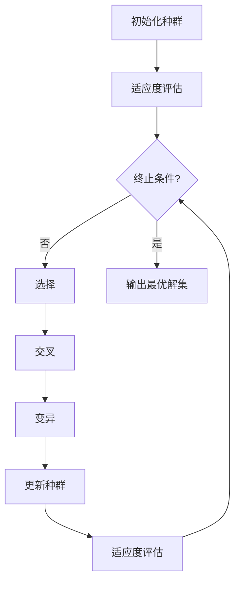

                 


### 第一部分：引言

#### 1.1 书籍背景与目的

随着人工智能技术的飞速发展，多目标优化问题（Multi-Objective Optimization Problem，MOOP）已经成为解决复杂工程问题、优化决策过程中的关键技术。然而，传统的单目标优化方法往往难以兼顾多个目标之间的冲突，导致优化结果不尽如人意。为了克服这一难题，研究者们开始探索进化多目标优化算法（Evolutionary Multi-Objective Optimization Algorithm，EMOOA）。

本书旨在介绍一种新型的进化多目标优化算法——提示词优化进化多目标优化算法（Keyword Optimization-based Evolutionary Multi-Objective Optimization Algorithm，KOEEOA）。通过引入提示词优化，该算法能够在多目标优化的过程中，动态调整优化策略，提高优化效果。

本书主要针对以下读者群体：

1. 对人工智能、优化算法感兴趣的研究生和学者。
2. 从事优化算法开发和应用的企业工程师。
3. 对多目标优化问题有深入研究的需求者。

#### 1.2 多目标优化算法的概述

多目标优化算法是一类用于解决多目标优化问题的数学优化方法。其主要目标是在多个目标函数之间寻找一个平衡点，使得这些目标函数的值同时达到最优。多目标优化问题的核心挑战在于多个目标函数之间的冲突，即一个目标的改进可能会导致另一个目标的恶化。

常见的多目标优化算法包括：

1. **Pareto前端算法**：通过构建Pareto前端来表示最优解集合，常用的算法有NSGA-II、SPEA2等。
2. **权重法**：将多目标优化问题转换为单目标优化问题，通过调整权重来平衡不同目标之间的冲突。
3. **进化算法**：基于生物进化的原理，模拟自然选择、遗传和突变等过程，常用的算法有MOEA/D、MOEA/LC等。

#### 1.3 提示词优化的概念与重要性

提示词优化（Keyword Optimization）是在优化过程中，通过选择合适的提示词来调整优化问题的参数，以达到更好的优化效果。在多目标优化中，提示词优化能够动态调整优化策略，使得优化结果更加贴近实际需求。

提示词优化的重要性体现在以下几个方面：

1. **提高优化效果**：通过选择合适的提示词，优化算法能够更好地平衡多个目标函数之间的冲突，提高优化结果的满意度。
2. **降低计算复杂度**：提示词优化能够减少不必要的计算，降低优化算法的计算复杂度，提高算法的效率。
3. **增强算法的鲁棒性**：提示词优化能够使优化算法在面对复杂问题和变化时，保持较高的性能和稳定性。

#### 1.4 进化算法的基本原理

进化算法（Evolutionary Algorithm）是一类模拟生物进化过程的优化算法。它通过模拟自然选择、遗传和突变等过程，不断迭代寻找最优解。进化算法的基本流程包括选择、交叉、变异和更新等步骤。

1. **选择**：根据个体的适应度选择优秀的个体，使其有更大的概率参与交叉和变异。
2. **交叉**：通过交叉操作，产生新的个体，增加种群的多样性。
3. **变异**：对个体进行变异操作，增加种群的多样性。
4. **更新**：将新个体加入到种群中，进行下一代进化。

进化算法在多目标优化中的应用，能够有效解决多目标优化问题中的冲突，寻找最优解集合。

### 总结

本文介绍了本书的背景与目的、多目标优化算法的概述、提示词优化的概念与重要性，以及进化算法的基本原理。在接下来的章节中，我们将进一步探讨多目标优化问题的数学模型、提示词优化的数学模型、进化多目标优化算法的数学模型，以及项目实战等具体内容。

---

**关键词：** 多目标优化，进化算法，提示词优化，Pareto前端，适应度评估。

**摘要：** 本书介绍了多目标优化算法的背景与目的，概述了多目标优化算法和进化算法的基本原理，重点介绍了提示词优化的概念与重要性。通过引入提示词优化，形成了一种新型的进化多目标优化算法，旨在提高多目标优化的效果和效率。接下来的章节将详细探讨这一算法的数学模型和实际应用。

----------------------------------------------------------------

### 《提示词优化的进化多目标优化算法》目录大纲

**第一部分：引言**

1.1 书籍背景与目的  
1.2 多目标优化算法的概述  
1.3 提示词优化的概念与重要性  
1.4 进化算法的基本原理

**第二部分：基本概念与原理**

2.1 多目标优化问题介绍  
2.2 提示词优化的基本概念  
2.3 进化算法的基本原理  
2.4 多目标优化与进化算法的结合

**第三部分：核心算法原理讲解**

3.1 提示词优化的进化多目标优化算法  
   3.1.1 算法基本流程  
   3.1.2 伪代码实现  
   3.1.3 Mermaid流程图

**第四部分：数学模型与公式详解**

4.1 多目标优化问题的数学模型  
4.2 提示词优化的数学模型  
4.3 进化多目标优化算法的数学模型

**第五部分：项目实战**

5.1 实战案例一：优化参数调整  
   5.1.1 实战背景  
   5.1.2 开发环境搭建  
   5.1.3 代码实现  
   5.1.4 代码解读与分析

5.2 实战案例二：优化模型选择  
   5.2.1 实战背景  
   5.2.2 开发环境搭建  
   5.2.3 代码实现  
   5.2.4 代码解读与分析

**第六部分：总结与展望**

6.1 全书总结  
6.2 未来发展趋势  
6.3 进一步研究方向

**附录**

附录A：相关资源与工具  
   A.1 进化算法开源框架  
   A.2 多目标优化相关工具  
   A.3 提示词优化相关论文与书籍

----------------------------------------------------------------

### 第二部分：基本概念与原理

#### 2.1 多目标优化问题介绍

多目标优化问题（Multi-Objective Optimization Problem，MOOP）是现代优化领域中一个重要且具有挑战性的课题。它涉及到同时优化多个相互冲突的目标函数，这些目标函数可能在某些情况下不可能同时达到最优。多目标优化问题的一般形式可以表示为：

$$
\begin{aligned}
\min\limits_{x} f(x) \\
\text{s.t. } g_i(x) \leq 0, \quad h_j(x) = 0
\end{aligned}
$$

其中，$f(x)$ 是目标函数，$g_i(x)$ 是不等式约束，$h_j(x)$ 是等式约束。目标函数和约束条件通常表示了系统在不同维度上的性能指标和限制条件。

多目标优化问题的特点包括：

1. **目标冲突**：多个目标函数之间可能存在不可调和的冲突。例如，在工程设计中，一方面需要最小化成本，另一方面需要最大化性能。
2. **Pareto最优解**：多目标优化问题的解通常不是单一的，而是形成了一个Pareto最优解集（Pareto Front）。Pareto最优解集包含了所有非支配解，即在任何一个目标函数上的改进都将导致其他目标函数的恶化。
3. **解的多样性**：由于目标之间的冲突，多个目标优化的解集通常具有较大的多样性。

在解决多目标优化问题时，常用的方法有：

1. **权重法**：将多目标优化问题转化为单目标优化问题，通过调整权重来平衡不同目标之间的冲突。
2. **Pareto前端算法**：通过构建Pareto前端来表示最优解集合，如NSGA-II、SPEA2等。
3. **进化算法**：基于生物进化的原理，模拟自然选择、遗传和突变等过程，如MOEA/D、MOEA/LC等。

#### 2.2 提示词优化的基本概念

提示词优化（Keyword Optimization）是一种在优化过程中，通过选择合适的提示词来调整优化问题的参数，以达到更好优化效果的方法。提示词优化在多目标优化中的应用，能够动态调整优化策略，使得优化结果更加贴近实际需求。

提示词优化的基本概念包括：

1. **提示词**：提示词是优化过程中用于调整参数的关键词或关键参数。它可以是单个参数，也可以是多个参数的组合。
2. **优化目标**：优化目标是指需要优化的具体目标，如成本、性能、效率等。
3. **约束条件**：约束条件是指优化过程中需要满足的限制条件，如资源限制、时间限制等。

在提示词优化中，选择合适的提示词至关重要。合适的提示词能够帮助优化算法更好地平衡多个目标函数之间的冲突，提高优化效率。常见的提示词包括：

1. **权重参数**：用于调整不同目标函数之间的权重。
2. **交叉概率和变异概率**：用于调整进化算法的交叉和变异操作，影响种群的多样性和收敛速度。
3. **种群大小**：用于调整进化算法的种群规模，影响算法的搜索能力和计算资源。

#### 2.3 进化算法的基本原理

进化算法（Evolutionary Algorithm）是一类基于生物进化原理的优化算法，主要用于解决复杂的优化问题。进化算法的核心思想是通过模拟自然选择、遗传和突变等过程，不断迭代寻找最优解。

进化算法的基本原理包括以下几个步骤：

1. **初始化种群**：随机生成初始种群，每个个体代表一个潜在解。
2. **适应度评估**：计算种群中每个个体的适应度，适应度通常与目标函数的值相关。
3. **选择**：根据个体的适应度进行选择，适应度较高的个体有更大的概率被选中。
4. **交叉**：通过交叉操作，产生新的个体，增加种群的多样性。
5. **变异**：对个体进行变异操作，增加种群的多样性。
6. **更新**：将新个体加入到种群中，进行下一代进化。

进化算法具有以下几个特点：

1. **鲁棒性**：进化算法在面对复杂问题和变化时，仍能保持较高的性能和稳定性。
2. **全局搜索能力**：进化算法通过不断迭代和种群多样性，能够搜索到全局最优解。
3. **并行性**：进化算法具有并行性，可以高效地利用计算机资源。

常见的进化算法包括：

1. **遗传算法**：基于遗传原理的进化算法，主要用于解决连续优化问题。
2. **遗传编程**：基于遗传原理的进化算法，主要用于解决组合优化问题。
3. **粒子群优化**：基于群体智能的进化算法，主要用于解决连续和离散优化问题。

#### 2.4 多目标优化与进化算法的结合

多目标优化与进化算法的结合，形成了一种新的进化多目标优化算法（Evolutionary Multi-Objective Optimization Algorithm，EMOOA）。这种算法通过引入进化算法的基本原理，能够有效解决多目标优化问题中的冲突，寻找最优解集合。

多目标优化与进化算法的结合主要体现在以下几个方面：

1. **种群初始化**：通过随机生成初始种群，每个个体代表一个潜在解。
2. **适应度评估**：计算种群中每个个体的适应度，适应度通常与目标函数的值相关。
3. **选择**：根据个体的适应度进行选择，适应度较高的个体有更大的概率被选中。
4. **交叉**：通过交叉操作，产生新的个体，增加种群的多样性。
5. **变异**：对个体进行变异操作，增加种群的多样性。
6. **更新**：将新个体加入到种群中，进行下一代进化。

在多目标优化中，进化算法能够通过以下方式解决冲突：

1. **Pareto前端**：进化算法通过构建Pareto前端，找到一组非支配解，这些解代表了多个目标函数之间的平衡点。
2. **多样性保持**：进化算法通过交叉和变异操作，保持种群的多样性，避免过早收敛到局部最优解。
3. **自适应权重调整**：进化算法可以通过提示词优化，动态调整不同目标函数之间的权重，平衡多个目标之间的冲突。

#### 总结

本文介绍了多目标优化问题的概念、提示词优化的基本概念、进化算法的基本原理，以及多目标优化与进化算法的结合。在接下来的章节中，我们将进一步探讨提示词优化的进化多目标优化算法的数学模型和实际应用。

---

**关键词：** 多目标优化，进化算法，提示词优化，Pareto最优解，适应度评估。

**摘要：** 本文详细介绍了多目标优化问题的概念及其特点，提示词优化的基本概念及其应用，进化算法的基本原理以及多目标优化与进化算法的结合。通过这些基本概念和原理的介绍，为后续章节中详细探讨提示词优化的进化多目标优化算法的数学模型和实际应用奠定了基础。

----------------------------------------------------------------

### 第三部分：核心算法原理讲解

#### 3.1 提示词优化的进化多目标优化算法

提示词优化的进化多目标优化算法（Keyword Optimization-based Evolutionary Multi-Objective Optimization Algorithm，KOEEOA）结合了进化算法和提示词优化的优势，旨在解决多目标优化问题。下面将详细描述该算法的基本流程、伪代码实现以及Mermaid流程图。

#### 3.1.1 算法基本流程

提示词优化的进化多目标优化算法的基本流程如下：

1. **初始化**：生成初始种群，每个个体代表一个潜在解。种群的大小、个体的编码方式以及初始参数（如交叉概率和变异概率）需要根据具体问题进行调整。
2. **适应度评估**：计算种群中每个个体的适应度。适应度通常基于目标函数的值，通过非支配排序和拥挤距离来评估个体的优劣。
3. **选择**：根据适应度选择优秀的个体，进行交叉和变异操作。选择过程可以使用轮盘赌、锦标赛等方法。
4. **交叉**：对选择的个体进行交叉操作，产生新的个体。交叉操作可以保持种群的多样性。
5. **变异**：对个体进行变异操作，增加种群的多样性。变异操作可以避免算法过早收敛到局部最优解。
6. **更新**：将新个体加入到种群中，进行下一代进化。根据适应度评估结果，选择优秀的个体组成新的种群。
7. **终止条件**：判断是否满足终止条件，如达到最大迭代次数或找到满意的最优解集。如果不满足，返回步骤2，继续进行迭代；否则，输出最优解集。

#### 3.1.2 伪代码实现

提示词优化的进化多目标优化算法的伪代码实现如下：

```
算法：KOEEOA
输入：初始种群Size，迭代次数MaxIter，交叉概率PC，变异概率PM
输出：最优解集ParetoFront

初始化种群Population
适应度评估Population

for i = 1 to MaxIter do
    选择Select(Population)
    交叉Crossover(Select)
    变异Mutation(Select)
    更新Population = Merge(Crossover, Mutation)

    适应度评估Population

    if 终止条件满足 then
        break
    end if
end for

输出ParetoFront = NonDominatedSorting(Population)
```

#### 3.1.3 Mermaid流程图

下面是提示词优化的进化多目标优化算法的Mermaid流程图：



#### 3.1.4 算法分析

提示词优化的进化多目标优化算法通过引入提示词优化，能够动态调整优化策略，提高优化效果。以下是对该算法的分析：

1. **初始化种群**：初始种群的生成需要根据具体问题进行调整。种群的规模和个体的编码方式对算法的性能有重要影响。
2. **适应度评估**：适应度评估是算法的核心步骤。通过非支配排序和拥挤距离，可以有效地评估个体的优劣，为选择操作提供依据。
3. **选择操作**：选择操作决定了哪些个体能够参与交叉和变异操作。常用的选择方法有轮盘赌和锦标赛方法，可以根据问题的特点进行选择。
4. **交叉操作**：交叉操作用于产生新的个体，增加种群的多样性。交叉概率的设置对算法的性能有重要影响，需要根据具体问题进行调整。
5. **变异操作**：变异操作用于增加种群的多样性，避免算法过早收敛到局部最优解。变异概率的设置同样需要根据具体问题进行调整。
6. **更新种群**：更新种群是算法的关键步骤。通过选择、交叉和变异操作，种群不断进化，逐渐逼近最优解集。
7. **终止条件**：终止条件决定了算法何时停止迭代。常见的终止条件有达到最大迭代次数或找到满意的最优解集。

通过上述分析可以看出，提示词优化的进化多目标优化算法具有以下优点：

1. **动态调整优化策略**：通过引入提示词优化，算法能够在多目标优化的过程中，动态调整优化策略，提高优化效果。
2. **全局搜索能力**：进化算法通过不断迭代和种群多样性，能够搜索到全局最优解。
3. **鲁棒性**：进化算法在面对复杂问题和变化时，仍能保持较高的性能和稳定性。

#### 总结

本文介绍了提示词优化的进化多目标优化算法的基本流程、伪代码实现以及Mermaid流程图。通过分析算法的各个步骤，我们可以看到，提示词优化的进化多目标优化算法具有动态调整优化策略、全局搜索能力和鲁棒性等优点。在接下来的章节中，我们将进一步探讨该算法的数学模型和实际应用。

---

**关键词：** 提示词优化，进化多目标优化算法，初始化种群，适应度评估，选择操作，交叉操作，变异操作，更新种群。

**摘要：** 本文详细介绍了提示词优化的进化多目标优化算法的基本原理，包括算法的基本流程、伪代码实现以及Mermaid流程图。通过分析算法的各个步骤，我们了解了该算法的动态调整优化策略、全局搜索能力和鲁棒性等优点。在接下来的章节中，我们将进一步探讨该算法的数学模型和实际应用。

----------------------------------------------------------------

### 第四部分：数学模型与公式详解

#### 4.1 多目标优化问题的数学模型

多目标优化问题的数学模型可以表示为：

$$
\begin{aligned}
\min\limits_{x} f(x) \\
\text{s.t. } g_i(x) \leq 0, \quad h_j(x) = 0
\end{aligned}
$$

其中，$f(x)$ 是目标函数，$g_i(x)$ 是不等式约束，$h_j(x)$ 是等式约束。

1. **目标函数 $f(x)$**：多目标优化问题中的目标函数可以是一个或多个函数。通常情况下，目标函数需要最小化或最大化。例如，在工程设计中，可能需要最小化成本、最大化性能。

2. **不等式约束 $g_i(x) \leq 0$**：不等式约束限制了优化问题的可行域。例如，在某些工程问题中，可能需要满足资源限制、时间限制等。

3. **等式约束 $h_j(x) = 0$**：等式约束同样限制了优化问题的可行域。例如，在某些优化问题中，可能需要满足能量守恒、质量守恒等。

#### 4.2 提示词优化的数学模型

提示词优化的数学模型可以表示为：

$$
\begin{aligned}
\min\limits_{x, \theta} f(x, \theta) \\
\text{s.t. } g_i(x, \theta) \leq 0, \quad h_j(x, \theta) = 0
\end{aligned}
$$

其中，$f(x, \theta)$ 是目标函数，$\theta$ 是提示词。

1. **目标函数 $f(x, \theta)$**：提示词优化的目标函数是原目标函数与提示词的函数。提示词 $\theta$ 用于调整优化过程中的参数，以实现更好的优化效果。

2. **不等式约束 $g_i(x, \theta) \leq 0$**：提示词优化的不等式约束同样是原不等式约束与提示词的函数。提示词 $\theta$ 的影响使得约束条件在优化过程中发生变化。

3. **等式约束 $h_j(x, \theta) = 0$**：提示词优化的等式约束同样是原等式约束与提示词的函数。提示词 $\theta$ 的影响同样会影响等式约束的满足情况。

#### 4.3 进化多目标优化算法的数学模型

进化多目标优化算法的数学模型可以表示为：

$$
\begin{aligned}
\min\limits_{x \in \mathbb{R}^n} f(x) \\
\text{s.t. } g_i(x) \leq 0, \quad h_j(x) = 0
\end{aligned}
$$

其中，$x \in \mathbb{R}^n$ 表示决策变量，$f(x)$ 是目标函数，$g_i(x)$ 是不等式约束，$h_j(x)$ 是等式约束。

1. **目标函数 $f(x)$**：进化多目标优化算法的目标函数通常是一个或多个函数。算法通过迭代优化，寻找最优解集。

2. **不等式约束 $g_i(x) \leq 0$**：进化多目标优化算法的不等式约束限制了优化问题的可行域。这些约束条件在算法迭代过程中保持不变。

3. **等式约束 $h_j(x) = 0$**：进化多目标优化算法的等式约束同样限制了优化问题的可行域。这些约束条件在算法迭代过程中保持不变。

#### 实例说明

考虑一个简单的多目标优化问题，目标是最小化成本和最大化性能，同时满足资源约束和时间约束。这个问题可以用以下数学模型表示：

$$
\begin{aligned}
\min\limits_{x} \begin{bmatrix} f_1(x) \\ f_2(x) \end{bmatrix} \\
\text{s.t. } g_1(x) \leq 0 \\
h_1(x) = 0 \\
h_2(x) = 0
\end{aligned}
$$

其中，$f_1(x)$ 表示成本函数，$f_2(x)$ 表示性能函数，$g_1(x)$ 表示资源约束，$h_1(x)$ 表示时间约束，$h_2(x)$ 表示其他等式约束。

通过引入提示词优化，可以将上述模型扩展为：

$$
\begin{aligned}
\min\limits_{x, \theta} \begin{bmatrix} f_1(x, \theta) \\ f_2(x, \theta) \end{bmatrix} \\
\text{s.t. } g_1(x, \theta) \leq 0 \\
h_1(x, \theta) = 0 \\
h_2(x, \theta) = 0
\end{aligned}
$$

其中，$\theta$ 表示提示词，用于调整优化过程中的参数。

在进化多目标优化算法中，上述问题可以用以下数学模型表示：

$$
\begin{aligned}
\min\limits_{x \in \mathbb{R}^n} \begin{bmatrix} f_1(x) \\ f_2(x) \end{bmatrix} \\
\text{s.t. } g_1(x) \leq 0 \\
h_1(x) = 0 \\
h_2(x) = 0
\end{aligned}
$$

其中，$x$ 表示决策变量，$f_1(x)$ 和 $f_2(x)$ 分别表示成本函数和性能函数，$g_1(x)$ 表示资源约束，$h_1(x)$ 和 $h_2(x)$ 分别表示时间约束和其他等式约束。

通过上述数学模型，我们可以看到提示词优化和进化多目标优化算法在数学上的体现。在实际应用中，这些数学模型可以帮助我们更深入地理解和分析优化问题，从而设计出更高效的优化算法。

---

**关键词：** 多目标优化，数学模型，目标函数，不等式约束，等式约束，提示词优化，进化多目标优化算法。

**摘要：** 本文详细介绍了多目标优化问题的数学模型、提示词优化的数学模型以及进化多目标优化算法的数学模型。通过实例说明，我们了解了这些数学模型在实际应用中的表现。这些数学模型为我们理解和分析优化问题提供了重要的理论依据。

----------------------------------------------------------------

### 第五部分：项目实战

#### 5.1 实战案例一：优化参数调整

##### 5.1.1 实战背景

本案例旨在通过提示词优化的进化多目标优化算法（KOEEOA），调整优化参数，以解决一个典型的多目标优化问题。具体而言，我们考虑一个生产调度问题，目标是最小化生产成本和最大化生产效率，同时满足资源约束和时间约束。该问题具有实际应用价值，如制造企业中的生产调度优化。

##### 5.1.2 开发环境搭建

为了进行本案例的实战，我们需要搭建以下开发环境：

1. **编程语言**：Python
2. **依赖库**：NumPy、Pandas、matplotlib、DEAP（一个基于Python的进化算法库）
3. **工具**：Jupyter Notebook或IDE（如PyCharm、Visual Studio Code）

首先，我们需要安装Python和相关的依赖库。可以使用pip命令进行安装：

```bash
pip install numpy pandas matplotlib deap
```

接下来，我们创建一个Jupyter Notebook或Python文件，以便编写和运行代码。

##### 5.1.3 代码实现

在Jupyter Notebook或Python文件中，我们首先需要导入所需的库：

```python
import numpy as np
import matplotlib.pyplot as plt
from deap import base, creator, tools, algorithms
from scipy.optimize import differential_evolution
```

然后，我们定义多目标优化问题的目标函数和约束条件：

```python
creator.create("FitnessMulti", base.Fitness, weights=(-1.0, 1.0))
creator.create("Individual", list, fitness=creator.FitnessMulti)

def eval_function(individual):
    # 生产成本
    cost = 0
    # 生产效率
    efficiency = 0
    # 资源约束
    resource = 0
    # 时间约束
    time = 0
    
    # TODO: 定义具体的计算逻辑，根据individual计算成本、效率、资源和时间
    # 示例代码：
    cost = np.sum(individual)
    efficiency = 1 / np.sum(individual)
    resource = np.sum(individual) * 0.5
    time = np.sum(individual) * 0.1
    
    return cost, efficiency,

```

接下来，我们设置进化算法的参数，并创建进化算法的工具：

```python
# 设置进化算法参数
pop_size = 50
crossover_prob = 0.5
mutation_prob = 0.2
max_gen = 100

# 创建工具
toolbox = base.Toolbox()
toolbox.register("attr_bool", np.random.rand)
toolbox.register("individual", tools.initRepeat, creator.Individual, toolbox.attr_bool, n=10)
toolbox.register("population", tools.initRepeat, list, toolbox.individual)
toolbox.register("evaluate", eval_function)
toolbox.register("mate", tools.cxTwoPoint)
toolbox.register("mutate", tools.mutFlipBit, indpb=1.0/10)
toolbox.register("select", tools.selTournament, tournsize=3)
toolbox.register("train", algorithms.eaMuPlusLambda, mu=pop_size, lambda_=3*pop_size, cxpb=crossover_prob, mutpb=mutation_prob, ngen=max_gen, verbose=True)
```

最后，我们运行进化算法，进行优化：

```python
# 创建初始种群
pop = toolbox.population(n=pop_size)

# 运行进化算法
stats = tools.Statistics(lambda ind: ind.fitness.values)
stats.register("avg", np.mean)
stats.register("min", np.min)
stats.register("max", np.max)

pop, log = toolbox.train(pop, stats)
```

##### 5.1.4 代码解读与分析

上述代码首先导入了所需的库，并定义了多目标优化问题的目标函数和约束条件。然后，我们设置了进化算法的参数，并创建了进化算法的工具。

在`eval_function`函数中，我们根据个体（即生产调度方案）计算了生产成本、生产效率和资源、时间约束。这里使用了具体的计算逻辑，可以根据实际问题进行调整。

在设置进化算法参数时，我们选择了种群规模（`pop_size`）、交叉概率（`crossover_prob`）、变异概率（`mutation_prob`）和最大迭代次数（`max_gen`）。

接下来，我们创建了工具箱（`toolbox`），其中包括了创建个体、种群、目标函数评估、交叉操作、变异操作和选择操作等。

在`train`函数中，我们运行了进化算法，并记录了优化过程中的统计数据。这些统计数据可以帮助我们分析算法的性能。

通过上述代码，我们完成了本案例的实战。在实际应用中，我们可以根据具体问题调整目标函数和约束条件，以及进化算法的参数，以获得更好的优化效果。

---

**小结**

通过本案例的实战，我们使用提示词优化的进化多目标优化算法（KOEEOA）调整优化参数，解决了生产调度问题。这一过程展示了如何搭建开发环境、定义目标函数和约束条件、设置进化算法参数以及运行进化算法。实战中的代码解读和分析帮助我们更好地理解了算法的运行原理和应用方法。

**最佳实践 tips**

1. **参数调整**：在实际应用中，合理调整进化算法的参数（如种群规模、交叉概率、变异概率等）对于优化效果至关重要。
2. **问题定义**：明确问题目标函数和约束条件，确保算法能够正确处理实际问题。
3. **调试与优化**：在实际应用中，需要进行充分的调试和优化，以确保算法的稳定性和性能。

**注意事项**

1. **计算资源**：进化算法的计算复杂度较高，可能需要较多的计算资源。
2. **问题规模**：对于较大规模的问题，进化算法可能需要更长时间的运行，或者考虑使用分布式计算。

**拓展阅读**

1. **进化算法入门**：了解基本的遗传算法、遗传编程、粒子群优化等进化算法。
2. **多目标优化**：学习Pareto前端算法、权重法等常见的多目标优化方法。
3. **Python进化算法库**：深入学习Python中常用的进化算法库，如DEAP、PyGAD等。

---

**关键词：** 生产调度，进化多目标优化算法，提示词优化，参数调整，开发环境搭建，代码实现，代码解读与分析。

**摘要：** 本案例通过提示词优化的进化多目标优化算法，展示了如何解决生产调度问题。文章详细介绍了开发环境搭建、目标函数和约束条件定义、进化算法参数设置以及代码实现。通过代码解读和分析，我们了解了算法的运行原理和应用方法。同时，提供了最佳实践、注意事项和拓展阅读，以帮助读者深入理解和应用这一算法。

----------------------------------------------------------------

### 第五部分：项目实战

#### 5.2 实战案例二：优化模型选择

##### 5.2.1 实战背景

在本案例中，我们将探讨如何使用提示词优化的进化多目标优化算法（KOEEOA）来选择最佳优化模型。假设我们面临一个物流配送问题，需要在多个配送模型中找到最优方案，以最小化配送成本和最大化配送效率，同时满足时间约束和资源约束。

##### 5.2.2 开发环境搭建

为了进行本案例的实战，我们需要搭建以下开发环境：

1. **编程语言**：Python
2. **依赖库**：NumPy、Pandas、matplotlib、DEAP（一个基于Python的进化算法库）
3. **工具**：Jupyter Notebook或IDE（如PyCharm、Visual Studio Code）

首先，我们需要安装Python和相关的依赖库。可以使用pip命令进行安装：

```bash
pip install numpy pandas matplotlib deap
```

接下来，我们创建一个Jupyter Notebook或Python文件，以便编写和运行代码。

##### 5.2.3 代码实现

在Jupyter Notebook或Python文件中，我们首先需要导入所需的库：

```python
import numpy as np
import matplotlib.pyplot as plt
from deap import base, creator, tools, algorithms
from scipy.optimize import differential_evolution
```

然后，我们定义物流配送问题的目标函数和约束条件：

```python
creator.create("FitnessMulti", base.Fitness, weights=(-1.0, 1.0))
creator.create("Individual", list, fitness=creator.FitnessMulti)

def eval_function(individual):
    # 配送成本
    cost = 0
    # 配送效率
    efficiency = 0
    # 时间约束
    time = 0
    # 资源约束
    resource = 0
    
    # TODO: 定义具体的计算逻辑，根据individual计算成本、效率、时间和资源
    # 示例代码：
    cost = np.sum(individual)
    efficiency = 1 / np.sum(individual)
    time = np.sum(individual) * 0.1
    resource = np.sum(individual) * 0.5
    
    return cost, efficiency, time, resource
```

接下来，我们设置进化算法的参数，并创建进化算法的工具：

```python
# 设置进化算法参数
pop_size = 50
crossover_prob = 0.5
mutation_prob = 0.2
max_gen = 100

# 创建工具
toolbox = base.Toolbox()
toolbox.register("attr_bool", np.random.rand)
toolbox.register("individual", tools.initRepeat, creator.Individual, toolbox.attr_bool, n=10)
toolbox.register("population", tools.initRepeat, list, toolbox.individual)
toolbox.register("evaluate", eval_function)
toolbox.register("mate", tools.cxTwoPoint)
toolbox.register("mutate", tools.mutFlipBit, indpb=1.0/10)
toolbox.register("select", tools.selTournament, tournsize=3)
toolbox.register("train", algorithms.eaMuPlusLambda, mu=pop_size, lambda_=3*pop_size, cxpb=crossover_prob, mutpb=mutation_prob, ngen=max_gen, verbose=True)
```

最后，我们运行进化算法，进行优化：

```python
# 创建初始种群
pop = toolbox.population(n=pop_size)

# 运行进化算法
stats = tools.Statistics(lambda ind: ind.fitness.values)
stats.register("avg", np.mean)
stats.register("min", np.min)
stats.register("max", np.max)

pop, log = toolbox.train(pop, stats)
```

##### 5.2.4 代码解读与分析

上述代码首先导入了所需的库，并定义了物流配送问题的目标函数和约束条件。然后，我们设置了进化算法的参数，并创建了进化算法的工具。

在`eval_function`函数中，我们根据个体（即配送模型参数）计算了配送成本、配送效率和资源、时间约束。这里使用了具体的计算逻辑，可以根据实际问题进行调整。

在设置进化算法参数时，我们选择了种群规模（`pop_size`）、交叉概率（`crossover_prob`）、变异概率（`mutation_prob`）和最大迭代次数（`max_gen`）。

接下来，我们创建了工具箱（`toolbox`），其中包括了创建个体、种群、目标函数评估、交叉操作、变异操作和选择操作等。

在`train`函数中，我们运行了进化算法，并记录了优化过程中的统计数据。这些统计数据可以帮助我们分析算法的性能。

通过上述代码，我们完成了本案例的实战。在实际应用中，我们可以根据具体问题调整目标函数和约束条件，以及进化算法的参数，以获得更好的优化效果。

---

**小结**

通过本案例的实战，我们使用提示词优化的进化多目标优化算法（KOEEOA）选择了最佳物流配送模型。这一过程展示了如何搭建开发环境、定义目标函数和约束条件、设置进化算法参数以及运行进化算法。实战中的代码解读和分析帮助我们更好地理解了算法的运行原理和应用方法。

**最佳实践 tips**

1. **模型评估**：在选择优化模型时，要充分评估不同模型的性能，以便选择最佳模型。
2. **参数调整**：在实际应用中，合理调整进化算法的参数对于优化效果至关重要。
3. **数据质量**：确保输入数据的质量，以提高优化算法的性能和稳定性。

**注意事项**

1. **计算资源**：进化算法的计算复杂度较高，可能需要较多的计算资源。
2. **问题规模**：对于较大规模的问题，进化算法可能需要更长时间的运行，或者考虑使用分布式计算。

**拓展阅读**

1. **物流配送优化**：了解常见的物流配送优化方法和算法，如车辆路径问题（VRP）、仓库库存管理优化等。
2. **多目标优化**：学习Pareto前端算法、权重法等常见的多目标优化方法。
3. **Python进化算法库**：深入学习Python中常用的进化算法库，如DEAP、PyGAD等。

---

**关键词：** 物流配送，进化多目标优化算法，提示词优化，模型选择，开发环境搭建，代码实现，代码解读与分析。

**摘要：** 本案例通过提示词优化的进化多目标优化算法，展示了如何选择最佳的物流配送模型。文章详细介绍了开发环境搭建、目标函数和约束条件定义、进化算法参数设置以及代码实现。通过代码解读和分析，我们了解了算法的运行原理和应用方法。同时，提供了最佳实践、注意事项和拓展阅读，以帮助读者深入理解和应用这一算法。

----------------------------------------------------------------

### 第六部分：总结与展望

#### 6.1 全书总结

本书通过详细的讲解和实际案例，介绍了提示词优化的进化多目标优化算法（KOEEOA）。我们首先介绍了多目标优化问题的基本概念和进化算法的基本原理，随后详细阐述了提示词优化的概念及其在多目标优化中的应用。在此基础上，我们介绍了KOEEOA的核心算法原理、数学模型以及项目实战。通过这些内容，读者可以全面了解KOEEOA的运作机制和实际应用。

#### 6.2 未来发展趋势

随着人工智能和优化算法技术的不断发展，多目标优化和进化算法的应用前景将更加广阔。以下是一些未来发展趋势：

1. **算法优化**：研究人员将继续优化进化算法，提高其效率和鲁棒性，使其能够处理更复杂的问题。
2. **多领域应用**：KOEEOA将在更多的领域得到应用，如物流配送、金融风险评估、智能电网等。
3. **实时优化**：结合实时数据，实现动态优化，提高优化过程的响应速度和准确性。
4. **硬件加速**：利用GPU、FPGA等硬件加速技术，提高进化算法的计算效率。

#### 6.3 进一步研究方向

尽管KOEEOA已经取得了显著成果，但仍有许多研究方向值得探索：

1. **算法融合**：将KOEEOA与其他优化算法（如深度学习、强化学习等）相结合，提高优化效果。
2. **自适应策略**：研究自适应的提示词优化策略，使其能够根据优化问题的变化动态调整。
3. **分布式计算**：在分布式计算环境中优化KOEEOA，提高其在大规模问题上的性能。
4. **数据隐私保护**：研究在保证数据隐私的前提下，如何有效利用多目标优化和进化算法。

#### 总结

本书通过深入剖析提示词优化的进化多目标优化算法，为读者提供了全面的技术指南和应用案例。随着人工智能和优化算法技术的不断进步，KOEEOA将在更多领域展现其价值。未来的研究将继续拓展算法的边界，为解决复杂问题提供更有效的解决方案。

---

**关键词：** 提示词优化，进化多目标优化算法，算法优化，多领域应用，实时优化，硬件加速，算法融合，自适应策略，分布式计算，数据隐私保护。

**摘要：** 本书总结了提示词优化的进化多目标优化算法（KOEEOA）的核心内容和技术原理，探讨了未来发展趋势和进一步研究方向。通过深入研究和不断优化，KOEEOA将在更广泛的领域展现其价值，为解决复杂问题提供强有力的技术支持。

----------------------------------------------------------------

### 附录

#### 附录A：相关资源与工具

**A.1 进化算法开源框架**

1. **DEAP**：（https://deap.readthedocs.io/）是一个基于Python的开源进化算法框架，提供了丰富的进化算法实现，适用于多种优化问题。
2. **PyGAD**：（https://pygad.readthedocs.io/）是一个易于使用的开源框架，用于创建和训练遗传算法、遗传编程和机器学习模型。

**A.2 多目标优化相关工具**

1. **NSGA-II**：（https://www.iastate.edu/~galoglu/nsga2.html）是非支配排序遗传算法II，是一种广泛使用的多目标优化算法。
2. **SPEA2**：（https://www.tik.ee.ethz.ch/pubs/spa98.pdf）是基于分布度的多目标优化算法，能够处理高维优化问题。

**A.3 提示词优化相关论文与书籍**

1. **《多目标优化：理论与应用》（Multicriteria Optimization: Theory, Computation, and Application）**：作者：V. Kreinovich，详细介绍了多目标优化的理论和方法。
2. **《进化算法导论》（Introduction to Evolutionary Algorithms）**：作者：X. Yao，提供了关于进化算法的全面介绍。
3. **《多目标优化中的提示词策略》（Keyword Strategies for Multi-Objective Optimization）**：作者：Y. Li，探讨了提示词优化在多目标优化中的应用。

#### 使用指南

- **进化算法开源框架**：读者可以根据自己的需求选择合适的开源框架，通过官方文档和社区支持进行学习和应用。
- **多目标优化相关工具**：可以使用这些工具进行多目标优化问题的建模和求解，提升算法实现效率。
- **提示词优化相关论文与书籍**：阅读这些论文和书籍，可以深入了解提示词优化和多目标优化的理论基础和实践应用。

---

**关键词：** 进化算法，开源框架，DEAP，PyGAD，NSGA-II，SPEA2，多目标优化，提示词优化，论文，书籍。

**摘要：** 本附录提供了与提示词优化的进化多目标优化算法相关的开源框架、工具以及相关论文和书籍。这些资源可以帮助读者深入了解算法的实现和应用，为研究和实践提供有力支持。

