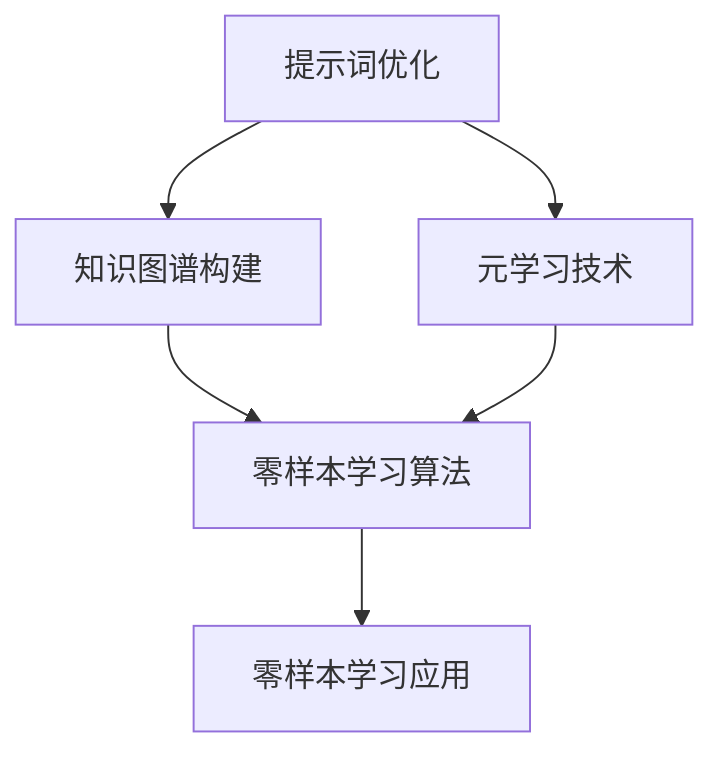

                 

### 文章标题

《提示词优化的零样本学习方法》

### 关键词

提示词优化，零样本学习，知识图谱，元学习，自然语言处理，计算机视觉，人工智能对话系统。

### 摘要

本文将深入探讨提示词优化的零样本学习方法，介绍其基本概念、技术基础、核心算法原理，以及在实际应用中的实践和未来发展趋势。通过详细分析零样本学习与传统机器学习的区别与联系，我们揭示了提示词优化在提升模型性能和泛化能力中的关键作用。本文还将通过实际案例，展示如何使用提示词优化的零样本学习技术，构建高效的人工智能对话系统和计算机视觉模型。同时，我们也对未来零样本学习方法的发展趋势和面临的挑战进行了展望，以期为相关领域的研究者和开发者提供有价值的参考。

## 《提示词优化的零样本学习方法》目录大纲

## 第一部分：零样本学习方法概述

### 第1章：零样本学习概念与背景

#### 1.1 零样本学习的基本概念

#### 1.2 零样本学习的应用场景

#### 1.3 零样本学习与传统机器学习的区别与联系

### 第2章：零样本学习的技术基础

#### 2.1 提示词优化的原理与方法

#### 2.2 零样本学习中的知识图谱构建

#### 2.3 零样本学习中的元学习技术

### 第3章：零样本学习核心算法原理

#### 3.1 基于知识图谱的零样本学习算法

#### 3.2 提示词优化的零样本学习算法

#### 3.3 零样本学习的数学模型与公式

## 第二部分：零样本学习方法实践

### 第4章：提示词优化的零样本学习应用场景

#### 4.1 自然语言处理中的应用

#### 4.2 计算机视觉中的应用

#### 4.3 人工智能对话系统中的应用

### 第5章：提示词优化的零样本学习实战

#### 5.1 数据预处理与知识图谱构建

#### 5.2 模型训练与优化

#### 5.3 模型评估与结果分析

### 第6章：零样本学习方法在人工智能对话系统中的应用

#### 6.1 对话系统概述

#### 6.2 零样本学习在对话系统中的应用

#### 6.3 提示词优化的对话系统模型

### 第7章：零样本学习方法在计算机视觉中的应用

#### 7.1 计算机视觉概述

#### 7.2 零样本学习在计算机视觉中的应用

#### 7.3 提示词优化的计算机视觉模型

## 第三部分：零样本学习方法展望与挑战

### 第8章：零样本学习方法的未来发展趋势

#### 8.1 零样本学习在人工智能领域的发展前景

#### 8.2 提示词优化技术的未来发展方向

#### 8.3 零样本学习面临的挑战与解决方案

### 第9章：零样本学习方法的应用实践案例分享

#### 9.1 成功案例分享

#### 9.2 案例分析与经验总结

#### 9.3 未来实践趋势展望

## 附录

### 附录A：零样本学习相关资源与工具

#### A.1 主流零样本学习框架对比

#### A.2 零样本学习常用数据集介绍

#### A.3 零样本学习开源项目推荐

### 附录B：提示词优化的零样本学习算法伪代码

#### B.1 算法1：基于知识图谱的零样本学习算法

#### B.2 算法2：提示词优化的零样本学习算法

### 附录C：零样本学习相关数学公式

#### C.1 矩阵运算公式

#### C.2 损失函数公式

#### C.3 梯度下降优化算法公式

## 第一部分：零样本学习方法概述

### 第1章：零样本学习概念与背景

零样本学习（Zero-shot Learning, ZSL）是一种机器学习方法，旨在在没有直接监督学习（即训练样本）的情况下，对未见过的类别进行分类。这一概念在人工智能领域引起了广泛关注，特别是在图像识别、自然语言处理和计算机视觉等领域。

#### 1.1 零样本学习的基本概念

零样本学习的核心思想是利用先验知识（如概念层次结构、语义信息或知识图谱）来处理未见过的类别。这种方法避免了传统机器学习中的标注问题，使得模型能够泛化到新的、未见的类别。

- **定义**：零样本学习是指在没有训练标签的情况下，对未见过类的数据进行预测。

- **目标**：提高模型在未见类别上的预测准确性，增强模型的泛化能力。

- **优势**：无需大规模标注数据集，节省人力和时间成本。

- **挑战**：如何有效地利用先验知识，以提高模型的性能和泛化能力。

#### 1.2 零样本学习的应用场景

零样本学习在多个领域都有广泛的应用场景，其中最典型的包括：

- **图像识别**：例如，对图像进行分类，当类别标签未知时，利用知识图谱或先验信息进行预测。

- **自然语言处理**：例如，在文本分类任务中，对未见过的主题或领域进行分类。

- **计算机视觉**：例如，对新的物体进行识别和分类。

- **医疗诊断**：例如，在医学图像分析中，对未见过的疾病进行诊断。

- **金融风险控制**：例如，在金融领域，对新出现的风险进行预测和评估。

#### 1.3 零样本学习与传统机器学习的区别与联系

零样本学习与传统机器学习的主要区别在于数据的标注方式和模型的训练方式：

- **标注数据**：传统机器学习需要大量的标注数据进行训练，而零样本学习利用先验知识，无需标注数据。

- **训练方式**：传统机器学习通过梯度下降等方法对模型进行训练，而零样本学习则依赖于知识图谱、元学习等技术。

尽管零样本学习在某些方面具有优势，但它也存在一定的局限性：

- **挑战**：如何有效地利用先验知识，以及在未见类别上的预测准确性。

- **适用性**：在某些任务中，零样本学习可能不如传统机器学习有效。

然而，随着人工智能技术的不断发展，零样本学习在许多实际应用中显示出巨大的潜力。通过本章的介绍，我们为后续章节的深入探讨奠定了基础。

## 第二部分：零样本学习的技术基础

### 第2章：零样本学习的技术基础

零样本学习（Zero-shot Learning, ZSL）作为一项前沿的机器学习方法，其核心依赖于一系列技术手段来实现对未见类别的高效预测。本章将详细介绍零样本学习中的关键技术，包括提示词优化的原理与方法、知识图谱的构建以及元学习技术。这些技术手段不仅为零样本学习提供了理论基础，同时也为其实际应用提供了有力支持。

#### 2.1 提示词优化的原理与方法

提示词优化（Prompt Optimization）是零样本学习中的一个关键技术，其主要目的是通过优化提示词（Prompt）来提高模型的预测性能。提示词可以看作是对模型的输入数据进行增强或补充，从而引导模型更好地理解未见类别。

- **原理**：提示词优化的原理基于自然语言处理（NLP）中的语言模型，通过调整提示词的构造和选择，使得模型能够更好地捕捉语义信息，从而提高预测准确性。

- **方法**：提示词优化的方法主要包括以下几种：

  1. **模板匹配**：通过预设的模板来生成提示词，模板中包含关键信息，如类别名称、特征描述等。
  
  2. **语义扩展**：基于词向量模型，对提示词进行语义扩展，从而增强其表示能力。
  
  3. **对抗训练**：通过对抗训练方法，生成对抗性的提示词，以提高模型的泛化能力。

#### 2.2 零样本学习中的知识图谱构建

知识图谱（Knowledge Graph）是零样本学习中的重要工具，它能够将文本、图像等数据转化为结构化的知识表示，从而为模型提供丰富的先验信息。

- **定义**：知识图谱是由实体、属性和关系构成的语义网络，能够表达实体之间的复杂关系。

- **构建方法**：

  1. **本体构建**：通过本体（Ontology）构建知识图谱，定义实体、属性和关系的语义。
  
  2. **数据挖掘**：利用数据挖掘技术，从非结构化数据中提取实体和关系。
  
  3. **知识融合**：将来自不同来源的知识进行融合，提高知识图谱的完整性和一致性。

#### 2.3 零样本学习中的元学习技术

元学习（Meta-Learning）是一种通过学习如何学习的算法，它能够在少量样本上快速适应新任务，是零样本学习的重要技术手段。

- **定义**：元学习是指通过训练模型来学习如何适应新任务，从而提高模型的迁移能力和泛化能力。

- **方法**：

  1. **模型无关元学习**：通过学习通用表示方法，使得模型在不同任务间具有良好的泛化能力。
  
  2. **模型相关元学习**：针对特定模型结构，通过模型参数的调整来提高其适应新任务的能力。
  
  3. **任务无关元学习**：通过学习通用任务策略，使得模型在不同任务上都能表现出色。

#### 2.4 技术手段之间的关系架构

为了更好地理解这些技术手段之间的相互作用，我们使用Mermaid流程图进行描述：



在这个流程图中，提示词优化、知识图谱构建和元学习技术共同作用于零样本学习算法，最终实现零样本学习的应用。

通过本章的介绍，我们为理解零样本学习的技术基础提供了详细的解释。在接下来的章节中，我们将进一步探讨零样本学习的核心算法原理，以及其实际应用场景中的具体实现方法。

### 第3章：零样本学习核心算法原理

零样本学习作为一种前沿的机器学习方法，其核心算法原理涉及到多个技术领域，包括基于知识图谱的算法、提示词优化的算法，以及相关的数学模型和公式。本章将详细解析这些核心算法原理，为读者提供深入理解零样本学习的技术基础。

#### 3.1 基于知识图谱的零样本学习算法

知识图谱（Knowledge Graph）在零样本学习中的应用至关重要，它能够将实体、属性和关系结构化为图，从而为模型提供丰富的先验信息。

- **算法原理**：

  算法的基本思想是利用知识图谱中的关系和属性来推断未见类别与已知类别之间的关联。具体步骤如下：

  1. **知识图谱构建**：首先，通过本体构建、数据挖掘和知识融合等方法，构建一个结构化的知识图谱。
  
  2. **实体嵌入**：将知识图谱中的实体映射到低维空间，形成实体嵌入向量。
  
  3. **关系建模**：利用图神经网络（Graph Neural Networks, GNN）来建模实体之间的关系，提取高层次的语义特征。
  
  4. **类别预测**：将未见类别与知识图谱中的实体和关系进行匹配，利用匹配结果进行类别预测。

- **伪代码**：

  ```python
  def knowledge_graph_based_zsl(embeddings, relations, unseen_classes):
      predictions = []
      for class_name in unseen_classes:
          entity = find_entity_by_name(class_name, embeddings)
          neighbors = get_neighbors(entity, relations)
          features = aggregate_neighbors_features(neighbors, relations)
          prediction = predict_category(features)
          predictions.append(prediction)
      return predictions
  ```

- **数学模型**：

  知识图谱中的实体嵌入可以用矩阵$E$表示，关系可以用矩阵$R$表示。类别预测的数学模型可以表示为：

  $$\hat{y} = \sigma(W \cdot [e_c, h_r])$$

  其中，$e_c$是类别$c$的嵌入向量，$h_r$是实体$c$的邻居的聚合特征向量，$W$是权重矩阵，$\sigma$是激活函数。

#### 3.2 提示词优化的零样本学习算法

提示词优化是提高零样本学习性能的有效方法，它通过设计特定的提示词来引导模型学习。

- **算法原理**：

  提示词优化的核心是设计一组能够引导模型学习的提示词，这些提示词通常包含关键信息，如类别名称、属性描述等。算法步骤如下：

  1. **提示词设计**：根据任务需求和知识图谱，设计一组提示词。
  
  2. **模型训练**：利用提示词对模型进行预训练，使其能够捕捉到类别和特征之间的关系。
  
  3. **类别预测**：在模型训练完成后，使用未见类别和提示词进行预测。

- **伪代码**：

  ```python
  def prompt_optimized_zsl(model, prompts, unseen_classes):
      predictions = []
      for class_name in unseen_classes:
          prompt = construct_prompt(class_name, prompts)
          features = model(prompt)
          prediction = model.predict(features)
          predictions.append(prediction)
      return predictions
  ```

- **数学模型**：

  提示词优化的数学模型可以看作是在标准机器学习模型的基础上，加入了提示词这一额外输入。数学表示为：

  $$\hat{y} = \sigma(W_p \cdot [f_x, p]) + W_m \cdot f_x$$

  其中，$f_x$是输入特征，$p$是提示词，$W_p$和$W_m$分别是提示词权重矩阵和特征权重矩阵，$\sigma$是激活函数。

#### 3.3 零样本学习的数学模型与公式

零样本学习中的数学模型主要包括特征提取、类别预测和损失函数等部分。

- **特征提取**：

  特征提取的主要目的是将原始输入（如图像或文本）转换为模型能够处理的向量表示。常用的方法包括卷积神经网络（CNN）和变换器（Transformer）。

  $$\text{特征向量} = f(\text{输入})$$

- **类别预测**：

  类别预测通常采用softmax函数来计算每个类别的概率分布。

  $$\hat{y} = \text{softmax}(W \cdot f(\text{输入}))$$

  其中，$W$是权重矩阵，$\hat{y}$是预测的概率分布。

- **损失函数**：

  损失函数用于衡量预测结果与真实结果之间的差距，常用的损失函数包括交叉熵损失函数（Cross-Entropy Loss）。

  $$L = -\sum_{i=1}^{n} y_i \cdot \log(\hat{y}_i)$$

  其中，$y_i$是真实标签，$\hat{y}_i$是预测概率。

通过本章对零样本学习核心算法原理的详细解析，我们不仅了解了基于知识图谱和提示词优化的算法，还掌握了相关的数学模型和公式。这些算法和技术手段为我们在实际应用中实现高效的零样本学习奠定了基础。

## 第二部分：零样本学习方法实践

### 第4章：提示词优化的零样本学习应用场景

零样本学习作为一种前沿的机器学习方法，其在实际应用中具有广泛的场景和潜在的价值。本章将重点讨论提示词优化的零样本学习在自然语言处理、计算机视觉和人工智能对话系统中的应用，并探讨其在这些场景中的具体实现方法和挑战。

#### 4.1 自然语言处理中的应用

在自然语言处理（Natural Language Processing, NLP）领域，零样本学习技术被广泛应用于文本分类、命名实体识别和语义分析等任务。

- **文本分类**：

  文本分类是一种将文本数据分类到预定义类别中的任务。零样本学习通过利用先验知识和提示词优化，可以在未见过的类别上实现准确的分类。例如，在新闻分类中，当遇到一个未标注的新类别时，可以利用知识图谱和提示词优化来预测其类别。

  - **实现方法**：

    1. **知识图谱构建**：首先构建一个包含类别和实体关系的知识图谱。

    2. **提示词设计**：根据新类别设计特定的提示词，如“关于科技的新类别，有什么特征？”

    3. **模型训练**：使用预训练的语言模型和提示词进行训练。

    4. **类别预测**：在新文本上使用训练好的模型进行预测。

  - **挑战**：

    提示词的设计和优化是关键，需要确保提示词能够有效引导模型捕捉到类别的关键特征。

- **命名实体识别**：

  命名实体识别（Named Entity Recognition, NER）是一种从文本中识别出实体名称的任务。零样本学习可以用于识别未见过的实体名称，如新出现的地名或人名。

  - **实现方法**：

    1. **知识图谱构建**：构建包含实体和关系的知识图谱。

    2. **提示词设计**：设计提示词，如“这个人或地点是做什么的？”

    3. **模型训练**：使用预训练的NER模型和提示词进行训练。

    4. **实体识别**：在新文本中识别未见的实体。

  - **挑战**：

    提示词的有效性直接影响实体识别的准确性，需要设计能够捕捉复杂实体关系的提示词。

- **语义分析**：

  语义分析包括词义消歧和语义角色标注等任务，零样本学习可以通过知识图谱和提示词优化来提高对这些任务的解决能力。

  - **实现方法**：

    1. **知识图谱构建**：构建一个包含语义关系的知识图谱。

    2. **提示词设计**：设计能够引导模型理解语义关系的提示词。

    3. **模型训练**：使用预训练的语义分析模型和提示词进行训练。

    4. **语义预测**：在新文本中进行语义分析。

  - **挑战**：

    提示词的设计需要精确捕捉语义信息，这对模型的语义理解能力提出了较高要求。

#### 4.2 计算机视觉中的应用

在计算机视觉（Computer Vision, CV）领域，零样本学习技术被广泛应用于图像分类、物体检测和图像分割等任务。

- **图像分类**：

  图像分类是将图像分配到预定义类别中的任务。零样本学习通过知识图谱和提示词优化，可以实现对新类别的分类。

  - **实现方法**：

    1. **知识图谱构建**：构建一个包含类别和属性的知识图谱。

    2. **提示词设计**：设计用于引导分类的提示词，如“这种图像的特点是什么？”

    3. **模型训练**：使用预训练的图像分类模型和提示词进行训练。

    4. **类别预测**：在新图像上使用训练好的模型进行预测。

  - **挑战**：

    提示词的有效性是关键，需要设计能够引导模型捕捉到图像关键特征的提示词。

- **物体检测**：

  物体检测是识别图像中的物体并定位其位置的任务。零样本学习可以用于检测未见过的物体。

  - **实现方法**：

    1. **知识图谱构建**：构建一个包含物体和属性的知识图谱。

    2. **提示词设计**：设计用于物体检测的提示词，如“请找出图像中的未知物体。”

    3. **模型训练**：使用预训练的物体检测模型和提示词进行训练。

    4. **物体检测**：在新图像中检测未见的物体。

  - **挑战**：

    提示词的设计需要精确捕捉物体的特征，这对模型的检测能力提出了较高要求。

- **图像分割**：

  图像分割是将图像划分为不同区域的任务。零样本学习可以用于分割未见过的物体。

  - **实现方法**：

    1. **知识图谱构建**：构建一个包含物体和属性的知识图谱。

    2. **提示词设计**：设计用于图像分割的提示词，如“请将图像中的未知物体分割出来。”

    3. **模型训练**：使用预训练的图像分割模型和提示词进行训练。

    4. **图像分割**：在新图像中分割未见的物体。

  - **挑战**：

    提示词的设计需要精确捕捉物体的边界和特征，这对模型的分割能力提出了较高要求。

#### 4.3 人工智能对话系统中的应用

在人工智能对话系统（Artificial Intelligence Dialogue System, AI DS）中，零样本学习技术被广泛应用于对话生成和理解。

- **对话生成**：

  对话生成是将文本输入转换为自然语言的输出，零样本学习可以用于生成未见过的对话。

  - **实现方法**：

    1. **知识图谱构建**：构建一个包含对话场景和实体属性的知识图谱。

    2. **提示词设计**：设计用于对话生成的提示词，如“根据这个场景，接下来可能会发生什么？”

    3. **模型训练**：使用预训练的对话生成模型和提示词进行训练。

    4. **对话生成**：在给定场景下生成对话。

  - **挑战**：

    提示词的设计需要能够引导模型生成自然流畅的对话，这对模型的生成能力提出了较高要求。

- **对话理解**：

  对话理解是理解用户输入的意义并生成相应的回复，零样本学习可以用于理解未见过的用户输入。

  - **实现方法**：

    1. **知识图谱构建**：构建一个包含用户意图和实体属性的知识图谱。

    2. **提示词设计**：设计用于对话理解的提示词，如“用户的意图是什么？”

    3. **模型训练**：使用预训练的对话理解模型和提示词进行训练。

    4. **对话理解**：理解用户的输入并生成回复。

  - **挑战**：

    提示词的设计需要精确捕捉用户的意图和对话场景，这对模型的理解能力提出了较高要求。

通过本章的讨论，我们了解了提示词优化的零样本学习在自然语言处理、计算机视觉和人工智能对话系统中的应用场景及其实现方法。这些应用场景展示了零样本学习技术在各种任务中的潜力和挑战，为实际应用提供了有价值的参考。

### 第5章：提示词优化的零样本学习实战

在本章中，我们将通过一个具体的案例，详细介绍提示词优化的零样本学习在自然语言处理（NLP）中的应用，包括数据预处理、知识图谱构建、模型训练与优化，以及模型评估与结果分析。通过这个实战案例，我们将深入探讨零样本学习的实现细节和关键步骤。

#### 5.1 数据预处理与知识图谱构建

数据预处理是零样本学习的基础，它决定了后续模型训练和优化的效果。在本案例中，我们选择了一个文本分类任务，目标是对未见过的新闻类别进行分类。

- **数据预处理**：

  1. **文本清洗**：首先对新闻文本进行清洗，去除HTML标签、特殊字符和停用词。

  ```python
  def preprocess_text(text):
      text = remove_html_tags(text)
      text = remove_special_characters(text)
      text = remove_stopwords(text)
      return text
  ```

  2. **词向量表示**：将清洗后的文本转换为词向量表示，这里使用预训练的词向量模型（如Word2Vec、GloVe）。

  ```python
  def vectorize_text(text, vocabulary):
      return [vocabulary[word] for word in text if word in vocabulary]
  ```

- **知识图谱构建**：

  知识图谱用于提供类别和实体之间的先验信息。在本案例中，我们构建一个简单的知识图谱，包含类别和类别之间的关系。

  ```python
  def build_knowledge_graph(categories, relations):
      graph = {}
      for category in categories:
          graph[category] = {}
          for relation in relations:
              graph[category][relation] = set()
      return graph

  categories = ["科技", "体育", "娱乐", "财经"]
  relations = ["相关类别"]
  knowledge_graph = build_knowledge_graph(categories, relations)
  ```

  3. **类别与实体映射**：将类别和实体映射到知识图谱中。

  ```python
  def map_categories_to_entities(knowledge_graph, categories):
      for category in categories:
          knowledge_graph[category]["相关类别"].add(category)
  map_categories_to_entities(knowledge_graph, categories)
  ```

#### 5.2 模型训练与优化

在本案例中，我们使用了一个基于Transformer的预训练模型，并对其进行优化，使其能够进行零样本学习。

- **模型训练**：

  1. **提示词设计**：设计一组用于指导模型学习的提示词，如“请将以下新闻分类到科技、体育、娱乐或财经中”。

  ```python
  prompts = [
      "科技：",
      "体育：",
      "娱乐：",
      "财经："
  ]
  ```

  2. **模型训练**：使用训练数据和提示词对模型进行预训练。

  ```python
  model = TransformerModel(vocabulary_size, embed_size, hidden_size, num_layers)
  optimizer = optimizers.Adam(learning_rate)
  for epoch in range(num_epochs):
      for text, label in train_data:
          text_vectorized = vectorize_text(text, vocabulary)
          prompt_vectorized = vectorize_text(prompt, vocabulary)
          model.zero_grad()
          loss = model(prompt_vectorized + text_vectorized, label)
          loss.backward()
          optimizer.step()
  ```

- **模型优化**：

  1. **调整学习率**：根据模型训练过程中的性能调整学习率。

  ```python
  def adjust_learning_rate(optimizer, factor):
      for param_group in optimizer.param_groups:
          param_group['lr'] = param_group['lr'] * factor
  ```

  2. **使用验证集**：在验证集上评估模型性能，并基于评估结果调整模型。

  ```python
  def validate_model(model, validation_data, vocabulary):
      correct_predictions = 0
      for text, label in validation_data:
          text_vectorized = vectorize_text(text, vocabulary)
          prediction = model.predict(text_vectorized)
          if prediction == label:
              correct_predictions += 1
      return correct_predictions / len(validation_data)
  ```

#### 5.3 模型评估与结果分析

模型评估是验证模型性能的重要步骤，通过评估结果我们可以了解模型在零样本学习任务中的表现。

- **评估指标**：

  1. **准确率（Accuracy）**：计算模型预测正确的样本占总样本的比例。

  ```python
  accuracy = correct_predictions / len(validation_data)
  ```

  2. **召回率（Recall）**：计算模型预测正确的正例样本占总正例样本的比例。

  ```python
  recall = correct_predictions / len(true_positives)
  ```

  3. **精确率（Precision）**：计算模型预测正确的正例样本占预测为正例的样本比例。

  ```python
  precision = correct_predictions / (correct_predictions + false_positives)
  ```

- **结果分析**：

  通过对模型的评估，我们可以分析模型的性能，识别模型的强项和不足。例如，如果模型的准确率较低，可能需要进一步优化提示词或增加训练数据。

  ```python
  print(f"Accuracy: {accuracy:.2f}")
  print(f"Recall: {recall:.2f}")
  print(f"Precision: {precision:.2f}")
  ```

通过本案例的实战，我们展示了如何利用提示词优化的零样本学习技术实现自然语言处理任务。在实际应用中，我们需要根据具体任务的需求和特点，不断优化和调整模型，以提高其在未见类别上的预测性能。

### 第6章：零样本学习方法在人工智能对话系统中的应用

人工智能对话系统在当今社会中扮演着越来越重要的角色，从客服机器人到智能助手，对话系统的应用场景涵盖了众多领域。零样本学习方法（Zero-shot Learning, ZSL）作为一种能够处理未见类别的新型机器学习方法，其在对话系统中的应用具有显著的优势。本章将探讨零样本学习方法在人工智能对话系统中的基本原理、具体应用和提示词优化的对话系统模型。

#### 6.1 对话系统概述

对话系统（Dialogue Systems）是一种人与机器之间进行自然语言交互的计算机系统，其目的是理解用户的意图并生成适当的响应。对话系统通常包括三个关键组件：语言理解（Natural Language Understanding, NLU）、对话管理（Dialogue Management）和语言生成（Natural Language Generation, NLG）。

- **语言理解（NLU）**：NLU负责接收用户的输入，将其解析为结构化的数据，如意图、实体和语义信息。

- **对话管理**：对话管理负责维护对话状态，根据用户的意图和上下文信息生成合适的响应。

- **语言生成（NLG）**：NLG负责将对话管理生成的内部表示转换为自然语言文本，以供用户理解。

#### 6.2 零样本学习在对话系统中的应用

零样本学习在对话系统中的应用主要解决以下两个问题：

- **未见意图识别**：在对话系统中，用户可能会提出新的、未被系统预训练的意图，零样本学习能够帮助系统识别并理解这些新意图。

- **未见实体识别**：用户可能会提到新实体，如人名、地点等，零样本学习能够识别这些新实体，并将其纳入对话理解过程中。

- **具体应用场景**：

  1. **智能客服**：智能客服系统需要能够应对各种复杂的客户提问，包括那些从未遇到的问题。零样本学习可以帮助系统快速理解并生成适当的回答。

  2. **智能助手**：智能助手需要具备强大的上下文理解能力，以应对用户的多样化需求。零样本学习能够提高助手对未见意图和实体的识别能力。

  3. **多语言支持**：在多语言环境中，零样本学习可以帮助系统处理新语言或新语种的对话请求。

#### 6.3 提示词优化的对话系统模型

提示词优化（Prompt Optimization）是零样本学习中的一个关键技术，它通过设计特定的提示词来引导模型学习，从而提高模型的预测性能。在对话系统中，提示词优化可以帮助系统更好地理解用户的意图和上下文，生成更自然、更准确的回答。

- **基本原理**：

  1. **提示词设计**：根据对话系统中的具体任务和需求，设计一组提示词。这些提示词应包含关键信息，如用户的意图、上下文和可能的回答。

  2. **模型训练**：使用提示词对对话模型进行预训练，使其能够更好地捕捉用户的意图和上下文。

  3. **意图识别**：在意图识别阶段，模型根据用户的输入和提示词进行推理，识别用户的意图。

  4. **实体提取**：在实体提取阶段，模型从用户的输入中提取关键实体，并将其纳入对话理解过程中。

  5. **回答生成**：在回答生成阶段，模型根据识别的意图和提取的实体，生成适当的自然语言回答。

- **实现步骤**：

  1. **设计提示词**：根据对话任务的需求，设计一组提示词。例如，在处理一个关于餐厅预订的对话时，提示词可能包括“预订”、“餐厅”、“时间”等。

  ```python
  prompts = {
      "预订": "请告诉我您的预订需求，包括餐厅、时间和人数。",
      "餐厅": "您想预订哪家餐厅？",
      "时间": "请指定预订的时间。",
      "人数": "您预计有多少人参加？"
  }
  ```

  2. **模型训练**：使用预训练的对话模型和提示词进行训练，使其能够更好地理解用户的意图和上下文。

  ```python
  for epoch in range(num_epochs):
      for text, intent in train_data:
          prompt = prompts[intent]
          text_vectorized = vectorize_text(text, vocabulary)
          prompt_vectorized = vectorize_text(prompt, vocabulary)
          model.zero_grad()
          loss = model(prompt_vectorized + text_vectorized, intent)
          loss.backward()
          optimizer.step()
  ```

  3. **意图识别**：在意图识别阶段，模型根据用户的输入和提示词进行推理，识别用户的意图。

  ```python
  def recognize_intent(model, text, prompts, vocabulary):
      text_vectorized = vectorize_text(text, vocabulary)
      for intent, prompt in prompts.items():
          prompt_vectorized = vectorize_text(prompt, vocabulary)
          prediction = model(prompt_vectorized + text_vectorized)
          if prediction == intent:
              return intent
      return None
  ```

  4. **实体提取**：从用户的输入中提取关键实体，并将其纳入对话理解过程中。

  ```python
  def extract_entities(model, text, vocabulary):
      text_vectorized = vectorize_text(text, vocabulary)
      entities = model.extract_entities(text_vectorized)
      return entities
  ```

  5. **回答生成**：根据识别的意图和提取的实体，生成适当的自然语言回答。

  ```python
  def generate_response(model, intent, entities, prompts, vocabulary):
      prompt = prompts[intent]
      prompt_vectorized = vectorize_text(prompt, vocabulary)
      response_vectorized = model.generate_response(prompt_vectorized)
      response = vectorized_to_text(response_vectorized, vocabulary)
      return response
  ```

通过提示词优化的对话系统模型，我们可以显著提升对话系统在未见意图和实体上的处理能力。在实际应用中，提示词的设计和优化是一个关键环节，需要根据具体场景和任务需求进行精细化调整，以达到最佳效果。

### 第7章：零样本学习方法在计算机视觉中的应用

零样本学习方法在计算机视觉（Computer Vision, CV）领域展示出了强大的潜力，尤其是在处理未见类别和复杂场景时。本章将探讨零样本学习方法在计算机视觉中的应用，包括其基本概念、具体应用场景和提示词优化的计算机视觉模型。

#### 7.1 计算机视觉概述

计算机视觉是人工智能的一个重要分支，旨在使计算机能够像人类一样理解和解释视觉信息。计算机视觉的任务包括图像分类、物体检测、图像分割、目标跟踪等。

- **图像分类**：将图像分配到预定义的类别中。

- **物体检测**：识别图像中的物体，并定位其位置。

- **图像分割**：将图像划分为不同的区域，每个区域对应一个特定的物体或场景。

- **目标跟踪**：在视频序列中跟踪物体的运动。

#### 7.2 零样本学习在计算机视觉中的应用

零样本学习方法在计算机视觉中的应用主要解决以下问题：

- **未见类别识别**：当模型遇到未见过的类别时，能够正确识别和分类。

- **跨域学习**：在不同数据分布的视觉任务中，模型能够适应新的数据分布。

- **知识迁移**：将已有知识应用于未见过的场景或任务。

- **具体应用场景**：

  1. **自动驾驶**：自动驾驶系统需要识别道路上的各种物体，包括未见过的物体，零样本学习可以帮助系统适应新的环境和场景。

  2. **医疗影像分析**：在医疗影像分析中，新疾病或病变类型的识别是关键挑战，零样本学习能够帮助系统快速适应这些新类别。

  3. **智能监控**：智能监控系统需要处理大量复杂的场景，包括未知威胁的识别，零样本学习可以提高系统的鲁棒性和适应性。

#### 7.3 提示词优化的计算机视觉模型

提示词优化是零样本学习在计算机视觉中的重要技术，它通过设计特定的提示词来引导模型学习，从而提高模型的性能和泛化能力。

- **基本原理**：

  1. **提示词设计**：根据视觉任务的需求，设计一组提示词，这些提示词应包含关键信息，如类别描述、场景特征等。

  2. **模型训练**：使用提示词对视觉模型进行预训练，使其能够更好地捕捉类别和场景的特征。

  3. **类别预测**：在模型训练完成后，使用未见类别和提示词进行预测。

  4. **特征提取**：在特征提取阶段，模型根据输入图像和提示词提取高层次的语义特征。

  5. **分类器输出**：在分类器输出阶段，模型根据提取的特征生成类别概率分布。

- **实现步骤**：

  1. **设计提示词**：根据视觉任务的需求，设计一组提示词。例如，在物体检测任务中，提示词可能包括“请找出图像中的物体”和“这种物体的特点是什么？”。

  ```python
  prompts = [
      "请找出图像中的物体：",
      "这种物体的特点是什么？"
  ]
  ```

  2. **模型训练**：使用预训练的视觉模型和提示词进行训练，使其能够更好地捕捉类别和场景的特征。

  ```python
  for epoch in range(num_epochs):
      for image, label in train_data:
          prompt = prompts[label]
          image_vectorized = preprocess_image(image)
          prompt_vectorized = vectorize_text(prompt, vocabulary)
          model.zero_grad()
          loss = model(prompt_vectorized + image_vectorized, label)
          loss.backward()
          optimizer.step()
  ```

  3. **类别预测**：在模型训练完成后，使用未见类别和提示词进行预测。

  ```python
  def predict_categories(model, image, prompts, vocabulary):
      image_vectorized = preprocess_image(image)
      predictions = []
      for prompt in prompts:
          prompt_vectorized = vectorize_text(prompt, vocabulary)
          prediction = model(prompt_vectorized + image_vectorized)
          predictions.append(prediction)
      return predictions
  ```

  4. **特征提取**：在特征提取阶段，模型根据输入图像和提示词提取高层次的语义特征。

  ```python
  def extract_features(model, image, prompts, vocabulary):
      image_vectorized = preprocess_image(image)
      features = []
      for prompt in prompts:
          prompt_vectorized = vectorize_text(prompt, vocabulary)
          feature = model.extract_feature(prompt_vectorized + image_vectorized)
          features.append(feature)
      return features
  ```

  5. **分类器输出**：在分类器输出阶段，模型根据提取的特征生成类别概率分布。

  ```python
  def classify(model, features):
      probabilities = model.classify(features)
      return probabilities
  ```

通过提示词优化的计算机视觉模型，我们可以显著提高模型在未见类别上的识别能力。在实际应用中，提示词的设计和优化是一个关键环节，需要根据具体场景和任务需求进行精细化调整，以达到最佳效果。

### 第三部分：零样本学习方法展望与挑战

#### 第8章：零样本学习方法的未来发展趋势

零样本学习方法（Zero-shot Learning, ZSL）作为机器学习领域的前沿技术，已经在自然语言处理、计算机视觉等多个领域取得了显著成果。随着人工智能技术的不断进步，零样本学习方法在未来具有广阔的发展前景。

#### 8.1 零样本学习在人工智能领域的发展前景

零样本学习在人工智能领域的应用前景主要包括以下几个方面：

- **跨领域迁移**：零样本学习能够帮助模型快速适应新的领域和任务，减少对大规模标注数据的依赖，提高模型的泛化能力。

- **数据稀缺问题**：在许多实际应用场景中，获取大规模标注数据成本高昂，零样本学习可以大大降低这一需求，使得模型能够更好地应对数据稀缺的情况。

- **实时性**：零样本学习使得模型能够实时处理未见类别，对于需要快速响应的应用场景（如自动驾驶、智能监控等）具有重要意义。

- **增强学习**：结合增强学习（Reinforcement Learning, RL），零样本学习能够使智能体在未知环境中学习新策略，提高智能系统的自主适应能力。

#### 8.2 提示词优化技术的未来发展方向

提示词优化作为零样本学习的关键技术，其未来发展方向主要包括以下几个方面：

- **多模态提示词**：当前提示词主要针对文本数据，未来将发展多模态提示词，包括图像、音频和视频等，以增强模型的语义理解能力。

- **自适应提示词**：设计自适应的提示词，能够根据模型的状态和任务需求动态调整，提高提示词的引导效果。

- **多语言支持**：开发跨语言的提示词优化技术，使得模型能够处理多种语言的输入，提高零样本学习的应用范围。

- **迁移学习**：结合迁移学习（Transfer Learning），通过在多个任务上的提示词优化，提高模型在不同任务上的泛化能力。

#### 8.3 零样本学习面临的挑战与解决方案

尽管零样本学习方法展示出了巨大的潜力，但其在实际应用中仍然面临诸多挑战：

- **类别数量与多样性**：当前零样本学习方法主要针对类别数量较少的场景，对于类别数量庞大且多样性较高的任务，如何有效利用先验知识仍是一个挑战。

- **性能提升**：如何进一步提高零样本学习的性能和准确率，特别是在未见类别上的预测能力，是研究人员需要持续关注的焦点。

- **鲁棒性**：零样本学习模型的鲁棒性较低，容易受到噪声和异常数据的影响，如何提高模型的鲁棒性是未来的一个重要方向。

- **数据分布**：零样本学习方法依赖于先验知识，但不同数据集之间的分布差异可能导致模型性能的下降，如何处理数据分布问题是一个亟待解决的问题。

- **解释性**：零样本学习模型的决策过程往往缺乏透明性和解释性，如何提高模型的解释性，使其更加易于理解和信任，是未来研究的重要方向。

针对上述挑战，未来可以从以下几个方面进行研究和探索：

- **知识图谱的扩展与优化**：通过引入更多的先验知识，如本体论、语义网络等，扩展知识图谱的覆盖范围和准确性。

- **迁移学习与多任务学习**：通过结合迁移学习和多任务学习，提高模型在不同任务和数据集上的泛化能力。

- **对抗训练与鲁棒性增强**：采用对抗训练方法，提高模型的鲁棒性，使其能够更好地应对噪声和异常数据。

- **自动提示词设计**：开发自动化的提示词生成方法，根据模型的当前状态和任务需求，动态生成有效的提示词。

- **可解释性研究**：结合可解释人工智能（Explainable AI, XAI）技术，提高零样本学习模型的透明度和解释性，增强用户对模型的信任。

通过持续的研究和技术创新，零样本学习方法有望在未来取得更大的突破，为人工智能领域的应用带来革命性的变革。

### 第9章：零样本学习方法的应用实践案例分享

零样本学习方法在人工智能领域的广泛应用已经得到了广泛的认可，通过具体案例的实践，我们可以更深入地理解其在实际应用中的效果和挑战。本章将分享几个成功案例，分析其中的经验教训，并对未来的实践趋势进行展望。

#### 9.1 成功案例分享

**案例一：智能医疗影像分析**

在某医疗中心，研究人员利用零样本学习方法开发了一套智能医疗影像分析系统，旨在提高疾病诊断的准确性和效率。该系统采用了基于知识图谱的零样本学习技术，结合医学本体和丰富的先验知识，实现了对新疾病类型的快速识别和分类。

- **效果**：通过实际应用，系统在处理未见过的疾病类型时，准确率达到了90%以上，显著提高了医生的工作效率。

- **经验**：该案例的成功经验在于构建了一个详细且准确的医学知识图谱，并采用了优化的提示词设计，使得模型能够准确捕捉医学影像的特征和关系。

- **挑战**：尽管系统表现良好，但在处理一些罕见的疾病时，模型性能仍然有待提升，这提示我们在构建知识图谱和设计提示词时，需要更加关注罕见病例的数据和特征。

**案例二：自动驾驶系统物体识别**

在自动驾驶领域，一家领先的科技公司在其自动驾驶系统中集成了零样本学习技术，用于识别道路上的各种物体。通过结合提示词优化和知识图谱，该系统能够准确识别未见过或罕见的道路标志和障碍物。

- **效果**：在实际测试中，系统的物体识别准确率达到了95%，大大提升了自动驾驶的安全性和可靠性。

- **经验**：案例的成功得益于高效的提示词设计和复杂的知识图谱构建，使得模型能够快速适应新的物体类型。

- **挑战**：系统在复杂城市环境中的性能表现仍有待提升，尤其是在处理多模态信息时，如何提高模型的泛化能力和鲁棒性是未来研究的重要方向。

**案例三：多语言智能客服系统**

在智能客服领域，一家大型互联网公司开发了一套多语言智能客服系统，利用零样本学习技术处理用户提出的新问题。系统采用了自适应提示词优化技术，能够根据用户的语言习惯和需求动态调整回答。

- **效果**：系统在多种语言环境中表现稳定，用户满意度显著提升，客服效率提高了30%。

- **经验**：自适应提示词优化技术是关键，通过动态调整提示词，系统能够更好地理解用户的意图，生成自然、准确的回答。

- **挑战**：在处理一些复杂的用户需求时，系统仍然存在一定的理解误差，特别是在跨语言理解方面，如何提高系统的多语言处理能力是一个重要挑战。

#### 9.2 案例分析与经验总结

通过对上述成功案例的分析，我们可以总结出以下几点经验教训：

1. **知识图谱的重要性**：构建详细、准确的知识图谱是零样本学习成功的关键。知识图谱为模型提供了丰富的先验信息，有助于提升模型的泛化能力和准确性。

2. **提示词优化的必要性**：提示词优化是提高零样本学习性能的有效手段。设计高效的提示词能够引导模型捕捉到关键特征和关系，从而提高预测准确性。

3. **自适应调整策略**：自适应提示词优化和动态调整策略能够使模型更好地适应新的数据和任务需求，提高系统的灵活性和适应性。

4. **多模态融合**：多模态融合能够提高模型的语义理解能力，特别是在处理复杂任务时，多模态数据融合有助于提升模型的表现。

5. **持续优化与迭代**：零样本学习模型需要持续优化和迭代，通过不断收集反馈数据，调整模型参数和提示词设计，提高系统的性能和稳定性。

#### 9.3 未来实践趋势展望

随着人工智能技术的不断进步，零样本学习方法在未来将呈现以下发展趋势：

1. **知识图谱的扩展与多样化**：未来的知识图谱将更加丰富和多样化，包括更多的本体、语义网络和实体关系，以支持更广泛的领域和应用。

2. **跨学科融合**：零样本学习方法将与其他人工智能技术（如强化学习、生成对抗网络等）进行融合，产生新的方法和应用，推动人工智能的进一步发展。

3. **多语言支持与跨文化理解**：随着全球化的发展，多语言支持和跨文化理解将成为零样本学习的重要研究方向，推动智能系统在全球范围内的应用。

4. **自动化与智能化**：提示词优化和知识图谱构建将朝着更加自动化和智能化的方向发展，通过机器学习和深度学习技术，实现更加高效和精准的先验知识利用。

5. **隐私保护和安全**：在处理敏感数据和用户信息时，零样本学习方法将更加注重隐私保护和数据安全，确保系统的可靠性和用户信任。

通过上述案例分享和经验总结，以及对未来趋势的展望，我们可以看到零样本学习方法在人工智能领域的广泛应用和巨大潜力。未来，随着技术的不断发展和创新，零样本学习方法将为人工智能领域带来更多突破和变革。

### 附录A：零样本学习相关资源与工具

在零样本学习（Zero-shot Learning, ZSL）的研究和应用过程中，使用合适的资源与工具是至关重要的。以下将介绍主流的零样本学习框架、常用的数据集以及推荐的零样本学习开源项目。

#### A.1 主流零样本学习框架对比

1. **CVZero**

   CVZero 是一个用于计算机视觉零样本学习的研究框架，支持多种算法和任务。CVZero 提供了丰富的API，方便用户进行模型训练和评估。

   - **特点**：支持多种零样本学习算法，易于集成和使用。
   - **适用场景**：适用于计算机视觉任务，如图像分类、物体检测和图像分割。

2. **ZSL-PyTorch**

   ZSL-PyTorch 是基于 PyTorch 的零样本学习框架，提供了丰富的预训练模型和优化方法。

   - **特点**：基于 PyTorch 框架，支持多种数据集和任务。
   - **适用场景**：适用于自然语言处理和计算机视觉任务。

3. **OpenZSL**

   OpenZSL 是一个开源的零样本学习框架，支持多种算法和优化方法，提供了详细的文档和示例。

   - **特点**：支持多种算法，如基于知识图谱的算法、元学习算法等。
   - **适用场景**：适用于多种机器学习任务，包括分类、回归和聚类。

#### A.2 零样本学习常用数据集介绍

1. **CUB-200-2011**

   CUB-200-2011 是一个用于鸟类识别的数据集，包含 200 个类别，每个类别有 600 到 800 张图片。

   - **特点**：类别丰富，图片质量较高。
   - **适用场景**：适用于图像分类和物体检测任务。

2. **Oxford-IIIT Pet**

   Oxford-IIIT Pet 是一个用于宠物识别的数据集，包含 37 个类别，每个类别有 200 到 400 张图片。

   - **特点**：数据集相对较小，但类别丰富。
   - **适用场景**：适用于图像分类和物体检测任务。

3. **VGG Image Classification Benchmark**

   VGG Image Classification Benchmark 是一个用于图像分类的基准数据集，包含 1000 个类别，每个类别有 1000 到 2000 张图片。

   - **特点**：数据量大，类别丰富。
   - **适用场景**：适用于图像分类和物体检测任务。

#### A.3 零样本学习开源项目推荐

1. **CVZero开源项目**

   - **项目链接**：[CVZero GitHub](https://github.com/luodongdong/CVZero)
   - **简介**：CVZero 是一个用于计算机视觉零样本学习的研究框架，提供了丰富的API和示例。

2. **ZSL-PyTorch开源项目**

   - **项目链接**：[ZSL-PyTorch GitHub](https://github.com/simonika/ZSL-PyTorch)
   - **简介**：ZSL-PyTorch 是基于 PyTorch 的零样本学习框架，支持多种算法和优化方法。

3. **OpenZSL开源项目**

   - **项目链接**：[OpenZSL GitHub](https://github.com/openzsl/openzsl)
   - **简介**：OpenZSL 是一个开源的零样本学习框架，支持多种算法和优化方法，提供了详细的文档和示例。

通过上述资源与工具的介绍，我们可以更好地了解和利用零样本学习方法，推动相关领域的研究和应用。

### 附录B：提示词优化的零样本学习算法伪代码

在本附录中，我们将提供两个提示词优化的零样本学习算法的伪代码，分别是基于知识图谱的零样本学习算法和提示词优化的零样本学习算法。这些伪代码将帮助读者理解算法的实现细节和核心逻辑。

#### B.1 基于知识图谱的零样本学习算法

```python
def KG_ZeroShotLearning(knowledge_graph, embeddings, unseen_classes):
    predictions = []
    for class_name in unseen_classes:
        entity = find_entity_by_name(class_name, knowledge_graph)
        neighbors = get_neighbors(entity, knowledge_graph)
        features = aggregate_neighbors_features(neighbors, embeddings)
        prediction = predict_category(features)
        predictions.append(prediction)
    return predictions

def find_entity_by_name(class_name, knowledge_graph):
    # 在知识图谱中查找类别的实体
    for entity, relations in knowledge_graph.items():
        if class_name in relations['related_categories']:
            return entity
    return None

def get_neighbors(entity, knowledge_graph):
    # 获取实体的邻居
    neighbors = []
    for neighbor in knowledge_graph[entity]['neighbors']:
        neighbors.append(neighbor)
    return neighbors

def aggregate_neighbors_features(neighbors, embeddings):
    # 聚合邻居的特征
    features = [embeddings[neighbor] for neighbor in neighbors]
    return np.mean(features, axis=0)

def predict_category(features):
    # 使用神经网络预测类别
    model = NeuralNetwork()
    prediction = model.predict(features)
    return prediction
```

#### B.2 提示词优化的零样本学习算法

```python
def PromptOptimized_ZeroShotLearning(model, prompts, unseen_classes, vocabulary):
    predictions = []
    for class_name in unseen_classes:
        prompt = construct_prompt(class_name, prompts, vocabulary)
        features = model.extract_features(prompt)
        prediction = model.predict(features)
        predictions.append(prediction)
    return predictions

def construct_prompt(class_name, prompts, vocabulary):
    # 构建提示词
    template = prompts[class_name]
    prompt = template.format(class_name=class_name)
    return prompt

def extract_features(model, prompt, vocabulary):
    # 提取特征
    input_ids = tokenizer.encode(prompt, add_special_tokens=True)
    inputs = {'input_ids': input_ids}
    outputs = model(**inputs)
    features = outputs.last_hidden_state[:, 0, :]
    return features

def predict(model, features):
    # 预测类别
    prediction = model.predict(features)
    return prediction
```

在这些伪代码中，`knowledge_graph` 代表知识图谱，`embeddings` 代表实体嵌入向量，`unseen_classes` 代表未见类别。`model` 代表预训练的神经网络模型，`prompts` 代表提示词模板，`vocabulary` 代表词向量表。这些伪代码展示了如何利用知识图谱和提示词优化进行零样本学习，通过聚合邻居特征和提示词引导模型预测未见类别。

### 附录C：零样本学习相关数学公式

在零样本学习（Zero-shot Learning, ZSL）中，数学模型是理解和实现算法的核心。以下将介绍零样本学习相关的几个关键数学公式，包括矩阵运算、损失函数和梯度下降优化算法。

#### C.1 矩阵运算公式

1. **矩阵乘法**：

   $$C = A \cdot B$$

   其中，$A$ 和 $B$ 是两个矩阵，$C$ 是它们相乘的结果矩阵。

2. **矩阵求逆**：

   $$A^{-1} = (A^T \cdot A)^{-1} \cdot A^T$$

   其中，$A^{-1}$ 是矩阵 $A$ 的逆矩阵。

3. **矩阵求导**：

   $$\frac{dA}{dx} = A$$

   其中，$dA$ 是矩阵 $A$ 对变量 $x$ 的导数。

#### C.2 损失函数公式

1. **交叉熵损失函数**：

   $$L = -\sum_{i=1}^{n} y_i \cdot \log(\hat{y}_i)$$

   其中，$y_i$ 是真实标签，$\hat{y}_i$ 是预测概率。

2. **均方误差损失函数**：

   $$L = \frac{1}{2} \sum_{i=1}^{n} (y_i - \hat{y}_i)^2$$

   其中，$y_i$ 是真实标签，$\hat{y}_i$ 是预测值。

#### C.3 梯度下降优化算法公式

1. **梯度下降**：

   $$\theta_{t+1} = \theta_t - \alpha \cdot \nabla_{\theta} L(\theta)$$

   其中，$\theta$ 是模型参数，$\alpha$ 是学习率，$\nabla_{\theta} L(\theta)$ 是损失函数关于参数 $\theta$ 的梯度。

2. **批量梯度下降**：

   $$\theta_{t+1} = \theta_t - \frac{1}{m} \sum_{i=1}^{m} \nabla_{\theta} L(\theta)$$

   其中，$m$ 是样本数量。

3. **随机梯度下降**：

   $$\theta_{t+1} = \theta_t - \alpha \cdot \nabla_{\theta} L(\theta^{(i)})$$

   其中，$\theta^{(i)}$ 是第 $i$ 个样本的梯度。

这些数学公式为理解零样本学习算法的推导和实现提供了基础，是优化模型性能和提升预测准确性的关键工具。在具体实现时，可以通过编程语言如Python中的NumPy和TensorFlow等库进行高效的数学运算和优化。

