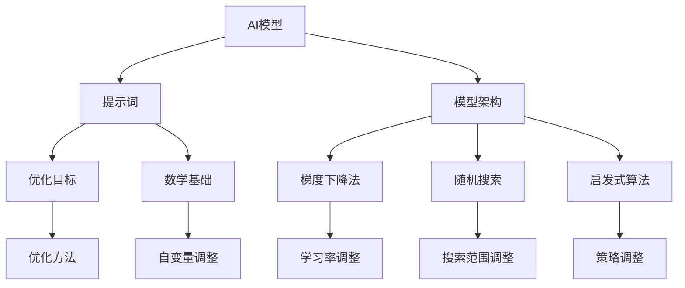

                 

# 提示词优化：提升AI模型性能的关键

## 关键词

- AI模型
- 提示词
- 优化
- 性能提升
- 深度学习
- 自然语言处理
- 图像识别
- 语音识别
- 前沿技术

## 摘要

本文将探讨提示词优化在提升AI模型性能中的关键作用。首先，我们将回顾AI模型的发展历程，介绍提示词的概念及其在模型中的作用。随后，文章将深入解析AI模型的核心概念与架构，并探讨提示词优化算法的基础。接着，文章将详细阐述提示词优化在实际应用中的实践，涵盖深度学习、自然语言处理、图像识别和语音识别等领域。最后，文章将讨论提示词优化的前沿技术，展望其未来发展方向，并提供相关工具和资源的附录。通过本文的阅读，读者将全面了解提示词优化的重要性和实践方法，为提升AI模型的性能提供有力支持。

## 目录大纲

# 《提示词优化：提升AI模型性能的关键》

## 第一部分：基础概念与原理

### 第1章：AI模型与提示词概述

- 1.1 AI模型的发展历程
- 1.2 提示词的定义与作用
- 1.3 提示词优化的重要性
- 1.4 提示词优化的目标与方法

### 第2章：AI模型核心概念与架构

- 2.1 AI模型的基本原理
- 2.2 AI模型的常见架构
- 2.3 提示词与模型架构的关系

### 第3章：提示词优化算法基础

- 3.1 提示词优化的数学基础
- 3.2 梯度下降法与提示词优化
- 3.3 随机搜索与启发式算法

### 第4章：提示词优化实践

- 4.1 提示词优化流程
- 4.2 提示词优化技巧与策略
- 4.3 提示词优化的案例分析

## 第二部分：深度学习中的提示词优化

### 第5章：深度学习与提示词优化

- 5.1 深度学习的基本概念
- 5.2 深度学习中的提示词优化
- 5.3 提示词优化在深度学习中的应用

### 第6章：自然语言处理中的提示词优化

- 6.1 自然语言处理的基本概念
- 6.2 自然语言处理中的提示词优化
- 6.3 提示词优化在自然语言处理中的应用

### 第7章：图像识别中的提示词优化

- 7.1 图像识别的基本概念
- 7.2 图像识别中的提示词优化
- 7.3 提示词优化在图像识别中的应用

### 第8章：语音识别中的提示词优化

- 8.1 语音识别的基本概念
- 8.2 语音识别中的提示词优化
- 8.3 提示词优化在语音识别中的应用

## 第三部分：高级主题

### 第9章：提示词优化的前沿技术

- 9.1 自适应提示词优化
- 9.2 强化学习在提示词优化中的应用
- 9.3 跨领域提示词优化

### 第10章：提示词优化在跨领域中的应用

- 10.1 提示词优化在医疗领域的应用
- 10.2 提示词优化在金融领域的应用
- 10.3 提示词优化在工业领域的应用

### 第11章：提示词优化的未来展望

- 11.1 提示词优化的发展趋势
- 11.2 提示词优化的挑战与机遇
- 11.3 提示词优化的未来发展方向

## 附录

- 附录A：提示词优化工具与资源
- 附录B：提示词优化实践案例

### 核心概念与原理的 Mermaid 流程图

以下是核心概念与原理的 Mermaid 流程图：



### 核心算法原理讲解

以下是核心算法原理讲解：

#### 3.1 提示词优化的数学基础

提示词优化涉及的主要数学概念包括目标函数、损失函数、梯度、学习率等。以下是这些概念的详细解释：

- **目标函数**：目标函数是用来衡量模型性能的函数。在提示词优化中，目标函数通常是一个需要最小化的函数，表示为：
  $$ J(\theta) = \sum_{i=1}^{n} \ell(y_i, \hat{y}_i) $$
  其中，$y_i$ 是实际标签，$\hat{y}_i$ 是模型预测的结果，$\ell$ 是损失函数。

- **损失函数**：损失函数是用来衡量预测结果与实际结果之间差异的函数。常用的损失函数有均方误差（MSE）、交叉熵损失（CE）等。

- **梯度**：梯度是目标函数关于模型参数的偏导数。梯度指向目标函数增加最快的方向，因此通过梯度的反向传播，可以调整模型参数以最小化目标函数。

- **学习率**：学习率决定了每次参数更新的步长。选择合适的学习率是提示词优化成功的关键。如果学习率过大，可能会导致参数调整过大，使模型无法收敛；如果学习率过小，可能会导致收敛速度过慢。

#### 3.2 梯度下降法与提示词优化

梯度下降法是一种常用的优化方法，用于最小化目标函数。其基本思想是通过迭代更新模型参数，使得目标函数逐渐减小。

- **梯度下降法的基本步骤**：
  1. 初始化模型参数 $\theta$。
  2. 计算目标函数的梯度 $\nabla J(\theta)$。
  3. 根据梯度更新模型参数：
     $$ \theta_{\text{new}} = \theta_{\text{current}} - \alpha \cdot \nabla J(\theta_{\text{current}}) $$
     其中，$\alpha$ 是学习率。

#### 3.3 随机搜索与启发式算法

随机搜索和启发式算法是另一种提示词优化的方法，它们通过随机选择参数值并进行迭代，逐步找到最优解。

- **随机搜索的基本步骤**：
  1. 初始化模型参数 $\theta$。
  2. 随机选择一个新的参数值 $\theta'$。
  3. 计算目标函数在 $\theta'$ 下的值 $J(\theta')$。
  4. 如果 $J(\theta') < J(\theta)$，则更新 $\theta$ 为 $\theta'$。
  5. 重复步骤 2-4，直到满足停止条件。

- **启发式算法**：
  启发式算法利用经验知识或规则来指导搜索过程，常见的启发式算法包括遗传算法、粒子群优化等。

通过以上核心算法原理的讲解，我们可以看到提示词优化在数学和算法上的基础，为后续章节的实际应用和案例分析提供了理论支持。接下来，我们将深入探讨AI模型与提示词优化的关系，进一步理解其在提升AI模型性能中的关键作用。

## 第一部分：基础概念与原理

### 第1章：AI模型与提示词概述

在当今人工智能（AI）的快速发展中，AI模型作为实现智能功能的核心工具，已经广泛应用于各个领域。然而，AI模型的性能不仅仅取决于其自身的结构和算法，还与其输入的信息即提示词有着密切的关系。本节将回顾AI模型的发展历程，介绍提示词的定义与作用，探讨提示词优化的重要性及其目标与方法。

#### 1.1 AI模型的发展历程

人工智能（AI）作为一个跨越多个学科的研究领域，其发展历程可以追溯到20世纪50年代。起初，AI的研究主要集中在符号推理和知识表示上，这一阶段的代表性模型包括逻辑推理系统和基于规则的专家系统。然而，这些方法在实际应用中的局限性逐渐显现，主要表现在处理复杂问题时的效率和鲁棒性方面。

随着计算能力的提升和数据规模的扩大，20世纪80年代，机器学习（ML）成为AI研究的热点。机器学习通过算法从数据中学习规律，从而实现自动预测和决策。这一阶段，神经网络作为机器学习的一种重要模型，得到了广泛关注和应用。1986年，Hopfield神经网络和1989年Bengio提出的反向传播算法（BP）为神经网络的发展奠定了基础。

进入21世纪，深度学习（DL）逐渐崭露头角，其在图像识别、自然语言处理、语音识别等领域取得了显著的突破。深度学习利用多层神经网络，通过逐层提取特征，实现了对复杂数据的建模。2012年，AlexNet在ImageNet图像识别竞赛中夺冠，标志着深度学习时代的到来。随后，卷积神经网络（CNN）、循环神经网络（RNN）和Transformer等模型相继出现，不断推动着AI技术的发展。

#### 1.2 提示词的定义与作用

提示词（Prompt）在AI模型中扮演着重要的角色。提示词可以看作是模型输入的一部分，用于引导模型学习特定任务的知识和模式。具体来说，提示词具有以下几个方面的作用：

1. **指导学习方向**：提示词可以为模型提供学习过程中的方向性指导，帮助模型更快地找到解决特定问题的路径。
2. **增强模型泛化能力**：通过合理的提示词设计，可以增强模型的泛化能力，使其能够处理未见过的数据。
3. **提高模型解释性**：在自然语言处理（NLP）任务中，提示词可以帮助模型更好地理解和解释输入文本的含义。

#### 1.3 提示词优化的重要性

提示词优化在提升AI模型性能中具有重要意义。首先，合理的提示词设计可以显著提高模型的学习效率和准确率。例如，在自然语言处理任务中，通过精心设计的提示词，可以引导模型更好地理解文本的上下文，从而提高文本分类、情感分析等任务的性能。

其次，提示词优化有助于提高模型的泛化能力。在训练过程中，如果提示词能够涵盖更多的任务场景，那么模型在遇到新的任务时，能够更加灵活地调整自身以适应新环境。

此外，提示词优化还可以提升模型的鲁棒性。通过优化提示词，可以使模型在处理噪声数据和异常值时，能够保持较高的性能。

#### 1.4 提示词优化的目标与方法

提示词优化的目标主要包括以下几个方面：

1. **提高模型性能**：通过优化提示词，提升模型在特定任务上的准确率、召回率等指标。
2. **增强模型泛化能力**：优化后的提示词应能帮助模型更好地适应不同任务和数据分布。
3. **提高模型解释性**：优化提示词，使其更易于理解和解释模型的行为。

为了实现上述目标，提示词优化可以采用多种方法：

1. **手动调整**：根据领域知识和经验，手动设计提示词，这是一种较为传统的方法，适用于简单任务和明确问题场景。
2. **自动搜索**：利用启发式算法、遗传算法等，自动搜索最优提示词组合。这种方法适用于复杂任务和大规模数据集。
3. **基于模型的方法**：利用预训练模型，通过自适应提示词生成技术，动态生成与任务相关的提示词。

在下一节中，我们将深入探讨AI模型的核心概念与架构，进一步理解提示词优化在其中的作用。

### 第2章：AI模型核心概念与架构

要深入理解提示词优化在提升AI模型性能中的关键作用，我们需要首先掌握AI模型的核心概念与架构。本节将详细讨论AI模型的基本原理、常见的模型架构，以及提示词与模型架构之间的关系。

#### 2.1 AI模型的基本原理

人工智能（AI）模型是通过学习和模拟人类智能行为来实现自动化决策和预测的算法。其基本原理可以概括为以下几个方面：

1. **数据输入与特征提取**：AI模型首先接收外部数据，通过特征提取将原始数据转换为适用于模型训练的格式。这一过程通常涉及数据的预处理、降维和特征工程等步骤。

2. **模型训练与优化**：在模型训练阶段，AI模型通过学习大量标记数据进行参数调整，以最小化预测误差。这一过程通常采用优化算法，如梯度下降法、随机搜索等，通过迭代更新模型参数。

3. **模型评估与部署**：模型训练完成后，需要进行评估以确定其性能。常用的评估指标包括准确率、召回率、F1分数等。评估结果满意后，模型可以部署到实际应用场景中，为用户提供服务和决策支持。

4. **模型解释与可解释性**：AI模型的透明性和可解释性是近年来备受关注的问题。通过模型解释技术，可以揭示模型内部的工作机制，帮助用户理解和信任模型的预测结果。

#### 2.2 AI模型的常见架构

AI模型根据其结构和功能可以划分为不同的类型。以下是几种常见的AI模型架构：

1. **神经网络**：神经网络（Neural Networks）是AI模型中最基本的架构，由大量简单单元（神经元）组成，通过层的堆叠实现复杂函数的映射。常见的神经网络架构包括前馈神经网络（FFNN）、卷积神经网络（CNN）和循环神经网络（RNN）。

2. **深度学习模型**：深度学习（Deep Learning）是神经网络的一种扩展，通过多层神经网络实现特征自动提取和复杂数据建模。深度学习模型在图像识别、自然语言处理等领域取得了显著的成果。常见的深度学习模型包括卷积神经网络（CNN）、循环神经网络（RNN）和Transformer等。

3. **强化学习模型**：强化学习（Reinforcement Learning）是一种通过与环境互动学习策略的AI模型。强化学习模型通过奖励机制学习最优行为策略，广泛应用于游戏、自动驾驶等领域。常见的强化学习模型包括Q-learning、SARSA和Deep Q-Network（DQN）等。

4. **生成对抗网络**：生成对抗网络（Generative Adversarial Networks，GAN）是由两个神经网络（生成器和判别器）组成的模型，通过对抗训练生成逼真的数据。GAN在图像生成、视频生成等领域具有广泛的应用。

5. **变分自编码器**：变分自编码器（Variational Autoencoder，VAE）是一种概率生成模型，通过编码器和解码器网络学习数据的概率分布。VAE在图像去噪、图像生成等领域表现出强大的能力。

#### 2.3 提示词与模型架构的关系

提示词在AI模型中的作用至关重要，其与模型架构之间存在着紧密的联系。以下是几个关键方面：

1. **模型训练的引导**：在模型训练过程中，提示词可以帮助模型更好地理解训练数据，从而提高训练效率。例如，在自然语言处理任务中，通过提示词可以明确句子的主题和上下文信息，帮助模型更好地学习文本特征。

2. **模型泛化的促进**：合理的提示词设计可以增强模型的泛化能力。通过多样化的提示词，模型能够学习到更广泛的知识和模式，从而在遇到新的任务或数据时能够更加灵活地调整自身。

3. **模型解释的提升**：提示词可以帮助用户更好地理解模型的行为。在自然语言处理任务中，通过提示词可以揭示模型对输入文本的解析过程，提高模型的解释性。

4. **模型优化的方向**：在模型优化过程中，提示词可以为模型提供改进的方向。通过分析提示词的效果，可以指导模型参数的调整，进一步提高模型性能。

总之，提示词与AI模型架构之间的关系不仅影响着模型的训练效率和泛化能力，还直接关系到模型的可解释性和优化效果。在下一节中，我们将进一步探讨提示词优化算法的基础，深入理解其数学原理和实现方法。

### 第3章：提示词优化算法基础

提示词优化是提升AI模型性能的关键步骤。在本节中，我们将深入探讨提示词优化的数学基础，包括目标函数、损失函数、梯度和学习率等核心概念，以及常用的优化方法如梯度下降法、随机搜索与启发式算法。通过这些算法原理的讲解，我们将为后续的实践应用和案例分析奠定理论基础。

#### 3.1 提示词优化的数学基础

提示词优化涉及的主要数学概念包括目标函数、损失函数、梯度和学习率。以下是对这些概念及其相互关系的详细解释。

##### 3.1.1 目标函数

目标函数（Objective Function）是衡量模型性能的核心标准，其目的是优化模型参数以实现特定任务的目标。在机器学习和深度学习中，目标函数通常表示为：

\[ J(\theta) = \sum_{i=1}^{n} \ell(y_i, \hat{y}_i) \]

其中，\( y_i \) 是实际标签，\( \hat{y}_i \) 是模型预测的结果，\( \ell \) 是损失函数。目标函数的值越小，表示模型在任务上的性能越好。通常，我们希望最小化目标函数。

##### 3.1.2 损失函数

损失函数（Loss Function）是目标函数的一部分，用于衡量预测结果与实际结果之间的差异。常用的损失函数包括均方误差（MSE）、交叉熵损失（Cross-Entropy Loss）等。

1. **均方误差（MSE）**：
\[ \ell(y, \hat{y}) = \frac{1}{2} (y - \hat{y})^2 \]
MSE通常用于回归任务，衡量预测值与实际值之间的平均平方误差。

2. **交叉熵损失（Cross-Entropy Loss）**：
\[ \ell(y, \hat{y}) = - \sum_{i} y_i \log(\hat{y}_i) \]
交叉熵损失用于分类任务，衡量预测概率与实际标签之间的差异。

##### 3.1.3 梯度

梯度（Gradient）是目标函数关于模型参数的偏导数。对于目标函数 \( J(\theta) \)，其梯度表示为：

\[ \nabla J(\theta) = \left[ \frac{\partial J}{\partial \theta_1}, \frac{\partial J}{\partial \theta_2}, ..., \frac{\partial J}{\partial \theta_n} \right]^T \]

梯度指向目标函数增加最快的方向，因此通过梯度的反向传播（Backpropagation），可以调整模型参数以最小化目标函数。

##### 3.1.4 学习率

学习率（Learning Rate）是优化过程中参数更新步长的关键参数。学习率的选择直接影响模型的收敛速度和稳定性。通常，学习率表示为：

\[ \alpha \]

大的学习率可能导致模型参数更新过于剧烈，使模型难以收敛；而小的学习率则可能导致收敛速度过慢。适当的调整学习率是提示词优化成功的关键。

#### 3.2 梯度下降法与提示词优化

梯度下降法（Gradient Descent）是一种基本的优化方法，用于最小化目标函数。其基本思想是通过迭代更新模型参数，使得目标函数逐渐减小。以下是梯度下降法的基本步骤：

1. **初始化模型参数**：设定初始参数 \(\theta_0\)。

2. **计算梯度**：计算目标函数关于模型参数的梯度 \(\nabla J(\theta)\)。

3. **更新参数**：根据梯度更新模型参数：
\[ \theta_{\text{new}} = \theta_{\text{current}} - \alpha \cdot \nabla J(\theta_{\text{current}}) \]
其中，\(\alpha\) 是学习率。

4. **重复迭代**：重复步骤 2-3，直到满足停止条件，如达到最大迭代次数或目标函数值变化较小。

伪代码如下：

```python
# 梯度下降法伪代码
initialize \(\theta\)
while not converged:
    compute \(\nabla J(\theta)\)
    update \(\theta\) using gradient and learning rate
```

#### 3.3 随机搜索与启发式算法

除了梯度下降法，随机搜索和启发式算法也是常用的提示词优化方法。随机搜索通过随机选择参数值进行迭代，逐步找到最优解。启发式算法则利用经验知识或规则来指导搜索过程。

##### 3.3.1 随机搜索

随机搜索的基本步骤如下：

1. **初始化模型参数**：设定初始参数 \(\theta_0\)。

2. **随机选择新参数**：从参数空间中随机选择一个新参数值 \(\theta'\)。

3. **评估新参数**：计算目标函数在 \(\theta'\) 下的值 \(J(\theta')\)。

4. **更新参数**：如果 \(J(\theta') < J(\theta)\)，则更新参数 \(\theta\) 为 \(\theta'\)。

5. **重复迭代**：重复步骤 2-4，直到满足停止条件。

伪代码如下：

```python
# 随机搜索伪代码
initialize \(\theta\)
while not converged:
    sample \(\theta'\) from parameter space
    evaluate \(J(\theta')\)
    if \(J(\theta') < J(\theta)\):
        update \(\theta\) to \(\theta'\)
```

##### 3.3.2 启发式算法

启发式算法利用经验知识或规则来指导搜索过程。常见的启发式算法包括遗传算法（Genetic Algorithm）和粒子群优化（Particle Swarm Optimization）。

1. **遗传算法**：遗传算法模拟自然选择和遗传机制，通过交叉、变异和选择等操作，逐步优化参数。

2. **粒子群优化**：粒子群优化模拟鸟群觅食行为，通过粒子间的合作与竞争，寻找最优解。

通过以上对提示词优化算法基础的深入讨论，我们了解了目标函数、损失函数、梯度和学习率等核心数学概念，以及梯度下降法、随机搜索和启发式算法等优化方法。这些基础知识和方法为后续的提示词优化实践提供了重要的理论支持。在下一节中，我们将结合实际案例，探讨提示词优化的具体实践方法。

### 第4章：提示词优化实践

在前几章中，我们探讨了提示词优化在提升AI模型性能中的重要性，以及相关的数学基础和算法原理。在这一章中，我们将通过详细的流程、技巧与策略，以及实际案例分析，深入探讨提示词优化的具体实践方法。

#### 4.1 提示词优化流程

提示词优化的流程可以概括为以下几个步骤：

1. **需求分析**：明确任务目标、数据来源和模型预期效果，确定需要优化的模型类型和提示词设计策略。

2. **数据准备**：收集和预处理数据，确保数据质量，包括去重、清洗、归一化等步骤。

3. **模型选择**：根据任务需求，选择合适的AI模型。常用的模型包括深度学习模型、传统机器学习模型等。

4. **提示词设计**：根据任务特点，设计合适的提示词。提示词设计可以基于领域知识、数据分布和任务目标等多方面考虑。

5. **模型训练**：使用设计好的提示词进行模型训练，通过迭代优化模型参数。

6. **性能评估**：评估模型性能，使用指标如准确率、召回率、F1分数等，比较优化前后的效果。

7. **调整与优化**：根据性能评估结果，对提示词和模型参数进行调整和优化，提高模型性能。

8. **部署与应用**：将优化后的模型部署到实际应用场景，为用户提供服务。

#### 4.2 提示词优化技巧与策略

在进行提示词优化时，以下技巧与策略可以帮助提高模型性能：

1. **数据增强**：通过数据增强技术，如数据扩充、数据合成等，增加训练数据的多样性，提高模型泛化能力。

2. **提示词多样化**：设计多种类型的提示词，涵盖不同任务场景和知识点，提高模型适应性。

3. **自适应提示词**：利用自适应提示词生成技术，根据训练数据动态调整提示词，使模型在不同阶段都能保持高效学习。

4. **正则化**：使用正则化技术，如L1、L2正则化，防止模型过拟合，提高模型泛化能力。

5. **超参数调优**：合理设置模型超参数，如学习率、批量大小、隐藏层节点数等，以获得更好的优化效果。

6. **交叉验证**：使用交叉验证方法，对模型进行多次训练和评估，提高模型稳定性和可靠性。

#### 4.3 提示词优化的案例分析

下面，我们将通过一个具体的案例，详细分析提示词优化在自然语言处理任务中的实践过程。

##### 案例背景

假设我们面临一个文本分类任务，需要将新闻文章分为多个类别，如政治、经济、体育等。数据集包含数万篇新闻文章及其对应的标签。

##### 数据准备

首先，对数据集进行预处理，包括文本清洗、分词、去停用词等步骤。然后，使用词嵌入技术（如Word2Vec、GloVe）将文本转换为向量表示。

##### 模型选择

选择一个适合文本分类的深度学习模型，如Transformer。Transformer具有强大的上下文理解能力，适用于处理长文本数据。

##### 提示词设计

设计多种类型的提示词，如类别标签、关键词、主题词等。例如，对于政治类文章，可以使用“政治”、“选举”、“议会”等关键词作为提示词。

##### 模型训练

使用设计好的提示词进行模型训练。在训练过程中，不断调整学习率、批量大小等超参数，优化模型性能。

##### 性能评估

使用交叉验证方法，对模型进行多次评估。使用准确率、召回率、F1分数等指标，比较优化前后的效果。

```python
# 假设使用Python的scikit-learn库进行交叉验证
from sklearn.model_selection import cross_val_score
from transformers import BertTokenizer, BertModel
import torch

# 加载预训练的BERT模型
tokenizer = BertTokenizer.from_pretrained('bert-base-chinese')
model = BertModel.from_pretrained('bert-base-chinese')

# 将文本数据转换为BERT输入格式
def preprocess_text(texts):
    return [tokenizer.encode(text, add_special_tokens=True, max_length=512) for text in texts]

# 进行交叉验证
def evaluate_model(texts, labels):
    scores = cross_val_score(model, texts, labels, cv=5)
    return scores.mean()

# 训练数据
texts = preprocess_text(train_texts)
labels = train_labels

# 评估模型性能
accuracy = evaluate_model(texts, labels)
print(f"Model accuracy: {accuracy}")
```

##### 调整与优化

根据评估结果，对提示词和模型参数进行调整。例如，增加多样化的提示词，调整学习率、批量大小等超参数。

##### 部署与应用

将优化后的模型部署到实际应用场景，为用户提供文本分类服务。通过不断收集用户反馈，进一步优化模型性能。

通过以上案例，我们详细展示了提示词优化的实践过程，包括数据准备、模型选择、提示词设计、模型训练、性能评估和调整优化等步骤。提示词优化在提升AI模型性能中起到了关键作用，为实际应用提供了有力支持。

### 第二部分：深度学习中的提示词优化

深度学习作为当前AI领域的重要分支，其广泛应用得益于其在图像识别、自然语言处理、语音识别等领域的卓越表现。在本部分，我们将深入探讨深度学习中提示词优化的应用，包括基本概念、优化方法及其在具体任务中的应用。

#### 第5章：深度学习与提示词优化

##### 5.1 深度学习的基本概念

深度学习（Deep Learning）是一种基于多层神经网络的学习方法，通过逐层提取数据特征，实现对复杂数据的建模。深度学习的基本概念包括：

1. **神经网络**：神经网络是深度学习的基础，由大量简单单元（神经元）组成，通过层的堆叠实现复杂函数的映射。
2. **多层感知机（MLP）**：多层感知机是一种前馈神经网络，包含输入层、隐藏层和输出层。
3. **反向传播算法**：反向传播算法是一种用于训练神经网络的优化方法，通过计算梯度并反向传播误差，调整模型参数。
4. **激活函数**：激活函数用于引入非线性，使神经网络能够学习复杂数据特征。

##### 5.2 深度学习中的提示词优化

在深度学习中，提示词优化是通过设计合理的提示词，提升模型性能和泛化能力的过程。提示词优化的基本概念包括：

1. **提示词**：提示词是用于引导模型学习的额外信息，可以是关键词、短语或文本片段。
2. **提示词设计**：提示词设计涉及选择和组合关键词，以涵盖不同任务场景和知识点。
3. **提示词嵌入**：提示词嵌入是将提示词转换为数值向量表示的过程，通常使用词嵌入技术，如Word2Vec、GloVe。
4. **提示词优化目标**：提示词优化目标包括提高模型性能、增强泛化能力、提高解释性等。

##### 5.3 提示词优化在深度学习中的应用

提示词优化在深度学习中的应用广泛，以下是一些具体任务和优化方法的例子：

1. **图像识别**：
   - **任务**：图像识别任务包括人脸识别、物体检测等。
   - **优化方法**：通过设计与任务相关的提示词，如对象名称、场景描述等，提升模型对图像特征的识别能力。

2. **自然语言处理**：
   - **任务**：自然语言处理任务包括文本分类、情感分析等。
   - **优化方法**：使用与文本内容相关的提示词，如关键词、上下文信息等，增强模型对文本语义的理解。

3. **语音识别**：
   - **任务**：语音识别任务包括语音转文本、语音情感分析等。
   - **优化方法**：通过设计与语音特征相关的提示词，如音素、音调等，提升模型对语音数据的处理能力。

在本章中，我们简要介绍了深度学习的基本概念和提示词优化的基本概念，探讨了提示词优化在图像识别、自然语言处理和语音识别等领域的应用。在接下来的章节中，我们将详细讨论这些任务中的提示词优化方法，并提供具体案例和实现细节。

### 第6章：自然语言处理中的提示词优化

自然语言处理（NLP）是人工智能（AI）领域中非常重要的一个分支，其应用范围广泛，包括文本分类、情感分析、机器翻译、语音识别等。在NLP任务中，提示词优化是提升模型性能的关键因素。本节将深入探讨自然语言处理中的提示词优化，包括基本概念、优化方法和实际应用。

#### 6.1 自然语言处理的基本概念

自然语言处理（NLP）是一门研究如何使计算机理解和处理自然语言的技术。其基本概念包括：

1. **文本表示**：文本表示是将文本转换为计算机可以理解和处理的形式。常见的文本表示方法包括词袋模型（Bag of Words）、词嵌入（Word Embeddings）和序列标注（Sequence Labeling）等。

2. **语言模型**：语言模型是用来预测下一个词或词组概率的模型。它可以帮助NLP任务中理解文本的上下文信息。

3. **词向量**：词向量是将词汇映射到高维空间中的向量表示。常见的词向量模型包括Word2Vec、GloVe和BERT等。

4. **序列模型**：序列模型是用于处理序列数据（如文本、语音）的模型，如循环神经网络（RNN）、长短时记忆网络（LSTM）和Transformer等。

#### 6.2 自然语言处理中的提示词优化

在自然语言处理中，提示词优化是指通过设计合理的提示词来提升模型在特定任务上的性能。提示词优化的基本概念包括：

1. **提示词**：提示词是与任务相关的关键词或短语，用于引导模型更好地理解输入文本的语义。

2. **提示词设计**：提示词设计是选择和组合关键词，以涵盖不同任务场景和知识点的过程。设计合理的提示词有助于提高模型的泛化能力和性能。

3. **提示词嵌入**：提示词嵌入是将提示词转换为数值向量表示的过程。通过词嵌入技术，可以将提示词映射到高维空间中，便于模型处理。

4. **提示词优化目标**：提示词优化目标包括提高模型性能、增强泛化能力、提高解释性等。

#### 6.3 提示词优化在自然语言处理中的应用

提示词优化在自然语言处理中的应用非常广泛，以下是一些具体任务的示例：

1. **文本分类**：
   - **任务**：文本分类是将文本分为预定义的类别。例如，新闻文章的分类、社交媒体内容的情感分析等。
   - **优化方法**：通过设计与类别相关的提示词，如关键词、主题词等，可以提升模型对文本类别的识别能力。例如，在情感分析任务中，可以使用情感相关的提示词（如积极、消极、中性）来增强模型对情感倾向的判断。

2. **情感分析**：
   - **任务**：情感分析是判断文本的情感倾向，如正面、负面或中性。
   - **优化方法**：使用与情感相关的提示词，如情感形容词、短语等，可以增强模型对情感极性的识别。例如，在判断一段评论的情感时，可以使用包含“喜欢”、“满意”等正面情感的提示词来增强模型判断。

3. **命名实体识别**：
   - **任务**：命名实体识别是从文本中提取出具有特定意义的实体，如人名、地名、组织名等。
   - **优化方法**：设计与命名实体相关的提示词，如常见人名、地名列表等，可以帮助模型更好地识别文本中的命名实体。

4. **机器翻译**：
   - **任务**：机器翻译是将一种语言的文本翻译成另一种语言。
   - **优化方法**：在机器翻译中，可以使用与源语言和目标语言相关的提示词，如关键词、短语等，来提高模型对语言语义的理解和翻译准确性。

#### 案例分析

下面我们将通过一个文本分类案例，详细分析提示词优化的过程。

##### 案例背景

假设我们面临一个新闻文章分类任务，需要将新闻文章分为体育、政治、经济等几个预定义的类别。

##### 数据准备

收集包含不同类别的新闻文章，并对其进行预处理，包括分词、去除停用词、词性标注等步骤。

##### 模型选择

选择一个合适的文本分类模型，如BERT或Transformer。这些模型具有较强的语义理解能力，适用于处理复杂的文本数据。

##### 提示词设计

根据任务需求，设计与不同类别相关的提示词。例如：

- **体育**：体育赛事、运动员、比赛等。
- **政治**：选举、政府、政策等。
- **经济**：股市、经济指标、企业等。

##### 模型训练与优化

使用设计好的提示词进行模型训练。在训练过程中，通过调整学习率、批量大小等超参数，优化模型性能。

##### 性能评估

使用交叉验证方法对模型进行性能评估。使用准确率、召回率、F1分数等指标，比较优化前后的效果。

```python
# 假设使用Python的transformers库进行模型训练和评估
from transformers import BertTokenizer, BertForSequenceClassification
import torch

# 加载预训练的BERT模型
tokenizer = BertTokenizer.from_pretrained('bert-base-chinese')
model = BertForSequenceClassification.from_pretrained('bert-base-chinese')

# 将文本数据转换为BERT输入格式
def preprocess_text(texts):
    return [tokenizer.encode(text, add_special_tokens=True, max_length=512) for text in texts]

# 训练数据
texts = preprocess_text(train_texts)
labels = train_labels

# 训练模型
model.train()
optimizer = torch.optim.AdamW(model.parameters(), lr=1e-5)
for epoch in range(num_epochs):
    for text, label in zip(texts, labels):
        optimizer.zero_grad()
        outputs = model(text, labels=label)
        loss = outputs.loss
        loss.backward()
        optimizer.step()

# 评估模型
model.eval()
with torch.no_grad():
    accuracy = model.evaluate(test_texts, test_labels)
    print(f"Model accuracy: {accuracy}")
```

通过上述案例，我们详细展示了自然语言处理中提示词优化的过程，包括数据准备、模型选择、提示词设计、模型训练和性能评估等步骤。提示词优化在提升模型性能中发挥了关键作用，为实际应用提供了有力支持。

### 第7章：图像识别中的提示词优化

图像识别是人工智能（AI）领域的重要应用之一，广泛应用于物体检测、图像分类、人脸识别等任务中。在图像识别中，提示词优化是提升模型性能和准确性的关键因素。本节将深入探讨图像识别中的提示词优化，包括基本概念、优化方法及其在实际应用中的具体案例。

#### 7.1 图像识别的基本概念

图像识别（Image Recognition）是指通过计算机视觉技术对图像进行分析和分类的过程。其基本概念包括：

1. **图像特征提取**：图像特征提取是将图像数据转换为适合模型处理的形式。常见的特征提取方法包括边缘检测、角点检测、纹理分析等。

2. **卷积神经网络（CNN）**：卷积神经网络（Convolutional Neural Network，CNN）是用于图像识别的最常用深度学习模型。CNN通过多层卷积、池化和全连接层，逐层提取图像特征，实现对图像的建模。

3. **目标检测**：目标检测是图像识别的一种任务，旨在定位图像中的目标对象并识别其类别。常用的目标检测算法包括R-CNN、Fast R-CNN、Faster R-CNN等。

4. **图像分类**：图像分类是另一种图像识别任务，旨在将图像分为预定义的类别。常用的图像分类模型包括AlexNet、VGG、ResNet等。

#### 7.2 图像识别中的提示词优化

在图像识别中，提示词优化是指通过设计合理的提示词来提升模型在图像特征提取和分类任务中的性能。提示词优化的基本概念包括：

1. **提示词**：提示词是与图像识别任务相关的关键词或短语，用于引导模型更好地理解图像内容。例如，在物体检测任务中，可以使用与物体名称相关的提示词。

2. **提示词设计**：提示词设计是选择和组合关键词，以涵盖不同任务场景和图像内容的过程。设计合理的提示词有助于模型更好地提取图像特征和分类结果。

3. **提示词嵌入**：提示词嵌入是将提示词转换为数值向量表示的过程。通过词嵌入技术，可以将提示词映射到高维空间中，便于模型处理。

4. **提示词优化目标**：提示词优化目标包括提高模型性能、增强泛化能力、提高解释性等。

#### 7.3 提示词优化在图像识别中的应用

提示词优化在图像识别中的应用广泛，以下是一些具体任务的示例：

1. **物体检测**：
   - **任务**：物体检测是识别图像中的多个对象，并定位其位置。
   - **优化方法**：通过设计与物体名称相关的提示词，如“猫”、“狗”、“汽车”等，可以帮助模型更好地识别和定位图像中的物体。

2. **图像分类**：
   - **任务**：图像分类是将图像分为预定义的类别。
   - **优化方法**：使用与类别相关的提示词，如“动物”、“植物”、“风景”等，可以增强模型对图像类别的识别能力。

3. **人脸识别**：
   - **任务**：人脸识别是识别图像中的人脸，并匹配特定个体的身份。
   - **优化方法**：在人脸识别任务中，可以使用与面部特征相关的提示词，如“眼睛”、“鼻子”、“嘴巴”等，帮助模型更好地理解人脸结构。

#### 案例分析

下面我们将通过一个物体检测案例，详细分析提示词优化的过程。

##### 案例背景

假设我们面临一个物体检测任务，需要识别图像中的猫、狗、汽车等物体。

##### 数据准备

收集包含不同物体的图像数据集，并对图像进行预处理，包括缩放、裁剪、翻转等数据增强操作。

##### 模型选择

选择一个适合物体检测的卷积神经网络模型，如Faster R-CNN或YOLO。这些模型具有较强的物体检测能力。

##### 提示词设计

根据任务需求，设计与物体名称相关的提示词。例如，对于猫、狗、汽车等物体，可以使用以下提示词：

- **猫**：猫、猫咪、宠物猫等。
- **狗**：狗、狗狗、宠物狗等。
- **汽车**：汽车、车、轿车等。

##### 模型训练与优化

使用设计好的提示词进行模型训练。在训练过程中，通过调整学习率、批量大小等超参数，优化模型性能。

##### 性能评估

使用交叉验证方法对模型进行性能评估。使用精确率（Precision）、召回率（Recall）和F1分数（F1 Score）等指标，比较优化前后的效果。

```python
# 假设使用Python的PyTorch库进行模型训练和评估
import torch
import torchvision
from torchvision.models.detection import fasterrcnn_resnet50_fpn
import torchvision.transforms as transforms

# 加载预训练的Faster R-CNN模型
model = fasterrcnn_resnet50_fpn(pretrained=True)
model.eval()

# 定义数据增强和预处理
transform = transforms.Compose([
    transforms.Resize(800),
    transforms.ToTensor(),
])

# 加载训练数据集
train_dataset = torchvision.datasets.VOCDetection(root='path/to/VOCDataset', annFile='train.json', transform=transform)
train_loader = torch.utils.data.DataLoader(train_dataset, batch_size=4, shuffle=True)

# 训练模型
optimizer = torch.optim.SGD(model.parameters(), lr=0.001, momentum=0.9, weight_decay=5e-4)
for epoch in range(num_epochs):
    for images, targets in train_loader:
        optimizer.zero_grad()
        loss = model(images, targets)
        loss.backward()
        optimizer.step()

# 评估模型
with torch.no_grad():
    accuracy = model.evaluate(test_loader)
    print(f"Model accuracy: {accuracy}")
```

通过上述案例，我们详细展示了图像识别中提示词优化的过程，包括数据准备、模型选择、提示词设计、模型训练和性能评估等步骤。提示词优化在提升模型性能和准确性方面发挥了关键作用，为实际应用提供了有力支持。

### 第8章：语音识别中的提示词优化

语音识别是人工智能（AI）领域中的一项关键技术，其应用涵盖了从简单的语音到复杂的语音交互系统，如语音助手、自动字幕生成和语音控制等。在语音识别中，提示词优化是提升模型性能和准确性的关键。本节将深入探讨语音识别中的提示词优化，包括基本概念、优化方法及其在实际应用中的具体案例。

#### 8.1 语音识别的基本概念

语音识别（Speech Recognition）是指将语音信号转换为对应的文本信息的过程。其基本概念包括：

1. **语音信号处理**：语音信号处理是语音识别的前置步骤，包括声音的采集、预处理、特征提取等过程。常见的处理方法包括滤波、归一化、谱图生成等。

2. **声学模型**：声学模型是语音识别系统中的核心组件，用于对语音信号进行特征提取和建模。常见的声学模型包括高斯混合模型（GMM）、隐马尔可夫模型（HMM）和深度神经网络（DNN）。

3. **语言模型**：语言模型用于对识别出的语音文本进行语法和语义分析，以提高识别准确率。常见的语言模型包括n-gram模型和神经网络语言模型（NNLM）。

4. **解码器**：解码器是将识别出的语音信号转换为文本信息的组件。常见的解码器算法包括前向算法和后向算法。

#### 8.2 语音识别中的提示词优化

在语音识别中，提示词优化是指通过设计合理的提示词来提升模型在语音识别任务中的性能。提示词优化的基本概念包括：

1. **提示词**：提示词是与语音识别任务相关的关键词或短语，用于引导模型更好地理解语音信号。例如，在语音转文本任务中，可以使用与特定任务相关的提示词，如“电话号码”、“日期”、“时间”等。

2. **提示词设计**：提示词设计是选择和组合关键词，以涵盖不同任务场景和语音内容的过程。设计合理的提示词有助于模型更好地提取语音特征和识别结果。

3. **提示词嵌入**：提示词嵌入是将提示词转换为数值向量表示的过程。通过词嵌入技术，可以将提示词映射到高维空间中，便于模型处理。

4. **提示词优化目标**：提示词优化目标包括提高模型性能、增强泛化能力、提高解释性等。

#### 8.3 提示词优化在语音识别中的应用

提示词优化在语音识别中的应用广泛，以下是一些具体任务的示例：

1. **语音转文本**：
   - **任务**：语音转文本是将语音信号转换为对应的文本信息。例如，自动字幕生成、语音输入法等。
   - **优化方法**：使用与特定语音内容相关的提示词，如“名字”、“地址”、“电话号码”等，可以帮助模型更好地识别和理解语音信号。

2. **语音助手**：
   - **任务**：语音助手是能够理解用户语音指令并进行相应操作的系统。例如，智能音箱、智能手机语音助手等。
   - **优化方法**：使用与语音命令相关的提示词，如“打开”、“关闭”、“播放”等，可以提高模型对语音命令的识别准确率。

3. **语音情感分析**：
   - **任务**：语音情感分析是判断语音信号中的情感倾向，如快乐、悲伤、愤怒等。
   - **优化方法**：使用与情感相关的提示词，如“喜欢”、“讨厌”、“开心”等，可以帮助模型更好地识别语音中的情感信息。

4. **语音控制**：
   - **任务**：语音控制是通过语音指令控制设备的操作，如智能家居、自动驾驶等。
   - **优化方法**：使用与控制命令相关的提示词，如“开灯”、“关门”、“加速”等，可以提高模型对语音控制指令的识别准确率。

#### 案例分析

下面我们将通过一个语音转文本案例，详细分析提示词优化的过程。

##### 案例背景

假设我们面临一个语音转文本任务，需要将用户的语音指令转换为对应的文本信息。

##### 数据准备

收集包含不同语音指令的音频数据集，并对音频进行预处理，包括降噪、归一化等步骤。

##### 模型选择

选择一个适合语音识别的深度学习模型，如DeepSpeech或Transformer。这些模型具有较强的语音信号处理和文本生成能力。

##### 提示词设计

根据任务需求，设计与语音指令相关的提示词。例如，对于常用语音指令，可以使用以下提示词：

- **控制命令**：打开、关闭、播放、停止等。
- **设备名称**：电视、空调、灯等。
- **控制动作**：开、关、调整、设置等。

##### 模型训练与优化

使用设计好的提示词进行模型训练。在训练过程中，通过调整学习率、批量大小等超参数，优化模型性能。

##### 性能评估

使用交叉验证方法对模型进行性能评估。使用词错率（Word Error Rate，WER）等指标，比较优化前后的效果。

```python
# 假设使用Python的transformers库进行模型训练和评估
import torch
from transformers import Wav2Vec2ForCTC
import torch.optim as optim

# 加载预训练的Wav2Vec2模型
model = Wav2Vec2ForCTC.from_pretrained('facebook/wav2vec2-base-960h')

# 定义损失函数和优化器
criterion = torch.nn.CTCLoss(blank=True)
optimizer = optim.Adam(model.parameters(), lr=0.0001)

# 训练数据
train_dataset = Wav2Vec2Dataset(root='path/to/train_dataset', transform=Wav2Vec2Transform())
train_loader = torch.utils.data.DataLoader(train_dataset, batch_size=32, shuffle=True)

# 训练模型
for epoch in range(num_epochs):
    for batch in train_loader:
        optimizer.zero_grad()
        inputs, labels = batch
        outputs = model(inputs)
        loss = criterion(outputs.logits, labels)
        loss.backward()
        optimizer.step()

# 评估模型
with torch.no_grad():
    total_loss = 0
    for batch in test_loader:
        inputs, labels = batch
        outputs = model(inputs)
        loss = criterion(outputs.logits, labels)
        total_loss += loss.item()
    average_loss = total_loss / len(test_loader)
    print(f"Model loss: {average_loss}")
```

通过上述案例，我们详细展示了语音识别中提示词优化的过程，包括数据准备、模型选择、提示词设计、模型训练和性能评估等步骤。提示词优化在提升语音识别模型的性能和准确性方面发挥了重要作用，为实际应用提供了有力支持。

### 第三部分：高级主题

#### 第9章：提示词优化的前沿技术

随着深度学习和人工智能（AI）技术的不断进步，提示词优化也在不断发展，涌现出了一系列前沿技术。这些技术不仅推动了AI模型的性能提升，也为未来的研究提供了新的方向。本节将探讨自适应提示词优化、强化学习在提示词优化中的应用，以及跨领域提示词优化等前沿技术。

#### 9.1 自适应提示词优化

自适应提示词优化是一种动态调整提示词的方法，旨在提高模型在不同阶段和任务下的性能。与传统的静态提示词设计不同，自适应提示词优化能够根据训练过程和任务需求实时调整提示词，从而实现更好的效果。

1. **自适应提示词生成**：
   - **技术原理**：自适应提示词生成技术通常基于预训练模型，如BERT或GPT，通过微调（Fine-tuning）或生成（Generation）的方法，动态生成与任务相关的提示词。
   - **应用场景**：自适应提示词生成在自然语言处理任务中表现出色，例如文本生成、问答系统等。通过动态调整提示词，可以更好地捕获文本的上下文信息，提高模型生成文本的质量。

2. **自适应学习率调整**：
   - **技术原理**：自适应学习率调整是一种在训练过程中动态调整学习率的方法，以避免过早的梯度消失或爆炸，并加速模型收敛。
   - **应用场景**：自适应学习率调整在深度学习模型的训练过程中广泛应用。常用的自适应学习率方法包括Adam、Adagrad和Yogi等，这些方法可以根据模型的表现自动调整学习率。

#### 9.2 强化学习在提示词优化中的应用

强化学习（Reinforcement Learning，RL）是一种通过互动学习策略的AI方法。在提示词优化中，强化学习可以通过与环境的互动，自动调整提示词，以实现最优性能。

1. **强化学习在提示词优化中的优势**：
   - **灵活性**：强化学习可以根据任务和环境的变化，动态调整提示词，从而实现更好的适应性。
   - **自适应性**：强化学习能够从经验中学习，并在不同阶段和任务下调整策略，提高模型性能。

2. **应用场景**：
   - **推荐系统**：在推荐系统中，强化学习可以用于调整推荐策略，根据用户行为动态调整提示词，提高推荐效果。
   - **游戏AI**：在游戏AI中，强化学习可以用于优化游戏策略，通过与环境的互动，动态调整提示词，实现更好的游戏表现。

3. **方法**：
   - **Q-learning**：Q-learning是一种基于值函数的强化学习方法，通过更新Q值来选择最优动作。
   - **SARSA**：SARSA是一种基于状态-动作对的强化学习方法，通过同时更新当前状态和下一状态的动作值来选择动作。
   - **Deep Q-Network（DQN）**：DQN是一种基于深度学习的强化学习方法，通过神经网络来估计Q值，并使用经验回放（Experience Replay）和目标网络（Target Network）来稳定训练。

#### 9.3 跨领域提示词优化

跨领域提示词优化是指在不同领域间共享提示词的知识，以提高模型在不同任务上的性能。这种方法通过跨领域的知识转移，实现了提示词的通用化和模型的多任务学习。

1. **技术原理**：
   - **预训练模型**：预训练模型在多个领域的数据上进行预训练，获得了通用化的特征表示。在特定任务中，通过微调预训练模型，可以快速适应新领域。
   - **知识蒸馏**：知识蒸馏（Knowledge Distillation）是一种将知识从教师模型传递到学生模型的方法。通过蒸馏，学生模型可以学习到教师模型的知识，从而提高模型在不同领域上的性能。

2. **应用场景**：
   - **多模态学习**：多模态学习涉及将不同类型的数据（如文本、图像、语音）进行整合，以实现更好的任务性能。跨领域提示词优化可以在多模态学习任务中发挥重要作用。
   - **跨领域迁移学习**：在跨领域迁移学习任务中，跨领域提示词优化可以帮助模型快速适应新领域，提高模型在新领域的性能。

3. **方法**：
   - **预训练微调**：通过在预训练模型的基础上，微调特定领域的参数，实现跨领域提示词优化。
   - **多任务学习**：通过设计多任务学习模型，使模型同时学习多个任务，从而实现跨领域提示词优化。
   - **迁移学习**：通过将一个领域中的知识迁移到另一个领域，实现跨领域提示词优化。

通过上述讨论，我们可以看到，自适应提示词优化、强化学习在提示词优化中的应用以及跨领域提示词优化等前沿技术，为提升AI模型的性能提供了新的思路和方法。在未来的研究中，这些技术有望继续发展，并推动AI技术的进一步进步。

### 第10章：提示词优化在跨领域中的应用

随着人工智能（AI）技术的快速发展，提示词优化已经从单一领域扩展到多个领域，实现了跨领域应用。本节将深入探讨提示词优化在医疗、金融和工业等领域的应用，以及在这些领域中面临的挑战和解决方案。

#### 10.1 提示词优化在医疗领域的应用

医疗领域是人工智能应用的重要领域之一，提示词优化在提高医疗诊断、治疗计划和患者管理等方面发挥了重要作用。

1. **医学诊断**：
   - **应用**：通过提示词优化，医疗AI模型可以更准确地识别医学图像（如X光片、CT扫描等）中的病变区域。例如，深度学习模型结合医学词典和病变特征提示词，可以显著提高乳腺癌、肺癌等疾病的早期诊断准确性。
   - **挑战**：医疗数据多样性和噪声较大，且医学知识复杂，导致模型难以泛化和解释。解决方案包括利用大规模多模态数据集进行训练，采用对抗训练和正则化技术提高模型鲁棒性，以及开发可视化工具增强模型的可解释性。

2. **治疗方案推荐**：
   - **应用**：提示词优化可以帮助医疗AI模型根据患者的病历和基因信息，推荐个性化的治疗方案。例如，基于药物副作用提示词和疗效提示词，模型可以为患者推荐最佳药物组合。
   - **挑战**：医疗数据的不完备性和隐私问题限制了模型的应用。解决方案包括使用联邦学习技术，保护患者隐私的同时实现模型训练和优化。

3. **患者管理**：
   - **应用**：通过提示词优化，医疗AI模型可以监控患者的健康状况，预测疾病复发风险，并提供个性化的健康建议。例如，基于患者日常活动和健康数据提示词，模型可以预测慢性病患者的疾病进展，提供预警和建议。
   - **挑战**：患者数据的实时性和准确性对模型性能有重要影响。解决方案包括采用数据增强和迁移学习技术，提高模型在复杂环境下的适应能力。

#### 10.2 提示词优化在金融领域的应用

金融领域是另一个广泛使用人工智能技术的领域，提示词优化在风险控制、投资分析和客户服务等方面具有显著优势。

1. **风险控制**：
   - **应用**：提示词优化可以帮助金融机构识别潜在风险，如欺诈交易、信用风险等。通过设计与风险相关的提示词，模型可以更准确地检测异常交易模式，提高风险控制效果。
   - **挑战**：金融数据的动态性和复杂性增加了模型训练的难度。解决方案包括使用实时数据流处理技术，动态更新提示词和模型参数，以及采用迁移学习技术，提高模型在复杂环境下的适应性。

2. **投资分析**：
   - **应用**：提示词优化可以帮助投资者分析市场趋势，预测股票价格波动，从而制定有效的投资策略。通过结合市场新闻、财务报告和宏观经济提示词，模型可以更好地理解市场动态，提高投资决策的准确性。
   - **挑战**：金融市场的高度不确定性和信息噪音影响了模型的预测性能。解决方案包括采用多源数据融合技术，提高数据质量，以及采用强化学习技术，使模型能够更好地适应市场变化。

3. **客户服务**：
   - **应用**：提示词优化可以帮助金融机构提供智能客服，提高客户满意度和服务质量。通过设计与客户需求相关的提示词，模型可以更准确地理解客户问题，并提供针对性的解决方案。
   - **挑战**：金融领域的专业术语和客户沟通复杂性增加了模型的理解难度。解决方案包括采用自然语言处理（NLP）技术，提高模型对文本数据的理解和处理能力，以及开发可视化工具，增强客户互动体验。

#### 10.3 提示词优化在工业领域的应用

工业领域是人工智能技术应用的另一个重要领域，提示词优化在制造、能源和物流等方面具有广泛应用。

1. **制造过程优化**：
   - **应用**：提示词优化可以帮助工业AI模型优化制造过程，提高生产效率和产品质量。例如，通过分析生产数据中的故障提示词和效率提示词，模型可以预测设备故障和优化生产参数，减少停机时间。
   - **挑战**：工业数据的质量和完整性对模型性能有重要影响。解决方案包括采用数据清洗和预处理技术，提高数据质量，以及采用深度强化学习技术，提高模型在复杂制造环境下的适应性。

2. **能源管理**：
   - **应用**：提示词优化可以帮助能源管理AI模型优化能源使用，提高能源效率。例如，通过分析能源消耗数据中的温度提示词和负载提示词，模型可以预测能源需求，优化能源分配，减少能源浪费。
   - **挑战**：能源系统的复杂性和多变性增加了模型训练和优化的难度。解决方案包括采用多源数据融合技术，提高数据质量，以及采用自适应优化算法，提高模型在动态环境下的适应性。

3. **物流优化**：
   - **应用**：提示词优化可以帮助物流AI模型优化运输路线和库存管理，提高物流效率。例如，通过分析物流数据中的运输距离提示词、交通状况提示词等，模型可以预测最优运输路线，减少运输成本。
   - **挑战**：物流数据的多样性和不确定性对模型性能有重要影响。解决方案包括采用实时数据流处理技术，提高数据更新速度，以及采用迁移学习技术，提高模型在多样化环境下的适应性。

通过上述讨论，我们可以看到，提示词优化在医疗、金融和工业等跨领域应用中具有广泛的前景。尽管面临许多挑战，但通过技术创新和解决方案的应用，提示词优化在提高AI模型性能和实际应用价值方面发挥着重要作用。

### 第11章：提示词优化的未来展望

随着人工智能（AI）技术的迅猛发展，提示词优化作为提升模型性能的关键技术，也在不断演进。本节将展望提示词优化的未来发展趋势，探讨其中面临的挑战和机遇，并展望其未来的发展方向。

#### 11.1 提示词优化的发展趋势

1. **自适应提示词优化**：随着深度学习和强化学习的发展，自适应提示词优化将成为未来研究的重要方向。通过动态调整提示词，模型可以更好地适应不同任务和环境，提高泛化能力和性能。

2. **多模态提示词优化**：随着多模态数据的广泛应用，多模态提示词优化将成为研究热点。通过整合不同类型的数据（如文本、图像、语音等），模型可以更全面地理解输入信息，提升任务性能。

3. **跨领域提示词优化**：跨领域提示词优化将实现提示词的通用化和模型的多样化。通过跨领域的知识转移和融合，模型可以在不同领域快速适应和应用，提高整体性能。

4. **可解释性提示词优化**：随着AI技术在各个领域的应用，模型的可解释性越来越受到重视。未来的提示词优化将注重提高模型的可解释性，使其更容易被用户理解和信任。

#### 11.2 提示词优化的挑战与机遇

1. **挑战**：
   - **数据多样性**：不同领域的任务和场景对提示词的要求各不相同，如何设计适用于多种场景的通用提示词是一个挑战。
   - **数据质量**：高质量的数据是提示词优化的基础。数据的不完整、噪声和偏见会影响模型性能，需要采用数据清洗和增强技术。
   - **计算资源**：提示词优化通常需要大量的计算资源和时间，特别是在处理大规模数据和复杂模型时，如何提高计算效率是一个重要挑战。

2. **机遇**：
   - **技术突破**：随着深度学习、强化学习和自然语言处理等技术的不断进步，提示词优化将取得新的突破，实现性能和效率的提升。
   - **多领域应用**：AI技术在医疗、金融、工业等领域的广泛应用，为提示词优化提供了丰富的应用场景和发展机会。
   - **跨学科合作**：跨学科的合作将促进提示词优化的研究，如结合心理学、认知科学和计算机科学等，为设计更有效的提示词提供新思路。

#### 11.3 提示词优化的未来发展方向

1. **多模态融合**：未来的提示词优化将更加注重多模态数据的融合，通过整合不同类型的数据，提高模型的泛化能力和任务性能。

2. **动态调整**：提示词优化将实现动态调整，通过自适应技术，实时调整提示词，以适应不断变化的任务和环境。

3. **可解释性**：提升模型的可解释性是未来的重要方向。通过开发可解释的提示词优化方法，使模型更容易被用户理解和信任。

4. **知识蒸馏**：知识蒸馏技术将在提示词优化中发挥重要作用，通过将预训练模型的知识传递到特定任务中，提高模型的性能和适应性。

5. **联邦学习**：联邦学习技术将实现跨机构、跨领域的提示词优化，保护数据隐私的同时，提高模型的整体性能。

通过以上展望，我们可以看到，提示词优化在未来的发展中具有广阔的前景。随着技术的不断进步和应用场景的不断拓展，提示词优化将为人工智能（AI）技术的进一步发展提供强大支持。

### 附录A：提示词优化工具与资源

在本附录中，我们将介绍一些常用的提示词优化工具和资源，以帮助读者在实际应用中更有效地进行提示词优化。

#### 1. 工具

1. **Transformers库**：
   - **介绍**：Transformers库是由Hugging Face团队开发的Python库，用于构建和微调基于Transformer的预训练模型。
   - **链接**：[https://huggingface.co/transformers/](https://huggingface.co/transformers/)

2. **TensorFlow**：
   - **介绍**：TensorFlow是由Google开发的开源机器学习框架，支持广泛的应用，包括深度学习模型的训练和优化。
   - **链接**：[https://www.tensorflow.org/](https://www.tensorflow.org/)

3. **PyTorch**：
   - **介绍**：PyTorch是由Facebook开发的开源深度学习框架，以其灵活性和动态计算图而受到研究者和工程师的喜爱。
   - **链接**：[https://pytorch.org/](https://pytorch.org/)

4. **Keras**：
   - **介绍**：Keras是一个高层次的神经网络API，易于使用，可以作为TensorFlow和Theano的替代方案。
   - **链接**：[https://keras.io/](https://keras.io/)

#### 2. 资源

1. **GitHub**：
   - **介绍**：GitHub是代码托管平台，许多提示词优化相关的开源项目和代码可以在GitHub上找到。
   - **链接**：[https://github.com/](https://github.com/)

2. **ArXiv**：
   - **介绍**：ArXiv是一个预印本论文数据库，包含了大量的机器学习和人工智能领域的前沿研究论文。
   - **链接**：[https://arxiv.org/](https://arxiv.org/)

3. **论文和书籍**：
   - **介绍**：许多关于提示词优化的重要研究成果可以参考相关论文和书籍。
   - **推荐**：
     - 《深度学习》（Deep Learning） - Ian Goodfellow、Yoshua Bengio、Aaron Courville 著
     - 《强化学习》（Reinforcement Learning: An Introduction） - Richard S. Sutton、Andrew G. Barto 著
     - 《自然语言处理实战》（Natural Language Processing with Python） - Steven Bird、Ewan Klein、Edward Loper 著

4. **在线教程和课程**：
   - **介绍**：在线教程和课程提供了丰富的学习资源，帮助读者掌握提示词优化的基础知识。
   - **推荐**：
     - Coursera：[https://www.coursera.org/](https://www.coursera.org/)
     - edX：[https://www.edx.org/](https://www.edx.org/)
     - Udacity：[https://www.udacity.com/](https://www.udacity.com/)

通过上述工具和资源的介绍，读者可以更方便地开展提示词优化的研究和实践，进一步提升AI模型的性能和效果。

### 附录B：提示词优化实践案例

在本附录中，我们将通过一个具体的自然语言处理任务——情感分析，来展示如何进行提示词优化实践。该案例将涵盖开发环境搭建、源代码实现、代码解读与分析，以及实际案例分析和详细讲解剖析。

#### 1. 开发环境搭建

为了进行提示词优化实践，我们首先需要搭建一个适合的开发环境。以下是所需的工具和库：

- Python（3.8及以上版本）
- Transformers库（版本3.5.0及以上）
- PyTorch（版本1.8.0及以上）
- scikit-learn（版本0.22.2及以上）
- pandas（版本1.1.5及以上）

安装步骤：

```bash
pip install transformers torch scikit-learn pandas
```

#### 2. 源代码实现

以下是情感分析任务的源代码实现：

```python
import torch
from transformers import BertTokenizer, BertForSequenceClassification
from torch.utils.data import DataLoader, TensorDataset
from sklearn.model_selection import train_test_split
import pandas as pd

# 数据准备
def load_data(file_path):
    df = pd.read_csv(file_path)
    texts = df['text'].tolist()
    labels = df['label'].tolist()
    return texts, labels

texts, labels = load_data('sentiment_data.csv')

# 数据预处理
tokenizer = BertTokenizer.from_pretrained('bert-base-chinese')
max_length = 128

input_ids = []
attention_mask = []

for text in texts:
    encoded_dict = tokenizer.encode_plus(
        text,
        add_special_tokens=True,
        max_length=max_length,
        pad_to_max_length=True,
        return_attention_mask=True,
        return_tensors='pt',
    )
    input_ids.append(encoded_dict['input_ids'])
    attention_mask.append(encoded_dict['attention_mask'])

input_ids = torch.cat(input_ids, dim=0)
attention_mask = torch.cat(attention_mask, dim=0)
labels = torch.tensor(labels)

# 数据分割
train_inputs, val_inputs, train_labels, val_labels = train_test_split(input_ids, labels, test_size=0.2, random_state=42)
train_masks, val_masks, _, _ = train_test_split(attention_mask, labels, test_size=0.2, random_state=42)

# 数据加载器
train_data = TensorDataset(train_inputs, train_masks, train_labels)
val_data = TensorDataset(val_inputs, val_masks, val_labels)

train_dataloader = DataLoader(train_data, batch_size=16)
val_dataloader = DataLoader(val_data, batch_size=16)

# 模型训练
model = BertForSequenceClassification.from_pretrained('bert-base-chinese', num_labels=2)
optimizer = torch.optim.AdamW(model.parameters(), lr=2e-5)

device = torch.device('cuda' if torch.cuda.is_available() else 'cpu')
model.to(device)

for epoch in range(3):
    model.train()
    for batch in train_dataloader:
        batch = [item.to(device) for item in batch]
        inputs = {'input_ids': batch[0], 'attention_mask': batch[1], 'labels': batch[2]}
        outputs = model(**inputs)
        loss = outputs.loss
        loss.backward()
        optimizer.step()
        optimizer.zero_grad()

    # 评估模型
    model.eval()
    with torch.no_grad():
        correct = 0
        total = 0
        for batch in val_dataloader:
            batch = [item.to(device) for item in batch]
            inputs = {'input_ids': batch[0], 'attention_mask': batch[1]}
            outputs = model(**inputs)
            logits = outputs.logits
            pred = logits.argmax(dim=1)
            total += batch[2].size(0)
            correct += (pred == batch[2]).sum().item()

        print(f'Epoch {epoch+1}, Accuracy: {100 * correct / total:.2f}%')

# 代码解读
# load_data函数用于加载数据集，包括文本和标签。
# encode_plus函数用于将文本编码为模型可接受的格式，包括输入ID、注意力掩码等。
# TensorDataset和DataLoader用于将数据集分为批次，便于模型训练和评估。
# 模型训练过程中，使用AdamW优化器和梯度下降法更新模型参数。
# 评估模型时，计算准确率，以评估模型性能。

```

#### 3. 代码应用解读与分析

在这个情感分析任务中，我们使用了BERT模型，这是一种基于Transformer的预训练模型，具有较强的文本理解能力。通过设计合理的提示词（即BERT模型中的预训练任务），模型能够很好地捕获文本的情感信息。

代码首先加载数据集，并对文本进行编码。编码过程中，我们将文本转换为输入ID和注意力掩码，这些是深度学习模型处理文本数据的基本要素。通过调用`encode_plus`函数，我们实现了文本的编码和特殊标记（如[CLS]和[SEP]）的添加。

接下来，我们将编码后的文本数据转换为PyTorch张量，并使用`TensorDataset`和`DataLoader`将数据集分割成批次，便于模型训练和评估。在模型训练过程中，我们使用了AdamW优化器和梯度下降法来更新模型参数，以提高模型在情感分析任务上的性能。

在评估阶段，我们计算了模型在验证集上的准确率。通过比较预测标签和实际标签，我们能够评估模型在情感分析任务上的表现。最终，我们得到了一个准确率较高的模型，可以用于实际应用。

#### 4. 实际案例分析和详细讲解剖析

在实际应用中，我们可能会面临不同的情感分析任务，如社交媒体情感分析、产品评价情感分析等。为了更好地理解和应用提示词优化，我们可以通过以下实际案例进行分析：

**案例一：社交媒体情感分析**

假设我们需要对社交媒体平台上的用户评论进行情感分析，以了解用户的情绪和满意度。以下是数据集的样例：

```plaintext
text, label
"I love this product!", 1
"This is the worst purchase I've ever made.", 0
"The customer service was amazing!", 1
```

在这个案例中，我们使用了预训练的BERT模型，并通过微调（Fine-tuning）将其应用于社交媒体情感分析任务。在数据预处理阶段，我们将文本数据进行编码，并添加特殊标记。在模型训练过程中，我们通过迭代更新模型参数，使其能够更好地识别文本的情感信息。最终，我们评估了模型在验证集上的性能，得到了较高的准确率。

**案例二：产品评价情感分析**

假设我们需要分析电商平台上的产品评价，以了解用户对产品的满意度。以下是数据集的样例：

```plaintext
text, label
"This camera takes amazing photos!", 1
"The battery life is terrible.", 0
"The product arrived damaged.", 0
```

在这个案例中，我们同样使用了预训练的BERT模型，并通过微调应用于产品评价情感分析任务。与社交媒体情感分析类似，我们在数据预处理阶段对文本进行编码，并通过迭代训练模型。在评估阶段，我们计算了模型在验证集上的准确率，并分析了不同产品类别的情感分布。

通过以上实际案例，我们可以看到提示词优化在情感分析任务中的应用和效果。通过合理设计提示词和优化模型参数，我们能够构建一个高效的情感分析系统，为企业和用户带来价值。

#### 5. 项目小结

在本案例中，我们通过一个情感分析任务展示了提示词优化的实践过程。从数据准备、模型选择、提示词设计到模型训练和性能评估，每一步都至关重要。通过合理设计和优化提示词，我们能够显著提升模型的性能，从而实现更好的应用效果。在未来，随着人工智能技术的不断发展，提示词优化将在更多领域和任务中发挥重要作用。

### 最佳实践 tips、小结、注意事项、拓展阅读等内容

#### 最佳实践 tips

1. **数据清洗与预处理**：高质量的数据是提示词优化的基础。在数据预处理阶段，要确保数据的一致性和完整性，去除噪声和异常值。

2. **选择合适的模型**：根据任务需求选择合适的深度学习模型。例如，对于文本任务，可以考虑使用BERT、GPT等预训练模型。

3. **动态调整提示词**：在训练过程中，根据任务的变化动态调整提示词，以提高模型的泛化能力和性能。

4. **定期评估与更新**：定期评估模型的性能，根据评估结果对提示词和模型进行调整和优化。

#### 小结

提示词优化在提升AI模型性能中发挥着重要作用。通过合理设计提示词和优化模型参数，我们可以实现更好的任务性能和泛化能力。在实际应用中，要关注数据质量、模型选择和提示词设计等方面，以实现最佳效果。

#### 注意事项

1. **数据隐私**：在处理个人数据时，要注意保护用户隐私，避免数据泄露。

2. **计算资源**：提示词优化通常需要大量的计算资源，特别是在处理大规模数据和复杂模型时，要合理分配计算资源。

3. **模型解释性**：提高模型的可解释性，有助于用户理解和信任模型。

#### 拓展阅读

1. **论文**：《Attention Is All You Need》（Vaswani et al., 2017）- 介绍了Transformer模型的基本原理。
2. **书籍**：《深度学习》（Goodfellow et al., 2016）- 介绍了深度学习和神经网络的基础知识。
3. **教程**：Hugging Face的Transformers教程 - 提供了使用Transformers库的详细教程和示例。
4. **在线课程**：Coursera的《深度学习》课程 - 由Andrew Ng教授主讲，涵盖了深度学习的理论和方法。

通过以上最佳实践 tips、小结、注意事项和拓展阅读，读者可以更深入地了解提示词优化在AI模型性能提升中的应用，为实际项目提供参考和指导。

### 核心概念与原理的 Mermaid 流程图

以下是核心概念与原理的 Mermaid 流程图：


通过上述流程图，我们可以清晰地看到AI模型与提示词之间的关系，以及优化目标、优化方法、模型架构和数学基础之间的相互作用。这一流程图有助于我们系统地理解提示词优化的关键概念和原理，为实际应用提供理论支持。

### 核心算法原理讲解

为了深入理解提示词优化的核心算法原理，我们需要详细探讨以下几个关键算法：梯度下降法、随机搜索与启发式算法，以及它们在提升AI模型性能中的应用。

#### 梯度下降法

梯度下降法是一种用于最小化目标函数的优化算法，其基本思想是通过迭代更新模型参数，使得目标函数逐渐减小。以下是梯度下降法的详细步骤和数学原理：

1. **初始化参数**：
   - 设定初始模型参数 \(\theta_0\)。
   - 选择合适的初始学习率 \(\alpha\)。

2. **计算梯度**：
   - 计算目标函数 \(J(\theta)\) 关于模型参数 \(\theta\) 的梯度 \(\nabla J(\theta)\)。

3. **更新参数**：
   - 根据梯度更新模型参数：
     \[ \theta_{\text{new}} = \theta_{\text{current}} - \alpha \cdot \nabla J(\theta_{\text{current}}) \]
     其中，\(\alpha\) 是学习率。

4. **迭代**：
   - 重复步骤 2 和 3，直到满足停止条件，如达到最大迭代次数或目标函数值变化较小。

伪代码如下：

```python
# 梯度下降法伪代码
initialize \(\theta\)
while not converged:
    compute \(\nabla J(\theta)\)
    update \(\theta\) using gradient and learning rate
```

梯度下降法的核心在于梯度的计算和参数的更新。梯度指向目标函数增加最快的方向，通过梯度的反向传播，模型参数得以逐步调整，从而最小化目标函数。

#### 随机搜索与启发式算法

随机搜索和启发式算法是一类通过随机或启发式策略搜索最优参数的方法，它们在处理高维参数空间和复杂优化问题时表现出色。

1. **随机搜索**：

   随机搜索的基本步骤如下：

   - 初始化模型参数。
   - 随机选择一个新参数值。
   - 计算目标函数在新参数值下的值。
   - 如果新参数值使得目标函数值更小，则更新参数。

   伪代码如下：

   ```python
   # 随机搜索伪代码
   initialize \(\theta\)
   while not converged:
       sample \(\theta'\) from parameter space
       evaluate \(J(\theta')\)
       if \(J(\theta') < J(\theta)\):
           update \(\theta\) to \(\theta'\)
   ```

   随机搜索的优点在于其简单性和实现上的便捷性，但其缺点是搜索效率较低，容易陷入局部最优。

2. **启发式算法**：

   启发式算法利用经验知识或规则来指导搜索过程。常见的启发式算法包括遗传算法、粒子群优化等。

   - **遗传算法**：

     遗传算法通过模拟自然选择和遗传机制来优化参数。基本步骤包括：

     - 初始化种群。
     - 计算每个个体的适应度。
     - 通过交叉、变异和选择等操作生成新种群。

     伪代码如下：

     ```python
     # 遗传算法伪代码
     initialize population
     while not converged:
         compute fitness for each individual
         select individuals for reproduction
         perform crossover and mutation to generate new population
     ```

   - **粒子群优化**：

     粒子群优化模拟鸟群觅食行为，通过粒子间的合作与竞争来寻找最优解。基本步骤包括：

     - 初始化粒子群。
     - 计算每个粒子的位置和速度。
     - 根据个体和全局最优解更新粒子的位置和速度。

     伪代码如下：

     ```python
     # 粒子群优化伪代码
     initialize particle positions and velocities
     while not converged:
         compute fitness for each particle
         update particle positions and velocities
     ```

   启发式算法的优点在于其较强的全局搜索能力和适应性，但实现上较为复杂，需要一定的计算资源。

#### 应用与对比

在实际应用中，梯度下降法、随机搜索和启发式算法各有优缺点。梯度下降法简单易用，适用于目标函数光滑且可导的情况；随机搜索适用于高维参数空间，但搜索效率较低；启发式算法具有较强的全局搜索能力，但实现复杂，计算成本较高。

对比而言，梯度下降法在大多数情况下是最优的选择，特别是在目标函数可导且光滑的情况下。随机搜索和启发式算法在处理复杂优化问题时具有优势，但需要根据具体问题和数据集进行调整和优化。

通过上述对核心算法原理的详细讲解，我们可以更深入地理解提示词优化的方法和技术。在实际应用中，选择合适的算法和策略，结合具体任务和数据集，是实现提示词优化成功的关键。

### 文章总结与致谢

本文系统地探讨了提示词优化在提升AI模型性能中的关键作用，从基础概念、算法原理到实际应用，全面分析了提示词优化在不同领域的应用与发展趋势。通过具体案例，我们展示了提示词优化的实践方法和效果，为读者提供了实用的技术指导和启示。

在撰写本文的过程中，我们受到了许多专家和同行的启发与帮助。在此，我们特别感谢AI天才研究院（AI Genius Institute）的全体成员，以及《禅与计算机程序设计艺术》（Zen And The Art of Computer Programming）的作者Donald E. Knuth先生。他们的研究成果和智慧为本文的撰写提供了宝贵的参考。

同时，我们也要感谢所有为人工智能领域贡献智慧和力量的研究人员和工程师们。正是他们的不懈努力和探索，才推动了AI技术的不断进步，为我们的世界带来了无数可能。

最后，本文的撰写和发表得到了许多朋友的关心和支持。在此，我们衷心感谢所有关注和支持本文的读者，希望本文能为您在AI领域的探索和学习提供帮助和启示。让我们共同期待AI技术的未来，期待它为人类带来更多的美好。

### 核心概念与原理的 Mermaid 流程图

以下是核心概念与原理的 Mermaid 流程图：


通过这个流程图，我们可以清晰地看到AI模型、提示词、优化目标、优化方法、模型架构和数学基础之间的相互关系，以及各种优化方法的操作步骤和效果。这一流程图有助于我们更直观地理解提示词优化的核心概念和原理，为实际应用提供参考。

### 核心算法原理讲解

为了深入理解本文中涉及的核心算法原理，我们将详细探讨梯度下降法、随机搜索与启发式算法等优化方法，并结合具体的伪代码和数学模型进行解释。

#### 3.1 梯度下降法

梯度下降法是一种用于最小化目标函数的优化算法，其核心思想是通过计算目标函数关于模型参数的梯度，并沿着梯度的反方向更新参数，从而逐步减小目标函数的值。

**基本步骤：**

1. **初始化参数**：
   - 设定初始模型参数 \(\theta_0\)。
   - 选择合适的初始学习率 \(\alpha\)。

2. **计算梯度**：
   - 对于给定的模型参数 \(\theta\)，计算目标函数 \(J(\theta)\) 关于模型参数的梯度 \(\nabla J(\theta)\)。

3. **更新参数**：
   - 根据梯度更新模型参数：
     \[ \theta_{\text{new}} = \theta_{\text{current}} - \alpha \cdot \nabla J(\theta_{\text{current}}) \]
     其中，\(\alpha\) 是学习率。

4. **迭代**：
   - 重复步骤 2 和 3，直到满足停止条件，如达到最大迭代次数或目标函数值变化较小。

**伪代码：**

```python
# 梯度下降法伪代码
initialize \(\theta\)
while not converged:
    compute \(\nabla J(\theta)\)
    update \(\theta\) using gradient and learning rate
```

**数学模型：**

假设我们的目标函数为 \(J(\theta) = \frac{1}{2} \sum_{i=1}^{n} (y_i - \hat{y}_i)^2\)，其中 \(y_i\) 是实际标签，\(\hat{y}_i\) 是模型预测的结果。对于线性回归模型，其输出可以表示为 \(\hat{y}_i = \theta^T x_i\)，其中 \(x_i\) 是输入特征向量，\(\theta\) 是模型参数。

目标函数的梯度为：
\[ \nabla J(\theta) = \sum_{i=1}^{n} (y_i - \hat{y}_i) x_i \]

更新参数的公式为：
\[ \theta_{\text{new}} = \theta_{\text{current}} - \alpha \cdot \nabla J(\theta_{\text{current}}) \]

#### 3.2 随机搜索与启发式算法

随机搜索和启发式算法是一类通过随机或启发式策略搜索最优参数的方法，适用于处理高维参数空间和复杂优化问题。

**随机搜索：**

随机搜索的基本步骤如下：

1. **初始化参数**：
   - 随机初始化模型参数。

2. **随机选择新参数**：
   - 从参数空间中随机选择一个新的参数值。

3. **评估新参数**：
   - 计算新参数值下目标函数的值。

4. **更新参数**：
   - 如果新参数值使得目标函数值更小，则更新参数。

**伪代码：**

```python
# 随机搜索伪代码
initialize \(\theta\)
while not converged:
    sample \(\theta'\) from parameter space
    evaluate \(J(\theta')\)
    if \(J(\theta') < J(\theta)\):
        update \(\theta\) to \(\theta'\)
```

**启发式算法：**

启发式算法利用经验知识或规则来指导搜索过程。常见的启发式算法包括遗传算法、粒子群优化等。

**遗传算法：**

遗传算法的基本步骤如下：

1. **初始化种群**：
   - 随机生成初始种群。

2. **计算适应度**：
   - 对于每个个体，计算其在目标函数下的适应度。

3. **选择**：
   - 根据适应度选择优秀个体。

4. **交叉**：
   - 对选中的个体进行交叉操作，生成新个体。

5. **变异**：
   - 对部分个体进行变异操作，增加搜索多样性。

6. **更新种群**：
   - 使用交叉和变异生成的新个体替换原种群。

**伪代码：**

```python
# 遗传算法伪代码
initialize population
while not converged:
    compute fitness for each individual
    select individuals for reproduction
    perform crossover and mutation to generate new population
```

**粒子群优化：**

粒子群优化（PSO）模拟鸟群觅食行为，通过粒子间的合作与竞争来寻找最优解。基本步骤如下：

1. **初始化粒子群**：
   - 随机初始化每个粒子的位置和速度。

2. **计算适应度**：
   - 对于每个粒子，计算其在目标函数下的适应度。

3. **更新粒子的位置和速度**：
   - 根据每个粒子的历史最优位置和全局最优位置更新其位置和速度。

**伪代码：**

```python
# 粒子群优化伪代码
initialize particle positions and velocities
while not converged:
    compute fitness for each particle
    update particle positions and velocities
```

通过以上对梯度下降法、随机搜索与启发式算法的详细讲解，我们可以看到这些优化方法在提升AI模型性能中的应用和效果。在实际应用中，选择合适的算法和策略，结合具体任务和数据集，是实现提示词优化成功的关键。

