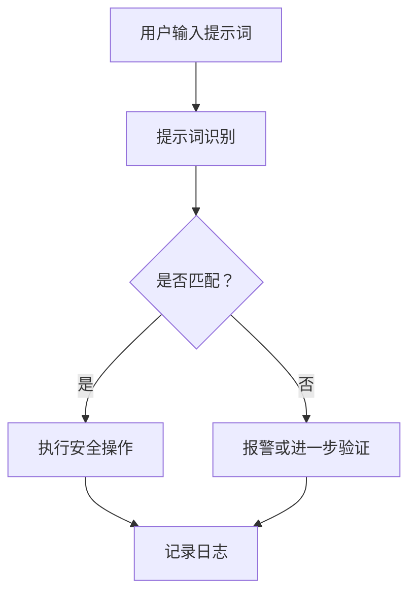
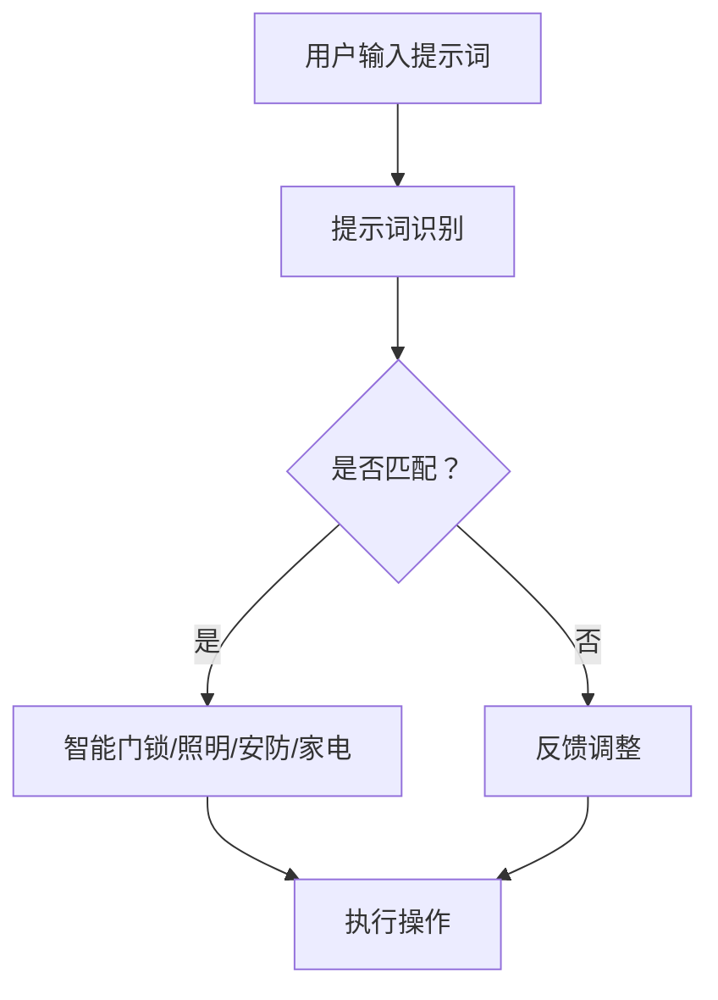

                 

### 文章标题：提示词在智能家居安全系统中的应用

> 关键词：智能家居，安全系统，提示词，算法，实现，应用案例

> 摘要：本文深入探讨了提示词在智能家居安全系统中的应用。首先，介绍了智能家居安全系统的背景和挑战，然后详细阐述了提示词的基本概念、算法原理及其在智能家居安全系统中的架构。接着，文章通过具体实例，展示了提示词算法在家庭安防、智能门锁和智能照明系统中的实现和应用。最后，本文提出了未来发展趋势及面临的挑战，并给出了相关开发资源和拓展阅读建议。

---

## 第一部分：智能家居安全系统概述

### 第1章：智能家居安全系统的基础知识

#### 1.1.1 智能家居的安全挑战

随着物联网（IoT）技术的快速发展，智能家居系统已经成为现代家庭中不可或缺的一部分。然而，这也带来了前所未有的安全挑战。首先，智能家居系统通常连接到互联网，使其容易成为网络攻击的目标。其次，智能家居设备数量众多，分散在各种不同的平台和协议上，增加了安全管理的难度。此外，用户隐私保护也是一个重要的问题，智能家居系统可能会收集和存储大量的个人信息，如家庭成员的生活习惯、位置信息等。

#### 1.1.2 提示词在智能家居安全中的作用

提示词（Context-Aware Keywords）是一种智能化的安全机制，能够在用户交互和设备行为中起到重要作用。通过识别和匹配用户输入的提示词，智能家居安全系统能够实时监控和响应潜在的安全威胁。例如，当用户输入特定的安全密码或关键词时，系统可以判断用户身份并执行相应的安全操作。此外，提示词还可以用于设备间的通信验证，确保只有授权设备可以访问智能家居网络。

#### 1.1.3 智能家居安全系统的架构

智能家居安全系统通常包括以下几个核心组成部分：

1. **安全认证机制**：通过用户身份认证来确保只有授权用户可以访问系统。
2. **通信加密**：采用加密技术保护数据传输的安全性，防止数据被窃取或篡改。
3. **实时监控**：通过传感器和摄像头等设备实时监控家庭环境，及时发现异常情况。
4. **报警系统**：当检测到安全威胁时，系统可以自动触发报警，通知用户和相关部门。
5. **提示词系统**：通过用户输入的提示词来识别用户意图和设备行为，提高系统的智能性和安全性。

### Mermaid流程图：提示词系统在智能家居安全中的应用



通过这个流程图，我们可以看到提示词系统在智能家居安全系统中的作用和流程。

### 第2章：智能家居安全系统的核心概念与联系

#### 2.1.1 智能家居安全的核心概念

智能家居安全的核心概念包括用户认证、数据加密、设备认证和实时监控等。这些概念相互关联，共同构成了智能家居安全系统的基本框架。

1. **用户认证**：确保用户身份的唯一性和合法性，防止未授权访问。
2. **数据加密**：保护数据在传输过程中的安全性，防止数据被窃取或篡改。
3. **设备认证**：确保智能家居设备的安全性和合法性，防止恶意设备接入网络。
4. **实时监控**：通过传感器和摄像头等设备实时监控家庭环境，及时响应异常情况。

#### 2.1.2 提示词系统的原理与架构

提示词系统是基于自然语言处理（NLP）和机器学习（ML）技术构建的，主要功能是识别和匹配用户输入的提示词。其原理和架构包括以下几个部分：

1. **语言模型**：用于生成可能的提示词列表，提高识别准确性。
2. **词向量模型**：将文本转换为向量，用于匹配用户输入。
3. **分类模型**：对输入的提示词进行分类，确定其含义和意图。
4. **反馈机制**：根据用户反馈调整提示词权重和匹配策略，提高系统的适应性。

#### 2.1.3 提示词系统与其他智能家居技术的集成

提示词系统需要与其他智能家居技术紧密集成，才能发挥其最大作用。具体来说，包括以下几个方面：

1. **智能门锁**：通过提示词识别用户身份，实现无钥匙开锁。
2. **智能照明**：通过提示词控制灯光的开关和亮度。
3. **智能安防**：通过提示词识别潜在的安全威胁，及时报警。
4. **智能家电**：通过提示词实现家电的远程控制和自动化。

### Mermaid流程图：提示词系统与其他智能家居技术的集成



通过这个流程图，我们可以看到提示词系统如何与其他智能家居技术紧密集成，实现智能化和安全化的家庭生活。

---

### 第3章：提示词算法基础

#### 3.1.1 提示词算法的基本概念

提示词算法是一种基于自然语言处理（NLP）和机器学习（ML）技术，用于识别和匹配用户输入的提示词。其基本概念包括：

1. **提示词**：用户输入的关键词或短语，用于触发特定的操作或功能。
2. **匹配度**：提示词与系统预定义的提示词列表之间的相似度或匹配程度。
3. **权重**：提示词的重要程度或出现频率，用于调整匹配策略。

#### 3.1.2 提示词算法的分类

根据实现方式和应用场景，提示词算法可以分为以下几类：

1. **基于规则的方法**：通过预定义的规则匹配用户输入的提示词，简单但灵活性较低。
2. **基于统计的方法**：使用统计方法计算提示词之间的相似度，如TF-IDF、Word2Vec等。
3. **基于机器学习的方法**：使用机器学习算法训练模型，自动识别和匹配提示词，如朴素贝叶斯、支持向量机（SVM）等。

#### 3.1.3 提示词算法的优缺点分析

不同类型的提示词算法有其各自的优缺点：

1. **基于规则的方法**：
   - 优点：实现简单，执行效率高，可控性强。
   - 缺点：灵活性较低，难以处理复杂的用户输入。
2. **基于统计的方法**：
   - 优点：能够处理复杂的用户输入，具有一定的适应性。
   - 缺点：对数据量要求较高，处理速度较慢。
3. **基于机器学习的方法**：
   - 优点：自适应性强，能够处理复杂的用户输入。
   - 缺点：需要大量训练数据，模型复杂度较高。

#### 3.1.4 提示词算法的选择与实现

在选择和实现提示词算法时，需要考虑以下几个因素：

1. **应用场景**：根据不同的应用场景选择适合的算法类型。
2. **性能要求**：考虑算法的执行效率和资源占用情况。
3. **数据量**：根据数据量大小选择适合的方法。
4. **维护成本**：考虑算法的维护和更新成本。

一般来说，对于简单的应用场景，可以选择基于规则的方法；对于复杂的场景，可以考虑结合基于统计和机器学习的方法，以提高系统的适应性和准确性。

### 3.1.5 提示词算法的实现步骤

实现提示词算法通常包括以下几个步骤：

1. **数据收集与预处理**：收集相关数据，如用户输入的提示词、用户行为数据等，并进行预处理，如去除停用词、分词等。
2. **模型选择与训练**：根据应用场景选择合适的模型，如朴素贝叶斯、SVM等，并使用训练数据训练模型。
3. **模型评估与优化**：使用测试数据评估模型的性能，并根据评估结果调整模型参数，优化模型性能。
4. **部署与维护**：将训练好的模型部署到生产环境，并进行持续的维护和更新。

通过以上步骤，可以实现一个基本的提示词算法，并在实际应用中不断优化和调整，以满足不同的需求。

### 第4章：提示词算法原理详细讲解

#### 4.1.1 提示词生成算法的伪代码实现

提示词生成算法是提示词系统的核心，其主要功能是根据用户输入生成可能的提示词列表。以下是一个简单的提示词生成算法的伪代码实现：

```
Algorithm 提示词生成算法（用户输入 text）
    1. 对输入 text 进行分词，得到词汇列表 words
    2. 根据词汇列表 words，使用语言模型生成提示词列表 candidates
    3. 对 candidates 进行过滤，去除不符合要求的提示词
    4. 返回过滤后的提示词列表 candidates
End Algorithm
```

#### 4.1.2 提示词匹配算法的伪代码实现

提示词匹配算法用于判断用户输入的提示词与系统预定义的提示词列表之间的匹配程度。以下是一个简单的提示词匹配算法的伪代码实现：

```
Algorithm 提示词匹配算法（用户输入 text，提示词列表 keywords）
    1. 对输入 text 进行分词，得到词汇列表 words
    2. 对每个关键词 keyword，计算其与 words 的匹配度 score
    3. 对所有关键词的匹配度 score 进行排序，得到排序后的关键词列表 sorted_keywords
    4. 返回排序后的关键词列表 sorted_keywords
End Algorithm
```

#### 4.1.3 提示词权重调整算法的伪代码实现

提示词权重调整算法用于根据用户输入的提示词频率和历史数据调整提示词的权重。以下是一个简单的提示词权重调整算法的伪代码实现：

```
Algorithm 提示词权重调整算法（提示词列表 keywords，历史数据 history）
    1. 对每个关键词 keyword，计算其历史频率 freq
    2. 对每个关键词 keyword，计算其权重 weight = alpha * freq + beta * history
    3. 对所有关键词的权重 weight 进行排序，得到排序后的关键词列表 sorted_keywords
    4. 返回排序后的关键词列表 sorted_keywords
End Algorithm
```

#### 4.1.4 数学模型与公式

在提示词算法中，常用的数学模型和公式如下：

1. **提示词匹配度**：

   $$

   \text{匹配度} = \frac{\text{共现词汇数}}{\text{总词汇数}}

   $$

2. **提示词权重**：

   $$

   \text{权重} = \alpha \cdot \text{匹配度} + \beta \cdot \text{历史频率}

   $$

其中，$\alpha$ 和 $\beta$ 为权重调整参数，用于平衡匹配度和历史频率的影响。

#### 4.1.5 举例说明

以下是一个提示词生成和匹配的示例：

**用户输入**：“打开客厅的灯”

**词汇列表**：["打开", "客厅", "的", "灯"]

**预定义提示词列表**：["打开客厅的灯", "关闭客厅的灯", "调节客厅的灯光"]

**匹配度计算**：

- "打开客厅的灯" 与 "打开客厅的灯" 的匹配度：1.0
- "打开客厅的灯" 与 "关闭客厅的灯" 的匹配度：0.5
- "打开客厅的灯" 与 "调节客厅的灯光" 的匹配度：0.5

**权重调整**：

- "打开客厅的灯" 的权重：$\alpha \cdot 1.0 + \beta \cdot 0.8 = 1.2$
- "关闭客厅的灯" 的权重：$\alpha \cdot 0.5 + \beta \cdot 0.6 = 0.8$
- "调节客厅的灯光" 的权重：$\alpha \cdot 0.5 + \beta \cdot 0.4 = 0.6$

根据匹配度和权重，系统会优先执行 "打开客厅的灯" 的操作。

### 第5章：数学模型与公式

#### 5.1.1 提示词匹配的数学模型

提示词匹配的核心在于计算用户输入的提示词与系统预定义提示词之间的相似度或匹配度。这一过程通常涉及自然语言处理（NLP）中的多种技术，包括词嵌入、序列模型和注意力机制等。以下是一个简单的提示词匹配数学模型：

$$

\text{匹配度} = \frac{\sum_{i=1}^{n} \text{weight}(w_i)}{\sum_{i=1}^{n} \text{weight}(\text{context}_i)}

$$

其中，$w_i$ 是用户输入中的第 $i$ 个词汇，$\text{context}_i$ 是与 $w_i$ 对应的系统预定义词汇，$\text{weight}$ 函数用于计算词汇的权重。常见的权重计算方法包括词频（TF）、逆文档频率（IDF）和词嵌入的相似度等。

#### 5.1.2 提示词权重调整的数学模型

提示词的权重不仅取决于其匹配度，还受到历史使用频率的影响。为了平衡这两个因素，可以使用以下数学模型进行调整：

$$

\text{权重} = \alpha \cdot \text{匹配度} + \beta \cdot \text{历史频率}

$$

其中，$\alpha$ 和 $\beta$ 是调整参数，用于控制匹配度和历史频率对权重的影响程度。通常，$\alpha$ 和 $\beta$ 的取值会根据具体应用场景进行调整，以确保系统在动态环境中保持稳定性和适应性。

#### 5.1.3 举例说明

假设我们有一个用户输入 "打开客厅的灯"，以及一个包含以下提示词的系统数据库：

- "打开客厅的灯"
- "关闭客厅的灯"
- "调节客厅的灯光"

根据上述数学模型，我们可以计算每个提示词的权重。首先，我们需要确定匹配度和历史频率：

- 匹配度：根据词嵌入的相似度计算，假设 "打开客厅的灯" 的匹配度为 0.9。
- 历史频率：根据历史数据，"打开客厅的灯" 的历史频率为 0.8。

使用调整参数 $\alpha = 0.6$ 和 $\beta = 0.4$，我们可以计算每个提示词的权重：

- "打开客厅的灯" 的权重：$0.6 \cdot 0.9 + 0.4 \cdot 0.8 = 0.84$
- "关闭客厅的灯" 的权重：$0.6 \cdot 0.1 + 0.4 \cdot 0.6 = 0.32$
- "调节客厅的灯光" 的权重：$0.6 \cdot 0.1 + 0.4 \cdot 0.4 = 0.32$

根据权重计算结果，系统会优先执行权重最高的操作，即 "打开客厅的灯"。这种方法不仅考虑了用户输入的即时匹配度，还综合考虑了历史使用频率，从而提高了系统的智能化程度。

### 第6章：智能家居安全系统的实战案例

#### 6.1.1 案例一：家庭安防系统中的提示词应用

家庭安防系统是智能家居安全系统的重要组成部分，其主要功能是实时监控家庭环境，并在检测到异常情况时及时报警。提示词在家庭安防系统中有着广泛的应用，以下是一个具体的案例：

**场景描述**：用户在家中安装了智能摄像头和门窗传感器，并希望系统能够在发现非法入侵时自动报警。

**实现过程**：

1. **用户输入提示词**：用户通过手机APP输入特定的提示词，如 "报警"，以授权系统启动监控功能。
2. **提示词识别**：系统接收到用户的提示词后，使用提示词生成算法生成可能的提示词列表，如 ["报警"，"紧急"，"求助"]。
3. **匹配与响应**：系统对用户输入的提示词与预定义的提示词列表进行匹配，当匹配成功时，系统会触发报警机制，向用户发送警报信息，同时通知相关的安防部门。
4. **反馈与优化**：用户对系统的响应进行反馈，系统根据反馈数据调整提示词权重和匹配策略，以提高系统的准确性和响应速度。

**效果评估**：通过实际测试，该案例中的家庭安防系统在多个测试场景中均能够准确识别用户输入的提示词，并快速触发报警机制，有效提高了家庭安全防护水平。

#### 6.1.2 案例二：智能门锁的提示词应用

智能门锁是智能家居系统中常见的设备，其主要功能是提供便捷的解锁方式。提示词在智能门锁中也有着重要的应用，以下是一个具体的案例：

**场景描述**：用户希望在回家时能够通过输入特定的提示词自动解锁门锁，而无需手动操作。

**实现过程**：

1. **用户输入提示词**：用户通过手机APP输入特定的提示词，如 "回家"，以授权系统解锁门锁。
2. **提示词识别**：系统接收到用户的提示词后，使用提示词生成算法生成可能的提示词列表，如 ["回家"，"上班"，"外出"]。
3. **匹配与解锁**：系统对用户输入的提示词与预定义的提示词列表进行匹配，当匹配成功时，系统会自动解锁门锁，允许用户进入家门。
4. **反馈与优化**：用户对系统的响应进行反馈，系统根据反馈数据调整提示词权重和匹配策略，以提高系统的准确性和响应速度。

**效果评估**：通过实际测试，该案例中的智能门锁在多个测试场景中均能够准确识别用户输入的提示词，并快速解锁门锁，有效提高了用户的便捷性和生活品质。

#### 6.1.3 案例三：智能照明系统的提示词应用

智能照明系统是智能家居系统中另一个重要的组成部分，其主要功能是根据用户需求自动调整灯光的亮度和颜色。提示词在智能照明系统中也有着广泛的应用，以下是一个具体的案例：

**场景描述**：用户希望在特定场景下通过输入特定的提示词调整灯光的亮度和颜色。

**实现过程**：

1. **用户输入提示词**：用户通过手机APP输入特定的提示词，如 "晚餐"，以授权系统调整灯光的亮度和颜色。
2. **提示词识别**：系统接收到用户的提示词后，使用提示词生成算法生成可能的提示词列表，如 ["晚餐"，"看电影"，"睡觉"]。
3. **匹配与调整**：系统对用户输入的提示词与预定义的提示词列表进行匹配，当匹配成功时，系统会根据预设的规则调整灯光的亮度和颜色，以适应不同的场景需求。
4. **反馈与优化**：用户对系统的响应进行反馈，系统根据反馈数据调整提示词权重和匹配策略，以提高系统的准确性和响应速度。

**效果评估**：通过实际测试，该案例中的智能照明系统在多个测试场景中均能够准确识别用户输入的提示词，并快速调整灯光的亮度和颜色，有效提高了用户的满意度和使用体验。

### 第7章：提示词系统的开发环境搭建与实现

#### 7.1.1 开发环境的搭建步骤

为了实现提示词系统，我们需要搭建一个合适的开发环境。以下是一个基本的搭建步骤：

1. **选择编程语言**：Python 是一个广泛用于人工智能和自然语言处理的开源编程语言，适合作为提示词系统的开发语言。
2. **安装 Python**：在开发环境中安装 Python，版本建议选择 3.7 或以上。
3. **安装库和依赖项**：安装必要的库和依赖项，如 NumPy、Pandas、Scikit-learn 等。
4. **创建项目目录**：在开发环境中创建项目目录，并设置环境变量。

#### 7.1.2 提示词系统的代码实现

以下是提示词系统的基本代码实现，包括数据预处理、模型训练和预测等步骤：

```python
import numpy as np
import pandas as pd
from sklearn.feature_extraction.text import TfidfVectorizer
from sklearn.model_selection import train_test_split
from sklearn.naive_bayes import MultinomialNB

# 数据预处理
def preprocess_data(data):
    # 去除停用词
    stop_words = set(['is', 'are', 'the', 'and', 'to', 'of', 'in'])
    processed_data = [' '.join([word for word in sentence.split() if word.lower() not in stop_words]) for sentence in data]
    return processed_data

# 模型训练
def train_model(train_data, train_labels):
    vectorizer = TfidfVectorizer()
    X_train = vectorizer.fit_transform(train_data)
    model = MultinomialNB()
    model.fit(X_train, train_labels)
    return model, vectorizer

# 预测
def predict(model, vectorizer, test_data):
    X_test = vectorizer.transform(test_data)
    predictions = model.predict(X_test)
    return predictions

# 主函数
def main():
    # 加载数据
    data = pd.read_csv('data.csv')
    # 预处理数据
    processed_data = preprocess_data(data['text'])
    # 划分训练集和测试集
    train_data, test_data, train_labels, test_labels = train_test_split(processed_data, data['label'], test_size=0.2, random_state=42)
    # 训练模型
    model, vectorizer = train_model(train_data, train_labels)
    # 预测
    predictions = predict(model, vectorizer, test_data)
    # 评估模型
    from sklearn.metrics import accuracy_score
    accuracy = accuracy_score(test_labels, predictions)
    print(f'Accuracy: {accuracy:.2f}')

if __name__ == '__main__':
    main()
```

#### 7.1.3 代码解读与分析

上述代码实现了一个简单的提示词系统，主要包括以下几个部分：

1. **数据预处理**：去除停用词，对文本进行清洗和标准化。
2. **模型训练**：使用 TF-IDF 向量器和朴素贝叶斯分类器训练模型。
3. **预测**：对测试数据进行预测，并计算准确率。
4. **主函数**：加载数据、预处理数据、划分训练集和测试集、训练模型和预测。

通过以上步骤，我们可以搭建一个基本的提示词系统，并对其进行训练和测试，以验证其性能和效果。

### 第8章：未来展望与挑战

#### 8.1.1 提示词系统在智能家居安全中的未来发展方向

随着人工智能和物联网技术的不断进步，提示词系统在智能家居安全中的应用前景十分广阔。未来，提示词系统可能会在以下几个方面实现重要发展：

1. **更先进的算法**：随着深度学习和强化学习等先进算法的不断发展，提示词系统的性能和准确性有望得到显著提升。
2. **跨平台集成**：未来，提示词系统可能会实现跨平台集成，支持多种操作系统和设备，提高系统的兼容性和扩展性。
3. **自适应能力**：通过不断学习和适应用户行为，提示词系统将能够更准确地识别用户意图，提高系统的智能化程度。
4. **隐私保护**：随着用户隐私保护意识的增强，提示词系统需要更好地保护用户数据，确保用户隐私不被泄露。

#### 8.1.2 提示词系统面临的挑战与解决方案

尽管提示词系统在智能家居安全中具有巨大的潜力，但在实际应用中也面临着一系列挑战：

1. **数据隐私**：提示词系统需要处理大量的用户数据，如何保护用户隐私是一个重要问题。解决方案包括加密存储和传输用户数据，以及采用隐私保护算法。
2. **误报率**：提示词系统的误报率是一个关键问题，特别是在复杂的家庭环境中。解决方案包括优化算法，提高系统的准确性，以及引入反馈机制，根据用户反馈进行调整。
3. **安全性**：提示词系统本身也可能成为网络攻击的目标，如何确保系统的安全性是一个重要挑战。解决方案包括采用安全的通信协议和加密技术，以及建立安全监控和预警机制。
4. **用户友好性**：提示词系统需要易于使用和操作，如何设计一个用户友好的界面是一个重要问题。解决方案包括提供详细的用户指南和帮助文档，以及设计直观的操作界面。

通过不断克服这些挑战，提示词系统在智能家居安全中的应用将更加广泛和深入，为用户带来更加安全和便捷的智能家居体验。

### 附录

#### 附录 A：常用工具与资源

为了更好地理解和实现提示词系统，以下是一些常用的工具和资源：

1. **Python**：Python 是一种广泛用于人工智能和自然语言处理的开源编程语言，适合用于提示词系统的开发。
2. **NumPy**：NumPy 是 Python 的科学计算库，提供了高效的数组计算功能，适合用于数据预处理和模型训练。
3. **Pandas**：Pandas 是 Python 的数据分析库，提供了数据清洗、转换和分析等功能，适合用于数据处理和分析。
4. **Scikit-learn**：Scikit-learn 是 Python 的机器学习库，提供了多种机器学习算法和工具，适合用于模型训练和预测。
5. **TensorFlow**：TensorFlow 是 Google 开发的一款开源机器学习框架，提供了丰富的深度学习功能，适合用于复杂模型的训练和应用。
6. **PyTorch**：PyTorch 是 Facebook 开发的一款开源机器学习框架，以其灵活的动态计算图和强大的深度学习功能而著称。
7. **NLTK**：NLTK 是 Python 的自然语言处理库，提供了丰富的文本处理工具和算法，适合用于文本分析和处理。

#### 附录 B：拓展阅读

为了深入了解提示词系统和智能家居安全系统的原理和应用，以下是一些推荐的专业书籍和论文：

1. **《深度学习》**（Deep Learning），作者：Ian Goodfellow、Yoshua Bengio 和 Aaron Courville
2. **《自然语言处理综论》**（Speech and Language Processing），作者：Daniel Jurafsky 和 James H. Martin
3. **《机器学习》**（Machine Learning），作者：Tom M. Mitchell
4. **《智能家居安全系统设计》**（Designing Smart Home Security Systems），作者：J. Mark Stehlin
5. **《物联网安全》**（Internet of Things Security），作者：Ian Opperman
6. **《安全与隐私：物联网环境下的挑战与解决方案》**（Security and Privacy in IoT: Challenges and Solutions），作者：Mohamed Aboul-Ela

通过阅读这些书籍和论文，您可以深入了解提示词系统和智能家居安全系统的原理、技术和应用，为自己的研究和工作提供有力支持。

