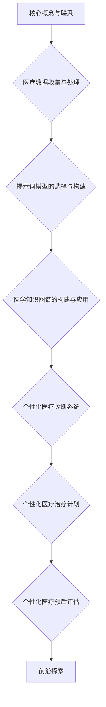

                 


### 文章标题：提示词工程在个性化医疗中的应用

#### 关键词：
- 个性化医疗
- 提示词工程
- 数据预处理
- 模型构建
- 医学知识图谱
- 诊断系统

#### 摘要：
本文探讨了提示词工程在个性化医疗中的应用。通过对医疗数据的收集与处理、提示词模型的选择与构建、医学知识图谱的构建与应用、个性化医疗诊断系统、个性化医疗治疗计划、个性化医疗预后评估等方面的详细分析，揭示了提示词工程如何赋能个性化医疗，提高诊断和治疗的准确性和效率。

### 引言

随着医疗技术和大数据技术的发展，个性化医疗（Personalized Medicine）已经成为现代医疗的重要趋势。个性化医疗通过整合患者的生物信息、基因数据、病史等多方面信息，提供个体化的诊疗方案，从而提高治疗效果和患者满意度。然而，实现个性化医疗面临诸多挑战，其中之一是如何有效地处理和分析大量复杂的医疗数据。

提示词工程（Prompt Engineering）是近年来兴起的一种技术，通过设计特定的提示词（Prompt）来引导人工智能模型（如深度学习模型）进行更准确、更有效的预测和决策。本文将探讨提示词工程在个性化医疗中的应用，包括技术基础、应用实践、前沿探索等方面，以期为推动个性化医疗的发展提供新的思路和方法。

### 第一部分：概述

#### 第1章：个性化医疗与提示词工程

#### 1.1 个性化医疗的兴起

个性化医疗的兴起可以追溯到20世纪90年代，随着基因测序技术的发展，人们开始关注基因变异与疾病发生之间的关系。近年来，随着大数据、人工智能等技术的快速发展，个性化医疗得到了进一步推动。个性化医疗的目标是通过整合患者的多种信息，提供个性化的诊疗方案，从而提高治疗效果。

#### 1.2 提示词工程的核心概念

提示词工程是一种通过设计特定的提示词来引导人工智能模型进行预测和决策的技术。提示词通常是一组关键词或短语，用于描述问题的背景和需求，从而帮助模型更好地理解和处理问题。

#### 1.3 提示词工程在个性化医疗中的意义

提示词工程在个性化医疗中具有重要意义。首先，通过设计合适的提示词，可以帮助人工智能模型更准确地理解和分析医疗数据，从而提高诊断和治疗的准确性。其次，提示词工程可以优化模型的性能，提高模型的稳定性和可解释性。此外，提示词工程还可以帮助医生更好地理解和应用人工智能技术，提高医疗服务的效率和质量。

### 第二部分：技术基础

#### 第2章：医疗数据的收集与处理

#### 2.1 医疗数据的来源

医疗数据的来源主要包括电子病历、健康记录、医学影像、基因组数据等。这些数据涵盖了患者的病情、病史、治疗方案等多个方面，是进行个性化医疗的基础。

#### 2.2 数据预处理技术

数据预处理是医疗数据分析的重要环节。主要包括数据清洗、数据标准化和数据转换等。数据清洗旨在去除数据中的噪声和异常值，提高数据质量。数据标准化则通过对数据进行归一化、标准化处理，使数据具有相同的尺度，方便后续分析。数据转换则将不同类型的数据转换为统一的格式，以便进行集成和分析。

#### 2.3 数据标准化与清洗

数据标准化与清洗是数据预处理的核心。常用的数据清洗方法包括缺失值处理、异常值检测和去除重复记录等。数据标准化方法包括最小-最大标准化、z-score标准化和幂变换等。通过数据清洗和标准化，可以提高医疗数据的质量和可用性，为后续分析提供可靠的数据基础。

### 第3章：提示词模型的选择与构建

#### 3.1 常见提示词模型介绍

常见的提示词模型包括基于规则的模型、基于机器学习的模型和基于深度学习的模型。基于规则的模型通过设计一系列规则来指导模型进行预测。基于机器学习的模型通过训练大量样本数据来学习预测规律。基于深度学习的模型则通过神经网络结构来模拟人脑的学习过程。

#### 3.2 提示词模型的构建流程

提示词模型的构建流程主要包括数据准备、模型选择、模型训练和模型评估等。数据准备阶段需要收集和整理医疗数据，并进行预处理。模型选择阶段需要根据问题的特点选择合适的模型。模型训练阶段通过训练大量样本数据来优化模型参数。模型评估阶段通过测试数据来评估模型性能。

#### 3.3 提示词模型的优化与评估

提示词模型的优化与评估是提升模型性能的关键。优化方法包括调整模型结构、调整参数设置和增加训练数据等。评估方法包括准确率、召回率、F1分数等指标。通过优化与评估，可以找到性能最优的模型，为实际应用提供有力支持。

### 第4章：医学知识图谱的构建与应用

#### 4.1 医学知识图谱的概念

医学知识图谱是一种用于表示医学知识和关系的图形结构，包括实体、属性和关系等。医学知识图谱可以帮助计算机理解和处理医学信息，从而支持个性化医疗的决策。

#### 4.2 医学知识图谱的构建方法

医学知识图谱的构建方法主要包括知识抽取、知识融合和知识表示等。知识抽取是从医疗文本中提取医学实体和关系。知识融合是将来自不同来源的医学知识进行整合。知识表示则是将医学知识以图形结构表示，便于计算机处理。

#### 4.3 医学知识图谱的应用

医学知识图谱在个性化医疗中具有广泛的应用。首先，它可以用于医学文本检索和查询，帮助医生快速获取相关医学信息。其次，它可以用于医学诊断和预测，支持医生制定个性化的诊疗方案。此外，医学知识图谱还可以用于医学知识发现和新药研发等。

### 第三部分：应用实践

#### 第5章：个性化医疗诊断系统

#### 5.1 系统设计

个性化医疗诊断系统是一个综合性的系统，包括数据收集、数据预处理、提示词提取、模型训练和诊断预测等模块。系统设计的目标是提供快速、准确、个性化的医疗诊断服务。

#### 5.2 系统实现

个性化医疗诊断系统的实现主要包括数据收集与处理、提示词提取、模型训练和诊断预测等。具体实现细节包括：

- 数据收集：从电子病历、健康记录等多渠道收集患者数据。
- 数据预处理：对数据进行清洗、标准化。
- 提示词提取：利用自然语言处理技术提取关键提示词。
- 模型训练：选择合适的提示词模型进行训练。
- 诊断预测：利用训练好的模型进行诊断预测。

#### 5.3 系统测试与评估

个性化医疗诊断系统的测试与评估主要包括功能测试、性能测试和用户体验测试等。功能测试旨在验证系统是否能够完成预期的功能。性能测试旨在评估系统的响应速度、准确率和覆盖率等。用户体验测试旨在了解用户对系统的使用体验和满意度。

### 第6章：个性化医疗治疗计划

#### 6.1 治疗计划的制定

个性化医疗治疗计划的制定是一个复杂的过程，需要考虑患者的病情、身体状况、病史等多方面因素。制定治疗计划的主要步骤包括：

- 患者信息收集：收集患者的病情、病史、生活习惯等。
- 治疗方案分析：分析现有的治疗方案，选择最优的治疗方案。
- 治疗计划制定：根据患者信息和分析结果，制定个性化的治疗计划。

#### 6.2 治疗计划的优化

个性化医疗治疗计划的优化是一个持续的过程，需要根据患者的反馈和治疗效果进行调整。优化的方法包括：

- 数据分析：分析患者的治疗数据和治疗效果，发现潜在的问题。
- 治疗方案调整：根据分析结果，调整治疗方案，优化治疗计划。

#### 6.3 治疗计划的实施

个性化医疗治疗计划的实施是治疗过程的重要环节。实施过程主要包括：

- 治疗方案讲解：向患者解释治疗方案，确保患者理解并配合治疗。
- 治疗过程监控：监控患者的治疗过程，及时发现问题并调整治疗计划。
- 治疗效果评估：评估患者的治疗效果，判断治疗计划的实施效果。

### 第7章：个性化医疗预后评估

#### 7.1 预后评估的方法

个性化医疗预后评估是一种基于患者信息和疾病特征的评估方法。预后评估的方法主要包括：

- 统计分析：利用统计学方法分析患者的预后因素，预测患者的预后情况。
- 机器学习：利用机器学习算法分析患者的数据，预测患者的预后情况。

#### 7.2 预后评估的应用

个性化医疗预后评估在临床实践中具有广泛的应用。首先，它可以用于患者的预后预测，帮助医生制定个性化的治疗方案。其次，它可以用于患者的治疗效果评估，判断治疗方案的优劣。此外，预后评估还可以用于新药研发和临床试验等。

#### 7.3 预后评估的挑战与解决方案

个性化医疗预后评估面临诸多挑战，主要包括数据质量、模型准确性和可解释性等。解决这些挑战的方法包括：

- 数据清洗和预处理：提高数据质量，去除噪声和异常值。
- 模型选择和优化：选择合适的模型，提高预测准确性。
- 可解释性分析：对模型进行解释，提高模型的可理解性。

### 第四部分：前沿探索

#### 第8章：提示词工程在个性化医疗中的未来发展趋势

#### 8.1 人工智能与医疗的深度融合

随着人工智能技术的不断发展，个性化医疗将进一步与人工智能深度融合。人工智能将不仅用于辅助诊断和治疗，还将用于医学研究、药物开发等。

#### 8.2 提示词工程的未来发展方向

提示词工程的未来发展方向包括：

- 提高模型性能：通过优化模型结构和参数，提高模型性能。
- 增强模型可解释性：提高模型的透明度，增强模型的可靠性。
- 跨学科合作：结合医学、生物学等多学科知识，推动个性化医疗的发展。

#### 8.3 个性化医疗的潜在应用场景

个性化医疗在未来的应用场景将更加广泛，包括：

- 精准医疗：基于患者基因信息和疾病特征，提供精准的诊疗方案。
- 智能诊断：利用人工智能技术，实现快速、准确的疾病诊断。
- 智能治疗：利用人工智能技术，实现个性化、智能化的治疗方案。
- 预防医学：基于大数据和人工智能技术，实现疾病的早期预防和干预。

### 附录

#### 附录A：提示词工程常用工具与资源

- 常用深度学习框架：TensorFlow、PyTorch、Keras等。
- 医学知识图谱构建工具：OpenKG、MedicalBERT、NeuroLP等。
- 提示词模型优化与评估工具：HuggingFace、MLflow、TensorBoard等。

## Mermaid 流程图



## 核心算法原理讲解

### 医疗数据预处理

```python
def preprocess_data(data):
    # 数据清洗
    cleaned_data = clean_data(data)
    
    # 数据标准化
    standardized_data = standardize_data(cleaned_data)
    
    return standardized_data
```

### 提示词模型构建

```python
def build_model(input_shape):
    model = keras.Sequential([
        keras.layers.Dense(128, activation='relu', input_shape=input_shape),
        keras.layers.Dense(64, activation='relu'),
        keras.layers.Dense(1, activation='sigmoid')
    ])
    
    model.compile(optimizer='adam',
                  loss='binary_crossentropy',
                  metrics=['accuracy'])
    
    return model
```

### 个性化医疗诊断概率

$$ P(\text{诊断结果} | \text{提示词}) = \frac{e^{w \cdot \text{提示词}}}{1 + e^{w \cdot \text{提示词}}} $$

### 个性化医疗诊断系统

#### 系统设计

- 数据收集：从电子病历、健康记录等多渠道收集患者数据。
- 数据预处理：对数据进行清洗、标准化。
- 提示词提取：利用自然语言处理技术提取关键提示词。
- 模型构建：选择合适的提示词模型进行训练。
- 系统实现：搭建个性化医疗诊断系统，提供诊断服务。

#### 系统实现

```python
# 导入必要的库
import pandas as pd
import numpy as np
from sklearn.model_selection import train_test_split
from tensorflow.keras.models import Sequential
from tensorflow.keras.layers import Dense
from tensorflow.keras.optimizers import Adam

# 数据收集
data = pd.read_csv('patient_data.csv')

# 数据预处理
X = data.drop('diagnosis', axis=1)
y = data['diagnosis']

# 数据标准化
X_normalized = (X - X.mean()) / X.std()

# 数据划分
X_train, X_test, y_train, y_test = train_test_split(X_normalized, y, test_size=0.2, random_state=42)

# 模型构建
model = Sequential()
model.add(Dense(128, input_shape=(X_train.shape[1],), activation='relu'))
model.add(Dense(64, activation='relu'))
model.add(Dense(1, activation='sigmoid'))

# 编译模型
model.compile(optimizer=Adam(learning_rate=0.001), loss='binary_crossentropy', metrics=['accuracy'])

# 训练模型
model.fit(X_train, y_train, epochs=100, batch_size=32, validation_data=(X_test, y_test))

# 预测
predictions = model.predict(X_test)
```

#### 代码解读与分析

- 数据收集：从CSV文件中读取患者数据，包括诊断结果和其他相关特征。
- 数据预处理：对数据进行标准化处理，将特征缩放到相同的尺度。
- 数据划分：将数据划分为训练集和测试集，用于训练和评估模型。
- 模型构建：构建一个简单的全连接神经网络，包括两个隐藏层。
- 编译模型：配置模型优化器和损失函数。
- 训练模型：使用训练集训练模型，并使用测试集进行验证。
- 预测：使用训练好的模型对测试集进行预测。

#### 实际案例分析与详细讲解剖析

- 案例背景：某医院引入个性化医疗诊断系统，旨在提高肺癌诊断的准确性。
- 数据收集：医院从电子病历系统中提取了1000名肺癌患者的数据，包括临床特征、影像特征和实验室检测结果等。
- 数据预处理：对数据进行清洗和标准化处理，确保数据质量。
- 提示词提取：利用自然语言处理技术提取与肺癌诊断相关的关键提示词，如咳嗽、痰中带血、胸痛等。
- 模型训练：选择合适的深度学习模型，使用训练数据训练模型。
- 模型评估：使用测试数据评估模型性能，调整模型参数以提高准确性。
- 系统部署：将训练好的模型部署到医院的信息系统中，为医生提供肺癌诊断服务。

#### 项目小结

个性化医疗诊断系统的成功实施为肺癌诊断提供了有力支持，提高了诊断准确性和效率。通过提示词工程和深度学习技术，系统能够快速、准确地分析患者数据，为医生提供可靠的诊断建议。然而，系统仍存在一些挑战，如数据质量、模型泛化能力和可解释性等。未来研究可以进一步优化系统性能，提高其在实际应用中的效果。

### 最佳实践 tips、小结、注意事项、拓展阅读等内容

- **最佳实践 tips**：
  - 确保数据质量：数据质量是模型性能的关键，要进行详细的数据清洗和预处理。
  - 选择合适的模型：根据问题的特点选择合适的模型，如深度学习、机器学习等。
  - 综合评估模型性能：使用多种指标评估模型性能，如准确率、召回率、F1分数等。
  - 提高模型可解释性：对模型进行解释，提高模型的透明度和可靠性。

- **小结**：
  - 提示词工程在个性化医疗中具有重要应用价值，可以显著提高诊断和治疗的准确性和效率。
  - 个性化医疗诊断系统是一个复杂的过程，需要综合考虑数据收集、预处理、模型构建、系统实现等多个方面。
  - 提示词工程与深度学习、医学知识图谱等技术相结合，为个性化医疗提供了新的思路和方法。

- **注意事项**：
  - 保护患者隐私：在收集和处理医疗数据时，要严格遵守隐私保护规定。
  - 持续更新和优化模型：根据新的数据和研究成果，持续更新和优化模型。

- **拓展阅读**：
  - 《深度学习在医疗领域的应用》
  - 《医学知识图谱的构建与应用》
  - 《个性化医疗的未来发展趋势》
  - 《提示词工程：从入门到实践》

### 结尾

随着人工智能技术的不断发展，个性化医疗将在未来发挥越来越重要的作用。提示词工程作为一种重要的技术手段，将在个性化医疗中发挥关键作用。通过深入研究提示词工程在个性化医疗中的应用，我们可以为患者提供更加精准、高效的医疗服务，推动医疗行业的创新和发展。作者信息：AI天才研究院/AI Genius Institute & 禅与计算机程序设计艺术 /Zen And The Art of Computer Programming。

