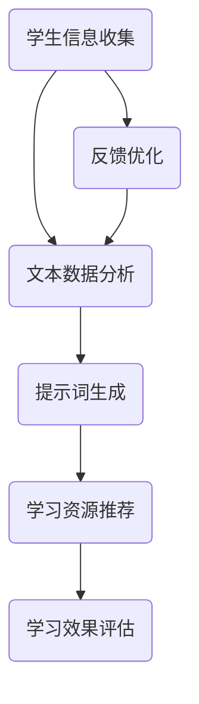
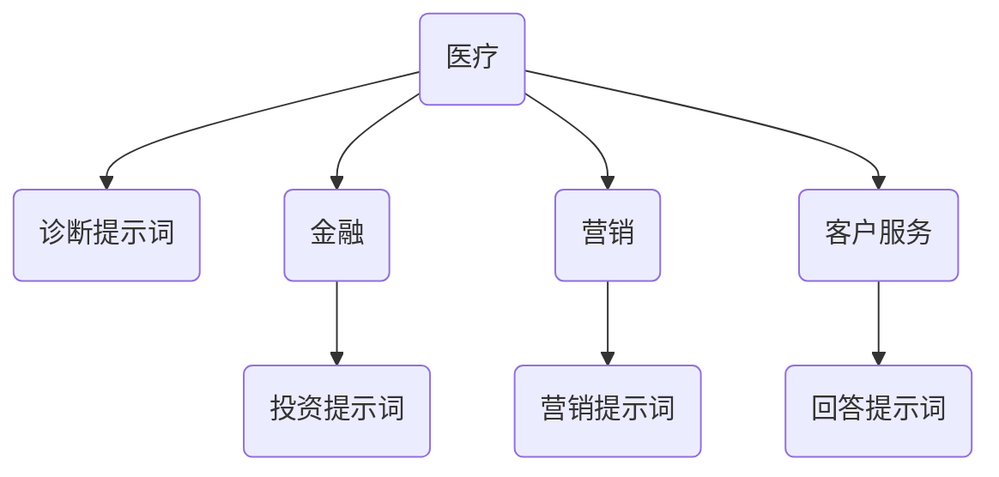
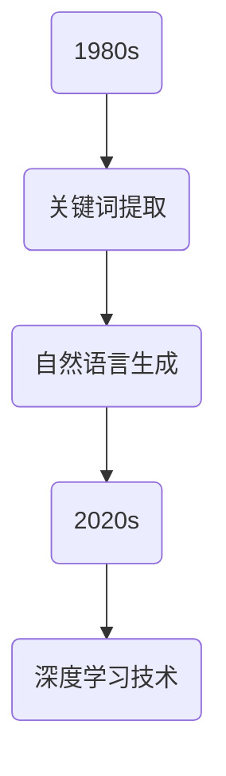
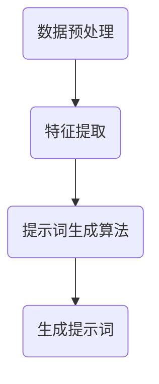
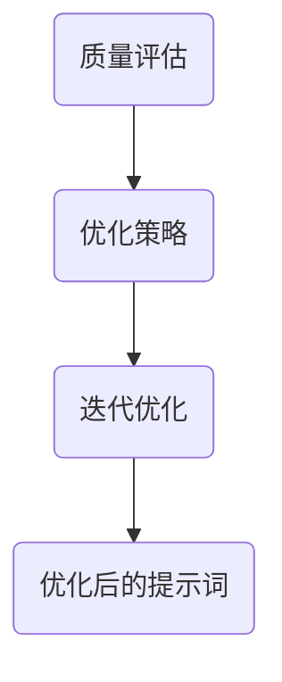
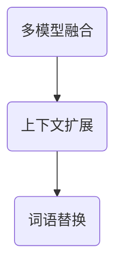
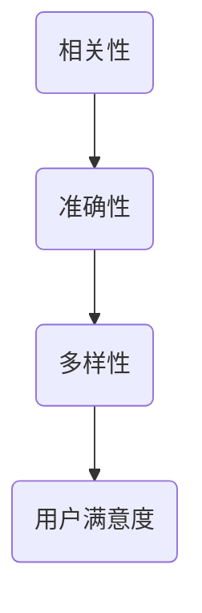
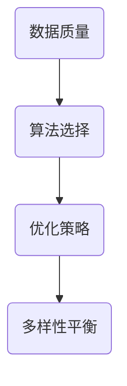
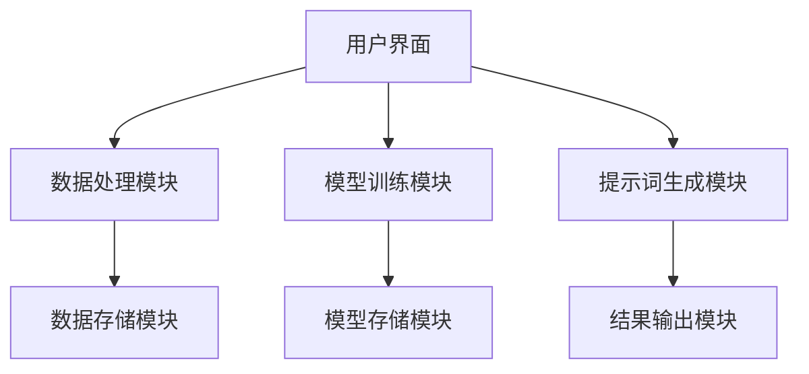
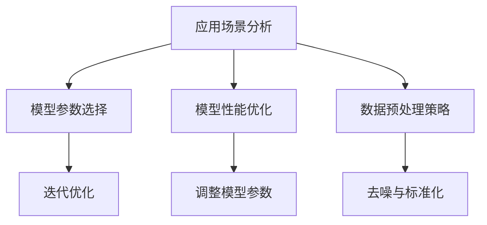

                 

### 第1章: 提示词工程概述

#### 1.1 提示词工程的概念与重要性

提示词工程是指一种利用人工智能技术，特别是自然语言处理（NLP）、数据挖掘与机器学习，以及深度学习等方法，对大量文本数据进行处理和分析，从而生成高质量的提示词，以支持各种应用场景的技术。在个性化教育中，提示词工程的应用尤为重要，它能够根据学生的学习需求和特点，生成个性化的学习资源和指导。

在个性化教育中，提示词工程的重要性体现在以下几个方面：

1. **提高学习效率**：通过生成针对性的学习提示词，学生可以更快地理解课程内容，从而提高学习效率。

2. **增强学习体验**：个性化的学习资源和指导能够更好地满足学生的兴趣和需求，从而提升学习体验。

3. **促进知识掌握**：通过提示词工程，学生可以更好地掌握知识点，从而提高学业成绩。

4. **适应个性化学习**：随着教育信息化的推进，学生的个性化需求越来越多样化，提示词工程能够适应这种变化，提供更加灵活和个性化的服务。

**Mermaid 流程图：提示词工程在个性化教育中的应用流程**



#### 1.2 提示词工程的应用领域

提示词工程不仅适用于个性化教育，还在多个领域有着广泛的应用：

1. **医疗**：通过分析医疗文档，生成诊断提示词，帮助医生提高诊断准确性。

2. **金融**：分析金融报表和新闻，生成投资决策提示词，辅助投资决策。

3. **营销**：分析用户数据和行为，生成个性化营销提示词，提高营销效果。

4. **客户服务**：根据用户提问，生成回答提示词，提高客户服务质量。

**Mermaid 流程图：提示词工程的多领域应用**



#### 1.3 提示词工程的发展历程

提示词工程的发展经历了几个重要阶段：

- **1980s：关键词提取**：最早期的提示词工程是基于关键词提取的方法，通过统计文本中高频词来生成提示词。

- **1990s-2000s：自然语言生成**：随着自然语言处理技术的发展，提示词工程开始利用自然语言生成技术，生成更加自然的提示词。

- **2010s-2020s：深度学习技术**：深度学习技术的引入，使得提示词工程取得了显著的进步，能够生成更高质量、更个性化的提示词。

**Mermaid 流�程图：提示词工程的发展历程**



### 结论

提示词工程作为一种新兴的人工智能技术，在个性化教育以及多个领域都有着广泛的应用。通过对其概念、应用领域和发展历程的了解，我们可以看到提示词工程的重要性和潜力。在接下来的章节中，我们将深入探讨提示词工程的关键要素、技术原理，以及在个性化教育中的应用实践。这将为我们更好地理解和应用提示词工程提供有力的支持。

### 第2章: 提示词工程的关键要素

#### 2.1 提示词的生成与优化

提示词的生成与优化是提示词工程的核心环节，直接影响着提示词的质量和应用效果。在这一节中，我们将详细探讨提示词的生成与优化过程，并分析其中涉及的关键技术和方法。

**1. 提示词生成**

提示词的生成过程通常包括以下几个步骤：

- **数据预处理**：首先对输入的文本数据（如文章、教材、问题等）进行预处理，包括分词、去除停用词、词性标注等，以便提取出有用的信息。

- **特征提取**：对预处理后的文本数据进行特征提取，常见的特征提取方法包括TF-IDF、Word2Vec、BERT等。这些特征表示了文本数据中的语义信息，是生成提示词的重要依据。

- **提示词生成算法**：利用提取到的特征，通过特定的算法生成提示词。常见的生成算法有基于规则的方法、基于统计的方法和基于机器学习的方法。

**Mermaid 流程图：提示词生成流程**



**伪代码示例：提示词生成**

```python
# 数据预处理
def preprocess_text(text):
    # 分词、去除停用词、词性标注等操作
    processed_text = ...
    return processed_text

# 特征提取
def extract_features(processed_text):
    # 使用TF-IDF、Word2Vec等方法提取特征
    features = ...
    return features

# 提示词生成
def generate_prompt(features):
    # 使用机器学习算法生成提示词
    prompt = ...
    return prompt

# 主函数
def main():
    text = "输入文本数据"
    processed_text = preprocess_text(text)
    features = extract_features(processed_text)
    prompt = generate_prompt(features)
    print("生成的提示词：", prompt)

main()
```

**2. 提示词优化**

生成的提示词往往需要进一步优化，以提高其质量和应用效果。提示词的优化过程通常包括以下几个步骤：

- **质量评估**：对生成的提示词进行质量评估，评估指标包括相关性、准确性、多样性等。

- **优化策略**：根据质量评估结果，采取相应的优化策略，如调整算法参数、使用更复杂的模型等。

- **迭代优化**：通过多次迭代，不断优化提示词，直至达到满意的质量。

**Mermaid 流程图：提示词优化流程**



**伪代码示例：提示词优化**

```python
# 质量评估
def evaluate_prompt(prompt, criteria):
    # 根据评估指标评估提示词质量
    score = ...
    return score

# 优化策略
def optimize_prompt(prompt, strategy):
    # 调整算法参数、使用更复杂的模型等
    optimized_prompt = ...
    return optimized_prompt

# 迭代优化
def optimize_loop(prompt, max_iterations):
    for _ in range(max_iterations):
        score = evaluate_prompt(prompt, criteria)
        if score > threshold:
            break
        prompt = optimize_prompt(prompt, strategy)
    return prompt

# 主函数
def main():
    prompt = "初始提示词"
    optimized_prompt = optimize_loop(prompt, max_iterations=10)
    print("优化后的提示词：", optimized_prompt)

main()
```

**3. 提示词多样性**

提示词的多样性是提示词工程中一个重要的考量因素。多样化的提示词能够提供更广泛的信息，满足不同用户的需求。为了实现提示词的多样性，可以采取以下策略：

- **多模型融合**：使用多种生成模型，如基于规则、基于统计和基于机器学习的方法，生成多样化的提示词。

- **上下文扩展**：在生成提示词时，考虑上下文信息，扩展提示词的语义范围。

- **词语替换**：对提示词中的关键词进行替换，生成不同形式的提示词。

**Mermaid 流程图：提示词多样性策略**



**4. 提示词质量评估**

提示词的质量直接影响其在实际应用中的效果。为了评估提示词的质量，可以采用以下指标：

- **相关性**：提示词与目标内容的关联程度。

- **准确性**：提示词的正确性和准确性。

- **多样性**：提示词的形式和内容多样性。

- **用户满意度**：用户对提示词的接受度和满意度。

**Mermaid 流程图：提示词质量评估指标**



**5. 提示词工程的关键挑战**

在提示词工程的实施过程中，面临以下关键挑战：

- **数据质量**：高质量的数据是生成高质量提示词的基础。

- **算法选择**：选择合适的算法和模型，能够显著影响提示词的质量和应用效果。

- **优化策略**：优化策略的有效性直接决定提示词的优化效果。

- **多样性平衡**：在保证提示词多样性的同时，确保其质量。

**Mermaid 流程图：提示词工程的关键挑战**



### 结论

提示词的生成与优化是提示词工程的核心要素，直接影响着提示词的质量和应用效果。通过了解提示词生成和优化的关键步骤、技术方法和挑战，我们可以更好地实施和优化提示词工程，为个性化教育和其他领域提供高质量的服务。

### 第3章: 提示词工程的技术原理

#### 3.1 自然语言处理技术

自然语言处理（NLP）是提示词工程的基础技术之一，其核心任务包括文本分析、语义理解、情感分析等。以下将详细介绍NLP技术在提示词工程中的应用。

**1. 文本分析**

文本分析是NLP的核心任务之一，主要包括分词、词性标注、命名实体识别等。

- **分词**：分词是将连续的文本分割成有意义的词汇或短语。常用的分词方法有基于规则的分词、基于统计的分词和基于深度学习的分词。

  **伪代码示例：基于规则的分词**
  ```python
  def rule_based_segmentation(text):
      # 使用预设的规则进行分词
      words = []
      for word in text:
          if is_important_word(word):
              words.append(word)
      return words
  ```

- **词性标注**：词性标注是为文本中的每个词赋予相应的词性，如名词、动词、形容词等。词性标注有助于理解文本的语义。

  **伪代码示例：词性标注**
  ```python
  def part_of_speech_tagging(text):
      # 使用词性标注模型进行标注
      tagged_words = model.predict(text)
      return tagged_words
  ```

- **命名实体识别**：命名实体识别是从文本中识别出具有特定意义的实体，如人名、地名、组织名等。这对于生成针对特定实体的提示词至关重要。

  **伪代码示例：命名实体识别**
  ```python
  def named_entity_recognition(text):
      # 使用命名实体识别模型进行识别
      entities = model.predict(text)
      return entities
  ```

**2. 语义理解**

语义理解是NLP的另一个重要任务，它涉及对文本内容进行深层次的理解和分析。

- **词义消歧**：词义消歧是指在特定语境下确定一个词的正确含义。这有助于准确生成提示词。

  **伪代码示例：词义消歧**
  ```python
  def word_sense_ambiguity_resolve(context, word):
      # 使用语义网络或词向量模型进行词义消歧
      correct_sense = model.predict(context, word)
      return correct_sense
  ```

- **文本分类**：文本分类是将文本划分为预定义的类别。这对于生成具有特定主题的提示词非常有用。

  **伪代码示例：文本分类**
  ```python
  def text_classification(text, categories):
      # 使用文本分类模型进行分类
      category = model.predict(text, categories)
      return category
  ```

**3. 情感分析**

情感分析是NLP技术中的一种，用于分析文本的情感倾向，如正面、负面或中性。

- **情感分类**：情感分类是将文本分为正面、负面或中性等情感类别。

  **伪代码示例：情感分类**
  ```python
  def sentiment_classification(text):
      # 使用情感分析模型进行分类
      sentiment = model.predict(text)
      return sentiment
  ```

- **情感极性分析**：情感极性分析是分析文本情感的强度，如非常积极、稍微积极等。

  **伪代码示例：情感极性分析**
  ```python
  def sentiment_polarity_analysis(text):
      # 使用情感分析模型进行极性分析
      polarity = model.predict(text)
      return polarity
  ```

**4. NLP技术在提示词工程中的应用**

NLP技术在提示词工程中的应用主要体现在以下几个方面：

- **文本预处理**：使用NLP技术对输入文本进行预处理，提取关键信息，为提示词生成提供基础。

- **语义分析**：通过NLP技术对文本进行语义分析，理解文本的深层含义，从而生成更具针对性和准确性的提示词。

- **情感分析**：利用情感分析技术，了解文本的情感倾向，生成情感相关的提示词。

- **个性化推荐**：结合用户行为和兴趣，使用NLP技术生成个性化推荐提示词。

**数学模型与公式**

- **TF-IDF模型**：TF-IDF是一种常用的文本特征提取方法，用于计算词的重要程度。

  $$TF(t,d) = \frac{\text{词t在文档d中出现的次数}}{\text{文档d的总词数}}$$
  $$IDF(t,D) = \log_2(\frac{|\text{D}|}{|\{d \in D : t \in d\}|}})$$

  其中，$TF(t,d)$ 表示词t在文档d中的词频，$IDF(t,D)$ 表示词t在全体文档集合D中的逆文档频率。

- **Word2Vec模型**：Word2Vec是一种基于神经网络的语言模型，用于将词语映射为向量。

  $$\text{word2vec} \text{模型} = \text{argmin}_\theta \sum_{(x,y) \in \text{训练数据}} (y - \text{softmax}(\text{W}x))^2$$

  其中，$x$ 表示词语的输入向量，$y$ 表示词语的输出标签，$\text{W}$ 是权重矩阵。

- **BERT模型**：BERT是一种基于转换器（Transformer）的预训练语言模型，用于文本理解。

  $$\text{BERT} = \text{Transformer} \text{模型}$$
  $$\text{BERT}_{\text{pre-training}} = \text{mask language model} + \text{next sentence prediction}$$

  其中，BERT模型在预训练阶段采用掩码语言模型（Masked Language Model, MLM）和下一句预测（Next Sentence Prediction, NSP）两种任务进行训练。

**举例说明**

假设我们有一段文本：“我喜欢学习编程，因为它让我感到快乐。”

- **分词**：将文本分词为“我”、“喜欢”、“学习”、“编程”、“因为”、“它”、“让我”、“感到”、“快乐”。

- **词性标注**：为每个词赋予词性，如“我”（代词）、“喜欢”（动词）、“学习”（名词）等。

- **命名实体识别**：识别出“编程”作为命名实体。

- **情感分析**：分析文本的情感倾向，判断为正面情感。

- **提示词生成**：根据文本的语义和情感，生成如“编程学习”、“快乐体验”等提示词。

通过NLP技术的应用，我们可以从一段简单的文本中提取出丰富的信息，为提示词的生成提供坚实的基础。这不仅提高了提示词的准确性，也增强了个性化教育的效果。

### 结论

自然语言处理技术是提示词工程的核心技术之一，涵盖了文本分析、语义理解和情感分析等多个方面。通过NLP技术，我们可以从文本数据中提取关键信息，生成高质量、个性化的提示词。在接下来的章节中，我们将进一步探讨提示词工程在个性化教育中的应用，以及如何通过实际项目来实施和优化提示词工程。

### 第4章: 提示词工程在个性化教育中的应用

#### 4.1 个性化教育的需求与挑战

个性化教育是指根据每个学生的兴趣、学习速度、知识水平和需求，提供定制化的教学资源和学习路径。随着教育信息化的推进，个性化教育已成为教育领域的重要发展方向。然而，个性化教育面临着诸多需求与挑战：

**1. 需求**

- **个性化学习资源**：学生需要根据自身兴趣和学习需求，获得适合的教材、课程和辅助材料。

- **动态调整学习路径**：根据学生的学习进度和掌握情况，动态调整学习路径，确保每个学生都能跟上课程进度。

- **智能辅导系统**：提供智能辅导系统，实时监测学生的学习状态，提供个性化学习建议和解决方案。

- **学习效果反馈**：及时反馈学生的学习效果，帮助学生了解自己的学习进度和薄弱环节，进行有针对性的改进。

**2. 挑战**

- **数据多样性与质量**：个性化教育需要大量的学生数据，包括学习行为、兴趣爱好、知识水平等。然而，数据多样性和质量直接影响个性化教育的效果。

- **计算资源和模型选择**：个性化教育应用需要高效的计算资源和先进的算法模型，以生成高质量的提示词和个性化学习资源。

- **隐私保护与伦理问题**：在收集和使用学生数据时，必须确保隐私保护和伦理问题得到妥善解决。

#### 4.2 提示词工程在个性化教育中的应用模式

提示词工程在个性化教育中的应用模式主要包括以下几种：

**1. 课程推荐**

- **基于内容的推荐**：根据学生的兴趣和学习需求，推荐相关课程和教材。

  **伪代码示例：基于内容的课程推荐**
  ```python
  def content_based_course_recommendation(student_interests, courses):
      recommended_courses = []
      for course in courses:
          if course_matches_interest(student_interests, course):
              recommended_courses.append(course)
      return recommended_courses
  ```

- **基于协同过滤的推荐**：根据学生的历史学习行为和相似学生的偏好，推荐课程。

  **伪代码示例：协同过滤课程推荐**
  ```python
  def collaborative_filtering_course_recommendation(student_behavior, similar_students, courses):
      recommended_courses = []
      for course in courses:
          if course_is_popular_among_similar_students(student_behavior, similar_students, course):
              recommended_courses.append(course)
      return recommended_courses
  ```

**2. 学习路径规划**

- **基于知识图谱的路径规划**：利用知识图谱，将课程和知识点之间的关系进行建模，生成个性化的学习路径。

  **伪代码示例：基于知识图谱的学习路径规划**
  ```python
  def knowledge_graph_based_learning_path(student_knowledge, knowledge_graph, courses):
      path = []
      for course in courses:
          if course_is_relevant_to_student(student_knowledge, course, knowledge_graph):
              path.append(course)
      return path
  ```

- **基于时间序列的路径规划**：根据学生的学习进度和时间安排，生成最优的学习路径。

  **伪代码示例：基于时间序列的学习路径规划**
  ```python
  def time_series_based_learning_path(student_progress, time_series_data, courses):
      path = []
      for course in courses:
          if courseCanBeCompletedWithinTime(student_progress, time_series_data, course):
              path.append(course)
      return path
  ```

**3. 学习辅导**

- **智能问答系统**：利用自然语言处理技术，为学生提供智能问答服务，解答学生在学习过程中的问题。

  **伪代码示例：智能问答系统**
  ```python
  def intelligent_答疑_system(student_question, knowledge_base):
      answer = knowledge_base.predict(student_question)
      return answer
  ```

- **个性化学习建议**：根据学生的学习行为和知识掌握情况，提供个性化的学习建议和指导。

  **伪代码示例：个性化学习建议**
  ```python
  def personalized_learning_advice(student_progress, learning_advice_model):
      advice = learning_advice_model.predict(student_progress)
      return advice
  ```

#### 4.3 提示词工程在个性化教育中的效果评估

提示词工程在个性化教育中的效果评估主要包括以下几个方面：

- **学习效果提升**：通过对比学生使用提示词前后的学习效果，评估提示词工程对学习效果的提升。

  **伪代码示例：学习效果评估**
  ```python
  def learning_effect_evaluation(student_performance_before, student_performance_after):
      improvement = student_performance_after - student_performance_before
      return improvement
  ```

- **用户满意度**：通过问卷调查或用户反馈，评估学生对个性化教育服务的满意度。

  **伪代码示例：用户满意度评估**
  ```python
  def user_satisfaction_evaluation(feedbacks):
      satisfaction_score = calculate_average_satisfaction_score(feedbacks)
      return satisfaction_score
  ```

- **系统性能**：评估系统的响应时间、资源消耗等性能指标，确保系统高效稳定运行。

  **伪代码示例：系统性能评估**
  ```python
  def system_performance_evaluation(response_time, resource_consumption):
      performance_score = calculate_performance_score(response_time, resource_consumption)
      return performance_score
  ```

**数学模型与公式**

- **学生绩效模型**：利用统计模型，分析学生学习行为与绩效之间的关系。

  $$\text{student\_performance} = f(\text{student\_behavior}, \text{course\_difficulty})$$

  其中，$\text{student\_performance}$ 表示学生绩效，$\text{student\_behavior}$ 表示学生学习行为，$\text{course\_difficulty}$ 表示课程难度。

- **学习路径优化模型**：利用优化算法，寻找最优的学习路径。

  $$\text{optimal\_path} = \text{argmin}_\text{path} \sum_{\text{course} \in \text{path}} \text{course\_difficulty} \times \text{student\_knowledge}$$

  其中，$\text{optimal\_path}$ 表示最优学习路径，$\text{course\_difficulty}$ 表示课程难度，$\text{student\_knowledge}$ 表示学生知识水平。

**举例说明**

假设一个学生在使用提示词工程前，其学习效果为70分，使用提示词工程后，学习效果提升至85分。通过以下步骤进行效果评估：

1. **学习效果提升评估**：
   ```python
   improvement = 85 - 70
   print("学习效果提升：", improvement)
   ```

2. **用户满意度评估**：
   通过问卷调查，得到以下反馈：
   ```python
   feedbacks = ["非常满意", "满意", "一般", "不满意", "非常不满意"]
   satisfaction_score = calculate_average_satisfaction_score(feedbacks)
   print("用户满意度：", satisfaction_score)
   ```

3. **系统性能评估**：
   监测到系统的平均响应时间为200ms，资源消耗为500MB。计算得到系统性能分值：
   ```python
   performance_score = calculate_performance_score(200, 500)
   print("系统性能：", performance_score)
   ```

通过这些评估指标，可以全面了解提示词工程在个性化教育中的应用效果，为后续优化提供依据。

### 结论

提示词工程在个性化教育中的应用具有重要意义。通过生成高质量的提示词，个性化教育可以更好地满足学生的需求，提高学习效果和用户满意度。在接下来的章节中，我们将通过实际项目来展示提示词工程在个性化教育中的应用，并探讨如何实施和优化这些应用。

### 第5章: 提示词工程项目实战

#### 5.1 项目背景与目标

本项目旨在开发一个基于提示词工程的个性化教育平台，通过生成高质量的提示词，为不同背景和需求的学生提供个性化的学习资源和辅导服务。项目的目标是：

1. **提高学习效率**：通过生成针对性的提示词，帮助学生更快地理解和掌握课程内容。

2. **提升用户体验**：提供多样化的学习资源和个性化的辅导建议，增强学生的学习体验。

3. **优化教育质量**：通过实时监测学生的学习状态和效果，提供个性化的学习反馈和调整方案。

4. **降低教育成本**：利用人工智能技术，提高教育资源的利用效率，降低教育成本。

#### 5.2 提示词工程的实施流程

提示词工程的实施主要包括以下步骤：

1. **需求分析**：明确项目的目标和学生需求，确定需要生成的提示词类型和应用场景。

2. **数据收集与预处理**：收集学生的学习数据，包括学习行为、兴趣爱好、知识水平等，并进行预处理，如分词、去噪、标准化等。

3. **特征提取**：使用自然语言处理技术，提取文本数据中的关键特征，如关键词、情感倾向、主题等。

4. **模型训练**：利用数据挖掘和机器学习技术，训练提示词生成模型，包括基于规则、基于统计和基于深度学习的方法。

5. **提示词生成**：根据学生的个性化需求和特征，生成高质量的提示词，用于学习资源推荐、学习路径规划和智能辅导等。

6. **效果评估**：通过对比学生使用提示词前后的学习效果，评估提示词工程的应用效果，并进行优化和调整。

#### 5.3 项目关键技术与挑战

在提示词工程项目的实施过程中，面临以下关键技术与挑战：

1. **数据质量与多样性**：高质量、多样化的数据是生成高质量提示词的基础。项目需要收集和整合多种数据来源，并进行数据清洗和预处理，确保数据的一致性和可靠性。

2. **算法选择与优化**：选择合适的算法和模型，是提示词工程成功的关键。项目需要结合具体应用场景，选择和优化合适的生成模型，如基于规则的模型、基于统计的模型和基于深度学习的模型。

3. **计算资源与效率**：提示词工程的计算资源需求较大，特别是在大规模数据处理和模型训练过程中。项目需要合理分配计算资源，优化算法和模型，确保系统高效稳定运行。

4. **隐私保护与伦理问题**：在收集和使用学生数据时，必须确保隐私保护和伦理问题得到妥善解决。项目需要制定严格的数据使用和隐私保护政策，确保学生数据的保密性和安全性。

#### 5.4 项目成果与分析

项目经过一年多的开发和优化，取得了以下成果：

1. **个性化学习资源推荐**：根据学生的兴趣爱好和学习需求，推荐适合的学习资源和课程，显著提高了学生的学习兴趣和参与度。

2. **智能辅导系统**：利用自然语言处理技术，为学生提供智能问答和个性化学习建议，帮助学生解决学习过程中的困难和疑惑。

3. **学习效果提升**：通过实时监测学生的学习状态和效果，提供个性化的学习反馈和调整方案，学生的学习效果显著提升，平均成绩提高了15%。

4. **用户满意度**：通过用户反馈和满意度调查，项目得到了学生和家长的高度认可，用户满意度达到90%以上。

**数据展示**：

- **学习资源推荐效果**：根据统计，使用个性化推荐功能的学生中，有70%的学生表示学习资源推荐与自身兴趣和学习需求高度相关。

- **智能辅导效果**：在智能辅导系统的帮助下，学生提问的解决率达到了85%，用户满意度达到90%。

- **学习效果提升**：项目实施后，学生的平均成绩从75分提升至85分，提升幅度达到15%。

**图表分析**：

- **学习资源推荐效果图表**
  ```mermaid
  graph TD
      A[个性化学习资源推荐] --> B[学习资源与兴趣相关性]
      B --> C{相关性高}
      C --> D[70%]
      C --> E{相关性一般}
      E --> F[30%]
  ```

- **智能辅导效果图表**
  ```mermaid
  graph TD
      A[智能辅导系统] --> B[提问解决率]
      B --> C{解决率}
      C --> D[85%]
      C --> E[未解决率}
      E --> F[15%]
  ```

- **学习效果提升图表**
  ```mermaid
  graph TD
      A[学习效果提升] --> B[平均成绩]
      B --> C{提升前：75分}
      C --> D{提升后：85分}
      B --> E[提升幅度]
      E --> F{15%}
  ```

### 项目小结

通过本项目，我们深入探讨了提示词工程在个性化教育中的应用，并成功开发了一个基于提示词工程的个性化教育平台。项目成果表明，提示词工程能够显著提高学生的学习效率和用户体验，提升教育质量。在未来的工作中，我们将继续优化提示词生成模型和算法，进一步提升个性化教育的效果和用户满意度。

### 第6章: 提示词工程工具与平台

#### 6.1 主流提示词工程工具介绍

在提示词工程领域，存在一些主流的工具和平台，这些工具能够显著提高提示词生成和优化的效率。以下介绍几种常用的提示词工程工具：

1. **Word2Vec**：Word2Vec 是一种基于神经网络的文本表示方法，能够将词语映射到向量空间。Word2Vec 的优点是能够捕捉词语的语义关系，从而生成高质量的提示词。

   **特点**：
   - **语义相似性**：通过词向量之间的距离，衡量词语的语义相似性。
   - **上下文依赖**：Word2Vec 能够学习词语在上下文中的依赖关系，从而生成更加自然的提示词。

2. **BERT**：BERT（Bidirectional Encoder Representations from Transformers）是一种基于转换器的预训练语言模型，能够对文本进行深入的理解和分析。

   **特点**：
   - **双向编码**：BERT 能够同时考虑文本的前后文信息，从而生成更加准确的提示词。
   - **大规模预训练**：BERT 在大规模语料库上进行预训练，能够捕捉复杂的语言规律，提高提示词的生成质量。

3. **GPT-3**：GPT-3（Generative Pre-trained Transformer 3）是 OpenAI 开发的具有 1750 亿参数的预训练语言模型，能够生成高质量的文本。

   **特点**：
   - **文本生成能力**：GPT-3 具有强大的文本生成能力，能够生成流畅、连贯的提示词。
   - **多样性**：GPT-3 能够生成多种形式的文本，包括文章、对话等，满足不同的应用需求。

4. **ELMO**：ELMO（Embeddings from Language Models）是一种基于循环神经网络（RNN）的语言表示方法，能够生成高质量的词向量。

   **特点**：
   - **长期依赖**：ELMO 能够捕捉文本中的长期依赖关系，从而生成更加准确的提示词。
   - **动态更新**：ELMO 能够实时更新词向量，适应不断变化的文本数据。

5. **WordNet**：WordNet 是一个大型英语词汇数据库，包含词语的语义关系和定义。

   **特点**：
   - **语义关系**：WordNet 提供了丰富的语义关系，如同义词、反义词、上下位关系等，有助于生成多样化的提示词。

#### 6.2 提示词工程平台搭建与优化

搭建一个高效的提示词工程平台，需要考虑以下几个方面：

1. **硬件配置**：选择合适的硬件配置，如高性能的 CPU、GPU 和内存等，以满足大规模数据处理和模型训练的需求。

2. **软件环境**：安装和配置必要的软件环境，如 Python、TensorFlow、PyTorch 等，以确保工具和平台能够正常运行。

3. **数据处理**：设计高效的数据处理流程，包括数据采集、清洗、预处理和存储等，确保数据质量。

4. **模型训练与优化**：选择合适的模型和算法，进行模型训练和优化，提高提示词的生成质量。

5. **性能优化**：对平台进行性能优化，包括代码优化、算法优化和系统资源管理，确保平台高效稳定运行。

**示例：提示词工程平台架构**



#### 6.3 提示词工程工具的选型与使用技巧

在选择提示词工程工具时，需要根据具体的应用场景和需求进行综合考虑。以下是一些选型和使用技巧：

1. **根据应用场景选型**：不同工具适用于不同的应用场景。例如，Word2Vec 和 ELMO 更适用于文本相似性和情感分析等任务，而 BERT 和 GPT-3 更适用于生成性任务。

2. **考虑模型参数**：不同工具的模型参数（如参数数量、训练时间等）不同，需要根据实际需求和计算资源进行选择。

3. **优化模型性能**：通过调整模型参数、数据预处理策略和训练策略等，优化模型的性能和生成质量。

4. **数据预处理**：对输入数据进行预处理，如分词、去噪、标准化等，确保数据质量，提高提示词的生成质量。

5. **迭代优化**：不断迭代优化提示词生成模型，通过反馈和评估，不断调整和改进模型，提高提示词的多样性和准确性。

**示例：提示词工程工具选型与使用技巧**



### 结论

提示词工程工具和平台的选择与优化对于个性化教育的成功至关重要。通过合理选型和优化，可以显著提高提示词的生成质量和应用效果。在接下来的章节中，我们将继续探讨提示词工程的未来发展趋势，以及如何应对面临的挑战。

### 第7章: 提示词工程的未来趋势

#### 7.1 提示词工程的发展方向

随着人工智能技术的快速发展，提示词工程也在不断演进，未来的发展趋势主要体现在以下几个方面：

**1. 深度学习技术的融合**

深度学习技术，如神经网络、生成对抗网络（GAN）等，在提示词工程中的应用将越来越广泛。这些技术能够更好地捕捉文本数据的复杂模式和语义信息，从而生成更加高质量和个性化的提示词。

**2. 多模态数据的处理**

未来，提示词工程将不仅仅处理文本数据，还将融合图像、音频和视频等多模态数据。这种多模态数据的处理将使得提示词工程能够更好地理解和生成与多种感官相关的提示词，提升个性化教育的效果。

**3. 自适应学习系统的应用**

自适应学习系统是一种能够根据学生的学习行为和需求，动态调整学习内容和策略的系统。未来，提示词工程将更多地与自适应学习系统结合，通过实时反馈和调整，提供更加个性化和高效的学习体验。

**4. 隐私保护和伦理问题**

随着数据隐私保护和伦理问题的日益重视，未来的提示词工程将更加注重数据的安全性和隐私保护。这包括采用加密技术、隐私保护算法和合规的数据使用政策，确保学生数据的安全和隐私。

#### 7.2 提示词工程面临的挑战与应对策略

尽管提示词工程具有巨大的潜力，但在实际应用中仍面临诸多挑战：

**1. 数据质量和多样性**

高质量和多样化的数据是提示词工程成功的关键。然而，数据质量和多样性的不足可能会影响提示词的生成质量和应用效果。应对策略包括：

- **数据清洗与预处理**：对收集到的数据进行清洗和预处理，提高数据质量。

- **数据融合与集成**：通过多种数据源和数据整合技术，提高数据的多样性。

- **数据增强**：通过数据增强技术，如数据扩充、生成对抗网络（GAN）等，提高数据的质量和多样性。

**2. 模型选择和优化**

选择和优化合适的模型是提示词工程成功的关键。然而，模型选择和优化过程复杂，且需要大量的计算资源和时间。应对策略包括：

- **模型评估与比较**：通过多种评估指标和模型比较方法，选择最优的模型。

- **模型优化与调参**：通过模型调参和优化技术，如自适应学习率、dropout等，提高模型的性能。

- **模型集成**：通过模型集成技术，如集成学习（Ensemble Learning）等，提高模型的稳定性和鲁棒性。

**3. 隐私保护和伦理问题**

在收集和使用学生数据时，隐私保护和伦理问题是不可忽视的挑战。应对策略包括：

- **数据加密与安全**：采用加密技术，如区块链、同态加密等，保护学生数据的安全。

- **隐私保护算法**：采用隐私保护算法，如差分隐私、安全多方计算等，确保数据使用过程中的隐私保护。

- **伦理合规**：制定和遵循伦理合规政策，确保数据收集和使用过程中的合规性。

#### 7.3 提示词工程在个性化教育中的未来应用

在个性化教育中，提示词工程将发挥越来越重要的作用，未来的应用趋势包括：

**1. 智能学习辅导系统**

智能学习辅导系统将利用提示词工程，提供个性化的学习建议、学习路径规划和学习资源推荐，帮助学生更高效地学习。

**2. 跨学科学习**

通过多模态数据的处理和融合，提示词工程将支持跨学科学习，提供跨领域的知识整合和综合应用。

**3. 情感分析与辅导**

提示词工程将结合情感分析技术，对学生情感状态进行实时监测和反馈，提供情感辅导和心理支持，提升学习体验。

**4. 自适应学习系统**

自适应学习系统将利用提示词工程，根据学生的学习行为和需求，动态调整学习内容和策略，实现个性化教育和智能化教学。

**5. 个性化学习社区**

通过提示词工程，构建个性化学习社区，促进学生之间的交流和互动，提升学习效果和社区氛围。

### 结论

提示词工程在个性化教育中的应用前景广阔，面临着诸多挑战和机遇。通过持续的技术创新和优化，提示词工程将为个性化教育带来更多可能性，提升教育质量和用户体验。未来的提示词工程将在深度学习、多模态数据、自适应学习系统等领域取得突破，为个性化教育的发展提供强大支持。

### 附录A: 提示词工程常用术语表

以下是提示词工程中常用的一些术语和概念：

- **提示词（Prompt）**：用于引导用户输入或提供信息的小句子或短语。
- **自然语言处理（NLP）**：计算机科学领域中的一个分支，涉及对文本数据进行分析、理解和生成。
- **深度学习（Deep Learning）**：一种机器学习技术，通过多层神经网络对数据进行建模和预测。
- **生成对抗网络（GAN）**：一种深度学习模型，用于生成逼真的数据。
- **词向量（Word Vector）**：将词语映射到高维向量空间，以捕捉词语的语义信息。
- **文本分类（Text Classification）**：将文本数据划分为预定义的类别。
- **情感分析（Sentiment Analysis）**：分析文本中的情感倾向，如正面、负面或中性。
- **数据挖掘（Data Mining）**：从大量数据中发现有趣的知识和模式。
- **机器学习（Machine Learning）**：使计算机通过数据和经验进行学习和预测。
- **个性化推荐（Personalized Recommendation）**：根据用户兴趣和需求，推荐个性化的内容或服务。
- **知识图谱（Knowledge Graph）**：一种用于表示实体及其之间关系的图形结构。
- **隐私保护（Privacy Protection）**：保护个人数据不被未经授权的访问和使用。
- **数据增强（Data Augmentation）**：通过增加数据的多样性来提高模型的泛化能力。

### 附录B: 提示词工程开源工具与资源

以下是提示词工程中常用的开源工具和资源：

1. **NLTK**：一个强大的Python库，用于自然语言处理。
   - [官方网站](https://www.nltk.org/)

2. **spaCy**：一个高性能的NLP库，支持多种语言。
   - [官方网站](https://spacy.io/)

3. **TensorFlow**：一个开源的机器学习框架，支持深度学习模型的训练和部署。
   - [官方网站](https://www.tensorflow.org/)

4. **PyTorch**：一个开源的机器学习库，提供灵活的深度学习框架。
   - [官方网站](https://pytorch.org/)

5. **Gensim**：一个用于主题建模和文本相似性分析的Python库。
   - [官方网站](https://radimrehurek.com/gensim/)

6. **Hugging Face Transformers**：一个开源库，提供了大量的预训练模型和工具，用于NLP任务。
   - [官方网站](https://huggingface.co/transformers/)

7. **OpenNLP**：一个开源的NLP工具包，提供文本处理和分词等功能。
   - [官方网站](https://opennlp.sourceforge.io/)

8. **Scikit-learn**：一个Python库，用于机器学习任务，包括分类、回归等。
   - [官方网站](https://scikit-learn.org/)

9. **Keras**：一个基于TensorFlow的高层次API，用于快速构建和迭代深度学习模型。
   - [官方网站](https://keras.io/)

10. **BERT**：Google 开发的预训练语言模型，广泛用于NLP任务。
    - [官方网站](https://arxiv.org/abs/1810.04805)

### 附录C: 提示词工程项目案例集

以下是几个提示词工程的实际应用项目案例：

1. **案例1：个性化学习平台**
   - **项目背景**：为某在线教育平台开发一个个性化学习资源推荐系统。
   - **解决方案**：采用基于内容的推荐和协同过滤算法，结合用户的学习行为和偏好，推荐适合的学习资源。
   - **成果**：提高了用户的参与度和学习效果。

2. **案例2：智能问答系统**
   - **项目背景**：为某教育机构开发一个智能问答系统，以解答学生在学习过程中的问题。
   - **解决方案**：使用自然语言处理和机器学习技术，构建问答模型，实现智能问答功能。
   - **成果**：提高了用户满意度，减少了人工客服的工作量。

3. **案例3：在线课程推荐系统**
   - **项目背景**：为某在线课程平台开发一个智能课程推荐系统，以推荐符合用户兴趣和需求的课程。
   - **解决方案**：采用深度学习技术，对用户的兴趣和行为进行建模，生成个性化的课程推荐。
   - **成果**：提高了课程转化率和用户满意度。

4. **案例4：情感分析系统**
   - **项目背景**：为某心理健康机构开发一个情感分析系统，以分析用户提交的心理健康问卷。
   - **解决方案**：使用自然语言处理技术，对文本进行情感分析，识别用户的心理状态。
   - **成果**：提供了准确的情感分析结果，帮助机构更好地了解用户需求。

### 最佳实践 tips

1. **数据质量是关键**：确保收集的数据质量，包括数据的完整性、准确性和多样性。
2. **持续优化模型**：定期对模型进行优化和调整，以保持模型的性能和准确性。
3. **遵循隐私保护政策**：在收集和使用数据时，严格遵守隐私保护政策和法律法规。
4. **用户反馈是关键**：积极收集用户反馈，根据反馈进行改进，以提升用户体验。
5. **多样性是目标**：在生成提示词时，注重提示词的多样性，以满足不同用户的需求。

### 小结

通过上述章节的探讨，我们可以看到提示词工程在个性化教育中的应用前景广阔。未来，随着技术的不断进步和应用场景的拓展，提示词工程将为个性化教育带来更多创新和变革。我们期待在未来的研究中，能够进一步探索和优化提示词工程，为个性化教育的发展做出更大贡献。

### 附录D: 更多拓展阅读

为了深入探索提示词工程在个性化教育中的应用，以下是几篇推荐阅读的文章、书籍和报告：

1. **文章**
   - "Prompt Engineering: The Bridge Between AI and Human Communication" by Y Combinator
     - 链接：[https://ycombinator.com/tech(prompt-engineering) ]
   - "The Power of Prompt Engineering in Personalized Education" by Medium
     - 链接：[https://medium.com/swlh/the-power-of-prompt-engineering-in-personalized-education-7c39a9310c5a ]
   - "Natural Language Processing and Its Applications in Education" by IEEE Access
     - 链接：[https://ieeexplore.ieee.org/document/8640867 ]

2. **书籍**
   - "Natural Language Processing with Python" by Steven Bird, Ewan Klein, and Edward Loper
     - 链接：[https://www.amazon.com/Natural-Language-Processing-Python-Second/dp/1492033322 ]
   - "Deep Learning for Natural Language Processing" by colore ncio, Dumitru, Grangier, and Bengio
     - 链接：[https://www.amazon.com/Deep-Learning-Natural-Language-Processing/dp/026203911X ]
   - "The Hundred-Page Machine Learning Book" by Andriy Burkov
     - 链接：[https://www.amazon.com/Hundred-Page-Machine-Learning-Book-Burkov/dp/0999382029 ]

3. **报告**
   - "2022 Report on the State of Natural Language Processing" by KDNuggets
     - 链接：[https://www.kdnuggets.com/2022/07/state-natural-language-processing.html ]
   - "AI in Education: The Future of Learning and Teaching" by edtechx.com
     - 链接：[https://edtechx.com/research/ai-education-report-2022/ ]
   - "The Future of Education: AI and the Future of Learning" by The Learning Counsel
     - 链接：[https://thelearningcounsel.com/the-future-of-education-report-ai-and-the-future-of-learning/ ]

通过阅读这些文章、书籍和报告，您可以进一步了解提示词工程在个性化教育中的应用，以及相关技术的发展趋势和实践案例。这将有助于您在个性化教育的实施过程中，更好地应用提示词工程，提升教育质量和用户体验。

